# 描述三维中的运动


在第四章中，我们回顾了一维运动学，使用实数来描述速度和加速度等量。在本章中，我们将讨论三维运动学，将速度和加速度描述为向量。Haskell 没有内置的向量类型，但它有强大的工具来创建自定义类型，我们将使用这些工具来创建一个 `Vec` 类型的向量。在决定如何实现 `Vec` 类型之前，我们将仔细研究向量在物理学中的意义和用途，以便能够实现一个与我们思考和写作向量的方式相符的实现。

### 三维向量

三维向量的概念在物理学中至关重要。在物理学中，向量是用来描述具有大小和方向的量的几何对象。向量最好被看作是箭头，其中箭头的长度代表大小，箭头指向某个方向。像我们一样生活在地球表面时，方向有时可以简要地用词语来描述，比如“向上”、“向北”等等。我们只能相对于某个物体（如地球）来指定向量的方向；没有普遍的或绝对的方向概念。

当我们在第四章讨论一维运动时，我们是以一个已经按米标定的空气轨道为背景的。空气轨道上的标记相当于一维坐标系。*坐标系* 是一种用数字描述位置的方法。

自然界通常不会提供给我们一个坐标系来使用；相反，我们选择我们想要使用的坐标系。在三维空间中，这相当于选择一个位置和三个互相垂直方向的方向。沿着每个方向（我们称之为 *x*、*y* 和 *z*），我们做（真实的或假想的）标记，以米为单位。*x* = *y* = *z* = 0 的地方被称为坐标系的 *原点*。一旦我们选择了坐标系，位置就可以通过三个数字（*x*、*y* 和 *z*）来描述，表示每个方向上从原点出发的（正或负）距离。

为了描述三维中的运动，我们通常需要引入一个坐标系。但物理定律不应依赖于任何特定的坐标系，它们应该适用于我们想要使用的任何坐标系。向量是几何对象；与物理定律一起，向量具有独立于任何坐标系的存在。向量允许我们进行各种操作，我们可以在没有坐标系的情况下描述这些操作。我们将提供向量重要属性和操作的几何（无坐标）描述，然后展示在引入坐标系后这些操作是如何表现出来的。

在我们进入各种向量运算之前，我想写出本章源代码文件顶部必须存在的代码：

```
{-# OPTIONS -Wall #-}

module SimpleVec where

infixl 6 ^+^
infixl 6 ^-^
infixr 7 *^
infixl 7 ^*
infixr 7 ^/
infixr 7 <.>
infixl 7 ><
```

第一行启用了编译器警告，这是一个好主意，有助于避免一些常见的错误，这些错误可能是合法的代码，但可能并不是你认为的那样。如果有警告，加载文件时你会看到它们。

下一行给本章中的代码提供了一个模块名称，以便稍后可以将该代码导入到另一个源代码文件中。模块名称`SimpleVec`必须与包含该代码的文件名匹配，因此文件名应该是*SimpleVec.hs*。其余的行指定了我们稍后在本章中定义的操作符的优先级和结合性。优先级是从 0 到 9 的数字，描述了在多个操作符的表达式中哪个操作符先执行，详见第一章。关键字`infixl`用于具有左结合性的操作符，而`infixr`用于右结合性操作符。

#### 无坐标向量

现在我们已经在文件顶部写好了这段代码，并且对向量有了基本的了解，让我们来看看它们的一些几何性质。我们将给出向量加法、标量乘法、向量减法、点积、叉积以及实数函数的向量值导数的几何定义。如果你感兴趣的话，Kip Thorne 和 Roger Blandford 的《现代经典物理学》*Modern Classical Physics* **[6**]一书为无坐标的几何视角提供了优雅的动机。

#### 向量加法的几何定义

我们可以使用我们所称的*向量加法*来合并两个向量。从几何角度看，我们定义两个向量的和为一个向量，这个向量从第一个向量的尾部指向第二个向量的顶端，当两个向量按尾对尾的方式排列时。你可以从图 10-1 中看到，向量的尾端到顶端的排列顺序并不重要；因此，向量加法是可交换的（**A** + **B** = **B** + **A**）。

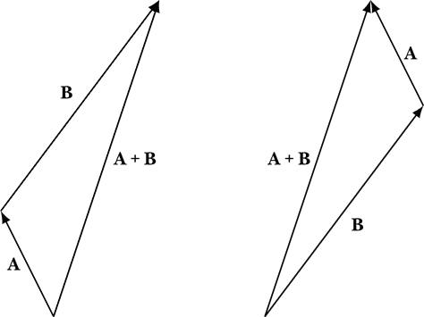

*图 10-1：向量加法。向量**A** + **B**是向量**A**和**B**的和。*

物理学家需要知道一个符号是表示数字还是向量；因此，牛顿力学的理论（以及物理学中的大多数其他理论）促使我们从类型的角度思考。物理学家通常使用的数学符号表示向量是语法性的，通过粗体符号来标识向量。在 Haskell 中，数字和向量之间的区别不是语法上的；它们的名称只是以小写字母开头的标识符。在 Haskell 中，数字和向量之间的区别是语义上的，并通过值的类型来表达：`R`代表数字，`Vec`代表向量。

在数学符号中，我们使用与数字加法相同的+符号表示向量加法，尽管向量和数字是截然不同的事物，将向量与数字相加是没有意义的。在 Haskell 中，我们会为向量加法使用与数字加法不同的符号（`^+^`）。如果`a`和`b`是向量（我们写`a :: Vec`来表示`a`的类型是`Vec`），那么`a ^+^ b`将是它们的向量和。章末我们会展示如何定义`Vec`类型和`^+^`运算符。

注

*在这一章中，我们引入了用于向量加法、减法和标量乘法的新运算符。一种替代的路径是扩展加法（`+`）、减法（`-`）和乘法（`*`）的定义，使其既适用于向量也适用于数字。Haskell 语言完全能够实现这一点。我们没有选择这种方法的原因是，我们更倾向于为向量操作定义简单、具体的类型，而不是涉及类型类的类型。我们为新运算符使用的名称，如`^+^`，借用了 Conal Elliott 的`vector-space`包**[7**]，这是处理向量的一种比我们这里介绍的更复杂、更通用的方法。*

#### 向量缩放的几何定义

我们定义将一个向量缩放为一个数字（也叫做*标量乘法*或将数字乘以向量）如下：如果数字为正，我们将向量的大小乘以该数字，并保持向量的方向不变。如果数字为负，我们将向量的大小乘以该数字的绝对值，并翻转向量的方向。如果数字为 0，结果是零向量。

我们定义将向量**A**除以数字*m*为将向量乘以*m*的倒数，即标量乘法。

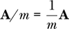

在图 10-2 中，我们展示了按 2、–1 和 –1/2 缩放一个向量的结果。按正数缩放会增加向量的长度，保持方向不变；按负数缩放会增加向量的长度并翻转方向。

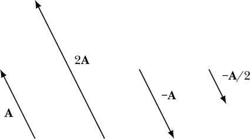

*图 10-2：标量乘法。将**A**按 2、–1 和 –1/2 缩放，分别得到 2**A**、–**A** 和 –**A**/2。*

在数学符号中，我们对于标量乘法使用与数字相乘相同的符号（将一个数字放在向量旁边），尽管这两个操作是不同的。类似地，我们用相同的符号（/）表示将向量除以数字，尽管这两个操作也是不同的。

在 Haskell 中，我们为标量乘法使用与数字乘法不同的符号，为向量除以数字使用与数字除以数字不同的符号。如果 `m` 是一个数字，`a` 是一个向量，那么 `m *^ a` 和 `a ^* m` 都表示将 `a` 按 `m` 缩放。注意，在这两种情况下，插入符号都离向量更近。要将 `a` 除以 `m`，我们写作 `a ^/ m`。

#### 向量相减的几何定义

另一种组合两个向量的方法是我们所称的*向量相减*。两个向量的差定义为当两个向量尾对尾摆放时，从第一个向量的尖端指向第二个向量尖端的向量。图 10-3 显示了两个向量的差等于一个向量与另一个向量的相反数之和。用符号表示，**B** - **A** = **B** + (–**A**)。

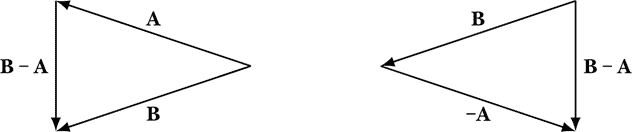

*图 10-3：向量相减。向量**B** - **A**是向量**B**和**A**的差。*

在数学表示中，我们使用相同的符号（–）来表示向量相减，就像我们用相同的符号表示数字相减一样，尽管向量和数字是非常不同的东西。在 Haskell 中，如果 `a` 和 `b` 是向量，我们将定义 `a ^-^ b` 为它们的向量差。

#### 点积的几何定义

在物理学中，向量有（至少）两种重要的积。一个是*点积*，或*内积*。两个向量的点积是一个标量，或数字。以下是它的几何定义：

**A · B** = *AB* cos θ

在这个方程中，*θ* 是当两个向量尾对尾摆放时它们之间的角度，我们使用标准符号，即让斜体符号表示与粗体符号具有相同字母的向量的大小。换句话说，*A* = |**A**| 和 *B* = |**B**|。

图 10-4 显示了两个向量的点积是一个向量的大小（*B* 或 *A*）与第二个向量在第一个向量上的投影（*A* cos *θ* 或 *B cos θ*）的乘积。请注意，当 *θ* > 90^∘ 时，投影将为负。

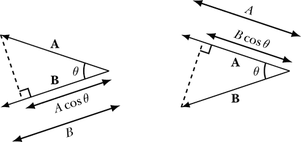

*图 10-4：两个向量的点积是一个向量的大小与第二个向量在第一个向量上的投影的乘积。*

注意，点积是可交换的：**A ⋅B = B ⋅A**。此外，点积与向量的大小有关。

**A · A** = |A|² cos (0) = |**A**|² = *A*²

因此，

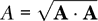

点积对向量和分配。

**C · (A + B) = C · A + C · B**

在 Haskell 中，如果 `a` 和 `b` 是向量，那么 `a <.> b` 将是它们的点积。

#### 叉积的几何定义

两个向量的*叉积*是一个向量，其大小由下式给出

|**A** × **B**| = *AB* sin θ

其方向与向量**A**和**B**都垂直。

图 10-5 展示了包含向量**A**和**B**的平面。为了找到**A** × **B**的方向，想象将向量**A**绕其尾部旋转一个小于 180^∘的角度，直到它与向量**B**对齐。如果需要逆时针旋转来完成这一动作，那么**A** × **B**的方向是指向页面外。如果需要顺时针旋转，则**A** × **B**的方向是指向页面内。

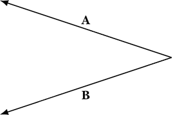

*图 10-5：叉积。向量 ***A**** × ****B*** 指向页面外。向量 **B*** × ****A*** 指向页面内。*

对于图 10-5 中的**A**和**B**，向量**A** × **B**指向页面外，而向量**B** × **A**指向页面内。叉积是反交换的：**A** × **B** = –**B** × **A**。还要注意，任何向量与其自身的叉积为 0。叉积的大小给出了由这两个向量所形成的平行四边形的面积，当加入两个额外的平行边时。

叉积对向量和分配：

**C** × **(A + B)** = **C** × **A** + **C** × **B**

在 Haskell 中，如果`a`和`b`是向量，我们将定义`a >< b`为它们的叉积。（操作符`><`的设计应该像叉积运算符。）

注意

*如果你对数学创新感兴趣，几何积比点积和叉积更为复杂，但它包含了两者的精髓。Chris Doran 和 Anthony Lasenby 所著的书《几何代数物理学入门》**[8**] 是一本很好的入门书。David Hestenes 所著的《时空代数》**[9**] 是另一本很棒的参考书。*

#### 向量值函数的导数

假设**V**是一个函数，它接受一个实数变量（如时间）作为输入，并输出一个向量（如速度）。因为我们可以做向量减法，并且可以将向量除以一个数，所以我们可以定义实数值函数的向量导数。在 Haskell 中，这样的函数类型是`R -> Vec`。

**V**的导数，记作*D**V**、**V**’或 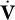，是一个一元函数，定义如下：

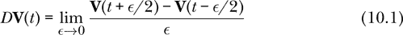

注意到最左边的减号表示向量的减法。我们使用相同的*D*符号来表示向量值函数的导数，就像我们表示数值函数导数时使用的符号一样。

向量导数接受一个一元向量值函数（类型为`R -> Vec`）作为输入，并输出一个一元向量值函数。

```
type VecDerivative = (R -> Vec) -> R -> Vec
```

类型`(R -> Vec) -> R -> Vec`与类型`(R -> Vec) ->` `(R -> Vec)`是相同的。下面是 Haskell 中的向量导数：

```
vecDerivative :: R -> VecDerivative
vecDerivative dt v t = (v (t + dt/2) ^-^ v (t - dt/2)) ^/ dt
```

就像第四章中的`derivative`函数一样，这个数值导数并不取极限，而是使用一个由函数用户提供的小间隔`dt`。

表 10-1 显示了我们介绍的向量运算中，数学符号与 Haskell 符号的对比。

**表 10-1：** 数学符号与 Haskell 符号在向量运算中的比较

| **数学符号** | **Haskell 符号** | **Haskell 类型** |
| --- | --- | --- |
| *t* | `t` | `R` |
| *m* | `m` | `R` |
| **A** | `a` | `Vec` |
| **B** | `b` | `Vec` |
| **V** | `v` | `R -> Vec` |
| **V**(*t*) | `v t` | `Vec` |
| **A** + **B** | `a ^+^ b` | `Vec` |
| *m* **A** | `m *^ a` | `Vec` |
| **A** *m* | `a ^* m` | `Vec` |
| **A**/*m* | `a ^/ m` | `Vec` |
| **A** – **B** | `a ^-^ b` | `Vec` |
| **A** ⋅ **B** | `a <.> b` | `R` |
| **A** × **B** | `a >< b` | `Vec` |
| *D***V** | `vecDerivative 0.01 v` | `R -> Vec` |
| *D***V**(*t*) | `vecDerivative 0.01 v t` | `Vec` |
| 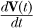 | `vecDerivative 0.01 v t` | `Vec` |

让我们继续，看看当引入坐标系统时，向量会发生什么变化。

### 坐标系统

我们通过选择一个位置和方向来选择坐标系统，这样可以定义三个互相垂直的方向。我们定义 **î** 为一个大小为 1，指向增加的 *x* 方向的向量。大小为 1 的向量也被称为 *单位向量*。带帽的向量是单位向量。图 10-6 显示了一个坐标系统，并标出每个坐标方向的坐标单位向量。


*图 10-6：一个右手坐标系统。z 轴被想象为从页面中突出。*

因为  的大小为 1，我们知道 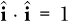。类似地，我们定义  为一个单位向量，指向增加的 *y* 方向，我们定义  为一个单位向量，指向增加的 *z* 方向。它们之所以被称为 、 和 ，可以追溯到威廉·罗恩·汉密尔顿（William Rowan Hamilton）和他的四元数。（可以查找 A Capella Science 的《William Rowan Hamilton》视频，了解这位数学物理学家的精彩音乐传记，配乐是为同名的政治人物写的。）由于  和  是垂直的，我们知道 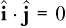。通过类似的推理，我们可以找到所有坐标单位向量的点积。

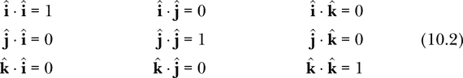

因为任何向量与自身的叉积为 0，所以我们知道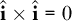。由于坐标系的三个方向是互相垂直的，我们知道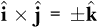。为了消除符号歧义，我们通常同意使用*右手坐标系*，这意味着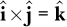。图 10-6 展示了一个右手坐标系。通过类似的推理，我们可以求出所有坐标单位向量的叉积。

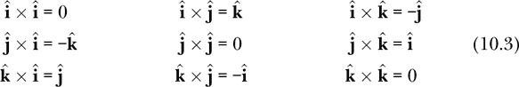

一旦我们有了一个坐标系，并且它所衍生出的坐标单位向量，我们就可以“将一个向量分解为分量”。任何向量**A**都可以表示为、和的*线性组合*。向量的线性组合意味着第一个向量乘以一个数，第二个向量乘以另一个数，依此类推。

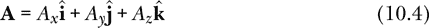

我们称* A[x]*为**A**的*x*分量，对*y*和*z*也如此。*A[x]*、*A[y]*和*A[z]*这三个数字的集合被称为**A**相对于坐标系的*分量*。通过对上面的方程进行点积运算，得到一个关于* A[x]*的表达式，该表达式涉及和**A**。我们可以对*A[y]*和*A[z]*做同样的处理。

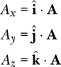

章节末的 Haskell 代码定义了一个默认坐标系，你可以使用它。该默认坐标系提供了坐标单位向量`iHat`、`jHat`和`kHat`，它们分别充当、和的角色。

让我们从几何的角度重新审视上面介绍的向量运算，看看它们在坐标系下是什么样子的。

#### 向量加法与坐标分量

和分量相加一样，和分量的求和就是各分量的求和。如果**C** = **A** + **B**，

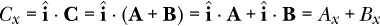

对 y 分量和 z 分量也同样适用。如果**C** = **A** + **B**，那么

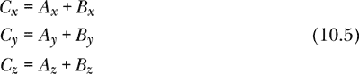

在 Haskell 中，这是

```
*SimpleVec> vec 1 2 3 ^+^ vec 4 5 6
vec 5.0 7.0 9.0
```

你可以将加号两边的插入符号看作是一个提醒，表示左边是向量，右边也是向量。

#### 向量的坐标分量缩放

如果**C** = *m* **A**，那么

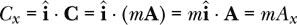

对 y 分量和 z 分量同样适用。如果**C** = *m* **A**，那么

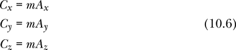

要缩放一个向量，我们可以使用`*^`操作符。

```
*SimpleVec> 5 *^ vec 1 2 3
vec 5.0 10.0 15.0
```

请注意，插入符号位于星号的右边，因为向量位于右侧。你可以使用`^*`操作符将`Vec`左侧的向量与右侧的`R`相乘。

```
*SimpleVec> vec 1 2 3 ^* 5
vec 5.0 10.0 15.0
```

由于向量在左侧，插入符号也在左侧。同样，我们可以使用`^/`操作符除以`R`。

```
*SimpleVec> vec 1 2 3 ^/ 5
vec 0.2 0.4 0.6
```

#### 向量减法与坐标分量

如果**C** = **A** – **B**，那么

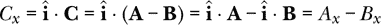

对*y*和*z*分量也同样适用。如果**C** = **A** – **B**，那么

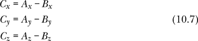

我们说“差的分量是分量的差”。第一次使用“差”一词指的是向量差，而第二次使用则指的是数值差。如果`a`和`b`是向量，那么`xComp (a ^-^ b)`和`xComp a - xComp b`会得到相同的数值。

这是一个向量减法的例子：

```
*SimpleVec> vec 1 2 3 ^-^ vec 4 5 6
vec (-3.0) (-3.0) (-3.0)
```

#### 点积与坐标分量

假设**A**和**B**是向量。给定一个坐标系，我们可以使用方程 10.4 将每个向量表示为分量，然后利用点积的分配律以及方程 10.2 来简化结果。

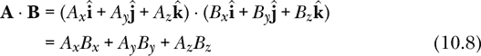

如果我们知道两个向量**A**和**B**的分量，方程 10.8 提供了一种方便的方法来求它们的点积。

你可以使用`<.>`运算符来计算两个`Vec`的点积。

```
*SimpleVec> vec 1 2 3 <.> vec 4 5 6
32.0
```

#### 叉积与坐标分量

假设**A**和**B**是向量。给定一个坐标系，我们可以使用方程 10.4 将每个向量表示为分量，然后利用叉积的分配律和方程 10.3 来简化结果。

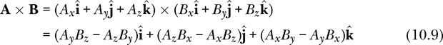

如果我们知道两个向量**A**和**B**的分量，方程 10.9 提供了一种很好的方法来求它们的叉积。

你可以使用`><`运算符来计算两个`Vec`的叉积。

```
*SimpleVec> vec 1 2 3 >< vec 4 5 6
vec (-3.0) 6.0 (-3.0)
```

如果你需要一个向量的分量，可以使用`xComp`函数来获取。

```
*SimpleVec> xComp $ vec 1 2 3 >< vec 4 5 6
-3.0
```

还有函数`yComp`和`zComp`。

一元负号(`-`)不能用于取反一个向量，但你可以使用`negateV`来取反一个向量。

```
*SimpleVec> negateV $ vec 1 2 3 >< vec 4 5 6
vec 3.0 (-6.0) 3.0
```

#### 坐标分量的导数

假设**V**是一个单一实变量的向量值函数。如果**W** = *D***V**，那么

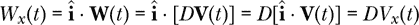

对 y 分量和 z 分量同样适用。如果**W** = *D***V**，那么

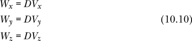

这是一个向量值函数的例子：

```
v1 :: R -> Vec
v1 t = 2 *^ t**2 *^ iHat ^+^ 3 *^ t**3 *^ jHat ^+^ t**4 *^ kHat
```

请注意，我们不能以最直观的方式写出这个向量值函数的 x 分量，即`xComp v1`。这样会产生类型错误，因为`xComp`接受的是`Vec`类型作为输入，而不是一个函数`R -> Vec`。我们真正的意思是，当我们讨论一个向量值函数的 x 分量时，指的是一个标量值函数，它接受一个输入`t`，应用向量值函数并返回 x 分量。在 Haskell 中，向量值函数的 x 分量可以按以下方式写出：

```
xCompFunc :: (R -> Vec) -> R -> R
xCompFunc v t = xComp (v t)
```

用文字表达，方程 10.10 表示导数的 x 分量与 x 分量的导数相同。在 Haskell 中，相同的方程表示向量导数的 x 分量。

```
xCompFunc . vecDerivative dt
```

与（标量）导数的 x 分量相同：

```
derivative dt . xCompFunc
```

我们可以在 GHCi 中检查一个特定的向量值函数在特定自变量值下的计算结果。

```
*SimpleVec>  (xCompFunc . vecDerivative 0.01) v1 3
11.999999999999744
*SimpleVec>  (derivative 0.01 . xCompFunc) v1 3
11.999999999999744
```

我们在第四章中定义了标量导数，这里为了方便再次提及。

```
type Derivative = (R -> R) -> R -> R

derivative :: R -> Derivative
derivative dt x t = (x (t + dt/2) - x (t - dt/2)) / dt
```

表格 10-2 显示了我们正在使用的向量函数和表达式的类型。

**表 10-2：** 用于操作向量的表达式和函数

| **表达式** |  | **类型** |
| --- | --- | --- |
| `zeroV` | `::` | `Vec` |
| `iHat` | `::` | `Vec` |
| `(^+^)` | `::` | `Vec -> Vec -> Vec` |
| `(^-^)` | `::` | `Vec -> Vec -> Vec` |
| `(*^)` | `::` | `R -> Vec -> Vec` |
| `(^*)` | `::` | `Vec -> R -> Vec` |
| `(^/)` | `::` | `Vec -> R -> Vec` |
| `(<.>)` | `::` | `Vec -> Vec -> R` |
| `(><)` | `::` | `Vec -> Vec -> Vec` |
| `negateV` | `::` | `Vec -> Vec` |
| `magnitude` | `::` | `Vec -> R` |
| `xComp` | `::` | `Vec -> R` |
| `vec` | `::` | `R -> R -> R -> Vec` |
| `sumV` | `::` | `[Vec] -> Vec` |

现在我们已经了解了向量在几何和坐标设置中的一些关键性质，接下来我们来看看向量如何用于描述三维空间中的运动学。

### 三维运动学

运动学的基本量是时间、位置、速度和加速度。时间将继续作为实数，就像在第四章中一样。速度和加速度我们现在将作为向量处理，使用在本章末尾定义的`Vec`类型。那么位置呢？

位置实际上并不是向量。将位置相加是没有意义的，也没有意义通过数值来缩放位置。然而，减去位置是有意义的，这会产生从一个位置到另一个位置的位移向量。在第二十二章中，我们将创建一个适合的类型来表示位置，这将允许我们使用笛卡尔坐标系、圆柱坐标系和球坐标系来描述位置。然而，目前我们的目标更为简朴，简单性表明我们应该使用`Vec`类型来表示位置，尽管我们刚才提到了一些不这样做的理由。位移显然是一个向量，因此我们可以将一个向量值的位置视为从默认坐标系原点的位移。

本章我们将使用以下类型同义词：

```
type Time         = R
type PosVec       = Vec
type Velocity     = Vec
type Acceleration = Vec
```

我们使用类型`PosVec`来表示位置的类型，当位置由向量表示时。这将避免我们将其与第二十二章中定义的`Position`类型混淆，后者不是向量。

#### 定义位置、速度和加速度

对于物体的特定运动，我们定义**r**为一个函数，它将每个时间点*t*与物体在该时刻的位置相关联。我们说**r**(*t*)是物体在时间*t*的位置信息。

物体的速度函数是其位置函数的导数。

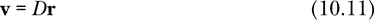

请注意，方程式 10.11 是一个函数等式，左边是瞬时速度函数，右边是位置函数的导数。方程式 10.11 可以用 Haskell 编写为`velFromPos`函数，它接受一个小的时间步长和位置函数，返回一个速度函数。

```
velFromPos :: R                   -- dt
           -> (Time -> PosVec  )  -- position function
           -> (Time -> Velocity)  -- velocity function
velFromPos = vecDerivative
```

从定义中可以看出，`velFromPos`函数就是我们之前在本章定义的向量导数。

当两个函数相等时，它们在相等的输入下给出相等的结果，所以我们也可以写成

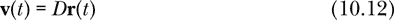

对于任何时间 *t*，右边是函数 *D***r** 在时间 *t* 时的值。我们可以把导数运算符看作是将整个位置函数作为输入，返回速度函数作为输出。也常见使用符号

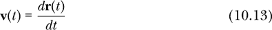

用来定义速度。

*速度* 是速度向量的大小。*加速度* 被定义为速度变化的速率。我们定义 **a** 为一个函数，它与每个时间 *t* 相关联，表示在时间 *t* 时速度变化的速率。在微积分的语言中，我们可以写作

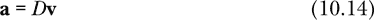

或者

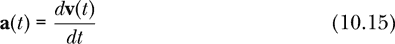

为了定义加速度，方程 10.14 可以通过函数 `accFrom` `Vel` 来编码，该函数根据速度函数生成加速度函数。再说一遍，这个函数只是向量的导数。

```
accFromVel :: R                       -- dt
           -> (Time -> Velocity)      -- velocity function
           -> (Time -> Acceleration)  -- acceleration function
accFromVel = vecDerivative
```

如果速度恰好是常数，比如 **v[0]**，我们可以对方程 10.11 的两边进行积分，得到

**v**[0]*t* = **r**(*t*) – *r*(0)

如果速度是常数，位置是时间的线性函数。

**r**(*t*) = **v**[0]*t* + **r**(0)

这是相应的 Haskell 代码：

```
positionCV :: PosVec -> Velocity -> Time -> PosVec
positionCV r0 v0 t = v0 ^* t ^+^ r0
```

名称末尾的 CV 是常速（constant velocity）的缩写。

如果加速度恰好是常数，比如 **a**[0]，我们可以对方程 10.14 或 10.15 的两边进行积分，得到

**a**[0]*t* = **v**(*t*) – **v**(0)

如果加速度是常数，速度是时间的线性函数。

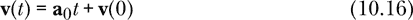

我喜欢把方程 10.16 称为 *恒定加速度下的速度-时间方程*，因为它给出了任何时间 *t* 下物体的速度 **v**(*t*)，前提是我们知道恒定加速度 **a**[0] 和初始速度 **v**(0)。这是方程 10.16 的 Haskell 代码：

```
velocityCA :: Velocity -> Acceleration -> Time -> Velocity
velocityCA v0 a0 t = a0 ^* t ^+^ v0
```

名称末尾的 CA 是恒定加速度（constant acceleration）的缩写。我们可以对方程 10.16 的两边进行积分，得到

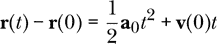

如果加速度是常数，位置是时间的二次函数。

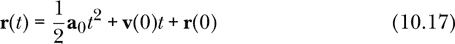

我喜欢把方程 10.17 称为 *恒定加速度下的位置-时间方程*，因为它给出了任何时间 *t* 下物体的位置 **r**(*t*)，前提是我们知道恒定加速度 **a**[0]、初始位置 **r**(0) 和初始速度 **v**(0)。这是方程 10.17 的 Haskell 代码：

```
positionCA :: PosVec -> Velocity -> Acceleration
           -> Time -> PosVec
positionCA r0 v0 a0 t = 0.5 *^ t**2 *^ a0 ^+^ v0 ^* t ^+^ r0
```

方程 10.16 和 10.17 被称为 *恒定加速度方程*。它们在典型的入门物理课程中反复使用。稍后我们将学习一些应对加速度不恒定情况的技巧。

在三维向量空间中引入了速度和加速度的定义后，我们现在可以看看加速度是如何由两个质的不同的分量组成的。

#### 加速度的两个分量

如果物体在任何时刻的速度为 0，物体所具有的任何加速度都用于赋予物体沿加速度方向的速度。另一方面，如果**v**(*t*)≠0，速度和加速度的相对方向决定了物体的定性运动。在日常语言中，人们常用*加速度*来表示速度的增加。然而，在物理学中，加速度是单位时间内速度的变化，速度可以在大小或方向上发生变化。在物理学中，加速度不仅负责速度的增加，还负责速度的减少和方向的变化。

如果**v**(*t*)≠0，我们可以将加速度分解为与速度平行的分量和与速度垂直的分量。

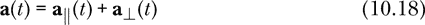

由于**v**(*t*)≠0，我们可以定义一个沿速度方向的单位向量。

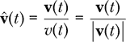

加速度的平行分量和垂直分量由以下方程给出：

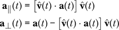

下面是计算加速度平行分量和垂直分量的 Haskell 函数：

```
aParallel :: Vec -> Vec -> Vec
aParallel v a = let vHat = v ^/ magnitude v
                in (vHat <.> a) *^ vHat

aPerp :: Vec -> Vec -> Vec
aPerp v a = a ^-^ aParallel v a
```

平行分量**a**∥也称为加速度的*切向分量*，它负责物体速度的变化。垂直分量**a**⊥也称为*径向*或*横向分量*，它负责物体方向的变化。

速度和加速度的点积取决于它们之间的角度，因此包含有用的信息。我们来对速度平方的时间导数* v*^(*t*)² = **v**(*t*) ⋅**v**(*t*)进行计算：

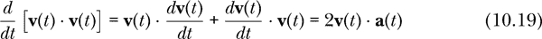

我们可以看到，速度和加速度的点积控制了速度的变化：

| **点积** | **对速度的影响** |
| --- | --- |
| **v**(*t*) ⋅**a**(*t*) > 0 | 速度增加 |
| **v**(*t*) ⋅**a**(*t*) = 0 | 速度保持恒定 |
| **v**(*t*) ⋅**a**(*t*) < 0 | 速度减小 |

本章中，*v*表示速度函数，这与第四章中的不同约定，在第四章中，*v*是一个维度的速度函数。一维速度可以为负，但速度不可以为负。

图 10-7 显示了速度和加速度的相对方向如何控制物体运动的定性行为。

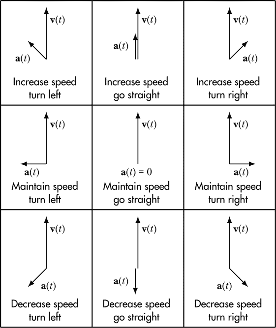

*图 10-7：速度和加速度的相对方向决定了物体的定性运动。*

当加速度在速度方向上有分量时，物体会加速。当加速度在与速度方向相反的方向上有分量时，物体会减速。当加速度只有与速度垂直的分量时，物体保持其速度。为了得出这些结论，不需要使用坐标系统；这种运动定性行为的特点纯粹是几何学的。

我们已经看到了切向加速度分量与加速和减速之间的关系。我们可以做出更强的陈述：速度变化率与切向分量直接相关。

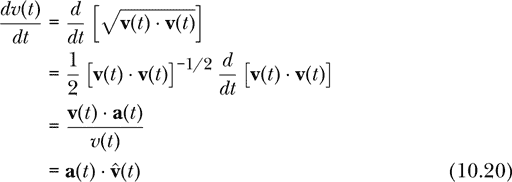

这是一个 Haskell 函数，用于表示速度变化率。给定物体的速度和加速度，该函数返回速度变化的速率，负值表示速度在减小。

```
speedRateChange :: Vec -> Vec -> R
speedRateChange v a = (v <.> a) / magnitude v
```

切向加速度分量的大小等于速度变化率的大小。

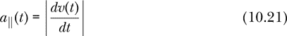

如果存在横向加速度分量，它会导致物体发生转向（换句话说，改变方向）。我们可以计算这个转向运动的曲率半径。图 10-8 展示了一个具有速度*v*（*t*）和横向加速度*a*[⊥]（*t*）的粒子轨迹。在一个小的时间间隔*Δt*内，粒子会沿前进方向移动*v*（*t*）Δ*t*的距离，并在垂直方向上移动*a*[⊥]（*t*）Δ^(*t*²)/2 的距离。

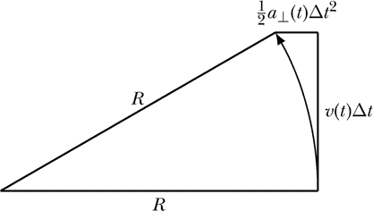

*图 10-8：从横向加速度确定曲率半径*

图 10-8 提供了一种方法，用于根据速度和横向加速度找到曲率半径的表达式。这里我们写出图中直角三角形的勾股定理：

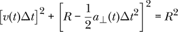

展开此方程并在Δ*t* → 0 时求极限，舍去与Δ*t*⁴成正比的项，我们得到以下曲率半径的方程：

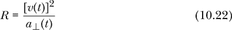

这是一个 Haskell 函数，它根据物体的速度和加速度计算物体运动的（瞬时）曲率半径：

```
radiusOfCurvature :: Vec -> Vec -> R
radiusOfCurvature v a = (v <.> v) / magnitude (aPerp v a)
```

如果我们愿意，可以反转方程式 10.22，从而得到一个以曲率半径*R*为变量的横向加速度表达式。

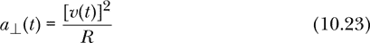

正如从方程式 10.21 和 10.23 中看到的，切向加速度分量控制速度变化，而径向加速度分量控制方向变化。

#### 抛体运动

在物理学中，向量的最初用途之一通常是研究抛体运动。抛体是指任何被抛出、发射或射出的物体，且这些物体通常接近地球表面。问题在于预测物体在投掷、发射或射击力消失后的运动；事实上，我们不再谈论发射力，而是假设发射过程仅仅赋予抛体某个初始速度。

正是地球的重力使得抛体运动变得有趣。物理学提供了四种重力理论，其中三种我们将在本书中讨论：

1.  重力使得靠近地球表面的物体发生加速。一个在地球表面附近被允许自由移动或下落的物体，会以大约 9.81 m/s²的速率加速朝地球中心方向运动。

1.  重力是地球对其表面附近物体产生的一种力。在我们开始学习力学并讨论力、质量和牛顿第二定律的概念后，我们将在第十五章和第十六章中探讨这一重力观念。第十六章中的 Haskell 函数 `earthSurfaceGravity` 描述了这种重力。

1.  重力是任何两个有质量的物体之间的力。这就是牛顿的万有引力定律。我们将在第十六章和第十九章中讨论它，并通过 Haskell 函数 `universalGravity` 来描述它，前提是我们已经介绍了牛顿的第三定律。

1.  重力是时空的弯曲。这是爱因斯坦的广义相对论。我们在本书中不会深入讨论这一点。由 Charles Misner、Kip Thorne 和 John Wheeler 合著的《引力》**[10**] 是广义相对论的优秀入门书籍。Gerald Sussman 和 Jack Wisdom 的《功能微分几何》**[11**] 从计算角度探讨广义相对论，并用函数式编程语言 Scheme 描述它。Rindler **[12**]、Carroll **[13**] 和 Schutz **[14**] 等人对广义相对论的其他介绍也是值得推荐的。

这个列表中的每一个理论都比前一个理论更为复杂。从这个意义上讲，后来的理论比早期的“更为正确”，尽管早期的理论通常更有用，因为它们更简单，更容易应用。尤其是广义相对论，虽然优美且准确，但应用和计算起来相当复杂。

一些物理学家可能不同意将我列出的前两个理论称为“理论”，他们认为它们只是牛顿万有引力定律在简单情况下的近似。至于是否该将前两个称为“理论”，并不是我关注的问题；重要的是，它们是将重力纳入我们计算中的不同方式。

处理抛射物运动的最简单方法，也是我们在本章中采用的方法，是基于理论 1。我们假设抛射物仅因地球的引力而加速；因此，抛射物的加速度由重力加速度 **g** 给出，它是一个指向地球中心的矢量，大小为 9.81 m/s²。

由于重力加速度是恒定的，我们可以使用位置-时间方程式，即方程 10.17，来表示一个抛射物的位置与时间的关系。

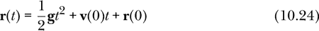

如果 z 轴指向上方，并且我们使用国际单位制，以下函数将返回位置与时间的关系，其中 `r0` 是抛射物的初始位置，`v0` 是初始速度：

```
projectilePos :: PosVec -> Velocity -> Time -> PosVec
projectilePos r0 v0 = positionCA r0 v0 (9.81 *^ negateV kHat)
```

在练习 10.5 中，你需要编写一个函数 `projectileVel`，该函数返回抛射物的速度与时间的关系。

有空气阻力的抛体运动需要理论 2，因为我们将空气阻力和重力视为平等的两种力。抛体运动发生在地球表面附近时，通常不需要理论 3 或 4，这样做只会在大幅增加计算复杂度的情况下，产生微小的结果差异。理论 3 将在后面的章节中应用于其他用途，如卫星运动。

在看到抛体运动作为向量早期应用的例子之后，让我们来探讨一下我们一直在使用的向量数据类型的创建。

### 创建你自己的数据类型

Haskell 拥有一个复杂而灵活的类型系统。使得该类型系统如此强大的语言特性之一，就是能够创建你自己的类型。

在讨论第三章和第五章中的模式匹配时，我们提到每个类型都有一个或多个数据构造器，用于构造该类型的值。在创建我们自己的数据类型时，我们必须提供一个或多个全新的数据构造器，作为构造我们新数据类型的值的方式。

我们首先会看如何通过一个单一数据构造器来创建一个新的数据类型，然后再讲解如何使用多个数据构造器来创建新数据类型。

#### 单一数据构造器

在第四章中，我们使用了`type`关键字来创建类型同义词。在类型同义词中，例如

```
type R = Double
```

编译器将类型`R`和`Double`视为可互换。在第四章中，类型`Time`、`Velocity`、`R`和`Double`都是可互换的。这虽然很方便，但却没有让 Haskell 类型检查器帮助代码编写者避免将`Time`与`Velocity`混淆，或者在需要`Time`的地方使用`Velocity`。

我们使用`data`关键字来定义新的类型，这些类型与任何现有类型不可互换。时间和质量在物理学中都由实数描述，但我们绝不应该在需要时间的方程中提供质量。让我们定义一个新的数据类型`Mass`，它包含一个实数，但不能与`R`或任何其他现有数据类型混淆。

```
data Mass = Mass R
            deriving (Eq,Show)
```

我们使用`data`关键字来定义一个新的数据类型。在`data`关键字后，我们给出新数据类型的名称，在这个例子中是`Mass`，接着是一个等号。在等号右侧，我们给出一个数据构造器，在这个例子中是`Mass`，然后是我们新数据类型包含的信息，这里是`R`。新数据类型的名称和数据构造器的名称可以相同也可以不同。在这个例子中，它们名称相同，但代表的事物不同。在定义单一构造器的数据类型时，通常会使用与类型相同的名称作为数据构造器的名称，但这并不是必须的。

默认情况下，一个新数据类型不是任何类型类的实例。由于通常希望新数据类型成为一些标准类型类的实例，如`Eq`和`Show`，Haskell 提供了一个`deriving`关键字，尝试使新类型成为列出类型类的实例。

要构造一个类型为`Mass`的值，我们使用数据构造器`Mass`。

```
*SimpleVec> Mass 9
Mass 9.0
```

如果我们请求这个值的类型，GHCi 将告诉我们以下内容：

```
*SimpleVec>  :t Mass 9
Mass 9 :: Mass
```

在 GHCi 的响应中，双冒号左边的`Mass`是数据构造器，双冒号右边的`Mass`是数据类型。

数据构造器本身具有函数类型。它接受一个`R`作为输入，并返回一个`Mass`作为输出。

```
*SimpleVec> :t Mass
Mass :: R -> Mass
```

我们请求的是数据构造器的类型，而不是类型的类型，这没有任何意义。同样，双冒号左边的`Mass`是数据构造器，双冒号右边的`Mass`是数据类型。

如果我们现在不小心在需要`R`的地方提供了一个`Mass`，类型检查器将给我们一个类型错误，帮助我们识别错误，而不是默默地执行错误的操作。

我们可以在数据构造器下提供多个信息。在第九章中，我们使用了一个由对组成的列表来保存成绩信息。让我们定义一个新的数据类型`Grade`，它包含一个`String`和一个`Int`，表示一个人的名字和他们在某项任务上的成绩。

```
data Grade = Grade String Int
             deriving (Eq,Show)
```

我们给数据构造器取与类型相同的名字，并简单列出新数据类型中将包含的信息类型。

这是几个人的成绩列表：

```
grades :: [Grade]
grades = [Grade "Albert Einstein" 89
         ,Grade "Isaac Newton"    95
         ,Grade "Alan Turing"    91
         ]
```

要构造一个类型为`Grade`的值，我们使用数据构造器`Grade`，后跟一个`String`和一个`Int`。

如果我们查看数据构造器`Grade`的类型，

```
*SimpleVec> :t Grade
Grade :: String -> Int -> Grade
```

我们看到它接受一个`String`和一个`Int`作为输入，并返回一个`Grade`作为输出。像之前一样，双冒号左边的`Grade`是数据构造器，双冒号右边的`Grade`是数据类型。

定义新数据类型还有一种替代语法，叫做*记录语法*，它为构造器下的每个数据项命名。让我们定义一个新的数据类型`GradeRecord`，它本质上与`Grade`类型相同，但使用记录语法进行定义。

```
data GradeRecord = GradeRecord { name  :: String
                               , grade :: Int
                               } deriving (Eq,Show)
```

要使用记录语法，我们在数据构造器后用大括号括起每个信息的名称和类型。使用记录语法会自动为每个命名的信息创建一个新函数。

```
*SimpleVec> :t name
name :: GradeRecord -> String
*SimpleVec> :t grade
grade :: GradeRecord -> Int
```

函数`name`接受一个`GradeRecord`作为输入，并返回`GradeRecord`中保存的`String`类型的名字。函数`grade`接受一个`GradeRecord`作为输入，并返回`GradeRecord`中保存的`Int`类型的成绩。默认情况下，`name`和`grade`这两个名称会被放入全局命名空间，因此不能在另一个数据类型中重复使用作为字段名。这种默认行为虽然简单，但在某些情况下过于限制，因此可以通过语言选项`DuplicateRecordFields`来覆盖这个默认行为，尽管我们在本书中不会探讨这个选项。

如果我们使用记录语法来定义我们的新数据类型，那么有两种方式可以构造该类型的值。首先，我们可以使用和上面定义`Grade`类型时相同的语法，简单地给出数据构造器，然后跟上一个`String`和一个`Int`。

```
gradeRecords1 :: [GradeRecord]
gradeRecords1 = [GradeRecord "Albert Einstein" 89
                ,GradeRecord "Isaac Newton"    95
                ,GradeRecord "Alan Turing"    91
                ]
```

其次，我们可以使用记录语法来构造`GradeRecord`类型的值。

```
gradeRecords2 :: [GradeRecord]
gradeRecords2 = [GradeRecord {name = "Albert Einstein", grade = 89}
                ,GradeRecord {name = "Isaac Newton"   , grade = 95}
                ,GradeRecord {name = "Alan Turing"    , grade = 91}
                ]
```

在这里，我们使用大括号，并按名称而不是按位置给出数据项。

是否使用记录语法的决定应该基于为新类型中的数据元素提供名称的实用性。如果不需要名称，应该使用基本语法。如果名称看起来很有用，那么使用记录语法是一个不错的选择。

我们已经看到了如何使用单个数据构造器定义新数据类型。现在让我们来看看包含多个数据构造器的数据类型。

#### 多个数据构造器

Prelude 类型`Bool`有两个数据构造器，`False`和`True`，正如我们在对`Bool`进行模式匹配时看到的。没有任何数据构造器包含除构造器本身名称以外的其他信息。

让我们定义一个新的数据类型，叫做`MyBool`，它的工作方式和`Bool`相同。我们需要一个新的名字，因为`Bool`已经在 Prelude 中定义过了。

```
data MyBool = MyFalse | MyTrue
              deriving (Eq,Show)
```

我们像以前一样从`data`关键字开始，接着是我们新数据类型的名称`MyBool`。在等号的右边，我们给出第一个数据构造器，称为`MyFalse`，然后是竖线，再接着是第二个数据构造器`MyTrue`。我们需要为数据构造器取新的名字，因为`False`和`True`已经被占用了。

定义中的竖线可以理解为“或者”，也就是说，`MyBool`类型的值要么是`MyFalse`，要么是`MyTrue`。

定义了新的数据类型`MyBool`后，我们可以查询`MyFalse`的类型。

```
*SimpleVec> :t MyFalse
MyFalse :: MyBool
```

我们并不感到惊讶，发现它的类型是`MyBool`。

当我们有多个数据构造器时，它们通常与数据类型本身有不同的名称。

让我们定义我们自己的`Maybe`版本，叫做`MyMaybe`。回顾第九章，`Maybe`是一个类型构造器，意味着它接受一个类型作为输入，以生成一个新类型。

```
data MyMaybe a = MyNothing
               | MyJust a
               deriving (Eq,Show)
```

类型变量`a`代表任何类型。我们在这个数据类型定义中使用类型变量`a`后缀的`MyMaybe`使得`MyMaybe`成为一个类型构造器，而不是一个类型。这里我们有两个数据构造函数，但与`MyBool`类型不同的是，数据构造函数`MyJust`包含了一些信息，即一个`a`类型的值。`MyMaybe a`类型的值要么是`MyNothing`，要么是`MyJust x`，其中`x :: a`。

我们来看一下数据构造函数的类型。

```
*SimpleVec> :t MyNothing
MyNothing :: MyMaybe a
*SimpleVec> :t MyJust
MyJust :: a -> MyMaybe a
```

为了比较，我们可以查看`Maybe`类型的 Prelude 数据构造函数的类型。

```
*SimpleVec> :t Nothing
Nothing :: Maybe a
*SimpleVec> :t Just
Just :: a -> Maybe a
```

我们看到`Nothing`甚至不是一个函数，它只是`Maybe a`类型的一个值。另一方面，`Just`是一个函数，它接受一个`a`类型的值并返回一个`Maybe a`类型的值。

在第十九章中，当我们讨论粒子系统时，我们将定义一个名为`Force`的新数据类型，它有两个构造函数：一个用于外力，一个用于内力。

既然我们已经讨论了如何定义新的数据类型，现在让我们继续定义我们在本章中使用的`Vec`类型。

### 为三维向量定义一个新的数据类型

Haskell 并没有内建向量类型，因此我们必须自己定义它。在本章的开始，我们看到了物理中如何定义和使用向量。凭借这些知识，我们将讨论如何在 Haskell 中实现三维向量。这个新类型必须存储三个实数，用于表示某坐标系中向量的三个分量，或者等效的东西。我们有几个选择。

#### 可能的实现方式

在做出最终选择之前，让我们考虑一下`Vec`类型的几种可能实现。

##### 选项 1：使用列表

我们可以使用一个实数列表来存储向量的三个分量。这个定义的类型同义词如下所示：

```
type Vec = [R]  -- not our definition
```

这种类型的向量可以存储所有可能的实数三元组。这个定义的问题在于，它的类型也可以存储不是三个元素的实数列表。这个潜在的类型与我们的需求不完全匹配，它有点太大，因为空列表或包含两个实数的列表会被类型检查器视为该类型的合法值。

##### 选项 2：使用元组

一个更好的选择是选择一个实数的三元组。类型同义词如下所示：

```
type Vec = (R,R,R)  -- not our definition
```

这个选项更符合我们的需求，因为这个类型保证必须有三个组件。这个选项唯一的缺点是，三元组可能会引起混淆——它代表的是向量的三个分量，而不是代表其他三个数字的三元组，比如位置的球面坐标。由于选项 2 使用了类型同义词，类型检查器无法帮助我们捕捉到在需要其他三个实数的地方错误使用了我们新的向量类型。

##### 选项 3：创建一个新数据类型

第三种选择是为`Vec`定义一个新的数据类型，该类型与任何其他数据类型不会混淆，即使其他数据类型本质上是由三个实数组成的，像`Vec`一样。我们希望像三维向量这样的物理基本概念能在类型系统中得到体现，这样类型系统就能帮助我们保持事物的清晰，尊重我们对学科的理解。这是我们接下来要追求的选项。

#### `Vec`的数据类型定义

这是我们的数据类型定义：

```
data Vec = Vec { xComp :: R  -- x component
               , yComp :: R  -- y component
               , zComp :: R  -- z component
               } deriving (Eq)
```

我们决定使用相同的名称`Vec`作为我们为该类型使用的数据构造器。我们使用记录语法，因为这会自动为向量的三个分量生成函数`xComp`、`yComp`和`zComp`。我们通过`deriving`关键字请求编译器为新的`Vec`数据类型创建一个`Eq`实例。然而，我们并没有请求自动生成`Show`实例，因为我们希望手动定义它。

接下来，我们将展示如何将类型`Vec`变成类型类`Show`的实例。使类型成为类型类实例的一般方法是使用`instance`关键字。

```
instance Show Vec where
    show (Vec x y z) = "vec " ++ showDouble x ++ " "
                              ++ showDouble y ++ " "
                              ++ showDouble z
```

在`instance`关键字后，我们给出类型类，接着是要成为该类型类实例的类型，然后是`where`关键字，再给出类型类拥有的函数的定义。

从第二行开始，我们定义了类型类拥有的函数，并说明它们在特定类型（在本例中是`Vec`）的情况下应该如何工作。在`Show`的实例中，唯一需要定义的函数是`show`，它描述了如何将`Vec`转换为`String`以便显示。

我们显示一个向量的方式是从字符串`"vec "`开始，接着依次显示三个分量。函数`showDouble`负责将每个实数转换为字符串。

在实例定义中，`show`函数的定义必须相对于`instance`关键字缩进。任何在实例定义中定义的其他函数也必须进行相同程度的缩进。

其实，类型类`Show`还有两个其他函数，分别是`showsPrec`和`showList`，但如果我们不定义它们，它们会自动获得默认定义，正如我们之前所做的那样。在 GHCi 中使用`:i Show`可以列出类型类`Show`拥有的函数，以及哪些函数*必须*在实例定义中定义。

这是之前在函数`show`中使用的函数`showDouble`：

```
showDouble :: R -> String
showDouble x
    | x < 0      = "(" ++ show x ++ ")"
    | otherwise  = show x
```

类型`Double`已经是`Show`的一个实例，如第八章所述，因此`show`函数已经可以将`Double`转换为`String`。我们的`showDouble`函数使用`show`函数，并简单地将负数用括号括起来。将负数成分括在括号中的原因是，这样显示出来的`Vec`的形式是一个合法的表达式，意味着它可以在需要`Vec`的地方作为输入。为了实现像`vec 3.1 (-4.2) 5.0`这样的表达式被接受为`Vec`类型的合法值，我们需要一个`vec`函数。

```
-- Form a vector by giving its x, y, and z components.
vec :: R  -- x component
    -> R  -- y component
    -> R  -- z component
    -> Vec
vec = Vec
```

这个`vec`函数和数据构造函数`Vec`做的事情是一样的。

为什么不直接使用数据构造函数`Vec`来构建和显示我们的向量，从而省去为`Vec`定义`Show`实例和定义`vec`函数的需求呢？这确实是一种可行的做法，而且并不差。之所以没有这样做，主要是因为我想使用记录语法，而通过使用`deriving`关键字自动生成的`Show`实例会使用记录语法来显示向量。这本身没有问题，但当我们处理向量的列表或向量元组的列表时，我们将需要一种简洁的方式来显示向量。

Haskell 传统上倾向于能够显示的东西也能被读取。`Read`类型类用于那些可以从`String`中读取的类型，它作为`Show`类型类的逆操作，后者用于那些可以显示为`String`的类型。这也是为什么`Show`实例看起来就像是将`vec`函数应用于三个分量的原因。

#### Vec 函数

下面是 x、y 和 z 方向的单位向量：

```
iHat :: Vec
iHat = vec 1 0 0

jHat :: Vec
jHat = vec 0 1 0

kHat :: Vec
kHat = vec 0 0 1
```

我们将零向量命名为`zeroV`。

```
zeroV :: Vec
zeroV = vec 0 0 0
```

一元负号在向量前是无法使用的，因此我们定义了一个函数`negateV`，它返回一个向量的加法逆元（即该向量的负向量）。

```
negateV :: Vec -> Vec
negateV (Vec ax ay az) = Vec (-ax) (-ay) (-az)
```

向量的加法和减法只是对应笛卡尔分量的加法和减法。

```
(^+^) :: Vec -> Vec -> Vec
Vec ax ay az ^+^ Vec bx by bz = Vec (ax+bx) (ay+by) (az+bz)

(^-^) :: Vec -> Vec -> Vec
Vec ax ay az ^-^ Vec bx by bz = Vec (ax-bx) (ay-by) (az-bz)
```

拥有一个可以添加整个向量列表的函数会很有用。当我们做向量值函数的数值积分时，将会用到这个函数。

```
sumV :: [Vec] -> Vec
sumV = foldr (^+^) zeroV
```

函数 foldr 在 Prelude 中已定义。`sumV`的定义采用点自由样式，这意味着它是`sumV vs = foldr (^+^)` `zeroV vs`的简写。大致来说，foldr 接受一个二元操作符（这里是`(^+^)`）、一个初始值和一个值的列表，并将初始值与列表中的一个元素“折叠”成一个累积值，接着继续将累积值与下一个元素折叠，直到列表耗尽并返回最终的累积值。它是一个相当强大的函数，但这里的作用仅仅是不断地将列表中的成员相加，直到没有更多元素为止。

有三种方法可以相乘三维向量。第一种是标量乘法，我们将一个数与一个向量相乘，或者一个向量与一个数相乘。我们使用`(*^)`和`(^*)`来表示标量乘法。第一个符号表示左边是数值，右边是向量；第二个符号则表示左边是向量，右边是数值。向量总是紧挨着插入符号。第二种向量乘法方法是点积。我们用`(<.>)`表示点积。第三种向量乘法方法是叉积。我们用`(><)`表示叉积。

这里是三种向量乘法的定义：

```
(*^)  :: R   -> Vec -> Vec
c *^ Vec ax ay az = Vec (c*ax) (c*ay) (c*az)

(^*)  :: Vec -> R   -> Vec
Vec ax ay az ^* c = Vec (c*ax) (c*ay) (c*az)

(<.>) :: Vec -> Vec -> R
Vec ax ay az <.> Vec bx by bz = ax*bx + ay*by + az*bz

(><)  :: Vec -> Vec -> Vec
Vec ax ay az >< Vec bx by bz
    = Vec (ay*bz - az*by) (az*bx - ax*bz) (ax*by - ay*bx)
```

前两个定义是关于标量乘法的。如果向量在数值的右边，我们使用右侧有插入符号的操作符。如果向量在数值的左边，我们使用左侧有插入符号的操作符。在这两种情况下，定义表明标量乘法是通过将每个笛卡尔分量与缩放数相乘来完成的。点积通过方程式 10.8 定义。叉积通过方程式 10.9 定义。

我们还可以将向量除以标量。

```
(^/) :: Vec -> R -> Vec
Vec ax ay az ^/ c = Vec (ax/c) (ay/c) (az/c)
```

最后，我们定义了一个`magnitude`函数来计算向量的大小。

```
magnitude :: Vec -> R
magnitude v = sqrt(v <.> v)
```

这完成了我们为新的数据类型`Vec`定义的数据类型，并附带支持函数，使我们能够以我们对向量的理解和在物理中使用它们的方式来编写代码。

### 总结

本章讨论了三维空间中的运动学。在三维空间中，时间由实数表示，而速度和加速度由向量表示。位置严格来说并不是一个向量，但在本章中，我们简化处理，将位置视为某个优选或默认坐标系统原点到某点的位移向量。

向量本质上是几何实体；为了用数字描述向量的分量，我们必须引入一个坐标系。在任何物体运动的情境中，我们都可以将加速度分解为与速度平行的分量和与速度垂直的分量。这种分解是与坐标系无关的。

有了向量系统，我们现在可以解决我们曾经想做的所有抛物运动问题。我们展示了 Haskell 在定义自定义数据类型方面的便捷性，并利用这一系统实现了三维向量的`Vec`类型。

### 练习

**练习 10.1.** 将以下数学定义翻译为 Haskell 定义：

| (a) 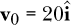 | (在 Haskell 中使用`v0`表示`**v**[0]`。) |
| --- | --- |
| (b)  | (使用`v1`表示`**v**[1]`。) |
| (c)  | (使用`v`表示**v**。) |
| (d)  | (使用`r`表示**r**。) |
| (e)  | (使用`x`表示*x*。) |

v0、v1、v、r 和 x 的 Haskell 类型是什么？

**练习 10.2.** 编写一个积分函数

```
vecIntegral :: R          -- step size dt
            -> (R -> Vec) -- vector-valued function
            -> R          -- lower limit
            -> R          -- upper limit
            -> Vec        -- result
vecIntegral = undefined
```

用于实变量的向量值函数，类似于函数

```
integral :: R -> (R -> R) -> R -> R -> R -- from Chapter 6
```

我们在 第六章 中写过的函数。

**练习 10.3.** 编写一个函数

```
maxHeight :: PosVec -> Velocity -> R
maxHeight = undefined
```

返回投射运动中的最大 z 分量，其中给定了物体的初始位置和初始速度。假设重力作用于负 z 方向。

**练习 10.4.** 编写一个函数

```
speedCA :: Velocity -> Acceleration -> Time -> R
speedCA = undefined
```

给定初始速度和恒定加速度，返回一个给出速度随时间变化的函数。

**练习 10.5.** 按照 `projectilePos` 函数的思路，编写类型签名和函数定义，定义一个计算给定时间投射物速度的函数 `projectileVel`。

**练习 10.6.** 为二维向量定义一个新的类型 `Vec2D`。然后定义函数

```
magAngleFromVec2D :: Vec2D -> (R,R)
magAngleFromVec2D = undefined

vec2DFromMagAngle :: (R,R) -> Vec2D
vec2DFromMagAngle = undefined
```

计算二维向量的大小和角度，并从大小和角度构建一个二维向量。你可能想使用我们在 第一章 中讨论过的 `atan` 或 `atan2` 函数。

**练习 10.7.** 定义一个函数

```
xyProj :: Vec -> Vec
xyProj = undefined
```

计算一个向量在 xy 平面的投影。例如，`xyProj (vec 6 9 7)` 应该计算为 `vec 6 9 0`。

**练习 10.8.** 定义一个函数

```
magAngles :: Vec -> (R,R,R)
magAngles = undefined
```

返回一个三元组 (*v*, *θ*, *ϕ*)，其中 **v** 是一个向量，并且


例如，`magAngles (vec (-1) (-2) (-3))` 应该计算为：

```
(3.7416573867739413,2.5010703409103687,-2.0344439357957027)
```

**练习 10.9.** 从地面发射的一个球的速度和加速度是


其中 **v**[0] 是球的初速度，**g** 是重力加速度。假设一颗球从地面发射，初速度为 25 m/s，角度为 52^∘ 以上水平面。选择一个坐标系并定义一个常量

```
gEarth :: Vec
gEarth = undefined
```

用于地球表面附近的重力加速度。它应该是 9.8 m/s²，指向地球的中心。接着，定义一个函数

```
vBall :: R -> Vec
vBall t = undefined t
```

给出球的速度随时间变化的函数。现在定义一个函数

```
speedRateChangeBall :: R -> R
speedRateChangeBall t = undefined t
```

给出球的速度变化率作为时间的函数。你可能想使用 `speedRateChange` 来处理这个问题。在球的运动过程中，在哪一点速度变化率为零？此时它的速度是零吗？此时它的加速度是零吗？使用 第七章 中的 `plotFunc` 绘制球的速度变化率随时间变化的图形，时间为四秒。

**练习 10.10.** 考虑一个做匀速圆周运动的粒子。如果我们选择坐标系，使得运动发生在 xy 平面内，圆心作为原点，则可以将粒子的位置写为


其中 *R* 是圆的半径，*ω* 是运动的角速度。粒子的速度可以通过对位置关于时间的导数来找到。


粒子的加速度可以通过对速度关于时间的导数来求得。


这个在匀速圆周运动中的粒子有一个速度 *v*[*UCM*] (*t*) = *ωR*，这个速度与时间无关。常数速度就是我们所说的“匀速”。

对于半径 *R* = 2 米，角速度 *ω* = 6 rad/s 的匀速圆周运动，用 Haskell 编码粒子的位移、速度和加速度。使用`aParallel`确认在多个不同的时刻，加速度的切向分量为 0。使用`aPerp`确认在多个不同的时刻，加速度的径向分量的大小为[*v*[UCM] (*t*)]²/*R* = ^(*ω*²)*R*。

**练习 10.11.** 考虑一个在半径 *R* 的圆上做非匀速圆周运动的粒子。如果我们选择坐标系统，使得运动发生在 xy 平面上，圆心为原点，则可以将粒子的位置写作


其中 *θ*(*t*) 描述了粒子与 x 轴的夹角随时间变化的函数。粒子的速度可以通过对位置关于时间的导数来求得。


粒子的加速度可以通过对速度关于时间的导数来求得。


这个在圆周运动中的粒子有一个速度 *v*[NCM] (*t*) = *R* |*Dθ*(*t*)|，这个速度会依赖于时间，除非 *Dθ*(*t*) 是常数。粒子切向加速度的大小是 *R* |^(*D*²)*θ*(*t*)|，其径向加速度的大小是 [*v*[NCM] (*t*)]²/*R* = *R*[*Dθ*(*t*)]²。

编写一个函数

```
rNCM :: (R, R -> R) -> R -> Vec
rNCM (radius, theta) t = undefined radius theta t
```

该函数接受半径 *R*、函数 *θ* 和时间 *t* 作为输入，并返回位置向量作为输出。

本练习的目的是确认即使在非匀速圆周运动中，粒子的加速度径向分量的大小也等于其速度的平方除以圆的半径。以下函数可以求得任何粒子的加速度径向分量，其位置可以表示为时间的函数。它的第一个输入是用于数值求导的小时间间隔。第二个输入是粒子的位置函数，第三个输入是时间。

```
aPerpFromPosition :: R -> (R -> Vec) -> R -> Vec
aPerpFromPosition epsilon r t
    = let v = vecDerivative epsilon r
          a = vecDerivative epsilon v
      in aPerp (v t) (a t)
```

对于半径 *R* = 2 米，并且


使用`aPerpFromPosition`在 *t* = 2 秒时求解加速度的径向分量。然后求粒子在该时刻的速度。最后，证明径向分量的大小等于其速度的平方除以圆的半径。
