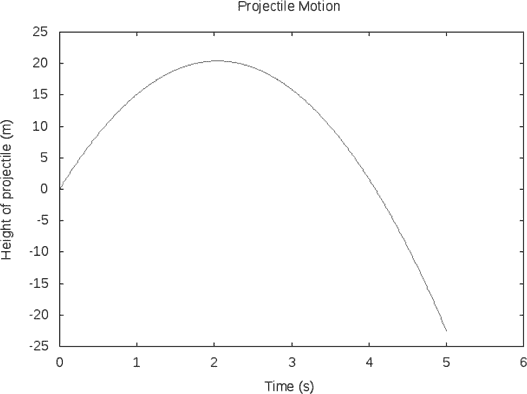
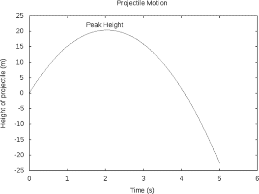
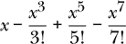

## 11

创建图形


当你为正式报告制作图表时，你希望有标题、轴标签，可能还有其他帮助读者理解你想表达内容的特性。在本章中，我们将展示如何使用 Haskell 创建这样的图表。我们将探讨标题、轴标签和其他标签。我们将学习如何绘制以一对对的形式给出的数据。接着我们将展示如何在同一组坐标轴上绘制多个函数或多个数据集，如何控制轴的范围，以及如何将图表保存为文件，以便导入到其他文档中。

### 标题和轴标签

以下代码生成带有标题和轴标签的图形：

```
{-# OPTIONS_GHC -Wall #-}

import Graphics.Gnuplot.Simple

type R = Double

tRange :: [R]
tRange = [0,0.01..5]

yPos :: R  -- y0
     -> R  -- vy0
     -> R  -- ay
     -> R  -- t
     -> R  -- y
yPos y0 vy0 ay t = y0 + vy0 * t + ay * t**2 / 2

plot1 :: IO ()
plot1 = plotFunc [Title "Projectile Motion"
                 ,XLabel "Time (s)"
                 ,YLabel "Height of projectile (m)"
                 ,PNG "projectile.png"
                 ,Key Nothing
                 ] tRange (yPos 0 20 (-9.8))
```

和上一章一样，我们开启警告，以捕捉任何我们可能没有意识到的糟糕编程。然后我们导入`Graphics.Gnuplot.Simple`模块，它用于生成图形。接下来，我们将`R`设置为`Double`的*类型别名*。这样我们就可以把`Double`看作实数，并用简短的名字`R`来表示它们。然后我们定义一个时间值的列表`tRange`，将在图形中使用，并定义一个表示抛物体高度的函数`yPos`。

最后，我们定义`plot1`来生成一个图形。回顾一下，`plotFunc`的类型是

```
[Attribute] -> [a] -> (a -> a) -> IO ()
```

其中，`a`是某些专门类型类中的一种类型。`Attribute`类型定义在`Graphics.Gnuplot.Simple`模块中。如果你在 GHCi 提示符下输入`:i Attribute`（`:i`是`:info`的缩写），你将看到一些关于如何使用这些`Attribute`的选项。在`plot1`中，我们将五个`Attribute`的列表传递给`plotFunc`。第一个用于创建标题，第二个和第三个用于生成轴标签，第四个指定用于输出的文件名，最后一个请求不要显示图例。

注意`IO ()`（发音为“eye oh unit”）类型的`plot1`。`IO`是一个类型构造子，像`Maybe`一样，但它是一个特殊的类型构造子，旨在表示一种效果，也就是一种非纯粹函数式的计算。效果以某种方式改变了世界（例如，更改硬盘上的文件或在屏幕上显示图片）。

类型`()`，称为*unit*，是一种只包含一个值的类型，这个值也写作`()`，也被称为 unit。一个只有一个值的类型无法传递任何信息，因为值没有选择余地。由于它无法传递任何信息，因此单独使用 unit 类型并不太有用。然而，当与`IO`类型构造子结合使用时，类型`IO ()`代表没有值的效果，这是一个非常有用的类型。

`Key Nothing`的`Attribute`省略了默认包含在图表中的键。由于该键引用的是一个我们不关心的临时文件，通常不包括默认键是没有信息意义的。读者应当被告知，`Graphics.Gnuplot.Simple`模块不仅仅是简单的，它有点“简单粗暴”。特别是，如果通过 Haskell 的`String`传递一个无效的`gnuplot`关键字，结果是完全没有输出，甚至没有错误信息。（例如，如果你想将图例的键从图表顶部移动到底部，`Key (Just ["bottom"])`是有效的，但`Key (Just ["Bottom"])`将没有任何输出，因为`gnuplot`的关键字是区分大小写的。）建议读者查阅`Graphics.Gnuplot.Simple`模块的在线文档以及`gnuplot`程序本身的文档。

如果你将刚才显示的代码加载到 GHCi 并在提示符下输入 plot1，它将生成一个名为*projectile.png*的文件，并保存在硬盘上，你可以将它插入到文档中。图 11-1 展示了它的样子。



*图 11-1：由函数 plot1 生成的图表*

### 其他标签

你可能希望在图表上放置其他标签。以下是你可以做到的方法：

```
plot1Custom :: IO ()
plot1Custom
    = plotFunc [Title "Projectile Motion"
               ,XLabel "Time (s)"
               ,YLabel "Height of projectile (m)"
               ,PNG "CustomLabel.png"
               ,Key Nothing
               ,Custom "label" ["\"Peak Height\" at 1.5,22"]
               ] tRange (yPos 0 20 (-9.8))
```

请注意我们添加的`Custom`属性。引号前的反斜杠是因为我们需要在引号内传递引号。坐标`1.5,22`是我们希望标签出现的图表上的水平和垂直坐标。图 11-2 显示了它的样子。



*图 11-2：由函数 plot1Custom 生成的图表*

包含自定义标签的语法相当繁琐且难以记忆，因此写一个接受更简单参数的新函数是明智的选择。

```
customLabel :: (R,R) -> String -> Attribute
customLabel (x,y) label
     = Custom "label" ["\"" ++ label ++ "\"" ++ " at "
                                ++ show x ++ "," ++ show y]
```

我们向自定义标签函数传递了两项信息：标签位置的坐标和标签的名称。第一项信息的类型是`(R,R)`，第二项的类型是`String`。我们的函数`customLabel`将生成一个`Attribute`，可以包含在`plotFunc`函数的属性列表中。我们使用`show`函数将`R`类型转换为`String`，并使用`++`运算符连接字符串。

在 Haskell 中，我们通过在双引号字符前添加反斜杠来引用它。反斜杠告诉编译器我们是想写双引号字符本身，而不是表示字符串的开始。完成这一操作后，我们可以将双引号字符视为任何其他字符。

```
Prelude>  :t 'c'
'c' :: Char
Prelude>  :t '\"'
'\"' :: Char
Prelude>  :t "c"
"c" :: [Char]
Prelude>  :t "\""
"\"" :: [Char]
```

定义了`customLabel`函数后，我们可以使用以下更简洁的语法来绘制我们的图表：

```
plot2Custom :: IO ()
plot2Custom
    = plotFunc [Title "Projectile Motion"
               ,XLabel "Time (s)"
               ,YLabel "Height of projectile (m)"
               ,Key Nothing
               ,customLabel (1.5,22) "Peak Height"
               ] tRange (yPos 0 20 (-9.8))
```

### 绘制数据

有时我们希望绘制的是 (x, y) 配对的点，而不是函数。我们可以使用 `plotPath` 函数来实现这一点（这个函数也在 `Graphics.Gnuplot.Simple` 包中定义）。让我们看看 `plotPath` 函数的类型，以更好地理解它的用法。

```
Prelude> :m Graphics.Gnuplot.Simple
Prelude Graphics.Gnuplot.Simple> :t plotPath
plotPath
  :: Graphics.Gnuplot.Value.Tuple.C a =>
     [Attribute] -> [(a, a)] -> IO ()
```

在一系列属性之后，`plotPath` 接受一个包含我们要绘制的数据的配对列表。以下代码生成了与 图 11-2 相同的图表，但使用 `plotPath` 而不是 `plotFunc`：

```
plot3Custom :: IO ()
plot3Custom
    = plotPath [Title "Projectile Motion"
               ,XLabel "Time (s)"
               ,YLabel "Height of projectile (m)"
               ,Key Nothing
               ,customLabel (1.5,22) "Peak Height"
               ] [(t, yPos 0 20 (-9.8) t) | t <- tRange]
```

我们使用列表推导式生成了 `plotPath` 所需的配对列表。

### 在一组坐标轴上绘制多条曲线

您可以在同一组坐标轴上绘制多条曲线。这在比较两个具有相同自变量和因变量的函数时特别有用。`Graphics.Gnuplot.Simple` 中的 `plotFuncs` 函数使我们能够绘制一个函数列表。

```
Prelude Graphics.Gnuplot.Simple> :t plotFuncs
plotFuncs
   :: (Graphics.Gnuplot.Value.Atom.C a,
       Graphics.Gnuplot.Value.Tuple.C a) =>
      [Attribute] -> [a] -> [a -> a] -> IO ()
```

请注意，`plotFuncs` 函数将一个函数列表作为其参数之一。我们在 第五章 中承诺过会找到一个使用函数列表的例子，现在我们实现了！以下是如何使用 `plotFuncs` 的示例：

```
xRange :: [R]
xRange = [0,0.02..10]

f3 :: R -> R
f3 x = exp (-x)

usePlotFuncs :: IO ()
usePlotFuncs = plotFuncs [] xRange [cos,sin,f3]
```

两个图表的 x 值范围不必相同。考虑以下示例，它引入了新的函数 `plotPaths`。

```
xs1, xs2 :: [R]
xs1 = [0,0.1..10]
xs2 = [-5,-4.9..5]

xys1, xys2 :: [(R,R)]
xys1 = [(x,cos x) | x <- xs1]
xys2 = [(x,sin x) | x <- xs2]

usePlotPaths :: IO ()
usePlotPaths = plotPaths [] [xys1,xys2]
```

`plotPaths` 函数接受一个包含配对列表的列表，而 `plotPath` 函数则接受一个配对列表。

### 控制图表范围

默认情况下，`gnuplot`（在幕后生成图表的程序）将根据您提供的 x 范围和相应计算的 y 范围来绘制图形。有时，您可能希望更多地控制 x 范围或 y 范围。

重新回到之前三个图表的示例，尝试以下代码：

```
usePlotFuncs' :: IO ()
usePlotFuncs' = plotFuncs [ XRange (-2,8)
                          , YRange (-0.2,1)
                          ] xRange [cos,sin,f3]
```

通过指定 `XRange (-2,8)`，我们生成了一个从 *x* = –2 到 *x* = 8 的图表。由于 `xRange` 范围是从 0 到 10，在 *x* = –2 到 *x* = 0 这一范围内没有计算数据，因此这一区域在图表上是空白的。尽管我们要求计算数据直到 *x* = 10，但它只显示到 *x* = 8。因为我们指定了 `YRange (-0.2,1)`，所以在 *y* = –1 到 *y* = –0.2 之间的余弦和正弦函数值将不会显示。

注意我以一种有趣的风格列出了 [XRange (-2,8), YRange (-0.2,1)]。有些编写 Haskell 代码的人会在列表的第二行首位放置逗号，但你并不一定要这么做。你可以把它全部写在一行里，或者将逗号放在第一行的末尾。这完全是风格问题。

### 制作图例

`gnuplot` 提供的默认图例并不是很有用。它显示的是我们不感兴趣的临时文件名。制作一个漂亮的图例并不是一件简单的事，但它是可以做到的。以下代码给出了一个示例：

```
xRange' :: [R]
xRange' = [-10.0, -9.99 .. 10.0]

sinPath :: [(R,R)]
sinPath = [(x, sin x) | x <- xRange' ]

cosPath :: [(R,R)]
cosPath = [(x, cos x) | x <- xRange' ]

plot4 :: IO ()
plot4 = plotPathsStyle [ Title "Sine and Cosine"
                       , XLabel "x"
                       , YLabel "Function Value"
                       , YRange (-1.2,1.5)
                       ] [ (defaultStyle {lineSpec = CustomStyle
                                          [LineTitle "sin x"]}, sinPath)
                         , (defaultStyle {lineSpec = CustomStyle
                                          [LineTitle "cos x"]}, cosPath) ]
```

这里我们使用 `plotPathsStyle` 函数，它是 `plotPaths` 的扩展版本，允许进行样式上的调整。与 `plotPaths` 需要的列表列表对不同，`plotPathsStyle` 需要一个由配对组成的列表，每个配对包括一个 `PlotStyle` 和一个包含要绘制数据的配对列表。通过这种方式，我们可以为每条曲线提供一个标题，并在图例中显示。

### 总结

在本章中，我们向工具箱中添加了绘图工具。我们学习了如何为图形提供标题、坐标轴标签以及其他标签。我们学习了如何绘制给定为配对列表形式的数据。我们了解了如何在一个坐标轴上绘制多个函数或多个配对列表。我们学习了如何手动控制坐标轴范围，并如何将图形保存为文件，以便导入到其他文档中。在下一章中，我们将学习如何在 Haskell 中创建独立的程序。

### 习题

**习题 11.1.** 绘制从 *x* = –3 到 *x* = 3 的 *y* = *x*² 曲线，并添加标题和坐标轴标签。

**习题 11.2.** 绘制余弦和正弦函数的图形，将它们放在同一坐标轴上，范围从 *x* = 0 到 *x* = 10。

**习题 11.3.** 查看 `plotPath` 的类型签名，并弄清楚如何绘制下面 `txPairs` 列表中的点：

```
ts :: [R]
ts = [0,0.1..6]

txPairs :: [(R,R)]
txPairs = [(t,30 * t - 4.9 * t**2) | t <- ts]
```

制作一个带有标题和坐标轴标签（包括单位）的图表。

**习题 11.4.** 编写一个函数

```
approxsin :: R -> R
approxsin = undefined
```

使用泰勒展开的前四项来逼近正弦函数。



（根据你如何操作，可能会遇到不能将`R`除以`Int`或`Integer`的问题，这在 Haskell 中是常见的。你只能将同一数值类型之间进行除法运算。如果你遇到这个问题，可以使用`fromIntegral`函数将`Int`或`Integer`转换为其他类型，如`R`。）

在 GHCi 中尝试以下命令来测试你的函数：

```
plotFuncs [] [-4,-3.99..4] [sin,approxsin]
```

制作一个漂亮的图表（包括标题、坐标轴标签、标注每条曲线的标签等）。
