# 牛顿第二定律与微分方程


艾萨克·牛顿成就斐然。他为我们留下了众多物理和数学的深刻见解，其中有三条以他名字命名的定律。牛顿的第二定律是这三条定律中最重要的一条；它提供了一种理解物体运动的方法，只要我们知道作用在物体上的力。牛顿的第三定律几乎同样重要；它是关于两个物体如何相互作用的规则。从数学角度来看，牛顿的第一定律是牛顿第二定律的一个推论，因此它看起来是三条定律中最简单的一条。但由于牛顿的第二定律足够颠覆直觉，因此在试图理解它之前，先理解一些更简单的内容是很有帮助的。牛顿的第一定律在这方面非常有效；它提出了一个看似明显错误的大胆主张。

在本章中，我们将讨论牛顿的第一定律，然后将注意力转向牛顿的第二定律，集中于一个线性维度，例如水平线或垂直线。我们将展示如何在逐渐增加复杂性的情境中思考牛顿的第二定律，按力的依赖性进行组织。我们将从常力开始，最简单的情形，然后转向仅依赖于时间的力。接着，我们将讨论依赖于粒子速度的力，然后是同时依赖于时间和速度的力。解决牛顿第二定律的方法会随着所涉及力依赖的物理量不同而变化。我们将介绍求解微分方程的欧拉方法，并探讨在牛顿第二定律是核心原理的多种情境中，这一原理帮助我们理解物体运动。

### 牛顿的第一定律

让我们回到第四章的气轨道。如果你在气轨道上轻推小车，然后松手，它会以恒定的速度行驶，直到碰到轨道的尽头。在我们停止推车后，它会继续以某种速度运动，即使在运动方向上没有施加任何力。这种物体持续运动的倾向被称为*惯性*。惯性的概念在气轨道这一一维空间中是相关的，也同样适用于我们生活的无约束三维空间。这个概念足够重要，以至于它被确立为物理学中的一个原则——*牛顿的第一定律*。以下是三种版本：

**牛顿的第一定律，牛顿的原话 [15]**

*每个物体都保持其静止状态或匀速直线前进状态，除非受到外力的作用迫使其改变状态。*

**牛顿的第一定律，诗意版**

*一个运动中的物体保持运动，一个静止的物体保持静止。*

**牛顿的第一定律，现代版本**

*在没有外力作用的情况下，物体保持相同的速度。*

回想一下，速度是一个向量，所以保持相同的速度意味着保持相同的速度和相同的方向。由于加速度是单位时间内速度的变化，牛顿第一定律的一个等效表述是：在没有外力作用的情况下，物体不会经历加速度。

注意到牛顿的第一定律并未提到*过去*施加的力。关键在于，如果现在没有施加任何力，物体的速度将保持不变。任何时候如果没有力作用，速度都会保持不变。

为什么牛顿的第一定律看起来明显是错误的？因为我们被困在地球表面，这里充满了许多我们可能未曾考虑的力，其中摩擦力和空气阻力尤为重要。在太空中，事情则简单一些。我们可以想象一名宇航员将一个小扳手慢速抛给另一名宇航员。扳手就这样沿着飞船滑行，或许围绕它的中心慢慢旋转。这个扳手就是牛顿第一定律的一个很好的例子。

也许你曾经在车里，当司机猛踩刹车时，书籍、纸张和玩具会飞向前方（相对于车座）。在我们家，我们会通过大喊“牛顿第一定律！”来庆祝这些时刻。从外部（减速中的）车的视角来看，书籍、纸张和玩具正尽力沿直线运动，至少在重力和其他物体阻止它们的直线运动之前，短暂的一段时间内是如此。

牛顿的第一定律告诉我们，物体自然会保持平稳并沿直线运动。然而，实际上它们并不会这样做。牛顿第二定律解释了如何以及为什么。

### 牛顿第二定律在一维中的应用

牛顿的第一定律告诉我们，当没有外力作用时，物体不会加速。牛顿第二定律则宣称加速度是由外力引起的。

**牛顿第二定律，牛顿的原话 [15]**

*运动的变化与施加的动力成正比，并沿着施加力的直线方向发生。*

**牛顿第二定律，诗意版本**

*物体的加速度与作用在物体上的净外力成正比，与物体的质量成反比。*

牛顿第二定律的现代版本通过方程式 14.1 来表示一维的牛顿第二定律，方程式 16.1 来表示三维的牛顿第二定律。在本章的其余部分，我们将讨论牛顿的第二定律在一维中的应用，这样我们可以通过使用数字而非向量来简化速度、加速度和力的表示。在第十六章中，我们将全面讨论牛顿的第二定律，包括向量形式。

为了以定量的方式讨论力和质量，我们需要度量单位。在国际单位制（SI）中，力的单位是牛顿（N）。100N 的力对高尔夫球的作用与对保龄球的作用不同。根据牛顿的理论，每个物体都有一个*质量*，它决定了物体对力的加速度反应能力。相比于暴露于相同力的质量较小的物体，质量较大的物体会经历较小的加速度。质量的国际单位是千克（kg）。

牛顿第二定律表达了以下三者之间的关系：

+   作用在物体上的力

+   物体的质量

+   物体的加速度

牛顿第二定律指出，物体的加速度可以通过将作用在物体上的净力除以物体的质量来求得。作用在物体上的*净力*是作用在物体上的所有力的合力。在一维空间中，某些力可能是负的，某些力可能是正的。

牛顿第二定律通常写作*F*[net] = *ma*。与速度和加速度的一维方程（方程 4.5 和 4.12）不同，这个方程并不是函数的相等式。物体的加速度只是时间的函数，但净力通常依赖于时间、物体的位置和物体的速度。时刻 *t* 的净力是*F*[net] (*t*, *x*(*t*), *v*(*t*)）。更好的方式来写牛顿第二定律是：

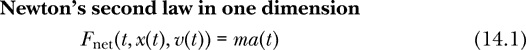

牛顿第二定律存在一个“先有鸡还是先有蛋”的问题。我们从方程 4.5 和 4.12 中知道，*v* = *Dx* 和 *a* = *Dv*。如果我们知道加速度函数* a *（意味着我们知道它在所有时刻的值），我们可以在已知初始速度的情况下求得速度函数。（参见方程 6.1 以及对应的函数 `velFromAcc`。）然后我们可以继续求得位置函数* x *（参见方程 6.5 以及对应的函数 `posFromVel`）。但是，牛顿第二定律告诉我们，加速度依赖于力，而力又依赖于位置和速度。为了找到物体的位置，似乎需要先找到速度，而要找到速度，又需要加速度。然而，加速度又依赖于位置和速度。

这种“先有鸡还是先有蛋”的问题有一个专门的名字。牛顿第二定律是一个*微分方程*的例子。微分方程是未知函数的导数之间的关系，通常未知函数本身被视为零阶导数。在牛顿第二定律的情况下，未知函数通常是位置 *x* 或速度 *v*。速度可以写作位置的第一导数（*v* = *Dx*），加速度可以写作位置的第二导数（*a* = *Dv* = *D*²*x*）。

如果我们将牛顿第二定律写成未知位置函数的形式，它看起来更像一个微分方程。

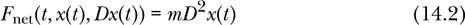

这是一个二阶微分方程，因为它是位置函数*x*、其一阶导数*Dx*和二阶导数*D*²*x*之间的关系。特定物体的关系取决于合力*F*[net]，而合力又依赖于作用在物体上的力的性质。

在简单的情况下，物体上的合力可能不依赖于时间、位置和速度，而只依赖于这些物理量中的零个、一个或两个。在这些简单的情况下，牛顿第二定律可能表现为比二阶微分方程更简单的形式。表 14-1 按力所依赖的物理量列出了各种情况，并给出了求解牛顿第二定律所需的数学技巧。

**表 14-1：** 基于力依赖的物理量的牛顿第二定律求解技巧

| **力只依赖于** | **解决技巧** |
| --- | --- |
| 无 | 代数 |
| 时间 | 积分 |
| 速度 | 一阶微分方程 |
| 时间和速度 | 一阶微分方程 |
| 时间、位置和速度 | 二阶微分方程 |

一个不依赖任何因素的合力是一个恒定的合力。它的大小在时间、位置或速度的变化下保持不变。在接下来的几节中，我们将讨论恒定力、只依赖于时间的力、只依赖于速度的力以及依赖于时间和速度的力。这种限制使我们能够在本章中将注意力集中在一阶微分方程上。在第十五章中，我们将研究更一般的情况，即合力可以依赖于时间、位置、*以及*速度的一维运动。

### 恒定力下的第二定律

牛顿第二定律的最简单情况是当合力是恒定的，与时间、位置和速度无关。大多数入门物理课程中的问题都属于这种情况，因为它们可以在没有微分方程和计算机的情况下解决。

我们来考虑一个常力的例子问题。

**例 14.1** 假设我们有一辆质量为 0.1 千克的车，在气轨上。车初速度为 0.6 米/秒，向东运动。从时间*t* = 0 开始，我们对这辆车施加一个向东的恒定力 0.04 N。与此同时，我们的朋友对同一辆车施加一个向西的恒定力 0.08 N。那么，这辆车接下来的运动将是什么样的？特别是，车的速度和位置将如何随时间变化？

图 14-1 展示了示意图。

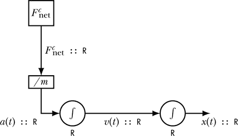

*图 14-1：带有恒定力的牛顿第二定律示意图*

恒定的净力 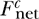（上标 *c* 表示常数）作用于物体，必须除以物体的质量，才能得到物体的加速度。由于净力是常数，加速度也为常数。

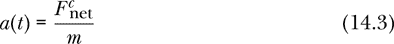

我们写 *a*(*t*) 而不是 *a* 来表示加速度，并不是因为加速度随时间变化，而是因为 *a* 是加速度函数（类型为 `R -> R`），而 *a*(*t*) 是加速度（类型为 `R`）。我们随后对加速度进行积分，以得到速度。

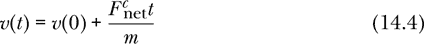

产生速度的积分器包含一个实数（类型为 `R`）作为状态。这个类型在 图 14-1 中的积分器下方显示。这个积分器记住当前的速度，以便可以使用加速度来更新它。

然后我们对速度进行积分，以获得位置。


图中的电线表示随时间持续变化的量。图中的每根电线都有一个名称和类型。在这个图中，所有的电线类型都是实数。

矩形框表示纯粹的函数常量和函数。换句话说，它们是没有任何状态的常量和函数，因此输出仅取决于输入。圆形积分器包含必须与输入结合以产生输出的状态。积分器标注有其包含的状态类型，这与积分器的输出类型相同。

在我们编写 Haskell 代码以解决牛顿第二定律在恒定力作用下的问题之前，我们将编写几行代码，这些代码需要放在我们在本章中构建的源代码文件的顶部。第一行打开警告，我建议开启，因为编译器会警告你一些合法但足够不常见的情况，可能不是你想要的。第二行为本章中的代码指定模块名为 `Newton2`。如果我们想在后续章节中使用这里编写的函数，我们将通过模块名引用当前代码。模块名是可选的，但如果使用，必须与文件名匹配；在这种情况下，文件名应为 *Newton2.hs*。第三行加载 `gnuplot` 图形库，以便我们能够绘制图形。像这样的导入必须在任何函数定义或类型签名之前发生。

```
{-# OPTIONS -Wall #-}

module Newton2 where

import Graphics.Gnuplot.Simple
```

示例 14.1 是牛顿第二定律应用的典型情况。给定一个质量、初始速度和一些力，我们需要求出速度随时间的变化。在 Haskell 语言中，解决此问题的方案将是一个（高阶）函数 `velocityCF`（`CF` 代表恒定力），其类型如下：

```
velocityCF :: Mass
           -> Velocity          -- initial velocity
           -> [Force]           -- list of forces
           -> Time -> Velocity  -- velocity function
```

回想一下，解读这个类型签名有（至少）两种方式。一种解读是，`velocityCF`接受四个输入——质量、初始速度、一个力的列表和时间——并输出一个表示速度的实数。另一种解读是，`velocityCF`接受三个输入——质量、初始速度和一个力的列表——并输出一个关于速度如何随时间变化的*函数*。如果我们想强调后者的观点，我们可以这样写：

```
velocityCF :: Mass -> Velocity -> [Force] -> (Time -> Velocity)
```

但它与原始类型签名的含义是一样的。

我们使用了类型`Time`、`Mass`、`Velocity`和`Force`。这些在 Haskell 中不是内建类型，因此我们最好定义它们的含义。在一维力学中，所有这些量都可以用实数表示，因此我们可以写一些类型别名来定义这些类型。使用一个类型别名，其中`R`代表`Double`，

```
type R = Double
```

我们可以为所有其他类型写类型别名：

```
type Mass     = R
type Time     = R
type Position = R
type Velocity = R
type Force    = R
```

类型`Mass`、`Time`等的定义不必出现在它们在类型签名中的使用之前。Haskell 允许在使用前或使用后定义常量、函数和类型。

如果我们能写出一个类型签名如上的函数`velocityCF`，那么我们不仅解决了例子 14.1 的问题，还解决了所有类似的问题。我们写这样一个函数的策略是：

+   通过加总所有的力来求得合力

+   使用牛顿第二定律（方程 14.3）求加速度

+   通过加速度求得速度（方程 4.14 或 14.4）

下面是`velocityCF`的定义，它表达了这三步操作，并具有我们之前声明的类型。

```
velocityCF m v0 fs
    = let fNet = sum fs       -- net force
          a0   = fNet / m     -- Newton's second law
          v t  = v0 + a0 * t  -- constant acceleration eqn
      in v
```

为了编写`velocityCF`函数，我们首先命名三个输入：质量`m`、初始速度`v0`和力的列表`fs`。然后，我们使用`let`结构定义三个局部名称，分别代表合力、加速度和速度。为了求合力，我们使用内建的`sum`函数将列表中的所有力相加。为了求加速度，我们将物体的合力除以物体的质量，正如牛顿第二定律所规定的那样。

`let`结构中的第三个方程定义了一个局部函数`v`来表示速度函数。我们使用方程 4.14，这是在标准入门物理教材中引入的常数加速度方程，但我们完全可以用方程 14.4 代替`let`结构的第二行和第三行。请注意，我们已经使用了之前提到的“三输入思维”来写`velocityCF`的定义。练习 14.1 要求你使用四输入思维重写这个函数。

我们可以编写一个函数`positionCF`，给定质量、初始位置、初始速度和常力列表，生成一个位置函数。

```
positionCF :: Mass
           -> Position          -- initial position
           -> Velocity          -- initial velocity
           -> [Force]           -- list of forces
           -> Time -> Position  -- position function
positionCF m x0 v0 fs
    = let fNet = sum fs
          a0   = fNet / m
          x t  = x0 + v0 * t + a0*t**2 / 2
      in x
```

这里，我们使用了方程 4.15 或 14.5。回到例子 14.1，汽车的速度作为时间的函数是

```
velocityCF 0.1 0.6 [0.04, -0.08]
```

因为 0.1 kg 是汽车的质量，0.6 m/s 是其初速度，方括号中的列表包含了以牛顿为单位的力。我们可以在 GHCi 中查询这个函数的类型，也可以查询特定时间点的速度值。

```
Prelude>  :l Newton2
[1 of 1] Compiling Newton2         ( Newton2.hs, interpreted )
Ok, one module loaded.
*Newton2>  :t velocityCF 0.1 0.6 [0.04, -0.08]
velocityCF 0.1 0.6 [0.04, -0.08] :: Time -> Velocity
*Newton2> velocityCF 0.1 0.6 [0.04, -0.08] 0
0.6
*Newton2> velocityCF 0.1 0.6 [0.04, -0.08] 1
0.2
```

由于我们已经有了速度函数，我们可以绘制它的图形。首先让我们写出绘制图形的代码。下面的大部分代码用于设置标题、坐标轴标签和我们希望生成的文件名。最有趣的部分在最后，我们给出了在特定时间点评估函数的时间列表，以及函数本身。

```
carGraph :: IO ()
carGraph
    = plotFunc [Title "Car on an air track"
               ,XLabel "Time (s)"
               ,YLabel "Velocity of Car (m/s)"
               ,PNG "CarVelocity.png"
               ,Key Nothing
               ] [0..4 :: Time] (velocityCF 0.1 0.6 [0.04, -0.08])
```

这段代码生成了图 14-2 中的图形。

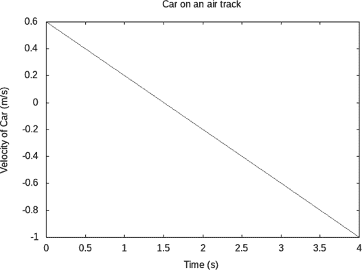

*图 14-2：示例 14.1 中汽车速度随时间的变化*

如果你在 GHCi 中加载本章的模块`Newton2`并输入`carGraph`，

```
*Newton2> carGraph
```

你不会得到任何返回值，但该函数会在你的硬盘上生成一个名为*CarVelocity.png*的可移植网络图形（PNG）文件。如果没有`PNG "CarVelocity.png"`选项，`carGraph`函数会在屏幕上生成一个图形。

请注意，图表中图 14-2 的负加速度（存在于从*t* = 0 到*t* = 4 秒的整个时间间隔内）并不意味着汽车一直在减速。相反，负加速度意味着加速度指向西方。汽车在前 1.5 秒内向东行驶时减速，但随后开始向西行驶时加速。当物体的加速度和速度方向一致时，物体加速；当物体的加速度和速度方向相反时，物体减速。

使用函数`velocityCF`和`positionCF`，我们有了处理任何牛顿第二定律问题的通用方法，适用于一维空间中具有恒定力的情况。接下来我们将考虑随时间变化的力。

### 仅依赖于时间的力的第二定律

牛顿第二定律的下一个情况是当净力仅依赖于时间，而不依赖于位置或速度时。图 14-3 显示了牛顿第二定律的示意图，力仅依赖于时间。


*图 14-3：牛顿第二定律示意图，力仅依赖于时间*

常数 1 被输入到积分器中，生成时间值。（时间以每秒 1 秒的速率变化。）如往常一样，电线标有名称和类型。积分器标注了它们所持有的状态类型。时间输入到净力函数中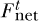（上标*t*表示时间相关），该函数输出净力。为了得到物体的加速度，我们需要将作用在物体上的净力除以物体的质量。

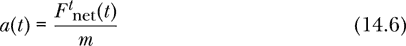

我们然后对加速度进行积分，以得到速度，

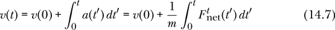

我们然后对速度进行积分，以得到位置：

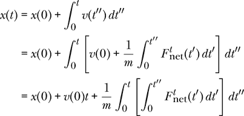

图中的电线表示随时间连续变化的量。矩形框表示纯函数，而圆形元素包含状态。

为了解决依赖于时间的力问题，我们希望得到一个更高阶的函数，产生一个速度函数，类似于上一节中的 `velocityCF`。一个区别是，我们现在需要提供一个力 *函数* 的列表，而不是一个数值力的列表。我们希望得到一个函数 `velocityFt`（`Ft` 后缀表示力仅依赖于时间），其类型签名如下：

```
velocityFt :: Mass -> Velocity -> [Time -> Force] -> Time -> Velocity
```

给定我们物体的质量、初始速度和一个力函数列表，我们希望得到一个速度函数。

因为我们将进行数值积分来得到速度函数，所以我们会在这个类型签名中增加一个额外的参数，即数值积分的时间步长。因此，我们得到了 `velocityFt` 的以下定义：

```
velocityFt :: R                 -- dt for integral
           -> Mass
           -> Velocity          -- initial velocity
           -> [Time -> Force]   -- list of force functions
           -> Time -> Velocity  -- velocity function
velocityFt dt m v0 fs
    = let fNet t = sum [f t | f <- fs]
          a t = fNet t / m
      in antiDerivative dt v0 a
```

在这个定义中，我们首先命名输入：`dt` 代表积分时间步长，`m` 代表我们关注的物体的质量，`v0` 代表该物体的初始速度，`fs` 代表一个力函数列表。请注意，`fs` 这个局部变量在处理常力情况时，作为 `velocityCF` 和 `positionCF` 中使用时，其类型为 `[Force]`（或 `[R]`），但在处理依赖于时间的力时，其类型现在变为 `[Time -> Force]`（或 `[R -> R]`）。

我们再次使用 `let` 结构来定义局部函数，一个是净力函数，一个是加速度函数。净力函数将 `fs` 列表中的所有力加在一起。我们可能希望能够像在 `velocityCF` 中那样使用相同的一行代码，即 `fNet = sum fs` 来求和力。毕竟，`fs` 仍然是一个列表。问题是 `sum` 仅适用于 `Num` 的实例类型，如你查看 `sum` 的类型所见。因此，它很乐意对数字（类型 `R`）进行求和，但对函数（类型 `R -> R`）则不行。幸运的是，我们可以在 `fNet` 的参数中引入时间 `t`，对力函数进行评估，并将得到的数字加在一起。

加速度函数来源于牛顿第二定律。在这里，我们可能希望通过将净力函数除以质量来获得加速度函数，或许写成 `a = fNet / m`。但是回想一下，除法运算符要求两个值的类型相同，并且该类型是 `Fractional` 的实例。除法运算符不愿意与函数一起使用。我们通过对加速度函数 `a` 的时间参数 `t` 传入，来解决这个问题，再次评估 `fNet` 函数。

最后，速度来自对加速度函数的反导数。我们在第六章中定义了 `antiDerivative` 和 `integral` 函数，但我们将在这里重复它们的定义：

```
antiDerivative :: R -> R -> (R -> R) -> (R -> R)
antiDerivative dt v0 a t = v0 + integral dt a 0 t

integral :: R -> (R -> R) -> R -> R -> R
integral dt f a b
    = sum [f t * dt | t <- [a+dt/2, a+3*dt/2 .. b - dt/2]]
```

注意，`velocityFt dt m v0 fs` 的类型是 `R -> R`，它是一个描述物体质量为 `m`、初速度为 `v0`，并且受力函数列表为 `fs` 的速度函数。这个速度函数是力学问题解的一部分。解的另一个部分是位置函数。我们可以写一个 `positionFt` 函数，通过给定质量、初始位置、初速度和力函数列表，生成位置函数。

```
positionFt :: R                 -- dt for integral
           -> Mass
           -> Position          -- initial position
           -> Velocity          -- initial velocity
           -> [Time -> Force]   -- list of force functions
           -> Time -> Position  -- position function
positionFt dt m x0 v0 fs
     = antiDerivative dt x0 (velocityFt dt m v0 fs)
```

这个函数通过对速度函数取反导数来工作，我们通过 `velocityFt` 找到这个速度函数。

作为求解牛顿第二定律的一个示例，考虑一个骑自行车的孩子。通过踩踏板，孩子使地面在 10 秒内对自行车施加一个 10 N 的恒定前向力，然后孩子滑行 10 秒。滑行结束后，孩子会恢复 10 N 的力，再持续 10 秒，如 图 14-4 所示。

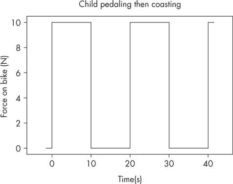

*图 14-4：儿童骑车时力与时间的关系*

在这个示例中，我们假设空气阻力不重要，并且自行车上只有一个力。

这是踩踏和滑行的时间相关力的方程：

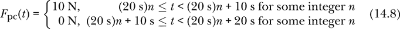

力的大小要么是 0 N，要么是 10 N，具体取决于时间在 20 秒周期中的位置。如果时间处于周期的前 10 秒，力是 10 N；如果时间处于周期的后 10 秒，力是 0 N。

下面是 Haskell 中方程 14.8 的时间相关力：

```
pedalCoast :: Time -> Force
pedalCoast t
    = let tCycle = 20
          nComplete :: Int
          nComplete = truncate (t / tCycle)
          remainder = t - fromIntegral nComplete * tCycle
      in if remainder < 10
         then 10
         else 0
```

局部变量 `tCycle` 是一个完整周期的秒数。变量 `nComplete` 使用 Prelude 函数 `truncate` 计算从时间 `t` 开始的完整周期数。`truncate` 函数会生成一个类型为 `Integral` 的类型类（回忆一下，`Integer` 和 `Int` 都是 `Integral` 的实例）。我们提供了一个局部类型签名，表示我们希望 `nComplete` 的类型为 `Int`。这个局部类型签名是可选的，但如果不指定类型，编译器会给我们一个默认类型的警告。去掉局部类型签名看看警告是什么样子的。这只是一个轻微的警告。如果编译器选择 `Integer` 而不是 `Int`，我们也不介意。你可以选择忽略这个警告，并在没有类型签名的情况下使用代码。

`remainder` 是自最近一个周期开始以来经过的秒数，范围在 0 到 20 之间。我们希望 `remainder` 是一个实数，因此必须使用 `fromIntegral` 将 `nComplete :: Int` 转换为实数。

图 14-5 显示了儿童的位置与时间的关系。

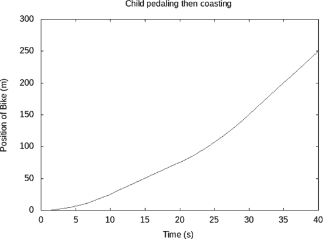

*图 14-5：儿童骑车时位置与时间的关系*

下面是生成 图 14-5 的 Haskell 代码：

```
childGraph :: IO ()
childGraph
    = plotFunc [Title "Child pedaling then coasting"
               ,XLabel "Time (s)"
               ,YLabel "Position of Bike (m)"
               ,PNG "ChildPosition.png"
               ,Key Nothing
               ] [0..40 :: R] (positionFt 0.1 20 0 0 [pedalCoast])
```

代码中最有趣的部分是最后一行，在这里我们指定了要绘制的函数。这个函数`positionFt 0.1 20 0 0 [pedalCoast]`使用了我们在本章早些时候开发的`positionFt`函数，时间步长为 0.1 秒，质量为 20 千克，初始位置和初始速度均为 0 秒，力的列表中仅包括踩踏和滑行的力量。所有相关的物理信息都包含在我们绘制的函数的“名称”中。

从图 14-5 中的图表可以看出，在前 10 秒内，孩子的位置曲线呈抛物线形状，这符合恒定加速度的预期。从 10 秒到 20 秒，位置曲线表现为恒定速度，这时孩子正在滑行。从 20 秒到 30 秒，再次出现加速阶段，位置曲线呈抛物线形状，随后是第二次滑行阶段。

通过`velocityFt`和`positionFt`这两个函数，我们可以在一维空间中求解任何牛顿第二定律类型问题，且这些问题的力仅依赖于时间。现在，我们准备研究依赖于速度的力，其中最常见的就是空气阻力。

### 空气阻力

在本节中，我们将短暂偏离原来的思路，考虑牛顿第二定律在时间、速度、两者或都不依赖的力的作用下，推导出空气阻力在一维运动中的作用力表达式。空气阻力是一个仅依赖于速度的力，在接下来的几个章节中，我们将使用它来发展求解牛顿第二定律的方式，这些方式涉及到依赖于速度的力。

物理入门课程通常忽略空气阻力，或者仅轻微处理它，因为空气阻力的存在使得牛顿第二定律转变为微分方程，这被认为超出了入门物理课程的范围。在本章及下章中，我们将开发求解微分方程的数值方法，这意味着空气阻力不是我们想要避免的东西；事实上，它展示了我们工具的强大能力。

为了建立空气阻力的模型，我们可以将物体与周围空气的相互作用看作一次碰撞。假设物体以速度*v*运动。在本节中，*v*代表物体的实数值一维速度（类型为`R`），而不是速度函数或速率。

设物体的横截面积为*A*，空气密度为*ρ*。我们分析物体在一个小时间间隔*dt*内的运动。我们假设空气的初始速度为 0，空气的最终速度为*v*（换句话说，碰撞后空气与物体以相同速度移动）。

物体在时间*dt*内移动的距离是*v dt*。物体在时间*dt*内扫过的空气体积是*Av dt*。物体在时间*dt*内扰动的空气质量是*ρAv dt*。物体在时间*dt*内传递给空气的动量是空气质量*ρAv dt*与空气速度变化*v*的乘积，假设空气从静止开始，并在短时间内以速度*v*结束。传递给空气的动量是*ρAv*²*dt*。空气受到的力是单位时间内动量变化，即*ρAv*²。根据牛顿第三定律，物体受到的来自空气的力与此相等且方向相反，我们将在第十九章讨论这个问题。

我们的推导实际上相当近似，因为我们并不知道空气分子是否最终以速度*v*结束，而且我们也没有尝试考虑空气分子之间的相互作用力，尤其是空气压缩时的力。然而，我们的结果形式是相当有用且近似正确的。不过，不同形状的物体响应略有不同，因此引入*阻力系数 C*来考虑这些差异是有用的。阻力系数是一个无量纲常数，是物体飞行时穿越空气的一个特性。通常还会包括 1/2 的因子，使得物体所受的空气阻力的大小为*CρA v*²/2\。这个表达式从不为负。我们更希望有一个表达式，当速度为正时力为负，速度为负时力为正。我们得到的空气阻力一维力的最终表达式是

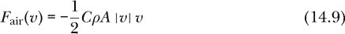

其中，负号和绝对值确保力的方向与速度相反。空气阻力作用于减速物体。在 Haskell 中，我们将空气阻力的方程 14.9 写作如下：

```
fAir :: R  -- drag coefficient
     -> R  -- air density
     -> R  -- cross-sectional area of object
     -> Velocity
     -> Force
fAir drag rho area v = -drag * rho * area * abs v * v / 2
```

在方程 14.9 的数学表示中，我们将*F*[air]视为一个单变量的函数。参数*C*、*ρ*和*A*并没有显式列出，作为*F*[air]依赖的变量。像这样省略参数是物理学中的标准做法，但从某种意义上讲，这也是一种符号滥用。在 Haskell 符号中，我们必须包括空气阻力所依赖的所有变量。我们首先列出这三个参数，再列出`Velocity`，这样表达式`fAir 1 1.225 0.6`就是一个完全合法的函数，只接受速度作为输入。函数`fAir 1 1.225 0.6`已经选择了阻力=1，密度=1.225，面积=0.6。

通过这次简要的空气阻力探讨，尤其是方程 14.9 的发展，我们现在准备好探讨牛顿第二定律，考虑物体上的力仅依赖于其速度的情况。

### 只依赖于速度的力的第二定律

牛顿第二定律的下一个情况是净力依赖于速度，而不依赖于时间或位置。我们在这里的真正意思是力并不*显式地*依赖于时间。速度是一个依赖于时间的函数，而力在本节中可以依赖于速度，因此某种意义上力依赖于时间。本节的约束是力只能通过速度来依赖时间。

力函数可能只依赖于一个变量，即速度。我们使用 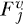 来表示一个变量的 *j* 号力函数，它在给定速度时提供力；我们使用 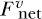 来表示一个变量的函数，它在给定速度时提供净力。

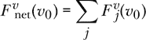

在本节中，我们使用 *v*[0] 作为速度的局部变量（类型 `R`），而不是 *v*，因为我们希望 *v* 代表物体的速度函数（类型 `R -> R`）。

图 14-6 展示了一个牛顿第二定律的示意图，其中力仅依赖于速度。

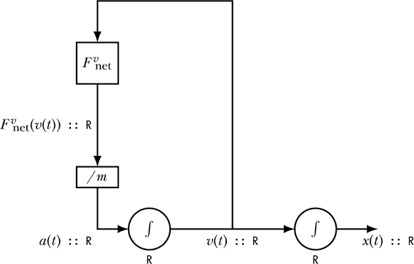

*图 14-6：牛顿第二定律与仅依赖于速度的力*

该图与之前的图不同，包含了一个闭环。由加速度积分器产生的速度作为净力函数的输入。图中的闭环表明，牛顿第二定律产生了一个微分方程。由于闭环包含一个积分器，我们得到了一个一阶微分方程。微分方程比单纯的积分或反导数更难求解，正如当力只依赖于时间时的情况。

牛顿第二定律由以下方程给出：

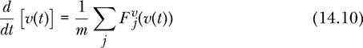

该方程所表示的信息与图 14-6 的示意图中的信息相同。该方程描述了速度的变化率如何通过作用在物体上的力依赖于速度本身。接下来的 `newtonSecondV` 函数是表达牛顿第二定律的第三种方式；当给定当前的速度值和作用于物体的力时，该函数返回速度的变化率。

```
newtonSecondV :: Mass
              -> [Velocity -> Force]  -- list of force functions
              -> Velocity             -- current velocity
              -> R                    -- derivative of velocity
newtonSecondV m fs v0 = sum [f v0 | f <- fs] / m
```

我们可以对加速度进行积分以获得速度。

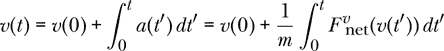

与时间依赖力的情况不同，在这里我们不能简单地进行积分，因为我们试图找到的速度函数出现在积分下方。该如何进行呢？

为了解这个微分方程（方程 14.10），我们将对时间进行离散化，这实际上就是我们在选择时间步长时，所做的数值导数和积分处理。只要我们的时间步长*Δt*小于所处理问题中的任何重要时间尺度，连接点(*t*, *v*(*t*))和(*t* + Δ*t*, *v*(*t* + *Δt*))的直线的斜率就大致等于时间*t*时速度的导数。

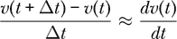

重新排列这个方程式可以得到求解一阶微分方程的*欧拉方法*。

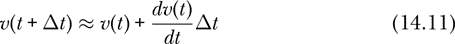

欧拉方法通过将时间*t*的速度与导数在*t*时的乘积，再加上时间步长*Δt*，来近似计算*t* + *Δt*时的速度。欧拉方法提供了一种方法，可以从已知时刻的速度和导数，推算出稍后时刻的速度。

图 14-7 以图示方式描述了欧拉方法解决牛顿第二定律的问题。

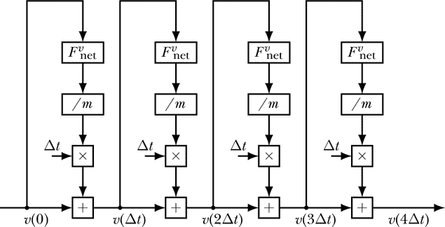

*图 14-7：在一维情况下，欧拉方法应用于牛顿第二定律，特殊情况为净力仅依赖于速度*

该图展示了数据如何通过纯函数作用来计算物体在不同时间的速度。因为该图仅使用纯函数（仅返回输出结果的函数，且不修改任何输入或全局值），我们称之为*函数图*。而图 14-6 中的示意图将时间表示为连续的，这个图则将时间表示为离散的。示意图中的电线值随时间连续变化，而函数图中的电线值保持不变。在函数图中，不同的时间点对应不同的电线。尽管示意图可能包含图 6-5 中的带状态积分器，但函数图则展开并用离散的函数模型替代积分器，如图 6-7 所示。从图 14-7 中可以看出，每个时间步都会执行相同的一组计算，用新的速度值替换旧的速度值。我们称每个时间步执行的计算集合为*速度更新函数*。

图 14-8 展示了速度更新函数，该函数是欧拉方法应用于一个小时间步长的结果。

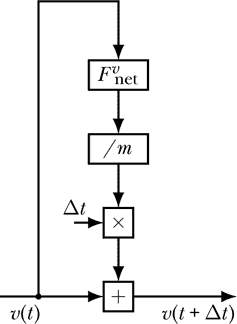

*图 14-8：用于求解仅依赖于速度的牛顿第二定律的欧拉方法中的速度更新函数*

图 14-8 展示了一个速度更新的函数图，直观地描述了如何从时间*t*的速度和力，计算出时间*t* + Δ*t*时的速度。

这是速度更新方程，展示了如何从旧的速度获得新的速度：

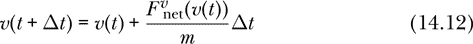

最后，我们有 Haskell 函数`updateVelocity`，它将速度的值推进一个时间步。

```
updateVelocity :: R                    -- time interval dt
               -> Mass
               -> [Velocity -> Force]  -- list of force functions
               -> Velocity             -- current velocity
               -> Velocity             -- new velocity
updateVelocity dt m fs v0
   = v0 + (newtonSecondV m fs v0) * dt
```

图 14-8 中的功能图、速度更新方程（方程 14.12）和函数`updateVelocity`以不同的形式表达相同的信息，即如何使用欧拉方法进行一步时间推进。

现在我们想写一个函数`velocityFv`，类似于`velocityCF`和`velocityFt`，但用于依赖于速度的力的情况。将`updateVelocity`看作一个输入为`Velocity`，输出为`Velocity`的函数时，我们希望将时间步长、质量和力函数列表作为参数。函数`updateVelocity dt m fs`的类型是`Velocity -> Velocity`，它在图 6-4（第 203 页）中扮演着可迭代函数`f`的角色。

```
velocityFv :: R                    -- time step
           -> Mass
           -> Velocity             -- initial velocity v(0)
           -> [Velocity -> Force]  -- list of force functions
           -> Time -> Velocity     -- velocity function
velocityFv dt m v0 fs t
    = let numSteps = abs $ round (t / dt)
      in iterate (updateVelocity dt m fs) v0 !! numSteps
```

我们定义了一个局部变量`numSteps`，表示我们需要的时间步数，以尽可能接近目标时间`t`。我们从初始速度`v0`开始，迭代函数`updateVelocity dt m fs`，然后从这个无限列表中选择一个最接近目标时间的速度值。

作为一个力只依赖于速度的情况示例，假设一位自行车骑行者在一条平坦的水平路面上朝北骑行。我们在这种情况下考虑两个力。首先，是路面施加在自行车轮胎上的北向力，因为骑行者正在踩踏板。我们将这个力称为*F*[rider]（它是路面直接施加在自行车上的，但间接是由骑行者产生的），并假设这个力为恒定的 100 N。其次，是阻碍骑行者北向前进的南向空气阻力，特别是当她快速行驶时。我们将使用上一节中推导的空气阻力表达式和方程 14.9。净力是

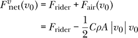

设自行车加骑行者的质量为*m* = 70 kg。我们选择拖拽系数*C* = 2，假设空气密度为*ρ* = 1.225 kg/m³，并将自行车和骑行者的横截面积近似为 0.6 m²。从静止开始，我们的任务是找出自行车的速度随时间变化的函数。

在我们使用 Haskell 函数来研究自行车的运动之前，我们将展示如何手动使用欧拉方法。

#### 手动欧拉方法

让我们手动使用欧拉方法计算自行车的前几个速度值。这样做的目的是为了清楚理解欧拉方法中发生的事情，这样我们编写的代码才有意义，而不仅仅是某个抽象模糊过程的形式化表示。我们选择时间步长为 0.5 秒。我们的任务是完成以下表格。我们可以填入所有的时间值，因为它们只是以 0.5 秒的间隔进行排列。初始速度为 0，所以我们也填入了这一点。

| **t (s)** | **v(t) (m/s)** |
| --- | --- |
| 0.0 | 0.0000 |
| 0.5 |  |
| 1.0 |  |
| 1.5 |  |

我们将通过反复使用方程 14.12 更新速度，来完成表格。为了计算 0.5 秒时的速度，我们选择*t* = 0 代入方程 14.12。

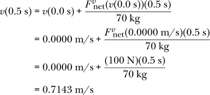

我们用以下内容更新表格：

| **t (s)** | **v(t) (m/s)** |
| --- | --- |
| 0.0 | 0.0000 |
| 0.5 | 0.7143 |
| 1.0 |  |
| 1.5 |  |

然后我们使用方程 14.12 计算*v*(1.0 s)，其中*t* = 0.5 s：

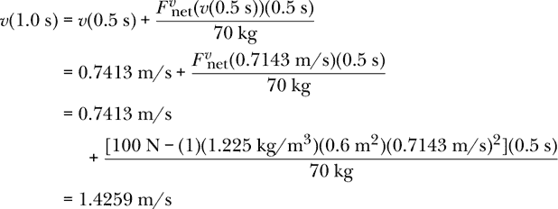

我们将此添加到表格的相应行中并继续。

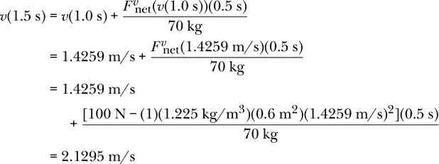

完成的表格如下所示：

| **t (s)** | **v(t) (m/s)** |
| --- | --- |
| 0.0 | 0.0000 |
| 0.5 | 0.7143 |
| 1.0 | 1.4259 |
| 1.5 | 2.1295 |

#### Haskell 中的欧拉方法

现在我们将使用`velocityFv`函数来计算自行车的速度。以下是一个自行车的速度函数，时间步长为 1 秒：

```
bikeVelocity :: Time -> Velocity
bikeVelocity = velocityFv 1 70 0 [const 100,fAir 2 1.225 0.6]
```

高阶函数`const`可以用来创建常量函数。函数`const 100`接受一个输入，忽略它，并返回 100 作为输出。它等同于匿名函数`\_ -> 100`。我们在这里使用它来表示常量力 100 N。

注意，解决自行车问题时必须提供的数据。我们提供了 70 公斤的质量、自行车的初始速度为 0 m/s，以及两个力：`const 100`，一个 100 N 的常量力，和`fAir 2 1.225 0.6`，这是一个空气阻力的力，具有 2 的阻力系数，1.225 kg/m³的空气密度和 0.6 m²的横截面积。

这是生成速度与时间图表的代码：

```
bikeGraph :: IO ()
bikeGraph = plotFunc [Title "Bike velocity"
                     ,XLabel "Time (s)"
                     ,YLabel "Velocity of Bike (m/s)"
                     ,PNG "BikeVelocity1.png"
                     ,Key Nothing
                     ] [0,0.5..60] bikeVelocity
```

该代码绘制了`bikeVelocity`函数，包括标题和坐标轴标签，并生成一个 PNG 文件， 可以在其他文档中使用。图 14-9 包含了该图表。

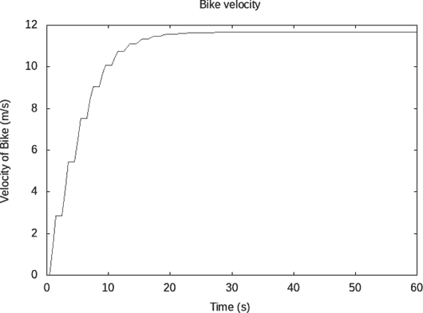

*图 14-9：自行车速度随时间变化的图。台阶状的外观可以修复，并在文中讨论。*

在图 14-9 中出现了一种现象，这在恒定加速度情况下不会发生：终端速度的建立。在大约 20 秒后，路面的前向力（来自踏车）与空气的反向力相匹配。此时我们没有净力（或者只有一个非常小的净力），速度保持在终端速度。

为什么图 14-9 看起来像台阶状？我们使用了一秒钟的时间步长来计算速度函数`bikeVelocity`，但接着我们要求`plotFunc`函数每半秒给出该函数的图形。如果我们想要平滑的图形，我们有几个选择。最简单的方式是要求时间值间隔至少一秒的图形。或者，我们可以使用更小的时间步长来计算`bikeVelocity`函数。无论如何，我们不应要求图表的分辨率超过我们在绘制函数时所要求的分辨率。

使用`velocityFv`和`positionFv`这两个函数，其中后者是你在练习 14.4 中需要编写的，我们就有了通用工具来解决任何仅依赖于速度的单维度空间中的牛顿第二定律类型的问题。在我们转向力同时依赖时间和速度的情况之前，让我们先从更广泛的视角看一下我们刚才所做的事情。

### 物理系统的状态

思考牛顿第二定律的一个富有成效的方式，以及后续的麦克斯韦方程，围绕着物理系统的*状态*这一概念展开，状态是指为了精确描述系统在*某一特定时刻*发生的情况所需的信息的集合。

状态代表系统当前的“事态”，包含足够的信息，使得未来的预测可以基于当前状态，而不是系统的过去信息。状态随时间变化，并根据某种规则改变。

给定一个我们希望理解的物理系统，基于状态的范式提出了以下概念性划分：

1.  要指定系统的状态，需要哪些信息？

1.  在某个初始时刻，系统的状态是什么？

1.  状态随时间变化的规则是什么？

当我们处理牛顿第二定律时，若力是常量或者仅依赖于时间时，我们没有使用基于状态的方法，因为我们不需要。在这些情况下，我们可以使用代数或积分来找出物体在时间上位置和速度的变化。当我们查看依赖于速度的力时，我们得到了一个与微分方程相对应的框图，如图 14-6 所示。基于状态的方法对于微分方程特别有用。

有三点需要注意与图 14-6 相关的基于状态的方法。首先，注意回路中有一个积分器，且该积分器将速度作为状态值。其次，注意微分方程（方程 14.10）给出了速度变化率的表达式。最后，注意力的大小依赖于速度。由于这三点，在力仅依赖于速度的情况下，物体的状态由物体的速度组成。

通常，问题 1 的答案是一个数据类型。经历仅依赖于物体速度的力的物体的状态是`Velocity`数据类型的一个值。在接下来的章节中，当力依赖于时间和速度时，我们将使用数据类型`(Time,Velocity)`来表示状态。随着我们考虑更复杂的物理情境，我们用来表示物理系统状态的数据类型将包含更多的信息。

上述问题 2 在某种意义上是最小的问题。即使没有问题 2 的答案，也可能进行一些分析。但是，如果我们希望知道系统在某一未来时刻的性质，那么我们希望知道该时刻的状态，这通常需要知道某个早期时刻的状态。问题 2 的答案是问题 1 中数据类型的一个值。

问题 3 需要物理理论来回答。在力学中，牛顿第二定律提供了描述状态随时间变化的规律。

让我们看看基于状态的方法如何应用于力仅依赖于物体的时间和速度的情况。

### 依赖于时间和速度的力的第二定律

牛顿第二定律的下一个情况是力依赖于时间和速度，但不依赖于位置。力的函数依赖于两个变量：时间和速度。我们用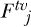表示当给定时间和速度时产生力的*第 j*个函数，用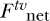表示当给定时间和速度时产生合力的两个变量的函数。

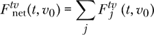

图 14-10 展示了牛顿第二定律的示意图，其中的力依赖于时间和速度。

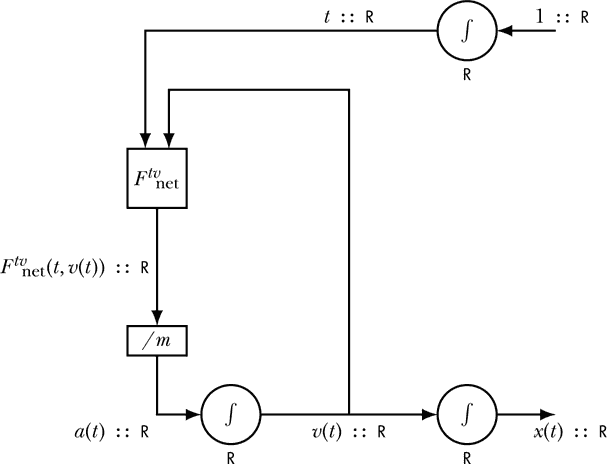

*图 14-10：牛顿第二定律，力依赖于时间和速度*

示意图包含一个回路，因此牛顿第二定律是一个微分方程，如方程 14.14 所示。

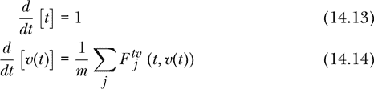

请注意，在图 14-10 中的循环里有一个积分器，它保持着速度作为状态值。有一种方法可以仅使用速度作为物体的状态来求解这个微分方程。然而，由于方程 14.14 中的速度变化率同时依赖于时间和速度（因为力依赖于时间和速度），如果我们将时间和速度都作为*状态变量*，基于状态的方法会更容易应用。这就是说，我们将用于状态的数据类型是`(Time,Velocity)`。方程 14.10 表达的牛顿第二定律，力仅依赖于速度，而方程 14.14 表达的牛顿第二定律，力依赖于时间和/或速度，二者的区别在于，后者需要知道当前的时间值，而前者则不需要。在状态`(Time,Velocity)`中包含时间，是方便获取当前时间的一种简单方法。

哪些量应该被称为状态变量？假设我有一个粒子在空间中，受到已知（与时间无关）力法则的作用。状态变量是位置和速度，因为我们可以从这些变量计算出下一个时间点的位置和速度。为什么加速度不是状态变量？使用本章前面部分的术语，状态变量是用来确定微分方程特定解的数字——它们是将积分转化为反导数的初始值。时间通常不被视为状态变量，但将其视为状态变量可以更容易地思考时间依赖的力。对于有兴趣深入讨论状态变量及其用途的读者，建议参阅**[16**]和**[17**]。

下面展示的 Haskell 函数`newtonSecondTV`表达了牛顿第二定律，其中力依赖于时间和速度。

```
newtonSecondTV :: Mass
               -> [(Time,Velocity) -> Force]  -- force funcs
               -> (Time,Velocity)             -- current state
               -> (R,R)                       -- deriv of state
newtonSecondTV m fs (t,v0)
    = let fNet = sum [f (t,v0) | f <- fs]
          acc = fNet / m
      in (1,acc)
```

给定物体的质量以及作用于物体的力列表，现在这些力被表示为状态`(Time,Velocity)`的函数，`newtonSecondTV`给出了从状态变量本身计算状态变量时间导数的指令。返回类型`(R,R)`表示时间的时间导数，它始终是无量纲的数字 1，以及速度的时间导数，即加速度。加速度是通过牛顿第二定律计算的，方法是求出净力并除以质量。

为了解决方程 14.14，我们将离散化时间并使用欧拉方法。我们将继续使用方程 14.11 来进行欧拉方法。图 14-11 以图示形式描述了当力依赖于时间和/或速度时，使用欧拉方法解决牛顿第二定律的问题。


*图 14-11：欧拉方法在一维中解决牛顿第二定律的情况，针对净力仅依赖于时间和/或速度的特殊情况*

图示展示了函数如何在某一时刻作用于状态变量，以计算下一个时刻的状态变量。相同的计算集合在每个时间步都会重复，以从旧的状态产生新的状态。我们称每个时间步发生的计算集合为*状态更新函数*。

状态更新函数在图 14-12 中以图示方式展示。图示描述了如何根据力函数，从时刻*t*的时间和速度计算出时刻*t* + Δ*t*的时间和速度。

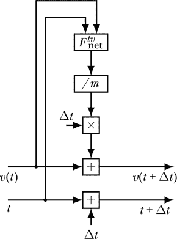

*图 14-12：欧拉法更新，适用于仅依赖于时间和速度的牛顿第二定律中的力*

以下是状态更新方程，展示了如何从旧的状态变量获得新的状态变量：

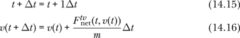

方程 14.15 和 14.16 是适用于受到依赖于时间和速度的力作用的物体的状态更新方程。状态更新方程告诉我们如何更新状态变量时间和速度，以推进到下一个时间步。方程 14.15 中的时间更新很简单：我们只需将*Δt*加到旧时间上即可得到新时间。要更新方程 14.16 中的速度，我们需要计算加速度，将其与时间步相乘得到速度的变化，再将此变化加到旧的速度上。应用这些状态更新方程是我们用欧拉法解微分方程的方式。这一状态更新过程是我们解决牛顿力学问题的主要工具。

以下是 Haskell 函数`updateTV`，因其同时更新时间和速度，所以命名为此，它将状态值推进一个时间步。

```
updateTV :: R                           -- time interval dt
         -> Mass
         -> [(Time,Velocity) -> Force]  -- list of force funcs
         -> (Time,Velocity)             -- current state
         -> (Time,Velocity)             -- new state
updateTV dt m fs (t,v0)
    = let (dtdt, dvdt) = newtonSecondTV m fs (t,v0)
      in (t  + dtdt * dt
         ,v0 + dvdt * dt)
```

函数`updateTV`接受几个参数，生成类型为`(Time,Velocity) -> (Time,Velocity)`的函数。`updateTV`的第三个输入，命名为`fs`，类型为`[(Time,Velocity) -> Force]`，本可以是类型为`[Time -> Velocity -> Force]`的输入；这只是风格问题，选择任何一个都能正常工作。这里我选择了前者，因为时间和速度已经在函数输出中配对。

我们在此函数中传递的时间-速度对表示的是我们应用牛顿第二定律的物体的状态。函数`updateTV`是一个状态更新函数的示例。在前面的章节中，当力只依赖于速度时，速度本身作为状态，而函数`updateVelocity`则是适当的状态更新函数。

图 14-12、方程 14.15 和 14.16 以及函数`updateTV`以不同形式表达了相同的信息，即如何通过欧拉法在时间上迈出一步。

根据我们想要计算的内容，`updateTV`函数有两种使用方式，对应于时间-速度数据的两种表示方式。首先，我们可能希望生成一个时间-速度对的列表。其次，我们可能希望生成时间作为速度的函数。我们将在接下来的两个小节中为这两种目的开发函数。

#### 方法 1：生成状态列表

时间-速度对的列表可以视为一个牛顿第二定律问题的解决方案，其中力依赖于时间和速度，因为时间-速度对给出了状态。状态列表包含了每个被欧拉方法探测的时间对应的时间-速度对，见图 14-11。函数`statesTV`在给定时间步长、质量、初始状态和力函数列表时，产生一个时间-速度对的列表。

```
statesTV :: R                           -- time step
         -> Mass
         -> (Time,Velocity)             -- initial state
         -> [(Time,Velocity) -> Force]  -- list of force funcs
         -> [(Time,Velocity)]           -- infinite list of states
statesTV dt m tv0 fs
    = iterate (updateTV dt m fs) tv0
```

我们使用`iterate`来实现图 14-11 中的重复组合。但我们想要迭代哪个函数呢？它不只是`updateTV`，因为`updateTV`需要三个参数作为输入，才能得到时间-速度对。我们要迭代的函数必须是`a -> a`类型，或者在这个例子中是`(Time,Velocity) -> (Time,Velocity)`类型。解决方案是给`updateTV`提供它的前三个参数，形成我们传递给`iterate`的函数。我们想要迭代的函数是`updateTV dt m fs`，从初始的时间-速度对`tv0`开始。

函数`statesTV`提供了一种通用的方法来解决任何牛顿第二定律类型的问题，适用于单一空间维度且力仅依赖于时间和速度。所谓的解决方案是指一个无穷长的状态列表（时间-速度对），这些状态之间的时间步长间隔是均匀的。

#### 方法 2：生成速度函数

现在我们想编写一个函数`velocityFtv`，它类似于`velocityCF`、`velocityFt`和`velocityFv`，但适用于力依赖于时间和速度的情况。我们将使用`statesTV`生成的无穷长列表，选出最接近我们期望时间的时间-速度对，并使用 Prelude 函数`snd`返回与时间分离的速度。

```
velocityFtv :: R                          -- time step
           -> Mass
           -> (Time,Velocity)             -- initial state
           -> [(Time,Velocity) -> Force]  -- list of force funcs
           -> Time -> Velocity            -- velocity function
velocityFtv dt m tv0 fs t
   = let numSteps = abs $ round (t / dt)
     in snd $ statesTV dt m tv0 fs !! numSteps
```

通过函数`velocityFtv`和`positionFtv`，其中后者将在练习 14.9 中要求你编写，我们可以用通用的方法解决任何涉及时间和速度依赖的力的单一空间维度的牛顿第二定律问题。现在我们来看看一个涉及这种力的情况。

### 示例：骑行与风阻滑行

作为一个依赖时间和速度的力的示例，让我们重新考虑我们的小孩自行车骑行者，他正在踩踏和滑行，但现在有了空气阻力。我们将考虑这种情况中的两个力。首先，存在来自方程 14.8 中描述的踩踏力 *F*pc，这是一个时间相关的力。其次，存在空气阻力 *F*air，它阻碍孩子的运动，我们将使用方程 14.9 来描述这个力。净力是

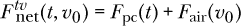

自行车和孩子的总质量是*m* = 20 kg。我们选择拖曳系数*C* = 2，取空气密度*ρ* = 1.225 kg/m³，并将自行车和骑行者的横截面积近似为 0.5 m²。从静止开始，我们的任务是找到自行车速度随时间的变化函数。

我们使用方程 14.16 来更新速度。在使用 Haskell 函数研究自行车运动之前，我们将展示如何手动使用欧拉方法。

#### 手动欧拉方法

让我们手动使用欧拉方法来计算自行车的几个速度值。同样，手动进行欧拉方法的目的是清楚地了解在欧拉方法中如何更新状态变量。我们将选择 6 秒的时间步长，尽管这个时间步长对于获取准确结果来说太大，因为它相对于相关的时间尺度（如 20 秒的周期时间）并不小。我们选择 6 秒的时间步长是为了能够在前几个时间步长中同时采样踩踏和滑行。我们的任务是完成以下表格。我们可以填充所有的时间值，因为它们只是以六秒的间隔分布。初始速度是 0，因此我们也将其填写。

| **t (s)** | **v(t) (m/s)** |
| --- | --- |
|     0 | 0.0000 |
|     6 |  |
|   12 |  |
|   18 |  |

踩踏的力要么是 10 N，要么是 0 N，取决于时间的值。

*F*pc = *F*pc = 10 N

*F*pc = *F*pc = 0 N

通过反复应用方程 14.16，我们得到以下结果：

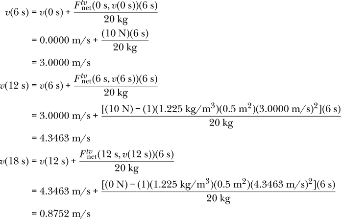

完成的表格如下所示：

| **t (s)** | **v(t) (m/s)** |
| --- | --- |
| 0 | 0.0000 |
| 6 | 3.0000 |
| 12 | 4.3463 |
| 18 | 0.8752 |

现在我们转向 Haskell，使用我们之前讨论的两种方法。

#### 方法 1：生成状态列表

在这里，我们将使用函数`statesTV`生成一个无限的速度-时间对列表，称为`pedalCoastAir`，用于描述孩子在自行车上的运动。

```
pedalCoastAir :: [(Time,Velocity)]
pedalCoastAir = statesTV 0.1 20 (0,0)
                [\(t,_) -> pedalCoast t
                ,\(_,v) -> fAir 2 1.225 0.5 v]
```

请注意解决此问题所需提供的数据。我们提供了 0.1 秒的时间步长、20 千克的质量、初始状态（时间为 0，速度为 0），以及以匿名函数形式表示的两个力。`pedalCoast`函数仅依赖于时间，因此不能直接列为力函数，因为`statesTV`的力函数需要时间-速度对作为输入。下划线的存在是因为蹬踏函数不依赖于状态中的第二项（即速度），而空气阻力也不依赖于状态中的第一项（即时间）。

一对对的列表是我们可以使用`gnuplot`库中的`plotPath`函数绘制的，但我们需要在绘图前截断列表为有限列表，否则`plotPath`会在尝试计算无限列表时挂起。在下面的`pedalCoastAirGraph`中，我们使用`takeWhile`函数提取时间小于或等于 100 秒的状态。

```
pedalCoastAirGraph :: IO ()
pedalCoastAirGraph
    = plotPath [Title "Pedaling and coasting with air"
               ,XLabel "Time (s)"
               ,YLabel "Velocity of Bike (m/s)"
               ,PNG "pedalCoastAirGraph.png"
               ,Key Nothing
               ] (takeWhile (\(t,_) -> t <= 100)
                  pedalCoastAir)
```

这段代码生成了图 14-13，展示了孩子在空气阻力下蹬踏与滑行时，速度随时间变化的关系。

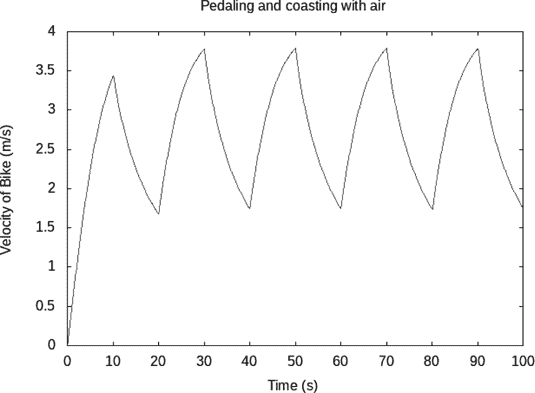

*图 14-13：带有空气阻力的蹬踏与滑行*

正如预期的那样，孩子在蹬踏间隔期间速度增加，而在滑行间隔期间速度减小。

#### 方法二：生成速度函数

现在让我们使用函数`velocityFtv`为骑车的孩子生成一个速度函数。

```
pedalCoastAir2 :: Time -> Velocity
pedalCoastAir2 = velocityFtv 0.1 20 (0,0)
                 [\( t,_v) -> pedalCoast t
                 ,\(_t, v) -> fAir 1 1.225 0.5 v]
```

我们给`pedalCoastAir2`的数据与给`pedalCoastAir`的数据相同。由于`pedalCoastAir2`是一个`R -> R`函数，因此可以使用`gnuplot`包中的`plotFunc`函数进行绘图。它将生成与图 14-13 中相同的图形。

### 总结

本章讨论了牛顿的第一定律，并在一维运动的背景下介绍了牛顿的第二定律。本章呈现了一系列越来越复杂的牛顿第二定律应用场景。其中最简单的是物体上的力是常量，即随时间不变。接下来是当物体上的力仅依赖于时间时，在这种情况下我们可以应用积分来找到物体的速度和位置。依赖于速度的力，比如本章介绍的空气阻力，要求我们解一个微分方程，这比积分更复杂。章节还介绍了欧拉方法来解一阶微分方程。欧拉方法与牛顿第二定律一起，为更新我们正在追踪的物体的状态提供了规则，使我们能够预测其未来的运动。状态变量或包含在状态中的物理量的选择由力的依赖关系决定。如果力仅依赖于速度，那么速度本身可以作为粒子的状态。如果力依赖于时间和速度，那么我们使用时间和速度作为状态变量。

在下一章中，我们允许力依赖于位置以及时间和速度。这将产生一个二阶微分方程，并要求时间、位置和速度都作为状态变量。

### 练习

**练习 14.1.** 编写一个函数`velocityCF'`，它与`velocityCF`做相同的事情并具有相同的类型签名，但在定义中，时间`t :: Time`显式列在等号的左侧。

```
velocityCF' :: Mass
            -> Velocity          -- initial velocity
            -> [Force]           -- list of forces
            -> Time -> Velocity  -- velocity function
velocityCF' m v0 fs t = undefined m v0 fs t
```

**练习 14.2.** 使用`positionCF`函数，为示例 14.1 中的汽车在气轨上的位置画图，位置作为时间的函数。假设汽车的初始位置为-1 米。

**练习 14.3.** 编写一个函数

```
sumF :: [R -> R] -> R -> R
sumF = undefined
```

添加一个函数列表，以生成一个表示总和的函数。用你的代码替换`undefined`，并可以在定义的等号左侧加入一个或两个变量。使用`sumF`，我们可以将`velocityFt`的`let`构造中的第一行写为`fNet = sumF fs`。

**练习 14.4.** 编写一个 Haskell 函数

```
positionFv :: R                   -- time step
           -> Mass
           -> Position            -- initial position x(0)
           -> Velocity            -- initial velocity v(0)
           -> [Velocity -> Force] -- list of force functions
           -> Time -> Position    -- position function
positionFv = undefined
```

返回一个描述牛顿第二定律的位移函数，该定律中的力仅依赖于速度。用你的代码替换`undefined`，并可以在定义的等号左侧加入变量。

**练习 14.5.** 任何可以用`velocityFv`解决的牛顿第二定律问题，也可以用`velocityFtv`来解决。重写`bikeVelocity`函数，使其使用`velocityFtv`而不是`velocityFv`。

**练习 14.6.** 手动使用欧拉方法计算第 225 页的速度，我们发现 1.5 秒后的速度为*v*(1.5 秒) = 2.1295 米/秒。使用`velocityFv`函数来计算这个相同的数值。

**习题 14.7.** 在 第 235 页手工计算欧拉法时，我们发现 18 秒时的速度为 *v*(18 s) = 0.8752 m/s。使用 `statesTV` 或 `velocityFtv` 来计算这个相同的结果。

**习题 14.8.** 修复 图 14-9 中的阶梯效应，使图表显示平滑。

**习题 14.9.** 编写一个 Haskell 函数

```
positionFtv :: R                    -- time step
            -> Mass
            -> Position             -- initial position x(0)
            -> Velocity             -- initial velocity v(0)
            -> [(Time,Velocity) -> Force]  -- force functions
            -> Time -> Position     -- position function
positionFtv = undefined
```

该函数返回一个位置函数，适用于牛顿第二定律情形，其中力仅依赖于时间和速度。将 `undefined` 替换为你的代码，且可以自由在等号左侧的定义中包含变量。

**习题 14.10.** 绘制 图 14-13 中情形的位移与时间的关系图。

**习题 14.11.** 为了加深我们对欧拉法的理解，我们将手工进行一次计算（仅使用计算器，而不是计算机）。

考虑一个受到两个力作用的 1 公斤物体。第一个力是一个振荡力，先一个方向推力，然后再反方向推力。用 *t* 表示秒，力的单位是牛顿，其表达式为

*F*1 = 4 cos 2*t*

第二个力是一个空气阻力力，单位是牛顿，表达式为

*F*2 = –3*v*[0]

其中 *v*[0] 是当前质量的速度，以米每秒为单位。

净力是

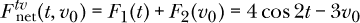

假设质量最初以 2 m/s 的速度运动，因此

*v*(0 s) = 2 m/s

使用欧拉法，时间步长 Δ*t* = 0.1 s，近似计算 *v*(0.3s) 的值。在计算中保留小数点后至少四位。将你的计算过程展示在一个小表格中。

**习题 14.12.** 编写一个 Haskell 函数

```
updateExample :: (Time,Velocity)  -- starting state
              -> (Time,Velocity)  -- ending state
updateExample = undefined
```

该函数接受一个时间-速度对 (*t*[0], *v*[0])，并返回一个更新后的时间-速度对 (*t*[1], *v*[1])，适用于 1 公斤物体在欧拉法下进行单步计算的情形，假设其受到净力的作用。


使用时间步长 Δ*t* = 0.1 s。展示如何使用函数 updateExample 计算你在习题 14.11 中手工计算的 *v*(0.3 s) 值。

**习题 14.13.** 考虑一个 1 公斤物体，受净力作用

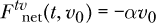

其中 *α* = 1 N·s/m，初始条件是 *v*(0 s) = 8 m/s。使用欧拉法求解物体在时间区间 0 s ≤*t* ≤ 10 s 内的速度，并绘制速度与时间的关系图，观察结果。将结果与精确解进行比较：

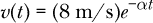

尝试不同的时间步长，看看当时间步长过大时会发生什么。

找到一个足够小的时间步长，使得欧拉解和精确解在图表上能够很好地重合。找到另一个足够大的时间步长，使你可以在图表上看到欧拉解和精确解之间的差异。

绘制一个漂亮的图表（包括标题、坐标轴标签等），将这三种解法（坏的欧拉法、好的欧拉法和精确解）绘制在同一图表上。标记欧拉法的结果，并标出你使用的时间步长，将精确解标记为“Exact”。

**习题 14.14.** 考虑以下微分方程

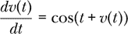

并且满足初始条件 *v*(0) = 0\。这个微分方程没有精确解。使用欧拉方法，步长为 Δ*t* = 0.01，计算区间 0 ≤ *t* ≤ 3 上的 *v*(*t*)。绘制结果函数的图像，并将 *v*(3) 的值精确到五位有效数字。

**习题 14.15.** 功能图中的每一根电线都可以标记一个类型。请为图 14-11 中的每根电线标记类型。
