# 第十五章：一维力学


本章中，我们将通过开发适用于物体所受力既依赖于位置又依赖于时间和速度的情况的工具，完成一维力学的故事。这将需要思考二阶微分方程，并将其转化为一阶微分方程系统。

如同之前一样，我们将通过几种不同的形式转化关于物理情况的信息，从物体的质量和作用在其上的力开始，最终得出给出物体位置和速度随时间变化的函数。像 Haskell 这样的函数式语言通过为每种信息形式赋予名称和类型，并允许在适当的时候将这些信息自然地以函数的形式存在，有助于我们组织思考如何解决力学问题。

为了应用我们正在开发的工具，我们将看一个例子：乒乓球在弹簧末端运动，受到空气阻力的影响——换句话说，是一个阻尼谐振子。我们将展示如何应用欧拉法求解二阶微分方程，并展示如何将物体的状态列表或位置和速度函数视为力学问题的解。接着我们将介绍欧拉-克罗梅法，这是对欧拉法在二阶微分方程中的改进。由于我们将在接下来的章节中引入向量和多个粒子，修改状态变量和状态使用的数据类型，在本章结束时，我们将总结我们的微分方程求解方法，使其能够支持任意数据类型的状态，并允许选择数值方法。

### 入门代码

让我们从源代码文件开头需要出现的代码开始。我总是喜欢先开启警告。我还会包含两个语言设置，我们将在本章“求解微分方程”部分稍后使用。

```
{-# OPTIONS_GHC -Wall #-}
{-# LANGUAGE FlexibleInstances, MultiParamTypeClasses #-}
```

让我们将本章中的代码制作成一个名为`Mechanics1D`的模块。

```
module Mechanics1D where
```

我们稍后还需要绘制图表，所以让我们导入必要的模块。

```
import Graphics.Gnuplot.Simple
```

对于我们举的例子——一个乒乓球挂在弹簧的末端，我们将使用上一章中的空气阻力函数`fAir`。要访问这个函数，我们需要导入我们在第十四章中编写的`Newton2`模块。

```
import Newton2 ( fAir )
```

Haskell 编译器将在当前工作目录（即包含我们正在编写的*Mechanics1D.hs*文件的目录）中查找一个名为*Newton2.hs*的文件。*Newton2.hs*文件包含了我们在上一章编写的代码，并可以通过[`lpfp.io`](https://lpfp.io)访问。

如果我们在模块名称后面包含一个以逗号分隔的类型和函数列表（放在括号中），我们将只导入这些类型和函数。如果我们省略这个列表，像我们导入 `Graphics.Gnuplot.Simple` 模块时那样，我们将导入该模块提供的所有类型和函数。

像往常一样，我们将使用类型同义词 `R` 来代替 `Double`。我们在第十章的 `SimpleVec` 模块中创建了这个类型同义词，并从那里导入它。

```
import SimpleVec ( R )
```

警告选项、语言设置、模块名称和导入语句需要位于源代码文件的开头。类型同义词可以出现在任何地方。

当我们在一维中做力学时，时间、时间步长、质量、位置、速度和力都用实数来表示。

```
type Time     = R
type TimeStep = R
type Mass     = R
type Position = R
type Velocity = R
type Force    = R
```

### 依赖于时间、位置和速度的力

当物体上的力依赖于时间、位置和速度时，力函数依赖于三个变量。我们将使用 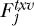 来表示在给定时间、位置和速度时给出力的 *j* 维函数；我们将使用  来表示给出合力的三个变量的函数。图 15-1 展示了一个示意图，说明了牛顿第二定律在力依赖于时间、位置和速度时的情况。

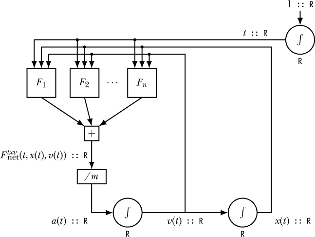

*图 15-1：牛顿第二定律在一维中的表现。力依赖于时间、位置和速度。*

图中的矩形框表示纯函数，其输出仅依赖于输入。积分器被包含在圆形中，以提醒我们每个积分器都包含一些状态。例如，输出为 *x*(*t*) 的积分器必须包含当前位置值。图 15-1 中的示意图是连续的，并且是有状态的。

牛顿第二定律表现为以下的微分方程：

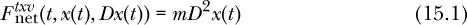

我们已经得到了牛顿第二定律在一维中的完全一般形式，正如上一章方程 14.2 所给出的。位置是我们在这个微分方程中要找的未知函数。因为方程中出现了位置的二阶导数，所以这是一个二阶微分方程。为了使用基于状态的方法来求解二阶微分方程，我们将选择一些状态变量，并为每个状态变量写出一阶微分方程。

我们的状态变量应该是什么？图 15-1 中包含了两个集成器，它们在循环中保持位置和速度作为状态，因此位置和速度必须是状态变量。虽然仅使用位置和速度作为状态变量也可以求解方程 15.1，但如果我们也允许时间作为状态变量，则会更容易，因为力也可能依赖于时间。我们描述单个物体在一维运动的力学状态的数据类型是时间-位置-速度三元组。

```
type State1D = (Time,Position,Velocity)
```

我们使用*状态空间*这个名称来描述像`State1D`这样的数据类型，它们表示状态。前一章中的类型`Velocity`和`(Time,Velocity)`是状态空间的其他示例。

方程 15.2、15.3 和 15.4 显示了通过写出每个状态变量的时间导数所得到的三个一阶微分方程。方程右侧可能涉及状态变量，但可能没有任何导数。因为位置函数的导数依赖于速度函数，反之亦然，所以我们称这组方程为*耦合*微分方程。

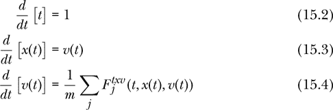

函数`newtonSecond1D`给出了状态变量的时间导数的表达式，表达式中的状态变量本身就是状态变量。注意，在这个函数中，状态变量是实数，而不是时间的函数。通过表达微分方程 15.2、15.3 和 15.4，函数`newtonSecond1D`表达了牛顿第二定律的一维形式。图 15-1 中的示意图、微分方程和 Haskell 函数`newtonSecond1D`都包含了理解和解决一维牛顿第二定律所需的基本信息。

```
newtonSecond1D :: Mass
               -> [State1D -> Force]  -- force funcs
               -> State1D             -- current state
               -> (R,R,R)             -- deriv of state
newtonSecond1D m fs (t,x0,v0)
    = let fNet = sum [f (t,x0,v0) | f <- fs]
          acc = fNet / m
      in (1,v0,acc)
```

#### 解决力学问题的一般策略

我们构建和求解牛顿第二定律的策略包括通过一系列五种不同的形式来转化有关物理情况的信息：

1.  质量和力函数

1.  微分方程

1.  状态更新函数

1.  状态列表

1.  位置和速度函数

信息从我们考虑的物体的质量以及作用在其上的力开始，这些力是状态变量的函数。函数`newtonSecond1D`将这些质量和力信息转化为微分方程。微分方程是一个函数`State1D -> (R,R,R)`，它给出了时间、位置和速度的状态变量的导数，表示为状态变量本身。欧拉法将微分方程转化为状态更新函数，即函数`State1D -> State1D`，该函数根据早期时刻的状态变量计算后期时刻的状态变量。从状态更新函数和初始状态开始，我们可以计算出一个无限长的状态列表，这是描述我们物理情况的第四种数据表示。最后，我们可以从状态列表中提取时间和速度作为时间的函数。预测物体位置和速度作为时间的函数是最终的数据表示，我们将其视为理解物体运动问题的解。

图 15-2 是一个功能图，展示了上述五种数据表示以及将数据从一种表示转换为另一种表示的函数。

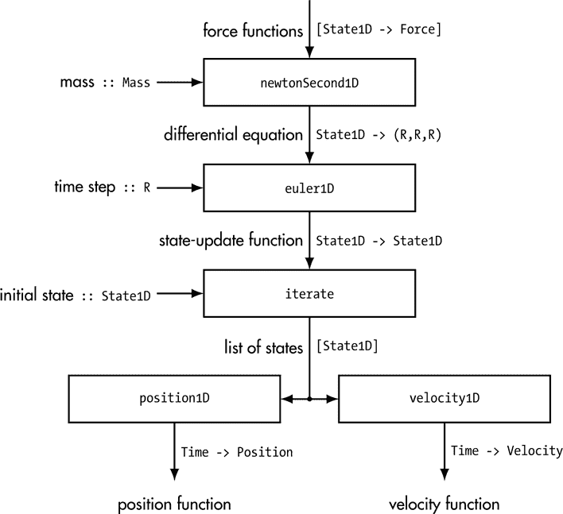

*图 15-2：在一维中求解力学问题的数据流。函数通过五种表示的序列转换数据。*

我们已经讨论了`newtonSecond1D`如何将质量和力数据转化为微分方程。我们稍后将详细讨论其他转换。图 15-2 是本章和接下来几章中的第一张图，旨在概述解决力学问题的过程。随着我们扩展和概括状态和数值方法的思想，这些图将变得更加通用、更加简洁，并且有些抽象。它们的目的是，在深入理解牛顿力学的过程中，建议一种高级思维方式来思考牛顿定律的含义和解决技巧。这些图将我们编写的众多函数组织成一个连贯的、可操作的描述，说明如何用牛顿力学进行预测。理解求解牛顿第二定律所需的步骤是对这一法则意义的更深刻理解的先决条件。

请注意，在图 15-2 中有两个地方需要额外的信息。欧拉法需要一个时间步长，将微分方程转化为状态更新函数，同时需要一个初始状态，将状态更新函数转化为状态列表。在这张图中，我认为物体的质量和所受的力是问题初始信息的一部分。

#### 使用欧拉法求解

为了解决微分方程 15.2、15.3 和 15.4，我们将对时间进行离散化，选择一个比问题中任何重要时间尺度都小的时间步长*Δt*。我们将使用欧拉法，通过该方法在一个时间步内，利用该状态变量在时间步开始时的时间导数来近似每个状态变量的时间斜率。图 15-3 展示了欧拉法如何用于求解牛顿第二定律的一维形式。

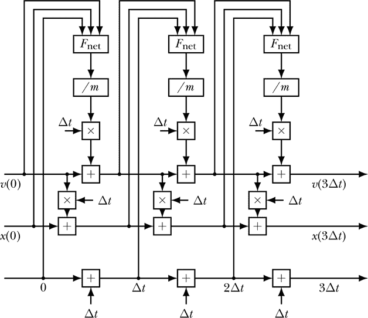

*图 15-3：一维欧拉法求解牛顿第二定律*

与图 15-1 中值随时间连续变化的示意图不同，图 15-3 中的功能图的值保持不变。一个量（如位置）随时间变化的过程通过不同电线上的一系列值来表示。

下述函数`euler1D`将微分方程转化为状态更新函数，如图 15-2 所示。为此，它除了微分方程外，还将时间步长作为输入。每个状态变量通过改变其值，由其导数（从微分方程中计算得到）与时间步长的乘积来更新。

```
euler1D :: R                     -- time step dt
        -> (State1D -> (R,R,R))  -- differential equation
        -> State1D -> State1D    -- state-update function
euler1D dt deriv (t0,x0,v0)
    = let (_, _, dvdt) = deriv (t0,x0,v0)
          t1 = t0 + dt
          x1 = x0 + v0 * dt
          v1 = v0 + dvdt * dt
      in (t1,x1,v1)
```

图 15-3 不断地组合状态更新函数。我们将这个状态更新函数称为`updateTXV`，因为它更新时间、位置和速度。如前所述，接下来我们将介绍这个状态更新函数的三种表示方式。图 15-4 展示了状态更新函数的功能图，说明了如何从一个旧的三元组生成一个新的时间-位置-速度三元组。

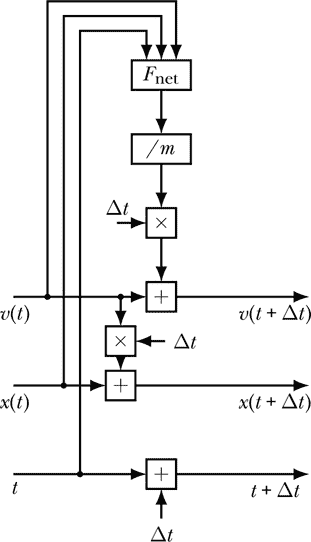

*图 15-4：当一个小的时间间隔* Δ*t *已经过去时，如何更新状态变量时间、位置和速度*

现在我们将给出数学符号表示的状态更新方程。状态更新方程告诉我们如何更新状态变量——时间、位置和速度——以便进入下一个时间步。


最后，我们定义了 Haskell 函数`updateTXV`，它从旧的状态三元组生成新的状态三元组。

```
updateTXV :: R                   -- time interval dt
          -> Mass
          -> [State1D -> Force]  -- list of force funcs
          -> State1D -> State1D  -- state-update function
updateTXV dt m fs = euler1D dt (newtonSecond1D m fs)
```

请注意，`updateTXV`本质上是`newtonSecond1D`和`euler1D`的组合，因此它将质量和力数据（我们五种数据表示中的第一种）转化为状态更新函数（五种中的第三种）。

#### 生成状态列表

数据流的下一步是根据状态更新函数和初始状态生成无限的状态列表，参见图 15-2。Haskell Prelude 函数`iterate`可以做到这一点，本质上将图 15-4 转换为图 15-3。时间-位置-速度三元组的列表可以视为牛顿第二定律问题的解决方案。这个状态列表包含了每次通过欧拉方法（见图 15-3）探测到的时间-位置-速度三元组。函数`statesTXV`在给定时间步长、质量、初始状态和力函数列表时，生成一个状态列表。

```
statesTXV :: R                   -- time step
          -> Mass
          -> State1D             -- initial state
          -> [State1D -> Force]  -- list of force funcs
          -> [State1D]           -- infinite list of states
statesTXV dt m txv0 fs = iterate (updateTXV dt m fs) txv0
```

我们在这里做的就是迭代更新函数，以生成一个无限状态列表。请注意，我们需要在`updateTXV`之前将时间步长、质量和力列表作为参数传入，才能使其成为一个可迭代的函数，可以传递给`iterate`。`Iterate`要求一个类型为`a -> a`的函数，该函数可以反复应用。

函数`statesTXV`将质量和力的数据（我们五个数据表示中的第一个），以及一个时间步长和初始状态，转换为一个无限的状态列表（我们五个数据表示中的第四个）。通过这个函数，我们就有了一种通用的方法来解决任何一维空间中的牛顿第二定律问题。这里的“解决方案”是指一个无限的状态列表（时间-位置-速度三元组），这些状态彼此之间的时间间隔为一个时间步长。从这个无限的状态列表中，我们可以提取出我们最感兴趣的数据，并将其绘制成图表或动画。

#### 位置和速度函数

对于我们的第五个也是最后一个数据表示，我们希望编写一个函数`velocity` `Ftxv`，类似于`velocityCF`、`velocityFt`、`velocityFv`和`velocityFtv`，但针对依赖于时间、位置和速度的力。这个函数将把质量和力的数据（我们五个数据表示中的第一个），以及一个时间步长和初始状态，转换成一个速度函数（我们五个数据表示中的第五个部分）。

为了帮助我们做到这一点，我们想编写一个函数`velocity1D`，它将从一个无限状态列表（我们五个数据表示中的第四个）转换成一个速度函数。

```
-- assume that dt is the same between adjacent pairs
velocity1D :: [State1D]         -- infinite list
           -> Time -> Velocity  -- velocity function
velocity1D sts t
    = let (t0,_,_) = sts !! 0
          (t1,_,_) = sts !! 1
          dt = t1 - t0
          numSteps = abs $ round (t / dt)
          (_,_,v0) = sts !! numSteps
      in v0
```

我们将无限状态列表命名为`sts`，并将目标时间命名为`t`。我们假设在整个无限状态列表中，时间步长保持不变，并通过列表中前两个状态的时间值来计算时间步长。在`let`子句的前两行中，我们使用列表索引运算符（`!!`）提取出列表中的第一个和第二个状态。由于`State1D`是`(R,R,R)`的类型同义词，我们使用模式匹配来提取状态中的时间。局部变量`t0`和`t1`分别是列表中前两个状态的时间。

`let`语句中的第三行定义了一个局部变量`dt`，表示时间步长，计算方法是第一个和第二个状态的时间差。`let`语句中的第四行计算了达到最接近目标时间的状态所需的时间步数，并将这个步数命名为局部变量`numSteps`。`let`语句中的第五行使用列表索引运算符来选出最接近目标时间的状态，然后通过模式匹配将该状态的速度命名为`v0`。

这个函数的实际工作都在`let`语句中完成。该函数返回`v0`，即最接近目标时间`t`的速度。

对于函数`velocityFtxv`，我们将使用由`statesTXV`生成的无限列表，结合`velocity1D`进行完整的转换。

```
velocityFtxv :: R                   -- time step
             -> Mass
             -> State1D             -- initial state
             -> [State1D -> Force]  -- list of force funcs
             -> Time -> Velocity    -- velocity function
velocityFtxv dt m txv0 fs = velocity1D (statesTXV dt m txv0 fs)
```

一旦我们得到速度函数，我们可以通过积分得到位置函数，但所有这些位置信息都包含在我们的状态列表中，所以我们可以直接从中提取位置函数，方法是使用`position1D`，它与`velocity1D`非常相似。

```
-- assume that dt is the same between adjacent pairs
position1D :: [State1D]           -- infinite list
           -> Time -> Position    -- position function
position1D sts t
    = let (t0,_,_) = sts !! 0
          (t1,_,_) = sts !! 1
          dt = t1 - t0
          numSteps = abs $ round (t / dt)
          (_,x0,_) = sts !! numSteps
      in x0
```

这是函数`positionFtxv`，它将我们从初始数据表示（通过质量和力表示）以及时间步长和初始状态，转换为最终的表示，给出物体位置随时间变化的函数。

```
positionFtxv :: R                   -- time step
             -> Mass
             -> State1D             -- initial state
             -> [State1D -> Force]  -- list of force funcs
             -> Time -> Position    -- position function
positionFtxv dt m txv0 fs = position1D (statesTXV dt m txv0 fs)
```

使用`velocityFtxv`和`positionFtxv`这两个函数，我们就有了一种通用的方法来解决任何一维空间中的牛顿第二定律问题。

接下来让我们看一个使用这种技术的例子：一个乒乓球在弹簧玩具的末端摆动。弹簧对乒乓球的恢复力取决于乒乓球的位置，而空气阻力则取决于乒乓球的速度。

### 一个受阻尼的简谐振动器

作为一个位置和速度相关力的例子，考虑一个受阻尼的简谐振动器。特别地，考虑一个乒乓球在垂直悬挂的弹簧玩具末端摆动的情况。弹簧玩具是一种由金属或塑料制成的弹簧，被当作儿童玩具出售。我们选择一个坐标系，其中向上为正，并选择位置的零点为弹簧玩具下端没有乒乓球时的挂点。乒乓球的质量为 2.7 克，半径为 2 厘米。

我们将考虑作用在乒乓球上的三个力，所有力都垂直作用。第一个力来自弹簧，作用于恢复物体至平衡位置。弹簧力由*胡克定律*给出，

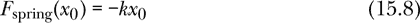

该公式声称弹簧产生的力与质量从平衡位置的位移*x*[0]成正比。常数*k*称为弹簧的*弹簧常数*。具有较大弹簧常数的弹簧较为坚硬，需要较大的力来拉伸或压缩。负号使弹簧力成为*恢复力*，其作用方向是将物体恢复到平衡位置。

平衡位置为*x*[0] = 0。如果*x*[0]为正，则*F*spring 为负，力的方向是指向平衡位置。如果*x*[0]为负，则*F*spring 为正，力的方向同样指向平衡位置。

弹簧力只依赖于球体的位置，而不依赖于它的速度或时间。但考虑到我们想使用一个类似`statesTXV`或`positionFtxv`的函数，它需要一个作为状态函数的力列表`State1D -> Force`，我们将按此形式编写胡克定律。

```
springForce :: R -> State1D -> Force
springForce k (_,x0,_) = -k * x0
```

第二种力是空气阻力，它会阻碍弹簧上球体的自然振动。我们将使用方程 14.9 来表示空气阻力，公式如下。

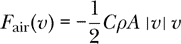

我们使用的阻力系数为 2。

第三种力是作用在球体上的重力。在地球表面，质量为*m*的物体所受的重力为

*F[g]* = –*mg*

其中*g* = 9.80665 米/秒²是重力加速度，并且我们采用一个坐标系统，其中“远离地球中心”为正方向。

我们假设弹簧的弹簧常数为 0.8 kg/s²。我们将在距离平衡位置 10 厘米的地方释放球体，意味着*x*(0 秒) = 0.1 米，*v*(0 秒) = 0 米/秒。

在我们使用 Haskell 函数来研究球体的运动之前，让我们先通过手动计算欧拉方法来研究它。

#### 手动计算欧拉方法

我们希望清晰地理解计算机在应用欧拉方法时的处理过程。为此，我们将手动计算欧拉方法的几个步骤（即用计算器），以便详细了解发生了什么。

我们将使用状态更新方程 15.6 和 15.7，时间步长为Δ*t* = 0.1 秒。0.1 秒的时间步长对于这个问题来说过大，无法获得精确的结果，但它有助于展示欧拉方法的核心思想。

我们的任务是完成以下表格。由于时间值是以 0.1 秒的间隔均匀分布的，因此我们可以填入所有时间值。我们还将填入位置和速度的初始值。

| **t (秒)** | **x(t) (米)** | **v(t) (米/秒)** |
| --- | --- | --- |
| 0.0 | 0.1000 | 0.0000 |
| 0.1 |  |  |
| 0.2 |  |  |
| 0.3 |  |  |

乒乓球所受的合力由以下表达式给出：


使用*t* = 0.0 s，*x*(0.0 s) = 0.1000 m 和*v*(0.0 s) = 0.0000 m/s（换句话说，第一行的表格信息），代入状态更新方程 15.6 和 15.7，我们可以求出*x*(0.1 s)和*v*(0.1 s)（表格第二行的信息）。状态更新方程正是我们需要的，用来根据现有的一行数据生成新的一行数据。

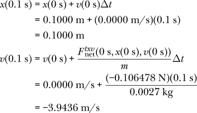

使用*t* = 0.1 s，*x*(0.1 s) = 0.1000 m，以及*v*(0.1 s) = –3.9436 m/s（我们表格第二行的信息），代入状态更新方程，我们可以求出*x*(0.2 s)和*v*(0.2 s)（我们表格第三行的信息）。

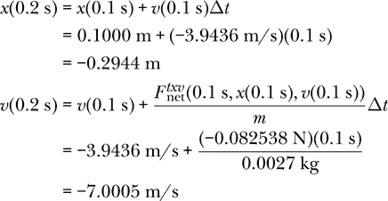

使用*t* = 0.2 s，*x*(0.2 s) = –0.2944 m，以及*v*(0.2 s) = –7.0005 m/s（我们表格第三行的信息），代入状态更新方程，我们可以求出*x*(0.3 s)和*v*(0.3 s)（我们表格第四行的信息）。

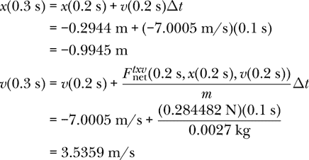

完整的表格如下所示：

| **t (s)** | **x(t) (m)** | **v(t) (m/s)** |
| --- | --- | --- |
| 0.0 | 0.1000 | 0.0000 |
| 0.1 | 0.1000 | –3.9436 |
| 0.2 | –0.2944 | –7.0005 |
| 0.3 | –0.9945 | 3.5359 |

由于状态是时间-位置-速度三元组，完成的这个表格包含了使用欧拉方法和 0.1 s 时间步长得到的乒乓球的前四个状态。如果我们让计算机使用我们的`statesTXV`函数生成无限长的状态列表，那么前四个状态应当是这样的。我们可以想象，完成这个表格的过程就是计算机反复执行的操作，用来为我们生成一个状态列表。

现在，让我们回到本章前面开发的技术，来找出乒乓球的位置随时间的变化。

#### 方法 1：生成状态列表

在这里，我们将使用`statesTXV`函数生成状态列表，然后提取位置与时间的信息来绘制图表。

我们不需要给作用在乒乓球上的力列表命名。我们可以将这个列表作为适当的输入传递给`statesTXV`，但我认为给这个力列表命名可能有助于我们的思考并使其更有条理。我们就把它称作`dampedHOForces`。

```
dampedHOForces :: [State1D -> Force]
dampedHOForces = [springForce 0.8
                 ,\(_,_,v0) -> fAir 2 1.225 (pi * 0.02**2) v0
                 ,\_ -> -0.0027 * 9.80665
                 ]
```

我们看到这是一份我们之前讨论的三个力的列表。首先是弹簧力，然后是空气阻力，最后是重力。我们使用匿名函数符号来表示后两个力，因为它们需要表示为状态的函数。对于重力，我们完全不关心状态，因此不需要指定状态或组成状态的时间、位置和/或速度变量。对于空气阻力，状态中的时间和位置条目下划线提醒我们，空气阻力函数并不需要它们的值。

为了生成无限的状态列表，我们使用`statesTXV`函数，时间步长为 1 毫秒，即 0.001 秒，这在接受范围内，因为更小的时间步长只会导致图形结果有细微差别。

```
dampedHOStates :: [State1D]
dampedHOStates = statesTXV 0.001 0.0027 (0.0,0.1,0.0) dampedHOForces
```

我们需要将所有关于我们问题的信息传递给`dampedHOStates`。除了 0.001 秒的时间步长外，我们还需要传递乒乓球的质量 0.0027 kg，初始状态为时间 0 秒、位置 0.1 米和速度 0 米/秒，以及我们命名为`dampedHOForces`的力的列表。

如果你想查看原始的时间-位置-速度数据，可以使用列表元素操作符（`!!`）来选择列表中的特定状态，或者你可以`take`这个无限列表中的前几个元素。

```
Prelude> :l Mechanics1D
[1 of 2] Compiling Newton2         ( Newton2.hs, interpreted )
[2 of 2] Compiling Mechanics1D     ( Mechanics1D.hs, interpreted )
Ok, two modules loaded.
*Mechanics1D> dampedHOStates !! 0
(0.0,0.1,0.0)
*Mechanics1D> dampedHOStates !! 5
(5.0e-3,9.960571335911717e-2,-0.1970379672671094)
*Mechanics1D> take 2 dampedHOStates
[(0.0,0.1,0.0),(1.0e-3,0.1,-3.943627962962963e-2)]
```

一对对的数据是我们可以使用`gnuplot`包中的`plotPath`函数绘制的内容，但在绘制之前，我们需要将列表截断为有限的列表；否则，`plotPath`会在计算无限列表时挂起。接下来的代码中，我们使用`take`函数提取前 3000 个状态，表示运动的前三秒。

```
dampedHOGraph :: IO ()
dampedHOGraph
    = plotPath [Title "Ping Pong Ball on a Slinky"
               ,XLabel "Time (s)"
               ,YLabel "Position (m)"
               ,PNG "dho.png"
               ,Key Nothing
               ] [(t,x) | (t,x,_) <- take 3000 dampedHOStates]
```

图 15-5 显示了球随时间变化的振荡情况。注意，振荡并没有以位置零为中心。这是因为零是没有附着球的弹簧的平衡位置。当我们附上乒乓球时，它的重量会拉伸弹簧向下，形成一个新的平衡位置，在此位置 – *k*[*x*0] – *mg* = 0。弹簧的向上力与重力的向下力相互抵消；空气阻力在新的平衡位置中不起作用，因为球在平衡时并未移动。新的平衡位置是 *x*[0] = *–mg*/*k* = –0.033 m，因此振荡围绕此位置进行，如你在图 15-5 中所见。

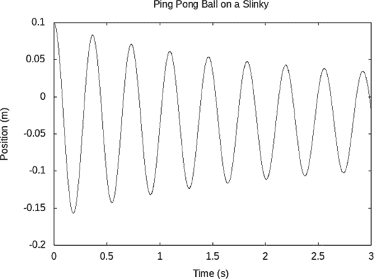

*图 15-5：乒乓球在弹簧末端的振荡*

在探索了使用状态列表作为解决牛顿第二定律的一种数据表示方式后，让我们来看另一种表示方式，即位置和速度函数。

#### 方法二：生成位置和速度函数

我们可以使用`positionFtxv`函数为乒乓球在弹簧上的运动生成一个位置函数。

```
pingpongPosition :: Time -> Velocity
pingpongPosition = positionFtxv 0.001 0.0027 (0,0.1,0) dampedHOForces
```

描述此情况所需的所有信息都包含在构成此函数主体的那一行中：0.0027 kg 的质量；初始状态为时间 0 秒、位置 0.1 米和速度 0 米/秒；以及之前定义的三种力的列表`dampedHOForces`。

以下代码将生成与图 15-5 中所示非常相似的图表。

```
dampedHOGraph2 :: IO ()
dampedHOGraph2
    = plotFunc [Title "Ping Pong Ball on a Slinky"
               ,XLabel "Time (s)"
               ,YLabel "Position (m)"
               ,Key Nothing
               ] [0,0.01..3] pingpongPosition
```

我们可以使用`velocityFtxv`函数为乒乓球在弹簧上的运动生成一个速度函数。

```
pingpongVelocity :: Time -> Velocity
pingpongVelocity = velocityFtxv 0.001 0.0027 (0,0.1,0) dampedHOForces
```

如之前所述，我们可以绘制我们的函数图形：

```
dampedHOGraph3 :: IO ()
dampedHOGraph3
    = plotFunc [Title "Ping Pong Ball on a Slinky"
               ,XLabel "Time (s)"
               ,YLabel "Velocity (m/s)"
               ,PNG "dho2.png"
               ,Key Nothing
               ] [0,0.01..3] pingpongVelocity
```

这段代码生成了图 15-6，图中展示了乒乓球的速度与时间的关系。由于我们将球从静止状态释放，速度从零开始，随着球向下运动，速度变为负值。速度发生振荡，并且表现出与位置相同的阻尼效应。

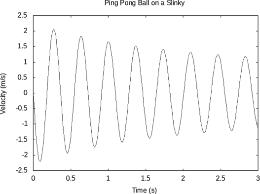

*图 15-6：一只弹簧球上的乒乓球的速度*

欧拉方法是一种通用的基于状态的求解一阶常微分方程组（或等价于单一高阶微分方程）的方法。然而，欧拉方法通常无法充分发挥计算效率，因为为了得到可接受的结果，时间步长通常需要非常小。有许多其他方法可以选择，我们将在下一节中探讨对欧拉方法的小改动，这通常能够在较大的步长下得到可接受的结果，从而减少计算成本。

### 欧拉-克罗默方法

我们可以对欧拉方法做一个小的修改，从而在许多情况下改善牛顿第二定律计算的结果。我们不再使用描述欧拉方法的功能图图 15-3，而是来看一下欧拉-克罗默方法的功能图，如图 15-7 所示。

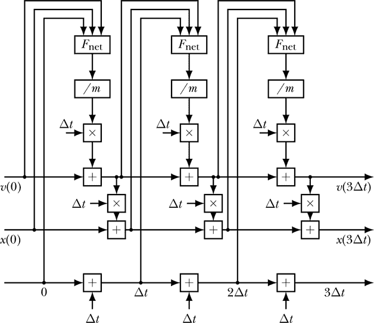

*图 15-7：一维牛顿第二定律的欧拉-克罗默方法*

差异在于用来更新位置的速度值。欧拉方法使用旧的速度值来更新位置。欧拉-克罗默方法使用与欧拉方法相同的速度更新方程计算新的速度，然后用这个新速度来更新位置。

欧拉-克罗默方法使用了以下略微修改过的方程，而不是欧拉方法中的状态更新方程 15.6 和 15.7：

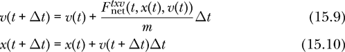

欧拉-克罗默方法的速度更新方程与欧拉方法的速度更新方程相同。不同之处在于在位置更新方程中将*v*(*t*)替换为*v*(*t* + Δ*t*)。尽管欧拉方法中的方程 15.6 和 15.7 的求值顺序无关紧要，但欧拉-克罗默方法中的速度更新方程必须在位置更新方程之前求值，因为更新后的速度将用于后者方程。

然而，使用具有不变对象引用的函数式编程语言的一个好处是，我们不需要担心告诉计算机先更新速度。我们可以按照任何顺序排列方程，编译器会自动确定合适的求值顺序。以下函数在欧拉-克罗默方法中起到了和`euler1D`在欧拉方法中所起的作用：

```
eulerCromer1D :: R                     -- time step dt
              -> (State1D -> (R,R,R))  -- differential equation
              -> State1D -> State1D    -- state-update function
eulerCromer1D dt deriv (t0,x0,v0)
    = let (_, _, dvdt) = deriv (t0,x0,v0)
          t1 = t0 + dt
          x1 = x0 + v1 * dt
          v1 = v0 + dvdt * dt
      in (t1,x1,v1)
```

在这段代码中，我使用了局部变量 `v1`，它是更新后的速度值，先给出如何计算它的方程。编译器会知道如何安排计算顺序，以便在使用 `v1` 之前先计算出它。

函数 `updateTXVEC` 是对应欧拉的 `updateTXV` 的欧拉-克罗默版本的状态更新函数。

```
updateTXVEC :: R                   -- time interval dt
            -> Mass
            -> [State1D -> Force]  -- list of force funcs
            -> State1D -> State1D  -- state-update function
updateTXVEC dt m fs = eulerCromer1D dt (newtonSecond1D m fs)
```

欧拉-克罗默方法在应该保持能量守恒的情况下更接近能量守恒，且通常对于具有振荡行为的情况更为适用。无论是欧拉方法还是欧拉-克罗默方法，当时间步长减小时，两者都会收敛到正确的结果，但欧拉-克罗默方法通常能在比欧拉方法所需的更大时间步长下也能得到可接受的结果。

图 15-7 显示了与欧拉-克罗默方法对应的 图 15-1 的另一种展开方式。比较 图 15-3（描述欧拉方法）和 图 15-7，我们可以看到，唯一的区别在于使用更新后的速度来更新位置。

函数 `statesTXV`、`velocityFtxv` 和 `positionFtxv` 使用了函数 `updateTXV`，这意味着它们使用的是欧拉方法。在习题 15.13 中，你需要为欧拉-克罗默方法编写类似的函数。

请注意，欧拉-克罗默方法是特定于二阶微分方程的，因为必须有一个状态变量扮演速度的角色，可以先更新它，然后用来更新主要未知函数（对于牛顿第二定律而言是位置）。

随着我们在接下来的几章中继续研究力学，我们将继续解微分方程。本章的最后一节通过更普遍地处理微分方程求解的过程，为未来章节的内容做准备。

### 解微分方程

一个典型的力学问题从物理问题开始，我们利用物理信息构建微分方程，然后变成数学问题，通过解微分方程得到结果，最后再变成物理问题，通过解释结果来得到物理意义。本节聚焦于数学活动，从微分方程开始，到最后掌握状态变量如何随自变量（在力学中代表时间）变化。

在 图 15-2 中，我们展示了在解决力学问题的过程中信息是如何转化的。从质量和力的信息开始，牛顿第二定律产生了一个微分方程。然后，欧拉方法将该微分方程转化为状态更新函数。通过迭代状态更新函数，给定初始状态，我们可以得到一系列状态。这些状态序列可以看作是问题的解，或者我们可以进行一个附加步骤，得出物体的位移和速度函数。

在接下来的几章中，我们将使用向量来描述像速度这样的量，并处理多个相互作用的粒子，我们将继续将求解力学问题的过程视为信息转化的过程，就像在图 15-2 中那样。为此，我们需要以两种方式对图 15-2 进行推广。`euler1D`方法将适用于任何使用状态空间`State1D`的微分方程。在前一章中，我们使用了`Velocity`和`(Time,Velocity)`作为状态空间，在接下来的章节中，我们将继续扩展我们使用的状态空间，包括向量和多个粒子。我们希望能够使用我们设计的新状态空间来应用欧拉方法，并且如果我们能够编写一次通用的欧拉方法，使其适用于任何状态空间，那将是非常棒的。在本节后面，我们将找出这些状态空间之间的共性，这使得我们能够做到这一点。因此，第一个推广是从状态空间`State1D`到更广泛的状态空间类别。

图 15-2 使用欧拉方法将微分方程转化为状态更新函数。现在我们引入了欧拉-克罗默方法，我们有了两种数值方法，每种方法都可以执行这种转化。第二个推广是从欧拉方法到其他数值方法。我们希望我们的信息转化过程能够支持我们希望使用的任何数值方法。

现在让我们来探讨如何推广状态空间的问题。

#### 推广状态空间

为了将状态空间从`State1D`推广到其他可能的状态空间，我们将使用类型变量`s`来表示状态的数据类型。如果我们能够编写以`s`而非`State1D`表示类型的函数，那么我们就可以在任何状态空间中使用这些函数。当我们推广`Velocity`、`(Time,Velocity)`和`State1D`时，类型`s`将包含任何物理系统所需的状态变量。

在图 15-2 中，基于状态空间`State1D`的微分方程，我们希望得到基于状态空间`s`的微分方程。在图 15-2 中，基于状态空间`State1D`的状态更新函数，我们希望得到基于状态空间`s`的状态更新函数。`euler1D`是一个数值方法，将基于`State1D`的微分方程转化为基于`State1D`的状态更新函数，我们希望能够讨论和编写将基于状态空间`s`的微分方程转化为基于`s`的状态更新函数的数值方法。

精确地说，我们将通过编写类型同义词，给出状态空间`s`的微分方程、状态更新函数和数值方法的形式定义。我们将从状态更新函数开始，因为它是三者中最简单的。

由于状态更新函数（例如 `updateTXV dt m fs`）会生成与输入状态具有相同类型的新状态，因此用于状态空间 `s` 的状态更新函数是一个 `s -> s` 的函数。这个定义可以通过类型同义词来表示。

```
type UpdateFunction s = s -> s
```

`UpdateFunction s` 类型是用于与状态空间 `s` 配合使用的状态更新函数类型。

表 15-1 显示了我们在上一章和本章中使用的状态更新函数。

**表 15-1：** 适用于不同状态空间的状态更新函数

| **状态更新函数** | **类型** |
| --- | --- |
| `updateVelocity dt m fs` | `UpdateFunction Velocity` |
| `updateTV dt m fs` | `UpdateFunction (Time,Velocity)` |
| `updateTXV dt m fs` | `UpdateFunction State1D` |

请注意，对于每个函数，我们必须提供时间步长、质量和一个力函数列表，之后结果表达式才会具有表格右侧所示的类型。

微分方程以状态作为输入，并生成每个状态变量的导数作为输出。在状态空间 `State1D` 中，输入由时间、位置和速度组成，而输出则是数字、速度和加速度。

时间与无量纲数值不同，位置与速度不同，速度与加速度不同。然而，这些在 `State1D` 中都是实数，因此状态空间也可以写作 `(R,R,R)`。在前面提到的 `euler1D` 函数中，我使用了类型 `State1D -> (R,R,R)` 来表示微分方程，并使用类型 `State1D -> State1D` 来表示状态更新函数。对编译器而言，这些是相同的类型。我之所以这样写，是因为数字、速度和加速度并不是属于 `State1D` 中的量。

为了处理状态变量与其时间导数之间的差异，我们将使用一个类型变量 `ds` 来表示状态变量的时间导数。就像类型变量 `s` 用于状态一样，类型变量 `ds` 用于状态的时间导数。

微分方程在 Haskell 中的表示方式是一个函数，给定一组状态变量时，它会返回一组状态变量的导数。如果 `s` 是状态的数据类型，而 `ds` 是状态的时间导数数据类型，那么微分方程的定义可以通过类型同义词给出。

```
type DifferentialEquation s ds = s -> ds
```

`DifferentialEquation s ds` 类型是适用于状态空间 `s` 和状态空间时间导数 `ds` 的微分方程类型。

表 15-2 显示了我们在上一章和本章中使用的微分方程。

**表 15-2：** 适用于不同状态空间的微分方程

| **微分方程** | **类型** |
| --- | --- |
| `newtonSecondV m fs` | `DifferentialEquation Velocity R` |
| `newtonSecondTV m fs` | `DifferentialEquation (Time,Velocity) (R,R)` |
| `newtonSecond1D m fs` | `DifferentialEquation State1D (R,R,R)` |

请注意，对于每个函数，我们必须提供质量和力函数列表，才能使结果表达式具有表右侧所示的类型。

数值方法将微分方程转化为状态更新函数。状态空间`s`和导数空间`ds`的数值方法定义可以通过类型同义词给出。

```
type NumericalMethod s ds = DifferentialEquation s ds -> UpdateFunction s
```

类型`NumericalMethod s ds`是与状态空间`s`和时间导数空间`ds`一起使用的数值方法的类型。

虽然微分方程本身是一个数学上精确的表达式，但应用数值方法来求解它必然涉及到近似。到目前为止，我们已经见过两种数值方法：欧拉方法和欧拉-克罗默方法。然而，在求解微分方程时还有许多数值方法可供选择。

由于存在许多数值方法，每种方法会导致不同的近似结果，因此将某个特定的数值方法嵌入到构成我们思考如何解决力学问题的基础理念和代码中并不合理。我们应该能够自由选择数值方法，与我们所求解的微分方程无关。我们希望将数值方法与微分方程分开。

表 15-3 显示了我们在本章中使用过的数值方法。在上一章中，我们从未编写过明确的数值方法，而是将欧拉方法的代码直接放入状态更新函数中。

**表 15-3：** 与 State1D 状态空间一起使用的数值方法

| **数值方法** | **类型** |
| --- | --- |
| `euler1D dt` | `NumericalMethod State1D (R,R,R)` |
| `eulerCromer1D dt` | `NumericalMethod State1D (R,R,R)` |

请注意，对于每个函数，我们必须提供时间步长，才能使结果表达式具有表右侧所示的类型。

给定一个微分方程和一个数值方法，我们可以通过应用该数值方法来求解微分方程，得到一个状态更新函数，然后迭代该状态更新函数生成状态列表。以下函数接收数值方法、微分方程和初始状态作为输入，输出一个状态列表。我们可以将该函数视为一个通用的微分方程求解器。

```
solver :: NumericalMethod s ds -> DifferentialEquation s ds -> s -> [s]
solver method = iterate . method
```

我们之前提到，求解微分方程是解决力学问题的数学部分，在此过程中，我们通过状态更新函数将微分方程转化，最终得到状态列表。函数`solver`完成了求解微分方程的整个数学过程。换句话说，它处理了求解力学问题的数学部分。

我们已经给出了微分方程、状态更新函数和数值方法的定义，每个方法都与状态空间`s`和时间导数空间`ds`配合使用。现在，我们转向编写一个通用函数`euler`，它可以作为几乎任意状态空间`s`的数值方法。

#### 状态空间的类型类

状态空间类型`s`和时间导数空间`ds`不能是任意数据类型。为了执行欧拉方法和其他数值方法，我们需要能够对时间导数空间`ds`的元素进行加法运算，并且希望能够通过时间步长对元素进行缩放。一个支持状态加法和通过实数对状态进行标量乘法的空间称为*实向量空间*。

为了表达我们的时间导数空间是一个实向量空间的约束，我们定义了一个类型类。

```
class RealVectorSpace ds where
      (+++) :: ds -> ds -> ds
      scale :: R -> ds -> ds
```

这段代码定义了一个新的类型类`RealVectorSpace`，该类包含两个函数：`(+++)`用于加法，`scale`用于标量乘法。从类型签名可以看出，加法函数接受两个状态导数作为输入，输出一个状态导数，而标量乘法函数接受一个实数和一个状态导数作为输入，输出一个状态导数。

对于我们希望使用的每个导数空间，我们将编写一个实例声明，明确该数据类型的加法和标量乘法应如何定义。对于类型`(R,R,R)`，这是与状态空间`State1D`相关联的导数空间，以下是实例声明：

```
instance RealVectorSpace (R,R,R) where
    (dtdt0, dxdt0, dvdt0) +++ (dtdt1, dxdt1, dvdt1)
        = (dtdt0 + dtdt1, dxdt0 + dxdt1, dvdt0 + dvdt1)
    scale w (dtdt0, dxdt0, dvdt0) = (w * dtdt0, w * dxdt0, w * dvdt0)
```

我们使用局部变量`dxdt0`来提醒我们这个名称代表的是一个量，表示位置相对于时间的导数。实例声明定义了两个三元组相加意味着对每对对应元素进行相加；它定义了通过一个实数对三元组进行缩放意味着对三元组中的每个元素都进行该实数的缩放。

我们还将使用一个类型类来声明一个必须在状态空间`s`和其导数空间`ds`之间保持的关系。这个关系描述了如何使用`ds`中状态变量的时间导数来推进状态空间`s`中的状态变量。我们将该类型类命名为`Diff`，以提醒我们它是与状态空间`s`和其导数空间`ds`之间的微分（即时间导数）相关的。

```
class RealVectorSpace ds => Diff s ds where
    shift :: R -> ds -> s -> s
```

这个类型类定义包含一个类型类约束，要求`ds`必须是一个`RealVectorSpace`。类型类`Diff`包含函数`shift`。对于我们希望使用的每对类型作为状态空间和导数空间，我们将提供一个实例声明，定义函数`shift`如何处理这两个空间的值。函数`shift`描述了如何使用导数状态的信息来推进一个状态。函数`shift`接受一个时间步长、一个状态导数和一个状态作为输入，输出一个新的状态。

一种用于关联两种类型，而非声明单一类型成员的类型类被称为*多参数类型类*。我们在本章编写的模块的引言代码中的第二行启用了一个名为`MultiParamTypeClasses`的`LANGUAGE`特性，以允许使用多参数类型类。默认情况下，它们是禁用的。

以下实例声明通过为`State1D`和`(R,R,R)`定义函数`shift`，声明了它们之间的微分关系：

```
instance Diff State1D (R,R,R) where
    shift dt (dtdt,dxdt,dvdt) (t,x,v)
        = (t + dtdt * dt, x + dxdt * dt, v + dvdt * dt)
```

函数`shift`表示，为了更新时间，我们应该将时间步长`dt`与时间变化的速率`dtdt`（即 1）相乘。它表示，为了更新位置，我们应该将时间步长`dt`与位置变化速率`dxdt`相乘，更新速度时也应类似处理。时间、位置和速度来自状态，而变化率则来自状态导数。

我们看到`shift`看起来很像欧拉方法。事实上，它比那更基本。`shift`函数将被欧拉方法使用，但也会被其他数值方法使用。

这是欧拉方法的通用版本，适用于任何基于任何状态空间的微分方程。

```
euler :: Diff s ds => R -> (s -> ds) -> s -> s
euler dt deriv st0 = shift dt (deriv st0) st0
```

只要数据类型`s`和`ds`通过`Diff`类型类恰当地关联，也就是说`s`是状态空间，`ds`是与`s`相伴随的导数空间，函数`euler`将使用状态变量从`s`进行欧拉方法运算，使用作为`deriv`传入的微分方程。欧拉方法通过一次调用`shift`函数来执行，其中导数在当前状态下被评估。

表 15-4 比较了`euler1D`和`euler`的类型。

**表 15-4：** 比较函数`euler1D`与更通用的函数`euler`

| **函数** |  | **类型** |
| --- | --- | --- |
| `euler1D` | `::` | `R -> NumericalMethod State1D (R,R,R)` |
| `euler` | `::` | `Diff s ds => R -> NumericalMethod s ds` |

函数`euler`可以在任何可以使用`euler1D`的地方使用，并且也可以用于其他地方。由于它是使用类型变量编写的，我们可以在未来的章节中使用`euler`来处理我们创建的状态空间。

我们能否使用欧拉-克罗默方法做同样的事情？也就是说，我们能否一次性编写一个适用于任何状态空间和任何微分方程的数值方法？遗憾的是，答案是否定的。欧拉法是一种通用的解决任何一阶微分方程系统的技术。欧拉-克罗默方法是专门针对二阶微分方程，或者是当我们能够识别出一个量来充当速度时，适用于一阶微分方程系统的方法。我们需要为每个处理的状态空间编写新的欧拉-克罗默函数。

接下来，我们将介绍另一种通用数值方法，它可以替代欧拉方法或欧拉-克罗默方法。

#### 另一种数值方法

在本节中，我们将介绍另一种通用数值方法，称为四阶龙格-库塔方法。数值方法有时会根据阶数进行分类。阶数给出了误差（数值解与精确解之间的差异）与步长的关系。当我们将步长缩小 10 倍时，第一阶求解器的误差缩小约 10 倍，而第二阶求解器的误差则缩小约 10²，或 100 倍。欧拉法和欧拉-克罗梅尔法是第一阶方法，它们的优点是简单；很容易理解它们为何有效。四阶龙格-库塔法则复杂得多。我们不会深入讨论它为何有效或为什么是四阶方法。但它是一种流行的微分方程求解方法，并且它让我们看到了另一种通用方法来求解微分方程。四阶龙格-库塔是一种通用方法，可以用于任何微分方程和状态空间。

以下是四阶龙格-库塔方法的代码：

```
rungeKutta4 :: Diff s ds => R -> (s -> ds) -> s -> s
rungeKutta4 dt deriv st0
    = let m0 = deriv                 st0
          m1 = deriv (shift (dt/2) m0 st0)
          m2 = deriv (shift (dt/2) m1 st0)
          m3 = deriv (shift  dt    m2 st0)
      in shift (dt/6) (m0 +++ m1 +++ m1 +++ m2 +++ m2 +++ m3) st0
```

你可以看到这个方法更复杂，但它与 `euler` 的类型相同，起到的作用也相同：将微分方程转化为状态更新函数。

既然我们有了三种数值方法，接下来让我们在一个已知解的微分方程上进行比较。

#### 数值方法比较

让我们比较我们介绍的三种数值方法。微分方程为

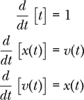

可以用 Haskell 编写如下：

```
exponential :: DifferentialEquation (R,R,R) (R,R,R)
exponential (_,x0,v0) = (1,v0,x0)
```

这些微分方程是可以精确求解的，解为

*x*(*t*) = *Ae^t*

*v*(*t*) = *Ae^t*

或

*x*(*t*) = *Ae^(”t)*

*v*(*t*) = –*Ae^(–t)*

对某些常数 *A*。如果我们关注初始状态，其中 *x*(0) = 1 且 *v*(0) = 1，解为

*x*(*t*) = *e^t*

*v*(*t*) = *e^t*

让我们将 *t* = 8 时的精确解与我们使用不同步长的三种数值方法得到的近似值进行比较。

`solver` 函数接受一个数值方法、一个微分方程和一个初始状态，返回一个状态列表。

```
*Mechanics1D> solver (euler 0.01) exponential (0,1,1) !! 800
(7.999999999999874,2864.8311229272326,2864.8311229272326)
*Mechanics1D> solver (eulerCromer1D 0.1) exponential (0,1,1) !! 80
(7.999999999999988,3043.379244966009,2895.0121485099035)
*Mechanics1D> solver (rungeKutta4 1) exponential (0,1,1) !! 8
(8.0,2894.789038540849,2894.789038540849)
```

在第一次使用 `solver` 时，我们使用了步长为 0.01，因此列表中的第 800 项对应于 *t* = 8。`solver` 的其他两次使用采用了不同的步长，因此对应 *t* = 8 的项号也不同。

表 15-5 比较了我们讨论的三种数值方法。你可以看到这些示例计算在表格中的位置。

**表 15-5：** 欧拉法、欧拉-克罗梅尔法和四阶龙格-库塔法与微分方程的精确解的比较

|  | **Δ*t* = 1** | **Δ*t* = 0.1** | **Δ*t* = 0.01** | **Δ*t* = 0.001** |
| --- | --- | --- | --- | --- |
| 精确解 | 2981 | 2981 | 2981 | 2981 |
| RK4 | 2895 | 2981 | 2981 | 2981 |
| 欧拉-克罗梅尔 | 2584 | 3043 | 2988 | 2982 |
| 欧拉法 | 256 | 2048 | 2865 | 2969 |

精确结果不依赖于任何步长，它只是 *e*⁸。随着步长的减小，所有三种数值方法的结果会越来越接近精确结果。欧拉方法在步长Δ*t* = 0.01 时与精确值的误差为 4％，在步长Δ*t* = 0.001 时为 1％。在Δ*t* = 0.1 时，欧拉-克罗梅方法比Δ*t* = 0.01 的欧拉方法更准确，在Δ*t* = 0.01 时，欧拉-克罗梅方法比Δ*t* = 0.001 的欧拉方法更准确。因此，与欧拉方法相比，我们可以在使用欧拉-克罗梅时将步长增加约 10 倍，并且得到相当的结果。同样，使用四阶龙格-库塔方法时，可以将步长增加约 10 倍，相比欧拉-克罗梅得到相似的结果。

### 总结

本章完成了上一章开始的一维力学的处理。我们看到了如何处理依赖于位置的力。对于依赖位置的力，牛顿第二定律是一个二阶微分方程，我们将其转换为位置和速度的状态变量的耦合一阶微分方程。我们可以将力学问题的解看作通过五种表示方式的序列转化：质量和力函数、微分方程、状态更新函数、状态列表和位置-速度函数。

一个乒乓球在弹簧玩具末端因空气阻力而发生的振荡是本章的核心示例。我们介绍了欧拉-克罗梅方法，这是一种改进的欧拉方法，用于求解二阶微分方程。我们还介绍了四阶龙格-库塔方法，它与欧拉方法一起，作为一种通用的数值方法，用于求解任何包含状态变量的微分方程。在下一章中，我们将通过将位置、速度和加速度视为向量，开始研究三维力学。

### 练习

**练习 15.1.** 让我们通过一个基本的抛体运动问题来热身，我们知道答案应该是什么样子。假设某人从地面上将一个球直上抛起，初速度为 10 m/s。忽略空气阻力，使用函数 `positionFtxv` 计算球的高度随时间的变化。绘制高度与时间的关系图。

**练习 15.2.** 在第 254 页手动做欧拉方法时，我们得到了位置和速度的数值表。请展示如何使用 Haskell 函数计算这些值。由于我在手动执行欧拉方法时对中间结果进行了四舍五入，所得值可能与四位小数不完全匹配，但在每种情况下，小数点后的前两位应该是相同的。

**练习 15.3.**（手动欧拉方法。）考虑以下微分方程：

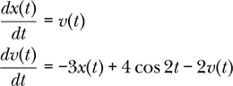

以及初始条件

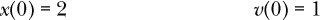

使用欧拉法，时间步长为 Δ*t* = 0.1，近似计算 *x*(0.3) 的值。计算时保留小数点后至少四位。将你的计算结果显示在一个小表格中。该表格将有三列，分别表示时间、位置和速度。

**练习 15.4。** 编写一个 Haskell 函数

```
update2 :: (R,R,R)  -- starting state
        -> (R,R,R)  -- ending state
update2 = undefined
```

它接收一个元组（*t*[0]，*x*[0]，*v*[0]），并返回一个元组（*t*[1]，*x*[1]，*v*[1]），用于求解微分方程的欧拉法单步结果。

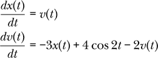

使用时间步长 Δ*t* = 0.1，并且与前一个练习中相同的初始条件。展示如何使用函数 `update2` 计算你在前一个练习中手动计算的 *x*(0.3) 值。

**练习 15.5。** 考虑一个质量为 3 千克的物体，通过一个弹簧与墙壁连接，弹簧的弹性常数为 100,000 N/m。忽略重力和摩擦力，如果将弹簧拉伸 0.01 米并释放，后续的运动将是什么样子？在多个振荡周期内研究该运动。将你的结果与精确解进行比较。找出一个足够小的时间步长，使得欧拉法解和精确解在图中完全重合。再找出一个足够大的时间步长，使得你能在图中看到欧拉法解与精确解之间的差异。

绘制一个漂亮的图表（带标题、坐标轴标签等），将这三种解（坏的欧拉法、好的欧拉法和精确解）画在同一个图中。标记欧拉法结果所使用的时间步长，并将精确解标记为“精确”。

**练习 15.6。** 让我们研究从高处掉落物体，特别是研究乒乓球和保龄球。在每种情况下，取 *C* = 1/2。你需要找出这些球的尺寸和质量等的良好近似值。让我们从 100 米和 500 米的高度将它们释放。绘制速度随时间变化的图和速度随垂直位置变化的图。在每种情况下，达到了终端速度的百分比是多少？以某种有意义且易于理解的方式整理你的结果。

**练习 15.7。** 返回到练习 15.5 中的谐振子。对于时间步长为 0.001 秒（你会记得这对欧拉法来说不是一个很好的时间步长），将欧拉法和欧拉-克罗梅法的解与精确解进行比较。绘制物体在前 0.1 秒内的位移随时间变化的图。将欧拉法、欧拉-克罗梅法和精确解绘制在同一坐标系上。同时，给出在 *t* = 0.1 秒时，三种解的物体位置（保留四位有效数字）。

**习题 15.8.** 考虑一个质量为*m*的物体，附着在一个弹簧上，弹簧的弹性常数为*k*。弹簧的另一端固定在垂直墙壁上。物体在地板上水平滑动。物体和地板之间有一个动摩擦系数*μ[k]* = 0.3。物体的重力是*mg*，所以物体上的动摩擦力是μ[k] *mg*，方向与物体的速度相反。

设*m* = 3 kg 和 *k* = 12 N/m。

(a) 编写一个类型为`State1D -> Force`的函数，给出动摩擦力的水平分量。你可能需要使用`signum`函数。

(b) 使用函数`positionFtxv`来找出物体随时间变化的位置。

(c) 绘制位置随时间变化的图像。

**习题 15.9.** 在大多数力学问题中，我们关心的物体质量是恒定的。没有必要在状态中包含一个不变的量。然而，由于一些力（如重力）依赖于质量，因此出于方便考虑，将质量包含在状态中是有一定动机的。本章中我们开发的几个函数接受一个力函数列表`[State1D -> Force]`作为输入。如果我们想将地球的重力作为一个依赖于状态的力，我们需要编写类似以下的代码：

```
earthGravity :: Mass -> State1D -> Force
earthGravity m _ = let g = 9.80665
                   in -m * g
```

另一方面，假设我们通过使用以下 4 元组作为状态的数据类型，将物体的质量包含在其状态中。

```
type MState = (Time,Mass,Position,Velocity)
```

然后我们可以编写一个地球重力函数，如下所示：

```
earthGravity2 :: MState -> Force
earthGravity2 (_,m,_,_) = let g = 9.80665
                          in -m * g
```

请注意，由于质量已包含在状态中，我们不再需要`Mass`作为函数类型中的额外参数。

编写以下函数的定义，使用`MState`替代`State1D`：

```
positionFtxv2 :: R                  -- time step
              -> MState             -- initial state
              -> [MState -> Force]  -- list of force funcs
              -> Time -> Position   -- position function
positionFtxv2 = undefined

statesTXV2 :: R                 -- time step
          -> MState             -- initial state
          -> [MState -> Force]  -- list of force funcs
          -> [MState]           -- infinite list of states
statesTXV2 = undefined

updateTXV2 :: R                  -- dt for stepping
           -> [MState -> Force]  -- list of force funcs
           -> MState             -- current state
           -> MState             -- new state
updateTXV2 = undefined
```

**习题 15.10.** 伦纳德-琼斯势能

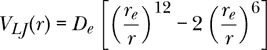

有时用来模拟原子之间的相互作用。表达式 V[*LJ*] (*r*)给出了当两个原子之间的距离为*r*时的系统潜能。当*r* → 0 时，潜能变得无限大，表示两个原子非常靠近时的困难。最低的潜能值发生在原子间隔*r* = *r[e]*时，这意味着参数*r[e]*是原子的平衡间隔。参数*D[e]*表示两原子分子解离能，也就是将两个原子（任意远）分开所需提供的能量。

伦纳德-琼斯力

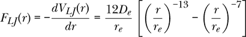

给出了由另一个原子产生的力，正值表示排斥力，负值表示吸引力。我们可以将 Lennard-Jones 力看作是连接两个原子的非线性弹簧。当原子间的距离大于*r[e]*时，弹簧提供一种吸引力，试图恢复平衡。当原子间的距离小于*r[e]*时，弹簧提供一种排斥力，试图恢复平衡。该弹簧是非线性的，因为恢复力与原子间距离的偏差不成正比。

图 15-8 显示了 Lennard-Jones 力作为原子间距离*r*的函数，以及最接近它的线性弹簧力。

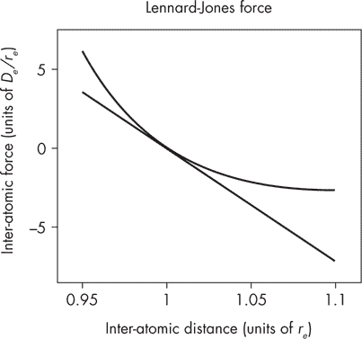

*图 15-8：Lennard-Jones 力（曲线）和最接近它的线性力（直线）*

对于 Lennard-Jones 力，有效弹簧常数是力与原子间距离的函数的负斜率。

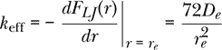

假设我们有一个质量为*m*的物体，通过 Lennard-Jones 弹簧与墙壁相连。在这个问题中，我们忽略重力和摩擦，因此 Lennard-Jones 力是唯一作用在物体上的力。如果围绕平衡位置的振荡幅度很小，振荡的角频率将接近

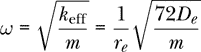

并且周期将接近

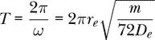

选择任意参数的*r[e]*、*D[e]*和*m*。

(a) 当初始位置为*r* = 1.01*r[e]*，初始速度为零时，绘制位置与时间的图形。图形应为振荡型。确认周期接近先前给出的值。

(b) 当初始位置为*r* = 5*r[e]*，初始速度为零时，绘制位置与时间的图形。现在的周期是多少？

这是一个非简谐振子示例，其中周期取决于振荡的幅度。只有简谐振子的特殊情况中，周期才与幅度无关。

**练习 15.11.** 手动应用 Euler 方法在第 254 页，我们得到了位置和速度的值表。用手工方式使用 Euler-Cromer 方法生成类似的值表。

**练习 15.12.** 编写一个函数`statesTXVEC`，它类似于`statesTXV`，但使用 Euler-Cromer 方法而不是 Euler 方法。使用该函数检查你在前一个练习中手工计算的值表。

**练习 15.13.** 编写`statesTXV`、`velocityFtxv`和`positionFtxv`的版本，使用 Euler-Cromer 方法而不是 Euler 方法。

**练习 15.14.** 展示如何使用 Haskell 函数计算比较表中的数值方法条目。

**练习 15.15.** 使用以下代码

```
instance RealVectorSpace (R,R) where
    (dtdt0, dvdt0) +++ (dtdt1, dvdt1) = (dtdt0 + dtdt1, dvdt0 + dvdt1)
    scale w (dtdt0, dvdt0) = (w * dtdt0, w * dvdt0)

instance Diff (Time,Velocity) (R,R) where
    shift dt (dtdt,dvdt) (t,v)
        = (t + dtdt * dt, v + dvdt * dt)
```

我们已经将数据类型`(R,R)`做为`RealVectorSpace`类型类的一个实例，并为类型对`(Time,Velocity)`和`(R,R)`编写了`Diff`实例。现在我们可以将`(Time,Velocity)`用作状态空间，`(R,R)`用作其导数空间，适用于欧拉法或四阶龙格-库塔方法。编写一个函数

```
updateTV' :: R                           -- dt for stepping
          -> Mass
          -> [(Time,Velocity) -> Force]  -- list of force funcs
          -> (Time,Velocity)             -- current state
          -> (Time,Velocity)             -- new state
updateTV' = undefined
```

它的作用与第十四章中的`updateTV`相同，但使用了本章中的`euler`函数。

**练习 15.16.** 牛顿第二定律通常会产生一个二阶微分方程（回顾表 14-1）。我们的`DifferentialEquation s ds`数据类型用于在给定状态变量时返回状态变量导数的函数。类型为`DifferentialEquation s ds`的函数表示一组耦合的一阶微分方程。

在这个练习中，我们将一个二阶微分方程重写为两个耦合的一阶微分方程。一个二阶（常规）微分方程有一个自变量和一个因变量（换句话说，一个未知函数）。一组耦合的二个一阶微分方程有一个自变量和两个因变量（自变量的两个未知函数）。

下面是将二阶微分方程转化为一组耦合一阶微分方程的步骤：

1.  联立方程组的自变量与二阶方程的自变量相同。

1.  对于联立方程组中的第一个未知函数，选择二阶方程中的未知函数。

1.  对于联立方程组的第二个未知函数，选择第一个未知函数对自变量的导数，并为此函数命名。

1.  联立方程组中的第一个微分方程表示第一个未知函数的导数等于第二个未知函数。

1.  为了形成这一组微分方程中的第二个微分方程，从原始的二阶微分方程开始，将未知函数的第一个导数替换为新的第二个未知函数，将未知函数的第二个导数替换为新的第二个未知函数的导数，并求解新的第二个未知函数的导数。

表示微分方程

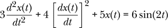

作为一组耦合的一阶微分方程。

**练习 15.17.** 范德波尔振荡器是谐振子的一种推广，常用于探索混沌。它由以下微分方程描述：

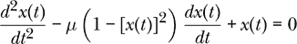

我们可以将这个方程视为来自牛顿第二定律，且存在两个力：一个类似弹簧的线性恢复力和一个阻尼力。在这个练习中，我们将放弃国际单位制（SI 单位），将质量和弹簧常数都设为 1。弹簧力则由以下公式给出：

*F*spring = –*x*

并且阻尼力由以下公式给出：

*F*阻尼 = *μ*(1 – *x*²)*v*

其中*μ*是一个参数，用于控制阻尼力的非线性程度。如果*μ* = 0，则范德波尔振荡器退化为简谐振荡器。

在研究混沌时，人们常常喜欢绘制相平面图，这些图是速度与位置的函数图。（它们也可以是动量与位置的函数图，但我们将使用速度。）填写以下代码中未定义的部分，以绘制*μ* = 0、*μ* = 2、*μ* = 4 和 *μ* = 6 的相平面图，并将它们绘制在同一张图上。

```
forces :: R -> [State1D -> R]
forces mu = [\(_t,x,_v) -> undefined x
            ,\(_t,x, v) -> undefined mu x v]

vdp :: R -> [(R,R)]
vdp mu = map (\(_,x,v) -> (x,v)) $ take 10000 $
         solver (rungeKutta4 0.01) (newtonSecond1D 1 $ forces mu) (0,2,0)

vdpPhasePlanePlot :: IO ()
vdpPhasePlanePlot = plotPaths [Title "Van der Pol oscillator"
                             ,XLabel "x"
                             ,YLabel "v"
                             ,PNG "VanderPol.png"
                             ,Key Nothing] (undefined :: [[(R,R)]])
```

结果应类似于图 15-9。

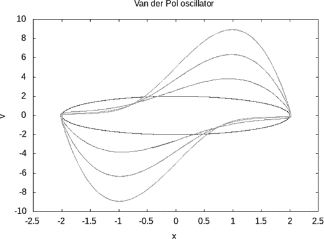

*图 15-9：范德波尔振荡器的相平面图*
