# 第十六章：三维力学


为了预测一个抛射体、卫星或任何可以在三维空间中自由运动的物体的运动，我们需要使用三维向量来描述速度、加速度和力。在本章中，我们将把在第十章中描述的三维向量与在第十五章中基于状态的求解技术结合起来。

描述物体或粒子的状态仍然是我们预测其未来运动的核心任务。我们将为三维空间中的粒子开发一组适当的状态变量，并定义一个名为`ParticleState`的新类型来保存它们。

在承认力与状态变量之间的依赖关系时，我们将*一体力*命名为一个函数，该函数在给定粒子状态时返回一个力矢量。我们给出多个一体力的例子，例如地球表面重力和空气阻力。

求解力学问题是一个通过一系列表示转换信息的过程，开始时是一个一体力列表，然后是一个微分方程，再是一个状态更新函数，最后是一个状态列表。牛顿第二定律表现为从力到微分方程的转换。数值方法将微分方程转化为状态更新函数。从初始状态开始反复执行状态更新函数，最终产生一个状态列表。

本章探讨了允许我们通过一系列表示转换信息来预测运动的基础思想和代码。让我们从一些引导代码开始。

### 引导代码

在本章以及接下来的两章中，我们将创建一个模块，该模块包含用于设置和求解三维中的牛顿第二定律的思想。在我们开始添加类型签名和函数定义之前，有一些代码需要放在源代码文件的顶部。这段引导代码由四个部分组成：请求警告、请求使用语言选项、模块名称以及我们希望从其他模块导入的类型和函数集合。

```
{-# OPTIONS -Wall #-}
{-# LANGUAGE MultiParamTypeClasses #-}

module Mechanics3D where

import SimpleVec
    ( R, Vec, PosVec, (^+^), (^-^), (*^), (^*), (^/), (<.>), (><)
    , vec, sumV, magnitude, zeroV, xComp, yComp, zComp, iHat, jHat, kHat)
import Mechanics1D
    ( RealVectorSpace(..), Diff(..), NumericalMethod
    , Time, TimeStep, rungeKutta4, solver )
import SpatialMath
    ( V3(..), Euler(..) )
import Graphics.Gnuplot.Simple
    ( Attribute(..), Aspect(..), plotFunc, plotPaths )
import qualified Graphics.Gloss as G
import qualified Vis as V
```

与往常一样，我们首先开启警告。然后，我们启用允许多参数类型类的语言选项，就像我们在上一章中做的那样。我们将这个模块命名为`Mechanics3D`，这将是我们在使用本模块中定义的任何类型或函数时的名称，无论是在独立程序中，还是在后续章节中我们编写的其他模块中。其余的代码是导入语句，表示我们希望使用其他人编写的模块中定义的类型、类型类和函数，或者我们在之前章节中编写的模块中定义的类型和函数。

具体来说，我们从第十章编写的`SimpleVec`模块中导入了向量运算，另外还从第十五章编写的`Mechanics1D`模块中导入了一些微分方程求解类型、类型类和函数。我们列出了从`SimpleVec`和`Mechanics1D`模块中导入的每一项名称，而不是直接导入整个模块。这是我偏好的风格，因为它可以显示出我们在模块中使用的每个名称的来源。如果你想导入所有的名称，可以写一行导入语句，使用关键字`import`后跟模块名称，就像我们在第十五章中做的那样。如果你从多个不同模块导入所有的名称，可能会有一个名称在多个模块中定义，导致编译器报错。这时你需要明确指定希望从哪个模块导入该名称。

在数据类型如`Attribute`后面的括号中加上两个点`(..)`表示我们想要导入该数据类型及其所有构造函数。如果省略两个点，则只会导入数据类型的名称。类型类后面的两个点，比如`RealVectorSpace`，表示我们希望除了导入类型类的名称外，还导入该类型类所拥有的函数。

最后，我们有对`Graphics.Gloss`和`Vis`模块的限定导入。第一个限定导入语句将`Graphics.Gloss`模块的简称`G`分配给该模块，这样我们就可以通过短名称`G`加点来访问`Graphics.Gloss`提供的任何类型或函数。例如，`Graphics.Gloss`模块中的`Picture`类型必须以`G.Picture`来引用。我选择这种限定导入方式的一个原因是，`Graphics.Gloss`和`Vis`模块都定义了几个相同的名称，比如`simulate`。我希望在我编写的代码中使用这两个`simulate`定义，因此需要一种方式来告诉编译器每次使用时应该选择哪个定义。

完成了我们的入门代码后，让我们来看看三维中的牛顿第二定律。

### 三维中的牛顿第二定律

方程 14.1 给出了牛顿的第二定律在一维中的表达式。在三维中，位置、速度、加速度和力是通过向量来表示，而不是通过数字。在三维中，物体上的合力是作用在物体上的各个力的向量和：

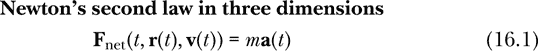

这是牛顿第二定律在三维中的微分方程形式：

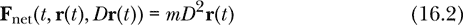

图 16-1 展示了牛顿第二定律在三维中的示意图。由于加速度、速度和位置现在都作为向量处理，因此有两个积分器具有向量输入、向量输出和向量状态。

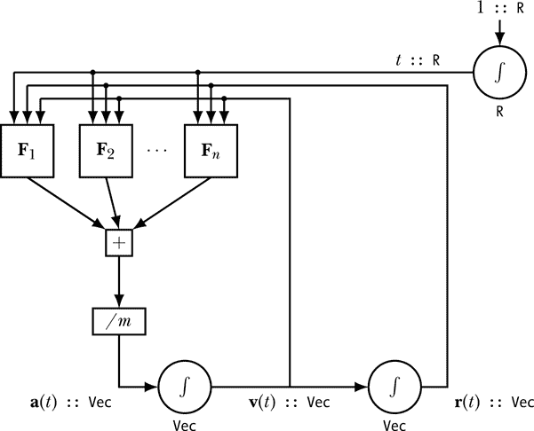

*图 16-1：牛顿第二定律的示意图*

这里，力依赖于时间、位置和速度。加速度依赖于净力。速度是加速度的积分，位置是速度的积分。每个积分器下方的类型表示该积分器作为状态所持有的量的类型。输出时间的积分器持有一个实数作为状态，输出位置的积分器持有一个向量作为状态，输出速度的积分器也持有一个向量作为状态。

图示中的两个积分器分别保持速度和位置作为状态，因此至少我们需要将速度和位置作为状态变量。我们在第十四章和第十五章中为了方便而包含了时间作为状态变量，我们将在这里继续这么做。将牛顿第二定律写成一组耦合的一阶微分方程，得到以下方程：

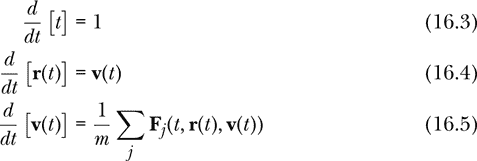

方程 16.3、16.4 和 16.5 包含的信息等同于图 16-1 中的图示。

在介绍了三维的牛顿第二定律之后，现在让我们转向如何在三维空间中描述粒子的状态的问题。

### 一个粒子的状态

粒子的状态发挥着五个作用。首先，状态指定了预测所需的信息；它是关于系统的当前信息，可以在没有历史信息的情况下进行未来预测（即过去的信息）。第二，状态为一阶微分方程 16.3、16.4 和 16.5 提供了模板，这些方程构成了我们数值逼近方法的起点；每个一阶微分方程表示状态变量之一的时间变化率，表达式中仅涉及状态变量。第三，状态描述了需要通过状态更新函数来更新的信息。第四，状态包含了力所依赖的信息。最后，随时了解状态就是解决牛顿第二定律问题，因为我们想知道关于粒子的任何信息，都是其状态的某个函数。

由于作用在粒子上的力可能依赖于粒子的质量（如引力）或电荷（如洛伦兹力定律，我们将在本章稍后讨论），因此将质量和电荷包含在状态中是方便的。然而，这并不是必需的；质量和电荷在大多数物理情境下保持恒定，因此我们可以将它们视为与状态无关的全局值。但是，将质量和电荷作为状态变量将简化我们的一些代码，并允许某些力仅作为状态的函数，而不是作为状态和一个或多个参数的函数来表达。

我们将用于描述单个粒子状态的`ParticleState`数据类型定义包括质量、电荷、时间、位置和速度作为状态变量。

```
data ParticleState = ParticleState { mass     :: R
                                   , charge   :: R
                                   , time     :: R
                                   , posVec   :: Vec
                                   , velocity :: Vec }
                     deriving Show
```

我们使用记录语法为新数据类型的每个字段提供自己的提取函数（`mass`、`charge`等）。提取函数也称为消除器或选择器。我们决定创建一个新的数据类型（使用`data`关键字），而不是类型同义词，以确保该类型不会与任何其他类型混淆。我们希望能够显示该数据类型的值，因此我们希望`ParticleState`是类型类`Show`的一个实例。通过包含`deriving Show`，我们要求编译器自动计算出如何创建一个`Show`实例。

为了方便起见，我们定义了一个默认的`ParticleState`，可以用来创建新的粒子状态。

```
defaultParticleState :: ParticleState
defaultParticleState = ParticleState { mass     = 1
                                     , charge   = 0
                                     , time     = 0
                                     , posVec   = zeroV
                                    , velocity  = zeroV }
```

`defaultParticleState`允许我们定义一个粒子状态，而无需显式提供所有五个信息。例如，要指定一个 2 千克的石头状态，电荷为零，位于原点，速度为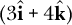米/秒，我们可以写出以下代码：

```
rockState :: ParticleState
rockState
    = defaultParticleState { mass    = 2                         -- kg
                           , velocity = 3 *^ iHat ^+^ 4 *^ kHat  -- m/s
                           }
```

因为我们有默认状态，所以不需要显式地提供与默认值相同的状态变量，如电荷、时间和位置。回想一下，操作符`*^`用于通过左侧的数字缩放右侧的向量。

牛顿第二定律是根据力函数列表构造微分方程的一个公式。在第十四章和第十五章中，我们看到了力函数的实用性，其中力依赖于粒子状态。我们将定义*一体力*为依赖于当前粒子状态的力，这个状态由`ParticleState`表示；换句话说，力可能依赖于时间或粒子的位置、速度、质量或电荷。

```
type OneBodyForce = ParticleState -> Vec
```

在接下来的章节中，我们将看到许多常见的力在力学中自然地表现为一体力。

我们下面写的代码用于牛顿第二定律将产生一个微分方程。换句话说，它将产生一个函数，当给定状态变量本身时，返回状态变量的时间导数。我们应该如何返回这些状态变量的时间导数呢？由于状态变量被捆绑在一个类型为`ParticleState`的对象中，我们将类似地将时间导数捆绑在一个类型为`DParticleState`的对象中。以下是我们定义的新数据类型`DParticleState`：

```
data DParticleState = DParticleState { dmdt :: R
                                     , dqdt :: R
                                     , dtdt :: R
                                     , drdt :: Vec
                                     , dvdt :: Vec }
                      deriving Show
```

由于粒子状态中包含五个量，因此状态导数中也包含五个量。其提取函数为`dmdt`（得名于导数*dm*/*dt*）的实数表示质量变化率。质量在我们的示例中不会发生变化，因此该变化率为零，但在某些情况下，质量变化的能力是有用的，例如火箭运动（火箭消耗燃料）。其他每个提取函数的命名旨在表示该量表示状态变量变化率。`dqdt`和`dtdt`表示电荷和时间变化率的实数。时间对时间的变化率为 1，所以追踪这个变化率有点多余。另一种做法是编写一个省略该量的数据类型；我选择了一个与状态结构相平行的数据类型，即使有些槽位存储的内容看起来显而易见。`drdt`和`dvdt`表示位置和速度变化率。这些量是向量，正如数据类型定义所示。

下述函数`newtonSecondPS`是牛顿第二定律的 Haskell 表示形式，相当于微分方程 16.3、16.4 和 16.5。

```
newtonSecondPS :: [OneBodyForce]
               -> ParticleState -> DParticleState  -- a differential equation
newtonSecondPS fs st
    = let fNet = sumV [f st | f <- fs]
          m = mass st
          v = velocity st
          acc = fNet ^/ m
      in DParticleState { dmdt = 0    -- dm/dt
                        , dqdt = 0    -- dq/dt
                        , dtdt = 1    -- dt/dt
                        , drdt = v    -- dr/dt
                        , dvdt = acc  -- dv/dt
                        }
```

函数`newtonSecondPS`是将一组单体力转换为微分方程的公式。名称中的 PS 表示该函数与`ParticleState`数据类型一起工作。由`newtonSecondPS`生成的微分方程表示每个状态变量的时间变化率，用状态变量本身表示。给定五个状态变量的值，函数`newtonSecondPS`将返回这五个状态变量的时间变化率的值。

函数`newtonSecondPS`包含一个`let`表达式，在该表达式中，我们首先找到表示粒子当前状态下合力的`Vec`，将其命名为`fNet`，然后分别将粒子的质量和速度命名为`m`和`v`，最后通过将合力除以质量来计算粒子的加速度。`let`表达式的主体返回一个类型为`DParticleState`的状态导数。质量和电荷对时间的导数为 0，因为质量和电荷不变化。时间对时间的导数为 1。最后，位置的导数是当前状态下的速度，而速度的导数是`let`表达式中计算出的加速度。

我们将函数`newtonSecondPS fs`视为牛顿第二定律的哈斯克尔版本，其中`fs`是描述物理情况的一体力列表。图 16-1 中的示意图、微分方程 16.3、16.4 和 16.5，以及哈斯克尔函数`newtonSecondPS`是表达牛顿第二定律的不同方式，适用于三维空间中的单一物体。

### 解决牛顿第二定律

我们构建并求解牛顿第二定律的策略是通过四种不同形式的信息转换来处理物理情况：

1.  一体力

1.  微分方程

1.  状态更新函数

1.  状态列表

图 16-2 展示了数据表示的功能图，垂直箭头表示数据表示，方框表示将数据从一种表示转换为另一种表示的函数。

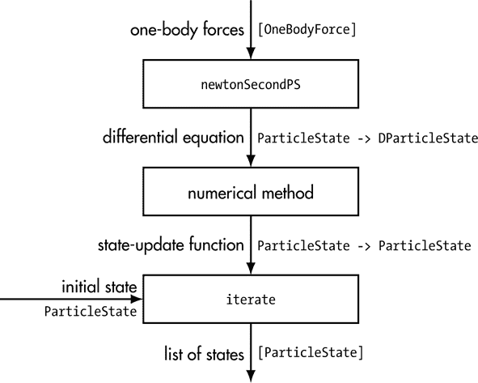

*图 16-2：解决单粒子力学问题的数据流*

一体力列表是我们用来描述物理情况的四种信息表示方式中的第一种，每种方式都越来越接近解决方案。这个一体力列表描述了粒子所处的物理环境或情况，作为代数类比，它类似于初学物理时所用的自由体图，用于展示作用于物体上的所有力。

牛顿第二定律提供了将一体力转化为微分方程的方法，这是我们的第二种信息表示。函数`newtonSecondPS`将牛顿第二定律应用于`ParticleState`数据类型。微分方程的哈斯克尔表示是函数`ParticleState -> DParticleState`，它给出了状态变量随时间变化的速率，并以状态变量本身为表达式。

状态更新函数是我们第三种信息表示方式；它描述了如何在时间上向前迈出小步，从一个旧状态产生一个新状态。我们使用的二维和三维动画工具以状态更新函数作为输入；因为粒子运动的动画可视化算作一个力学问题的解，所以该动画中的状态更新函数也可以看作是一个解。为了从微分方程中得到状态更新函数，我们需要数值方法。通过使用数值方法，我们承认我们仅仅是在寻找力学问题的近似解，而不是通过解析方法解决微分方程时能找到的精确解。我们可以选择不同的数值方法；`euler 0.01`、`eulerCromerPS 0.1` 和 `rungeKutta4 0.1` 都是可以用来生成状态更新函数的数值方法示例。我们将在本章后面写出`eulerCromerPS`函数，也会展示如何使用在上一章中编写的通用函数`euler`和`rungeKutta4`。选择了数值方法后，我们将其应用到微分方程上，从而得到一个状态更新函数。

我们使用的第四种信息表示方式是一个状态列表。该列表给出了通过数值方法计算的粒子在每个时间点的状态；换句话说，每个列表元素是特定时刻的状态，它比前一个列表元素的时间步长要长。这几乎是我们能知道的关于粒子的信息了。通过这些信息，我们可以将任何状态变量绘制为时间或其他状态变量的函数。

我们可能关心的其他量，如能量或动量，虽然不包含在状态中，但却是状态变量的函数。如果我们愿意，我们可以写一个更高阶的函数，从状态列表中提取出粒子的位置函数或速度函数。要从状态更新函数得到状态列表，我们只需使用 Prelude 中的`iterate`函数迭代状态更新函数，这个函数将状态更新函数应用到给定的初始状态，然后不断应用到更新后的状态，直到生成一个列表。

图 16-2 应当被视为在三维空间中解决单粒子力学问题的过程概述。该图与图 15-2 相似，主要有两个区别：(1) 我们使用了新的`ParticleState`数据类型，它包含质量；(2) 新的图允许选择数值方法，而上一图则坚持使用欧拉方法。

总结来说，我们的过程大致是将我们的物理问题（由一体力给出）转化为数学问题（一个微分方程），解决数学问题（通过数值方法生成状态更新函数，并进行迭代产生一系列状态），然后回到物理学解释结果。

在概述了我们将用于解决牛顿第二定律的过程后，接下来让我们看看一些一体力的例子。

### 一体力

我们在本章之前介绍了一体力的定义，但并未给出任何例子。许多我们希望纳入牛顿第二定律的常见力本质上都可以表示为一体力。

#### 地球表面重力

一个靠近地球表面的物体会感受到来自地球的引力。（这是引力理论列表中第 148 页的理论 2。）如果**g**是指向地球中心的重力加速度，那么地球对靠近地球表面质量为*m*的粒子或物体施加的引力为：

**F**[*g*] = *m***g**

如果我们同意让坐标系的 z 轴指向远离地球中心的方向，并且使用国际单位制，那么地球表面重力的一体力可以写作如下：

```
-- z direction is toward the sky
-- assumes SI units
earthSurfaceGravity :: OneBodyForce
earthSurfaceGravity st
    = let g = 9.80665  -- m/s²
      in (-mass st * g) *^ kHat
```

回想一下，一体力是从粒子状态到力向量的函数。局部变量`st`保存粒子状态，`mass st`通过提取函数`mass`从粒子状态中提取质量，该提取函数是因为我们在定义`ParticleState`时使用了记录语法而自动生成的。

如果地球表面重力是作用于我们粒子的力，那么我们需要做的就是将`earthSurfaceGravity`包含在构成`newtonSecondPS`输入的一体力列表中。适当的质量将从状态中提取，引力将被包含在牛顿第二定律中。

#### 太阳产生的引力

任何具有质量的物体都会对任何其他具有质量的物体施加引力。（这是引力理论列表中第 148 页的理论 3。）如果物体是球形的，一个物体对另一个物体施加的引力与每个物体的质量成正比，与它们中心之间距离的平方成反比。这就是牛顿万有引力定律的内容，我们将在第十九章中详细讨论。

在我们的太阳系中，有许多对象对，其中一个对象比另一个对象重得多，例如太阳/地球、地球/月球和地球/通信卫星。如果我们想要理解地球在太阳系中移动的运动，可以很好地假设两件事：一是其他行星（如火星、金星和木星）的引力吸引对地球的影响非常小，因此可以忽略不计；二是太阳与地球相比如此之大，其位置可以视为固定。在这些近似情况下，太阳产生的普遍重力可以视为作用于地球（或火星、金星、哈雷彗星等）的一体力。

太阳对具有质量*m*的物体或粒子施加的引力是

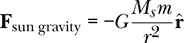

其中*G*是牛顿引力常数（在国际单位制中，*G* = 6.67408 × 10^(-11) N m²/kg²），*M[s]*是太阳的质量（*M[s]* = 1.98848 × 10³⁰ kg），*r*是太阳中心与物体中心之间的距离，以及

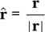

是一个单位矢量，指向太阳朝向物体。负号意味着物体上的力指向太阳。可以写出太阳引力的一体力如下：

```
-- origin is at center of sun
-- assumes SI units
sunGravity :: OneBodyForce
sunGravity (ParticleState m _q _t r _v)
    = let bigG = 6.67408e-11  -- N m²/kg²
          sunMass = 1.98848e30  -- kg
      in (-bigG * sunMass * m) *^ r ^/ magnitude r ** 3
```

这里我们使用输入模式匹配来提取状态变量，而不是我们用于地球表面重力的前一个一体力的提取函数。我们使用`ParticleState`构造函数匹配粒子状态的模式。我们分配跟随构造函数的五个局部变量的值为质量、电荷、时间、位置和速度。我们不需要电荷、时间或速度来计算太阳施加的引力，因此它们前面有下划线。 （我们可以仅对任何或所有未使用的变量使用下划线，但在下划线后提供名称提醒我们忽略的内容。）选择是使用提取函数还是模式匹配来从状态中获取状态变量是一种风格问题，您可以使用您最喜欢的任何一种。

如果我们对月球绕地球运动感兴趣，我们可以将地球的普遍重力表达为作用于月球的一体力。练习 16.4 要求您为地球产生的普遍重力编写一个一体力。另一方面，如果我们对月球在太阳系中的运动感兴趣，那么太阳和地球的引力都很重要，最好使用第十九章的技术。

#### 空气阻力

空气阻力是一种一体力，依赖于物体在空气中移动的速度。我们假设空气在我们的坐标系中是静止的。在第十四章中，我们推导出了适用于一维情况的空气阻力表达式。在三维情况下，速度是一个向量，空气阻力的力表现为

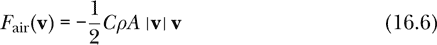

参数*C*、*ρ* 和 *A* 仍然分别表示拖曳系数、空气密度和物体的横截面积。

这是对应于方程 16.6 的一体力的 Haskell 代码：

```
airResistance :: R  -- drag coefficient
              -> R  -- air density
              -> R  -- cross-sectional area of object
              -> OneBodyForce
airResistance drag rho area (ParticleState _m _q _t _r v)
    = (-0.5 * drag * rho * area * magnitude v) *^ v
```

我们在命名传入粒子状态`ParticleState _m _q _t _r v`时，使用了模式匹配。力仅依赖于速度，因此速度是唯一需要命名的状态变量。

对于任何需要考虑空气阻力的情况，我们需要估算一个拖曳系数，确定物体的横截面积，并确定一个适当的空气密度值。在地球表面附近的合理温度和压力下，空气的密度约为 1.225 kg/m³。例如，如果我们的拖曳系数是 0.8，物体的横截面积是 0.003 m²，那么

```
airResistance 0.8 1.225 0.003
```

在`newtonSecondPS`的一体力列表中将包括空气阻力力，这出现在牛顿第二定律中。

如果我们要做大量的空气阻力问题，可能会将物体的横截面积纳入状态，因为它显然是物体的一个属性。如果我们认为拖曳系数是物体的属性，而不是物体与空气之间相互作用的属性，我们甚至可以考虑将拖曳系数纳入状态。我们不会对状态数据类型进行这些修改；相反，我们将坚持使用`ParticleState`，当力依赖于不包含在状态中的参数时，我们将根据具体情况逐一处理，就像我们在这里做的那样。

#### 风力

我们刚刚考虑的空气阻力一体力假设空气在我们的坐标系中是静止的。本节中考虑的风力是一种空气阻力的推广，即空气相对于我们的坐标系以某个恒定速度运动。我们可以使用空气阻力公式来计算风力，但适用的速度是物体与风之间的*相对速度*。如果**v**是物体相对于我们坐标系的速度，**v**[wind]是空气相对于我们坐标系的速度，那么**v** – **v**[wind]就是物体相对于空气的速度。风力可以表达为：

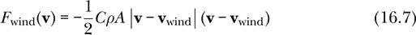

这是对应的 Haskell 代码：

```
windForce :: Vec  -- wind velocity
          -> R    -- drag coefficient
          -> R    -- air density
          -> R    -- cross-sectional area of object
          -> OneBodyForce
windForce vWind drag rho area (ParticleState _m _q _t _r v)
    = let vRel = v ^-^ vWind
      in (-0.5 * drag * rho * area * magnitude vRel) *^ vRel
```

风力的代码与空气阻力的代码类似。练习 17.5 提供了尝试这一力的机会。请注意，如果选择风速为 0，那么风力就变成了我们在上一节中讨论的空气阻力。空气阻力是静止的空气对物体施加的力，而风力是流动的空气对物体施加的力。如果空气的力在某种情况下很重要，你需要使用空气阻力或风力，而不是两者兼用。

#### 来自均匀电场和磁场的力

我们还没有讨论电场或磁场，但我们将在本书的第三部分中讨论。现在，重要的是要知道，这些场是由电荷产生的，粒子在电场和/或磁场中会经历一个力。当这些场是*均匀*时，意味着它们在空间中的不同位置是相同的，那么一个向量可以描述电场，另一个向量可以描述磁场。

假设**E**是一个均匀电场向量，**B**是一个均匀磁场向量。这些场对穿越它们的带电粒子施加力，如下所示：

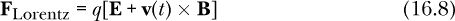

其中*q*是粒子的电荷，**v**(*t*)是粒子的速度。这个方程被称为*洛伦兹力定律*，我们将在电磁学理论部分详细研究它，包括场不一定均匀时的更一般情况。以下是对应的 Haskell 代码，表示单粒子的力：

```
uniformLorentzForce :: Vec  -- E
                    -> Vec  -- B
                    -> OneBodyForce
uniformLorentzForce vE vB (ParticleState _m q _t _r v)
    = q *^ (vE ^+^ v >< vB)
```

函数`uniformLorentzForce`的类型是`Vec -> Vec -> OneBodyForce`，这与`Vec -> Vec -> ParticleState -> Vec`相同。给定一个电场向量`vE :: Vec`、一个磁场向量`vB :: Vec`和一个粒子状态`ParticleState _m q _t _r v :: ParticleState`，通过模式匹配输入，该函数通过应用洛伦兹力定律（方程 16.8）返回一个力向量。粒子的电荷和速度是计算这一电磁力所需的状态变量。

在看到多个单粒子力的例子后，我们继续沿着图 16-2 探讨状态更新过程。

### 单粒子状态更新

数值方法将微分方程转化为状态更新函数。欧拉-克罗默方法就是一种数值方法，由于它不是一种通用数值方法，因此我们需要为每种状态数据类型编写一个新的函数。以下是`ParticleState`数据类型的欧拉-克罗默函数：

```
eulerCromerPS :: TimeStep        -- dt for stepping
              -> NumericalMethod ParticleState DParticleState
eulerCromerPS dt deriv st
    = let t   = time     st
          r   = posVec   st
          v   = velocity st
          dst = deriv st
          acc = dvdt dst
          v'  = v ^+^ acc ^* dt
      in st { time     = t  +         dt
            , posVec   = r ^+^ v'  ^* dt
            , velocity = v ^+^ acc ^* dt
            }
```

正如我们在上一章中使用欧拉-克罗默方法所看到的，与欧拉方法相比，关键的区别在于它使用更新后的速度来更新位置。`eulerCromerPS`中的更新方程几乎与上一章的`eulerCromer1D`中的方程相同，唯一的区别是我们现在使用的是向量。

欧拉法和四阶龙格-库塔法是用于解决任何微分方程的通用方法。在第十五章中，我们编写了`euler`和`rungeKutta4`函数，这些函数可以处理任何微分方程和任何状态类型。为了将它们与`ParticleState`数据类型一起使用，我们必须为`DParticleState`编写一个`RealVectorSpace`实例，并为`ParticleState`和`DParticleState`类型编写一个`Diff`实例。

这是`RealVectorSpace`实例：

```
instance RealVectorSpace DParticleState where
    dst1 +++ dst2
        = DParticleState { dmdt = dmdt dst1  +  dmdt dst2
                         , dqdt = dqdt dst1  +  dqdt dst2
                         , dtdt = dtdt dst1  +  dtdt dst2
                         , drdt = drdt dst1 ^+^ drdt dst2
                         , dvdt = dvdt dst1 ^+^ dvdt dst2
                         }
    scale w dst
        = DParticleState { dmdt = w *  dmdt dst
                         , dqdt = w *  dqdt dst
                         , dtdt = w *  dtdt dst
                         , drdt = w *^ drdt dst
                         , dvdt = w *^ dvdt dst
                         }
```

在此实例声明中，我们定义加法为每个项的逐项加法，定义标量乘法为每个项的逐项缩放。

这是`Diff`实例：

```
instance Diff ParticleState DParticleState where
    shift dt dps (ParticleState m q t r v)
        = ParticleState (m  +  dmdt dps  * dt)
                        (q  +  dqdt dps  * dt)
                        (t  +  dtdt dps  * dt)
                        (r ^+^ drdt dps ^* dt)
                        (v ^+^ dvdt dps ^* dt)
```

状态中的每个项都通过其导数与时间步长的乘积进行平移。

在做出这些实例声明后，我们现在可以访问在上一章中编写的`euler`和`rungeKutta4`函数。我们可以使用三种数值方法中的任何一种，欧拉法、欧拉-克罗默法或四阶龙格-库塔法，从微分方程中生成状态更新函数。

图 16-2 展示了我们用来解决力学问题的四种数据表示方式和三种从一种数据表示转换到另一种数据表示的函数。这三种函数的组合非常重要，以至于需要命名，并在图 16-3 的两侧以箭头形式显示。我们在上一章中编写了`solver`，并将在接下来的章节中编写`updatePS`和`statesPS`。

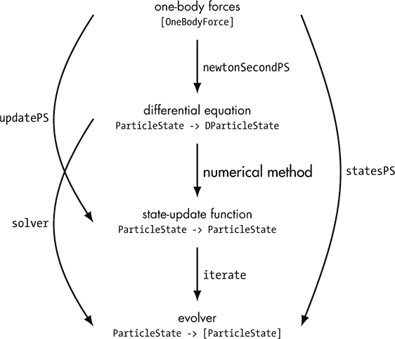

*图 16-3：数据表示与它们之间转换的函数*

图 16-3 再次展示了四种数据表示方式，并进行了一个小的更改。与图 16-2 中的最终表示为状态列表不同，图 16-3 展示了从初始状态到状态列表的一个函数，我们称之为*进化器*。之所以做出这个改变，是因为我们希望将图 16-3 中的每个表示视为将单个函数应用于由前一个表示构成的单一输入的结果。换句话说，在图 16-2 中，初始状态作为输入出现，而在图 16-3 中，它是进化器类型的一部分。为了在图 16-3 中进行相邻表示之间的转换，我们应用了牛顿第二定律、数值方法，然后进行迭代。

让我们编写一个函数`statesPS`，它通过从力中产生微分方程，使用数值方法将微分方程转化为状态更新函数，并迭代状态更新函数来生成一个进化器，从而生成图 16-3 中的所有三种转换。这个函数的输入将是一个数值方法和一组单体力。输出将是一个可以作用于初始状态并生成无限状态列表的进化器。我们称这个函数为`statesPS`，因为它在提供初始状态时生成状态列表，且适用于`ParticleState`数据类型。

```
statesPS :: NumericalMethod ParticleState DParticleState
         -> [OneBodyForce]  -- list of force funcs
         -> ParticleState -> [ParticleState]  --evolver
statesPS method = iterate . method . newtonSecondPS
```

局部变量`method`代表我们在使用`statesPS`时提供的数值方法。从定义中可以看出，这个函数是三个函数的复合，如图 16-3 所示。回想一下，数值方法包括`euler 0.01`、`eulerCromerPS 0.1`和`rungeKutta4 0.1`等。请注意，`newtonSecondPS`函数将力转换为微分方程，它可以与任何数值方法一起使用。

同样地，将力列表转换为状态更新函数的函数名称也非常有用，尤其是对于动画。我们将这个函数称为`updatePS`，从它的定义可以看出，它只是牛顿第二定律与数值方法的复合。

```
updatePS :: NumericalMethod ParticleState DParticleState
         -> [OneBodyForce]
         -> ParticleState -> ParticleState
updatePS method = method . newtonSecondPS
```

图 16-3 演示了这个函数如何适配到数据表示的序列中。

我们可能希望进行的最终转换组合由我们在上一章中编写的`solver`函数表示。与`statesPS`和`updatePS`需要`ParticleState`数据类型不同，`solver`函数适用于任何数据类型（任何状态空间）。如果回顾它的定义，你会发现它只是一个数值方法与迭代的复合。

我们现在处于一个极好的位置。要解决任何一个体力学问题，我们只需向计算机提供：

+   一个数值方法

+   一组单体力

+   物体的初始状态

然后，计算机会计算出一个状态列表，我们可以用它来在任意时刻找出诸如位置和速度等量。

将所有内容结合起来，我们可以编写一个函数`positionPS`，类似于我们之前编写的`positionFtxv`和其他函数，它接受上述三个信息，并生成一个可以给出物体在任何时刻位置的函数。

```
positionPS :: NumericalMethod ParticleState DParticleState
           -> [OneBodyForce]  -- list of force funcs
           -> ParticleState   -- initial state
           -> Time -> PosVec  -- position function
positionPS method fs st t
   = let states = statesPS method fs st
         dt = time (states !! 1) - time (states !! 0)
         numSteps = abs $ round (t / dt)
         st1 = solver method (newtonSecondPS fs) st !! numSteps
     in posVec st1
```

函数首先定义传入的数值方法`method`、单体力的列表`fs`、初始粒子状态`st`和时间`t`。`let`子句中的第一行使用`statesPS`基于给定的数值方法、力和初始粒子状态创建一个无限的粒子状态列表。第二行通过减去列表中第一个和第二个状态的时间来计算时间步长。第三行找出为尽可能接近目标时间`t`所需的时间步数。第四行选出最接近目标时间的状态，而`let`构造体中的主体部分，在`in`关键字之后，使用提取函数`posVec`从状态中提取位置。

在编写了允许我们使用任意数值方法解决单体力学问题的函数之后，我们将注意力转向动画的一些最后细节。

### 准备动画

在第十三章中，我们讨论了如何使用`Graphics.Gloss`和`Vis`模块制作二维和三维动画。记住，每个模块都有一个`simulate`函数，但这两个函数在它们所要求的输入上并不相同。在本节中，我们通过创建两个新函数`simulateGloss`和`simulateVis`，使它们接受非常相似的输入，从而减少大脑的未来负担，这样我们就可以在二维动画和三维动画之间切换，而无需记住`gloss`的`simulate`函数与`非 gloss`的`simulate`函数之间的所有细节。

#### 两个有用的动画函数

每个函数`simulateGloss`和`simulateVis`都调用自己版本的`simulate`来完成实际的工作。我们的目的是使用这些新函数，而不是使用任何版本的`simulate`。我们将简要解释`simulate`、`Gloss`和`simulateVis`是如何工作的；然而，与本书中许多 Haskell 函数不同，编写这些函数的目的是为了让动画变得更简单，而不是为了展示关于物理或编程的重要或美丽的思想。我们愿意为编写这些函数付出一次性代价，因为这样我们就可以反复使用它们，更方便地制作动画。

了解如何使用这些函数比理解它们是如何工作的更为重要。如果你想跳过函数的定义和它们的工作原理的解释，这对你后续不会造成困扰。然而，确实需要关注这两个新函数的类型，以及必须提供的输入，以使它们能够完成任务。

以下是`simulateGloss`和`simulateVis`的类型签名和函数定义：

```
simulateGloss :: R    -- time-scale factor
              -> Int  -- animation rate
              -> s    -- initial state
              -> (s -> G.Picture)
              -> (TimeStep -> s -> s)
              -> IO ()
simulateGloss tsFactor rate initialState picFunc updateFunc
    = G.simulate (G.InWindow "" (1000, 750) (10, 10)) G.black rate
      initialState picFunc
          (\_ -> updateFunc . (* tsFactor) . realToFrac)

simulateVis :: HasTime s => R  -- time-scale factor
            -> Int             -- animation rate
            -> s               -- initial state
            -> (s -> V.VisObject R)
            -> (TimeStep -> s -> s)
            -> IO ()
simulateVis tsFactor rate initialState picFunc updateFunc
    = let visUpdateFunc ta st
              = let dtp = tsFactor * realToFrac ta - timeOf st
                in updateFunc dtp st
      in V.simulate V.defaultOpts (1/fromIntegral rate)
      initialState (orient . picFunc) visUpdateFunc
```

`simulateGloss`函数生成 2D 动画，而`simulateVis`生成 3D 动画。每个函数都接受五个输入参数。虽然其中一个输入在`simulateGloss`中与`simulateVis`中有所不同，但这五个输入的含义和顺序是相同的。我们来讨论每个输入的含义和用途。

##### 时间比例因子

`simulateGloss`和`simulateVis`的第一个输入参数`tsFactor`表示我们希望动画相对于物理演化的运行速度。有时我们希望动画比对应的物理情况发展得更快或更慢。例如，月球绕地球一圈大约需要一个月，但我们可能希望动画中月球在六秒钟内完成一个完整的周期。我们几乎总是希望动画发生在秒或分钟级别。如果更短时间，变化太快看不清；如果更长时间，就会失去耐心。

我们可以区分两种时间形式。*物理时间*是某个过程在物理世界中发生的时间。月球绕地球一圈的物理时间是一个月。*动画时间*是某个过程在计算机动画中发生的时间。在我们的示例中，月球绕地球一圈的动画时间是六秒。

为了区分物理时间和动画时间，我们的`simulateGloss`和`simulateVis`函数将*时间比例因子*作为第一个输入参数，因此命名为`tsFactor`。时间比例因子是物理时间与动画时间的比率。在月球轨道示例中，物理时间远大于动画时间，因此时间比例因子是一个大于 1 的数字。对于在物理世界中发生得非常快、我们希望以“慢动作”方式查看的过程，应使用小于 1 的时间比例因子，以便在发生变化时看到有趣的变化。通过将时间比例因子作为第一个输入传递给`simulateGloss`或`simulateVis`，我们声明了希望动画与物理演化相比的运行速度。

##### 动画速率

*动画速率*，在之前展示的代码中称为`rate`，是每秒钟显示的画面帧数，这是`simulateGloss`和`simulateVis`的第二个输入参数。由于每次调用状态更新函数以生成新的状态时，都会生成一个新的画面帧，因此动画速率也是每秒钟的状态更新次数。

时间比例因子、动画速率和时间步长之间存在关系。如果我们让*α*表示时间比例因子，*r*表示动画速率，Δ*t[p]*表示时间步长（这是物理时间，因此下标为 p），那么它们之间的关系为：

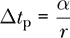

这些输入中只有两个可以独立选择。由于时间步长是物理时间，并且我们可能会关注从纳秒到年份的各种物理时间尺度，因此将时间尺度因子和动画速率告诉`simulateGloss`或`simulateVis`，并让它们计算用于状态更新的时间步长是很方便的。这样，如果我们选择了合适的时间尺度因子，我们可以选择每秒 20 帧的动画速率，并且有很大的机会使用合理的时间步长。如果我们发现需要更小的时间步长，我们可以提高动画速率（正如我们在下一章中对哈雷彗星的处理方式一样）。

##### 初始状态

第三个输入是我们希望动画化的粒子或系统的初始状态，`initialState`。在本章中，粒子的状态类型是`ParticleState`。在上一章中，单维粒子的状态类型是`State1D`。在第十九章中，粒子系统的状态类型将是`MultiParticleState`。我们的两个动画函数可以与这些类型中的任何一个配合使用，如初始状态中使用的类型变量`s`所示。

##### 显示函数

第四个输入，`picFunc`，是一个显示函数，它必须解释在给定状态下应该生成什么样的 2D 或 3D 图片。由于`gloss`使用`Picture`类型来表示图片，而`not-gloss`使用`VisObject R`类型，因此这个第四个输入在`simulateGloss`和`simulateVis`中的类型是不同的。当我们想为特定物理情况生成动画时，需要为该情况编写一个显示函数。`not-gloss`包有自己的三维向量类型，它与我们一直使用的`Vec`类型不同。由于有一个名为`Trans`的三维平移函数，它接受`not-gloss`向量作为输入，因此在为 3D 动画编写显示函数时，拥有一个转换函数是非常有用的。函数`v3FromVec`可以将一个`Vec`类型的向量转换为`not-gloss`向量。

```
v3FromVec :: Vec -> V3 R
v3FromVec v = V3 x y z
    where
      x = xComp v
      y = yComp v
      z = zComp v
```

我们将在下一章的 3D 动画中使用这个函数，包括抛体运动和质子在磁场中的运动。

##### 状态更新函数

第五个也是最后一个输入是状态更新函数，`updateFunc`。状态更新函数是我们解牛顿第二定律方法的核心，即使在没有动画的情况下也是如此。请注意，状态更新函数的类型是`TimeStep -> s -> s`。这个函数必须解释如何通过给定时间步长从旧状态创建新状态。我们在这里并没有选择时间步长，而是指定了一个接受时间步长和旧状态作为输入并返回新状态的函数。为了得到状态更新函数，我们可以应用一个数值方法来求解来自牛顿第二定律的微分方程，或者使用我们之前定义的`updatePS`函数，该函数结合了数值方法和单体力的列表。

刚才讨论的五个输入——时间尺度因子、动画速率、初始状态、显示函数和状态更新函数——包含了我们所建模的物理情况的所有信息，并且也包含了关于如何生成随时间变化的画面的所有信息。

在讨论了`simulateGloss`和`simulateVis`函数的输入参数后，我们来看看这些函数是如何工作的，以生成二维和三维动画。

#### 函数的工作原理

我们更容易理解`simulateGloss`函数的工作原理，因此我们从这个函数开始。`simulateGloss`函数命名了五个输入参数：`tsFactor`表示时间尺度因子，等等。它调用`gloss`的`simulate`函数来执行实际工作，并向该函数传递六个参数。传递给`simulate`的第一个参数指定了一个空的窗口名称、窗口大小（以像素为单位）和窗口位置。由于这些参数并不那么重要，而且我们不太可能希望在每个动画之间更改这些值，因此我们选择了一些希望能够一次性使用的值。传递给`simulate`的第二个参数是背景颜色，我们选择为黑色。第三、第四和第五个输入分别是动画速率、初始状态和显示函数。这些都是`simulateGloss`的输入，因此可以直接传递给`gloss`的`simulate`函数。

`gloss`的`simulate`函数所需的最终输入是一个更新函数，但它与我们之前使用的状态更新函数在三个方面有所不同。首先，`gloss`的`simulate`期望一个更新函数，其第一个参数是`ViewPort`，而我们并不打算使用它。为了提供一个视口的位置，我们编写了一个匿名函数，它丢弃了第一个参数。第二，`gloss`的`simulate`期望一个基于动画时间而非物理时间的更新函数。由于我们的更新函数是基于物理时间的，因此我们需要使用时间尺度因子进行转换。第三，我们需要使用`realToFrac`将`R`转换为`Float`。总之，我们的`simulateGloss`函数通过将输入传递给`gloss`的`simulate`函数来工作，其中两个输入是直接指定的，三个输入从`simulateGloss`传递过去没有变化，最后一个是对`simulateGloss`输入的修改。

`simulateVis`函数为其五个输入参数赋予与`simulateGloss`相同的名称，因为这些输入参数具有相同的含义。它调用`not` `-gloss`的`simulate`函数来执行实际的工作，并将五个参数传递给该函数。传递给`simulate`的第一个参数指定了一些选项，我们将这些选项一劳永逸地设置为默认选项。传递给`simulate`的第二个参数是每帧动画运行的秒数。由于这只是动画速率的倒数，我们可以在适当将其类型从整数转换为实数后反转`rate`。第三个输入是初始状态，我们传递给它，保持不变。

第四个输入是显示函数，虽然我们本可以将其原样传递，但我们并没有这样做，因为我想借此机会使用`orient`函数，该函数最初写于第十三章，并在下面重复，用于旋转坐标轴，使得 y 轴指向右侧，z 轴指向屏幕上方，x 轴指向左侧并看起来延伸出屏幕。换句话说，我使用`orient`来使我们的动画自动使用我最喜欢的坐标系。

```
orient :: V.VisObject R -> V.VisObject R
orient pict = V.RotEulerDeg (Euler 270 180 0) $ pict
```

`not-gloss`的`simulate`所需的第五个也是最后一个输入是更新函数；然而，它与我们需要处理的状态更新函数`updateFunc`有着实质性的不同。由于这种差异非常大，我们使用`let`构造来定义一个局部函数`visUpdateFunc`，并将其作为最终输入传递给`not-gloss`的`simulate`函数。我们将第一个`visUpdateFunc`的输入命名为`ta`，以提醒它表示动画时间。我们将第二个`visUpdateFunc`的输入命名为`st`，表示状态。我们的策略是使用传递给`simulateVis`的`updateFunc`来计算`visUpdateFunc ta st`的值，该值的类型为`s`。

`visUpdateFunc`和`updateFunc`的区别完全在于它们如何解释第一个参数。`visUpdateFunc`的第一个输入，名为`ta`，是从动画开始以来已经经过的动画时间。相比之下，`updateFunc`的第一个输入是从上一个状态计算后到当前状态的物理时间*步长*。在`visUpdateFunc`的局部定义中，我们可以访问动画时间`ta`，并利用它来计算我们将传递给`updateFunc`的物理时间步长`dtp`。这个转换比`gloss`的更为复杂，因为我们实际上进行的是两个转换：一个是从动画时间到物理时间，另一个是从动画开始的物理时间到物理时间步长。我们使用嵌套的`let`结构来定义局部变量`dtp`，即我们将传递给`updateFunc`以产生新状态`visUpdateFunc ta st`的物理时间步长。我们通过首先将`ta`的类型从`Float`转换为`R`，然后按时间尺度因子缩放该动画时间，得到自仿真开始以来的物理时间，最后减去旧状态的（物理）时间来计算`dtp`，一个类型为`R`的实数。与状态`st`相关的物理时间是`timeOf st`。接下来，我会解释这一如何运作。

我们需要知道一个状态的时间（这是`Particle` `State`中的一个状态变量）。如果`simulateVis`只针对`ParticleState`数据类型工作，这不会成为问题。但我们希望`simulateVis`能够处理任何状态空间`s`，或者至少能够处理包含时间作为状态变量的状态空间`s`。为了解决这个问题，我们似乎必须发明一个新的类型类，叫做`HasTime`，用于表示能够提取特定时间值的状态类型。这个类型类只拥有一个函数`timeOf`，用于从状态中提取时间。以下是类型类`HasTime`的定义：

```
class HasTime s where
    timeOf :: s -> Time
```

每种类型，若想成为`HasTime`的实例，必须通过实例声明表达如何实现`timeOf`。以下是`ParticleState`的实例声明：

```
instance HasTime ParticleState where
    timeOf = time
```

总结来说，我们的`simulateVis`函数通过将输入传递给`not` `-gloss`的`simulate`函数来工作。`not-gloss`的`simulate`函数的输入之一是简单指定的，另外两个输入是从`simulateVis`的输入中直接传递过来的，最后两个输入是`simulateVis`输入的修改版本。

### 总结

本章将牛顿力学应用于三维空间中单个物体的运动。解决力学问题的过程是通过一系列四个表示来转换信息，首先是单体力，然后是一个微分方程，再是一个状态更新函数，最后是一个状态列表。在这个过程中，牛顿第二定律作为一种手段，将作用在物体上的力的列表转化为微分方程。数值方法将微分方程转化为状态更新函数。我们在本章中使用了欧拉-克罗梅方法和四阶龙格-库塔方法，并选择了合适的时间步长作为数值方法。状态更新函数是运动动画中的一个基本要素。

本章仍然围绕基于状态的范式展开，在这一章中，我们定义了一种新的数据类型，用于存储粒子的状态。这个新数据类型包含粒子的质量、电荷、位置、速度以及时间。我们引入了单体力的概念，这也成为了我们在这一章讨论力的主要方式。在下一章中，我们将这些概念应用于具体的例子，并对许多结果进行动画演示。

### 习题

**习题 16.1.** 将函数`newtonSecondPS`应用于一个非常简单的力列表，比如仅包含恒定力的列表，以及一个非常简单的状态，比如`defaultParticleState`，并找到结果表达式的类型。

**习题 16.2.** 编写一个函数

```
constantForce :: Vec -> OneBodyForce
constantForce f = undefined f
```

该函数接受一个力向量作为输入，返回一个`OneBodyForce`，该力无论给定什么状态，都会返回相同的恒定力。例如，如果我们使用`constantForce`来创建一个始终产生 10N 的单体力，

```
tenNewtoniHatForce :: OneBodyForce
tenNewtoniHatForce = constantForce (10 *^ iHat)
```

然后`tenNewtoniHatForce defaultParticleState`应该产生`vec 10.0 0.0 0.0`。

**习题 16.3.** 编写一个函数

```
moonSurfaceGravity :: OneBodyForce
moonSurfaceGravity = undefined
```

返回地球月球对月球表面附近物体施加的引力。

**习题 16.4.** 编写一个表示地球产生的普遍引力的单体力。

```
earthGravity :: OneBodyForce
earthGravity = undefined
```

**习题 16.5.** 使用函数`uniformLorentzForce`来找出在正 z 方向的均匀磁场中，沿正 x 方向运动的质子的力的方向。没有电场。你可以选择质子的速度和磁场的大小。根据力的方向，你预期质子接下来的运动是什么样的？

**习题 16.6.** 我们在本章中开发的工具通过生成粒子状态的无限列表来解决力学问题。为了理解这个解，我们通常希望提取一些数据并将其绘制成图。如果我们想绘制 y 分量速度随时间的变化曲线，我们需要一组(*t*, *v[y]*)值的对。编写一个函数

```
tvyPair :: ParticleState -> (R,R)
tvyPair st = undefined st
```

生成所需的数字对，来自于一个粒子的状态。然后编写一个函数

```
tvyPairs :: [ParticleState] -> [(R,R)]
tvyPairs sts = undefined sts
```

它根据一个粒子的状态列表生成一对数值列表。你可以在第二个函数的主体中使用你的`tvyPair`函数。

**练习 16.7.** 编写一个谓词

```
tle1yr :: ParticleState -> Bool
tle1yr st = undefined st
```

该函数返回`True`，如果状态中的时间（假设是秒数）小于或等于一年，否则返回`False`。这个谓词可以与`takeWhile`一起使用，将无限状态列表转换为有限列表，以便绘制图形。

**练习 16.8.** 编写一个函数

```
stateFunc :: [ParticleState]
          -> Time -> ParticleState
stateFunc sts t
    = let t0 = undefined sts
          t1 = undefined sts
          dt = undefined t0 t1
          numSteps = undefined t dt
      in undefined sts numSteps
```

它根据给定的状态列表生成一个从时间到粒子状态的函数。假设相邻状态之间的时间间隔相同。

**练习 16.9.** 在我们迄今为止的所有空气阻力的研究中，我们假设空气的密度是常数。然而，靠近地球表面的空气密度实际上随着高度的增加而减少。一个有用的近似公式来表示空气密度随高度的变化是

*ρ* = *ρ*0*e*^(–*h*/*h*[0])

其中*ρ*[0]是海平面上的空气密度，*h*是海平面以上的高度，*ρ*是海拔高度*h*处的空气密度，*h*[0]是一个常数。

取*h*[0] = 8,500 米，并使用位置的 z 分量表示海拔高度，编写一个单体力学模型

```
airResAtAltitude :: R  -- drag coefficient
                 -> R  -- air density at sea level
                 -> R  -- cross-sectional area of object
                 -> OneBodyForce
airResAtAltitude drag rho0 area (ParticleState _m _q _t r v)
    = undefined drag rho0 area r v
```

它可以代替`airResistance`在物体处于高海拔时使用。为了测试这个新函数，以下函数比较了从海平面发射的铅球在三种不同条件下的射程：（a）无空气阻力，（b）均匀空气阻力，以及（c）随着高度变化的空气阻力。铅球的直径是 10 厘米。提供初始状态和代码中的最后一行（标记为`undefined`的两处），然后使用代码查看 45^∘角度发射的铅球射程。尝试初始速度为 10 m/s、100 m/s 和 300 m/s 的情况。

```
projectileRangeComparison :: R -> R -> (R,R,R)
projectileRangeComparison v0 thetaDeg
    = let vx0 = v0 * cos (thetaDeg / 180 * pi)
          vz0 = v0 * sin (thetaDeg / 180 * pi)
          drag = 1
          ballRadius = 0.05    -- meters
          area = pi * ballRadius**2
          airDensity  =    1.225  -- kg/m³ @ sea level
          leadDensity = 11342     -- kg/m³
          m = leadDensity * 4 * pi * ballRadius**3 / 3
          stateInitial = undefined m vx0 vz0
          aboveSeaLevel :: ParticleState -> Bool
          aboveSeaLevel st = zComp (posVec st) >= 0
          range :: [ParticleState] -> R
          range = xComp . posVec . last . takeWhile aboveSeaLevel
          method = rungeKutta4 0.01
          forcesNoAir
              = [earthSurfaceGravity]
          forcesConstAir
              = [earthSurfaceGravity, airResistance    drag airDensity area]
          forcesVarAir
              = [earthSurfaceGravity, airResAtAltitude drag airDensity area]
          rangeNoAir    = range $ statesPS method forcesNoAir    stateInitial
          rangeConstAir = range $ statesPS method forcesConstAir stateInitial
          rangeVarAir   = range $ statesPS method forcesVarAir   stateInitial
      in undefined rangeNoAir rangeConstAir rangeVarAir
```

**练习 16.10.** 考虑从 10 米高处自由落体的铅球，靠近地球表面。使用我们在本章定义的函数编写一个函数，生成此运动的粒子状态列表。如果你能使用`takeWhile`函数提取*z* ≥ 0 的粒子状态（即球体仍然处于地球表面或以上的状态），则可以获得额外的学分。
