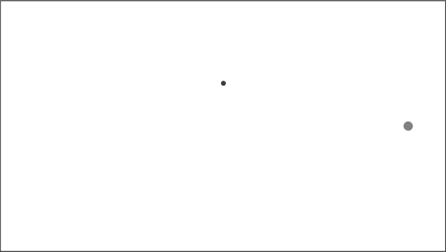
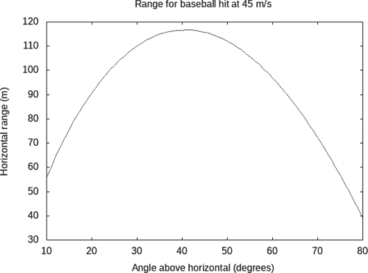
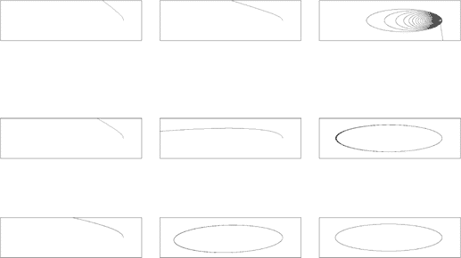

# 卫星、抛体和质子运动


本章讨论了三个扩展示例，这些示例使用了来自第十六章的思想和代码，表达并解决涉及一个物体的牛顿力学问题。示例包括卫星运动、带空气阻力的抛体运动，以及在均匀磁场中的质子运动。我们将展示如何为每个示例制作图表和动画。请注意，本章不会开始一个新的模块；相反，我们将继续扩展上一章中开始的`Mechanics3D`模块。

### 卫星运动

作为卫星运动的初步示例，考虑以下情况：地球绕太阳公转是由于它们之间的引力。严格来说，地球和太阳各自绕着一个位于两者之间的点公转。这个点叫做*质心*，它距离质量较大的太阳要比质量较小的地球近得多，因此将地球绕太阳公转是一个不错的近似。在第十九章中，我们将把万有引力视为一个二体力：太阳和地球都会因此加速，两个天体都会绕着质心公转。然而，在本章中，我们只关注单一物体的运动，比如地球，我们将把太阳对地球的引力视为单体力。这意味着我们将把太阳视为一个“家具”，它的作用只是对地球施加引力，但不会参与到完整的运动中，也不会因感受到力而发生运动变化。

在本章的卫星运动中，我们只关注卫星。围绕卫星轨道运动的较大行星或恒星被假设为固定不动；它唯一的作用是对卫星施加引力。

哈雷彗星绕太阳公转，每 75 年左右公转一圈。它的轨道相当椭圆，彗星在靠近太阳时运动较快，而在远离太阳时运动较慢。在 1986 年，哈雷彗星靠近太阳，因此也足够接近地球，肉眼可见。预计它将在 2061 年再次经过我们的邻近区域。

让我们为哈雷彗星绕太阳的轨道制作动画。在第十六章中，我们描述了如何制作动画。我们需要五个信息来调用`simulateGloss`或`simulateVis`函数：一个时间尺度因子、一个动画速率、一个初始状态、一个显示函数和一个状态更新函数。我们将从最具物理意义的信息开始描述。

#### 状态更新函数

状态更新函数`halleyUpdate`可以使用`updatePS`编写，如图 16-3 所示，并在第十六章中定义，该函数需要一个数值方法和一体力列表。函数`halleyUpdate`及本章和下一章中所有不是独立程序的代码，都属于我们在第十六章中开始的`Mechanics3D`模块，应该放在同一个源代码文件中。

```
halleyUpdate :: TimeStep
             -> ParticleState -> ParticleState
halleyUpdate dt
    = updatePS (eulerCromerPS dt) [sunGravity]
```

对于我们的数值方法，我们将选择欧拉-克罗默方法。回想一下，对于动画，我们不会直接选择数值方法的时间步长，而是通过稍后选择的时间尺度因子和动画速率来确定。时间步长`dt`作为输入传递给`halleyUpdate`，然后我们将`dt`传递给`eulerCromerPS`来构成数值方法。一体力的列表仅包含太阳的引力。

#### 初始状态

初始状态`halleyInitial`决定了我们是得到一个圆形轨道、椭圆轨道，还是一个速度快到能够逃脱太阳引力的卫星。哈雷彗星的质量为 2.2 × 10¹⁴千克。彗星的净电荷为零，我们的时钟也从零开始。正是初始位置和速度决定了后续的轨道。我选择将初始位置设置在 x 轴正方向上，距离太阳最近的距离为 8.766 × 10¹⁰米。当哈雷彗星最接近太阳时，它的速度是轨道中最快的，速度为 54,569 米/秒，方向垂直于彗星和太阳之间的连线。我们称这个方向为 y 方向。将所有这些信息放入`ParticleState`数据类型，我们得到了初始状态`halleyInitial`的以下表达式：

```
halleyInitial :: ParticleState
halleyInitial = ParticleState { mass     = 2.2e14            -- kg
                              , charge   = 0
                              , time     = 0
                              , posVec   = 8.766e10 *^ iHat  -- m
                              , velocity = 54569 *^ jHat }   -- m/s
```

#### 时间尺度因子

列表 17-1 显示了时间尺度因子、动画速率和显示函数，并提供了一个独立的程序，用于使用`gloss`进行哈雷彗星绕太阳运动的 2D 动画。

```
{-# OPTIONS -Wall #-}

import SimpleVec
    ( xComp, yComp )
import Mechanics3D
    ( ParticleState(..), simulateGloss, disk, halleyInitial, halleyUpdate )
import Graphics.Gloss
    ( Picture(..), pictures, translate, red, yellow )

diskComet :: Picture
diskComet = Color red (disk 10)

diskSun :: Picture
diskSun = Color yellow (disk 20)

halleyPicture :: ParticleState -> Picture

halleyPicture (ParticleState _m _q _t r _v)
    = pictures [diskSun, translate xPixels yPixels diskComet]
          where
            pixelsPerMeter = 1e-10
            xPixels = pixelsPerMeter * realToFrac (xComp r)
            yPixels = pixelsPerMeter * realToFrac (yComp r)

main :: IO ()
main = simulateGloss (365.25 * 24 * 60 * 60) 400
       halleyInitial halleyPicture halleyUpdate
```

*列表 17-1：用于展示哈雷彗星绕太阳轨道运动的 2D 动画的独立程序*

我们首先打开警告。然后，我们从第十章的`SimpleVec`模块、我们在第十六章开始并在本章及下一章继续扩展的`Mechanics3D`模块，以及`Graphics.Gloss`模块中导入所需的功能。图片`diskComet`和`diskSun`分别是哈雷彗星和太阳的标记。显示函数`halleyPicture`是动画所需的五个要素之一，它利用彗星的状态将彗星标记移到适当的位置。太阳显示在原点且不会移动。在`main`函数中，我们选择了`365.25 * 24 * 60 * 60`作为时间缩放因子，这样一年的物理时间就对应一秒的动画时间。由于哈雷彗星的周期约为 75 年，因此动画显示一个完整轨道大约需要 1 分 15 秒。

#### 动画速率

对于一般的动画，我建议开始时使用每秒约 20 帧的动画速率。对于哈雷彗星，这样的时间步长是 1/20 年，比 75 年的时间尺度小得多，后者似乎是该情形下的重要时间尺度。如果你使用每秒 20 帧，而不是清单 17-1 中所示的每秒 400 帧，你会注意到轨道出现一些奇怪的现象。哈雷彗星会偏离屏幕，并且不会再回到屏幕上绕太阳运行，至少在接近 75 秒内不会发生这种情况。问题在于，彗星在接近太阳时移动非常快，而在远离太阳时则相对较慢。

当彗星接近太阳时，准确的计算需要相对较小的时间步长，因为此时彗星移动迅速且方向变化很快。其余轨道部分的时间步长可以大大增大，而不会造成损害。有一些数值方法使用可变时间步长，但这些超出了本书的范围。我们需要增加动画速率或减小时间缩放因子，以便在最接近太阳的短暂时间内使用足够小的时间步长来保持准确性。通过尝试不同的动画速率，表明每秒 400 帧可能足以给出合理准确的结果。

#### 显示功能

图 17-1 显示了哈雷彗星绕太阳运动的动画帧。在这个快照中，太阳以灰色显示在图的右侧，而哈雷彗星向左移动，远离太阳。我们编写的动画呈现出一个黄色的太阳和一个红色的彗星。



*图 17-1：哈雷彗星远离太阳*

显示函数 `halleyPicture` 需要描述如何从状态生成一张图片。我们主要想展示的是彗星的位置。彗星在 *z* = 0 平面内运动，因此我们只需要处理该函数中的位置的 x 和 y 分量。Listing 17-1 中的 `halleyPicture` 函数通过模式匹配输入，将局部变量 `r` 赋值为当前彗星状态的位置。位置是显示函数关心的唯一状态变量；速度或质量在决定图片的外观时不起作用。我们使用 Chapter 10 中 `SimpleVec` 模块的 `xComp` 和 `yComp` 函数提取位置的 x 和 y 分量。

`where` 关键字与 `let` 关键字类似，允许代码编写者定义局部变量和函数；然而，`where` 及其局部名称出现在主要函数体之后，而不是之前。

`realToFrac` 函数将类型为 `R` 的实数转换为类型为 `Float` 的实数，因为 `gloss` 的 `translate` 函数需要以 `Float` 类型作为输入。最终生成的图像包含一个黄色圆盘表示太阳，一个红色圆盘，经过平移到合适位置，用来表示彗星。`gloss` 中的 `pictures` 函数从一个图片列表生成一个单独的图片。

空间缩放需要在显示函数中进行。物理尺寸以米为单位表示，而 `gloss` 的尺寸则以像素为单位表示。因此，我们需要指定如何进行这种转换。一种自然的缩放策略是按比例显示所有内容，使用一个整体缩放因子将米转换为像素。`gloss` 中的 `scale` 函数非常适合这个目的，因为它可以接受一个所有长度以米为单位的图片，并生成一个按每米多少像素缩放后的新图片。但在哈雷彗星动画中，如果我们尝试按比例显示所有内容，使用两个半径和彗星位置的准确米值，以及一个米到像素的整体缩放因子，我们将无法看到彗星或太阳，因为彗星的运动范围过于广阔。

由于我们无法按比例显示太阳和彗星的大小，黄色和红色圆盘仅作为太阳和彗星位置的标记；这些圆盘的大小与轨道运动或彼此之间的比例无关。指定太阳和彗星的半径时，使用像素比使用米更容易，因为米需要缩放到像素，并且按与彗星位置不同的因子进行缩放。图片 `diskComet` 和 `diskSun` 指定了这两个圆盘的半径分别为 10 像素和 20 像素。我们不会再对这些半径进行缩放。这两张图片使用了我们在 Chapter 13 中定义的 `disk` 函数，以下是重复部分：

```
disk :: Float -> G.Picture
disk radius = G.ThickCircle (radius/2) radius
```

我更倾向于在像素中指定半径的另一个原因是，空间缩放通常是通过试错法确定的，缩小或放大一个有效的动画。如果这个试错缩放作用于整个图像，包括轨道大小和半径，就很容易把半径缩小得太多，以至于圆盘看不见，或者把半径放大得太多，导致它们填满整个屏幕。在这两种情况下，有时很难知道问题出在哪里。

在哈雷动画中，只有一件事需要缩放，那就是彗星的位置。我们使用 10^(-10)像素/米的缩放因子来缩放位置的 x 和 y 分量。

### 带有空气阻力的抛物线运动

在下一个示例中，让我们来看一个击打的棒球。这是一个带有空气阻力的抛物线运动示例。我们将考虑作用在棒球上的两个力：地球表面的重力和空气阻力。我们使用一个 145 克重、直径为 74 毫米、阻力系数为 0.3 的棒球。列表`baseballForces`包含作用在棒球上的两个单一力。列表`baseballForces`以及本章和下一章中不属于独立程序的所有代码，都是`Mechanics3D`模块的一部分。

```
baseballForces :: [OneBodyForce]
baseballForces
    = let area = pi * (0.074 / 2) ** 2
      in [earthSurfaceGravity
         ,airResistance 0.3 1.225 area]
```

第一个力是地球表面的重力，第二个力是空气阻力。我们定义了一个局部变量`area`来保存棒球的横截面积。数字 0.074 是球的直径（单位：米），0.3 是阻力系数，1.225 是空气的密度（单位：kg/m³）。

对于发生在地球表面或附近的情况，我喜欢使用一个坐标系统，其中*x*和*y*是水平坐标，*z*是垂直坐标，正*z*指向远离地球中心的方向。带有空气阻力的抛物线运动发生在一个平面内。选择 xz 平面或 yz 平面来进行这种运动是合理的。我们选择 yz 平面，因为`simulateVis`函数的默认坐标系统（如果我们选择使用它）中，*y*是右侧，*z*是向上。

#### 计算轨迹

下面定义的函数`baseballTrajectory`会生成一个(y, z)坐标对的列表，其中*y*和*z*分别是位置的水平分量和垂直分量。我们为这个函数提供一个时间步长、初速度和角度（单位：度）。这个角度是球离开球棒时与水平面的夹角。

```
baseballTrajectory :: R  -- time step
                   -> R  -- initial speed
                   -> R  -- launch angle in degrees
                   -> [(R,R)]  -- (y,z) pairs
baseballTrajectory dt v0 thetaDeg
    = let thetaRad = thetaDeg * pi / 180
          vy0 = v0 * cos thetaRad
          vz0 = v0 * sin thetaRad
          initialState
              = ParticleState { mass     = 0.145
                              , charge   = 0
                              , time     = 0
                              , posVec   = zeroV
                              , velocity = vec 0 vy0 vz0 }
      in trajectory $ zGE0 $
         statesPS (eulerCromerPS dt) baseballForces initialState
```

我们定义了几个局部变量来保存角度（弧度制）、初速度的水平和垂直分量以及球的初始状态。我们使用`statesPS`来生成一个无限状态列表，使用欧拉-克罗梅方法，给定的步长、力的列表（`baseballForces`）和初始状态。下面定义的函数`zGE0`会将这个无限列表截断为一个有限列表，仅包含垂直位置大于或等于零的状态。下面定义的函数`trajectory`将状态列表转化为适合绘制图形的(y, z)对列表。

`statesPS`生成的无限列表通过函数`zGE0`被截断为一个有限列表，该函数从无限列表中选择垂直位置分量大于或等于零的元素。当找到一个垂直分量小于零的元素时，它停止检查列表项并返回有限列表。

```
zGE0 :: [ParticleState] -> [ParticleState]
zGE0 = takeWhile (\(ParticleState _ _ _ r _) -> zComp r >= 0)
```

通过返回一个有限的状态列表，我们更接近于绘制轨迹图，因为我们无法绘制一个无限的列表。

`trajectory`函数返回输入列表中每个状态的水平和垂直位置分量。这将是一个自然的绘图目标，因此我们又更接近于绘制轨迹。

```
trajectory :: [ParticleState] -> [(R,R)]
trajectory sts = [(yComp r,zComp r) | (ParticleState _ _ _ r _) <- sts]
```

#### 寻找最大射程的角度

让我们继续深入分析棒球。`baseballRange`函数计算给定初速度和角度下球的水平射程。

```
baseballRange :: R  -- time step
              -> R  -- initial speed
              -> R  -- launch angle in degrees
              -> R  -- range
baseballRange dt v0 thetaDeg
    = let (y,_) = last $ baseballTrajectory dt v0 thetaDeg
      in y
```

为了实现这一目标，我们使用之前的`baseballTrajectory`函数，取最后一个垂直位置分量为非负值的(y, z)对，并返回该对的水平位置分量。

现在让我们绘制击打角度与棒球射程的关系图。在没有空气阻力的情况下，最大射程发生在 45^∘的角度下。也许我们考虑的空气阻力会带来不同的结果。`baseballRangeGraph`函数在清单 17-2 中绘制了一个以 45 m/s（101 mph）速度击打的棒球射程图。

```
baseballRangeGraph :: IO ()
baseballRangeGraph
    = plotFunc [Title "Range for baseball hit at 45 m/s"
               ,XLabel "Angle above horizontal (degrees)"
               ,YLabel "Horizontal range (m)"
               ,PNG "baseballrange.png"
               ,Key Nothing
               ] [10,11..80] $ baseballRange 0.01 45
```

*清单 17-2：生成“45 m/s 击打棒球射程”图的代码*

图 17-2 展示了击打棒球的水平射程与击球角度之间的关系。我们假设每个角度下的初始速度为 45 m/s（101 mph）。注意，最大射程发生在一个小于 45^∘的角度上。



*图 17-2：击打棒球的射程。由于空气阻力，最大射程并不出现在 45^∘的角度下。*

我们可以寻找能够产生最大射程的角度。`bestAngle`值会遍历从 30^∘到 60^∘的所有角度，步长为 1^∘，以找出产生最大射程的角度。

```
bestAngle :: (R,R)
bestAngle
    = maximum [(baseballRange 0.01 45 thetaDeg,thetaDeg) |
               thetaDeg <- [30,31..60]]
```

为了找到最大的射程，我们想要比较`baseballRange 0.01 45` `thetaDeg`，即在不同角度下，以 45 米每秒的初速度投掷的射程。但我们希望`bestAngle`函数返回的是实现最大射程的角度，因此我们不能仅仅要求获取`baseballRange 0.01 45 thetaDeg`的最大值，因为那只会返回射程，而不会返回实现该射程的角度。

我们可以通过比较一对对的数值并要求返回最大的一对，来获得我们想要的结果，即最大射程和实现该射程的角度。`maximum`函数在比较一对对时使用字典顺序，因此最大的一对是第一个元素最大的。如果第一个元素相等，函数会比较第二个元素以打破平局。通过将一对的第一个元素选择为射程，比较会根据射程进行，而将第二个元素选择为角度，函数也会返回角度。以下是 GHCi 报告的`bestAngle`的值：

```
Prelude> :l Mechanics3D
[1 of 4] Compiling Newton2         ( Newton2.hs, interpreted )
[2 of 4] Compiling Mechanics1D     ( Mechanics1D.hs, interpreted )
[3 of 4] Compiling SimpleVec       ( SimpleVec.hs, interpreted )
[4 of 4] Compiling Mechanics3D     ( Mechanics3D.hs, interpreted )
Ok, four modules loaded.
*Mechanics3D> bestAngle
(116.77499158246208,41.0)
```

我们看到，在 1^∘的精度范围内，产生最大射程的角度是 41^∘，即高于水平面。

#### 2D 动画

现在让我们转向制作棒球运动的动画。运动发生在一个平面内，因此我们将使用二维的`gloss`包。我们将制作一个独立的程序来实现动画，然后展示如何让程序接受指定初速度和角度的命令行参数。

##### 主程序

清单 17-3 给出了一个使用`gloss`进行二维投射物运动动画的独立程序。

```
{-# OPTIONS -Wall #-}

import SimpleVec
    ( yComp, zComp )
import Mechanics3D
    ( ParticleState(..), simulateGloss, disk
    , projectileInitial, projectileUpdate )
import Graphics.Gloss
    ( Picture(..), red, scale, translate )
import System.Environment
    ( getArgs )

projectilePicture :: ParticleState -> Picture
projectilePicture (ParticleState _m _q _t r _v)
    = scale 0.2 0.2 $ translate yFloat zFloat redDisk
      where
        yFloat = realToFrac (yComp r)
        zFloat = realToFrac (zComp r)
        redDisk :: Picture
        redDisk = Color red (disk 50)

mainWithArgs :: [String] -> IO ()
mainWithArgs args
    = simulateGloss 3 20
      (projectileInitial args) projectilePicture projectileUpdate

main :: IO ()
main = getArgs >>= mainWithArgs
```

*清单 17-3：独立程序，用于二维投射物运动的动画。初速度和角度可以在运行程序时通过命令行指定。*

和往常一样，第一行要求显示警告，接下来的几行导入我们在程序中需要使用的函数和类型。

这个程序的一个新特性是我们通过命令行参数向程序传递信息。*命令行参数*是在你执行程序时，程序名后面给定的一段信息。例如，对于一个叫做*GlossProjectile*的独立程序，它是通过编译名为*GlossProjectile.hs*的源代码文件得到的，我们可以通过在命令行输入以下指令来运行该程序：

```
$ ./GlossProjectile 30 40
```

我们给出要运行的可执行程序的名称（前面加上点斜杠以指示其在当前目录中的位置），然后跟上一些命令行参数，允许我们将信息传递给程序。我们希望传递初速度和角度（单位为度）。

程序如何接收和使用这些信息？标准模块`System.Environment`（在你最初安装 GHC 编译器时会包含）提供了一个函数`getArgs`，它将命令行参数作为字符串列表返回。例如，在执行命令如上所示的程序*GlossProjectile*时，`getArgs`函数将返回列表`["30","40"]`。然后，我们可以使用这些字符串来确定程序的行为。`getArgs`函数简单且足够满足我们的需求，但如果你在 Haskell 程序中更加认真地使用命令行参数，可能会想查看标准模块`System.Console.GetOpt`，它同样包含在 GHC 编译器中，提供了更为复杂的命令行参数处理功能。

知道我们将访问包含命令行参数的字符串列表后，我们编写了一个函数来完成我们在之前的动画中`main`函数的工作，即调用`simulateGloss`，但它接受一个字符串列表作为输入。清单 17-3 中的`mainWithArgs`函数正是执行了这个操作。如同以前一样，`simulateGloss`需要五个信息：一个时间尺度因子、一个动画速率、一个初始状态、一个显示函数和一个状态更新函数。

我们选择了一个时间尺度因子为 3（这样动画的速度比物理演化更快），动画速率为每秒 20 帧。我们将来自命令行的字符串列表命名为`args`，并将其传递给函数`projectileInitial`，该函数根据这些字符串创建初始状态。我们稍后会编写`projectileInitial`函数。

清单 17-3 中的显示函数`projectilePicture`描述了我们希望为给定粒子状态生成的图像。在这个显示函数中，我们创建了一张图像，然后通过 0.2 像素/米的比例缩放整个图像。`scale 0.2 0.2`函数将图像在水平和垂直方向上都缩小了五倍。

`main`程序使用`getArgs`函数来获取程序运行时指定的任何命令行参数。`getArgs`函数不是一个纯函数；它是一个*有副作用*的函数。副作用是指那些不完全符合纯函数计算的操作（即它依赖或以某种方式改变了外部环境）。依赖程序输入、随机性或当前时间的计算都是副作用。向显示器发送信息或写入硬盘也是副作用。一个函数产生的副作用有时被称为副作用，目的是与函数的主要功能区分开来，后者是产生输出。纯函数是指没有副作用的函数；它的输出只依赖于输入和不变的全局值。有副作用的函数是指其输出不仅依赖于输入（例如用户输入、命令行参数或随机性），或者它在输出之外还有副作用。在 Haskell 中，一个有副作用的函数必须具有涉及`IO`类型构造子的类型。

为了看到这一点，我们加载模块`System.Environment`，并在其前面加上加号，以便`Mechanics3D`模块不会被卸载，这是默认行为。

```
*Mechanics3D> :m +System.Environment
*Mechanics3D System.Environment> :t getArgs
getArgs :: IO [String]
```

`getArgs`是一个有副作用的函数，这一点通过`IO`类型构造子来表明。虽然纯函数的输出只能依赖于输入和不变的全局值，但`getArgs`的输出依赖于命令行参数，而这些参数既不是函数输入，也不是全局值。因此，`getArgs`的类型必须是`IO [String]`，而不是`[String]`。数据上的`IO`标签意味着这些数据可能是通过某种副作用获得的。数据上没有`IO`标签则意味着这些数据不是通过任何副作用获得的。

标记有副作用函数的`IO`类型构造子是称为*单子*（monads）的一组类型构造子的一个例子。单子的概念在范畴理论的数学中已经存在了几十年；它在函数式编程中的应用较为近期，在那里它代表了一种计算抽象。Haskell 有一个类型类`Monad`，用于支持能够实现特定功能的类型构造子，如`IO`。由于`IO`类型构造子是类型类`Monad`的一个实例，因此它也被称为`IO`单子。本书的目的不是深入探讨单子。单子是一个有趣的抽象，但我认为物理学并不强烈需要它们。*Real World Haskell* **[2**]和*Learn You a Haskell for Great Good* **[1**]对单子有很好的讨论。Stephen Diehl 的《What I Wish I Knew When Learning Haskell》可在[`dev.stephendiehl.com/hask`](http://dev.stephendiehl.com/hask)上找到，也有对单子的很好的讨论。

运算符`>>=`，称为“bind”，是单子函数中最重要的一个。在我们这里的`IO`单子上下文中，它提供了一种使用由有副作用的函数产生的信息的方法。为了理解它的使用，我们来看一下它的类型。

```
*Mechanics3D System.Environment> :t (>>=)
(>>=) :: Monad m => m a -> (a -> m b) -> m b
```

类型变量`a`和`b`代表类型，而类型变量`m`代表类型构造器。类型类`Monad`有类型构造器作为其实例。Haskell 中的*kind*概念，在第九章中介绍，有助于分类类型变量所能代表的可能性。

对于我们的目的，类型变量`m`可以替换为`IO`，它是类型类`Monad`的一个实例。将 bind 运算符专门化为`IO`类型构造器后，bind 具有以下类型：

```
IO a -> (a -> IO b) -> IO b
```

我们看到 bind 接收两个参数：一个类型为`a`的值，由`IO`类型构造器“标记”，以及一个输入类型为`a`、输出类型为`b`的有副作用的函数，输出结果由`IO`类型构造器“标记”。我们可以将这个`IO`类型构造器视为一个标签，用来指示值的来源和/或副作用。bind 运算符允许一个`IO`标记的值作为普通值在承诺返回`IO`标记结果的函数中使用。由于`IO`充当副作用的标签，重要的是一旦应用，就不能移除`IO`标签。然而，如果一个函数返回一个带标签的输出，bind 运算符提供了一种方法，使带标签的输入可以临时去标签并使用，同时知道该函数会重新给输出加标签。

我们在一个类型变量`a`为`[String]`，类型变量`b`为 unit 的设置中使用了 bind 运算符，因此我们程序中 bind 的具体类型如下：

```
IO [String] -> ([String] -> IO()) -> IO ()
```

bind 运算符正是我们所需要的，它将`getArgs`的输出与`mainWithArgs`的输入连接起来。实际上，`main`程序只做了一件事：将`getArgs`的输出传递给函数`mainWithArgs`。

##### 状态更新函数和初始状态

状态更新函数`projectileUpdate`是使用`updatePS`编写的，就像在卫星运动中一样。

```
projectileUpdate :: TimeStep
                 -> ParticleState  -- old state
                 -> ParticleState  -- new state
projectileUpdate dt
    = updatePS (eulerCromerPS dt) baseballForces
```

同样，对于我们的数值方法，我们选择了欧拉-克罗默方法。我们使用了同样的单体力列表`baseballForces`，它之前用于绘制图表。

知道我们想将初始速度和角度作为命令行参数传递给程序，并且这些参数将作为字符串列表提供，我们将编写函数`projectileInitial`，接受一个来自命令行的字符串列表，并使用这些字符串来确定初始速度。我们希望这个字符串列表有两个元素：第一个字符串表示初始速度，第二个表示初始角度（以度为单位）。

```
projectileInitial :: [String] -> ParticleState
projectileInitial []        = error "Please supply initial speed and angle."
projectileInitial [_]       = error "Please supply initial speed and angle."
projectileInitial (_:_:_:_)
    = error "First argument is speed.  Second is angle in degrees."
projectileInitial (arg1:arg2:_)
    = let v0       = read arg1 :: R       -- initial speed, m/s
          angleDeg = read arg2 :: R       -- initial angle, degrees
          theta    = angleDeg * pi / 180  -- in radians
      in defaultParticleState
             { mass     = 0.145  -- kg
             , posVec   = zeroV
             , velocity = vec 0 (v0 * cos theta) (v0 * sin theta)
             }
```

我们对输入进行模式匹配，以便在没有提供两个参数时给出有帮助的错误信息。第一行响应空列表的情况，即没有给定任何命令行参数的情况。第二行响应只有一个命令行参数的情况。第三行响应给定三个或更多命令行参数的情况。最后，第四行处理正好提供两个命令行参数的情况，这就是我们所需要的。

我们使用`read`函数将字符串转换为实数。`read`函数接受一个字符串作为输入，并生成一个输出，这个输出可以是多种类型之一。我们需要提供类型注解来指定我们希望将字符串转换为什么类型。以下是`read`函数的示例：

```
*Mechanics3D System.Environment> :t read
read :: Read a => String -> a
*Mechanics3D System.Environment> read "56" :: R
56.0
```

#### 3D 动画

创建 3D 动画所需的几个项目与创建 2D 动画所需的相同，但有一个不同。为了比较制作 3D 动画和制作 2D 动画的过程，让我们使用 3D 动画工具来演示弹道运动。清单 17-4 提供了一个独立的程序，用于使用`not-gloss`进行弹道运动的 3D 动画。

```
{-# OPTIONS -Wall #-}

import SimpleVec ( R, (*^) )
import Mechanics3D
    ( ParticleState(..), simulateVis , projectileInitial, projectileUpdate, v3FromVec )
import Vis
    ( VisObject(..), Flavour(..), red )
import System.Environment
    ( getArgs )

projectileVisObject :: ParticleState -> VisObject R
projectileVisObject st
    = let r = posVec st
      in Trans (v3FromVec (0.01 *^ r)) (Sphere 0.1 Solid red)

mainWithArgs :: [String] -> IO ()
mainWithArgs args
    = simulateVis 3 20
      (projectileInitial args) projectileVisObject projectileUpdate

main :: IO ()
main = getArgs >>= mainWithArgs
```

*清单 17-4：一个独立程序用于 3D 动画的弹道运动*

`main`函数与 2D 动画中的完全相同。`main`的`WithArgs`函数使用`simulateVis`代替`simulateGloss`，但是它使用了与 2D 动画相同的时间尺度因子、动画速率、初始状态函数和状态更新函数。

我们唯一需要的新组件是一个显示函数，`projectileVisObject`。在这个显示函数中，状态被命名为`st`，我们定义了一个局部变量`r`表示物体的位置。我们使用一个半径为 0.1 的实心红色球体来表示弹道物体。`not-gloss`包并不以像素为单位来测量距离；相反，初始时长度 1 大约是屏幕高度的 20%。然后，你可以通过按 E 或 Q 键，或者使用鼠标来放大或缩小。在我们将红色球体移到适当的位置之前，我们需要将位置`r`从米转换为`Vis`单位，并且需要将位置转换为`Vis`的向量类型。我们将位置乘以一个因子 0.01，将每米转换为`Vis`单位，这样动画的范围既不太大也不太小。在使用`Trans`函数之前，我们使用在第十六章中定义的`v3FromVec`函数将位置转换为`Vis`的向量类型。

在看到带空气阻力的弹道运动示例、使用命令行参数将信息传递到程序中的技术以及 2D 与 3D 动画的比较之后，接下来我们将看一个真正需要 3D 动画的示例。

### 磁场中的质子

磁场被用于粒子加速器中，使质子或电子沿圆环轨道运动，以加速它们并使它们相互碰撞。这让实验人员能够观察到在这些高能碰撞中产生的粒子，并了解粒子及其相互作用的性质。

处于均匀磁场中的带电粒子将沿着圆形或螺旋形轨迹运动。这一点并不显而易见，但它是洛伦兹力定律的结果，均匀磁场下可用公式 16.8 表示。幸运的是，螺旋运动对于展示我们的三维动画工具来说是一个很好的运动方式。

根据洛伦兹力定律，粒子所受的磁力与**v**(*t*) × **B**的叉乘成正比，这意味着力垂直于粒子的速度和磁场。由于磁力始终垂直于粒子的速度，它无法使粒子加速或减速；它只能使粒子转弯（改变方向）。

要制作这个动画，我们需要一个状态更新函数、一个初始状态和一个显示函数。这里是一个粒子在强度为 3 × 10^(-8) 特斯拉的均匀磁场中的状态更新函数。

```
protonUpdate :: TimeStep -> ParticleState -> ParticleState
protonUpdate dt
    = updatePS (rungeKutta4 dt) [uniformLorentzForce zeroV (3e-8 *^ kHat)]
```

我们使用四阶龙格-库塔方法作为数值计算方法，因为它在步长较大的情况下能产生良好的结果，而欧拉-克罗默方法则需要较小的步长才能得到好的结果。这个在事前是无法知道的。检查结果在步长变化时是否稳定总是一个好主意。力的列表只有一个项，即均匀磁场的洛伦兹力。`zeroV`表示零电场。

这里是磁场作用下质子的初始状态：

```
protonInitial :: ParticleState
protonInitial
    = defaultParticleState { mass     = 1.672621898e-27  -- kg
                           , charge   = 1.602176621e-19  -- C
                           , posVec   = zeroV
                           , velocity = 1.5*^jHat ^+^ 0.3*^kHat  -- m/s
                           }
```

通过给质子在 y 和 z 方向上赋予初始速度分量，我们会得到螺旋运动。如果其中一个分量设置为 0，运动方式将不同。你可以尝试一下，看看会发生什么。

这是显示质子在磁场中的函数：

```
protonPicture :: ParticleState -> V.VisObject R
protonPicture st
    = let r0 = v3FromVec (posVec st)
      in V.Trans r0 (V.Sphere 0.1 V.Solid V.red)
```

红色小球用于标记质子的位置。

清单 17-5 展示了一个独立的 Haskell 程序，用于在磁场中动画展示质子。时间尺度因子设置为 1，因此这是一个实时动画。请注意，在这个示例中，磁场非常小，而较大的磁场将使质子在更短的时间内完成螺旋转弯。动画帧率设置为每秒 60 帧。

```
{-# OPTIONS -Wall #-}

import Mechanics3D (simulateVis, protonInitial, protonPicture, protonUpdate)

main :: IO ()
main = simulateVis 1 60 protonInitial protonPicture protonUpdate
```

*清单 17-5：用于在均匀磁场中显示质子三维动画的独立 Haskell 程序*

### 总结

在本章中，我们使用了第十六章中的思想和代码，研究了受不同力作用的三维空间中单个粒子的运动。我们展示了卫星运动、带空气阻力的抛体运动以及在磁场中的粒子运动的 2D 或 3D 动画示例。在下一章，我们将展示如何使用或稍微修改第十六章中的思想和代码，用相对论理论代替牛顿第二定律，来处理单粒子力学问题。

### 练习

**练习 17.1.** 修改清单 17-1 中的`halleyPicture`函数，在动画中加入 x 轴和 y 轴。你将能够看到彗星的远日点（离太阳最远的点）并未与 x 轴完全对齐。这表明数值方法存在不准确性，减少时间尺度因子和减小时间步长可以降低这种不准确性。

**练习 17.2.** 假设地球位于我们坐标系统的原点。考虑一颗质量为*m*的卫星，其初始位置为**r**[0]，初始速度为**v**[0]。由于卫星的运动发生在一个平面内，我们可以使用位于 xy 平面内的向量。绘制不同初始条件下轨道的轨迹。选择一些初始条件，使其得到近乎圆形的轨道，也选择其他一些初始条件，使其得到椭圆形轨道。你会发现欧拉方法产生的轨道并不会闭合。绘制一张比较欧拉方法和欧拉-克罗梅尔方法的图表，选择你喜欢的一条轨道（圆形或椭圆形）。标明你在欧拉方法和欧拉-克罗梅尔方法中使用的步长以及你的初始条件选择。

**练习 17.3.** 洛伦兹力定律，方程 16.8，描述了电场**E**和磁场**B**对一个带电粒子（电荷为*q*，速度为**v**(*t*)）施加的力。考虑一个方向为 z 的均匀磁场。你可能已经知道，带电粒子如果初始速度沿 x 方向，在这个磁场中会沿圆形轨道运动。选择一些磁场强度、粒子电荷、粒子质量和初始速度的值。使用欧拉-克罗梅尔方法确认粒子确实沿圆形轨道运动。绘制不同时间步长下的*y*与*x*的关系图。如果时间步长过大，即使是欧拉-克罗梅尔方法也无法产生闭合的圆形轨道。你应该选择一个足够小的时间步长，使得轨道看起来会闭合。

**练习 17.4.** 回到绕地球运行的卫星。编写一个 Haskell 程序，动画展示卫星绕地球的运动。通过使用不同的初始条件，展示你可以得到圆形轨道和椭圆形轨道。

**习题 17.5.** 假设风速为 10 m/s，并且你将一个乒乓球以 5 m/s 的初速度直接向上发射。它会距离发射点多远落地？你可以估算空气的密度、球的质量和横截面积，但对于阻力系数的估计则更像是猜测。尝试计算阻力系数为 0.5、1.0 和 2.0 时的结果，并比较它们的差异。用相同速度发射一个高尔夫球，并重复计算。

**习题 17.6.** 对本章中展示的代码进行必要的修改，使得棒球的初始位置为离地面 1 米。绘制一条 40 m/s 速度、角度为 5^∘的平飞轨迹图。

**习题 17.7.** 调查 30 英里每小时横风对击打棒球的影响。假设风是垂直于球原本会行进的平面，风将球从原本着陆的地方移动多远？选择一些合理的初速度和角度值。

**习题 17.8.** 给定初速度和阻力系数，最优角度是能够使棒球达到最远距离的角度。绘制初速度为 45 m/s 时，最优角度随阻力系数变化的图像。

**习题 17.9.** 如果你能产生均匀的电场和磁场，你可以制造一个叫做*速度选择器*的装置。速度选择器的目的是允许以特定速度运动的带电粒子沿直线前进，而其他速度较快或较慢的粒子则会偏转。从一束具有不同速度的带电粒子中，速度选择器可以产生一束速度几乎相同的粒子。通过这种方式，实验者可以获得具有已知速度的带电粒子束，用于某些实验。

让我们使用一个均匀的电场（强度为 300 N/C，方向沿正 z 轴）和一个均匀的磁场（强度为 0.3 T，方向沿正 x 轴）来模拟速度选择器。我们关注的是质量为 1.00 × 10^(–22) kg 的单次电离粒子的运动。（单次电离意味着去掉了一个电子，粒子带有一个质子的电荷。）我们将赋予该粒子一个沿正 y 轴方向的初速度。如果粒子运动得太快，它会偏转一个方向；如果运动得太慢，它会偏转另一个方向。

使用`Vis`模块，制作一个独立的程序，输入粒子的初速度（类似于我们投射物运动程序输入初速度和角度的方式），并为速度选择器中的粒子制作动画。为了判断粒子是否偏转以及偏转的程度，在图像中加入坐标系（类似于我们在第十三章中展示的坐标系），这样你就能知道粒子何时偏离 y 轴。使用时间尺度因子 5 × 10^(–4)和动画速率 60 帧/秒。使用不同初速度（介于 0 和 5000 m/s 之间）运行该程序。

(a) 确认粒子在低速时会朝一个方向偏转。

(b) 确认粒子在高速时会朝另一个方向偏转。

(c) 扩展你的程序，加入一个位于*y* = 1 m 的圆形孔径，允许粒子通过。首先设定孔径半径为 4 厘米。

```
apR :: R
apR = 0.04  -- meters
```

位于该半径外的粒子将会被墙壁阻挡，无法通过。修改你的状态更新函数，加入一个墙壁力，当粒子到达*y* = 1 m 时，阻挡半径外的粒子通过。你可以使用以下墙壁力：

```
wallForce :: OneBodyForce
wallForce ps
    = let m = mass ps
          r = posVec ps
          x = xComp r
          y = yComp r
          z = zComp r
          v = velocity ps
          timeStep = 5e-4 / 60
      in if y >= 1 && y < 1.1 && sqrt (x**2 + z**2) > apR
         then (-m) *^ (v ^/ timeStep)
         else zeroV
```

这个墙壁力施加一种耗散性力，如果粒子的 y 值在 100 厘米到 110 厘米之间且位于孔径半径外，它将在很短的时间步内将粒子减速至几乎停下。你可以把墙壁看作是 10 厘米的铅墙，但实际原因是为了捕捉那些快速移动的粒子；如果减少时间步长，墙壁的厚度可以减小。（你可能会注意到粒子沿墙壁缓慢移动，或者穿过这个 10 厘米长的孔径“管道”，因为电场仍然对其起作用。）修改你的显示函数，加入一个圆形代表孔径。找出通过 4 厘米孔径的速度范围。1 厘米半径的孔径允许通过的速度范围是多少？那 1 毫米半径的孔径呢？

尝试猜测目标速度（未偏转时的粒子速度）与电场和磁场的数值之间的关系。

**练习 17.10.** 使用`Vis`模块动画化哈雷彗星的运动。改用四阶 Runge-Kutta 法代替欧拉-克罗默法，因为`Vis`模块无法达到每秒 400 帧的动画速率（尽管它不会告诉你这一点，但会尽力做到最好）。尝试使用 20 帧/秒（太低，轨道会螺旋向太阳靠近）、60 帧/秒（相当好）和 400 帧/秒（非常好，尽管 400 帧/秒实际上未能达到）。你可能需要使用以下函数作为图像的最后变换，然后将其交给`simulateVis`：

```
zOut :: V.VisObject R -> V.VisObject R
zOut = V.RotEulerDeg (Euler 90 0 90)
```

函数`zOut`调整显示方向，使得 xy 平面大致与屏幕平面平行，并且*z*轴从屏幕中指向外面。默认方向是*x*轴从屏幕外指向，*y*轴指向右侧，*z*轴指向屏幕上方。

**习题 17.11.** 使用`gnuplot`绘制哈雷彗星轨道，采用不同的数值方法。使用欧拉法、欧拉-克罗默法和四阶龙格-库塔法，每种方法的时间步长分别为 1/20 年、1/60 年和 1/400 年。结果应类似于图 17-3，其中左列为欧拉法，中列为欧拉-克罗默法，右列为四阶龙格-库塔法。第一行使用 1/20 年的时间步长，中间一行使用 1/60 年的时间步长，底行使用 1/400 年的时间步长。



*图 17-3：哈雷彗星轨道，使用欧拉法、欧拉-克罗默法和四阶龙格-库塔法，时间步长分别为 1/20 年、1/60 年和 1/400 年。*

在计算轨道时，我们可以利用能量守恒来检查积分方案的数值精度。粒子状态结构包含彗星的位置，从中我们可以找到势能，以及速度，从而计算出动能。编写一个函数

```
energy :: ParticleState -> R
energy ps = undefined ps
```

计算给定`ParticleState`下哈雷彗星的总能量。我们知道哈雷彗星的总能量是守恒的，因此我们计算出的能量变化是由于我们使用的数值方法的不准确性。我们可以通过计算一个轨道周期内的能量变化率来衡量我们的数值方法的准确性。

对于合理的数值方法，例如图 17-3 右下角的三种方法，我们可以使用以下谓词与`takeWhile`结合，在一个轨道周期结束后截断状态列表：

```
firstOrbit :: ParticleState -> Bool
firstOrbit st
    = let year = 365.25 * 24 * 60 * 60
      in time st < 50 * year || yComp (posVec st) <= 0
```

该谓词通过接受前 50 年的轨道数据（记住周期大约是 75 年），此时位置的 y 分量为负数，并继续接收数据，直到 y 分量变为正数，这表示第二个轨道的开始。

计算一个轨道周期内能量的变化率：（a）使用步长为 1/400 年的欧拉-克罗默方法（你应该得到大约 1%的变化率），（b）使用步长为 1/60 年的四阶龙格-库塔方法，（c）使用步长为 1/400 年的四阶龙格-库塔方法。作为额外挑战，使用`gnuplot`标记每个图形，表示单个轨道周期内的能量变化率。
