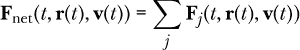
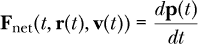
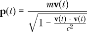
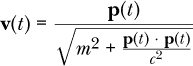
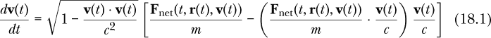
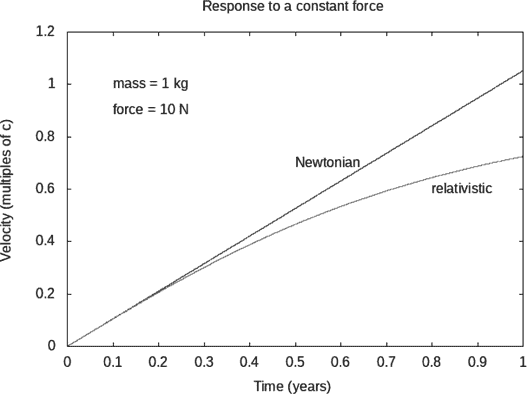
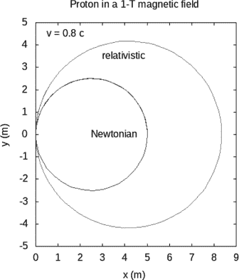
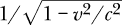

## 18

相对论简短入门


阿尔伯特·爱因斯坦对电磁理论充满兴趣，我们将在本书的第三部分中讨论这个话题。试图理解这一理论促使他对空间和时间提出了新的看法，这些看法统称为*狭义相对论*，他在 1905 年发表了这一理论，并修改了已经存在 200 多年的牛顿力学思想。

狭义相对论在多个方面偏离了牛顿物理学，最显著的概念性偏离是时间的非普适性——也就是说，不同运动模式下的钟表以不同的速度变化。狭义相对论的主题需要一个完整的课程来深入理解相对论的运动学和动力学，但在这里我们只会浅尝辄止。

在本章中，我们将超越牛顿力学，展示狭义相对论如何对粒子的运动作出不同的预测，尤其是当粒子运动非常快时。我们仍然会使用图 16-2 框架，在该框架中，我们从力变换到微分方程，再到状态更新函数，最后得到一系列状态，这一过程依然有效。只是牛顿第二定律需要被相对论运动定律所取代，以计算狭义相对论对受到力作用的粒子运动的预测。相对论定律将把力转化为一个与牛顿第二定律产生的微分方程不同的微分方程。解决微分方程的其余步骤在相对论中与牛顿力学中相同。在本章的最后，我们将展示一些例子，其中牛顿力学和相对论作出了不同的预测。让我们从具体阐述狭义相对论如何偏离牛顿力学开始。

### 一点理论

在狭义相对论中，作用在粒子上的合力仍然是作用在该粒子上的所有力的矢量和。



相对论中没有新的力。狭义相对论理论声称，合力接近但不完全等于质量乘以加速度，就像牛顿的第二定律所说的那样。这个差异在物体运动速度接近光速时更加明显。然而，牛顿第二定律仍然有一个版本在相对论中成立。合力仍然是动量随时间变化的速率。公式 16.1 需要被替换为



其中**p**(*t*)是所考虑物体的动量。

在狭义相对论中，速度和动量之间的关系与牛顿力学中的不同。在牛顿力学中，粒子的动量是其质量乘以速度，**p**(*t*) = *m***v**(*t*)。在相对论物理中，粒子的动量是



其中 *c* = 299,792,458 m/s，是真空中的光速。我们可以通过代数方式反转这个方程，得到一个以动量为变量的速度表达式。



加速度仍然是速度关于时间的变化率，因此通过对前面的方程取时间导数并将净力代入动量的时间导数，我们得到了一个相对论形式的加速度表达式，表示为净力。



方程 18.1 是方程 16.5 的相对论替代形式。你可以看到，如果粒子速度与光速的比值远小于 1，那么这个方程的右侧就会简化为净力除以质量，我们就恢复了牛顿第二定律的原始形式。这意味着，对于像棒球这样的物体在空气中运动时，牛顿第二定律基本上是有效的。但如果它的速度接近光速，我们就需要使用相对论。

如果方程 18.1 看起来过于复杂且不合逻辑，你应该知道，特殊相对论有自己的符号系统，使得像方程 18.1 这样的方程看起来更简洁。相对论的符号使用了 4-矢量，因为时空有四个维度。我们在本书中使用的牛顿力学矢量被称为 3-矢量，因为空间有三个维度。从相对论的角度看，3-矢量是基于将时空任意划分为一个特定的三维空间和一个特定的时间维度的。我们认为是独立的某些量，例如动量和能量，在相对论中结合成了 Taylor 和 Wheeler 所称的 *动能四维矢量*（*momenergy*）。^(1) 只有当我们将相对论的新概念转化为牛顿力学的旧符号时，它们才显得如此复杂。然而，尽管相对论有不同的符号表示法，它和我们在本书中使用的符号给出的结果是相同的。

### 牛顿第二定律的替代形式

在第十六章和第十七章中，我们使用了函数 `newtonSecondPS` 来生成一个表达牛顿第二定律的微分方程。接下来我们将编写的函数 `relativityPS` 生成一个符合特殊相对论动力学的微分方程，因此它可以替代 `newtonSecondPS`。幸运的是，我们可以使用与前几章中相同的数据类型 `ParticleState` 来表示粒子状态。

`newtonSecondPS`和`relativityPS`之间的主要区别在于我们返回加速度的表达式。我们希望使用方程式 18.1，而不是将净力除以质量。函数`relativityPS`假设使用国际单位制（SI 单位），因此速度以米每秒为单位。相对论更优雅地通过自然单位或几何化单位表达，其中*c* = 1，这意味着一秒钟可以与 299,792,458 米互换。练习 18.2 要求你编写一个类似的函数，不假设使用 SI 单位。

这里是`relativityPS`，我们将其包含在`Mechanics3D`模块中，该模块包含第十六章、第十七章和第十八章中所有不属于独立程序的代码。

```
relativityPS :: [OneBodyForce]
             -> ParticleState -> DParticleState  -- a differential equation
relativityPS fs st = let fNet = sumV [f st | f <- fs]
          c = 299792458  -- m / s
          m = mass st
          v = velocity st
          u = v ^/ c
          acc = sqrt (1 - u <.> u) *^ (fNet ^-^ (fNet <.> u) *^ u) ^/ m
      in DParticleState { dmdt = 0    -- dm/dt
                        , dqdt = 0    -- dq/dt
                        , dtdt = 1    -- dt/dt
                        , drdt = v    -- dr/dt
                        , dvdt = acc  -- dv/vt
                        }
```

`let`子句引入了局部变量，用于表示净力、光速、状态中包含的质量和速度、以光速单位表示的速度`u`，以及由方程式 18.1 确定的加速度。然后，在`let`结构的主体中准备并返回状态的时间导数。

现在让我们来看第一个例子，将牛顿力学与特殊相对论进行比较。

### 对恒定力的响应

让我们将特殊相对论的预测与牛顿力学的预测进行对比。我们将探索的第一个情况是一个粒子的运动，最初处于静止状态，并在一段较长时间内受到恒定力的作用。

图 18-1 显示了一个 1 千克物体在受到 10 牛顿力作用下，速度随时间变化的图表。这接近于地球表面上 1 千克物体所受的重力（1-*g*加速度）。



*图 18-1：牛顿力学和相对论对恒定力响应的比较。一个 1 千克的物体受到 10 牛顿的恒定力作用。*

在最初的几个月里，特殊相对论的预测与牛顿力学的预测在速度上几乎没有差异。然而，当速度接近光速时，二者之间出现了差异，特殊相对论的曲线预测速度逐渐接近但永远无法达到光速，而牛顿力学则预测速度线性增加，最终超过光速。由于有非常强的实验证据表明有质量的物体无法超过光速，因此牛顿力学的预测显然是错误的。

清单 18-1 显示了生成该图表的代码。

```
constantForcePlot :: IO ()
constantForcePlot
    = let year = 365.25 * 24 * 60 * 60  -- seconds
          c = 299792458                -- m/s
          method = rungeKutta4 1000
          forces = [const (10 *^ iHat)]
          initialState = defaultParticleState { mass = 1 }
          newtonStates = solver method (newtonSecondPS forces) initialState
          relativityStates = solver method (relativityPS forces) initialState
          newtonTVs = [(time st / year, xComp (velocity st) / c)
                           | st <- takeWhile tle1yr newtonStates]
          relativityTVs = [(time st / year, xComp (velocity st) / c)
                               | st <- takeWhile tle1yr relativityStates]
      in plotPaths [Key Nothing
                   ,Title "Response to a constant force"
                   ,XLabel "Time (years)"
                   ,YLabel "Velocity (multiples of c)"
                   ,PNG "constantForceComp.png"
                   ,customLabel (0.1,1) "mass = 1 kg"
                   ,customLabel (0.1,0.9) "force = 10 N"
                   ,customLabel (0.5,0.7) "Newtonian"
                   ,customLabel (0.8,0.6) "relativistic"
                   ] [newtonTVs,relativityTVs]
```

*清单 18-1：生成图表“对恒定力的响应”的代码*

在代码开始时定义了几个局部变量，例如一年的秒数、光速（以米/秒为单位）、数值方法、初始状态等。前五个局部变量在牛顿计算和相对论计算中都被使用。`newtonStates`和`relativityStates`是牛顿和相对论理论的状态的无限列表。通过比较它们的定义，我们看到它们使用相同的数值方法、相同的力（在 x 方向上的一个 10N 的力）和相同的初始状态。唯一的区别是我们用`relativityPS`替代了`newtonSecondPS`，作为生成我们正在求解的微分方程的函数。

最后，`newtonTVs`和`relativityTVs`是适合绘图的时间-速度对列表。这两个列表的定义几乎完全相同。在每种情况下，代码使用列表推导和`takeWhile`函数来生成一个有限列表。谓词`tle1yr`判断与某个状态相关的时间是否小于或等于一年。你在练习 16.7 中被要求编写这个函数。

代码使用`customLabel`函数在图表上放置多个标签，这个函数我在第十一章中首次介绍，现为了方便再次提及。

```
customLabel :: (R,R) -> String -> Attribute
customLabel (x,y) label
   = Custom "label"
     ["\"" ++ label ++ "\"" ++ " at " ++ show x ++ "," ++ show y]
```

### 磁场中的质子

作为第二个例子，我们将特殊相对论的预测与牛顿力学的预测进行对比，来看一下带电粒子在磁场中的运动。虽然我们第一个特殊相对论的例子发生在一个空间维度上，但这个例子发生在两个维度上。图 18-2 展示了在指向 z 方向（垂直于圆形轨迹平面）的 1 特斯拉磁场中的质子轨迹。



*图 18-2：质子在磁场中的运动*

质子的速度是光速的 4/5。牛顿理论和相对论理论都预测了圆形运动，但圆的半径不同。从图表中我们可以看到，相对论预测的半径比牛顿理论的半径要大。相对论的半径最终比牛顿的半径大一个因子，这个因子在相对论的许多地方都有出现。在这种情况下，相对论的半径是牛顿半径的 5/3 倍。

清单 18-2 展示了生成轨迹的代码。

```
circularPlot :: IO ()
circularPlot
    = let c = 299792458  -- m/s
          method = rungeKutta4 1e-9
          forces = [uniformLorentzForce zeroV kHat]    -- 1 T
          initialState = defaultParticleState
                         { mass    = 1.672621898e-27  -- kg
                         , charge   = 1.602176621e-19  -- C
                         , velocity = 0.8 *^ c *^ jHat
                         }
          newtonStates = solver method (newtonSecondPS forces) initialState
          relativityStates = solver method (relativityPS forces) initialState
          newtonXYs = [(xComp (posVec st), yComp (posVec st))
                           | st <- take 100 newtonStates]
          relativityXYs = [(xComp (posVec st), yComp (posVec st))
                               | st <- take 120 relativityStates]
      in plotPaths [Key Nothing
                   ,Aspect (Ratio 1)
                   ,Title "Proton in a 1-T magnetic field"
                   ,XLabel "x (m)"
                   ,YLabel "y (m)"
                   ,PNG "circularComp.png"
                   ,customLabel (0.5,4.5) "v = 0.8 c"
                   ,customLabel (2.5,0.0) "Newtonian"
                   ,customLabel (3.0,3.5) "relativistic"
                   ] [newtonXYs,relativityXYs]
```

*清单 18-2：生成图表“质子在 1 特斯拉磁场中的运动”的代码*

这四个局部变量在两个理论的预测中都被使用，它们定义了光速、数值方法、力的列表和初始状态。

我们如何为数值方法选择合适的时间步长？猜测可以奏效，但时间步长过大会导致难以理解的结果，而时间步长过小则可能导致几乎没有运动，或者根据计算机要求的不同，计算时间非常长。关键在于，我们希望时间步长相对于情况的关键时间尺度来说要小。一个情况的关键时间尺度可以通过维度分析来找到。通过维度分析，乘除相关参数以得到具有时间维度的量，我们可以找到一个或多个特征时间尺度。在此情况下，相关的参数是质子电荷、质子质量、1 特斯拉的磁场以及初始速度为 4*c*/5。

从这些参数中形成一个具有时间维度的量的唯一方式是将质子质量除以质子电荷与磁场的乘积。这些参数的组合产生一个时间为 *m[p]* / (*q[p] B*) = 1.04 × 10^(-8) s。为了使时间步长相对于问题的相关时间尺度较小，我们应该将这个时间除以 100 或 1,000。因此，时间步长 10^(-10) s 是一个很好的初始猜测。

列表`newtonStates`和`relativityStates`分别是牛顿力学和相对论情况的无限状态列表，就像之前常力示例中的情况一样。列表`newtonXYs`和`relativityXYs`是适合绘图的(x, y)对列表。由于最终会得到圆周运动，因此使用与 y 轴相同的 x 轴比例会更加美观。这可以通过选项列表中的`Aspect (Ratio 1)`选项来实现。

在相对论和牛顿计算中的速度是相同的，但由于相对论的圆圈较大，质子运动的周期（即完成一次圆周运动的时间）在相对论理论中较大。然而，这一点在图表中并不明显。由于这一点，并且为了展示动画中两个独立运动的技术，我们将为这些质子制作一个动画。

由于运动发生在二维空间中，我们将使用`gloss`进行动画。我们在这里动画化的并不是两个质子之间的相互作用，那将是一个包含多个粒子的物理问题，我们将在下一章讨论这类问题。而是，我们感兴趣的是展示两个质子同时独立运动的动画。到目前为止，我们编写的每个动画的状态空间都与基础物理情况的状态空间相同。对于三维空间中的单个粒子，状态空间是`ParticleState`。现在我们想要动画化两个粒子，每个粒子都使用状态空间`ParticleState`。这意味着动画的状态空间需要是`(ParticleState, ParticleState)`，这样动画才能追踪两个粒子。

以下是用于动画的状态更新函数，它结合了两个状态更新函数：一个是牛顿理论的更新函数，一个是相对论的更新函数。

```
twoProtUpdate :: TimeStep
              -> (ParticleState,ParticleState)
              -> (ParticleState,ParticleState)
twoProtUpdate dt (stN,stR)
    = let forces = [uniformLorentzForce zeroV kHat]
      in (rungeKutta4 dt (newtonSecondPS forces) stN
         ,rungeKutta4 dt (relativityPS   forces) stR)
```

局部变量`stN`表示牛顿计算中的传入（尚未更新）状态，而`stR`是相对论计算中的类似状态。

动画的初始状态将两个情况（牛顿与相对论）的初始状态结合在一起，这两个状态是相同的。

```
twoProtInitial :: (ParticleState,ParticleState)
twoProtInitial
    = let c = 299792458  -- m/s
          pInit = protonInitial { velocity = 0.8 *^ c *^ jHat }
      in (pInit,pInit)
```

显示函数为牛顿计算生成蓝色圆盘，为相对论计算生成红色圆盘。

```
twoProtPicture :: (ParticleState,ParticleState) -> G.Picture
twoProtPicture (stN,stR)
    = G.scale 50 50 $ G.pictures [G.translate xN yN protonNewtonian
                                 ,G.translate xR yR protonRelativistic]
      where
        xN = realToFrac $ xComp $ posVec stN
        yN = realToFrac $ yComp $ posVec stN
        xR = realToFrac $ xComp $ posVec stR
        yR = realToFrac $ yComp $ posVec stR
        protonNewtonian = G.Color G.blue (disk 0.1)
        protonRelativistic = G.Color G.red (disk 0.1)
```

Listing 18-3 显示了动画的主程序。这个程序以及所有其他独立的程序都不是`Mechanics3D`模块的一部分。它使用了时间尺度因子 10^(–8)，动画速率为每秒 20 帧，并且使用了我们刚刚定义的三个函数。

```
{-# OPTIONS -Wall #-}

import Mechanics3D
    ( simulateGloss
    , twoProtInitial, twoProtPicture, twoProtUpdate
    )

main :: IO ()
main = simulateGloss 1e-8 20
       twoProtInitial twoProtPicture twoProtUpdate
```

*Listing 18-3：用于质子在磁场中二维运动动画的独立程序*

### 摘要

在本章中，我们介绍了特殊相对论作为一种不同的、更现代的力学理论。通过将牛顿第二定律替换为适当的相对论公式来从力的列表中生成微分方程，我们的方法能够处理这种理论。使用相对论来解决力学问题仍然是一个通过一系列四种表示形式转换信息的过程，首先是单体力，其次是微分方程，然后是状态更新函数，最后是状态列表。相对论法则，方程 18.1，在这个过程中作为将作用在物体上的力的列表转换为微分方程的手段。数值方法仍然将微分方程转换为状态更新函数，我们仍然使用迭代来生成状态列表，作为力学问题的解答。我们能够使用与牛顿力学相同的`ParticleState`数据类型。我们开发了思想和工具来使用特殊相对论定律解决任何单粒子力学问题。这是最后一章集中讨论单粒子的内容。在下一章，我们将讨论多个相互作用的粒子。

### 练习

**练习 18.1。** 图 18-1 中的计算使用了什么时间步长？

**练习 18.2。** 我们编写的用于处理相对论动力学的`relativityPS`函数假设速度以国际单位制（SI）给出。然而，这并不总是方便的。我们可能希望使用自然单位，其中 *c* = 1。让我们编写一个函数，接受 *c* 的值作为输入，从而使我们能够使用 SI 单位、自然单位或其他任何我们可能需要的单位。

使用方程 18.1 来编写函数。

```
relativityPS' :: R  -- c
              -> [OneBodyForce]
              -> ParticleState -> DParticleState
relativityPS' c fs st = undefined c fs st
```

**练习 18.3。** 通过将其与牛顿谐振子进行比较，探索相对论谐振子。唯一的力是一个线性恢复力，选择一个弹簧常数，使得牛顿周期为 1 秒。使用 1 公斤的质量、初始位置为 0，并选择一个方向上初始速度为 4/5*c*。（运动是单维的。）使用本章中的一个示例作为代码模板。绘制牛顿结果和相对论结果的速度与时间的关系图。你的结果应该类似于图 18-3。


*图 18-3：相对论谐振子*
