# 第十九章：相互作用粒子


在牛顿力学中，作用于粒子的力是由其他粒子产生的。本章的目标是发展出关键的概念，使我们能够预测多个相互作用粒子的运动：牛顿第三定律、两体力，以及内部力与外部力的区别。像往常一样，我们将通过代码来表达这些概念。

我们将通过讨论牛顿第三定律来开始这一章。接着，我们将发展两体力的概念，来表达两个粒子之间的相互作用导致一个粒子对第二个粒子施加一个力，并同时导致第二个粒子对第一个粒子施加另一个力。两体力在多粒子情况中是一个足够重要的概念，因此我们将为两体力定义一种数据类型。我们将决定哪些粒子将出现在我们的系统中，并区分内部力和外部力。最后，我们将通过考虑多粒子系统的状态并编写一个状态更新规则来结束这一章，这个规则会自动应用牛顿第三定律，这样我们就不需要手动应用它了。在下一章中，我们将把这里讨论的概念应用到具体的例子情境中。

### 牛顿第三定律

如果我们站在滑冰场上并推我们的朋友，我们可能会发现自己会朝着与推的方向相反的方向加速。我们对朋友施加了一个力，但我们的朋友也对我们施加了一个力，不管他们是否有这个意图。牛顿第三定律声称这两个力是相等且方向相反的。

**牛顿第三定律，牛顿的原话 **[15**]**

*任何动作都会有一个相反且相等的反应；换句话说，两个物体之间的相互作用总是相等的，并且方向总是相反的。*

**牛顿第三定律，现代版本**

*如果物体 A 对物体 B 施加一个力，那么物体 B 对物体 A 施加一个力。这个第二个力的大小与第一个力相等，但方向相反。*

当我们说*第二*个力时，并不意味着时间上的顺序。这些力是一起产生的，来自于同一个过程，不管物体之间的相互作用是什么。

在处理牛顿第二定律时，正如我们在前五章中所做的那样，我们只关注作用在我们应用牛顿第二定律的物体*上的*力。如果一个物体还对其他物体产生了力，这也是可以的，但这些力只有在我们将牛顿第二定律应用到那些其他物体时才会被考虑。牛顿第二定律关心的是作用在物体*上的*力，而不是物体产生的*力*。

另一方面，牛顿第三定律关心的是两者，并对每个相互作用之间的关系进行断言。牛顿第二定律适用于一个物体；而牛顿第三定律适用于两个物体之间的相互作用。

示例 19-1 展示了我们将在本章中开发的`MultipleObjects`模块的第一行代码。

```
{-# OPTIONS -Wall #-}
{-# LANGUAGE MultiParamTypeClasses #-}

module MultipleObjects where

import SimpleVec
    ( Vec, R, (^+^), (^-^), (*^), (^*), (^/), zeroV, magnitude )
import Mechanics1D
    ( RealVectorSpace(..), Diff(..), NumericalMethod, Mass, TimeStep, euler )
import Mechanics3D
    ( OneBodyForce, ParticleState(..), DParticleState(..), HasTime(..)
    , defaultParticleState, newtonSecondPS )

```

*示例 19-1：`MultipleObjects`模块的开头代码*

你现在应该已经熟悉第一行代码了：它启用了警告。第二行启用了一个语言选项，允许我们使用多参数类型类；我们将在本章后面解释这一点。我们将模块命名为`MultipleObjects`。我们从`SimpleVec`导入数据类型`Vec`和`R`，以便在我们的类型签名中使用它们。我们还导入了零向量、`magnitude`函数和基本向量运算符，从`SimpleVec`中进行引用。我们使用类型类`RealVectorSpace`和`HasTime`来扩展通用数值方法`euler`和`rungeKutta4`，以适应本章的多粒子环境。通过使多粒子状态的新数据类型成为这两个类型类的实例，我们将能够使用这两个通用数值方法。我们导入了`newtonSecondPS`，该函数将牛顿第二定律应用于单个粒子，供我们在编写将牛顿第二定律应用于一组粒子的函数时使用。我们导入了`euler`，作为编写多粒子欧拉-克罗梅方法的基础。我们将在本章的过程中完善模块的其余部分。

注意

*我们将交替使用术语* 体、物体、*和*粒子*。粒子指代一个小物体；而*体*和*物体*有时指的是较大且具有空间定向的物体。定向变化叫做*旋转*，而研究能够旋转并在空间中移动的物体的学科叫做*刚体力学*。*我们在这里不涉及刚体力学，尽管本章包含了学习该主题的重要先决知识。我们所说的*体、物体*或*粒子*是指能够承受力、在空间中移动和加速的东西，但它要么没有定向，要么我们可以忽略其定向。有时使用术语点粒子来强调定向无关紧要。*

### 两体力

在第十六章，我们定义了一个`OneBodyForce`，它是一个接受粒子状态作为输入并输出对该粒子的（向量）力的函数。单体力适用于当作用于单一物体的力仅取决于该物体的状态：即其位置、速度、质量、荷电量或当前时间。

力学中的许多力本质上是*两体*的，这意味着力向量取决于产生力的粒子和经历力的粒子的状态。*两体力*是指依赖于两个粒子状态的力。

```
type TwoBodyForce
    =  ParticleState  -- force is produced BY particle with this state
    -> ParticleState  -- force acts ON particle with this state
    -> ForceVector
```

`ForceVector`类型是`Vec`的类型同义词，名称表明我们考虑的特定向量表示一个力。

```
type ForceVector = Vec
```

两体力返回的力向量是由`TwoBodyForce`中首先给定状态的粒子*产生*的，它作用于第二个给定状态的粒子。我们称之为*by-on 约定*。刚才展示的代码注释提醒我们这一约定。

我们写的每个二体力应该遵循牛顿第三定律。如果交换两个粒子的状态，产生的力向量应该是原来力的反向。也就是说，如果`f`是二体力，向量`f st2 st1`应该是`f st1 st2`的负向。由于作用于一个粒子的力是作用于另一个粒子的力的反向，像 by-on 约定这样的约定非常重要，以便例如重力作为吸引力作用，而不是排斥力。

二体力和一体力之间存在关系。给定产生力的粒子的状态，我们可以通过仅提供二体力的第一个输入并不提供其他信息，将二体力转换为一体力。这会创建一个函数。该函数接受作用于粒子上的状态并返回一个力向量，使得该函数成为一体力。以下是用 Haskell 代码表达这一概念：

```
oneFromTwo :: ParticleState  -- state of particle PRODUCING the force
           -> TwoBodyForce
           -> OneBodyForce
oneFromTwo stBy f = f stBy
```

这段代码看似简单。通过将二体力`f`应用于产生力的粒子的状态，我们得到了一个一体力。局部变量`stBy`保存产生力的粒子的状态；等价地，力是由状态为`stBy`的粒子*产生*的。

如果我们的脑袋工作方式更像 Haskell 编译器，我们或许不会费心去定义`oneFromTwo`，因为在任何使用该函数的地方，我们可以通过省略`oneFromTwo`的名字并反转参数顺序来达到等效的行为。然而，我的大脑并不像 Haskell 编译器那样运作，因此这对我来说并不是一种容易或自然的做法。我相信，这个函数对于 Haskell 编译器来说或许有些傻，但对于人类的代码读者和写作者来说，它有其价值，因为它涉及了力学的概念和术语，特别是一体力和二体力。随着编程经验的积累，你会遇到更多编译器认为等效的写法，但它们在你脑海中的表现方式不同。利用语言的灵活性，以便你自己，或许其他人，能够轻松阅读和理解你的代码。你的代码不仅仅是为了计算机，它同样是为了你和其他人。

我们将在本章后面谈到弹簧时使用`oneFromTwo`函数。当我们想要收集作用在一个粒子上的所有力时，我们也会使用它。

让我们来看一些双体力的例子。在编写双体力时，我们需要注意两个问题。首先，双体力需要遵守牛顿的第三定律。为此，正如我们在以下例子中所见，两个物体的状态需要对称地使用。（更准确地说，这两个状态需要以*反对称*的方式使用，这样交换它们会产生负号。）第二，我们需要遵循“由……作用于……”的惯例，以便清楚地理解力作用于哪个物体。Haskell 的类型系统并不会阻止我们错误地写出一个违反牛顿第三定律的`TwoBodyForce`，或者一个返回错误力的函数，所以我们需要小心。

#### 万有引力

牛顿是第一个给出描述两个大质量球形物体之间引力定量关系的人。他表明，一个物体对另一个物体施加的力与每个物体的质量成正比，并且与它们中心之间距离的平方成反比。作为一个方程，牛顿的万有引力定律可以写为：


其中*m*[1]是物体 1 的质量，*m*[2]是物体 2 的质量，*r*是物体中心之间的距离。这个方程给出了物体 1 对物体 2 施加的力的大小（根据牛顿第三定律，这个力的大小与物体 2 对物体 1 施加的力的大小相同）。在国际单位制中，常数*G* = 6.67408 × 10^(–11) N m²/kg²。方程 19.1 可以用 Haskell 表示如下：

```
gravityMagnitude :: Mass -> Mass -> R -> R
gravityMagnitude m1 m2 r = let gg = 6.67408e-11  -- N m² / kg²
                           in gg * m1 * m2 / r**2
```

我们可以使用向量表示法给出牛顿万有引力定律的更全面版本，该版本包括了方程中的力的方向。定义位移向量**r**[21]为从粒子 1 指向粒子 2 的向量，如图 19-1 所示。

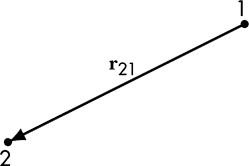

*图 19-1：位移向量 r[21]指向从粒子 1 到粒子 2 的方向。*

我们还将定义一个单位向量 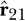，它指向从粒子 1 到粒子 2 的方向。

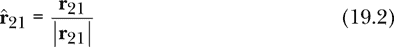

粒子 1 对粒子 2 施加的力**F**[21]可以通过将方程 19.1 中的*r*替换为|**r**[21]|，并用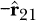表示力的方向来给出，因为作用在粒子 2 上的力是指向粒子 1 的。

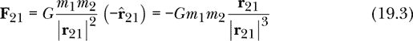

注意，作用在物体 2 上的力**F**[21]与位移向量**r**[21]的方向相反；也就是说，它指向物体 1。这是合理的，因为引力是一种吸引力。

比较方程 19.1 和 19.3，我们看到方程 19.1 更简单，而方程 19.3 更强大，因为它在方程中编码了力的方向。

如果**r**[1]是粒子 1 的位置向量，**r**[2]是粒子 2 的位置向量，那么**r**[21] = **r**[2] – **r**[1]，我们可以将粒子 2 上的力表示为：

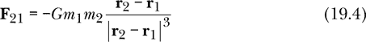

这是关于普遍引力两体力的 Haskell 定义：

```
universalGravity :: TwoBodyForce
universalGravity st1 st2
    = let gg = 6.67408e-11  -- N m² / kg²
          m1 = mass st1
          m2 = mass st2
          r1 = posVec st1
          r2 = posVec st2
          r21 = r2 ^-^ r1
      in (-gg) *^ m1 *^ m2 *^ r21 ^/ magnitude r21 ** 3
```

我们使用`ParticleState`数据类型中的提取函数（也叫做消除器或选择器）`mass`和`posVec`来提取两个粒子的质量和位置向量，并为这些值指定局部名称。我们返回的最终表达式来自方程 19.4。

请注意，普遍引力遵循牛顿的第三定律。我们通过交换* m *[1]和* m *[2]，以及交换**r**[1]和**r**[2]的位置来计算粒子 2 对粒子 1 施加的力**F**[12]。

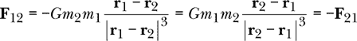

#### 恒定排斥力

让我们尝试编写一个恒定排斥力，作用于两个物体之间；换句话说，一个不依赖于物体之间距离的力。

这里是一个错误的做法：

```
constantRepulsiveForceWrong :: ForceVector -> TwoBodyForce
constantRepulsiveForceWrong force = \_ _ -> force
```

代码的意图是明确的：我们打算忽略粒子的状态并返回任何给定的力。此代码通过了 Haskell 类型检查器并成功编译，但它不符合牛顿第三定律。由于完全忽略了粒子状态，因此无法通过交换粒子状态来改变力的方向，这正是牛顿第三定律所要求的。

这里有一个恒定的排斥力，符合牛顿第三定律：

```
constantRepulsiveForce :: R -> TwoBodyForce
constantRepulsiveForce force st1 st2
    = let r1 = posVec st1
          r2 = posVec st2
          r21 = r2 ^-^ r1
      in force *^ r21 ^/ magnitude r21
```

我们不再传递一个力向量给我们的函数，而是只传递一个力的大小。我们使用两个物体的位置来确定“排斥”的方向。当我们交换这两个粒子的状态时，力的方向会正确地反转。

#### 线性弹簧

弹簧通常由金属或塑料制成，通过拉开两端可以使其伸长，通过推近两端可以使其压缩。弹簧有一个平衡长度，即弹簧被分离并允许恢复其自然形状时，两端之间的距离。

如果物体连接到弹簧的两端，弹簧就能对这些物体施加力。如果两物体之间的距离小于弹簧的平衡长度，弹簧会压缩，并施加排斥力以恢复其平衡长度。类似地，当弹簧被拉长时，会通过施加吸引力来恢复平衡。如果弹簧的质量相较于弹簧两端物体的质量可以忽略不计，那么弹簧一端对物体施加的力将等于且相反于另一端对另一个物体施加的力。弹簧充当了一个遵循牛顿第三定律的两体力。由于每端力的大小相等，我们有时会将弹簧的力当作一个单一的数值来看待。

我们假设弹簧不弯曲，只在连接两端的直线上进行压缩或拉伸。如果*r*[21]是弹簧两端之间的距离，*r[e]*是弹簧的平衡长度，当*r*[21] > *r[e]*时，弹簧处于拉伸状态；当*r*[21] < *r[e]*时，弹簧处于压缩状态；当*r*[21] = *r[e]*时，弹簧处于平衡状态。

弹簧施加的力的大小取决于弹簧从平衡长度延伸或压缩的程度。延伸或压缩越大，力越大。弹簧施加的力依赖于差值*r*[21] – *r[e]*。*线性弹簧*是指力与该差值成正比的弹簧。比例常数*k*称为*弹簧常数*。

让我们称**r**[21]为从弹簧一端物体 1 到另一端物体 2 的位移向量，如图 19-1 所示。那么*r*[21] = |**r**[21]|是从一端到另一端的距离，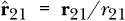是从端 1 指向端 2 的单位向量。表 19-1 显示了弹簧两端的力。

**表 19-1：** 线性弹簧两端的力

|  | **弹簧状态** | **端 1 的力** | **端 2 的力** |
| --- | --- | --- | --- |
| *r*[21] > *r[e]* | 拉伸 | 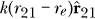 | 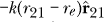 |
| *r*[21] = *r[e]* | 平衡 | 0 | 0 |
| *r*[21] < *r[e]* | 压缩 | 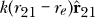 | 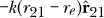 |

弹簧作用在物体 2 上的力**F**[21]如下所示：

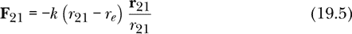

这个方程在弹簧处于拉伸、压缩或平衡状态时都成立。如果**r**[1]是物体 1 的位置向量，**r**[2]是物体 2 的位置向量，那么**r**[21] = **r**[2] – **r**[1]，我们可以将作用在物体 2 上的力写成如下形式：

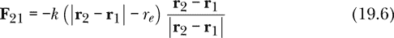

以下是 Haskell 代码，用于计算具有弹簧常数`k`和平衡长度`re`的线性弹簧的双体力：

```
linearSpring :: R  -- spring constant
             -> R  -- equilibrium length
             -> TwoBodyForce
linearSpring k re st1 st2
    = let r1 = posVec st1
          r2 = posVec st2
          r21 = r2 ^-^ r1
          r21mag = magnitude r21
      in (-k) *^ (r21mag - re) *^ r21 ^/ r21mag
```

有时我们可能需要将弹簧的一端固定到墙壁或天花板上。在这种情况下，弹簧最好用一个单体力来表示。这是一个很好的机会，可以使用我们在本章前面编写的函数`oneFromTwo`，将双体力转化为单体力。给定弹簧常数、平衡长度以及弹簧一端的固定位置，函数`fixedLinearSpring`可以为附着在另一端的物体产生一个单体力。

```
fixedLinearSpring :: R -> R -> Vec -> OneBodyForce
fixedLinearSpring k re r1
    = oneFromTwo (defaultParticleState { posVec = r1 }) (linearSpring k re)
```

函数`fixedLinearSpring`的工作原理是创建一个假粒子状态，位于弹簧的固定端。这个粒子状态是“假”的，因为它的唯一作用是提供位置；我们不打算让这个粒子状态像真实粒子一样演化。当这个假粒子状态与双体力`linearSpring k re`一起传递给函数`oneFromTwo`时，我们得到一个一体力，描述了弹簧对可动质量施加的力。

#### 中心力

到目前为止，我们考虑的三种双体力——万有引力、常量排斥力和线性弹簧力——都是*中心力*的例子，中心力是作用在两个粒子之间的力，仅依赖于它们之间的距离，并沿着连接它们的线方向作用。中心力可以是吸引力也可以是排斥力。由物体 1 产生的中心力对物体 2 的作用力的通用表达式为：

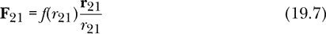

或者

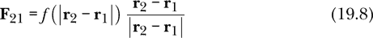

如果**r**[1]是物体 1 的位置向量，**r**[2]是物体 2 的位置向量。以下是 Haskell 中的中心力：

```
centralForce :: (R -> R) -> TwoBodyForce
centralForce f st1 st2
    = let r1 = posVec st1
          r2 = posVec st2
          r21 = r2 ^-^ r1
          r21mag = magnitude r21
      in f r21mag *^ r21 ^/ r21mag
```

我们提供了`centralForce`，它使用标量函数`f`来描述力是如何依赖于两个物体之间的距离的。

前一部分中提到的线性弹簧力可以通过使用这个`centralForce`函数来重新定义，如下所示：

```
linearSpringCentral :: R  -- spring constant
                    -> R  -- equilibrium length
                    -> TwoBodyForce
linearSpringCentral k re = centralForce (\r -> -k * (r - re))
```

在这里我们传递标量函数

*f*(*r*) = –*k*(*r* – *r[e]*)

到`centralForce`，其中负号表示当*r* > *r[e]*时力是吸引力。习题 19.3 要求你将万有引力写成中心力。

#### 弹性台球相互作用

在两个物体发生弹性碰撞时，物体会稍微压缩并储存能量，就像弹簧一样，然后再弹开。在初级物理课程中，碰撞通常被视为“黑箱”事件，我们不涉及碰撞物体之间具体的作用力，而是利用动量守恒来推算碰撞后物体的运动。这里，我们将物体之间的力视为一个双体力，当物体之间相隔时力为零，而当物体接触时力表现为弹簧力。

关键是要知道物体是否接触。我们只在状态中跟踪每个物体的质心位置，因此问题就变成了两个物体的质心是否更接近某个阈值距离，这个阈值距离我们称为*r[e]*。如果物体之间的距离大于*r[e]*，则没有力。如果距离小于*r[e]*，我们将力建模为一个压缩的线性弹簧，弹簧常数为*k*。以下方程给出了物体 1 对物体 2 的力：

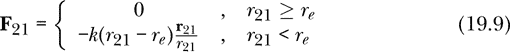

这个力就像一个线性弹簧的一半。它在压缩时表现得像一个线性弹簧，当中心距离小于阈值距离 *r[e]* 时会产生力，但当弹簧会出现拉伸时，则没有力。下面是 Haskell 代码：

```
billiardForce :: R  -- spring constant
              -> R  -- threshold center separation
              -> TwoBodyForce
billiardForce k re
    = centralForce $ \r -> if r >= re
                           then 0
                           else (-k * (r - re))
```

当粒子之间的距离大于或等于阈值分离时，粒子不受任何力作用。当粒子之间的距离小于阈值分离时，物体接触并稍微压缩，感受到排斥力。我们将在下一章中使用这种两体力来模拟碰撞。

### 内力与外力

当我们有多个相互作用的粒子时，作用在任何一个粒子上的力可以分为两种。一方面，存在由我们关注的粒子集合中的其他粒子产生的力。这些是牛顿第三定律适用的力。如果我们关心粒子 A 和 B，并且 A 感受到来自 B 的力，那么牛顿第三定律提醒我们，在我们的计算中需要考虑 B 感受到来自 A 的力这一事实。

另一方面，存在由我们关注的粒子集合外部的物体产生的力。我们可能希望将地球表面的重力作为一种力，而不需要将地球作为我们关心的粒子之一。我们可能还希望包括由电场或磁场产生的力，而不包括这些场的源头在我们的计算中。对于第二种类型的力，牛顿第三定律并不适用；它告诉我们关于作用在我们不关心的事物上的力，而这些我们不需要在计算中考虑。区分这两种力促使了以下定义的产生。

*粒子系统*仅仅是一个选择，决定关注哪些粒子。我们决定在系统中包括哪些粒子，这些粒子的运动通过应用牛顿第二定律来计算。

对于粒子系统，区分*内力*（由我们系统中的粒子产生的力）和*外力*（由我们系统外部的物体产生的力）是有用的。通过区分这些力，我们能够写出一个状态更新规则，自动为我们应用牛顿第三定律。外力不需要牛顿第三定律；它与上一章的处理方式相同，因为我们不关心产生该力的物体的运动。对于内力，两个粒子都在我们的系统中，我们可以对它们进行对称处理，确保每个粒子都经历了适当的力。

让我们创建一个新的力的数据类型，要求每个力必须是外力或内力之一。

```
data Force = ExternalForce Int OneBodyForce
           | InternalForce Int Int TwoBodyForce
```

这个数据类型定义中的`Int`是粒子编号。我们将从 0 开始编号我们系统中的粒子。通过指定经历某种外力的粒子编号以及描述该外力的单体力，我们可以确定特定的外力。例如，`Force`

```
ExternalForce 98 (fixedLinearSpring 1 0.5 (vec 100 0 0))
```

表示粒子 98 受到一个线性弹簧的作用，弹簧常数为 1，平衡长度为 0.5，且弹簧的另一端固定在位置 100 处。

特定的内力通过给出参与相互作用的两个粒子的编号，后跟描述这种相互作用的双体力来指定。例如，`Force`

```
InternalForce 0 1 universalGravity
```

表示粒子 0 和 1 通过万有引力相互作用。`Force`

```
InternalForce 1 0 universalGravity
```

表示相同的意思。为了表示粒子 0 和 1 通过万有引力相互作用，我们在描述粒子系统设置的力的列表中仅包含其中之一，而不是两者。

### 多粒子系统的状态

粒子系统的状态由每个粒子状态中的信息组成。粒子状态的列表是描述多个粒子系统状态的适当类型。

我们可以通过几种方式来处理这个问题。我们可以使用数据类型`[ParticleState]`来描述粒子系统的状态。我们也可以写一个类型同义词，为单粒子状态的列表提供另一个名称。然而，我们不会选择这两条路径，因为我们已经使用单粒子状态的列表来表示单粒子力学问题的解。在这个解中，每个单粒子状态描述的是同一个粒子在不同时间的状态。多粒子系统的状态需要一个粒子列表来达成不同的目的；每个单粒子状态描述的是不同粒子在同一时刻的状态。

由于我们不想将作为单粒子力学问题解的单粒子状态列表与描述多粒子系统的列表混淆，我们使用`data`关键字创建了一个新数据类型，以便编译器将这两种类型视为不同类型。不同的用途意味着不同的类型。

```
data MultiParticleState
    = MPS { particleStates :: [ParticleState] } deriving Show
```

我们使用数据构造器`MPS`（多粒子状态的缩写）构建一个类型为`MultiParticleState`的值。我们本可以使用`MultiParticleState`作为数据构造器的名称，但我选择了`MPS`，因为它更短，也在代码中使用起来不那么笨重。数据构造器下方是一个普通的单粒子状态列表。`data`构造器使得类型`MultiParticleState`与类型`[ParticleState]`区分开来。我们使用记录语法来获取提取函数`particleStates`，而无需显式定义它。

在数据构造器下方，单粒子状态存储在一个列表中，这意味着我们可以通过编号来引用粒子，从`0`开始。每个粒子都通过一个类型为`Int`的数字来标记。

我们顺便提一下，使用列表来表示每个粒子的状态并不是处理数据的最高效方式。在本书中，我们主要关注的是我们编写的代码的清晰性、美观性和简洁性，而对其效率关注较少。在 Haskell 编程中，一个好的规则是，直到你的代码运行得比你希望的慢时，才考虑效率问题。到那时，再问怎么做才能让它更快。在过去，函数式编程曾有一个慢的名声，但现在这种说法不再成立。特别是 Haskell，提供了如数组等数据结构，它们可能比我们正在使用的列表结构更高效。我们使用的基于列表的方法对于十几个粒子效果很好，但对于几百个粒子可能就太慢了。如果你达到了需要用几百或几千个粒子来进行模拟的程度，我建议你研究一下数组类型。为了简便起见，本书中我们坚持使用列表数据类型。

为了使用第十六章中编写的`simulateVis`函数进行动画，在`Vis`模块中，表示某个事物状态的数据类型需要是类型类`HasTime`的一个实例，这意味着状态需要与时间相关联。每个单粒子状态都有一个时间；事实上，组成多粒子状态的每个单粒子状态都有相同的时间。因此，我们将直接使用粒子编号 0 的时间。以下是实例声明：

```
instance HasTime MultiParticleState where
    timeOf (MPS sts) = time (sts !! 0)
```

我们对输入使用模式匹配来定义`timeOf`函数。通过给数据构造器`MPS`后跟一个列表，我们可以在函数体内访问该列表，并使用列表元素操作符（`!!`）。

在下一章，我们将为两个质量和两个弹簧制作动画。该动画使用了`simulateVis`，它依赖于`timeOf`。由于该动画的状态空间是`MultiParticleState`，`simulateVis`需要与`MultiParticleState`相对应的`timeOf`，这正是实例声明所提供的内容。

回顾一下，在第十六章中，我们介绍了数据类型`DParticleState`，用于保存`ParticleState`中状态变量的时间导数。在这里，在多粒子设置中，我们做了类似的事情，定义了一个新的数据类型`DMultiParticleState`，用于保存`MultiParticleState`中状态变量的时间导数。以下是该数据类型的定义：

```
data DMultiParticleState = DMPS [DParticleState] deriving Show
```

从这个定义中可以看出，我们只是在打包一个`DParticleState`的列表，这类似于我们在上面为`MultiParticleState`的定义中打包`ParticleState`列表的方式。

有了一个新的数据类型来表示多粒子系统的状态后，我们接下来要讨论的是该状态如何随时间演化——换句话说，状态是如何更新的。

### 多粒子状态更新

对于多个粒子的系统，图 19-2 提供了数据表示和在它们之间转换的函数的概述，类似于图 16-3 在单粒子情况下的展示。

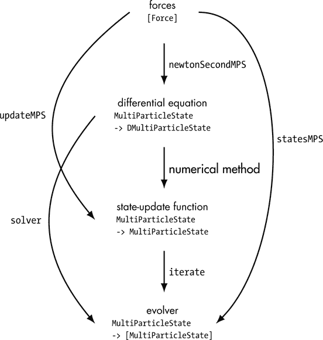

*图 19-2：数据表示和在它们之间转换的函数*

四种表示方法分别是：力、微分方程、状态更新函数和演化器。在下一节中，我们将讨论牛顿第二定律以及在多粒子系统中实现它的函数`newtonSecondMPS`。我们将看到如何在这种设置中使用数值方法，并且定义在图 19-2 中显示的复合函数`updateMPS`和`statesMPS`。

#### 实现牛顿第二定律

对于相互作用的粒子系统，牛顿第二定律和牛顿第三定律都参与了微分方程的形成。图 19-3 展示了一个两体力学问题的示意图。

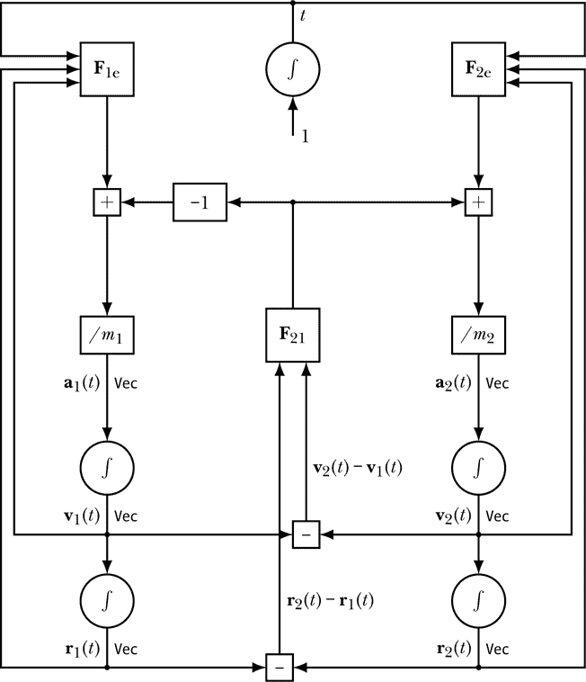

*图 19-3：牛顿第二定律和牛顿第三定律在两体问题中共同作用的示意图。两个物体相互作用，每个物体也有外力作用在它们身上。*

函数**F**[1e]，如图 19-3 左上角所示，表示粒子 1 上的净外力。粒子 1 上的外力可能依赖于时间、粒子 1 的位置和粒子 1 的速度。这三个量作为输入传递给**F**[1e]。我们通过向该函数提供输入来求得粒子 1 的净外力，形成**F**1e, **v**[1] (*t*)）。如果有多个外力作用于粒子 1，它们需要（按向量）相加。函数**F**[1e]需要返回这个和。

从**F**[1e]向下移动图示，我们找到一个求和过程，它将净外力和净内力相加，得到粒子 1 上的净力，这出现在牛顿第二定律中。我们稍后会讨论净内力；现在先继续向下移动图示的左列。牛顿第二定律表示，将粒子 1 上的净力除以粒子 1 的质量会得到粒子 1 的加速度。对加速度进行积分得到速度，再对速度进行积分得到位置。粒子 1 的位置和速度作为输入反馈给净外力函数**F**[1e]。

粒子 1 的位置和速度也与粒子 2 的位置和速度结合，根据图 19-3 的右列，产生一个相对位置和相对速度，作为**F**[21]的输入，即粒子 1 对粒子 2 的内力。如果粒子 1 对粒子 2 施加多个力，比如弹簧力和电力，这些力必须作为矢量相加，形成**F**21 – **r**1,**v**2 – **v**1), 即粒子 1 对粒子 2 的净内力。两个粒子之间的内力不应显式依赖于时间，而应仅通过它们的相对值依赖于两粒子的位置和速度。我们在本章早些时候介绍的所有二体力都具有这一性质。

由于**F**21 – **r**1,**v**2 – **v**1)是粒子 2 上的力，它直接进入右侧的求和，与粒子 2 上的净外力相加。根据牛顿第三定律，粒子 1 所受的力等于粒子 2 对粒子 1 的作用力且方向相反，因此乘以-1，得到粒子 1 上的净内力，然后与粒子 1 上的净外力相加。

时间是通过对常数 1 进行积分来生成的，就像我们之前的示意图那样。时间是每个净外力函数的输入，但不是净内力函数的输入。

总结图 19-3，每个粒子上的内力和外力必须加在一起，形成粒子上的净力，根据牛顿第二定律，净力除以粒子的质量即可计算粒子的加速度。牛顿第三定律在中间列中得以体现，在那里计算出相互作用的力，将其不变地传送给粒子 2，并将其取反后传送给粒子 1。内力表达了两个粒子之间的相互作用，而外力则代表了与系统外部事物的相互作用。所有这些反馈意味着一组耦合的微分方程将是多粒子力学问题的数学表达。

我们可以将牛顿第二定律写成一组耦合的微分方程。

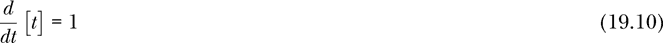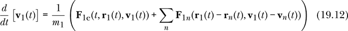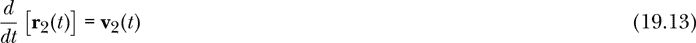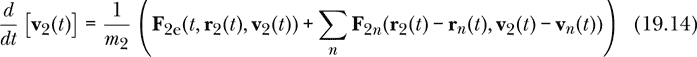

时间的时间导数为 1，就像单粒子力学中一样。位置的时间导数是速度，这对每个粒子都成立。速度的时间导数是加速度，它是通过对每个粒子将净力除以质量得到的。粒子上的净力是净外力和净内力的总和。函数**F**[2*e*]在给定时间、粒子 2 的位置和粒子 2 的速度时，产生粒子 2 的净外力。函数**F**[*mn*]在给定粒子*m*和*n*的相对位置和相对速度时，产生粒子*n*对粒子*m*的内力。例如，粒子 2 上的净内力是：

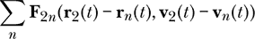

我们在这里添加了系统中所有其他粒子产生的内力。我们仅为系统中的前两个粒子给出了方程，但每个粒子都有一对类似的方程。希望这个模式是清晰的。

在第十六章中，我们讨论的是单个粒子的运动，我们使用了`newtonSecondPS`函数将一系列力转换为微分方程。现在我们希望为多个粒子提供一个类似的函数。我们希望有一个如下类型签名的函数：

```
newtonSecondMPS :: [Force]
                -> MultiParticleState -> DMultiParticleState  -- a diff eqn
```

这个函数的名字以*MPS*结尾，提醒我们它与`MultiParticleState`状态空间一起工作。

我们的计划是将牛顿第二定律应用于系统中的每个粒子。对于每个粒子，我们识别作用于它的所有外力和内力，并将每个内力转化为一个单体力。一旦我们得到了作用于粒子的所有单体力的列表，我们就可以使用`newtonSecondPS`函数计算该粒子的所有状态变量的时间导数。当我们获得每个粒子每个状态变量的时间导数时，我们将把所有这些合并起来，并请求`newtonSecondMPS`返回这个合并结果。以下是代码：

```
newtonSecondMPS fs mpst@(MPS sts)
    = let deriv (n,st) = newtonSecondPS (forcesOn n mpst fs) st
      in DMPS $ map deriv (zip [0..] sts)
```

代码的第一行命名了传入的力列表`fs`，并给传入的多粒子状态指定了*两个*名称。当出现在定义的左侧两个名称之间时，`@`（“at 符号”）允许代码编写者为传入值提供一个简单的标识符，并同时对输入进行模式匹配。简单标识符`mpst`代表传入的多粒子状态，类型为`MultiParticleState`。由于它出现在数据构造器`MPS`下方，因此名称`sts`代表单粒子状态的列表，类型为`[ParticleState]`。我们希望在定义中使用`mpst`和`sts`。

在代码的第二行，我们定义了一个局部函数`deriv`，用于计算单粒子状态变量的时间导数。它的参数`(n, st)`是粒子编号和单粒子状态的一个对。它的返回值是导数的集合（类型为`DParticleState`）。这个局部函数使用`newtonSecondPS`来计算导数。表达式`forcesOn n mpst fs`是作用在粒子编号`n`上的单粒子力的列表，其中多粒子状态为`mpst`，而所有系统力（包括外力和内力）为`fs`。接下来，我们将编写`forcesOn`函数。

在最后一行，我们将粒子编号与相应的粒子状态组合在一起，形成一个编号-状态对的列表。然后，我们对该列表应用局部函数`deriv`，得到单粒子状态的时间导数列表（类型为`[DParticleState]`）。最后，我们应用`DMPS`数据构造器来形成时间多粒子状态的导数（类型为`DMultiParticleState`）。

从物理学的角度来看，我们所做的只是将牛顿第二定律应用到系统中的每个粒子。表面上的复杂性部分来自我们需要给粒子编号，部分来自我们希望使用清晰的类型来表示我们关心的事物（例如内部和外部力）。清晰的类型在两个方面对我们有帮助。首先，类型代表了物理学中的重要概念，并帮助我们思考这些概念。其次，类型帮助编译器发现我们的错误。通过在像这样的函数中做一些繁重的工作，我们最终会得到一组强大的函数，使我们能够相对容易地解决多粒子问题。

我们如何找到每个粒子的合力？换句话说，我们如何编写我们之前使用的`forcesOn`函数？`forcesOn`应该是什么类型？`forcesOn`函数需要接受一个粒子编号、一个多粒子状态和一个力列表作为输入，并且它需要输出一个单粒子力的列表。这里是`forcesOn`的类型签名和定义：

```
forcesOn :: Int -> MultiParticleState -> [Force] -> [OneBodyForce]
forcesOn n mpst = map (forceOn n mpst)
```

传入的粒子编号命名为`n`，传入的多粒子状态命名为`mpst`。我们不需要给力列表命名，这意味着`forcesOn n mpst`的类型为`[Force] -> [OneBodyForce]`。从定义中可以看出，`forcesOn`将大部分工作委托给另一个尚未定义的函数`forceOn`（注意省略了*s*）。其思想是，函数`forceOn n mpst`的类型为`Force -> OneBodyForce`，将系统力列表中的外力或内力转换为作用在粒子`n`上的单粒子力。如果我们能转换单个力，我们就可以使用`map`来转换力的列表。

函数`forceOn`需要处理外力和内力。外力较为简单。我们只需检查外力是否作用于粒子`n`。如果是，我们返回外力内包含的单粒子力。如果不是，我们就构造一个值为零的单粒子力。

对于内力，我们需要检查内力中指定的两个粒子编号是否与我们关心的粒子编号`n`匹配。如果匹配，我们使用前面章节中编写的`oneFromTwo`函数，将双体力转换为单体力。如果不匹配，我们再次构造一个零力。以下是`forceOn`的代码：

```
forceOn :: Int -> MultiParticleState -> Force -> OneBodyForce
forceOn n _         (ExternalForce n0 fOneBody)
    | n == n0    = fOneBody
    | otherwise  = const zeroV
forceOn n (MPS sts) (InternalForce n0 n1 fTwoBody)
    | n == n0    = oneFromTwo (sts !! n1) fTwoBody  -- n1 acts on n0
    | n == n1    = oneFromTwo (sts !! n0) fTwoBody  -- n0 acts on n1
    | otherwise  = const zeroV
```

该函数对`Force`输入使用模式匹配，因此每个`Force`数据构造函数（即外力和内力）都有一部分定义。这个定义使用了 Haskell 中的*守卫*功能。守卫就是代码中几行左侧的竖线，它是`if-then-else`结构的一个便捷替代方案，尤其当有多个可能性时，比如处理内力的部分。

`guard`构造中的每一行由四个部分组成：竖线、布尔条件、等号和结果。在每个竖线处都会检查条件。如果条件为真，则返回对应的结果；如果条件为假，则继续检查下一个竖线并重复此过程。最后一行的条件通常使用`otherwise`，它实际上就是`True`的另一种表示方式。通过使用`otherwise`，我们可以确保至少有一个守卫条件为真，从而返回相应的结果。

`forceOn`定义的第一部分用于外力。我们检查粒子编号`n`（即我们当前关心的粒子）是否与外力作用的粒子编号`n0`匹配。如果匹配，返回外力中包含的单体力`fOneBody`；如果不匹配，则返回一个忽略粒子状态、简单返回零向量的单体力`const zeroV`。

`forceOn`定义的第二部分用于处理内力。内力涉及两个粒子；如果我们关心的粒子是其中之一，函数需要返回适当的单体力。我们首先检查粒子编号`n`（即我们当前关心的粒子）是否与内力中涉及的两个粒子之一的编号`n0`匹配。如果`n`等于`n0`，我们就关心粒子`n1`对粒子`n0`施加的力。我们将前面章节中写的`oneFromTwo`函数提供给粒子`n1`的单体状态（即`sts !! n1`）和内力中包含的双体力（即`fTwoBody`）。`oneFromTwo`函数返回作用于粒子`n`的单体力。

如果`n`不等于`n0`，我们检查`n`是否等于`n1`，即参与内力作用的另一个粒子。如果是这样，我们关心的是粒子`n0`对粒子`n1`施加的力。我们为`oneFromTwo`提供粒子`n0`的单粒子状态，称为`sts !! n0`，以及内力中的双体力。函数`oneFromTwo`再次返回作用在粒子`n`上的单体力。最后，如果粒子`n`既不匹配`n0`也不匹配`n1`，我们返回零力。

`forceOn`定义中处理内力的部分是我们如何应用牛顿第三定律的部分。这一部分保证了力的大小和方向相等且相反，因为它们来自同一个内力。对于涉及的两个粒子，我们使用相同的双体力来产生作用在每个粒子上的单体力；只有单粒子状态被互换。由于双体力具有粒子交换会抵消力的特性，牛顿第三定律自动得到应用。我们不会犯这样的错误：记得`n1`对`n0`施加力，却忘了`n0`对`n1`施加力。我们对内力的语言和处理它们的代码确保了牛顿第三定律在没有程序员额外注意的情况下自动得以满足。特别是，每次我们研究一个新的多粒子系统时，我们提供的只是外力和内力的列表。我们不需要确保`n1`对`n0`施加的力与`n0`对`n1`施加的力相等且方向相反。Haskell 会自动处理这一切。

#### 多粒子的数值方法

记住，欧拉法和四阶龙格-库塔法是求解任何微分方程的通用方法。在第十五章的末尾，我们编写了函数`euler`和`rungeKutta4`，它们适用于任何状态空间`s`，该状态空间是`RealVectorSpace`类型类的一个实例。为了使这两个函数能够与`MultiParticleState`状态空间一起使用，我们需要编写两个实例声明。它们如下所示：

```
instance RealVectorSpace DMultiParticleState where
    DMPS dsts1 +++ DMPS dsts2 = DMPS $ zipWith (+++) dsts1 dsts2
    scale w (DMPS dsts) = DMPS $ map (scale w) dsts
```

这个实例声明的内容是两个多粒子状态的和就是每个粒子的逐个和。

```
instance Diff MultiParticleState DMultiParticleState where
    shift dt (DMPS dsts) (MPS sts) = MPS $ zipWith (shift dt) dsts sts
```

这个实例声明表示“通过状态导数对多粒子状态进行‘平移’”只是将每个单粒子状态平移由相关的单粒子状态导数所平移。

欧拉-克罗梅尔方法并不是适用于所有微分方程的通用方法，因此我们需要为欧拉-克罗梅尔方法编写一个显式的数值方法，适用于`MultiParticleState`数据类型。它如下所示：

```
eulerCromerMPS :: TimeStep        -- dt for stepping
               -> NumericalMethod MultiParticleState DMultiParticleState
eulerCromerMPS dt deriv mpst0
    = let mpst1 = euler dt deriv mpst0 sts0 = particleStates mpst0
          sts1 = particleStates mpst1
          -- now update positions
          in MPS $ [ st1 { posVec = posVec st0 ^+^ velocity st1 ^* dt }
                         | (st0,st1) <- zip sts0 sts1 ]
```

我们选择通过首先进行欧拉步来计算欧拉-克罗梅尔导数，这样操作简单，能够正确更新每个粒子的质量、电荷、时间和速度。然而，位置需要被修正，因为它需要基于更新后的速度。局部变量`mpst0`代表传入的多粒子状态，而`mpst1`代表经过欧拉更新的多粒子状态。变量`sts0`和`sts1`是传入和欧拉更新后的多粒子状态下的单粒子状态列表。

为了形成欧拉-克罗梅尔更新后的多粒子状态，我们使用列表推导来遍历所有粒子，并应用欧拉-克罗梅尔更新公式 15.10，该公式用欧拉更新后的速度更新传入的位置。

#### 复合函数

与单粒子情况一样，方便的是有复合函数，这些复合函数在图 19-2 中包含两步或三步操作。函数`updateMPS`是牛顿第二定律与数值方法的组合，适用于动画。你可以从其定义中看到，它正是这种组合：

```
updateMPS :: NumericalMethod MultiParticleState DMultiParticleState
          -> [Force]
          -> MultiParticleState -> MultiParticleState
updateMPS method = method . newtonSecondMPS
```

图 19-2 中的函数`solver`也采取了数据表示中的两步，通过生成一个可以从初始状态生成状态列表的进化器来求解微分方程。我们在第十五章编写了`solver`，这段代码在多粒子环境中运行得很好。

函数`statesMPS`包含图 19-2 中的所有三步，将力的列表转化为一个进化器。其定义就是你所预期的：牛顿第二定律、数值方法和迭代的组合。

```
statesMPS :: NumericalMethod MultiParticleState DMultiParticleState
          -> [Force]
          -> MultiParticleState -> [MultiParticleState]
statesMPS method = iterate . method . newtonSecondMPS
```

### 总结

在本章中，我们将牛顿力学应用于多个在三维空间中相互作用的物体。牛顿第三定律支配粒子之间的相互作用。双粒子力是依赖于两粒子状态的力。我们将作用在系统中粒子上的力分为内力和外力，内力由系统内的其他粒子产生，外力则由系统外部的事物产生。粒子系统的状态通过给出每个粒子的单粒子状态来描述。我们的`MultiParticleState`数据类型正是做到了这一点。我们的状态更新过程仍然基于牛顿第二定律，但现在它会自动将牛顿第三定律应用于所有的内力。

与单粒子情况一样，解决力学问题仍然是通过一系列四种表示形式转换信息的过程。对于多粒子情况，我们首先列出内外力，产生一个微分方程，产生一个状态更新函数，最后生成多粒子状态列表。

通过第二部分的内容，我们已经看到从力到微分方程的推导过程是如何演变的。牛顿的第二定律始终存在，但随着我们从一维到三维，再到多粒子，状态中包含的信息也逐渐增加。表 19-2 展示了我们用来通过生成微分方程来执行牛顿第二定律的函数。`newtonSecondV`函数用于一维中的单个粒子，当力仅依赖于速度时。`newtonSecondTV`函数用于一维中的单个粒子，当力仅依赖于时间和速度时。`newtonSecond1D`函数用于一维中的单个粒子，当力可能依赖于时间、位置或速度的任意组合时。`newtonSecondPS`函数用于三维中的单个粒子，当力可能依赖于时间、位置或速度时。最后，`newtonSecondMPS`函数用于三维中的多粒子系统，当力可能依赖于时间、位置或速度时。

**表 19-2：** 牛顿第二定律的函数

| **函数** | **类型** |
| --- | --- |
| `newtonSecondV` | `质量 -> [速度 -> 力] -> 速度 -> 距离` |
| `newtonSecondTV` | `质量 -> [(时间, 速度) -> 力] -> (时间, 速度) -> (距离, 距离)` |
| `newtonSecond1D` | `质量 -> [一维状态 -> 力] -> 一维状态 -> (距离, 距离, 距离)` |
| `newtonSecondPS` | `[单体力] -> 粒子状态 -> D 粒子状态` |
| `newtonSecondMPS` | `[力] -> 多粒子状态 -> D 多粒子状态` |

我们在第二部分中已经使用了`Force`类型两种不同的方式。在一维设置中，`Force`只是一个实数类型的同义词。而在本章的三维多粒子设置中，`Force`的定义要复杂得多，它描述了一种数据类型，既可以是内部力，也可以是外部力，并包括力对状态的依赖。我们已经走了很长一段路。在下一章，我们将把这些思想应用于相互作用的粒子具体示例，并使我们的结果动起来。

### 练习

**练习 19.1.** 编写一个`speed`函数

```
speed :: ParticleState -> R
speed st = undefined st
```

返回粒子的速度（从其状态中）。

**练习 19.2.** 我们可以通过模式匹配而非提取函数来编写万有引力的双体力。这样得到的定义更简洁。完成以下定义：

```
universalGravity' :: TwoBodyForce
universalGravity' (ParticleState m1 _ _ r1 _) (ParticleState m2 _ _ r2 _)
    = undefined m1 r1 m2 r2
```

**练习 19.3.** 万有引力是一个中心力。使用函数`centralForce`来编写该函数

```
universalGravityCentral :: TwoBodyForce
universalGravityCentral = undefined
```

它表达与`universalGravity`相同的双体力。

**练习 19.4.** 我们的恒定排斥力是一个中心力。使用`centralForce`重写恒定排斥力。

**练习 19.5.** 没有任何真实的弹簧在其整个范围内是完全线性的。在练习 15.10 中，我们引入了伦纳德-琼斯弹簧作为非线性弹簧的例子。

弹簧末端 2 处的力由以下表达式给出，其中 *r[e]* 是平衡长度，*D[e]* 是解离能（即，拉伸弹簧使两端非常远的所需能量）：

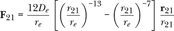

如果 *r*[21] < *r[e]*，粒子 2 上的力将在 **r**[21] 方向上，这表示排斥。如果 *r*[21] > *r[e]*，粒子 2 上的力将在 –**r**[21] 方向上，这表示吸引。

编写函数 `lennardJones`，它接受解离能和平衡长度并返回 Lennard-Jones 弹簧的二体力。

```
lennardJones :: R  -- dissociation energy
             -> R  -- equilibrium length
             -> TwoBodyForce
lennardJones de re = centralForce $ \r -> undefined de re r
```

**习题 19.6.** 编写一个函数`systemKE`

```
systemKE :: MultiParticleState -> R
systemKE mpst = undefined mpst
```

该函数返回一个粒子系统的动能，通过将每个粒子的动能加起来。

**习题 19.7.** 每个示意图中的导线可以用类型标记。请在图 19-3 中标记每条导线的类型。

**习题 19.8.** 编写函数 `forcesOn` 的另一种方式是，通过将外力产生的单体力列表附加到由内力产生的单体力列表，形成一个单体力列表。该方法的优点是我们不需要构造任何虚假的零力，也不需要函数 `forceOn`。

```
forcesOn' :: Int -> MultiParticleState -> [Force] -> [OneBodyForce]
forcesOn' n mpst fs = externalForcesOn n fs ++ internalForcesOn n mpst fs

externalForcesOn :: Int -> [Force] -> [OneBodyForce]
externalForcesOn n fs = undefined n fs

internalForcesOn :: Int -> MultiParticleState -> [Force] -> [OneBodyForce]
internalForcesOn n (MPS sts) fs
    = [oneFromTwo (sts !! n1) f | InternalForce n0 n1 f <- fs, n == n0] ++
      [oneFromTwo (sts !! n0) f | InternalForce n0 n1 f <- fs, n == n1]
```

在定义函数 `internalForcesOn` 时，我们在列表推导式中使用模式匹配。我们排除任何不匹配模式的力。根据 `internalForcesOn` 的模型，编写函数 `externalForcesOn`。
