# 第二十章：弹簧、台球和吉他弦


本章将上一章中的思想和理论应用于三个具体示例。第一个是一个由两个质量和两根弹簧组成的系统，这些弹簧挂在一个固定的天花板上；第二个是台球碰撞；第三个是将吉他弦建模为一条由粒子组成的长线，粒子通过弹簧与相邻的粒子连接。

本章将有一些不同的地方。我们将更详细地研究之前所做的近似数值计算，比之前的章节更深入地处理数值问题。我们还将研究在近似数值计算的背景下，动量和能量守恒。我们还将介绍一种异步动画的方法，首先进行计算，然后制作成可以观看的电影。异步动画适用于当计算变得过于复杂，无法在人类耐心等待结果的时间尺度内完成时。

### 入门代码

清单 20-1 显示了我们将在本章中开发的`MOExamples`模块的入门代码（*MO*代表*多物体*）。像往常一样，我们导入了我们想在这个模块中使用的函数和类型。

```
{-# OPTIONS -Wall #-}

module MOExamples where

import SimpleVec
   ( R, Vec, (^+^), (^-^), (*^), vec, zeroV, magnitude
   , sumV, iHat, jHat, kHat, xComp, yComp, zComp )
import Mechanics1D ( TimeStep, NumericalMethod, euler, rungeKutta4 )
import Mechanics3D
   ( ParticleState(..), HasTime(..), defaultParticleState
   , earthSurfaceGravity, customLabel, orient, disk )
import MultipleObjects
   ( MultiParticleState(..), DMultiParticleState, Force(..), TwoBodyForce
   , newtonSecondMPS, updateMPS, statesMPS, eulerCromerMPS
   , linearSpring, fixedLinearSpring, billiardForce )
import Graphics.Gnuplot.Simple
import qualified Graphics.Gloss as G
import qualified Vis as V
```

*清单 20-1：MOExamples 模块的开头代码*

`ParticleState`和`MultiParticleState`类型是我们用于描述单个粒子和多个粒子状态的类型。函数`newtonSecondMPS`根据内部和外部力的列表创建一个微分方程。函数`euler`、`eulerCromerMPS`和`rungeKutta4`用于求解微分方程。我们导入了类型类`HasTime`，这样我们就可以使用它所包含的`timeOf`函数，因为我们在一个练习中明确引用了`HasTime`。

### 两个质量和两根弹簧

作为第一个多物体系统的示例，让我们分析图 20-1 中的情况。

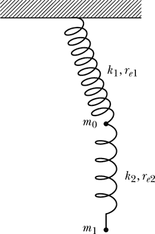

*图 20-1：一个由两个质量和两根弹簧组成的系统*

在图 20-1 中，我们有两个质量和两根弹簧。上面的弹簧连接到一个固定的天花板，具有弹簧常数*k*[1]和平衡长度*re*[1]。下面的弹簧连接两个物体，具有弹簧常数*k*[2]和平衡长度*re*[2]。上方物体的质量为*m*[0]，下方物体的质量为*m*[1]。地球表面的重力作用于每个物体。

#### 力

这种情况下共涉及四个力：三个外力和一个内力。列表`twoSpringsForces`包含了这四个力，我们将按照它们的列出顺序进行描述。

```
twoSpringsForces :: [Force]
twoSpringsForces
    = [ExternalForce 0 (fixedLinearSpring 100 0.5 zeroV)
      ,InternalForce 0 1 (linearSpring 100 0.5)
      ,ExternalForce 0 earthSurfaceGravity
      ,ExternalForce 1 earthSurfaceGravity
      ]
```

由于一端固定，上方的弹簧对物体 0 施加外力。相关的单体力是`fixedLinearSpring 100 0.5 zeroV`，这是一个线性弹簧产生的力，弹簧常数为 100 N/m，平衡长度为 0.5 米，附着在原点的天花板上。下方的弹簧作为物体 0 和物体 1 之间的内力。它也具有 100 N/m 的弹簧常数和平衡长度 0.5 米。最后两个力描述了地球对这两个物体施加的重力。

#### 动画函数

我们希望使用非光滑效果对物体的振荡进行动画化。我们需要指定五个作为输入传递给`simulateVis`函数的参数：时间尺度因子、动画速率、初始状态、显示函数和状态更新函数。我们选择时间尺度因子为 1，动画速率为 20 帧/秒。

在初始状态下，我们必须给出每个物体的质量、初始位置和速度。我们设定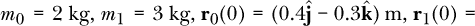 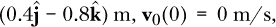 和**v**1 twoSpringsForces
```

时间步长被命名为`dt`。回想一下，在动画中，我们并不直接选择时间步长。我们通过时间尺度因子和动画速率间接选择它，然后动画包尽力遵循该速率，尽管它们并不做出任何保证。由于旧状态没有在定义的等号左侧命名，因此返回类型为`MultiParticleState -> MultiParticleState`。我们使用`updateMPS`来创建状态更新函数。给定数值方法和力列表时，它返回一个状态更新函数。我们选择使用时间步长`dt`的欧拉-克罗梅数值方法，并提供我们之前写的力列表。

我们已经指定了时间尺度因子、动画速率、初始状态和我们将用于动画的状态更新函数。接下来我们将在查看独立程序动画时讨论显示函数。

#### 独立动画程序

示例 20-2 展示了一个用于二维物体和弹簧 3D 动画的独立程序。

```
➊ {-# OPTIONS -Wall #-}

   import SimpleVec ( R, zeroV )
   import Mechanics3D ( posVec, simulateVis, v3FromVec )
   import MultipleObjects ( MultiParticleState(..) )
   import MOExamples ( twoSpringsInitial, twoSpringsUpdate )
   import Vis ( VisObject(..), Flavour(..), red, green, blue )

   main :: IO ()
   main = simulateVis 1 20 twoSpringsInitial twoSpringsVisObject twoSpringsUpdate

   twoSpringsVisObject :: MultiParticleState -> VisObject R
➋ twoSpringsVisObject (MPS sts)
    ➌ = let r0 = posVec (sts !! 0)
          ➍ r1 = posVec (sts !! 1)
          ➎ springsObj = Line Nothing [v3FromVec zeroV
                                       ,v3FromVec r0
                                       ,v3FromVec r1] ➏ blue
          ➐ objs = [Trans (v3FromVec r0) (Sphere 0.1 Solid red)
                    ,Trans (v3FromVec r1) (Sphere 0.1 Solid green)
                    ,springsObj
                    ]
          ➑ vpm = 1  -- Vis units per meter
      ➒ in Scale (vpm,vpm,vpm) $ VisObjects objs
```

*示例 20-2：二维物体和弹簧的独立程序动画*

程序首先启用警告 ➊，然后导入所需的类型和函数。程序从第十章的`SimpleVec`模块、第十六章的`Mechanics3D`模块、第十九章的`Multiple Objects`模块以及当前章节的`MOExamples`模块中导入了所需内容。它从`SimpleVec`模块导入了`zeroV`，以便引用原点，弹簧固定的位置。程序导入了`R`，因为它在类型`VisObject R`中有使用。

让我们讨论一下从`Mechanics3D`模块导入的内容。程序导入了`posVec`函数，这是`ParticleState`数据类型的提取函数，用于返回粒子状态的位移向量。显示函数中唯一需要的状态变量是位置。其他状态变量对给定状态下图片的呈现没有任何贡献。程序导入了`simulateVis`，这是生成动画的主要函数。程序还导入了`v3FromVec`，用于将类型为`Vec`的向量转换为`V3`类型的向量，这是非-华丽模式下的向量类型。

从`MultipleObjects`模块中，我们导入了`MultiParticleState`类型及其构造函数，以便在显示函数的类型签名中引用该类型，并使用构造函数`MPS`在显示函数的定义中对输入进行模式匹配。从当前章节的`MOExamples`模块中，我们导入了初始状态和状态更新函数，这两个是制作动画所需的五个元素中的一部分。

从模块`Vis`中，程序导入了`VisObject`类型及其构造函数，包括`Line`、`Sphere`、`Trans`、`Scale`和`VisObjects`。我们导入了`Flavour`类型及其构造函数，因为球体需要是实体的或线框的，而我们使用的`Solid`数据构造函数是`Flavour`的构造函数之一。程序还导入了颜色`red`、`green`和`blue`。

主程序命名为`main`，类型为`IO ()`。它调用`simulateVis`，并传入制作动画所需的五个元素，其中包括在独立程序中定义的显示函数`twoSpringsVisObject`。

显示函数`twoSpringsVisObject`根据系统的状态生成图像。显示函数的定义开始时通过模式匹配输入数据，以便函数体能够访问由两个单粒子状态组成的二元列表`sts` ➋。我们为两个物体的位置分别命名为`r0`和`r1` ➌ ➍。局部变量`springsObj`是代表两个弹簧的两条线的图像 ➎。为了构造两条线的图像，我们使用了`Line`数据构造函数。

让我们来看一下`Line`类型在非-华丽模式下的定义。

```
Prelude Graphics.Gloss>  :m Vis Linear.V3
Prelude Vis Linear.V3>  :t Line
Line :: Maybe a -> [V3 a] -> Color -> VisObject a
```

这个`Line`有三个输入。第一个输入与线条宽度有关。为了得到默认的线条宽度，在清单 20-2 中，我们为第一个输入提供了`Nothing`➎。第二个输入是一个向量列表，每个向量具有 not-gloss 的本地`V3 a`类型。在我们的用法中，类型变量`a`代表`R`类型。我们通过`v3FromVec`将`Vec`转换为`V3 R`➎。第三个输入是颜色，程序为其提供了`blue`➏。

我们定义`objs`为两质量块和两弹簧的图片列表➐。质量块的图片是球体，位移到状态中包含的位置。

然后，我们定义一个空间缩放因子`vpm`，它等于 1 Vis 单位/米➑。当然，缩放为 1 是没有必要的，但这样写代码可以方便地将值更改为其他数值。最后，`VisObjects`将多个图片合并为一张单独的图片，`Scale`则对整个结果进行缩放➒。

#### 使用机械能作为数值准确性的指导

我们正在研究的由两个质量块和两个弹簧组成的系统应当保持机械能守恒。在本节中，我们将讨论粒子系统可以具有的能量类型，并将了解如何使用能量作为工具来评估我们数值方法的准确性。

##### 动能

每个运动中的粒子都有一种被称为*动能*的运动能量。单个粒子的动能是粒子质量的一半乘以其速度的平方。我们将用小写的*KE*表示单个粒子的动能。动能是一个标量，其国际单位制单位是焦耳（J）。

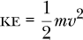

速度*v* = |**v**|是速度**v**的大小。这里是一个返回单个粒子动能的 Haskell 函数：

```
kineticEnergy :: ParticleState -> R
kineticEnergy st = let m = mass st
                       v = magnitude (velocity st)
                   in (1/2) * m * v**2
```

粒子系统的动能是系统中每个粒子动能的总和。我们用大写的*KE*表示系统的动能。在一个粒子系统中，质量为*m[n]*，速度为**v**[*n*]的第*n*个粒子的动能由以下公式给出：

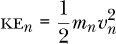

系统的动能为：

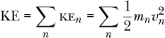

这是一个返回粒子系统动能的 Haskell 函数：

```
systemKE :: MultiParticleState -> R
systemKE (MPS sts) = sum [kineticEnergy st | st <- sts]
```

##### 势能

有些力的特点在于它们可以与*势能*相关联。这样的力被称为*守恒力*，例如弹簧的弹性力和重力就是其中的例子。

弹簧通过被压缩或从平衡位置伸展而获得势能。弹簧可以通过这种方式储存能量。一个线性弹簧的弹簧常数为*k*，当它从平衡位置偏移（压缩或伸展）一个距离*x*时，具有的势能为：

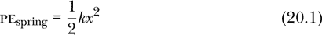

与弹簧相关的势能类型称为*弹性势能*。函数`linearSpringPE`计算给定弹簧常数、平衡长度和每端粒子状态时的弹性势能。

```
linearSpringPE :: R              -- spring constant
               -> R              -- equilibrium length
               -> ParticleState  -- state of particle at one end of spring
               -> ParticleState  -- state of particle at other end of spring
               -> R              -- potential energy of the spring
linearSpringPE k re st1 st2
    = let r1 = posVec st1
          r2 = posVec st2
          r21 = r2 ^-^ r1
          r21mag = magnitude r21
      in k * (r21mag - re)**2 / 2
```

这个函数类似于我们在第十九章中编写的`linearSpring`函数，不同之处在于它计算的是势能，而不是力。公式 20.1 中的平衡位移*x*是弹簧两端之间的距离`r21mag`与弹簧平衡长度`re`的差值。

物体在地球表面附近具有*重力势能*，其大小依赖于物体的高度。具有质量*m*的物体具有势能

PE[*g*] = *mgh*

其中*g*是地球的重力加速度常数，*h*是物体距离某一参考水平（如地球表面）的高度。函数`earthSurfaceGravityPE`计算给定粒子状态时，物体在地球表面附近的重力势能。

```
-- z direction is toward the sky
-- assumes SI units
earthSurfaceGravityPE :: ParticleState -> R
earthSurfaceGravityPE st
    = let g = 9.80665  -- m/s²
          m = mass st
          z = zComp (posVec st)
      in m * g * z
```

这个函数类似于我们在第十六章中编写的`earthSurfaceGravity`函数，不同之处在于它计算的是势能，而不是力。

回到两个质量和两个弹簧的例子，总势能是每个弹簧的弹性势能加上每个质量的重力势能。

```
twoSpringsPE :: MultiParticleState -> R
twoSpringsPE (MPS sts)
    = linearSpringPE 100 0.5 defaultParticleState (sts !! 0)
      + linearSpringPE 100 0.5 (sts !! 0) (sts !! 1)
      + earthSurfaceGravityPE (sts !! 0)
      + earthSurfaceGravityPE (sts !! 1)
```

由于顶部弹簧连接到固定的天花板，我们使用默认粒子状态来表示顶部弹簧的一端固定在原点。

##### 机械能

系统的*机械能*是其动能与势能之和。没有非保守力的系统会保持机械能守恒。对于这样的系统，其机械能在后续时刻与之前时刻相同。由于我们在做近似计算，因此不能期望我们的机械能计算在时间上完全一致。由于我们知道如果能进行精确计算，它将保持不变，我们可以将计算中出现的偏差作为我们数值方法产生不准确度的参考。对于一个应该保持机械能守恒的系统，它在我们的计算中保持的程度可以作为数值方法准确度的指标。

函数`twoSpringsME`计算由两个质量和两个弹簧组成的系统的机械能。

```
twoSpringsME :: MultiParticleState -> R
twoSpringsME mpst = systemKE mpst + twoSpringsPE mpst
```

对于该系统，机械能是守恒的，因为所有涉及的力都是保守力。对于由两个质量和两个弹簧组成的系统，图 20-2 展示了不同数值方法下机械能随时间的变化情况。第一列展示欧拉法，第二列为欧拉-克罗梅尔法，第三列为四阶龙格-库塔法。第一行使用 0.1 秒的时间步长，第二行使用 0.01 秒，第三行使用 10^（–3）秒，第四行使用 10^（–4）秒。

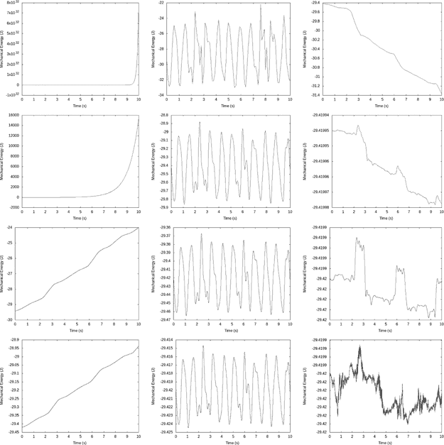

*图 20-2：不同数值方法下，机械能随时间的变化。机械能的变化是数值不准确度的衡量标准。*

机械能在欧拉法中倾向于增加，在欧拉-克罗梅法中则表现为振荡，而在四阶龙格-库塔法中可能会减少。每个图中的横轴显示 10 秒钟的时间段。纵轴显示的尺度差异很大。如果我们将最大机械能和最小机械能之间的差异作为衡量不准确度的标准，就可以制作一个表格来比较数值方法。表 20-1 展示了这种比较。

**表 20-1：** 对于两质量和两弹簧系统，在 10 秒时间间隔内，不同数值方法计算的机械能变化

| **时间步长** | **欧拉法** | **欧拉-克罗梅法** | **四阶龙格-库塔法** |
| --- | --- | --- | --- |
| 10^(–1)s | 偏差很大 | 40% | 7% |
| 10^(–2)s | 偏差很大 | 4% | 10^(–4)% |
| 10^(–3)s | 20% | 0.4% | 10^(–8)% |
| 10^(–4)s | 2% | 0.04% | 10^(–11)% |

表 20-1 显示了在 10 秒钟期间，最大机械能减去最小机械能，并以初始机械能的百分比表示。对于小于毫秒的时间步长，欧拉方法甚至都无法接近正确的结果。如果你将数值方法改为欧拉方法，你可以在动画中看到这一点。弹簧在数值不准确的展示中伸展和下垂。该表还显示了，每次时间步长减少十倍，欧拉法和欧拉-克罗梅方法的准确性大约提高十倍。而四阶龙格-库塔方法每次减少十倍的时间步长，准确性大约提高 10⁴倍。通过这种方式，四阶方法展示了为什么它被认为是四阶方法。

在看到第一个多个物体相互作用的例子后，让我们看一下第二个相互作用的例子，即碰撞。

### 碰撞

我们的第二个多个物体相互作用的例子是两颗台球之间的碰撞。对于这个例子，我们将通过图 19-2 中的四种数据表示形式，讨论参数选择（包括时间步长），查看动量和能量守恒，讨论一些数值问题，并最终展示一些动画结果。

#### 数据表示

四种数据表示形式包括：力的列表、微分方程、状态更新函数和状态列表。我们将依次讨论这些。

##### 力

我们假设在第十九章中描述的弹性台球相互作用是作用于每个粒子的唯一力。这种弹性台球相互作用是作用在两颗台球之间的内部力。以下是力的列表：

```
billiardForces :: R -> [Force]
billiardForces k = [InternalForce 0 1 (billiardForce k (2*ballRadius))]
```

弹性台球相互作用要求我们指定一个弹簧常数，用于弹性排斥力，并指定一个阈值距离，在此距离下排斥力才会生效。我们将弹簧常数`k`作为`billiardForces`函数的参数，以便我们可以推迟确定一个特定值，这样也便于尝试不同的值。

每个球的直径为 6 厘米。阈值距离出现在球心相距两个半径的位置。由于这个距离始终相同，我们指定一个特定值`2*ballRadius`作为阈值距离，而不是像我们对弹簧常数做的那样将其作为一个参数。我们命名球半径是因为它在两个地方使用：我们刚才写的力的列表和稍后在本章中编写的显示函数。

```
ballRadius :: R
ballRadius = 0.03  -- 6cm diameter = 0.03m radius
```

##### 微分方程

牛顿第二定律将力的列表转化为一个微分方程。对于多粒子系统，`newtonSecondMPS`是执行此转化的函数。我们给表示牛顿第二定律的微分方程命名为`billiardDiffEq k`，它描述了两个台球在`billiardForces k`作用下的运动。

```
billiardDiffEq :: R -> MultiParticleState -> DMultiParticleState
billiardDiffEq k = newtonSecondMPS $ billiardForces k
```

我们继续通过弹簧常数`k`来参数化微分方程，直到现在我们还没有指定该值。

##### 状态更新函数

接下来，我们需要一个状态更新函数。编写状态更新函数的最简单方法是使用图 19-2 中的`updateMPS`函数。

```
billiardUpdate
    :: (TimeStep -> NumericalMethod MultiParticleState DMultiParticleState)
    -> R         -- k
    -> TimeStep  -- dt
    -> MultiParticleState -> MultiParticleState
billiardUpdate nMethod k dt = updateMPS (nMethod dt) (billiardForces k)
```

这个状态更新函数与我们编写的其他函数形式相同，不同之处在于我们包含了数值方法和弹簧常数作为参数，以便稍后可以指定这些项。只有三种类型为`TimeStep -> NumericalMethod MultiParticleState DMultiParticleState`的函数可以作为输入`nMethod`：`euler`、`eulerCromerMPS`和`rungeKutta4`。我们在使用这个函数时需要指定其中之一，但目前我们将推迟做出这个决定。

##### 状态列表

图 19-2 中的第四种数据表示法是一个演化器，它是一个函数，当给定初始状态时，会生成一系列状态。编写演化器的最简单方法是使用图 19-2 中的`statesMPS`函数。

```
billiardEvolver
    :: (TimeStep -> NumericalMethod MultiParticleState DMultiParticleState)
    -> R         -- k
    -> TimeStep  -- dt
    -> MultiParticleState -> [MultiParticleState]
billiardEvolver nMethod k dt = statesMPS (nMethod dt) (billiardForces k)
```

从演化器获得状态列表需要一个初始状态。在初始状态中，我们给定每个物体的质量以及它们的初始位置和速度。我们让每个台球的质量为 160 克。第一个球从原点开始，初始速度为 0.2 米/秒，方向为 x 轴。第二个球从静止状态开始，位于坐标(1 米，0.02 米)的 xy 平面上。小的 y 分量存在是为了让碰撞稍微倾斜，而不是一维的。初始状态的代码如下：

```
billiardInitial :: MultiParticleState
billiardInitial
    = let ballMass = 0.160  -- 160g
      in MPS [defaultParticleState { mass     = ballMass
                                   , posVec   = zeroV
                                   , velocity = 0.2 *^ iHat }
             ,defaultParticleState { mass     = ballMass
                                   , posVec   = iHat ^+^ 0.02 *^ jHat
                                   , velocity = zeroV }
             ]
```

现在我们基于这个初始状态来命名一个状态列表。该列表

```
billiardStates nMethod k dt
```

是一个无限状态列表，表示撞球碰撞的状态，当计算采用数值方法`nMethod`（`euler`，`eulerCromerMPS`或`rungeKutta4`），弹簧常数`k`和时间步长`dt`时得到。

```
billiardStates
    :: (TimeStep -> NumericalMethod MultiParticleState DMultiParticleState)
    -> R         -- k
    -> TimeStep  -- dt
    -> [MultiParticleState]
billiardStates nMethod k dt
    = statesMPS (nMethod dt) (billiardForces k) billiardInitial
```

接下来，我们需要一个有限的状态列表，可以用来绘制图表，或者用来比较碰撞前后某些物理量的值，比如动量或动能。列表`billiardStatesFinite nMethod k dt`是一个有限的撞球碰撞状态列表，当计算采用数值方法`nMethod`，弹簧常数`k`和时间步长`dt`时得到。

```
billiardStatesFinite
    :: (TimeStep -> NumericalMethod MultiParticleState DMultiParticleState)
    -> R         -- k
    -> TimeStep  -- dt
    -> [MultiParticleState]
billiardStatesFinite nMethod k dt
    = takeWhile (\st -> timeOf st <= 10) (billiardStates nMethod k dt)
```

为了形成有限列表，我们使用`takeWhile`来选择在 10 秒内所有的状态。如我们将很快看到的，碰撞大约发生在模拟的第 5 秒。

到目前为止，我们还没有做出关于数值方法、弹簧常数或时间步长的任何选择。接下来我们来讨论这个问题。

#### 弹簧常数和时间步长

在一门入门级的物理课程中，碰撞通常通过动量守恒来处理，而不是通过给出粒子间相互作用的显式力。使用动量守恒是一种优雅的方法，因为我们不需要知道粒子之间的力，只要它是短暂的，碰撞前后的系统动量必须相等。然而，单纯依赖动量守恒来分析碰撞也有缺点。例如，对于二维碰撞，通常需要一些在系统初始状态中没有的信息，比如碰撞后某一粒子的速度，来计算两粒子碰撞后的速度。另一方面，如果我们知道粒子之间的力的性质，那么初始条件就足以决定粒子的未来运动。

在实际操作中，我们通过指定粒子之间的显式力来分析碰撞，这意味着我们需要做出一些选择。弹性撞球碰撞要求我们指定弹簧常数。弹簧常数过小或过大都会给有限时间步长的数值分析带来问题。如果弹簧常数太小，物体在碰撞时会被挤压到一起，使得它们的中心非常接近，存在一个风险：一个物体可能会穿过另一个物体，而不是从它上面反弹出去。如果弹簧常数太大，当物体首次进入其分离阈值时，弹簧会施加一个非常大的力。这个力可能大到在下一个时间步长时物体已经超出了分离阈值。这将导致对力的采样不准确，从而可能导致数值结果较差。

如果时间步长过大，粒子在一个时间步内可能会移动得过远，完全错过粒子处于其阈值分离距离内的任何状态。即使碰撞没有完全错过，过大的时间步长也可能导致不准确的结果。我们的通用建议是选择一个与情况的特征时间尺度相比较小的时间步长。

除了常规的数值分析时间步长外，我们还需要为相互作用力选择一个弹簧常数。我们应该如何选择这两者呢？

选择弹簧常数的一个方法是设想所有初始的动能都转化为弹簧中的势能。如果这是真的，我们可以写出以下方程：

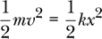

我们考虑的两个台球的分离阈值是 6 厘米；也许我们希望球心之间的距离不要小于 5 厘米。那么，平衡位置的位移应不超过 1 厘米。将 1 厘米代入上面的方程并解出* k *，我们得到以下结果：

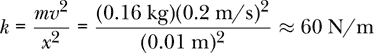

这个计算是通过合理的猜测来确定弹簧常数的一种粗略方法。此碰撞中的初始动能仅部分转化为弹性势能。

碰撞的相关时间尺度是什么？一个时间尺度是移动的台球穿越等于阈值分离距离所需的时间。这个时间由阈值分离除以移动球的初速度给出。

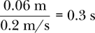

第二个时间尺度来自于问题中的弹簧常数和质量。如果这是一个质量可以在弹簧上振荡的问题，振荡周期将与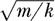成正比。在这种情况下不会发生振荡，但可以将碰撞看作是发生在一个完整振荡周期的半个周期内。如果这是一个完整的弹簧，半个周期包括从平衡位置到最近接触的弹簧压缩过程，然后是弹簧恢复平衡的膨胀过程。这个基于弹簧的第二个时间尺度是


我们为数值分析选择的时间步长需要比两个时间尺度中较小的那个要小，即 0.05 秒。到此为止，我们已经粗略估算了弹簧常数和时间步长。我们将很快通过识别我们希望计算具有的几个期望属性，并探索这些属性如何依赖于弹簧常数和时间步长，进一步优化这些估算。我们接下来将讨论的两个期望属性是动量守恒和能量守恒。

#### 动量和能量守恒

来自基础物理课程的关于碰撞的基本知识是：动量在所有碰撞中都得到守恒；然而，能量只有在*弹性碰撞*中才得到守恒。我们的碰撞是弹性的，因此我们期望动量和能量都能守恒。

##### 动量守恒

单个粒子的动量是粒子的质量与其速度的乘积。符号**p**通常用于表示动量，它是一个矢量，其国际单位制单位是 kg·m/s。

**p** = m**v**

（我们在第十八章中看到，相对论理论使用了不同的动量定义，但在第十九章和本章中，我们再次关注牛顿力学。）这是一个返回单个粒子动量的 Haskell 函数：

```
momentum :: ParticleState -> Vec
momentum st = let m = mass st
                  v = velocity st
              in m *^ v
```

一个粒子系统的动量是系统中每个粒子的动量的矢量和。我们用大写字母**P**表示系统动量。在一个粒子系统中，粒子*n*的动量，假设其质量为*m[n]*，速度为**v**[*n*]，由下式给出：

**p**[*n*] = *m[n]***v**[*n*]

系统动量为

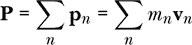

这是一个返回粒子系统动量的 Haskell 函数。

```
systemP :: MultiParticleState -> Vec
systemP (MPS sts) = sumV [momentum st | st <- sts]
```

在任何只有内部力的系统中，系统的动量是守恒的，这意味着它在时间上保持不变。我们的数值计算涉及一个有限的时间步长，该时间步长必须相对于物理情境的特征时间尺度较小，以便获得准确的结果。随着时间步长的增加，大多数物理量的准确性会变得越来越差。一个例外是系统动量，在只有内部力存在的情况下。我们将力分类为外力或内力，并自动应用牛顿第三定律，保证了在没有外力的任何情况下，系统动量都将得到守恒，无论数值方法如何，时间步长如何。这是因为每个内部力在一个时间步长内作用，会改变一个粒子的动量向量一定的量，同时会改变另一个粒子的动量向量相反的量。即使时间步长如此之大，以至于计算结果不佳，系统动量也不会在时间步长之间发生变化。

即使在外力存在的碰撞中，系统动量通常也会大致守恒，因为碰撞的内部力通常与任何外力相比较强。由于碰撞通常是短暂的，外力在碰撞的短暂时间内的作用通常非常小。

为了确认系统动量的守恒，让我们编写一个函数来计算系统动量的百分比变化。由于状态列表是常见的信息表示方式，我们将使用有限数量的多粒子状态作为该函数的输入，但我们只会比较列表中的第一个和最后一个状态。以下是该函数：

```
percentChangePMag :: [MultiParticleState] -> R
percentChangePMag mpsts
    = let p0 = systemP (head mpsts)
          p1 = systemP (last mpsts)
      in 100 * magnitude (p1 ^-^ p0) / magnitude p0
```

我们将传入的多粒子状态列表命名为`mpsts`，并使用 Prelude 函数`head`和`last`分别提取列表中的第一个和最后一个状态，将它们的系统动量命名为`p0`和`p1`。然后我们计算最终系统动量`p1`和初始系统动量`p0`之间的差值，形成该动量变化向量的大小，再除以初始系统动量的大小，最后乘以 100 得到百分比。

##### 创建表格

为了查看系统动量在我们计算中的保守情况，让我们做一个小表格，显示不同时间步长和不同弹簧常数下的系统动量的百分比变化。如果我让计算机显示它保存的所有 15 位数字（双精度浮点数，即我们称之为实数的`R`类型），表格会显得很难看。下面的`sigFigs`函数将一个数字四舍五入到指定的有效数字位数：

```
sigFigs :: Int -> R -> Float
sigFigs n x = let expon :: Int
                  expon = floor (logBase 10 x) - n + 1
                  toInt :: R -> Int
                  toInt = round
              in (10^^expon *) $ fromIntegral $ toInt (10^^(-expon) * x)
```

该函数通过将输入数字`x`除以 10^(*m*)，其中*m*是某个整数，四舍五入该数字，然后再将数字乘以 10^(*m*)来工作。整数*m*在代码中被称为`expon`；其值取决于请求的有效数字位数`n`。Prelude 中的`round`函数有一个相当通用的类型；我通过定义一个局部函数`toInt`，使用一个简单的具体类型来专门化它以满足我的需求。

我们需要的最终工具是用于制作可爱的表格的工具，我们将使用它来表示动量、能量以及其他一些内容，它是一个带有`Show`实例的数据类型，可以使表格以格式化的方式显示。首先，我们定义一个新的数据类型`Table a`，它是类型`a`的项目的表格。

```
data Justification = LJ | RJ deriving Show

data Table a = Table Justification [[a]]
```

数据类型`Justification`用于指定我们希望表格左对齐还是右对齐。一个`Table a`包含一个`Justification`和一个包含类型`a`的项目列表列表。

我们为新的数据类型编写了一个显式的`show`实例，以便以漂亮的方式格式化输出。

```
instance Show a => Show (Table a) where
    show (Table j xss)
        = let pairWithLength x = let str = show x in (str, length str)
              pairss = map (map pairWithLength) xss
              maxLength = maximum (map maximum (map (map snd) pairss))
              showPair (str,len)
                  = case j of
                      LJ -> str ++ replicate (maxLength + 1 - len) ' '
                      RJ -> replicate (maxLength + 1 - len) ' ' ++ str
              showLine pairs = concatMap showPair pairs ++ "\n"
          in init $ concatMap showLine pairss
```

在第一行中，我们看到一个类型类约束；类型`a`必须是类型类`Show`的实例，才能使`Table a`成为类型类`Show`的实例。`Show`的实例声明只要求我们定义一个函数`show`，该函数以`Table a`作为输入，并产生一个字符串作为输出。我们定义了一个局部函数`pairWithLength`，它将值的字符串表示和该字符串的长度配对。我们关心长度是因为我们希望列能够整齐对齐。局部变量`pairss`是一个由字符串和长度对组成的列表的列表。名字末尾的双*s*表示这是一个列表的列表。我们通过将`map pairWithLength`映射到输入的列表列表`xss`来形成`pairss`。由于`xss`的每个元素都是一个列表，所以我们对`xss`中的每个列表应用`map pairWithLength`，因此`pairWithLength`会作用于列表中的每个项。

局部变量`maxLength`用于查找表格中最长项目的长度。然后，我们使用这个最长的长度来设置将要显示的所有列的宽度。我们编写局部函数来显示单个项目和表格中的一行。最后，我们通过将`showLine`应用于`pairss`并连接结果来形成表格。如果你觉得这个显示表格的小技巧有趣，可以尽情研究；否则，我们就继续使用它。

以下是展示欧拉法、欧拉-克罗梅法和四阶龙格-库塔法在不同弹簧常数和时间步长下动量百分比变化的表格：

```
pTable :: (TimeStep -> NumericalMethod MultiParticleState DMultiParticleState)
       -> [R]         -- ks
       -> [TimeStep]  -- dts
       -> Table Float
pTable nMethod ks dts
    = Table LJ [[sigFigs 2 $
                 percentChangePMag (billiardStatesFinite nMethod k dt)
                     | dt <- dts] | k <- ks]

pTableEu :: [R]         -- ks
         -> [TimeStep]  -- dts
         -> Table Float
pTableEu = pTable euler
```

我们可以在 GHCi 中查看这些表格。

```
Prelude Vis>  :m
Prelude>  :l MOExamples
[1 of 6] Compiling Newton2          ( Newton2.hs, interpreted )
[2 of 6] Compiling Mechanics1D      ( Mechanics1D.hs, interpreted )
[3 of 6] Compiling SimpleVec        ( SimpleVec.hs, interpreted )
[4 of 6] Compiling Mechanics3D      ( Mechanics3D.hs, interpreted )
[5 of 6] Compiling MultipleObjects  ( MultipleObjects.hs, interpreted )
[6 of 6] Compiling MOExamples       ( MOExamples.hs, interpreted )
Ok, six modules loaded.
*MOExamples> pTable euler [10,30,100] [0.003,0.01,0.03,0.1]
4.3e-14 0.0     0.0     0.0
0.0     0.0     0.0     0.0
2.2e-14 0.0     0.0     8.7e-14
*MOExamples> pTable eulerCromerMPS [10,30,100] [0.003,0.01,0.03,0.1]
0.0 0.0 0.0 0.0
0.0 0.0 0.0 0.0
0.0 0.0 0.0 0.0
*MOExamples> pTable rungeKutta4 [10,30,100] [0.003,0.01,0.03,0.1]
4.3e-14 2.2e-14 0.0     0.0
2.2e-14 0.0     2.2e-14 0.0
0.0     0.0     0.0     0.0
```

无论是数值方法、弹簧常数还是时间步长，动量的百分比变化要么为 0，要么为某个数乘以 10^(–14)。由于这是百分比变化，实际上我们谈论的是 10¹⁶分之一的几个部分，这就是双精度浮点数的精度。这个偏离 0 的误差并不是我们所做的有限步长计算导致的；而是因为任何使用浮点数的计算都是近似的。计算机无法精确地除以 10，因为它用重复的二进制展开 0.0001100110011 . . . 来表示分数 1/10（回想一下表 1-4）。10¹⁶分之一的几个部分是我们期望在任何涉及双精度浮点数的计算中看到的偏差。

有了这个理解，这些表格展示了无论使用哪种数值方法、弹簧常数或步长，台球碰撞系统的动量都是守恒的。这是之前提到的一个例子，说明在只有内力的情况下，系统动量会保持守恒，无论数值方法、步长或描述问题的其他参数如何。接下来，我们将研究多粒子系统的能量，这个系统不具备这种理想的属性。

##### 能量守恒

除了在碰撞物体接触的短时间内，系统中唯一的能量形式就是物体的动能。

接下来，让我们看看台球碰撞中系统动能随时间的变化。只要碰撞没有发生，系统动能将完全守恒，因为球的速度没有变化。在碰撞发生的短时间内，一部分动能转化为弹性势能，由我们的弹簧储存，然后再转化回动能。图 20-3 展示了两颗台球碰撞时，系统动能与时间的关系图。

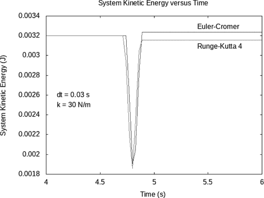

*图 20-3：两颗台球碰撞时的系统动能*

我们看到，在碰撞之前，大约在 4.8 秒时刻，系统动能是守恒的，因为进入的粒子以恒定速度运动。我们看到系统动能出现预期的下降，转化为弹性势能。图表显示，系统动能大约有 40%的部分被转化为弹性势能，因为它从最初的 3.2 mJ 降至约 1.9 mJ。随着弹簧从最大压缩状态恢复，弹性势能转化回动能，碰撞后动能保持不变。

在弹性碰撞中，碰撞后的系统动能应该与碰撞前相同。我们从图表中可以看到，碰撞后的系统动能接近，但不完全等于碰撞前的值。这一差异是由于我们方法的有限步长引起的，且它取决于数值方法、步长和其他情况参数。从图中我们可以看到，欧拉-克罗梅方法和四阶龙格-库塔方法产生了略微不同的结果，包括最终系统动能的略微不同的结果。

以下代码生成了图 20-3 中的图表。

```
systemKEWithTime :: IO ()
systemKEWithTime
    = let timeKEPairsEC
              = [(timeOf mpst, systemKE mpst)
                     | mpst <- billiardStatesFinite eulerCromerMPS 30 0.03]
          timeKEPairsRK4
              = [(timeOf mpst, systemKE mpst)
                     | mpst <- billiardStatesFinite rungeKutta4    30 0.03]
      in plotPaths [Key Nothing
                   ,Title "System Kinetic Energy versus Time"
                   ,XLabel "Time (s)"
                   ,YLabel "System Kinetic Energy (J)"
                   ,XRange (4,6)
                   ,PNG "SystemKE.png"
                   ,customLabel (4.1,0.0026) "dt = 0.03 s"
                   ,customLabel (4.1,0.0025) "k = 30 N/m"
                   ,customLabel (5.4,0.00329) "Euler-Cromer"
                   ,customLabel (5.4,0.00309) "Runge-Kutta 4"
                   ] [timeKEPairsEC,timeKEPairsRK4]
```

局部变量`timeKEPairsEC`和`timeKEPairsRK4`保存了欧拉-克罗梅和四阶龙格-库塔方法下时间和系统动能的对列表。我们然后使用 gnuplot 的`plotPaths`函数绘制这些对列表。

##### 步长和弹簧常数对动能的影响

系统动能并不像系统动量那样具有保证其守恒的良好性质，无论步长大小。像大多数物理量一样，能量的精确计算需要一个合理小的步长。事实上，观察系统动能的守恒情况是判断我们是否使用了足够小步长的好方法。

为了研究不同步长和弹簧常数下系统动能的守恒，我们编写了一个函数来计算系统动能的百分比变化。由于状态列表是一种常见的信息表示方法，我们将使用一个有限的多粒子状态列表作为此函数的输入，但我们只比较列表中的第一个和最后一个状态。下面是这个函数：

```
percentChangeKE :: [MultiParticleState] -> R
percentChangeKE mpsts
    = let ke0 = systemKE (head mpsts) ke1 = systemKE (last mpsts)
      in 100 * (ke1 - ke0) / ke0
```

我们将传入的多粒子状态列表命名为`mpsts`，并使用 Prelude 函数`head`和`last`分别提取列表中的第一个和最后一个状态，将它们的系统动能分别命名为`ke0`和`ke1`。接着，我们计算最终系统动能`ke1`与初始系统动能`ke0`之差，除以初始系统动能，再乘以 100 以得到百分比。

为了探索动能守恒，我们将制作一些小表格，展示在几个不同的时间步长和弹簧常数下，系统动能的百分比变化。以下`tenths`函数将一个数字四舍五入到小数点后一个位，并有助于制作一个整齐的表格。

```
tenths :: R -> Float
tenths = let toInt :: R -> Int
             toInt = round
         in (/ 10) . fromIntegral . toInt . (* 10)
```

这个函数的工作原理是将输入数字`x`乘以 10，四舍五入后，再将结果除以 10。Prelude 函数`round`具有非常通用的类型；我通过定义一个局部函数`toInt`并为其指定一个简单的具体类型来满足我的需求。

函数`keTable`在给定数值方法、弹簧常数列表和时间步长列表时，生成一个系统动能百分比变化的表格。

```
keTable
    :: (TimeStep -> NumericalMethod MultiParticleState DMultiParticleState)
    -> [R]         -- ks
    -> [TimeStep]  -- dts
    -> Table Float
keTable nMethod ks dts
    = Table RJ [[tenths $
                 percentChangeKE (billiardStatesFinite nMethod k dt)
                     | dt <- dts] | k <- ks]
```

我们可以在 GHCi 中查看这些表格。

```
*MOExamples> keTable euler [10,30,100] [0.003,0.01,0.03,0.1]
     4.2    15.9    68.7   705.7
     8.3    34.1   185.4  3117.9
    16.9    82.9   642.2 39907.1
*MOExamples> keTable eulerCromerMPS [10,30,100] [0.003,0.01,0.03,0.1]
    0.0    0.0   -0.3    6.2
    0.0    0.1    1.1  154.1
    0.0    0.3   -8.9 3705.2

*MOExamples> keTable rungeKutta4 [10,30,100] [0.003,0.01,0.03,0.1]
   0.0   0.0   0.0  -2.8
   0.0  -0.1  -1.4 -14.6
   0.0  -0.5  -1.6  90.3
```

在每个表格的左上角，动能守恒表现最好，此时时间步长和弹簧常数都较小。小时间步长带来的更好结果并不令人惊讶。较小的弹簧常数使碰撞持续时间更长，发生在更多的时间步长中。只有在少数几个时间步长内发生的碰撞，其计算结果不太可能非常精确。另一方面，弹簧常数过小则有可能使物体彼此靠得太近。我们将在下一节讨论这个问题。

#### 数值问题

我们已经建议，对于碰撞的准确计算，碰撞过程中需要多个时间步长。我们还指出，我们不希望碰撞物体之间的距离过近。这两个对计算的期望性质是相互矛盾的，因为第一个性质更有利于较小的弹簧常数，而第二个性质则更有利于较大的弹簧常数。让我们更详细地分析这两种期望性质。

##### 碰撞过程中的时间步长

如前所述，如果在碰撞过程中仅经过少数几个时间步长，或者更糟，只有一个或零个时间步长，那么我们不太可能得到准确的结果。这一观察促使我们提出一个问题：碰撞过程中经过了多少个时间步长，或者等效地，多少个时间步长内小球的间隔在阈值范围内。这个问题的答案取决于数值方法、弹簧常数和时间步长。我们希望有一个较大的时间步长数量（例如，至少 10 个）。

函数`contactSteps`返回小球在其阈值间隔为 6 厘米时的时间步数。它接受一个有限的多粒子状态列表作为输入。

```
contactSteps :: [MultiParticleState] -> Int
contactSteps = length . takeWhile inContact . dropWhile (not . inContact)
```

该函数通过使用`dropWhile`来丢弃球体之间尚未接触的多粒子状态；换句话说，丢弃在球体接近 6 厘米之前的状态。我们使用接下来定义的`inContact`谓词来判断在给定的多粒子状态中，球体是否接触，即它们的中心是否相距 6 厘米以内。然后我们使用`takeWhile`来保留球体接触的状态。最后，我们计算该列表的长度，即球体在接触中的状态数或时间步数。

谓词`inContact`通过计算粒子中心之间的距离并将其与两倍球半径（6 厘米）的阈值分离进行比较来工作。

```
inContact :: MultiParticleState -> Bool
inContact (MPS sts)
    = let r = magnitude $ posVec (sts !! 0) ^-^ posVec (sts !! 1)
      in r < 2 * ballRadius
```

函数`contactTable`返回数值方法中该时间步数的接触次数、弹簧常数列表和时间步长列表。

```
contactTable
    :: (TimeStep -> NumericalMethod MultiParticleState DMultiParticleState)
    -> [R]         -- ks
    -> [TimeStep]  -- dts
    -> Table Int
contactTable nMethod ks dts
    = Table RJ [[contactSteps (billiardStatesFinite nMethod k dt)
                     | dt <- dts] | k <- ks]
```

我们使用列表推导来形成将作为表格显示的列表列表。以下是来自 GHCi 的结果：

```
*MOExamples> contactTable euler [10,30,100] [0.003,0.01,0.03,0.1]
 89 27  9  3
 53 16  6  2
 29  9  3  2
*MOExamples> contactTable eulerCromerMPS [10,30,100] [0.003,0.01,0.03,0.1]
 89 27  9  2
 53 16  5  1
 29  9  3  1
*MOExamples> contactTable rungeKutta4 [10,30,100] [0.003,0.01,0.03,0.1]
 89 27  9  2
 53 16  5  1
 29  9  3  0
```

数值方法之间差别不大。不管采用哪种数值方法，最佳结果通常出现在每个表格的左上角，那里弹簧常数和时间步长都最小。较小的弹簧常数意味着弹簧比较松弛（而不是僵硬），可以在更长的距离内压缩，从而使碰撞过程中的时间步数更多。

在 Runge-Kutta 表的右下角，可能会有一些奇怪的现象，尤其是当*k* = 100 N/m 和*dt* = 0.1 s 时。为什么在阈值距离内没有发生任何时间步？并不是因为时间步长太大，以至于运动的小球完全跳过了静止的小球而没有发生碰撞。实际上，这是因为四阶 Runge-Kutta 步由四个子步骤组成，使用在四个不同位置的导数来计算时间步的最终值变化。当两颗球接近但刚好在阈值分离之外时，Runge-Kutta 步会感知到来自一个或多个子步骤的排斥力。弹簧常数非常大，导致一个很大的排斥力作用于球体，将球体推开，因此在下一个实际的时间步之前，球体已经被排斥开了。因此，表中列出的在阈值分离内的时间步数为 0，并不比在阈值内有一个时间步数差别；这对于准确的计算来说并不够。

##### 最近分离

我们不希望球心之间距离过近。如果我们使用一个非常小的弹簧常数，球体可能会压缩直到它们的球心重合，甚至穿越彼此。这显然不是台球的工作方式。台球几乎不会压缩，因此为了准确模拟它们，需要一个相当大的弹簧常数。

了解球心之间的最小距离非常有趣也很重要，这样我们可以避免选择过小的弹簧常数。我们希望知道在碰撞过程中，球体中心到中心的最小分离距离。这个问题的答案取决于数值方法、弹簧常数和时间步长。

函数`closest`返回在碰撞过程中，球体达到的最小分离距离。它接受一个有限的多粒子状态列表作为输入。

```
closest :: [MultiParticleState] -> R
closest = minimum . map separation
```

这个函数的作用是对有限列表中的每个多粒子状态应用下面的`separation`函数，并计算最小值。

`separation`函数通过计算球心之间的位移并求其大小来工作。

```
separation :: MultiParticleState -> R
separation (MPS sts)
    = magnitude $ posVec (sts !! 0) ^-^ posVec (sts !! 1)
```

函数`closestTable`在给定数值方法、一系列弹簧常数和时间步长的情况下，返回一个最小分离距离的表格。

```
closestTable
    :: (TimeStep -> NumericalMethod MultiParticleState DMultiParticleState)
    -> [R]         -- ks
    -> [TimeStep]  -- dts
    -> Table Float
closestTable nMethod ks dts
    = Table RJ [[tenths $ (100*) $
                 closest (billiardStatesFinite nMethod k dt)
                     | dt <- dts] | k <- ks]
```

我们将米转换为厘米，乘以 100，结果显示在表格中。

这是 GHCi 的结果：

```
*MOExamples> closestTable euler [10,30,100] [0.003,0.01,0.03,0.1]
 4.4 4.3 4.0 2.8
 5.0 4.9 4.6 2.8
 5.4 5.3 5.0 2.8
*MOExamples> closestTable eulerCromerMPS [10,30,100] [0.003,0.01,0.03,0.1]
 4.4 4.4 4.4 4.5
 5.1 5.1 5.0 4.5
 5.5 5.5 5.5 4.5
*MOExamples> closestTable rungeKutta4 [10,30,100] [0.003,0.01,0.03,0.1]
 4.4 4.4 4.4 4.7
 5.1 5.1 5.1 5.2
 5.5 5.5 5.5 6.3
```

如果我们的目标是最小化压缩，从而获得较大的最小分离距离，那么每个表格的左下角就是我们想要的位置。这意味着我们需要一个较大的弹簧常数。

我们可以看到，在 Runge-Kutta 表格的右下角，最小分离距离为 6.3 厘米，这看起来不可能。如果球体从未接近阈值分离距离，怎么会有反作用力呢？答案是，四阶 Runge-Kutta 时间步长是基于四个子步骤的，其中一些子步骤会在阈值距离内采样排斥力。

假设我们需要一些参数（弹簧常数和时间步长），使得碰撞过程中至少有 10 个时间步，最小分离距离不小于 5 厘米，并且动能保持在 1%的误差范围内。

欧拉方法不可用。对于我们采样的任何弹簧常数和时间步长，它无法保持动能在 1%的误差范围内。Euler-Cromer 方法可以在*k* = 30 N/m 和*dt* = 0.003 s 或*dt* = 0.01 s，或者*k* = 100 N/m 和*dt* = 0.003 s 的情况下使用。四阶 Runge-Kutta 也可以使用相同的参数。

#### 动画结果

我们想使用 gloss 为台球碰撞做动画。我们已经编写了一个状态更新函数和初始状态。接下来要做的是编写一个显示函数，我们现在就来实现。

```
billiardPicture :: MultiParticleState -> G.Picture
billiardPicture (MPS sts)
    = G.scale ppm ppm $ G.pictures [place st | st <- sts]
      where
        ppm = 300  -- pixels per meter
        place st = G.translate (xSt st) (ySt st) blueBall
        xSt = realToFrac . xComp . posVec
        ySt = realToFrac . yComp . posVec
        blueBall = G.Color G.blue (disk $ realToFrac ballRadius)
```

我们对输入进行模式匹配，将传入的单粒子状态列表命名为`sts`。这是一个长度为 2 的列表，因为有两个粒子。我们的显示函数采用“最后缩放整张图片”这一范式，使用`G.scale`函数，并将常数`ppm`作为每米像素数，作为我们统一空间尺度因子的值。预缩放的图片由`G.pictures`函数生成，该函数将每个球的图片列表组合起来。图片列表是通过列表推导和`place`函数生成的，`place`函数将在稍后的几行中定义。这段代码可以用于多粒子系统，粒子数量不限，只要我们接受每个粒子都由蓝色圆盘表示。（如果你不喜欢每个粒子都是蓝色的，可以参考第 20.2 题。）

`billiardPicture`显示函数的其余部分由在`where`关键字之后定义的局部常量和函数组成。回想一下，`where`就像`let`-`in`结构一样，允许我们定义局部变量；局部变量在`where`关键字之前使用，在之后定义。`let`-`in`结构中的局部变量在`in`关键字之前定义，在之后使用。`let`-`in`结构与`where`结构的区别，就像是自下而上的思维方式——先定义最小的部分，再构建整个函数；和自上而下的思维方式——先定义整个函数，再通过尚未定义的部分来阐述。Haskell 支持并鼓励这两种思维方式，通过提供这两种结构，允许我们以尚未定义的常量和函数来做定义。

我们定义的第一个局部变量是空间尺度因子`ppm`，我们将其设置为每米 300 像素。接下来，我们定义了局部函数`place`，我们已经用它将图片移动到状态中指定的 xy 坐标位置。函数`place`使用尚未定义的函数`xSt`和`ySt`从状态中提取坐标，并使用尚未定义的图片`blueBall`表示一个蓝色圆盘。函数`place`通过`G.translate`函数根据坐标来平移图片。

局部函数`xSt`从状态中提取 x 坐标位置，并使用`realToFrac`返回一个`Float`类型的值，这是`G.translate`所期望的类型。`xSt`的定义采用点自由风格，是由三个函数的组合：`posVec`，从状态中提取位置；`xComp`，从位置中提取 x 坐标；以及`realToFrac`，将`R`类型转换为`Float`类型。函数`ySt`与`xSt`类似，不过它用于提取 y 坐标。最后，我们定义了局部常量`blueBall`，它是一个半径为`ballRadius`的蓝色`disk`，必须将其转换为`Float`类型，以匹配第十七章中`disk`函数所期望的输入类型。

清单 20-3 展示了一个独立的程序，使用了我们在第十六章中编写的`simulateGloss`函数。这个独立程序包含一个定义：一个名为`main`的主函数。

```
{-# OPTIONS -Wall #-}

import Mechanics3D ( simulateGloss )
import MultipleObjects (eulerCromerMPS )

import MOExamples ( billiardInitial, billiardPicture, billiardUpdate )

main :: IO ()
main = simulateGloss 1 100 billiardInitial billiardPicture
       (billiardUpdate eulerCromerMPS 30)
```

*清单 20-3：两个台球碰撞的二维动画的独立程序*

`main`函数使用导入的`simulateGloss`函数执行动画。我们选择一个时间尺度因子为 1，动画速率为 100 帧/秒，给定时间步长为 0.01 秒。我们选择一个弹簧常数为 30 N/m。我们从本章编写的`MOExamples`模块中导入初始状态`billiardInitial`、状态更新函数`billiardUpdate`和显示函数`billiardPicture`。当你运行动画时，你会看到一颗蓝色的台球向右移动，与一颗静止的蓝色台球发生碰撞。碰撞后，原本运动的台球向下移动，而原本静止的台球向上和向右移动。

### 吉他弦上的波动

在这一节中，我们将模拟吉他弦上的波动。特别地，我们将聚焦于吉他的 G 弦。一个典型的 G 弦的质量是每米 0.8293 克。吉他颈部到底部的距离，即弦固定的两个位置，是 65 厘米。当吉他弦在开放位置演奏时，产生的基本振动使得 G 音符的波长为 130 厘米，因为弦的偏离平衡是一个正弦函数，它在吉他颈部从 0 开始，在底部返回 0，完成半个波长。任何开放的吉他弦，其基本振动的波长都是 130 厘米。

我们希望频率为 196 Hz，以产生 G 音符。这是因为约定俗成的规则是，55 Hz、110 Hz、220 Hz、440 Hz 和 880 Hz 分别表示不同版本的 A 音符。将频率加倍会得到相同的音符，上升一个八度。人们使用的十二平均律音阶中，一八度有 12 个“半音”，即频率的加倍。G 音符比 A 音符低两个半音，因此我们必须将 A 音符的频率乘以 2^（–2/12），以得到 G 音符的频率。对于吉他，我们将 220 Hz 乘以 2^（–2/12），得到 196 Hz。

对于任何波，波长*λ*和周期*t*与波速*v*之间的关系为：

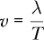

这个方程最容易理解的是对于一个行进波（即，波峰简单地沿着速度*v*传播的波）。对于一个行进波，波峰在每个周期内通过一个波长的距离，因此它的速度是波长除以周期，这正是方程所声称的。频率*f*和周期*t*之间的关系为：

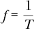

导致如下方程：

*v* = *λf*

该方程涉及波速、波长和频率之间的关系。

注意

*有些人喜欢使用希腊字母*ν*（nu）表示频率，这样他们就能用以下物理笑话来回应常见的问候：*

***朋友：*** *有什么新鲜事吗？（nu？）*

***笑话王：*** *v 除以 λ！*

*大多数人无法外表上笑出声来，但他们肯定内心在笑。*

由于吉他弦的两端是固定的，吉他弦表现为驻波而非行波，但前面所显示的方程依然有效，因为波速与弦中的张力*F*以及单位长度的质量*μ*之间是有关系的：

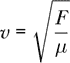

当我们调节吉他的琴弦时，我们改变了张力，这会改变波速，从而改变频率。让我们计算出为了达到 196 Hz 频率所需的张力。

为了达到 196 Hz 的频率，我们需要一个波速，

*v* = *λf* = (130 厘米)(196 Hz) = 254.8 m/s

这需要一个张力：

*F* = *μv*² = (0.8293 g/m)(254.8 m/s)² = 53.84 N

因此，我们需要在吉他 G 弦上施加 53.84 N 的张力。

#### 力

我们将吉他弦建模为 64 个小点质量，这些质量沿着 65 厘米的长度每隔 1 厘米分布。每个质量通过弹簧与其两个邻近的质量连接。如果我们给每个弹簧设置零的平衡长度和 5384 N/m 的弹簧常数，当弹簧被拉伸 1 厘米时，每个弹簧将产生 53.84 N 的力，这也是当弦处于静止状态时，质量间的距离。所以，会有 64 个质量点、63 个内部弹簧和 2 个外部弹簧，分别连接到两个固定端，位于 0 厘米和 65 厘米。以下是力的列表：

```
-- 64 masses (0 to 63)
-- There are 63 internal springs, 2 external springs
forcesString :: [Force]
forcesString
    = [ExternalForce  0 (fixedLinearSpring 5384 0 (vec    0 0 0))
      ,ExternalForce 63 (fixedLinearSpring 5384 0 (vec 0.65 0 0))] ++
      [InternalForce n (n+1) (linearSpring 5384 0) | n <- [0..62]]
```

#### 状态更新函数

为了制作动画，我们需要一个状态更新函数，而为此我们必须选择一种数值方法。无论是欧拉-克罗梅尔方法还是四阶龙格-库塔方法都可以，这里我们选择龙格-库塔方法，因为它稍微更精确。

```
stringUpdate :: TimeStep
             -> MultiParticleState  -- old state
             -> MultiParticleState  -- new state
stringUpdate dt = updateMPS (rungeKutta4 dt) forcesString
```

#### 初始状态

我们需要一个初始状态。事实上，探索弦的几个不同初始状态是很有趣的。函数`stringInitialOvertone`产生一个初始状态，其中弦位于 xy 平面内，最初不动，呈现正弦波模式。

```
stringInitialOvertone :: Int -> MultiParticleState
stringInitialOvertone n
    = MPS [defaultParticleState
           { mass     = 0.8293e-3 * 0.65 / 64
           , posVec   = x *^ iHat ^+^ y *^ jHat
           , velocity = zeroV
           } | x <- [0.01, 0.02 .. 0.64],
           let y = 0.005 * sin (fromIntegral n * pi * x / 0.65)]
```

使用此函数，输入 1 将产生我们之前讨论的基频振动。图 20-4 展示了`stringInitialOvertone 1`的样子。

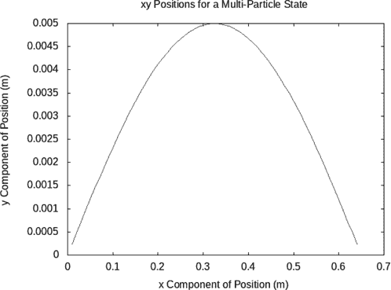

*图 20-4：吉他弦基频振动模式的初始状态，由 stringInitialOvertone 1 给出*

较大的数值会产生在更高频率振动的泛音。使用 2 会产生一个振动频率为 392 Hz 的泛音，而 3 会产生一个振动频率为 588 Hz 的泛音。图 20-5 显示了`stringInitialOvertone 3`的样子。

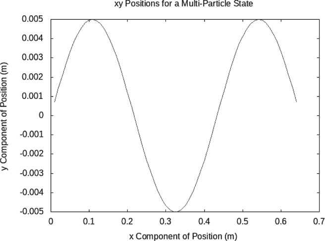

*图 20-5：吉他弦第二泛音的初始状态，由 stringInitialOvertone 3 给出*

从吉他弦中发出的声音是基频与泛音的混合。初始状态`stringInitialPluck`旨在模拟吉他弦的拨动。

```
stringInitialPluck :: MultiParticleState
stringInitialPluck = MPS [defaultParticleState
             { mass     = 0.8293e-3 * 0.65 / 64
             , posVec   = x *^ iHat ^+^ y *^ jHat
             , velocity = zeroV
             } | x <- [0.01, 0.02 .. 0.64], let y = pluckEq x]
    where
      pluckEq :: R -> R
      pluckEq x
          | x <= 0.51  = 0.005 / (0.51 - 0.00) * (x - 0.00)
          | otherwise  = 0.005 / (0.51 - 0.65) * (x - 0.65)
```

假设拨片在距离琴颈 51 厘米的位置触碰弦，位于吉他琴体的孔前。如果拨片将弦移动了 5 毫米，则生成的弦形态由`stringInitialPluck`给出，如图 20-6 所示。


*图 20-6：吉他弦的拨弦初始状态，由 string InitialPluck 给出*

练习 20.10 要求你编写一个函数，从`MultiParticleState`生成像这样的*xy*图像。

#### 独立程序

清单 20-4 展示了一个独立程序，用于制作吉他弦上波动的二维动画。

```
{-# OPTIONS -Wall #-}

import SimpleVec ( zeroV, iHat, (*^), xComp, yComp )
import Mechanics3D ( ParticleState(..), simulateGloss )
import MultipleObjects ( MultiParticleState(..) )
import MOExamples
import Graphics.Gloss ( Picture(..), scale, blue )

stringPicture :: MultiParticleState -> Picture
stringPicture (MPS sts)
    = let rs = [zeroV] ++ [posVec st | st <- sts] ++ [0.65 *^ iHat]
          xy r = (realToFrac $ xComp r, realToFrac $ yComp r)
          xys = map xy rs
          ppm = 400  -- pixels per meter
      in scale ppm (20*ppm) $ Color blue $ Line xys

main :: IO ()
main = let initialState = stringInitialOvertone 3
       in simulateGloss 0.001 40 initialState stringPicture stringUpdate
```

*清单 20-4：吉他弦的二维动画独立程序*

我们使用 0.001 的时间尺度因子，这意味着 1 毫秒的物理时间对应 1 秒的动画时间。清单 20-4 中的代码使用了初始状态`stringInitialOvertone 3`，但是我们可以将该初始状态替换为`stringInitialOvertone 1`来动画化基频的振动，或者使用`string` `InitialPluck`来动画化由拨弦产生的振动。196 Hz 的基频代表大约 5 毫秒的周期，因此基频的振动将需要大约 5 秒的动画时间来完成一个周期，而 3 倍泛音只需要 1.7 秒的动画时间来完成一个周期。

我们使用 40 帧/秒的动画速率，得到一个 25*μ*s 的时间步长。这个选择是基于问题中的重要时间尺度。首先是基频的周期，大约是 5 毫秒。泛音的周期逐渐变短，即


显然，我们使用的任何有限时间步长都会丢失一些关于高次泛音的信息，因为它们的周期变得非常短。（我们用 64 个质量点来建模弦的方式，也限制了可以精确计算的泛音数量。例如，200 次泛音有大约 100 个波峰和 100 个波谷；如果我们只追踪 64 个质量点的位置，显然无法精确描述这一点。）

除了基频的周期外，振动弦的另一个重要时间尺度是波从一个小质量点传播到邻近质量点所需的时间。这个时间由质量点之间的距离除以波速得出。

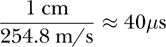

这个时间大约是 40*μ*s，比基频的周期要短得多。

对于波动情况或任何具有空间步长Δ*x*且信息以有限速度传播的情况，存在一个稳定性准则。该准则指出，时间步长必须小于信息传播一个空间步长所需的时间。

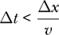

关于这个稳定性标准的更多内容可以在**[18**]中找到。使用高于这个阈值的时间步长会存在数值不稳定的风险，导致不合理的结果。Figure 20-7 展示了一个数值不稳定的例子。

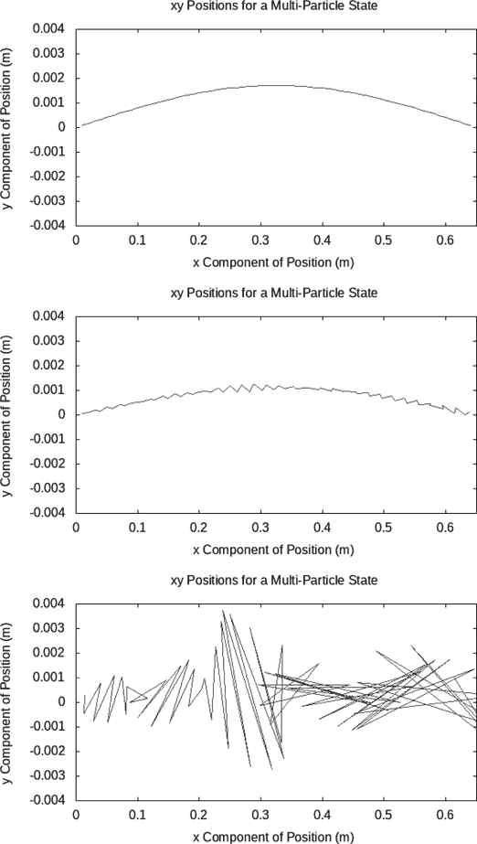

*Figure 20-7：当时间步长超过信息在弦上各质量点之间传播所需的时间时，出现数值不稳定的例子。从上到下是三个连续的时间步。*

Figure 20-7 展示了一个有三个连续时间步（第 10、11、12 步）的弦图，这个模拟使用了一个时间步长为 100*μ*s 的值，超出了稳定性阈值。仅仅经过两个时间步，计算结果从合理变得荒谬。使用 100-*μ*s 的时间步长时，计算不稳定。如果我们在动画中使用这个时间步，图像将迅速变得混乱。我通过命令创建了 Figure 20-7 中的面板。

```
mpsPos (iterate (stringUpdate 100e-6) (stringInitialOvertone 1) !! 10)
mpsPos (iterate (stringUpdate 100e-6) (stringInitialOvertone 1) !! 11)
mpsPos (iterate (stringUpdate 100e-6) (stringInitialOvertone 1) !! 12)
```

其中`mpsPos`是你在练习 20.10 中需要编写的函数。

时间步长必须小于 40*μ*s，这也是我们之前选择 25*μ*s 的原因。

#### 异步动画

由 gloss 和 non-gloss 生成的吉他弦动画接近我电脑的处理能力极限。在动画运行一段时间后，帧更新似乎变慢，表明计算机在同时执行我们要求的所有计算和显示结果时遇到了困难。随着我们要求电脑做的计算越来越多，最终会有一个时刻，计算机无法以足够的速度完成所有计算，同时显示结果。

这个情况的一个解决方案是使用*异步动画*，在这种方式中，我们首先进行所有计算，然后将结果拼接成一个可以稍后观看的电影。Listing 20-5 展示了一个独立的程序，它创建了 1,000 个 PNG 文件，每个文件显示吉他弦的图片，间隔为 25-*μ*s。这些文件可以通过外部程序（例如 ffmpeg）合成成一个 MP4 电影。

```
{-# OPTIONS -Wall #-}

import SimpleVec ( R, zeroV, iHat, (*^), xComp, yComp )
import Mechanics3D ( ParticleState(..) )
import MultipleObjects ( MultiParticleState(..) )
import MOExamples
import Graphics.Gnuplot.Simple

makePNG :: (Int,MultiParticleState) -> IO ()
makePNG (n,MPS sts)
    = let rs = [zeroV] ++ [posVec st | st <- sts] ++ [0.65 *^ iHat]
          xy r = (xComp r, yComp r)
          xys :: [(R,R)]
          xys = map xy rs
          threeDigitString = reverse $ take 3 $ reverse ("00" ++ show n)
          pngFilePath = "GnuplotWave" ++ threeDigitString ++ ".png"
      in plotPath [Title "Wave"
                  ,XLabel "Position (m)"
                  ,YLabel "Displacement (m)"
                  ,XRange (0,0.65)
                  ,YRange (-0.01,0.01)
                  ,PNG pngFilePath
                  ,Key Nothing
                  ] xys

main :: IO ()
main = sequence_ $ map makePNG $ zip [0..999] $
       iterate (stringUpdate 25e-6) (stringInitialOvertone 3)
```

*Listing 20-5：用于二维异步动画的独立程序，模拟一个柔性弦*

函数`makePNG`以一个整数和一个多粒子状态为输入，生成一个显示弦位置的 PNG 文件。整数的目的是标记输出文件；0 生成文件*GnuplotWave000.png*，8 生成文件*GnuplotWave008.png*，167 生成文件*Gnuplot Wave167.png*。此函数只能使用 0 到 999 之间的整数（包括 0 和 999）。

该函数首先将输入的整数`n`命名，并通过模式匹配输入的单粒子状态列表`sts`。然后，函数在`let`构造体中定义了几个本地变量。本地变量`rs`是一个包含 66 个位置向量的列表，用于描述字符串的位置。该列表包含 64 个小质量点的位置，并通过在字符串两端加上固定位置来扩展。局部函数`xy`从一个位置生成(x, y)对。通过将`xy`映射到`rs`的位置列表上生成的列表`xys`，是我们要求 gnuplot 绘制的点对列表。

本地字符串`threeDigitString`是一个基于输入的整数`n`生成的三位数字符串。该函数通过使用`show`将`n`转换为字符串，前置零填充该字符串，然后取最后三位数字。我们通过反转字符串，使用`take 3`取出前三个数字，然后再反转回原来的顺序来获取最后三位数字。然后，`threeDigitString`作为文件名`pngFilePath`的一部分。 在`let`构造体的主体中，我们使用 gnuplot 的`plotPath`函数绘制我们之前定义的`xys`点对。由于我们打算动画化 gnuplot 生成的帧，因此必须指定`XRange`和`YRange`属性，以确保每一帧都有相同的范围。

让我们将注意力转向`main`函数。我们想要对 1,000 个由整数和多粒子状态组成的元组应用`makePNG`函数。在像 Python 这样的命令式语言中，这是使用循环的一个机会。在像 Haskell 这样的函数式语言中，这是使用列表的一个机会。`main`函数由几个通过函数应用操作符`$`分隔的短语组成。由于这个操作符是右结合的（回想一下表 1-2），因此从右到左阅读`main`的定义是最容易的。最右侧的短语，

```
iterate (stringUpdate 25e-6) (stringInitialOvertone 3)
```

这是一个无限的多粒子状态列表，从三次谐波数 3 开始，间隔为 25*μ*s。对这个无限列表应用`zip [0..999]`会产生一个有限的列表，其中每个元素是一个整数和一个多粒子状态的元组。对这个元组列表应用`map makePNG`会生成一个长度为 1,000 的列表，其类型为`[IO ()]`。这不是我们希望`main`函数具有的类型。我们希望`main`的类型是`IO ()`，这意味着它只是执行一些操作。Haskell 提供了一个`sequence_`函数，可以将一个操作列表转换为一个单独的操作。

这里是`sequence_`的类型：

```
*MOExamples>  :t sequence_
sequence_ :: (Foldable t, Monad m) => t (m a) -> m ()
```

我们在一个上下文中使用`sequence_`，其中`Foldable`是一个列表，`Monad`是`IO`，而类型变量`a`是单位类型，因此在我们使用中的`sequence_`的具体类型是

```
sequence_ :: [IO ()] -> IO ()
```

这正是我们需要的来为`main`生成正确的类型。函数`sequence_`通过将一系列动作按顺序组合成一个单一的动作。以下命令要求外部程序 ffmpeg 将所有名为*GnuplotWaveDDD.png*的 PNG 文件合并，其中大写的 D 代表数字。我们要求帧率为每秒 40 帧。最终的视频文件名为*GnuplotWave.mp4*。

```
$ ffmpeg -framerate 40 -i GnuplotWave%03d.png GnuplotWave.mp4
```

请注意，百分号后面的字符是零，而不是字母 O。如果你使用的是类 Unix 系统，可以在安装 ffmpeg 后通过命令`man ffmpeg`查阅相关文档。

在进行异步动画时，我们指定时间步长和动画速率，而不是时间尺度因子和动画速率。

### 总结

在本章中，我们研究了涉及多个相互作用粒子的三种物理情况，并应用了第十九章的理论和概念。第一种情况，包含两个质量和两个弹簧，涉及两个粒子以及内部和外部力。

我们的第二种情况，碰撞，仅涉及内部力，因此系统的动量得以守恒。我们在进行近似数值计算时，探讨了动量和能量的守恒，发现无论时间步长多大，动量始终是守恒的。碰撞也为我们提供了一个更深入探讨影响技术参数选择的数值问题的机会，例如弹簧常数和时间步长。

我们的第三种情况，吉他弦，涉及多个粒子，并且暗示了向场和波动的过渡。一直以来，我们通过离散化时间来实现力学问题的实际结果；在这里，通过使用多个粒子来模拟弦，我们已接近于离散化空间，这与数值求解场方程（如麦克斯韦方程）的方法类似。

本书的第二部分已涉及牛顿力学。从一个在一维中运动的单粒子开始，我们逐步引入了处理越来越复杂力学情境的思想和代码。我们讨论了哪些力学问题可以通过代数解决，哪些需要微积分中的积分，哪些需要微分方程。我们开发了一些通用的方法来求解微分方程系统，并将它们应用于力学的服务中。我们利用 Haskell 的类型系统，创建了简单的数据结构，如 3D 向量，用来构建从问题规格到问题解的多种信息表示方式，并创建了一个模块化系统，便于在其中切换数值方法。我们将牛顿第二定律视为根据力的列表构建微分方程的规则。我们将牛顿第三定律内置到粒子相互作用的基础设施中，使其自动应用于多粒子情境中的所有内力。我希望我已经说服你，函数式语言是表达力学思想以及解决力学问题所需思想的一个富有成效的方式。

本书的下一部分探讨了电磁理论。它从关于库仑定律的一章开始，这一内容很好地融入了我们已经建立的相互作用粒子的框架中。库仑定律就像牛顿的万有引力定律一样，表现为两粒子之间的内力。

### 习题

**习题 20.1.** 函数 `kineticEnergy` 中局部变量 `v` 的类型是什么？函数 `momentum` 中局部变量 `v` 的类型是什么？

**习题 20.2.** 我们编写的 `billiardPicture` 显示函数可以显示任意数量的球，但它们都是蓝色的。如果你希望动画中有不同颜色的台球，你可以修改 `billiardPicture` 函数，使其循环显示一组颜色。

通过从 `billiardPicture` 的副本开始并进行以下更改，创建一个新的函数 `billiardPictureColors`。首先，将局部变量 `blueBall` 替换为一个局部函数 `coloredBall`，该函数以颜色作为输入。接下来，修改局部函数 `place`，使其接受颜色作为第二个参数，并使用新的 `coloredBall` 函数替代 `blueBall`。最后，将列表推导式 `[place st | st <- sts]` 替换为

```
(zipWith place sts (cycle [G.blue, G.red]))
```

后者将循环显示蓝色和红色。你可以更改此列表，使其循环显示任意数量的颜色。

修改主台球碰撞程序，使用你新的显示函数`billiardPictureColors`，并检查其是否正常工作。

**习题 20.3。** 以列表 20-3 为起点，为太阳和地球等二体引力系统制作动画。将`billiardForces`替换为一个名为`sunEarthForces`的力列表，包含唯一的力：太阳和地球之间的引力。将`billiardUpdate`替换为一个名为`sunEarthUpdate`的更新函数。将`billiardInitial`替换为一个名为`sunEarthInitial`的初始状态，选择适当的初始位置和速度值。将`billiard`的`Picture`替换为一个名为`sunEarthPicture`的显示函数，使太阳呈黄色，地球呈蓝色。你将无法显示太阳或地球的大小与轨道运动成比例。选择任何方便的物体大小值。选择一个时间尺度因子`365*24*60`，使得一年物理时间为一分钟动画时间。选择一个动画速率为 60 帧/秒。通过观察动画中的地球绕太阳转一圈的时间为一分钟，确认轨道周期大约为一年。

**习题 20.4。** 在这个问题中，我们研究木星如何使太阳产生摆动。我们说木星绕太阳运行，因为太阳的质量远大于木星，但在仅由太阳和木星组成的系统中，两个物体围绕系统的质心旋转。质心是位置的加权平均值。

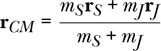

太阳与木星之间的距离约为 8 × 10¹¹米。太阳的半径为 6.96 × 10⁸米。太阳的质量为 1.99 × 10³⁰千克。木星的质量为 1.90 × 10²⁷千克。

在上面的方程中将太阳置于原点，只考虑向量的径向分量，我们发现质心

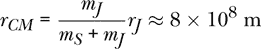

质心位于太阳半径稍微外面的位置。我们应该能够在动画中看到太阳围绕这个质心旋转。

使用光泽或无光泽效果为太阳-木星系统制作动画。唯一的力是太阳与木星之间的引力。显示太阳的大小与轨道运动成比例，但要放大太阳，忽略木星的显示。如果一切顺利，你应该看到太阳围绕一个稍微偏离其半径的点旋转。

你不需要包括上面提到的质心计算来制作这个动画。然而，为了让质心保持固定，你需要提供初始条件，使得太阳-木星系统的总动量为零。如果木星的初速度在 y 方向，那么太阳需要有一个小的初始速度，在负 y 方向，以确保总动量为 0。

为了获得木星的初速度估算，你可以假设木星的轨道是圆形的，且轨道的半径与太阳-木星的距离相同。（这与实际值相差仅 0.1%。）

**练习 20.5.** 使用现实的初始条件，编写一个关于太阳、地球和月球相互通过重力作用的动画程序。实际的地球与太阳之间的距离大约是地球与月球之间的距离的 500 倍，因此你不能在屏幕上分辨出地球和月球是两个独立的物体。为了能够看到月球相对于地球的位置，建议如下操作：不要直接显示计算出的月球位置，而是显示一个假的月球位置，它的方向正确，但距离地球的距离是你计算出的 50 倍。计算虚拟月球位置的公式如下：

**r**[FM] = **r**[E] + *A*(**r**[M] − **r**[E])

其中 **r**[FM] 是虚拟月球的位置，**r**[M] 是（真实）月球的位置，**r**[E] 是地球的位置，*A* 是一个放大系数，人工放大地球到月球的矢量以便显示。尝试 *A* = 50，看看会发生什么。请注意，虚拟月球只需出现在显示函数中。这种情况应涉及三个内部力和没有外部力。

**练习 20.6.** 使用 `fixedLinearSpring` 函数，研究一个弹性摆。选择弹簧常数 *k*、弹簧的平衡长度 *r[e]* 和质量 *m* 的值。

(a) 通过动画或图形确认，将质量放置在距天花板固定点正下方 *r[e]* + *mg*/*k* 的位置，且不赋予其初始速度，结果会使质量处于一种平衡状态，从而使质量在弹簧上静止悬挂。

(b) 选择一种初始状态，其中质量没有初始速度，并且正好位于弹簧固定点下方 *r[e]* 的位置。在这种情况下，弹簧最初不会对质量产生任何力，但重力会产生一个力。通过动画或图形确认，质量的振荡角频率为 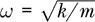。这等效于周期为 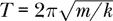。

(c) 通过将质量放置在距天花板固定点 *r[e]* + *mg*/*k* 的位置，且没有初始速度，研究摆的水平振荡，但不能直接放置在固定点的正下方。让质量随时间变化。通过动画或图形确认，振荡的角频率接近 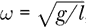，其中 *l* = *r[e]* + *mg*/*k*，或者等效地，周期为 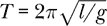。

(d) 找到一个初始位置和初始速度，使得质量进行水平圆周运动。

(e) 如果现在你改变参数，使得

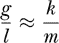

你可能能够找到一些初始条件，使得质量在垂直平面内进行圆周或椭圆运动。看看这是否可能。

**习题 20.7.** 考虑两颗质量相等的台球，它们以相等且相反的速度相向而行。如果它们直接相向运动，比如沿 x 轴运动，那么碰撞将是单维的。另一方面，如果它们的初速度分别沿 x 轴正向和负向，但它们之间有一个小的 y 位移分量，那么碰撞将是二维的。碰撞后球的运动角度（因为对称性，两颗球的角度相同）依赖于初始的 y 位移分量。存在某个初始 y 位移能产生直角。通过反复试验，找到对于某个弹簧常数和时间步长的这个 y 位移。结果可能不是你预期的。尝试不同的弹簧常数和/或时间步长。你能解释为什么产生直角所需的 y 位移依赖于弹簧常数吗？

**习题 20.8.** 为吉他弦编写一个动画，其中弦用 9 个质量点来建模，而不是 64 个。质量点之间的距离将是 6.5 厘米，而不是 1 厘米。这会将时间步长的稳定性阈值增加到 255*μ*s，因此我们可以使用更大的时间步长。由于我们对计算机的要求降低，因此即使在较旧的硬件上，动画也应该运行流畅。你需要为 `forcesString`、`stringUpdate` 和 `stringInitialOvertone` 编写新的定义。`stringPicture` 函数可以保持不变。弹簧的弹簧常数需要不同。

**习题 20.9.** 为了观察当数值不稳定发生时动画的效果，将吉他弦的光滑动画修改为时间步长为 100*μ*s。你可以通过增加时间缩放因子或减少动画速率来实现这一点。

**习题 20.10.** 编写以下函数：

```
mpsPos :: MultiParticleState -> IO ()
mpsPos = undefined

mpsVel :: MultiParticleState -> IO ()
mpsVel = undefined
```

使用 gnuplot 绘制多粒子状态下的 x 和 y 位置分量（对于第一个函数）以及速度分量（对于第二个函数）的图像，就像它是吉他弦一样。这些函数可以帮助调试。你可以用它们来可视化在前几个时间步内发生的情况，这样当事情无法正常工作时，你可以获得一些线索。

**习题 20.11.** 使用 `simulateVis` 为吉他弦编写 3D 动画。

**习题 20.12.** 制作一个 3D 吉他弦动画，使其运动看起来像跳绳。你应该通过改变初始状态来实现这一点，使得构成弦的质量点具有某些初始速度。

**习题 20.13.** 修改 `makePNG` 函数，使其使用四位数字而不是三位数字来标记输出文件。这允许生成最多 10,000 帧的较长动画。通过制作 2,000 帧的动画来测试你的函数。

**习题 20.14.** 编写代码生成类似于 图 20-2 的图表。

**习题 20.15.** 探索吉他弦的能量守恒。机械能应该是守恒的，但其守恒程度取决于时间步长。你需要为该系统的机械能写出一个表达式。

**习题 20.16.** 到目前为止，我们的大部分动画结果都是基于状态更新函数，并且使用了`simulateGloss`或`simulateVis`函数。现在有一种方法可以动画化一系列状态，我们将进行探讨。接下来的`animateGloss`和`animateVis`函数的输入包括时间尺度因子、显示函数和状态列表，并生成动画。动画的时间步长来自状态列表。我们不指定动画速率；它是通过时间尺度因子和时间步长计算出来的。

```
animateGloss :: HasTime s => R  -- time-scale factor
             -> (s -> G.Picture)
             -> [s]
             -> IO ()
animateGloss tsFactor displayFunc mpsts
    = let dtp = timeOf (mpsts !! 1) - timeOf (mpsts !! 0)
          n tp = round (tp / dtp)
          picFromAnimTime :: Float -> G.Picture
          picFromAnimTime ta = displayFunc (mpsts !! n (tsFactor * realToFrac ta))
          displayMode = G.InWindow "My Window" (1000, 700) (10, 10)
      in G.animate displayMode G.black picFromAnimTime

animateVis :: HasTime s => R  -- time-scale factor
           -> (s -> V.VisObject R)
           -> [s]
           -> IO ()
animateVis tsFactor displayFunc mpsts
    = let dtp = timeOf (mpsts !! 1) - timeOf (mpsts !! 0)
          n tp = round (tp / dtp)
          picFromAnimTime :: Float -> V.VisObject R
          picFromAnimTime ta = displayFunc (mpsts !! n (tsFactor * realToFrac ta))
      in V.animate V.defaultOpts (orient . picFromAnimTime)
```

清单 20-6 是一个使用`animateGloss`进行动画制作的独立程序。

```
{-# OPTIONS -Wall #-}

import MultipleObjects ( eulerCromerMPS )
import MOExamples
    ( animateGloss, billiardPicture, billiardStates )

main :: IO ()
main = animateGloss 1 billiardPicture (billiardStates eulerCromerMPS 30 0.01)
```

*清单 20-6：两个台球碰撞的二维动画的独立程序*

写一个独立程序，使用`animateVis`进行动画制作。

**习题 20.17.** 我们在本章研究的台球碰撞是弹性碰撞。任何仅有`billiardForce`作为唯一作用力的碰撞都必须是弹性碰撞。那么，如何产生非弹性碰撞呢？我们需要某种能够耗散能量的双体力。以下的双体力可以在碰撞中提供耗散：

```
dissipation :: R  -- damping constant
            -> R  -- threshold center separation
            -> TwoBodyForce
dissipation b re st1 st2
    = let r1 = posVec st1
          r2 = posVec st2
          v1 = velocity st1
          v2 = velocity st2
          r21 = r2 ^-^ r1
          v21 = v2 ^-^ v1
      in if magnitude r21 >= re
         then zeroV
         else (-b) *^ v21
```

当粒子之间的距离大于或等于阈值分离时，粒子不会感受到耗散力。当粒子之间的距离小于阈值分离时，粒子会感受到一个与相对速度成正比的力，方向上有助于减小相对速度的大小。将这一耗散力与`billiardForce`一同列入系统作用力中，结果将导致非弹性碰撞。

修改清单 20-3 中的独立程序，使其产生非弹性碰撞。4 kg/s 的阻尼常数应产生完全非弹性碰撞。

为了确认此碰撞是非弹性的，绘制机械能随时间变化的图表。由于存在非保守力，机械能不会守恒。机械能在碰撞前应是守恒的，在碰撞过程中急剧下降，并在碰撞后保持在较低的值。
