## 21

电学


当我们想到电学时，通常会想到它是如何被使用的，比如电流通过电话线或从电池中流出。但所有电气技术的起点都来自一个单一的概念：电荷。电荷与所有电气现象都有关，它是我们讨论的逻辑起点。

因此，我们将从描述电荷开始本章的内容。接着，我们将讨论库仑在 18 世纪末提出的电学理论，这就是库仑定律。最后，我们将运用这一理论来研究两种带电粒子相互排斥的运动。

### 电荷

*电荷*是与粒子或物体相关的一个量，它决定了该粒子或物体是否以及如何参与电学现象。在 1700 年代，人们发现有两种类型的电荷。同种电荷相互排斥，异种电荷相互吸引。后来，当物理学家发现亚原子粒子时，他们决定质子带正电，电子带负电，但这是一个随意的选择，现在大家都遵循这个约定。

电荷的国际单位是库仑（C），以 18 世纪末法国物理学家查尔斯·奥古斯丁·库仑（Charles-Augustin de Coulomb）的名字命名，他在电学方面做出了开创性的工作。表 21-1 列出了质子、电子和中子的电荷。质子的电荷是*精确的* 1.602176634 × 10^(–19) C。如何能精确知道质子的电荷？自 2019 年起，国际单位制*定义*库仑为使得一个*基本电荷*恰好等于 1.602176634 × 10^(–19) C 的电荷量。质子被认为具有一个基本电荷单位，电子则具有负的一个基本电荷单位。通过实验，已知质子和电子的电荷大小相等（但符号相反），误差小于 10^(–18)的一个量级。在方程中，我们用*q*或*Q*来表示电荷。

**表 21-1：** 一些常见粒子的电荷和质量

| **粒子** | **电荷** | **质量** |
| --- | --- | --- |
| 质子 | 1.602 × 10^(–19) C | 1.673 × 10^(–27) kg |
| 中子 | 0 C | 1.675 × 10^(–27) kg |
| 电子 | –1.602 × 10^(–19) C | 9.109 × 10^(–31) kg |

列表 21-1 显示了我们将在本章中开发的`Electricity`模块的代码前几行。我们从第十九章的`MultipleObjects`模块中导入了`TwoBodyForce`和`MultiParticleState`，因为我们将在本章描述的库仑定律是一种二体力。

```
{-# OPTIONS -Wall #-}

module Electricity where

import SimpleVec
    ( Vec(..), R, (*^), iHat )
import Mechanics3D
    ( ParticleState(..), defaultParticleState )
import MultipleObjects
    ( TwoBodyForce, MultiParticleState(..), Force(..), statesMPS
    , eulerCromerMPS, centralForce )
import Graphics.Gnuplot.Simple
    ( Attribute(..), plotPaths )
```

*列表 21-1：Electricity 模块的开头代码行*

电荷是标量，不是向量。电荷由一个实数表示。这意味着电荷的类型应该是实数。

```
type Charge = R
```

让我们对基本电荷的值进行编码。

```
elementaryCharge :: Charge
elementaryCharge = 1.602176634e-19  -- in Coulombs
```

电荷是量子化的——也就是说，它是以离散的粒子形式存在——但这一事实在经典电磁理论中并不起作用。事实上，电荷的量子化颗粒非常小，以至于我们常常将电荷看作更像是一种流体。即使现在这还不完全能理解，也没关系；我们将在第二十四章讨论连续电荷分布。

电荷也是守恒的。如果任何体积内的电荷发生变化，它必须通过体积的边界面流入或流出。

关于电荷，最重要和最有趣的问题并不是它的内在性质，而是带电粒子之间的相互关系和相互作用。电荷是如何相互作用的？

### 库仑定律

查尔斯·奥古斯丁·德·库仑是第一个给出描述两个带电粒子相互作用的定量关系的人。他展示了一个点电荷对另一个点电荷施加的力与每个电荷成正比，与它们之间距离的平方成反比。库仑定律可以写作如下方程：

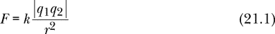

其中 *q*[1] 是粒子 1 的电荷，*q*[2] 是粒子 2 的电荷，*r* 是粒子之间的距离。这个方程给出了粒子 1 对粒子 2 施加的力的大小，这个力根据牛顿第三定律与粒子 2 对粒子 1 施加的力大小相同。力的方向取决于电荷的符号；相同电荷之间是排斥力，不同电荷之间是吸引力。在国际单位制中，常数 *k* 为：

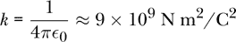

常数 ϵ[0]，称为*真空电容率*、*电常数*或*自由空间的电容率*，充当电学单位（如库仑）和机械单位（如牛顿）之间的一种桥梁。表达式 1/(4*π*ϵ[0]) 常常代替 *k*，因为 *k* 是物理学中使用过多的符号。

下面是将方程 21.1 翻译成 Haskell 的版本：

```
coulombMagnitude :: Charge -> Charge -> R -> R
coulombMagnitude q1 q2 r
    = let k = 9e9  -- in N m² / C²
      in k * abs (q1 * q2) / r**2
```

我们可以使用矢量表示法给出更全面的库仑定律版本，其中包括方程中的力的方向。我们将定义位移向量 **r**[21] 为从粒子 1 指向粒子 2 的矢量，如图 21-1 所示。

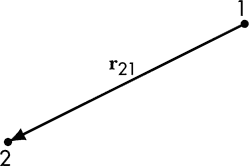

*图 21-1：位移向量 **r**[21] 从粒子 1 指向粒子 2。*

由粒子 1 对粒子 2 施加的力 **F**[21] 以矢量表示如下：

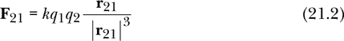

注意，如果两个电荷都是正的，那么粒子 2 上的力**F**[21]将指向与位移向量**r**[21]相同的方向，即远离粒子 1，这与我们对相同电荷的预期一致。如果电荷符号不同，**F**[21]的方向会发生翻转，表示一种吸引力。

如果**r**[1]是粒子 1 的位置向量，**r**[2]是粒子 2 的位置向量，那么**r**[21] = **r**[2] - **r**[1]，我们可以如下表示作用在粒子 2 上的力：

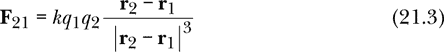

总结来说，库仑定律 21.1 较为简化，而库仑定律 21.2 和 21.3 则更为强大，因为力的方向已被编码到方程中。

这种库仑相互作用是我们在第十九章中讨论的`TwoBodyForce`类型。这里是 Haskell 中的方程 21.3：

```
coulombForce :: TwoBodyForce
coulombForce st1 st2
    = let k = 9e9  -- N m² / C²
          q1 = charge st1
          q2 = charge st2
      in centralForce (\r -> k * q1 * q2 / r**2) st1 st2
```

库仑力是另一个中心力的例子，因此这里我们使用在第十九章中定义的`centralForce`函数。

将库仑定律编码为双体力后，我们将其应用于两个质子相互排斥的情况。

### 两个电荷相互作用

假设我们释放两个质子，初始距离为 1 厘米。它们将在五毫秒内移动多远？这是一个适合我们在前几章中开发的工具的问题，特别是第十九章。这个问题不能仅通过代数来解决，因为随着粒子相互远离，力会减弱。粒子从静止开始，彼此加速，而这种加速度随着排斥力的减弱而减小。当两个质子相距较远时，力减小到可以忽略不计的程度，质子接近终极速度。

#### 极限情况分析

在我们应用第十九章中的多粒子工具之前，让我们先通过思考两个极限情况来了解这个问题：一开始发生了什么，经过很长时间后又会发生什么。

对于非常短的时间，在粒子移动不大之前，我们可以将初始加速度近似为常数。我们可以通过将净力除以质子质量来获得其中一个质子的初始加速度。

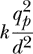

其中，*q[p]*是质子的电荷，*d*是 1 厘米，*m[p]*是质子的质量：

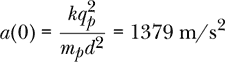

将此加速度视为常数时，一个质子的速度和位置为：

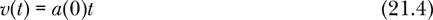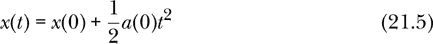

通过常加速度方程 4.14 和 4.15 获得的这些方程在短时间内是一个很好的近似，但将其延长得太久就显得过于雄心勃勃，且结果不佳。我们将这种近似称为“常加速度近似”。

在质子运动了一段时间后，粒子将接近终端速度。我们可以通过能量守恒来找到这个终端速度。两电荷*q*[1]和*q*[2]之间相距*d*时的电势能为*kq*[1]*q*[2]/*d*，因此两个质子相距*d*时的电势能为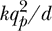。两个质子的初始电势能转换为动能。质量为*m*，以速度*v*运动的粒子的动能为*mv*²/2。两个质子将接近相同的终端速度*υ[T]*，所以能量守恒导致以下方程：

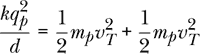

每个质子的终端速度通过能量守恒给出：

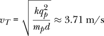

对于非常长的时间，我们可以将终端速度视为常数，因此一个质子的速度和位置为：

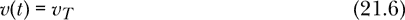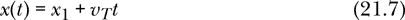

其中*x*[1]是某个尚未确定的距离。当*t*非常大时，这些方程是一个很好的近似，但在较短的时间内使用它们会得到不准确的结果。我们将这种近似称为“终端速度近似”。

让我们总结一下从短时间极限和长时间极限中学到的内容。当从静止释放时，每个质子都会经历 1379 m/s²的加速度，远离另一个质子。随着质子之间的距离增大，加速度会减小，直到加速度变得微不足道，质子获得终端速度 3.71 m/s。如果我们将质子速度随时间变化绘制成图，速度将从 0 开始，并以 1379 m/s²的斜率增加。随着时间的推移，速度增加，渐近地接近终端速度 3.71 m/s。

#### 在 Haskell 中建模情形

现在我们已经对预期的结果有了基本的了解，让我们应用在第十九章中为多粒子情形开发的工具。我们需要包括的唯一力是质子之间库伦相互作用的内力。

通过使用来自第十九章的`statesMPS`，我们可以形成一个无限的多粒子状态列表。

```
twoProtonStates :: R                     -- time step
                -> MultiParticleState    -- initial 2-particle state
                -> [MultiParticleState]  -- infinite list of states
twoProtonStates dt
    = statesMPS (eulerCromerMPS dt) [InternalForce 1 0 coulombForce]
```

我们提供此功能时需要给定时间步长和初始的两粒子状态，它将返回一个无限的两粒子状态列表，我们可以从中提取任何我们想要的信息。

这是一个函数，它设置了一个初始状态，其中两个质子静止，且初始分离距离作为函数参数给定。该函数中的原点位于两个质子之间的中点。质子质量来自表 21-1。

```
-- protons are released from rest
initialTwoProtonState :: R  -- initial separation
                      -> MultiParticleState
initialTwoProtonState d
    = let protonMass = 1.673e-27  -- in kg
      in MPS [defaultParticleState { mass   = protonMass
                                   , charge = elementaryCharge
                                   , posVec = (-d/2) *^ iHat
                                   }
             ,defaultParticleState { mass   = protonMass
                                   , charge = elementaryCharge
                                   , posVec = ( d/2) *^ iHat
                                   }
             ]
```

让我们从绘制质子速度随时间变化的图表开始。函数`oneProtonVelocity`返回一个无限的时间-速度对列表。

```
oneProtonVelocity :: R        -- dt
                  -> R        -- starting separation
                  -> [(R,R)]  -- (time,velocity) pairs
oneProtonVelocity dt d
    = let state0 = initialTwoProtonState d
      in [(time st2, xComp $ velocity st2)
              | MPS [_,st2] <- twoProtonStates dt state0]
```

我们通过列表推导式构建列表，并在列表推导式中使用模式匹配，为第二个质子的状态命名为`st2`。我们选择第二个质子而不是第一个质子，因为根据我们初始状态的分析，第二个质子将具有正的速度分量，而第一个质子将具有负的速度分量。最后，我们使用`time`、`velocity`和`xComp`函数来提取我们想要绘制的值。

确定使用哪个时间步长并不那么明显。让我们尝试使用维度分析，结合这个问题的参数来估算一个特征时间尺度。这个问题的相关参数包括质子电荷*q[p]*、质子质量*m[p]*、电常数*k*和距离*d*（1 厘米）。我们能否将这些参数结合起来得到一个具有时间维度的量？可以的。这个问题的特征时间尺度由以下公式给出

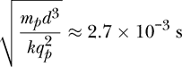

我们将使用时间步长为 10^(–5)秒，这与我们刚刚找到的特征时间尺度相比是很小的。

以下是时间-速度对的列表，这是我们将绘制的有限结果。

```
tvPairs :: [(R,R)]
tvPairs = takeWhile (\(t,_) -> t <= 2e-2) $
          oneProtonVelocity 1e-5 1e-2
```

我们将时间步长`1e-5`（10^(–5)秒）和初始质子间距`1e-2`（1 厘米）传递给函数`oneProtonVelocity`，从而获得一个无限状态列表。然后，我们将这个无限列表截断为一个有限的状态列表，表示直到 20 毫秒的时间范围内的状态。

图 21-2 展示了质子的速度随时间变化的图像。图中的直线表示常数加速度近似和终端速度近似。计算得到的速度平滑地从初期的线性增加（初始加速度）过渡到后期接近终端速度。

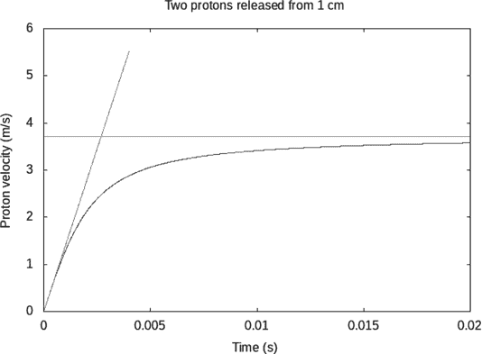

*图 21-2：两个质子相互排斥。曲线表示质子的速度随时间的变化。水平线是终端速度，斜线表示质子初始加速度。*

下面是生成图 21-2 图像的代码。

```
velocityPlot :: IO ()
velocityPlot
    = plotPaths [Title "Two protons released from 1 cm"
                ,XLabel "Time (s)"
                ,YLabel "Proton velocity (m/s)"
                ,PNG "protons.png"
                ,Key Nothing
                ] $ [tvPairs
                    ,[(t,1379*t) | t <- [0,1e-5..4e-3]]
                    ,[(t,3.71)   | t <- [0,1e-3..2e-2]]]
```

由于我们创建了有限的具体列表`tvPairs`来保存数据，绘图代码主要是使用`plotPaths`函数。通过列表推导式构建时间-速度对来绘制这两种近似曲线。`1379`是质子的初始加速度，单位为米每秒平方（m/s²），而`3.71`是质子的终端速度，单位为米每秒（m/s）。

我们最初的问题是问质子在 5 毫秒内能走多远。让我们绘制质子的位置与时间的关系图，然后直接回答最初的问题。图 21-3 展示了质子位置随时间变化的图像。它还展示了常数加速度近似，这就是图中左边的抛物线，在大约 2 毫秒的时间范围内，它给出了较好的结果。

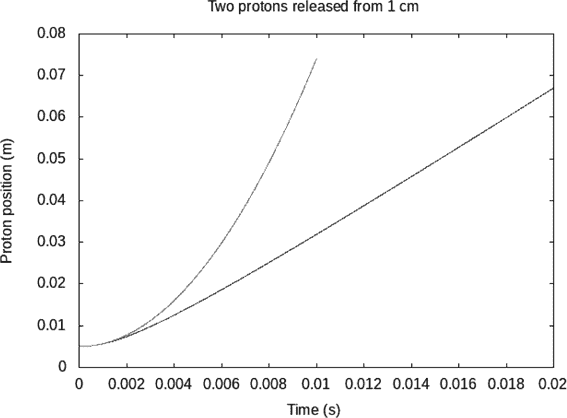

*图 21-3：两个质子相互排斥。一个质子的位置随时间变化的曲线随着时间推移趋于线性。为了比较，抛物线图给出了如果质子最初经历的加速度保持恒定时的位置变化。*

最后，我们要求 GHCi 给出 5 毫秒时质子的位置信息。由于 `initialTwoProtonState 0.01` 是一个初始的两粒子状态，质子之间相距 1 厘米，而 `twoProtonStates 1e-5 (initialTwoProtonState 0.01)` 是一个由时间步长为 10^(-5) 秒构成的无限长两粒子状态列表，因此 5 毫秒对应列表中的第 500 个时间步长。我们可以如下请求所需的信息：

```
Prelude>  :l Electricity
[1 of 6] Compiling Newton2          ( Newton2.hs, interpreted )
[2 of 6] Compiling Mechanics1D      ( Mechanics1D.hs, interpreted )
[3 of 6] Compiling SimpleVec        ( SimpleVec.hs, interpreted )
[4 of 6] Compiling Mechanics3D      ( Mechanics3D.hs, interpreted )
[5 of 6] Compiling MultipleObjects  ( MultipleObjects.hs, interpreted )
[6 of 6] Compiling Electricity      ( Electricity.hs, interpreted )
Ok, six modules loaded.
*Electricity> twoProtonStates 1e-5 (initialTwoProtonState 0.01) !! 500
MPS {particleStates =
     [ParticleState {mass = 1.673e-27,
                     charge = 1.602176634e-19,
                     time = 4.9999999999999645e-3,
                     posVec = vec (-1.550866906307423e-2) 0.0 0.0,
                     velocity = vec (-3.0582222353914252) 0.0 0.0},
      ParticleState {mass = 1.673e-27,
                     charge = 1.602176634e-19,
                     time = 4.9999999999999645e-3,
                     posVec = vec 1.550866906307423e-2 0.0 0.0,
                     velocity = vec 3.0582222353914252 0.0 0.0}]}
```

GHCi 返回 5 毫秒时的两粒子状态。我已经将输出格式化以便于阅读。质子沿 x 轴的位置分别为 -1.55 厘米和 1.55 厘米，因此它们在 5 毫秒时相距 3.1 厘米。

### 总结

我们已经概述了 18 世纪的电学理论，这些理论在粒子运动速度相较于光速较慢且没有经历极端加速度的情况下表现良好。库仑的 18 世纪理论仍然是一个有效的静电学理论，也叫做*静电学*。库仑定律是一个双体力学定律，类似于牛顿的万有引力定律。库仑定律旨在应用于我们在第二部分中学习的多粒子牛顿力学的背景下。一个例子是两个质子相互排斥，这个问题虽然陈述起来很简单，但无法通过简单的代数方法解决，而是需要我们已经发展出的思想和工具。

在 19 世纪，迈克尔·法拉第发现了一种电学现象，它不是由电荷直接引起的。这导致了电场和磁场的概念，在现代法拉第-麦克斯韦电磁理论中，电场和磁场是电荷的媒介。这个更新的理论是*电动力学*理论，即使在电荷快速移动并强烈加速的情况下，它也能做出良好的预测。由于这一新理论是场论，意味着作用者是场而非粒子，并且由于物理学中的场是三维空间或时空的一个函数，因此我们将在接下来的两章中研究三维空间的坐标系统和几何学。

### 练习

**练习 21.1.** 绘制一个类似于图 21-2 的图，表示从静止状态释放的两个电子，且它们的初始间距为 1 厘米。在这种情况下，终极速度和特征时间尺度是多少？

**练习 21.2.** 库仑电理论预测电子可以像地球绕太阳公转那样绕质子公转。我们可以称之为“经典氢原子”。（现代法拉第-麦克斯韦电磁理论在本书的后面部分将介绍，这对这种模型提出了问题，因为加速的带电粒子会辐射，这使得经典氢原子不稳定。）编写一个经典氢原子的动画，其中库仑力是质子和电子之间唯一的内部力，并且没有外部力。你需要为质子和电子选择一些初始条件。

**练习 21.3.** 考虑一个从静止状态释放的质子和电子。编写一个函数来计算直到碰撞所需的时间，给定初始的分离距离。它们应该最初相距多远，才能使它们在一秒钟内发生碰撞？

**练习 21.4.** 使用带光泽或不带光泽的方式动画化两个质子之间的排斥。

**练习 21.5.** 编写代码以生成图 21-3 中的图形。以下是你可以使用的起始代码（如果需要的话）：

```
oneProtonPosition :: R        -- dt
                  -> R        -- starting separation
                  -> [(R,R)]  -- (time,position) pairs
oneProtonPosition dt d
    = undefined dt d

positionPlot :: IO ()
positionPlot = plotPaths [Title "Two protons released from 1 cm"
                         ,XLabel "Time (s)"
                         ,YLabel "Proton position (m)"
                         ,PNG "ProtonPosition.png"
                         ,Key Nothing
                         ] $ [undefined $ oneProtonPosition 1e-5 1e-2
                            ,undefined :: [(R,R)]]
```

**练习 21.6.** 通过试验和错误，找到方程 21.7 中 *x*[1] 的一个值，使得图 21-3 中的位置-时间曲线对于较大的时间在与方程 21.7 的直线接近时呈渐近状态。
