# 坐标系与场


在本章中，我们将开始探索法拉第和麦克斯韦的电磁理论，该理论通过引入场的概念突破了库仑基于粒子的观点。法拉第-麦克斯韦理论是我们用来解释电学、磁学和光学现象的最佳理论。作为场理论，法拉第-麦克斯韦理论支持了相对论的局域性思想，早在爱因斯坦写出相对论之前的 40 年，就为其他场理论（如广义相对论）提供了灵感，并成为现代粒子物理学规范场理论的原型。如今，场的概念在物理学的许多领域中扮演着重要角色，例如连续介质力学、流体动力学和量子场论。场作为一个函数这一特性，是功能性编程在物理学中如此有效的原因之一。

在四维时空中阐述电磁理论是可能的，并且是优雅的（像 Haskell 这样的函数式语言特别适合这个任务），但我们将遵循更常见的做法，使用三维表示法，因为对四维相对论时空语言的物理见解和几何见解需要一些时间才能掌握。因此，本章描述了三维空间的坐标系，定义了三维空间中位置的数据类型，并引入了*场*的概念，场是一个函数，其输入是三维空间中的位置。

我们首先通过观察极坐标来获得一些见解，极坐标是二维平面中仅次于笛卡尔坐标的最常见坐标系。接着，我们将研究圆柱坐标和球坐标，这两种是三维空间中仅次于笛卡尔坐标的最常见坐标系。我们将为三维空间中的位置创建一种新的数据类型，该数据类型能够适应笛卡尔坐标、圆柱坐标、球坐标以及我们可能想使用的其他坐标系。我们将引入标量场和向量场及其数据类型，以便我们拥有基本的数学框架来讨论诸如电荷密度（标量场）和电场（向量场）之类的概念。

### 极坐标

极坐标是一种将两个数字赋予平面上每个点的方式，其中一个数字是从原点到该点的距离。极坐标在平面上以某点为中心的旋转对称性情况下是一个自然的选择，尽管它们的使用不必仅限于这种情况。我们将使用变量 *s* 和 *ϕ* 来表示极坐标。*s* 和 *ϕ* 这两个名称来自 Griffiths 的电动力学教材 **[19**]。

笛卡尔坐标 *x* 和 *y* 与极坐标 *s* 和 *ϕ* 通过以下方程相关：

*x* = *s* cos *ϕ*

*y* = *s* sin *ϕ*

坐标 *s* 是从原点到平面中某点的距离，坐标 *ϕ* 是 x 轴与从原点到某点的连线之间的角度（见 图 22-1）。

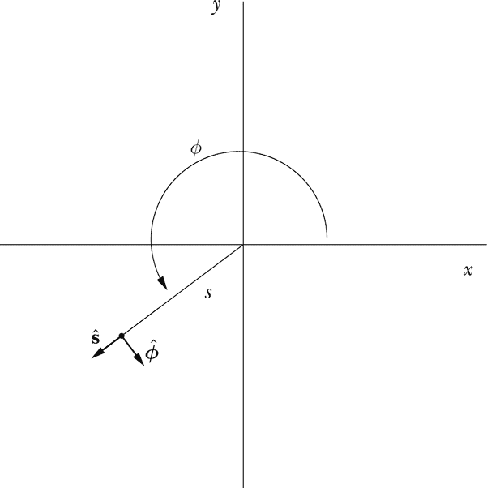

*图 22-1：极坐标*

在 图 22-1 中，我们还介绍了极坐标单位向量。单位向量  指向远离原点的方向。（这是平面上除原点外每一点的明确方向。）等效地，单位向量  指向使得 *ϕ* 保持恒定并且 *s* 增加的方向。类似地，单位向量  指向使得 *s* 保持恒定并且 *ϕ* 增加的方向。我们可以用笛卡尔坐标单位向量 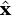 和 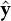 来表示极坐标单位向量  和 ，如下所示：


与笛卡尔单位向量  和  不同，极坐标单位向量  和  在平面中不同点指向不同的方向。稍后本章的 图 22-5 右侧的图片显示了单位向量  在 xy 平面上不同点的方向，你可以看到它的方向是如何变化的。

二维极坐标的定义使得在三维中定义圆柱坐标变得简单，接下来我们将讨论这一内容。

### 圆柱坐标

圆柱坐标是极坐标在三维空间中的扩展，是描述绕某轴旋转和移动对称性的自然坐标选择。我们可以使用圆柱坐标 *s*、*ϕ* 和 *z* 来表示三维空间中某点的位置，如 图 22-2 所示。坐标 *s* 是从 z 轴到空间中点的距离，坐标 *ϕ* 是 xz 平面与包含 z 轴和该点的平面之间的角度，坐标 *z* 和笛卡尔坐标中的含义相同：即距离 xy 平面的距离。圆柱坐标与极坐标密切相关，因为圆柱坐标以极坐标方式描述 xy 平面，但继续使用笛卡尔坐标的 z 坐标。

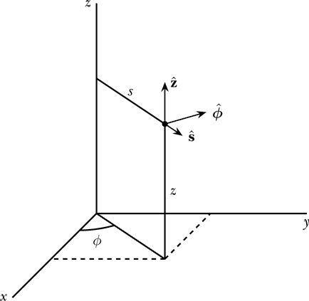

*图 22-2：圆柱坐标*

笛卡尔坐标 *x*、*y* 和 *z* 与圆柱坐标 *s*、*ϕ* 和 *z* 之间的关系如下方程所示：

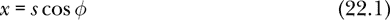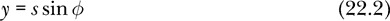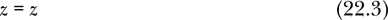

图 22-2 中还展示了柱坐标单位向量。单位向量  指向远离 z 轴的方向。（在空间中除了 z 轴上的点外，这在每个点上都是一个明确的方向。）等效地，单位向量  指向的是 *ϕ* 和 *z* 保持不变，*s* 增加的方向。单位向量  指向的是 *s* 和 *z* 保持不变，*ϕ* 增加的方向。最后，单位向量 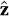 指向的是 *s* 和 *ϕ* 保持不变，*z* 增加的方向。

我们可以将柱坐标单位向量 、 和  用笛卡尔坐标单位向量 、 和  来表示，如下所示：

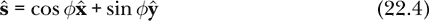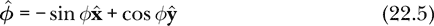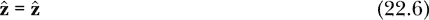

现在我们已经讨论了柱坐标系统，并展示了它作为描述三维空间中点的笛卡尔坐标的替代方式，接下来我们将讨论另一个三维坐标系统。

### 球坐标

在具有关于空间中某一点的旋转对称性的情况下，球坐标是一个自然的选择。但像本章中描述的所有三维坐标系统一样，它们也是一个通用的坐标系统，能够描述三维空间中任意位置。我们可以使用球坐标 *r*、*θ* 和 *ϕ* 来表示空间中某点的位置，如图 22-3 所示。

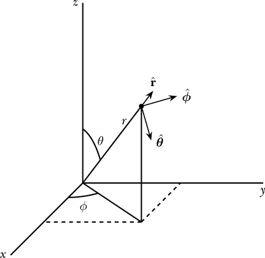

*图 22-3：球坐标*

坐标 *r* 是从原点到空间中某点的距离，坐标 *θ* 是 z 轴与从原点到该点的连线之间的夹角，坐标 *ϕ* 是 xz 平面与包含 z 轴和该点的平面之间的夹角。（在球坐标中，坐标 *ϕ* 的含义与在柱坐标中相同。）

笛卡尔坐标 *x*、*y* 和 *z* 与球坐标 *r*、*θ* 和 *ϕ* 之间的关系如下所示：

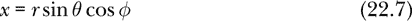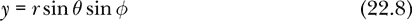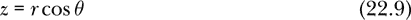

在图 22-3 中，还展示了球坐标单位向量。单位向量指向远离原点的方向。（这是空间中除了原点本身外，每个点的一个明确定义的方向。）等效地，单位向量指向*θ*和*ϕ*保持不变而*r*增加的方向。单位向量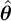指向*r*和*ϕ*保持不变而*θ*增加的方向。最后，单位向量指向*r*和*θ*保持不变而*ϕ*增加的方向。

要将表示为笛卡尔单位向量，我们将位置向量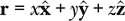除以它的大小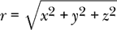。的表达式与圆柱坐标下的表达式相同。的表达式可以通过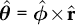得到。我们可以将球坐标单位向量、和表示为笛卡尔坐标单位向量、和，表达式如下：

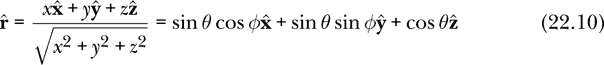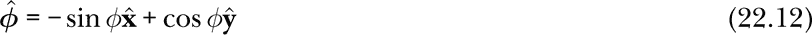

现在我们已经完成了对球坐标以及我们打算使用的所有坐标系统的介绍，接下来的任务是为三维空间中的位置定义一个新类型，它将与所有三维坐标系统兼容。然而，在此之前，我们先为本章编写一些引导代码。

### 引入代码

Listing 22-1 展示了我们将在本章中开发的`CoordinateSystems`模块的第一行代码。

```
{-# OPTIONS -Wall #-}

module CoordinateSystems where

import SimpleVec
    ( R, Vec, (^/), vec, xComp, yComp, zComp, iHat, jHat, kHat
    , magnitude, sumV, zeroV )
import Mechanics3D ( orient, v3FromVec )
import MOExamples ( Table(..), Justification(..) )
import qualified Vis as V
import SpatialMath ( V3(..) )
import Diagrams.Prelude
    ( Diagram, V2(..), PolyType(..), PolyOrientation(..), PolygonOpts(..)
    , (#), (@@), dims, p2, r2, arrowAt, position, fc, black, white
    , blend, none, lw, rotate, deg, rad, scale, polygon, sinA )
import Diagrams.Backend.Cairo ( B, renderCairo )
```

*Listing 22-1: 坐标系统模块的开头代码行*

在这里，我们导入了之前在`SimpleVec`、`Mechanics3D`和`MOExamples`模块中编写的函数和类型。我们将使用`Vis`模块来可视化标量场和向量场，并且由于`Vis`模块的本地向量类型是`V3`类型，所以我们将使用`SpatialMath`中的`V3`类型。`Diagrams`的`.Prelude`和`Diagrams.Backend.Cairo`模块是图表包的一部分，我们将使用它们来进行向量场的可视化。附录中包含了关于如何安装图表包的信息。

### 位置的类型

我们希望有一个 Haskell 类型来描述空间中某一点的位置。我们还希望能够指定三维空间中的点，可以使用笛卡尔、圆柱或球坐标，并能访问以前在任何坐标系统中定义的位置，包括与定义该位置的坐标系统不同的系统。

#### 定义新类型

我们如何使用 Haskell 来描述空间中的一个点？我们有三种选择。选项 A 是使用一个笛卡尔坐标三元组 `(R,R,R)`。这对于许多目的来说是可行的。它的优点是简单，但缺点是我们已经知道，我们有兴趣使用圆柱坐标和球坐标，它们也是由三个数字组成的三元组。这使得我们容易误将笛卡尔坐标（*x*,*y*,*z*）三元组误认作球坐标（*r*,*θ*,*ϕ*）三元组。编译器可以帮助我们避免这个错误，但前提是我们能智能地利用类型系统。选项 A 可行但有风险。我们可以更好地利用计算机来帮助我们避免错误。

选项 B 是使用 `Vec` 类型来表示位置，正如我们在力学中所做的那样。`Vec` 类型显然具有笛卡尔坐标分量，因此与选项 A 相比，它更难产生混淆。如果我们在以前编写的代码中遇到三元组 `(R,R,R)`，该类型并未告诉我们它是笛卡尔坐标三元组还是球坐标三元组。另一方面，如果我们遇到一个 `Vec`，我们知道它在底层是一个笛卡尔坐标三元组。选项 B 是可行的。选项 B 的一个缺点是，位置并不是真正的向量，因为向量根据定义是可以相加的，而位置不能进行相加。如果我们把位置当作向量来看，它就变成了一个从某个固定原点出发的向量。但加法运算是将向量首尾相接，而对于位置“向量”来说，它的尾部是固定在原点的，这种加法并不合适。使用 `Vec` 来表示位置（选项 B）的另一个缺点是，Haskell 类型系统无法帮助我们区分位置和其他 `Vec`（如速度、加速度或动量）。

选项 C 是使用 Haskell 的功能自己创建一个全新的数据类型，这样就不会与其他数据类型混淆。虽然这不是最简单的选项，但它将使我们能够处理我们感兴趣的三种坐标系，并且它的优势是编译器将不会允许我们将位置与速度混淆。我们将选择选项 C。

我们将使用 `data` 关键字在 Haskell 中构建一个新类型。

```
data Position = Cart R R R
                deriving (Show)
```

紧跟在 `data` 关键字后面的 `Position` 是我们为新类型所取的名称。等号右边的 `Cart` 是该类型的唯一数据构造函数，它的命名是为了提醒我们无论某个特定的 `Position` 是在哪个坐标系中定义或使用的，我们始终在笛卡尔坐标系中存储位置数据。

使用新的 `Position` 数据类型，我们有一种方式来存储三个数字，编译器不会将其与任何其他存储三个数字的方式（如 `Vec`）混淆。但 `Position` 的真正优势在于，我们现在可以定义三种方式来*创建*一个 `Position`（每个坐标系一种），以及三种方式来*使用*一个 `Position`（同样，每个坐标系一种）。

#### 创建一个 Position

在本章开始时，我们展示了如何使用笛卡尔坐标、圆柱坐标和球面坐标来描述空间中的位置。每个坐标系统使用三个数字来指定一个位置。一个坐标系统是从三个实数到空间的函数。

```
type CoordinateSystem = (R,R,R) -> Position
```

以下是三种坐标系统的定义。对于笛卡尔坐标，我们只需将坐标附加到数据构造器`Cart`后面。对于圆柱坐标（*s*，*ϕ*，*z*），我们使用方程 22.1 和 22.2 将其转换为笛卡尔坐标，然后将笛卡尔坐标值传递给`Cart`构造器。对于球面坐标（*r*，*θ*，*ϕ*），我们同样使用方程 22.7、22.8 和 22.9 将其转换为笛卡尔坐标，然后应用数据构造器来转换后的笛卡尔值。

```
cartesian   :: CoordinateSystem
cartesian (x,y,z)
    = Cart x y z

cylindrical :: CoordinateSystem
cylindrical (s,phi,z)
    = Cart (s * cos phi) (s * sin phi) z

spherical   :: CoordinateSystem
spherical (r,theta,phi)
    = Cart (r * sin theta * cos phi)
           (r * sin theta * sin phi)
           (r * cos theta)
```

`笛卡尔坐标`、`圆柱坐标`和`球面坐标`是我们表示`位置`的三种方式。在讨论如何使用`位置`之前，我们将定义三个与笛卡尔坐标、圆柱坐标和球面坐标几乎相同的辅助函数。这三个函数分别叫做`cart`、`cyl`和`sph`，它们的唯一区别是，它们以柯里化的方式接收参数，一个接一个，而不是作为三元组。它们是非常方便的辅助函数。

```
cart :: R  -- x coordinate
     -> R  -- y coordinate
     -> R  -- z coordinate
     -> Position
cart = Cart

cyl  :: R  -- s   coordinate
     -> R  -- phi coordinate
     -> R  -- z   coordinate
     -> Position
cyl s phi z = cylindrical (s,phi,z)

sph  :: R  -- r    coordinate
     -> R  -- theta coordinate
     -> R  -- phi   coordinate
     -> Position
sph r theta phi = spherical (r,theta,phi)
```

`cart`函数是一个辅助函数，它接收三个数字（*x*，*y*，*z*），并使用笛卡尔坐标形成适当的位置。`cart`的定义采用了点自由风格，这意味着我们省略了参数，因为它们在方程的两边是相同的。

`cyl`函数是一个辅助函数，它接收三个数字（*s*，*ϕ*，*z*），并使用圆柱坐标形成适当的位置。我们只是调用`cylindrical`函数来执行实际的工作。`sph`函数是一个辅助函数，它接收三个数字（*r*，*θ*，*ϕ*），并使用球面坐标形成适当的位置。

让我们使用`cart`函数来定义`origin`，即所有三个笛卡尔坐标都为 0 的位置。

```
origin :: Position
origin = cart 0 0 0
```

#### 使用位置

我们之前提到过，我们希望能够查看一个现有的`位置`，无论它是通过何种坐标系统定义的，都能以笛卡尔坐标、圆柱坐标或球面坐标的形式展示。以下三个函数展示了如何*使用*一个位置来获得所需坐标系统下的三元组：

```
cartesianCoordinates   :: Position -> (R,R,R)
cartesianCoordinates   (Cart x y z) = (x,y,z)

cylindricalCoordinates :: Position -> (R,R,R)
cylindricalCoordinates (Cart x y z) = (s,phi,z)
    where
      s = sqrt(x**2 + y**2)
      phi = atan2 y x

sphericalCoordinates   :: Position -> (R,R,R)
sphericalCoordinates   (Cart x y z) = (r,theta,phi)
    where
      r = sqrt(x**2 + y**2 + z**2)
      theta = atan2 s z
      s = sqrt(x**2 + y**2)
      phi = atan2 y x
```

这三个函数的数学内容只是将笛卡尔坐标转换为三种坐标系中的任意一种。然而，这些函数的价值在于它们的类型。它们允许我们在任何坐标系统中表示一个`Position`，并给出坐标的数值，这样就可以用于其他操作。`Position`数据类型的价值在于它将特定坐标系抽象出来，使我们可以在不混淆三个数字可能意味着什么的情况下，使用任何坐标系。实际上，我们会尽可能保持我们的`Position`类型，只有在需要访问特定坐标值时才会转换到某个特定的坐标系。

在物理学中，位置和位移都具有长度的维度，且其国际单位制单位是米。下一节将努力阐明位置和位移之间的关系。

### 位移

*位移*是一个指向目标位置的向量，起点为源位置。我们之前已经讨论过，物理学中的位置并不是真正的向量。物理学家使用*位移*这个术语来指代具有长度维度的向量。

对于这些具有长度维度的向量，想要定义一个类型`Displacement`是非常有用且自然的。像往常一样，我们可以选择使用`data`关键字创建一个全新的类型，或者仅使用`type`关键字创建一个类型别名。前者可以防止我们将位移与其他向量混淆，但代价是引入了一个新的数据构造器，而后者虽然方便，但没有提供这种保护。我们选择后者，将`Displacement`定义为`Vec`的类型别名。

```
type Displacement = Vec
```

位移函数允许我们“减去”位置（回想一下，我们不能相加位置）来得到一个向量。

```
displacement :: Position  -- source position
             -> Position  -- target position
             -> Displacement
displacement (Cart x' y' z') (Cart x y z)
    = vec (x-x') (y-y') (z-z')
```

由于位移向量是从源位置指向目标位置，因此我们通过将目标坐标减去源坐标来计算位移。

`shiftPosition`函数允许我们向一个位置添加一个位移，从而得到一个新位置。

```
shiftPosition :: Displacement -> Position -> Position
shiftPosition v (Cart x y z)
   = Cart (x + xComp v) (y + yComp v) (z + zComp v)
```

我们将在下一章中使用`shiftPosition`函数来定义一些几何对象。

在介绍了坐标系、位置类型以及位置与位移的区别之后，我们现在转向本章的最后一个主要概念——场。

### 标量场

一些物理量，如体积电荷密度和电势，最好通过为空间中的每个点赋一个数值来描述。这些物理量称为*标量场*。在物理学中，*场*指的是物理空间或时空的函数；换句话说，场是一个可以在空间中的每个点取不同值的东西。（在数学中，*场*的意思不同。）标量场是一个在空间中的每个点分配一个标量值（即一个数字）的场。温度是标量场的另一个例子。例如，安维尔（宾夕法尼亚州）和维罗海滩（佛罗里达州）的温度通常是不同的。

由于标量场将一个数值与空间中的每个位置关联，因此定义标量场类型为从空间到数字的函数是有意义的。

```
type ScalarField = Position -> R
```

当我们使用坐标系统时，可以为每个坐标定义标量场。例如，我们可以有一个标量场，将空间中的每个位置与其 x 坐标值关联起来。

```
xSF :: ScalarField
xSF p = x
    where
      (x,_,_) = cartesianCoordinates p
```

这里是与球坐标 *r* 关联的坐标标量场：

```
rSF :: ScalarField
rSF p = r
    where
      (r,_,_) = sphericalCoordinates p
```

在第九章，我们定义了从三元组中提取分量的函数：

```
fst3 :: (a,b,c) -> a
fst3 (u,_,_) = u

snd3 :: (a,b,c) -> b
snd3 (_,u,_) = u

thd3 :: (a,b,c) -> c
thd3 (_,_,u) = u
```

我们可以使用这些函数将 y 坐标标量场表示为与第二个笛卡尔坐标关联的标量场。

```
ySF :: ScalarField
ySF = snd3 . cartesianCoordinates
```

我们可以通过这种方式定义任何坐标标量场。

图 22-4 展示了标量场 `ySF` 的可视化，使用的是一个坐标系统，其中 *x* 从页面中指向外面，*y* 向右增加，*z* 向上增加。与空间中的每个位置关联的是其 y 值，因此数字向右增加，但向上或向外移动时不会改变。在本章稍后，我们将展示如何制作像图 22-4 那样的标量场可视化。

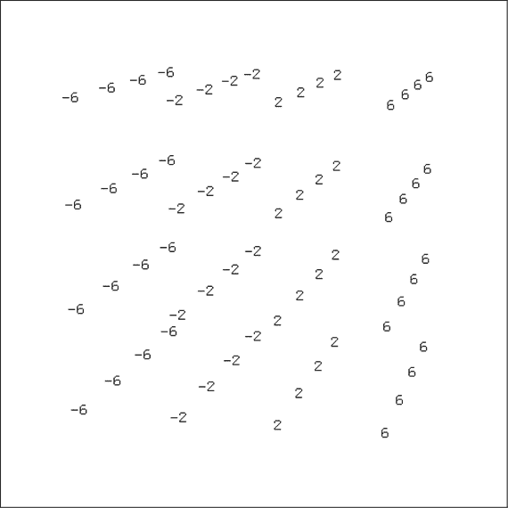

*图 22-4：使用程序 ySF3D 生成的 y 坐标标量场 ySF 的截图。鼠标和键盘可以用来放大或缩小以及旋转可视化，这是 Vis 模块的标准功能。*

由于电荷密度是标量场，因此在第二十四章定义电荷分布时，标量场将发挥重要作用。

物理学中使用的第二种场类型，可能更为重要的是向量场，接下来我们将讨论它。

### 向量场

*向量场*将一个向量与空间中的每个点关联起来。

```
type VectorField = Position -> Vec
```

在第二十五章和第二十七章，我们将分别讨论电场和磁场，它们是向量场。

当我们使用坐标系时，我们可以定义由坐标派生的向量场。与柱面和球坐标一起使用的单位向量，如、、和，实际上是*单位向量场*，因为它们的方向会根据空间中位置的不同而变化。

向量场和是通过方程 22.4 和 22.5 定义的。

```
sHat   :: VectorField
sHat   r = vec ( cos phi) (sin phi) 0
    where
      (_,phi,_) = cylindricalCoordinates r

phiHat :: VectorField
phiHat r = vec (-sin phi) (cos phi) 0
    where
      (_,phi,_) = cylindricalCoordinates r
```

图 22-5 展示了向量场`phiHat`的可视化。每个空间位置都与一个向量相关联，其尾部位于空间中的该点，且其大小和方向表示该点处向量的值。左侧的图片展示了三维中的向量场，其中*x*从页面向外，*y*向右增加，*z*向上增加。z 轴是`phiHat`向量场的对称中心轴。右侧的图片展示了 xy 平面中的向量场。由于`phiHat`是一个单位向量场，所有这些图片中的向量长度相同。图片清晰地展示了单位向量场在空间中不同位置指向不同方向。稍后在本章中，我将展示如何生成像这样的可视化图像。

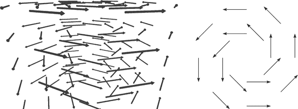

*图 22-5：可视化向量场或 phiHat 的两种方式。左侧是 phiHat3D 生成的图像截图，右侧是 phiHatPNG 生成的 xy 平面图像。*

下面是使用方程 22.10 和 22.11 对单位向量场和的定义：

```
rHat :: VectorField
rHat rv = let d = displacement origin rv
          in if d == zeroV
             then zeroV
             else d ^/ magnitude d

thetaHat :: VectorField
thetaHat r = vec ( cos theta * cos phi)
                 ( cos theta * sin phi)
                 (-sin theta         )
    where
      (_,theta,phi) = sphericalCoordinates r
```

我们将、和视为简单的单位向量（`Vec`），但我们将、和定义为单位向量场（`VectorField`），它们类似于、、和。

```
xHat :: VectorField
xHat = const iHat

yHat :: VectorField
yHat = const jHat

zHat :: VectorField
zHat = const kHat
```

一个重要的向量场不是单位向量场，它是向量场**r**，它将每个位置与从原点到该位置的位移向量相关联。我们将这个向量场命名为`rVF`。

```
rVF :: VectorField
rVF = displacement origin
```

函数`displacement`接受一个源位置`Position`和一个目标位置`Position`，并返回从源位置到目标位置的位移向量。通过在定义中省略目标位置，函数`rVF`接受一个目标位置作为输入，并输出一个位移向量，这正是我们想要的`VectorField`。

图 22-6 展示了矢量场`rVF`的可视化。两张图都显示了在 xy 平面中的矢量场。左图将每个矢量的尾部放置在它所关联的位置，并且通过较长的箭头显示较大幅度的矢量。右图将每个矢量的中心放置在它所关联的位置，并通过较暗的箭头显示较大幅度的矢量。

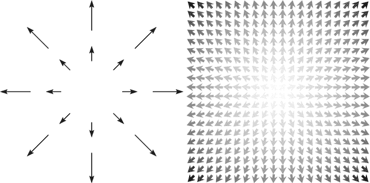

*图 22-6：两种在 xy 平面中可视化矢量场**r**（或 rVF）的方法。左图由 rVFpng 生成；右图由 rVFGrad 生成。*

本章后面，我们将介绍一些在给定矢量场作为输入时生成图像的函数，例如图 22-6 中的图像；然而，生成图像只是我们可以用矢量场做的几件事之一。矢量场具有两种导数，分别叫做*散度*和*旋度*，它们表示矢量场中矢量在空间中的变化情况。矢量场在曲线、表面和体积上的积分被用来提取信息并断言物理量之间的关系。在物理学中，将矢量场视为一个单一的数学实体是非常有用的。函数式语言在物理学中的一个优势就是，可以很容易地将矢量场作为单一实体进行处理和描述。本书旨在通过呈现一些函数，使得矢量场更加易于理解，并能让你与矢量场进行互动。

电场和磁场是电磁理论中最重要的矢量场，尽管电流密度也是在著名的麦克斯韦方程中出现的矢量场。我们将在第二十五章讨论电场，在第二十六章讨论电流密度，在第二十七章讨论磁场。

标量场和矢量场可以相加。以下是一些实现这一操作的函数：

```
addScalarFields :: [ScalarField] -> ScalarField
addScalarFields flds r = sum  [fld r | fld <- flds]

addVectorFields :: [VectorField] -> VectorField
addVectorFields flds r = sumV [fld r | fld <- flds]
```

我们将在第二十五章中使用这些函数来添加由多个源产生的电势和电场。现在，让我们来讨论如何可视化标量场和矢量场。

### 可视化标量场的函数

标量场将一个数值与空间中的每个点关联起来。标量场有许多可视化方式。我们将介绍两种：一种使用 Vis，另一种使用文本。

#### 3D 可视化

可视化标量场的一种简单方法是要求 Vis 在一系列位置上显示标量场的值。函数`sf3D`接受一个位置列表和一个标量场作为输入，并返回在屏幕上显示 3D 图像的操作。

```
sf3D :: [Position]   -- positions to use
     -> ScalarField  -- to display
     -> IO ()
sf3D ps sf
    = V.display whiteBackground $ orient $
      V.VisObjects [V.Text3d (show (round $ sf p :: Int))
                    (v3FromPos p) V.Fixed9By15 V.black
                        | p <- ps]
```

我们将传入的位置列表命名为`ps`，将传入的标量场命名为`sf`。我们使用列表推导来生成一系列图片，每个位置`p`对应一张图片。每张图片是显示该位置上标量场值的文本。值`sf p`表示在位置`p`处标量场`sf`的值`R`。值`round $ sf p :: Int`是将标量场值四舍五入后得到的`Int`。我们进行四舍五入，以便数字只占用较小的空间，并且在最终的图片中不会相互重叠。值`show (round $ sf p :: Int)`是我们传递给`Vis`的构造函数`V.Text3d`的`String`，该文本将显示在屏幕上。值`v3FromPos p`是`V3`（Vis 的本地向量类型），表示文本应该显示的位置。`v3FromPos`的定义与第十六章中的`v3FromVec`类似。

```
v3FromPos :: Position -> V3 R
v3FromPos p = V3 x y z
    where
      (x,y,z) = cartesianCoordinates p
```

`V.VisObjects`构造函数将一系列图片组合成一幅图像，我们通过`orient`将其定向为我最喜欢的坐标系，并使用`V.display`函数显示，使用一组名为`whiteBackground`的选项，这些选项我们将在下面定义。

选项集`whiteBackground`与`V.defaultOpts`的唯一区别在于背景颜色被设置为白色。

```
whiteBackground :: V.Options
whiteBackground = V.defaultOpts {V.optBackgroundColor = Just V.white}
```

这个定义使用记录语法来指定`V.Options`数据类型的所有字段应该与`V.defaultOpts`中的值相同，除了`V.optBackgroundColor`，其值被设置为白色。

如果你希望从代码中控制相机位置，可以添加相关选项。例如，选项集`whiteBackground'`将视点设置为距离中心 40 个 Vis 单位的距离。

```
whiteBackground' :: V.Options
whiteBackground'
    = V.defaultOpts {V.optBackgroundColor = Just V.white,
                     V.optInitialCamera   = Just V.Camera0 {V.rho0   = 40.0,
                                                            V.theta0 = 45.0,
                                                            V.phi0   = 20.0}}
```

下面是如何使用这个标量场可视化函数来处理*y*标量场`ySF`的示例：

```
ySF3D :: IO ()
ySF3D = sf3D [cart x y z | x <- [-6,-2..6]
                         , y <- [-6,-2..6]
                         , z <- [-6,-2..6]] ySF
```

图 22-4 显示了本章前面提到的结果图像。像图 22-4 这样的三维标量场可视化最有用的特点，可能是它帮助我们通过在空间的每个点上想象一个数字，来发展对标量场的视觉和几何理解。一旦我们掌握了这个几何概念，并且希望详细查看一个特定的标量场，通常使用二维可视化会更简单、更方便，接下来我们将描述这种方法。

#### 二维可视化

标量场的三维可视化可能会变得笨重且难以阅读，因此有必要使用工具将标量值显示在二维平面或表面上。我们的二维可视化函数将允许用户指定任何平面或表面进行聚焦。我们可以通过指定两个数字，表示二维可视化中的水平和垂直位置，如何映射到三维空间，换句话说，就是通过提供一个函数`(R,R) -> Position`来做到这一点。接下来的函数局部将该函数称为`toPos`。函数`sfTable`允许用户通过指定一个表面来可视化标量场，从而在该表面上查看标量场的值。

```
sfTable :: ((R,R) -> Position)
        -> [R]  -- horizontal
        -> [R]  -- vertical
        -> ScalarField
        -> Table Int
sfTable toPos ss ts sf
    = Table RJ [[round $ sf $ toPos (s,t) | s <- ss] | t <- reverse ts]
```

`sfTable`的第一个输入，局部称为`toPos`，指定了感兴趣的表面。例如，如果我们想指定 xz 平面，我们可以将函数`\(x,z) -> cart x 0 z`作为`toPos`的输入。

`sfTable`的第二和第三个输入，局部称为`ss`和`ts`，给出了标量值将显示的水平和垂直二维坐标。对于 xz 平面的可视化，水平值可以是 x 值，垂直值可以是 z 值。第四个输入是要可视化的标量场。

该函数通过在给定的点采样并显示标量场的值来工作。我们使用函数`toPos`从水平和垂直二维坐标的`(s,t)`对生成一个`Position`。然后，我们将标量场`sf`应用于此位置，并将其四舍五入，以避免在屏幕上占用过多空间。垂直坐标列表被反转，以便垂直值从表格底部开始，向上延伸。我们使用第二十章中的`Table`数据类型。

这是一个使用`sfTable`可视化 y 坐标标量场的示例：

```
Prelude> :l CoordinateSystems
[1 of 7] Compiling Newton2          ( Newton2.hs, interpreted )
[2 of 7] Compiling Mechanics1D      ( Mechanics1D.hs, interpreted )
[3 of 7] Compiling SimpleVec        ( SimpleVec.hs, interpreted )
[4 of 7] Compiling Mechanics3D      ( Mechanics3D.hs, interpreted )
[5 of 7] Compiling MultipleObjects  ( MultipleObjects.hs, interpreted )
[6 of 7] Compiling MOExamples       ( MOExamples.hs, interpreted )
[7 of 7] Compiling CoordinateSystems ( CoordinateSystems.hs, interpreted )
Ok, 7 modules loaded.
*CoordinateSystems> sfTable (\(x,y) -> cart x y 0) [-6,-2..6] [-6,-2..6] ySF
  6  6  6  6
  2  2  2  2
 -2 -2 -2 -2
 -6 -6 -6 -6
```

我们可以使用二维标量场可视化来显示房间中的温度或电容器中的电势，例如。

### 可视化向量场的函数

向量场将一个向量与空间中的每个位置关联起来。在本节中，我们将编写三个用于可视化向量场的函数：`vf3D`、`vfPNG` 和 `vfGrad`。

这些函数本质上具有类型`VectorField -> IO ()`，意味着它们接受一个向量场作为输入并执行某些操作，无论是显示一张图像在屏幕上，还是在硬盘上生成一个图形文件。

#### 3D 可视化

`Vis`模块可以生成一个向量场的三维可视化。基本思路是选择一个位置列表，在这些位置显示向量。我们使用向量场计算每个列出位置的向量，然后在该位置显示该向量及其尾部。向量场的单位通常与位置的单位（米）不同，因此我们需要一个缩放因子来指定每米空间应显示的向量场单位数。以下是实现此功能的`vf3D`函数代码。

```
vf3D :: R            -- scale factor, vector field units per meter
     -> [Position]   -- positions to show the field
     -> VectorField  -- vector field to display
     -> IO ()
vf3D unitsPerMeter ps vf
    = V.display whiteBackground $ orient $
      V.VisObjects [V.Trans (v3FromPos p) $
                    visVec V.black (vf p ^/ unitsPerMeter)
                        | p <- ps]
```

函数`vf3D`接受一个缩放因子、一组位置和一个向量场作为输入，并生成一个可在屏幕上放大和旋转的图像。如同`sf3D`一样，该函数使用列表推导式生成一个图片列表，每个位置`p`对应一个图片。每个图片都是一个黑色箭头，由下文定义的`visVec`函数生成，表示位置`p`处的向量，适当地缩放并平移到正确的位置。`V.VisObjects`构造函数将这些图片组合成一幅单一的图像，并使用`orient`将其朝向调整为我最喜欢的坐标系，最后使用本章早些时候定义的`whiteBackground`选项，通过`V.display`函数显示出来。

`visVec`函数接受一个颜色和一个向量作为输入，并生成一个箭头的图片作为输出。以下是代码：

```
visVec :: V.Color -> Vec -> V.VisObject R
visVec color v = let vmag = magnitude v
                 in V.Arrow (vmag,20*vmag) (v3FromVec v) color
```

该函数使用`Vis`的`V.Arrow`构造函数来生成一个向量的图片。`V.Arrow`的第一个参数是一个数字对。第一个数字是请求的箭头长度，我们选择`vmag`，即输入向量的大小。第二个数字是箭头长度与箭杆直径的纵横比。我选择了`20*vmag`，因为我希望箭头具有统一的箭杆直径。箭杆直径是箭头长度`vmag`除以纵横比`20*vmag`，其值为 1/20，与箭头长度无关。

`V.Arrow`的第二个参数是`Vis`的原生`V3`类型中的一个向量，用来指定箭头的方向。我们传递`v3FromVec v`，即将输入向量转换为`V3`类型。`V.Arrow`的第三个也是最后一个参数是颜色，我们直接传递给`visVec`的输入颜色。

以下程序使用`vf3D`函数生成一个单位向量场的可视化图，该单位向量场在本章早些时候已定义为`phiHat`：

```
phiHat3D :: IO ()
phiHat3D = vf3D 1 [cyl r ph z | r  <- [1,2,3]
                              , ph <- [0,pi/4..2*pi]
                              , z  <- [-2..2]] phiHat
```

本章前面的图 22-5 的左侧显示了`phiHat3D`生成的图像截图。屏幕上的图像是交互式的，可以用鼠标旋转和缩放。

有时候，向量场的三维可视化可能显得杂乱无章，因此我们需要工具来显示向量场的二维切片。右侧的图 22-5 展示了这样的二维可视化，接下来我们将介绍如何制作这种图像。

#### 2D 可视化

我们怎么能期望在二维中可视化三维向量场呢？一般来说，我们做不到。即使我们将注意力限制在三维空间的一个平面上，比如 xy 平面，向量仍然可能有 z 分量，导致它们无法在 xy 平面上表示。然而，向量场中有足够多的例子，在某些平面中，向量指向*平面内*，因此二维可视化仍然是值得尝试的。

与 2D 标量场可视化类似，我们编写的函数将接受一个名为`toPos`的参数，类型为`(R,R) -> Position`，它将我们提供的二维坐标映射到 3D `Position`。在我们收集了平面位置的向量之后，我们需要第二个函数来指定如何将这些 3D 向量视为平面中的 2D 向量。我们可以使用一个`Vec -> (R,R)`的函数，我们将其命名为本地变量`fromVec`。

我们本可以使用 gloss 进行 2D 向量场可视化，但由于我们可能希望有一个用于异步动画的平台（这是我们在第二十章中首次探讨的内容），我们将改为使用一个名为 diagrams 的图形库，该库生成 PNG 文件，这些文件可以拼接成异步动画。我们即将编写的`vfPNG`函数接受`VectorField`作为输入，以及一些其他参数，并生成一个 PNG 文件。

```
vfPNG :: ((R,R) -> Position)
      -> (Vec -> (R,R))
      -> FilePath    -- file name
      -> R           -- scale factor in units per meter
      -> [(R,R)]     -- positions to use
      -> VectorField
      -> IO ()
vfPNG toPos fromVec fileName unitsPerMeter pts vf
    = let vf2d = r2 . fromVec . (^/ unitsPerMeter) . vf . toPos
          pic  = mconcat [arrowAt (p2 pt) (vf2d pt) | pt <- pts]
      in renderCairo fileName (dims (V2 1024 1024)) pic
```

该函数接受五个项目作为输入，然后是我们希望显示的向量场。前两个项目是分别名为`toPos`和`fromVec`的函数，它们管理 2D 和 3D 向量场之间的连接。第三个项目是 PNG 文件的文件名。第四个是一个比例因子，单位为（向量场）每米的单位，用于控制显示向量的长度。第五个项目是我们希望显示向量的 2D 点列表。最后，第六个项目是向量场本身。

本地函数`vf2d`是五个函数的组合。它接受一个 2D 点作为输入，并生成一个 2D 向量作为输出，其类型是图形所需的用于定位箭头的类型。从 2D 位置`(R,R)`开始，函数`vf2d`首先应用`toPos`，这是`vfPNG`的用户提供的函数，用于将 2D 位置转换为`Position`。然后应用向量场`vf`以生成一个`Vec`。此向量会被比例因子`unitsPerMeter`缩放，接着函数`fromVec`将`Vec`转换为表示 2D 向量的一对实数。最后，图形的`r2`函数将一对实数`(R,R)`转换为图形的 2D 向量类型。

本地变量`pic`用于显示图片，该图片是通过结合一个箭头图片列表形成的，该列表是通过列表推导式生成的。每个箭头图片是通过图形的`arrowAt`函数制作的，该函数将 2D 向量的尾部放置在其第二个参数中的位置，在第一个参数中给定的 2D 位置处。图形包区分了 2D 位置，该位置由一对数字及其`p2`函数形成，以及 2D 向量，该向量由一对数字及其`r2`函数形成。

`vfPNG`中的最后一行通过图形的`renderCairo`函数生成 PNG 文件，该函数接受文件名、像素大小和图片作为输入。

如果 xy 平面恰好是我们感兴趣的平面，我们可以通过提供`vfPNG`的前两个参数来编写一个辅助函数。函数`vfPNGxy`会提供这两个参数：

```
vfPNGxy :: FilePath    -- file name
        -> R           -- scale factor
        -> [(R,R)]     -- positions to use
        -> VectorField
        -> IO ()
vfPNGxy = vfPNG (\(x,y) -> cart x y 0) (\v -> (xComp v, yComp v))
```

`vfPNG`函数本地调用的`toPos`函数在此处被指定为将 `(x, y)` 对映射到 xy 平面的函数。`vfPNG`函数本地调用的`fromVec`函数则将 3D 向量投影到 xy 平面。

以下程序生成一个 PNG 文件，表示向量场 ，或称为`phiHat`，这是一个在柱面坐标和球面坐标中与坐标*ϕ*对应的单位向量场：

```
phiHatPNG :: IO ()
phiHatPNG
    = vfPNGxy "phiHatPNG.png" 1
      [(r * cos ph, r * sin ph) | r  <- [1,2]
                                , ph <- [0,pi/4..2*pi]] phiHat
```

本章前面图 22-5 右侧展示了由`phiHatPNG`生成的向量场 。

以下是生成本章前面介绍的向量场`rVF`的 PNG 图像的代码：

```
rVFpng :: IO ()
rVFpng
    = vfPNGxy "rVFpng.png" 2
      [(r * cos ph, r * sin ph) | r  <- [1,2]
                                , ph <- [0,pi/4..2*pi]] rVF
```

本章前面图 22-6 左侧展示了结果图像。

物理学家至少使用符号**r**三种方式。它可以表示一个单一的位移向量，我们称之为`Vec`。它还可以表示一个位置函数，就像我们在第二部分中处理的那样，给定时间后返回一个位置。在第二部分中，这个位置函数的类型是`R -> Vec`，因为当时位置被看作是一个向量。现在我们有了位置的数据类型，因此这样的函数的类型是`R -> Position`。符号**r**的第三种用法是我们刚刚介绍的向量场。这具有类型`VectorField`，它是`Position -> Vec`的类型同义词。类型系统有助于澄清符号**r**的这三种用法是不同的。

在我们离开向量场可视化话题之前，我们需要再看一种可视化方法。

#### 梯度可视化

当我们可视化电场和磁场时（我们将在接下来的几章中进行），向量的大小在短距离内可能会发生巨大的变化。因此，将向量的大小表示为箭头的长度可能会产生繁琐的图像。另一种选择是使用阴影来表示大小，并用短粗箭头表示方向。我将这种向量场可视化方式称为*梯度可视化*。

我们下面定义的`vfGrad`函数接受一个向量场以及一些其他参数，并生成一个 PNG 文件。

```
vfGrad :: (R -> R)
       -> ((R,R) -> Position)
       -> (Vec -> (R,R))
       -> FilePath
       -> Int    -- n for n x n
       -> VectorField
       -> IO ()
vfGrad curve toPos fromVec fileName n vf
 ➊ = let step = 2 / fromIntegral n
       ➋ xs = [-1+step/2, -1+3*step/2 .. 1-step/2]
       ➌ pts = [(x, y) | x <- xs, y <- xs]
       ➍ array = [(pt,magRad $ fromVec $ vf $ toPos pt) | pt <- pts]
       ➎ maxMag = maximum (map (fst . snd) array)
       ➏ scaledArrow m th = scale step $ arrowMagRad (curve (m/maxMag)) th
       ➐ pic = position [(p2 pt, scaledArrow m th) | (pt,(m,th)) <- array]
    ➑ in renderCairo fileName (dims (V2 1024 1024)) pic
```

`vfGrad`的第一个参数是一个单调函数`curve`，将单位区间[0, 1]映射到自身。该参数的目的是为可能出现某些位置的向量场在某些位置具有非常大的大小，而在其他地方具有较小的大小的情况提供调整。最大的大小的向量将被着色为黑色，最接近零的将被着色为白色。有时，线性缩放会导致在源附近有黑色向量，而其他地方全是白色向量。在这种情况下，使用类似立方根或五次根的幂律可以增强较小的大小，使得从黑到白的连续过渡变得明显。我们可以通过恒等函数`id`实现线性缩放，通过`(**0.2)`实现五次根缩放。

下一个参数，局部名称为`toPos`和`fromVec`，与函数`vfPNG`中的相同。然而，在这个函数中，`toPos`起到了双重作用，因为`vfGrad`不要求提供一组位置来显示向量。相反，`vfGrad`显示的是从（–1, –1）到（1, 1）的正方形。这个正方形必须映射到三维空间中的某个正方形，显示出该正方形上的向量。如果我们想在 xy 平面上看到一个角落坐标为（–10, –10, 0）和（10, 10, 0）的正方形，我们会将函数`\(x,y) -> cart (10*x) (10*y) 0`传入`toPos`。

参数`fileName`是 PNG 文件的文件名。参数`n`是一个整数，指定每个方向上箭头的数量。例如，传入 20 将生成一个 20x20 箭头的图像。最后一个输入`vf`是向量场本身。

函数`vfGrad`由多个局部定义组成，构建出一个图片`pic` ➐，然后跟随与`vfPNG`中相同的`renderCairo`语句 ➑来生成 PNG 文件。`let`子句中的前三行 ➊ ➋ ➌ 用于选择在其中对向量场进行采样和显示的点`pts`。接下来的第➍行定义了`array`（类型为`[((R,R),(R,R))]`）作为点对和二维向量的列表。我们通过应用`toPos`将点`pt`转换为三维`Position`，然后应用向量场`vf`，再使用`fromVec`将三维向量转换为二维向量，最后应用下文定义的`magRad`将二维向量表示为大小-角度形式。

局部变量 `maxMag` ➎ 搜索列表 `array`，找到所有向量中最大的幅度。具有此幅度的向量将被着色为黑色。局部函数 `scaledArrow` ➏ 描述了如何从幅度 `m` 和角度 `th` 制作单个箭头的图像。它通过将幅度 `m` 除以最大幅度 `maxMag` 来归一化幅度 `m`，从而得到一个介于 0 和 1 之间的归一化幅度。然后，该归一化幅度通过 `curve` 函数进行缩放或弯曲，该函数是一个单调函数，将单位区间 0，[1] 映射到自身。归一化并缩放后的幅度与角度一起传递给下文定义的 `arrowMagRad` 函数，以生成箭头图像。最后，代码根据请求的箭头数量调整箭头的大小。我们通过列表推导式形成最终的图像 `pic` ➐，将每个箭头放置在适当的位置。

函数 `magRad` 将一对笛卡尔坐标转换为极坐标，角度以弧度表示。

```
magRad :: (R,R) -> (R,R)
magRad (x,y) = (sqrt (x*x + y*y), atan2 y x)
```

函数 `arrowMagRad` 根据归一化幅度（范围从 0 到 1）和以弧度表示的角度生成一个箭头的图像。

```
-- magnitude from 0 to 1
arrowMagRad :: R  -- magnitude
            -> R  -- angle in radians, counterclockwise from x axis
            -> Diagram B
arrowMagRad mag th
    = let r      = sinA (15 @@ deg) / sinA (60 @@ deg)
          myType = PolyPolar [120 @@ deg, 0 @@ deg, 45 @@ deg, 30 @@ deg,
                              45 @@ deg, 0 @@ deg, 120 @@ deg]
                   [1,1,r,1,1,r,1,1]
          myOpts = PolygonOpts myType NoOrient (p2 (0,0))
      in scale 0.5 $ polygon myOpts # lw none # fc (blend mag black white) #
         rotate (th @@ rad)
```

该函数将箭头的形状定义为一个多边形，并根据归一化幅度选择颜色。归一化幅度为 1 时生成黑色箭头，幅度为 0 时生成白色箭头，介于两者之间的数字则生成灰色的不同阴影。

这是 **r** 向量场（或 `rVF`）的梯度可视化示例：

```
rVFGrad :: IO ()
rVFGrad = vfGrad id
          (\(x,y) -> cart x y 0)
          (\v -> (xComp v,yComp v))
          "rVFGrad.png" 20
          rVF
```

本章前面 图 22-6 右侧显示了由 `rVFGrad` 生成的向量场 **r**，或 `rVF`。

### 摘要

本章介绍了场的概念，场是从三维空间中的位置到某个值的函数。标量场和向量场是电磁理论中最重要的两种场。我们介绍了几种可视化标量场和向量场的方法，并探讨了三维空间的坐标系统，特别是圆柱坐标和球坐标系统。然后我们编写了一个新的数据类型来表示位置。

由于电磁理论具有几何性质，下一章将介绍几何对象（如曲线、表面和体积）的数据类型。

### 习题

**习题 22.1.** 证明极坐标单位向量构成一个正交归一系统。正交归一意味着既正交（不同的向量彼此垂直），又归一化（每个向量的长度为 1）。换句话说，证明

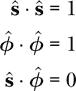

**习题 22.2.** 将  和  用  和  表示。你的结果应包含 *s*、*ϕ*、 和 ，但不包含 *x* 或 *y*。

**习题 22.3.** 证明球坐标单位向量构成一个正交归一系统。换句话说，证明

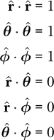

**习题 22.4.** 将、和用、和表示。你的结果可以包含*r*、*θ*、*ϕ*、、和，但不能包含*x*、*y*或*z*。

**习题 22.5.** 定义一个坐标标量场。

```
thetaSF :: ScalarField
thetaSF = undefined
```

对于球坐标系中的*θ*坐标。

**习题 22.6.** 使用 3D 可视化生成矢量场或`thetaHat`的图像。

```
thetaHat3D :: IO ()
thetaHat3D = undefined
```

**习题 22.7.** 使用`vf3D`函数可视化矢量场**r**，或`rVF`。你可能需要使用大于 1 的比例因子，以防箭头重叠。较大的比例因子会缩小箭头，因为比例因子是以每米为单位的。

**习题 22.8.** 使用梯度矢量场可视化技术，在 xz 平面上生成矢量场或`thetaHat`的图像。在下面的第一个`undefined`中，你需要说明如何将一对坐标映射到一个`Position`，知道你关注的是 xz 平面。在第二个`undefined`中，你需要说明如何将一个`Vec`映射到一对数字，这对数字描述了要显示的矢量的两个分量。

```
thetaHatGrad :: IO ()
thetaHatGrad = vfGrad id undefined undefined "thetaHatGrad.png" 20 thetaHat
```

**习题 22.9.** 使用梯度矢量场可视化技术，在 xy 平面上生成矢量场或`phiHat`的图像。

```
phiHatGrad :: IO ()
phiHatGrad = undefined
```
