## 23

曲线、表面和体积


电动力学是一个几何学科。在电磁学理论中，曲线、表面和体积扮演着双重角色。它们是电荷和电流可能存在的地方，并且在麦克斯韦方程的形成中起着至关重要的作用，麦克斯韦方程是现代电磁场如何产生以及如何随时间演变的表达式。

在我们深入研究麦克斯韦方程之前，我们需要为曲线、表面和体积构建数据类型——我们将在本章中构建它们。曲线可以通过给定从单一实数参数到空间位置的函数来指定。表面可以通过给定从一对实数到空间位置的函数来指定。体积可以通过给定从三元数到空间位置的函数来指定。这些数学参数化自然地导致数据类型定义。我们将用适当的边界包装这些参数化，形成 `Curve`、`Surface` 和 `Volume` 类型。

让我们从一些入门代码开始。

### 入门代码

清单 23-1 显示了我们将在本章中开发的 `Geometry` 模块的入门代码。

```
{-# OPTIONS -Wall #-}

module Geometry where

import SimpleVec ( R, Vec, (*^) )
import CoordinateSystems ( Position, cylindrical, spherical, cart, cyl, sph
                         , shiftPosition, displacement )
```

*清单 23-1：几何模块的开头代码行*

我们将使用在 第二十二章 的 `CoordinateSystems` 模块中定义的 `Position` 类型及相关函数，因此我们已经导入了这些类型和函数，以及从 第十章 的 `SimpleVec` 模块中导入的一些类型和函数。

我们的第一个几何对象是嵌入三维空间的一维曲线。

### 曲线

曲线在电磁学理论中有两种不同的用途。首先，我们用它们来描述电荷和电流所存在的位置。电流可以沿着一条曲线在导线中流动。静电荷也可以沿曲线分布。

第二个用途是安培定律，它揭示了空间中一条闭合曲线（一个回路）沿着的磁场与穿过以该闭合曲线为边界的表面的电流之间的关系。曲线的第二个用途更加抽象，因为曲线不需要是任何实际物质的位置，但它对于深入理解现代电磁理论也更为重要。

#### 曲线的参数化

我们如何描述空间中的曲线？我们可以对曲线进行参数化，使每个曲线上的点都有一个实数对应，然后通过一个函数给出与每个参数值相关的空间位置。例如，沿 y 轴的直线可以通过以下函数进行参数化：

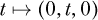

一个半径为 2 的圆，位于 xy 平面并以原点为圆心，可以通过以下函数来参数化：


在这些函数中，*t* 仅作为参数的名称（我们可以选择 *s* 或任何方便的符号），与时间无关。

因此，一个参数化的曲线需要一个类型为`R ->` `Position`的函数，将参数`t :: R`沿着曲线发送到空间中的某个点`r :: Position`。但是我们还需要曲线的起始和结束点。例如，xy 平面中半径为 2、以原点为圆心的圆可以用以下函数来指定：

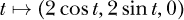

以及起始参数*t[a]* = 0 和结束参数*t[b]* = 2*π*。如果我们使用相同的函数和起始参数，但将结束参数更改为*t[b]* = *π*，我们将得到一个半圆（位于 x 轴上方的半圆）。

起始点和结束点可以通过起始参数`startingCurveParam :: R`（我们之前称之为*t[a]*）和结束参数`endingCurveParam :: R`（我们之前称之为*t[b]*）来指定。因此，我们用三部分数据来指定曲线：一个函数、一个起始参数和一个结束参数。

数据类型可以用来组合那些本应属于同一组的数据。对于曲线来说，拥有一个单一类型`Curve`，其中包含函数、起始点和结束点将非常方便。

```
data Curve = Curve { curveFunc          :: R -> Position
                   , startingCurveParam :: R  -- t_a
                   , endingCurveParam   :: R  -- t_b
                   }
```

数据类型`Curve`有一个单一的数据构造函数，也叫做`Curve`。

#### 曲线示例

让我们编码一个半径为 2 的圆的例子，这个圆位于 xy 平面，且以原点为圆心。

```
circle2 :: Curve
circle2 = Curve (\t -> cart (2 * cos t) (2 * sin t) 0) 0 (2*pi)
```

我们将曲线命名为 circle2，以提醒我们半径为 2。参数化 23.1 作为数据构造函数`Curve`的第一个参数，后面跟着起始和结束的曲线参数。

在 xy 平面中，以原点为圆心的圆在圆柱坐标系下比在笛卡尔坐标系下更容易表示。在圆柱坐标系中，我们的圆有常数值*s* = 2 和*z* = 0。只有*ϕ*坐标从 0 变化到 2*π*。这意味着我们可以使用*ϕ*坐标作为曲线的参数。

```
circle2' :: Curve
circle2' = Curve (\phi -> cyl 2 phi 0) 0 (2*pi)
```

我们使用 cyl 函数来指定圆柱坐标系中的曲线。曲线`circle2'`与曲线 circle2 相同。

这是单位圆的定义：

```
unitCircle :: Curve
unitCircle = Curve (\t -> cyl 1 t 0) 0 (2 * pi)
```

有些曲线族需要我们在定义特定曲线之前提供额外的信息。直线段就是这样的曲线。我们需要提供起始位置和结束位置，而这正是高阶函数的完美任务。

```
straightLine :: Position  -- starting position
             -> Position  -- ending position
             -> Curve     -- straight-line curve
straightLine r1 r2 = let d = displacement r1 r2
                         f t = shiftPosition (t *^ d) r1
                     in Curve f 0 1
```

我们定义局部变量`d`为位移向量，从位置`r1`指向位置`r2`。我们还通过使用`shiftPosition`函数来定义一个局部函数`f`作为我们的曲线函数，该函数选取从`r1`通过位移向量`t *^ d`平移得到的位置。曲线参数`t`的范围从`0`到`1`，因此`t *^ d`是位移向量`d`的一个缩放版本，从长度 0 到`d`的完整长度。

我们已经看到了如何在 Haskell 中描述一维曲线。现在让我们提升一个维度，来讨论曲面。

### 曲面

在电磁理论中，曲面有两个不同的用途。我们用它们来描述电荷和电流所在的地方。电流可以沿着曲面流动。静电荷也可以放置在曲面上。

我们还在高斯定律中使用它们，后者阐明了空间中闭合曲面上的电场与该曲面内电荷之间的关系。曲面的第二种用途更加抽象，因为表面不必是任何实际物质的所在，但对于深入理解现代电磁理论，它也更加重要。

#### 参数化曲面

曲面是从两个参数到空间的参数化函数。例如，我们可以用两个参数*θ*和*ϕ*对单位球体进行参数化，作为函数

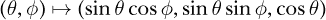

并且范围为 0 ≤ *θ* ≤ *π*和 0 ≤ *ϕ* ≤ 2*π*。

作为第二个示例，假设我们要对位于 xy 平面上的表面进行参数化，该表面由抛物线*y* = *x*²和直线*y* = 4 所限定。此表面如图 23-1 所示。

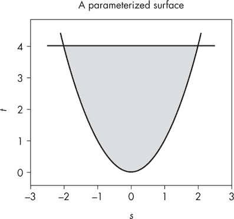

*图 23-1：一个参数化的表面*

在这种情况下，使用*x*和*y*作为参数是有意义的。这个表面的参数化函数并不特别令人兴奋：

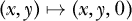

这个曲面有趣的地方在于边界的指定。有一个下界曲线*y* = *x*²给出了底部边界，一个上界曲线*y* = 4 给出了顶部边界，一个下限*x* = –2 指定了左边界，一个上限*x* = 2 指定了右边界。

对于一般的曲面，我们将把两个参数称为*s*和*t*。（这个参数*s*与第二十二章中讨论的圆柱坐标的*s*无关。）为了指定一个一般的曲面，我们必须提供五个数据项：两个变量的参数化函数、下界曲线、上界曲线、下限和上限。以下是一般曲面数据类型的定义：

```
data Surface = Surface { surfaceFunc :: (R,R) -> Position
                       , lowerLimit  :: R       -- s_l
                       , upperLimit  :: R       -- s_u
                       , lowerCurve  :: R -> R  -- t_l(s)
                       , upperCurve  :: R -> R  -- t_u(s)
                       }
```

函数 surfaceFunc 是一个参数化函数，将(*s*,*t*)映射到一个`Position`。下界曲线作为一个函数*t[l]*(*s*)给出，它为每个*s*值提供曲面上*t*的最小值。上界曲线作为一个函数*t[u]*(*s*)给出，它为每个*s*值提供曲面上*t*的最大值。下限*s[l]*是曲面上*s*的最小值，上限*s[u]*是曲面上*s*的最大值。

#### 曲面的示例

要编码我们之前讨论的单位球体，可以写出以下内容：

```
unitSphere :: Surface
unitSphere = Surface (\(th,phi) -> cart (sin th * cos phi)
                                        (sin th * sin phi)
                                        (cos th))
                     0 pi (const 0) (const $ 2*pi)
```

在这种情况下，我们希望为下界和上界曲线使用常数函数，因此我们使用 const 函数将一个数字转换为常数函数，并使用`$`运算符避免在`2*pi`周围使用括号。

不出所料，在球坐标中指定单位球体更为简单。

```
unitSphere' :: Surface
unitSphere' = Surface (\(th,phi) -> sph 1 th phi)
                      0 pi (const 0) (const $ 2*pi)
```

在球坐标中，我们使用相同的参数（*θ*，*ϕ*），相同的上下曲线，以及相同的限制条件。只有参数化函数发生了变化。表面`unitSphere'`与 unitSphere 是相同的表面。

让我们对图 23-1 中的抛物面进行编码。

```
parabolaSurface :: Surface
parabolaSurface = Surface (\(x,y) -> cart x y 0)
                          (-2) 2 (\x -> x*x) (const 4)
```

我们使用匿名函数来指定表面的参数化以及抛物线下边界曲线。

那么，如何处理一个以任意位置为中心且具有任意半径的球体呢？我们可以手动对其进行参数化，但不如定义一个函数来移动任意表面的位置。这个函数似乎非常有用。

```
shiftSurface :: Vec -> Surface -> Surface
shiftSurface d (Surface g sl su tl tu)
    = Surface (shiftPosition d . g) sl su tl tu
```

`shiftSurface`函数不会改变正在使用的参数的限制条件。相反，它会通过位移向量`d`来移动参数化函数`g`所提供的位置。

接下来，我们定义一个具有任意半径的中心球面。

```
centeredSphere :: R -> Surface
centeredSphere r = Surface (\(th,phi) -> sph r th phi)
                           0 pi (const 0) (const $ 2*pi)
```

最后，我们定义一个具有任意中心和任意半径的球面。

```
sphere :: R -> Position -> Surface
sphere radius center
    = shiftSurface (displacement (cart 0 0 0) center)
      (centeredSphere radius)
```

这是单位球体的北半球：

```
northernHemisphere :: Surface
northernHemisphere = Surface (\(th,phi) -> sph 1 th phi)
                             0 (pi/2) (const 0) (const $ 2*pi)
```

这是一个位于 xy 平面上的圆盘，中心在原点：

```
disk :: R -> Surface
disk radius = Surface (\(s,phi) -> cyl s phi 0)
                      0 radius (const 0) (const (2*pi))
```

我认为“单位圆锥”这个术语不是标准术语，但这里是一个圆锥，其中底面的圆形边界位于单位球面上，圆锥的顶点位于球心：

```
unitCone :: R -> Surface
unitCone theta = Surface (\(r,phi) -> sph r theta phi)
                         0 1 (const 0) (const (2*pi))
```

这些表面，或者你自己写的表面，可以在第二十四章中用于形成一个电荷分布，其中电荷分布在表面上，或者在第二十六章中用于形成一个电流分布，其中电流流过表面。闭合表面，例如球面，可以与高斯定律一起使用。

#### 定向

我们的表面是有方向的表面。*定向*是选择哪个方向（垂直于表面）被视为“正方向”。如果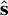是指向* s *增大的方向的单位向量，且是指向*t*增大的方向的单位向量，则定向的正方向是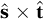。（用于指定表面及其相关单位向量的参数*s*与圆柱坐标*s*及其相关单位向量无关。上下文应该能明确表示是哪一个。）表面的定向在通量积分中非常重要，通量积分用于计算通过表面的电通量、磁通量和电流。

让我们来确定 `unitSphere` 的方向。我们使用球坐标来参数化这个表面，第一个参数（通常称为 *s*）是单位球的 *θ*，第二个参数（通常称为 *t*）是单位球的 *ϕ*。因此，如 图 23-2 所示，单位球的方向是正向的，指向 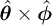 方向。在球面坐标中，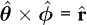，这意味着“朝外”是单位球的正方向。

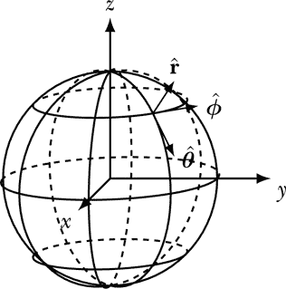

*图 23-2：当第一个参数 s 是 *θ* 且第二个参数 t 是 *ϕ* 时，方向是 ，与 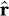 相同，因此方向是朝外的。*

我们可以做一个单位球体，将“朝内”作为方向，但我们需要与 `unitSphere` 不同的参数化方法。如果我们将 *ϕ* 作为第一个参数，*θ* 作为第二个参数，那么方向是朝内的。

### 体积

当我们有一个分布在体积中的电荷时，我们将使用体积电荷密度来描述它；因此，我们需要一个新的数据类型来描述体积。我们需要指定七个数据项来描述一个体积：

1\. 一个从三个参数 (*s*,*t*,*u*) 到空间的参数化函数

2\. 一个下表面 *u[l]*(*s*,*t*)，描述每个 (*s*,*t*) 对应的 *u* 的最小值

3\. 一个上表面 *u[u]*(*s*,*t*)，描述每个 (*s*,*t*) 对应的 *u* 的最大值

4\. 一个下曲线 *t[l]*(*s*)，描述每个 *s* 值对应的 *t* 的最小值

5\. 一个上曲线 *t[u]*(*s*)，描述每个 *s* 值对应的 *t* 的最大值

6\. 一个下限 *s[l]*，描述 *s* 的最小值

7\. 一个上限 *s[u]*，描述 *s* 的最大值

这是 `Volume` 数据类型的定义：

```
data Volume = Volume { volumeFunc :: (R,R,R) -> Position
                     , loLimit    :: R            -- s_l
                     , upLimit    :: R            -- s_u
                     , loCurve    :: R -> R       -- t_l(s)
                     , upCurve    :: R -> R       -- t_u(s)
                     , loSurf     :: R -> R -> R  -- u_l(s,t)
                     , upSurf     :: R -> R -> R  -- u_u(s,t)
                     }
```

给定 `Volume` 的 volumeFunc 类型为 `(R,R,R) -> Position`。回想一下在 第二十二章 中提到的，这个类型与 `CoordinateSystem` 是相同的。我们通常会使用笛卡尔坐标系、圆柱坐标系或球面坐标系作为我们的 volumeFunc，尽管你也可以发明自己的坐标系统。

这是一个以原点为中心的单位球：

```
unitBall :: Volume
unitBall = Volume spherical 0 1 (const 0) (const pi)
                  (\_ _ -> 0) (\_ _ -> 2*pi)
```

对于 volumeFunc，我们使用球面坐标系，这意味着参数 (*s*,*t*,*u*) 是球坐标系中的 (*r*,*θ*,*ϕ*)。我们必须提供下限 *r[l]*、上限 *r[u]*、下曲线 *θ[l]*(*r*)、上曲线 *θ[u]*(*r*)、下表面 *ϕ[l]*(*r*,*θ*) 和上表面 *ϕ[u]*(*r*,*θ*)。对于一个球体，我们应该选择以下内容：

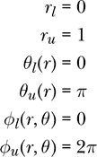

请注意，*θ[l]* 是函数 *r* ↦ 0（在 Haskell 表示法中为 `\r -> 0` 或 `\_ -> 0`）。这与返回 0 的常数函数相同（在 Haskell 表示法中为 const 0）。函数 *ϕ[l]* 接受 *两个* 输入并返回 0（在 Haskell 表示法中为 `\_ _ -> 0`）。

这是一个圆柱体，底面圆心位于原点，顶部圆面位于*z* = *h*平面。我们将圆柱的半径和高度作为输入传递给函数`centeredCylinder`。

```
centeredCylinder :: R       -- radius
                 -> R       -- height
                 -> Volume  -- cylinder
centeredCylinder radius height
  = Volume cylindrical 0 radius (const 0) (const (2*pi))
           (\_ _ -> 0) (\_ _ -> height)
```

这些体积，或你编写的体积，可以在第二十四章中用于形成一个电荷分布，在其中电荷分布在整个体积内，或者在第二十六章中用于形成一个电流分布，在其中电流流经整个体积。

### 总结

在本章中，我们开发了`Curve`、`Surface`和`Volume`数据类型，用于描述几何体。我们定义了一些特定的几何体，比如`unitCircle`、`sphere`和`unitBall`。这些曲线、表面和体积将成为我们积分以计算电场的对象，它们也将作为高斯定律和安培定律的抽象背景。下一章将讨论电荷分布，为接下来的电场章节做准备。

### 练习题

**练习 23.1.** 替换下面未定义的半径 r，给出一个定义，该定义将接受一个中心位置和半径，并生成一个与 xy 平面平行的圆。

```
circle :: Position  -- center position
       -> R         -- radius
       -> Curve
circle r radius = undefined r radius
```

**练习 23.2.** 螺旋线最容易用圆柱坐标参数化。在圆柱坐标系（*s*,*ϕ*,*z*）中，半径为 1 的螺旋线可以参数化为

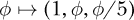

为这个螺旋线定义一个`Curve`。选择端点使得螺旋线围绕中心旋转五圈。

**练习 23.3.** 一个正方形有四条边。让我们定义一个`Curve`来表示一个顶点为（–1,–1,0）、（1,–1,0）、（1,1,0）和（–1,1,0）的正方形。使曲线的方向为逆时针。填写`undefined`部分。

```
square :: Curve
square = Curve squareFunc 0 4

squareFunc :: R -> Position
squareFunc t
    |           t < 1  = cart undefined   (-1)   0
    | 1 <= t && t < 2  = cart     1    undefined 0
    | 2 <= t && t < 3  = cart undefined     1    0
    | otherwise        = cart   (-1)   undefined 0
```

**练习 23.4.** 为一个高度为*h*，半径为*r*的圆锥体定义一个`Surface`。不要包括圆锥底面的表面。你可以根据需要调整圆锥的位置和方向。

**练习 23.5.** 替换下面未定义的部分，给出一个半径为单位的上半球（*z* ≥ 0）的定义，球心位于原点。

```
northernHalfBall :: Volume
northernHalfBall = undefined
```

**练习 23.6.** 替换下面的`undefined`部分，给出一个给定半径并以原点为中心的球体的定义。（`R`是半径的类型，你可能想要在等号左侧放一个半径的变量。）

```
centeredBall :: R -> Volume
centeredBall = undefined
```

**练习 23.7.** 在之前给出的`shift` `Surface`定义中，`shiftPosition d`的类型是什么？

**练习 23.8.** 定义一个函数

```
shiftVolume :: Vec -> Volume -> Volume
shiftVolume = undefined
```

它接受一个位移向量和一个体积作为输入，并返回一个平移后的体积作为输出。

**练习 23.9.** 定义一个函数

```
quarterDiskBoundary :: R -> Curve
quarterDiskBoundary = undefined
```

它接受一个半径作为输入，并给出一个与图 23-3 对应的`Curve`作为输出。


*图 23-3：表示四分之一圆盘边界的曲线*

**练习 23.10.** 为图 23-4 中显示的矩形区域定义一个`Surface`。选择你的参数化方式，使得方向朝向方向（即正 x 方向）。

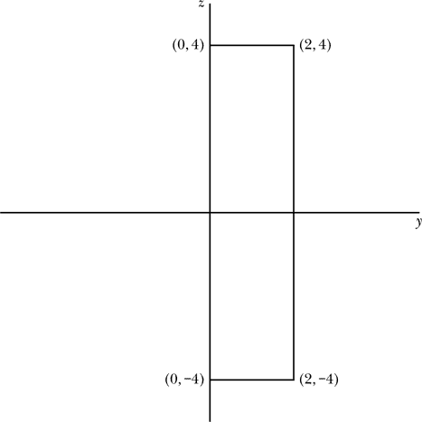

*图 23-4：yz 平面中的一个曲面*

**练习 23.11.** 定义一个函数

```
quarterCylinder :: R -> R -> Volume
quarterCylinder = undefined
```

该函数接受高度 *h* 和半径 *R* 作为输入，并返回一个对应于图 23-5 的`Volume`。

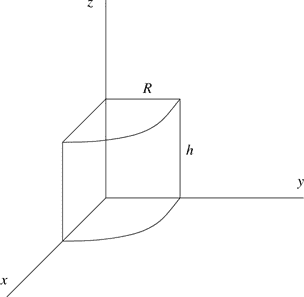

*图 23-5：表示四分之一圆柱体的体积*

**练习 23.12.**

(a) 定义一个`Surface`，表示一个大半径为 3，小半径为 0.5 的环面。

(b) 定义一个`Volume`，表示（a）部分环面内部的空间。
