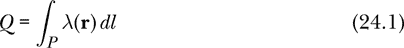
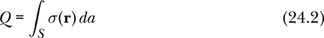
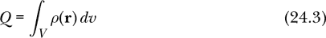
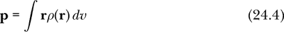
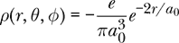

## 24

电荷


电荷最终负责所有电气现象。能够讨论集中在空间中特定点的电荷是有用的，但同样有用的是能够讨论沿曲线、表面或整个体积分布的电荷。这些电荷分布是本章的主题。

我们首先介绍线性电荷密度、表面电荷密度和体积电荷密度的概念。然后，我们将定义一种电荷分布的数据类型，能够表示点电荷、线电荷、面电荷、体电荷或这些电荷的任意组合。我们将编写函数来求出电荷分布的总电荷和电偶极矩。电荷产生电场。掌握了电荷分布的语言，为下一章的内容打下了基础，在这一章中，我们将求解由电荷分布产生的电场。

### 电荷分布

电荷是导致电磁效应的基本量，并且在电磁理论中发挥着关键作用。在我们本书中研究的经典电磁理论中，我们有时将电荷视为与粒子相关联，这时我们称电荷为*点电荷*，假设它在空间中有一个位置，但没有空间扩展。

我们有时也将电荷视为流体（即可以在空间区域内连续分布的物质）。实际上，我们使用三种类型的连续电荷分布。首先，电荷沿一维路径（如直线或曲线）连续分布。在这种情况下，我们称之为*线性电荷密度 λ*，表示单位长度的电荷量。这个希腊字母 λ 的使用与它在第二十章中表示波长的用法是独立的。线性电荷密度的国际单位制（SI）单位是库仑每米（C/m）。

其次，电荷在二维表面上连续分布。在这种情况下，我们称之为*表面电荷密度 σ*（希腊字母 sigma），表示单位面积的电荷量。表面电荷密度的 SI 单位是库仑每平方米（C/m²）。

第三，电荷在三维体积内连续分布。在这种情况下，我们称之为*体积电荷密度 ρ*（希腊字母 rho），表示单位体积的电荷量。体积电荷密度的 SI 单位是库仑每立方米（C/m³）。表 24-1 总结了这些电荷分布。

**表 24-1：** 电荷分布

| **电荷分布** | **维度** | **符号** | **国际单位制单位** |
| --- | --- | --- | --- |
| 点电荷 | 0 | *q*, *Q* | C |
| 线性电荷密度 | 1 | *λ* | C/m |
| 表面电荷密度 | 2 | *σ* | C/m² |
| 体积电荷密度 | 3 | *ρ* | C/m³ |

电荷在微观物理学中起着作用，因为我们将电荷与电子和夸克等基本粒子相关联。电荷在宏观物理学中也起作用，因为电子可以在某些地方堆积，导致净负电荷，或者它们可以从原子中缺失，导致净正电荷。

材料可以根据电子的运动难易程度分为绝缘体或导体。绝缘体是指电子难以离开原子并在材料中移动的材料，而导体是指电子容易在材料中移动的材料。

绝缘体上的电荷分布可以或多或少地是任意的，而像原子这样的物体的电荷分布可能是非均匀的——最终由量子力学决定。但是，导体上的电荷分布是受限的，因为电子不会停留在你放置它们的位置。*固定*的宏观电荷分布只能在绝缘体上实现，在这些材料上电荷不能移动。因此，我可以将我猫的尾巴充电至其鼻子电荷密度的 10 倍，因为电子停留在原地。宏观的*导体*不能支持任意的电荷密度：电荷会移动，迅速重新分布。因此，当我们讨论电荷分布时，应该假设我们是在绝缘体上分布电荷。

在我们介绍各种电荷分布之前，需要在源代码文件的顶部添加一些引导代码；接下来我们将看看这些代码。

### 引导代码

列表 24-1 显示了我们将在本章中编写的`Charge`模块的前几行代码。

```
{-# OPTIONS -Wall #-}

module Charge where

import SimpleVec ( R, Vec, vec, sumV, (*^), (^/), (<.>), magnitude, negateV )
import Electricity ( elementaryCharge )
import CoordinateSystems ( Position, ScalarField, origin, cart, sph
                         , rVF, displacement, shiftPosition )
import Geometry ( Curve(..), Surface(..), Volume(..)
                , straightLine, shiftSurface, disk )
import Integrals
    ( scalarLineIntegral, scalarSurfaceIntegral, scalarVolumeIntegral
    , vectorLineIntegral, vectorSurfaceIntegral, vectorVolumeIntegral
    , curveSample, surfaceSample, volumeSample )
```

*列表 24-1：电荷模块的开头代码行*

我们使用来自第十章的`SimpleVec`模块、来自第二十一章的`Electricity`模块、来自第二十二章的`CoordinateSystems`模块、来自第二十三章的`Geometry`模块以及下一章中介绍的包含各种函数的`Integrals`模块中的类型和函数。

让我们定义一个电荷的类型同义词：

```
type Charge = R
```

以这种方式定义电荷的新类型是半好半傻。它的好处在于，代码的读者（包括代码的编写者）会知道表达式`Charge`的意图。从这个意义上说，它是一种代码文档形式。然而，这也有些傻，因为编译器不会区分`Charge`、`R`和`Double`，因此它不能帮助编写者避免在任何可以使用`R`或`Double`的地方使用`Charge`。类型的主要目的之一是区分那些应该分开的东西，并让计算机帮助强制执行这种分离。例如，电荷与时间完全不同，后者也可以通过一个实数`R`来描述。

再次，我们必须在简单性和功能之间做出选择。在这里，我们可以使用 Haskell 的`data`关键字定义一个新的电荷类型，这样就不会与任何其他类型混淆。在这里定义一个新的数据类型是合理的，但是这会增加一些额外的工作和开销，所以我选择了`type`方法的简单性而不是`data`方法的功能性。

### 电荷分布的类型

我们希望定义一个新的数据类型`ChargeDistribution`，它可以包含点电荷、线电荷、面电荷、体积电荷或这些的组合。这不是强制性的；我们可以选择单独为线电荷、面电荷等定义不同的类型。引入单一的`ChargeDistribution`类型允许我们编写一个函数。

```
eField :: ChargeDistribution -> VectorField
```

在下一章中强调电荷是电场的源头。一旦你理解了语言允许的选项，你就可以利用它们来突出你所写的学科的中心思想。

指定每种分布所需的信息是什么？对于点电荷，我们需要指定有多少电荷以及电荷位于何处，因此我们需要给出`Charge`和`Position`。对于线电荷，我们需要指定一个曲线，沿着这条曲线电荷分布，并且需要给出曲线上每一点的线电荷密度。线电荷密度沿着曲线可以不均匀。它在某些地方可能很高，在其他地方可能很低，甚至在一些地方是正的，在另一些地方是负的。我们将使用标量场来指定线电荷密度。因此，线电荷需要我们给出线电荷密度的`ScalarField`和电荷所在的`Curve`。

表面电荷的规范要求我们给出表面电荷密度的标量场，这可能随位置而变化，以及一个电荷所在的表面。表面电荷由`ScalarField`和`Surface`来指定。类似地，体积电荷通过给出`ScalarField`和`Volume`来指定。

最后，我们可以通过给出电荷分布的列表来指定电荷分布的组合。让我们看一下定义数据类型`ChargeDistribution`的代码。

```
data ChargeDistribution
    = PointCharge   Charge      Position
    | LineCharge    ScalarField Curve
    | SurfaceCharge ScalarField Surface
    | VolumeCharge  ScalarField Volume
    | MultipleCharges [ChargeDistribution]
```

类型`ChargeDistribution`有五个数据构造函数，分别对应我们之前描述的每种情况。为了构造`ChargeDistribution`，我们使用五个数据构造函数之一以及该类型电荷分布的相关信息。这种数据类型的一个有趣属性是它是递归的。`MultipleCharges`构造函数所需的信息是`ChargeDistribution`的列表，这恰好是我们正在定义的类型。我们可以认为电荷分布有四种基本类型（点、线、面和体积）和一种组合类型，它们结合了分布。

### 电荷分布的示例

让我们写一些电荷分布的例子。我们可以将原点处质子的电荷分布定义为如下：

```
protonOrigin :: ChargeDistribution
protonOrigin = PointCharge elementaryCharge origin
```

这里是一个均匀线电荷，带电总量为`q`，长度为`len`，并且以原点为中心：

```
chargedLine :: Charge -> R -> ChargeDistribution
chargedLine q len
    = LineCharge (const $ q / len) $
      Curve (\z -> cart 0 0 z) (-len/2) (len/2)
```

我们传入总电荷`q`和长度`len`。均匀的线电荷密度为`q / len`，我们将其传递给`const`函数，因为`LineCharge`要求其第一个参数为标量场。

这里是一个均匀带电的球体，带电总量为`q`，半径为`radius`，并且以原点为中心：

```
chargedBall :: Charge -> R -> ChargeDistribution
chargedBall q radius
    = VolumeCharge (const $ q / (4/3*pi*radius**3)) $
      Volume (\(r,theta,phi) -> sph r theta phi)
                 0 radius (const 0) (const pi) (\_ _ -> 0) (\_ _ -> 2*pi)
```

我们传入总电荷`q`和球体的`radius`。然后我们可以通过将`q`除以球体体积 4*π*^(*r*3)/3 来得到均匀的体积电荷密度。

平行板电容器由两块导电板组成，彼此平行。它通常用于让一块板带正电荷，另一块板带相等但符号相反的负电荷。每块板上的电荷分布不会完全均匀，但如果板间距离较小，将每块板上的电荷视为均匀分布在板的表面上是一个很好的近似。

以下是一个平行板电容器的模型，包含两块板，每块板的形状是半径为`radius`的圆盘。两块板平行放置，且彼此之间的距离为`plateSep`。正板上的表面电荷密度为`sigma`，负板上的表面电荷密度为`-sigma`。

```
diskCap :: R -> R -> R -> ChargeDistribution
diskCap radius plateSep sigma
     = MultipleCharges
       [SurfaceCharge (const sigma) $ shiftSurface (vec 0 0 (plateSep/2)) (disk radius)
       ,SurfaceCharge (const $ -sigma) $
        shiftSurface (vec 0 0 (-plateSep/2)) (disk radius)
       ]
```

这里我们第一次使用了`MultipleCharges`构造函数。电荷分布由两个`disk`形状的电荷组成，这些电荷是我们在上一章中写的那种类型。由于我们在上一章写的`disk`是以原点为中心的，因此我们使用了`shiftSurface`，也是来自上一章，用于将两个盘状电荷放置在原点的上下方。

写了几个电荷分布的例子后，接下来我们来探讨如何求解一个电荷分布的总电荷量。

### 总电荷

如果我们将 2 库仑电荷均匀分布在 4 米的长度上，那么线电荷密度为 0.5 C/m。在这里，我们用的是电荷密度的术语，但有时用总电荷来表达更为方便。例如，当我们关心的是该线电荷在几百米外的某个地方产生的电场时，总电荷更加相关，因为从这个距离来看，线电荷就像一个简单的点电荷。

#### 线电荷的总电荷

线电荷的总电荷可以通过对电荷所在曲线上的线电荷密度进行积分来求得。如果*P*是电荷所沿的路径或曲线，*dl*是曲线上的长度元素，而*λ*是线电荷密度的标量场，那么以下公式就是线电荷的总电荷：



在线电荷密度均匀的情况下，将其乘以曲线的长度即得总电荷。一般来说，线电荷密度并不均匀。我们通过将曲线划分为许多小段，乘以每段的长度和代表性的电荷密度值，计算每段的电荷，并将所有这些段的电荷相加。当进行分析计算时，我们考虑一个极限，其中每段的长度趋近于零，段的数量趋向于无穷。当进行数值计算时，我们选择一些较大但有限的段数量。

#### 表面电荷的总电荷

表面电荷的总电荷可以通过对包含电荷的表面积分表面电荷密度来找到。如果 *S* 是表面，*da* 是表面元素，*σ* 是表面电荷密度的标量场，则



是表面电荷的总电荷。

在表面电荷密度均匀的情况下，将其乘以表面面积即得总电荷。一般来说，表面电荷密度并不均匀。我们通过将表面划分为大量小区域来进行积分，乘以每个区域的代表性电荷密度值，计算该区域的电荷，并将所有这些区域的电荷相加。当进行分析计算时，我们考虑一个极限，其中每个区域的面积趋近于零，区域的数量趋向于无穷。当进行数值计算时，我们选择一些较大但有限的区域数量。

#### 体积电荷的总电荷

体积电荷的总电荷可以通过对包含电荷的体积积分体积电荷密度来找到。如果 *V* 是体积，*dv* 是体积元素，*ρ* 是体积电荷密度的标量场，则



是体积电荷的总电荷。

在体积电荷密度均匀的情况下，将其乘以体积即得总电荷。一般来说，体积电荷密度并不均匀。我们进行的积分方法与线电荷和表面电荷的积分方法基本相同。

#### 在 Haskell 中计算总电荷

这里有一个名为 `totalCharge` 的函数，它计算电荷分布的总电荷：

```
totalCharge :: ChargeDistribution -> Charge
totalCharge (PointCharge   q      _)
    = q
totalCharge (LineCharge    lambda c)
    = scalarLineIntegral    (curveSample  1000) lambda c
totalCharge (SurfaceCharge sigma  s)
    = scalarSurfaceIntegral (surfaceSample 200) sigma s
totalCharge (VolumeCharge  rho    v)
    = scalarVolumeIntegral  (volumeSample   50) rho v
totalCharge (MultipleCharges ds    )
    = sum [totalCharge d | d <- ds]
```

`totalCharge` 函数使用模式匹配来分别处理五个数据构造器。在点电荷的情况下，该函数直接返回点电荷的电荷值。对于线电荷，函数使用 `scalarLineIntegral`，我们将在第二十五章中编写它，来执行方程 24.1 中的积分。`scalarLineIntegral` 函数接受一个方法来逼近曲线，一个标量场和曲线作为输入，并返回标量场在曲线上的线积分的近似值。

对于表面电荷，函数使用`scalarSurfaceIntegral`，我们将在第二十五章中讲解它，来执行方程 24.2 中显示的积分。`scalarSurfaceIntegral`函数的输入包括一个近似表面的方法、一个标量场和一个表面，它返回标量场在表面上表面积分的近似值。正如我们在下一章将看到的，方法`surfaceSample`使用与给定数字的平方两倍相等的多个小面来近似表面；前面显示的 200 值将使用 80,000 个小面。

对于体积电荷，函数使用`scalarVolumeIntegral`，我们将在第二十五章中讲解它，来执行方程 24.3 中显示的积分。`scalarVolumeIntegral`函数输入一个近似体积的方法、一个标量场和一个体积，并返回标量场在该体积上体积积分的近似值。正如我们在下一章将看到的，方法`volumeSample`使用与给定数字的立方五倍相等的多个体积元素来近似体积；前面显示的 50 值将使用 625,000 个体积元素。

在多个电荷的情况下，该函数计算列表中每个分布的总电荷并将结果相加。因为`total` `Charge`使用`totalCharge`来执行此操作，所以它是一个递归函数。

让我们检查一下我们之前定义的分布的总电荷。

```
Prelude> :l Charge
[ 1 of 11] Compiling Newton2          ( Newton2.hs, interpreted )
[ 2 of 11] Compiling Mechanics1D      ( Mechanics1D.hs, interpreted )
[ 3 of 11] Compiling SimpleVec        ( SimpleVec.hs, interpreted )
[ 4 of 11] Compiling Mechanics3D      ( Mechanics3D.hs, interpreted )
[ 5 of 11] Compiling MultipleObjects  ( MultipleObjects.hs, interpreted )
[ 6 of 11] Compiling MOExamples       ( MOExamples.hs, interpreted )
[ 7 of 11] Compiling Electricity      ( Electricity.hs, interpreted )
[ 8 of 11] Compiling CoordinateSystems ( CoordinateSystems.hs, interpreted )
[ 9 of 11] Compiling Geometry         ( Geometry.hs, interpreted )
[10 of 11] Compiling VectorIntegrals  ( VectorIntegrals.hs, interpreted )
[11 of 11] Compiling Charge           ( Charge.hs, interpreted )
Ok, 11 modules loaded.
*Charge> totalCharge protonOrigin
1.602176634e-19
*Charge> totalCharge $ chargedLine 0.25 2
0.2500000000000002
```

质子的总电荷就是质子的电荷。线电荷的总电荷是我们为线电荷总电荷所给出的值。

### 电偶极矩

*电偶极子*是由正负电荷在空间中分开组成的组合。最简单的情况是一个点电荷*q*和一个点电荷–*q*，它们之间有一定的距离*d*。电偶极子会产生电场，并通过感受力和/或力矩对电场做出响应，因此它可以被看作是一个类似于电荷本身的电性活跃实体。总电荷为 0 的电荷分布通常看起来像一个电偶极子。像氯化钠这样的中性双原子分子就是一个电偶极子的例子。

我们通过其*电偶极矩*来表征电偶极子，电偶极矩是一个从负电荷指向正电荷的向量。对于电荷*q*和–*q*，它们之间距离为*d*的情况，电偶极矩为**p** = *q***d**，其中**d**是从–*q*位置到*q*位置的位移向量。用于电偶极矩的**p**与用于动量的**p**无关。

电荷分布`simpleDipole`描述了两个电荷，*q*和–*q*，它们之间的距离为*d*。电偶极子位于原点。该函数以电偶极矩和点电荷之间的距离为输入。

```
simpleDipole :: Vec  -- electric dipole moment
             -> R    -- charge separation
             -> ChargeDistribution
simpleDipole p sep
    = let q    = magnitude p / sep
          disp = (sep/2) *^ (p ^/ magnitude p)
      in MultipleCharges
             [PointCharge   q  (shiftPosition          disp  origin)
             ,PointCharge (-q) (shiftPosition (negateV disp) origin)
             ]
```

该函数通过将偶极矩的大小除以分离距离来计算点电荷的电荷`q`。位移向量`disp`指向从原点到正电荷的位置。位移向量`negateV disp`指向从原点到负电荷的位置。

电偶极矩可以与任何电荷分布相关联。体电荷密度*ρ*的电偶极矩由以下公式给出：



如果电荷分布的总电荷为 0，那么电偶极矩通常是对该分布的最佳简化表征，能很好地近似该分布所产生的电场。

当然，电荷分布的总电荷和电偶极矩都可能为 0。在这种情况下，可以定义电四极矩来表征该分布。事实上，任何电荷分布都可以看作是电单极子（点电荷）、电偶极子、电四极子、电八极子及更高阶项的组合，这些被称为*多极展开*。我们在本书中不会深入探讨这一展开，只是指出电偶极子是展开中的第二项。像泰勒级数等数学级数展开一样，多极展开中的第一个非零项通常能为电荷分布提供一个简单的近似。

函数`electricDipoleMoment`计算任意电荷分布的电偶极矩。

```
electricDipoleMoment :: ChargeDistribution -> Vec
electricDipoleMoment (PointCharge   q     r)
    = q *^ displacement origin r
electricDipoleMoment (LineCharge    lambda c)
    = vectorLineIntegral    (curveSample  1000) (\r -> lambda r *^ rVF r) c
electricDipoleMoment (SurfaceCharge sigma  s)
    = vectorSurfaceIntegral (surfaceSample 200) (\r -> sigma  r *^ rVF r) s
electricDipoleMoment (VolumeCharge  rho    v)
    = vectorVolumeIntegral  (volumeSample   50) (\r -> rho    r *^ rVF r) v
electricDipoleMoment (MultipleCharges ds    )
    = sumV [electricDipoleMoment d | d <- ds]
```

该函数使用模式匹配对输入进行拆分，依据分布的构造器将定义划分为不同的情况。点电荷的偶极矩是电荷与从原点到点电荷位置的位移向量的乘积。对于线电荷，我们进行向量线积分，类似于方程 24.4。表面电荷需要进行表面积分，体电荷则使用方程 24.4 本身。最后，组合分布的偶极矩是每个组成部分的偶极矩的向量和。

另一种表现得像电偶极子的电荷分布是线电荷，其线电荷密度平滑地从负值变化到正值。函数`lineDipole`生成这样的分布，线电荷密度随位置线性变化。偶极子位于原点，那里线电荷密度为 0。

```
lineDipole :: Vec  -- dipole moment
           -> R    -- charge separation
           -> ChargeDistribution
lineDipole p sep
    = let disp = (sep/2) *^ (p ^/ magnitude p)
          curve = straightLine (shiftPosition (negateV disp) origin)
                               (shiftPosition          disp  origin)
          coeff = 12 / sep**3
          lambda r = coeff * (displacement origin r <.> p)
      in LineCharge lambda curve
```

该函数接受与`simpleDipole`相同的输入，并确定产生所需电偶极矩所需的线电荷密度。

在下一章，我们将看到几个电偶极子的示例。我们将研究由两个点粒子组成的简单偶极子、理想偶极子和线偶极子，并比较它们的电场，注意它们的共性。

### 概述

本章介绍了电荷分布，包括线电荷、面电荷和体电荷。我们编写了一个电荷分布的数据类型，能够处理点电荷、线电荷、面电荷、体电荷以及这些的组合。我们编写了一些电荷分布的示例，并编写了计算电荷分布总电荷和电偶极矩的函数。在下一章，我们将计算电荷分布产生的电场。

### 练习

**练习 24.1.** 使用函数`chargedLine`和`chargedBall`创建一些电荷分布，并通过`totalCharge`确认它们具有你预期的总电荷。

**练习 24.2.** 求解平行板电容器`diskCap`的总电荷和电偶极矩，选择半径、板间距和表面电荷密度的参数。通过变化这些参数，尝试确定总电荷和电偶极矩如何依赖于半径、板间距和表面电荷密度。

**练习 24.3.** 写出一个均匀带电表面的电荷分布，该表面为圆盘形，总电荷为`q`，半径为`radius`。

```
chargedDisk :: Charge -> R -> ChargeDistribution
chargedDisk q radius = undefined q radius
```

使用`totalCharge`检查你的分布是否具有你预期的总电荷。

**练习 24.4.** 写出一个均匀带电圆形（具有恒定线电荷密度）的电荷分布，总电荷为`q`，半径为`radius`。

```
circularLineCharge :: Charge -> R -> ChargeDistribution
circularLineCharge q radius = undefined q radius
```

使用`totalCharge`检查你的分布是否具有你预期的总电荷。

**练习 24.5.** 写出一个均匀带电表面的电荷分布，该表面为正方形，总电荷为`q`，边长为`side`。

```
chargedSquarePlate :: Charge -> R -> ChargeDistribution
chargedSquarePlate q side = undefined q side
```

使用`totalCharge`检查你的分布是否具有你预期的总电荷。

**练习 24.6.** 写出一个均匀带电表面的电荷分布，该表面为球形，总电荷为`q`，半径为`radius`。

```
chargedSphericalShell :: Charge -> R -> ChargeDistribution
chargedSphericalShell q radius = undefined q radius
```

使用`totalCharge`检查你的分布是否具有你预期的总电荷。

**练习 24.7.** 写出一个均匀带电体积的电荷分布，该体积为立方体，总电荷为`q`，边长为`side`。

```
chargedCube :: Charge -> R -> ChargeDistribution
chargedCube q side = undefined q side
```

使用`totalCharge`检查你的分布是否具有你预期的总电荷。

**练习 24.8.** 使用函数`simpleDipole`和`lineDipole`创建一些电荷分布，并通过`electricDipoleMoment`确认它们具有你预期的电偶极矩。

**练习 24.9.** 写出一个平行板电容器的电荷分布，其中电容器的两块板是正方形表面，边长为`side`，板间距为`plateSep`。一块板具有均匀的表面电荷密度`sigma`，另一块板具有均匀的表面电荷密度`-sigma`。

```
squareCap :: R -> R -> R -> ChargeDistribution
squareCap side plateSep sigma = undefined side plateSep sigma
```

**练习 24.10.** 一个氢原子在其基态中，由一个静止的质子位于原点和一个具有体积电荷密度的电子云组成。



其中 *e* 是质子的基本电荷，*a*[0] 是玻尔半径。为这个氢原子写出一个电荷分布。由于我们的体积是有限的，使用半径为 10[*a*0] 的球体作为包含电荷密度的体积。这将忽略电子负电荷的一小部分。通过使用 `totalCharge` 来检查你写出的电荷分布，看看你的氢原子有多接近中性。

```
hydrogen :: ChargeDistribution
hydrogen = undefined
```
