# 第二十五章：电场


在 19 世纪，法拉第和麦克斯韦发现了一种新的思考电现象（以及磁现象）的方法，这为今天的电磁理论奠定了基础。在这种 19 世纪的观点中，一个粒子并不会像库仑定律所暗示的那样直接施加力于另一个粒子。相反，一个粒子会创建一个*电场*，这个电场施加力于第二个粒子。

我们将从简短的讨论电场究竟是什么开始本章内容。接着，我们将展示如何计算前一章中研究的每一种电荷分布所产生的电场。我们将从点电荷产生的电场开始，因为这实际上是控制所有其他电荷分布的基本因素。介绍了单个点电荷后，我们将探讨由多个点电荷产生的电场。作为一个例子，我们将比较由由两个点电荷组成的简单电偶极子与理想电偶极子产生的电场。

要计算电场，我们需要引入一些新的数学工具。计算由线电荷产生的电场需要矢量线积分；计算由面电荷产生的电场需要矢量面积分；计算由体电荷产生的电场需要矢量体积分。我们会根据需要引入这些工具，并在本章结束时介绍如何对曲线、面和体进行采样或离散化，这将使我们能够进行数值线积分、面积分和体积分。

### 什么是电场？

电场是我们在第二十二章讨论过的*矢量场*。电场将一个矢量**E**(**r**)与空间中每个点**r**关联；如果在空间的点**r**处有一个粒子，这个矢量帮助决定粒子所受的力。

电场是一个物理实体，还是我们用来思考电现象的抽象概念？我认为它两者兼具。电场是一个抽象的数学构造，就像现代理论物理学中许多概念一样。我们用数学语言来描述它，并假设一些公理，好像它的物理实在性不比一个由无理数构成的 7×7 矩阵更真实。

在静态情况下，电荷没有运动或加速时，我们可以对电场的真实性保持模棱两可的态度，甚至可以否定它。在这些静态情况下，库仑定律做出了良好的预测，而描述电场的新的电磁理论则做出了相同的预测。因此，在静态情况下，电场可以被看作仅仅是一个抽象。

然而，在动态情况下，当电荷在运动和/或加速时，我们就很难再坚持电场仅仅是一个计算工具的观点。原因在于，现代电磁理论除了是电和磁的理论外，还是光和辐射的理论。麦克斯韦的洞察力在于，电场和磁场可以用来描述可见光以及整个非可见光谱的光波，包括无线电波和微波。这些波现在被视为电场和磁场中的波动。根据法拉第-麦克斯韦理论，光是一种电磁波。由于光和辐射是物理的、真实的，因此电场也似乎是物理的、真实的。

引入电场将电气情况的分析分为两部分。第一部分是电荷产生电场，这是我们将在本章中讨论的内容。第二部分是电场对（第二个）电荷施加的力，这是我们将在第二十八章中讨论的内容。图 25-1 展示了电场在两个电荷情境中的作用。

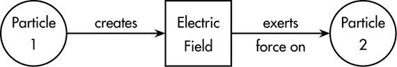

*图 25-1：当两个带电粒子存在时，电场的作用概念图。粒子 1 产生电场，电场对粒子 2 施加力。*

我们说电场*介导*了两个粒子之间的相互作用。在本章中，我们主要关注由静止电荷或电荷分布产生的电场。当电荷快速移动或加速时，电场概念的实际好处就显现出来，因为库仑定律在这些情况下无法作出准确预测。一般来说，我们将在第二十九章讨论的麦克斯韦方程描述了电场的产生和演化。麦克斯韦方程描述了电荷在任何形式运动中产生的电场，并且当电荷运动或加速时，它们会做出不同于库仑理论的预测。我们在更简单的静态情形下引入电场的概念，将有助于我们在后续讨论麦克斯韦方程时更加得心应手。

### 前言代码

清单 25-1 展示了我们将在本章中编写的`ElectricField`模块的第一行代码。

```
{-# OPTIONS -Wall #-}

module ElectricField where

import SimpleVec
    ( R, Vec, (^+^), (^-^), (*^), (^*), (^/), (<.>), (><)
    , sumV, magnitude, vec, xComp, yComp, zComp, kHat )
import CoordinateSystems
    ( Position, ScalarField, VectorField
    , displacement, shiftPosition, addVectorFields
    , cart, sph, vf3D, vfPNGxy, vfGrad, origin, rVF )
import Geometry ( Curve(..), Surface(..), Volume(..) )
import Charge
    ( Charge, ChargeDistribution(..)
    , diskCap, protonOrigin, simpleDipole, lineDipole )
```

*清单 25-1：电场模块的开头代码行*

我们使用了来自第十章的`SimpleVec`模块、第二十二章的`CoordinateSystems`模块、第二十三章的`Geometry`模块和第二十四章的`Charge`模块中的类型和函数。

### 电荷产生电场

现代电学的两部分观点的第一部分是电荷产生电场。我们想要计算由各种电荷产生的电场。我们将从最简单的电荷分布——点电荷开始，然后转向更复杂的电荷分布。

#### 点电荷产生的电场

一个带电量为*q*[1]的粒子位于位置**r**[1]，将根据以下方程产生电场**E**：

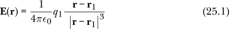

电场**E**是从位置到向量的函数（换句话说，是一个向量场）。

一个正点电荷产生的电场指向远离正电荷的方向。一个负点电荷产生的电场指向指向负电荷的方向。

我们在第二十一章中介绍了常数*ϵ*[0]，称为*真空的介电常数*；它的定义为

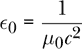

其中，*c*是真空中的光速，*μ*[0]是一个常数，称为*真空的磁导率*。

```
epsilon0 :: R
epsilon0 = 1/(mu0 * cSI**2)
```

真空中的光速是* c * = 299792458 m/s（米的定义是光在真空中在 1/299792458 秒内传播的距离）。

```
cSI :: R
cSI = 299792458  -- m/s
```

在 2019 年国际单位制（SI）修订之前，常数*μ*[0]被定义为精确值*μ*[0] = 4*π* × 10^(–7) N/A²。2019 年修订选择了其他常数为精确值，留下*μ*[0]由实验确定。然而，它仍然非常接近这个值。

```
mu0 :: R
mu0 = 4e-7 * pi  -- N/A²
```

我们有*ϵ*[0]和*μ*[0]是因为我们测量电场和磁场（或电压和电流）所使用的单位来源于实验，实验测量了电流和电荷之间的力。这些实验早于基于麦克斯韦方程的现代电磁理论。在麦克斯韦方程的框架下保持常规单位需要*ϵ*[0]和*μ*[0]来使单位得以统一。如果你愿意放弃电流和电压的常规单位（安培和伏特），你可以不使用*ϵ*[0]和*μ*[0]写出麦克斯韦方程。

函数`eFieldFromPointCharge`编码了方程 25.1，输入点粒子的电荷和位置，并输出电场。

```
eFieldFromPointCharge
    :: Charge       -- in Coulombs
    -> Position     -- of point charge (in m)
    -> VectorField  -- electric field (in V/m)
eFieldFromPointCharge q1 r1 r
    = let k = 1 / (4 * pi * epsilon0)
          d = displacement r1 r
      in (k * q1) *^ d ^/ magnitude d ** 3
```

局部名称`d`表示从电荷位置**r**[1]到*场点* **r**的位移向量**r** – **r**[1]。场点是我们寻找或讨论电场的位置。场点处不需要存在任何粒子或物质。

在第二十四章中，我们为电荷分布写了一个类型。在本章中，我们将编写函数来计算由各种电荷分布产生的电场。这使我们能够将电荷产生电场的概念封装在以下函数中，该函数根据任意电荷分布产生电场。

```
eField :: ChargeDistribution -> VectorField
eField (PointCharge   q   r) = eFieldFromPointCharge   q   r
eField (LineCharge    lam c) = eFieldFromLineCharge    lam c
eField (SurfaceCharge sig s) = eFieldFromSurfaceCharge sig s
eField (VolumeCharge  rho v) = eFieldFromVolumeCharge  rho v
eField (MultipleCharges cds) = addVectorFields $ map eField cds
```

函数`eField`使用模式匹配对输入进行处理，以分别处理每种电荷分布类型。对于点电荷，它使用我们之前编写的函数`eFieldFromPointCharge`。对于线电荷、面电荷和体电荷，它使用我们将在本章后面编写的函数。对于具有构造函数`MultipleCharges`的组合分布，它使用*叠加原理*，即多个电荷产生的电场是由每个单独电荷产生的电场的矢量和。在这种情况下，我们使用来自第二十二章的函数`addVectorFields`来组合各组成分布的电场。

函数`eField`是一个显式递归函数。在定义的最后一行，我们可以看到`eField`是通过`eField`来定义的。我尽量避免编写显式递归函数，因为它们通常更难理解。在这种情况下，显式递归仅出现在`MultipleCharges`条款中。这意味着，当遇到多个电荷时，正确的做法是，首先找到每个组成电荷的电场（使用相同的`eField`函数，但可能是其他条款中的一个），其次将这些组成电场加在一起。

由质子在原点产生的电场由矢量场`eField protonOrigin`给出，其中`protonOrigin`是我们在第二十四章中为原点处的质子编写的电荷分布。图 25-2 展示了三种可视化质子产生的电场的方法。

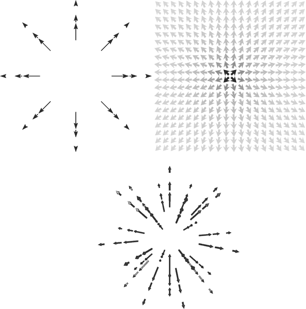

*图 25-2：三种可视化质子产生的电场 eField protonOrigin 的方法。左上图由 eFieldPicProton2D 生成，右上图由 eFieldPicProtonGrad 生成，下方图是由 eFieldPicProton3D 生成的 3D 交互式图像的截图。*

以下代码生成了图 25-2 左上方的图像。

```
eFieldPicProton2D :: IO ()
eFieldPicProton2D
     = vfPNGxy "eFieldPicProton2D.png" 3e-9 pts (eField protonOrigin)
       where
         pts = [(r * cos th, r * sin th) | r <- [1,1.5,2]
               , th <- [0,pi/4 .. 2*pi]]
```

样本点位于 xy 平面中，但通过点电荷的任何平面都会给出相同的图像。每个箭头代表箭头尾部位置的电场。在这张图中，电场强度与显示箭头的长度成正比。由于点电荷产生的电场与距离点电荷的平方成反比，因此当我们接近点电荷时，这些箭头的长度会变得非常长。因此，我们选择了合适的样本点和比例因子，以避免在图中出现过长的箭头。

由一个质子在距离 1 米的地方产生的电场如下所示：


`3e-9`的尺度因子意味着在图像的尺度中，3 × 10^(-9) N/C 的电场显示为 1 米长的箭头。离质子的箭头距离为 1 米。它们的长度应该大约是(1.4 × 10^(-9) N/C)/(3 × 10^(-9) N/C)，或者大约是从质子到矢量尾部的距离的一半，这在这张图中是成立的。

现在考虑以下代码，它生成了图 25-2 右上方的图片：

```
eFieldPicProtonGrad :: IO ()
eFieldPicProtonGrad
    = vfGrad (**0.2) (\(x,y) -> cart x y 0) (\v -> (xComp v, yComp v))
      "eFieldPicProtonGrad.png" 20 (eField protonOrigin)
```

再次地，样本点位于 xy 平面中。每个箭头表示箭头中心位置的电场。在这张图中，电场在较暗的箭头处较强，在较亮的箭头处较弱。

最后，我们有以下代码，它生成了图 25-2 下方的图片：

```
eFieldPicProton3D :: IO ()
eFieldPicProton3D = vf3D 4e-9
                 [sph r th ph | r  <- [1,1.5,2]
                              , th <- [0,pi/4..pi]
                              , ph <- [0,pi/4..2*pi]] (eField protonOrigin)
```

如果你运行程序`eFieldPicProton3D`，也许通过创建一个独立程序并命名为`main`，将会弹出一个 3D 矢量场。你可以用鼠标或指点设备移动并旋转它。

这结束了我们对单一点电荷产生的电场的讨论。接下来，我们将研究多个电荷的情况。

#### 由多个电荷产生的电场

方程 25.1 是由点电荷产生的电场的基本方程。叠加原理表明，多个电荷产生的电场是每个电荷单独产生的电场的矢量和。对于一组点电荷，*i*标记粒子，*q[i]*是粒子*i*的电荷，**r**[*i*]是粒子*i*的位置，那么由这组电荷在场点**r**产生的电场为：

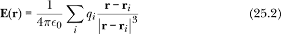

叠加原理已经在我们的`eField`函数中编码。当我们在一个电荷分布中有多个电荷时，它们会被标记为`MultipleCharges`数据构造器，这告诉`eField`函数应用叠加原理。在上一章中，我们在编写`simpleDipole`电荷分布时使用了这个`MultipleCharges`数据构造器。因此，尽管方程 25.2 是一个有用且重要的方程，告诉我们如何从多个点电荷中找到电场，但我们不需要编写额外的代码；叠加原理已经被`eField`函数自动应用。

作为多个电荷的第一个例子，我们将研究一个简单的电偶极子，由两个粒子组成：一个带正电，另一个带有大小相等但相反的负电荷。

##### 简单电偶极子的电场

在上一章中，我们介绍了`simpleDipole`，它是由两个带相反电荷的点粒子组成的电荷分布，粒子之间有一定的距离。氯化钠的电偶极矩为 2.99 × 10^(–29) C·m。钠原子和氯原子之间的原子间距离为 2.36 × 10^(–10) m。如果我们将 NaCl 视为由两个点粒子组成，钠原子的有效电荷大约是质子电荷的 0.8 倍，氯原子的有效电荷大约是质子电荷的–0.8 倍。由于电子在离子之间共享，有效电荷不是基本电荷的整数倍。以下是 NaCl 的电荷分布，视为简单电偶极子：

```
simpleDipoleSodiumChloride :: ChargeDistribution
simpleDipoleSodiumChloride = simpleDipole (vec 0 0 2.99e-29) 2.36e-10
```

要计算此电荷分布的电场，我们只需使用`eField`函数。由于`simpleDipole`是由`MultipleCharges`构造的两`PointCharge`点电荷组成的电荷分布，`eField`函数首先遇到`MultipleCharges`构造器，并使用该条款进行定义。`MultipleCharges`条款指示首先计算每个点电荷的电场，它通过使用`eField`自身来完成这一步骤，但这次是通过`PointCharge`构造器。因此，`eField`实际上被使用了三次。我们使用它一次，但它自己再调用两次来计算每个点电荷的电场，然后将结果加起来并返回给我们。

```
eFieldSodiumChloride :: VectorField
eFieldSodiumChloride = eField simpleDipoleSodiumChloride
```

图 25-3 左侧的图片显示了 NaCl 产生的电场。电场从图片顶部的带正电钠原子指向图片底部带负电氯原子。右侧图片显示了由理想偶极子产生的电场，理想偶极子的描述将在下一节中给出。我们将它们并排展示在一张图中，以便观察它们的相同点和不同点。图片的中央部分不同，因为电荷位于不同的位置；而图片的外部部分相似，任何电偶极子在距离源稍远的地方都会产生相同的电场模式。


*图 25-3：由简单偶极子（左）和理想偶极子（右）产生的电场。简单偶极子由一个正点电荷和一个负点电荷组成。左侧图像显示了由 eFieldSodiumChloride 产生的电场，电场由 eFieldPicSimpleDipole 产生；右侧图像显示了由 eFieldIdealDipole kHat 产生的电场，电场由 eFieldPicIdealDipole 产生。*

下面是产生图 25-3 左侧图片的代码：

```
eFieldPicSimpleDipole :: IO ()
eFieldPicSimpleDipole
    = vfGrad (**0.2) (\(y,z) -> cart 0 (3e-10*y) (3e-10*z))
      (\v -> (yComp v, zComp v)) "eFieldPicSimpleDipole.png" 20
      eFieldSodiumChloride
```

该图显示了 yz 平面中的一个正方形，其中*y*的范围从–3 × 10^(–10) m 到 3 × 10^(–10) m，而*z*的范围也是相同的。这是通过将`vfGrad`的第二个输入进行映射实现的，该映射将`y`和`z`的参数缩放为`3e-10`。请记住，我们在第二十二章中编写的`vfGrad`函数的第二个输入，通过将从(–1,–1)到(1,1)的正方形映射到我们希望可视化的区域，来指定感兴趣的区域。

##### 理想电偶极子

等量但相反电荷的粒子是电偶极子的一个例子。*理想电偶极子*是由两个粒子之间的距离趋近于零，而电荷的大小增大，使得电偶极矩保持不变，从而形成电场源。让我们来看一下理想电偶极子产生的电场。

由理想电偶极子在原点产生的电场是

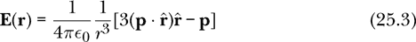

其中**p**是电偶极矩。这里是用 Haskell 表示的：

```
eFieldIdealDipole :: Vec          -- electric dipole moment
                  -> VectorField  -- electric field
eFieldIdealDipole p r
    = let k = 1 / (4 * pi * epsilon0)  -- SI units
          rMag = magnitude (rVF r)
          rUnit = rVF r ^/ rMag
      in k *^ (1 / rMag**3) *^ (3 *^ (p <.> rUnit) *^ rUnit ^-^ p)
```

图 25-3 的右侧显示了由理想电偶极子产生的电场。电偶极矩**p**的大小在这个图像中并不重要，因为最暗的箭头表示电场最强的地方，尽管电场的大小可能不同。方程 25.3 表明，电场随偶极矩线性增加，因此对于 z 方向上的任何电偶极矩，图像都是相同的。

比较图 25-3 中的两个图像，我们看到电场在图像中心处有所不同，接近电场源的位置。在图像边缘，远离电场源的区域，两个图像中的电场非常相似。电场在离源稍远的地方的相似性使得这两种源都可以被称为电偶极子。

以下是生成图 25-3 右侧图片的代码：

```
eFieldPicIdealDipole :: IO ()
eFieldPicIdealDipole
    = vfGrad (**0.2) (\(y,z) -> cart 0 (3e-10*y) (3e-10*z))
      (\v -> (yComp v, zComp v)) "eFieldPicIdealDipole.png" 20
                                     (eFieldIdealDipole kHat)
```

与`eFieldPicSimpleDipole`相比，该程序在 NaCl 中的唯一区别是文件名和电场。这里的电场是`eFieldIdealDipole kHat`，我们使用单位向量`kHat`表示电偶极矩，因为它的大小不会改变图像。

我们已经看到了由多个点电荷产生的电场示例，并将其与理想电偶极子的电场进行了比较。连续电荷分布可以看作是多个电荷的一个特例，其中有许多电荷分布在某个区域上。在我们转向如何计算特定连续电荷分布产生的电场之前，有一些一般性的说明可以做。

##### 连续分布

当我们从离散的点电荷转向连续分布的电荷时，我们将方程 25.2 中的和替换为积分。写这个积分的一般方法如下：

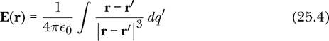

在方程式 25.4 中，我们已经将离散量替换为连续量，正如表 25-1 所示，表中显示了离散量和连续量之间的对应关系。

**表 25-1：** 电场中离散和连续量的对应关系

|  | **离散** | **连续** |
| --- | --- | --- |
| 聚合方法 | ∑[*i*] | ∫ |
| 电荷量 | *q[i]* | *dq*′ |
| 电荷位置 | **r**[*i*] | **r**′ |

方程式 25.4 中积分的形式是如此一般，以至于我们甚至没有明确规定电荷是分布在一维曲线、二维表面，还是三维体积中。无论如何，积分是通过一个极限过程来定义的，其中电荷量*dq*′变得无限小，电荷数目变得无限大。

有时我们可以精确计算这样的积分；然而，更多时候，我们需要计算积分的近似值。我们通过将连续积分转化为离散和来进行计算，基本上是通过将方程式 25.4 转回方程式 25.2。具体细节取决于我们是在对 1D 曲线、2D 表面还是 3D 体积进行积分。我们将在接下来的各节中依次讨论这些情况。

#### 由线电荷产生的电场

正如我们在上一章讨论的，线电荷由曲线*C*和标量场*λ*指定，*λ*表示曲线上任何点的线电荷密度。当电荷沿一维曲线分布时，在位置**r**′的小电荷*dq*′由线电荷密度*λ*(**r**)与曲线段的小长度*dl*′的乘积给出。

*dq*′ = *λ*(**r**′) *dl*′

然后我们将方程式 25.4 的积分写作如下：

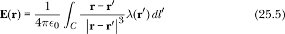

这种对向量场在曲线上的积分称为*向量线积分*。让我们更详细地解释一下向量线积分。

##### 向量线积分

向量线积分将向量场和曲线作为输入，并返回一个向量作为输出。

```
type VectorLineIntegral = VectorField -> Curve -> Vec
```

向量场**F**在曲线*C*上的向量线积分表示为

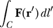

这个积分是什么意思？积分的定义是通过将曲线*C*分成许多小段来实现的。向量场**F**在每个点**r**[*i*]（位于或接近段Δ**l**[*i*]）处进行评估，并且按段长度Δ*l[i]*进行缩放（乘以）。然后我们将这些向量相加形成和


这个积分是当段长度趋近于 0 并且段数变得无限大的时候，这个向量和的极限。积分的定义涉及对极限过程的精确定义，这部分内容我们将留给向量微积分的教材。

这个积分不仅通过有限和定义，还通过有限和进行逼近。

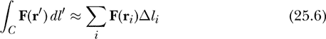

我们对积分的近似计算将使用有限数量的段。我们需要一种方法，通过有限的段列表来近似曲线。我们将把段Δ**l**[*i*]表示为沿曲线的短位移矢量。除了描述段长度和方向的位移矢量Δ**l**[*i*]，我们还需要一个位置**r**[*i*]来表示该段在曲线上的位置。曲线的近似是由位置和位移矢量的对组成的列表。注意，段的长度不必相同。曲线近似方法是一个函数，当给定一条曲线时，会返回这样的列表。

```
type CurveApprox = Curve -> [(Position,Vec)]
```

一对看起来像是(**r**[*i*], Δ**l**[*i*])。我们可以使用许多曲线近似方法；我们将在本章最后一节讨论曲线近似方法。

这是矢量线积分的 Haskell 定义：

```
vectorLineIntegral :: CurveApprox -> VectorField -> Curve -> Vec
vectorLineIntegral approx vF c
    = sumV [vF r' ^* magnitude dl' | (r',dl') <- approx c]
```

曲线`c`由输入函数`approx`进行近似，该函数会指定曲线划分的段数、划分方法以及各个段的相关位置。对于每个在位置`r'`的段`dl'`，矢量场`vF`将在位置`r'`进行评估，并按`dl'`的大小进行缩放。然后，我们将这些向量相加，从而得到积分的近似值。表 25-2 显示了数学符号、离散数学符号和 Haskell 符号在定义矢量线积分时的对应关系。

**表 25-2：** 连续数学符号、离散数学符号和 Haskell 符号在矢量线积分中的对应关系

| **连续数学** | **离散数学** | **Haskell** |
| --- | --- | --- |
| ∫ | ∑[*i*] | `sumV` ➊ |
| **r**′ | **r**[*i*] | `r'` ➋ |
| **F** | **F** | `vF` |
| **F**(**r**′) | **F**(**r**[*i*]) | `vF r'` |
| *C* |  | `c` ➌ |
| *dl*′ | Δ**l**[*i*] | `dl'` ➍ |
| *dl*′ | Δ*l[i]* | `magnitude dl'` |
| **F**(**r**′)*dl*′ | **F**(**r**[*i*])Δ*l[i]* | `vF r' ^* magnitude dl'` |

出人意料的是，Haskell 符号在求和符号部分➊上与离散符号更为接近。我们为段位置➋、曲线➌和段位移➍选择的 Haskell 名称更接近于连续符号。这是因为 Haskell 不需要离散符号中使用的索引*i*，所以没有必要引入它。虽然 Haskell 以离散的方式计算积分，但 Haskell 的列表语法避免了谈论需要编号列表元素的索引*i*。

##### 回到电场

从方程 25.5 中，我们看到，想要积分以找到由线电荷产生的电场的矢量场**F**，是将电荷某部分的位置**r**′映射到矢量的函数。

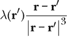

其中，**r**是场点，即我们希望知道电场的固定位置。在下面的`eFieldFromLineCharge`函数中，这个函数被赋予了局部名称`integrand`。局部名称`d`表示从源点**r**′到场点**r**的位移**r** – **r**′。由于源点`r'`作为`integrand`函数的局部名称引入，因此我们必须通过`where`子句来定义`d`，而不是与`k`和`integrand`的定义一起给出。

```
eFieldFromLineCharge
    :: ScalarField  -- linear charge density lambda
    -> Curve        -- geometry of the line charge
    -> VectorField  -- electric field (in V/m)
eFieldFromLineCharge lambda c r
    = let k = 1 / (4 * pi * epsilon0)
          integrand r' = lambda r' *^ d ^/ magnitude d ** 3
              where d = displacement r' r
      in k *^ vectorLineIntegral (curveSample 1000) integrand c
```

要找到线电荷产生的电场，我们只需要提供两个信息：线电荷密度（作为标量场表示）和描述线电荷几何形状的曲线。函数`eFieldFromLineCharge`的类型签名明确表明，电场只依赖于这两个参数。我们使用之前定义的`vectorLineIntegral`。曲线近似方法`curveSample 1000`将曲线分成 1000 段，并将在本章稍后定义。

现在我们已经展示了如何找到线电荷的电场，接下来让我们看看前一章讨论的线偶极子`lineDipole`所产生的电场。

##### 线偶极子的示例

在上一章中，我们介绍了`lineDipole`，它是一个具有线性变化电荷密度的线电荷。假设我们有理由相信，NaCl 的电荷分布看起来更像是线偶极子而非简单的偶极子。我没有这样的证据，而且 NaCl 的电荷分布可能很复杂，但假设电荷密度从钠到氯是平滑变化的（即使不是线性变化），这一点是完全合理的。为了将 NaCl 建模为一个线偶极子，我们可以使用之前为简单偶极子计算的电偶极矩和原子间距。这里是 NaCl 作为线偶极子时的电荷分布：

```
lineDipoleSodiumChloride :: ChargeDistribution
lineDipoleSodiumChloride = lineDipole (vec 0 0 2.99e-29) 2.36e-10
```

我们可以使用`eField`函数来找到这个电荷分布的电场，在这种情况下，它将使用我们之前写的`eFieldFromLineCharge`函数。

```
eFieldLineDipole :: VectorField
eFieldLineDipole = eField lineDipoleSodiumChloride
```

练习 25.11 要求你绘制出这个电场的矢量场图，就像我们之前为简单偶极子和理想偶极子所做的那样。

既然我们已经讨论了如何从第一个连续电荷分布（即线电荷）中找到电场，并展示了一个示例，那么我们接下来将讨论第二个连续电荷分布——表面电荷。

#### 表面电荷产生的电场

正如我们在上一章讨论的，表面电荷是由一个表面*S*和一个标量场*σ*指定的，后者表示表面上任何点的表面电荷密度。当电荷分布在二维表面上时，位置**r**′处的小电荷*dq*′由表面电荷密度*σ*(**r**′)和靠近**r**′的表面小区域*da*′的面积的乘积给出。

*dq*′ = σ(**r**′) *da*′

我们将方程 25.4 的积分写为如下：

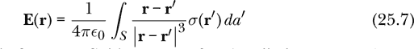

这种对曲面上向量场的积分称为*向量曲面积分*。让我们更详细地解释向量曲面积分。

##### 向量曲面积分

向量曲面积分接受一个向量场和一个曲面作为输入，返回一个向量作为输出。

```
type VectorSurfaceIntegral = VectorField -> Surface -> Vec
```

向量场**F**在曲面*S*上的向量曲面积分写作：

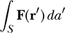

我们通过将曲面*S*划分为许多小贴片来定义积分。你可以将贴片看作一个四边形，但真正重要的是贴片的位置、面积和方向，而不是其形状。每个贴片Δ**a**[*i*]都是一个向量面积，其大小给出贴片的面积，方向垂直于贴片。我们假设每个贴片足够小，可以视为平坦的。由于我们的曲面是有方向的，正如我们在第二十三章中讨论的那样，贴片的方向是明确的。向量场**F**在贴片Δ**a**[*i*]附近的点**r**[*i*]上进行评估，并按贴片面积*Δa[i]*进行缩放。然后我们将这些向量相加，得到和

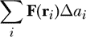

积分是这个向量和的极限，当贴片的面积趋近于 0 且贴片数量变得无限大时。

积分不仅通过有限和进行近似定义，还通过有限和来近似计算。

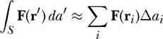

我们对积分的近似计算将使用有限数量的贴片。我们需要一种方法将一个曲面划分成一系列贴片。我们将用一个垂直于曲面的向量来表示一个有向贴片Δ**a**[*i*]。除了描述贴片面积和方向的向量Δ**a**[*i*]，我们还需要一个位置**r**[*i*]，表示贴片在曲面上的位置。曲面的近似由一系列位置和面积向量的配对组成。

```
type SurfaceApprox = Surface -> [(Position,Vec)]
```

一个配对看起来像是(**r**[*i*], Δ**a**[*i*])。曲面近似的方式有很多，我们将在本章最后一节讨论这一点。

这是向量曲面积分的 Haskell 定义：

```
vectorSurfaceIntegral :: SurfaceApprox -> VectorField -> Surface -> Vec
vectorSurfaceIntegral approx vF s
    = sumV [vF r' ^* magnitude da' | (r',da') <- approx s]
```

曲面`s`通过函数`approx`进行近似，`approx`作为输入提供。该函数将指定曲面被划分为多少个贴片，并且确定这些贴片的划分方法以及与之相关的位置。对于每个位置为`r'`的贴片`da'`，我们在位置`r'`评估向量场`vF`，并按`da'`的大小进行缩放。然后我们将这些向量相加，从而得到积分的近似值。表 25-3 展示了向量曲面积分的数学符号与 Haskell 符号之间的对应关系。

**表 25-3：** 连续数学符号、离散数学符号和 Haskell 符号之间的对应关系，适用于向量曲面积分

| **连续数学** | **离散数学** | **Haskell** |
| --- | --- | --- |
| ∫ | ∑[*i*] | `sumV` |
| **r**′ | **r**[*i*] | `r'` |
| **F** | **F** | `vF` |
| **F**(**r**′) | **F**(**r**[*i*]) | `vF r'` |
| *S* |  | `s` |
| *d***a**′ | Δ**a**[*i*] | `da'` |
| *da*′ | Δ*a[i]* | `magnitude da'` |
| **F**(**r**′)*da*′ | **F**(**r**[*i*])Δ*a[i]* | `vF r' ^* magnitude da'` |

表格 25-3 的前四行与表格 25-2 的前四行相同，因为它们都涉及向量场和积分。该表的最后四行与前一个表类似，只不过是用表面小块代替了线段。

##### 回到电场

从方程 25.7 中，我们看到我们想要积分以找到由线电荷产生的电场的向量场**F**是一个将电荷片段的位置**r**′映射到向量的函数。

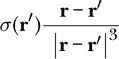

在这里，我们考虑**r**是我们想要知道电场的固定位置。在接下来的`eFieldFromSurfaceCharge`函数中，这是方程 25.7 的 Haskell 翻译，我们给这个函数取了本地名称`integrand`。本地名称`d`表示从电荷到场点的位移**r** – **r**′。由于我们将源点`r'`作为`integrand`函数的局部名称引入，因此必须使用`where`子句来定义`d`，而不是与`k`和`integrand`的定义一起定义。

```
eFieldFromSurfaceCharge
    :: ScalarField  -- surface charge density sigma
    -> Surface      -- geometry of the surface charge
    -> VectorField  -- electric field (in V/m)
eFieldFromSurfaceCharge sigma s r
    = let k = 1 / (4 * pi * epsilon0)
          integrand r' = sigma r' *^ d ^/ magnitude d ** 3
              where d = displacement r' r
      in k *^ vectorSurfaceIntegral (surfaceSample 200) integrand s
```

为了找到表面电荷产生的电场，我们只需要给出两个项目：表面电荷密度*σ*，它作为标量场表示，和描述表面电荷几何形状的表面。`eFieldFromSurfaceCharge`的类型签名清楚地表明，电场仅依赖于这两个项目。我们使用之前定义的`vectorSurfaceIntegral`。函数`surfaceSample 200`将曲线分成 2(200)² = 80,000 个小块，并在本章后面定义。

现在我们已经展示了如何找到表面电荷产生的电场，让我们来看一下上一章讨论过的电容器`diskCap`产生的电场。

##### 电容器示例

让我们找出由平行板电容器产生的电场，其中电容器的板均匀带电。当板距离较近时，均匀电荷的假设是合理的，但随着板间距离增大，这个假设会变得不太准确。假设我们有一个板间距为 4 厘米的电容器，其中的板是半径为 5 厘米的圆盘。正板的表面电荷密度为 20 nC/m²，负板的表面电荷密度为–20 nC/m²。表达式

```
diskCap 0.05 0.04 2e-8 :: ChargeDistribution
```

表示该电荷分布。

我们可以使用`eField`函数来找到电场。

```
eFieldDiskCap :: VectorField
eFieldDiskCap = eField $ diskCap 0.05 0.04 2e-8
```

在这种情况下，`eField`使用我们之前定义的`eFieldFromSurfaceCharge`函数。首先，让我们来看一下电容器中心的电场。

```
Prelude> :l ElectricField
[ 1 of 12] Compiling Newton2          ( Newton2.hs, interpreted )
[ 2 of 12] Compiling Mechanics1D      ( Mechanics1D.hs, interpreted )
[ 3 of 12] Compiling SimpleVec        ( SimpleVec.hs, interpreted ) [ 4 of 12] Compiling Mechanics3D      ( Mechanics3D.hs, interpreted )
[ 5 of 12] Compiling MultipleObjects  ( MultipleObjects.hs, interpreted )
[ 6 of 12] Compiling MOExamples       ( MOExamples.hs, interpreted )
[ 7 of 12] Compiling Electricity      ( Electricity.hs, interpreted )
[ 8 of 12] Compiling CoordinateSystems ( CoordinateSystems.hs, interpreted )
[ 9 of 12] Compiling Geometry         ( Geometry.hs, interpreted )
[10 of 12] Compiling VectorIntegrals  ( VectorIntegrals.hs, interpreted )
[11 of 12] Compiling Charge           ( Charge.hs, interpreted )
[12 of 12] Compiling ElectricField    ( ElectricField.hs, interpreted )
Ok, 12 modules loaded.
*ElectricField> eFieldDiskCap (cart 0 0 0)
vec 0.0 0.0 (-1419.9046806406095)
```

电场朝负 z 方向，指向上面的正极板，朝向下面的负极板。

为了比较，一个具有无限宽板和平行板电容器，其表面电荷密度为*σ*，其电场为*σ*/*ϵ*[0]。物理学家喜欢理想的平行板电容器，因为它能简单地表达其产生的电场。理想电容器外部的电场为 0。理想电容器内部（两个板之间）的电场值均匀，为*σ*/*ϵ*[0]，并且方向从正极板指向负极板。所产生的电场与板间距无关。对于表面电荷密度*σ* = 20 nC/m²，电场的大小将是

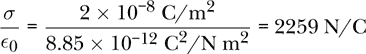

我们之前找到的值小于这个理想值（在量值上），因为我们的电容板半径相对较小。

图 25-4 显示了我们盘形电容器产生的电场。

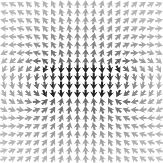

*图 25-4：由平行板电容器产生的电场 eFieldDiskCap。电容板具有均匀的表面电荷密度。（图像由 eFieldPicDiskCap 生成。）*

图 25-4 显示了 x 方向上从–10 cm 到 10 cm 的区域，以及 z 方向上从–10 cm 到 10 cm 的区域。盘形电容器的半径为 5 cm，因此它们水平延伸，覆盖了图中一半的宽度。电场的强度在箭头最黑的地方最大，即板之间。电场在板外部较小，但并非为 0。电场在板之间看起来相当均匀。我们从阴影中可以看到电场如何从板间的最大值过渡到接近盘边缘的中等值，再到离板更远处的最小值。在图的外围，电场看起来像是电偶极子的电场，这并不奇怪，因为该电容器本身就是由正负两块电板组成的电偶极子。

这是生成图 25-4 的代码：

```
eFieldPicDiskCap :: IO ()
eFieldPicDiskCap = vfGrad (**0.2) (\(x,z) -> cart (0.1*x) 0 (0.1*z))
                (\v -> (xComp v, zComp v)) "eFieldPicDiskCap.png" 20
                eFieldDiskCap
```

该程序可能需要几分钟才能运行。表面和体积电荷的积分涉及大量计算，可能会比较慢。这里使用的方法在概念上简单，但数值效率较低。慢速主要是由于简单方法的使用，而非 Haskell 语言本身的局限性。实际上，存在一些数据结构，如无包装向量，可以加速许多操作，但这会使代码变得不那么简洁。

我们之前讨论过线电荷和表面电荷。现在让我们讨论第三种也是最后一种连续电荷分布：体积电荷。

#### 由体积电荷产生的电场

正如我们在上一章中讨论的那样，体积电荷由一个体积 *V* 和一个标量场 *ρ* 指定，该标量场表示体积中任意一点的体积电荷密度。当电荷分布在三维体积中时，位置 **r**′ 处的一个小电荷 *dq*′ 由体积电荷密度 *ρ*(**r**′) 与靠近 **r**′ 的小部分体积 *dv*′ 的乘积给出。

*dq*′ = *ρ*(**r**′) *dv*′

然后我们将方程 25.4 的积分写成如下形式：

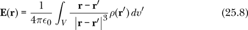

这样的向量场在体积上的积分被称为 *向量体积积分*。让我们更详细地探讨向量体积积分。

##### 向量体积积分

向量体积积分以向量场和体积为输入，并返回一个向量作为输出。

```
type VectorVolumeIntegral = VectorField -> Volume -> Vec
```

向量场 **F** 在体积 *V* 上的向量体积积分表示如下：

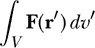

积分是通过将体积 *V* 分割成许多小部分来定义的。向量场 **F** 在每个点 **r**[*i*]（在该部分上或附近）被评估，并按该部分的体积 Δ*v[i]* 进行缩放。然后我们将这些向量加起来，得到总和

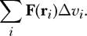

这个积分是当体积部分趋近于 0 且部分数目变得无限大时，这个向量和的极限。

积分既通过有限和来定义，也通过有限和来近似：

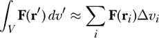

我们的积分近似计算将使用有限数量的部分。我们将通过其位置 **r**[*i*] 和体积 Δ*v[i]* 来表示一个部分。体积的近似由一组位置和部分体积的对构成。体积近似方法是一个函数，当给定体积时，它返回这样的列表。

```
type VolumeApprox = Volume -> [(Position,R)]
```

一对看起来像 (**r**[*i*], Δ*v[i]*)。可以使用许多体积近似方法，正如之前所说的，我们将把这个问题的讨论推迟到本章稍后。

这里是一个向量体积积分的 Haskell 定义：

```
vectorVolumeIntegral :: VolumeApprox -> VectorField -> Volume -> Vec
vectorVolumeIntegral approx vF vol
    = sumV [vF r' ^* dv' | (r',dv') <- approx vol]
```

体积 `vol` 通过函数 `approx` 近似，给出一组部分位置和体积的列表。对于每个部分 `(r', dv')`，向量场 `vF` 在位置 `r'` 处进行评估，并按 `dv'` 进行缩放。然后我们将这些向量加起来，得到积分的近似值。

表 25-4 显示了向量体积积分中数学符号和 Haskell 符号之间的对应关系。

**表 25-4：** 连续数学符号、离散数学符号和 Haskell 符号在向量体积积分中的对应关系

| **连续数学** | **离散数学** | **Haskell** |
| --- | --- | --- |
| *V* |  | `vol` |
| *dv*′ | Δ*v[i]* | `dv'` |
| **F**(**r**′)*dv*′ | **F**(**r**[*i*])Δ*v[i]* | `vF r' ^* dv'` |

这个表格类似于表 25-3 的最后几行。两者之间的一个重要区别是，表面积分的每个小块是一个向量，而体积积分的每一小部分则是标量。

##### 回到电场

我们只需要给出两个参数来求解由体积电荷产生的电场：体积电荷密度*ρ*，它表示为标量场，以及描述电荷几何形状的体积。以下函数的类型签名，这是方程式 25.8 的 Haskell 翻译，清楚地表明电场仅依赖于这两个参数：

```
eFieldFromVolumeCharge
    :: ScalarField  -- volume charge density rho
    -> Volume       -- geometry of the volume charge
    -> VectorField  -- electric field (in V/m)
eFieldFromVolumeCharge rho v r
    = let k = 1 / (4 * pi * epsilon0)
          integrand r' = rho r' *^ d ^/ magnitude d ** 3
              where d = displacement r' r
      in k *^ vectorVolumeIntegral (volumeSample 50) integrand v
```

现在我们已经有了计算由线电荷、面电荷和体电荷产生的电场的函数，我们已经完成了本章开始时定义的`eField`。我们现在有了一种方法来求解由任何电荷分布产生的电场。在编写计算电场的函数时，我们花了一些时间讨论了三种类型的矢量积分：线电荷的矢量线积分、面电荷的矢量曲面积分和体电荷的矢量体积积分。通过将这些积分牢记在心，现在是时候将我们的积分方法扩展到标量积分了，这些积分在上一章中用于计算总电荷。

### 标量积分

在计算由线电荷、面电荷或体电荷产生的电场的过程中，我们引入了矢量线积分、矢量曲面积分和矢量体积积分。我们使用这些积分来将每一部分电荷对电场的矢量贡献加起来。有些情况下，我们需要将来自曲线、表面或体积的源的标量贡献加起来。这就是标量线积分、标量曲面积分和标量体积积分的目的。既然我们已经完成了矢量积分的细节，现在理解标量积分就相对容易了。

#### 标量线积分

标量线积分接受一个标量场*f*和一条曲线*C*作为输入，并返回一个标量作为输出。

```
type ScalarLineIntegral = ScalarField -> Curve -> R
```

积分的定义以及近似方法是通过将曲线*C*划分为许多小段，正如我们在计算矢量线积分时所做的那样。标量场*f*在每个点**r**[*i*]处被计算，并在段Δ**l**[*i*]的长度Δ*l[i]*上乘以，之后将其相加。

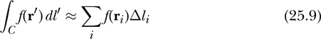

这是标量线积分的 Haskell 定义：

```
scalarLineIntegral :: CurveApprox -> ScalarField -> Curve -> R
scalarLineIntegral approx f c
    = sum [f r' * magnitude dl' | (r',dl') <- approx c]
```

曲线`c`通过输入的函数`approx`进行近似。对于每个在位置`r'`的段`dl'`，在位置`r'`处计算标量场`f`，并与`dl'`的大小相乘。然后，我们将这些数值相加，以得到积分的近似值。

#### 标量曲面积分

标量曲面积分接受一个标量场*f*和一个曲面*S*作为输入，并返回一个标量作为输出。

```
type ScalarSurfaceIntegral = ScalarField -> Surface -> R
```

积分是通过将曲面*S*分成许多小块来定义并进行近似的，正如我们在进行矢量曲面积分时所做的那样。在每个小块Δ**a**[*i*]的点**r**[*i*]处，评估标量场*f*，然后与小块的大小*Δa[i]*相乘，再将结果相加。

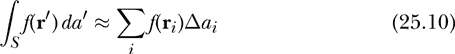

这是标量曲面积分的 Haskell 定义：

```
scalarSurfaceIntegral :: SurfaceApprox -> ScalarField -> Surface -> R
scalarSurfaceIntegral approx f s
    = sum [f r' * magnitude da' | (r',da') <- approx s]
```

曲面`s`通过函数`approx`进行近似。对于位置`r'`处的每个小块`da'`，在位置`r'`评估标量场`f`并与`da'`的大小相乘。然后我们将这些数值相加，从而得到积分的近似值。

#### 标量体积积分

标量体积积分接受一个标量场*f*和一个体积*V*作为输入，并返回一个标量作为输出。

```
type ScalarVolumeIntegral = ScalarField -> Volume -> R
```

积分是通过将体积*V*分成许多小部分来定义并进行近似的，正如我们在进行矢量体积积分时所做的那样。在每个部分中，标量场*f*在该部分处进行评估，并与该部分的体积Δ[v*i*]相乘，再将结果相加。

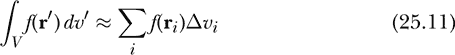

这是标量体积积分的 Haskell 定义：

```
scalarVolumeIntegral :: VolumeApprox -> ScalarField -> Volume -> R
scalarVolumeIntegral approx f vol
    = sum [f r' * dv' | (r',dv') <- approx vol]
```

体积`vol`通过函数`approx`进行近似。对于位置`r'`处的每一部分`dv'`，在位置`r'`评估标量场`f`并与`dv'`相乘。然后我们将这些数值相加，从而得到积分的近似值。

在我们离开本章之前，还有一个细节需要讨论，那就是当我们对这些形状进行积分时，用来近似曲线、曲面和体积的方法。现在让我们讨论这个细节。

### 近似曲线、曲面和体积

我们已经见过多种情况，我们希望通过线积分、曲面积分或体积积分对曲线、曲面或体积上的内容进行求和。当我们要求和的是矢量时，我们使用矢量线积分、矢量曲面积分或矢量体积积分。类似地，当我们要求和的是标量时，我们使用标量线积分、标量曲面积分或标量体积积分。无论是加标量还是加矢量，我们的方法都要求我们将曲线、曲面和体积近似为有限的数据列表。这个近似是本节的主题；尽管有多种方法可以进行近似，但我们将为每个几何对象提供一种近似方法。数值分析的研究内容是探索不同的近似方法，研究其中的权衡，并以巧妙和高效的方式进行处理。在我们的情况中，我们关注的是简单且易于理解的做法。

#### 近似曲线

记住，曲线近似是将曲线转化为位置和位移向量列表的一种方式。

```
-- introduced earlier in the Chapter
type CurveApprox = Curve -> [(Position,Vec)]
```

我们的函数`curveSample`通过多个段来逼近一条曲线，返回一个段的位置和位移向量的列表。

```
curveSample :: Int -> Curve -> [(Position,Vec)]
curveSample n c
    = let segCent :: Segment -> Position
          segCent (p1,p2) = shiftPosition ((rVF p1 ^+^ rVF p2) ^/ 2) origin
          segDisp :: Segment -> Vec
          segDisp = uncurry displacement
      in [(segCent seg, segDisp seg) | seg <- segments n c]
```

该函数接受一个整数`n`，用于控制生成的段数，每个段由起始位置和结束位置组成。

```
type Segment = (Position,Position)
```

大部分工作由接下来的`segments`函数完成，当给定整数`n`和曲线`c`时，它返回一个段的列表。局部函数`segCent`找到每个段的中心。`rVF`向量场，在第二十二章中介绍，将位置转换为位移向量，接着`shiftPosition`函数对位移向量进行平均并转换回位置。

局部函数`segDisp`计算每个段的位移向量。位移向量从段的起始位置指向段的结束位置。函数`segDisp`是第二十二章中`displacement`的非柯里化版本，接受一对位置而非柯里化函数。

我们在局部定义了`segCent`和`segDisp`，因为它们在其他函数中并没有被使用。需要注意的是，我们仍然可以为它们提供类型签名，尽管这不是必须的。像这样的特定用途函数最好局部定义，因为这样可以减少全局命名空间中的内容，并帮助代码阅读者理解局部函数`segCent`与其父函数`curveSample`之间的关系。`segCent`是局部的这一事实提醒读者该函数不会在其他地方使用。

函数`segments`在给定曲线时返回一个段的列表。

```
segments :: Int -> Curve -> [Segment]
segments n (Curve g a b)
    = let ps = map g $ linSpaced n a b
      in zip ps (tail ps)
```

请注意，`segments`的第一个参数是整数`n`，控制生成多少个段。我们使用模式匹配将曲线`Curve g a b`作为输入传入，因为这个函数需要引用曲线的参数限制`a`和`b`，以及参数化函数`g`。该函数首先使用下面定义的`linSpaced`函数将曲线的参数区间`a`到`b`分成`n`个相等的小区间。在这些小区间的`n+1`个端点上，我们应用函数`g`，形成一个包含`n+1`个位置的列表`ps`。然后，我们将列表`ps`与其尾部配对，生成所需的`n`个段。将列表与其尾部配对会将第一个和第二个项、第二个和第三个项、第三个和第四个项，依此类推，配对起来。

函数`linSpaced`返回一个线性间隔的数字列表。

```
linSpaced :: Int -> R -> R -> [R]
linSpaced n x0 x1 = take (n+1) [x0, x0+dx .. x1]
    where dx = (x1 - x0) / fromIntegral n
```

输入的`n`是间隔的数量，因此该函数返回一个包含`n+1`个数字的列表，起始值为`x0`，直到包括`x1`。由于`n`的类型是`Int`，而`x1 - x0`的类型是`R`，我们需要使用`fromIntegral`函数将`n`转换为`R`类型，然后才能进行除法操作。我们使用`take`函数处理初始值`x0`和最终值`x1`相同的情况，在这种情况下，`dx`为 0，算术序列是一个包含相同数字的无限列表。`take`函数只返回该无限列表的前`n+1`个元素。

这里有两个`linSpaced`的使用示例：

```
*ElectricField> :l ElectricField
[ 1 of 12] Compiling Newton2          ( Newton2.hs, interpreted )
[ 2 of 12] Compiling Mechanics1D      ( Mechanics1D.hs, interpreted )
[ 3 of 12] Compiling SimpleVec        ( SimpleVec.hs, interpreted )
[ 4 of 12] Compiling Mechanics3D      ( Mechanics3D.hs, interpreted )
[ 5 of 12] Compiling MultipleObjects  ( MultipleObjects.hs, interpreted )
[ 6 of 12] Compiling MOExamples       ( MOExamples.hs, interpreted )
[ 7 of 12] Compiling Electricity      ( Electricity.hs, interpreted )
[ 8 of 12] Compiling CoordinateSystems ( CoordinateSystems.hs, interpreted )
[ 9 of 12] Compiling Geometry         ( Geometry.hs, interpreted )
[10 of 12] Compiling VectorIntegrals  ( VectorIntegrals.hs, interpreted )
[11 of 12] Compiling Charge           ( Charge.hs, interpreted )
[12 of 12] Compiling ElectricField    ( ElectricField.hs, interpreted )
Ok, 12 modules loaded.
 *ElectricField> linSpaced 4 0 2
[0.0,0.5,1.0,1.5,2.0]
*ElectricField> linSpaced 4 3 3
[3.0,3.0,3.0,3.0,3.0]
```

现在我们已经探索了近似曲线的一种方式，接下来让我们做同样的事情来近似表面。

#### 近似一个表面

请记住，表面近似是将一个表面转换为位置和向量面积的列表。

```
-- introduced earlier in the Chapter
type SurfaceApprox = Surface -> [(Position,Vec)]
```

我们的函数`surfaceSample`将一个表面近似为多个三角形，返回一个包含三角形位置和向量面积的列表。

```
surfaceSample :: Int -> Surface -> [(Position,Vec)]
surfaceSample n s = [(triCenter tri, triArea tri) | tri <- triangles n s]
```

该函数接受一个整数`n`，控制生成的三角形数量。大部分工作由函数`triangles`完成，当给定整数`n`和表面`s`时，它返回一个三角形列表。函数`triCenter`找到每个三角形的中心，函数`triArea`计算每个三角形的向量面积。以下是这两个函数的定义。

三角形通过指定其三个顶点的位置来描述。

```
data Triangle = Tri Position Position Position
```

三角形有一个方向，因此我们指定顶点的顺序非常重要。如果我们从一个地方观察三角形，其中顶点`p1`、`p2`和`p3`按逆时针顺序排列，则方向从三角形指向我们的观察位置，垂直于三角形表面。`Tri p1 p2 p3`、`Tri p2 p3 p1`和`Tri p3 p1 p2`都表示具有相同方向的同一个三角形，但`Tri p1 p3 p2`、`Tri p2 p1 p3`和`Tri p3 p2 p1`表示具有相同顶点但方向相反的三角形。

我们通过对三个顶点的位移向量进行平均来找到三角形的中心。

```
triCenter :: Triangle -> Position
triCenter (Tri p1 p2 p3)
    = shiftPosition ((rVF p1 ^+^ rVF p2 ^+^ rVF p3) ^/ 3) origin
```

我们使用`rVF`向量场将位置转换为位移向量，这在第二十二章中介绍。然后我们对它们求平均，并使用`shiftPosition`函数将其转换回位置。

三角形的向量面积是两个向量边的叉积的一半。由于我们关心这些三角形的方向，因此我们需要小心进行叉积的操作顺序。

```
triArea :: Triangle -> Vec  -- vector area
triArea (Tri p1 p2 p3) = 0.5 *^ (displacement p1 p2 >< displacement p2 p3)
```

函数`triangles`在给定一个表面时返回一个三角形列表。

```
triangles :: Int -> Surface -> [Triangle]
triangles n (Surface g sl su tl tu)
    = let sts = [[(s,t) | t <- linSpaced n (tl s) (tu s)]
                     | s <- linSpaced n sl su]
          stSquares = [( sts !! j    !! k
                       , sts !! (j+1) !! k
                       , sts !! (j+1) !! (k+1)
                       , sts !! j    !! (k+1))
                      | j <- [0..n-1], k <- [0..n-1]]
          twoTriangles (pp1,pp2,pp3,pp4)
              = [Tri (g pp1) (g pp2) (g pp3),Tri (g pp1) (g pp3) (g pp4)]
      in concatMap twoTriangles stSquares
```

注意，`triangles`的第一个参数是整数`n`，它控制将生成多少个三角形。我们通过对输入进行模式匹配，传递表面`Surface g sl su tl tu`，因为该函数需要引用表面的参数限制`sl`和`su`，以及表面的所有其他属性。

该函数首先将曲面的参数区间从`sl`到`su`划分为`n`个相等的子区间。在这些`n+1`个子区间的每个端点，我们将参数区间从`tl s`到`tu s`划分为`n`个相等的子区间，其中`s`是每个子区间端点的*参数值*。局部变量`sts :: [[(R,R)]]`是一个列表的列表，可以看作是一个`n+1`×`n+1`的矩阵，包含与曲面上的点对应的参数对。局部变量`stSquares :: [((R,R),(R,R),(R,R),(R,R))]`是一个包含`n²`个“平方”的列表，每个平方由参数对组成。这些平方通过局部函数`twoTriangles`转化为两个三角形。函数`triangles`返回一个包含`2*n²`个三角形的列表，用于近似曲面。

现在我们展示了一种近似曲面的方式，让我们转向近似体积的问题。

#### 近似体积

体积近似是一种将体积转化为位置列表和数值体积的方法。

```
-- introduced earlier in the Chapter
type VolumeApprox = Volume -> [(Position,R)]
```

我们的函数`volumeSample`通过多个四面体来近似一个体积。四面体是一个四面体固体，其中每一面都是一个三角形。该函数返回一个四面体位置和数值体积的列表。

```
volumeSample :: Int -> Volume -> [(Position,R)]
volumeSample n v = [(tetCenter tet, tetVolume tet) | tet <- tetrahedrons n v]
```

该函数接受一个整数`n`，它控制所使用的四面体数量。大部分工作由下面定义的函数`tetrahedrons`完成，该函数在给定整数`n`和体积`v`时返回四面体列表。函数`tetCenter`找到每个四面体的中心，函数`tetVolume`计算每个四面体的数值体积。这两个函数也在下面定义。

我们可以通过指定四个顶点的位置来描述一个四面体。

```
data Tet = Tet Position Position Position Position
```

我们可以通过对四个顶点的位移向量求平均来找到一个四面体的中心。

```
tetCenter :: Tet -> Position
tetCenter (Tet p1 p2 p3 p4)
    = shiftPosition ((rVF p1 ^+^ rVF p2 ^+^ rVF p3 ^+^ rVF p4) ^/ 4) origin
```

该函数是`triCenter`函数从三角形到四面体的自然扩展。

四面体的体积是*标量三重积*的 1/6，定义为**a** ⋅ (**b** × **c**)，其中三个向量边从一个顶点出发或终止于一个顶点。标量三重积也是一个矩阵的行列式，该矩阵的列是这三个向量边。

```
tetVolume :: Tet -> R
tetVolume (Tet p1 p2 p3 p4)
    = abs $ (d1 <.> (d2 >< d3)) / 6
      where
        d1 = displacement p1 p4
        d2 = displacement p2 p4
        d3 = displacement p3 p4
```

我们使用`abs`函数来保证数值体积为正。

就像我们使用“参数平方”来覆盖曲面的参数空间一样，现在我们使用“参数立方体”来覆盖体积的参数空间。让我们为参数立方体定义一个数据类型。

```
data ParamCube
    = PC { v000 :: (R,R,R)
         , v001 :: (R,R,R)
         , v010 :: (R,R,R)
         , v011 :: (R,R,R)
         , v100 :: (R,R,R)
         , v101 :: (R,R,R)
         , v110 :: (R,R,R)
         , v111 :: (R,R,R)
         }
```

函数`tetrahedrons`在给定体积时返回一个四面体列表。

```
tetrahedrons :: Int -> Volume -> [Tet]
tetrahedrons n (Volume g sl su tl tu ul uu)
    = let stus = [[[(s,t,u) | u <- linSpaced n (ul s t) (uu s t)]
                            | t <- linSpaced n (tl s) (tu s)]
                            | s <- linSpaced n sl su]
          stCubes = [PC (stus !!  j    !!  k    !!  l   )
                        (stus !!  j    !!  k    !! (l+1))
                        (stus !!  j    !! (k+1) !!  l   )
                        (stus !!  j    !! (k+1) !! (l+1))
                        (stus !! (j+1) !!  k    !!  l   )
                        (stus !! (j+1) !!  k    !! (l+1))
                        (stus !! (j+1) !! (k+1) !!  l   )
                        (stus !! (j+1) !! (k+1) !! (l+1))
                    | j <- [0..n-1], k <- [0..n-1], l <- [0..n-1]]
          tets (PC c000 c001 c010 c011 c100 c101 c110 c111)
              = [Tet (g c000) (g c100) (g c010) (g c001)
                ,Tet (g c011) (g c111) (g c001) (g c010)
                ,Tet (g c110) (g c010) (g c100) (g c111)
                ,Tet (g c101) (g c001) (g c111) (g c100)
                ,Tet (g c111) (g c100) (g c010) (g c001)
                ]
      in concatMap tets stCubes
```

请注意，`tetrahedrons`的第一个参数是一个整数`n`，它控制将产生多少个四面体。我们使用模式匹配对输入进行处理，传递体积`Volume g sl su tl tu ul uu`，因为此函数需要引用体积的参数限制`sl`和`su`，以及体积的其他所有属性。

该函数通过将体积的参数区间从 `sl` 到 `su` 分成 `n` 个相等的小区间开始。在这些小区间的 `n+1` 个端点处，我们将参数区间从 `tl s` 到 `tu s` 分成 `n` 个相等的小区间，其中 `s` 是每个子区间端点的 *s* 参数值。最后，对于第三维度，我们将每个参数区间从 `ul s t` 到 `uu s t` 分成 `n` 个相等的小区间，其中 `t` 是每个子区间端点的 *t* 参数值。局部变量 `stus :: [[[(R,R,R)]]]` 是一个列表的列表的列表，可以看作是一个 `n+1` x `n+1` x `n+1` 的参数三元组数组，对应于体积中的点。局部变量 `stCubes ::` `[ParamCube]` 是一个包含 `n³` 个参数立方体的列表。局部函数 `tets` 将每个立方体转换为五个四面体。函数 `tetrahedrons` 返回一个包含 `5*n³` 个四面体的列表，用于近似该体积。

### 摘要

本章介绍了如何计算由电荷分布产生的电场。我们编写了函数来计算点电荷、线电荷、面电荷和体电荷产生的电场。在实现这一目标的过程中，我们引入了矢量线积分、矢量面积分和矢量体积分。我们编写了一个函数

```
eField :: ChargeDistribution -> VectorField
```

该函数通过结合我们为每种电荷分布编写的函数，计算任何电荷分布的电场。

在引入三种矢量积分（线积分、面积分和体积分）后，我们借此机会定义了三种标量积分，其中我们加总的是数值而不是矢量。本章以曲线、曲面和体积的逼近方法为结尾。对这些几何体进行数值积分需要我们有方法将物体划分为有限数量的部分。我们展示了每种物体的一个划分方法。下一章将讨论电流分布，它与本章的电荷分布类似。就像电荷是电场的源头一样，电流是磁场的源头。

### 习题

**练习 25.1.** 考虑一段均匀线性电荷密度为 *λ*[0] 的线电荷段。我们将这段线电荷置于 x 轴上，从 *x* = *–L*/2 到 *x* = *L*/2。我们想要找出该线电荷段在 xy 平面某点产生的电场。编写代码绘制该线电荷段产生的电场图像。你可以将注意力集中在 xy 平面内。由一段线电荷产生的电场是一个完全可解的问题。找出或计算出精确解，并绘制精确电场图像以作比较。

**练习 25.2.** 画出由均匀带电盘产生的电场图像。将盘放置在 xy 平面，并在 xz 平面中展示电场。

**练习 25.3.** 绘制由均匀带电球体产生的电场强度与距离球体中心的关系图。将我们的数值方法与精确解进行比较。

**练习 25.4.** 考虑一个位于 xy 平面的带电环，半径为*R*，线电荷密度*λ*(**r**) = *λ*[0] cos *ϕ*，其中*ϕ*是圆柱坐标，*R*和*λ*[0]是可以选择的常数。创建一个 3D 可视化图像，展示由该电荷分布产生的电场。

**练习 25.5.** 在上一章中，有一道练习要求你为氢原子的基态写出电荷分布。找到氢原子在空间中任意一点产生的电场。绘制电场强度随质子距离变化的图像。

**练习 25.6.** 画出由位于正方形四个角的四个相等的正点电荷产生的电场图像。

**练习 25.7.** 绘制由位于 xy 平面的均匀正表面电荷密度的方形板产生的电场在 xz 平面上的图像。

**练习 25.8.** 绘制由位于原点的 xy 平面内均匀带电圆环产生的 xy 平面和 yz 平面上的电场图像。

**练习 25.9.** 如果`scalarLineIntegral`和`vectorLineIntegral`这两个函数看起来基本上在做相同的事情，且我们应该能够利用某种共性将它们合并成一个既能做标量线积分又能做向量线积分的函数，那么你是对的。

首先，我们定义一个通用场，它可以是标量场、向量场或其他类型。

```
type Field a = Position -> a
```

类型`ScalarField`与`Field R`相同，类型`VectorField`与`Field Vec`相同。

接下来，我们为抽象向量创建一个类型类，这些类型具有零向量，能够进行加法运算，并且可以由实数进行缩放。

```
class AbstractVector a where
    zeroVector :: a
    add   :: a -> a -> a
    scale :: R -> a -> a
```

我们编写一个函数`sumG`，用于求和一个抽象向量列表。该函数是借鉴自第十章中的`sumV`函数。

```
sumG :: AbstractVector a => [a] -> a
sumG = foldr add zeroVector
```

使用这些工具，我们可以写出一个通用的线积分函数，它既可以作为标量线积分，也可以作为向量线积分。

```
generalLineIntegral
    :: AbstractVector a => CurveApprox -> Field a -> Curve -> a
generalLineIntegral approx f c
    = sumG [scale (magnitude dl') (f r') | (r',dl') <- approx c]
```

编写实例声明，使得类型`R`和`Vec`成为类型类`AbstractVector`的实例。

**练习 25.10.** *高斯定律*断言，*电通量*通过一个封闭表面的值与该表面所包围的电荷成正比。一个向量场的*通量*描述了如果我们将向量视为某种流体的速度，那么通过一个表面的总流量。电通量Φ*[E]*通过一个表面*S*的定义是电场的表面点积积分。

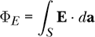

点表面积积分的定义与我们在本章定义的向量表面积积分非常相似。该积分通过将表面 *S* 划分为许多小块来定义。每个小块 Δ**a**[*i*] 是一个向量，其大小表示该小块的面积，方向指向垂直于小块的方向。电场 **E** 在点 **r**[*i*] 上被评估，位于或接近小块 Δ**a**[*i*]，并与小块的向量面积 Δ**a**[*i*] 点积。然后，我们将这些数值加起来，形成总和：

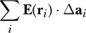

积分是通过将小块的面积趋近于 0，且小块的数量变得无限大的过程，得到的该向量和的极限。

这是点表面积积分的 Haskell 代码，也称为 *通量积分*：

```
dottedSurfaceIntegral :: SurfaceApprox -> VectorField -> Surface -> R
dottedSurfaceIntegral approx vF s
    = sum [vF r' <.> da' | (r',da') <- approx s]
```

(a) 编写一个函数

```
electricFluxFromField :: VectorField -> Surface -> R
electricFluxFromField = undefined
```

接受电场和表面作为输入，并返回电通量作为输出的函数。

(b) 编写一个函数

```
electricFluxFromCharge :: ChargeDistribution -> Surface -> R
electricFluxFromCharge dist = undefined dist
```

返回由给定电荷分布的电场产生的通过给定表面的电通量的函数。

**练习 25.11.** 比较 NaCl 产生的电场 `eFieldLineDipole`，将其视为线偶极子，与简单偶极子和理想偶极子的电场。制作一个类似于我们为简单偶极子和理想偶极子所做的矢量场图。

**练习 25.12.** 点电荷是电场的基本源。给定一个表面近似，我们可以通过将其视为一组点电荷来找到表面电荷的电场。表面近似告诉我们在哪里放置点电荷，以及它们应该具有的值。通过这种方式，我们跳过了本来是我们计算电场的主要方法——向量表面积积分。

```
eFieldFromSurfaceChargeP :: SurfaceApprox -> ScalarField -> Surface
                         -> VectorField
eFieldFromSurfaceChargeP approx sigma s r
    = sumV [eFieldFromPointCharge (sigma r' * magnitude da') r' r
                | (r',da') <- approx s]
```

编写类似的函数来计算由线电荷和体电荷产生的电场。

**练习 25.13.** 编写一个函数

```
surfaceArea :: Surface -> R
surfaceArea = undefined
```

使用 `scalarSurfaceIntegral` 计算表面的表面积的函数。

**练习 25.14.** 电势是一个标量场，可以通过以下方式根据电场定义：

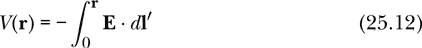

积分是对任意曲线 *C* 进行的点线积分，该曲线从原点开始，终点为场点 **r**。电静场 **E** 的保守性保证了结果与所选曲线 *C* 无关。

点线积分通过将曲线 *C* 分割为许多小段来定义和逼近，正如我们为向量线积分所做的那样。

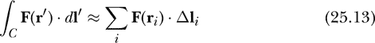

在逼近的每个点 **r**[*i*] 处评估矢量场 **F**，与段的位移 Δ**l**[*i*] 点积，然后加总。

这是点线积分的 Haskell 定义：

```
dottedLineIntegral :: CurveApprox -> VectorField -> Curve -> R
dottedLineIntegral approx f c = sum [f r' <.> dl' | (r',dl') <- approx c]
```

编写一个函数

```
electricPotentialFromField :: VectorField  -- electric field
                           -> ScalarField  -- electric potential
electricPotentialFromField ef r = undefined ef r
```

它将电场作为输入，并返回电势作为输出。为了编写这个函数，你需要构造一条从原点开始并以我们希望找到电势的场点结束的曲线。然后，可以将这条曲线传递给`dottedLineIntegral`。
