## 26

电流


电流是运动中的电荷。在电路中，比如我们家里和办公室里的电流，是电荷沿着电线流动，但考虑到电荷可能横跨表面或贯穿体积的情况也是很有用的。这三种电流分布——线电流、表面电流和体积电流——是本章讨论的主题。

本章与第二十四章关于电荷的内容相对应。我们将介绍电流、表面电流密度和体积电流密度的概念。接着，我们将定义一个电流分布的数据类型，能够表示线电流、表面电流、体积电流或这些的任意组合。正如电荷是电场的源头一样，电流是磁场的源头。我们将展示如何计算任意电流分布的磁偶极矩，并讨论其与电荷分布的电偶极矩的相似性与差异性。掌握电流分布的语言为我们准备好进入下一章，在这一章中我们将计算由电流分布产生的磁场。

### 电流分布

电流显然是一个电学现象，是电荷的流动。但在 1820 年，汉斯·克里斯蒂安·奥斯特德（Hans Christian Oersted）证明了电流也是一个磁学现象，建立了电与磁之间的第一个联系。现代电磁理论将电流视为磁场的基本来源。

换句话说，电流是产生磁效应的基本量（尽管在人们首次观察到磁现象后，花了几千年才发现这一点），并在电磁理论中起着关键作用。我们使用三种类型的电流分布。首先是沿着一维路径（如直线或曲线）流动的电流，我们通常简称其为*电流*。电流的国际单位制单位是安培（A）。在电线中流动的 1 安培电流意味着每秒有 1 库仑的电荷通过电线上的固定点。我们通常用符号*I*表示电流。根据约定，电流是正电荷的流动。这个约定是在人们还不知道金属中是自由流动的负电荷（电子）在导电之前就已经建立的。按照这个约定，向左流动的电子会在电流中产生向右的方向。

第二种电流分布是电流流过二维表面的情况。在这种情况下，我们称其为*表面电流密度* **K**，表示单位横截面长度的电流。表面电流密度的国际单位制单位是安培每米（A/m）。

最后，电流在三维体积中流动。在这种情况下，我们讨论的是*体积电流密度* **J**，即单位横截面积上的电流。体积电流密度的 SI 单位是安培每平方米（A/m²）。表 26-1 总结了这些电流分布。

**表 26-1：** 电流分布

| **电流分布** | **维度** | **符号** | **SI 单位** |
| --- | --- | --- | --- |
| 点电流 | 0 | 不可能 | 不可能 |
| 当前 | 1 | *我* | A |
| 表面电流密度 | 2 | **K** | A/m |
| 体积电流密度 | 3 | **J** | A/m² |

现在我们转向我们的 Haskell 代码。

### 引导代码

列出 26-1 显示了我们将在本章中编写的 `Current` 模块的前几行代码。

```
{-# OPTIONS -Wall #-}

module Current where

import SimpleVec
    ( R, Vec, sumV, (><), (*^) )
import CoordinateSystems
    ( VectorField, rVF, cyl, phiHat )
import Geometry
    ( Curve(..), Surface(..), Volume(..) )
import ElectricField
    ( CurveApprox, curveSample, surfaceSample, volumeSample
    , vectorSurfaceIntegral, vectorVolumeIntegral )
```

*列出 26-1：`Current` 模块的代码开头*

在这里，我们使用了第十章的 `SimpleVec` 模块，第二十二章的 `CoordinateSystems` 模块，第二十三章的 `Geometry` 模块和第二十五章的 `ElectricField` 模块中的类型和函数。

让我们为电流定义一个类型同义词。

```
type Current = R
```

这类似于我们为 `Charge` 创建的类型同义词。这是为电流创建类型的一种简单方式，但由于 `Current`、`Charge` 和 `R` 都是相同的类型，编译器将无法帮助我们防止错误地在应该使用 `Current` 的地方使用 `Charge`，反之亦然。

现在我们已经为电流指定了一个类型，让我们看一下电流分布的类型，它会稍微复杂一些。

### 电流分布的类型

就像我们在第二十四章中做的那样，这里我们需要一个新的数据类型 `CurrentDistribution`，它可以容纳线电流、表面电流、体积电流或这些的组合。我们需要哪些信息来指定每种电流？对于线电流，我们需要指定电流流动的曲线以及电流的数值。线电流要求我们给出一个 `Current` 和一个 `Curve`。

为了指定表面电流，我们需要给出一个表面电流密度的矢量场，该密度可能因位置不同而变化，以及电流流过的表面。表面电流通过给定一个 `VectorField` 和一个 `Surface` 来指定。类似地，体积电流通过给定一个 `VectorField` 和一个 `Volume` 来指定。最后，电流分布的组合通过给定电流分布的列表来指定。

让我们看看定义数据类型 `CurrentDistribution` 的代码。

```
data CurrentDistribution
  = LineCurrent    Current    Curve
  | SurfaceCurrent VectorField Surface
  | VolumeCurrent  VectorField Volume
  | MultipleCurrents [CurrentDistribution]
```

`CurrentDistribution` 类型有四个数据构造器，每个构造器对应我们之前描述的情况之一。为了构造一个 `CurrentDistribution`，我们使用四个数据构造器中的一个，并提供该种电流分布的相关信息。

### 电流分布示例

让我们编写一些电流分布的示例。电流绕着位于原点的 xy 平面中的圆形环流动的电流分布称为`circularCurrentLoop`。

```
circularCurrentLoop :: R  -- radius
                    -> R  -- current
                    -> CurrentDistribution
circularCurrentLoop radius i
    = LineCurrent i (Curve (\phi -> cyl radius phi 0) 0 (2*pi))
```

这是最简单的电流分布之一。函数`circular` `CurrentLoop`接受半径和电流作为输入，并返回一个电流分布。在接下来的章节中，我们将计算由这种电流分布产生的磁场。圆形电流环也是磁偶极子的一个例子，我们将在本章后面讨论。

*电磁线圈*由绕在圆柱形框架上的许多圈电线组成。函数`wireSolenoid`在提供了电磁线圈的半径、电磁线圈的长度、每单位长度的线圈圈数以及电线中的电流后，返回一个电流分布。

```
wireSolenoid :: R  -- radius
             -> R  -- length
             -> R  -- turns/length
             -> R  -- current
             -> CurrentDistribution
wireSolenoid radius len n i
    = LineCurrent i (Curve (\phi -> cyl radius phi (phi/(2*pi*n)))
                               (-pi*n*len) (pi*n*len))
```

电线的曲线是一个螺旋形。我们使用圆柱坐标*ϕ*来参数化这条曲线。随着*ϕ*的增大，z 坐标也增加，从而形成螺旋。如果*n*是单位长度上的线圈圈数，*L*是长度，那么电磁线圈上将有*nL*圈电线。为了产生这个数量的线圈，参数*ϕ*必须从起点到终点经历 2*πnL*弧度。我们将*ϕ*的范围设定为- *πnL*到*πnL*，这样电磁线圈就会集中在原点。我们希望*z*的范围是- *L*/2 到*L*/2；如果我们将*ϕ*除以 2*πn*，就能达到这一目标，因此我们在`cyl`函数中使用*ϕ*/2*πn*作为 z 坐标。

在*片状电磁线圈*中，我们设想电线圈的线圈非常紧密，以至于电流实际上是一个表面电流。我们使用与`wireSolenoid`相同的输入来调用`sheetSolenoid`。

```
sheetSolenoid :: R  -- radius
              -> R  -- length
              -> R  -- turns/length
              -> R  -- current
              -> CurrentDistribution
sheetSolenoid radius len n i
    = SurfaceCurrent (\r -> (n*i) *^ phiHat r)
      (Surface (\(phi,z) -> cyl radius phi z)
       0 (2*pi) (const $ -len/2) (const $ len/2))
```

由于片状电磁线圈是表面电流，它需要一个表面电流密度**K**。表面电流密度是单位横截面长度上的电流，因此我们有*K* = *nI*；表面电流密度的大小是电流与单位长度的线圈圈数的乘积。表面电流密度的方向是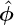，因此表面电流密度是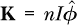，在代码中给出为`\r -> (n*i) *^ phiHat r`。表面是一个圆柱面，由圆柱坐标*ϕ*和*z*来参数化。*ϕ*的范围是从 0 到 2*π*，尽管我们可以选择- *π*到*π*并得到相同的结果。*z*的范围是- *L*/2 到*L*/2。我们需要使用`const`函数，因为表面需要限制第二个参数，这些限制是第一个参数的函数。如果线圈很紧密，电磁线圈将产生与片状电磁线圈非常相似的磁场。

*环形线圈*是通过将电线绕在一个环形物体上形成的，如图 26-1 所示。

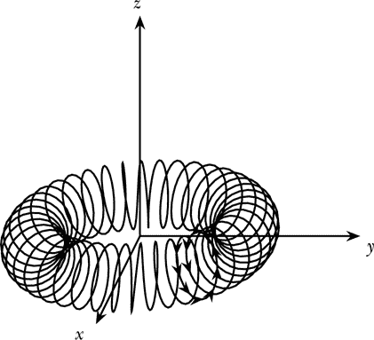

*图 26-1：一个具有 40 圈的环形线圈。电线上的箭头表示电流的方向。*

注意

*螺线管和环形线圈都作为*电感器*使用在电路中，电感器是一种可以帮助平滑电压变化的电路元件。对于像调光器这样的设备，环形线圈通常更好，因为大多数磁场都位于环形中，这意味着磁场变化时，较少的电磁噪声会被释放到房间中。噪声的频率是生成电力的频率（在美国是 60 Hz）及其倍数，可能会产生烦人的嗡嗡声，因此最好最小化噪声。*

函数`wireToroid`在提供了一个小半径、大半径、总圈数和电流时，返回一个电流分布。

```
wireToroid :: R  -- small radius
           -> R  -- big radius
           -> R  -- number of turns
           -> R  -- current
           -> CurrentDistribution
wireToroid smallR bigR n i
    = let alpha phi = n * phi
          curve phi = cyl (bigR + smallR * cos (alpha phi)) phi
                      (smallR * sin (alpha phi))
      in LineCurrent i (Curve curve 0 (2*pi))
```

环形曲线基于我们在练习 26.3 中使用的环形坐标化。环形表面的两个参数是圆柱坐标系中的*ϕ*和一个角度*α*，它绕环形的小横截面圆圈旋转。环形上点的圆柱坐标通过两个参数*ϕ*和*α*给出，如下所示：

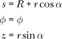

为了绘制电线环的曲线，我们选择圆柱坐标系中的*ϕ*作为唯一的参数，并让*α*现在依赖于*ϕ*。我们选择

*α*（*ϕ*） = *nϕ*

这样，*α*在小圆圈周围旋转 2*πn*弧度（*n*圈），而*ϕ*在大圆圈周围旋转 2*π*弧度（一个圈）。参数*ϕ*的限制是简单的从 0 到 2*π*。

我们将在下一章看到由电线环产生的磁场。

### 电荷守恒和稳态电流分布的约束

电荷是守恒的。这意味着任何孤立区域内的电荷总量随时间保持不变。实际上，关于电荷守恒还有一个更强的声明成立。空间中任何区域的电荷量变化恰好是电流通过该区域边界的程度。流入区域的电流将增加该区域的电荷，而流出区域的电流将减少该区域的电荷。

如果*Q*（*t*）是某个区域在时间*t*的电荷，*I*（*t*）是该区域在时间*t*外流的电流，那么

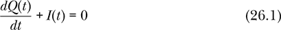

换句话说，电荷在该区域增加的速率是该区域外流净电流的负值，也就是说是该区域内流净电流的值。

通过体积电流密度**J**（*t*,**r**）流过任意（闭合或开放）表面*S*的电流由下式给出：

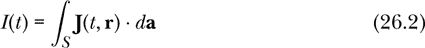

这与我们在练习 25.10 中用于计算电通量的虚线表面积积分或通量积分相同。回到我们带有电荷*Q*（*t*）和净外流电流*I*（*t*）的空间区域，我们可以使用方程 24.3 的时间依赖版本，

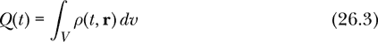

重新写方程 26.1 时，我们使用电荷密度和电流密度：

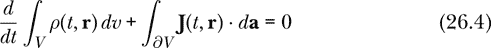

在这里，*V*是我们关注的空间区域，*∂V*是构成*V*边界的闭合表面。如果我们允许区域*V*变得非常小，我们可以将方程 26.4 两边都除以*V*的体积，从而得到一个称为*连续性方程*的方程。有关数学细节，请参见**[19**]。

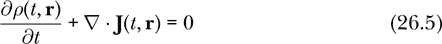

数量∇⋅**J**(*t*,**r**)被称为电流密度的*散度*。矢量场的散度是单位体积内的通量，其中通量是在体积的闭合边界表面上计算的，且在体积允许变得非常小时取极限。由于散度是单位体积的通量，因此一个矢量场散度为正的地方是矢量指向远离的地方。同样，散度为负的地方是矢量指向靠近的地方。

符号∇被称为*del 算符*，在笛卡尔坐标系中，它表示为

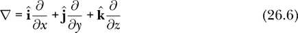

这里的*算符*一词是物理学家使用的含义，指的是一种接受函数作为输入并产生函数作为输出的东西。函数式编程者将此类东西称为*高阶函数*。del 算符与点积符号的组合形成了散度。在笛卡尔坐标系中，矢量场的散度表示如下：

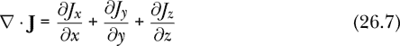

连续性方程的一个结果通过投掷一张揉皱的铝箔纸进微波炉时得到戏剧性的体现。微波在铝箔中感应出大电流，导致大量电荷在铝箔的某些部分积聚。这会产生强烈的电场，最后*啪！*当电场足够强大以致能够电离空气时，火花就会出现。

并不是每个矢量场都可以作为稳态电流密度。在本章中，我们关注的是时间上不变的稳态电流分布。如果电荷密度*ρ*(*t*,**r**)和电流密度**J**(*t*,**r**)与时间*t*无关，那么连续性方程要求∇⋅**J** = 0（即电流密度是无散的）。一个无散的矢量场也被称为*旋度*矢量场，源自螺线管的形状，或者管道。

计算机不会检查你用来表示电流密度的矢量场是否是无散的。在这种情况下，正如我们在许多其他使用计算机建模系统的情形中一样，程序员有责任确保所建模的系统是合理的。

### 磁偶极矩

就像电偶极矩可以与任何电荷分布相关联一样，磁偶极矩也可以与任何电流分布相关联。事实上，这种类比可以扩展到多极展开。就像电荷分布可以看作是单极、偶极、四极以及更高阶电多极的组合，电流分布也可以看作是磁多极的组合，*只是*这种展开中永远没有磁单极。

注意

*我们在第二十九章学习的四个麦克斯韦方程之一强制执行这个“没有磁单极”的规则。电流分布具有磁偶极矩，与电荷分布具有电偶极矩非常相似。电流分布还具有磁多极矩，这与电荷分布具有电多极矩类似。但这种类比不适用于单极矩。我们的宇宙包含电荷（电单极矩），但到目前为止还没有人发现任何磁荷（磁单极矩）。*

磁偶极子会产生磁场，并且也会通过感应到力和/或扭矩而响应磁场，因此它可以被看作是类似于电流的磁性活跃实体。

我们通过其*磁偶极矩* **m** 来表征一个磁偶极子。任何电流分布都可以与磁偶极矩相关联。不幸的是，电偶极矩作为从负电荷到正电荷的矢量的简单模型并不适用于磁偶极矩。电流 *I* 的磁偶极矩由以下公式给出：

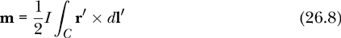

一个携带电流 *I* 的电流环的磁偶极矩为 **m** = *I***a**，其中 **a** 是环的矢量面积，面积的大小给出了面积的大小，方向垂直于该面积。

表面电流密度 **K** 的磁偶极矩由以下公式给出：

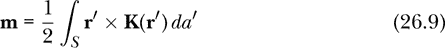

体积电流密度 **J** 的磁偶极矩由以下公式给出：

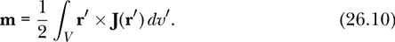

磁偶极矩通常是局部电流分布（如电流环）的一个良好简单表征，可以很好地近似该分布所产生的磁场。

一条电流的磁偶极矩通过一个交叉线积分来定义，定义如下：

```
crossedLineIntegral :: CurveApprox -> VectorField -> Curve -> Vec
crossedLineIntegral approx vF c
    = sumV [vF r' >< dl' | (r',dl') <- approx c]
```

这与我们之前定义的矢量线积分相似，只不过它涉及到一个叉乘。

这是电流分布的磁偶极矩的定义：

```
magneticDipoleMoment :: CurrentDistribution -> Vec
magneticDipoleMoment (LineCurrent    i c)
    = crossedLineIntegral   (curveSample  1000) (\r -> 0.5 *^ i *^ rVF r) c
magneticDipoleMoment (SurfaceCurrent k s)
    = vectorSurfaceIntegral (surfaceSample 200) (\r -> 0.5 *^ (rVF r >< k r)) s
magneticDipoleMoment (VolumeCurrent  j v)
    = vectorVolumeIntegral  (volumeSample   50) (\r -> 0.5 *^ (rVF r >< j r)) v
magneticDipoleMoment (MultipleCurrents ds    )
    = sumV [magneticDipoleMoment d | d <- ds]
```

表达式 `rVF r` 是指从原点到位置 `r` 的位移矢量。函数 `magneticDipoleMoment` 编码了方程式 26.8、26.9 和 26.10。

### 总结

本章介绍了电流分布，它们是磁场的基本源。我们定义了一种类型 `CurrentDistribution`，它能够容纳线电流、表面电流、体电流或它们的组合。我们电流分布的最简单例子是一个导线环。我们还编写了螺线管和环形线圈作为电流分布的示例。

对于电流分布，有一种多极展开方法，将电流看作是由磁偶极子、磁四极子和更高阶项组成的。然而，这种展开中没有磁单极项。从远处看，电流分布通常像一个磁偶极子，因此我们有时将磁偶极子看作是磁场的源，就像电荷（单极子）和电偶极子可以看作是电场的源一样。

使用我们在本章编写的代码，我们现在可以计算与任何电流分布相关的磁偶极矩。在下一章中，我们将展示如何计算由电流分布产生的磁场。

### 习题

**习题 26.1.** 一个 *赫尔姆霍兹线圈* 由两个相互平行并共享相同中心轴的圆形导线环组成，每个导线环都携带方向相同的电流 *I*。这两个环的半径都是 *R*，并且它们的间距等于半径 *R*。这个特定的间距值使得赫尔姆霍兹线圈中心的磁场相当均匀。写出赫尔姆霍兹线圈的电流分布。

```
helmholtzCoil :: R  -- radius
              -> R  -- current
              -> CurrentDistribution
helmholtzCoil radius i = undefined radius i
```

实际上，许多导线环路在两个圆圈的每个位置都被缠绕，以便导线中的适当电流将产生每个单一环路周围非常大的电流效应。

**习题 26.2.** 一个简单且常见的电流分布是一个无限长的直线电流 *I*。对于我们来说，写出一个无限长导线的电流分布并不方便，因此让我们将导线的长度作为一个参数。写出一个长直导线的电流分布。

```
longStraightWire :: R  -- wire length
                 -> R  -- current
                 -> CurrentDistribution
longStraightWire len i = undefined len i
```

**习题 26.3.** 如果环形线圈中的线圈间距非常近，我们可以通过表面电流很好地近似电流分布。写出一个类似于我们之前的平面螺线管的平面环形线圈的电流分布。这里有一个环面来帮助你开始。函数`torus`接受一个小半径和一个大半径作为输入。

```
torus :: R -> R -> Surface
torus smallR bigR
    = Surface (\(phi,alpha) -> cyl (bigR + smallR * cos alpha) phi
                               (smallR * sin alpha))
      0 (2*pi) (const 0) (const $ 2*pi)
```

**习题 26.4.** 考虑一个螺线管，它的导线绕得非常多，以至于它变得很胖。内部的导线距离中心轴是 *a*，外部的导线距离中心轴是 *b*（*a* < *b*）。我们通过在 *a* < *s* < *b* 区域内的体电流密度  来对其建模，其中 *J*[0] 是一个常数。在这个区域之外没有电流。螺线管的长度是 *L*。写出胖螺线管的电流分布。

**习题 26.5.** 对于一个不随时间变化的稳恒电流密度，我们可以写出不含时间依赖性的方程 26.2，如下所示：


编写一个计算通过表面流动的总电流的函数。

```
totalCurrent :: VectorField  -- volume current density
             -> Surface
             -> Current      -- total current through surface
totalCurrent j s = undefined j s
```
