# 第二十七章：磁场


磁铁产生磁场，但电流也会产生磁场。由于磁铁由在微观层面上有环形电流的材料构成，物理学家认为电流是磁场的基本来源。在本章中，我们将探讨电流如何产生磁场。我们将编写函数来求解上章中讨论的所有电流分布所产生的磁场，并绘制由电线圈、理想磁偶极子、螺线管和环形线圈产生的磁场图像。但首先，让我们从一个简单的磁学示例开始。

### 简单的磁效应

两根平行且电流方向相同的导线将相互吸引。在现代的磁学观点中，一个电流并不会直接对另一个电流施加力。相反，第一个电流产生磁场，而这个磁场对第二个电流施加力，如图 27-1 所示。

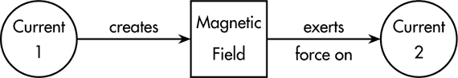

*图 27-1：当存在两个电流时，磁场作用的概念图*

磁场，像电场一样，是我们在第二十二章中讨论过的那种矢量场。磁场将一个矢量**B**（**r**）与空间中的每一个点**r**相关联；当空间中某个点**r**处有粒子时，这个矢量帮助确定该粒子所受的力。图 27-1 展示了磁场的情况，类似于图 25-1 展示了电场的情况。电场是电荷间电力的中介，而磁场是电流间磁力的中介。

引入磁场将磁场相关问题的分析分为两部分。第一部分是电流产生磁场，这将在本章讨论。第二部分是磁场对（第二个）电流施加的力，我们将在第二十八章中讨论。

现在让我们来看一些入门代码。

### 入门代码

列表 27-1 显示了我们将在本章编写的`MagneticField`模块中的第一行代码。

```
{-# OPTIONS -Wall #-}

module MagneticField where

import SimpleVec ( Vec(..), R
                 , (^-^), (*^), (^/), (<.>), (><)
                 , magnitude, kHat, zComp )
import CoordinateSystems
    ( VectorField
    , rVF, displacement, addVectorFields, cart, vfGrad )
import Geometry ( Curve(..), Surface(..), Volume(..) )
import ElectricField
    ( curveSample, surfaceSample, volumeSample
    , vectorSurfaceIntegral, vectorVolumeIntegral, mu0 )
import Current
    ( Current, CurrentDistribution(..)
    , wireSolenoid, wireToroid, crossedLineIntegral, circularCurrentLoop )
```

*列表 27-1：`MagneticField` 模块的开头代码行*

我们使用来自第十章的`SimpleVec`模块、第二十二章的`CoordinateSystems`模块、第二十三章的`Geometry`模块、第二十五章的`ElectricField`模块以及第二十六章的`Current`模块中的类型和函数。

### 电流产生磁场

现代磁学的两部分观点的第一部分是电流产生磁场。我们将从由直线电流产生的磁场开始，这是最简单的电流分布，然后再讨论更复杂的电流分布。

#### 由直线电流产生的磁场

与电荷的情况不同，在电荷的情况下，一个点电荷是最简单的电荷形式，而没有所谓的点电流。电流按定义必须流动，而它流动的最简单方式是沿着曲线或电线流动。我们假设电荷不会在电线上积聚，这是一个非常合理的假设，因为要让电荷积聚需要一些额外的工作。结果，电线中任何一点的电流都是相同的。

*比奥-萨伐尔定律*提供了一种计算由电流载流电线产生的磁场的方法。电线可以是任何形状，所以这是一个完美的机会，可以使用我们在第二十三章中定义的`Curve`数据类型。

虽然没有所谓的点电流，但比奥-萨伐尔定律仍然声称，电流载流电线的磁场可以通过电线小段的磁场贡献的叠加（即求和）来计算。每个小电流段本身不能存在，因为电流需要保持流动，但我们仍然可以计算来自小电流段的磁场贡献。

考虑一个携带电流*I*的小电线段。该段由位移向量*d**l**′表征，其长度*dl*′足够短，可以将该段视为直线，其方向与电线的切线方向一致。小电流段对位置**r**的磁场贡献**dB(r)**为：

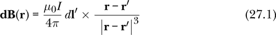

这意味着贡献与电流*I*成正比，与段长*dl*′成正比，与从源点**r′**到场点**r**的位移**r** – **r′**的平方成反比，并且方向垂直于电流和位移方向。

我们通过将所有小段的贡献相加，来计算整个电线产生的磁场。

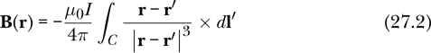

这个积分是我们在第二十六章中定义的交叉线积分。负号的引入是因为叉积是反交换的。

交叉线积分的被积函数是将源点**r′**映射到向量的函数。

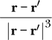

注意，**r′**是我们希望知道磁场的场点，它仅仅是这个积分式中的一个参数；它*不是*积分变量。我们应该将**r′**视为积分变量，因为它是曲线中我们必须评估积分式并求和结果的**r′**位置。

我们将在接下来的`bFieldFromLine` `Current`函数中为被积函数命名为局部名称`integrand`。`bFieldFromLineCurrent`的类型签名明确表示了计算磁场所需的两个输入：`Current`和电流流动的`Curve`。对于 Haskell 的读者而言，`bFieldFromLineCurrent`函数比公式 27.2 更清楚地描述了发生了什么，因为后者并没有明确说明磁场仅依赖于曲线和电流。

```
bFieldFromLineCurrent
    :: Current      -- current (in Amps)
    -> Curve
    -> VectorField  -- magnetic field (in Tesla)
bFieldFromLineCurrent i c r
    = let coeff = -mu0 * i / (4 * pi)  -- SI units
          integrand r' = d ^/ magnitude d ** 3
              where d = displacement r' r
      in coeff *^ crossedLineIntegral (curveSample 1000) integrand c
```

我们定义了一个局部常量`coeff`来保存– *μ*[0] *I*/4*π*在国际单位制中的数值，并定义了一个局部函数`integrand`来保存被积函数。我们想定义一个局部变量`d`来表示从`r'`到`r`的位移，但由于`r'`只在函数`integrand`内存在，`d`的定义必须放在`integrand`的定义内部，而不能与`coeff`和`integrand`的定义并列。

在第二十六章中，我们编写了电流分布的类型。在本章中，我们将编写函数来计算由每种电流分布产生的磁场。这使我们能够将电流产生磁场的概念封装到以下函数中，该函数根据任何电流分布产生磁场：

```
bField :: CurrentDistribution -> VectorField
bField (LineCurrent    i  c) = bFieldFromLineCurrent    i  c
bField (SurfaceCurrent kC s) = bFieldFromSurfaceCurrent kC s
bField (VolumeCurrent  j  v) = bFieldFromVolumeCurrent  j  v
bField (MultipleCurrents cds) = addVectorFields $ map bField cds
```

`bField`函数通过对输入的模式匹配，分别处理每种电流分布类型。对于线电流，它使用我们之前编写的`bFieldFromLineCurrent`函数。对于表面电流和体电流，它使用我们将在本章后面编写的函数。对于组合电流分布（构造函数`MultipleCurrents`），它使用叠加原理，通过对每个电流所产生的磁场进行求和来找到磁场。我们使用第二十二章中的`addVectorFields`函数来组合各个电流分布的磁场。

##### 圆形电流环的磁场

产生磁场的最简单且最自然的方法之一是使用圆形电流环。圆形电流环也是一个很好的磁偶极子模型，正如我们在第二十六章中讨论的那样。令人惊讶的是，圆形电流环所产生的磁场没有解析解。然而，我们可以通过数值积分得到一个很好的近似解，这个数值积分嵌入在我们的交叉线积分中。

考虑一个位于 xy 平面中的圆形电流环，圆心位于原点，半径为 0.25 米。当从正 z 轴看时，该电流环中流过 10 安培的电流，且电流方向为逆时针。我们可以使用第二十六章中的`circularCurrentLoop`函数来创建这种电流分布，并可以使用`bField`函数来计算由此圆形电流环产生的磁场，该函数内部调用了我们之前编写的`bFieldFromLineCurrent`函数。

```
circleB :: VectorField  -- magnetic field
circleB = bField $ circularCurrentLoop 0.25 10
```

表达式`circularCurrentLoop 0.25 10`的类型是`CurrentDistribution`；我们本可以给它起个名字，无论是在顶层，就像我们给`circleB`做的那样，或者使用`let`或`where`结构。决定给某个事物命名是编写函数式语言代码创作过程的一部分。给某个事物起个好名字会对你或代码读者有所帮助吗，还是名字会妨碍理解，转移我们对更重要思想的注意力？这是你可以一遍又一遍做出的决定。在这种情况下，我认为`circularCurrentLoop`函数及其参数已经足够好地命名了电流分布，因此无需再给它起另一个名字。

图 27-2 的左侧展示了该电流回路在 yz 平面中的磁场。图中的 x 方向从页面中突出，因此回路在 xy 平面中看起来像是一条位于图中心的水平线，那里场强最强。磁场穿过电流回路并回绕。

图 27-2 的右侧显示了理想偶极子的磁场，我们将在下文解释。

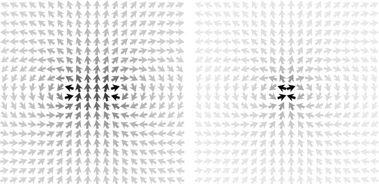

*图 27-2：由电流回路（左）和理想磁偶极子（右）产生的磁场。左侧的图像是由`bFieldPicLoop`生成的；右侧的图像是由`bFieldPicIdealDipole`生成的。图形边缘周围的磁场非常相似，表明远离源头时，电流回路看起来像一个磁偶极子。*

下面是生成左侧图像的代码：

```
bFieldPicLoop :: IO ()
bFieldPicLoop
    = vfGrad (**0.2) (\(y,z) -> cart 0 y z) (\v -> (yComp v, zComp v))
      "bFieldPicLoop.png" 20 circleB
```

我们使用来自第二十二章的`vfGrad`来绘制梯度向量场图。表达式`(**0.2)`是一个 Haskell 部分，表示函数`\x -> x**0.2`，这是一个缩放函数，我们使用它是因为随着我们远离回路，场的强度迅速减小。`vfGrad`的其他输入声明了我们希望在 yz 平面上查看场，给输出文件指定一个名称，指定每个方向上的箭头数量，并提供要绘制的向量场名称。

如前所述，电流回路是磁偶极子的一个例子。在接下来的部分，我们将更深入地研究磁偶极子。

##### 理想磁偶极子

*理想磁偶极子*是通过让回路的半径*R*趋近于 0，同时回路中的电流增大，以保持磁偶极矩*IπR*²不变，从而形成的磁场源。我们来看一下理想磁偶极子产生的磁场。

理想磁偶极子在原点产生的磁场是

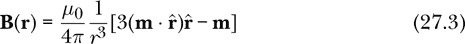

其中**m**是磁偶极矩。下面是同一个方程在 Haskell 中的翻译：

```
bFieldIdealDipole :: Vec          -- magnetic dipole moment
                  -> VectorField  -- magnetic field
bFieldIdealDipole m r
    = let coeff = mu0 / (4 * pi)    -- SI units
          rMag = magnitude (rVF r)
          rUnit = rVF r ^/ rMag
      in coeff *^ (1 / rMag**3) *^ (3 *^ (m <.> rUnit) *^ rUnit ^-^ m)
```

除了前面的系数，方程式 27.3 与方程式 25.3 对于理想电偶极子产生的电场是相同的。这种相似性体现在函数`bFieldIdealDipole`和`eFieldIdealDipole`中，它们仅在局部变量名称和前面的系数上有所不同。

图 27-2 的右侧显示了由理想磁偶极子产生的磁场。磁偶极矩**m**的大小在这个图中并不那么重要，因为最暗的箭头表示磁场的大小最大，无论其具体值是多少。方程式 27.3 表明，磁场随着偶极矩线性增加，因此对于任何 z 方向的偶极矩，图像都是相同的。

比较图 27-2 中的两幅图，我们可以看到，在图像的中心，靠近场源的地方，磁场是不同的。图像边缘的场，远离场源的地方，两个图像中的磁场非常相似。离场源稍远的地方的场的相似性使得这两个源都可以被称为磁偶极子。

这是生成图 27-2 右侧图片的代码：

```
bFieldPicIdealDipole :: IO ()
bFieldPicIdealDipole
    = vfGrad (**0.2) (\(y,z) -> cart 0 y z) (\v -> (yComp v, zComp v))
      "bFieldPicIdealDipole.png" 20 (bFieldIdealDipole kHat)
```

与`bFieldPicLoop`圆形回路程序相比，唯一的区别是文件名和磁场。这里的磁场是`bFieldIdealDipole kHat`，我们使用单位向量`kHat`表示磁偶极矩，因为它的大小不会改变图像。

我们已经看到过一个由线电流产生的磁场的例子——圆形回路，并将其与理想磁偶极子的磁场进行了比较。现在让我们来看第二个由线电流产生的磁场的例子——螺线管。

##### 线圈

在上一章中，我们将线圈定义为电流分布。现在让我们计算它的磁场。我们将观察两个线圈。每个线圈的半径为 1 厘米，长度为 10 厘米，电流为 10 安培。第一个线圈每米有 100 圈，总共 10 圈。第二个线圈每米有 1000 圈，总共 100 圈。

首先，让我们来看一下两个线圈中间的磁场。

```
Prelude> :l MagneticField
[ 1 of 14] Compiling Newton2          ( Newton2.hs, interpreted )
[ 2 of 14] Compiling Mechanics1D      ( Mechanics1D.hs, interpreted ) [ 3 of 14] Compiling SimpleVec        ( SimpleVec.hs, interpreted )
[ 4 of 14] Compiling Mechanics3D      ( Mechanics3D.hs, interpreted )
[ 5 of 14] Compiling MultipleObjects  ( MultipleObjects.hs, interpreted )
[ 6 of 14] Compiling MOExamples       ( MOExamples.hs, interpreted )
[ 7 of 14] Compiling Electricity      ( Electricity.hs, interpreted )
[ 8 of 14] Compiling CoordinateSystems ( CoordinateSystems.hs, interpreted )
[ 9 of 14] Compiling Geometry         ( Geometry.hs, interpreted )
[10 of 14] Compiling Integrals        ( Integrals.lhs, interpreted )
[11 of 14] Compiling Charge           ( Charge.hs, interpreted )
[12 of 14] Compiling ElectricField    ( ElectricField.hs, interpreted )
[13 of 14] Compiling Current          ( Current.hs, interpreted )
[14 of 14] Compiling MagneticField    ( MagneticField.hs, interpreted )
Ok, 14 modules loaded.
*MagneticField> bField (wireSolenoid 0.01 0.1 100 10) (cart 0 0 0)
vec 1.3405110355080298e-18 (-9.787828127867364e-7) 1.2326629789010703e-3
*MagneticField> bField (wireSolenoid 0.01 0.1 1000 10) (cart 0 0 0)
vec 9.429923508719186e-17 7.58448310225564e-6 1.2767867386980748e-2
```

我们看到，在这两种情况下，磁场主要在 z 方向，即沿着中心轴线，正如预期的那样。磁场的 x 分量基本为 0。y 分量虽然较小，但不为 0。由于电线呈螺旋形状，因此磁场有一个小的横向分量。对于我们特定的螺旋形状，这个小的横向分量出现在 y 方向。较长的螺线管会有更小的横向分量。

为了进行比较，一个理想的线圈具有半径 *R*、无限长、单位长度 *n* 匝，并且携带电流 *I*。物理学家喜欢理想线圈，因为只要 *n* 足够大，使得电流在圆柱体表面的几乎所有位置上都流动，那么它所产生的磁场就有一个简单的表达式。理想线圈外部的磁场（距离中央轴线超过 *R* 的场点）为 0。理想线圈内部的磁场具有均匀值 *μ*[0]*nI*，并沿线圈的中央轴线指向。所产生的磁场与半径无关。

一个理想的线圈，其单位长度上的匝数和电流与我们的第一个线圈相同，应该有 *n* = 100/m 和 *I* = 10 A，因此其磁场在中心（以及内部的任何其他位置）为

*μ*[0]*nI* = (4*π* × 10^(−7) N/A²)(100/m)(10 A) = 1.26 × 10^(−3) T

我们第一个线圈的 z 分量与这个值非常接近，尽管我们的第一个线圈在两个方面不理想：它的长度不是无限的，而且它的线圈间距为每厘米一匝（即不算太紧密）。

一个理想的线圈，其参数与我们的第二个线圈相同，将具有相同的电流，但匝数密度 *n* 是前者的 10 倍，因此其磁场将是我们刚刚计算的磁场的 10 倍。我们的第二个线圈也产生了一个接近理想线圈磁场的值。

图 27-3 展示了我们两个线圈产生的磁场。

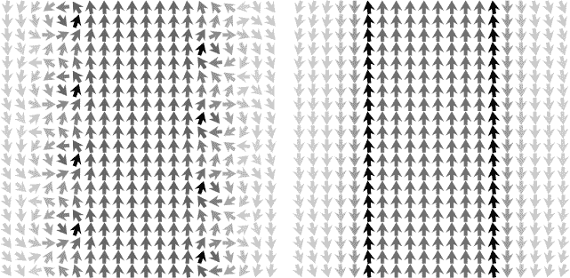

*图 27-3：两个线圈产生的磁场。两个线圈的半径为 1 cm，长度为 10 cm，电流为 10 A。左侧的线圈每米 100 匝，总共 10 匝；右侧的线圈每米 1,000 匝，总共 100 匝。图片聚焦于线圈中心的 4 cm × 4 cm 区域。左侧图像由 `bFieldPicSolenoid10` 生成；右侧图像由 `bFieldPicSolenoid100` 生成。*

图 27-3 中的图片展示了 yz 平面内的磁场。第一个线圈产生的磁场显示在左边。该图片为 yz 平面中线圈中心的 4 cm × 4 cm 区域。由于此线圈每厘米一匝，我们看到四匝线圈。在电线穿过 yz 平面的地方，磁场围绕着电线循环的地方特别显眼。磁场在靠近电线的位置最强。线圈内部的磁场明显大于外部的磁场，并且方向相反。

由第二个线圈产生的磁场显示在右侧。图片同样是一个 4 厘米 × 4 厘米的区域，位于线圈的 yz 平面中央。这个线圈每厘米有 10 圈，所以图片的高度有 40 圈。这样的圈数使得我们无法看到单独的电线。与第一个线圈相似，磁场在电线附近最强，内侧比外侧强，并且外侧的磁场方向与内侧相反。

这是制作图 27-3 图像的代码。程序`bFieldPicSolenoid10`，命名为 10 圈，总共生成左侧的图片，而`bFieldPicSolenoid100`，命名为 100 圈，总共生成右侧的图片。

```
bFieldPicSolenoid10 :: IO ()
bFieldPicSolenoid10 = vfGrad (**0.2) (\(y,z) -> cart 0 (0.02*y) (0.02*z))
                     (\v -> (yComp v, zComp v)) "bFieldPicSolenoid10.png" 20
                     (bField $ wireSolenoid 0.01 0.1 100 10)

bFieldPicSolenoid100 :: IO ()
bFieldPicSolenoid100 = vfGrad (**0.2) (\(y,z) -> cart 0 (0.02*y) (0.02*z))
                     (\v -> (yComp v, zComp v)) "bFieldPicSolenoid100.png" 20
                     (bField $ wireSolenoid 0.01 0.1 1000 10)
```

我们通过将可见正方形角落（–1, –1）和（1, 1）映射到笛卡尔坐标（0, –0.02, –0.02）和（0, 0.02, 0.02）来获得宽 4 厘米、高 4 厘米的图像，使用的函数是`\(y,z) -> cart 0 (0.02*y) (0.02*z)`。

##### 线圈环

我们在上一章中定义了线圈环作为一种电流分布。现在让我们计算它的磁场。我们将考虑一个小半径为 0.3 米、大半径为 1 米、50 圈电线、10 安培电流的线圈环。这个电流分布的表达式为`wireToroid 0.3 1 50 10`。

程序`bFieldWireToroid`给出了这个线圈环的磁场。

```
bFieldWireToroid :: VectorField
bFieldWireToroid = bField (wireToroid 0.3 1 50 10)
```

图 27-4 展示了我们线圈环产生的磁场。


*图 27-4：由线圈环产生的磁场`bFieldWireToroid`。图像由`bFieldPicWireToroid`生成。*

图 27-4 中的图片展示了 xy 平面中的磁场。图片呈 1.5 米 × 1.5 米区域，位于线圈环的中心。图片展示了磁场如何被限制在环形结构内。

这是产生该图像的代码：

```
bFieldPicWireToroid :: IO ()
bFieldPicWireToroid
    = vfGrad (**0.2) (\(x,y) -> cart (1.5*x) (1.5*y) 0)
      (\v -> (xComp v, yComp v)) "bFieldPicWireToroid.png" 20 bFieldWireToroid
```

电线圈、线圈电感和线圈环是线电流的例子。让我们提升一个维度，看看如何计算由表面电流产生的磁场。

#### 由表面电流产生的磁场

电流穿过表面时会产生磁场。为了计算这个磁场，我们必须提供两项信息：电流流过的`Surface`以及表面电流密度**K**，它表示为一个`VectorField`。

这是一个描述由表面电流产生的磁场的比奥-萨伐尔定律版本：


这是我们在第二十五章中处理的同类型的矢量表面积分。矢量表面积分的被积函数是将源点**r′**映射到矢量的函数。

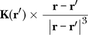

请注意，**r**是我们希望知道磁场的场点，它只是该被积函数中的一个参数；它*不是*积分变量。我们应该将**r′**视为积分变量，因为是**r′**的位置构成了我们必须在其上评估被积函数并累加结果的表面。在我们接下来要编写的`bFieldFromSurfaceCurrent`函数中，我们将被积函数命名为`integrand`。`bFieldFromSurfaceCurrent`的类型签名清楚地以计算机检查的方式表明了必须提供的两个输入和返回一个向量场的返回类型。对于 Haskell 的读者而言，`bFieldFromSurfaceCurrent`函数比方程式 27.4 更清晰地描述了发生了什么。

```
bFieldFromSurfaceCurrent
    :: VectorField  -- surface current density
    -> Surface      -- surface across which current flows
    -> VectorField  -- magnetic field (in T)
bFieldFromSurfaceCurrent kCurrent s r
    = let coeff = mu0 / (4 * pi)  -- SI units
          integrand r' = (kCurrent r' >< d) ^/ magnitude d ** 3
              where d = displacement r' r
      in coeff *^ vectorSurfaceIntegral (surfaceSample 200) integrand s
```

我们定义了一个局部常量`coeff`，用于保存*μ*[0]/4*π*的数值（单位为 SI 单位），并定义了一个局部函数`integrand`，用于保存被积函数。像之前一样，我们希望定义一个局部变量`d`，表示从`r'`到`r`的位移，但因为`r'`在函数`integrand`内部局部存在，所以`d`的定义必须放在`integrand`的定义内部，而不能与`coeff`和`integrand`的定义平行放置。

与`bFieldFromLineCurrent`类似，该函数由`bField`函数调用，后者计算由任何电流分布产生的磁场。`bField`使用的最终函数计算由体积电流产生的磁场，接下来我们将讨论这个函数。

#### 由体积电流产生的磁场

流过体积的电流会产生磁场。为了计算这个磁场，我们必须提供两个信息：电流流经的`Volume`和体积电流密度**J**，它表示为一个`VectorField`。

这是描述由体积电流产生磁场的比奥-萨伐尔定律的版本：

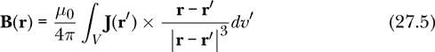

这是我们在第二十五章中处理过的同类型的向量体积积分。向量体积积分的被积函数是将源点**r′**映射到向量的函数。


函数`bFieldFromVolumeCurrent`计算由体积电流密度产生的磁场。

```
bFieldFromVolumeCurrent
    :: VectorField  -- volume current density
    -> Volume       -- volume throughout which current flows
    -> VectorField  -- magnetic field (in T)
bFieldFromVolumeCurrent j vol r
    = let coeff = mu0 / (4 * pi)  -- SI units
          integrand r' = (j r' >< d) ^/ magnitude d ** 3
              where d = displacement r' r
      in coeff *^ vectorVolumeIntegral (volumeSample 50) integrand vol
```

该函数与`bFieldFromSurfaceCurrent`的唯一区别在于，函数使用`vectorVolumeIntegral`进行体积分，而不是表面积分。与`bFieldFromLineCurrent`和`bFieldFromSurfaceCurrent`函数一样，该函数被`bField`函数调用。

### 总结

本章展示了如何计算由电流分布产生的磁场。我们编写了计算由线电流、表面电流和体积电流产生的磁场的函数。

```
bField :: CurrentDistribution -> VectorField
```

该函数通过结合我们为每个电流分布编写的函数，计算任意电流分布的磁场。我们已经研究了由电流线圈、理想磁偶极子、线圈螺线管和线圈环形磁体产生的磁场。在过去的四章中，我们专注于电磁理论中电荷（以及运动电荷，即电流）产生磁场的部分。在下一章，我们将转向电磁理论的另一部分，其中场对电荷施加力。

### 习题

**习题 27.1.** *法拉第定律* 断言磁通量与电流流经表面边界的倾向之间的关系。

磁通量 *Φ[B]* 通过表面 *S* 定义为磁场的点积分：

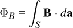

我们在 第二十五章中定义了点表面积分。

(a) 编写一个函数

```
magneticFluxFromField :: VectorField -> Surface -> R
magneticFluxFromField = undefined
```

该函数接受一个磁场和一个表面作为输入，返回磁通量作为输出。

(b) 编写一个函数

```
magneticFluxFromCurrent :: CurrentDistribution -> Surface -> R
magneticFluxFromCurrent = undefined
```

该函数返回由给定电流分布的磁场通过给定表面产生的磁通量。

**习题 27.2.** 使用 第二十二章中的 `vf3D` 显示一个电流线圈的磁场 `circleB`。你需要查找一个合适的比例因子。圆形线圈中心的磁场大小为 *μ*[0]*I*/2*R*，其中 *I* 是线圈中的电流，*R* 是半径。你可以使用这个表达式来做出一个合理的比例因子初步猜测。

```
visLoop :: IO ()
visLoop = undefined
```

**习题 27.3.** 这是一个计算并显示带有 1000 匝导线的线圈磁场的程序。它与我们在本章中为 10 匝和 100 匝线圈所写的程序没有太大区别。

```
bFieldPicSolenoid1000 :: IO ()
bFieldPicSolenoid1000
    = vfGrad (**0.2) (\(y,z) -> cart 0 (0.02*y) (0.02*z))
             (\v -> (yComp v, zComp v)) "bFieldPicSolenoid1000.png" 20
             (bField $ wireSolenoid 0.01 0.1 10000 10)
```

结果图像，如图所示，完全不像螺线管的磁场。

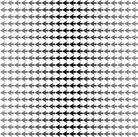

确定这种奇怪行为的原因并修正它。

**习题 27.4.** 绘制由一片螺线管产生的磁场图像。选择半径、长度、单位长度的匝数和电流的值。决定使用哪种可视化方法。

**习题 27.5.** 考虑由位于 xy 平面、原点处的半径为 0.25 米、电流为 10 安的圆形导线产生的磁场 `circleB`。绘制磁场的 z 分量随 x 轴位置变化的图像。它应该类似于 图 27-5。

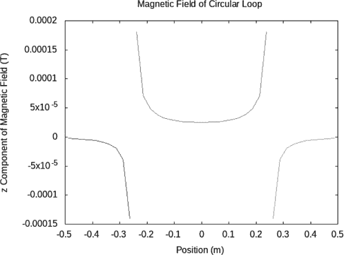

*图 27-5: 由电流圆形线圈产生的磁场*

**习题 27.6.** 考虑由带电流的圆形线圈产生的磁场。绘制磁场的 z 分量随 z 轴位置变化的图像。包括 *z* 的正值和负值。最大磁场应出现在 *z* = 0 处。

**练习 27.7.** 在上一章的一个练习中，我们介绍了赫尔姆霍兹线圈作为电流分布。绘制磁场的 z 分量作为 z 轴位置的函数的图像。包括 *z* 的正值和负值。你应该会发现，磁场在中心附近比由单个电流环产生的磁场更加均匀。
