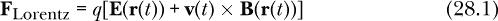
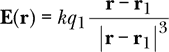
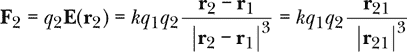
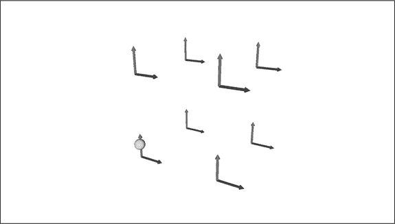
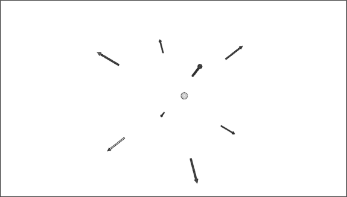

# 第二十八章：洛伦兹力定律


我们已经看到，现代电磁理论是一种场理论。电场和磁场的存在解释了电磁现象。电荷（及其运动形式——电流）既是这些场的源头，又是这些场对其施加力的接受者。因此，电磁理论有两个方面：电荷创造电场和磁场，电场和磁场对电荷施加力。在过去的四章中，我们处理了这两个方面中的第一个，涉及静态和稳定情况。我们展示了电荷如何创造电场，以及电流如何创造磁场。

在本章中，我们将考虑*洛伦兹力定律*，它通过描述电场和磁场如何对电荷施加力来解决电磁理论的第二个方面。接下来，在本书的下一章也是最后一章，我们将回到电磁理论的第一个方面，即*麦克斯韦方程*，它描述了电场和磁场如何在动态情况下被创造和演化。

本章的目标是描述带电粒子在电场和磁场中的运动。在简短讨论电磁理论中的静力学和动力学之后，我们将转向带电粒子在电场和磁场中的适当状态问题。然后，我们将介绍洛伦兹力定律，它描述了这种粒子所受的力。我们将解释电场的作用，然后讨论如何对受电场和磁场力影响的粒子执行状态更新函数。我们将描述粒子对施加的电场和磁场的反应，但关于移动电荷辐射的电磁场的讨论将留到本书的最后一章。最后，我们将通过一些粒子在电磁场中的动画来结束本章。

让我们从一些介绍性的代码开始。

### 介绍性代码

列表 28-1 展示了我们将在本章编写的`Lorentz`模块中的前几行代码。

```
{-# OPTIONS -Wall #-}
{-# LANGUAGE MultiParamTypeClasses #-}

module Lorentz where

import SimpleVec ( R, Vec, (^+^), (*^), (^*), (^/), (><), zeroV, magnitude )
import Mechanics1D ( RealVectorSpace(..), Diff(..), rungeKutta4 )
import Mechanics3D ( HasTime(..), simulateVis )
import CoordinateSystems ( Position(..), VectorField, cart, v3FromPos, origin
                         , shiftPosition, addVectorFields, visVec )
import qualified Vis as V
```

*列表 28-1：`Lorentz`模块的开头代码行*

我们使用了来自第十章的`SimpleVec`模块、第十五章的`Mechanics1D`模块、第十六章的`Mechanics3D`模块和第二十二章的`CoordinateSystems`模块中的类型和函数。

这是我们第一次处理电磁理论的动力学，因此简短地讨论静力学和动力学将有助于为本章的内容铺垫基础。

### 静力学与动力学

本书的第二部分讲述了力学，这是一个*动态*的学科，因为我们感兴趣的量，包括位置、速度、加速度、力、动量和能量，都是随时间变化的。特别是牛顿第二定律是一个动态方程，因为它告诉我们粒子在力作用下如何改变速度。到目前为止，在本书的第三部分中，电磁学理论似乎是一个*静态*的学科，因为电场和磁场并没有随时间变化。在过去的四章中，我们花时间探讨了静电荷如何产生电场，以及稳定电流如何产生磁场。但实际上，电磁学理论和力学一样，也是一个动态的学科。

电磁学理论的两个方面都有与之相关的动力学。因为电荷运动和加速，电场和磁场随时间变化。我们将在本书最后一章探讨的麦克斯韦方程描述了这些场如何随时间变化。因为粒子受到力的作用，无论是电磁力还是其他力，其速度随时间变化。这就是我们在第二部分中讨论的力学动力学。一旦我们知道作用在粒子上的力，我们就使用牛顿第二定律和第二部分中的思想来找到粒子的运动。

处理动力学的一个好方法是问物理系统的状态如何随时间变化。专注于物理系统的状态如何随时间演变的做法，在电磁学理论中与在力学中同样有用。决定在状态中包含哪些状态变量是一个和当时一样重要的问题。选择状态变量并找到一个微分方程来表达这些变量如何随时间变化的策略，是一种超越许多物理学理论及其以外的策略。它不是理解物理的唯一方式，但它是一种非常重要且有用的方式。

在准备做电动力学时，我们需要考虑一个合适的状态。我们在状态中放入什么？我们可以从我们关心的量开始。在力学中，我们当然关心粒子的位置，因此我们将其放入状态中。如果我们关心的量的变化率依赖于其他量，我们可能也需要将它们放入状态中。在力学中，位置的变化率是速度，因此我们将速度放入状态中。速度的变化率依赖于作用在粒子上的力，因此我们可能选择将力所依赖的量放入状态中。

因此，我们将电场和磁场包括在状态中。从概念上和计算上来看，这是一大步的复杂性提升。从概念上讲，这是我们第一次在状态中包含函数。从计算上讲，从力学到电磁学理论的转变，意味着我们需要在状态中跟踪的数据信息量大大增加。在点粒子力学中，我们为系统中的每个粒子需要六个数字来描述状态。我们生活在三维空间中，因此需要三个数字记录每个粒子的位置，并需要三个数字记录每个粒子的速度。电场作为一个从空间到向量的函数，更接近于一个无限的数字集合，因为电场在空间中的每个点都有一个向量。

将电场和磁场包括在系统状态中的原因有两个。第一个原因是我们关心电场和磁场，并且希望了解它们如何随时间变化，尽管我们直到下一章才会讨论电场和磁场的变化。第二个原因是将场包括在状态中，是因为它们用于确定粒子所受的电力和磁力。我们将在本章中处理这个问题。

除了电场和磁场，我们还应该在状态中包括什么？一种选择是仅记录电场和磁场，而不包括粒子信息。这种状态选择对电磁波或已知源的辐射非常有用，但如果我们关心粒子的运动，就像本章所做的那样，这种选择就不再有用。因此，在本章中我们不会追求这种选择。

另一个关于状态的选择是，除了电场和磁场外，还包括我们关心的每个粒子的位置信息和速度信息。在第二十一章中，我们引入的描述带电粒子之间库伦力的两体力不再需要，因为电场和磁场现在是对粒子产生力的实体。麦克斯韦方程将描述电场和磁场如何根据系统中存在的带电粒子发生变化。牛顿第二定律将描述粒子的速度如何受到电磁力和可能的其他力的影响。事实上，通过引入场来移除两体力是自 1865 年以来物理学中的一个主题。牛顿的万有引力定律，作为一种两体力，一旦引入广义相对论的场论，就可以被移除。

然而，将多个粒子与场结合在一起时会遇到一个技术问题。问题在于每个粒子都会对电场和磁场做出贡献。一个带电点粒子对电场的贡献会随着场点接近粒子的位置而无限增大。按最直接、最天真的方式应用这些方程，会给每个粒子施加一个由它自身产生的无限大或未定义的力。这在概念上和计算上都会引发问题。最好的概念性解决方法是认为点粒子本来就是一种理想化的假设，并将电荷看作是分布在某个体积内，而非继续沿用电荷的粒子理论，而是采用电荷的场理论。一种计算上的“快速修复”是，对于每个粒子，仅跟踪由其他粒子产生的场。虽然这些复杂的情况很有趣，但我们不打算深入其中，因此我们不会考虑多个粒子与场的状态。

相反，我们将选择第三种方案：一个状态，其中包括单个粒子的位置和速度，以及电场和磁场。这将使我们能够集中研究单个粒子在电场和磁场中的运动。让我们看看这个状态是什么样的。

### 一个粒子和场的状态

通过为电场和磁场添加向量场，我们将第十六章中用于一个粒子的`ParticleState`类型扩展为包含场的`ParticleFieldState`类型。以下是使用记录语法定义的数据类型：

```
data ParticleFieldState = ParticleFieldState { mass          :: R
                                             , charge        :: R
                                             , time          :: R
                                             , position      :: Position
                                             , velocity      :: Vec
                                             , electricField :: VectorField
                                             , magneticField :: VectorField }
```

如你所见，我们在状态中包含了质量、电荷、时间、位置和速度，这与第十六章中的`ParticleState`里的五个状态变量相同。现在，我们还加入了电场和磁场。除了为场添加两个新槽位外，我们还对第十六章中使用的`ParticleState`类型做了一个小小的调整。我们现在使用的是在第二十二章中定义的`Position`数据类型来表示位置，而不是我们在第二部分中使用的`Vec`。

正如我们在过去的章节中所做的，当我们为状态编写一个新的数据类型时，我们也会为状态导数编写一个新的数据类型。换句话说，我们编写一个数据结构来保存状态变量的时间导数。按照我们为命名这种状态导数类型所采用的模式，我们将新类型命名为`DParticleFieldState`。

```
data DParticleFieldState = DParticleFieldState { dmdt :: R
                                               , dqdt :: R
                                               , dtdt :: R
                                               , drdt :: Vec
                                               , dvdt :: Vec
                                               , dEdt :: VectorField
                                               , dBdt :: VectorField }
```

我们希望能够在这种情况下使用欧拉法和四阶龙格-库塔法来求解微分方程，这需要我们将新的数据类型声明为`RealVectorSpace`类型类的实例。这意味着我们要定义如何对`ParticleFieldState`进行加法操作，以及如何按实数缩放此类表达式。下面是该实例的声明：

```
instance RealVectorSpace DParticleFieldState where
    dst1 +++ dst2
        = DParticleFieldState { dmdt = dmdt dst1  +  dmdt dst2
                              , dqdt = dqdt dst1  +  dqdt dst2
                              , dtdt = dtdt dst1  +  dtdt dst2
                              , drdt = drdt dst1 ^+^ drdt dst2
                              , dvdt = dvdt dst1 ^+^ dvdt dst2
                              , dEdt = addVectorFields [dEdt dst1, dEdt dst2]
                              , dBdt = addVectorFields [dBdt dst1, dBdt dst2]
                              }
    scale w dst
        = DParticleFieldState { dmdt = w *  dmdt dst
                              , dqdt = w *  dqdt dst
                              , dtdt = w *  dtdt dst
                              , drdt = w *^ drdt dst
                              , dvdt = w *^ dvdt dst
                              , dEdt = (w *^) . (dEdt dst)
                              , dBdt = (w *^) . (dBdt dst)
                              }
```

注意

*不幸的是，这段代码是书中最重复且无信息的代码之一。它仅仅重复我们通过对状态变量的每个导数进行加法或缩放时所必须表达的显而易见的内容。写这种重复的、模板化的代码让我感到痛苦。值得探讨的问题是我们如何避免写这种代码。我很想给你答案，但我们必须集中精力完成当前任务，即定义一个新的数据类型，并确保它可以与我们已经编写的代码一起使用。*

我们需要一个`Diff`实例来描述`ParticleFieldState`和`DParticleFieldState`类型之间的关系。回想一下，这涉及到定义`shift`函数，展示如何通过导数在小时间间隔内平移状态变量。

```
instance Diff ParticleFieldState DParticleFieldState where
    shift dt dst st
        = ParticleFieldState
          { mass          = mass     st  +  dmdt dst  * dt
          , charge        = charge   st  +  dqdt dst  * dt
          , time          = time     st  +  dtdt dst  * dt
          , position      = shiftPosition (drdt dst ^* dt) (position st)
          , velocity      = velocity st ^+^ dvdt dst ^* dt
          , electricField = \r -> electricField st r ^+^ dEdt dst r ^* dt
          , magneticField = \r -> magneticField st r ^+^ dBdt dst r ^* dt
          }
```

和往常一样，我们通过将相应导数的乘积和时间步长来平移每个状态变量。

还有一个我们需要的类型类实例声明。当我们在第十六章中编写`simulateVis`函数以制作 3D 动画时，我们希望它能与我们定义的任何状态空间，或者将来可能定义的任何状态空间一起使用。`simulateVis`对状态空间的唯一要求是它必须包含时间的概念。下面的实例声明只是给出了返回状态时间的函数。

```
instance HasTime ParticleFieldState where
    timeOf = time
```

现在我们已经为带有电场和磁场的粒子状态定义了一个新的数据类型，让我们转向讨论电场和磁场对粒子施加的力。

### 洛伦兹力定律

电场和磁场会对带电粒子产生力。作用在带电量为*q*，位置为**r**(*t*)，速度为**v**(*t*)的粒子上的力，电场为**E**，磁场为**B**，根据洛伦兹力定律给出。



电力，

**F**[electric] = *q***E**(**r**(*t*))

给予了电场意义的感觉。电场表示在空间位置上的单位电荷所受的力。空间中的某一点可能没有电荷，也可能有电荷，如果有电荷，那么电荷和该点电场向量的乘积就给出了作用在电荷上的力。正电荷感受到与电场向量相同方向的力；负电荷感受到与电场向量相反方向的力。

磁力

**F**[magnetic] = *q***v**(*t*) × **B**(**r**(*t*))

由于叉乘的存在，它更难以解释，这表明磁场对带电粒子的力与粒子位置的磁场向量以及粒子的速度是垂直的。电荷运动产生磁场和磁场对运动电荷的力之间有某种对称性，因为这两种过程都由包含叉乘的方程控制。磁力方程中出现电荷和速度意味着，要感受磁力，粒子必须带电并且处于运动状态。这是磁场创造和作用之间的另一种对称性。正如运动电荷或电流创造磁场一样，正是运动的电荷才会感受到来自磁场的力。

洛伦兹力定律，方程 28.1，仅仅是电场和磁场力的总和。函数`lorentzForce`在 Haskell 中表示洛伦兹力定律。

```
lorentzForce :: ParticleFieldState -> Vec
lorentzForce (ParticleFieldState _m q _t r v eF bF)
    = q *^ (eF r ^+^ v >< bF r)
```

其中两个项，`eF`和`bF`，属于产生力的场。三个项，`q`、`r`和`v`，属于感受力的粒子。因为我们的状态包含了粒子和场的状态变量，所以洛伦兹力仅仅依赖于系统的状态。

### 我们真的需要电场吗？

如果我们使用现代电学的两部分观点，首先计算一个带电粒子，电荷为*q*[1]，位置为**r**[1]，所产生的电场**E**。



然后应用洛伦兹力定律，计算一个带电粒子，电荷为*q*[2]，位置为**r**[2]的受力。



我们恢复了方程 21.2，即库仑的 18 世纪电学定律。这有些令人安慰，因为它给了我们一个机会，看看电场与库仑定律之间的关系。但是，介绍电场我们究竟得到了什么？它似乎不过是一个庞大的本体论和数学负担！如果我们最终只是回到了库仑的结果，那为什么还要引入电场呢？

答案是，电场在静态情况下（即电荷不移动或加速时）并未对库仑定律提供新的预测。在静力学的世界里，电场充其量只是一个便利，最糟糕时则是一个恼人的存在。然而，当电荷开始移动或加速时，库仑定律（如方程 21.1、21.2 和 21.3 中体现的）不再成立。我们在第二十五章中发展的方法也不再适用。如果带电粒子移动缓慢，库仑定律和第二十五章中的方程是不错的近似，但当电荷接近光速时，这些理论将完全失效。

更重要的是，当带电粒子加速时，它们会辐射。换句话说，它们会产生电场和磁场，这些场携带能量和动量远离加速粒子。电场和磁场有了自己的生命，它们的描述成为系统状态的重要组成部分。本章不涉及辐射的电磁场，但我们会在本书的最后一章进行讲解。

电场和磁场有助于维护局域性原则，即实体（粒子或场）之间的相互作用发生在彼此靠近的地方，而不是在远距离。牛顿的万有引力定律和库仑定律是*远距离作用*的例子。它们表明一个物体对另一个远离它的物体产生直接且瞬时的影响。人们已经讨论了这个问题的哲学意义几个世纪了。从数学上讲，在一个能够容纳普遍时间观念的框架中，远距离作用并不成问题。如果一个远方的粒子现在摆动，我立刻就能感受到引力的变化。但自从接受爱因斯坦的相对论以来，我们放弃了普遍时间的观念。更重要的是，相对论告诉我们，同时性的概念是依赖于观察者的（或至少依赖于参考系）。在相对论的框架下，像牛顿的万有引力和库仑定律这样的远距离作用定律是相当有问题的。爱因斯坦意识到，他在 1905 年提出的特殊相对论与牛顿的万有引力不兼容，到了 1915 年，他发展出了一种新的引力理论——广义相对论。

到了 1865 年，法拉第和麦克斯韦做到了类似于爱因斯坦在 1915 年对引力的贡献。如果一个带电粒子在一个地方摆动，它会改变粒子产生的电场。变化以光速在电场中传播，直到稍后才会影响第二个粒子。法拉第和麦克斯韦将电磁理论发展为一种场论，去除了远距离作用的需求，解释了电与磁的关系，预测了辐射，并给出了光的理论。电场现在被视为所有这些益处的微小代价。

现在，我们已经介绍了洛伦兹力定律，并稍作讨论，了解了它如何支配电磁理论中场对电荷施加力的部分，让我们将它与基于状态的方法结合起来，预测带电粒子在电场和磁场中的运动。

### 状态更新

与我们在第二部分中关于力学的前几章不同，在那些章节中我们考虑了来自任何源的作用在粒子上的力，而在本章中，我们假设构成洛伦兹力的电磁力是唯一作用在粒子上的力。这样做的原因是为了集中精力研究电磁理论。将我们在本章中编写的代码扩展到包括电磁学之外的任意力并不困难。

函数`newtonSecondPFS`（`PFS`代表`ParticleFieldState`）表示给出状态变量变化率的微分方程。唯一有趣的变化率是速度的变化率，根据牛顿第二定律，它是粒子上作用的净力除以其质量。

```
newtonSecondPFS :: ParticleFieldState -> DParticleFieldState
newtonSecondPFS st
    = let v = velocity st
          a = lorentzForce st ^/ mass st
      in DParticleFieldState { dmdt = 0           -- dm/dt
                             , dqdt = 0           -- dq/dt
                             , dtdt = 1           -- dt/dt
                             , drdt = v           -- dr/dt
                             , dvdt = a           -- dv/dt
                             , dEdt = const zeroV -- dE/dt
                             , dBdt = const zeroV -- dB/dt
                             }
```

粒子的质量和电荷保持不变，因此它们的变化率为 0。时间的变化率为每秒 1 秒，因此其变化率为 1。位置的变化率由速度给出，这就是速度的定义。速度的变化率由加速度给出，根据牛顿第二定律，加速度等于净力除以质量。这里的净力就是洛伦兹力，因为我们决定将注意力集中在电磁力上。在本章中，我们不允许电场和磁场发生变化，因此它们的变化率为 0。由于它们是矢量函数，它们的变化率是一个常数函数，返回零向量，即`const zeroV`。

表 28-1 将函数`newtonSecondPFS`与我们在第二部分中处理的其他牛顿第二定律函数进行了比较。在那部分中，我们处理了其他状态空间。因为我们将注意力集中在电磁力上，而且这些力仅由粒子-场系统的状态信息决定，所以函数`newtonSecondPFS`不需要输入一个力的列表，而是其他表中所有函数所需要的。

**表 28-1：** 牛顿第二定律的函数

| **函数** | **类型** |
| --- | --- |
| `newtonSecondV` | `质量 -> [速度 -> 力] -> 速度 -> R` |
| `newtonSecondTV` | `质量 ->` |
|  | `[(时间, 速度) -> 力] -> (时间, 速度) -> (R, R)` |
| `newtonSecond1D` | `质量 -> [State1D -> 力] -> State1D -> (R, R, R)` |
| `newtonSecondPS` | `[单体力] -> 粒子状态 -> 微分粒子状态` |
| `newtonSecondMPS` | `[力] -> 多粒子状态 -> 微分多粒子状态` |
| `newtonSecondPFS` | `粒子场状态 -> 微分粒子场状态` |

回顾一下，数值方法允许我们将微分方程转化为状态更新函数。状态更新函数对动画非常重要，也有助于通过获得状态列表来解决问题。

函数`pfsUpdate`（`pfs`代表`ParticleFieldState`，但由于函数必须以小写字母开头，所以使用小写字母）将作为动画的状态更新函数，或用于生成状态列表。

```
pfsUpdate :: R  -- time step
          -> ParticleFieldState -> ParticleFieldState
pfsUpdate dt = rungeKutta4 dt newtonSecondPFS
```

该函数使用四阶 Runge-Kutta 方法，仅仅是因为它通常能给出最好的结果，但我们也可以使用任何数值方法。

有了状态更新函数，我们就可以开始在电场和磁场中动画化带电粒子的运动了。

### 在电场和磁场中动画化粒子

我们希望使用 `simulateVis` 函数来做 3D 动画。这要求我们为该函数提供五个输入项，分别是时间尺度因子、动画速率、初始状态、显示函数和状态更新函数。`pfsUpdate` 函数将作为我们的状态更新函数。

通过定义一个默认状态，提供初始状态变得更加容易。通过拥有默认状态，我们可以通过列出与默认状态不同的项来指定初始状态。默认状态下每个状态变量的值都设为 0。

```
defaultPFS :: ParticleFieldState
defaultPFS = ParticleFieldState { mass          = 0
                                , charge        = 0
                                , time          = 0
                                , position      = origin
                                , velocity      = zeroV
                                , electricField = const zeroV
                                , magneticField = const zeroV }
```

以下函数 `pfsVisObject` 是一个显示函数，它将粒子显示为绿色球体，电场显示为一组蓝色向量，磁场显示为一组红色向量。

```
pfsVisObject :: R  -- cube width
             -> ParticleFieldState -> V.VisObject R
pfsVisObject width st
    = let r = position st
          xs = [-width/2, width/2]
          es :: [(Position,Vec)]
          es = [(cart x y z, electricField st (cart x y z))
                    | x <- xs, y <- xs, z <- xs]
          maxE = maximum $ map (magnitude . snd) es
          bs :: [(Position,Vec)]
          bs = [(cart x y z, magneticField st (cart x y z))
                    | x <- xs, y <- xs, z <- xs]
          maxB = maximum $ map (magnitude . snd) bs
          metersPerVis = width/2
      in V.VisObjects [ vectorsVisObject metersPerVis (2*maxE) es V.blue
                      , vectorsVisObject metersPerVis (2*maxB) bs V.red
                      , V.Trans (v3FromPos (scalePos metersPerVis r))
                            (V.Sphere 0.1 V.Solid V.green)
                      ]
```

该函数接受一个实数作为输入，指定我们希望显示的空间立方体的宽度。它计算八个位置的电场，并找出最大电场强度，以便缩放显示的电场向量。然后，它计算同样八个位置的磁场，并找出最大磁场强度，以便缩放显示的磁场向量。

该函数使用另一个函数，名为 `vectorsVisObject`，来绘制电场和磁场的图像。

```
vectorsVisObject :: R  -- scale factor, meters per Vis unit
                 -> R  -- scale factor, vector field units per Vis unit
                 -> [(Position,Vec)]  -- positions to show the field
                 -> V.Color
                 -> V.VisObject R
vectorsVisObject metersPerVis unitsPerVis pvs color
    = V.VisObjects [V.Trans (v3FromPos (scalePos metersPerVis r)) $
                     visVec color (v ^/ unitsPerVis) | (r,v) <- pvs]
```

该函数接受两个缩放因子作为输入：一个指定每个 Vis 单位的米数，另一个指定每个 Vis 单位的向量场单位数。然后，它接受一对对位置和向量的列表以及向量的颜色。`pfsVisObject` 函数使用 `vectorsVisObject` 两次：一次用于电场，一次用于磁场。

`pfsVisObject` 和 `vectorsVisObject` 都使用另一个辅助函数，名为 `scalePos`，该函数用于缩放位置。

```
scalePos :: R -> Position -> Position
scalePos metersPerVis (Cart x y z)
    = Cart (x/metersPerVis) (y/metersPerVis) (z/metersPerVis)
```

该函数通过缩放每个位置坐标来工作。

我们的主程序，名为 `animatePFS`，是一个有趣的玩具。我们可以将电场和磁场设置为任何我们想要的样子，粒子的初始条件也可以是任何我们希望的样子，然后看看会发生什么。

```
animatePFS :: R                   -- time scale factor
           -> Int                 -- animation rate
           -> R                   -- display width
           -> ParticleFieldState  -- initial state
           -> IO ()
animatePFS tsf ar width st
    = simulateVis tsf ar st (pfsVisObject width) pfsUpdate
```

该函数接受时间尺度因子和动画速率作为输入，以及显示宽度和初始状态。它调用 `simulateVis` 来进行动画。

接下来的两个小节展示了在均匀电场和磁场中质子以及经典电子绕质子轨道的具体动画。

#### 均匀场

列表 28-1 显示了质子在均匀电场和磁场中的运动。系统的初始状态提供了质子的质量、质子电荷、初始质子速度、电场和磁场。电场是沿 y 方向的均匀场，磁场是沿 z 方向的均匀场。在这些场的作用下，质子表现出一种奇特的跳跃运动。

```
{-# OPTIONS -Wall #-}

import SimpleVec ( vec )
import Electricity ( elementaryCharge )
import Lorentz ( ParticleFieldState(..), animatePFS, defaultPFS )

main :: IO ()
main = animatePFS 1e-5 30 0.05
       ( defaultPFS { mass          = 1.673e-27  -- proton in kg
                    , charge        = elementaryCharge
                    , velocity      = vec 0 2000 0
                    , electricField = \_ -> vec 0 20 0
                    , magneticField = \_ -> vec 0  0 0.01 } )
```

*列表 28-2：独立程序，演示质子在均匀电场和磁场中的运动*

通过改变电场、磁场或质子的初速度，你可以看到多种不同的运动。图 28-1 显示了动画的快照。



*图 28-1：显示质子在特定电场和磁场中运动的动画截图*

#### 经典氢原子

我们的第二个具体动画是经典氢原子。氢是最简单的原子，由一个质子和一个电子组成。我们需要量子力学来正确描述氢的性质，但我们将探索电子在由质子产生的电场中的牛顿运动。这个电场提供了一个非均匀场的例子，展示了我们的代码可以处理任意电场和磁场。需要注意的是，我们的经典氢原子使用的是经典的牛顿力学理论，但并未使用完整的法拉第-麦克斯韦电动力学理论，这种理论通常被认为是“经典的”，因为它是非量子化的。法拉第-麦克斯韦理论，我们将在本书的最后一章中探讨，预测电子会辐射电磁能量，导致其向内螺旋运动。在这里，我们采用了经典氢原子的简化版本，其中电子不会辐射能量。

列表 28-3 显示了在由质子产生的电场中，电子的运动。

```
{-# OPTIONS -Wall #-}

import SimpleVec ( vec )
import Electricity ( elementaryCharge )
import CoordinateSystems ( cart )
import Charge ( protonOrigin )
import ElectricField ( eField, epsilon0 )
import Lorentz ( ParticleFieldState(..), animatePFS, defaultPFS )

main :: IO ()
main = animatePFS period 30 (4*bohrRadius)
       ( defaultPFS { mass          = electronMass
                    , charge        = -elementaryCharge  -- electron charge
                    , position      = cart bohrRadius 0 0
                    , velocity      = vec 0 v0 0
                    , electricField = eField protonOrigin } )
           where electronMass = 9.109e-31  -- kg
                 bohrRadius   = 0.529e-10  -- meters
                 v0 = elementaryCharge
                      / sqrt (4 * pi * epsilon0 * electronMass * bohrRadius)
                 period = 2 * pi * bohrRadius / v0
```

*列表 28-3：独立程序，演示经典氢原子中电子的运动*

在这种情况下，我们使用几个局部变量来确定圆周运动的初速度，这是初始状态下所需的，以及运动周期，这是时间尺度因子中使用的。电子执行圆周运动，类似于卫星绕行行星。图 28-2 显示了在由质子产生的电场中电子的动画快照。



*图 28-2：显示电子在由质子产生的电场中运动的动画截图*

### 摘要

本章讨论了电磁理论中电场和磁场如何对电荷施加力的方面。洛伦兹力定律描述了电场和磁场对电荷施加的力。接着，我们通过使用牛顿第二定律，找到了带电粒子在电场和磁场中的运动，就像我们在第二部分中做的那样。我们为带电粒子定义了一个新的状态空间，包含电场和磁场。我们的微分方程和状态更新规则只修改了粒子的状态，电场和磁场的状态保持不变。我们将在下一章完成状态更新项目，那里麦克斯韦方程描述了电场和磁场随时间的变化。

### 练习

**练习 28.1.** 编写一个名为 `eulerCromerPFS` 的函数，类似于第十六章中的 `eulerCromerPS` 函数，使用 `ParticleFieldState` 数据类型实现欧拉-克罗梅方法。通过将 `pfsUpdate` 中的 `rungeKutta4` 替换为 `eulerCromerPFS` 来测试它。重新编译动画代码，看看是否有明显的差异。

**练习 28.2.** 假设一个电荷为 9 nC 的粒子固定在原点。（9 nC 的电荷大约是你从干衣机里拿出来的袜子上的电荷量。）一个从静止释放，距离 1 毫米的质子将加速远离原点。绘制质子的位置和速度随时间变化的图形。

**练习 28.3.** 假设一个 1 米 × 1 米的平板具有均匀的表面电荷密度 9 nC/m²。（9 nC 的电荷会将其电势提高到几十伏的水平。）一个质子从静止状态释放，距离平板中心 1 毫米，并加速远离平板。绘制质子的位置、速度和加速度随时间变化的图形。

**练习 28.4.** 一个半径为 10 厘米的电流环通过 100 A 的电流。（100 A 的电流通常是一个小房子或大公寓的最大用电量。）我们将电流环固定在 xy 平面，将其中心定位于原点，并使电流从正 z 轴方向看顺时针流动。我们希望观察电流环附近的质子运动效果。假设质子从位置

(*x, y, z*) = (11 厘米, −1 米, 0)

并给它一个初速度，方向为正 y 轴。当质子接近电流环时，它应该向左偏转，因为电流方向相同的电流会相互吸引。绘制质子在 xy 平面内的轨迹图。研究初始质子速度对偏转的影响。

**练习 28.5.** 探索质子在均匀磁场中没有电场的情况下的运动。通过改变初速度，你应该能够让质子沿着圆形、螺旋线或直线运动。哪些初速度会产生这些不同的运动？

**练习 28.6.** 重写 `newtonSecondPFS` 函数，使其能够接受非电磁力的列表作为输入。

```
newtonSecondPFS' :: [ParticleFieldState -> Vec]
                 -> ParticleFieldState -> DParticleFieldState
newtonSecondPFS' fs st = undefined fs st
```
