## 第二十九章：麦克斯韦方程

  

  

在过去的几章中，我们介绍了电场和磁场，并指出这些场实际上是描述物理系统状态的一部分，至少对于那些电荷起作用的系统是如此。但我们尚未展示电场和磁场是如何随时间发展的。本章将通过引入麦克斯韦方程来解决这个问题。  

麦克斯韦方程描述了电场和磁场如何由电荷和电流产生，它们之间的关系以及它们如何随时间变化。与洛伦兹力定律一起，麦克斯韦方程表达了现代电磁理论。  

本章将从一些引言代码开始，接着介绍麦克斯韦方程。然后，我们将讨论这些方程所蕴含的电磁学之间的四种关系，以及这些方程如何与我们在前几章中对电场和磁场的处理相关。最后，我们将展示如何将状态更新技术应用于麦克斯韦方程。最后，我们将介绍有限差分时域（FDTD）方法来求解麦克斯韦方程，并利用该方法来模拟由振荡电荷产生的电场。  

### 前言代码  

列表 29-1 展示了我们将在本章编写的`Maxwell`模块的前几行代码。  

```
{-# OPTIONS -Wall #-}

module Maxwell where

import SimpleVec
    ( R, Vec(..), (^/), (^+^), (^-^), (*^)
    , vec, negateV, magnitude, xComp, yComp, zComp, iHat, jHat, kHat )
import CoordinateSystems
    ( ScalarField, VectorField
    , cart, shiftPosition, rVF, magRad )
import ElectricField ( cSI, mu0 )
import qualified Data.Map.Strict as M
import qualified Diagrams.Prelude as D
import Diagrams.Prelude
    ( Diagram, Colour
    , PolyType(..), PolyOrientation(..), PolygonOpts(..), V2(..)
    , (#), rotate, deg, rad, polygon, sinA, dims, p2
    , fc, none, lw, blend )
import Diagrams.Backend.Cairo ( B, renderCairo )
```

*列表 29-1：`Maxwell`模块的开头代码*  

我们使用了第十章中`SimpleVec`模块的类型和函数，第二十二章中`CoordinateSystems`模块的类型和函数，以及第二十五章中`ElectricField`模块的类型和函数。在 FDTD 方法的部分，我们还做了对`Data.Map.Strict`的限定导入，并将其简写为`M`。我们还从`Diagrams`包中导入了几个类型和函数，以便在本章末进行异步动画演示。

### 麦克斯韦方程  

在国际单位制（SI）中，麦克斯韦方程包括以下四个方程：  

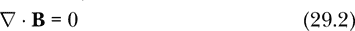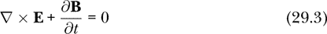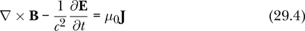  

电场用**E**表示，磁场用**B**表示，电流密度用**J**表示，电荷密度用*ρ*表示。记住，*ϵ*[0]是自由空间的介电常数，首次在第二十一章中介绍。符号*∇*被称为*散度算子*，在笛卡尔坐标系中其形式为：  

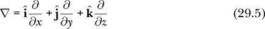  

这里的*算子*一词是物理学家使用的意思，指的是将一个函数作为输入并产生一个函数作为输出的东西。函数式编程中的程序员将此类对象称为高阶函数。  

在方程 29.1 和 29.2 中，梯度算符与点积符号的组合被称为*散度*，这是一个高阶函数，它将一个向量场作为输入，输出一个标量场。散度的定义是单位体积的通量，因此，向量场有正散度的地方是向量指向远离的地方。同样，向量场有负散度的地方是向量指向的地方。在笛卡尔坐标系中，向量场的散度看起来像以下形式：

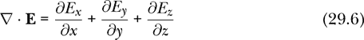

在方程 29.3 和 29.4 中，梯度算符与叉积符号的组合被称为*旋度*，这是一个高阶函数，它将一个向量场作为输入，输出一个向量场。旋度的定义是单位面积的环流，因此它描述了向量如何形成环流模式。向量场在 z 方向上有旋度的地方，是向量以逆时针方向平行于 xy 平面指向的地方。在笛卡尔坐标系中，向量场的旋度看起来像以下形式：

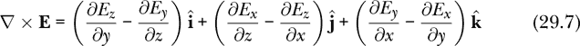

方程 29.1 被称为高斯定律（你可能在第二十五章的习题中遇到过高斯定律）。高斯定律指出电荷决定了电场的散度。由于向量指向正散度的地方远离，而指向负散度的地方靠近，高斯定律说明电场从正电荷指向负电荷。

方程 29.2 被称为高斯的磁学定律，或称“没有磁单极子”。由于磁场的散度在空间和时间中的所有点都必须为 0，因此磁场没有磁荷可以指向或远离。

方程 29.3 被称为法拉第定律（你可能在第二十七章的习题中遇到过法拉第定律）。它断言了电场的旋度与磁场的时间变化率之间的关系。法拉第定律解释了电动发电机和变压器的原理。

方程 29.4 是*安培-麦克斯韦定律*，它断言了磁场的旋度、电场的时间变化率和电流密度之间的关系。

麦克斯韦方程中有四个独立变量：三个空间坐标和一个时间坐标。共有六个依赖变量：三个电场分量和三个磁场分量。我们可以将电荷和电流密度看作源项，它们是麦克斯韦方程的输入，决定了场以及场的变化。

在麦克斯韦方程中，电场和磁场首次出现在同一方程中。麦克斯韦方程描述了电与磁之间的四个关系，接下来我们将对此进行描述。

#### 电与磁之间的关系

方程 29.1 是纯电场方程，方程 29.2 是纯磁场方程。剩下的两个麦克斯韦方程表达了电与磁之间的四个关系。

首先，电荷在运动时会产生磁场。这是汉斯·克里斯蒂安·欧斯特德在 1820 年的发现。他观察到电流能够偏转指南针针头。这个关系通过安培-麦克斯韦定律（方程 29.4）来描述，其中电流密度**J**与磁场的旋度∇ × **B**相关。该定律的早期版本，即安培定律，忽略了电场的时间导数，因此以一种更简单（但不那么全面）方式表达了磁场对电流的依赖。

其次，变化的磁场会产生电场。这是法拉第的发现，称为法拉第定律（方程 29.3）。因此，从某种意义上说，电场有两个来源：一个是电荷，另一个是变化的磁场。库仑定律没有考虑磁场变化对电场的贡献，因此与相对论不兼容。今天，大多数电力发电厂使用法拉第定律来产生交流电流。涡轮机的旋转产生变化的磁场，进而产生电场，推动电流。

第三，变化的电场会产生磁场。1865 年，麦克斯韦在安培定律中加入了电场时间导数项，形成了安培-麦克斯韦定律（方程 29.4）。这个新增的项被称为*位移电流*，因为尽管它不是电流，但在磁场的产生中起着类似的作用。

最后，电场和磁场构成了光。现代光学理论断言，光是电磁波。不存在单独的电波或磁波。波动性质的电场总是伴随着波动性质的磁场。

#### 与库仑定律和比奥-萨伐尔定律的关系

如果麦克斯韦方程描述了电场和磁场是如何产生并发展的，为什么我们在第二十五章和第二十七章中没有使用它们呢？那两章分别介绍了电荷如何产生电场，电流如何产生磁场。那么，这些章节中的方法与麦克斯韦方程有什么关系呢？

记住，第二十五章介绍了在静态情况下（即电荷不运动或加速的情况）计算电场的方法。实际上，该章节的方法等同于库仑定律，对于相对于光速运动较慢的电荷，计算效果相当不错。在静态情况下，我们可以从麦克斯韦方程中去除两个时间导数项，使得电场的方程与磁场的方程解耦。因此，在静态情况下，方程 29.1 和 29.3 变为：

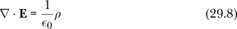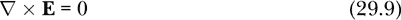

并描述静电。库仑定律是方程 29.8 和 29.9 的解。

类似地，在静态情况下，方程 29.2 和 29.4 变为

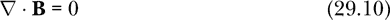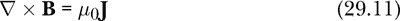

并描述由稳态电流产生的磁场。第二十七章中的比奥-萨伐尔定律是方程 29.10 和 29.11 的解。

我们在第二十五章和第二十七章中介绍的静态方法非常有用，并且比麦克斯韦方程简单得多，但它们无法解释电荷快速或加速移动的动态情况。现在我们将转向解决麦克斯韦方程的任务，采用类似于我们在本书第二部分中解决牛顿第二定律时使用的状态更新方法。

#### 状态更新

为了理解电场和磁场如何随时间变化，重新排列麦克斯韦方程 29.3 和 29.4，使其给出电场和电流密度对场的变化速率会很有帮助。

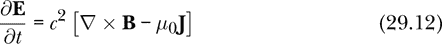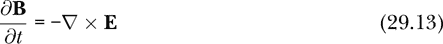

方程 29.1 和 29.2 作为约束；只要电场和磁场在某一时刻满足这些方程，它们将继续满足这些方程，随着时间的推移根据方程 29.12 和 29.13 发生变化。

图 29-1 显示了麦克斯韦方程的示意图。

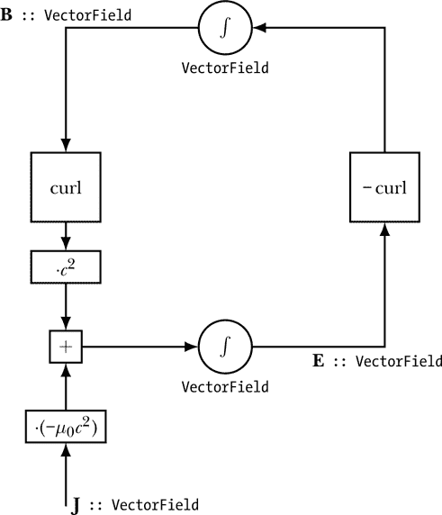

*图 29-1：表示麦克斯韦方程的示意图*

这个图与我们在本书第二部分中为牛顿第二定律所作的图类似。最显著的区别是，这里由电线承载的值是矢量场，而在力学中它们是数值或矢量。正如我们在力学中通过积分加速度来获得速度一样，这里我们通过积分电场的旋度来获得磁场。就像在这种示意图中的环路表示力学中的微分方程一样，这里的环路也表明麦克斯韦方程是微分方程。

正如你在图 29-1 中看到的，磁场变化由电场的负旋度控制。电场的变化则由电流密度和磁场的旋度共同控制。这个示意图表示了方程 29.3 和 29.4。积分器是关于时间的，正如我们在所有类似的示意图中所做的那样。每个积分器下方的`VectorField`类型表示积分器中状态的性质。每个积分器都包含一个完整的矢量场作为状态，这个状态通过作为输入作用于积分器的矢量场来更新。方程 29.1 和 29.2 对可以作为状态由积分器保持的矢量场设置了约束。乘以*c*²和–*μ* [0]*c*²是适用于国际单位制（SI）的。

如同本书第二部分所述，我们解决麦克斯韦方程的方法涉及将时间离散化，更新我们关心的量，时间步长相对于显著变化发生的时间尺度来说是非常小的，然后在许多小的时间步长中迭代这一更新过程。对于麦克斯韦方程，我们关心的量是电场和磁场。我们使用方程 29.12 和 29.13 更新电场和磁场，以提供电场和磁场变化的速率。更新后的场值通过速率与时间步长的乘积进行变化。

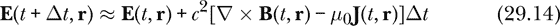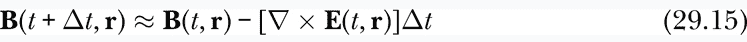

为了在 Haskell 中编码方程 29.14 和 29.15，我们需要计算向量场的旋度。接下来我们将讨论如何在 Haskell 中编写旋度。

#### 空间导数与旋度

在麦克斯韦方程中出现的散度和旋度是空间导数的一种类型。从概念上讲，最简单的空间导数是*方向导数*，它被定义为场值在指定方向上变化的速率。如果*f*是一个标量场，且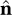是单位向量，则*f*在方向上的方向导数被定义为标量场在两个距离为*ϵ*的点之间值的差异与*ϵ*的比率的极限。

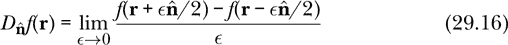

我们的计算方向导数不会采用极限，而是通过使用一个小的位移来计算比率 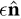，在下面的代码中我们将其称为`d`：

```
directionalDerivative :: Vec -> ScalarField -> ScalarField
directionalDerivative d f r
    = (f (shiftPosition (d ^/ 2) r) - f (shiftPosition (negateV d ^/ 2) r))
      / magnitude d
```

作为`directional` `Derivative`第一个输入的位移向量`d`有两个作用。它的方向指定了我们希望进行导数计算的方向。在微积分中，当我们取极限时，这就是它的唯一作用。但在计算中，我们的导数涉及的是小的但有限的步长，输入的第二个作用是它的大小指定了导数的步长。我们在两个点上评估场值：一个点沿位移向量`d`的半程偏移，另一个点是沿位移向量`d`的负半程偏移。我们找出这两个场值的差异，并除以位移向量的大小。

回顾方程 29.7，我们可以通过沿三个坐标方向的偏导数来计算旋度。相对于*x*的偏导数是沿方向的方向导数。代码中用于`curl`的局部函数`derivX`、`derivY`和`derivZ`即是偏导数。

我们用笛卡尔坐标系和偏导数的形式来表示向量场的旋度，正如方程 29.7 所示。

```
curl :: R -> VectorField -> VectorField
curl a vf r
    = let vx = xComp . vf
          vy = yComp . vf
          vz = zComp . vf
          derivX = directionalDerivative (a *^ iHat)
          derivY = directionalDerivative (a *^ jHat)
          derivZ = directionalDerivative (a *^ kHat)
      in      (derivY vz r - derivZ vy r) *^ iHat
          ^+^ (derivZ vx r - derivX vz r) *^ jHat
          ^+^ (derivX vy r - derivY vx r) *^ kHat
```

输入`a`是一个实数，指定用于计算旋度的空间步长。输入`vf`是我们想要计算旋度的向量场。局部变量`vx`、`vy`和`vz`是`ScalarField`类型，表示向量场`vf`的分量。偏导数`derivX`、`derivY`和`derivZ`的类型是`ScalarField -> ScalarField`。最后，我们使用公式 29.7 来计算旋度。

现在我们可以计算向量场的旋度了，接下来我们准备尝试用 Haskell 编码麦克斯韦方程。

#### 一个朴素的方法

麦克斯韦方程的最简单编码使用一个状态空间，由当前时间、电场和磁场组成。我们使用类型别名`FieldState`来描述一个三元组，其中包括一个表示时间的实数、一个表示电场的向量场和一个表示磁场的向量场。

```
type FieldState = (R            -- time t
                  ,VectorField  -- electric field E
                  ,VectorField  -- magnetic field B
                  )
```

`maxwellUpdate`函数编码了公式 29.14 和 29.15，描述了电场和磁场如何随时间更新。

```
maxwellUpdate :: R                  -- dx
              -> R                  -- dt
              -> (R -> VectorField) -- J
              -> FieldState -> FieldState
maxwellUpdate dx dt j (t,eF,bF)
    = let t'    = t + dt
          eF' r = eF r ^+^ cSI**2 *^ dt *^ (curl dx bF r ^-^ mu0 *^ j t r)
          bF' r = bF r ^-^           dt *^  curl dx eF r
      in (t',eF',bF')
```

输入`dx`给`maxwellUpdate`是一个实数，描述用于公式 29.14 和 29.15 中的旋度的空间步长。输入`dt`是一个实数，描述时间步长。输入`j`是一个时间依赖的向量场，表示电流密度**J**。表 29-1 给出了公式 29.14 和 29.15 的数学表示与`maxwellUpdate`中的 Haskell 表示之间的对应关系。

**表 29-1：** 麦克斯韦方程的数学表示与 Haskell 表示的对应关系

|  | **数学** | **Haskell** |
| --- | --- | --- |
| 时间 | *t* | `t` |
| 位置 | **r** | `r` |
| 时间步长 | Δ*t* | `dt` |
| 光速 | *c* | `cSI` |
| 真空的磁导率 | *μ*[0] | `mu0` |
| 电流密度 | **J** | `j` |
| 电流密度 | **J**(*t*,**r**) | `j t r` |
| 电场 | **E**(*t*,**r**) | `eF r` |
| 磁场 | **B**(*t*,**r**) | `bF r` |
| 更新后的电场 | **E**(*t* + Δ*t*,**r**) | `eF' r` |
| 更新后的磁场 | **B**(*t* + Δ*t*,**r**) | `bF' r` |
| 旋度 | ∇× | `curl dx` |
| 电场的旋度 | ∇×**E**(*t*,**r**) | `curl dx eF r` |
| 磁场的旋度 | ∇×**B**(*t*,**r**) | `curl dx bF r` |
| 向量加法 | + | `^+^` |
| 向量减法 | – | `^-^` |
| 标量乘法 | 紧接运算 | `*^` |

我们通过将时间步长`dt`加到当前时间`t`来更新时间，得到更新后的时间`t'`。我们通过将 *c*²[∇×**B**(*t*,**r**) – *μ*[0]**J**(*t*,**r**)]Δ*t* 加到当前电场中来更新电场，得到更新后的电场。我们通过从当前磁场中减去[∇×**E**(*t*,**r**)]Δ*t*来更新磁场，得到更新后的磁场。

为了找到随时间变化的电场和磁场，我们可以迭代`maxwellUpdate`函数，生成一个长长的状态列表。`maxwell`的`Evolve`函数就是这样做的。

```
maxwellEvolve :: R                  -- dx
              -> R                  -- dt
              -> (R -> VectorField) -- J
              -> FieldState -> [FieldState]
maxwellEvolve dx dt j st0 = iterate (maxwellUpdate dx dt j) st0
```

不幸的是，存在问题。虽然我们编写的代码可以编译并原则上能够运行，但它效率极低。问题在于计算机不会自动记住它已经计算过的函数值，而是一次又一次地重新计算相同的内容。对 Haskell 编译器来说，函数是根据输入计算输出的规则。如果我们知道将来需要某个函数的输出，作为 Haskell 程序员，我们有责任确保它可以获取，通常是通过为其指定一个名称。在这种简单方法中，电场在不同位置的值就是这样的函数输出。它们没有被存储，必须在每次需要时重新计算。例如，当我们到达第八个时间步时，计算机需要知道第七个时间步的电场和磁场值，但这些值没有被存储，因此必须重新计算。而第七个时间步的值又依赖于第六个时间步的值，而这些也没有存储，因此同样必须重新计算。

我们在这一部分编写的状态 `FieldState` 和更新方法 `maxwellUpdate`，虽然优雅且能说明我们希望计算机执行的操作，但在实践中并不可用，这也是我们称之为“简单”方法的原因。然而，我认为这段代码是有价值的。它通过类型检查，表明编译器同意我们请求的内容是有意义的。它以一种可读的风格编写，有助于我们理解麦克斯韦方程的内容。也许有一天，编译器会足够智能，能够规划哪些值应该被记住，因为它们将会被再次使用。

然而，今天我们希望编写可以运行并产生结果的代码。为此，我们将采用一种新的方法。

### FDTD 方法

我们在简单方法中看到，虽然使用函数来描述系统的状态在意义上是清晰的，且在表达上优雅，但这并不是解决麦克斯韦方程的高效方法。为了得到可以执行的代码，我们希望用数字来描述系统的状态，而不是函数。为了实现这一点，我们将选择一个大的但有限的空间位置数目，来跟踪电场和磁场分量。我们在此详细描述的方法称为*有限差分时域*（*FDTD*）方法，用于求解麦克斯韦方程。它是需要数值求解麦克斯韦方程的人们使用的最简单方法。FDTD 方法在 **[18**] 中有更详细的描述。

FDTD 方法仍然基于方程 29.12 和 29.13。每一个方程都是一个向量方程。将这些方程的笛卡尔分量写出是有帮助的。利用方程 29.7 表示旋度，方程 29.17、29.18 和 29.19 列出了方程 29.12 的 x、y 和 z 分量。

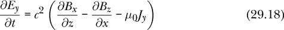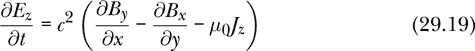

类似地，方程 29.13 的 x、y 和 z 分量如下：

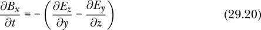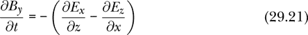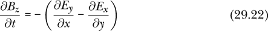

FDTD 方法通过使用对称的有限差分来近似每个偏导数。这里所说的对称是指，我们可以通过在时间和空间点(*t*,*x*,*y*,*z*)附近，分别采样该场分量的两个等距点，来近似场分量（*E[x]*，*E[y]*，*E[z]*，*B[x]*，*B[y]*，或*B[z]*）的偏导数。在涉及时间的偏导数时，采样点为(*t* + Δ*t*/2,*x*,*y*,*z*) 和 (*t* – Δ*t*/2,*x*,*y*,*z*)。在涉及空间的偏导数时，假设在 y 方向，采样点为(*t*,*x*,*y* + Δ*y*/2,*z*) 和 (*t*,*x*,*y* – Δ*y*/2,*z*)。例如，*E[x]*关于时间的偏导数被近似为


而*E[z]*关于*y*的偏导数被近似为


将这种有限差分近似应用到方程 29.17 并进行一些代数运算，得到一个方程，告诉我们如何更新电场 x 分量的值。

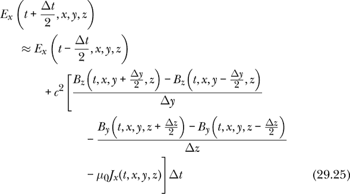

对*E[y]*，*E[z]*，*B[x]*，*B[y]*，*B[z]*有五个类似的方程。方程 29.25 和其他五个方程可以简洁地用向量形式表示为

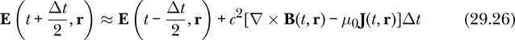

其中，旋度的各分量被近似如下：

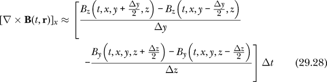

注意方程 29.26 和 29.27 与方程 29.14 和 29.15 之间的相似性。唯一的不同在于，场的旋度和电流密度在 FDTD 方程 29.26 和 29.27 中，是在场的原值和更新值之间的中间时刻进行评估的，而在方程 29.14 和 29.15 中，旋度和电流密度是在场的原值时刻进行评估的，这更接近欧拉法。

方程 29.28 的旋度要求*B[y]*和*B[z]*的值，这些值距离当前空间步长的一半。更新一个时空点的*E[x]*依赖于同一地点早一步时间步长*Δt*的*E[x]*值。同时，它也依赖于在 z 方向上，距离该点半个空间步长，且早半个时间步长的*B[y]*值，以及在 y 方向上，距离该点半个空间步长，且早半个时间步长的*B[z]*值。

这些半空间步依赖性意味着我们跟踪六个分量的位置应该是错开的。我们跟踪*E[x]*的位置将略微偏移，和我们跟踪*E[y]*或*B[y]*的位置不同。方程 29.25 及其他五个类似的方程，分别对应*E[y]*、*E[z]*、*B[x]*、*B[y]*和*B[z]*，决定了我们应该在哪里跟踪每个分量。接下来，我们将描述用于跟踪电场和磁场分量的位置。

#### Yee 单元

我们将使用一个三元组`(nx, ny, nz)`来指定一个位置，用于跟踪场的分量。整数`nx`表示从坐标系原点出发，在 x 方向上的半空间步数。换句话说，如果`dx`是 x 方向上的空间步长，相当于数学符号中的Δ*x*，那么与`(nx, ny, nz)`相关的位置的 x 坐标为`fromIntegral nx * dx / 2`。偶数表示从原点起的整步，而奇数表示奇数个半步。表 29-2 显示了每个场分量的跟踪位置。

**表 29-2：** 我们计算电场和磁场分量的位置

| **组件** | `nx` | `ny` | `nz` |
| --- | --- | --- | --- |
| *E[x]* | 奇数 | 偶数 | 偶数 |
| *E[y]* | 偶数 | 奇数 | 偶数 |
| *E[z]* | 偶数 | 偶数 | 奇数 |
| *B[x]* | 偶数 | 奇数 | 奇数 |
| *B[y]* | 奇数 | 偶数 | 奇数 |
| *B[z]* | 奇数 | 奇数 | 偶数 |

存储*E[x]*值的位置保存在一个名为`exLocs`的列表中，该列表通过列表推导式形成，允许整数`nx`在一系列连续的奇数中变化，`ny`在一系列连续的偶数中变化，`nz`在一系列连续的偶数中变化，具体如表 29-2 所示。其他类似名称的列表保存其他场分量的位置。

```
exLocs, eyLocs, ezLocs, bxLocs, byLocs, bzLocs :: [(Int,Int,Int)]
exLocs = [(nx,ny,nz) | nx <- odds , ny <- evens, nz <- evens]
eyLocs = [(nx,ny,nz) | nx <- evens, ny <- odds , nz <- evens]
ezLocs = [(nx,ny,nz) | nx <- evens, ny <- evens, nz <- odds ]
bxLocs = [(nx,ny,nz) | nx <- evens, ny <- odds , nz <- odds ]
byLocs = [(nx,ny,nz) | nx <- odds , ny <- evens, nz <- odds ]
bzLocs = [(nx,ny,nz) | nx <- odds , ny <- odds , nz <- evens]
```

常数`spaceStepsCE`（CE 代表从中心到边缘）给出了从网格中心到边缘的完整空间步数。

```
spaceStepsCE :: Int
spaceStepsCE = 40
```

我们使用整数来指定网格中的位置。最大的偶数，称为`hiEven`，是从中心到边缘的完整步数的两倍。

```
hiEven :: Int
hiEven =  2 * spaceStepsCE
```

用于指定位置的偶数范围从`-hiEven`到`hiEven`。

```
evens :: [Int]
evens = [-hiEven, -hiEven + 2 .. hiEven]
```

用于指定位置的奇数从最低偶数上方开始，到最高偶数下方结束。

```
odds :: [Int]
odds = [-hiEven + 1, -hiEven + 3 .. hiEven - 1]
```

存储场分量的位置模式称为*Yee 单元*，如图 29-2 所示。Yee 单元以 1960 年代首创 FDTD 方法的 Kane S. Yee 命名。

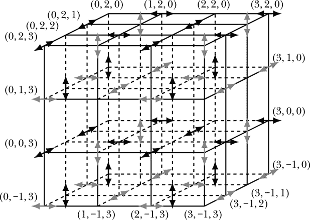

*图 29-2：Yee 单元，展示电场和磁场分量的计算位置*

图 29-2 显示了三维空间的一块区域，坐标系中 *x* 向右增加，*y* 向上增加，*z* 向外增加。双箭头表示在空间中跟踪场分量的位置。黑色箭头表示电场分量，灰色箭头表示磁场分量。箭头指向的方向表示显示的是哪一个分量。例如，左右箭头表示 x 分量。 图 29-2 是一种直观的方式，表达了 表 29-2 中的信息。例如，*E[x]* 分量存储在 `(nx,ny,nz) = (1,2,0)` 位置，因为 `nx` 是奇数，`ny` 是偶数，`nz` 是偶数。

Yee 单元格的一个特点是，每个分量的最近邻包含更新该分量所需的信息。

接下来我们讨论如何在 FDTD 方法中表示电场和磁场的状态，并如何更新该状态。

#### 状态的类型

与我们在朴素方法中使用的 `FieldState` 数据类型不同，后者包含电场和磁场的函数，我们希望拥有一个状态，该状态保存电场和磁场分量在 图 29-2 的 Yee 单元格中指定位置的数值。

`Data.Map.Strict` 是标准的 Haskell 库模块之一，其中包含一个名为 `Map` 的数据结构，适合用于这个目的。类型 `Map k v` 是一个键值对查找表的类型，其中 `k` 是键的类型，`v` 是值的类型。在 第九章 中，我们展示了如何使用类型为 `[(k,v)]` 的一对列表作为查找表，但类型 `Map k v` 更好，因为它会以一种能够快速查找键的方式存储这些键。

对于键，我们将使用一个三元组 `(nx,ny,nz)`，它由 `Int` 类型的数字组成，用于描述场分量的位置；而值则使用一个实数 `R`。因此，我们希望存储场数据的类型是 `Map (Int,Int,Int) R`。

由于电场分量存储的位置与磁场分量不同，我们本可以使用一个单独的查找表，但我们选择使用两个表，一个用于电场，一个用于磁场，以使代码更易于阅读。

我们的状态空间称为 `StateFDTD`，包括时间、三个表示每个方向空间步长的实数、一个 `Map (Int,Int,Int) R` 表示电场，以及一个 `Map (Int,Int,Int) R` 表示磁场。虽然在状态中包含空间步长并非绝对必要，但这样做很方便，因为以状态作为输入的函数通常需要知道空间步长才能执行其任务。例如，计算场的旋度的函数就需要空间步长。

```
data StateFDTD = StateFDTD {timeFDTD :: R
                           ,stepX    :: R
                           ,stepY    :: R
                           ,stepZ    :: R
                           ,eField   :: M.Map (Int,Int,Int) R
                           ,bField   :: M.Map (Int,Int,Int) R
                           } deriving Show
```

在介绍性代码中，`import qualified Data.Map.Strict as M` 使我们能够访问 `Data.Map.Strict` 中定义的所有函数和类型，只要我们在它们前面加上大写的 `M`。由于我们是以这种方式导入模块，我们需要将类型 `Map (Int,Int,Int) R` 称为 `M.Map (Int,Int,Int) R`，正如上面所示，这个类型用于保存电场和磁场。

函数 `initialStateFDTD` 接收一个实数作为输入，表示在三个方向上的空间步长，并返回一个状态，在该状态下，电场和磁场在所有位置的值都为 0。

```
initialStateFDTD :: R -> StateFDTD
initialStateFDTD spatialStep
    = StateFDTD {timeFDTD  = 0
                ,stepX = spatialStep
                ,stepY = spatialStep
                ,stepZ = spatialStep
                ,eField = M.fromList [(loc,0) | loc <- exLocs++eyLocs++ezLocs]
                ,bField = M.fromList [(loc,0) | loc <- bxLocs++byLocs++bzLocs]
                }
```

`Data.Map.Strict` 模块中的函数 `M.fromList` 将一个键值对列表的查找表转换为一个 `Map` 查找表。我们使用列表推导式来构建一个键值对列表，其中键是场分量的某个位置，值为 0。

`Data.Map.Strict` 模块使用严格求值，而不是 Haskell 的默认懒惰求值。在进行数值计算时，我们几乎总是希望使用严格求值。懒惰求值在我们可能根据输入数据计算程序的部分输出时非常有用。但当我们进行数值模型评估时，我们只希望在所有指定的点上计算我们感兴趣的量。在这种情况下，我们不需要为懒惰求值付出内存空间的代价（即内存指针，指向函数的代码或前一次求值的结果）。一个通用的经验法则是，除非你真的知道自己在做什么，否则函数的严格版本通常是你想要的。

现在我们来看一下如何在 FDTD 方法中计算旋度。

#### FDTD 和旋度

方程 29.28 显示了如何在 FDTD 方法中计算磁场的 x 分量旋度。还有五个类似的方程：两个用于磁场旋度的 y 分量和 z 分量，三个用于电场旋度的分量。方程 29.28 中旋度的近似值是基于方程 29.24 中偏导数的近似，因此我们首先需要编码偏导数。然而，比计算偏导数更基本的是从键值查找表中查找值，所以我们先来处理这个问题。

##### 在查找表中查找值

`Data.Map.Strict` 模块提供了 `lookup` 函数，我们写作 `M.lookup`，用于从查找表中获取值。我们来看看这个函数的类型。

```
Prelude> :l Maxwell
[ 1 of 13] Compiling Newton2          ( Newton2.hs, interpreted )
[ 2 of 13] Compiling SimpleVec        ( SimpleVec.hs, interpreted )
[ 3 of 13] Compiling Mechanics1D      ( Mechanics1D.hs, interpreted )
[ 4 of 13] Compiling Mechanics3D      ( Mechanics3D.hs, interpreted )
[ 5 of 13] Compiling MultipleObjects  ( MultipleObjects.hs, interpreted )
[ 6 of 13] Compiling MOExamples       ( MOExamples.hs, interpreted )
[ 7 of 13] Compiling Electricity      ( Electricity.hs, interpreted )
[ 8 of 13] Compiling CoordinateSystems ( CoordinateSystems.hs, interpreted )
[ 9 of 13] Compiling Geometry         ( Geometry.hs, interpreted )
[10 of 13] Compiling Integrals        ( Integrals.lhs, interpreted )
[11 of 13] Compiling Charge           ( Charge.hs, interpreted )
[12 of 13] Compiling ElectricField    ( ElectricField.hs, interpreted )
[13 of 13] Compiling Maxwell          ( Maxwell.hs, interpreted )

Ok, 13 modules loaded.
*Maxwell> :t M.lookup
M.lookup :: Ord k => k -> M.Map k a -> Maybe a
```

如果我们想在不加载本章代码的情况下查看 `Data.Map.Strict` 中 `lookup` 的类型，可以执行以下操作：

```
*Maxwell>  :m Data.Map.Strict
Prelude Data.Map.Strict>  :t Data.Map.Strict.lookup
Data.Map.Strict.lookup :: Ord k => k -> Map k a -> Maybe a
```

在这里，我们使用函数的完全限定名称来请求 `lookup` 的类型，方法是将模块名加到函数名之前，以区分 `Data.Map.Strict` 中的 `lookup` 和 `Prelude` 中的 `lookup`。

从类型中我们可以看到，`M.lookup`需要一个键和一个查找表，并将返回类型为`Maybe a`的结果。如果它在表中找到了该键，它会返回与之关联的值，值会被`Maybe a`类型的`Just`构造函数包裹。如果它没有找到该键，则会返回`Nothing`。

我们的辅助函数`lookupAZ`使用`M.lookup`来完成其工作。

```
lookupAZ :: Ord k => k -> M.Map k R -> R
lookupAZ key m = case M.lookup key m of
                     Nothing -> 0
                     Just x  -> x
```

函数`lookupAZ`（AZ 代表假定为零）的类型比`M.lookup`稍微简单一些。这个函数有两个作用。首先，它免去了我们每次查找时都需要对结果进行案例分析的麻烦。其次，当我们计算网格边缘位置的旋度时，我们会尝试查找那些不存在的值，因为它们就在网格之外。出于这两个原因，我们编写了一个函数，将不存在的键视作其值为 0。这个做法并不是最安全的，因为如果我们因编程错误请求了不存在的键，它不会帮助我们发现错误。我通常是一个相当小心和保守的人，但在这个特殊情况下，我决定冒点风险。

偏导数要求我们查找目标位置两侧半个空间步长的相关分量值。半个空间步长意味着在相关方向上一个整数较高和一个整数较低。函数`partialX`、`partialY`和`partialZ`的类型是相同的。

```
partialX,partialY,partialZ :: R -> M.Map (Int,Int,Int) R -> (Int,Int,Int) -> R
partialX dx m (i,j,k) = (lookupAZ (i+1,j,k) m - lookupAZ (i-1,j,k) m) / dx
partialY dy m (i,j,k) = (lookupAZ (i,j+1,k) m - lookupAZ (i,j-1,k) m) / dy
partialZ dz m (i,j,k) = (lookupAZ (i,j,k+1) m - lookupAZ (i,j,k-1) m) / dz
```

每个函数都接受一个空间步长、一个查找表（称为`m`，即地图）和一个位置作为输入。每个函数通过使用`lookupAZ`函数来检索给定位置两侧的值。将这些值的差值除以步长，得到偏导数的近似值。

##### 计算旋度

有了偏导数之后，我们现在转向旋度。这里有六个函数用于计算电场和磁场的旋度分量。方程 29.7 给出了旋度的分量。

```
curlEx,curlEy,curlEz,curlBx,curlBy,curlBz :: StateFDTD -> (Int,Int,Int) -> R
curlBx (StateFDTD _ _ dy dz _ b) loc = partialY dy b loc - partialZ dz b loc
curlBy (StateFDTD _ dx _ dz _ b) loc = partialZ dz b loc - partialX dx b loc
curlBz (StateFDTD _ dx dy _ _ b) loc = partialX dx b loc - partialY dy b loc
curlEx (StateFDTD _ _ dy dz e _) loc = partialY dy e loc - partialZ dz e loc
curlEy (StateFDTD _ dx _ dz e _) loc = partialZ dz e loc - partialX dx e loc
curlEz (StateFDTD _ dx dy _ e _) loc = partialX dx e loc - partialY dy e loc
```

每个旋度函数接受一个`StateFDTD`和一个位置作为输入。函数`curlBx`计算磁场旋度的 x 分量。根据方程 29.7，这是对*B[z]*关于*y*的偏导数（在上面的代码中表示为`partialY dy b loc`）和对*B[y]*关于*z*的偏导数（在上面代码中表示为`partialZ dz b loc`）之间的差值，每个值在给定的位置进行评估。为什么我们不在表达式`partialY dy b loc`中指定我们要求偏导数的是 z 分量？答案是，由于 Yee 单元的构造方式，我们需要计算`curlBx`的每个位置在 y 方向上有一个间隔为 1 的*B[z]*。磁场旋度的 x 分量仅用于更新电场的 x 分量。我们只有在更新*E[x]*时才使用`curlBx`，而*B[z]*在 y 方向上是它的邻居，因此在该位置进行`partialY`操作时，自动计算的是*B[z]*的偏导数。

现在让我们看看如何更新状态。

#### 状态更新

函数`stateUpdate`接受一个时间步长、一个时间依赖的电流密度和一个状态作为输入，并利用这些信息生成更新后的状态作为输出。它将实际的工作委托给`updateE`和`updateB`函数，分别更新电场和磁场。

```
stateUpdate :: R                   -- dt
            -> (R -> VectorField)  -- current density J
            -> StateFDTD -> StateFDTD
stateUpdate dt j st0@(StateFDTD t _dx _dy _dz _e _b)
    = let st1 = updateE dt (j t) st0
          st2 = updateB dt st1
      in st2
```

如方程 29.25 所示，更新电场需要知道电流密度，因此我们将当前时刻的电流密度`j t`作为`updateE`的输入。

`updateE`的作用是执行方程 29.25 以及从方程 29.18 和 29.19 得出的关于*E[y]*和*E[z]*的类似方程。

```
updateE :: R            -- time step dt
        -> VectorField  -- current density J
        -> StateFDTD -> StateFDTD
updateE dt jVF st
    = st { timeFDTD = timeFDTD st + dt / 2
         , eField   = M.mapWithKey (updateEOneLoc dt jVF st) (eField st) }
```

函数`updateE`使用记录语法更新状态中的两个项目：时间和电场。该函数通过向当前时间`timeFDTD st`添加半个时间步长来更新当前时间。函数`updateB`添加另一个半时间步长。

我们使用`Data.Map.Strict`中的`mapWithKey`函数，在每个存储电场分量的位置更新它们。让我们看看`mapWithKey`的类型。

```
Prelude Data.Map.Strict>  :m Data.Map.Strict
Prelude Data.Map.Strict>  :t mapWithKey
mapWithKey :: (k -> a -> b) -> Map k a -> Map k b
```

`mapWithKey`函数接受一个高阶函数`k -> a -> b`作为输入。对我们来说，这将是一个函数`(Int,Int,Int) -> R -> R`。它描述了如何使用键值对的键和值来生成一个新的值。稍后定义的函数`updateEOneLoc dt jVF st`为我们提供了这个角色，描述了如何更新空间中特定位置的电场分量。

函数`updateB`更新磁场。它对磁场执行的操作与`updateE`对电场执行的操作相同。唯一的区别是更新磁场不需要电流密度，因此它不是`updateB`的输入。

```
updateB :: R -> StateFDTD -> StateFDTD
updateB dt st
    = st { timeFDTD = timeFDTD st + dt / 2
         , bField   = M.mapWithKey (updateBOneLoc dt st) (bField st) }
```

正如所承诺的，`updateB`通过半个时间步长来增加时间，因此在我们使用了`updateE`和`updateB`之后，时间就增加了一个完整的时间步长。与`updateE`一样，`updateB`使用`mapWithKey`来执行所有我们在状态中跟踪的位置的更新。对于磁场，我们映射的查找表函数叫做`updateBOneLoc dt st`。我们稍后会定义它，它描述了如何更新空间中一个特定位置的磁场。

现在我们来看一下更新空间中某一点电场和磁场的函数。这里我们终于看到了麦克斯韦方程。`updateEOneLoc`函数负责更新空间中一个位置的电场分量。

```
updateEOneLoc :: R -> VectorField -> StateFDTD -> (Int,Int,Int) -> R -> R
updateEOneLoc dt jVF st (nx,ny,nz) ec
    = let r = cart (fromIntegral nx * stepX st / 2)
                   (fromIntegral ny * stepY st / 2)
                   (fromIntegral nz * stepZ st / 2)
          Vec jx jy jz = jVF r
      in case (odd nx, odd ny, odd nz) of
           (True , False, False)
               -> ec + cSI**2 * (curlBx st (nx,ny,nz) - mu0 * jx) * dt  -- Ex
           (False, True , False)
               -> ec + cSI**2 * (curlBy st (nx,ny,nz) - mu0 * jy) * dt  -- Ey
           (False, False, True )
               -> ec + cSI**2 * (curlBz st (nx,ny,nz) - mu0 * jz) * dt  -- Ez
           _ -> error "updateEOneLoc passed bad indices"
```

它需要输入时间步长、电流密度、状态、位置和当前的电场分量值。它使用`let`构造来定义一些局部变量。局部变量`r`表示由整数三元组`(nx,ny,nz)`描述的位置。电流密度需要这个位置，我们通过将每个整数乘以适当方向的半个空间步长来计算它。局部变量`jx`、`jy`和`jz`是该位置的电流密度分量。最后，我们通过检查这三个整数的奇偶性来决定更新哪个分量。正如表 29-2 所示，奇偶偶的整数三元组意味着我们在更新*E[x]*，偶奇偶的整数三元组意味着我们在更新*E[y]*，偶偶奇的整数三元组意味着我们在更新*E[z]*。我们包括最后一行代码来捕捉不属于这三种情况的三元组，这将表示我们的代码中存在错误，因为`updateEOneLoc`只能在包含电场分量的位置使用。

根据案例分析，我们使用方程 29.26 中的三个笛卡尔分量之一来更新电场分量，称为`ec`。局部变量`ec`包含当前要更新的电场分量的值（即*E[x]*、*E[y]*或*E[z]*之一）。

`updateBOneLoc`函数对于磁场的作用类似于`updateEOneLoc`函数对于电场的作用。

```
updateBOneLoc :: R -> StateFDTD -> (Int,Int,Int) -> R -> R
updateBOneLoc dt st (nx,ny,nz) bc
    = case (odd nx, odd ny, odd nz) of
        (False, True , True ) -> bc - curlEx st (nx,ny,nz) * dt  -- Bx
        (True , False, True ) -> bc - curlEy st (nx,ny,nz) * dt  -- By
        (True , True , False) -> bc - curlEz st (nx,ny,nz) * dt  -- Bz
        _ -> error "updateBOneLoc passed bad indices"
```

这个函数更简单，因为它不涉及电流密度。再次，根据描述位置的三个整数的奇偶性进行案例分析，以确定我们要求函数更新哪个磁场分量。正如表 29-2 所示，偶奇奇的整数三元组意味着我们在更新*B[x]*，奇偶奇的整数三元组意味着我们在更新*B[y]*，而奇奇偶的整数三元组意味着我们在更新*B[z]*。

根据具体的案例分析，我们使用方程 29.27 中的三个笛卡尔分量之一来更新磁场分量 `bc`。局部变量 `bc` 包含待更新的磁场分量，这可能是 *B[x]*、*B[y]* 或 *B[z]*，具体取决于三元组中整数的奇偶性。

这完成了 FDTD 方法的描述。`stateUpdate` 函数是希望使用此方法的入口点。它需要一个时间步长、一个时间相关的电流密度和一个初始状态，并返回一个更新后的状态。我们可能需要反复调用这个 `stateUpdate` 函数，以查看场的随时间变化。

现在让我们通过制作由振荡电流密度产生的辐射场动画来使用 FDTD 方法。

### 动画

加速电荷会辐射。换句话说，加速电荷会产生波动型的电场和磁场，从源电荷向外传播。我们可以通过使用我们开发的 FDTD 方法求解麦克斯韦方程来追踪电场和磁场随时间的演变。

#### 电流密度

在本节中，我们将制作一个由振荡电流密度产生的电场动画。我们的电流密度将在空间中局部化，我们将把坐标系的原点设在电流密度的中心。我们可以通过多种方式来产生局部化的电流密度。由于我们已经在 FDTD 方法中离散化了空间，一种指定局部电流密度的方法是允许电流密度在 FDTD 网格中的某个位置非零。对我们来说，更方便的一种方法是指定一个电流密度，该密度扩展到几个网格点，但随着距离中心的增加迅速减小。

一种以这种方式衰减的函数依赖于原点到位置的距离 *r*，其形式为 *e*^(–*r*²/*l*²)。这样的函数被称为*高斯函数*。它在原点的值最大，且其值随着距离的增加而减小。参数 *l* 具有长度的量纲，表示电流密度值显著的区域大小。当 *r* = *l* 时，高斯值为原点值的 36.8%；当 *r* = 2*l* 时，其值仅为原点值的 1.8%；而当 *r* = 3*l* 时，其值仅约为原点值的千分之一。方程 29.29 给出了我们用于辐射动画的电流密度。

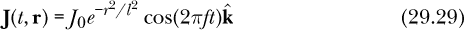

我们需要三个参数来完全指定这个电流密度：幅度 *J*[0]、局部化长度 *l* 和频率 *f*。我们可以把这个电流密度看作是在原点振荡的电荷，其振荡方向为 z 轴。

`jGaussian` 函数描述了方程 29.29 中的电流密度。

```
jGaussian :: R -> VectorField
jGaussian t r
    = let wavelength = 1.08             -- meters
          frequency = cSI / wavelength  -- Hz
          j0 = 77.5                     -- A/m²
          l = 0.108                     -- meters
          rMag = magnitude (rVF r)      -- meters
      in j0 *^ exp (-rMag**2 / l**2) *^ cos (2*pi*frequency*t) *^ kHat
```

函数`jGaussian`使用一些局部变量来指定其行为。我们希望振荡以一定的频率发生，从而产生波长为 1.08 米的辐射。频率（以赫兹为单位）是光速除以波长。我们选择了 77.5 A/m²的幅度，因为这样能够辐射约 100 瓦的功率。我们选择参数*l*为 0.108 米，这也是我们稍后在网格的空间步长中选择的值。这意味着只有靠近原点的网格点才会包含任何显著的电流密度。

在决定了电流密度作为电场和磁场的源后，我们转向一些关于网格边界的说明。

#### 网格边界

FDTD 方法使用有限的网格，在有限数量的位置跟踪电场和磁场。我们使用相邻的网格点来计算麦克斯韦方程所需的旋度，正如前面所解释的那样。网格边缘发生了什么情况？我们做出的简单选择是假设网格之外的电场和磁场为 0。这个选择是由 lookupAZ 函数强制执行的，任何网格外的点都会返回 0。虽然这个选择简单且似乎合理，但它也有一些不理想的特性。一个外出的波会在网格的边缘反射，反弹回来并干涉。然而，如果网格非常大，反射波的幅度可能非常小，它的存在可能是可以容忍的。在我们的案例中，我们只显示发生计算的网格的部分区域。我们的动画在波到达边界之前就终止了，因此我们看不到任何反射波。通常情况下，使用我们简单的边界条件得到的结果只在波传播到网格边缘之前有效。也有更复杂的方法可以处理网格边缘的边界条件。一种方法是模拟一个吸收所有入射辐射的材料；这或多或少地像一个无限的盒子，而无需计算无限多的点。Inan 和 Marshall 的书籍**[18**]对 FDTD 方法的边界条件进行了很好的讨论。

即使没有复杂的边界条件，我们正在进行的计算也具有很高的计算量。生成所有 PNG 文件可能需要 20 分钟或更长时间，这些文件将被拼接在一起，生成最终的动画。文件在信息可用时生成，因此你可以在自己的机器上看到每分钟生成的文件数量，并估算整个批次所需的时间。

现在我们已经准备好转向关于生成异步动画帧的问题。

#### 显示函数

我们希望有一个函数能够根据`StateFDTD`生成图片。函数`makeEpng`就是为此而生。它根据电磁场的状态生成一个 PNG 图形文件。我们计划在每个时间步长生成一个这样的图形文件，然后将它们拼接成动画。我们在`makeEpng`中生成的图片是 xz 平面上的电场图。我们使用阴影来表示场的强度，从一个表示零场的颜色（通常是黑色或白色）过渡到另一个表示最大强度的颜色。

```
makeEpng :: (Colour R, Colour R) -> (Int,StateFDTD) -> IO ()
makeEpng (scol,zcol) (n,StateFDTD _ _ _ _ em _)
    = let threeDigitString = reverse $ take 3 $ reverse ("00" ++ show n)
          pngFilePath = "MaxVF" ++ threeDigitString ++ ".png"
          strongE = 176  -- V/m
          vs = [((fromIntegral nx, fromIntegral nz),(xComp ev, zComp ev))
               | nx <- evens, nz <- evens, abs nx <= 50, abs nz <= 50
               , let ev = getAverage (nx,0,nz) em ^/ strongE]
      in gradientVectorPNG pngFilePath (scol,zcol) vs
```

函数`makeEpng`接受一对颜色作为输入，以及一对包含整数`n`和电磁场状态的值。颜色对由表示最强场的强色`scol`和表示零场的零色`zcol`组成。与状态配对的整数`n`作为 PNG 文件名称的一部分。

函数`makeEpng`使用局部变量来命名 PNG 文件、设置强电场的阈值，并列出需要显示的电场值。局部名称`pngFilePath`是一个`String`，其值是待生成的 PNG 文件的名称。该名称是*MaxVF*后跟整数`n`的三位数字，再后面是*.png*。我们使用阈值`strongE`来表示强电场，用于选择每个电场箭头的显示颜色。我们将 176 V/m 或更高的电场值用强色`scol`表示，0 值用零色`zcol`表示，介于两者之间的值则使用两种颜色的混合。

列表`vs`的类型为`[((R,R),(R,R))]`，包含了要显示的电场的二维位置和分量。下文定义的函数`getAverage`接受一组三个偶数作为输入，通过平均 Yee 单元两侧的值来生成空间中某一点的向量。最后，我们使用下文定义的函数`gradientVectorPNG`来制作图片。

#### 两个辅助函数

函数`getAverage`，之前在`makeEpng`中使用，用于通过平均周围位置的值来生成特定位置的场向量。由于 Yee 单元在不同的位置存储不同的场分量，我们可能会问是否有任何自然的方法可以将这些分量重新组合成一个单一的向量。答案是肯定的，只要我们愿意使用两个位置的值的平均值。在由偶偶偶三元组标记的 Yee 单元的任何位置，电场分量都存储在每个相邻的位置。通过平均这些值，我们可以在任何偶偶偶位置生成一个电场向量。类似地，我们可以在任何奇奇奇位置生成一个磁场向量。

```
getAverage :: (Int,Int,Int)  -- (even,even,even) or (odd,odd,odd)
           -> M.Map (Int,Int,Int) R
           -> Vec
getAverage (i,j,k) m
    = let vXl = lookupAZ (i-1,j  ,k  ) m
          vYl = lookupAZ (i  ,j-1,k  ) m
          vZl = lookupAZ (i  ,j  ,k-1) m
          vXr = lookupAZ (i+1,j  ,k  ) m
          vYr = lookupAZ (i  ,j+1,k  ) m
          vZr = lookupAZ (i  ,j  ,k+1) m
      in vec ((vXl+vXr)/2) ((vYl+vYr)/2) ((vZl+vZr)/2)
```

函数`getAverage`接受一个整数三元组作为输入，该三元组应该是电场的偶偶偶或磁场的奇奇奇，并附带一个查找表，然后返回一个矢量。它通过采样输入位置相邻的六个位置，平均每个方向的值，并将平均后的分量放入矢量中。

函数`gradientVectorPNG`，在之前的`makeEpng`中使用，与第二十二章中的`vfGrad`类似。它生成一个梯度矢量场图片。

```
gradientVectorPNG :: FilePath
                  -> (Colour R, Colour R)
                  -> [((R,R),(R,R))]
                  -> IO ()
gradientVectorPNG fileName (scol,zcol) vs
    = let maxX = maximum $ map fst $ map fst $ vs
          normalize (x,y) = (x/maxX,y/maxX)
          array = [(normalize (x,y), magRad v) | ((x,y),v) <- vs]
          arrowMagRadColors :: R  -- magnitude
                            -> R  -- angle in radians, ccw from x axis
                            -> Diagram B
          arrowMagRadColors mag th
              = let r     = sinA (15 D.@@ deg) / sinA (60 D.@@ deg)
                    myType = PolyPolar [120 D.@@ deg,  0 D.@@ deg, 45 D.@@ deg
                                       , 30 D.@@ deg, 45 D.@@ deg,  0 D.@@ deg
                                       ,120 D.@@ deg]
                             [1,1,r,1,1,r,1,1]
                    myOpts = PolygonOpts myType NoOrient (p2 (0,0))
                in D.scale 0.5 $ polygon myOpts # lw none #
                   fc (blend mag scol zcol) # rotate (th D.@@ rad)
          step = 2 / (sqrt $ fromIntegral $ length vs)
          scaledArrow m th = D.scale step $ arrowMagRadColors m th
          pic = D.position [(p2 pt, scaledArrow m th) | (pt,(m,th)) <- array]
      in renderCairo fileName (dims (V2 1024 1024)) pic
```

函数`gradientVectorPNG`接受三个输入：PNG 文件的名称、要使用的颜色对以及二维矢量位置和分量的列表。它将传入的 PNG 文件名称字符串赋予局部名称`fileName`。它将局部名称`scol`和`zcol`分别赋给要在图片中使用的强色和零色。列表`vs :: [((R,R),(R,R))]`提供了要显示的矢量的位置（实数对的第一个部分）和分量（实数对的第二个部分）。这些二维矢量的大小预期在 0（将获得零色）到 1（将获得强色）之间。

函数`gradientVectorPNG`将描述箭头位置的最大值*x*赋予局部名称`maxX`。局部函数`normalize`接受一个(*x*,*y*)对作为输入，并返回一个位于(–1, –1)到(1, 1)的平方范围内的对。函数`normalize`假设要显示的区域是位于原点的 xy 平面上的一个正方形区域。局部列表`array`包含箭头要放置的归一化位置，以及每个箭头的大小和方向。

函数`arrowMagRadColors`是一个辅助函数，用于生成单个箭头的图示。我们将其定义为局部函数，因为只有`gradientVectorPNG`函数使用它。由于它是局部函数，因此可以使用局部颜色`scol`和`zcol`，而无需将这些颜色作为`arrowMagRadColors`的输入。函数`arrowMagRadColors`期望箭头的大小在 0 到 1 的范围内，将零颜色分配给 0，将强色分配给 1。

我们使用局部变量`step`来缩放箭头的大小。它基于每行要显示的箭头数量，该数量等于要在整个正方形中显示的箭头总数的平方根。局部变量`pic`保存着函数最终渲染的整个图片。

#### 主程序

列表 29-2 通过指定初始状态设置了时间步长、时间步数和空间步长。

```
{-# OPTIONS -Wall #-}

import Maxwell ( makeEpng, stateUpdate, jGaussian, initialStateFDTD )
import Diagrams.Prelude ( black, yellow )

main :: IO ()
main = let dt = 0.02e-9   -- 0.02 ns time step
           numTimeSteps = 719
       in sequence_ $ map (makeEpng (yellow,black)) $ zip [0..numTimeSteps] $
          iterate (stateUpdate dt jGaussian) (initialStateFDTD 0.108)
```

*列表 29-2：用于生成电场动画 PNG 文件的独立程序*

它使用`sequence_`函数，该函数在第二十章中有描述，将一系列操作转换为一个单一的操作。由于函数应用运算符`$`是右结合的（回顾表 1-2），因此最容易从右到左阅读`mainPNGs`的定义。最右边的短语，

```
iterate (stateUpdate dt jGaussian) (initialStateFDTD 0.108)
```

是一个无限状态列表，从初始状态开始，其中电场和磁场在任何地方均为零，每个方向上的空间步长为 0.108 米。将`zip [0..numTimeSteps]`应用于此无限列表，生成一个有限列表，每个元素都是一个整数与一个状态的配对。将`map (makeEpng (yellow,black))`应用于这个配对列表，会生成一个类型为`[IO ()]`的有限列表。最后，应用`sequence_`将这些操作列表转换为一个单一操作。该程序将生成 720 个文件，命名为*MaxVF000.png*至*MaxVF719.png*，我们可以使用 ffmpeg 等外部程序将它们合并成一个 MP4 电影。

以下命令要求外部程序 ffmpeg 将所有名为*MaxVFDDD.png*的 PNG 文件合并，其中大写的 D 是数字。我们要求每秒 25 帧的帧率。最终的电影叫做*MaxVF.mp4*。

```
$ ffmpeg -framerate 25 -i MaxVF%03d.png MaxVF.mp4
```

我们使用 0.108 米的空间步长，因为它是我们期望的电流密度对应波长的十分之一。每个波长 10 个空间步长是我希望的最小步长。更多的空间步长会产生更精确的结果，但假设我们增加网格点的数量，以便使相同数量的波长适应网格，运行时间会更长。

时间步长需要稍微小于光传播一个空间步长所需的时间；否则，方法会变得不稳定。（有关稳定性标准的详细信息，请参见**[18**]）光传播一个空间步长大约需要 0.36 纳秒。我们的时间步长 0.02 纳秒足够小，可以避免不稳定性。当然，较小的时间步长会产生更精确的结果，但计算时间会更长。

图 29-3 显示了动画的一个帧，唯一不同的是我们使用了黑色作为强色，白色作为零色。

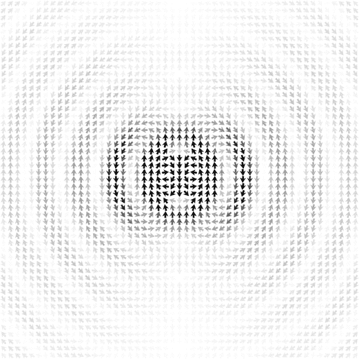

*图 29-3：通过求解麦克斯韦方程组得到的电场，使用的是电流密度`jGaussian`。该图像是主程序生成的帧之一，显示了 xz 平面。*

电场的波动性质显而易见。磁场没有显示在图 29-3 中，它指向或背离页面。电场的强度随着距离源点的增加而减弱。辐射电场在*z* = 0 平面上较强，而在源点上下的 z 方向上较弱。

### 摘要

在本章中，我们看到了麦克斯韦方程如何描述电磁场的演化。我们确定了电和磁之间的四种关系，并解释了麦克斯韦方程如何与我们在前几章中对电场和磁场的描述相关联。我们看到了麦克斯韦方程如何像牛顿第二定律一样，可以被视为一种状态更新技术的规则。我们描述了用于求解麦克斯韦方程的 FDTD 方法，并将其应用于振荡电荷和电流密度产生的辐射。我们制作了一个由振荡电流密度产生的类波电场的动画。

本书我们已经涵盖了很多内容。许多想法真的很酷，但并不容易立即理解。如果你和大多数人一样，你可能已经理解了一些内容，但也有一些卡住了。当你遇到困难时，我建议你保持耐心和毅力。耐心尤其重要，它有时意味着跳到下一节或下一章的开始。我书架上曾有过一些书，几年都没法读懂，但不知怎么的，我逐渐获得了所需的背景知识，某一天终于能读懂它们了。

希望你喜欢本书提供的 Haskell 计算物理学的介绍。当然，你可以用任何编程语言来做计算物理学。通过将我们在这里所做的工作翻译成其他语言，你会学到很多东西。让我们简要回顾一下我们所做的工作，回想一下函数式语言在物理学中的好处。纯函数式语言让我们能够并鼓励我们将核心和重要的部分表达为一个单一的函数。第十六章中的`newtonSecondPS`函数表达了牛顿第二定律。本章中的`maxwellUpdate`函数表达了麦克斯韦方程。

纯函数式编程提供了比像 Python 这样的命令式语言更简单的计算模型，因为在纯函数式编程中，名称（变量）指向的是永远不变的量。这鼓励我们为改变名词的动词（函数）命名，而不是为改变的名词命名。物理学是一个天然的候选领域，适合利用纯函数式编程，因为物理学的核心概念，如牛顿第二定律和麦克斯韦方程，可以作为动词来表达。

此外，类型化的函数语言使我们能够精确地表达一个函数所描述的动词的性质。`newtonSecondPS`的类型表明我们可以从一个单体力的列表中产生一个微分方程。来自第二十七章的`bFieldFromLineCurrent`的类型表明我们可以通过一条曲线和电流计算出磁场。

我们写的有副作用的函数，比如带有`IO ()`类型的`gradientVectorPNG`，它们确实对于生成图形和动画非常有用，但它们并不是真正属于本书副标题中所承诺的“优雅代码”范畴。Haskell 在做这些事情上和任何其他语言一样强大，但函数式语言在物理学中的真正强项在于其核心思想的优雅表达，而这些思想是纯粹函数式的。在函数式语言中编程让我能够写出与我脑海中学科组织方式相符的代码。我发现这有助于我思考学科内容。

在函数式语言中编写物理学的实践仍处于起步阶段。关于这个主题的两本进阶书籍是**[20**]和**[11**]。物理学和函数式编程可以相互提供更多东西，仍有许多值得探索的领域。如果你对这些感兴趣，我希望你继续探索这些领域。

### 练习

**练习 29.1.** 使用`gnuplot`绘制高斯函数图像

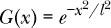

对于多个*l*值。

**练习 29.2.** 修改主程序和`makeEpng`函数，生成由电流密度`jGaussian`产生的 xy 平面内的磁场动画。尝试使用 10^(–6) T 作为强磁场的阈值。

**练习 29.3.** 电流密度

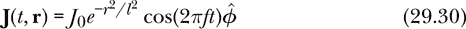

具有一个振荡的磁偶极矩，而方程 29.29 的磁偶极矩则是一个振荡的电偶极矩。由方程 29.30 的电流密度产生的辐射被称为磁偶极辐射。制作一个 xz 平面内磁场的动画。它应该看起来类似于我们为方程 29.29 的电流密度制作的电偶极辐射的电场动画。尝试使用 2 × 10^(–7) T 作为强磁场的阈值。
