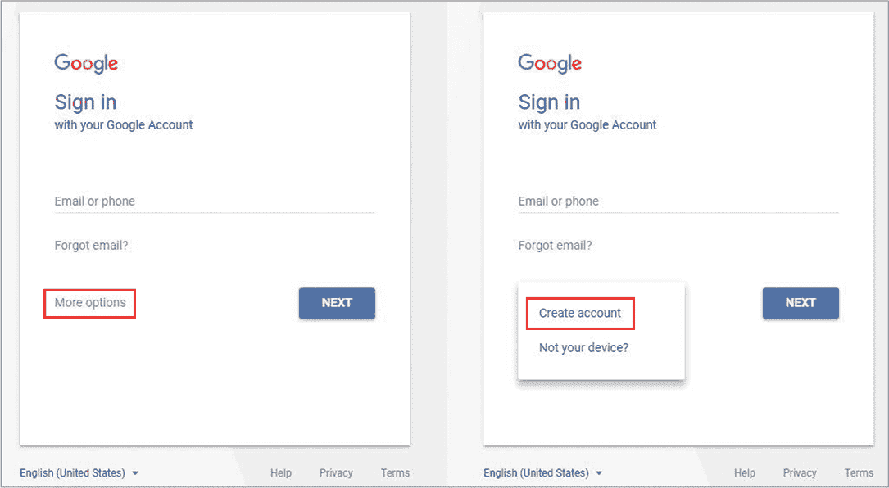
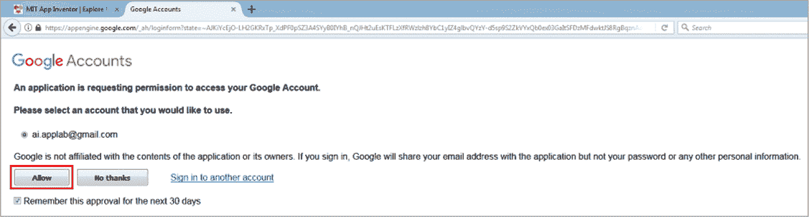
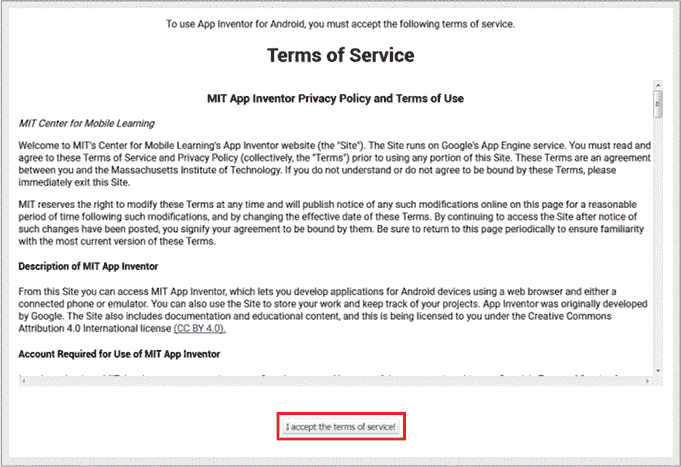
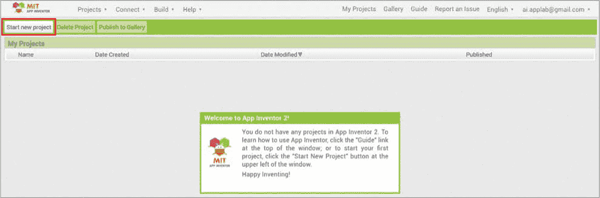
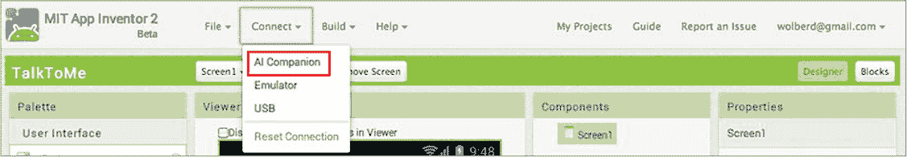
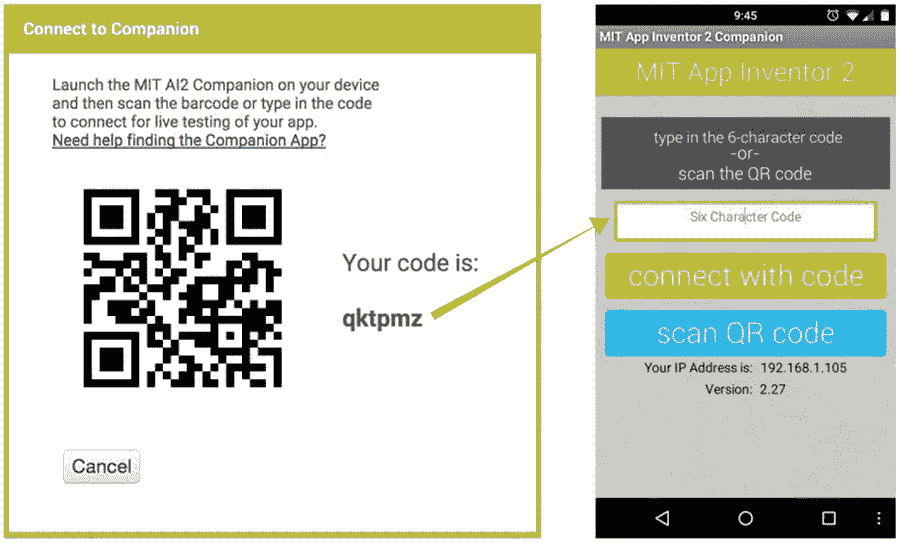
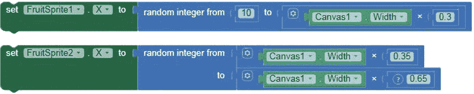

## **简介**

技术影响着我们生活的方方面面，计算机相关的工作和机会随处可见。现在，比以往任何时候都更重要的是每个人都能理解计算机是如何工作的。尤其重要的是，孩子们，包括那些来自弱势群体的孩子，必须知道他们有能力编写软件、学习计算机科学，或者选择成为计算机程序员。

在本书中，你将学习如何使用 App Inventor 制作有用且令人兴奋的*移动软件*——为手机和平板电脑开发应用程序，同时探索关键的编程概念。我们将创建能够发送短信、识别语音、访问手机通讯录、感知手机位置、操作相机和摄像机、解决数学问题、播放视频和声音、动画图形、将文本转换为语音，甚至响应触摸并让用户在屏幕上绘画的应用程序！

世界各地的许多年轻人正在使用 App Inventor 创建类似的应用程序，积极影响他们的社区。加利福尼亚的孩子们开发了一款应用程序，允许用户记录和报告涂鸦，并组织清洁活动。北达科他州的初中生创建了一款应用程序，鼓励他们社区进行更多的回收。德州的初中女生设计了一款使用全球定位系统（GPS）引导视力障碍学生在校园内行走的应用程序。尼日利亚的青少年开发了一款使用位置感知帮助交通警察抓捕违规者的应用程序。欧洲的年轻女性设计了一款众包应用程序，帮助居民找到安全的饮用水。印度的一名初中男生开发了一款帮助父母定位孩子校车并检查孩子是否在校车上的应用程序。创造性解决问题的可能性是无穷无尽的！

作为一名应用程序开发者，你也将有能力利用智能手机解决现实世界的问题，并帮助你的社区。你将运用批判性思维和问题解决技能，开发能够准确告诉计算机你希望它做什么的应用程序。

### **什么是 App Inventor？**

*App Inventor*是一个免费的在线可视化编程环境，最初由谷歌开发，现在由麻省理工学院（MIT）维护。它使人们能够为手机和平板电脑创建软件，而不仅仅是使用这些设备。

在传统的编程环境中，您需要输入实际代码来开发软件，例如使用 PHP 或 Java 语言。但 App Inventor 允许开发者通过将代码块拖放到屏幕上，而不是手动编写代码，来相对快速地创建技术。这种方法使任何人都可以在不到一小时的时间内创建并发布一款简单的智能手机或平板电脑应用程序。您还可以使用 App Inventor 来编程开发更复杂的应用程序，并且在比传统的基于文本的编程环境中节省更多的时间。使用 App Inventor，您将能够迅速开发软件——并且错误更少！

最棒的是，App Inventor 的代码块包含了与您在基于文本的环境中编写代码时所使用的相同编程逻辑。这意味着您在这里学习的编程概念将在您开始使用传统语言编程时有所帮助。

### **谁应该阅读本书？**

本书面向年龄为 11 岁及以上的好奇编程者，以及任何希望将编程介绍给孩子的家长或教育者。本书及其补充材料和课程计划旨在揭开编程的神秘面纱，教您如何构建酷炫的应用程序，并让您接触到计算思维技能和基本的编程概念。

本书还适合任何希望为移动设备构建有趣、功能丰富的应用程序，而不被基于文本语言的繁琐细节困扰的人。您不仅会熟悉 App Inventor，并学习如何构建本书中的应用程序，还将能够创建自己的强大应用程序，与朋友分享或上传销售。

### **本书内容有哪些？**

在本书中，您将学习如何使用 App Inventor 的拖放界面来创建每章中的有趣应用程序。在这个过程中，您将学习计算思维技能，如将问题分解为可管理的部分，以及基本的计算机编程概念，如处理事件、将数据存储在变量和列表中、使用控制结构引导程序流程、创建执行任务的过程、重构代码和调试。

每章末尾的“自学”练习测试您对概念的理解，并为您创建自己的应用程序做好准备。这些问题还将巩固您的编程原理知识，帮助您更顺利地过渡到传统的基于文本的编程。

以下是每章的内容：

**第一章：使用 App Inventor 构建应用程序** 您将创建一个“你好，世界！”应用程序，该应用程序可以通过语音识别向联系人列表中的电话号码发送消息，然后将应用程序打包并发送给您的朋友安装。

**第二章：App Inventor 与事件驱动编程** 在这一章中，您将使用事件处理程序创建一个应用程序，您可以用它来录制、观看和重新录制自己练习演讲或歌曲的临时视频片段。

**第三章：水果夺宝：创建一个简单的动画游戏** 编程动画并使用变量构建“水果夺宝”游戏，在游戏中，您通过抓住随机掉落的水果获得积分。

**第四章：乘法站：用代码做出决策** 使用条件语句和运算符创建“乘法站”应用程序，生成随机、限时的乘法题目供您解答，并检查您的答案。

**第五章：打败公交车：使用地图和传感器跟踪位置** 在本章中，您将创建并使用列表来构建“打败公交车”应用程序，该应用程序允许经过批准的成年人追踪您从学校到预设目的地的行程，而无需使用成年人的手机上消耗电量的位置服务。

**第六章：井字棋：使用循环创建一个游戏** 您将使用循环、条件语句和运算符来创建经典的“井字棋”游戏。

**第七章：乘法站 II：通过过程重用代码** 在本章中，您将探索如何创建和调用函数（在 App Inventor 中称为*过程*），以构建“乘法站 II”应用程序，您可以选择乘法题目的难度级别，并计算您的原始分数和百分比得分。

**第八章：虚拟太阳镜：绘制和拖动图像** 您将创建“虚拟太阳镜”应用程序，它可以让您拍摄自拍照，虚拟试戴各种太阳镜，甚至在屏幕上涂鸦。

**附录：App Inventor 组件和内置模块**

### **如何使用本书**

要在每章中创建应用程序，您需要上传图像和任何音频文件。您可以在*[`nostarch.com/programwithappinventor/`](https://nostarch.com/programwithappinventor/)*下载它们。若要使用您自己的图像和声音文件，请使用 JPG 或 PNG 图像文件和 MP3 音频文件，并尽可能选择较小的文件大小。请记住，App Inventor 限制每个上传文件的大小为 1MB，且每个应用的总大小不得超过 5MB（包括图片、声音和其他资源）。

下载每章“独立完成”练习的解决方案和每章的课程计划，网址是 *[`nostarch.com/programwithappinventor/`](https://nostarch.com/programwithappinventor/)*。

### **开始使用 App Inventor**

在开始设计移动应用之前，您需要先设置一个 App Inventor 账户。拥有账户后，您可以在网络上处理您的应用并将其保存在云端。您还可以进行*实时测试*，这意味着您可以在工作过程中查看和测试所有更改。

在本节中，您将学习如何设置自己的账户并登录 App Inventor。然后，您将学习如何在设备上测试您的应用程序。

若要设置账户，请访问 App Inventor 的主页 *[`appinventor.mit.edu/`](http://appinventor.mit.edu/)*，如图 1 所示，并使用 Chrome 或 Firefox 等网页浏览器。

*图 1：App Inventor 首页*

点击图 1 中红框标出的**创建应用！**按钮，位于窗口的顶部。这将带你进入一个 Google 登录页面，如图 2 所示，在该页面你将被提示使用 Google 账户登录。

*图 2：使用你的 Google 账户登录*

如果你已经拥有 Gmail 账户，输入该电子邮件地址，并在提示时输入密码。如果没有，请点击**更多选项**，然后点击**创建账户**创建 Gmail 账户。如果你未满 13 岁，请务必在成人的帮助下获得允许后创建账户。

输入你的 Gmail 地址和密码后，系统会要求你允许 App Inventor 访问你选择的 Google 账户，如图 3 所示。

*图 3：输入 Gmail 地址和密码后，App Inventor 请求访问你的 Google 账户权限。*

点击**允许**登录。如果这是你第一次登录，你应该会看到 App Inventor 的服务条款，如图 4 所示。

*图 4：首次登录时，显示的服务条款窗口。*

阅读完后，点击**我接受服务条款！**。

接下来，你将被要求完成自愿用户调查，如图 5 所示。

*图 5：每次登录时，都会出现此调查窗口，直到你完成调查或点击“从不参与调查”按钮。*

点击**立即调查**完成调查，或者点击**稍后调查**稍后进行调查。

现在你应该看到每次登录时都会显示的“欢迎使用 MIT App Inventor”页面，如图 6 所示。此页面会告知你 App Inventor 开发人员何时计划进行更新或发布包含修复或新功能的 App Inventor 版本。

快速浏览此页面了解是否有更新，并点击**继续**关闭该页面。

*图 6：每次登录 App Inventor 时，欢迎页面会显示并提供简短的更新信息。*

如果这是你第一次登录 App Inventor，你应该会看到图 7 的提示，表示你还没有任何项目。

*图 7：首次登录时，显示的“开始新项目”页面。*

要开始你的第一个项目，请点击窗口左上角附近的**开始新项目**。

如果你之前已经登录并保存过一个项目，此时你应该会看到你上次使用的应用。要开始一个新应用，请点击**项目**打开下拉菜单，然后选择**开始新项目**。

现在你几乎准备好创建你的第一个应用了！

### **实时测试你的应用**

要创建一个应用程序，你需要在开发过程中看到它的外观和功能。你将在 App Inventor 网站上找到多个选项来测试你的代码。在本书中，我们将使用 App Inventor 的 Companion 应用程序，称为 *MIT AI2 Companion*，通过 Wi-Fi 将你的手机与计算机连接。

虽然你可以在所有类型的安卓移动设备上测试 App Inventor 应用程序，并且 iOS 设备的测试功能在本文撰写时正在开发中，但我建议你使用一部功能齐全的手机。使用功能齐全的手机可以确保你可以方便地测试应用程序中所需的所有现代移动计算功能（相机和视频录制；语音识别、文本转语音和 GPS 功能；以及可用的短信服务计划）。

#### **将手机连接到计算机**

为了使实时测试正常工作，你必须在设备上安装 MIT AI2 Companion 应用程序，并通过 Wi-Fi 将设备连接到互联网。你无需下载任何文件到计算机，只需按照本节中的说明下载并安装 MIT AI2 Companion 应用程序到你将用于测试的设备上。

##### **安装 MIT AI2 Companion 应用程序**

要直接将 MIT AI2 Companion 应用程序下载到你的测试设备上，请在设备的 Google Play 商店中搜索该应用并进行安装。

一旦你安装了 Companion 应用程序，确保你的设备连接的是 Wi-Fi（而非手机网络），并且确保你已将登录到 App Inventor 的计算机和测试设备连接到*相同*的 Wi-Fi 网络，这样它们才能进行通信。现在，你应该能够随时在设备上打开 Companion 应用程序，查看和测试你在 App Inventor 中的当前项目。

##### **使用你的设备进行测试**

要在设备上测试 App Inventor 项目，请选择 **连接** ▸ **AI Companion**，如 图 8 所示。

*图 8：用于实时测试应用程序的连接菜单，选择了 AI Companion 选项*

你应该会看到一个小窗口，显示二维码和六位数代码，如 图 9 左侧所示。当你在设备上打开 Companion 应用程序时，它应该显示像 图 9 右侧的界面。

*图 9：显示用于扫描或输入到 AI2 Companion 应用程序中的代码的 App Inventor 窗口，以便在你的设备上进行实时测试（左侧）和 AI2 Companion 应用程序的主屏幕（右侧）*

在 Companion 应用程序的文本框中输入六位数代码，然后点击 **使用代码连接**，或者点击 **扫描二维码** 来扫描代码。几秒钟后，Companion 应用程序应显示你正在处理的项目，并随着你在计算机上所做的更改自动更新。

#### **使用屏幕模拟器**

如果无法使用设备进行测试，你可以通过其他方式进行测试，包括使用 App Inventor 内置的安卓模拟器。

我现在要提醒你，模拟器运行较慢，并且无法轻松测试某些移动计算功能，如拨打电话、发送短信和响应运动传感器。然而，你仍然可以检查应用设计的所有方面以及一些功能，如按钮点击。要安装模拟器，请访问*[`appinventor.mit.edu/explore/ai2/setup-emulator.html`](http://appinventor.mit.edu/explore/ai2/setup-emulator.html)*，然后按照你计算机操作系统的指示进行操作。

### **关于约定的说明**

书中使用了一些约定来简化指令或节省空间，如下所述。请注意，这些方法可能并不总是代表最佳的编码实践。

#### **处理重复组件**

当一个组件被添加到应用程序中时，仅当在应用程序中使用两个或更多相同组件时，才会将其重命名为更具描述性的名称，以避免混淆。否则，组件保持其默认名称，以减少不必要的指令。

例如，如果一个应用程序使用两个或更多按钮，我们会为它们提供有意义的名称，以便清晰地识别每个按钮的功能。但如果应用程序只有一个按钮，我们会保持它命名为`Button1`，因为没有可能将其与另一个按钮混淆。

#### **块输入的外观**

App Inventor 允许你右键点击需要多个输入的块，并选择是否将其显示为*内联输入*或*外部输入*。图 10 中的两个随机整数块展示了两者的区别。

*图 10：连接到两个随机整数块的设置块，顶部为内联输入，底部为外部输入*

顶部的`FruitSprite1`设置块显示了插入`from`和`to`插槽的随机整数块作为内联输入。

但底部的`FruitSprite2`块显示了插入`from`和`to`插槽的块作为外部输入，占用较少的水平空间。

在整个书中，当你发现图中的输入看起来与拖动到应用中的输入不完全相同时，那是因为我已更改了输入，以便更好地适应页面上的可用空间。

#### **在 WINDOWS 上创建的应用程序**

本书中创建的所有应用程序都是在 Windows 计算机上创建的。如果你在 Mac 上创建应用程序，它们可能与图示中的有所不同。

一旦你设置了你的 App Inventor 账户并在测试设备上安装了 Companion 应用程序或以其他方式设置了实时测试，你就可以开始创建和测试应用程序了。

让我们开始吧！
