## **1

使用 App Inventor 构建应用**

使用 App Inventor，你可以快速轻松地使用一些最激动人心的移动技术构建应用。App Inventor 提供了控制应用外观和感觉、添加有用的移动计算功能，以及设置或编程应用行为的工具。

在本章中，你将开始使用这些工具构建你的第一个应用，“Hi, World!”，它允许你通过语音识别给某人发短信。你还将学习如何与他人共享你的应用。

### 规划新应用

在开始构建应用之前，你需要弄清楚应用的目标或你希望它解决的问题。一旦你做到了这一点，你可以*分解*你的项目，这意味着将你的目标分解成更小的部分，这样比一次性完成所有任务要容易得多。这样做反过来将帮助你概述开发应用各个部分所需的精确步骤，或*算法*，然后再开始编程。

你还将识别应用需要的元素和功能，以确保它能够正常运行并让用户按照你的意图与其互动。例如，应用是否允许用户拍摄视频、发送短信或感知他们的位置？用户是否需要点击按钮、输入文本或从选项列表中选择来完成这些任务？这些问题可能帮助你确定需要哪些功能。

一旦你知道了在应用中包含什么内容，你可以布局它的*用户界面*元素——用户可以在屏幕上看到并与之互动的部分。你的应用应该容易让用户使用和理解。为了保持用户的注意力，你可以添加图片、颜色和不同的文本样式。

### 布局你的应用

一旦你有了计划，你将开始在设计器中布局所需的组件。在 App Inventor 中，*组件*是你可以在应用中使用的所有可见和不可见元素，包括设置外观和感觉的元素以及添加激动人心功能的元素。所有组件都有*属性*或特征，你可以设置和/或编程操作。

在本章中，你将使用用户界面组件以及媒体和社交组件，为你的应用添加语音识别和短信功能。在本书的后面，你将使用更多的组件，添加诸如视频录制、定位感应、语音合成、动画、绘图、拖动、声音、拍照等功能！有关可用组件的详细概述，请查看附录。

要布置应用的组件，你需要使用 App Inventor 的设计器窗口，如图 1-1 所示。设计器窗口由左侧的*调色板*面板组成，其中包含所有可能组件的抽屉；*查看器*面板，您可以在其中看到从调色板中拖动的组件并按其在应用屏幕上显示的方式进行布置；*组件*面板，列出了应用中的所有组件，并允许你为它们命名；*媒体*面板，列出了你上传到应用中的所有图片、音频剪辑和其他媒体文件；以及*属性*面板，在这里你可以设置应用组件的初始特性。

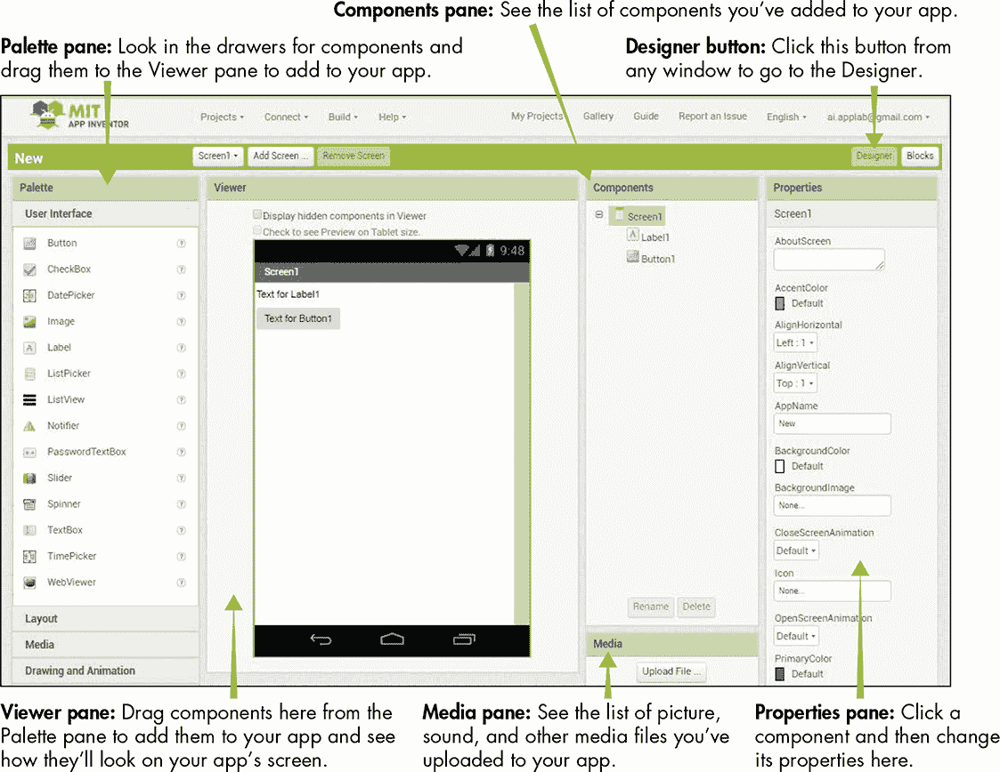

*图 1-1：App Inventor 设计器窗口*

### 在块编辑器中编程你的应用

一旦你将所有必要的组件放入应用中，使用“块编辑器”根据你的计划进行编程。点击图 1-2 中显示的**块**按钮，打开块编辑器窗口。

块编辑器窗口由左侧的*块*面板和右侧的*查看器*面板组成。块面板包含多个抽屉，分别是*内置块*，用于编程应用的一般行为，以及*组件特定块*，用于指示每个应用组件的特定操作。为了让应用执行操作，从块面板中的抽屉中拖动块并将它们拼接在查看器中。

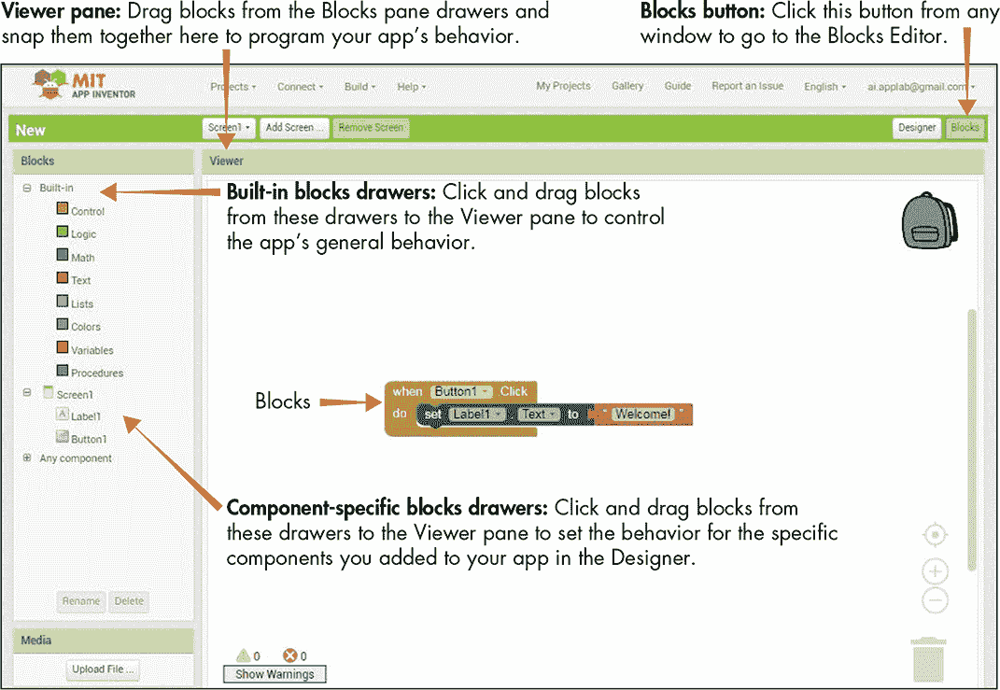

*图 1-2：块编辑器窗口*

有关 App Inventor 内置块的详细概述，请参阅附录。在后续章节中，你将探索特定组件的块以及各种组件的相应操作。

### 构建“HI, WORLD!”应用

本书中你将创建的第一个应用是“Hi, World!”应用。这个应用的名字是对“Hello, World”这一常见的程序设计语言入门脚本的戏仿，计算机科学学生在学习编程语言时通常会编写这个脚本，脚本会在屏幕上显示“Hello, World”。然而，“Hi, World!”应用更加实用，因为它使用了`SpeechRecognizer`、`PhoneNumberPicker`和`Texting`组件，让你通过语音识别来发送短信！你可以使用这个无打字短信应用，通过大声说出消息、选择一个电话号码，然后给此人发送短信。

按照《开始使用 App Inventor》中的说明登录 App Inventor，详细信息见第 xviii 页。如果这是你第一次登录，你应该会看到图 1-3 中的提示，告知你当前没有项目。

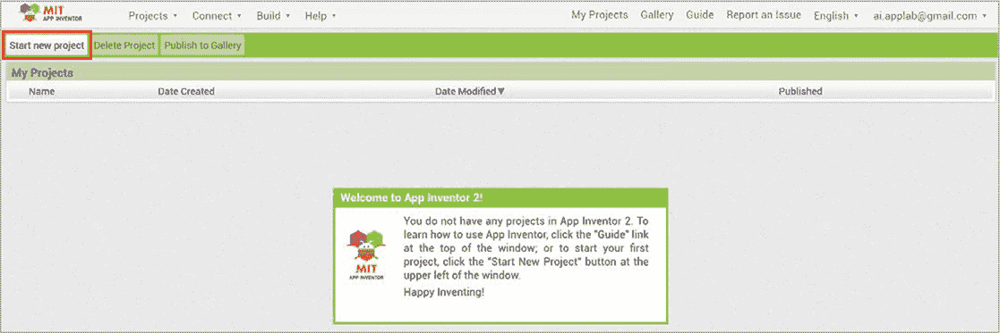

*图 1-3：首次登录 App Inventor 时会出现“新建项目”屏幕。*

点击窗口左上角附近的**新建项目**按钮。点击该按钮后会打开一个对话框，你可以在其中输入第一个项目的名称。输入 HiWorld（没有空格），然后点击**确定**。

如果你之前已登录并保存过项目，App Inventor 应该会打开你上次工作的应用。要开始一个新应用，点击**Projects ▸ Start new project**，如图 1-4 所示。

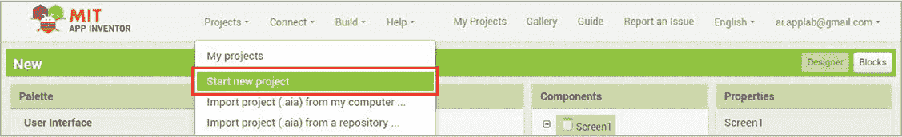

*图 1-4：Projects 菜单标签中的 Start new project 选项*

在弹出的对话框中，通过输入 HiWorld（没有空格）来命名项目，然后点击**OK**。

#### 分解“HI, WORLD!”

在我们开始构建应用之前，先概述一下“Hi, World!”要执行的操作。我们希望应用能够将用户说出的消息发送给某个人。我们可以将这个操作分解为三个步骤。

1.  当用户点击消息按钮时，打开手机的语音转文本功能并捕获用户的文本。

1.  当用户点击 `PhoneNumberPicker` 时，打开手机的联系人列表。

1.  当用户点击文本按钮时，将语音转文本功能转换的消息发送到选定的电话号码。

你将需要以下组件：

+   Button (2) 供用户点击以启动操作

+   用于应用设计的图像

+   PhoneNumberPicker 供用户点击选择号码

+   SpeechRecognizer 用于捕获并将语音转换为文本

+   短信功能用于发送消息

在本书中，我们为每个应用都将使用这种格式，将操作分解为可管理的步骤，并确定需要哪些组件来使其工作。

#### 在设计器中布局“HI, WORLD!”

现在，让我们思考如何布局应用的组件，以及如何呈现指示，使得应用易于使用和理解。

对于这个应用，用户的指示非常简单，我们可以将它们包含在`Button`和`PhoneNumberPicker`组件上，只要这些组件足够宽以显示文本。为此，我们将所有可见组件（用户可以看到并与之交互的组件）的宽度设置为屏幕宽度。这样，我们就不需要使用布局抽屉中的组件来构建屏幕显示，因为将所有组件设置为屏幕宽度要求我们将所有组件堆叠在一起。我们需要做的就是在顶部放一张图片以增加视觉效果，并按照我们希望用户与其交互的顺序简单地放置其他组件。

##### 添加组件

进入设计器，布局图像和应用所有三个部分的其他组件。确保你在设计器窗口中，点击**Designer**按钮，如图 1-5 所示。

*图 1-5：点击***Designer***按钮打开设计器窗口，在那里你将布局应用组件。*

在设计器窗口中，从调色板窗格中的组件库拖动所需的组件到查看器窗格。从用户界面库中，拖动一个图片组件和两个按钮组件；从媒体库中，拖动一个语音识别器组件；从社交库中，拖动一个电话号码选择器组件和一个短信组件。此时你的屏幕应该与图 1-6 所示相同。

在查看器窗格中，你应该能看到所有可见的组件在`Screen1` ➊，以及屏幕下方的不可见组件 ➋。在组件窗格 ➌ 中，你应该能看到刚刚拖到查看器窗格的所有组件列表。

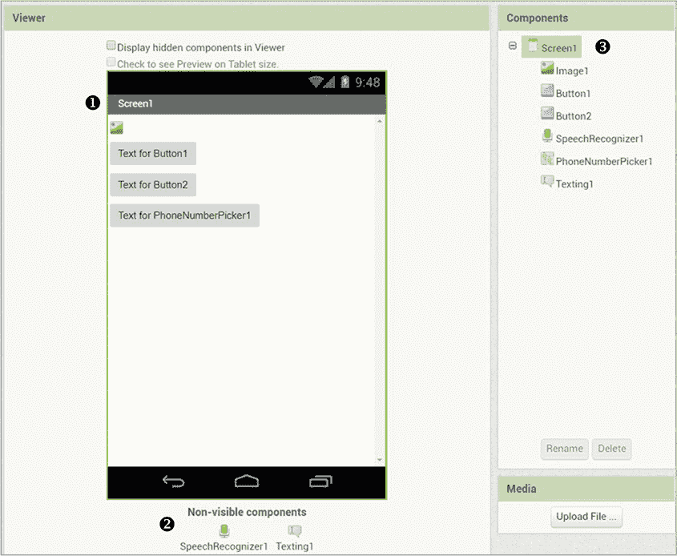

*图 1-6：将所有“Hi, World!”应用组件拖到查看器窗格后的屏幕*

现在，你可以通过在组件窗格中点击每个可见组件来进行调整。图 1-7 展示了点击`Image1`时的效果。

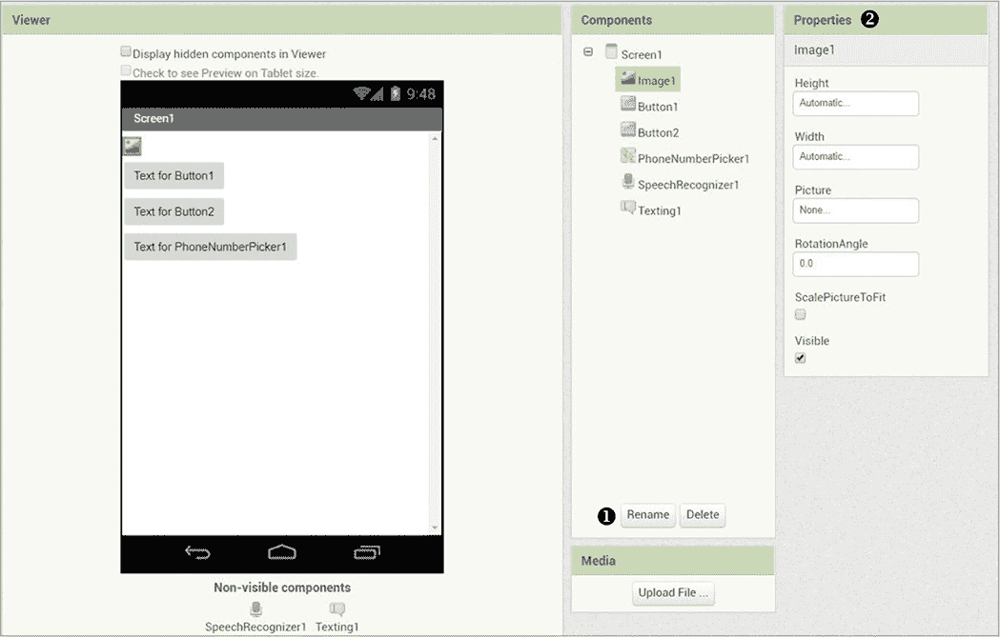

*图 1-7：点击组件窗格中的`Image1`后的设计器窗口*

一旦你在组件窗格中点击`Image1`，你应该能看到窗格底部附近的按钮 ➊，这些按钮允许你重命名或删除`Image1`组件。在属性窗格 ➋ 中，你应该能看到所有你可以在设计器中设置的`Image1`的属性。

##### 调整组件宽度

由于你在这个应用中只有一个图片，你不需要重命名它。但你*确实*需要调整它的大小，使其与屏幕的宽度一致。要调整`Image1`的大小，在属性窗格中，点击**宽度**下的文本框，打开图 1-8 所示的对话框。

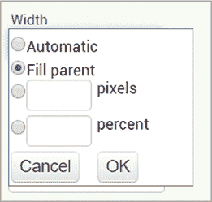

*图 1-8：允许你更改组件宽度的属性对话框*

点击**填充父级**单选按钮，然后点击**确定**。这应该会将`Image1`的宽度调整为屏幕的宽度，屏幕是`Image1`的*父级*，即包含它的组件。

##### 上传图片

接下来，你需要上传你想要在应用屏幕上显示的图片，作为`Image1`。要上传图片，点击**图片**下的文本框，并点击图 1-9 左侧所示的**上传文件...**按钮，这应该会打开右侧所示的对话框。

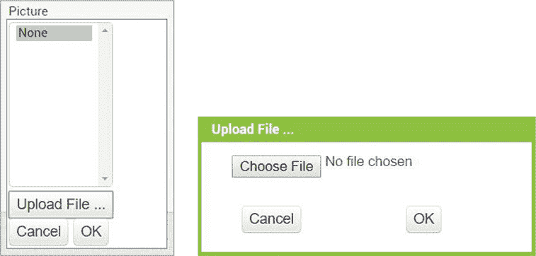

*图 1-9：图片和上传文件对话框*

点击**选择文件**按钮。文件管理器应该会打开，显示你计算机上的文件，并允许你找到你想要上传的图片，如图 1-10 所示。

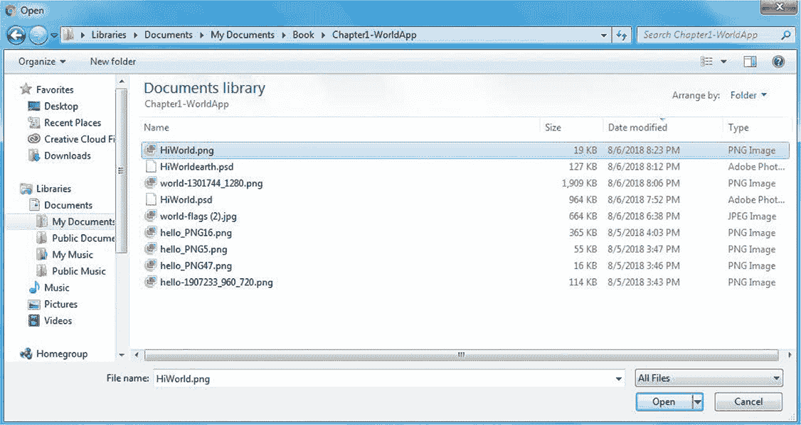

*图 1-10：文件管理器窗口允许你从计算机中选择文件。*

选择你想使用的图片，点击**打开**按钮，然后在图 1-9 中点击**确定**，即可关闭上传文件对话框。你可以下载用于此练习的示例图片，以及本书附带的其他材料，网址是*[`nostarch.com/programwithappinventor/`](https://nostarch.com/programwithappinventor/)。

图 1-11 展示了上传图片后你应该看到的内容。

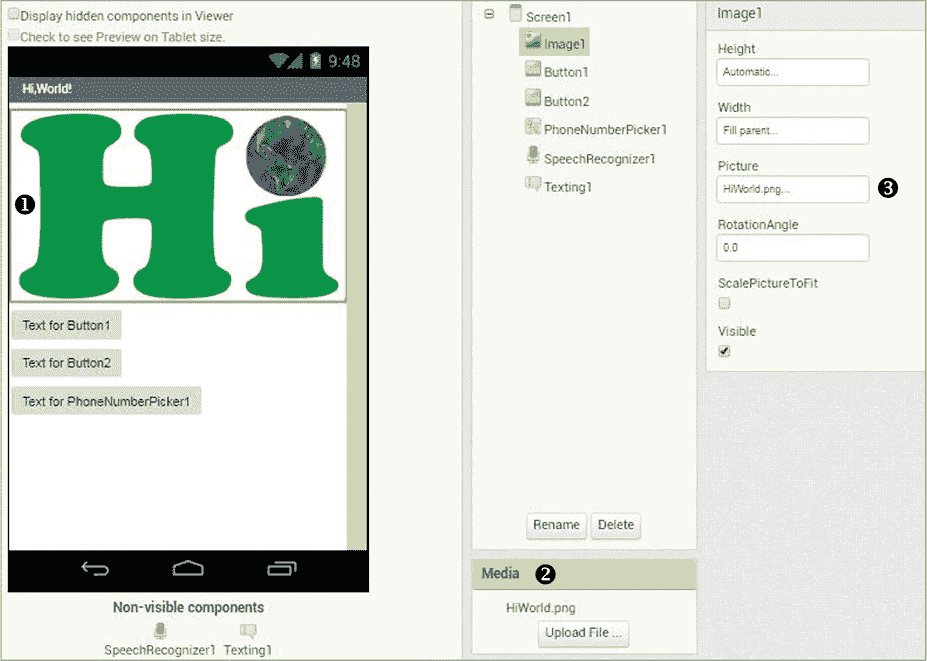

*图 1-11：你在属性面板中上传图片后的设计器窗口*

现在你应该能在属性面板 ➌ 的“图片”文本框中看到`Image1`的图片名称，并在媒体面板 ➋ 中看到该名称。上传的图片应该会显示在查看面板 ➊ 中的`Screen1`上。

##### 创建“发送消息”按钮

现在我们通过点击组件面板中的`Button1`来设置其属性。由于应用包含两个`Button`组件，为了避免混淆每个按钮的功能，我们将把`Button1`的名称更改一下。

要重命名`Button1`，点击组件面板底部附近的**重命名**按钮。这将打开一个重命名组件的对话框，如图 1-12 所示。

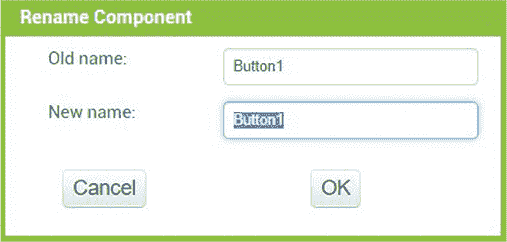

*图 1-12：点击组件面板中的重命名按钮后打开的重命名组件对话框。*

**注意**

*当你重命名一个组件时，你会将其默认名称更改为一个更有意义的名称，以描述它的功能，并且在设计器窗口和区块编辑器中易于识别。只有你和与你共享应用代码的人能看到组件的名称。重命名组件不同于更改组件（如按钮或标签）上的显示文本，后者是用户实际看到的。*

在**新名称：**文本框中输入没有空格的 SayMessageBtn，并点击**确定**。你应该能在设计器窗口中的组件和属性面板看到`Button`的名称已经更改为`SayMessageBtn`。

让我们将按钮的宽度设置为填满屏幕，就像我们对`Image1`所做的那样。要更改属性面板中`SayMessageBtn`的宽度，点击**宽度**下方的文本框，选择**填充父级**单选按钮，然后点击**确定**。

最后，让我们更改`SayMessageBtn`上显示的文本，以便为用户提供清晰的指示。在属性面板中的**文本**文本框内点击。删除默认的`Text for Button1`，输入 1\. Say a Message，然后点击文本框外。 图 1-13 展示了`SayMessageBtn`上的新文本以及你对其属性所做的其他更改。

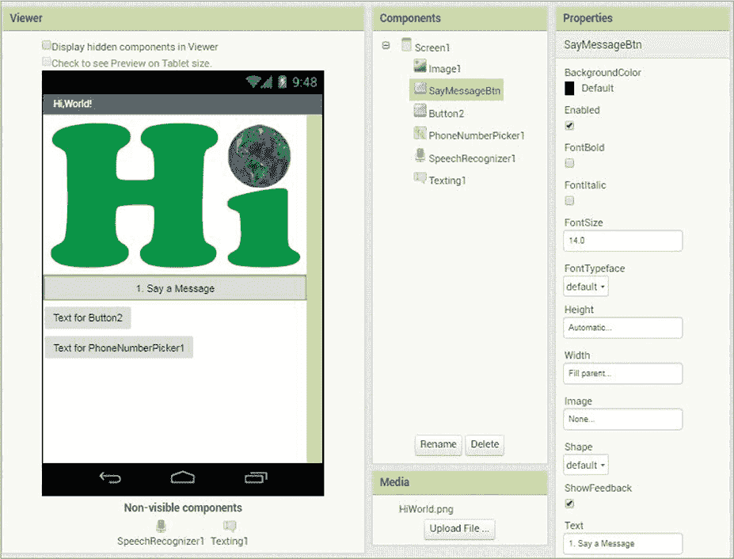

*图 1-13：更改`SayMessageBtn`的名称、宽度和文本后的设计器窗口*

接下来，我们将对`Button2`进行类似的更改。

##### 创建“发送消息”按钮

通过点击组件窗格中的`Button2`，然后点击**重命名**按钮，在**新名称：**文本框中输入`SendTextBtn`（没有空格），最后点击**确定**，来重命名`Button2`。您可以看到按钮名称已更改为`SendTextBtn`，并且在组件和属性窗格中都能看到。

接下来，为了更改`SendTextBtn`的宽度，请在属性窗格中点击**宽度**下的文本框，选择**填充父容器**单选按钮，然后点击**确定**。最后，将`SendTextBtn`上的文本更改为提供给应用程序用户的指示。

要进行更改，请点击**文本**下文本框中的内容，将`Button2`的文本替换为 3\. 发送您的消息，然后点击文本框外部。在查看器窗格中，您现在应该能看到您对`SendTextBtn`所做的所有更改，如图 1-14 所示。

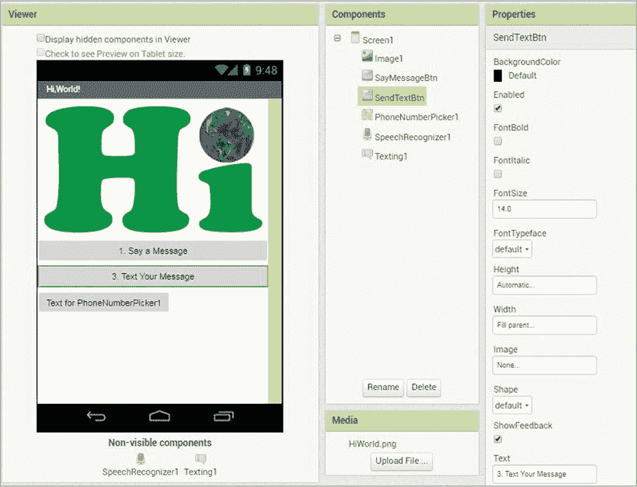

*图 1-14：更改`SendTextBtn`的名称、宽度和文本后的设计器窗口*

接下来，我们来更新应用程序的最后一个可见组件`PhoneNumberPicker1`，用户将用它来决定要发送短信的对象。

##### 创建选择一个号码按钮

点击组件窗格中的`PhoneNumberPicker1`。在属性窗格中，要更改其宽度，就像对其他组件所做的那样，点击**填充父容器**单选按钮，然后点击**确定**。同时，将组件上的文本更改为提供给应用程序用户的指示。

要进行更改，将**文本**下文本框中现有的`PhoneNumberPicker1`文本替换为 2\. 选择一个号码，然后点击文本框外部。在查看器窗格中，您应该能看到对`PhoneNumberPicker1`所做的更改。

现在，您只需要将`PhoneNumberPicker`组件移动到`SendTextBtn`上方，以便用户按照您希望的顺序在应用程序中浏览。我们需要用户在发送短信之前选择接收者的电话号码，因此我们通过在查看器窗格中点击并拖动`PhoneNumberPicker1`向上移动，使其出现在“3\. 发送您的消息”之前。图 1-15 显示了目前应用程序的样子。

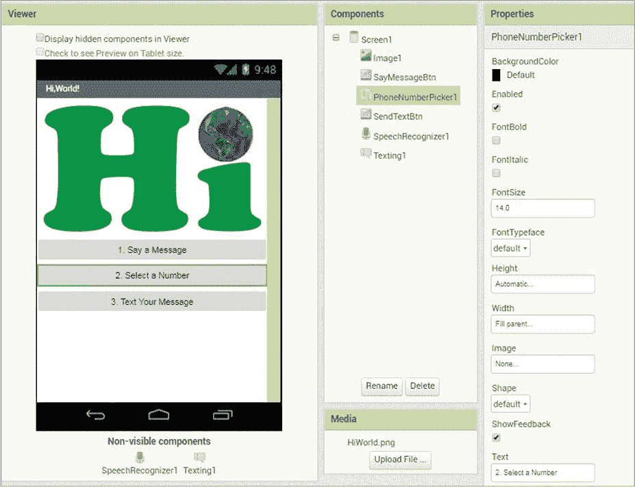

*图 1-15：更改`PhoneNumberPicker1`的宽度、文本和位置后的设计器窗口*

尝试更改更多属性，让应用程序在视觉上更具吸引力且更易用。例如，您可以将`Button`组件和`PhoneNumberPicker1`的颜色更改为图像中的最深色，比如我的`Image1`组件中的深绿色，并使文本变为粗体、增大并变为白色，以便在新深色背景上清晰可见。现在让我们来试试。

##### 更改按钮颜色

要更改`Button`和`PhoneNumberPicker1`组件的背景颜色，请在属性窗格中点击每个组件，然后点击`背景颜色`下的**默认值**，打开左侧图 1-16 中显示的颜色列表对话框。

如果列表中的某个颜色与`Image1`中的最深颜色匹配，点击该颜色名称选择它。如果列表中的颜色都不合适，请点击列表底部的**自定义...**，这将打开如图 1-16 所示的颜色选择器。

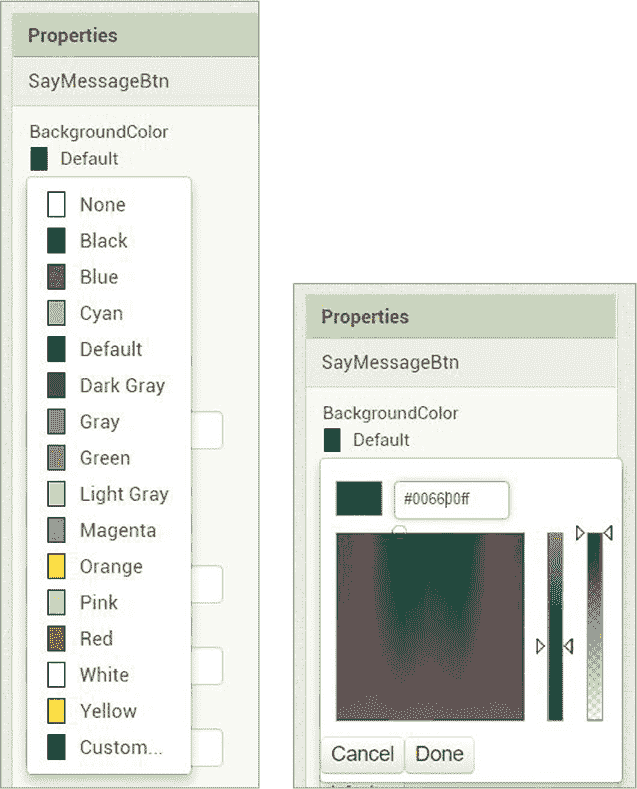

*图 1-16：用于更改属性面板中各种组件属性颜色的颜色列表和自定义颜色选择器*

在颜色选择器中，替换当前的 000000 颜色号，输入您希望使用的颜色号码。例如，您可以输入 006600，使用我在`Image1`组件中所用的较深绿色，然后点击**完成**。

##### 格式化按钮字体

现在，通过点击属性面板中的**FontBold**复选框，使每个组件上的文本加粗，如图 1-17 所示。

通过在**FontSize**文本框中将 14.0 替换为 20，使文本变大。最后，您可以通过点击`TextColor`下方的**Default**，打开颜色列表，如图 1-17 所示，然后点击**White**，使文本颜色变为白色。

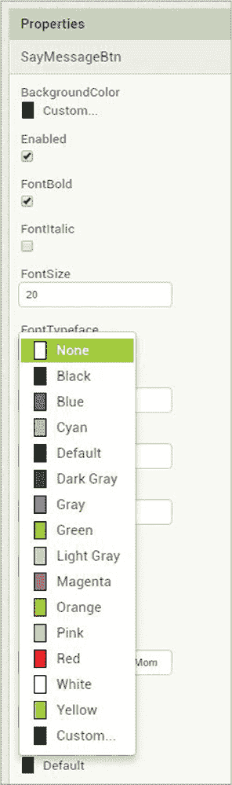

*图 1-17：`SayMessageBtn`属性面板，显示`Button`背景和字体的变化*

#### 在块编辑器中编程“HI, WORLD！”

现在您已经布置好了所有组件，接下来可以进入“块”编辑器来编程应用程序。点击**块**按钮，如图 1-18 所示，切换到“块”编辑器。

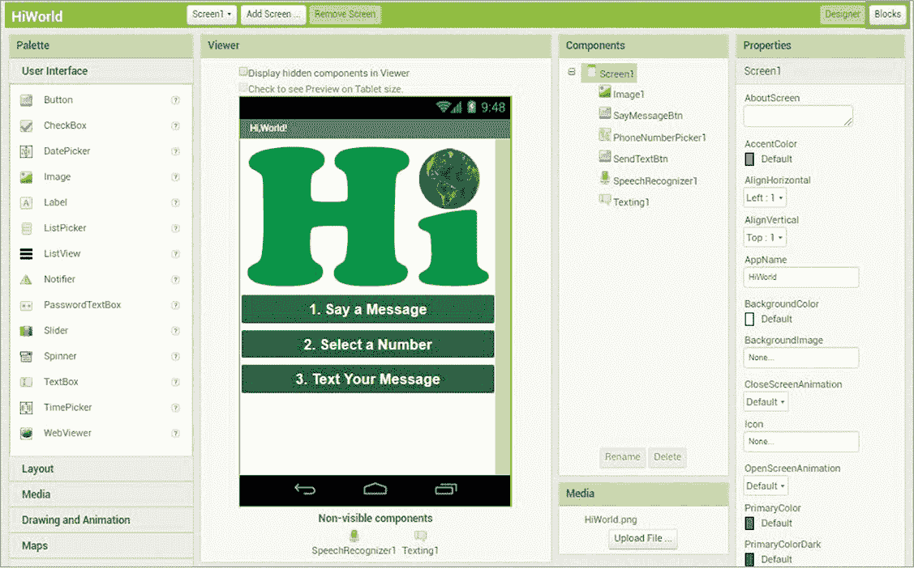

*图 1-18：您布置应用程序后的设计窗口*

对于“Hi, World!”应用，您将仅使用组件特定的块来编程该操作。您将按照“分解‘Hi, World!’”中概述的步骤顺序进行编程，详见第 5 页。

##### 第 1 步：将语音转换为文本

我们首先告诉应用程序当用户点击`SayMessageBtn`，即“1. 说一个消息”按钮时该做什么。当按钮被点击时，我们希望应用程序打开手机的语音转文本功能，以捕捉并将用户的语音转换为文本。

图 1-19 显示了如何编程第 1 步。

在“块”面板中，点击 SayMessageBtn ➊，当该组件的块出现时，将 whenSayMessageBtn.Click 块拖到查看器中。然后，在“块”面板中，点击 SpeechRecognizer1 ➋并将 callSpeechRecognizer1.GetText 块拖到查看器中。将 callSpeechRecognizer1.GetText 块放入 whenSayMessageBtn.Click 块中，紧挨着`do`一词。用简单的英文来说，这些块的意思是：“当按钮被点击时，打开手机的语音识别器以获取文本”，这与我们在分解应用程序时概述的非常相似。

现在我们将进行实时测试，看看这些代码块如何工作。最好在一部正常工作的手机上测试这个应用。如果你尝试在内置模拟器或没有语音转文字功能的设备上测试这些代码块，当你点击 SayMessageBtn 时可能会出现错误。请按照“实时测试你的应用”中的说明，在手机上使用 MIT AI2 Companion 应用，具体见第 xxii 页。

*图 1-19：拖动代码块到查看器中的代码块编辑器窗口，用于编程`SayMessageBtn`*

一旦你点击顶部菜单栏中的**连接** ▸ **AI 伴侣**，并用手机的伴侣应用扫描二维码，你的“Hi, World!”应用应该会出现在手机上。

点击**1. 说出消息**按钮。只要你的手机开启了语音转文字功能，并且代码块布局如图 1-19 所示，手机的语音识别器应该会打开并提示你讲话。到目前为止，一切顺利。保持应用在手机上打开，继续进行实时测试。

##### 步骤 2：打开用户的联系人列表

现在让我们编写应用的第二部分代码，告诉它当用户点击“2. 选择号码”按钮时该做什么。当点击`PhoneNumberPicker`时，我们希望应用打开用户的联系人列表供选择。以下是编程的代码：

在代码块面板中，点击 PhoneNumberPicker1，当该组件的代码块出现时，将 whenPhoneNumberPicker1.TouchDown 块 ➊ 拖到查看器中。然后，再次点击 PhoneNumberPicker1，拖动 callPhoneNumberPicker1.Open 块 ➋ 到查看器，并将其嵌套到 whenPhoneNumberPicker1.TouchDown 块中的`do`旁边。通俗地说，这些代码块告诉应用：“当电话号码选择器被点击时，打开手机的联系人列表”，就像我们之前计划的那样。

现在进行实时测试，看看这些代码块如何工作。点击**2. 选择号码**。如果你的手机中有保存的联系人，应该会出现手机的联系人列表以及选择联系人提示。

##### 步骤 3：发送短信

现在我们将编写应用的最后部分代码，使其知道用户点击“3. 发送短信”按钮时该做什么。此时我们希望应用将`Texting`组件的消息设置为设备语音转文字功能转换的文本，将`Texting`组件的电话号码设置为用户选择的电话号码，然后将短信发送到该电话号码。以下是`SendTextBtn`的代码块。

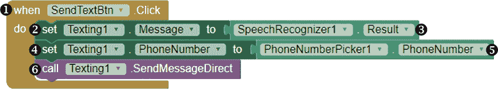

在代码块面板中，点击 SendTextBtn，当该组件的代码块出现时，将 whenSendTextBtn.Click 块 ➊ 拖到查看器中。然后，再次点击 Texting1 组件，拖动 setTexting1.Messageto 块 ➋ 到查看器，并将其嵌套到 whenSendTextBtn.Click 块中的`do`旁边。

然后，在“块”面板中，点击“SpeechRecognizer1”组件，将“SpeechRecognizer1.Result”块 ➌ 拖动到查看器，并将其与“setTexting1.Messageto”块的右侧对齐。

##### 获取器和设置器

要理解我们正在做什么，首先需要理解 App Inventor 的`Texting`组件只有在其`Message`和`PhoneNumber`属性被设置后才能发送短信。这意味着，`Texting1`必须有一个消息可发送（它的`Message`属性），并且必须知道发送到哪里（它的`PhoneNumber`属性）。

我们通过`SpeechRecognizer1.Result`块告诉应用程序设置`Message`属性，这个块被称为*getter 块*，因为它为我们获取一个值；而`setTexting1.Messageto`块被称为*setter 块*，因为它设置一个值。

从技术上讲，当我们像这里一样将块并排连接时，它们会*从右到左执行*——或者说工作。这意味着，在这些块中，应用程序首先获取`SpeechRecognizer1 Result`属性的当前值，也就是通过设备的语音转文本功能从应用程序中获取的文本。然后，应用程序将`Texting1 Message`属性设置为该文本，这样就能让`Texting`组件知道要发送的消息。

**注意**

*与许多其他组件的属性一样，如果对你的应用程序有意义，你可以在设计窗口的“属性”面板中最初设置 Texting 组件的 Message 和 PhoneNumber 属性，或者你也可以通过像我们在这里使用的组件特定的块动态设置或更改它们。例如，如果你希望应用程序每次发送完全相同的消息，那么通过在“属性”面板中输入它来设置 Texting 组件的 Message 属性会更有意义。*

继续编程。在“块”面板中，再次点击“Texting1”组件，将“setTexting1.PhoneNumberto”块 ➍ 拖动到查看器，并将其放在“setTexting1.Messageto”块下方。然后，点击“PhoneNumberPicker1”在“块”面板中，拖动“PhoneNumberPicker1.PhoneNumber”块 ➎ 并将其与“setTexting1.PhoneNumberto”块的右侧对齐。

在这里，当用户点击`SendTextBtn`时，我们让应用程序设置`Texting1`所需的另一个属性——`PhoneNumber`属性——使用 getter 块`PhoneNumberPicker1.PhoneNumber`和 setter 块`setTexting1.PhoneNumberto`。应用程序首先获取`PhoneNumberPicker1 PhoneNumber`属性的当前值，也就是用户在应用程序打开设备联系人列表时选择的电话号码，然后将`Texting1 PhoneNumber`属性设置为该号码。这让`Texting`组件知道要发送短信的电话号码。

最后，再次点击 Blocks 面板中的 Texting1，拖动 callTexting1.SendMessageDirect 积木➏到 Viewer 面板，并将其放在 setTexting1.PhoneNumberto 积木下方。现在，当用户点击`SendTextBtn`时，在应用为`Texting1`设置必要的属性后，这个积木会指示应用直接发送消息。

我们本可以让应用打开默认的短信应用，让用户在发送之前编辑消息，而不是直接发送消息。为了做到这一点，使用 callTexting1.SendMessage 积木替代 callTexting1.SendMessageDirect 积木。

用通俗的语言来说，你的所有积木其实是在说：“当按钮被点击时➊，设置`Texting`组件的文本信息➋为语音识别器转换的文本➌，将`Texting`组件的电话号码➎设置为在联系人中选择的电话号码➎，然后发送消息➏”，就像我们计划的那样。

现在进行已完成应用的实时测试！在你的手机上，点击**1\. 说出信息**，在语音识别器提示时说出一条消息。然后，点击**2\. 选择号码**，从你的联系人列表中选择一个电话号码。最后，点击**3\. 发送信息**，然后检查你的手机是否已发送该短信。只要你在有短信计划的正常手机上进行测试，并且按照代码示例中的方式放置了相应的积木，应用应该能正常工作。

如果应用无法正常工作，你现在需要*调试*，也就是仔细检查代码中的*bug*（错误）并修复它们。重新检查你的积木，确保你将获取器和设置器积木拖放到了正确的位置，进行任何修正后再进行测试。在重新测试之前，为了确保更改生效，重新加载应用，通过更改属性面板中的任何属性，例如点击任何复选框。所有按钮都能正常工作后，你就成功创建了第一个完全功能的应用！

#### 共享“嗨，世界！”

你可以通过电子邮件发送你的应用，让别人安装到他们的手机上。但首先，点击组件面板中的 Screen1，这样你可以确保当你把应用发送给朋友时，它的名称会显示成你希望的样子。在属性面板中，**AppName**下方的文本框中，你会看到应用的名字现在显示为*HiWorld*，这是你在开始项目时输入的名字。若要更改应用的名称，点击文本框内，给*Hi*和*World*之间加个空格，可能还要在*World*后面加个感叹号，然后点击文本框外部。同时，点击**TitleVisible**下方的复选框，去掉勾选，这样应用在手机上运行时屏幕标题*Screen1*就不会显示在应用的顶部了。

现在，在电脑屏幕上打开应用项目，点击顶部菜单栏中的**Build** ▸ **App (保存 .apk 到我的电脑)**，如图 1-20 所示。

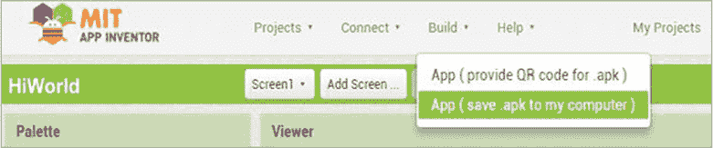

*图 1-20：构建菜单链接创建一个文件，你可以与朋友分享，以便他们可以安装应用。*

你应该能看到一个进度条，显示文件正在保存。当文件保存完成后，你可以在电脑上找到它，并将其作为附件通过电子邮件发送给任何人。当人们在手机上打开邮件时，他们会被提示安装该应用程序。请注意，由于“Hi, World！”是一个非市场应用程序，你的朋友们首先需要确保他们的手机设置允许从“未知来源”安装应用程序。

### 总结

在本章中，你创建了你的第一个应用程序“Hi, World！”，它将语音消息转换为文本消息并发送给选定的联系人！在这个过程中，你探索了应用程序设计流程，包括学习如何将一个大计划分解成更小的步骤，然后按照这些步骤编程实现实际组件。现在，你应该能更舒适地在 App Inventor 设计器窗口和模块编辑器中操作了。

在下一章中，你将学习 App Inventor 如何使用事件驱动编程来设置应用程序行为，并且你将熟悉事件和事件处理程序。我们将通过多个例子来创建“实践成就完美”应用程序，用户可以录制、观看和重新录制自己练习演讲或歌曲的临时视频片段。

### 独立完成

现在你已经创建了“Hi, World！”，在你修改和扩展它时，请保存它的新版本。你可以在* [`nostarch.com/programwithappinventor/`](https://nostarch.com/programwithappinventor/)* 网站上找到解决方案。

1.  修改应用程序，使其提示用户输入电话号码，而不是从联系人列表中选择。你需要从用户界面面板中拖动哪些组件到查看器中，以便让用户手动输入电话号码？现在你将替换`PhoneNumberPicker`组件，你如何向用户提供有关输入电话号码的说明？你会使用哪些模块来提供`Texting1`所需的电话号码？

1.  扩展应用程序，使其适用于 Android 设备，以便在发送完语音信息后，等待收件人回复的短信，并将该信息大声读出给用户听。

1.  修改应用程序，使其发送电子邮件消息，而不是短信。你会使用哪些组件和模块来发送电子邮件消息？
