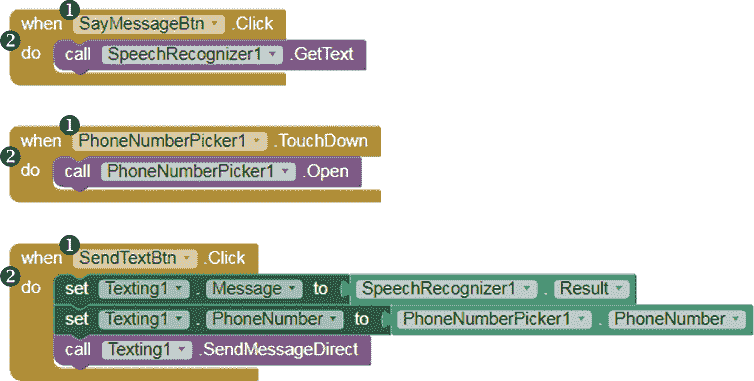
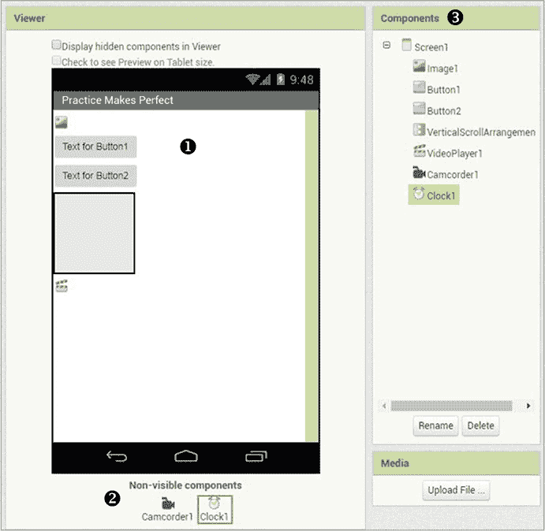
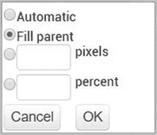
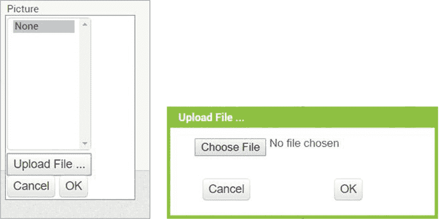
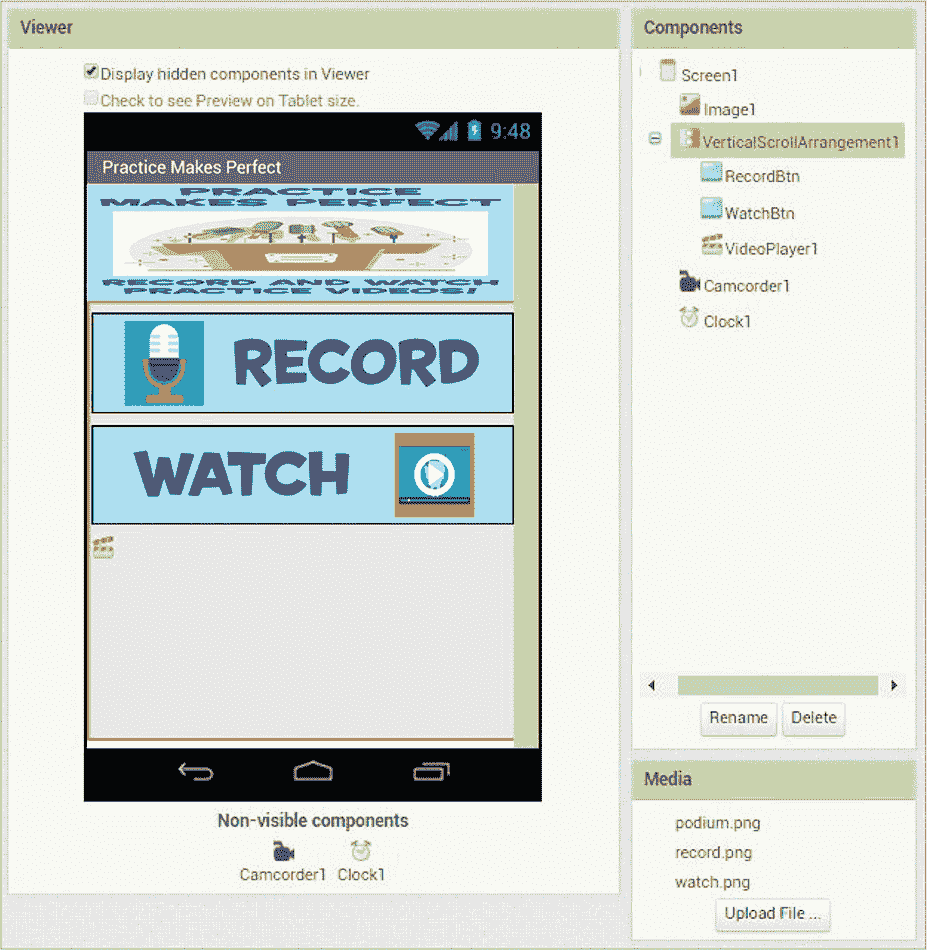
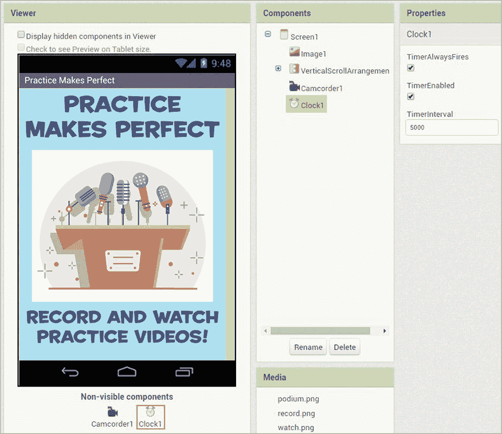
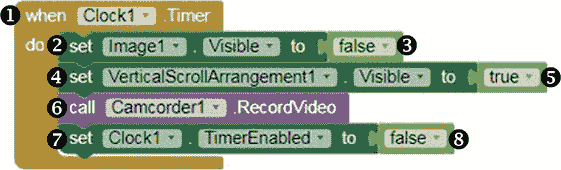
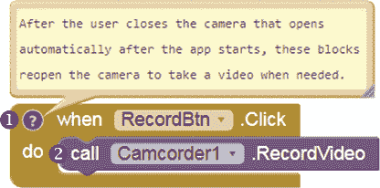
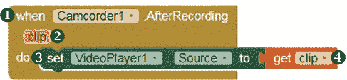

## **2

**APP INVENTOR 与事件驱动编程**

App Inventor 应用使用一种称为*事件驱动编程*的模型，我们编写程序让行为响应特定事件。*事件*可以是用户执行的操作，也可以是设备内或设备发生的事情。

作为 App Inventor 程序员，我们使用名为`when`…`do`的*事件处理器*来告诉应用如何响应事件。对于每个`when`…`do`块，我们可以包括一个或多个命令，当事件发生时，应用按顺序执行这些命令。这些命令包括获取和设置值的代码块，以及`call`代码块来启动内置*方法*或我们自己编写的*过程*，即一系列定义好的任务供应用执行。

事实上，你已经使用事件处理器创建了第一章中的“你好，世界！”应用。让我们回顾一下你为“你好，世界！”使用的所有代码块。

我们可以看到应用的三个事件 ➊，分别是`SayMessageBtn`和`SendTextBtn`的两个按钮*点击*事件，以及`PhoneNumberPicker1`的*触摸按下*事件。你使用了三个`when`…`do`事件处理器 ➋，编程处理这些事件时应用应采取的动作，如调用`SpeechRecognizer`方法从语音中获取文本，调用`PhoneNumberPicker.Open`方法打开电话的联系人列表，并在调用发送短信方法之前设置`Texting`组件所需的属性。

尽管用户在“你好，世界！”中触发了所有事件，但并非总是如此。有些事件是由于设备发生某些情况而引起的。例如，当手机接到电话时，你可以使用事件处理器来处理该事件。你还可以使用事件处理器来响应自动事件或发生在应用屏幕或组件上的事件。例如，你可以添加代码块来编程在应用屏幕首次打开时应发生的动作。

在构建下一个应用时，我们将玩弄几个事件处理器。

### **构建“实践出真知”应用**

在这一章中，你将创建“实践出真知”应用，它使用`Clock`、`Camcorder`和`VideoPlayer`组件，让用户反复录制自己练习演讲或歌曲的视频，然后观看这些视频来回顾自己的表现。为了方便起见，我们将编程让“实践出真知”自动打开设备的视频摄像头，使其准备好立即开始录制。这与许多相机应用不同，因为后者要求用户打开应用、切换到视频模式，然后再开始录制。

我们将为“实践出真知”编写六个事件处理器，一个是在应用打开五秒钟后触发定时器的操作，另一个是在摄像头录制后告诉应用应该做什么，还有四个响应用户点击按钮的事件处理器。

我们开始吧！按照《App Inventor 入门》中的说明，在第 xviii 页登录 App Inventor。App Inventor 应该会打开你上次工作的应用程序。要开始一个新项目，点击**项目** ▸ **新建项目**，打开对话框后输入项目名称，输入 PracticeMakesPerfect（不要有空格），然后点击**确定**。

#### **分解“Practice Makes Perfect”**

“Practice Makes Perfect”应用程序将自动打开设备的视频摄像头录制视频，然后在应用的自带视频播放器中回放视频。之后，应用将允许用户录制和观看任意数量的额外视频。应用在用户首次打开时还会显示一个装饰性临时的或*启动*标题屏幕。

我们可以将这个操作分解成四个步骤：

1.  当用户打开应用程序时，首先显示启动屏幕 5 秒钟，然后再显示录制按钮、观看按钮和视频播放器。打开设备的视频录制器，供用户录制。

1.  当用户点击录制按钮时，打开设备的视频摄像头，供用户录制。

1.  一旦用户录制了一个视频，设置已录制的片段，在下次应用的 VideoPlayer 启动时播放。

1.  当用户点击观看按钮时，在应用的 VideoPlayer 中播放用户的视频片段。

你需要以下组件：

+   按钮（2 个）供用户点击手动启动动作

+   摄像机组件用于打开应用的视频摄像头

+   时钟组件用于在设定的时间间隔后自动启动动作

+   显示临时启动图形的图像组件

+   垂直滚动排列用于容纳应用的`Button`和`VideoPlayer`组件

+   视频播放器组件用于在应用中播放视频片段

#### **在设计器中布局“Practice Makes Perfect”**

我们首先布局所有组件，记住我们希望应用程序从一个独立的启动屏幕开始，然后自动打开视频摄像头录制第一段视频片段。我们还希望组件布局简洁，方便用户使用和理解。

##### **添加组件**

进入设计器窗口，将调色板窗格中列出的组件拖动到查看窗格中。从用户界面抽屉中，拖动一个图像组件和两个按钮组件；从布局抽屉中，拖动一个垂直滚动排列组件；从媒体抽屉中，拖动一个视频播放器和一个摄像机组件；从传感器抽屉中，拖动一个时钟组件。你的屏幕现在应该像图 2-1 一样。

*图 2-1：将“Practice Makes Perfect”应用组件拖入查看窗格后的屏幕*

在查看窗格中，所有可见组件应显示在`Screen1` ➊上，而不可见组件（`Camcorder`和`Clock`）应显示在屏幕下方 ➋。在组件窗格 ➌ 中，你应该看到所有拖入查看窗格的组件列表。

##### **创建启动屏幕**

如前所述，我们将显示一个全屏的介绍性图形，创意地展示应用的名称和目的，但为了不占用过多的屏幕空间，我们只会暂时显示它。我们将使用`Image1`作为启动画面，并且需要调整几个属性，以使其按预期显示。

首先，在组件面板中点击`Image1`，然后通过点击属性面板中**高度**和**宽度**下的文本框，设置其高度和宽度填充屏幕。当你点击每个文本框时，你应该能看到图 2-2 中显示的对话框。

*图 2-2：属性对话框，允许你更改组件的高度或宽度*

点击**填充父元素**单选按钮，然后点击**确定**。这将使`Image1`的高度和宽度在图片上传后占据整个屏幕的高度和宽度。

##### **上传图片**

现在我们需要上传我们想要在应用屏幕上显示的图片，即`Image1`。要上传图片，请点击**图片**下方的文本框，然后点击图 2-3 左侧显示的**上传文件 …**按钮，这将打开右侧显示的对话框。

*图 2-3：图片和上传文件 … 对话框*

点击**选择文件**按钮。文件管理器将打开，显示你计算机上的文件，并允许你找到你想要上传的图片，如图 2-4 所示。

*图 2-4：文件管理器窗口允许你从计算机中选择文件。*

点击你想要使用的图片，点击**打开**按钮，然后在图 2-3 右侧显示的上传文件对话框中点击**确定**。

**注意**

*对于本书中的一些应用，我通过在网上搜索图片、保存它们，然后使用图形编辑器添加文本来创建我们使用的装饰性图片。然而，在保存任何来自网络的图片之前，我确保我拥有使用和修改它们的许可证或权限，并检查许可证是否要求注明出处，这意味着在使用这些图片时，我需要向原作者致谢。如果你使用从网络上找到的图片或其他文件，一定要确保它们被标注为可以按你意图的方式使用，并且如果有要求的话，要给创作者署名。*

现在你应该能在`Screen1`的查看面板中看到图片。它的宽度填充了整个屏幕，正如我们所希望的那样，但高度并没有填满，因为其他可见的组件占据了屏幕的大部分垂直空间。我们稍后会在将这些组件设为不可见时进行调整。

你还会注意到，在属性窗格中，默认情况下，`Image1 Visible`属性下的复选框被选中，这意味着应用程序打开时用户应该能看到`Image1`。但是因为我们只希望`Image1`临时显示，所以接下来我们将编程使得`Image1 Visible`属性的值发生变化，当我们不再需要它显示时，隐藏启动画面。

最后，在`Image1`的属性窗格中，点击**ScalePicturetoFit**下的复选框。现在，这会扭曲`Image1`，使其占据更多屏幕宽度，但稍后，当`Image1`成为屏幕上唯一可见的组件时，你会发现这正是我们想要的效果。

##### **创建录制和观看按钮**

接下来，让我们为两个`Button`组件设置属性。为了避免混淆，让我们为每个`Button`取一个能描述其功能的名字，正如我们在第一章中所做的那样。

在组件窗格中点击 Button1，然后点击窗格底部附近的**重命名**按钮。在**新名称：**文本框中将`Button1`替换为`RecordBtn`，然后点击**确定**。现在你应该能在设计器窗口中的组件和属性窗格中看到`RecordBtn`。按照相同的步骤将`Button2`的名称改为`WatchBtn`。

##### **使用图片作为按钮**

我们还将改变按钮的外观。为此，我们将使用带有文本和图标的图片，而不是默认的 App Inventor 按钮。点击每个按钮属性窗格中**图片**下的文本框，然后按照第 27 页中“上传图片”部分的步骤上传你想要使用的图片。

上传按钮图片后，记得删除按钮上显示的默认文本。操作方法是，点击每个按钮属性窗格中**文本**下的文本框，删除现有文本，然后将光标移出文本框。

最后，让我们通过点击每个组件属性窗格中**宽度**下的文本框，将每个`Button`组件和`VideoPlayer`的宽度设置为屏幕宽度，点击**填充父项**单选按钮，然后点击**确定**。

##### **垂直分组组件**

如前所述，本应用的第一步要求在应用启动后，`Button`组件和`VideoPlayer`在 5 秒钟内保持不可见。我们可以通过使用布局抽屉中的`VerticalScrollArrangement`组件来实现这一点。布局组件不仅可以使其他组件统一对齐，还可以将组件组合在一起，从而将它们作为一个组进行编程。

在本应用中，我们将所有需要在应用打开时临时隐藏的组件——`RecordBtn`、`WatchBtn`和`VideoPlayer1`——放入一个`VerticalScrollArrangement`中。我们特别使用`VerticalScrollArrangement`是因为我们希望将组件垂直堆叠，并且希望允许用户在需要时滚动查看`VideoPlayer1`中的视频。

要按顺序将`RecordBtn`、`WatchBtn`和`VideoPlayer1`分组到`VerticalScrollArrangement1`中，请在查看器面板中点击每个组件，然后将其拖入**VerticalScrollArrangement1**。你应该能在查看器和组件面板中看到这些组件*嵌套在*`VerticalScrollArrangement1`内，正如图 2-5 所示。

*图 2-5：将`RecordBtn`、`WatchBtn`和`VideoPlayer1`拖入`VerticalScrollArrangement1`后的设计器窗口*

现在让我们改变`VerticalScrollArrangement1`的`Visible`属性。在组件面板中点击该组件，然后在属性面板中点击**Visible**下的复选框，去掉勾选。这应该会使得`VerticalScrollArrangement1`及其所有内容在查看器中变得不可见，无论是在现在还是应用启动时。当我们编程时，我们会在应用运行时调整这个设置，以便在应用启动后 5 秒显示这些组件。同时，你会看到，因为`VerticalScrollArrangement1`是不可见的，`Image1`现在会按预期填充整个屏幕。

我们需要调整的最后一个组件是`Clock`。在组件面板中点击`Clock`组件，改变它的`TimerInterval`属性，如图 2-6 所示。

*图 2-6：你布局完“熟能生巧”后，设计器窗口，显示调整后的`Clock1`属性面板*

要进行更改，点击**TimerInterval**下的文本框，将默认值 1000 替换为 5000，然后将光标点击到文本框外。这将把`Clock`组件的计时器间隔设置为 5000 毫秒，即 5 秒。这意味着，只要`Clock`组件的计时器被启用并设置为*触发*，如图 2-6 所示，它将每 5 秒自动执行我们编程的操作。但对于你的应用，你需要在应用运行时调整`Clock1`的属性，使计时器仅触发一次，以便在 5 秒后让`Image1`消失，同时显示`Button`、`VideoPlayer`和`Camcorder`组件，而不是每 5 秒触发一次，持续不断地执行。

### **在块编辑器中编程“熟能生巧”**

现在你已经布局了所有组件，可以进入块编辑器来编程应用。点击**块**按钮切换到块编辑器，我们开始按顺序编程四个步骤。

#### **第一步：启动应用**

我们首先告诉应用在打开时做什么，当启动画面`Image1`显示时。我们希望它等待 5 秒钟后隐藏`Image1`，然后在应用剩余的时间内显示`Button`和`VideoPlayer`组件，并打开`Camcorder`。

这段代码展示了如何使用`Clock`组件的*计时器*事件处理器设置这个第一步。

在“Blocks”面板中，点击 Clock1，当组件的代码块出现时，将`whenClock1.Timer`事件处理块➊拖动到 Viewer 中。接着，在“Blocks”面板中，点击 Image1，拖动`setImage1.Visibleto`块➋到 Viewer 中，并将其紧挨着`do`字样放入`whenClock1.Timer`块内。然后，返回“Blocks”面板，点击**逻辑**块抽屉，拖动`false`块➌到 Viewer 中，并将其拖到`setImage1.Visibleto`块的右侧。这些代码块在`Clock`组件的定时器触发后将`Image1 Visible`属性的值设置为`false`，从而在我们在设计器中为`Clock`设置的 5 秒时间间隔后隐藏`Image1`的启动画面。

**注意**

*在逻辑块抽屉中，App Inventor 提供了两个布尔值块，一个值为 true，另一个值为 false。布尔变量和属性——如大多数可见组件的 Visible 属性以及 Clock 组件的 TimerEnabled 属性——只有两个可能的值，true 和 false。你可以通过选中或取消选中属性的复选框，在属性面板中设置这些属性的初始值，并且在应用运行时可以通过代码块改变这些值。*

现在我们已经编程使启动画面在 5 秒后消失，接下来我们需要使按钮和视频播放器可见。为此，点击 VerticalScrollArrangement1，将`setVerticalScrollArrangement1.Visibleto`块➍拖动到 Viewer 中，并将其放入`whenClock1.Timer`块内，位置在`setImage1.Visibleto`块下方。然后，在“Blocks”面板中，点击**逻辑**块抽屉，拖动`true`块➎到 Viewer 中，并将其放到`setVerticalScrollArrangement1.Visibleto`块的右侧。这些代码块在`Clock`组件的定时器触发后将`VerticalScrollArrangement1 Visible`属性的值设置为`true`，从而在我们为`Clock`设置的 5 秒时间间隔后，使得`VerticalScrollArrangement1`及其内部所有内容可见。

接下来，在“Blocks”面板中，点击 Camcorder1，将`callCamcorder1.RecordVideo`块➏拖动到 Viewer 中，并将其放入`whenClock1.Timer`块内，位置在`setVerticalScrollArrangement1.Visibleto`块下方。这些代码块调用`Camcorder`组件的内置`RecordVideo`方法，在`Clock`的 5 秒时间间隔后自动打开用户的视频摄像头。

最后，点击`Clock1`，向下滚动找到`setClock1.TimerEnabledto`代码块 ➐，将其拖到“Viewer”中，并将其放入`whenClock1.Timer`代码块下的`callCamcorder1.RecordVideo`代码块内。然后，在“Blocks”面板中，点击**Logic**代码块抽屉，拖动`false`代码块 ➑ 到“Viewer”中，并将其放入`setClock1.TimerEnabledto`代码块的右侧。这些代码块将`Clock1`的`TimerEnabled`属性值设置为`false`，从而停止`Clock1`计时器。这意味着计时器将在应用程序打开后的前 5 秒钟内触发一次，并执行事件处理程序中的命令，在应用程序重新打开之前不会再次触发。

简单来说，步骤 1 是设置 Designer 属性，在应用程序打开时显示启动画面（`Image1`）。然后，5 秒后，代码块会告诉应用程序隐藏图片，显示按钮和视频播放器，并打开视频录制器以录制视频。

现在进行实时测试，查看这些代码块如何工作，最好使用你的手机并通过 MIT AI2 Companion 应用程序进行测试，详细步骤请参考“实时测试你的应用程序”部分，在第 xxii 页。

一旦你点击顶部菜单栏中的**Connect** ▸ **AI Companion**并用手机的 Companion 应用程序扫描二维码，你的“Practice Makes Perfect”应用程序应该会在手机上打开。只要你的代码块与示例代码相符，你应该会看到`Image1`显示 5 秒钟，随后按钮和视频播放器出现，视频摄像头打开。你应该在关闭视频摄像头之前看不到按钮和视频播放器。如果你在没有录制的情况下关闭了视频摄像头，你可能会看到一个错误提示，告诉你没有录制视频，这也是正常的。保持应用程序在手机上打开，这样你可以继续进行实时测试。

#### **步骤 2：打开视频录制器**

到目前为止，我们已经编写了应用程序在用户首次打开时应执行的操作。现在让我们编写应用程序的步骤 2，允许用户在需要时手动打开视频摄像头以录制视频。

这里我们需要告诉应用程序，当用户点击`RecordBtn`时应该做什么，`RecordBtn`是用户重新打开视频摄像头的方式。当点击`RecordBtn`时，我们希望应用程序打开设备的视频摄像头，以便用户能够进行录制。

在“Blocks”面板中，点击`RecordBtn`，当组件的代码块出现时，将`whenRecordBtn.Click`代码块 ➊ 拖到“Viewer”中。然后，在“Blocks”面板中，点击`Camcorder1`，将另一个`callCamcorder1.RecordVideo`代码块 ➋ 拖到“Viewer”中，并将其放入`whenRecordBtn.Click`代码块的`do`一侧。这些代码块调用`Camcorder`组件内置的`RecordVideo`方法，当点击`RecordBtn`时，它会打开手机的视频摄像头，正如我们所计划的那样。

**注意**

*在两个不同的事件处理程序中看到 RecordVideo 方法的调用，可能会让其他看到这些块的程序员感到困惑。为了说明为什么你在两个地方调用这个方法，你可以通过右键点击第二个 when...do 块，选择***添加评论***，点击出现的蓝色问号图标，并在弹出的文本框中输入你的解释。读者可以通过点击问号图标来打开或关闭你的评论。程序员通常会对代码进行注释，以便为自己添加提醒或为其他程序员提供解释。*

现在进行实时测试，查看这些块是如何工作的。当你点击**Record**时，你手机的摄像头将开启，然后你可以点击摄像头的录制按钮录制视频。但现在不要录制！首先，我们需要告诉应用程序在摄像头录制后应该做什么。如果你在没有录制视频的情况下关闭摄像头，你可能会看到错误提示，说你没有录制视频，暂时这样是可以的。

#### **第 3 步：选择要播放的视频片段**

让我们编写应用程序的第 3 步，使其在用户录制视频后，知道该如何处理录制内容。我们希望应用程序将视频的*路径*或存储位置设置为`VideoPlayer`组件的源，这样就能确保录制的视频接下来会在视频播放器中播放。以下是处理此*录制后*事件的块。

在“Blocks”面板中，点击 Camcorder1，当该组件的块出现时，将 whenCamcorder1.AfterRecording 块 ➊ 拖动到“Viewer”中。然后，在“Blocks”面板中，点击 VideoPlayer1 组件，将 setVideoPlayer1.Sourceto 块 ➌ 拖动到“Viewer”中，并将其连接到 whenCamcorder1.AfterRecording 块中的`do`单词旁边。

`clip` ➋ 在`whenCamcorder1.AfterRecording`块上是一个*事件参数*，它是一个容器，用来存放事件的*参数*或提供的相关信息。这些信息只能在提供该信息的事件处理程序中使用。`clip`参数存储了在应用程序的第一或第二部分中，`Camcorder1`录制的视频片段的路径，视频播放器在设置其*源*（即播放文件的路径）之前，无法播放该视频。

要设置源，鼠标悬停在 clip 参数上，直到你看到`get clip`块 ➍。将 get clip 块拖动到“Viewer”中，并将其连接到 setVideoPlayer1.Sourceto 块的右侧。这些块设置了最后录制的视频片段的路径作为`VideoPlayer1`的源。

#### **第 4 步：播放视频片段**

最后，让我们编写应用程序的第 4 步，告诉它当用户点击`WatchBtn`时应该做什么。当用户点击此按钮时，我们希望应用程序的视频播放器开始播放用户录制的视频。下面是编写此事件处理程序的代码。

在“块”面板中，点击 WatchBtn，当组件的块出现时，将 whenWatchBtn.Click 块 ➊ 拖动到“查看器”中。然后，在“块”面板中，点击 VideoPlayer1，将 callVideoPlayer1.Start 块 ➋ 拖动到屏幕上，并将其插入到 whenWatchBtn.Click 块中，放在单词 `do` 的旁边。这些块指示应用在点击观看按钮时，调用内置的 `Start` 方法来启动 `VideoPlayer1` 播放视频，按照计划进行。

现在进行实时测试你的完成应用！在手机上打开应用，你应该看到启动画面显示 5 秒钟，然后是录制和观看按钮，接着是 `VideoPlayer1` 出现，同时你的手机视频摄像头打开。录制视频后，点击 **观看** 以在应用集成的视频播放器中查看视频。如果你按照代码示例放置块，你应该能够反复录制和观看视频，并且成功创建了“练习使完美”应用！

### **总结**

在本章中，你构建了“练习使完美”应用，用户可以录制、观看并重新录制临时的视频片段，内容是他们自己练习演讲或歌曲的录像。在这个过程中，你学习了 App Inventor 如何通过事件驱动编程来设置应用行为，并且熟悉了不同类型的事件和事件处理程序。你还了解了 App Inventor 的布尔值块和事件参数，并使用它们设置了应用中的值。

在下一章中，你将学习如何动画化图像；使用随机数；以及使用 App Inventor 的动画、数学和变量块来创建、设置和更改 *变量* 的值。我们将使用这些工具来创建一个嘈杂的、动画化的“水果猎物”游戏应用，玩家通过捕捉下落的水果来获得积分。

### **独立完成**

在你修改和扩展“练习使完美”应用时，保存新的版本，并进行这些练习。你可以在网上找到解决方案，链接是 *[`nostarch.com/programwithappinventor/`](https://nostarch.com/programwithappinventor/)*。

1.  扩展应用，使用户能够录制、观看并并排比较两个练习视频片段。你需要拖动哪些布局和其他组件到“查看器”中才能实现这一功能？你的块将如何改变？

1.  修改应用，使其录制并播放音频片段而不是视频。你会使用哪些组件和块来录制和播放音频？
