## **3**

FRUIT LOOT: 创建一个简单的动画游戏**

在这一章中，你将创建一个简单的游戏，叫做“水果大盗”，它使用来自绘图与动画、传感器和媒体模块的组件，让玩家捕捉掉落的水果。

你将使用 App Inventor 内置的数学和变量模块，以及特定组件的模块来编程这些组件，使得游戏能够使用*动画*或运动，并配有相应的音效；具有不可预测性以增加游戏的挑战性；并且能够记录分数，玩家可以查看自己的表现。

首先，让我们探索你将在创建游戏时使用的关键组件和基础编程概念。

### **动画与随机移动**

在游戏中，玩家需要将水果采摘器角色在屏幕上左右移动，试图捕捉掉落的水果。水果片会以随机速度从屏幕顶部的随机位置不断掉落。由于这种随机动画，玩家无法准确知道该移动采摘器到哪里才能捕捉到水果。这种不可预测性将挑战玩家并保持他们的参与感。

#### **编程移动图像**

我们将使用来自绘图与动画模块的 `Canvas` 和 `ImageSprite` 组件来创建可移动的游戏角色和不断掉落的水果。`Canvas` 组件是我们放置在应用屏幕上的一层或纸张，用户可以在上面绘图。`Canvas` 也是*精灵*（即平面图像）可以移动的地方。游戏角色和不同的水果片都是 `ImageSprite`，我们将它们放置在 `Canvas` 上使其移动、与其他精灵碰撞并从屏幕边缘反弹。

`Canvas` 的高度和宽度以 *像素* 为单位进行测量，像素是计算机图形学中常用的测量单位，App Inventor 使用一个常见的计算机屏幕坐标系统来确定 `ImageSprite` 在 `Canvas` 上的确切位置。在该坐标系统中，`ImageSprite` 的左上角位于由其 x 和 y 坐标或属性（`X`，`Y`）表示的点上。`X` 属性表示图像距离 `Canvas` 左边缘的像素距离，`Y` 属性表示图像距离 `Canvas` 上边缘的像素距离。

**注意**

*在数学课上，你可能会在包含四个象限的坐标平面上绘制点。App Inventor 的坐标系统就像该坐标平面中的右下象限，原点 (0, 0) 位于左上角，x 坐标从左到右增大，而 y 坐标则从上到下增大。不同之处在于，在数学平面中，y 坐标值是负数，而在 App Inventor 中是正数。*

如 图 3-1 所示，在 App Inventor 的坐标系统中，`ImageSprite` 的 `X` 属性值随着图形向右移动而增大，`Y` 属性值则随着图形向下移动而增大。

当将`ImageSprite`添加到`画布`时，我们将其初始的`X`和`Y`属性值设置为放置它的位置，或者设置为我们在设计窗口的属性面板中输入的其他值。要移动`ImageSprite`，我们可以使用程序模块来改变任一属性值。

对于这个游戏，你将编程按钮点击事件处理程序，让玩家移动水果采摘器。而且，为了不断地动画化水果，你还需要编程`时钟`，让水果在你设定的时间间隔内自动移动。JavaScript 和其他编程语言处理动画的方式相同，都是通过让图像在响应用户或自动化动作时改变位置。

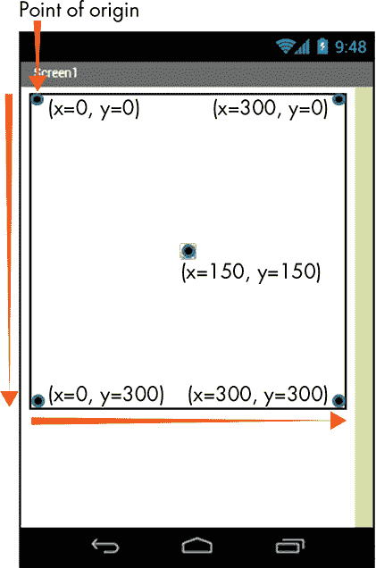

*图 3-1：带有 300×300 像素`画布`的查看器屏幕，显示原点以及不同点的 X 和 Y 属性值*

#### **设置随机出现、速度和位置**

像其他依赖运气的游戏一样，这个游戏依赖于随机性，防止玩家精确计算出如何、何时或在哪里进行下一步操作。由于游戏和其他应用程序（如模拟）中对随机性的需求，大多数传统编程语言都包括*伪随机数生成器*，这是一种基于数学算法的函数。

在其内置的数学模块中，App Inventor 提供了两个伪随机数生成器。这些模块还包括*算术运算符*，对*操作数*或值执行乘法、除法、加法和减法功能，就像其他编程语言中的类似运算符一样。在你的游戏中，你将把 App Inventor 的一个伪随机数生成器（称为*随机整数模块*）与算术运算符模块结合使用，开发简单的公式，以确保每个下落的水果的出现、速度和位置都是随机确定的。

借助这些公式，虽然我们的玩家很快就会发现水果会不断掉落，但他们不会知道水果会掉在哪里以及以什么速度掉落，从而避免了他们轻松得分。

### **声明并初始化变量**

随着玩家得分，我们需要一种方式来让他们知道自己的分数。我们将通过声明并初始化几个*变量*来做到这一点——变量是程序员创建的具有唯一名称的内存容器，用来存储可以变化的值。变量允许我们存储必要的信息，并在应用程序条件变化时随时更新这些信息。我们可以使用唯一的变量名称来在代码中引用这些变化的信息，并在应用程序运行时对信息执行操作，无论该变量在任何时刻持有什么值。

例如，在你的游戏中，你将把分数存储在一个变量中，并在游戏过程中计算并显示变化的分数。为了计算分数，你会使用一个数学加法运算符模块来*增加*分数，或者每当玩家得分时，将分数增加一个固定数值——在这种情况下是 1。

在传统的编程语言中，你必须遵循特定的语法规则来*声明*或创建变量，并*初始化*它，或者赋予它第一个值。在某些语言中，你还需要在创建变量时确定它将存储的数据类型。在 App Inventor 中，你必须使用内置的变量积木来声明和初始化变量，并且可以通过拖入文本、数学、逻辑和列表抽屉中的积木来存储*字符串*（由字母、数字和其他字符组成的字符集）、单个数字、布尔值和列表。

在使用变量时，你会发现它们和组件属性很相似，因为变量和属性都存储数据，这些数据可以被设置、重置，并且可以通过应用程序中的积木进行访问。事实上，一旦你创建了一个变量，App Inventor 就会为其创建 getter 和 setter 积木，类似于属性的积木，并将它们添加到变量积木抽屉中。

在你的游戏中，你将创建具有*全局作用域*的变量，这意味着你可以在所有的事件处理程序中使用它们。在后续的章节中，你将实验使用*局部*变量，这些变量只在某个事件处理程序或过程内创建并使用。所有编程语言都使用全局和局部变量。

### **构建“FRUIT LOOT”应用**

现在，你已经了解了如何在 App Inventor 中创建变量、编程动画和随机性，你已准备好创建“Fruit Loot”。

要开始，请按照第 xviii 页中《App Inventor 入门》一章的说明登录 App Inventor。在项目名称对话框中，输入没有空格的“FruitLoot”，然后点击**确定**。

### **分解“FRUIT LOOT”**

在“Fruit Loot”中，玩家控制一个水果挑选器在屏幕上左右移动，快速随机地捕捉掉落的水果。每捕捉到一个水果，玩家就能获得一点分数，并在屏幕上看到得分。我们可以将游戏活动分解成五个步骤：

1.  当玩家按下开始按钮时，开始游戏。

1.  当`Clock`定时器触发时，从画布顶部以不同的速度掉落水果。

1.  当水果碰到画布底部时，将其返回到画布顶部的随机位置，并随机显示另一个水果。增加掉落的水果总数。

1.  当玩家点击左侧和右侧按钮时，左右移动挑选器来捕捉掉落的水果。

1.  当挑选器捕捉到水果时，播放声音、增加玩家的分数、显示得分并隐藏水果。

你将需要以下组件：

+   使用 Button (3) 让玩家点击手动开始游戏并进行游戏

+   使用 Canvas 启用 `ImageSprites` 和游戏动画

+   定时器在玩家点击开始按钮后触发，并在设定的时间间隔内移动`ImageSprites`

+   使用 HorizontalArrangement (2) 来放置开始按钮、得分标签和游戏按钮

+   使用 ImageSprite (4) 来显示移动的图像

+   标签显示`Variable`值

+   播放游戏音效

+   变量（2）用于存储游戏数据

### **在设计器中布局“水果抢夺”**

现在让我们在设计器中布局应用。首先，改变屏幕的水平对齐方式，使我们放置的所有内容居中。点击组件面板中的 Screen1，点击属性面板中的 AlignHorizontal 下拉箭头，选择**Center: 3**。

接下来，让我们通过点击属性面板中 BackgroundImage 下的文本框为屏幕添加背景图像。按照《上传图片》一节中的说明，在第 27 页上传*fence-tree.png*，该图片附带本书的资源。你可以从*[`nostarch.com/programwithappinventor/`](https://nostarch.com/programwithappinventor/)*下载这些资源。

现在让我们更改屏幕的*方向*，这通常指的是屏幕是垂直显示（*纵向*模式）还是水平显示（*横向*模式）。默认情况下，`ScreenOrientation`设置为`Unspecified`，这意味着屏幕的方向会根据用户旋转设备的方式而改变。

为了给我们的选择器`ImageSprite`提供更宽的屏幕区域来移动并捕捉水果，我们将屏幕方向改为横向模式，以确保无论设备如何持握，屏幕都横向显示。点击 ScreenOrientation 下方的下拉箭头，选择**Landscape**。同时，取消选中 ShowStatusBar 和 TitleVisible 下的复选框，以避免在游戏显示时设备的状态栏和屏幕标题占用空间。

#### **添加和排列用户界面组件**

由于在横向模式下我们有有限的垂直屏幕空间，我们需要尽可能少地占用这些空间来放置用户界面组件。但我们仍然需要确保这些组件对玩家来说容易看见和使用。为此，我们将`Button`和`Label`分别放置在两个`HorizontalArrangement`中，一个放在屏幕顶部，另一个放在屏幕底部。

从布局抽屉中拖动两个 HorizontalArrangement 到查看器中。然后，点击每一个组件，在组件面板中重命名第一个为 TopArrangement，第二个为 BottomArrangement。接着，在属性面板中，通过点击 AlignHorizontal 下拉箭头并选择**Center: 3**，将它们的水平对齐方式都设为居中，这样我们放置的所有组件都将居中。接下来，将 BottomArrangement 的宽度设为**填充父容器**，就像你在第一章和第二章中对组件所做的那样，这样它就会拉伸填满整个屏幕。

现在，从用户界面抽屉中拖动一个按钮和一个标签到“TopArrangement”中。然后，在“组件”面板中点击 Button1 并将其重命名为 StartBtn，在“属性”面板中通过点击“FontSize”下的文本框，删除当前数字并输入 18，将其文本大小更改为 18 点。同时，通过点击“**Text**”下的文本框，删除当前文本并输入“Start the Fruit Loot Game”来更改`StartBtn`上显示的默认文本。接着，在“组件”面板中点击 Label1，在“属性”面板中，通过点击“**Text**”下的文本框并删除当前文本，将`Label`的默认文本移除，这样直到游戏开始时就不会显示任何文本。然后，通过点击“TextAlignment”下拉箭头并选择**Center: 1**来居中文本。

接下来，从用户界面抽屉中拖动剩余的两个按钮到`BottomArrangement`中，点击组件面板中的每个按钮，将左侧的按钮重命名为 LeftBtn，右侧的按钮重命名为 RightBtn。还需要将每个`Button`的宽度设置为**Fill parent**，这会让每个按钮占据`BottomArrangement`的一半宽度。现在，将`LeftBtn`上显示的文本更改为<<<< Left，将`RightBtn`上显示的文本更改为 Right >>>>。

最后，通过点击“BackgroundColor”下的框并在颜色列表对话框中选择橙色，将所有三个`Button`和`Label`的背景颜色设置为橙色。同时，通过点击“FontBold”下的复选框，将显示在`Button`和`Label`上的文字设置为粗体。接着，通过点击“FontSize”下的文本框并输入 10，更新除`StartBtn`外所有按钮的字体大小，将现有数字替换为 10。最后，对于“BottomArrangement”，取消选中**Visible**下的复选框，这样`LeftBtn`和`RightBtn`在应用打开时就不会显示。

#### **设置 Canvas 和 ImageSprite**

现在，点击**Drawing and Animation**抽屉并将一个 Canvas 拖到`TopArrangement`和`BottomArrangement`之间的查看器中。记住，在添加任何其他绘图和动画组件之前，必须先在屏幕上放置一个`Canvas`。在“属性”面板中，通过点击“BackgroundColor”下的框并在颜色列表对话框中选择**None**，将`Canvas`设置为透明，这样它就不会遮挡背景图像。然后将其高度和宽度设置为**Fill parent**。

现在，从“绘图和动画”抽屉中拖动四个`ImageSprite`到`Canvas`上，点击“组件”面板中的`ImageSprite`，将前三个重命名为 FruitSprite1、FruitSprite2 和 FruitSprite3，最后一个重命名为 PickerSprite。接着，在“属性”面板的**Picture**下，对于水果`ImageSprite`，上传*1.png*、*2.png*和*3.png*，对于挑选器`ImageSprite`，上传*picker.png*。（这些图片都来自本书的资源包。）

最后，你可以拖动 `ImageSprite` 到画布（Canvas）上，或者在其 `X` 和 `Y` 属性的文本框中输入数字，以便将它们放置在游戏开始时应显示的位置。我们希望果实 `ImageSprite` 均匀地分布在画布的顶部，`PickerSprite` 放置在底部的中心位置。为了在大约 450 像素宽的屏幕上将组件放置成这种方式，请在 表 3-1 中输入的数字填入每个 `ImageSprite` 的 X 和 Y 属性文本框中。

**表 3-1：** 450 像素宽屏幕上“Fruit Loot” `ImageSprite` 的初始 `X` 和 `Y` 属性值

| **ImageSprite** | **X 属性** | **Y 属性** |
| --- | --- | --- |
| `FruitSprite1` | 10 | 0 |
| `FruitSprite2` | 230 | 0 |
| `FruitSprite3` | 440 | 0 |
| `PickerSprite` | 180 | 150 |

现在，你准备好添加和调整非可见组件了。

#### **添加和准备非可见组件**

从媒体抽屉中拖入一个声音组件，从传感器抽屉中拖入一个时钟组件。在组件面板中点击声音组件，然后在属性面板中，通过点击 **Source** 下的文本框，上传与书本资源一同提供的 *clunk.mp3* 文件，设置它播放的媒体剪辑。

然后点击时钟（Clock），将其默认的 `TimerInterval` 属性替换为 150，并取消选中 TimerEnabled 下的复选框，以便定时器在应用程序打开时不会启动。稍后，我们将编写代码块，在玩家点击 `StartBtn` 后启用定时器。

到目前为止，你的屏幕应该像 图 3-2 那样显示。

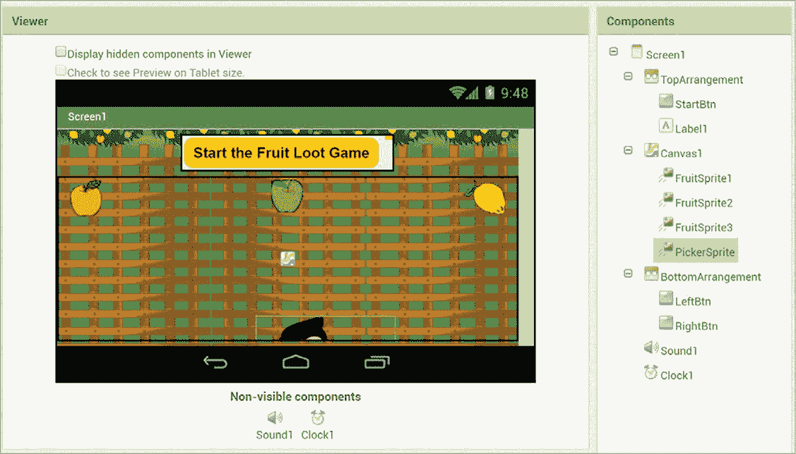

*图 3-2：我们布局“Fruit Loot”后的查看器和组件面板*

一旦你的屏幕看起来正常，点击组件面板中的画布（Canvas），然后取消选中 **Visible** 下的复选框。这样，应用程序打开时，`ImageSprite` 将不会显示。接下来，我们将编写代码块，使得玩家点击 `StartBtn` 后，`LeftBtn` 和 `RightBtn` 这两个组件变得可见。

### **在代码块编辑器中编程“Fruit Loot”**

现在你已经布局好了所有组件，可以转到代码块编辑器编程应用程序了。对于“Fruit Loot”，我们将编写 10 个事件处理程序。三个处理由用户点击按钮产生的事件。一个在定时器按照我们设定的时间间隔触发后，控制应用程序的行为。其余的则响应 `ImageSprite` 到达画布边缘或相互碰撞的事件。

你会注意到，大多数事件处理程序都包含重复的代码。我们之所以这样编程，是因为你还没有学习到能够消除重复的高级编程结构。当你在后续章节中学习这些结构时，我们可以重新审视“Fruit Loot”代码并进行 *重构*，即重新组织并改进它。

点击**Blocks**按钮切换到块编辑器，然后按照顺序开始编写“Fruit Loot”的五个步骤。

#### **步骤 1：开始游戏**

我们首先告诉应用程序当玩家点击`StartBtn`时要做什么。这时我们希望`StartBtn`消失，包含`ImageSprite`的`Canvas`以及包含`Button`的`BottomArrangement`出现，并且`Clock`的计时器开始触发。

这是按钮点击事件处理程序及其四个设置块，它们在步骤 1 中执行我们需要的操作。

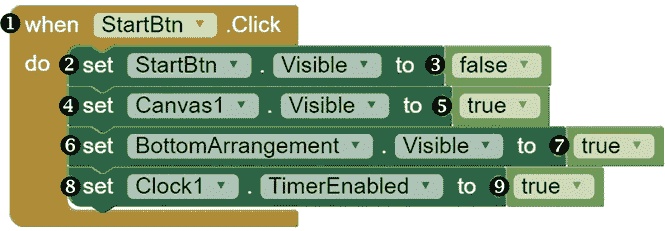

在块面板中，点击 StartBtn，当该组件的块出现时，将 whenStartBtn.Click 事件处理程序块➊拖到查看器中。然后，在块面板中再次点击 StartBtn，将其 setStartBtn.Visibleto 块➋拖到`whenStartBtn.Click`块中的`do`一词旁边。接下来，在块面板中点击**Logic**块抽屉，将 false 块➌拖到查看器中，并将其放在 setStartBtn.Visibleto 块的右侧。这些块将`StartBtn`的`Visible`属性设置为`false`，使得在玩家点击开始按钮后它消失。

接下来，点击 Canvas1，将 setCanvas1.Visibleto 块➍拖到查看器中，并将其放入`setStartBtn.Visibleto`块下的 whenStartBtn.Click 块内。然后，在块面板中再次点击**Logic**块抽屉，将 true 块➎拖到查看器中，并将其放在 setCanvas1.Visibleto 块的右侧。这些块将`Canvas1`及其内容的`Visible`属性设置为`true`，以便在玩家点击开始按钮后，`ImageSprite`会出现。

然后，在块面板中点击 BottomArrangement，将 setBottomArrangement.Visibleto 块➏拖到查看器中，并将其放入`whenStartBtn.Click`块下的`setCanvas1.Visibleto`块内。然后再次点击**Logic**块抽屉，将另一个 true 块➐拖到查看器中，并将其放在 setBottomArrangement.Visibleto 块的右侧。这些块将`BottomArrangement`的`Visible`属性设置为`true`，使得其中的按钮在玩家点击开始按钮后显示出来。

最后，点击 Clock1，将 setClock1.TimerEnabledto 块➑拖到查看器中，并将其放入`whenStartBtn.Click`块下的`setBottomArrangement.Visibleto`块内。然后，在块面板中，从**Logic**块抽屉中再拖动一个 true 块➒，将其放在 setClock1.TimerEnabledto 块的右侧。这些块将`Clock1`的`TimerEnabled`属性的值设置为`true`。这将启动`Clock1`的计时器，在游戏进行时，`ImageSprite`的水果会沿着`Canvas`移动。

一起使用的第 1 步模块启动游戏。总的来说，当玩家点击开始按钮时，这些模块将`StartBtn`的`Visible`属性设置为`false`，将包含`ImageSprite`的`Canvas`和包含播放按钮的`HorizontalArrangement`的`Visible`属性设置为`true`，并将`Clock`的`TimerEnabled`属性设置为`true`。

要查看这些模块如何工作，请按照“实时测试您的应用程序”中第 xxii 页的说明，使用设备进行实时测试。一旦你点击顶部菜单栏中的**连接** ▸ **AI 伴侣**并用设备的伴侣应用扫描二维码，你的“水果战利品”游戏应该会在设备上打开。只要你的模块按代码示例中的方式放置，你应该能看到开始按钮，直到你点击它，按钮会消失，其他游戏组件随之出现。现在，暂时不应该有其他事情发生。保持游戏在你的设备上打开，以继续实时测试。

#### **第 2 步：让水果随机掉落**

现在让我们编程应用程序的第 2 步，并告诉它每次`Clock`计时器触发时应该做什么。这是我们希望水果以不同速度每 150 毫秒掉落一次——这是我们在设计器的属性面板中设置的`TimerInterval`。

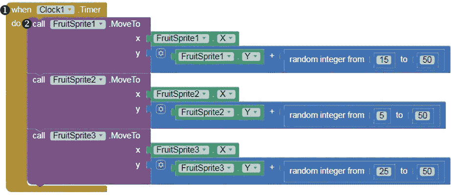

在模块面板中，点击 Clock1，当该组件的模块出现时，拖动 whenClock1.Timer 块 ➊到查看器中。然后，在模块面板中，点击 FruitSprite1，拖动调用 FruitSprite1.MoveTo 方法块 ➋到查看器中，并将其固定在 whenClock1.Timer 块的`do`旁边。

**注意**

*在设计器中的组件面板和模块编辑器中的模块面板中，如果你没有看到你嵌套在父组件中的组件——例如，放置在画布上的 ImageSprite 或拖动到水平排列中的按钮——你可以通过点击父组件左侧的加号来找到它。*

##### **为 FruitSprite1 设置 X 和 Y 值**

让我们更仔细地看看我们放置在`Clock1 Timer`事件处理程序中的`callFruitSprite1.MoveTo`方法块。

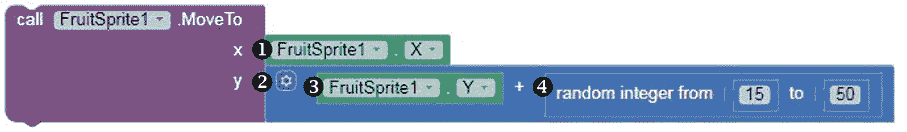

你会注意到，块要求我们为它的`x`和`y`*方法参数*插入值，这些是方法操作所必需的信息。这意味着，`ImageSprite`的`MoveTo`方法在我们提供*参数*或值，指定我们希望`ImageSprite`移动到的坐标点的 x 和 y 坐标之前，不能移动`FruitSprite1`。

对于我们的“水果战利品”游戏，我们希望水果`ImageSprite`只向下移动，这意味着我们将改变它们的 y 坐标，但不改变它们的 x 坐标。为了保持相同的`X`值，点击 FruitSprite1，拖动它的 FruitSprite1.X 获取块 ➊到查看器中，并将其固定到方法块的 x 插槽中。这告诉应用程序，在移动`FruitSprite1`时，它应该获取`FruitSprite1`的当前`X`值，并保持该`X`值不变。

要为我们希望 `FruitSprite1` 移动到的点的 y 坐标提供参数，请点击 **Math** 块抽屉，拖出一个加法运算符块 ➋，并将其插入方法块的 y 插槽。然后，点击 `FruitSprite1` 并将其 `FruitSprite1.Y` 获取器块 ➌ 拖到加法块的左插槽，再点击 **Math** 块抽屉并将一个 `random integer` 块 ➍ 拖到加法块的右插槽。这告诉应用，当它移动 `FruitSprite1` 时，应将其当前的 y 坐标值增加一个随机数量的像素，以便将 `ImageSprite` 向下移动。

##### **以随机速度下落 `FruitSprite1`**

`random integer` 块生成我们希望 `FruitSprite1` 下落的随机像素数——在指定的范围 15 到 50 之间。

要在 `random integer` 块中设置这个数字范围，点击其左插槽中的默认值 1 并替换为 15，然后点击其右插槽中的默认值 100 并替换为 50。

现在，总的来说，我们的 `callFruitSprite1.MoveTo` 方法块和我们设置的 `x` 和 `y` 参数告诉应用，当它移动 `FruitSprite1` 时，我们希望 `ImageSprite` 的 `X` 值保持不变，而其 `Y` 值从当前的 y 坐标向下移动一个随机数量的像素，范围在 15 到 50 之间。这种随机性确保了 `ImageSprite` 的速度是不可预测的，因为每当 `Clock` 的定时器每 150 毫秒触发时，`FruitSprite1` 将以一个从较慢的 15 像素/150 毫秒（100 像素/秒）到较快的 50 像素/150 毫秒（333 像素/秒）之间的速度移动。

##### **复制 `FruitSprite2` 和 `FruitSprite3` 的块**

要完成步骤 2 的块，我们现在可以复制 `callFruitSprite1.MoveTo` 块并调整它用于 `FruitSprite2` 和 `FruitSprite3`。右键点击 `callFruitSprite1.MoveTo` 方法块以复制它用于 `FruitSprite2`，并将复制块插入到原始块的下方。

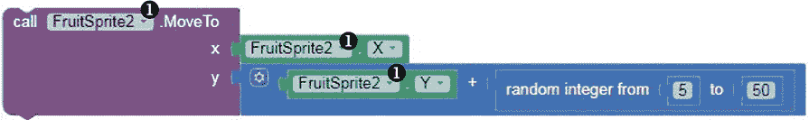

在复制的块中，使用 `callFruitSprite1.MoveTo`、`FruitSprite1.X` 和 `FruitSprite1.Y` 块中的下拉箭头 ➊ 来切换为 `FruitSprite2`。同时，将左侧 `random integer` 块插槽中的数字更改为 5。这些块现在将 `FruitSprite2` 编程为在 `Clock` 的定时器每 150 毫秒触发时，向下移动一个在 5 到 50 之间的未知像素数。

接下来，右键点击 `callFruitSprite1.MoveTo` 块，再次复制它以供 `FruitSprite3` 使用，并将复制块插入到 `callFruitSprite2.MoveTo` 块的下方。

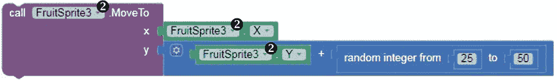

在复制块中，使用 `callFruitSprite1.MoveTo`、`FruitSprite1.X` 和 `FruitSprite1.Y` 块中的下拉箭头 ➋ 来切换为 `FruitSprite3`，并将 `random integer` 块左插槽中的数字更改为 25。这些块将 `FruitSprite3` 编程为每 150 毫秒下落一个在 25 到 50 之间的随机像素数。

现在，第二步的模块应该使三个水果 `ImageSprite` 每隔 150 毫秒以随机速度向下移动 `Canvas`。

进行实时测试，看看这些模块如何工作。当你点击 `StartBtn` 时，你应该能看到三个水果 `ImageSprite` 下落到屏幕底部，然后停在那里，所有的运动停止。如果任何 `ImageSprite` 没有移动，你需要进行调试。在这种情况下，当你复制 `MoveTo` 模块时，可能没有将其引用更改为正确的 `ImageSprite`。做出必要的更正后，再次测试。一旦第二步工作正常，继续进行下一步，我们将告诉游戏当水果 `ImageSprite` 到达 `Canvas` 底部时该怎么办。

#### **步骤 3：创建更多下落的水果并计算掉落的水果**

现在我们来编写应用程序的第三步。在这部分，当水果 `ImageSprite` 到达 `Canvas` 底边时，我们希望应用将 `ImageSprite` 移动到 `Canvas` 顶部的一个随机位置，并显示一个随机的水果图片，同时将水果碰到边缘的次数加 1。

我们将使用一个全局变量来存储和更新该总数，并通过创建和初始化该变量来开始编写此步骤的代码。

点击**变量**模块抽屉，拖动一个初始化全局名称块到查看器中。点击名称并将其替换为我们的变量名 fruitsDropped。然后，从**数学**模块中拖动一个数字 0 块，将其固定在初始化全局 fruitsDropped 块的右侧。这声明并初始化了你将用于存储和更新游戏中掉落的水果总数的变量。因为该变量是全局的，可以被所有事件处理程序使用，所以它独立存在于代码中，位于所有事件处理程序块之外。

现在让我们编写此步骤的事件处理程序。以下是处理 `FruitSprite1` 的 `EdgeReached` 事件的模块。

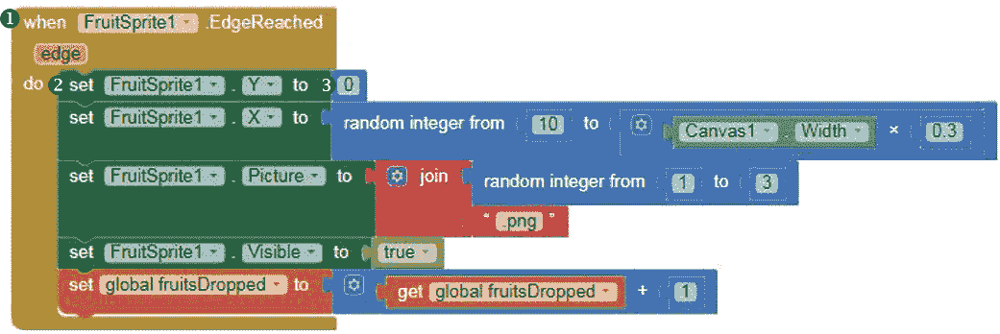

在模块窗格中，点击 FruitSprite1，当该组件的模块出现时，将 whenFruitSprite1.EdgeReached 块 ➊ 拖到查看器中。然后，在模块窗格中再次点击 FruitSprite1，拖动 setFruitSprite1.Y 块 ➋ 到查看器，并将其固定在 whenFruitSprite1.EdgeReached 块的 `do` 旁边。

然后，点击**数学**模块抽屉，拖动一个数字 0 块 ➌ 到查看器，并将其固定在 setFruitSprite1.Y 块的右侧。到目前为止，一旦 `FruitSprite1` 到达 `Canvas` 的边缘，这些块会将 `FruitSprite1` 向右移动到 y 坐标 0，这正是 `Canvas` 的顶部。

##### **将掉落的水果移回到随机位置**

我们现在需要确保代码还会使用设置器块将 `FruitSprite1` 移动到一个不可预测的 x 坐标，这样可以保持游戏的趣味性。

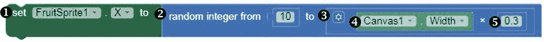

在“积木”面板中，点击 FruitSprite1 组件，将 setFruitSprite1.X 积木 ➊ 拖到视图区，并将其放置在 `setFruitSprite1.Y` 积木下的 whenFruitSprite1.EdgeReached 积木内部。接着，点击 **数学** 积木抽屉，将一个 `random integer` 积木 ➋ 拖到 setFruitSprite1.X 积木的右侧，并点击 `random integer` 积木左侧插槽中的默认值 1，将其替换为 10。然后，删除 `random integer` 积木右侧插槽中的默认值 100，替换为一个乘法运算符积木 ➌，该积木同样来自数学抽屉。接下来，在“积木”面板中，点击 Canvas1 组件，将 Canvas1.Width 获取器积木 ➍ 拖到视图区，并将其插入到乘法积木的左侧插槽；然后，从 **数学** 积木抽屉拖入一个数字 0 积木 ➎ 到视图区，点击其默认值 0，替换为输入 0.3，并将 0.3 数字积木插入乘法积木的右侧插槽。

这些积木设置了当 `FruitSprite1` 到达 `Canvas` 边缘时的 `X` 值。为了避免与其他水果 `ImageSprite` 发生碰撞，我们希望第一个水果 `ImageSprite` 只会掉落在 `Canvas` 的左三分之一区域。通过这些积木，我们确保了这一点，它们将新的 `X` 位置设置为一个随机数，这个随机数介于 10 和 `Canvas` 宽度乘以 0.3 之间，这个值略小于 `Canvas` 宽度的三分之一。例如，如果 `Canvas` 的宽度是 450 像素，那么新的 `X` 位置将介于 10 和 (450 × 0.3) 像素之间，即 135 像素。

##### **掉落随机水果图片**

接下来，为了保持游戏的不可预测性，你需要确保代码在 `FruitSprite1` 移动回 `Canvas` 顶部后随机改变掉落的水果类型。为此，你将使用设置器积木，将 `FruitSprite1` 的 `Picture` 属性设置为一张随机图片。

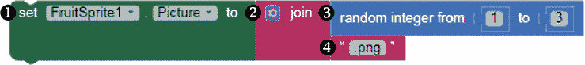

在“积木”面板中，点击 FruitSprite1 组件，将 setFruitSprite1.Picture 积木 ➊ 拖到视图区，并将其放置在 `setFruitSprite1.X` 积木下的 whenFruitSprite1.EdgeReached 积木内部。接着，点击 **文本** 积木抽屉，拖入一个 `join` 积木 ➋ 到视图区，并将其放置在 setFruitSprite1.Picture 积木的右侧，这样你就可以通过连接两个字符串来设置图片的名称。

对于 `join` 积木的第一个输入，将另一个 `random integer` 积木 ➌ 从数学积木抽屉拖入，点击其右侧插槽中的默认值 100，将其替换为 3。对于 `join` 积木的第二个输入，将一个空字符串积木 ➍ 从文本积木抽屉中拖入。然后点击字符串积木的文本区域，输入 .png。

这些块在`FruitSprite1`到达`Canvas`边缘后，设置使用的图片源的名称。由于我们上传的三张水果图片分别命名为*1.png*、*2.png*和*3.png*，我们可以使用`random integer`块来生成数字 1、2 或 3，作为图片名称的一部分。这样，应用程序每次水果从`Canvas`的顶部掉下时，都会随机选择一张图片显示在`FruitSprite1`上。

##### **确保水果可见**

我们还需要确保`FruitSprite1`和其他水果`ImageSprite`在它们返回到`Canvas`顶部时可见，因为稍后如果它们与选择器`ImageSprite`碰撞，我们会让它们变得不可见。以下是设置`Visible`属性为可见的设置块。

点击 FruitSprite1，将 setFruitSprite1.Visibleto 块➊拖到 Viewer 中，并将其嵌入到`setFruitSprite1.Pictureto`块下的 whenFruitSprite1.EdgeReached 块内。然后，在块面板中，点击**逻辑**块抽屉，拖动 true 块➋到 Viewer 中，并将其嵌入到 setFruitSprite1.Visibleto 块的右侧。这些块将在水果与选择器`ImageSprite`碰撞时将`ImageSprite`的`Visible`属性重置为`true`，然后我们的第 5 步中的块会将其设置为`false`。

##### **计算掉落的水果数量**

最后，我们需要编程让应用程序跟踪掉落的水果数量。每当水果`ImageSprite`撞击到`Canvas`底部时，游戏应该将 1 添加到`fruitsDropped`的值中，这个变量用于跟踪`ImageSprite`撞击到边缘的次数。以下块会增加`fruitsDropped`的值。

鼠标悬停在我们在此步骤开始时放置的初始化全局变量 fruitsDropped 块上，将设置全局变量 fruitsDropped 块➊拖动到 Viewer 中，并将其嵌入到`setFruitSprite1.Visibleto`块下的 whenFruitSprite1.EdgeReached 块内。然后，从数学抽屉中拖动一个加法运算符块➋，并将其嵌入到设置全局变量 fruitsDropped 块的右侧。通过将鼠标悬停在初始化全局变量 fruitsDropped 块上，拖动获取全局变量 fruitsDropped 块➌到加法块的左侧插槽，并从数学抽屉中拖动一个数字 1 块➍到加法块的右侧插槽。这些块通过每次`FruitSprite1`到达`Canvas`边缘时，将 1 添加到`fruitsDropped`变量的当前值，来跟踪游戏中掉落的水果总数。

##### **复制块以支持 FruitSprite2 和 FruitSprite3**

第 3 步的最后任务是复制代码，为`FruitSprite2`和`FruitSprite3`编程类似的`EdgeReached`事件处理程序。

对于 `FruitSprite2`，右键点击 whenFruitSprite1.EdgeReached 块并选择 **duplicate**。当你复制该块时，你会看到在原始和复制的事件处理程序中的 `when` 左侧出现一个红色 X，这个红色 X 警告你有两个相同事件的事件处理程序，这是不允许的。一旦你改变复制处理程序的事件，红色 X 应该会消失。要更改事件，请在每个包含 `FruitSprite1` 的块中使用下拉箭头，并将其更改为 `FruitSprite2`。

我们需要做的唯一其他调整是为`FruitSprite2`设置一个`X`属性，以避免在它沿着`Canvas`向下移动时与其他水果`ImageSprite`发生碰撞。为此，通过改变`FruitSprite2 X`的值，确保第二个水果`ImageSprite`始终掉落在`Canvas`的中间三分之一区域。

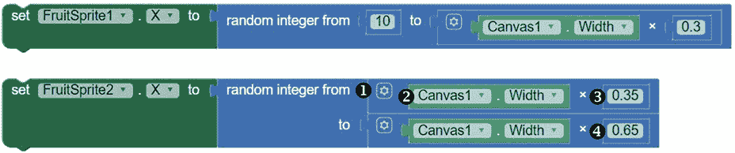

**注意**

*App Inventor 提供了一种方式，可以让你显示随机整数、连接以及其他需要多个输入的块，通过内联输入（如在 FruitSprite1 设置器中的随机整数块）或者外部输入（如在 FruitSprite2 设置器中的随机整数块），后者占用的水平空间较少。你可以右键点击块来切换内联输入和外部输入。*

用一个乘法运算符块 ➊ 替换随机整数块顶部插槽中的数字 10 块。然后，点击 Blocks 面板中的 Canvas1 组件，将 Canvas1.Width 块 ➋ 拖入左侧插槽，再将 Math 组件中的 0.35 数字块 ➌ 拖入右侧插槽。接着，在 `random integer` 块的底部插槽中，将 0.3 数字块替换为 0.65 数字块 ➍。

这些块将 `FruitSprite2` 的新 `X` 位置设置为一个随机数，范围介于 `Canvas` 宽度乘以 0.35 和 `Canvas` 宽度乘以 0.65 之间，这个范围是在 `Canvas` 中间三分之一的某个随机点。例如，如果 `Canvas` 的宽度为 450 像素，则新的 `X` 位置将在 450 × 0.35 像素（即 158 像素）和 450 × 0.65 像素（即 293 像素）之间的任何位置。

现在，为了创建 `FruitSprite3` 的 `EdgeReached` 事件处理程序，右键点击 whenFruitSprite2.EdgeReached 块并选择 **duplicate**。在复制的块中，请确保使用下拉箭头，在每个出现 `FruitSprite2` 的块中将其更改为 `FruitSprite3`。

为了避免与其他水果`ImageSprite`发生碰撞，我们还需要修改`FruitSprite3 X`的值，使得这个第三个水果`ImageSprite`始终出现在`Canvas`的右侧三分之一区域。

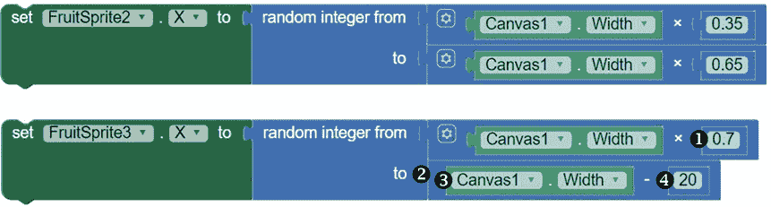

为了实现这一点，将第一个乘法模块右侧插槽中的 0.35 数字模块替换为 0.7 数字模块 ➊。然后，将第二个乘法模块替换为一个减法操作符模块 ➋，该模块来自数学模块抽屉。将减法模块的左插槽填入 `Canvas1.Width` 模块 ➌，右插槽填入 20 数字模块 ➍。

这些模块将 `FruitSprite3` 的新 `X` 位置设置为一个随机的像素数，范围在 `Canvas` 宽度乘以 0.7 和 `Canvas` 宽度减去 20 像素之间，即 `Canvas` 右侧三分之一的某个随机点。例如，如果 `Canvas` 宽度是 450 像素，那么新的 `X` 位置将介于 450 × 0.7 像素（即 315 像素）和 450 – 20 像素（即 430 像素）之间。

总的来说，步骤 3 的模块将每个水果的 `ImageSprite` 移动到 `Canvas` 顶部的随机位置，让该 `ImageSprite` 显示一个随机的水果图片，并且每当一个 `ImageSprite` 落到 `Canvas` 底部时，水果总数会增加 1，就像我们之前计划的那样。

现在再次进行游戏的实测。这一次，当你点击 `StartBtn` 时，你应该能看到三个水果 `ImageSprite` 不断掉落到屏幕底部，图片会随机变化。你还会注意到每个 `ImageSprite` 掉落的速度，以及它的 `X` 坐标随着每次掉落而发生变化。

如果任何一个 `ImageSprite` 无法移动，或者两个或多个 `ImageSprite` 出现在 `Canvas` 的同一三分之一区域内，请调试你的代码。在这里，你可能没有正确修改重复的模块。做出必要的修正后，再次进行测试。一旦步骤 3 正常工作，我们就可以进入下一部分，编程 `PickerSprite` 的移动。

#### **步骤 4：让玩家移动接水果**

现在，让我们编程应用的步骤 4，告诉它当玩家点击左右播放按钮时该做什么。当玩家点击 `LeftBtn` 时，我们希望 `PickerSprite` 向左移动 50 像素；当玩家点击 `RightBtn` 时，我们希望 `PickerSprite` 向右移动 50 像素。

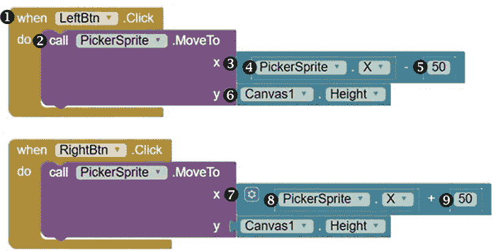

在模块面板中，点击 LeftBtn，当组件的模块出现时，将 `whenLeftBtn.Click` 模块 ➊ 拖到 Viewer 中。然后，在模块面板中点击 `PickerSprite`，将 `callPickerSprite.MoveTo` 模块 ➋ 拖到 Viewer 中，并将它插入到 `whenLeftBtn.Click` 模块中，紧挨着 `do` 这个词。

现在我们需要为 `MoveTo` 块提供方法参数，告诉应用程序我们希望将 `PickerSprite` 移动到哪里，记住，对于这个游戏，我们希望 `PickerSprite` 只在 `Canvas` 的最底部沿水平方向来回移动。这意味着我们只需改变其 x 坐标，保持 y 坐标在底部。为此，点击 **Math** 块抽屉，将一个减法操作符块 ➌ 拖到查看器中，并将其插入到 x 右侧。然后，点击 `PickerSprite` 并将其 PickerSprite.X 块 ➍ 拖到减法块的左插槽，再从 Math 抽屉中将一个 50 数字块 ➎ 拖入减法块的右插槽。

这些块告诉我们的应用程序，每当点击 `Button` 时，将 `PickerSprite` 的 x 坐标向左移动 50 像素。例如，如果 `PickerSprite` 的 x 坐标为 240 像素，当玩家点击 `LeftBtn` 时，x 坐标应该向左移动 50 像素，变为 190 像素，因为 240 像素 - 50 像素 = 190 像素。

接下来，点击 Canvas1，将其 Canvas.Height 块 ➏ 拖到查看器中，并将其插入到 callPickerSprite.MoveTo 块的 y 插槽。这告诉应用程序，当移动 `PickerSprite` 时，我们希望 `ImageSprite` 的 `Y` 值保持与 `Canvas` 高度相等，并位于底部。例如，如果 `Canvas` 的高度为 300 像素，这些块将确保当点击 `LeftBtn` 时，`PickerSprite` 的 y 坐标保持在 `Canvas` 底部的 300 像素处。

现在复制 LeftBtn 事件处理程序，并修改副本中的块来编程 RightBtn。首先，在副本事件处理程序中，确保使用下拉箭头将 LeftBtn 更改为 RightBtn。然后，替换字母 `x` 后面的减法块，改为从 Math 抽屉中选择一个加法块 ➐，点击 `PickerSprite` 并将其 PickerSprite.X 块 ➑ 拖入加法块的左插槽，再从 Math 抽屉中将一个 50 数字块 ➒ 拖入加法块的右插槽。

这些块的作用是，当按钮被点击时，将 `PickerSprite` 的 x 坐标移动到其当前位置加上 50 像素。所以，如果 `PickerSprite` 的 x 坐标为 240 像素，当玩家点击 `RightBtn` 时，x 坐标应该向右移动 50 像素，变为 290 像素，因为 240 像素 + 50 像素 = 290 像素。

现在再次进行实时测试，如果点击 `StartBtn` 后 `LeftBtn` 和 `RightBtn` 无法正常工作，可以尝试调试。`LeftBtn` 和 `RightBtn` 应该能让 `PickerSprite` 在屏幕上来回移动，而水果 `ImageSprite` 偶尔与 `PickerSprite` 碰撞。由于玩家在游戏中的目标是与水果碰撞或“抓住”水果，当这些水果 `ImageSprite` 与 `PickerSprite` 碰撞时，我们需要编程来执行一系列操作。在下一步，我们将编写这些操作。

#### **步骤 5：隐藏已捕获的水果并记录分数**

现在，我们将编程游戏的最后部分，使得每当水果 `ImageSprite` 碰到 `PickerSprite` 时，玩家“抓住”水果，听到像水果落入收集器桶中的声音，获得一个积分，并在屏幕上看到总分。同时，我们还会隐藏那个碰到 `PickerSprite` 的 `ImageSprite`，这样，水果就不会继续掉到 `Canvas` 底部，而是看起来像是落进了收集器的桶里。

为了保存玩家的分数，我们将使用一个变量来存储并更新这些信息。让我们通过创建并初始化 `score` 变量来开始这一步的代码。

点击 **变量** 块抽屉，拖动一个初始化全局名称块到“查看器”中。点击名称，将其替换为我们的变量名 `score`。然后，从数学抽屉中拖动一个 0 数字块，并将其放置到初始化全局分数块的右侧。这会声明并初始化我们用来存储和更新玩家游戏分数的全局变量。

##### **当水果碰到收集器时播放声音**

现在我们来编程当水果 `ImageSprite` 碰到 `PickerSprite` 时的事件处理程序。

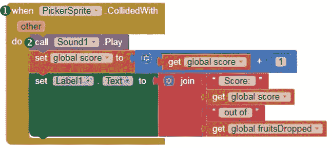

在块面板中，点击 PickerSprite，当组件的块出现时，拖动 whenPickerSprite.CollidedWith 块 ➊ 到“查看器”中。然后，在块面板中点击 Sound1，拖动 callSound1.Play 块 ➋ 到“查看器”中，并将其嵌套到 whenPickerSprite.CollidedWith 块中的 `do` 旁边。每当 `ImageSprite` 碰到 `PickerSprite` 时，这应该会播放我们的撞击声音。

##### **增加和显示分数**

接下来，我们将放置那些每次水果 `ImageSprite` 碰到收集器时增加并显示游戏分数的块。

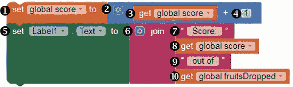

将鼠标移到初始化全局分数块上，拖动设置全局分数到块 ➊ 并放置到“查看器”中，然后将其嵌套到 `callSound1.Play` 块下的 whenPickerSprite.CollidedWith 块内。接着，从数学抽屉中拖动一个加法运算符块 ➋ 并将其放置到设置全局分数到块的右侧。然后，再次将鼠标移到初始化全局分数块上，拖动获取全局分数块 ➌ 到加法块的左插槽，并从数学抽屉中拖动一个数字 1 块 ➍ 到其右插槽。这些块会在每次水果 `ImageSprite` 与 `PickerSprite` 碰撞时将 `score` 变量的当前值增加 1。

为了显示分数并让玩家知道 `PickerSprite` 捕获了掉落水果中的多少个，点击 Label1，拖动 setLabel1.Textto 块 ➎ 到“查看器”中，并将其嵌套到 whenPickerSprite.CollidedWith 块中的 `set global score to` 块下。然后，点击 **文本** 块抽屉，拖动一个连接块 ➏ 到“查看器”中，并将其放置到 setLabel1.Textto 块的右侧。

在这里，我们将连接四个字符串来设置我们希望 `Label1` 显示的文本和数字，尽管默认情况下 `join` 块只允许我们组合两个字符串。图 3-3 展示了如何更改该块，以为我们需要的附加输入创建空间。

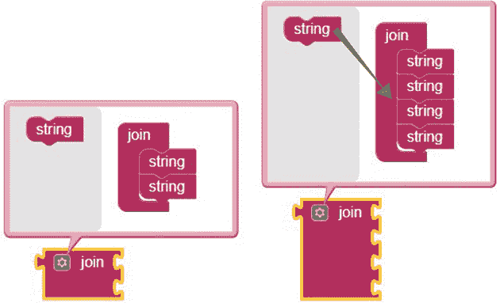

*图 3-3：向 `join` 块添加输入*

点击 `join` 词左侧的蓝色 *mutator* 图标，在弹出的对话框中将其他字符串块拖到 `join` 块内。

现在，我们可以将四个字符串嵌入到 `join` 块的输入框中。在顶部输入框中，从文本块抽屉中拖入一个空字符串块 ➐，并输入 “Score:”，确保在冒号后面加上一个空格，以便字符串组合时，字符不会连在一起，缺少适当的间隔。接着，将鼠标移至初始化全局得分块上，并将获取全局得分块 ➑ 拖入 `join` 块的第二个输入框。在 `join` 块的第三个输入框中，拖入另一个空字符串块 ➒ 并输入 “out of”，在 `out` 之前和 `of` 之后留一个空格。然后，将鼠标移至初始化全局丢弃水果块上，并将获取全局丢弃水果块 ➓ 拖入 `join` 块的最后一个输入框。这些块将显示玩家在屏幕顶部看到的分数和丢失水果的总数。例如，如果玩家得分为 6 分，总共有 20 个水果丢失，那么标签应该显示“Score: 6 out of 20”。

##### **隐藏已捕获的水果**

最后，让我们添加一些块，使水果 `ImageSprite` 在与 `PickerSprite` 碰撞后消失。

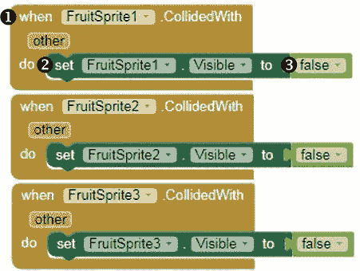

点击 `FruitSprite1`，当组件的块出现时，将 `whenFruitSprite1.CollidedWith` 块 ➊ 拖到查看器中。然后，点击 `FruitSprite1`，将 `setFruitSprite1.Visibleto` 块 ➋ 拖到查看器中，并将其插入到 `whenFruitSprite1.CollidedWith` 块内，放置在 `do` 旁边。接下来，在块面板中，点击 **逻辑** 块抽屉，将 `false` 块 ➌ 拖到查看器中，并将其插入到 `setFruitSprite1.Visibleto` 块的右侧。

现在，为 `FruitSprite2` 复制这些块，注意在看到 `FruitSprite1` 的位置，使用下拉箭头将其更改为 `FruitSprite2`。然后再次复制这些块，确保更改为 `FruitSprite3`。这三个事件处理程序会在水果 `ImageSprite` 与 `PickerSprite` 碰撞时将其隐藏，这样就像是捡果子的人成功地将水果捡进了桶里。在下一章中，您将学习如何消除这些重复的块，并使用更复杂的编程结构来完成相同的任务。

现在，按照步骤 5 的计划，每次水果 `ImageSprite` 接触到 `PickerSprite` 时，应用程序应播放声音、增加玩家的得分 1 分、显示得分和水果总数，并隐藏水果 `ImageSprite`。

是时候测试完成的游戏了！在设备上打开应用，你应该会看到屏幕顶部的 `StartBtn`。点击它，消失后，你应该会看到其他游戏组件出现。现在水果开始随机掉落，你可以点击 `LeftBtn` 和 `RightBtn` 来移动 `PickerSprite` 在屏幕上来回移动，尽量捕捉水果。每当 `PickerSprite` 捕获到一颗水果时，你应该听到声音并看到分数增加。如果你正确地放置了代码块，游戏应该按照描述正常运行，你就成功创建了“水果 Loot”游戏！

### **总结**

在这一章中，你构建了一个动画“水果 loot”应用，这是一个游戏，玩家控制一个水果收集器在屏幕上来回移动，当收集器捕捉到快速且随机掉落的水果时，玩家会获得积分。

你学习了程序员如何通过移动对象的 x 和 y 坐标来动画化一个对象；如何使用伪随机数生成器在游戏、模拟器和其他应用中添加随机性；以及如何使用算术运算符来处理数据。你还练习了声明和初始化变量以存储和更改信息，并学习了如何为内置方法提供带参数的必要参数。

在下一章中，你将学习更多关于数学运算符和随机数代码块的内容，并开始使用控制代码块在代码中进行选择。你将利用这些工具创建“乘法车站”测验应用的第一部分，该应用生成随机的定时乘法题目，评估用户输入的答案，并通过语音宣布这些答案是正确还是错误。

### **独立完成**

在修改和扩展“水果 Loot”应用时保存新版本。你可以在 *[`nostarch.com/programwithappinventor/`](https://nostarch.com/programwithappinventor/)* 在线找到解决方案。

1.  修改应用，使其计算并记录玩家在游戏中未能捕捉到多少个水果。你如何利用现有的事件处理程序来计算、存储和显示这些信息，并且只添加最少的额外代码块？

1.  扩展游戏，使得沮丧的果树主人（他无法阻止水果掉过围栏）开始把石块扔到围栏上，试图阻止收集器捕捉掉落的水果。每次石块击中另一个精灵时，减少玩家的分数。你将添加哪些组件和代码块？

1.  进一步扩展游戏，使得得分标签显示每次石块击中另一个精灵的次数。
