## 第四章：**乘法站：通过代码做决策**


在编程中，您可以使用三种结构来控制程序的流程：顺序、选择和重复。使用*顺序结构*，这是三者中默认且最简单的一种，代码会按顺序逐行执行。到目前为止，您一直在使用顺序结构来创建应用程序。

与顺序结构不同，*选择*或*条件结构*使应用程序能够通过布尔表达式测试条件来做出决策。布尔表达式通过使用*关系*或*比较*运算符，如=、≤和≥，来测试条件。因为布尔值只能为真或假，所以当条件为真时，我们执行一段代码，条件为假时执行另一段代码。

*重复结构* 也会测试一个布尔条件，并在条件为真时反复执行一段代码，这就是所谓的*循环*。我们将在第六章中使用重复结构。

### 选择控制结构

在本章中，我们将通过使用控制块中的`if then`块来编写程序，以通过比较条件来做出决策。我们将它们与来自逻辑和数学块的比较运算符块结合使用，比较数值。然后，我们会根据比较结果的真或假，执行不同的代码块。

#### 在“水果战利品”游戏中使用 IF THEN 块

在第三章的“水果战利品”游戏中，我们本可以使用`if then`块来简化我们的代码。请记住，我们已经编程了当`ImageSprite`与选择器碰撞时，应用程序应该执行的操作，如图所示。

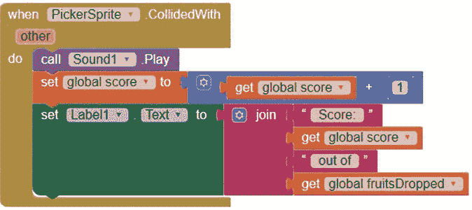

我们本应在这个事件处理程序中加入代码，使任何与选择器碰撞的精灵消失。但我们没有这么做，因为我们还不知道如何使用选择控制结构来确定到底是哪个精灵碰到了选择器并将其隐藏。

相反，我们为每个水果`ImageSprite`重复了`CollidedWith`事件处理程序。

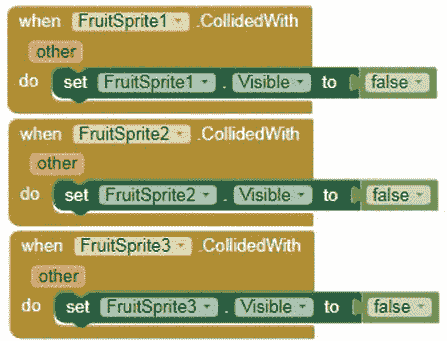

这些块可真不少！然而，使用选择控制结构后，我们就不需要使用三个重复的水果`ImageSprite CollidedWith`事件处理程序来确定是哪个水果`ImageSprite`碰到了选择器并使其消失。

这里是代码的*伪代码*，或者是一个简单的、平易近人的英文版本，用于确定哪个精灵碰到了选择器：

```
If (the sprite that hit PickerSprite is FruitSprite1)
    then (hide FruitSprite1).
If not, if (the sprite that hit PickerSprite is FruitSprite2)
    then (hide FruitSprite2).
If not,
    (hide FruitSprite3).
```

为了重新创建这个伪代码，我们将向选择器`ImageSprite`的`CollidedWith`事件处理程序中添加一个`if then`块，如图 4-1 所示。

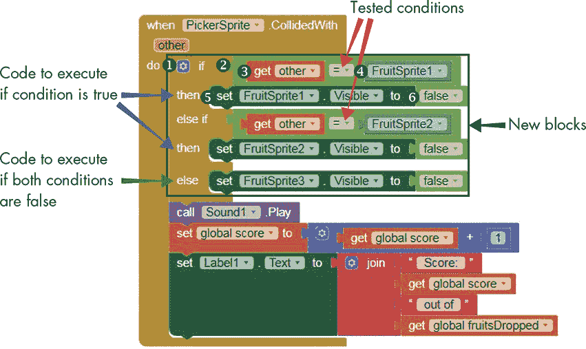

*图 4-1：“水果战利品”块，查找并隐藏与选择器碰撞的 ImageSprite*

要添加新的块，请进入“水果战利品”游戏的块编辑器，并将 if then 块 ➊放入 whenPickerSprite.CollidedWith 块内，紧挨着`do`字样。

你应该看到默认的`if then`块只允许一个`if`和一个`then`输入。要添加更多输入，点击`if`左侧的蓝色变更图标，如图 4-2 所示。

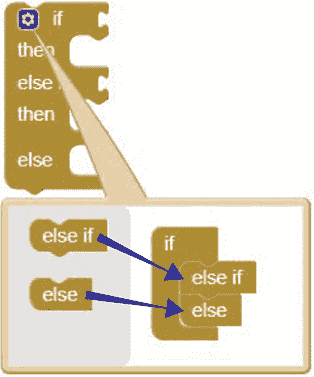

*图 4-2：为 if then 块添加 else if 和 else 插座*

在打开的对话框中，拖入一个 else if 块，然后再拖入一个 else 块到 if 块中。

##### 检查碰撞的水果是否是 FruitSprite1

`PickerSprite`的`CollidedWith`事件处理程序提供了`other`事件参数，该参数表示与捡取器碰撞的水果`ImageSprite`。每当`ImageSprite`碰撞到捡取器时，你将`other`与`FruitSprite1`进行比较，以确定`FruitSprite1`是否是碰撞到捡取器的精灵。如果是，代码块将设置`FruitSprite1`的`Visible`属性为`false`，使其消失。

要放置此行为的代码块，请从逻辑代码块面板中，拖入一个=比较操作符块➋，并将其放置在`if`的旁边。要填充`=`块的操作数插座，将鼠标悬停在变更图标上方的`other`事件参数上，直到看到`get other`块➌，然后将其拖动到左插座。接着，点击代码块面板中的 FruitSprite1，将 FruitSprite1 块➍拖动到右插座。接下来，在代码块面板中，再次点击 FruitSprite1 并拖入 setFruitSprite1.Visibleto 块➎，将其放置在`then`旁边。最后，从逻辑代码块面板中拖入一个`false`块➏，并将其放置在 setFruitSprite1.Visibleto 块的右侧。

##### 检查碰撞的水果是否是 FruitSprite2

如果`FruitSprite1`不是碰撞到捡取器的水果，我们通过将`other`与`FruitSprite2`进行比较，检查第二个条件。在图 4-1 中的➋到➍的代码块，复制这些代码块并将它们放在`else if`的旁边，使用下拉箭头将 FruitSprite1 更改为 FruitSprite2，修改重复的`=`比较操作符块的右操作数插座。

然后复制➎和➏的代码块，将重复的代码块放置在`then`的旁边，并使用下拉箭头将 FruitSprite1 更改为 FruitSprite2，放入重复的设置器块中。现在，当`ImageSprite`（除了`FruitSprite1`之外）碰撞到捡取器时，这些代码块会将`other`与`FruitSprite2`进行比较，以确定`FruitSprite2`是否是碰撞到捡取器的精灵。如果是，代码块将设置`FruitSprite2`的`Visible`属性为`false`，使其消失。

##### 检查碰撞的水果是否是 FruitSprite3

最后，再次复制➎和➏的代码块，将重复的代码块放置在`else`的旁边，并使用下拉箭头将 FruitSprite1 更改为 FruitSprite3，放入重复的设置器块中。这最后两个代码块应该仅在`FruitSprite1`和`FruitSprite2`都不匹配`other`（即与捡取器碰撞的水果`ImageSprite`）时执行。那时，`FruitSprite3`是唯一剩下的精灵，它一定是碰撞到捡取器的，并将消失。

我们不再为水果`ImageSprite`创建三个不同的`CollidedWith`事件处理程序，而是重构代码，使用一个`if then`块来处理多个条件。现在，你可以删除原先的三个`CollidedWith`事件处理程序，在测试“水果战利品”应用时，它应该表现得完全一样。

### 构建“乘法站”应用

既然你已经了解了`if then`块的工作方式，让我们创建“乘法站”测验应用。为了构建这个应用，你将使用`if then`块，以及`Clock`计时器、随机数和算术运算符来生成乘法问题。你还将学习如何创建具有多个屏幕的应用，并尝试使用`TextToSpeech`和`Notifier`组件与应用用户进行互动。

登录到 App Inventor，创建一个新项目，命名为 MultiplicationStation，并点击**确定**。

### 分解“乘法站”

我们可以将“乘法站”应用分解为五个步骤：

1.  当用户打开应用时，播放欢迎信息并显示开始按钮。

1.  当用户点击开始按钮时，打开练习屏幕。

1.  当`Clock`计时器触发时，显示一个随机的乘法问题和一个空文本框供用户输入答案，并将总问题数加 1。

1.  当用户点击检查答案按钮时，检查答案并指示答案是否正确，如果存在答案。如果没有答案，显示警报。

1.  当用户点击结束按钮时，停止显示问题，并将用户界面更改为仅显示最终的数字和百分比练习分数。

你将需要以下组件：

+   按钮（3），用户可以点击手动开始和结束练习并检查答案

+   时钟（Clock）在用户点击开始按钮后触发，按 5 秒间隔显示数学问题

+   HorizontalArrangement，用于容纳答案`TextBox`、检查答案按钮和答案结果`Label`

+   Label（3），用于显示数学问题、答案结果和分数

+   Notifier，用于向用户显示警报

+   屏幕（2），用于欢迎屏幕和练习屏幕

+   TextBox，供用户输入答案

+   TextToSpeech（2），用于播报欢迎信息并声明答案对错

+   变量（7），用于存储问题、答案和分数

+   VerticalArrangement，用于容纳所有练习屏幕的用户界面组件

现在让我们在设计器中布局应用。

### 在设计器中布局“乘法站”

与我们在第二章的“实践成就完美”应用中那样简短地展示和隐藏引导信息不同，我们将在这个应用中使用两个不同的屏幕：一个用于欢迎用户，另一个用于显示问题并评估用户的答案。

#### 设置欢迎屏幕

要布置`Screen1`，欢迎界面，首先从用户界面抽屉中拖动一个按钮和一个来自媒体抽屉的不可见 TextToSpeech 组件。

图 4-3 展示了欢迎屏幕应有的样子。

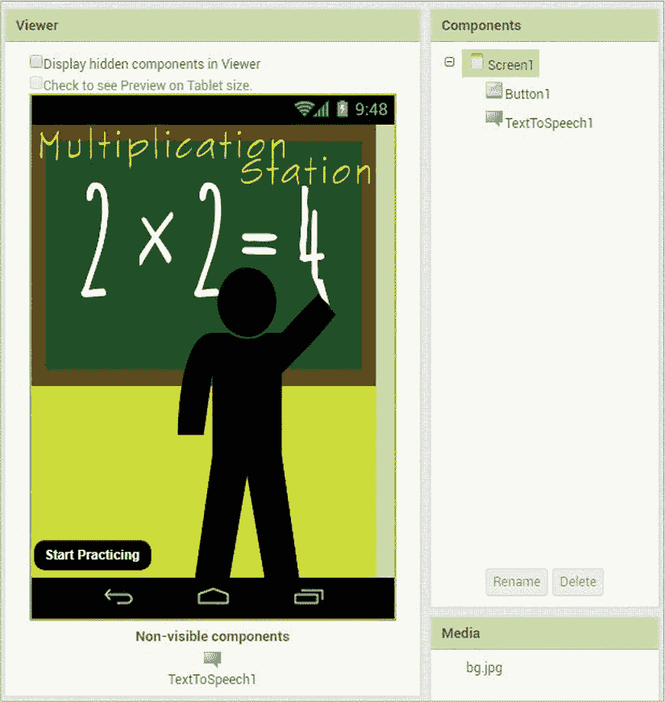

*图 4-3：在“乘法车站”中布局 Screen1 后的查看器、组件和媒体面板*

在组件面板中点击 Screen1。然后，在属性面板中，调整其垂直对齐方式，使`Button`位于屏幕底部，方法是点击垂直对齐下的下拉箭头，选择**底部：3**。接着，点击背景图像下的文本框并按照“上传图片”中描述的步骤为屏幕添加背景图像，详情请见第 27 页。最后，去掉显示状态栏和标题可见下的勾选，以便在应用运行时隐藏状态栏和屏幕`Screen1`的标题。

现在，让我们为启动应用的`Button`设置样式。在组件面板中点击 Button1。然后，在属性面板中，通过点击背景颜色下的**默认**，再点击颜色列表对话框中出现的**黑色**来更改背景颜色。接着，通过勾选字体加粗下的复选框来加粗其文本，并通过点击形状下的下拉箭头选择**圆角**来更改其形状。然后，在**文本**下的文本框中输入“开始练习”。为了将文本改为白色，点击文本颜色下的**默认**，然后在颜色列表对话框中点击**白色**。

现在让我们创建`Screen2`，这是大部分应用操作将发生的地方。

#### 创建练习屏幕

要创建`Screen2`，点击查看器上方的**添加屏幕...**按钮。当新屏幕对话框打开时，点击**确定**，你将进入一个全新的屏幕。

现在，在属性面板中，我们将水平和垂直居中`Screen2`，这样我们放置在上面的所有组件都将居中。为此，点击水平对齐和垂直对齐下的下拉箭头，选择**居中**。接下来，点击背景图像下的文本框并按照图像上传过程为屏幕添加背景图像。最后，点击标题可见下的复选框去掉勾选，以防止在应用运行时显示屏幕标题。

##### 问题显示

现在，让我们通过从面板中拖动组件并按顺序放置它们来设置用户可以看到并与之交互的组件。我们还将在添加这些组件时进行调整。

首先，从布局抽屉中拖动一个垂直排列，然后通过点击水平对齐和垂直对齐下的下拉箭头，选择**居中**来将其内容水平和垂直居中。然后，改变`VerticalArrangement1`的高度，使其占据屏幕的上半部分。为此，点击**高度**下的文本框，在对话框打开时，在“百分比”旁的文本框中输入 50，然后点击**确定**。最后，将其**宽度**设置为**填充父级**。

现在我们将所有剩余可见组件拖入`VerticalArrangement1`。从用户界面抽屉中拖动一个标签到 VerticalArrangement1，点击**重命名**按钮，将其重命名为 ProblemLbl，然后点击**确定**。接着，点击**FontBold**复选框，使`ProblemLbl`上的文本加粗，在**FontSize**文本框中输入 25，使文本变大，并在**Text**文本框中输入"Problems appear here"，替换默认的`Text for Label1`。

##### 回答文本框和检查答案按钮

接着，从布局抽屉中将一个 HorizontalArrangement 拖到 VerticalArrangement1 的`ProblemLbl`下方。在其 AlignHorizontal 和 AlignVertical 的下拉框中选择**Center**，并将其**Width**设置为**Fill parent**。

现在，从用户界面抽屉中将三个组件拖到 HorizontalArrangement1 中。首先，拖动一个文本框并将其重命名为 AnswerBox。通过点击**Width**下的文本框，在`pixels`字样左侧的文本框中输入 100，并点击**确定**，将其宽度设置为 100 像素。接着，在**Hint**文本框中将`Hint for TextBox1`替换为输入你的答案。虽然在查看器中看不到这段文本，但用户应该能在屏幕上的`AnswerBox`中看到提示。最后，勾选 NumbersOnly 复选框，这将允许用户在`AnswerBox`中只输入数字。

将一个按钮拖到 HorizontalArrangement1 的 AnswerBox 右侧，并将其重命名为 CheckAnswerBtn。接着，在**Text**文本框中输入"Check Answer"，以替换`Text for Button1`。这是用户点击以检查答案的按钮。

最后，将一个标签拖到 HorizontalArrangement1 的 CheckAnswerBtn 右侧，将其重命名为 ResultLbl，并删除**Text**文本框中默认的`Text for Label1`。该标签在显示“Correct！”或“Incorrect”答案结果之前将保持不可见。

##### 结束和得分按钮

为了显示得分和正确答案的百分比，将一个标签放置到 VerticalArrangement1 的`HorizontalArrangement1`下方，并将其重命名为 ScoreLbl。通过点击 FontBold 和 FontItalic 复选框使文本加粗和斜体，并通过在**FontSize**文本框中输入 20 来使文本变大。此外，删除**Text**文本框中默认的`Text for Label1`，这样在屏幕打开时就不会显示任何文本。

为了创建一个用户可以点击的按钮来停止练习并查看最终得分，拖动另一个按钮到`ScoreLbl`下方的 VerticalArrangement1，并将其重命名为 EndBtn。将其样式设置得与`Screen1`上的`Button1`完全一样。通过选择**Black**作为背景颜色来将其背景色更改为黑色，点击**FontBold**复选框使文本加粗，点击形状下拉箭头并选择**rounded**来更改其形状。然后，在**Text**文本框中输入"End + Get Percentage"，并通过选择**White**来将文本颜色设置为白色。

最后，让我们拖入不可见的组件：来自用户界面面板的通知组件、来自媒体面板的另一个`TextToSpeech`组件，以及来自传感器面板的时钟组件。将`Clock`的计时器间隔更改为 5 秒钟，方法是将默认的`1000`替换为 5000，在**TimerInterval**文本框中，这样每 5 秒钟就会显示一个新问题。

现在，在查看器面板中，所有可见的组件应该显示在`Screen2`上，而不可见的组件——`Notifier1`、`TextToSpeech1`和`Clock1`——应该显示在屏幕下方。在组件和媒体窗格中，你应该看到一个列出了所有已添加组件和图像的列表，如图 4-4 所示。

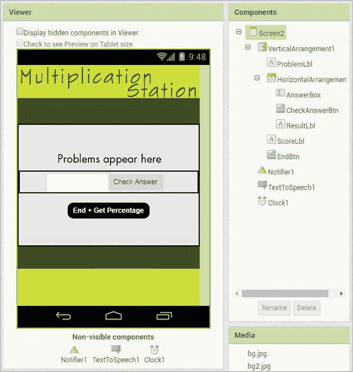

*图 4-4：在布局“乘法站”Screen2 后，查看器、组件和媒体窗格*

现在你已经布置好了所有组件，可以开始编程应用程序了！

### 编程“乘法站”

对于“乘法站”，我们需要为两个屏幕设置五个事件处理器。三个响应用户点击按钮时生成的事件。一个在我们设置的时间间隔时钟响起后控制应用程序的动作。另一个在屏幕初始化或打开时触发动作。我们还将创建七个变量来存储重要信息，并将使用一个`if then`块，其中嵌套另一个`if then`块。

点击**块**按钮切换到块编辑器，开始编程。

#### 步骤 1：播放欢迎信息

让我们从告诉应用程序在`Screen1`打开时该做什么开始——也就是说，我们希望`TextToSpeech`组件说出应用程序的欢迎信息。以下代码展示了在第一步中编程该行为的事件处理器。


通过选择项目名称右侧下拉框中的`Screen1`来切换回`Screen1`。在块面板中，点击`Screen1`并将`whenScreen1.Initialize`事件处理块 ➊ 拖到查看器中。然后，在块面板中点击`TextToSpeech1`，并将其调用`TextToSpeech1.Speak`内置方法块 ➋ 拖到`do`字旁边。接下来，在块面板中点击**Text**块面板，将一个空字符串块 ➌（面板中的第一个块）拖到`message`参数的插槽中。

`message`参数是`TextToSpeech1 Speak`方法所必需的，目的是让应用程序发声。通过点击空字符串块的文本区域并输入以下内容来添加该`message`：欢迎来到乘法站！你将有 5 秒钟的时间来回答每个问题。点击“开始练习”按钮开始。总的来说，这些块编程实现了应用程序的第一步，在应用程序打开时通过语音向用户问候。

#### 步骤 2：跳转到练习屏幕

除了听到欢迎信息，用户还应该看到`Button1`，点击它可以在`Screen2`中显示乘法问题。以下块处理此步骤。

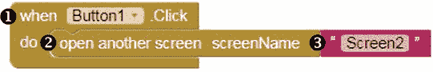

在“Blocks”面板中点击 Button1，并将“whenButton1.Click”代码块 ➊ 拖动到“Viewer”中。将“open another screen”代码块 ➋ 放入“whenButton1.Click”代码块的`do`旁边。从“Text”代码块抽屉中，拖入另一个空字符串代码块 ➌ 并将其放置在“open another screen”代码块上。将`Screen2`（我们要打开的屏幕的精确名称）输入到空字符串代码块中。现在，当用户点击`Button1`时，应用程序应该按照我们的计划打开`Screen2`。

为了查看这些代码块的运行效果，返回到“Screen1”，并按照《实时测试你的应用程序》中的说明，通过设备进行实时测试，详细内容参见第 xxii 页。当你点击顶部菜单栏的**“Connect”** ▸ **“AI Companion”**并使用手机的 AI2 Companion 应用扫描二维码时，“Multiplication Station”应用应该会在你的手机上打开。只要代码块放置正确，你应该会听到欢迎信息，并且在点击`Button1`后，应该会看到`Screen2`。现在，其他操作不应该发生。暂时关闭 AI2 Companion，我们稍后会重新连接以再次测试。

#### 步骤 3：显示随机乘法问题

现在我们来编写应用程序的第 3 步，即每 5 秒钟显示一个随机的乘法问题。当这种情况发生时，我们会对每个问题进行计数，以保持一个总数。确保你处于`Screen2`的“Blocks Editor”中来编写这一步的代码。

##### 设置全局变量

在这一步中，我们将使用三个全局变量：`a`和`b`用来存储乘法问题中的数字，`problems`用来存储问题的总数。我们将像这样创建并初始化这些全局变量。


对于每个变量，点击**“Variables”**代码块抽屉，将“initialize global name”代码块 ➊ 拖动到“Viewer”中，点击“name”并将其替换为变量的名称。然后从“Math”代码块抽屉中拖动一个 0 数字代码块 ➋，并将其放置在“initialize global”代码块上。因为这三个变量都是全局变量，所以它们可以在所有事件处理程序中使用，并且它们在我们的代码中是独立存在的，不属于任何事件处理程序块。

##### 选择要相乘的随机数字

接下来，我们将编写`Clock`的定时器程序。因为在设计器中我们保持了`Clock`的`TimerEnabled`属性的默认设置，所以当`Screen2`打开时，定时器应该会自动以 5 秒的间隔开始触发。以下事件处理程序代码块会在每次定时器触发时告诉应用程序该做什么。

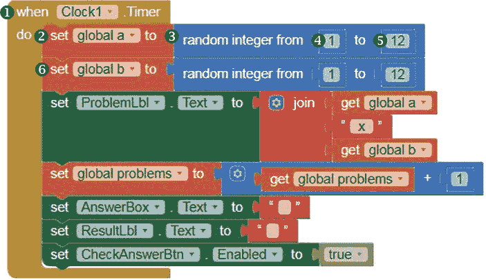

在“Blocks”面板中，点击“Clock1”，当组件的代码块出现时，将“whenClock1.Timer”代码块 ➊ 拖动到“Viewer”中。接下来，在“Blocks”面板中，点击**“Variables”**代码块抽屉，将“set global a to”代码块 ➋ 拖动到“Viewer”中，并将其放置在“whenClock1.Timer”代码块内，靠近`do`字样的位置。然后点击**“Math”**代码块抽屉，将一个“random integer”代码块 ➌ 拖动到“set global a to”代码块的右侧。

随机整数块将生成一个在指定范围内的随机整数。要设置这个范围，保持随机整数块左侧插槽中的`1`不变 ➍，点击右侧插槽中的 100，并将其替换为输入 12 ➎。

到目前为止，我们已经设置了变量`a`的值，这个值是每个乘法问题左侧的随机数字，将在应用中显示。为了设置变量`b`的数字，乘法问题的右侧，复制从➋到➎的块，将复制的块放在原块下方，并使用下拉箭头在复制的`set global`块中将`a`改为`b` ➏。

##### 显示问题

现在我们将添加块到`Timer`事件处理程序中，以便将乘法问题显示给用户，并放入`ProbemLbl`中。

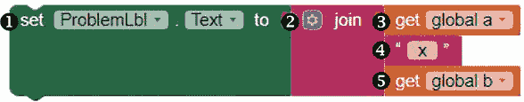

在“块”窗格中，点击`ProbemLbl`，拖动`setProblemLbl.Textto`块 ➊到查看器中，并将其固定在`set global b to`块下的`whenClock1.Timer`块内。然后点击**文本**块抽屉，拖动一个`join`块 ➋到查看器中，并将其固定在`setProblemLbl.Textto`块的右侧。这允许我们将`a`和`b`变量的随机数值以及乘法运算符×连接成一个字符串。例如，如果`a` = 3 且 `b` = 6，我们希望将它们与运算符连接，显示为 3 × 6。

首先，我们将在`join`块的两个默认输入框中添加另一个字符串输入框。为此，点击`join`左侧的蓝色变换图标，然后在弹出的对话框中拖动一个额外的字符串块到`join`块中。

然后，对于`join`块的顶部输入框，点击**变量**块抽屉，并拖动一个`get global a`块 ➌。对于`join`块的第二个输入框，从文本块抽屉中拖动一个空字符串块 ➍，点击空字符串块的文本区域并输入 x（在`x`前后加上空格）。然后，对于`join`块的底部输入框，再次点击**变量**块抽屉并拖动一个`get global b`块 ➎。现在，每 5 秒钟，这些块将获取`a`和`b`的新随机值，将它们与乘法运算符连接，并在`ProbemLbl`中显示乘法问题。

##### 计数已显示的问题数量

为了保持问题数量的总和，我们需要让应用在每次显示问题时进行计数。接下来的块将在`Timer`事件处理程序中实现这一功能。


点击**变量**块抽屉，将 set global problems to 块 ➊ 拖入 Viewer，并将其插入到 `setProblemLbl.Textto` 块下的 whenClock1.Timer 块内部。然后从数学块抽屉中拖动一个加法运算符块 ➋，并将其放置在 set global problems to 块的右侧。现在再次点击**变量**块抽屉，将 get global problems 块 ➌ 拖入加法块的左操作数插槽，再从数学块抽屉中拖入一个 1 数字块 ➍ 并将其放置到右操作数插槽中。这些块通过每 5 秒钟将 `problems` 变量的当前值加 1，持续计算并展示当前的数学问题。

##### 刷新 AnswerBox、ResultLbl 和 CheckAnswerBtn

每当 `Timer` 触发并显示一个新的数学问题时，我们需要应用程序做三件事情：

1.  清空 `AnswerBox` 中的任何文本，以便用户可以在一个干净的框中输入答案。

1.  移除任何先前答案的“正确！”或“不正确”文本。

1.  启用 `CheckAnswerBtn`，我们稍后将编程让应用在用户点击后暂时禁用该按钮。

以下块实现了这三项任务。

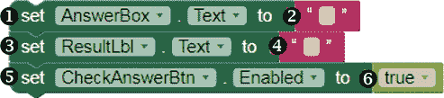

让我们准备好应用接受新问题的答案，并让 `CheckAnswerBtn` 来检查该答案。点击“Blocks”面板中的 AnswerBox，将其 setAnswerBox.Textto 块 ➊ 拖入 Viewer，并将其插入到 `set global problems to` 块下的 whenClock1.Timer 块内部。然后点击**文本**块抽屉，拖入一个空字符串块 ➋，并将其放置在 setAnswerBox.Textto 块的右侧。

在“Blocks”面板中点击 ResultLbl，拖动其 setResultLbl.Textto 块 ➌ 到 Viewer，并将其插入到 `setAnswerBox.Textto` 块下的 whenClock1.Timer 块内部。接着点击**文本**块抽屉，拖入另一个空字符串块 ➍，并将其放置在 setResultLbl.Textto 块的右侧。

在“Blocks”面板中点击 CheckAnswerBtn，拖动其 setCheckAnswerBtn.Enabledto 块 ➎ 到 Viewer，并将其插入到 `setResultLbl.Textto` 块下的 whenClock1.Timer 块内部。接着点击**逻辑**块抽屉，拖入一个 true 块 ➏，并将其放置在 setCheckAnswerBtn.Enabledto 块的右侧。

现在进行实时测试，看看这些块是如何工作的。如果在尝试重新连接 AI2 Companion 应用时，AI2 Companion 按钮被禁用，点击顶部菜单栏中的**连接** ▸ **重置连接**。然后，点击**连接** ▸ **AI Companion**，并使用设备的 AI2 Companion 应用扫描二维码。你应该仍然能看到 `Screen2`，因为你在工作时连接了 AI2 Companion。

应用程序启动后 5 秒钟，你应该看到一个乘法题替代“Problems appear here”显示出来，之后每 5 秒钟显示一个新问题。同时，如果你在`AnswerBox`中输入数字，它们应该在 5 秒后消失。如果你没有看到任何乘法题，问题没有按照预期显示，或者答案在每个 5 秒的间隔后没有消失，调试你的代码并再次测试。

接下来，我们将告诉应用程序当用户点击“检查答案”按钮时该做什么。

#### 第 4 步：检查答案

让我们编写应用程序的第 4 步，用户点击`CheckAnswerBtn`时的功能。首先，我们需要判断用户是否在`AnswerBox`中输入了内容。如果输入了，我们将编写代码使应用程序评估答案，并通过语音和在标签中显示结果来指示答案是否正确。如果答案正确，应用程序将把得分增加 1。如果用户在没有输入任何内容的情况下点击`CheckAnswerBtn`，应用程序将显示一个警告。在这一步中，你是在*验证*用户输入，这意味着检查用户是否输入了所需的数据类型。程序员通常会验证用户表单输入，并且只有在输入有效时才使用它，或者在输入无效时通知用户。

我们将通过创建和初始化三个全局变量来开始编写这一步的代码。创建`answer`、`c`和`score`这三个变量。然后将`answer`初始化为一个空字符串块（来自文本块抽屉），将`c`和`score`初始化为`0`。这些变量应该像下面这样。


我们将使用这些变量来存储用户的答案（`answer`）、正确答案（`c`）和用户的得分（`score`）。

##### 测试我们的第一个条件：检查是否存在答案

现在，让我们编写`CheckAnswerBtn`事件处理程序，其中包含两个`if then`块，一个嵌套在另一个的`then`插槽内。这意味着，如果第一个`if then`条件为真，应用程序将需要测试另一个条件。第一个`if then`块测试用户是否在`AnswerBox`中输入了任何数字，如果输入了数字，应用程序将执行一组指令，如果输入框为空，则执行另一组指令。

如果用户输入了答案，第二个`if then`块将检查答案，并根据答案是否正确告诉应用程序该怎么做。以下是编写这个嵌套条件的代码。

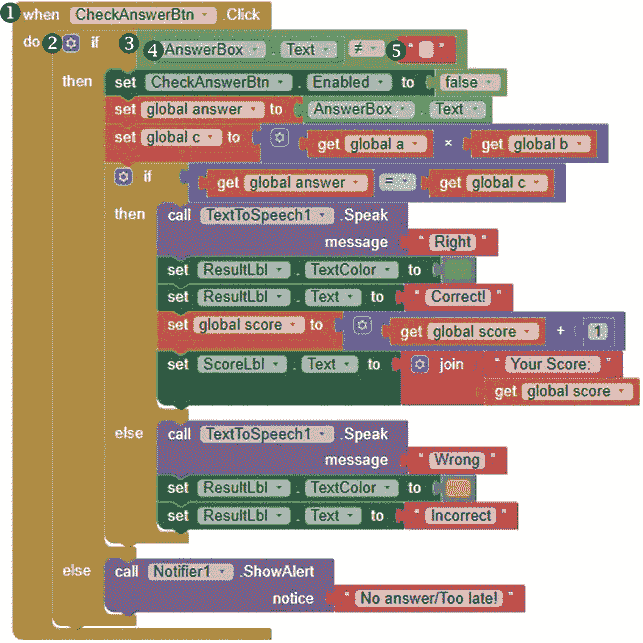

要放置测试用户是否输入答案的模块，请在模块面板中点击 CheckAnswerBtn，将其 whenCheckAnswerBtn.Click 模块 ➊ 拖入到查看器中。然后，在模块面板中点击**控制**模块抽屉，拖动一个 if then 模块 ➋ 到查看器中，并将其固定在 whenCheckAnswerBtn.Click 模块中的`do`旁边。由于我们将需要一个`else`语句来处理这个条件，请点击`if then`模块的蓝色变更器图标，并在弹出的对话框中将`else`模块拖入到 if then 模块内。

然后，从逻辑模块抽屉中，拖动一个=比较运算符模块 ➌ 放置到`if`旁边，并点击`=`符号旁的下拉箭头选择“不等于”符号，≠。为了填充≠模块的操作数插槽，在模块面板中点击 AnswerBox 并将其 AnswerBox.Text 模块 ➍ 拖入左侧插槽，然后点击**文本**模块抽屉，将一个空字符串模块 ➎ 拖入右侧插槽。我们现在已经设置好了检查`AnswerBox`是否为空的测试条件。

##### 准备评估用户的答案

现在我们将告诉应用程序，如果`AnswerBox`不为空，应该执行什么操作（如果为空的处理逻辑将在本章稍后编写）。如果`AnswerBox`不为空，我们希望应用程序禁用`CheckAnswerBtn`，这样用户就不能在应用程序检查当前答案时再次点击它。然后，我们希望应用程序将全局`answer`变量的值设置为用户输入到`AnswerBox`中的数字，以便稍后进行检查，并将全局`c`变量的值设置为全局`a`与全局`b`相乘的结果，即当前问题的正确答案。以下模块编程实现了这三项操作。


在模块面板中点击 CheckAnswerBtn，将其 setCheckAnswerBtn.Enabledto 模块 ➊ 拖入到查看器中，并将其固定到`then`旁边的 if then 模块。然后点击**逻辑**模块抽屉，拖动一个 false 模块 ➋，并将其固定到 setCheckAnswerBtn.Enabledto 模块的右侧。这样可以防止用户在应用程序检查答案时再次点击`CheckAnswerBtn`。

接下来，点击**变量**模块抽屉，将设置全局答案的模块拖入`setCheckAnswerBtn.Enabledto`模块下的 if then 模块 ➌。然后在模块面板中点击 AnswerBox，将其 AnswerBox.Text 模块 ➍ 拖入并固定到设置全局答案模块的右侧。这将把`answer`变量的值设置为用户输入到`AnswerBox`中的数字，以便我们可以将该数字与正确答案进行比较。

现在，点击 **Variables** 块抽屉，将 set global c to 块 ➎ 拖动到 `set global answer to` 块下方的 if then 块中。然后点击 **Math** 块抽屉，拖动乘法运算符块 ➏ 并将其贴到 set global c to 块的右侧。为了填充乘法块的操作数插槽，点击 **Variables** 块抽屉，将 get global a 块 ➐ 拖动到左侧插槽，再将 get global b 块 ➑ 拖动到右侧插槽。这些块将变量 `c` 的值设置为变量 `a` 和变量 `b` 相乘的结果，这就是问题的正确答案。

到目前为止，块中显示的逻辑是：如果 `AnswerBox` 不为空，禁用 `CheckAnswerBtn`，然后将 `answer` 的值设置为用户输入的数字，并将 `c` 的值设置为正确答案。

##### 测试第二个条件：评估答案

现在，我们将告诉应用程序比较 `answer` 和 `c`，如果它们相等，就执行一个操作，表示用户的答案正确；如果不相等，则执行另一个操作，表示用户的答案错误。

我们将从放置设置第二个测试条件的块开始。


在 Blocks 面板中，点击 **Control** 块抽屉，并将另一个 if then 块 ➊ 拖动到 Viewer 中，放置在 `set global c to` 块下方的第一个 if then 块内。然后，点击这个新建的 `if then` 块左侧的蓝色变更图标，拖动一个 else 块到打开的对话框中的 if then 块中。

然后，从 Math 块抽屉中拖动一个 = 比较操作符块 ➋ 到 `if` 字样旁。为了填充 `=` 块的操作数插槽，点击 **Variables** 块抽屉，将 get global answer 块 ➌ 拖动到左侧插槽，再将 get global c 块 ➍ 拖动到右侧插槽。这些块设置了我们的第二个测试条件，并检查用户的答案是否与正确答案匹配。

##### 处理正确答案

接下来的块将告诉应用程序如果两个变量的值相同，即用户的答案正确，应该执行什么操作。

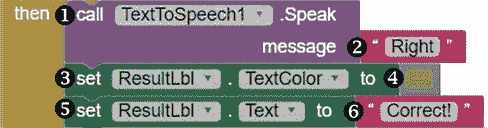

在 Blocks 面板中点击 TextToSpeech1，并将其 callTextToSpeech1.Speak 块 ➊ 拖动到 `then` 字样旁边的第二个 if then 块中。通过从 Text 抽屉拖动一个空字符串块 ➋ 到 `message` 字段旁，将 `message` 参数设置为 `Right`，然后点击字符串块的文本区域并输入 Right。

接下来，点击 Blocks 面板中的 ResultLbl，并将其 setResultLbl.TextColorto 块 ➌ 拖动到 `callTextToSpeech1.Speak` 块下方的第二个 if then 块中。然后点击 **Colors** 块抽屉，拖动绿色颜色块 ➍，并将其贴到 setResultLbl.TextColorto 块的右侧。

现在再次点击 Blocks 面板中的 ResultLbl，并将其 setResultLbl.Textto 块 ➎ 拖动到 `setResultLbl.TextColorto` 块下的第二个 if then 块中。点击 **Text** 块抽屉，拖动一个空的文本字符串块 ➏，将其对接到 setResultLbl.Textto 块的右侧，并在文本字符串块的文本区域输入 "Correct!"。如果用户的答案正确，这些块会指示应用程序这样做，并将结果以绿色显示在 `Label` 中。

现在我们暂停一下，再次进行现场测试。如果你已经按照所示放置了这些块，在输入正确答案并点击 `CheckAnswerBtn` 后，你应该会听到设备说“Right”，并看到 "Correct!" 以绿色文本显示在 `CheckAnswerBtn` 右侧。另外，如果你在应用程序检查你的答案之前尝试再次点击 `CheckAnswerBtn`，按钮应该无法操作。输入错误答案时，仍然不会有任何反应。确保这一部分应用程序正常工作后，再继续进行下一步。

##### 增加分数

接下来的块会增加并显示用户的分数，这意味着我们首先需要让应用程序统计每个用户答对的题目。


为了编程此部分，点击 **Variables** 块抽屉，拖动 set global score to 块 ➊ 到 Viewer，并将其对接到 `setResultLbl.Textto` 块下的第二个 if then 块中。然后从 Math 抽屉中拖动一个加法运算符块 ➋，将其对接到 set global score to 块的右侧。现在再次点击 **Variables** 块抽屉，拖动 get global score 块 ➌ 进入加法块的左操作数插座，再从 **Math** 抽屉中拖动一个 1 数字块 ➍ 进入其右操作数插座。这些块会在用户每次正确回答问题时，将 1 加到 `score` 变量的当前值上。

接下来的块会在 `ScoreLbl` 中显示用户的分数。在 Blocks 面板中，点击 ScoreLbl，拖动 setScoreLbl.Textto 块 ➎ 到 Viewer，并将其对接到 `set global score to` 块下的第二个 if then 块中。然后点击 **Text** 块抽屉，拖动一个 join 块 ➏ 到 Viewer，并将其对接到 setScoreLbl.Textto 块的右侧。

对于 `join` 块的上方输入，拖动一个空的字符串块 ➐ 从 Text 块抽屉中，点击字符串块的文本区域，输入 "Your Score: "（冒号后带一个空格）。然后，对于 `join` 块的下方输入，点击 **Variables** 块抽屉，拖动 get global score 块 ➑。

让我们暂停一下，再次进行现场测试。如果你已经按照所示放置了这些块，在输入正确答案并点击 `CheckAnswerBtn` 后，你应该会看到 `AnswerBox` 下方的 `ScoreLbl` 中显示分数。输入错误答案时，不应有任何反应。确保这一部分应用程序正常工作后，再继续进行下一步。

##### 处理错误答案

之前部分的块告诉应用程序，当用户回答问题正确时该做什么。这些显示的块完成了第二个`if then else`块的`else`部分，并引导应用程序在用户的答案错误时的行为。

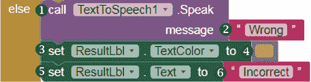

首先，我们将放置使应用程序发声的块，以告诉用户答案是错误的。点击块面板中的 TextToSpeech1，并将其 callTextToSpeech1.Speak 块 ➊拖到`else`旁边的第二个 if then 块中。通过从 Text 抽屉中将一个空字符串块 ➋拖到`message`旁边的空白区域，将其消息设置为“Wrong”，然后点击该字符串块的文本区域并输入 Wrong。

接下来，点击块面板中的 ResultLbl，拖动其 setResultLbl.TextColorto 块 ➌到第二个 if then 块下的第二个`callTextToSpeech1.Speak`块中。然后点击**Colors**块抽屉，拖动粉色颜色块 ➍，并将其连接到 setResultLbl.TextColorto 块的右侧。

然后再次点击块面板中的 ResultLbl，拖动其 setResultLbl.Textto 块 ➎到第二个`setResultLbl.TextColorto`块下的第二个 if then 块中。现在点击**Text**块抽屉，拖动一个空的文本字符串块 ➏，将其连接到 setResultLbl.Textto 块的右侧，并在文本字符串块的文本区域中输入 Incorrect。如果用户的答案不正确，这些块将使应用程序说出这一点，并在`ResultLbl`中以粉色显示该结果。

现在通过输入错误答案并点击 CheckAnswerBtn 进行实时测试。如果你按照示例放置了块，你现在应该能听到设备说“Wrong”，并看到“Incorrect”以粉色文本显示在`CheckAnswerBtn`的右侧。在继续之前，请确保应用程序的这一部分能够正确工作。

##### 处理空的答案框

到目前为止，这些步骤中的块已经告诉应用程序，当用户在`AnswerBox`中输入数字并点击`CheckAnswerBtn`时应该做什么。现在，使用以下块，我们告诉应用程序当用户点击`CheckAnswerBtn`时，`AnswerBox`为空该如何处理。


点击 Notifier1，并将其 callNotifier1.ShowAlert 内置方法块 ➊拖到第二个`else`插槽中。然后，在块面板中，点击**Text**块抽屉，拖动一个空字符串块 ➋到该方法`notice`参数的插槽中。

这个`notice`参数保存了方法需要的信息，以便显示一个警报。通过点击字符串块的文本区域并输入“No answer/Too late!”来添加该`notice`。这些块指示应用程序在用户点击`CheckAnswerBtn`但未输入答案时，显示一个小的弹出通知。

现在你已经完全编写了`CheckAnswerBtn`的代码，让我们再次进行现场测试。如果你按照示例放置了积木，在输入答案并点击`CheckAnswerBtn`后，你应该能听到并看到答案是对还是错，并且应该看到分数显示在`AnswerBox`下方的`ScoreLbl`中。如果你点击了`CheckAnswerBtn`但没有及时输入答案，应该会看到一个弹出警告。如果这个操作的任何部分工作不正确，请调试你的程序。一旦`CheckAnswerBtn`按钮正常工作，关闭你设备上的 AI2 Companion，让我们继续编程应用的最后一部分：`EndBtn`的事件处理器。

#### 第 5 步：结束练习并显示最终分数

现在让我们编写应用的第 5 步代码，用户按下`EndBtn`停止练习并查看最终分数及正确问题的百分比。我们为这一部分创建一个额外的全局变量`percentage`，并将其初始化为`0`。


现在我们可以按照下面的方式编程`EndBtn`事件处理器。

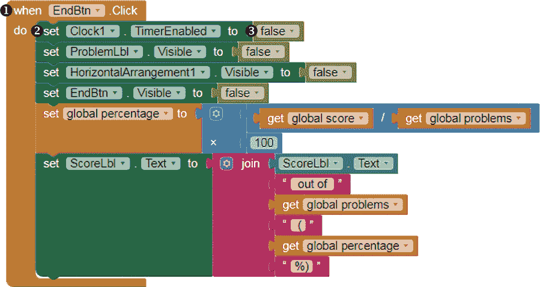

一旦用户点击按钮，我们需要做的第一件事是停止每 5 秒显示一个新问题。为此，点击积木面板中的`EndBtn`，将`whenEndBtn.Click`积木➊拖动到视图器中。然后点击`Clock1`，将`setClock1.TimerEnabledto`积木➋拖到视图器中，并将其放置在`whenEndBtn.Click`积木旁边的`do`位置。接着，在积木面板中，点击**逻辑**积木抽屉，拖动`false`积木➌到视图器中，并将其放置在`setClock1.TimerEnabledto`积木的右侧。这些积木会禁用`Clock`的计时器，从而停止显示新问题。

##### 隐藏不需要的元素

我们还希望`ProblemLbl`、`HorizontalArrangement1`（包含`AnswerBox`、`CheckAnswerBtn`和`ResultLbl`）以及`EndBtn`消失，因为我们不再需要它们在屏幕上显示。以下是隐藏用户不再需要的组件的积木。

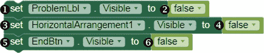

要编程这个行为，点击`ProblemLbl`在积木面板中，拖动`setProblemLbl.Visibleto`积木➊到视图器中，并将其放置在`whenEndBtn.Click`积木的`setClock1.TimerEnabledto`积木下。然后，在积木面板中，点击**逻辑**积木抽屉，拖动`false`积木➋到视图器中，并将其放置在`setProblemLbl.Visibleto`积木的右侧。

这些积木将`ProblemLbl`的`Visible`属性重置为`false`，这样当用户点击`EndBtn`后，问题就不会显示。现在将这些积木放置在➌、➍、➎和➏位置，应用于`HorizontalArrangement1`和`EndBtn`，这样当点击`EndBtn`后，用户在屏幕上看到的只会是分数和正确率。

##### 计算正确答案的百分比

应用需要在显示正确答案百分比之前进行计算。以下积木将告诉应用如何计算并存储用户的百分比。


点击**变量**块抽屉，拖入设置全局百分比的块 ➊ 到查看器，并将其固定在`setEndBtn.Visibleto`块下的 whenEndBtn.Click 块内。然后从数学块抽屉中拖入一个乘法运算符块 ➋，并将其固定在设置全局百分比块的右侧。

现在再次点击**数学**块抽屉，将一个除法运算符块 ➌ 拖入乘法块的第一个操作数插槽，并将一个 100 数字块 ➍ 拖入乘法块的第二个操作数插槽。返回到变量块抽屉，将获取全局分数块 ➎ 拖入除法块的左侧操作数插槽，将获取全局问题块 ➏ 拖入其右侧操作数插槽。这些块通过将用户的分数除以问题总数并将结果乘以 100，来计算正确回答问题的百分比。

##### 显示正确答案百分比

现在，我们将用这些块来为用户显示百分比。

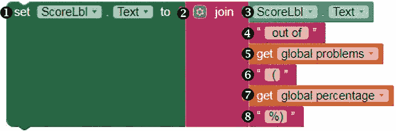

在块面板中，点击 ScoreLbl，将设置 ScoreLbl.Textto 块 ➊ 拖入查看器，并将其固定在`set global percentage to`块下的 whenEndBtn.Click 块内。然后点击**文本**块抽屉，将一个`join`块 ➋ 拖入查看器，并将其固定在设置 ScoreLbl.Textto 块的右侧。现在，点击`join`块的突变器图标，添加另一个四个字符串输入插槽。

对于`join`块的第一个输入，点击 ScoreLbl 并拖入其 ScoreLbl.Text 块 ➌。对于`join`块的第二个输入，从文本块抽屉中拖入一个空字符串块 ➍，点击字符串块的文本区域，输入“out of”（包括单词`out`前后的空格）。对于`join`块的第三个输入，点击**变量**块抽屉并拖入获取全局问题块 ➎。

对于其第四个输入，从文本块抽屉中再拖入一个空字符串块 ➏，点击字符串块的文本区域，输入“(”，包括括号前的空格。对于第五个输入，再次点击**变量**块抽屉并拖入获取全局百分比块 ➐。最后，对于`join`块的底部输入，从文本块抽屉中拖入一个空字符串块 ➑，点击字符串块的文本区域，输入“%)”。

这些块将显示用户的分数和正确回答的百分比。例如，如果用户的分数是 20，问题总数是 100，`ScoreLbl`应该显示“Your Score: 20 out of 100 (20%)”。

### 测试应用程序

现在我们可以测试完成的应用程序！首先，通过在块查看器上方的下拉菜单中选择`Screen1`，返回到`Screen1`。然后，通过点击顶部菜单栏中的**Connect** ▸ **Reset Connection**，再点击**Connect** ▸ **AI Companion**，重置与 AI2 Companion 的连接。接下来，使用设备上的 AI2 Companion 应用扫描二维码。

当应用程序在您的设备上打开时，您应该听到欢迎信息。点击**开始练习**以进入下一屏幕。此时，您应该看到每 5 秒钟出现一个新问题，点击检查答案时，如果您的`TextBox`不为空，您应该听到并看到答案是否正确，并在`AnswerBox`下方显示分数。如果点击检查答案时没有输入答案，您应该看到一个弹出警告。

现在点击 EndBtn，除了`ScoreLbl`外，所有组件应该从屏幕上消失，并正确显示您的得分和正确问题的百分比。如果您正确放置了模块，应用程序应该按预期工作。您已经成功创建了“乘法站”测验应用程序！

### 总结

在本章中，您构建了“乘法站”测验应用程序，用户回答随机的定时乘法问题，了解他们的答案是否正确，正确回答时获得分数，并查看得分和正确回答问题的百分比。

在构建这个应用程序的过程中，您学习了如何使用复杂的选择控制结构，该结构通过评估条件并做出决策来控制程序的流程。为此，您使用了 App Inventor 的控制模块、伪随机数生成器以及数学和逻辑运算符模块。您还创建并操作了存储在多个变量中的数据，并学会了使用`TextToSpeech`和`Notifier`组件与应用程序用户进行沟通。

在下一章中，您将学习如何使用列表模块创建和处理列表，随着我们构建“击败公交车”应用程序，该应用程序利用您的设备的 GPS 和定位能力，显示您学校公交车的位置，并定期向您的朋友或家人发送沿途更新的短信。

### 独立完成

在您修改和扩展“乘法站”应用程序以进行以下练习时，保存新的版本。您可以在线查找解决方案，地址是 *[`nostarch.com/programwithappinventor/`](https://nostarch.com/programwithappinventor/)*。

1.  更改应用程序，使得如果用户的答案错误，新的问题停止出现，应用程序会显示正确答案，然后用户可以继续练习。应用程序将在哪里显示正确答案？如果用户希望继续，如何恢复练习？您是否需要另一个`if then`块、额外的组件或更多的变量？

1.  扩展应用程序，使得用户可以选择练习乘法或除法。您的算法将如何变化？您需要添加和修改哪些组件和模块？
