## BEAT THE BUS：使用地图和传感器追踪位置**

在第三章和第四章中，我们使用变量来存储和处理信息，这使得我们能够跟踪并向用户报告数据。在“Fruit Loot”和“Multiplication Station”应用中，我们创建了一个个持有单一值的变量，例如游戏得分、掉落的水果数量和正确的乘法题百分比。

但是，想象一下，如果我们能够在一个变量中存储和操作多个值，我们的应用程序将变得多么强大！例如，我们可以显示游戏的前十名得分，或者允许用户从 50 个州的列表中进行选择，而无需为每个得分或州创建一个不同的变量。

在大多数编程环境中，你可以将多个值存储在一种叫做*数组*的数据结构中。在 App Inventor 中，你可以使用内置的变量、列表和文本模块，将多个值存储在变量中。以下变量将多个值存储为一个列表。

你可以使用列表模块操作列表变量，通过向列表中添加项目、在列表中查找内容或从列表中移除项目来进行操作。你还可以通过引用其*索引*来访问每个列表项，索引是该项在列表中的位置。例如，`size` 列表中的第一个项目 `S` 位于索引 1，第二个项目位于索引 2，以此类推。

**注意**

*App Inventor 与大多数传统编程语言在索引编号上有所不同，后者将列表中的第一个项目编号为索引 0，第二个项目为索引 1，以此类推。*

在本章中，我们将处理四个包含*静态*（不变）预设值的列表。其中三个列表是相互关联的，你将使用一个列表的索引来访问另外两个列表中的值。我们还将创建我们的第一个本地变量，以简化一个相对复杂的事件处理器。

### 构建“Beat the Bus”应用

在本章中，除了刚才提到的四个列表外，你将使用 `ListPicker`、`LocationSensor`、`Texting` 以及一些 App Inventor 新增的 `Maps` 组件来创建“Beat the Bus”应用程序。这个应用可以让你的父母或朋友追踪你的位置信息，而无需使用他们手机上的 GPS 和位置感应功能，这样可以避免消耗他们的电池。相反，这个应用依赖于你自己设备上的位置传感器。

登录到 App Inventor，创建一个名为 BeatTheBus 的项目，然后点击**确定**。

### 拆解“Beat the Bus”

在“Beat the Bus”中，用户通过从预设的列表中选择电话号码和目的地来激活位置追踪功能。然后，应用会定期向选定的电话号码发送短信，显示用户在路线上的位置。

我们可以将应用拆解为以下步骤：

1.  当用户打开应用程序时，显示一个`地图`，展示用户的当前位置，并用`标记`指向用户的家。显示一个`ListPicker`供用户选择电话号码。一旦用户选择了号码，显示一个`ListPicker`供用户选择目的地。

1.  在用户选择目的地之前，从一个地点列表中设置`ListPicker`的选项。

1.  一旦用户选择了目的地，将`地图`和`标记`移至选定的目的地，并将起始位置和目的地通过短信发送到选择的号码。

1.  当用户的位置距离选择的目的地 5 英里或以内时，定期将用户的位置通过短信发送到选择的号码。

你将需要以下组件：

+   全局变量（4）用于存储电话号码、目的地、纬度和经度

+   用于应用程序设计的图片

+   ListPicker（2）用于让用户从电话号码和目的地列表中选择

+   本地变量，用于存储距离

+   LocationSensor，用于提供与用户位置相关的定期数据

+   显示用户地理位置并承载`标记`的地图

+   标记以指向用户选择的目的地

+   发送文本消息的短信功能

现在，让我们布置应用程序。

### 在设计器中布置“击败公交”

为了确保`Screen1`中的所有组件都居中显示在屏幕的顶部，点击 AlignHorizontal 下拉箭头并选择**Center: 3**。接下来，点击背景色下拉框中的**默认**并在颜色列表对话框中选择**黄色**，以将屏幕背景色更改为黄色。最后，取消选中 TitleVisible 复选框，以便在应用程序运行时隐藏屏幕标题。

接下来，让我们将所需的组件从调色板面板中的抽屉拖动到查看面板，并在过程中调整它们的属性。首先，从用户界面抽屉中拖动一个图片组件，并将其**高度**设置为**填充父级**。然后，通过点击**图片**下的文本框并按照“上传图片”中的说明上传图片，图片将显示在屏幕上。最后，勾选**ScalePictureToFit**复选框，使图片占满整个屏幕宽度。

要显示一个以用户起始位置为中心的`地图`，从地图抽屉中拖动一个地图组件到`Image1`下。请注意，必须先将一个`地图`组件放置在屏幕上，才能添加任何其他的`地图`组件。通过将`地图`的属性中的 CenterFromString 文本框替换为应用程序起始地址的*纬度*和*经度*，它们之间用逗号和空格分隔，来调整地图的属性。

**注意**

*你可以通过纬度和经度坐标在地图上定位任何地方。一个地方的纬度是它距离赤道的北或南的距离，而经度是它距离本初子午线的东或西的距离。你可以通过将街道地址输入到[`www.latlong.net/`](https://www.latlong.net/)的纬度/经度查找工具中，找到该地址的纬度和经度坐标。*

然后，若要将`Map`的高度更改为 50%，以便它占据屏幕的垂直一半，点击**Height**下的文本框；当对话框打开时，在`percent`旁边的文本框中输入 50 并点击**确定**（OK）。接着，将**宽度**（Width）设置为**填充父项**（Fill parent），勾选**ShowUser**复选框以便在`Map`上显示表示用户的图标，并通过在 ZoomLevel 文本框中输入 10 将`Map`的缩放级别从默认的 13 更改为 10。

现在，从地图面板中将一个标记（Marker）拖到`Map`上。在属性面板中，通过点击**纬度**（Latitude）下的文本框并输入用户家庭地址的纬度，然后点击**经度**（Longitude）下的文本框并输入其经度来调整`Marker`。

接下来，为了让用户选择一个目的地和一个电话号码来发送，首先在 Map1 下，从用户界面面板拖动两个 ListPicker 到视图中。将 ListPicker1 重命名为 NumberPicker，将 ListPicker2 重命名为 PlacePicker。在这两个 ListPicker 的属性面板中，通过点击**默认**（BackgroundColor）并在颜色对话框中选择**黄色**来更改背景颜色。然后通过勾选 FontBold 下的复选框使文本加粗，并在**FontSize**文本框中输入 25 来增大文本大小。将`ListPicker1`的默认文本`Text for ListPicker1`替换为在**Text**文本框中输入“选择一个号码”，并将`ListPicker2`的默认文本`Text for ListPicker2`替换为在**Text**文本框中输入“选择一个地点”。

将两个`ListPicker`的**宽度**（Width）更改为**填充父项**（Fill parent），然后通过点击**默认**（ItemTextColor）并在颜色对话框中选择**黄色**来更改选择下拉菜单中项目的颜色。接着，在 PlacePicker 的属性面板中，取消勾选**Visible**复选框，以使`PlacePicker`在应用程序首次打开时不显示。我们稍后会编程使它在用户选择电话号码后显示出来。

最后，拖入不可见的组件：从传感器面板中拖入`LocationSensor`组件，从社交面板中拖入`Texting`组件。在属性面板中，将`LocationSensor`的 TimeInterval 从默认的 60,000 毫秒更改为 1,000，方法是选择 TimeInterval 下拉框中的**1000**。这意味着如果位置数据可用并且位置自上次间隔以来发生了变化，应用程序的`LocationSensor`将每秒报告一次位置变化。我们进行此更改是为了之后能够编程让应用程序在新数据可用后每秒更新一次位置数据并发送短信。

现在我们已经添加了`LocationSensor1`，点击组件面板中的地图，在其属性面板中选择其关联的`LocationSensor`，方法是点击 LocationSensor 下的**无**，在弹出的对话框中选择 LocationSensor1，并点击**确定**。

`Screen1`应类似于图 5-1。

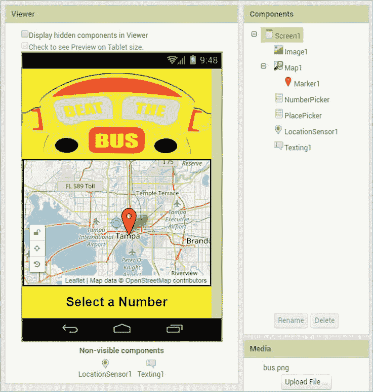

*图 5-1：布局“Beat the Bus”后的查看器、组件和媒体面板*

在查看器面板中，您应该能看到屏幕上的所有可见组件，以及`Screen1`下的不可见组件。在组件面板中，您应该能看到您拖动到查看器面板上的每个组件。在媒体面板中，您应该能看到您上传的图片。

### 编程“Beat the Bus”

现在您已经布局好了所有组件，准备在块编辑器中编写应用程序代码。对于“Beat the Bus”，我们将编写五个事件处理程序。其中四个响应与两个`ListPicker`相关的事件，另一个则在`LocationSensor`检测到位置变化时指导应用程序的动作。我们还将创建四个全局列表变量和一个局部变量来存储重要信息，并使用两个`if then`块来测试条件，以指导应用程序的流程。

点击**块**按钮切换到块编辑器，接下来我们开始编程应用程序的四个步骤。

#### 步骤 1：选择要发送短信的电话号码

当屏幕打开时，我们希望用户能够看到`Map`和`Marker`，它们都具有我们在设计器中设置的属性。我们还希望显示`NumberPicker`，用户可以从中选择一个电话号码，供应用程序发送短信。我们将从告知应用程序在用户点击`NumberPicker`并选择一个号码之前和之后该做什么开始编写代码。

##### 创建全局列表变量

我们将使用一个全局列表变量来存储`NumberPicker`中的电话号码，通过创建并初始化`phoneNumbers`变量来实现。

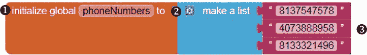

点击**变量**块面板，拖动一个初始化全局名称块 ➊ 到查看器中，点击名称并将其替换为 phoneNumbers。然后从列表面板中拖动一个创建列表块 ➋，并将其附加到初始化全局 phoneNumbers 块的右侧。

现在，为了将三个电话号码添加到列表中，我们需要向`make a list`块的两个默认输入中再添加一个列表项输入。点击`make a list`左侧的蓝色变动器图标，在打开的对话框中拖动一个额外的项目块到`make a list`块中。

然后，从文本抽屉中拖动三个空字符串块 ➌，并将它们连接到创建列表块的插槽中。将一个电话号码输入到每个空字符串块中，不要添加任何破折号或空格（如果没有电话号码，可以输入 1111111）。这些块一起创建了全局的`phoneNumbers`变量，我们可以在所有事件处理程序中使用它。

##### 处理 NumberPicker 的 BeforePicking 事件

既然我们已经创建了`phoneNumbers`，我们就拥有了`NumberPicker`所需的数据。在用户从`NumberPicker`中选择之前，我们希望应用程序将用户在`NumberPicker`中看到的选择项设置为`phoneNumbers`中的项目。然后，在用户选择一个电话号码后，我们希望`NumberPicker`消失，取而代之的是`PlacePicker`。以下是我们为第一步所需的事件处理程序。

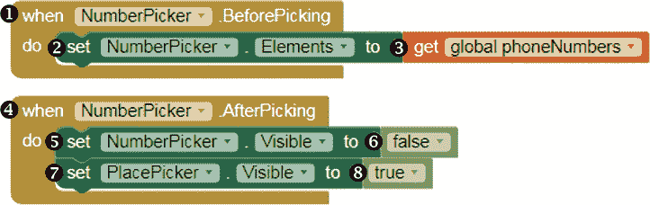

在块面板中，点击`NumberPicker`，并将`whenNumberPicker.BeforePicking`事件处理程序块 ➊ 拖动到查看器中。接着，再次点击`NumberPicker`，将其`setNumberPicker.Elementsto`块 ➋ 拖动到`do`字样的旁边。接下来，在块面板中，点击**变量**块抽屉，将`get global phoneNumbers`块 ➌ 拖动到`setNumberPicker.Elementsto`块的右侧。这三块组合成了`BeforePicking`事件处理程序，它将用户在`NumberPicker`中看到的电话号码选择设置为`phoneNumbers`变量中的电话号码。接下来，我们将创建`AfterPicking`事件的处理程序。

##### 处理 NumberPicker 的 AfterPicking 事件

为了在用户选择电话号码后将`NumberPicker`替换为`PlacePicker`，将`whenNumberPicker.AfterPicking`事件处理程序块 ➍ 拖动到查看器中。接着，拖动`setNumberPicker.Visibleto`块 ➎ 放到`do`字样的旁边。接下来，点击**逻辑**块抽屉，将`false`块 ➏ 拖动到`setNumberPicker.Visibleto`块的右侧。然后，在块面板中点击`PlacePicker`，并将`setPlacePicker.Visibleto`块 ➐ 放到`setNumberPicker.Visibleto`块下方。最后，再次点击**逻辑**块抽屉，将`true`块 ➑ 拖动到`setPlacePicker.Visibleto`块的右侧。

要查看步骤 1 中的模块如何工作，请按照《实时测试你的应用》中的说明，在手机上进行实时测试，具体见第 xxii 页。一旦你点击顶部菜单栏中的**连接** ▸ **AI Companion**，并使用手机的 AI2 Companion 应用扫描二维码，你的“Beat the Bus”应用应该会在手机上打开。只要模块按图示放置，在应用程序的标题图像下方，你应该能看到`Map`，其中的`Marker`指向你在设计器中的属性窗格设置的纬度和经度。如果你的当前位置和`Marker`指示的点都在`Map`的缩放级别下可见，你可能还会看到一个用户图标位于当前位置。

在地图下方，你应该看到`NumberPicker`。点击它后，`phoneNumbers`变量中的数字列表应该会出现，选择其中一个后，`NumberPicker`应该消失，`PlacePicker`应该出现。现在只需要这些功能。保持应用程序在手机上打开，以便进行实时测试。

#### 步骤 2：选择目的地

在步骤 2 中，为了编写`PlacePicker`的`BeforePicking`事件代码，我们需要创建一个新的全局列表变量，叫做`places`，用于存储我们将展示给用户的地点选择。我们还将创建两个相关的全局列表变量：`placeLats`，用于存储目的地选项的纬度，以及`placeLongs`，用于存储经度。

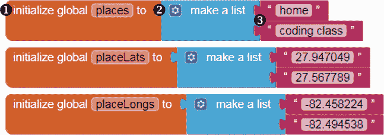

通过将这些创建为全局变量，我们可以在`PlacePicker`的`BeforePicking`事件处理程序中以及应用程序中的所有其他处理程序中使用它们，以访问用户选择位置的名称、纬度和经度。

##### 创建额外的全局列表变量

对于每个变量，点击**变量**模块抽屉，拖动一个初始化全局名称模块 ➊ 到查看器中，点击名称并将其替换为变量名。然后，从列表模块抽屉拖动一个创建列表模块 ➋ 并将其与初始化全局模块的右侧对接。最后，从文本模块抽屉中拖动两个空字符串模块 ➌，并将其插入到创建列表模块的插槽中，输入数据到每个空字符串模块中。

当你输入`placeLats`和`placeLongs`的数据时，确保将坐标值放置在与`places`变量中相应项目相同的位置。例如，你为`placeLats`输入的第一个值应该是`places`变量中第一个值的纬度，这个值是列表中的`home`。你为`placeLongs`输入的第一个值应该是`places`变量中第一个值的经度。同样，为`placeLats`输入的第二个值必须是`places`变量中第二个值的纬度（该列表中的`coding class`），而为`placeLongs`输入的第二个值应该是`places`中第二个值的经度。

##### 处理 PlacePicker 的 BeforePicking 事件

现在我们已经创建了`places`，我们拥有了`PlacePicker`所需的数据。在用户可以从`PlacePicker`中选择之前，我们希望应用程序将用户看到的选项设置为`places`中的项目。`PlacePicker BeforePicking`事件处理程序实现了这一点。

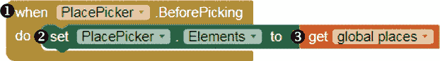

在“块”面板中，点击 PlacePicker 并拖动`whenPlacePicker.BeforePicking`事件处理程序块 ➊到“查看器”中。然后，再次点击 PlacePicker 并将其`setPlacePicker.Elementsto`块 ➋拖动到`do`单词旁边。接下来，在“块”面板中，点击**变量**块抽屉，并将`get global places`块 ➌拖到`setPlacePicker.Elementsto`块的右侧。这三个块创建了`BeforePicking`事件处理程序，该事件处理程序将用户在`PlacePicker`中看到的目的地选项设置为`places`变量中的项目。

要查看这些新块如何工作，请再次进行实时测试。如果按图示放置了这些块，一旦你选择了一个数字并且`NumberPicker`消失后，你应该看到`PlacePicker`。当你点击它时，`places`变量中的目的地列表应该会出现，之后当你选择一个目的地时，现在应该没有其他操作发生。

#### 步骤 3：开始位置追踪

现在我们来编程`PlacePicker AfterPicking`事件处理程序。

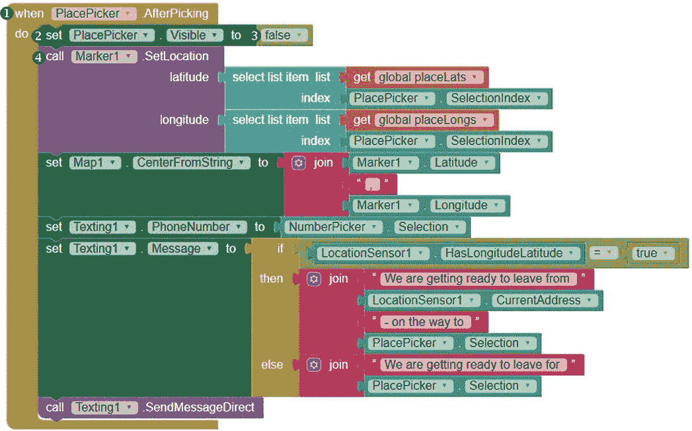

这些块使得`PlacePicker`消失，将`Marker`移到用户选择的目的地，并将`Map`的中心设定为该位置。它们还指示应用程序将用户的起始位置和目的地文本发送到选定的电话号码。

##### 让 PlacePicker 消失

在“块”面板中，点击 PlacePicker 并拖动`whenPlacePicker.AfterPicking`事件处理程序块 ➊到“查看器”中。然后，再次点击 PlacePicker 并将其`setPlacePicker.Visibleto`块 ➋拖动到`do`单词旁边。接下来，在“块”面板中，点击**逻辑**块抽屉，拖动`false`块 ➌到“查看器”中，并将其放置在`setPlacePicker.Visibleto`块的右侧。这些块使得`PlacePicker`在用户选择目的地后消失。

##### 重置地图标记位置

现在我们将添加设置`Marker`位置为用户选择的目的地的块。在“块”面板中，点击 Marker1，拖动`callMarker1.SetLocation`方法块 ➍到“查看器”中，并将其嵌套到`whenPlacePicker.AfterPicking`块下的`setPlacePicker.Visibleto`块中。`Marker1 SetLocation`方法需要两个参数——`latitude`和`longitude`，并将`Marker1`在`Map`上设置为提供的纬度和经度位置。我们希望这些值是用户在`PlacePicker`中选择的目的地的纬度和经度，这些值来自`placeLats`和`placeLongs`变量。

##### 设置地图标记的纬度和经度

让我们仔细看看 `AfterPicking` 事件处理程序中的代码块，这些代码块将 `latitude` 和 `longitude` 参数传递给 `Marker1 SetLocation` 方法，从而设置用户目的地的纬度和经度。

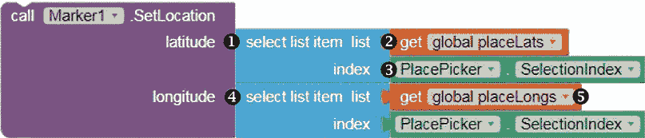

点击 **列表** 代码块抽屉，将一个选择列表项代码块 ➊ 拖到查看器中，并将其对齐到 `Marker1.SetLocation` 调用块的右侧，紧挨着 `latitude` 这个词。`select list item` 代码块需要 `list` 和 `index` 两个参数，接着它会从提供的 `list` 中选择指定 `index` 位置的项。

为了提供这些参数，点击 **变量** 代码块抽屉，将获取全局 `placeLats` 代码块 ➋ 拖到 `select list item` 代码块的右侧，放置在 `list` 旁边。然后点击 `PlacePicker`，将 `PlacePicker.SelectionIndex` 代码块 ➌ 拖到 `index` 旁边。

这些代码块将 `select list item` 代码块的 `list` 参数设置为 `placeLats` 变量，并将 `index` 参数设置为 `PlacePicker.SelectionIndex`（这是用户在相关 `PlacePicker` 中选择的项的索引，数据来自 `places` 变量）。例如，如果用户选择了 `home` 作为目的地，`PlacePicker.SelectionIndex` 将等于 `1`，因为 `home` 是 `PlacePicker` 中第一个元素，数据来自 `places` 变量。如果用户选择了 `coding class`，`PlacePicker.SelectionIndex` 将等于 2。总之，这些代码块将 `Marker1` 的纬度设置为 `placeLats` 变量中对应 `PlacePicker.SelectionIndex` 位置的纬度值，也就是用户所选择的目的地的纬度。

为了设置 `Marker1` 的经度，复制 ➊、➋ 和 ➌ 位置的代码块，并将复制的代码块对齐到 `Marker1.SetLocation` 调用块的右侧，紧挨着 `longitude` 这个词 ➍。然后通过点击 `get global placeLats` 旁边的下拉箭头，选择 `get global placeLongs` ➎ 来更改复制块中的 `list` 参数。这些代码块将 `Marker1` 的经度设置为 `placeLongs` 变量中对应 `PlacePicker.SelectionIndex` 位置的经度值。应用程序将使用这个经度和我们刚刚设置的纬度，将 `Marker1` 移动到用户选择的目的地。

##### 重新定位地图

现在，让我们添加代码块，将 `Map` 重新定位到相同位置——即用户选择的目的地。

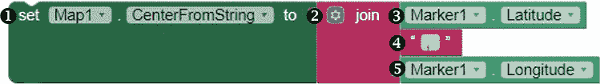

在代码块面板中，点击 `Map1`，将 `setMap1.CenterFromStringto` 代码块 ➊ 拖到查看器中，并将其放置在 `whenPlacePicker.AfterPicking` 代码块内，紧接在 `callMarker1.SetLocation` 方法块下。接着，点击 **文本** 代码块抽屉，将 `join` 代码块 ➋ 拖到查看器中。通过点击 `join` 左侧的蓝色变异图标并拖动一个额外的字符串块到打开的对话框中，向其添加一个输入。

接下来，对于`join`块的顶部输入，点击 Blocks 面板中的 Marker1，并拖入 Marker1.Latitude 块➌。对于`join`块的第二个输入，从**Text**块抽屉中拖入一个空字符串块➍，点击字符串块的文本区域，并输入逗号。然后，对于`join`块的底部输入，再次点击 Blocks 面板中的 Marker1，并拖入 Marker1.Longitude 块➎。用户选择目的地后，这些块将把`Map`中心设置为`Marker1`的经度和纬度，即用户在`PlacePicker`中选择的目的地坐标。

##### 发送短信到选定的电话号码

第三步我们需要编程的最后一个动作是发送短信。在用户选择目的地后，我们希望应用程序将目的地和用户当前的位置发送到用户选择的电话号码。接下来的块在`AfterPicking`事件处理程序中设置`Texting1`的`PhoneNumber`。

在 Blocks 面板中点击 Texting1，拖动 setTexting1.PhoneNumberto 块➊到 Viewer，并将其插入到`setMap1.CenterFromStringto`块下的 whenPlacePicker.AfterPicking 块中。然后点击 NumberPicker，拖动 NumberPicker.Selection 块➋到 Viewer，并将其插入到 setTexting1.PhoneNumberto 块的右侧。这些块将为`Texting1`设置用户从`NumberPicker`下拉列表中选择的电话号码。

##### 决定要发送的消息

现在我们需要添加条件块，以设置`Texting1`发送的消息。如果应用程序已经接收到用户当前的经度和纬度，则该消息将包含一个语句；如果应用程序尚未接收到这些坐标，则该消息将包含另一个语句。接下来的块在`AfterPicking`事件处理程序中设置消息。

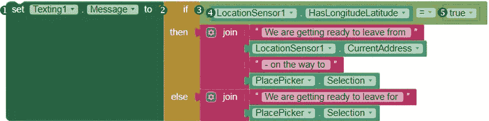

再次点击 Texting1，拖动 setTexting1.Messageto 块➊到 Viewer，并将其插入到`setTexting1.PhoneNumberto`块下的 whenPlacePicker.AfterPicking 块中。

然后，点击**Control**块抽屉，拖动一个带左插口的 if then else 块➋到 Viewer，并将其插入到 setTexting1.Messageto 块的右侧。左插口表示该块是一个*返回块*，这意味着它在评估条件后返回一个值，而不是像我们之前使用的`if then`块那样仅执行命令。

在这里，`if then else` 块指示应用评估一个条件并返回两个连接字符串之一，用于 `Texting1` 的 `Message`——要么是 `then` 插座中的块值，要么是 `else` 插座中的块值。为了提供我们希望应用评估的条件，点击**逻辑**块抽屉，将一个 `=` 比较块 ➌ 拖到查看器中，放在 `if` 旁边。要填充 `=` 比较运算符块的左操作数插座，点击块面板中的 LocationSensor1，并拖入其 LocationSensor1.HasLongitudeLatitude 块 ➍。通过点击**逻辑**块抽屉并拖动 `true` 块 ➎，来填充右操作数插座。到目前为止，这些块设置了应用评估的测试条件，以确定发送的消息内容，即 `LocationSensor1` 是否已经获取了用户的经度和纬度。

##### 如果应用程序知道用户的经度和纬度，则发送一条消息

接下来的块告诉应用如果 `LocationSensor1` 已经拥有用户的经度和纬度，则发送的消息，这意味着测试条件的结果为 `true`。

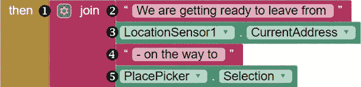

点击**文本**块抽屉，将一个连接块 ➊ 拖动到右侧的查看器，放在 `if then else` 块中的 `then` 之后。通过点击“连接”块左侧的蓝色变更图标并在弹出的对话框中拖动两个额外的字符串块，向“连接”块添加两个输入。对于“连接”块的第一个输入，从文本块抽屉中拖入一个空的字符串块 ➋，点击该字符串块的文本区域，输入“我们准备从（`from`后留一个空格）出发”。

对于“连接”块的第二个输入，在块面板中点击 LocationSensor1，拖动其 LocationSensor1.CurrentAddress 块 ➌。对于“连接”块的第三个输入，从文本块抽屉中拖入一个空的字符串块 ➍，点击该字符串块的文本区域，输入“- 前往（`to`后留一个空格）”。然后，对于“连接”块的底部输入，点击块面板中的 PlacePicker，拖动其 PlacePicker.Selection 块 ➎。这些块设置了如果应用的 `LocationSensor` 接收到用户的经度和纬度时，应用发送的消息，也就是说，这条消息将显示用户的目的地，并包括用户的起始点——当前地址。

##### 如果应用程序无法获取用户的经度和纬度，发送不同的消息

接下来，我们将添加一些块，定义如果 `LocationSensor1` 尚未接收到这些坐标时应用发送的消息，这意味着 `if then else` 测试条件的结果为 `false`。

点击**文本**模块抽屉，并将另一个连接模块 ➊ 拖动到位于`if then else`模块中`else`一词右侧的查看器中。对于`join`模块的顶部输入，将一个空字符串模块 ➋ 从文本模块抽屉中拖入，点击字符串模块的文本区域，并输入“我们正在准备离开（`for`之后留一个空格）”。

对于`join`模块的底部输入，点击模块面板抽屉中的 PlacePicker，并拖动另一个 PlacePicker.Selection 模块 ➌。这些模块将设置应用发送的消息为指示目的地的语句，但不包括用户当前的地址，因为应用的`LocationSensor`还无法获取此信息。

##### 发送第一条短信

最后，再次点击 Texting1，并将其 callTexting1.SendMessageDirect 模块拖入`setTexting1.Messageto`模块下的 whenPlacePicker.AfterPicking 模块中。该模块用于发送短信。

用通俗的英语来说，第 3 步的模块将地图标记`Marker`移动到用户选择的目的地，重新居中地图，然后指示应用决定要发送的文本消息，具体取决于`LocationSensor1`是否获取到用户当前的经纬度。如果获取到了，应用应向选定的电话号码发送一条包括用户当前地点和目的地的消息。如果没有，应用仅发送包括目的地的消息。

使用你的测试手机和选定号码的手机对这些模块进行实时测试。如果你已按照所示正确放置模块，一旦选择号码并且`NumberPicker`消失，你应该会看到`PlacePicker`。点击它时，你的`places`变量中的目的地列表应会出现。

在选择目的地后，`PlacePicker`应消失，且你的`Map`和`Marker`应根据所选目的地的纬度和经度移动，如果这些属性与在设计器中设置的不同。此外，只要你在手机上启用了短信功能，手机应该会向你选择的号码发送一条消息。如果任何功能没有按计划运行，请先进行调试再继续。然后关闭手机上的 AI2 Companion 应用。

#### 步骤 4：跟踪旅程

现在让我们编写第 4 步程序，让应用定期将用户的位置发送到选定的电话号码，只在用户离选定目的地小于或等于 5 英里时发送。这意味着我们需要使用另一个条件语句来检查用户当前的位置是否在距离选定地点 5 英里以内。使用以下的`LocationChanged`事件处理模块。

单击 **Blocks** 面板中的 LocationSensor1，并将 whenLocationSensor1.LocationChanged 块 ➊ 拖动到 Viewer 中。你会注意到，当应用程序位置发生变化时，这个 `LocationChanged` 事件处理程序会提供四个事件参数的参数：新位置的 `latitude`、`longitude`、`altitude` 和 `speed`。这些参数是局部作用域的，意味着我们只能在创建它们的事件处理程序中使用它们的值，就像我们将在下一节中创建的本地变量一样。

##### 创建本地 distance 变量

为了简化代码，我们将使用 `LocationChanged` 事件处理程序参数中提供的参数来创建一个本地变量 `distance`，该变量用于保存应用程序当前与 `Marker1` 之间的距离，而 `Marker1` 被放置在用户选择的目标位置的 `Map` 上。由于 `distance` 是一个本地变量，因此我们只能在这个事件处理程序中使用它。

单击 **Variables** 块抽屉，并将初始化本地名称的块拖动到 whenLocationSensor1.LocationChanged 块的右侧，位于 `do` 旁边的块 ➋。点击初始化本地名称的块中的 name，并将其替换为 distance。然后点击 Marker1，将其 callMarker1.DistanceToPoint 方法块 ➌ 拖动到初始化本地 distance 块的右侧。为了填充方法块所需的 `latitude` 和 `longitude` 参数插槽，将鼠标悬停在 `do` 上方的 latitude 事件参数上，并将获取 latitude 块 ➍ 拖动到方法的 `latitude` 插槽中；接着，将鼠标悬停在 `do` 上方的 longitude 事件参数上，并将获取 longitude 块 ➎ 拖动到方法的 `longitude` 插槽中。

现在我们已经创建了 `distance`，可以在此事件处理程序中随时使用它来引用应用程序当前与用户选择的目标位置之间的距离。

接下来，让我们让应用程序仅在 `distance` 小于或等于 5 英里时，文本信息显示关于用户位置的内容。

##### 决定是否发送当前距离的文本信息

为了测试 `distance` 是否小于或等于 5 英里，我们需要使用以下块设置另一个测试条件。

单击 **Control** 块抽屉，将一个 if then 块 ➊ 拖入初始化本地 distance 块下方，位于 `callMarker1.DistanceToPoint` 块下。现在单击 **Math** 块抽屉，将一个 = 比较运算符块 ➋ 拖动到 Viewer 中，放置在 `if` 旁边，并通过点击等号右侧的下拉箭头，将 `=` 转换为 `≤` 比较运算符。

要填充`≤`比较块的左操作数插槽，将鼠标悬停在本地 distance 变量上，并将其 get distance 块 ➌ 拖入。要填充`≤`比较块的右操作数插槽，点击**Math**块面板，拖动一个 8046.72 的数字块 ➍，该数字是 5 英里的公制等值。此代码设置了一个测试条件，用于确定用户是否距离选定目标地点小于或等于 5 英里。该条件必须计算为`true`，才能让应用程序在此步骤中发送文本消息。

##### 沿路线设置和发送短信

接下来的块将设置消息的文本内容，当测试条件满足时（即用户距离选定的目标地点小于或等于 5 英里），应用程序将发送此消息。

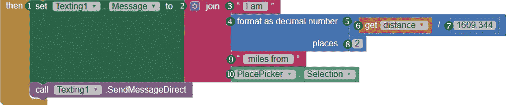

点击**Texting1**，将其 setTexting1.Messageto 块 ➊ 拖到`then`旁边的 if then 块中。接下来，点击**Text**块面板，拖动一个连接块 ➋ 到`setTexting1.Messageto`块右侧的查看器中。通过点击`join`块左侧的蓝色变体图标，打开对话框并拖动两个额外的字符串块到`join`块中，为它添加两个输入。对于`join`块的第一个输入，从 Text 块面板中拖动一个空字符串块 ➌，点击该字符串块的文本区域，输入“我在”（包括`am`后面的空格）。

对于`join`块的第二个输入，从 Math 块面板中拖动一个格式化为小数块 ➍，并通过拖动一个除法运算块 ➎ 将其数字插槽填充，这个块同样来自 Math 块面板。将鼠标悬停在 distance 上，拖动其 get distance 块 ➏ 到除法块的左操作数插槽中。然后，从 Math 块面板中拖动一个数值为 1609.344 的数字块 ➐ 到除法块的右操作数插槽，用于转换为 1 英里的公制等值。最后，将格式化为小数块的 places 插槽填充为 Math 块面板中的一个数值为 2 的小数块 ➑。第二个`join`块输入计算用户的距离（单位为英里），以小数点后两位的形式呈现，并将其添加到应用程序发送的文本消息中。由于 App Inventor 以米为单位计算距离，我们需要将其转换为英里，以便美国用户使用。

接下来，将`join`块的第三个输入填充为另一个来自 Text 块面板的空字符串块 ➒，点击该字符串块的文本区域，输入“英里远”（包括`miles`前后的空格）。然后，对于`join`块的底部输入，点击 Blocks 面板中的 PlacePicker，拖动其 PlacePicker.Selection 块 ➓。

最后，再次点击 Texting1，并将其 callTexting1.SendMessageDirect 块拖到`setTexting1.Messageto`块下的 if then 块中，以发送消息。这些块将文本消息设置为“我距离[*selected destination*]约[*x.xx*]英里”，并将其发送到用户选择的电话号码。

现在，第四步的所有模块将指示应用程序定期将用户的位置发送到选定的电话号码，前提是用户距离目的地小于或等于 5 英里。

现在我们可以测试完成的应用程序了！要进行测试，你需要构建并安装应用程序，这样你就可以在沿着路线行进时运行它。在测试时，你可以在创建临时二维码后迅速将应用程序安装到手机上，然后用手机的 AI2 Companion 应用扫描二维码。

**警告**

*请不要在驾驶时测试此应用程序。如果你在车内测试，请让其他人驾驶，这样你可以安全操作并监控两部手机。你也可以在步行时测试该应用程序。*

在电脑屏幕上打开应用项目后，点击顶部菜单栏中的**构建** ▸ **应用（提供二维码用于.apk）**，如图 5-2 所示。

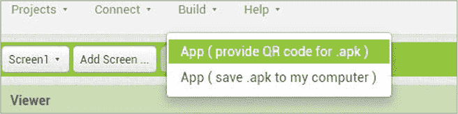

*图 5-2：创建二维码的构建菜单链接，你可以扫描该二维码来安装应用程序*

你应该能看到一个进度条，显示二维码正在生成。一旦二维码准备好，你应该会看到一个包含临时二维码链接的小窗口，指向你的应用程序源文件。使用手机上的 AI2 Companion 应用扫描该二维码，并点击**确定**关闭小窗口。

请注意，由于“Beat the Bus”是一个非市场应用，你首先需要确保手机设置允许安装来自“未知来源”的应用程序。安装应用时，请确保允许其接收短信并访问大致位置、精确位置和额外的定位提供者命令。

安装并打开应用程序后，你应该能看到`地图`，其中的`标记`指向你在设计器中的属性面板设置的纬度和经度。如果你的当前位置和`标记`都在`地图`的缩放级别范围内，你还可能看到一个用户图标。

你还应该能看到`数字选择器`，点击后它应该会消失并选择一个数字。然后你应该能看到`位置选择器`，点击后它应该会消失并选择一个目的地。接下来，如果这些属性与在设计器中设置的不同，你的`地图`和`标记`应该会移动到选定目的地的纬度和经度。应用程序还应该会向你选择的号码发送短信。

当你沿着路线前进时，你应该偶尔看到用户图标在`地图`上移动，并且当你距离目的地不到 5 英里时，应用程序应该定期向你选择的号码发送短信，直到你关闭应用程序。

你可能会注意到，尽管你已将`LocationSensor1`设置为每秒检查一次位置变化，应用可能不会每秒发送一次短信。根据 App Inventor 的文档，`LocationSensor`组件仅在手机的位置发生实际变化时才接收位置更新，并且所选的时间间隔并不能得到保证。然而，你选择的电话号码应该会在你到达 5 英里标志和到达目的地之间接收到几条消息。请注意，如果你觉得消息来得太频繁，你可以在设计器中增加`LocationSensor`的`TimeInterval`。

如果有任何问题没有按计划运行，请花时间进行调试。如果你做了任何更改，你需要重新安装应用以进行测试。如果你正确地放置了模块，应用应该按预期工作。你已经成功创建了“打败公交车”跟踪应用！

### 总结

在本章中，你创建了“打败公交车”应用，该应用利用了 App Inventor 中的`LocationSensor`、`Texting`和`Maps`组件，以及`ListPicker`，使得他人可以在不使用手机电量消耗巨大的定位服务的情况下跟踪你的定位。在构建这个应用的过程中，你学会了如何创建可以保存多个值的列表变量，以及如何使用本地变量使代码更加高效。你还继续使用编程中的选择控制结构来引导应用的流程。

在第六章中，你将学习如何使用 App Inventor 内置的控制和逻辑模块，通过重复的程序结构来控制应用的流程。我们将在创建“井字游戏”应用时使用更多的列表，该应用允许用户玩经典的两人游戏，并记录玩家的轮次。

### 独立操作

在修改和扩展“打败公交车”应用以完成后续练习时，请保存新版本。你可以在* [`nostarch.com/programwithappinventor/`](https://nostarch.com/programwithappinventor/)* 上找到解决方案。

1.  修改应用，使其在发送的所有短信中也提供目的地的街道地址，并从列表变量中检索该信息。

1.  修改应用，使其要求用户输入目的地，而不是从预设列表中选择。

1.  为 Android 设备扩展该应用，使得应用能够响应来自所选号码的特定短信，并在该时刻发送用户的当前位置。你的算法将如何改变？你需要添加和修改哪些组件和模块？
