## TIC TAC TOE: 使用循环创建游戏**

程序员经常编写重复执行一组操作的代码。例如，他们可能希望每次用户输入错误密码时都显示密码请求，或者在成千上万个文件中搜索相同的短语。为了避免一次又一次地复制粘贴相同的代码行，我们使用重复编程控制结构或 *循环*，这些是重复执行任务的代码段，可以指定重复执行的次数或直到某个条件被满足。相较于多行重复的代码，循环更容易进行审查和修正错误。

### 在 App Inventor 中使用循环

在 App Inventor 中，你可以通过三种类型的循环来控制应用的流程：`for each number` 循环对给定范围内的每个数字执行一个操作，`while` 循环在测试的布尔条件返回 `false` 之前重复执行一个操作，以及 `for each item` 循环对列表中的每个项执行相同的操作。接下来，我们将更详细地了解这些。

#### FOR EACH NUMBER 循环

我们通常使用 `for each number` 循环来计算一系列数字。下面的事件处理器展示了 `for each number` 循环如何计算给定范围内某些数字的总和。

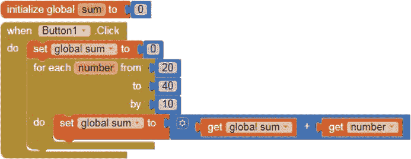

首先，我们初始化一个全局的 `sum` 变量来存储待计算的值。然后，我们编写事件处理器，在每次点击按钮时将 `sum` 重置为 `0`。这样可以确保应用通过删除上次点击的值来计算正确的总和。

为了创建 `for each number` 循环，我们使用一个名为 `number` 的 *计数器变量* 来计算并控制应用执行代码的次数。然后，我们包括一个值范围，起始值为 `from` 中的数字，结束值为 `to` 中的数字。在 `by` 插座中，我们插入一个数字，它决定了每次循环之间 `number` 变量增加的数量。当你点击按钮时，应用会在 20 到 40 的范围内循环并执行 `for each` 块的 `do` 插座中的代码块，同时每次循环时将 `number` 的值增加 10。

这意味着，在第一次循环中，代码将全局 `sum` 变量的值设置为其当前值（`0`）加上 `number` 变量的值（`20`），结果为 `20`，然后将 `number` 变量增加到 `30`。在第二次循环中，它将 `sum` 设置为 20 + 30，即 `50`，然后将 `number` 增加到 `40`。在最后一次循环中，它将 `sum` 设置为 50 + 40，即 `90`，这是我们要计算的总和。你可以在任何需要计算一特定范围内数字总和，并且每次循环之间按固定数值递增的情况下使用这种代码。

#### WHILE 循环

`while` 循环会重复执行一个操作，直到布尔条件的结果为 `false`。下面的事件处理器使用一个 `while` 循环，从 30 张抽奖票中选择三个随机中奖者。

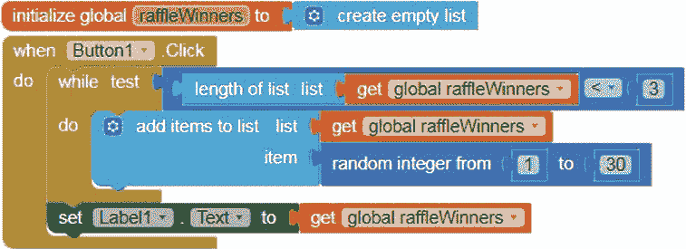

在编写事件处理程序之前，我们需要创建一个名为`raffleWinners`的空列表变量，用于存放三个随机选择的票号。我们将使用`raffleWinners`和一个关系运算符（`<`）来设置`while`循环的`test`条件。在每次循环之前，我们测试`raffleWinners`列表的长度（或项数）是否小于 3。

我们测试这个条件是因为我们希望在`do`插座中的代码只执行三次，以选择三名随机的抽奖获胜者。只要`raffleWinners`的长度小于 3，我们就执行`while`循环中的`do`插座的代码。一旦`raffleWinners`的长度达到 3，循环结束，我们立即执行循环下方的代码块。

当你点击按钮时，测试条件为`true`时，`do`插座中的代码块会循环并向`raffleWinners`列表变量添加一个 1 到 30 之间的随机整数。

这意味着，在第一次循环中，当`raffleWinners`的长度为`0`时，应用会向`raffleWinners`中添加一个随机数，长度变为`1`。在第二次循环中，由于`raffleWinners`的长度仍然小于 3，应用会重复此操作，再次向`raffleWinners`添加一个随机数，长度变为`2`。在第三次循环中，由于`raffleWinners`的长度仍然小于 3，应用会再次向`raffleWinners`添加一个随机数，长度变为`3`，此时测试条件不再成立，循环结束。

循环结束后，应用会在标签中显示`raffleWinners`，即随机选择的抽奖中奖号码列表。

#### FOR EACH ITEM 循环

我们可以使用`for each item`循环来对列表中的每个项重复执行操作。以下是我们可以添加到第五章的“Beat the Bus”中的一个`for each item`循环，这样用户可以将目的地提供给电话号码列表中的所有号码，而不仅仅是一个。

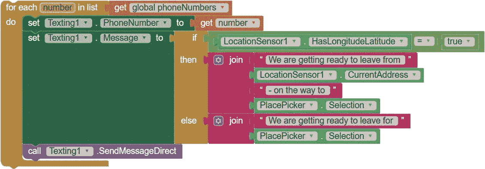

这些代码块会遍历电话号码列表，并将位置信息发送给每个号码。

### 构建“TIC TAC TOE”应用

在这一章中，你将使用两个`for each item`循环，并更多地使用`Canvas`和`ImageSprite`组件来创建一个“Tic Tac Toe”游戏应用。在这个游戏中，两个玩家轮流在`Canvas`上的空白格子里点击。第一个在横向、纵向或对角线上连续点击三个空格的玩家获胜。这个应用会跟踪玩家的回合，并允许他们随时重置游戏重新开始。

登录到 App Inventor 并创建一个名为 TicTacToe 的项目。

#### 分解“TIC TAC TOE”

我们可以将游戏活动分解为三个步骤：

1.  当应用打开时，显示一个九格的 Tic Tac Toe 棋盘和一个重置按钮。在棋盘上的每个格子上放置一个`ImageSprite`，用于显示 X 或 O。

1.  当第一位玩家点击棋盘上的空白格子时，在该格子上显示一个 X。然后显示一条消息，说明轮到另一位玩家（O）了，以此类推。当最后一个格子被填满时，告知玩家游戏结束！

1.  当玩家点击重置按钮时，清除棋盘上的所有 X 和 O 以及所有通知，应用程序准备开始新的一局游戏。

你需要以下组件：

+   玩家点击以重置游戏棋盘的按钮

+   带有游戏棋盘背景的画布，供玩家触摸进行游戏，并显示 X 和 O 的`ImageSprite`

+   存储`ImageSprite`并跟踪当前游戏玩家和回合次数的全局变量（3）

+   显示 X 和 O 图形的图像精灵（9），用于玩家点击的空白棋盘格子

+   显示游戏通知的标签

+   存储所点击`ImageSprite`值的局部变量

#### 在设计器中布局“井字棋”

现在，让我们从`Screen1`开始在设计器中布局应用程序。在`Screen1`的属性面板中，将其 AlignHorizontal 属性设置为**居中: 3**，这样我们放置的所有组件都会位于屏幕的中间偏上位置。

接着，为了防止设备旋转时屏幕方向改变，将 ScreenOrientation 设置为**竖屏**。最后，去掉 TitleVisible 下的勾选框，以防在设备运行应用程序时显示屏幕标题。

接下来，从调色板面板中将其他必要的组件拖入查看面板，并调整它们的属性。从用户界面控件栏拖入一个`Label`，用于显示玩家的回合。在属性面板中，通过勾选 FontBold 和 FontItalic 框，使其字体加粗和斜体，并将 FontSize 设置为 30。同时，将**宽度**改为**填充父项**，去除**文本**下的内容，将 TextAlignment 设置为**居中: 1**，并选择**品红色**作为文本颜色。

为了创建重置按钮，将一个按钮从用户界面控件栏拖到`Label`下方。在属性面板中，将按钮的背景颜色更改为**品红色**，设置字体加粗，并将字体大小设置为 20。同时，将**宽度**改为**填充父项**，并将**文本**设置为“重置游戏”，文本颜色设置为**白色**。

现在，从绘图与动画控件栏拖入一个画布。通过点击属性面板中`BackgroundImage`下的文本框并按照第 27 页中“上传图片”的指示上传井字棋背景图片。同时，将`Canvas`的**高度**和**宽度**设置为 100%。

将九个 `ImageSprite` 拖到 `Canvas` 上，这些 `ImageSprite` 会在玩家触摸屏幕时显示 X 和 O。在属性面板中，将这些 `ImageSprite` 的 X 和 Y 属性设置为 0，定位它们到井字棋面板的前三个顶部和左侧方格。我们可以现在设置这些值，因为我们知道这五个 `ImageSprite` 的 0 坐标值无论玩家使用什么设备大小都不会改变。在将 `ImageSprite` 拖到 `Canvas` 时，根据表 6-1 设置这些 0 坐标。

**表 6-1：** 顶部和左侧 `ImageSprite` 的初始 `X` 和 `Y` 属性值

| ImageSprite | **X 属性** | **Y 属性** |
| --- | --- | --- |
| `ImageSprite1` | `0` | `0` |
| `ImageSprite2` |  | `0` |
| `ImageSprite3` |  | `0` |
| `ImageSprite4` | `0` |  |
| `ImageSprite7` | `0` |  |

我们现在不会设置其他坐标，因为它们的位置会根据屏幕大小变化。相反，我们将编程让应用程序在启动时按 `Canvas` 大小的比例来设置这些坐标。

最后，通过在媒体面板中点击**上传文件...**并按照图片上传说明上传 X 和 O 图像。

现在，所有组件应显示在查看器中，除了 `Label1`，它一开始不包含任何文本。你还应该能在组件面板中看到所有应用组件的列表，以及在媒体面板中看到上传的图片名称，`Screen1` 应该像图 6-1 一样（虽然，根据你拖动 `ImageSprite` 的位置，它们可能不会像图中那样整齐排列）。

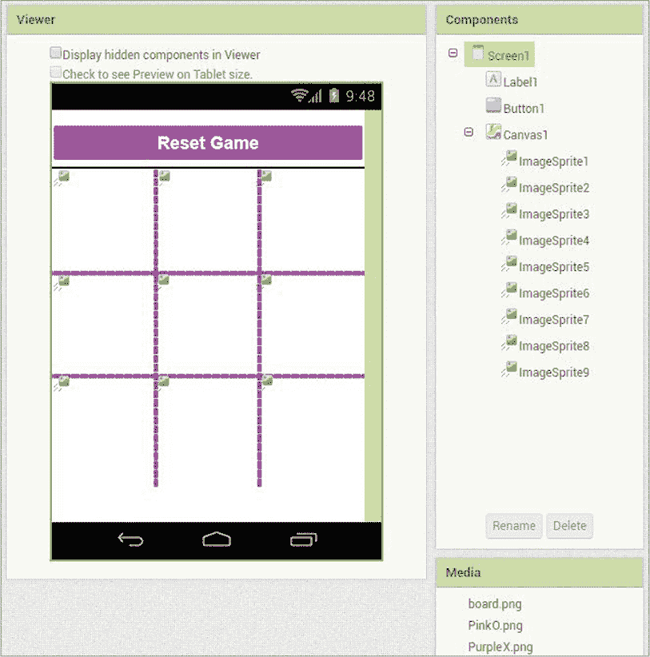

*图 6-1：你布局“井字棋”后的查看器、组件和媒体面板*

现在，你可以在块编辑器中开始编程应用程序了。

### 编程“井字棋”

对于“井字棋”，我们将编写三个事件处理程序。第一个在屏幕初始化时指导应用程序的操作，其他两个响应 `Canvas TouchDown` 和 `Button Click` 事件。我们还将创建四个变量来存储重要信息，包括一个全局列表，并且会使用多个 `if then` 语句和两个 `for each item` 循环块来引导应用程序的操作流程。点击**块**按钮切换到块编辑器，我们开始编程步骤 1。

#### 步骤 1：设置井字棋游戏面板

当屏幕打开时，我们希望玩家看到九格的井字棋面板和我们在设计器中放置和样式化的重置按钮。与此同时，我们希望应用程序响应 `Screen1 Initialize` 事件，通过设置 `ImageSprite` 的宽度和高度，并将每个 `ImageSprite` 定位到游戏面板的一个方格上。`Screen1 Initialize` 事件处理程序在幕后执行步骤 1 中的操作。

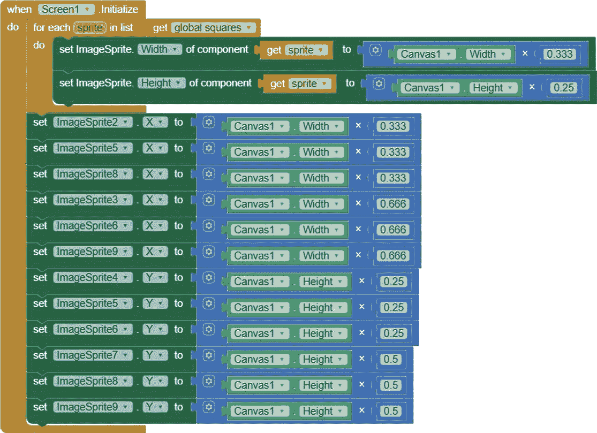

##### 创建全局方格列表变量

在编写事件处理程序之前，你应该创建全局`squares`列表变量来存储将显示 X 和 O 的九个`ImageSprite`。由于该变量是全局的，我们可以在所有事件处理程序中使用它来引用这九个`ImageSprite`。以下块声明并初始化该变量。

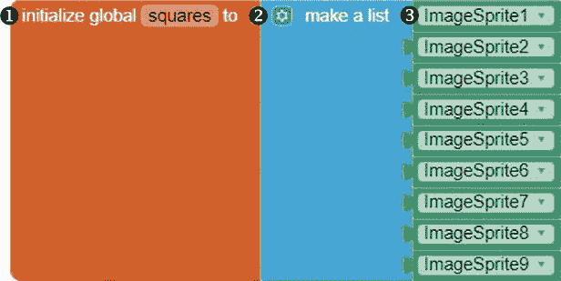

要放置这些块，点击**变量**块抽屉，拖动一个初始化全局名称块 ➊ 到 Viewer，点击名称并将其替换为`squares`。然后从列表抽屉中拖动一个“创建列表”块 ➋，将其固定到初始化全局`squares`块的右侧，并通过向“创建列表”块的两个默认输入添加七个插槽来为每个`ImageSprite`提供一个插槽。要添加这七个插槽，点击“创建列表”左侧的蓝色变异符号图标，并将额外的项块拖动到弹出窗口中的列表块上。

然后，在 Blocks 面板中，从 1 到 9 依次点击每个`ImageSprite`，并将其`ImageSprite getter`块 ➌ 拖动到“创建列表”块中的插槽中。现在，我们已经将`squares`列表中的项目设置为这九个`ImageSprite`。

##### 循环遍历`squares`列表中的`ImageSprite`

现在你已经有了`squares`列表，点击 Blocks 面板中的 Screen1 并将`whenScreen1.Initialize`块拖动到 Viewer，启动事件处理程序。然后添加一个`for each item`块，它遍历`ImageSprite`列表并将它们的宽度和高度设置为与游戏板方块相匹配。

由于列表包含一系列组件，你将使用通用的 Any 组件块来访问和操作循环中所有`ImageSprite`的属性，而无需专门指定每个`ImageSprite`的名称。你可以在 Blocks 编辑器窗口中，在组件特定块下方的 Blocks 面板中找到 Any 组件块，如图 6-2 所示。

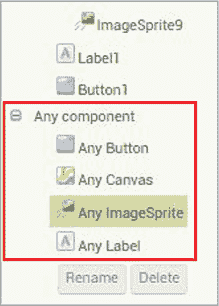

*图 6-2：“井字游戏”应用的 Any 组件块*

你在 App Inventor 中创建的任何应用都会为每个添加的组件包含 Any 组件块。

##### 设置`squares`列表中每个`ImageSprite`的宽度和高度

通过在设计器中将`Canvas`的高度和宽度设置为屏幕尺寸的 100%，我们确保了每当设备的尺寸发生变化时，`Canvas`及其游戏板背景图中的方块会按比例调整。同样地，通过在`for each item`循环中将宽度和高度设置为`Canvas`尺寸的一部分，我们确保了每个`ImageSprite`的宽度和高度会随着游戏板的大小按比例变化。

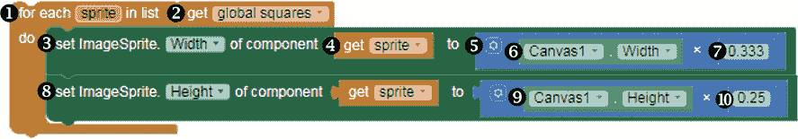

要放置循环，拖动一个每个项目积木 ➊ 从控制积木抽屉到查看器，并将其插入到 whenScreen1.Initialize 块内，紧挨着`do`。在`for each item`积木上，您会注意到计数器变量`item`，它表示列表中的每一项。点击`item`并输入一个更有意义的名称，例如 sprite。

然后点击**变量**积木抽屉，拖入一个获取全局方格块 ➋，并将其与每个精灵块右侧的`list`单词旁边的块对接。目前，针对全局`方格`列表变量中的每个精灵，这些积木将促使应用执行某些操作。现在，让我们让应用为每个精灵设置宽度和高度。

要将`ImageSprite`的宽度设置为`Canvas`宽度的三分之一，请点击积木面板中**任何组件**左侧的加号，点击**任何 ImageSprite**抽屉，然后拖动一个 setImageSprite.Width 积木 ➌ 到每个精灵块的右侧，紧挨着`do`。这个通用的设置器积木要求我们在提供要更改的大小之前，先识别出我们正在更改的`ImageSprite`。为了识别这些值，点击`of component`插槽，鼠标悬停在精灵计数器变量上，并拖入一个获取精灵块 ➍。将其`to`插槽与一个乘法操作符积木 ➎ 连接，左侧连接一个 Canvas1.Width 积木 ➏，右侧连接一个 0.333 数字块 ➐。

要将每个精灵的高度设置为`Canvas`高度的四分之一，请复制 setImageSprite.Width 积木，并将复制的积木放入 for each sprite 块内，放置在 setImageSprite.Width 块下方。在复制的积木中，点击 setImageSprite.Width 积木 ➑ 和 Canvas1.Width 积木 ➒ 的下拉箭头，选择高度。将数字块中的`0.333`替换为 0.25 ➓。

##### 在画布上定位 ImageSprites

最后，我们需要将每个`ImageSprite`放置在游戏板上，使其与对应方格的左上角对齐，如图 6-3 所示。

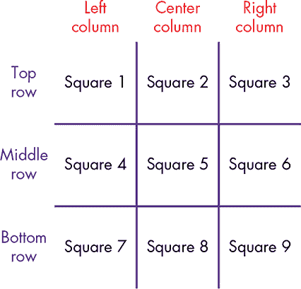

*图 6-3：井字棋的画布背景图像，标注了方格、列和行*

我们希望`ImageSprite1`的 x 和 y 坐标为方格 1 的左上角（即`X` = 0 和 `Y` = 0），`ImageSprite2`的 x 和 y 坐标为方格 2 的左上角，以此类推。

在设计器中，我们已经将`ImageSprite1`、`ImageSprite4`和`ImageSprite7`的`X`属性设置为`0`，因为我们希望它们位于`Canvas`的左列，覆盖方格 1、4 和 7。我们还将`ImageSprite1`、`ImageSprite2`和`ImageSprite3`的`Y`属性设置为`0`，因为我们希望它们位于`Canvas`的顶行，覆盖方格 1、2 和 3。

以下积木设置了`ImageSprite`的剩余 x 和 y 坐标。

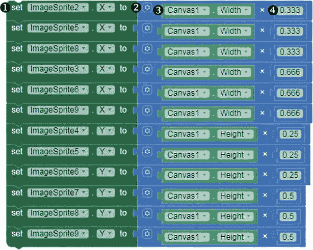

首先，将`ImageSprite2`的 x 坐标设置为游戏板上方格 2 最左侧的点，如图 6-3 所示，具体位置为`Canvas`宽度的 0.333 倍。将`setImageSprite2.Xto`块➊放置在`whenScreen1.Initialize`块下的`for each`块内。然后，将一个乘法操作符块附加到`setImageSprite2.Xto`块➋，并用`Canvas1.Width`块 ➌ 和一个 0.333 的数值块 ➍ 填充它。现在，复制 11 个`setImageSprite2.Xto`块并做出代码中所示的修改。

这些重复的块将`ImageSprite5`和`ImageSprite8`的 x 坐标设置为`Canvas`宽度的 0.333 倍，这个位置是井字游戏板中间列的最左侧，如图 6-3 所示；而`ImageSprite3`、`ImageSprite6`和`ImageSprite9`的 x 坐标设置为`Canvas`宽度的 0.666 倍，这个位置是井字游戏板右列的最左侧，如图 6-3 所示。

它们还将`ImageSprite4`、`ImageSprite5`和`ImageSprite6`的 y 坐标设置为`Canvas`高度的 0.25 倍，这个位置是井字游戏板中间行的顶部，如图 6-3 所示；而`ImageSprite7`、`ImageSprite8`和`ImageSprite9`的 y 坐标设置为`Canvas`高度的 0.5 倍，这个位置是井字游戏板底部行的顶部，如图 6-3 所示。

现在，借助我们在步骤 1 中完成的所有模块，我们已经编写了应用程序，使其在响应`Screen1 Initialize`事件时，在每个井字游戏板的方格上放置一个`ImageSprite`，该`ImageSprite`不显示图像，具有与方格相同的宽度和高度，并且其左上角位置与方格的左上角对齐。

现在，让我们按“实时测试应用”中概述的步骤，在设备上进行实时测试，如第 xxii 页所示。在顶部菜单栏中点击**连接** ▸ **AI Companion**，并使用设备的 AI2 Companion 应用扫描二维码。你的“井字游戏”应用应该会在设备上打开，并且你应该能看到游戏板和重置按钮。

应用程序应该在`Canvas`上有不可见的`ImageSprite`，在我们编写`Canvas`的`TouchDown`事件处理程序并完成步骤 2 后，你应该能够看到它们的宽度、高度和位置。请保持应用程序在设备上处于打开状态以进行实时测试。

#### 步骤 2：响应玩家操作

在步骤 2 中，我们将编写应用程序，使其每当玩家触摸`Canvas`井字游戏板上的一个空方格时做出响应。此时，我们希望应用程序执行几个操作：

1.  使用触摸点的 x 和 y 坐标以及一系列嵌套的条件判断来确定玩家触摸了哪个`ImageSprite`。

1.  使用名为`player`的全局变量存储的数据来确定是玩家 X 还是玩家 O 触摸了`Canvas`。

1.  在触摸的`ImageSprite`中显示对应的 X 或 O 图形。

1.  将`player`的值更改为对方玩家。

1.  使用全局变量`play`跟踪游戏中的操作次数。（井字棋总共有 9 次可能的操作。）

1.  显示一个通知，指示下一位玩家是谁，直到`play`的值等于`9`，此时通知应显示为“游戏结束！”

我们将通过创建两个全局变量：`player`和`play`，开始第 2 步的代码编写。

##### 创建全局变量

第一个全局变量`player`存储当前玩家的值，可能是 X 或 O。第二个全局变量`play`用于跟踪游戏中的操作次数。由于`player`和`play`都是全局变量，我们可以在代码中的所有事件处理程序中使用它们。以下块初始化了`player`和`play`变量。

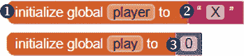

要创建每个变量，请点击**变量**块工具栏，并将初始化全局名称块 ➊ 拖到查看器中，点击名称并将其替换为变量名。然后，对于`player`，因为它将保存字符串数据，从文本工具栏拖动一个空字符串块 ➋，将其连接到初始化全局 player 块的右侧，并将其初始值设置为第一个玩家，即玩家 X，在空字符串块中输入 X。

初始化`play`，它将保存表示游戏中操作次数的数字数据，初始值为`0`，通过将数字块 0 ➌从数学工具栏拖到初始化全局 play 块的右侧。

##### 处理 Canvas TouchDown 事件

现在我们已经创建了`player`和`play`，我们拥有了第 2 步`Canvas TouchDown`事件处理程序所需的数据。

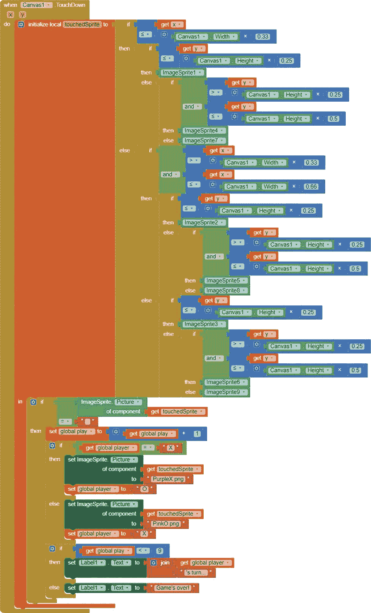

当玩家触摸到`Canvas`游戏板上的空白方格时，如果是玩家 X 触摸的，需要在触摸点上放置 X 图像，如果是玩家 O 触摸的，则放置 O 图像。为此，应用程序首先需要知道玩家触摸了游戏板上的哪个方格以及相应的`ImageSprite`。幸运的是，`Canvas TouchDown`事件处理程序包括两个事件参数，`x`和`y`，它们保存了触摸位置的 x 和 y 坐标。应用程序将使用这些坐标来确定玩家触摸的游戏板方格和`ImageSprite`。

我们首先使用`x`和`y`事件参数将一个名为`touchedSprite`的局部变量的值设置为被触摸的`ImageSprite`。我们通过首先测试一系列条件来判断玩家是否触摸了游戏板左列的方格及其相应的`ImageSprite`。如果玩家没有触摸左列，我们接着测试玩家是否触摸了中列，必要时再测试右列。

一旦知道了`touchedSprite`的值——即玩家触摸的`ImageSprite`——应用程序就可以判断该`ImageSprite`是否已经显示了图像，如果没有，就根据是哪个玩家触摸了游戏板，显示 X 或 O 图像。

##### 创建本地变量 touchedSprite

以下代码块来自`Canvas TouchDown`事件处理程序，用于确定玩家触摸的是哪个`ImageSprite`，然后将其设置为`touchedSprite`的值。

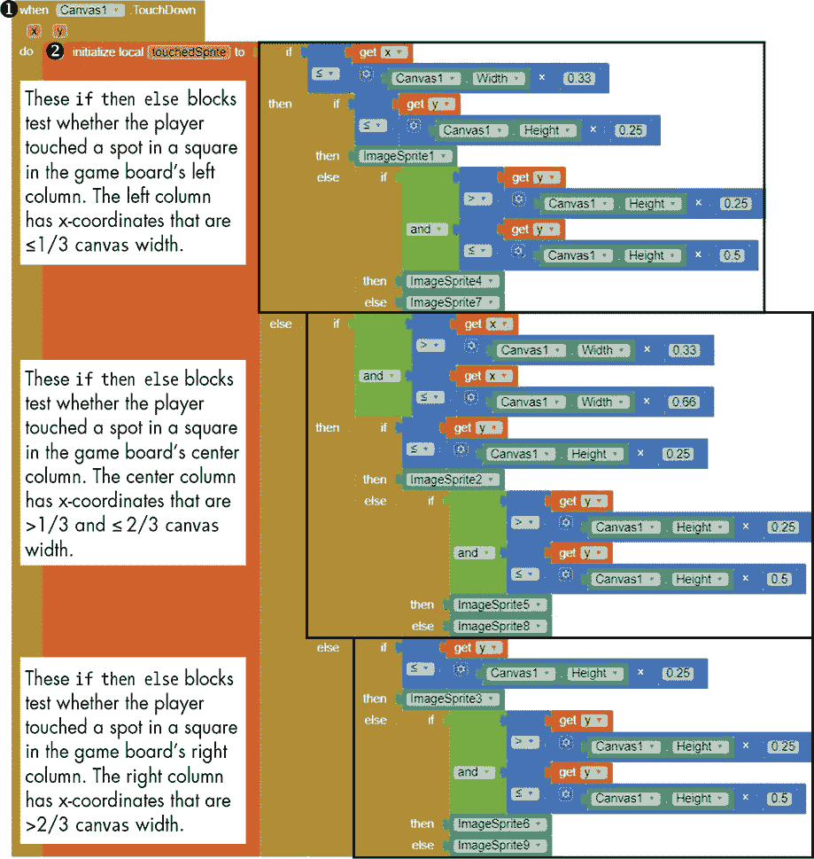

首先，点击 Canvas1，在代码块面板中拖动其`whenCanvas1.TouchDown`事件处理程序块➊到查看器中。然后，通过点击**变量**代码块抽屉，拖动第一个初始化本地变量的`name to in`代码块，将其放入`whenCanvas1.TouchDown`代码块➋的`do`旁边，并将名称更改为`touchedSprite`。

这个代码块将本地变量`touchedSprite`的初始值设置为我们插入到`to`插槽中的代码块的值。由于`touchedSprite`的作用域是局部的，我们只能在这个`TouchDown`事件处理程序中使用它，在这个步骤中稍后会插入到`in`旁边的代码块中。

##### 测试`touchedSprite`是否位于游戏板的左列

现在我们将添加设置`touchedSprite`值的代码块，`touchedSprite`是显示在玩家触摸的方块上的`ImageSprite`。为了找出触摸的是游戏板上的哪个位置，应用程序首先测试该位置是否位于板子的左侧列，如图 6-3 所示，这意味着`x`参数小于或等于`Canvas`的宽度乘以 0.33。

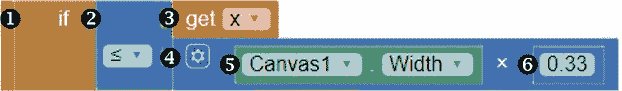

要放置代码块，请点击**控制**代码块抽屉，然后将一个 if-then-else 代码块➊放到初始化本地变量`touchedSprite`的`to`插槽中。

将 if-then-else 代码块的 if 插槽填充为一个`≤`比较运算符块➋，该块来自数学抽屉。将`≤`运算符块的第一个插槽填充为鼠标悬停在`whenCanvas1.TouchDown`代码块的`x`参数上，然后拖入`get x`代码块➌。将`≤`运算符块的第二个插槽填充为一个乘法运算符块➍。现在通过点击 Canvas1，在代码块面板中拖动其`Canvas1.Width`代码块➎到左操作数插槽，并将 0.33 的数字块➏插入到右操作数插槽中。

这些代码块检查玩家触摸的精灵是否位于游戏板的左列，或者是`ImageSprite1`、`ImageSprite4`或`ImageSprite7`。

##### 测试`touchedSprite`是否位于左列的顶部行

如果第一个条件为真，我们希望应用程序测试第二个条件，即触摸点的`y`参数是否小于或等于`Canvas1`的高度乘以 0.25，或者是否位于游戏板的顶部行。以下代码块测试这个第二个条件。

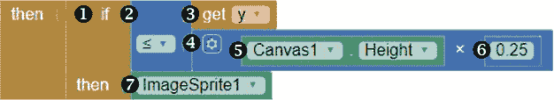

点击**控制**代码块抽屉，拖入第二个 if-then-else 代码块➊，并将其插入到第一个 if-then-else 代码块右侧，紧挨着`then`旁边。

接下来，将第二个 if then else 块的 if 插槽填充为`≤`运算符块 ➋。然后通过将鼠标悬停在 whenCanvas1.TouchDown 块的 y 参数上并拖动获取 y 块 ➌，填充`≤`运算符块的第一个插槽，第二个插槽填充一个乘法运算符块 ➍。通过拖动 Canvas1.Height 块 ➎到左侧插槽，0.25 数字块 ➏到右侧插槽，填充乘法块。最后，通过点击块面板中的 ImageSprite1 并拖动其 ImageSprite1 获取块 ➐，填充第二个 if then else 块的 then 插槽。

由于我们已经知道玩家触摸了`ImageSprite1`、`ImageSprite4`或`ImageSprite7`，我们测试触摸的精灵是否位于游戏板的顶部行，如图 6-3 所示。如果是这样，我们就知道`TouchedSprite`是`ImageSprite1`，因为它是唯一符合第一个和第二个测试条件的`ImageSprite`。

##### 测试 touchedSprite 是否位于左列的中间行

如果`TouchedSprite`位于游戏板的左列但不在顶部行，那么第二个条件将失败。在这种情况下，我们使用`if then else`块的`else`插槽来测试精灵是否位于游戏板的中间行。

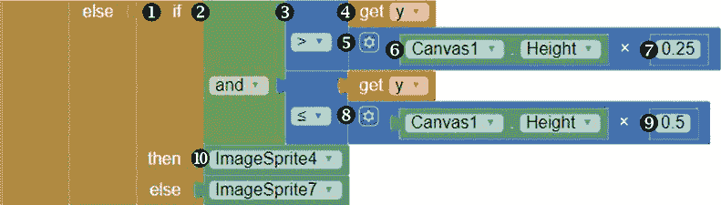

在第二个 if then else 块内的`else`旁边再放置一个 if then else 块 ➊。接下来，将第三个 if then else 块的 if 插槽填充为来自逻辑抽屉的 and 逻辑操作符块 ➋。`and`逻辑块要求其两个操作数都为`true`，以使测试条件成立。

第一个`and`操作数决定了触摸点的 y 坐标是否大于`Canvas1`高度乘以 0.25。将 and 逻辑块的第一个插槽填充为`>`运算符块 ➌，然后将`>`运算符块的第一个插槽填充为获取 y 块 ➍，第二个插槽填充为一个`×`运算符块 ➎，该运算符块将`Canvas1.Height` ➏乘以右侧的`0.25` ➐。

现在，添加第二个`and`操作数，用于判断触摸点的 y 坐标是否小于或等于`Canvas1`高度乘以 0.5。通过将第一个插槽中的块复制并粘贴，点击`>`运算符旁边的下拉箭头，将其更改为`≤`运算符块 ➑，并将 0.25 数字块更改为 0.5 ➒，来填充 and 逻辑块的第二个插槽。

最后，添加用于告诉应用程序当这两个条件都为真时的块，这意味着`TouchedSprite`是`ImageSprite4`。如果任一条件不成立，则意味着`TouchedSprite`是`ImageSprite7`。通过点击块面板中的 ImageSprite4 并拖动其 ImageSprite4 获取块 ➓，然后拖动 ImageSprite7 获取块，填充第三个 if then else 块的 then 插槽。

现在，如果`TouchedSprite`符合第一个条件，即位于棋盘的左列，但未通过第二个条件，因为它不在顶行，程序块会测试第三个条件——触摸的精灵是否位于棋盘的中行。如果是这样，那么我们知道`TouchedSprite`是`ImageSprite4`，因为它是唯一同时满足第一个和第三个条件的`ImageSprite`，即既位于左列又位于棋盘的中行。

但如果第三个条件不成立，或者触摸的精灵不在棋盘的中行，那么我们知道`TouchedSprite`一定是`ImageSprite7`，因为它是唯一剩下的符合第一个条件——位于左列的`ImageSprite`。

`to`插座中的其余程序块填充了第一个`if then else`块的`else`插座，并告诉应用程序当触摸的精灵不在棋盘的左列时该做什么。在这种情况下，我们测试触摸的精灵是否位于棋盘的中列，如果不是，则测试它是否位于棋盘的右列。

要创建测试触摸精灵是否位于中列的程序块，只需右键点击第一个`if then else`块并复制。然后将复制的程序块放入第一个`if then else`块的`else`插座中，并进行以下部分中提到的修改。

##### 测试触摸精灵是否在棋盘的中列

为了确定哪个`ImageSprite`是`TouchedSprite`，前面三个`if then else`块测试触摸的位置是否位于棋盘的左列。接下来，我们需要处理`TouchedSprite`不在左列的情况，方法是测试触摸位置是否位于棋盘的中列。这意味着触摸点的`x`参数大于`Canvas`宽度乘以 0.33 且小于等于`Canvas`宽度乘以 0.66，并且`TouchedSprite`是`ImageSprite2`、`ImageSprite5`或`ImageSprite8`。

这三个`if then else`块测试触摸的位置是否位于棋盘的中列。

对你在第一个`if then else`块的`else`插座中复制到`whenCanvas1.TouchDown`事件处理程序中的重复块进行修改，使它们看起来完全像这里所示。

这些`if then else`块现在表示我们希望应用程序测试的第四个条件——触摸的精灵是否位于棋盘的中列——并告诉应用程序在条件成立时该怎么做。如果触摸精灵位于棋盘的中列（即它是`ImageSprite2`、`ImageSprite5`或`ImageSprite8`），程序块会测试第五个条件，即触摸的精灵是否位于棋盘的顶行。如果这个条件也成立，那么我们知道`TouchedSprite`是`ImageSprite2`。

但是，如果第五个条件不成立，积木会测试第六个条件——即触摸的精灵是否在游戏板的中间行。如果是这样，那么我们知道`touchedSprite`是`ImageSprite5`，因为它是唯一符合第四个和第六个条件的`ImageSprite`，即它同时位于游戏板的中心列和中间行。

然而，如果第六个条件不成立，意味着触摸的精灵不在游戏板的中间行，那么`touchedSprite`必须是`ImageSprite8`，因为它是唯一符合第四个条件——位于中心列的剩余`ImageSprite`。

##### 确定`touchedSprite`是否在游戏板的右列

到目前为止，前六个`if then else`积木测试触摸的游戏板位置是否位于游戏板的左列或中间列。现在我们需要添加积木来处理`touchedSprite`不在左列或中间列，而是在右列的情况。

要判断玩家是否触摸了`ImageSprite3`、`ImageSprite6`或`ImageSprite9`，请添加以下积木。

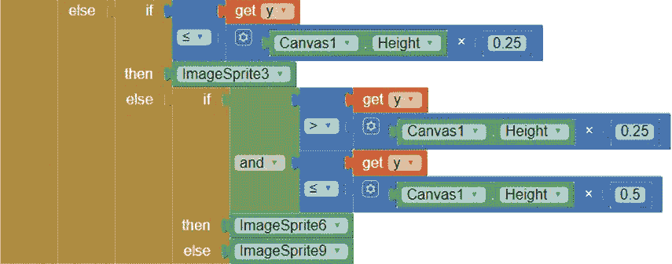

要放置这些积木，复制最后两个 if then else 积木，将复制的积木插入到第四个 if then else 积木的 else 插槽中，然后进行修改，使这些积木与这里所示的完全一致。

这最后两个`if then else`积木现在提出了我们要测试的第七个条件：触摸的精灵，默认情况下必须位于右列，是否也位于游戏板的顶行。如果是，那么`touchedSprite`就是`ImageSprite3`。

但是，如果第七个条件不成立，积木会测试第八个条件——即触摸的精灵是否在游戏板的中间行。如果是，那么`touchedSprite`是`ImageSprite6`。然而，如果第八个条件不成立，意味着触摸的精灵不在游戏板的中间行，那么`touchedSprite`就是`ImageSprite9`，因为它是唯一剩下的`ImageSprite`。

现在我们已经为`touchedSprite`（玩家触摸的`ImageSprite`）赋了值，我们将在`whenCanvas1.TouchDown`事件处理程序的其余部分中使用该值。如果玩家触摸了游戏板上的一个空格，我们将使用`player`中存储的数据来确定是玩家 X 还是 O 触摸了该位置，并在触摸的`ImageSprite`中显示相应的 X 或 O 图标，然后将`player`的值更改为对方玩家。

此外，由于井字游戏中总共有九次可能的操作，我们将通过`play`变量来跟踪操作次数，并在`play`的值小于 9 时显示下一轮玩家的提示，而当`play`的值为 9 或更大时，显示游戏结束的提示。以下是`whenCanvas1.TouchDown`事件处理程序中的积木，用于编程这些操作。

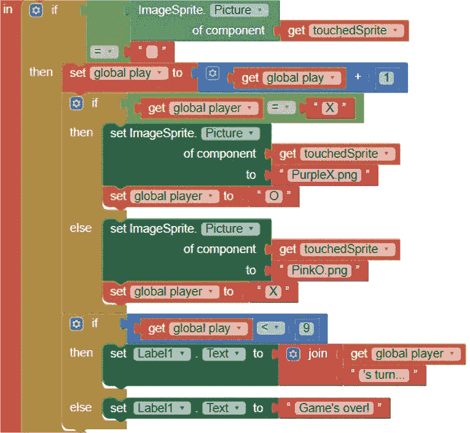

##### 测试玩家是否触摸了游戏板上的空格

现在，我们需要确定玩家是否触碰了棋盘上的空白格子。这意味着触碰到的`ImageSprite`的`Picture`名称是一个空字符串。以下这些块会测试这个条件，如果答案是肯定的，就会将记录游戏操作次数的变量值加 1。

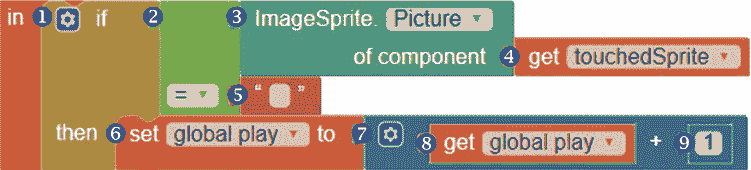

为了添加测试触碰的`touchedSprite`上显示的图像名称是否为空字符串的块，从控制抽屉中拖拽一个`if then`块➊，并将其插入到`whenCanvas1.TouchDown`事件处理程序中的`in`单词旁，紧接着`initialize local touchedSprite to in`块。然后从逻辑抽屉中将一个`=`比较操作符块➋拖拽到`if`单词的右侧。

点击`=`块的第一个插槽，在块面板中点击**Any ImageSprite**抽屉，拖入一个`ImageSprite.Picture`块➌，并用`get touchedSprite`块➍从变量抽屉填充它的插槽。将`=`操作符块的第二个插槽填充为空字符串块➎，该块来自文本抽屉。

如果玩家触碰到了棋盘上的空白格子，我们希望应用程序将玩家的触摸计为一次有效的游戏操作，并将`play`变量的值增加 1。要在代码中将`play`增加 1，首先从变量抽屉中将`set global play`块➏拖到`then`单词的右侧，再将加法操作符块➐放在`set global play`块旁边。然后，将加法操作符块的左侧填充为`get global play`块➑，右侧填充为数字 1 块➒。

##### 在 touchedSprite 上显示正确的图像

接下来，我们将告诉应用程序根据`player`变量的值，在`touchedSprite`上显示哪张图像，然后将`player`的值更改为对方玩家。

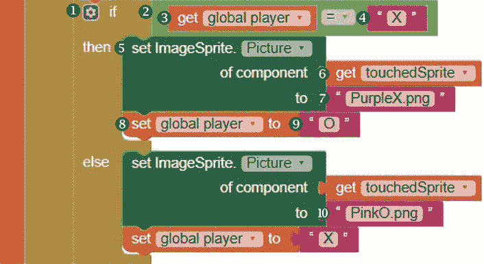

首先，我们将设置测试条件，以确定`player`变量的值是否等于`X`，这意味着玩家 X 触碰了`Canvas`。在`whenCanvas1.TouchDown`块下的`set global play`块内，再放置一个`if then`块➊。点击`if then`块的蓝色变动器图标，添加一个 else 输入到该块。然后，从逻辑抽屉中拖拽一个`=`操作符块➋到`if`插槽，将其左侧填充为`get global player`块➌，右侧填充为一个包含字母`X`的字符串块➍。

如果测试条件的答案是“是”，并且`player`变量等于 X，我们在`touchedSprite`上显示 X，然后将`player`的值更改为`O`。为此，在 Blocks 面板中点击**任意 ImageSprite**抽屉，拖入一个 setImageSprite.Picture 块 ➎，并将其`of component`插槽填充为从 Variables 抽屉中获取的 get touched Sprite 块 ➏，然后将`to`插槽填充为一个包含*PurpleX.png*的字符串块 ➐，这是 X 图形的名称。接下来，在 setImageSprite.Picture 块下，拖入一个从 Variables 抽屉中获取的 set global player 块 ➑，并将一个包含字母`O`的字符串块 ➒从 Text 抽屉拖动到`to`右侧。

如果测试条件的答案是否定的，也就是说`player`变量等于`O`，我们在`touchedSprite`上显示 O，并将`player`的值更改为`X`。通过复制我们刚刚放入 if then else 块的 then 插槽中的块，将复制块放入 if then else 块的 else 插槽，并进行两个更改来编写代码。将 setImageSprite.Picture 块底部插槽 ➓中的图形名称更改为 PinkO.png。然后，将 set global player 块右侧的字符串块中的 O 更改为字母 X。

总的来说，这段代码测试了`player`的值是否为`X`，如果是，它会指示应用程序在`touchedSprite`上显示 X 图形，并将`player`的值更改为`O`。如果`player`的值不是`X`，则告诉应用程序在`touchedSprite`上显示 O 图形，并将`player`的值更改为`X`。

##### 在游戏标签上显示信息

接下来的块使用条件判断，根据变量`play`的值来确定在应用程序的`Label`上显示什么内容，我们已经编写了程序来增加`play`的值，每当玩家点击棋盘上的空方格时。如果`play`小于 9，那么我们希望`Label`指示谁将进行下一步。但如果`play`等于或超过 9，我们希望`Label`显示游戏结束。

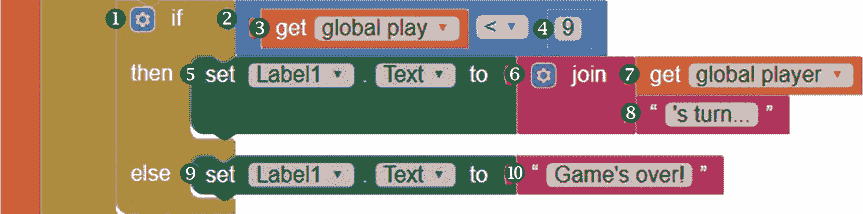

要添加这些块，从 Control 抽屉中拖入另一个 if then 块 ➊，将其放入 prior if then else 块下的 whenCanvas1.TouchDown 块内部。点击新的 if then 块的蓝色 mutator 图标，添加一个 else 输入。然后，为了测试`play`是否小于 9，将一个<比较操作符块 ➋插入 if 插槽，并将其左侧填充为从 Variables 抽屉中获取的 get global play 块 ➌，右侧填充为 9 数字块 ➍。

如果 `play` 的值小于 9，接下来的方块会告诉应用程序指示下一个轮到谁玩。通过点击 Blocks 面板中的 Label1，拖入它的 setLabel1.Textto 方块 ➎，然后从 Text 抽屉中拖入一个 join 方块 ➏，将其插入到 `to` 旁边。将 join 方块的上方插槽填充为从 Variables 抽屉中获取的 get global player 方块 ➐，并将下方插槽填充为包含 `'s turn...` 的字符串块 ➑，以指示哪个玩家的轮到玩。

最后，如果 `play` 不小于 9，接下来的方块会告诉应用程序说游戏已经结束。通过拖入另一个 setLabel1.Textto 方块 ➒，并从 Text 抽屉中拖入一个包含 `Game's over!` 的字符串块 ➓，将其插入到 if then else 方块的 else 插槽中。

总的来说，这些方块会测试 `play` 的值，`play` 保存了玩家在游戏中已进行的次数。如果 `play` 小于 9，它们会指示应用程序使用 `player` 的值来显示下一个轮到哪个玩家。然而，如果 `play` 的值为 9 或更多，它们会告诉应用程序游戏已经结束。

现在让我们进行现场测试，看看第 2 步的方块是如何工作的。只要方块放置正确，一旦你打开应用程序，你应该能看到游戏板和重置按钮，并能够开始游戏。

当你点击一个空白方格时，X 应该出现在你点击的方格里，重置按钮上方的标签应该显示 `O's turn`。然后，当下一个空白方格被点击时，O 应该出现在被点击的方格里，重置按钮上方的标签应该显示 `X's turn`，依此类推，直到最后一个空白方格被点击，标签显示 `Game's over!`。由于我们还没有编程重置按钮，因此点击它时不会发生任何事情。接下来我们将编程这一部分。

#### 第 3 步：编程重置按钮

现在让我们编写应用程序的第 3 步——编程 `Button1 Click` 事件处理程序。当玩家点击重置按钮时，我们希望游戏板上的所有 X 和 O 图片以及标签中的所有文本消失，并且希望将 `player` 和 `play` 重置为原始值。`Button1 Click` 事件处理程序负责编程这些操作。

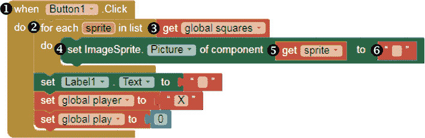

##### 清空游戏板

为了让 X 和 O 图片消失，我们将使用另一个 `for each item` 和 Any ImageSprite 方块，使应用程序遍历每个 `ImageSprite`，并将其 `Picture` 的名称设置为空字符串，这样它就不再显示图片。

点击 Blocks 面板中的 Button1，并将其 whenButton1.Click 事件处理程序块 ➊ 拖动到 Viewer 中。然后从控制抽屉中拖入一个 `for each item` 方块 ➋，并将其插入到 whenButton1.Click 方块的 `do` 旁边，再将 item 改为 sprite。

接下来，从变量抽屉中拖动一个“获取全局方块”块 ➌，并将其连接到“每个精灵”块右侧，位于 `list` 字样旁边。然后，在 `do` 旁边，拖动一个“设置 ImageSprite.Picture”块 ➍，从“任意 ImageSprite”抽屉中拖入，填充其第一个插槽时，悬停在“每个精灵”块中的精灵上并拖入其“获取精灵”块 ➎，将第二个插槽填充为拖入一个空字符串块 ➏。这些块会在玩家点击按钮时清除游戏板上的所有 X 和 O。

##### 重置 Label 和全局变量

现在，让我们添加那些会将 `Label1` 以及 `player` 和 `play` 变量恢复到原始状态的块。

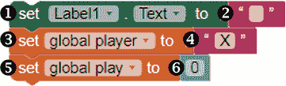

在块面板中点击 `Label1`，将其“设置 Label1.Text”块 ➊ 拖入“每个循环”下方，并将一个空字符串块 ➋ 拖入其插槽。然后，从变量抽屉中拖入一个“设置全局 player”块 ➌，将其放在“设置 Label1.Text”块下方，再放入另一个字符串块 ➍，并将其填充为 `X`。最后，从变量抽屉中拖入一个“设置全局 play”块 ➎，将其放在“设置全局 player”块下方，并将一个值为 0 的数字块 ➏ 放入其插槽。这些块会使 `Label` 文本消失，并将 `player` 和 `play` 恢复到它们原始的 `X` 和 0 值。

总之，第三步的块会指示应用在玩家点击“重置游戏”时进行重置，正如我们预期的那样。

### 测试应用

现在我们可以测试完成的应用了！当你查看你的设备时，应该仍然能看到游戏板和重置按钮，并且能够像上次测试时一样进行游戏。而现在，当你点击重置按钮时，所有 X 和 O 图形以及标签文本应该会消失。

此外，幕后中的 `player` 和 `play` 变量也应被重置，你可以通过重新开始游戏来进行测试。当你点击一个方块时，应该会出现一个 X 图形，并且你可以在标签显示“游戏结束！”之前点击所有九个空白方块。

如果你的重置按钮没有按预期工作，请调试并重试。如果有必要，通过点击顶部菜单栏的 **Connect** ▸ **Reset Connection** 来重置与你的 AI2 Companion 的连接，然后点击 **Connect** ▸ **AI Companion** 并扫描二维码来重新连接。如果你正确放置了块，应用程序应该按预期工作，且你已成功创建了“Tic Tac Toe”游戏应用！

### 总结

在本章中，你构建了“Tic Tac Toe”应用，使用 App Inventor 的 `Canvas` 和 `ImageSprite` 组件为两名玩家创建了一个井字游戏。在构建应用的过程中，你学习了如何创建组件列表，使用任何组件块访问组件的属性，并通过 `for each` 循环遍历列表以设置和帮助控制游戏流程。你还更深入地使用了 `if then` 和逻辑及比较操作符块来控制应用程序的流程。

在下一章中，你将学习如何通过编写*过程*（在某些编程环境中称为*方法*和*函数*）使你的代码具有可重用性，使用过程块。在你的代码中，你将为“乘法站 II”应用创建并调用过程，这将允许用户选择两种计时乘法题目难度之一。

### 独立完成

在修改和扩展“井字游戏”以完成这些练习时，保存新版本。你可以在 *[`nostarch.com/programwithappinventor/`](https://nostarch.com/programwithappinventor/)* 在线找到解决方案。

1.  扩展游戏，使其能够指示当某个玩家赢得比赛时，即当玩家在三格中连续放置了 X 或 O，无论是水平、垂直还是对角线方向。

1.  进一步扩展应用，使其使用一个额外的组件来指示哪个玩家赢得了比赛。
