## 第七章：**乘法车站 II：通过过程重用代码**

有时你可能想要重复使用某段代码来完成之前已经完成的特定任务。在这些情况下，你可以定义或创建一个*过程*，将这些代码行包含在其中，然后为该过程命名一个独特的名字。

这样，每当你想执行那个任务时，只需通过名称调用该过程，而无需一遍又一遍地编写相同的代码。这也意味着，当你需要修正那段代码时，只需修正过程中的代码一次。

在本章中，你将学习如何在 App Inventor 中创建过程并使用它们来制作“乘法车站 II”应用程序。正如你将看到的，过程不仅帮助你避免重复相同的代码，它们还使得冗长复杂的代码更加有序，易于阅读。

### 过程可以接受参数

让我们通过一个简单的例子来看看过程是如何工作的。假设你写了一段代码，用来计算某人生日还有多少天。你可以用这几行代码创建一个过程，并给它起个名字，比如 `BdayCountDown`。现在，每当你需要倒数某人生日时，只需*调用* `BdayCountDown` 过程。相当方便吧！

就像我们在一些应用程序中使用的内置方法一样，过程可能需要*参数*，这些参数在定义过程时必须声明并命名。在生日示例中，`BdayCountDown` 过程将接受一个人的出生月份和日期作为参数来计算结果。这意味着，在调用 `BdayCountDown` 时，你需要提供过程所需的*参数*，以完成该任务。在这种情况下，过程将接受表示出生日期的数字作为其参数。

由于每次调用过程时传入的参数可能不同，因此一个过程可能每次调用时都会产生不同的结果。这在生日示例中也很有道理：由于大多数人生日不同，过程会返回不同的结果。

### 创建你自己的过程

你已经使用过 App Inventor 的多个内置过程，既有带参数的，也有不带参数的。例如，在第一章的“你好，世界！”中，你使用了内置的 `SpeechRecognizer.GetText` 方法来将语音信息转换为文本。在第三章的“水果战利品”应用程序中，你使用了 `ImageSprite.Move` 方法调用，将 `ImageSprite` 移动到 `Canvas` 上，这需要传递 x 和 y 坐标作为参数。

除了内置的方法外，App Inventor 还提供了让你创建自己过程的块，这些过程可以有或没有返回结果，并且可以有多个参数或根本没有参数。一旦你创建了一个具有唯一名称的过程，App Inventor 会为该过程创建一个专用的块，供你调用，块上有插槽可以插入任何参数。你将在“过程”块抽屉中找到调用块。

让我们尝试创建自己的过程来修改我们已经做过的某些应用中的代码。我们将重构“Fruit Loot”中的代码，以便不再在三个`EdgeReached`事件处理程序中重复相同的块，这些块告诉应用在每个果实`ImageSprite`到达`Canvas`边缘后该做什么。

以下代码展示了我们在第三章中编写的`EdgeReached`事件处理程序。

如你所见，我们复制了块来为`FruitSprite1`、`FruitSprite2`和`FruitSprite3`创建了三个单独的`EdgeReached`事件处理程序。在每个副本中，我们仅修改了几个设置`ImageSprite`的`X`属性的块，以确保果实`ImageSprite`在`Canvas`上掉落时不会相互碰撞。

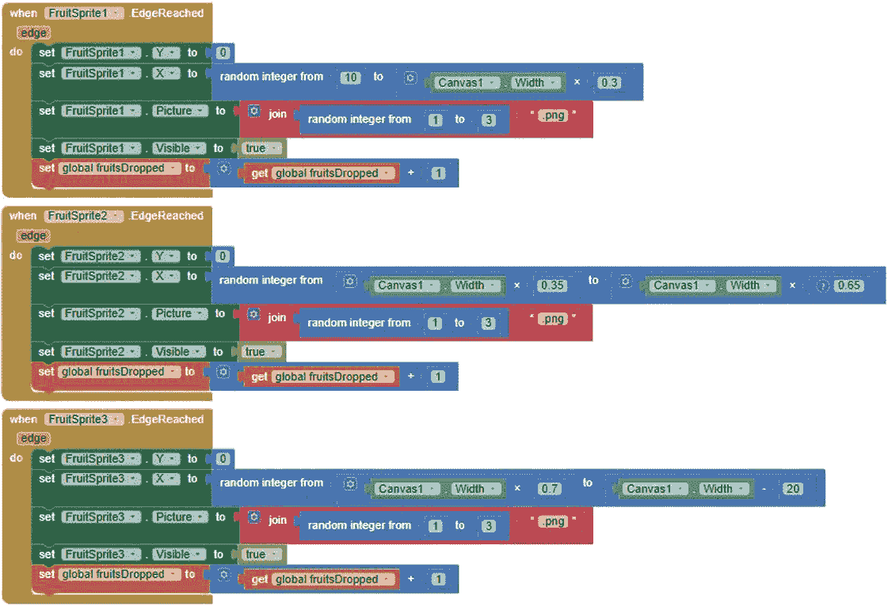

现在将其与以下代码进行对比，该代码展示了一个`backToTop`过程，完成相同任务，但如果我们在所有三个果实`ImageSprite`的事件处理程序中调用它，则所需的块要少得多。

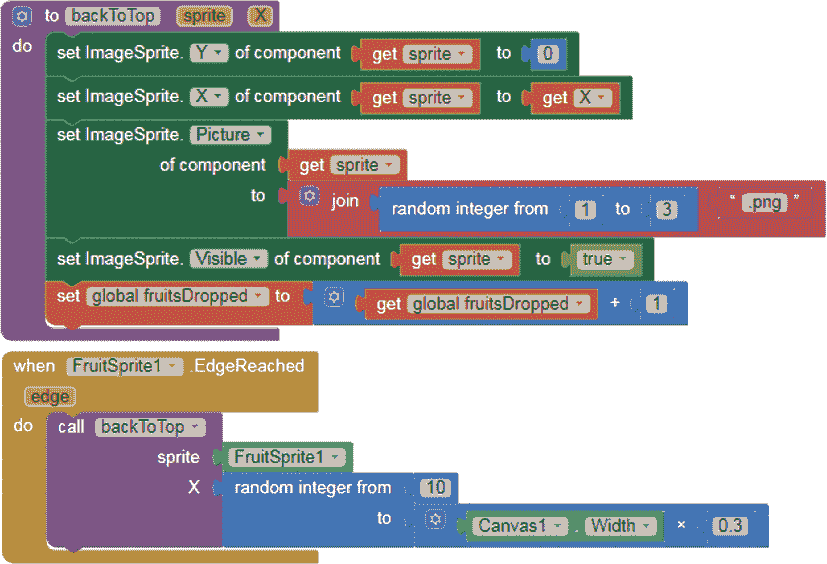

要创建`backToTop`过程，我们需要定义`sprite`和`X`这两个参数，它们是每次调用该过程时可能变化的信息——即要调整的`ImageSprite`和我们希望将其移动到屏幕顶部的 x 坐标。

#### 定义参数

登录 App Inventor，选择**项目** ▸ **我的项目**，从你的项目列表中选择“Fruit Loot”应用。

转到块编辑器，点击块面板中的**过程**块抽屉。将“to procedure do”块拖到查看器中，点击“procedure”，并通过输入“backToTop”重命名它。

然后点击位于`to backToTop`文字左侧的蓝色变异器图标，将两个 input:x 块拖到弹出对话框中的输入框，并将其重命名为 input:sprite 和 input:X。你的输入框应如下所示图 7-1。一旦变异器对话框关闭，你还应该能在`to backToTop`块的右侧看到参数`sprite`和`X`，正如前面的代码所示。

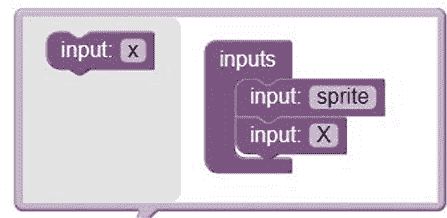

*图 7-1：为`backToTop`过程添加参数的块*

现在，我们可以编程`backToTop`，使其执行我们在每个原始`EdgeReached`处理程序中编写的完全相同的命令。但不同的是，代替为特定的`ImageSprite`使用块，我们将使用通用的 Any `ImageSprite`设置器块。这样，每次调用该过程时，设置器块将会修改过程`sprite`参数中引用的`ImageSprite`，也就是撞击边缘的`ImageSprite`。

要添加设置器块，请点击“块”窗格底部“Any Component”类别列表左侧的加号，然后点击**Any ImageSprite**抽屉，将 setImageSprite.Enabled 块拖到查看器中，并复制三次。现在你应该在查看器中有四个`set ImageSprite.Enabled`块。你将使用这些块来设置`ImageSprite`的`Y`、`X`、`Picture`和`Visible`属性，如前所示。

##### 设置 ImageSprite 的 Y 和 X 属性

我们将首先设置给定的`ImageSprite`的`Y`和`X`属性，使`ImageSprite`返回到屏幕顶部的随机位置，然后再掉落。

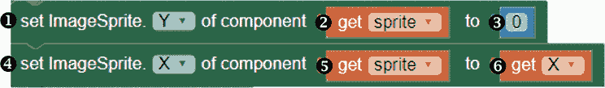

这些块首先获取在`backToTop`过程调用中作为`sprite`参数传递的`ImageSprite`的`Y`属性（即掉落并撞击边缘的`ImageSprite`），并将其设置为`0`。这会将`ImageSprite`移动回屏幕顶部。将第一个 setImageSprite.Enabled 块 ➊ 拖到 backToTop 过程块中的`do`旁边，点击`Enabled`右侧的下拉箭头，选择`Y`替换`Enabled`。然后将过程的`sprite`参数上的获取 sprite 块 ➋ 拖到 setImageSprite.Y 块的第一个插槽。将原来 FruitSprite1 EdgeReached 处理程序中 Y 属性设置块的数字 0 块 ➌ 拖到第二个插槽。

现在，我们将添加块来设置给定的`ImageSprite`的`X`属性为给定的随机`X`值，这会将`ImageSprite`移动到屏幕顶部的随机位置。为此，将第二个 setImageSprite.Enabled 块 ➍ 拖到 setImageSprite.Y 块下方的过程块中，并在下拉菜单中选择`X`来替换`Enabled`。将另一个获取 sprite 块 ➎ 拖到 setImageSprite.X 块的第一个插槽，鼠标悬停在过程的`X`参数上，将其获取 X 块 ➏ 拖到第二个插槽。

##### 设置 ImageSprite 的 Picture 和 Visible 属性并增加 fruitsDropped

接下来，我们将添加设置块，设置给定的`ImageSprite`的新`Picture`和`Visible`属性，并增加`fruitsDropped`变量的值。

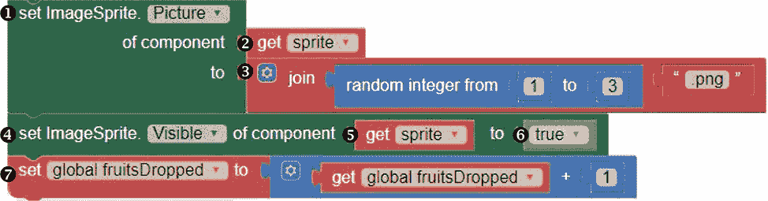

首先，我们将放置一些代码块，使得给定的`ImageSprite`的`Picture`属性随机设置为*1.png*、*2.png*或*3.png*，每个图片代表一种不同的水果。这样可以确保玩家不会知道接下来掉落的是苹果、柠檬还是橙子。为了做到这一点，将第三个 setImageSprite.Enabled 块 ➊ 拖入`setImageSprite.X`块下的过程块，并通过选择下拉菜单中的`Picture`来替换 Enabled。再将另一个 get sprite 块 ➋ 拖入第一个插槽，然后将原`EdgeReached`事件处理程序中的`Picture`设置器块中的 join 块 ➌ 拖入第二个插槽。

然后，我们将添加另一组代码块，以确保如果图像之前被拾取器碰到并消失，它仍然能显示出来。将第四个 setImageSprite.Enabled 块 ➍ 拖入`setImageSprite.Picture`块下的过程块，并通过选择下拉菜单中的`Visible`来替换 Enabled。再将另一个 get sprite 块 ➎ 拖入第一个插槽，然后将原`EdgeReached`事件处理程序中的`Visible`设置器块中的 true 块 ➏ 拖入第二个插槽。

最后，为了完成`backToTop`过程，我们将添加一些代码块，当调用此过程时，将`fruitsDropped`变量的值加 1。这样我们就能跟踪游戏中掉落的水果总数。为此，将原`EdgeReached`事件处理程序中的 set global fruitsDropped 块 ➐ 拖入`setImageSprite.Visible`块下的过程块。

#### 调用过程

有了这个过程，我们不再需要将这五个设置器块添加到每个`EdgeReached`事件处理程序中。

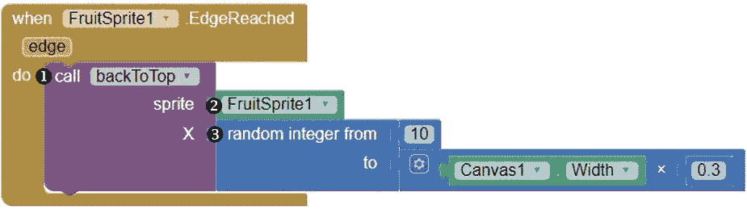

我们可以通过简单地将`call backToTop`块 ➊ 从过程面板拖入每个`ImageSprite`的`EdgeReached`事件处理程序来处理每个水果`ImageSprite`的`EdgeReached`事件。

然后，我们可以在代码块面板中点击`ImageSprite`；将最后一个代码块，它的 getter 块 ➋，拖入`call backToTop`精灵插槽中，以提供`sprite`参数的参数；并将原`EdgeReached`事件处理程序中的 X 设置器块中的随机整数块 ➌ 拖入`call backToTop X`插槽中，以提供`X`参数的参数。添加了`call`块到每个`ImageSprite`的`EdgeReached`事件处理程序并按照描述填充了参数插槽后，记得从所有三个`EdgeReached`事件处理程序中删除五个原始设置器块。

现在我们不仅可以在“水果掉落”游戏中使用`backToTop`过程，还可以在任何其他类似的游戏中使用。既然我们在这里创建了这个过程，我们就不再需要每次重新思考如何将随机掉落且不碰撞的图像移动回屏幕顶部以便再次掉落，无论它们是球、鸟还是其他任何东西。

**注意**

*你可以通过右键点击区块并选择“添加到背包”来将一个程序或任何其他区块从一个应用项目转移到另一个应用项目。这一操作会将区块的副本添加到位于区块编辑器窗口右上角的背包中。要从背包中取出区块，点击背包并将区块拖到查看器中。*

### 构建“乘法站 II”应用

让我们定义另一个多参数过程，基于第四章中的原始“乘法站”应用进行扩展。完成后，用户应该可以选择两种难度级别的乘法题目。我们还将重新设计应用的欢迎界面，创建新的全局列表变量来呈现选项，并包含一个`if then`区块来告诉应用在用户选择每个练习级别时应显示什么。

首先，打开你原来的“乘法站”应用，方法是选择**项目** ▸ **我的项目**，如图 7-2 所示，从你的项目列表中选择“乘法站”应用。

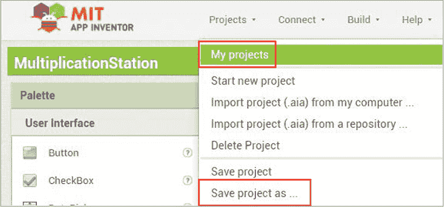

*图 7-2：打开和保存项目的项目菜单*

一旦“乘法站”打开，选择**项目** ▸ **另存为…**，然后通过输入“MultiplicationStationII”并去掉空格来重命名项目，接着点击**确定**。

#### 分解“乘法站 II”

我们希望修改原有的“乘法站”应用，使得用户打开应用后，可以选择 1 级（较易）或 2 级（更具挑战性）的题目进行练习，并且在 2 级题目上有更多的时间来解决。

我们可以将“乘法站 II”中的新动作分解为三个步骤：

1.  当用户打开应用时，播放欢迎信息。显示`ListPicker`供用户点击选择练习级别。

1.  用户点击`ListPicker`选择练习级别后，播放另一条信息，说明每道题目可用的答题时间。打开并将选定的题目级别传递给练习屏幕。

1.  当`Clock`的计时器触发时，在正确的时间间隔显示一个随机的乘法问题，具体问题级别根据选定的级别来定。

你需要以下新的组件：

+   用于用户点击选择题目级别并打开练习屏幕的`ListPicker`（这将替代欢迎屏幕上的原始开始按钮）

+   显示问题并根据选定的题目级别设置`Clock`计时器间隔的过程

+   用于存储问题级别和计时器间隔的变量（2）

#### 在设计器中布局“乘法站 II”

现在，欢迎屏幕只给用户一个选项——点击开始按钮并开始练习。为了让用户先选择乘法题目的难度级别，我们只需要从欢迎屏幕上移除`Button1`，并用`ListPicker`替换它。一旦我们调整`ListPicker`的属性，使其看起来与`Button1`相似，新的欢迎屏幕应该类似于图 7-3。

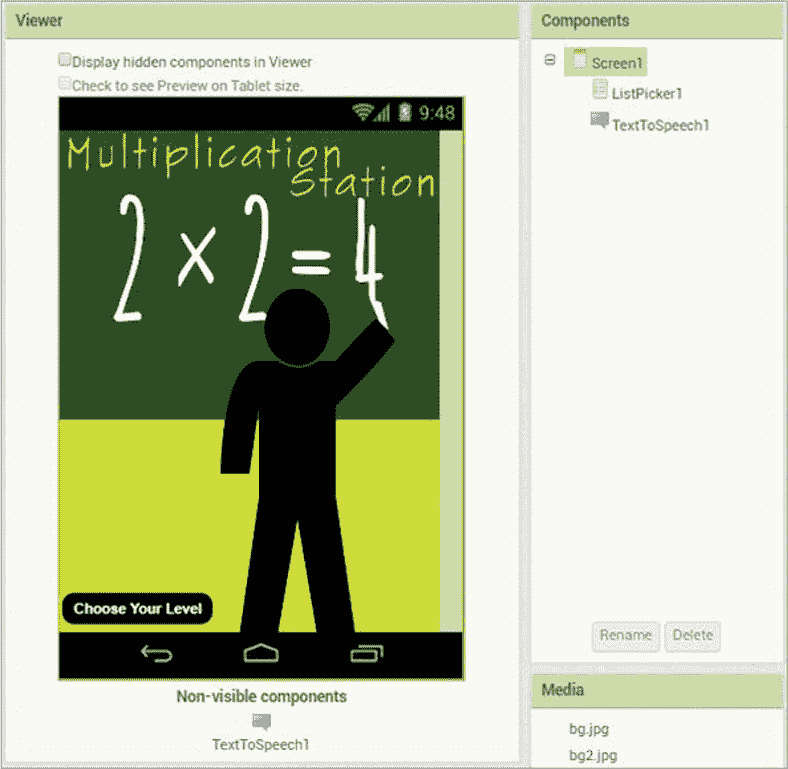

*图 7-3：显示“乘法站 II”布局的查看器、组件和媒体窗格*

要进行这些更改，首先进入`Screen1`的设计器。点击组件窗格中的 Button1，点击**删除**，然后在弹出的对话框中再次点击**删除**。

现在，从用户界面抽屉中拖动一个`ListPicker`，并将其放置在刚才删除`Button1`的位置。调整`ListPicker`的属性，使其看起来像`Button1`。在属性窗格中，点击背景色下的**默认**，然后在颜色列表对话框中点击**黑色**，将背景色改为黑色。通过点击字体粗体下的复选框使文本加粗，并点击**形状**下的下拉箭头选择**圆角**来改变它的形状。

接下来，在**文本**下的文本框中输入“选择你的级别”，让用户知道点击`ListPicker`来选择他们的题目级别。然后，点击文本对齐下的下拉箭头并选择**居中：1**，将文本居中，并点击文本颜色下的**默认**，然后在颜色列表对话框中点击**白色**，将文本颜色改为白色。此时，`Screen1`应该在查看器中看起来像图 7-3。

### 编程“乘法站 II”

现在让我们按照之前概述的步骤为“乘法站 II”编写新的功能程序。为了显示正确的题目级别，我们将创建两个新的列表变量和一个带参数的过程。我们将在过程里添加一个`if then`块，以便应用程序知道在每个`Clock`计时器间隔时，应该显示一级题目还是二级题目。

我们还将编程两个新的事件处理器，以便在用户选择了`ListPicker`中的级别之前和之后，应用程序知道应该怎么做。开始编程时，点击**块**按钮切换到块编辑器，并确保你在`Screen1`上。

#### 步骤 1：设置题目级别选择并播放新的欢迎信息

一旦屏幕打开，我们希望显示带有题目级别选项的`ListPicker`，供用户选择。我们将通过播放应用的欢迎信息提示用户选择练习题目级别。

##### 创建全局级别和秒数列表变量

在这一步中，我们将使用两个全局列表变量：`level`，它存储 `ListPicker1` 的两个问题级别选项，以及 `seconds`，它保存每个级别解题时可用的秒数。按照这里显示的方块创建这两个列表。

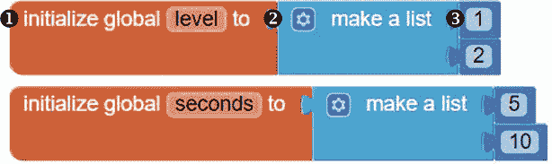

要创建每个变量，点击 **变量** 方块抽屉，并将初始化全局名称方块 ➊ 拖到查看器中，点击名称并将其替换为变量名（在此案例中为 level 和 seconds）。然后从列表抽屉中拖动一个创建列表方块 ➋，并将其连接到初始化全局方块的右侧。最后，从数学抽屉中拖动两个 0 数字方块 ➌，并将它们插入到创建列表方块的插槽中。接着，将每个数字方块中的 0 替换为 level 中的 1 和 2（对应两个可能的题目级别），以及 seconds 中的 5 和 10（对应每个级别可用的秒数）。

我们在两个变量中放置的相同索引位置的项目是相对应的。这意味着我们可以通过查看 `level` 和 `seconds` 变量中相同位置的项目，来了解每个级别可用的秒数。在这里，你可以看到，级别 1 的题目有 5 秒可用，级别 2 的题目有 10 秒可用。

##### 编程欢迎屏幕事件处理器

现在我们可以开始编写应用对这两个事件的响应：`ListPicker BeforePicking` 和 `ScreenInitialize` 事件。这里我们想要为 `ListPicker` 设置题目级别选项，并播放欢迎信息。

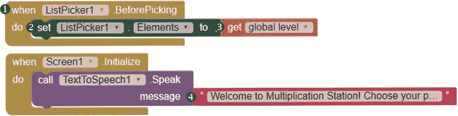

创建了 `level` 后，我们就有了设置 `ListPicker1` 选项所需的数据。在用户从 `ListPicker1` 选择之前，我们需要将这些选项设置为 `level` 列表中的项目，以便用户可以在级别 1 和级别 2 之间进行选择。我们将通过 `ListPicker BeforePicking` 事件处理器来编程这一操作。

在方块面板中，点击 `ListPicker1`，然后将 `whenListPicker1.BeforePicking` 事件处理方块 ➊ 拖到查看器中。接着，再次点击 `ListPicker1`，将它的 `setListPicker.ElementsTo` 方块 ➋ 拖入，并将其放置在 `whenListPicker1.BeforePicking` 方块中 `do` 字样旁边。然后，在方块面板中，点击 **变量** 方块抽屉，拖动 `get global level` 方块 ➌ 进去，并将它连接到 `setListPicker1.ElementsTo` 方块的右侧。这三个方块构成了 `BeforePicking` 事件处理器，用于设置用户在点击 `ListPicker1` 时将看到的题目级别选项。

最后，对于`whenScreen1.Initialize`事件处理器，我们已经将其拖到原始“乘法站”应用的查看器中，除了持有`message`参数的字符串块外，我们可以保持所有块不变。在该字符串块➍中，将文本更改为“欢迎来到乘法站！选择您的问题级别开始练习。”这样，用户在打开应用时会听到这个消息。

在设备上进行实时测试这些事件处理器。当您的“乘法站 II”应用在设备上打开时，您应该能听到欢迎消息。您还应该能看到屏幕上的“选择你的级别”按钮，当您点击它时，您应该能看到两个选择，1 和 2。目前，如果您尝试选择任何一个选项，什么也不会发生。我们接下来将编程该`AfterPicking`操作。

如果应用未按描述的方式工作，请调试并确保您已正确创建并放置了块。当一切正常时，请保持应用在设备上打开以继续进行实时测试。

#### 步骤 2：声明每道题的秒数并打开练习屏幕

我们使用`ListPicker AfterPicking`事件来告诉用户根据他们选择的级别，每道题的回答时间有多少秒。然后，我们将编程让应用程序打开练习屏幕，并将所选问题级别的值传递到该屏幕。以下是指引此操作的块。

首先，我们编程让应用程序在用户选择问题级别后发声。

##### 告诉用户时间限制

在“块”面板中，点击 ListPicker1 并将`whenListPicker1.AfterPicking`事件处理块➊拖到查看器中。然后，点击 TextToSpeech1 并将其`callTexttoSpeech1.Speak`块➋拖入`whenListPicker1.AfterPicking`块的`do`字样旁边。

接下来，为了提供`callTexttoSpeech1.Speak`块的`message`参数所需的参数，让应用知道该说什么，从文本块面板拖动一个`join`块➌到查看器中。然后，向`join`块中添加另一个字符串输入，并将其拖到`callTexttoSpeech1.Speak`块的`message`旁边。这样，我们就可以将三个字符串组合在一起，形成`TextToSpeech1`的`message`。如果用户选择了问题级别 1，我们将填充`join`块的输入，将`message`设置为“你将有 5 秒来回答每道题”；如果用户选择了问题级别 2，我们将`message`设置为“你将有 10 秒来回答每道题”。

为了填充`join`块的顶部和底部输入，从文本块面板中拖入两个空字符串块，点击它们的文本区域，并在顶部字符串块➍中输入“你将有”（`have`后留一个空格），在底部字符串块➎中输入“秒来回答每道题”（`seconds`前留一个空格）。

然后，对于`join`块的中间输入，我们需要添加用户回答每道题目所需的秒数。我们将通过让应用选择`seconds`列表中与用户在`level`列表中的`ListPicker`选择相同索引位置的项来获取该值。

要编程此功能，请从列表块抽屉中拖入一个选择列表项块 ➏，并将其放入`join`块的中间输入。接着，通过点击**变量**块抽屉，拖入获取全局秒数块 ➐，并将其放入选择列表项块的列表插槽，来确定我们希望应用选择的列表。最后，通过点击 ListPicker1 并拖入 ListPicker1.SelectionIndex 块 ➑，将其放入选择列表项块的索引插槽，来确定从`seconds`列表中选择项的索引位置。

##### 进入练习屏幕

一旦用户选择了一个问题级别，我们将打开`Screen2`练习屏幕，并将用户在`ListPicker`中选择的值传递到该屏幕。

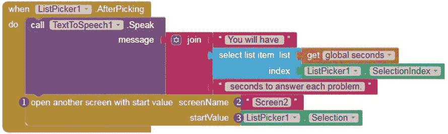

在 Blocks 窗格中，点击**控制**块抽屉，拖入“用起始值打开另一个屏幕”块 ➊，并将其放入`callTexttoSpeech1.Speak`块下的 whenListPicker1.AfterPicking 块中。

这个`用起始值打开另一个屏幕`块要求我们提供一个`screenName`，即我们想要打开的屏幕的名称（`Screen2`），以及要传递给`Screen2`的`startValue`（用户在`ListPicker1`中选择的题目级别）。为了提供这些值，在 Blocks 窗格中，点击**文本**块抽屉，拖入另一个空字符串块 ➋，并将其放入`screenName`插槽。然后在空字符串块中输入 Screen2，以提供我们想要打开的屏幕名称。

然后，为了识别我们想要传递给`Screen2`的起始值，点击 ListPicker1，将其 ListPicker1.Selection 块 ➌拖入，并将其连接到`startValue`插槽。

测试这些块的功能。打开应用后，你应该会听到欢迎信息并看到“选择你的级别”按钮。点击按钮后，你应该会看到数字 1 和 2 作为选项。当你点击数字 1 时，你应该听到应用说你有 5 秒钟来回答每道题，而点击数字 2 时，它应该说你有 10 秒钟。然后，应用应该会将你带到练习屏幕。

我们将在编写下一步程序后，等待测试应用是否正确传递起始值到练习屏幕。确保你在应用中编程的其他部分按描述工作，并在手机上保持应用开启进行更多的实时测试。

#### 步骤 3：显示练习题

就像原始的“乘法站”应用一样，这个应用通过将一个随机整数（全局变量`a`的值）、乘法符号（`×`）和另一个随机整数（全局变量`b`的值）连接起来，显示乘法问题。该应用还为用户提供了一个固定的时间间隔来回答每个问题。在这一步，我们将创建`setLevel`过程，根据用户选择的难度级别，设置`a`和`b`的值以及`Clock`计时器的时间间隔。

我们将使`setLevel`过程需要五个参数：`a1`、`a2`、`b1`、`b2`和`interval`。参数`a1`和`a2`设置全局变量`a`的随机整数范围，这个数字是每个乘法问题中的第一个随机数；参数`b1`和`b2`设置全局变量`b`的随机整数范围，这个数字是每个乘法问题中的第二个随机数。`interval`参数则保存时间间隔，单位是毫秒。一旦`setLevel`在过程调用中接收到这些参数，它将把全局变量`a`设置为在`a1`和`a2`之间的随机数，将全局变量`b`设置为在`b1`和`b2`之间的随机数，并将`Clock`计时器的时间间隔设置为`interval`。

这就是`setLevel`过程的样子。

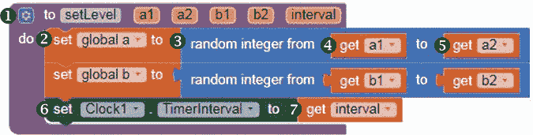

我们将在一个`if then`块中调用`setLevel`，以根据选择的难度级别，在乘法问题中填入正确的数字，并为用户提供适当的练习时间。

##### 创建 setLevel 过程

要创建`setLevel`，请在`Screen2`块面板中点击**过程**块抽屉，将一个到过程执行块 ➊ 拖动到查看器中，然后点击过程并通过输入 setLevel 来重命名它。这个过程块与全局变量一样，将单独放在所有事件处理程序之外，如果需要，我们可以在每个事件处理程序内调用这个过程。

接下来，通过点击位于`to setLevel`左侧的蓝色变更图标，并将五个 input:x 模块拖动到弹出的对话框中的输入块，列出所需的过程参数。将它们重命名为 input:a1、input:a2、input:b1、input:b2 和 input:interval。

现在让我们编程`setLevel`将执行的操作。我们将从设置全局变量`a`为一个在`a1`和`a2`之间随机选择的数字开始。点击**变量**块抽屉，将一个设置全局 a 块 ➋ 拖动到`to setLevel`块旁的`do`字样位置。然后从数学块抽屉中拖动一个随机整数块 ➌，并将其连接到设置全局 a 块的右侧。通过将鼠标悬停在过程的 a1 参数上并拖入获取 a1 块 ➍，将随机整数块的第一个插槽填充，再通过将鼠标悬停在 a2 参数上并拖入获取 a2 块 ➎，填充其第二个插槽。

要将全局变量 b 设置为从 b1 到 b2 的随机数，只需按照上述相同的过程，将全局变量 b 的相关块从➋到➎复制一遍，并将复制的块插入到 set global a 块下方。使用下拉箭头将全局 a 更改为全局 b，a1 更改为 b1，a2 更改为 b2。

最后，为了完成`setLevel`过程，我们将设置`Clock`的`TimerInterval`为过程调用中提供的`interval`参数值。点击块面板中的 Clock1，并将其 setClock1.TimerIntervalto 块 ➏拖动到 set global b 块下的 setLevel 块中。然后将鼠标悬停在过程的 interval 参数上，并将其 get interval 块 ➐拖动到 setClock1.TimerIntervalto 块的右侧。

##### 调用 setLevel

我们现在可以在`ClockTimer`事件处理程序中调用`setLevel`，这样应用程序就能在正确的时间显示每个级别的正确问题。以下代码展示了如何在新的`if then else`块中调用`setLevel`，并在`whenClock1.Timer`块内提供一组参数值，如果从`Screen1`传递的起始值等于`1`，否则提供另一组参数值。

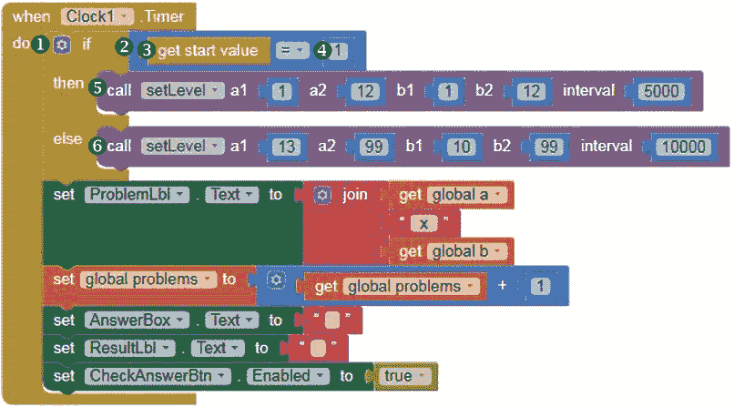

在这里，我们通过将原本“Multiplication Station”应用程序中的`whenClock1.Timer`事件处理程序块中的全局变量`a`和全局变量`b`设置器块替换为`if then else`块来进行更改。删除这两个设置器块，拖动一个 if then 块 ➊从控制块抽屉中到查看器，点击蓝色变换器图标添加 else 输入，并将 if then else 块插入到 whenClock1.Timer 块中的`do`旁边。

现在，我们将添加块来测试从`Screen1`传递的起始值是否等于`1`，这意味着用户在`Screen1`的`ListPicker`中选择了问题级别 1。拖动一个=比较块 ➋到数学抽屉中，并将其插入到 if then else 块的 if 插槽中。将=比较块的左操作数插槽填充为从控制抽屉中获取的 get start value 块 ➌，将右操作数插槽填充为 1 数字块 ➍。

接下来的块告诉应用程序如何响应测试条件的答案，即起始值是否等于`1`。如果答案是是，我们希望应用程序设置级别 1 问题的正确问题和时间间隔。如果答案是否，我们希望应用程序设置级别 2 问题的正确问题和时间间隔。在每种情况下，我们都将通过调用`setLevel`过程来指引操作。

要添加这些过程调用的块，点击**Procedures**抽屉，拖动一个调用 setLevel 块 ➎并将其插入到 if then else 块的 then 插槽中。然后再拖动另一个调用 setLevel 块 ➏并将其插入到 if then else 块的 else 插槽中。接下来，为每个调用块填充参数值，如表 7-1 所示。

**表 7-1：** 调用`setLevel`时设置的参数

| if then else **块插槽** | a1 | a2 | b1 | b2 | interval |
| --- | --- | --- | --- | --- | --- |
| `then` | `1` | `12` | `1` | `12` | `5000` |
| `else` | `13` | `99` | `10` | `99` | `10000` |

每次`Clock`定时器触发时，如果从欢迎界面传递的起始值等于`1`（`then`，用户选择了问题难度 1），应用程序调用`setLevel`过程，将全局变量`a`设置为 1 到 12 之间的随机数，将全局变量`b`设置为 1 到 12 之间的随机数，并将`Clock`定时器间隔设置为 5 秒。

如果从欢迎界面传递的起始值不等于`1`（`else`，用户选择了难度 2），应用程序调用`setLevel`过程，将全局变量`a`设置为 13 到 99 之间的随机数，将全局变量`b`设置为 10 到 99 之间的随机数，并将`Clock`定时器间隔设置为 10 秒。

现在，让我们切换到`Screen1`并测试已完成的应用！当欢迎界面在你的设备上打开时，你应该能看到`ListPicker`并听到欢迎消息。当你点击选择难度并做出选择时，应用应该告诉你回答每个问题需要多少秒。练习界面也应该打开，如果你选择了难度 1，问题应该每 5 秒出现一次，或者如果你选择了难度 2，问题应该每 10 秒出现一次。此外，问题的数字应该来自于所选问题难度级别的预期范围。

如果应用的任何部分没有按计划工作，请进行调试并重试。如果你正确放置了代码块，应用应该按预期运行，你就成功创建了“乘法车站 II”！

### 总结

在本章中，你构建了“乘法车站 II”应用，它是在你在第四章创建的原始“乘法车站”应用的基础上开发的，允许用户选择问题的难度级别，并将选择传递到下一个界面。你学会了如何使用过程来复用设置问题和时间限制的代码，而不是一遍遍使用相同的代码块。你还更多地使用了列表、`if then`和关系运算符块来控制应用的流程。

在下一章中，你将学习如何创建允许用户在屏幕上绘制并拖动图像的应用程序。你将创建“虚拟太阳镜”应用，用户可以拍摄自拍照，拖动不同款式的太阳镜放置到照片上，进行“试戴”，并在照片上用不同颜色的“墨水”绘制和输入文字。

### 自行完成

当你准备好挑战时，保存之前应用的最新版本，并尝试这些练习。你可以在 *[`nostarch.com/programwithappinventor/`](https://nostarch.com/programwithappinventor/)* 在线找到解决方案。

1.  在《乘法车站 II》中，试着在练习界面添加一个暂停按钮，以便用户在需要时能够暂时停止练习。作为这个扩展的一部分，编写并调用一个过程。

1.  编写并调用一个过程，修改你在第四章中写的代码，以允许用户选择练习乘法或除法题目。
