## **虚拟太阳镜：绘制和拖动图像**

在 第三章 和 第六章 的“Fruit Loot”和“井字游戏”中，你通过编写 `EdgeReached`、`TouchDown` 和其他事件处理程序，使用 App Inventor 的绘图和动画组件动画化了 `Canvas` 和 `ImageSprite`。

在本章中，我们将编写 `Canvas` 和 `ImageSprite` 的移动、绘制、拖动方法以及事件处理程序，创建一个允许用户在智能手机或平板电脑屏幕上绘画、输入文本和拖动图像的应用程序。开发人员使用类似的功能来构建允许用户移动元素、手写笔记和在屏幕上涂鸦的应用。

### 构建“虚拟太阳镜”应用

“虚拟太阳镜”应用让用户通过相机拍摄自己的照片，然后将太阳镜的图像拖动到自拍照上，进行虚拟试戴。在构建这个应用的过程中，你将学习如何使用 `Camera` 来创建 `Canvas` 背景，使用 `Slider` 调整其他组件，并使用 `Notifier` 收集用户输入。你还将练习使用已经学过的许多编程概念。

要开始，请登录到 App Inventor 并创建一个名为 VirtualShades 的新项目。

#### 分解“虚拟太阳镜”

对于这个应用，用户应能够拍摄一张照片作为 `Canvas` 背景，将不同的太阳镜图像拖到照片上，并调整太阳镜的大小以适应。用户还应能够在照片上涂鸦并添加文本；将其保存为可查看、发送邮件或短信的图像；并且可以随时清除太阳镜以及所有绘画和文本。

我们可以将这个操作分解为八个步骤：

1.  用户点击拍照按钮时，打开设备的相机。将用户拍摄的照片设置为 `Canvas` 背景。

1.  当用户点击 `ListPicker` 时，显示可用太阳镜的列表。

1.  用户选择一副太阳镜后，将其显示在 `Canvas` 上。

1.  当用户在 `Canvas` 上拖动太阳镜时，将它们移动到用户拖动的位置。当用户移动 `Slider` 的滑块时，调整太阳镜的大小。

1.  用户点击绘制按钮时，显示一个 `Notifier` 提示，告知用户在哪里绘制。当用户在 `Canvas` 上拖动手指时，在用户拖动的地方进行绘制。

1.  当用户点击输入按钮时，显示一个带有文本框的 `Notifier`，用户可以在其中输入文本。用户提交文本后，将其显示在 `Canvas` 底部。

1.  用户点击保存按钮后，将 `Canvas` 的图片存储到设备中，并显示一个 `Notifier` 提示，告知用户存储位置。

1.  当用户点击垃圾桶按钮时，清除 `Canvas` 上的所有太阳镜、标记和文本。

你将需要以下组件：

+   按钮（5）供用户点击以打开相机、绘画、输入文本、保存和清除 `Canvas`。

+   使用 `Camera` 打开设备的相机

+   使用 `Canvas` 来实现拖动和绘制

+   水平排列（HorizontalArrangement）(2)，用于容纳 `Label`、`Slider` 和 `Button`

+   `ImageSprite`（4），用户可以在 `Canvas` 上拖动

+   标签，用于提供 `Slider` 方向

+   列表选择器（ListPicker），供用户点击选择太阳镜 `ImageSprite`

+   通知器，用于显示警报并捕获用户的文本输入

+   清除 `Canvas` 上图像并重置 `Slider` 的过程

+   用于调整 `ImageSprite` 大小的 Slider

+   变量 (2)，用于存储 `ImageSprite` 和它们的描述

+   `VerticalArrangement`，用于包含除拍照 `Button` 外的所有可见组件

#### 在设计器中布局“虚拟遮阳板”

现在让我们开始在设计器中布局应用程序，调整应用屏幕。

##### 调整屏幕

首先，将屏幕的水平对齐方式改为居中所有内容。然后，为了给用户提供更多的空间“试戴”太阳镜，在用户旋转设备时，保持屏幕处于纵向模式。为此，选择屏幕方向下的**纵向**。同时，隐藏状态栏和屏幕标题，以免占用空间，通过取消勾选状态栏和标题可见性选框。

##### 添加 Canvas 和 ImageSprites

我们将大多数可见组件放在一个 `VerticalArrangement` 中，这样我们就可以将它们作为一组设置可见性。应用程序启动时，只有用于拍照的 `Button` 应该显示，其它组件将放在 `VerticalArrangement` 中，以便我们可以在稍后隐藏它们。

从布局面板中拖动一个 `VerticalArrangement` 到 Viewer 中。在属性面板中，点击水平对齐下的下拉箭头并选择**居中: 3**，将其高度和宽度设置为**填充父级**，使其覆盖整个屏幕。

现在按照我们希望它们出现的顺序，将组件添加到`VerticalArrangement`中。首先，从“绘图和动画”面板中拖动一个 Canvas 到 VerticalArrangement1 内的 Viewer 中。在属性面板中，通过点击背景色下的框并选择**无**，移除 `Canvas` 的背景颜色。将其文本大小调整为 25，在字体大小框中输入。将其高度和宽度设置为**填充父级**，并在线宽框中将可绘制线条的宽度增加到 4。通过点击绘画颜色下的框并选择**无**，移除其绘画颜色。最后，通过点击文本对齐方式下的下拉箭头并选择**左对齐: 0**，使其文本左对齐。

现在，从绘图和动画面板中拖动四个 ImageSprite 到`Canvas`上，在组件面板中点击它们，并将它们重命名为 Sunglasses1、Sunglasses2、Sunglasses3 和 Sunglasses4。上传*tanSunglasses.png*、*purpleSunglasses.png*、*redSunglasses.png*和*blackSunglasses.png*四张图片，这些图片都来自本书的资源，点击每个`ImageSprite`的**图片**选项，上传图片。然后，通过取消选择**Visible**选项来使每个`ImageSprite`不可见，并将每个`ImageSprite`的 X 和 Y 属性都设置为 0，以便它们在应用程序中显示时出现在`Canvas`的左上角。

##### 添加用户按钮和控件

从用户界面面板中拖动一个列表选择器（ListPicker）到`Canvas`下的 VerticalArrangement1，并将其背景颜色设置为红色，字体设置为粗体，高度设置为 35 像素，宽度设置为**填充父项**。同时，将默认文本改为“选择眼镜”，并将文本颜色设置为白色。

现在我们将添加一个`Label`和一个`Slider`，它们将并排放置以节省空间。这意味着我们需要将它们放入一个`HorizontalArrangement`中。从布局面板中拖动一个 HorizontalArrangement 到 VerticalArrangement1 下的`ListPicker`位置，并将其重命名为 SliderArrangement。然后，在 AlignHorizontal 下选择**Center: 3**，并将其宽度设置为**填充父项**。

从用户界面面板中拖动一个标签（Label）和一个滑动条（Slider）到 SliderArrangement 中，并将`Label`放在左侧。将`Label`的字体设置为粗体，改变其默认文本为“调整太阳镜宽度：”，将文本居中对齐，并将文本颜色设置为红色。

将`Slider1`的 ColorLeft 设置为红色以匹配颜色方案，**宽度**设置为 40%，使其能够与`Label`并排放置。同时，为了让用户能够将太阳镜的宽度从 150 像素调整到 250 像素，将`Slider`的 MaxValue 设置为 250，MinValue 设置为 150。接下来，将 ThumbPosition 设置为 200，这样当滑块显示时，滑块的指示器将位于滑块的中间。然后，通过取消选中 ThumbEnabled 下的复选框来禁用`Slider`的指示器，这样滑块就不会移动，直到我们编写程序使它在用户将太阳镜拖到`Canvas`上后开始工作。

现在，让我们添加`Button`按钮。我们将把前四个`Button`按钮并排放置在第二个`HorizontalArrangement`中，同样是为了节省空间。将这个 HorizontalArrangement 放在 SliderArrangement 下的 VerticalArrangement1 中，并将其命名为 ButtonArrangement，通过选择 AlignHorizontal 下的**Center: 3**来使其中的内容居中，并将其宽度设置为**填充父项**。

从用户界面抽屉中拖动四个按钮到 ButtonArrangement 中，并按从左到右的顺序分别重命名为 DrawBtn、TypeBtn、SaveBtn 和 TrashBtn。然后，在每个按钮的属性面板中，在 **Image** 下上传 *DrawBtn.png*、*TypeBtn.png*、*SaveBtn.png* 和 *TrashBtn.png*，这些文件都包含在本书的资源中。将每个 `Button` 的高度设置为 50 像素，并从 **Text** 下的文本框中移除每个 `Button` 的默认文本。请注意，四个按钮在 Viewer 中可能无法完全显示，但在设备上测试时应能看到它们。

现在我们已经将所有需要的组件放置在 `VerticalArrangement1` 内，我们需要在用户拍照之前将其隐藏。要使其不可见，在其属性面板中，取消选中 **Visible** 下的复选框。

最后，添加最后一个 `Button`，这是唯一一个我们会放置在 `VerticalArrangement1` 外的可见组件。用户点击这个按钮来打开相机，当他们第一次进入应用时。将新的按钮从用户界面抽屉拖动到 Viewer 中，并在组件面板中将其重命名为 TakePicBtn。将其高度和宽度设置为 **Fill parent**，以覆盖整个屏幕。接下来，点击 **Image** 下的文本框上传 *TakePictureBtn.png*，这是本书资源的一部分，为按钮添加背景图片。同时，移除 `Button` 的默认文本。

##### 准备不可见组件

现在让我们添加并调整不可见组件。从媒体抽屉中拖动一个 Camera 组件，从用户界面抽屉中拖动一个 Notifier 组件。将 Notifier 的 BackgroundColor 更改为红色。

此时，你的屏幕应该像 图 8-1 所示。

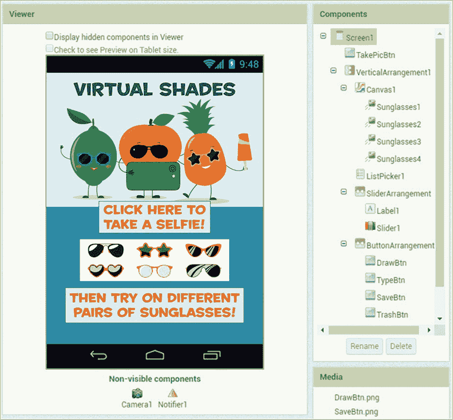

*图 8-1：在你布置“虚拟遮阳”后，Viewer、组件和部分媒体面板*

现在你已经布置好所有组件，接下来转到块编辑器编程应用程序。

### 在块编辑器中编程“虚拟遮阳”

对于“虚拟遮阳”，我们将创建两个列表变量和一个过程，并编程 15 个事件处理器，包含三个条件判断和一个 `for each` 循环。

#### 步骤 1：设置自拍作为画布背景

在这一步，我们希望用户拍摄一张照片，作为 `Canvas` 背景，供用户拖动和绘制。

##### 拍摄照片

我们首先让应用在用户点击 `TakePicBtn` 时打开相机。以下是这个事件处理器的代码。

在块面板中，点击 TakePicBtn 并将 whenTakePicBtn.Click 事件处理器块 ➊ 拖动到 Viewer 中。然后，将 Camera1 的 callCamera1.TakePicture 方法调用块 ➋ 拖动到 `do` 字旁边。当用户点击 `TakePicBtn` 时，这些块将打开相机，供用户拍摄照片。

##### 设置画布背景并显示应用控件

在用户拍完自拍后，我们需要将照片设为`Canvas`背景，`TakePicBtn`消失，并且包含`Canvas`和其他用户界面组件的`VerticalArrangement`出现。`Camera`的`AfterPicture`事件处理程序会编写这个动作。

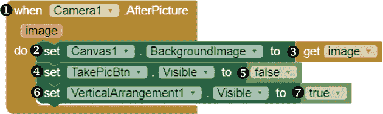

将 Camera1 的 whenCamera1.AfterPicture 事件处理程序块 ➊拖到查看器中。该事件处理程序报告`image`事件参数的值，即由`Camera`拍摄的照片。我们将把`Canvas`的背景设置为这个值。

将 Canvas1 的 setCanvas1.BackgroundImageto 块 ➋拖到 whenCamera1.AfterPicture 块中。然后，将鼠标悬停在图像事件参数上，将其 get image 块 ➌拖到 setCanvas1.BackgroundImageto 块的右侧。这些块将用户的照片设置为`Canvas`的背景。

现在，为了让`TakePicBtn`消失，将其 setTakePicBtn.Visibleto 块 ➍拖到事件处理程序块中，并插入一个 false 块 ➎。

接下来，我们将使`Canvas`和`VerticalArrangement`中的组件可见，这样用户就可以拖动并“试戴”太阳镜，还可以在`Canvas`上绘画和输入文字。将 VerticalArrangement1 的 setVerticalArrangement1.Visibleto 块 ➏拖到事件处理程序中，并将一个 true 块附加到它 ➐。

将步骤 1 中的这些块组合在一起，当用户点击拍照按钮时，打开相机，用户拍照后，将`Canvas`背景设置为该照片，通过将按钮的`Visible`属性设置为`false`来隐藏按钮，并通过将`VerticalArrangement`的`Visible`属性设置为`true`来显示包含`Canvas`和应用控件的`VerticalArrangement`。

为了查看这些块如何工作，可以通过设备进行实时测试。打开应用时，你应该看到全屏的`TakePicBtn`。点击它时，相机应该会打开，拍摄的照片应成为你应用屏幕顶部区域的背景，这里是你放置`Canvas`的地方。如果照片在应用中显示的方向不对，关闭并重新打开应用，旋转相机，再拍一张照片，直到它以你希望的方式显示。

在照片下方，你应该看到带有应用程序 Slider 的`ListPicker`，以及其下方的绘图、输入文字、保存和删除按钮，但这些控件目前都无法使用。保持应用程序在设备上打开，以继续实时测试。

#### 步骤 2：添加可选择的太阳镜

现在让我们编写应用程序的步骤 2，即`ListPicker`的`BeforePicking`事件处理程序，它将设置用户点击的`ListPicker`选项来选择每副太阳镜。

为了提供这些选项，我们将创建一个名为`glassesDescriptions`的全局变量，用于存储四副太阳镜的描述。我们还将创建一个相关的全局列表变量`glassesSprites`，它将存储显示太阳镜的`ImageSprite`。将这些作为全局变量创建，可以让我们在应用中的每个事件处理程序和过程里使用它们。

##### 创建 glassesDescriptions 和 glassesSprites 列表变量

以下块创建了 `glassesDescriptions`，这是一个保存我们将在 `ListPicker` 中添加的项目的变量，用于描述每副太阳镜，以及 `glassesSprites`，这是一个保存显示相应太阳镜图片的 `ImageSprites`（`Sunglasses1` 到 `Sunglasses4`）的变量。

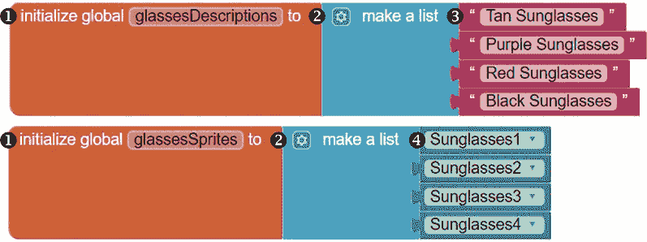

要创建变量，从变量块抽屉中拖动两个初始化全局名称块 ➊ 到查看器，并将其中一个命名为 glassesDescriptions，另一个命名为 glassesSprites。然后，从列表块抽屉中将一个创建列表块 ➋ 附加到每个初始化全局块。

通过点击位于“创建列表”文字左侧的蓝色变异器图标，为每个创建列表块的两个默认输入添加两个插槽，并将额外的项目块拖到打开的对话框中的创建列表块中。最后，对于 `glassesDescriptions`，拖动四个空字符串块 ➌，将它们连接到创建列表块的插槽中，并输入显示的文本。对于 `glassesSprites`，在块面板中点击 `Sunglasses1` 到 `Sunglasses4`，并将每个 `ImageSprite` 的获取块 ➍ 拖动到 `创建列表` 块的插槽中。这些块创建了两个变量，使得 `glassesSprites` 中的每个项目与 `glassesDescriptions` 中相同索引位置的项目相对应。

##### 设置 ListPicker 选项

接下来，我们将编写 `ListPicker` 的 `BeforePicker` 事件处理程序，它将 `ListPicker` 的元素设置为 `glassesDescriptions` 中的项目。

要添加这些块，拖动 `ListPicker1` 的 whenListPicker1.BeforePicking 事件处理程序块 ➊ 到查看器。然后将其 setListPicker1.Elementsto 块 ➋ 拖入事件处理程序块内，并将获取全局变量 glassesDescriptions 块 ➌ 拖到 setListPicker1.Elementsto 块的右侧。

进行实时测试，看看这些块是如何工作的。当你点击 `ListPicker` 时，应该会看到选择选项，它们是每副太阳镜的描述。此时选择一副太阳镜时应该没有任何反应，除了 `ListPicker` 会关闭。保持应用在设备上打开，继续实时测试。

#### 步骤 3：选择要试戴的太阳镜

现在让我们编写 `ListPicker` 的 `AfterPicking` 事件处理程序，它告诉应用在用户选择一副太阳镜后该做什么。此时，如果 `Canvas` 上已经有一副太阳镜，应用应将其移除，并重置调节太阳镜宽度的 `Slider`，以防用户之前已调整过。如果这是用户第一次从 `ListPicker` 中选择，我们希望应用启用 `Slider`。然后，我们希望应用显示用户选择的那副太阳镜。

##### 创建 clearSprite 过程

为了清除现有的`ImageSprite`并重置`Slider`，我们将使用一个名为`clearSprite`的过程，在`ListPicker`的`AfterPicking`事件处理程序中调用它，稍后在我们创建的处理程序中也会调用该过程来清除`Canvas`。`clearSprite`过程使用一个条件块来测试`Canvas`上是否有图像。如果有，它会移除该图像，并将`Slider`滑块恢复到初始位置。

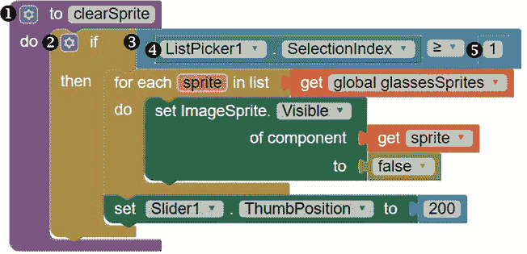

点击块面板中的**Procedures**块抽屉，拖动到过程 do 块 ➊ 到查看器中，并命名该过程为 clearSprite。接下来，我们将通过检查当前的`ListPicker`选择索引是否为`1`或更大，来测试`Canvas`上是否有`ImageSprite`。由于四个太阳镜的`ImageSprite`索引位置为`1`至`4`，我们可以通过检查索引来知道它们中的某个是否显示在`Canvas`上。如果是，那么应用程序需要清除它。

在`clearSprite`过程块内插入一个 if then 块 ➋，并将一个`≥`比较块 ➌ 插入 if then 块的 if 插槽。将比较块的左操作数插槽填充为 ListPicker.SelectionIndex 块 ➍，右操作数插槽填充为数字块 1 ➎。到目前为止，`if then`块通过说“如果`ListPicker1`选择索引大于或等于`1`”来设置测试条件，句子到这里为止。接下来的块通过告诉应用程序在条件满足时应该做什么来完成这个句子。

##### 清除所有 ImageSprites 并重置 Slider

如果`ListPicker1`选择索引大于或等于`1`，接下来的块会循环遍历并隐藏所有的`ImageSprite`，并重置`Slider`。

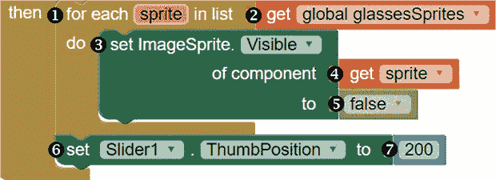

要放置这些块，拖动一个 for each item 块 ➊ 到 if then 块的 then 插槽，并将 item 更改为 sprite。然后，在 for each 块右侧拖入一个 get global glassesSprites 块 ➋，紧接着是`list`一词。接下来，点击块面板底部**Any component**旁的加号，点击**Any ImageSprite**抽屉，然后将一个 setImageSprite.Visible 块 ➌ 拖入 for each 块内。通过鼠标悬停在 sprite 项上并拖动一个 get sprite 块 ➍，填充设置块的上插槽，并将其下插槽填充为 false 块 ➎。现在，当调用此过程时，所有`ImageSprite`都会变得不可见。

接下来，我们将添加重置`Slider`的块。我们需要这样做，因为在后续代码中，当用户更改`Slider`的`ThumbPosition`时，我们将编程使`ImageSprite`的宽度发生变化。为了防止用户在`ImageSprite`显示在`Canvas`上的时候改变了某个`ImageSprite`的`ThumbPosition`，接下来的块会将`Slider`的`ThumbPosition`和`ImageSprite`的宽度恢复到我们在设计器中设置的`200`。

将 Slider1 的 setSlider1.ThumbPosition 块 ➏ 拖到 for each 块下的 if then 块内，然后将一个 200 的数字块 ➐ 拖到它的右侧。现在，当调用过程时，这些块会重置 `Slider`。

##### 调用 clearSprite 并启用滑块

现在我们已经创建了过程，让我们构建 `AfterPicker` 事件处理器。

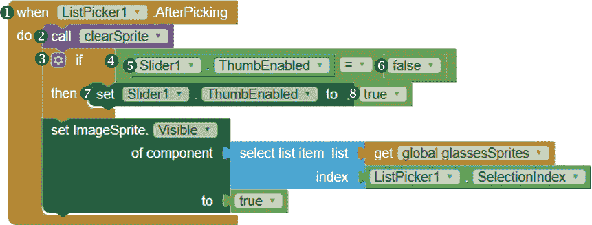

`AfterPicker` 事件处理器将首先调用我们刚才创建的 `clearSprite` 过程，清除屏幕上的任何 `ImageSprite` 并重置 `Slider`。然后，它将启用 `Slider`（如果有必要），并显示选中的太阳镜。

将 ListPicker1 的 whenListPicker1.AfterPicking 块 ➊ 拖到 Viewer。然后，将 call clearSprite 块 ➋ 拖到事件处理器块中。这些块在用户在 `ListPicker` 中选择一副太阳镜后调用 `clearSprite` 过程。

接下来，我们将添加一个条件块，让应用程序知道何时启用 `Slider`，我们在设计器中通过取消选中 `ThumbEnabled` 属性来关闭它。我们禁用了滑块的按钮，以防用户在选择太阳镜之前移动它，这样会导致错误。

然而，也有可能用户已经通过之前选择过一副太阳镜启用了 `Slider`，所以我们必须检查这一点。在 Blocks 面板中，将一个 if then 块 ➌ 拖到事件处理器的 call clearSprite 块下方。然后，将 if 插座填充为一个 = 比较运算符块 ➍，并将运算符块的左操作数插座填充为 Slider1 的 Slider1.ThumbEnabled 块 ➎。将右操作数插座填充为一个 false 块 ➏。

接下来，将 if then 块的 then 插座填充为一个 setSlider1.ThumbEnabled 块 ➐，并将一个 true 块 ➑ 拖到它的右侧。现在，在用户选择一副太阳镜后，这个 `if then` 块将只在 `Slider` 的按钮当前未启用时启用滑块的按钮。尽管每次用户选择一副太阳镜时，应用程序都会检查这个条件，但它只会在用户第一次选择后启用滑块的按钮一次。

##### 显示选中的 ImageSprite

最后，`AfterPicker` 事件处理器将显示选中的太阳镜在 `Canvas` 上。添加到事件处理器后的以下块将实现这一功能。

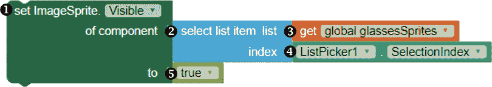

这些块在用户通过将其在 `glassesSprites` 列表中的索引位置与选定的 `ListPicker1` 选项的索引匹配后，设置用户选定的 `ImageSprite` 的 `Visible` 属性为 `true`。

要放置这些积木，请点击**任何 ImageSprite**抽屉，并将一个 setImageSprite.Visible 积木 ➊ 拖到事件处理程序块下的 if then 块内。将 setImageSprite.Visible 积木的顶部插槽填充为来自列表积木抽屉的 select list item 积木 ➋。接下来，将 select list item 积木的 list 插槽填充为 get global glassesSprites 积木 ➌，并将其 index 插槽填充为 ListPicker1 的 ListPicker1.SelectionIndex 积木 ➍。现在，将 setImageSprite.Visible 积木的底部插槽填充为一个 true 积木 ➎。

这是第 3 步的内容。当用户选择了一副太阳镜后，本步骤的积木会清除`Canvas`上的任何现有`ImageSprite`，并重置`Slider`，如果这是用户第一次从`ListPicker`中选择，将启用`Slider`，并在`Canvas`上显示选中的太阳镜。

让我们进行本步骤的实时测试。当你点击`ListPicker`并做出选择时，选中的太阳镜应该在`ListPicker`关闭后显示在`Canvas`上。你还不能在屏幕上移动太阳镜——直到我们编程完成第 4 步。保持应用程序打开以继续实时测试。

#### 第 4 步：试戴太阳镜

在此步骤中，我们将编写两个事件处理程序：`ImageSprite Dragged`事件处理程序，当用户拖动太阳镜时，移动它们在`Canvas`上的位置；`Slider PositionChanged`事件处理程序，当用户调整`Slider`时，使太阳镜变大或变小。

##### 拖动后设置 Sunglasses1 的 X 和 Y 坐标

我们需要编写一个`Dragged`事件处理程序，当用户拖动太阳镜时，能够移动`ImageSprites`。以下积木会移动`Sunglasses1`。

将 Sunglasses1 的 whenSunglasses1.Dragged 积木 ➊ 拖到 Viewer 中。然后，将其 callSunglasses1.MoveTo 积木 ➋ 拖入事件处理程序块。这些积木会调用`MoveTo`方法，将`Sunglasses1`移动到指定的位置，当用户拖动`Sunglasses1`时。

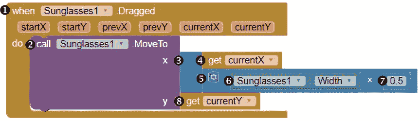

要使用这个方法，我们需要提供该点的坐标作为方法的`x`和`y`参数的参数。我们将使用`Dragged`事件处理程序报告的事件参数来设置这些坐标，这些坐标表示用户拖动`ImageSprite`结束时的位置（`currentX`和`currentY`）。

要为`x`参数添加积木，请将一个减法运算符积木 ➌ 拖到字母 x 的右侧。然后，将鼠标悬停在 currentX 事件参数上，并将其获取 currentX 积木 ➍ 拖到减法积木的第一个操作数插槽中。

接下来，我们需要从太阳镜的 `ImageSprite` 的 x 坐标中减去它宽度的一半，以便将其向左移动，这样用户可以从顶部中心点拖动它，这比从默认位置（左上角）拖动更容易。为此，拖动一个 × 运算符积木 ➎ 到减法积木的第二个操作数插槽中。然后，将乘法积木的左操作数插槽填充上太阳镜 1 的 `Sunglasses1.Width` 积木 ➏，右操作数插槽填充上一个 0.5 数字积木 ➐。这些积木告诉应用程序，当用户拖动 `Sunglasses1` 时，它应该将 `Sunglasses1` 移动到用户拖动到的点的 x 坐标，减去精灵宽度的一半。

要为 `MoveTo` 积木的 `y` 参数添加积木，将鼠标悬停在当前的 `currentY` 事件参数上，并将其获取 `currentY` 积木 ➑ 拖放到字母 `y` 旁边。这些积木告诉应用程序，当用户拖动 `Sunglasses1` 时，它应该将 `Sunglasses1` 移动到用户拖动到的点的 y 坐标。

##### 为所有太阳镜的图像精灵创建拖拽事件处理程序

我们现在需要为 `Sunglasses2`、`Sunglasses3` 和 `Sunglasses4` 编写完全相同的 `被拖动` 事件响应。以下的通用事件处理程序完成了这个任务。

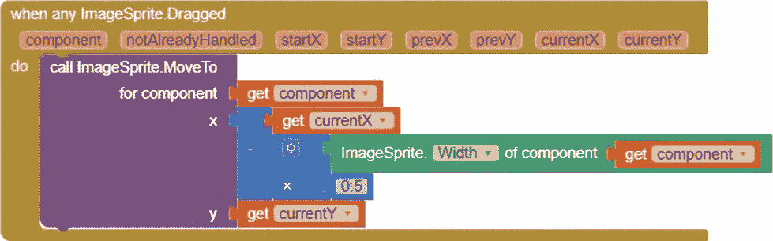

要创建这个通用的 `ImageSprite 被拖动` 事件处理程序，右键点击我们刚刚放置的 `Sunglasses1 被拖动` 事件处理程序，并选择 **Make Generic**。现在，步骤 4 的积木会在用户拖动时，将四副太阳镜的 `ImageSprite` 在 `画布` 上移动。

让我们进行实时测试，查看这些积木是否有效。一旦你选择了一副太阳镜，它们应该会随着你拖动的`画布`而移动。如果它们没有正确移动，调试并再次测试。在再次测试之前，你可能需要在你的 Companion 中刷新应用程序，以确保你的更改生效。你可以通过在设计器中对应用程序做任何更改来刷新它。一旦步骤 4 的这一部分有效后，继续进行下一部分，在这一部分中，我们将编程 `Slider` 以允许用户更改太阳镜的大小。

##### 调整选定太阳镜的宽度

由于宽度为 200 像素的太阳镜可能无法正确适应用户的照片，我们将编程让应用程序允许用户通过移动 `Slider` 来调整太阳镜的大小。`Slider1 PositionChanged` 事件处理程序完成了这一任务。

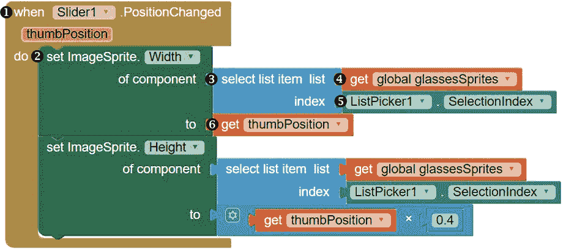

这些积木处理的是当 `Slider` 的拇指位置从我们在设计器中设置的初始值 `200` 改变时发生的动作。一旦 `Slider` 的位置发生变化，`whenSlider1.PositionChanged` 积木提供了一个 `thumbPosition` 事件参数，这个参数包含了变化后拇指位置的数值。

我们将首先放置一些代码块，将所选的`ImageSprite`的新宽度设置为`thumbPosition`的值，这个值将在 150 到 250 之间，分别是我们在设计器中为`Slider`设置的`MinValue`和`MaxValue`属性。将 Slider1 的`whenSlider1.PositionChanged`代码块➊拖动到查看器中。接着，将`setImageSprite.Width`代码块➋从任何`ImageSprite`抽屉中拖动到事件处理代码块中。将`setImageSprite.Width`代码块的顶部插槽填充为`select list item`代码块➌，并将该代码块的顶部插槽填充为`get global glassesSprites`代码块➍，底部插槽填充为`ListPicker1.SelectionIndex`代码块➎。现在，通过将鼠标移到`thumbPosition`事件参数上，拖动`get thumbPosition`代码块➏并将其放入`setImageSprite.Width`代码块的底部插槽中。

##### 调整所选太阳镜的高度

接下来的代码块在`Slider`位置变化时设置所选太阳镜的高度。这是`Slider1 PositionChanged`事件处理程序的后半部分。

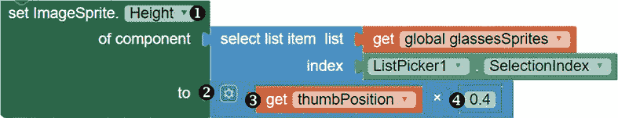

这些代码块将所选太阳镜的像素高度设置为`thumbPosition`乘以 0.4 的值。由于每副太阳镜的高度为 80 像素，等于默认 200 像素宽度的 0.4 倍，我们使用此公式来保持太阳镜的高度和宽度之间的比例不变，以防宽度发生变化时，太阳镜看起来不失真。这将防止用户在移动`Slider`时，太阳镜的比例出现失真。

要放置这些代码块，请复制`setImageSprite.Width`代码块。在复制的代码块中，将 Width 改为 Height，并将 setImageSprite.Height 代码块➊连接到事件处理代码块中。然后，用×运算符代码块➋替换“to”插槽中的代码块。通过拖动`get thumbPosition`代码块➌并将其放入乘法代码块的左操作数插槽中，再将右操作数插槽填充为 0.4 的数字代码块➍。

你现在已经完成了第 4 步。让我们再次进行实时测试，看看这些代码块如何工作。你应该能够在`Canvas`上拖动选中的太阳镜，并将`Slider`向左拖动使太阳镜变小，向右拖动使太阳镜变大。如果太阳镜的大小没有正确或成比例地变化，调试并重新测试。完成第 4 步后，继续进入第 5 步，我们将在此步骤中编写代码，允许用户在图片上绘制。

#### 步骤 5：让用户在画布上绘制

现在我们开始编写应用的第 5 步。当用户点击绘制按钮时，应用应该显示通知，告诉用户可以在`Canvas`上任意绘制。此外，当用户在`Canvas`上拖动手指时，应用应沿着手指的路径进行绘制，除非用户同时在拖动其中一副太阳镜的`ImageSprite`。

##### 让用户知道他们可以绘制

这里是告诉用户在哪里绘制的代码。

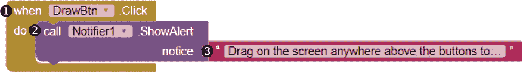

将`whenDrawBtn.Click`块 ➊ 拖动到查看器中，然后将`Notifier1`的`callNotifier1.ShowAlert`方法调用块 ➋ 拖动到其中。

我们调用的`ShowAlert`方法需要为其`notice`参数提供一个参数，该参数保存我们希望`Notifier`显示的信息。为了提供该参数，将一个空字符串块 ➌ 快速插入，并在其文本区域中输入“在屏幕上任何按钮上方拖动以绘制。”现在，当用户点击绘制按钮时，这些块会显示一个警报，告知用户可以在`Canvas`上拖动以绘制。

##### 在画布上绘制线条

接下来，我们将告诉应用程序在用户拖动`Canvas`时在哪里绘制以及使用什么颜色。以下的块处理这个`Canvas1 Dragged`事件。

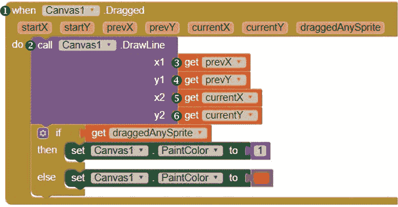

将`whenCanvas1.Dragged`块 ➊ 拖动到查看器。当用户拖动`Canvas`时，这个事件处理程序将把以下七个事件参数作为参数存储：用户第一次触摸`Canvas`的点的 x 和 y 坐标（`startX`和`startY`）、当前拖动开始的点（`prevX`和`prevY`）、当前拖动结束的点（`currentX`和`currentY`），以及一个布尔值，表示拖动过程中是否还拖动了`ImageSprite`（`draggedAnySprite`）。我们将在添加到`Dragged`事件处理程序的块中使用这些值中的一些。

为了添加使应用绘制用户拖动的线条的块，将`callCanvas1.DrawLine`方法调用块 ➋ 拖动到事件处理程序块中。此方法要求我们为其`x1`和`y1`参数提供参数，这些参数保存应用程序开始绘制时的 x 和 y 坐标；同时为`x2`和`y2`参数提供参数，这些参数保存应用程序停止绘制时的 x 和 y 坐标。

我们将从`whenCanvas1.Dragged`块获取这些参数。将鼠标悬停在块的参数上，然后将`get prevX`块 ➌ 拖动到`callCanvas1.DrawLine`块的第一个插槽，将`get prevY`块 ➍ 拖动到第二个插槽，将`get currentX`块 ➎ 拖动到第三个插槽，将`get currentY`块 ➏ 拖动到最后一个插槽。现在，当用户拖动`Canvas`时，这些块会指示应用程序从用户开始拖动`Canvas`的点绘制一条线到用户停止的点。

##### 确定画布线条颜色

目前，尽管我们放置了这些块，用户的线条仍然不会显示出来。这是因为我们在设计器中将`Canvas1`的`PaintColor`设置为 None。为了更新这一点，我们将让应用在用户同时拖动`ImageSprite`和`Canvas`时绘制一条透明线，在用户只拖动`Canvas`时绘制一条红色线。以下的`if then else`块指示了这种行为。

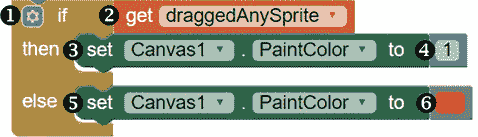

将一个 if-then 块拖到 Viewer 中，点击蓝色的修改图标为该块添加一个 else 输入，然后将 if-then-else 块➊放入事件处理块中。现在，将鼠标悬停在事件处理器的 draggedAnySprite 参数上，并将一个 get draggedAnySprite 块➋拖入 if-then-else 块的 if 插槽，这样可以检查用户是否拖动了一个`ImageSprite`。然后，将一个 setCanvas1.PaintColor 块➌拖入 if-then-else 块的 then 插槽，并将一个数字块 1 ➍拖到它的右侧，使颜色变得透明。`then`插槽中的这些块决定了如果用户也拖动了一个`ImageSprite`时会发生什么。

接下来，复制 setCanvas1.PaintColor 块➎并将复制块拖入 if-then-else 块的 else 插槽，该插槽决定了如果用户没有拖动`ImageSprite`时会发生什么。用来自 Colors 抽屉的红色颜色块➏替换数字块 1。

现在，每次用户拖动`Canvas`时，应用程序会测试用户是否也在拖动太阳镜`ImageSprite`。如果是这样，应用程序会绘制一条不可见的线，因为我们设置的值是`1`。如果用户没有拖动`ImageSprite`，应用程序会绘制一条红线。

让我们进行实时测试，看看这些模块是如何工作的。当你点击`DrawBtn`时，应该会看到一个警告，提示你可以通过在按钮上方拖动手指来在屏幕上绘画。当你在`Canvas`上拖动时，应该能在设备屏幕上看到你用红色绘制的图形，除非你同时也在拖动一副太阳镜。如果你在拖动太阳镜，你不应该看到任何绘制的线条。如果此步骤的任何部分无法正常工作，请进行调试并再次测试。一旦第 5 步工作正常，继续进行下一步，我们将编程让用户在图片上输入文字。

#### 第 6 步：让用户在画布上输入文本

当用户点击`TypeBtn`时，应用程序的`Notifier`应该打开一个文本对话框，用户可以在其中输入希望显示在`Canvas`上的文本。当用户点击确定关闭对话框后，应用程序应该在`Canvas`底部附近以蓝色显示用户输入的文本。

##### 打开文本对话框进行输入

`TypeBtn.Click`事件处理器会在用户点击`TypeBtn`时打开文本对话框以收集输入的文本。

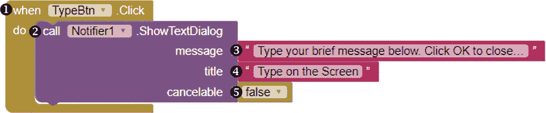

将 whenTypeBtn.Click 块 ➊ 拖动到 Viewer 中，然后将 callNotifier1.ShowTextDialog 方法调用块 ➋ 拖入其中。这个`ShowTextDialog`方法调用需要为其`message`参数提供一个值，这个参数包含我们将在打开的文本对话框中显示给用户的消息；其`title`参数包含将在文本对话框顶部显示的标题；以及其`cancelable`参数。如果将`cancelable`参数设置为`true`，则应用程序会在文本对话框中添加“确定”和“取消”按钮。然后，当我们在此步骤中稍后编程以显示用户的响应时，如果用户点击了取消按钮，应用程序将在`Canvas`上显示“取消”字样。我们将`cancelable`参数设置为`false`，这样对话框中只会添加一个“确定”按钮。在我们编写此步骤的第二部分时，按下“确定”按钮应将用户的文本显示在`Canvas`上。

对于`message`参数，将一个空字符串块 ➌ 拖入消息插槽，并输入“在下方输入简短的消息。点击确定以关闭此框。”对于`title`参数，将一个空字符串块 ➍ 拖入标题插槽，并输入“在屏幕上输入”；然后，通过将默认的`true`块更改为`false` ➎ 来设置`cancelable`参数。

##### 在画布上显示用户输入

现在我们将编写`Notifier AfterTextInput`事件处理器，它告诉应用程序如何以及在哪里在`Canvas`上显示用户的消息（以响应事件参数的形式报告）。一旦用户在对话框中点击“确定”，应用程序应将绘制颜色设置为蓝色，并将响应内容在`Canvas`上的特定坐标处显示。

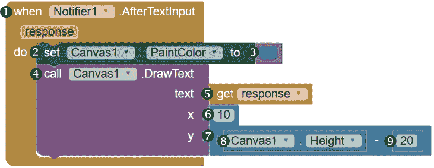

将 whenNotifier1.AfterTextInput 块 ➊ 拖动到 Viewer 中。然后，为了设置绘制颜色，将 setCanvas1.PaintColor 块 ➋ 拖动到事件处理器块中，并将蓝色颜色块 ➌ 拖入其右侧插槽中。在用户关闭文本对话框后，这些块将把`Canvas`的绘制颜色更改为蓝色。

接下来，为了调用在`Canvas`上绘制文本的方法，将 callCanvas1.DrawText 方法调用块拖入 whenNotifier1.AfterTextInput 事件处理器块 ➍ 中。这个`DrawText`方法需要为其`text`参数提供参数，即它应该在屏幕上显示的用户输入内容，并为其`x`和`y`参数提供坐标值，即文本应开始显示的`Canvas`上的 x 和 y 坐标。

要为方法的`text`参数提供参数，鼠标悬停在 AfterTextInput 处理器的响应事件参数上，并将其获取响应块 ➎ 拖动到文本插槽中。对于文本位置，我们将其设置为从`Canvas`的左边缘向右偏移 10 像素，从底部向上偏移 20 像素，这样它将显示在图片的底部附近。

为此，对于 `callCanvas1.DrawText` 块的 `x` 参数，将一个数字块 ➏ 拖入，设置为 10，对于其 `y` 参数，将一个减号运算块 ➐ 拖入。将减法块的左操作数插槽填入 Canvas1.Height 块 ➑，将右操作数插槽填入数字块 ➒，其值为 20。这将 `x` 参数设置为 `10`，并将 `y` 参数设置为 `Canvas` 的高度减去 20 像素——换句话说，就是距离 `Canvas` 底部 20 像素的位置。

现在测试这些块。当你点击 `TypeBtn` 时，应该会弹出一个对话框，你可以在其中输入希望在 `Canvas` 上输入的文本。输入一些文本并点击 **OK**。你应该能看到文本以蓝色显示在 `Canvas` 的左侧，接近底部。如果这一步有任何问题，进行调试并重新测试。一旦第 6 步正常工作，我们就可以编写程序允许用户保存 `Canvas`。

#### 第 7 步：允许用户保存 Canvas 的图片

在这一步中，我们将允许用户将 `Canvas` 及任何选中的太阳镜、绘画和文字保存为图像文件到设备中。`SaveBtn.click` 事件处理程序将保存用户的创作。

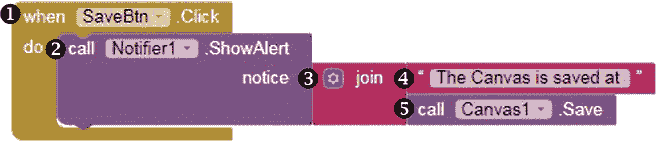

首先，我们会让应用在用户点击保存按钮时显示一个提示框。将 whenSaveBtn.click 块 ➊ 拖到查看器中，然后将 callNotifier1.ShowAlert 方法调用块 ➋ 放入其中。

接下来的块提供了 `ShowAlert` 方法的 `notice` 参数的参数，我们希望通过这个提示告诉用户图像保存的位置，并调用保存图片的方法，同时显示存储位置。

要放置这些块，将一个 join 块 ➌ 拖到 callNotifier1.ShowAlert 块的提示插槽中。接着，将一个空字符串块 ➍ 拖入 join 块的上插槽，并在其文本区域输入 "The Canvas is saved at"（包括最后一个空格）。然后，将一个 callCanvas1.Save 方法调用块 ➎ 拖入 join 块的下插槽。

让我们测试这些块。当你点击 `SaveBtn` 时，应该会看到一个提示框，显示 “The Canvas is saved at <*file location*>”。你应该能在该位置找到文件，或者在设备的文件管理器中查看，但你可能需要关闭应用程序，文件才会显示。一旦这一步正常工作，关闭设备上的应用程序，并进入编写应用程序的最后一步，允许用户清除 `Canvas`。

#### 第 8 步：允许用户清除 Canvas

在最后一步中，我们将编写程序，让用户清除 `Canvas` 上的太阳镜以及所有的绘画和输入的文本，只保留背景图片。`TrashBtn.click` 事件处理程序将清除 `Canvas`。

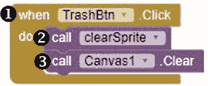

这些块调用了 `clearSprite` 程序，该程序隐藏所有的 `ImageSprite`，就像我们在 `AfterPicker` 事件处理程序中使用它时一样。然后，它们调用内置的 `Canvas Clear` 方法，该方法在用户点击垃圾桶按钮时清除 `Canvas` 上的所有文本和图形。

将 `whenTrashBtn.click` 块 ➊ 拖动到查看器中，然后将调用 `clearSprite` 块 ➋ 拖到其中。接着，将 `callCanvas1.Clear` 块 ➌ 拖到事件处理程序块中，放在调用 `clearSprite` 块下面。

现在让我们测试完成的应用程序！在你的设备上打开该应用程序。你应该能看到 `TakePicBtn` 按钮。点击它后，摄像头应该打开。当你拍摄一张照片时，这张照片应该成为应用屏幕顶部部分的背景。在照片下方，你应该能看到 `ListPicker`，其下方是 `Slider`，以及绘制、输入、保存和垃圾桶按钮。

当你点击“选择眼镜”时，你应该看到列出所有四种太阳镜选项，并且当你选择一副眼镜时，`ListPicker` 应该关闭，你选择的太阳镜应该出现在 `Canvas` 的顶部。你应该能够将眼镜拖动到 `Canvas` 上，并使用 `Slider` 来调整它们的大小。

测试每个按钮。当你点击 `DrawBtn` 时，应用程序应该显示一个通知，告诉你可以在 `Canvas` 上绘画，当你在 `Canvas` 上拖动手指（不在 `ImageSprite` 上时），应该会出现一条红色的线。当你点击 `TypeBtn` 时，应该会弹出一个对话框，提示你输入消息，输入并点击确定后，你的消息应该以蓝色显示在 `Canvas` 底部。

当你点击 `SaveBtn` 时，你应该看到一个通知，提醒你 `Canvas` 的图片已保存在设备的指定位置。当你点击 `TrashBtn` 时，`ImageSprite` 以及所有文本和图形应该从 `Canvas` 上消失。如果你正确放置了块，那么你已经成功创建了“虚拟眼镜”应用程序！

### 总结

在这一章中，你构建了“虚拟眼镜”应用程序，允许用户试戴太阳镜，在 `Canvas` 上绘画和输入文字，并将 `Canvas` 上的图片保存到他们的设备上，供保存和分享。

在此过程中，你学会了如何设置 `Canvas` 的线条大小和颜色，为绘图做准备，让用户通过应用拍摄自拍并将其作为应用背景，让用户通过 `Slider` 调整组件，并使用 `Notifier` 组件不仅显示信息，还收集用户输入。

你还练习了声明和初始化列表变量，创建程序，提供内置方法所需的带参数的参数，使用比较运算符测试条件，并添加条件和循环来控制应用程序流程。

### 自主练习

通过完成以下练习来修改和扩展“Virtual Shades”应用程序。务必在添加任何组件或模块之前调整你的算法来规划这些变化，并保存你创建的新版本应用。你可以在*［https://nostarch.com/programwithappinventor/](https://nostarch.com/programwithappinventor/)* 在线找到解决方案。

1.  修改应用程序，使其允许用户选择`Canvas`绘画颜色以便在`Canvas`上绘制和输入文字。

1.  修改应用程序，使其允许用户通过语音输入他们希望显示在`Canvas`上的文字。

1.  扩展应用程序，使用户可以选择不拍摄背景照片，而是在空白的`Canvas`上创作艺术作品。
