## **App Inventor 组件与内置块**

App Inventor 包含了可以添加到应用中的组件抽屉，以及用于设置应用行为的内置块。本附录提供了对这两者的当前概览。请注意，App Inventor 的开发者会不时添加新组件并更新块，这些更改会在您登录时看到的欢迎画面中提到。

### **App Inventor 组件**

App Inventor 设计器窗口包括一个*调色板*面板，里面包含了可以添加到应用中的组件抽屉（参见图 A-1）。

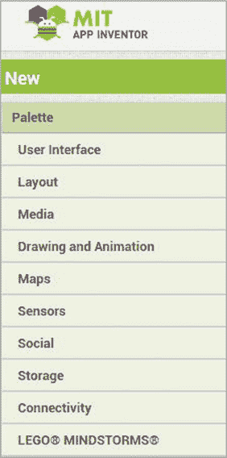

*图 A-1：App Inventor 设计器窗口的调色板面板，显示组件类型*

*组件*是你在应用中使用的所有可见和不可见元素，包括设置应用外观和功能并增加令人兴奋的功能的元素。所有组件都有可以设置的属性和/或可以编程的动作。

#### **用户界面组件**

用户界面组件，如图 A-2 所示，控制用户在应用中看到和触摸的元素。

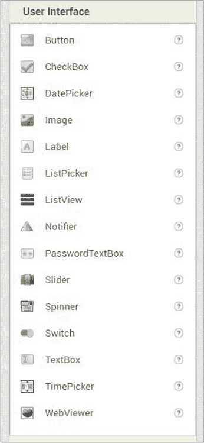

*图 A-2：用户界面组件抽屉*

这些组件帮助用户理解你希望他们做什么，并完成这些任务。一些用户界面组件还允许你收集用户输入，这对应用的正常运行至关重要。

Button 在屏幕上显示一个按钮或图片，能够检测用户的点击。你通常会在`Button`中添加文本，让用户知道点击按钮后会发生什么。

CheckBox 让用户选择一个或多个选项。

DatePicker 显示一个按钮，用户可以点击并选择日期。让用户通过`DatePicker`输入日期可以确保日期格式的一致性，这样应用处理起来更加方便。

Image 在屏幕上显示一张图片。

Label 在屏幕上显示文本。

ListPicker 显示一个按钮，用户可以点击以查看可供选择的文本项列表。你可以使列表项可以搜索。

ListView 向用户显示一个文本项列表。

Notifier 显示一个临时警报或消息，提示用户确认、选择、输入文本或等待，然后再继续与应用交互。`Notifier`组件也用于记录错误或消息。

PasswordTextBox 提示用户输入文本和其他不应显示的字符，如密码。它与`TextBox`组件相同，只是用户输入的每个字符会显示为星号（*）。

Slider 显示一个进度条，用户可以拖动“滑块”来设置其位置。`Slider`允许用户从一个范围内快速选择一个值。

Spinner 显示一个包含文本项下拉列表的新屏幕。

Switch 显示一个切换开关，用户可以点击。

TextBox 显示一个文本框，用户可以在其中输入文本、数字和其他字符。用户在框中输入的字符将是可见的。

TimePicker 显示一个按钮，供用户点击选择时间。使用`TimePicker`让用户输入时间，确保应用接收到的时间格式一致，这样应用可以更容易地处理它们。

WebViewer 在应用内显示网页。

#### **布局组件**

布局抽屉中的格式化组件，如图 A-3 所示，帮助你以有序和视觉上吸引人的方式排列可视组件（例如来自用户界面抽屉的组件）。

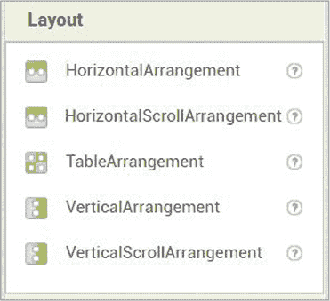

*图 A-3: 布局组件抽屉*

HorizontalArrangement 从左到右显示组件。

HorizontalScrollArrangement 在一个容器中显示并排的组件，组件可以从左到右滚动。

TableArrangement 将组件按表格形式布局（即按行和列排列）。

VerticalArrangement 显示一个一个堆叠的组件，彼此垂直排列。

VerticalScrollArrangement 在一个容器中显示一个一个堆叠的组件，组件可以从上到下滚动。

#### **媒体组件**

你可以在媒体抽屉中找到 Camera 和其他访问设备媒体功能的组件，如图 A-4 所示。

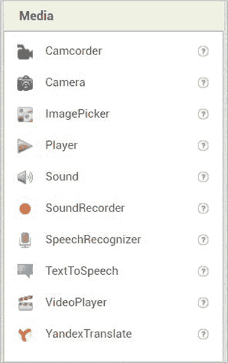

*图 A-4: 媒体组件抽屉*

Camcorder 让应用使用设备的摄像机录制视频。

Camera 允许应用使用设备的相机拍照。

ImagePicker 显示一个按钮，用户点击后可以从设备的图片库中选择图片。

Player 播放较长的音频文件，如歌曲，并控制手机振动。

Sound 播放短的音频文件，如音效，并且还可以震动。

SoundRecorder 让你的应用录制音频。

SpeechRecognizer 将语音转换为可以在应用中使用的文本。

TextToSpeech 让应用朗读文本。

VideoPlayer 播放视频。

YandexTranslate 使应用能够使用 Yandex.Translate 服务在不同语言之间翻译单词和句子。

#### **绘图与动画组件**

绘图与动画组件，如图 A-5 所示，使用户能够在屏幕上绘图，并让你在应用中加入动态图像。

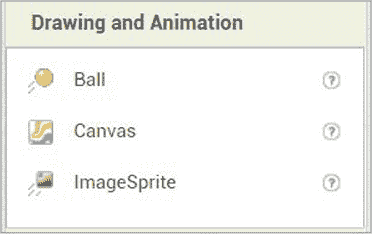

*图 A-5: 绘图与动画组件抽屉*

Ball 一个圆形的*精灵*（一个小的二维图像），当它放置在`Canvas`上时，可以移动、响应触摸和拖动，并与其他精灵以及`Canvas`的边缘进行交互。

Canvas 一个二维、触摸敏感的矩形面板，允许你在屏幕上绘制或在屏幕上放置或移动精灵。

ImageSprite 一个精灵，当它放置在`Canvas`上时，可以移动、响应触摸和拖动，并与其他精灵以及`Canvas`的边缘进行交互。

#### **地图组件**

要创建专注于地图上某些点的应用，请使用地图组件面板中的工具。

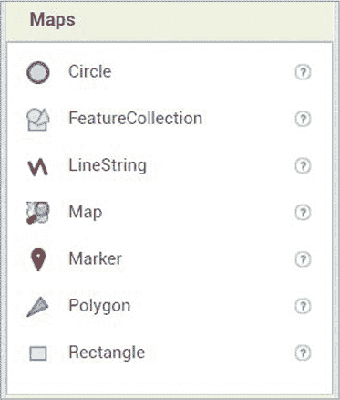

*图 A-6：地图组件面板*

Circle 在`Map`上绘制一个给定半径的圆，圆心为某一点。

FeatureCollection 将一个或多个`Maps`组件组合在一起。

LineString 在`Map`上绘制一系列的线段。

Map 一个二维容器，用作地图背景显示。你必须先添加该组件，才能将其他地图组件放置到屏幕上。

Marker 在`Map`上放置一个图标，指示信息。

Polygon 在`Map`上绘制一个任意形状。

Rectangle 在`Map`上绘制一个由北、南、东、西四个边界限定的矩形。

#### **传感器组件**

传感器组件面板中展示了多个有趣且强大的组件，比如`Clock`组件，它能提供许多游戏运行所需的定时自动操作；还有`LocationSensor`组件，它定时检查物体的位置。请注意，所有传感器组件都是*不可视组件*，这意味着当你将它们添加到应用中时，用户将看不见它们在屏幕上的显示。

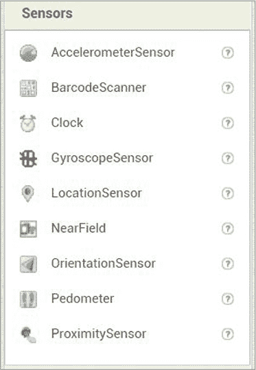

*图 A-7：传感器组件面板*

AccelerometerSensor 检测设备的震动并测量其在三维空间中的加速度。

BarcodeScanner 如果设备已安装条形码扫描应用，读取条形码。

Clock 使用设备的内部时钟以固定的间隔触发定时器，进行时间计算、操作和转换。

GyroscopeSensor 测量设备在三维空间中的角速度。

LocationSensor 提供位置信息，包括经度、纬度、海拔（如果设备支持）、速度（如果设备支持）以及地址。它还可以进行*地理编码*，即将给定地址转换为经纬度。

NearField 提供与其他设备的*近场通信*能力（如果设备支持）。

OrientationSensor 提供设备在三维空间中的物理方向信息。

Pedometer 尝试判断是否迈出了步伐并估算行走的距离。

ProximitySensor 测量物体与设备屏幕之间的距离。

#### **社交组件**

社交面板中的组件，如图 A-8 所示，允许用户通过与他人沟通来进行社交。

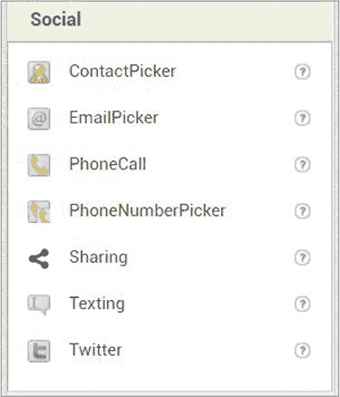

*图 A-8：社交组件面板*

ContactPicker 显示一个按钮，用户点击后可以选择设备中存储的联系人。

EmailPicker 包含一个可搜索的文本框，用户可以开始输入联系人的名字或电子邮件地址，设备会显示一个下拉菜单，供用户选择联系人。

PhoneCall 允许应用拨打指定的电话号码。

PhoneNumberPicker 显示一个按钮，用户点击后可以选择设备中存储的联系人电话号码。

Sharing 允许用户在应用程序和设备上安装的其他应用之间共享文件和/或消息，如电子邮件和消息应用。

Texting 使应用能够向指定的电话号码发送指定的短信。

Twitter 允许用户与 Twitter 进行通信，发送和搜索推文等。

#### **存储组件**

在存储抽屉中，如图 A-9 所示，你会找到使你的应用能够在关闭后仍然记住信息的组件。

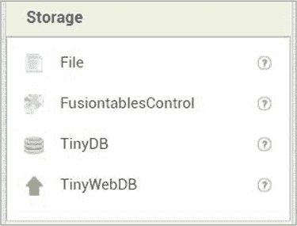

*图 A-9：存储组件抽屉*

File 使应用能够存储和检索文件。

FusiontablesControl 使应用程序能够与 Google Fusion Tables 进行通信，分享、查询和存储数据到表格中。

TinyDB 使应用能够保存和检索直接存储在设备上的信息。

TinyWebDB 允许应用程序与网络服务进行通信，存储和检索信息，并可以与其他设备共享。

#### **连接性组件**

如图 A-10 所示，连接性组件使你的应用能够连接到其他应用、其他设备和互联网。

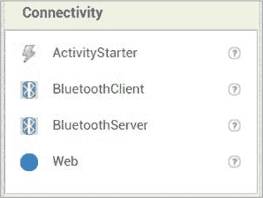

*图 A-10：连接性组件抽屉*

ActivityStarter 使应用能够启动活动，如另一个应用或网页浏览器。

BluetoothClient 允许应用连接到另一个蓝牙连接设备。

BluetoothServer 允许应用接受来自另一个蓝牙连接设备的连接。

Web 使应用能够从网络服务中访问数据并在应用中使用。

#### **其他组件**

在连接性抽屉下方，你会找到可以用来编程 LEGO^® MINDSTORMS^® 机器人以及一些不断演变和变化的实验性和扩展组件。登录到 App Inventor 时，请注意欢迎启动屏幕，它会显示关于重要更新的信息。

### **APP INVENTOR 的内置模块**

App Inventor 模块编辑器窗口包含一个模块窗格，其中包含内置模块抽屉，这些模块为应用添加一般行为（见图 A-11）。

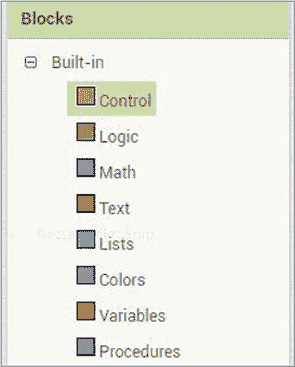

*图 A-11：内置的模块类别*

**控制模块** 控制应用的动作流。一些模块允许应用比较值并测试条件（如 `if then` 和 `if then else` 模块），以及重复执行动作（如 `for each number from to`、`for each item in list` 和 `while test` 模块）。其他模块用于在屏幕之间打开、关闭并传递信息，以及在设备上将文本传输到其他应用和接收文本。

**逻辑块** 有两种类型的逻辑块（`true` 和 `false`），用于设置布尔属性和变量的值，这些值只有两个可能的选择：真和假。其他块是逻辑或布尔运算符（`not`、`=`、`≠`、`and` 和 `or` 块），用于创建布尔表达式——即计算结果为真或假的表达式——来比较值和测试条件。这些运算符通常与控制块一起使用，用于控制应用程序的流程。

**数学块** 一些块用于赋值常规和随机数值。另一些是算术运算符，用于执行算术、代数和三角计算。其他块是关系或比较运算符（`=`、`≠`、`>`、`≥`、`<` 和 `≤` 块），用于比较值。这些运算符也常与控制块一起使用，以控制应用程序的流程。

**文本块** 在字符串中添加、连接、计数字符、比较、改变和搜索。字符串可以包含字母、数字、空格和特殊字符。

**列表块** 创建、计数项、修改、搜索、选择、复制、在列表中搜索以及处理项列表。

**颜色块** 为组件添加颜色，并且也能创建和拆分颜色。

**变量块** 初始化全局和局部变量，并获取和设置你创建的变量的值。

**过程块** 创建并调用过程。
