## 1

**为你的冒险做好准备**


在你开始为 Minecraft 世界制作酷炫的 Python 程序之前，你需要在计算机上安装 Minecraft、Python 和其他一些组件。在本章中，我将向你展示如何安装和运行所有必需的软件。

你可以在 Windows PC 或 Mac 上使用 Minecraft，或者在树莓派计算机上使用 Minecraft: Pi Edition。如果你使用的是 Windows PC，继续阅读。如果你使用的是 Mac，翻到第 11 页的“设置 Mac”部分。如果你使用的是树莓派，翻到第 18 页的“设置树莓派”部分。

**注意**

*有关其他平台的信息以及本说明的更新，请访问* [`www.nostarch.com/pythonwithminecraft/`](https://www.nostarch.com/pythonwithminecraft/)。

### 设置你的 Windows PC

你需要安装五个组件才能通过 Python 控制 Minecraft：

• Minecraft

• Python 3

• Java

• Minecraft Python API

• Spigot Minecraft 服务器

在本节中，我将引导你完成如何在计算机上安装这些组件的步骤。我们从 Minecraft 开始。

#### 安装 Minecraft

如果你已经拥有 Minecraft 并且 PC 上安装了最新版本，跳过至第 3 页的“安装 Python”部分。如果你不确定是否安装了最新版本的 Minecraft，按照本节的步骤安装最新版本。

如果你还没有购买游戏，你可以在 Minecraft 的官方网站上购买一份 *[`minecraft.net/`](https://minecraft.net/)*。你可能需要找一个成年人帮你！记得记下购买 Minecraft 时使用的用户名和密码——你稍后登录时会用到它们。

在购买 Minecraft 之后，按照以下步骤将 Minecraft 安装到你的 PC 上：

1.  访问 *[`minecraft.net/download`](https://minecraft.net/download)*。

1.  在“Minecraft for Windows”部分，找到*Minecraft.msi*链接并点击它进行下载。如果系统提示保存或打开文件，选择**保存文件**。

1.  等待文件下载并打开它。如果弹出对话框询问是否要运行该文件，点击**运行**。不用担心，我们知道这个文件是安全的！

1.  当 Minecraft 安装向导打开时，点击**下一步**。然后再次点击**下一步**。最后点击**安装**。

1.  系统可能会询问你是否要安装 Minecraft，当然你会选择安装！点击**是**。稍等片刻，Minecraft 将开始安装。我在安装游戏时喝了杯水，还吃了块饼干。

1.  安装完成后，点击**完成**。

Minecraft 现在应该已经安装好了。

你知道什么主意最棒吗？当然是玩 Minecraft 了。花点时间把它设置好：

1.  要打开 Minecraft，点击**开始菜单**（或按下键盘上的 Windows 键），在程序列表中找到 Minecraft，并点击图标。

1.  Minecraft 将启动并可能安装更新。

1.  接下来将打开登录窗口。输入你在购买 Minecraft 时使用的用户名和密码，然后点击**登录**。

1.  点击**开始游戏**。Minecraft 将在打开前下载一些更新。

1.  最后，点击**单人游戏** ▸ **创建新世界**。为你的世界命名，随意选择名称，然后点击**创建新世界**。世界将开始生成，你可以尽情玩耍。

玩得开心！如果你以前从未玩过 Minecraft，试着在游戏中玩一段时间，直到 Minecraft 世界变黑。小心怪物！请注意，当你将 Minecraft 与 Python 一起使用时，你将进入一个多人游戏世界，这与当前世界不同。我们将在“运行 Spigot 并创建游戏”部分的第 7 页中详细讲解。

回到工作上！现在是时候安装 Python 了。要解锁 Minecraft 中的光标，只需按键盘上的 ESC 键。在继续安装之前，先关闭 Minecraft。

#### 安装 PYTHON

Python 是你将在本书中学习的编程语言。现在让我们安装它。

1.  访问*[`www.python.org/downloads/`](http://www.python.org/downloads/)。

1.  点击标有**下载 Python 3.5.0**的按钮。（这是本文写作时 Python 3 的最新版本，但你可能会看到更新的版本。安装最新版本。）

1.  Python 将开始下载。如果询问你是否选择保存或打开文件，选择**保存文件**。

1.  当安装程序下载完成后，点击它。如果弹出对话框询问是否运行该文件，点击**运行**。

1.  当安装程序打开时，勾选底部的*Add Python 3.5 to Path*复选框，如图 1-1 所示。然后点击**立即安装**。

    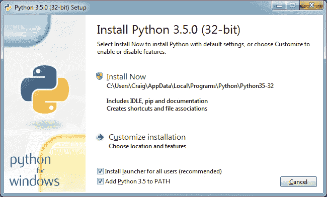

    *图 1-1：确保勾选 Add Python 3.5 to Path。*

1.  安装过程中可能会弹出一个对话框，询问是否允许程序在计算机上安装软件。点击**是**，然后等待 Python 安装完成。我站起来关闭窗口时，安装已经完成。

1.  点击**完成**。Python 现在已安装。

#### 安装 JAVA

现在 Minecraft 和 Python 都已安装，你需要进行一些设置，使它们能够相互通信。你将使用一个叫做 Spigot 的程序来实现这一点，但为了让 Spigot 正常工作，你首先需要确保计算机上安装了 Java。我们现在来做这个检查。

首先，检查 Java 是否已经安装：

1.  点击**开始菜单**（或按下键盘上的 Windows 键），在搜索框中输入`cmd`。打开名为 cmd 的程序。

1.  你将看到一个黑色背景的窗口和提示符（我的显示为`C:\Users\Craig>`）。在提示符下，输入`java -version`并按回车键。

1.  如果你看到类似于图 1-2 中的信息，说明 Java 已经安装。请跳转到第 6 页的“安装 Minecraft Python API 和 Spigot”部分。

1.  如果你收到提示消息说 Java 无法识别，请按照以下说明进行安装。

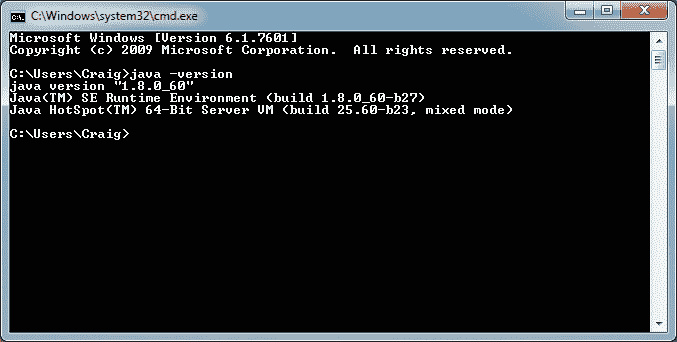

*图 1-2：输入`java -version`命令后，我可以看到 Java 已安装。*

安装 Java 的步骤如下：

1.  访问*[`www.java.com/en/download/`](http://www.java.com/en/download/)*。

1.  点击**免费下载 Java**按钮。然后点击**同意并开始免费下载**按钮。

1.  安装程序下载完成后，点击它。如果弹出对话框询问是否允许该程序对你的计算机进行更改，请选择**是**。

1.  当安装程序打开时，点击**安装**。

1.  这一点非常重要！如果出现提示询问是否安装其他程序，如 Ask 搜索应用、Yahoo!搜索栏或其他程序，请取消勾选该选项，这样就不会安装这些额外的程序。这些都是你不需要的程序。

1.  你可能会被问到是否想将 Yahoo!设置为主页。你可能不需要。选择**不更新浏览器设置**并点击**下一步**。

1.  等待 Java 安装完成。在它安装期间，我给朋友发了个简短的消息。安装完成后点击**关闭**。

现在让我们检查 Java 是否已正确安装：

1.  点击**开始菜单**，在搜索框中输入`cmd`，打开 cmd 程序。

1.  在 cmd 窗口中，输入`java -version`并按回车键。

1.  如果你看到类似于图 1-2 中的信息，说明 Java 已正确安装。如果出现“‘Java’不是内部或外部命令，也不是可操作的程序或批处理文件”的错误，说明 Java 没有正确安装。要解决此问题，请尝试重新安装 Java 并再次运行。如果重新安装后仍然出现此错误，请访问*[`www.java.com/en/download/help/path.xml`](http://www.java.com/en/download/help/path.xml)*获取更多信息。

就这样！Java 已经安装完成，可以运行 Minecraft 服务器了！接下来我们就开始这个部分。

#### 安装 Minecraft Python API 和 Spigot

接下来，你需要在电脑上安装 Minecraft Python API 和 Minecraft 服务器。

*API*代表*应用程序编程接口*。它让程序能够与其他人创建的应用程序进行通信。在本例中，Minecraft Python API 允许你用 Python 编写的程序与 Minecraft 进行通信。例如，你可以编写一个 Python 程序，利用 API 指示 Minecraft 在游戏中创建一个方块，或者改变玩家的位置。

标准的 Minecraft 单人游戏不支持 API。相反，你的程序将与 Minecraft*服务器*进行交互，服务器支持使用 API。Minecraft 服务器通常用于在线模式，让多人能够在同一个游戏世界中一起玩耍。你也可以在自己的电脑上运行一个服务器，独自游戏。无论是多人游戏还是单人游戏的 Minecraft 服务器，都允许你在 Minecraft 中使用 API。在本书中，你将使用一个名为 Spigot 的单人 Minecraft 服务器。

现在你已经了解了 API 和服务器的作用，接下来我们将把它们安装到你的计算机上。我已经创建了一个方便的下载文件，帮助你快速完成设置。只需按照以下步骤操作：

1.  访问*[`www.nostarch.com/pythonwithminecraft/`](https://www.nostarch.com/pythonwithminecraft/)*并下载适用于 Windows 的*Minecraft Tools.zip*文件。

1.  下载文件后，右键点击文件并选择**全部解压**。系统会询问你想将解压后的文件放在哪里。点击**浏览**按钮，进入你的*我的文档*文件夹。点击**新建文件夹**按钮，并命名新文件夹为*Minecraft Python*。选择该文件夹并点击**确定**。点击**解压**以解压文件。

1.  进入*我的文档*文件夹中的*Minecraft Python*文件夹，你应该能看到已解压的文件。

1.  打开*Minecraft Tools*文件夹。文件夹内容如图 1-3 所示。

1.  双击名为*Install_API*的文件。这将打开一个新窗口并安装 Minecraft Python API。如果出现警告提示，请点击**仍然运行**。

1.  安装完成后，按任意键完成操作。

**注意**

*如果出现“pip 未被识别”的错误提示，说明你没有正确安装 Python。请返回到 “安装 Python” 的第 3 页，重新安装 Python。确保勾选了“将 Python 3.5 添加到 Path”的复选框。*

Minecraft Python API 和 Minecraft 服务器现在已安装完毕。最后一步是运行服务器。我们将在下一部分进行操作。

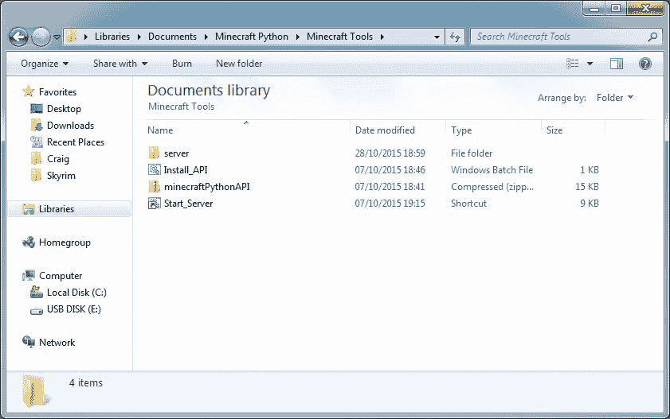

*图 1-3：* Minecraft Tools *文件夹*

#### 运行 Spigot 并创建游戏

当 Spigot 第一次运行时，它将为你创建一个 Minecraft 世界。要启动 Spigot，请按照以下步骤操作：

1.  进入你的*Minecraft Python*文件夹并打开*Minecraft Tools*文件夹。

1.  在*Minecraft Tools*文件夹中，双击*Start_Server*文件。如果弹出提示询问是否允许访问，请点击**允许**。

1.  Spigot 将启动你的 Minecraft 服务器。你会看到一个窗口弹出，里面有很多文字，这时 Spigot 正在为你生成游戏世界。当 Spigot 完成后，你的屏幕将显示如图 1-4 所示的内容。请保持此窗口打开。

    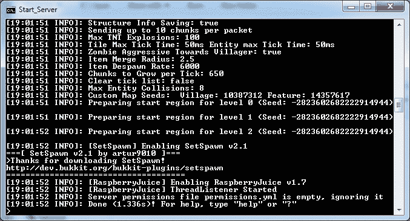

    *图 1-4：Spigot 服务器已准备好*

1.  打开 Minecraft 并点击**多人游戏**。

1.  点击**添加服务器**按钮。

1.  在服务器名称框中，将你的服务器命名为 `Minecraft Python World`，在服务器地址框中输入 `localhost`，如 图 1-5 所示。然后点击 **完成**。

    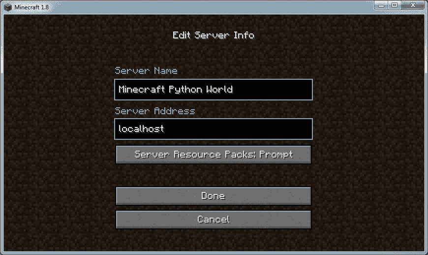

    *图 1-5：设置服务器*

1.  双击 **Minecraft Python World**，Spigot 创建的世界将会打开。

让我们快速查看一下你在 Spigot 服务器上的新 Minecraft 世界。这个世界设置为创意模式，你可以自由飞行。双击空格键开始飞行。按住空格键会让你飞得更高，按住 SHIFT 键会让你向地面下降。如果你想停止飞行，只需再次双击空格键。

#### 从新世界开始

使用服务器创建一个全新的 Minecraft 世界与在单人模式中创建新世界稍有不同。按照以下步骤创建新世界：

1.  转到 *Minecraft Python* 文件夹。右键点击 *Minecraft Tools* 文件夹并点击 **复制**。

1.  右键点击 *Minecraft Python* 文件夹中的任何位置并点击 **粘贴**。这将创建一个名为 *Minecraft Tools - Copy* 的 *Minecraft Tools* 文件夹副本。

1.  右键点击 *Minecraft Tools - Copy* 文件夹并点击 **重命名**。我将新文件夹命名为 *New World*，但你可以将其命名为你想要的任何名字。

1.  打开 *New World* 文件夹（或你所命名的文件夹），然后打开 *server* 文件夹。

1.  在 *server* 文件夹中，选择 *world*、*world_nether* 和 *world_the_end* 文件夹，如 图 1-6 所示。按 DELETE 键删除这些文件夹。

    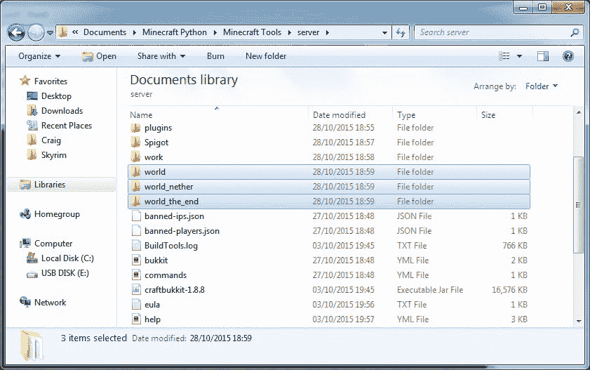

    *图 1-6：我已标出需要删除的文件夹。*

1.  仍然在 *server* 文件夹中，点击 *start* 文件。（请注意，必须点击位于 *server* 文件夹内的 *start* 文件，而不是原始的 *Start_Server* 文件！）这将重新启动服务器并生成一个新世界。

1.  现在当你打开 Minecraft 并进入 Minecraft Python World 时，你将看到一个新生成的世界。

你可以重复这个过程，创建任意数量的新世界。如果你想打开旧世界，仍然可以通过点击 *Minecraft Tools* 文件夹中的 *Start_Server* 文件来运行它。

要删除一个世界并用新世界替换它，只需删除你想替换的世界文件夹中的 *world*、*world_nether* 和 *world_the_end* 文件夹。

#### 离线游戏

如果你无法连接到互联网，尝试从 Minecraft 游戏连接到 Minecraft 服务器时会出现错误。你可以通过更改服务器的属性来解决这个问题。首先，确保你已经关闭了服务器窗口。然后打开 *Minecraft Python* 文件夹，接着是 *Minecraft Tools* 文件夹，再打开 *server* 文件夹。在文本编辑器（如记事本）中打开 *server.properties* 文件，将 `online-mode` 设置（见图 1-7）从 `true` 改为 `false`。保存更改后，返回 *Minecraft Tools* 文件夹，双击 *Start_Server* 文件重新启动服务器。现在你就可以离线玩了。

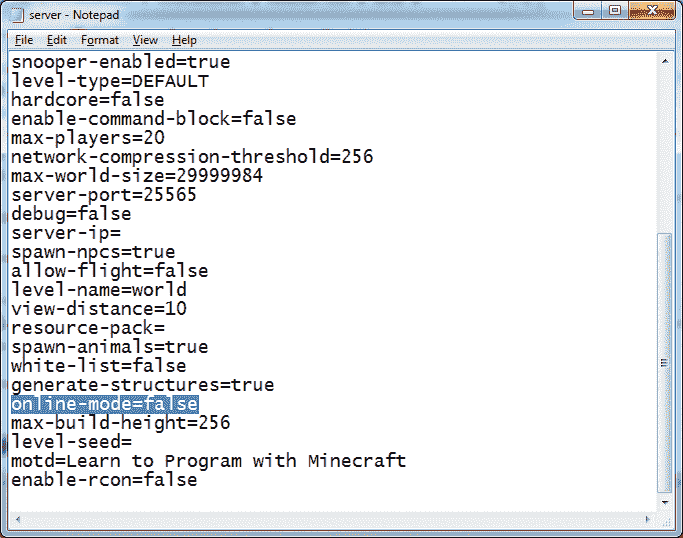

*图 1-7：将高亮的设置从* `true` *改为* `false`。

#### 切换到生存模式

我已将你的 Minecraft 服务器的默认游戏模式设置为创造模式。这将使你在编写和运行 Python 程序时更加方便，因为你不必担心玩家的健康、饥饿或被攻击问题。

但你可能只是想在生存模式下测试一些程序，纯粹是为了好玩。将服务器从创造模式切换到生存模式很简单，而且可以随时切换回来。

要将服务器从创造模式切换到生存模式，按照以下步骤操作：

1.  打开 *Minecraft Tools* 文件夹。然后在该文件夹中打开 *server* 文件夹。

1.  找到 *server.properties* 文件，并用文本编辑器（如记事本）打开它。

1.  在文件中找到 `gamemode=1` 这一行，并将其改为 `gamemode=0`，如图 1-8 所示。

    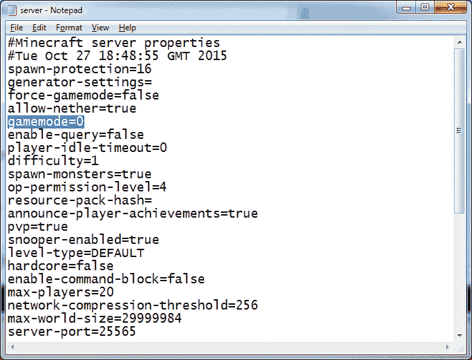

    *图 1-8：我通过将* `gamemode` *设置为* `0` *切换到了生存模式*。

1.  保存文件并关闭它。

1.  通过点击 *Start_Server* 文件（位于 *Minecraft Tools* 文件夹中）启动服务器。当你加入 Minecraft Python World 游戏时，它现在将处于生存模式。

你可以随时切换回创造模式。只需重复这些步骤，但在第 3 步中，将 *server.properties* 文件中的 `gamemode=0` 改为 `gamemode=1`。

现在你已经在电脑上设置好了！接下来，让我们认识一下 IDLE，这是你编写代码的地方。翻到“了解 IDLE”第 20 页。

### 设置你的 Mac

你需要安装五个组件，以便用 Python 控制 Minecraft：

• Minecraft

• Python 3

• Java 开发工具包（JDK）

• Minecraft Python API

• Spigot Minecraft 服务器

在这一部分，我将指导你在电脑上安装这些组件。我们从安装 Minecraft 开始。

#### 安装 Minecraft

如果你已经拥有 Minecraft 并且安装了最新版本的 Minecraft，请跳到 “安装 Python”第 13 页。如果你不确定是否已经安装了最新版本的 Minecraft，请按照本节中的步骤安装最新版本。

如果你还没有购买这款游戏，你可以从官方的 Minecraft 网站购买一份，*[`minecraft.net/`](https://minecraft.net/)*。你可能需要找个成年人来帮你哦！记得在购买 Minecraft 时使用的用户名和密码——你稍后登录时会需要它。

在购买 Minecraft 之后，按照以下步骤在 Mac 上安装 Minecraft：

1.  访问* [`minecraft.net/download`](https://minecraft.net/download)*。

1.  在 Minecraft for Mac OS X 部分，找到*Minecraft.dmg*链接并点击它进行下载。（如果看不到 Minecraft for Mac OS X 部分，请点击**显示所有平台**。）

1.  等待文件下载（我稍微看了下窗外），然后打开它。当窗口弹出时，按照图 1-9 所示，将 Minecraft 图标拖动到*应用程序*文件夹中。

    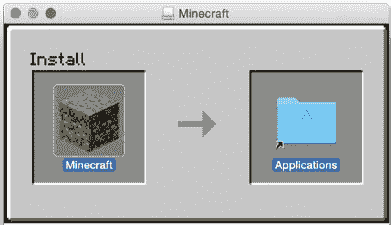

    *图 1-9：将 Minecraft 图标拖入* 应用程序 *文件夹进行安装。*

现在 Minecraft 应该已经安装好了。

你知道什么是个好主意吗？当然是玩 Minecraft 了。花几分钟让它启动并运行吧：

1.  要打开 Minecraft，点击 Dock 上的 Finder 图标以打开文件浏览器。

1.  在侧边栏中，点击**应用程序**。

1.  在*应用程序*文件夹中找到 Minecraft，如图 1-10 所示。双击它并选择**打开**。

1.  你可能会被询问是否要打开 Minecraft，因为它是从互联网下载的。点击**打开**。

1.  Minecraft 将启动并可能安装更新。

1.  接下来将弹出登录窗口。输入你在购买 Minecraft 时使用的用户名和密码，然后点击**登录**。

    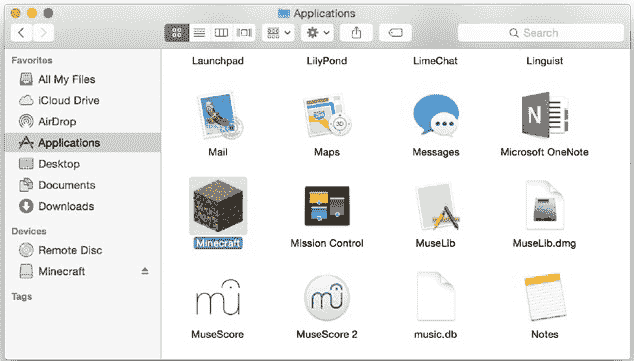

    *图 1-10：在* 应用程序 *文件夹中找到 Minecraft。*

1.  点击**开始游戏**。Minecraft 将下载一些更新，然后打开。

1.  最后，点击**单人游戏** ▸ **创建新世界**。给你的世界命名，然后点击**创建新世界**。世界将会生成，你可以尽情地玩耍。

玩得开心！如果你从未玩过 Minecraft，试着玩一会儿，直到 Minecraft 世界里天黑了。小心怪物哦！注意，当你使用 Python 时，Minecraft 将会是一个多人游戏世界，与这个世界不同。我们将在“运行 Spigot 并创建游戏”的第 16 页中讲到这一点。

回到正事！现在是安装 Python 的时候了。要从 Minecraft 中解放你的光标，只需按下键盘上的 ESC 键。在继续安装其他内容之前，请先关闭 Minecraft。

#### 安装 Python

Python 是你将在本书中学习的编程语言。现在让我们开始安装它吧。

1.  访问* [`www.python.org/downloads/mac-osx/`](https://www.python.org/downloads/mac-osx/)。

1.  点击链接上写着**Latest Python 3 Release - Python 3.5.0**的部分。（这是本文写作时 Python 3 的最新版本，但你可能会看到更新的版本。请安装最新版本。）Python 将开始下载。

1.  当安装程序下载完成后，点击它。

1.  当安装程序打开时，点击**继续**三次。系统会要求你同意软件许可协议的条款，点击**同意**。

1.  点击**安装**，然后等待 Python 安装完成。我在等待时查看了天气预报。

1.  点击**关闭**。Python 现在已安装完成。

#### 安装 Java

现在 Minecraft 和 Python 都已经安装完毕，你需要配置它们，以便它们能够互相通信。你将使用一个名为 Spigot 的程序来实现这一点，但为了让 Spigot 正常工作，你首先需要在计算机上安装最新的 Java 开发工具包（JDK）。现在就来做吧：

1.  访问*[`www.oracle.com/technetwork/java/javase/downloads/index.html`](http://www.oracle.com/technetwork/java/javase/downloads/index.html)*并点击**Java 下载**按钮。

1.  选择**接受许可协议**，然后点击**Mac OSX x64**。

1.  当安装程序下载完成后，点击它。

1.  当安装程序打开时，双击**安装**图标。

1.  当系统提示你输入密码时，输入你的密码。

1.  等待 Java 安装完成。当安装完成时，点击**关闭**。

现在让我们测试一下 JDK 是否正确安装：

1.  点击**系统偏好设置**。

1.  你应该能在“系统偏好设置”下看到一个 Java 图标，如图 1-11 所示。

    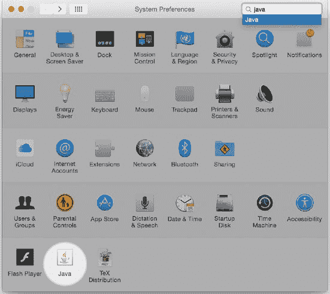

    *图 1-11：Java 已安装。*

就这样！Java 已经设置好，可以运行 Minecraft 服务器了！接下来我们继续进行。

#### 安装 Minecraft Python API 和 Spigot

接下来，你需要在计算机上安装 Minecraft Python API 和 Minecraft 服务器。

*API*代表*应用程序编程接口*。它允许程序与其他人创建的应用程序进行通信。在本例中，Minecraft Python API 允许你编写的 Python 程序与 Minecraft 进行交互。例如，你可以编写一个 Python 程序，使用 API 让 Minecraft 在游戏中生成一个方块，或者改变玩家的位置。

标准的 Minecraft 单人游戏不支持 API。相反，你的程序将与 Minecraft *服务器*进行交互，这样就能使用 API。Minecraft 服务器通常是在线使用，让多人可以在同一个游戏世界中一起玩。你也可以在自己的计算机上运行服务器，独自玩游戏。无论是多人游戏还是单人游戏 Minecraft 服务器，都允许你与 Minecraft 一起使用 API。在本书中，你将使用一个名为 Spigot 的单人 Minecraft 服务器来在你的计算机上运行。

现在你已经知道 API 和服务器的作用了，接下来让我们把它们安装到你的计算机上。我已经为你创建了一个方便的下载方式，让你可以快速完成这些设置。只需按照这些步骤进行即可：

1.  前往 *[`www.nostarch.com/pythonwithminecraft/`](https://www.nostarch.com/pythonwithminecraft/)* 并下载 *MinecraftTools Mac.zip* 文件。

1.  文件下载完成后，打开 *Downloads* 文件夹并点击 **Show in Finder**。

1.  在 Finder 中，CONTROL-click 文件并选择 **Copy MinecraftTools Mac.zip**。

1.  前往你的 *Documents* 文件夹。在文件夹中，CONTROL-click 并选择 **New Folder**。将新文件夹命名为 *MinecraftPython*。确保文件夹名称中不包含空格。

1.  打开 *MinecraftPython* 文件夹。在文件夹中，CONTROL-click 并选择 **Paste Item**。*MinecraftTools Mac.zip* 文件将被复制到这里。

1.  CONTROL-click 并选择 **Open With** ▸ **Archive Utility**。当 Archive Utility 打开压缩文件后，你会看到一个名为 *MinecraftTools* 的新文件夹。

1.  打开 *MinecraftTools* 文件夹。它的内容如 图 1-12 所示。

1.  CONTROL-click 名为 *Install_API.command* 的文件并选择 **Open**。这将打开一个新窗口。输入你的密码以安装 Minecraft Python API。

    **注意**

    *如果你收到一个错误提示，说 Install_API.command 因为来自未识别的开发者而无法打开，请点击 **System Preferences**，然后点击 **Security and Privacy**。你会看到一条信息说 “Install_API.command 无法打开，因为它来自未识别的开发者。”点击 **Open Anyway**。然后窗口应该会弹出。*

    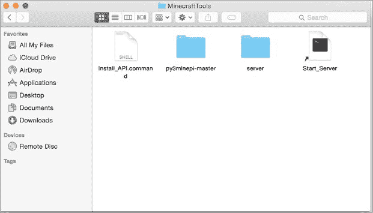

    *图 1-12：* MinecraftTools *文件夹的内容*

1.  安装完成后，关闭窗口。

Minecraft Python API 和 Minecraft 服务器现在已经安装。最后一步是运行服务器。我们接下来会进行此操作。

#### 运行 SPIGOT 和创建游戏

当 Spigot 第一次运行时，它将为你创建一个 Minecraft 世界。要启动 Spigot，请按照以下步骤操作：

1.  前往你的 *MinecraftPython* 文件夹并打开 *MinecraftTools* 文件夹。

1.  在 *MinecraftTools* 文件夹中，CONTROL-click *Start_Server* 文件并选择 **Open**。如果出现错误信息，请前往 **System Preferences**，然后到 **Security and Privacy**，点击 **Open Anyway**。

1.  Spigot 将启动你的 Minecraft 服务器。你会看到一个窗口弹出，里面有大量文本，当 Spigot 为你生成游戏世界时。完成后，确保保持这个窗口开启。

1.  打开 Minecraft 并点击 **Multiplayer**。

1.  点击 **Add Server** 按钮。

1.  在服务器名称框中，命名你的服务器为 `Minecraft Python World`，在服务器地址框中，输入 `localhost`，如 图 1-13 所示。然后点击 **Done**。

1.  双击 **Minecraft Python World**，Spigot 创建的世界将打开。

让我们快速查看一下你在 Spigot 服务器上的新 Minecraft 世界。这个世界已设置为创意模式，你可以自由飞行。双击空格键开始飞行，按住空格键可以让你飞得更高，按住 SHIFT 键则会将你拉向地面。如果你想停止飞行，只需再次双击空格键。

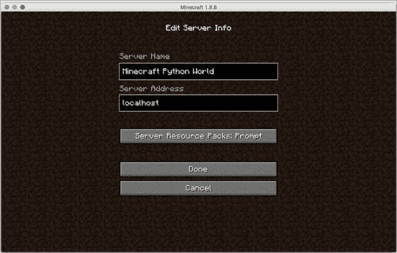

*图 1-13：添加服务器，以便将来可以轻松访问它。*

#### 从新世界开始

使用服务器创建全新的 Minecraft 世界与在单人模式下创建新世界有些不同。按照以下步骤创建一个新世界：

1.  转到 *MinecraftPython* 文件夹。按住 CONTROL 键并点击 *MinecraftTools* 文件夹，然后选择 **复制**。

1.  在文件夹中任意位置按住 CONTROL 键并点击，然后选择 **粘贴**。这将创建一个名为 *MinecraftTools copy* 的 *MinecraftTools* 文件夹副本。

1.  按住 CONTROL 键并点击 *MinecraftTools copy* 文件夹，然后选择 **重命名**。我将新文件夹命名为 *New World*，但你可以根据自己的需要命名。

1.  打开 *New World* 文件夹（或你为它命名的任何名称），然后打开 *server* 文件夹。

1.  在 *server* 文件夹中，选择 *world*、*world_nether* 和 *world_the_end* 文件夹。按 SHIFT-DELETE 删除它们。

1.  返回到 *New World* 文件夹并点击 *Start_Server* 文件。这将重新启动服务器并生成一个新世界。

1.  现在，当你打开 Minecraft 并进入 Minecraft Python 世界时，你将看到一个新生成的世界。

你可以根据需要重复这个过程来创建新世界。如果你想打开旧世界，仍然可以通过点击 *MinecraftTools* 文件夹中的 *Start_Server* 文件，而不是 *New World* 文件夹中的 *Start_Server* 文件来运行它。

要删除一个世界并用新世界替换它，只需删除你想替换的世界文件夹中的 *world*、*world_nether* 和 *world_the_end* 文件夹。

#### 离线游戏

如果你没有网络连接，当你尝试从 Minecraft 游戏连接到 Minecraft 服务器时会出现错误。你可以通过修改服务器的属性来修复此问题。首先，确保你已经关闭了服务器窗口。然后打开 *MinecraftPython* 文件夹，再打开 *MinecraftTools* 文件夹，然后打开 *server* 文件夹。用文本编辑器（例如 TextEdit）打开 *server.properties* 文件，并将 `online-mode` 设置从 `true` 更改为 `false`（见 图 1-7，第 10 页）。保存更改后，返回到 *MinecraftTools* 文件夹并点击 *Start_Server* 重新启动服务器。现在，你就可以离线游戏了。

#### 切换到生存模式

我已将你的 Minecraft 服务器的默认游戏模式设置为创意模式。这将使你在编写和运行 Python 程序时更轻松，因为你不必担心玩家失去生命、饿死或被攻击。

但你可能会想在生存模式下测试一些程序，仅仅是为了好玩。从创意模式切换到生存模式再切换回来是很容易的。

要将服务器从创意模式切换到生存模式，按照以下步骤操作：

1.  打开 *MinecraftTools* 文件夹。在该文件夹内打开 *server* 文件夹。

1.  找到 *server.properties* 文件，并使用文本编辑器（如 TextEdit）打开它。

1.  在文件中，找到包含 `gamemode=1` 的那一行，并将其更改为 `gamemode=0`（参见 图 1-8 在 第 11 页）。

1.  保存文件并关闭它。

1.  通过点击 *MinecraftTools* 文件夹中的 *Start_Server* 文件来启动服务器。当你加入 Minecraft Python World 游戏时，游戏将进入生存模式。

你可以随时切换回创造模式。只需重复这些步骤，但在第 3 步中，将 *server.properties* 文件中的 `gamemode=0` 改为 `gamemode=1`。

现在你的 Mac 设置好了！接下来让我们了解 IDLE，这是你编写代码的地方。请翻到 “了解 IDLE” 在 第 20 页。

### 设置你的树莓派

登录到你的树莓派，并使用 `startx` 命令启动桌面。（如果你使用的是最新版本的树莓派操作系统，你不需要输入此命令。）

根据你的树莓派版本，可能会安装两到三个不同版本的 Python。对于本书，你将使用最新版本的 Python，即 Python 3。

默认情况下，树莓派计算机已安装了一个简化版的 Minecraft，名为 Minecraft: Pi Edition。你所需的一切，用于开始用 Python 编程控制 Minecraft 世界的工具，已经安装完毕。如果你是第一次使用树莓派，可以在官方网站上找到开始使用的说明，* [`www.raspberrypi.org/`](http://www.raspberrypi.org/) *。

如果你使用的是较旧的 SD 卡镜像（创建于 2014 年 8 月之前），你可能会发现没有安装 Minecraft。如果未安装，安装起来很简单。首先，你需要将树莓派连接到互联网。你可以在 *[`www.raspberrypi.org/`](http://www.raspberrypi.org/)* 上找到连接树莓派到互联网的指南。

一旦连接到互联网，按照以下步骤操作：

1.  在桌面上，双击 **LXTerminal**。

1.  一旦 LXTerminal 打开，输入以下命令：

    ```
    $ sudo apt-get update
    ```

1.  更新完成后，输入以下命令：

    ```
    $ sudo apt-get install minecraft-pi
    ```

1.  等待安装完成。Minecraft 已经安装好。

与桌面版本相比，Minecraft 在树莓派上的功能有所限制。游戏世界要小得多，许多方块和其他功能（如生存模式）缺失，但你仍然可以编写并运行本书中的所有精彩程序。

在继续之前，让我们创建一个文件夹来存储你的 Python 程序。在任务栏上，点击文件浏览器图标。打开 *Documents* 文件夹，然后右键单击文件浏览器的空白处，选择 **创建新建...** ▸ **文件夹**。命名文件夹为 *Minecraft Python* 并点击 **确定**。

**注意**

*如果你使用的是原版树莓派，你会发现本书中的一些程序由于树莓派的限制运行缓慢。树莓派 2 在速度上会有较少的问题。*

要打开 Minecraft，请点击桌面左上角的开始菜单。（如果你使用的是较旧版本的 Raspberry Pi 操作系统，开始菜单会在左下角。）进入 **游戏** 并点击 **Minecraft**。Minecraft 将打开。第一次打开 Minecraft 时，你需要点击 **创建世界**。

一般来说，不要调整窗口大小，因为这样可能会遇到一些问题。

有时，当你打开其他窗口或对话框（例如确认是否要在 Python 中保存文件）时，它们会隐藏在 Minecraft 窗口后面。只需最小化 Minecraft，便可以使用其他窗口。如果遇到任何问题，可以在安装 Minecraft 后尝试重启 Raspberry Pi。

### 了解 IDLE

现在你已经安装并设置好了一切，让我们来看看 IDLE——你将用来编写和运行 Python 程序的软件。Python 安装包中包含了 IDLE，所以你不需要单独安装它。现在让我们打开 IDLE！

**Windows** 打开开始菜单，在搜索框中输入 `IDLE`。

**Mac** 打开 *应用程序* 文件夹并点击 IDLE 图标。

**Raspberry Pi** 在桌面上，双击标有 Python 3 的 IDLE 图标。

一个 IDLE 窗口会打开，如图 1-14 所示。这个窗口叫做 Python shell。当我学会用 Python 编程时，Python shell 太棒了，简直让我惊讶！

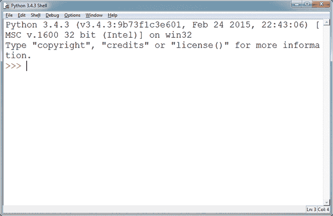

*图 1-14：用于编写 Python 程序的 IDLE 窗口*

#### 了解 Python Shell

Python shell 允许你逐行编写和运行程序。你可以编写一行代码，立即运行它并查看结果，然后再编写另一行。这非常棒，因为你可以轻松地进行实验并测试代码。

在窗口中，你应该看到行首有三个小箭头（`>>>`）。这叫做 *命令提示符*。命令提示符是 Python shell 告诉你，它准备好接受命令了。让我们从一个非常基础的命令开始：让 Python 加法运算两个数字。

点击 Python shell 中的命令提示符旁边，输入 `2 + 2`。注意，你不需要输入命令提示符本身（`>>>`）。你应该看到如下内容：

```
>>> 2 + 2
```

输入该命令后，按回车。Python shell 会输出结果。在这个例子中，结果是 4：

```
>>> 2 + 2
4
```

你还可以在 shell 中输入文本。将以下代码输入 Python shell 并按回车：

```
>>> "W" + "o" * 5
Wooooo
```

如你所见，这段代码输出了单词 `Wooooo`。命令末尾的数字决定了单词中有多少个 *o*。通过更改这个数字，你可以改变单词的长度。试着把它改成 20（或者你想要的任何数字）：

```
>>> "W" + "o" * 20
Woooooooooooooooooooo
```

哇哦哦哦哦哦哦！Python shell 真的很有趣。

注意，IDLE 会为代码上色。这叫做*语法高亮*，它使代码的不同部分更容易查看。本书中的所有代码颜色与 IDLE 中的一致，因此当你编写程序时，颜色将匹配。

接下来让我们看看 IDLE 的文本编辑器。

#### 向 IDLE 的文本编辑器问好

当谈到编写较长的程序时，你不能使用命令行。IDLE 的文本编辑器是解决方案！与命令行不同，它不会在你输入每一行代码后立即运行。而是，当你指示它时，它会运行整个程序。

在 IDLE 中，点击菜单栏中的**文件**，然后选择**新建文件**。一个新窗口会打开，看起来就像图 1-15 中的窗口。这就是文本编辑器。

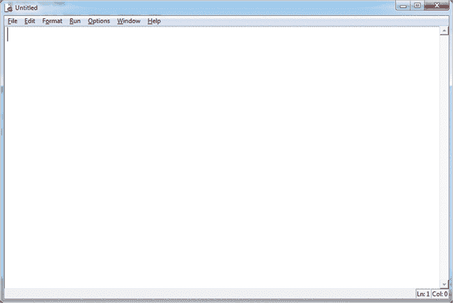

*图 1-15：IDLE 的文本编辑器*

“嘿！”我听到你说。“文本编辑器看起来和 IDLE 的 Python 命令行一样。”嗯，确实是的，但有一个非常大的区别。新窗口的每一行开头没有命令提示符（`>>>`）。

让我们看看这意味着什么。在文本编辑器的第一行，输入以下代码并按回车：

```
print(2 + 2)
```

你预期会发生什么吗？按回车并不会在这里运行代码——它只是创建了一个新行。因为文本编辑器在你按回车时不会运行代码，所以你可以在运行它们之前编写任意多的行。让我们再添加几行。这就是完成后你文件的样子：

```
print(2 + 2)
print("W" + "o" * 20)
print("PYTHON!")
print("<3s")
print("Minecraft")
```

在你从 IDLE 的文本编辑器运行 Python 代码之前，你需要保存它。要保存程序，点击**文件**，然后选择**另存为**。在你的*Minecraft Python*文件夹中创建一个名为*Setting Up*的文件夹。将此程序保存为*pythonLovesMinecraft.py*在*Setting Up*文件夹中。

现在让我们运行它。进入菜单中的**运行**，然后点击**运行模块**。命令行窗口将会打开，你的程序将在其中运行。输出结果显示在图 1-16 中。

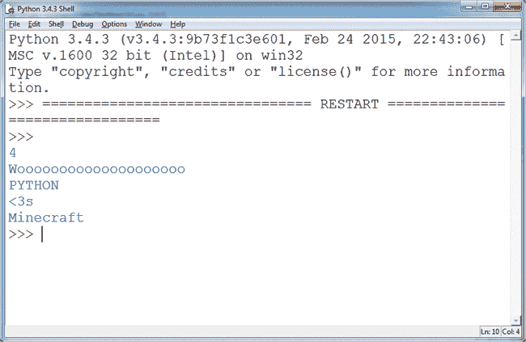

*图 1-16：Python 程序的输出结果*

与命令行不同，从文本编辑器运行的命令不会自动输出它们的结果。这就是为什么你需要使用`print()`来输出代码的结果。现在不必太担心细节——你将在本书的后面学到这些。

每次你从 IDLE 的文本编辑器运行程序时，命令行都会打开来运行程序。即使你在一个单独的窗口中编写程序，IDLE 始终使用命令行来运行你的程序。

#### 何时使用 Python 命令行，何时使用文本编辑器

现在你已经看到了 IDLE 的 Python 命令行和 IDLE 的文本编辑器之间的区别，你可能会想知道什么时候使用其中之一更好。一般来说，我在只想测试几行代码且不打算重复使用它们时使用 Python 命令行。当你跟随本书学习时，我建议你使用 Python 命令行运行短小的示例。

我使用文本编辑器来编写那些代码行数较多或需要重复使用的程序。本书中的所有任务都使用文本编辑器，以便你能保存进度，但你也可以随时在命令行中玩耍，快速尝试一些东西。

#### 本书中使用的提示

在本书中，每当你看到一段写在 IDLE Python shell 中的代码，它将以命令提示符（`>>>`）开始，如下所示：

```
>>> print("Wooooo Minecraft")
```

我建议你在阅读时将代码复制到 IDLE 中，这样你可以熟悉代码的写法。命令行的任何输出都会显示在下一行：

```
>>> print("Wooooo Minecraft")
Wooooo Minecraft
```

在文本编辑器中编写的代码*不会*以命令提示符开始，像这样：

```
print("Adventures")
```

代码的输出不会自动在你的计算机上显示。为了向你展示运行代码时的输出效果，我会通过解释或在新框中显示输出。例如，运行上述代码应输出：

```
Adventures
```

为了让你更容易理解书中代码的解释，我添加了标记来指出我正在讲解的部分。每当你在代码中看到标记时，文本中会有相应的解释，反之亦然。这些标记是这样的：

➊ ➋ ➌ ➍ ➎ ➏

### 测试你的 Minecraft Python 设置

让我们确认你已正确安装所有软件。为此，我们将快速编写一个非常基础的 Python 程序，它将与 Minecraft 互动。

首先，最重要的是：如果你使用的是 PC 或 Mac，你需要打开三款软件。请按照以下步骤操作：

1.  通过进入你的*Minecraft Tools*文件夹并点击*Start_Server*来打开 Spigot。

1.  打开 Minecraft，并通过选择多人游戏菜单中的**Minecraft Python World**来连接到 Spigot 服务器。

1.  按下键盘上的 ESC 键，释放 Minecraft 窗口中的光标，然后在 IDLE 中打开 Python shell。

每次编写与 Minecraft 交互的程序时，你都需要打开这三款软件。

如果你使用的是 Raspberry Pi，请打开 IDLE 和 Minecraft。

现在，将以下内容输入到你的 shell 中。确保输入的小写字母和大写字母完全匹配！

```
>>> from mcpi.minecraft import Minecraft
```

按下 ENTER 键，让光标移动到下一行。然后输入以下代码：

```
>>> mc = Minecraft.create()
```

如果此时你看到类似于图 1-17 的错误信息，那么说明出现了问题。

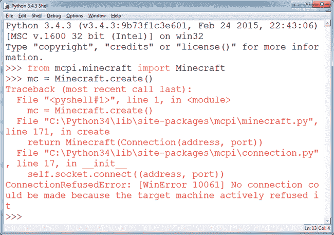

*图 1-17：表示我尚未启动 Spigot 的错误信息*

按照以下顺序检查：你是否已打开 Minecraft？Spigot 是否正在运行？你是否在多人游戏世界中？你是否使用的是正确版本的 Python（3，而不是 2）？如果在输入第一行后出现错误，说明你没有正确安装 API。请重新按照步骤安装 API。如果错误出现在第二行之后，可能是你的 Java 或 Spigot 没有正确安装。尝试逐一重新安装这些软件。

如果你收到一个错误，提示`ImportError: No module named 'mcpi'`，可能是你正在使用旧版本的 Python。确保你安装了最新版本！

如果没有出现错误信息，请在 IDLE 中将这行代码添加到程序中：

```
mc.player.setTilePos(0, 120, 0)
```

当你这样做时，玩家将飞得很高！这段代码将玩家传送到一个新的位置。你将在第二章中学到更多内容。翻到下一页开始吧！
