## **2**

**使用变量进行瞬间传送**


你准备好用 Python 的力量控制你的《Minecraft》世界了吗？在这一章中，你将简要了解 Python 的基础知识。然后你将把新学到的技能付诸实践，创建属于你自己的《Minecraft》世界瞬间传送之旅！

本章中描述的概念不仅限于《Minecraft》Python，因此你可以在任何你创建的 Python 程序中使用它们。

### **什么是程序？**

*程序*是一组指令，让你的计算机执行特定的任务。想象一下手机上的计时器应用。计时器程序有指令，告诉它当你按下开始和停止按钮时应该做什么。它还有指令，会在屏幕上显示计时结果。某个人或某个女孩编写了这个计时器程序。

每天全球有数百万个程序在被使用。手机的消息应用是一个程序，交通灯是由程序控制的，甚至像《Minecraft》这样的计算机游戏也是程序。

在本书中，你将学习编程的基本原理，并学会如何编写程序，让你的创意在《Minecraft》中得以实现。

### **使用变量存储数据**

让我们从学习如何使用变量存储数据开始。*变量*让你存储数据，以便稍后在程序中使用。*数据*是任何你可能想记录的信息，例如数字、名字、任何类型的文本、物品清单等。例如，下面是一个名为`pickaxes`的变量，它存储了数字值`12`：

```
>>> pickaxes = 12
```

变量可以存储数字、单词，甚至完整的句子，例如“快滚开，苦力怕！”你还可以修改变量，这让你在《Minecraft》中做一些非常酷的事情。事实上，很快你就会利用变量来发挥瞬间传送的强大力量！

要在 Python 中创建一个变量，你需要使用变量名、等号（`=`）和一个值。假设你即将开始一次穿越《Minecraft》多个生物群落的伟大冒险；你会想带上很多食物。你可以将食物表示为一个变量。例如，在以下的 Python 终端中，`bread`是变量名，`145`是它的值：

```
>>> bread = 145
```

变量的名称总是位于等号的左侧，而你想要存储的值则总是在右侧，如图 2-1 所示。这行 Python 代码*声明*了变量`bread`并*赋值*`145`给它。

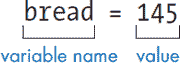

*图 2-1：变量声明的部分。如果你有 145 块面包，那一定是非常饿了。*

在你声明一个变量并为其赋值之后，你可以在 Python 终端输入变量名，查看它所存储的内容：

```
>>> bread
145
```

你几乎可以为变量起任何名字，但最好使用一个能描述变量用途的名字，这样你就能理解程序中的内容。虽然这不是强制规则，但你应该用小写字母开始变量名，而不是大写字母。这是 Python 程序员遵循的风格，遵循这个风格对你也有好处，这样别人如果需要查看你的代码时会更容易理解。

**注意**

*虽然变量的值是*存储的，*但它并没有*被保存。*变量的值保存在计算机的临时内存中，这意味着当计算机关闭或程序停止运行时，变量的值将不再被保存。试试关闭 IDLE 再重新打开它。当你尝试获取`bread`的值时，*会发生什么？*

#### **编程语言的结构**

*语法*是一组规则，用来描述编程语言的语法和标点，类似于人类语言中的语法和标点。一旦你理解了 Python 的语法，你就能更好地编写计算机能够理解的程序；然而，如果你不使用正确的语法，计算机将无法理解你让它做什么。

想把你代码中的每一条指令当做一个句子来看。在英语中，句子以句号（在英国叫作“full stop”）结束。而 Python 使用新的一行来表示一条指令的结束和下一条指令的开始。每行上的指令称为*语句*。

比如，假设你想跟踪你拥有多少个镐、铁矿块和圆石块。在 Python 解释器中，你会这样写：

```
>>> pickaxes = 12
>>> iron = 30
>>> cobblestone = 25
```

图 2-2 展示了在 Python 解释器中这是什么样子的。

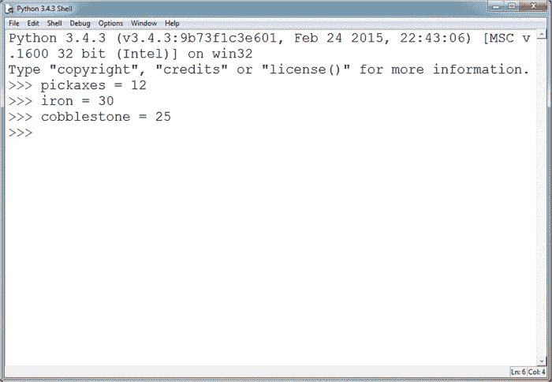

*图 2-2：在 Python 解释器中输入代码*

注意，每条语句都在自己的行上。由于有了新的一行，Python 会理解你想跟踪三项不同的内容。但是如果你没有把每条语句放在新的一行，Python 会感到困惑，并且给你语法错误：

```
>>> pickaxes = 12 iron = 30 cobblestone = 25
SyntaxError: invalid syntax
```

*语法错误*是 Python 告诉你它无法理解的方式。Python 无法执行这些指令，因为它不知道哪一条语句结束，哪一条语句开始。

如果你在行首加上空格，Python 也不会知道该怎么做：

```
>>>   iron = 30
SyntaxError: unexpected indent
```

如果你仔细观察，你会发现代码的每一行开头都有空格。当你遇到意外的缩进语法错误时，比如这里的错误，你就知道你的代码行开头有不该有的空格。

Python 对代码的书写非常挑剔。如果你在输入本书中的示例时遇到语法错误，请仔细检查你的代码。很可能，你会发现一个小错误。

#### **变量的语法规则**

你需要了解一些变量命名的语法规则，这样 Python 才能理解它们：

• 变量名中不要包含符号，除了下划线（`_`），否则你会遇到语法错误。

• 变量名不能以数字开头，例如 `9bread`。在变量名的其他位置使用数字是可以的，例如 `bread9`。

• 你不需要在等号两边添加空格：即使没有空格，你的程序也会正常运行。但空格会让代码更易读，所以最好加上它们。

变量非常方便。接下来，你将学习如何更改变量的值，然后你就能准备好传送你的玩家了！

#### **更改变量的值**

你可以像声明变量一样随时更改变量的值。例如，假设你遇到五只 Minecraft 猫，并且想将这个值保存为变量。你首先声明一个变量 `cats`，并将值 `5` 赋给它，在 Python 交互式命令行中会是这样的：

```
>>> cats = 5
>>> cats
5
```

后来你遇到了五只猫，并决定想更新这个值。如果你将 `cats` 的值更改为 10，会发生什么呢？

```
>>> cats = 10
>>> cats
10
```

当你向 Python 请求 `cats` 的新值时，它不再是 `5`！现在，当你在程序中使用 `cats` 变量时，它将使用新值 `10`。

你可以在变量中存储许多类型的数据。*数据类型* 告诉计算机如何处理特定的数据。我将首先讨论你最常使用的一种类型：整数。稍后在本章中，我还将介绍浮点数数据类型。

#### **整数**

*整数* 是正数或负数的整数。像 10、32、–6、194689 和 –5 这样的值是整数，但 3.14 和 6.025 不是。

你可能每天都在不经意间使用整数，即使是在 Minecraft 中！例如，你可能在去采矿时看到山坡上的 12 只牛，身上带着 2 个新鲜的苹果和 5 颗钻石。这些数字都是整数。

假设你在 Minecraft 世界里有五只猪，你想编写一个程序以某种方式使用这些猪的数量。在 Python 中，你可以声明一个整数变量来表示猪的数量：

```
>>> pigs = 5
```

你还可以在变量中存储负值。例如，要表示温度是零下五度，你可以这样设置变量：

```
>>> temperature = -5
```

要在 Minecraft 中使用 Python 变量和整数，请完成第一个任务。

#### **任务 #1: 传送玩家**

在这个任务中，你将通过使用整数将玩家传送到新位置，来探索变量是如何工作的。

如图 2-3 所示，你的玩家在 Minecraft 世界中有一个*位置*，由三个*坐标*表示：`x`、`y` 和 `z`。字母 `y` 代表高度，而 `x` 和 `z` 代表平面上的水平位置。

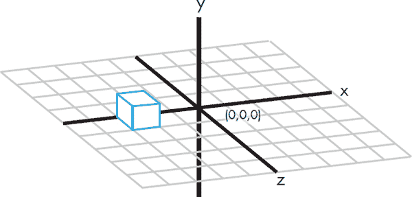

*图 2-3: 3D 坐标*

如果你使用的是 Raspberry Pi 版游戏，玩家的位置由游戏窗口左上角的三个数字表示，你可以在 图 2-4 中看到。如果你使用的是桌面版游戏，可以通过按 F3 来查看玩家的坐标，并在左侧第二块文本的第一行找到标有 *XYZ* 的位置，如 图 2-5 所示。

在游戏中移动玩家并观察位置数字的变化；坐标应该会实时更新，当玩家行走时，坐标会即时变化。很酷吧？不过，走很远的路需要很长时间。为什么要花那么多时间走路，当你可以通过 Python 立即改变位置呢？让我们来看看如何实现这一点。

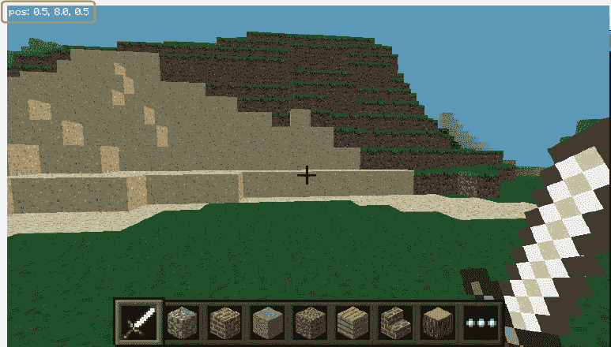

*图 2-4：Minecraft: Pi Edition 中显示的玩家位置*

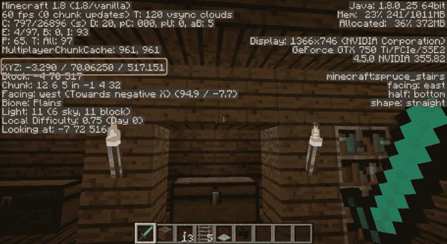

*图 2-5：桌面版 Minecraft 中显示的玩家位置*

打开你的计算机或 Raspberry Pi，并按照以下步骤操作：

1.  打开 IDLE，点击 **文件** ▸ **新建文件**（或某些计算机上是 **新建窗口**）。你可以在 图 2-6 中看到空的文本编辑器窗口。如果你使用的是 Raspberry Pi 或计算机上安装了多个版本的 Python，请确保使用 Python 3，而不是 Python 2.7。

    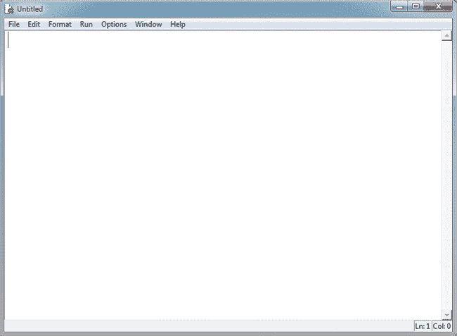

    *图 2-6：IDLE 中的新文本编辑器窗口*

1.  当新窗口出现时，点击 **文件** ▸ **另存为**。

1.  在 第一章 中创建的 *Minecraft Python* 文件夹内，创建一个名为 *variables* 的新文件夹。

1.  打开 *variables* 文件夹，命名你的文件为 *teleport.py*，然后点击 **保存**。

现在你在 IDLE 的文本编辑器中工作，将以下两行代码添加到程序的顶部：

```
from mcpi.minecraft import Minecraft
mc = Minecraft.create()
```

这些行代码将你的程序与 Minecraft 连接；你将在每个与 Minecraft 交互的程序中使用它们。接下来，创建三个整数变量，分别命名为 `x`、`y` 和 `z`。

```
x = 10
y = 110
z = 12
```

这些变量表示你想要传送玩家到的位置。现在，将这些变量的值设为 10、110 和 12，如下所示。

然后输入以下代码行，这将传送玩家：

```
mc.player.setTilePos(x, y, z)
```

程序中的 `setTilePos()` 部分是一个 *函数*，它是一个预先编写且可重用的代码块。`setTilePos(x, y, z)` 函数告诉 Minecraft 使用你刚刚设置的三个变量来改变玩家的位置。括号中的值叫做 *参数*。你将刚才创建的变量作为参数传递给函数，以便函数在执行时使用 `x`、`y` 和 `z` 的值。

**警告**

*如果你使用的是 Raspberry Pi，请不要为* `x` *和* `z` *变量使用大于 127 或小于 -127 的值。Minecraft Pi 版的世界很小，超出此范围的数字会导致游戏崩溃。*

清单 2-1 包含了完整的代码，用于传送玩家，你也可以在 图 2-7 中看到：

*teleport.py*

```
➊ # Connect to Minecraft
   from mcpi.minecraft import Minecraft
   mc = Minecraft.create()

   # Set x, y, and z variables to represent coordinates
   x = 10
   y = 110
   z = 12

   # Change the player's position
   mc.player.setTilePos(x, y, z)
```

*代码清单 2-1：完成的传送代码*

为了让这个程序更容易理解，我在代码中加入了一些 *注释* ➊。注释是代码中的有用语句，用来描述代码的功能，但 Python 会忽略它们。换句话说，当你运行程序时，Python 会跳过注释的行而不执行任何操作。单行注释以井号（`#`）开始。我的注释描述了 *teleport.py* 中每个部分的功能。养成在代码中写注释的习惯，这样当你回到程序时，可以帮助你记住每个部分的作用。

图 2-7 显示了在 IDLE 文本编辑器中编写的完整程序。

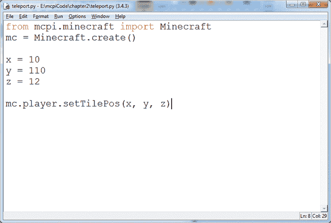

*图 2-7：在 IDLE 文本编辑器中的完整程序*

现在让我们运行程序！按照以下步骤操作：

1.  通过点击桌面图标打开 Minecraft。

1.  如果你使用的是 Raspberry Pi，点击 **开始游戏** 和 **创建新世界**。如果你使用的是桌面版 Minecraft，请根据 第 7 页 Windows 系统和 第 16 页 Mac 系统中的“运行 Spigot 和创建游戏”中的说明打开游戏世界。

1.  世界生成后，按 ESC 键（如果你使用的是 Raspberry Pi，请按 TAB）来释放鼠标。你现在可以将鼠标移到 Minecraft 窗口外，或者双击 Minecraft 窗口重新选择游戏。图 2-8 显示了我电脑上的 IDLE 和 Minecraft 窗口。

    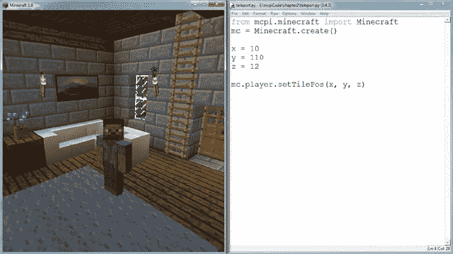

    *图 2-8：这是我喜欢的 Minecraft 和 IDLE 文本编辑器窗口的排列方式。*

1.  点击包含 *teleport.py* 程序的 IDLE 文本编辑器窗口。

1.  点击 **运行** ▸ **运行模块** 或按 F5。如果你还没有保存程序，IDLE 会在运行前询问是否保存。点击 **确定** 来保存程序。如果点击“取消”，程序将不会运行。

**注意**

*当你在 Raspberry Pi 上从 IDLE 运行程序时，可能会弹出一个要求你保存程序的对话框，并且它可能会隐藏在 Minecraft 窗口后面。如果你认为 IDLE 已经冻结，可能是对话框被隐藏了。只需最小化 Minecraft 窗口，然后在 IDLE 对话框中点击“确定”。点击“确定”后，最大化 Minecraft 窗口。*

做得好！现在你的程序应该能够运行了，几秒钟后，玩家应该会被传送到坐标 (10, 110, 12)，如 图 2-9 所示。你的世界可能和我的不一样，所以你在自己电脑上运行时会看到一些不同的地方。

**附加目标：跳跃**

你觉得你已经掌握了传送技能吗？试着将 `x`、`y` 和 `z` 替换为其他整数，看看玩家会出现在什么位置！也可以尝试使用负值！

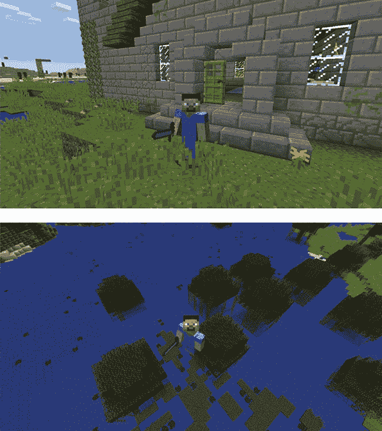

*图 2-9：我已经从我的房子传送到了位置 (10, 110, 12)，那里位于一个沼泽上方。小心下面！*

#### **浮动**

不是所有数字都是整数。小数点用于表示无法用整数描述的值。例如，你可能只有一个苹果的一半（0.5）。使用小数点的数字被称为*浮点数*，或*浮动数*。这是 Python 使用的另一种数据类型。当你需要更高精度时，浮点数就代替了整数。浮点数也可以表示整数（如`3.0`），但整数不能表示带小数部分的数字。

你可能已经注意到，玩家的位置坐标（如图 2-4 和图 2-5 所示）包含小数，这意味着它们是浮点数！

在 Python 中，声明浮点变量的方式和声明整数变量的方式相同。例如，要将变量`x`设置为`1.34`，你可以这样写：

```
>>> x = 1.34
```

要创建一个负浮点数，可以在数值前加上负号（`-`）：

```
>>> x = -1.34
```

在下一个任务中，你将通过使用浮点数将玩家传送到精确位置，获得对传送能力的更大控制。

#### **任务 #2: 精确到你想要的位置**

你已经学习了如何使用整数设置玩家的位置，但如果使用浮点数，你可以更精确地设置玩家的位置。在这个任务中，我们将修改任务 #1 中的程序，通过使用浮点值来传送玩家：

1.  在 IDLE 中，打开*teleport.py*程序（见第 34 页），通过点击**文件** ▸ **打开**并从你的*variables*文件夹中选择该文件。

1.  将程序另存为*teleportPrecise.py*，保存在你的*variables*文件夹中。

1.  在*teleportPrecise.py*文件中，将`x`、`y`和`z`变量更改为使用浮点数，而不是整数。也就是说，将`x`、`y`和`z`的值从 10、110 和 12 更改为 10.0、110.0 和 12.0。

1.  将代码的最后一行改为`mc.player.setPos(x, y, z)`，去掉`Tile`这个词。

1.  保存程序。

1.  打开一个 Minecraft 世界并运行代码。

最终结果应该如下所示：

*teleportPrecise.py*

```
# Connect to Minecraft
from mcpi.minecraft import Minecraft
mc = Minecraft.create()

# Set x, y, and z variables to represent coordinates
x = 10.0
y = 110.0
z = 12.0

# Change the player's position
mc.player.setPos(x, y, z)
```

注意这里使用的`mc.player.setPos(x, y, z)`与清单 2-1 中使用的`mc.player.setTilePos(x, y, z)`的区别。`setTilePos()`函数使用整数告诉游戏你想要传送到的方块的位置。而`setPos()`函数稍有不同——它使用浮点数告诉游戏方块的位置，以及你想要传送到该方块上*具体的位置*。通过我的程序，我传送到了我的塔顶，如图 2-10 所示。

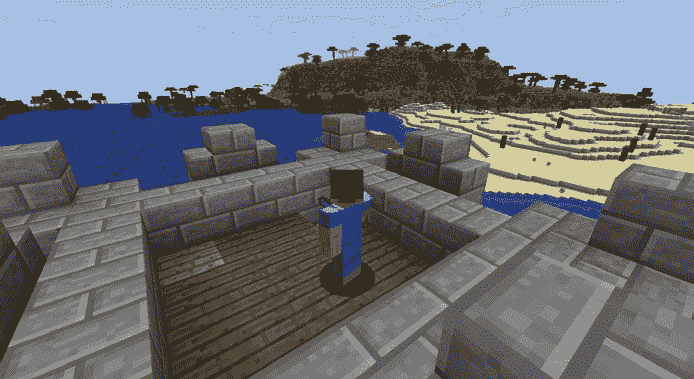

*图 2-10: 我已将自己传送到塔顶，使用浮点数来做到非常精确。*

**附加目标：精确传送**

使用混合的正负浮点数更改`x`、`y`和`z`变量的值，并运行程序。然后，稍微调整这些新值的十进制部分。会发生什么？

### **通过时间模块减慢传送速度**

Python 运行代码的速度尽可能快。但是你可以通过让程序在继续执行之前等待一定的秒数来放慢动作。

要在你的程序中使用时间，你需要 `time` 模块，它包含了一组与时间相关的预编写函数。要使用 `time` 模块，在你的程序顶部添加以下代码：

```
import time
```

使用 `time` 模块和 `sleep()` 函数时，顺序非常重要，`sleep()` 函数是 `time` 模块的一部分。`sleep()` 函数会使程序等待指定的秒数后再继续。如果你不先导入 `time` 模块，Python 将找不到 `sleep()` 函数，它会变得如此困惑，以至于会停止程序运行。这就是为什么最好在代码的顶部导入你使用的任何模块的原因。你所有的 `import` 语句都会被集中在程序的顶部。例如，我通常首先包括连接到 Minecraft 的代码，然后在第三行添加 `import time` 语句。

下面是如何使用 `sleep()` 函数的示例：

```
time.sleep(5)
```

这一行代码将使程序暂停五秒钟。你可以使用任何数字，包括整数和浮动数值，如以下示例所示：

```
time.sleep(0.2)
```

当程序到达这一行代码时，它将等待 0.2 秒。现在你可以控制时间的流动了，准备好迎接下一个任务！

#### **任务 #3：传送门之旅**

Minecraft 中传送的美妙之处在于你可以把玩家传送到任何地方。利用到目前为止学到的所有技能，你将让玩家在整个 Minecraft 世界中进行自动化旅游！

在这个任务中，你将通过修改任务 #1 中的代码（第 31 页）来练习更改变量的值，将玩家传送到地图上的多个位置。玩家将传送到一个位置，等待几秒钟，然后传送到另一个位置。

1.  在 IDLE 中，通过点击 **文件** ▸ **打开**，并从你的 *variables* 文件夹中选择文件，打开 *teleport.py* 程序（第 34 页）。

1.  将程序保存为 *tour.py* 文件到你的 *variables* 文件夹中。

1.  在连接程序与 Minecraft 的代码之后，添加 `import time`。

1.  在程序的末尾添加 `time.sleep(10)`。

1.  复制包含 `x`、`y` 和 `z` 变量以及 `setTilePos()` 函数的行，并将它们粘贴到程序的末尾，这样这些行将出现两次。

1.  将两个 `x`、`y` 和 `z` 变量的值更改为你想要的任何数字。你可以通过移动到游戏中的某个位置并像本章前面所做的那样记录玩家的坐标，来找到游戏中任何位置的坐标。

1.  保存程序。

1.  打开一个 Minecraft 世界并运行代码。

最终的结果应该像这样，填入新的坐标：

*tour.py*

```
# Connect to Minecraft
from mcpi.minecraft import Minecraft
mc = Minecraft.create()
import time

# Set x, y, and z variables to represent coordinates
x = # Fill in
y = # Fill in
z = # Fill in

# Change the player's position
mc.player.setTilePos(x, y, z)

# Wait 10 seconds
time.sleep(10)

# Set x, y, and z variables to represent coordinates
x = # Fill in
y = # Fill in
z = # Fill in

# Change the player's position
mc.player.setTilePos(x, y, z)
```

玩家应该传送到第一个位置，等待 10 秒钟，然后传送到第二个位置，如图 2-11 所示。

**额外目标：更多的传送**

复制*tour.py*代码，重复移动玩家多次。将函数`time.sleep(10)`中的`10`替换为不同的值。你甚至可以为每个`sleep()`函数使用不同的数字，让你的玩家在每个位置等待不同的时间。

然后编辑代码，使得在两次传送之间，只有 `x`、`y` 和 `z` 中的一个变量发生变化。每次都修改所有变量是不必要的！尝试使用浮点数而不是整数。

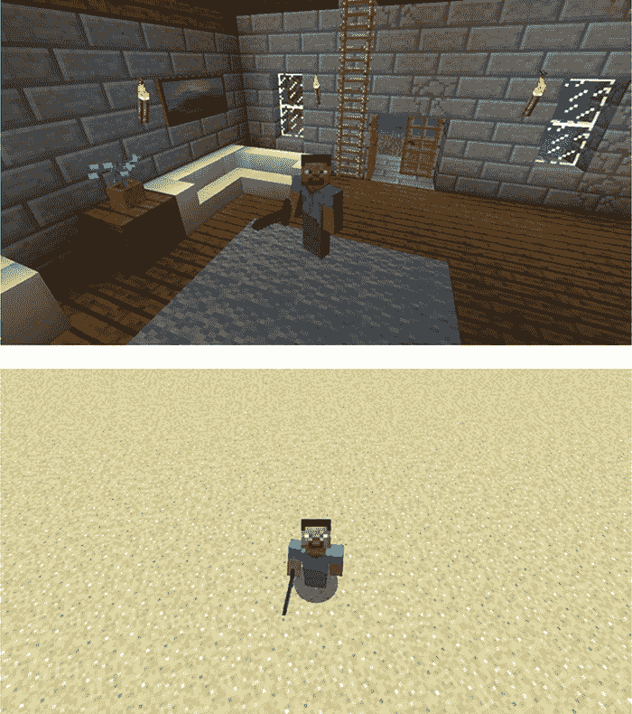

*图 2-11：我已在程序中设置坐标，使玩家先传送到我的房子，然后再传送到沙漠。*

### **调试**

每个人都会犯错；即使是最优秀的程序员也不可能第一次就写对代码。写出一个能够正常运行的程序是一个好程序员需要的技能，而在程序无法正常运行时进行修复是另一个至关重要的技能。这个过程叫做*调试*，在一个出现问题的程序中，每个问题都叫做*bug*。在本节中，你将学习修复所有未来程序的技巧和方法。

错误可以完全阻止程序运行，或者使程序以意想不到的方式运行。当程序无法运行时，Python 会显示错误信息，比如图 2-12 中的错误信息。

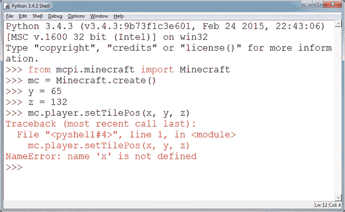

*图 2-12：Python 给我提示错误，因为我没有遵循 Python 的语法。*

在图 2-12 中，你可以看到我在 Python shell 中输入了一些代码，并且它返回了一个错误信息。错误信息中显示了很多内容，但根据最后一行（`NameError: name 'x' is not defined`），我可以判断是我的`x`变量出了问题。具体来说，`x`变量没有被定义。为了解决这个问题，我需要添加一行代码来定义`x`变量，像这样：

```
>>> x = 10
```

这一行代码将修复错误信息，但这并不意味着所有的错误都会被修复。

允许程序运行但导致它行为异常的错误不会显示错误信息，但当程序产生意外结果时，你就会知道出了问题。例如，如果你忘记在传送程序中写一行代码，比如`setTilePos()`，程序会正常运行，但玩家的位置不会改变。这可不是一个有用的传送程序！

**警告**

*拼写错误是导致程序出错的常见原因之一。拼写错误会让计算机无法理解，从而阻止程序的运行。小心，确保你的拼写和大小写正确！*

#### **任务 #4：修复有问题的传送**

在这个任务中，你将调试两个程序。第一个程序，清单 2-2，与*teleport.py*（第 34 页）类似，但这个版本有五个错误。在 IDLE 文本编辑器中打开一个新文件，将清单 2-2 复制到其中，并保存为*teleportBug1.py*。

*teleportBug1.py*

```
from mcpi.minceraft inport Minecraft
# mc = Minecraft.create()

x = 10
  y = 11
z = 12
```

*清单 2-2：损坏版的传送程序*

要调试这个程序，完成以下步骤：

1.  运行*teleportBug1.py*。

1.  当你遇到错误消息时，阅读最后一行，获取关于问题的提示。

1.  修正错误并再次运行代码。

1.  继续修复程序中的错误，直到程序将玩家传送到新的位置。

**提示**

*不要忘记仔细检查你是否实际调用了* `setTilePos()` *函数！*

让我们尝试调试另一个程序。清单 2-3 中的*teleport.py*可以运行，但由于某些原因，玩家没有传送到指定的位置。将清单 2-3 复制到 IDLE 文件中，并保存为*teleportBug2.py*。

*teleportBug2.py*

```
from mcpi.minecraft import Minecraft
mc = Minecraft.create()

x = 10
y = 110
z = -12

mc.player.setPos(x, z, y)
```

*清单 2-3：带有错误的传送程序*

与*teleportBug1.py*不同，运行该程序时你不会收到任何错误消息。要修复该程序，你需要阅读代码直到找到错误。程序应该将玩家传送到位置(10, 110, -12)。运行程序并检查玩家被传送到的坐标。这可能帮助你调试程序并找出问题所在。

当你修复了这两个程序中的所有错误后，给每个程序添加注释，解释问题所在。记录调试过程中遇到的问题，可以帮助你记住以后要注意类似的错误。

### **你学到了什么**

恭喜你！你已经写出了第一个 Python 程序，通过变量和函数控制 Minecraft 玩家。你探索了两种数据类型（整数和浮点数），控制了时间，并调试了损坏的程序。你还学会了 Minecraft Python API 中两个非常有用的函数：`setPos()`和`setTilePos()`。

在第三章中，你将掌握 Minecraft 中的快速建造技巧，使用数学运算和设置方块的函数！
