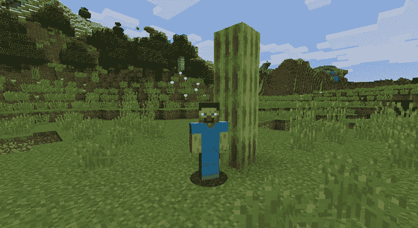
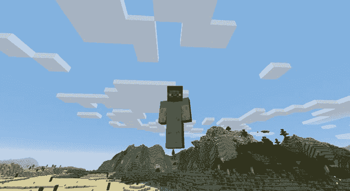
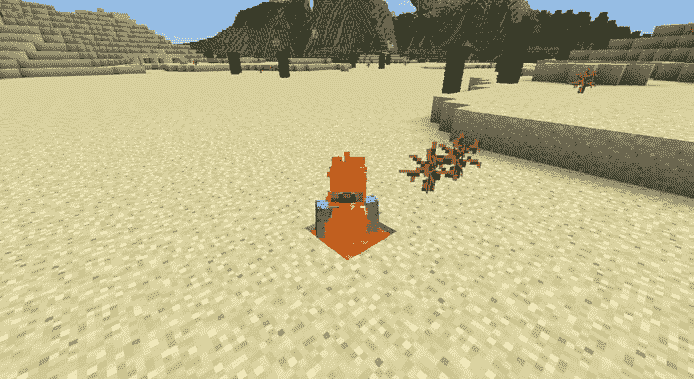
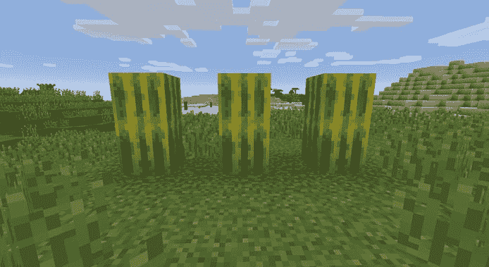
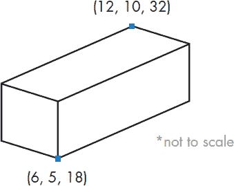
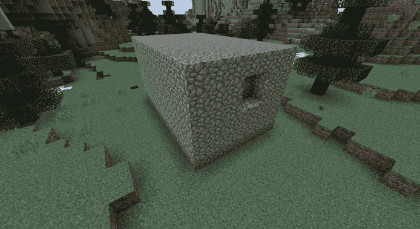
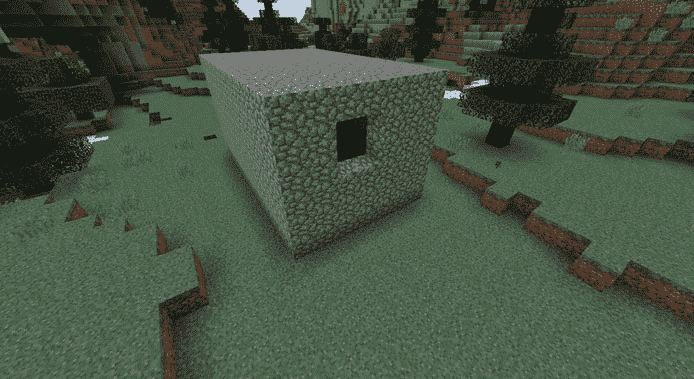
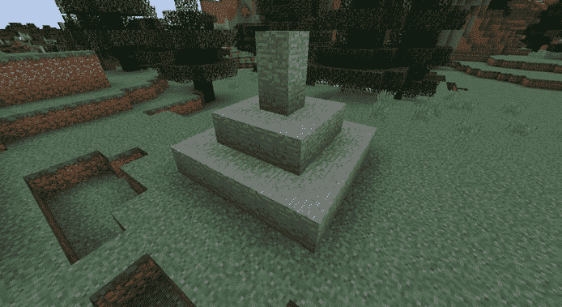
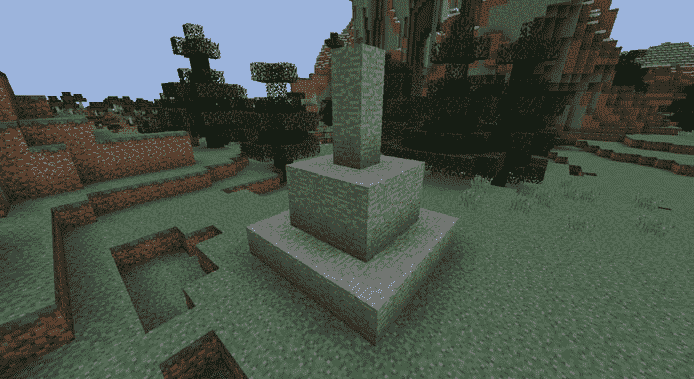
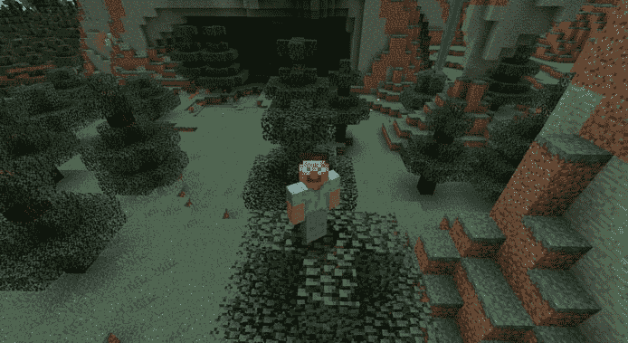

## 第三章：3

**通过数学快速构建和远距离旅行**


在第二章中，你学习了如何创建变量并改变其值。在这一章，你将学习如何在 Python 中使用数学运算来生成任何你想要的块，并在你的 Minecraft 世界中快速构建复杂的结构。你甚至可以赋予自己超能力，让玩家实现超级跳跃！

### 表达式和语句

当你和某人交谈时，你希望他们理解你所说的内容。你会使用短语，例如“三个钻石”或“树后面”，将信息传递给对方。然而，单独这些短语并没有意义，除非它们组合成完整的句子，比如“我在树后面找到了三个钻石。”

Python 编程有类似于短语和句子的概念，称为表达式和语句。

你可以将值、变量和运算符结合起来，创建叫做*表达式*的小代码块，像`2 + 2`。表达式可以组合成*语句*，你在第二章中已经学习过了。语句是执行某个操作的单行或短代码块，例如`zombies = 2 + 2`。在这个例子中，`2 + 2`是一个表达式，且它是语句`zombies = 2 + 2`的一部分。

对于较长的程序，使用文本编辑器而不是 Python shell 时，一定要写完整的语句。例如，Python shell 和在文本编辑器中编写的程序会以完全不同的方式处理表达式`2 + 2`。当你在 IDLE 中使用 Python shell 时，Python 会输出`4`作为`2 + 2`的结果，如下所示：

```
>>> 2 + 2
4
```

然而，当你使用文本编辑器时，Python 不会对表达式做任何处理，因为它不是完整语句的一部分。为了将这个表达式转变为完整的语句，你可以将其值赋给一个变量，像这样：

```
zombies = 2 + 2
```

然后打印这个变量，查看它的值：

```
print(zombies)
```

当你运行这段代码时，它会打印出`4`。

再次提醒，当你在文本编辑器中编写程序时，使用完整的语句非常重要，而不仅仅是表达式。

### 运算符

在数学中，*运算符*用于改变和组合数字。例如，加法运算符让你将两个（或更多）数字相加，减法运算符则用于从一个数字中减去另一个数字。

Python 使用所有你已经知道的基本数学运算符——加法、减法、乘法和除法——以及更高级的运算符，比如指数运算。我们从加法开始。

#### 加法

在 Python 中，加法就像你平常写的那样，使用加号（`+`）。例如，如果你有两朵花，然后再摘了两朵，你可以用加法表达式来描述这一过程：

```
>>> flowers = 2 + 2
```

Python 会计算等号右边表达式的结果，并将结果赋值给左边的变量。在这个例子中，右边表达式的结果是`4`。在这段代码的其余使用过程中，变量`flowers`的值将保持为`4`。

你可以在 Minecraft 中使用加法在眨眼之间建造东西。准备好迎接下一个任务了吗？让我们开始吧！

#### 任务 #5: 堆叠方块

你可以使用`setBlock()`函数在 Minecraft 中创建并放置一个方块。与`setPos()`和`setTilePos()`类似，`setBlock()`也需要 x、y、z 坐标作为参数，但它还需要第四个值：方块类型。这个值标识了你希望在游戏中放置的方块类型。

无论是草地、岩浆、西瓜，还是其他任何方块，每种类型的方块都有一个特定的整数值。例如，草地是`2`，空气是`0`，水是`8`，西瓜是`103`。要查看完整的方块及其整数值列表，请参见“方块 ID 备忘单”，该内容在第 283 页。

要使用`setBlock()`，请传递 x、y、z 坐标值和表示方块类型的整数值，值之间用逗号分隔。例如，我们可以将一个西瓜方块（类型 103）放置在坐标(6, 5, 28)处：

```
from mcpi.minecraft import Minecraft
mc = Minecraft.create()
mc.setBlock(6, 5, 28, 103)
```

在你在所有 Minecraft Python 程序中都会看到的前两行之后，只需调用`setBlock()`并传递你想要使用的所有值。你还可以使用变量来代替数字，以达到相同的效果，如列表 3-1 所示。

*blockStack.py*

```
from mcpi.minecraft import Minecraft
mc = Minecraft.create()
x = 6
y = 5
z = 28
blockType = 103
mc.setBlock(x, y, z, blockType)
```

*列表 3-1: 创建一个西瓜方块的程序*

首先，创建表示方块坐标（`x`、`y`、`z`）和类型（`blockType`）的变量。然后，将所有变量传递给`setBlock()`函数，Minecraft Python API 将发挥它的魔力。现在，你可以在程序中的任何地方再次使用这些变量，如果以后决定更改它们的值，只需在一个地方进行修改。

当你将这段代码与数学运算符结合使用时，你可以做一些相当酷的事情。让我们创建一堆方块。

在*Minecraft Python*文件夹内创建一个名为*math*的新文件夹。打开 IDLE 并使用 IDLE 的文本编辑器创建一个空白程序。将此文件保存为*blockStack.py*到*math*文件夹中。从列表 3-1 中复制代码到你的编辑器，并将列表 3-2 中的两行代码添加进去，将另一个西瓜方块堆叠在你刚才设置的西瓜方块上。

*blockStack.py*

```
➊ y = y + 1
➋ mc.setBlock(x, y, z, blockType)
```

*列表 3-2: 将第二个西瓜方块堆叠在第一个西瓜方块上的附加代码*

你正在将`y`的值加 1➊，并且你正在使用`setBlock()`函数创建另一个新块➋。通过将`y`的值增加 1，第二个块的位置会比第一个块在 y 轴上更高，因此第二个块就堆叠在第一个块的上面。

从这里开始，你的任务是将堆叠的方块增加两个。尝试修改你的*blockStack.py*程序，使其堆叠四个方块，而不是两个！当你运行程序时，应该会看到四个西瓜方块堆叠在一起，如图 3-1 所示。



*图 3-1：我已经堆了一个西瓜方块堆。*

**提示**

*为了在第一个方块上方添加第二个方块，我们将`y`变量增加了 1，然后再次使用`setBlock()`函数。你觉得如果在程序的最后重新使用这两条语句会发生什么？如果你用三次呢？这会是创建四个方块堆叠的解决方案吗？*

**附加目标：创建彩虹**

你可以编写许多不同版本的*blockStack.py*程序。通过修改方块类型，你可以创建彩虹或熔岩塔！试着更改方块类型，看看你能创造出什么。

#### 任务 #6：超级跳跃

在第二章中，你学会了如何改变玩家的位置。让我们把这个技能再提升一步，利用加法的力量将玩家送上高空。首先，像清单 3-3 中所示，通过调用`getTilePos()`来获取玩家的位置。

*superJump.py*

```
from mcpi.minecraft import Minecraft
mc = Minecraft.create()

position = mc.player.getTilePos()
x = position.x
y = position.y
z = position.z
```

*清单 3-3：查找玩家位置的代码*

`position`变量与`x`、`y`、`z`之间的点（`.`）叫做*点表示法*。点表示法被某些变量和函数使用，比如你在 Minecraft Python API 中使用的所有函数（例如，`mc.setTilePos()`）。你将在第十一章和第十二章中学习更多关于点表示法的内容。

一旦你得到了玩家的位置，你可以将`x`、`y`和`z`变量设置为玩家当前的坐标，分别通过`position.x`、`position.y`和`position.z`表示。然后，你可以根据当前坐标将玩家传送到任何你想要的位置，如清单 3-4 所示。

*superJump.py*

```
x = x + 5
mc.player.setTilePos(x, y, z)
```

*清单 3-4：将玩家的 x 位置向上移动 5 个方块的代码*

在这里，我将玩家沿 x 轴传送了 5 个方块，但这并不特别：你可以随时在 Minecraft 中水平移动玩家。让我们给玩家一个超级跳跃吧！

你的任务是让玩家跳跃到当前坐标上方 10 个方块的地方。你应该能够使用清单 3-3 和 3-4 中的代码来完成这个任务，虽然会有一些小的不同。将清单 3-3 和 3-4 中的代码复制到 IDLE 中，保存为*superJump.py*，并按照我更改`x`变量的方式修改`y`变量。当你运行程序时，玩家应该会像图 3-2 中那样跳跃到空中。



*图 3-2：超级跳跃的实际效果！*

#### 减法

Python 处理减法与加法的方式类似。假设你正在探索一个洞穴，一只蜘蛛攻击了你，你失去了一些生命值：

```
health = 20
health = health - 2
```

语句中 `health` 的值现在是 `18`。就像加法操作一样，Python 会计算等号右边操作的结果，并将该结果赋值给变量。

让我们在《Minecraft》中玩点减法吧！

#### 任务 #7：改变你下方的方块

你是否曾想在《Minecraft》中为某人设置一个陷阱？想象一下，当玩家最不期望的时候，脚下的地面突然变成了岩浆。你可以使用 Python 实现这个愿望。通过减法运算，你可以在玩家当前位置下方放置方块。实际上，只需要几行代码就能将你想要的任何方块直接放在玩家脚下！

在这个任务中，你将使用 `getTilePos()` 和 `setBlock()` 将玩家下方的方块改为岩浆。但这是一个危险的任务，所以在测试时要小心：如果你没有足够快地将玩家移动到新位置，他们可能会掉进岩浆里！

在清单 3-5 中的程序会在玩家当前位置创建一个方块。将这段代码复制到 IDLE 中的新文件，并保存为 *blockBelow.py*。然后，利用你对减法运算符的理解，修改代码，使它在玩家的脚下直接放置一个岩浆方块，如图 3-3 所示。

*blockBelow.py*

```
from mcpi.minecraft import Minecraft
mc = Minecraft.create()
pos = mc.player.getTilePos()
x = pos.x
y = pos.y
z = pos.z
blockType = 10
mc.setBlock(x, y, z, blockType)
```

*清单 3-5：这段代码在玩家当前位置放置一个方块。*

注意，我将存储玩家位置的变量命名为 `pos`。我选择这个名称是因为我经常使用这个变量，它很容易理解它的意思，而且比 `position` 更短、更快输入。

y 坐标决定了方块的高低。你的任务是弄明白如何改变 `y` 变量，将方块放在玩家下方。



*图 3-3：当我下方的方块改变后，我掉进了岩浆。*

**附加目标：你周围的方块**

你已经学会了如何在玩家下方放置方块。你能算出如何在玩家上方放置方块吗？一旦你弄明白了，试着一次在玩家周围放置多个方块。然后，你就可以开始在玩家周围建造建筑物了！

尝试将这个程序与任务 #6 中的程序结合使用（见第 51 页）。你能算出如何让玩家跳到空中，然后立刻在他们脚下放一个方块让他们不掉下来吗？感觉很邪恶？你可以编写一个程序，让玩家从高空掉进岩浆池中。

#### 在参数中使用数学运算符

当你使用一个函数时，比如 `setBlock()` 或 `setTilePos()`，你会给函数传递一些参数，这些参数指定了函数运行时需要使用的值。

到目前为止，你已经接触了加法和减法运算符。你可以在函数的括号内使用这些运算符来设置参数的值。让我们回顾一下任务 #5 中的堆叠块(第 49 页)。我们可以在`setBlock()`函数的括号内使用加法运算符，如清单 3-6 所示，它会在括号内将两个值相加，而无需额外的语句。

*blockStack1.py*

```
   from mcpi.minecraft import Minecraft
   mc = Minecraft.create()

   x = 6
   y = 5
   z = 28
   blockType = 103
   mc.setBlock(x, y, z, blockType)
➊ mc.setBlock(x, y + 1, z, blockType)
```

*清单 3-6：带有运算符的块堆叠程序*

清单 3-6 几乎与堆叠块程序相同。然而，它在`setBlock()`函数的括号内使用加法运算符，而不是在单独的语句中使用。最后一行在函数 ➊ 中使用`y + 1`作为参数。尽管该参数的值为`6`（`5 + 1`），但`y`变量的值仍然是`5`。这个参数允许你在不实际改变`y`值的情况下对`y`变量进行加法操作，如果你希望在代码的其他地方再次使用`y`，这就非常有用。

你也可以将两个变量相加，并将它们作为一个单一的参数。清单 3-7 与清单 3-6 相同，但额外添加了一个名为`up`的变量，它决定了新块在 y 轴上的放置位置。

*blockStack2.py*

```
   from mcpi.minecraft import Minecraft
   mc = Minecraft.create()

   x = 6
   y = 5
   z = 28
   blockType = 103
   up = 1
   mc.setBlock(x, y, z, blockType)
➊ mc.setBlock(x, y + up, z, blockType)
```

*清单 3-7：使用加法运算符的堆叠程序的另一个版本*

在最后一行，`y`和`up`变量被加在一起 ➊。和清单 3-6 一样，这使得`setBlock()`函数的第二个参数变成了`6`。变量非常有用，因为如果你想将新块放置在 y 轴上比之前高两个方块，你只需要修改代码，将`up`设置为 2。你可以在图 3-4 中看到程序的所有三个版本（清单 3-1 和 3-2，3-6，以及 3-7）的效果。



*图 3-4：虽然程序的三个版本不同，但它们的效果是一样的。*

#### 任务 #8：快速建造

通常，你在《我的世界》中度过的第一天会用来建造一个避难所。凭借目前学到的知识，你可以建造一个简单的房子，并以一种有风格的方式度过你的第一晚！这个任务中的程序将帮助你快速生成建筑物的墙壁、天花板和地板。你不需要花费大量时间手动放置每一个方块，而是可以通过几行代码构建建筑的基本结构。

你已经使用`setBlock()`创建了一个单一的方块，但`setBlock()`还有一个朋友叫做`setBlocks()`，它可以创建多个方块，形成一个长方体的形状。*长方体*是一个三维矩形。长方体的长度、宽度和高度可以是不同的值。

`setBlocks()` 函数允许你在大范围内创建多个方块。要使用 `setBlocks()`，只需传递两组坐标和方块类型。第一组坐标确定你想要的立方体一个角落的位置，第二组坐标指定你想要的对角线的另一角落。图 3-5 展示了立方体的角落，并标注了它们的坐标。



*图 3-5：立方体及其用于设置尺寸的坐标*

让我们创建图 3-5 中的立方体。正如你在清单 3-8 中看到的，我使用的是卵石，但你可以使用任何你喜欢的方块类型。嗯，除了岩浆、水或空气外，你可以使用任何东西——否则你将得到一个非常奇怪的房子！

*building.py*

```
   from mcpi.minecraft import Minecraft
   mc = Minecraft.create()
➊ pos = mc.player.getPos()
   x = pos.x
   y = pos.y
   z = pos.z
   width = 10
   height = 5
   length = 6
➋ blockType = 4
➌ air = 0
   mc.setBlocks(x, y, z, x + width, y + height, z + length, blockType)
```

*清单 3-8：构建一个立方体积木的代码*

请注意，我使用了 `getPos()` ➊，而不是 `getTilePos()`。`getPos()` 函数与 `getTilePos()` 相同，但它返回的是三个浮动坐标，而不是三个整数坐标。

这个立方体的宽度、高度和长度分别是 10、5 和 6，我使用了方块 ID 4 来生成卵石 ➋。你可以在图 3-6 中看到完成的建筑。



*图 3-6：程序创建的建筑*

然而，这个房子有一个小问题：它完全是实心的！在我运行程序后，我在建筑物的一侧打了一个洞，你可以看到它的中心是实心的。不过，这个立方体是一个很好的开始，现在你将负责把它挖空，这样玩家才能真正进入里面。

你的任务是修改程序，以在玩家位置创建一个有墙壁、天花板和地板的建筑。为此，你需要在刚才创建的实体立方体内创建一个由空气构成的立方体。这两个立方体结合起来应当形成一个空心盒子。你可以在图 3-7 中看到完成程序的结果。我在一侧打了个洞，这样你可以看到空心的中心部分。



*图 3-7：当你的程序完成时，它应该会创建一个空心立方体。立方体非常适合快速创建建筑！*

清单 3-8 中已经包括了一个名为 `air` ➌ 的变量，你可以使用它来将建筑内部的方块设置为空气。将清单 3-8 复制到 IDLE 中，保存为 *building.py*，并修改它来创建一个由空气构成的第二个立方体。你需要在最后一行添加一个额外的 `setBlocks()` 函数来创建这个空气立方体。空气立方体应该在四周的墙壁内有一个方块的空隙，这就是你需要使用加法和减法来解决的问题。保持耐心：如果第一次尝试失败了，尝试别的方法！

**提示**

*要创建一个位于墙壁内一格的空气立方体，你可以使用加法和减法运算符。使用* `setBlocks()` *来创建空气立方体，并将第一个* `x`*,* `y`* 和* `z` *参数增加 1。然后从* `x + width`*,* `y + height`* 和* `z + length` *参数中减去 1。*

**额外目标：建造各种物品**

你可以在任何时候重用你编写的代码来创建建筑。如果你想建造一个不同大小的建筑，该怎么做呢？你能想出如何修改建筑的宽度、高度和长度吗？

只需稍作修改，你的程序还可以有许多其他用途。你能算出如何用它来生成一个游泳池吗？提示：你需要将内立方体的方块类型改为水（方块 ID 8），并移除外立方体的顶部，以便玩家可以进入游泳池。

#### 乘法

在 Python 代码中，乘法的表示方式与你通常见到的略有不同。你不用写 × 来表示两个数字相乘，而是使用星号 (`*`)。不过，除了符号，乘法的运算与平时一样。表达式 `2 * 2` 等于 4，就像 2 × 2 一样。

假设在你的 Minecraft 房子外面有四棵树，突然树木数量翻倍了。你可以用 Python 来表示这个计算，方法如下：

```
trees = 4
trees = trees * 2
```

在这个例子中，`trees` 的值是 8，即 4 乘以 2。

#### 除法

在 Python 中，除法是用正斜杠 (`/`) 来表示的，而不是 ÷ 符号。

除法运算符将一个值除以另一个值。只需将你要除的数字放在正斜杠 (`/`) 的左侧，而将你要除以的数字放在右侧。

假设现在有 8 个骷髅在你的 Minecraft 堡垒外面，但其中一半走开了。要计算剩下的数量，你可以将 8 除以 2。以下是如何使用除法运算符在 Python 中表示这个计算：

```
skeletons = 8
skeletons = skeletons / 2
```

现在只有 4 个骷髅出现在你的堡垒外面。呼！让我们在 Minecraft 中试试这两个运算符。

#### 任务 #9：壮观的尖塔

变量的一个优点是你可以改变单个变量的值，而它的值会在程序中所有出现该变量的地方发生变化。你只需通过改变一个变量的值，运用数学运算符（如乘法和除法），就能让程序做完全不同的事情。

在这个任务中，你将学习如何使用除法和乘法来建造一个非常高、非常薄的塔楼，也叫做*尖塔*。

图 3-8 展示了当程序完成后，尖塔将呈现的样子。



*图 3-8：由石块构建的尖塔*

这个程序将使用一个单一的变量来设置尖塔的高度。通过乘法和除法，你将设置不同的尖塔高度。

在列表 3-9 中，我已经开始编写创建尖塔的程序，但还没有使用 `height` 变量或数学运算符来设置每个部分的高度。

*spire.py*

```
   from mcpi.minecraft import Minecraft
   mc = Minecraft.create()

   pos = mc.player.getTilePos()
   x = pos.x
   y = pos.y
   z = pos.z

   height = 2
   blockType = 1

   # Spire sides: should be same as height
   sideHeight = height
   mc.setBlocks(x + 1, y, z + 1, x + 3, y + sideHeight - 1, z + 3, blockType)

   # Spire point: should be two times the height
➊ pointHeight = 4
   mc.setBlocks(x + 2, y, z + 2, x + 2, y + pointHeight - 1, z + 2, blockType)

   # Spire base: should be half the height
➋ baseHeight = 1
   mc.setBlocks(x, y, z, x + 4, y + baseHeight - 1, z + 4, blockType)
```

*列表 3-9：建造尖塔的程序*

将清单 3-9 复制到 IDLE 中新文件，并将其保存为*spire.py*在*math*文件夹中。这个程序将创建一个尖塔，但是更改`height`变量并重新运行程序不会影响尖塔所有部分的高度。

为了修复这个程序，使得在更改`height`变量时，尖塔的所有部分的高度都会发生变化，你需要将`pointHeight` ➊ 和`baseHeight` ➋ 变量更改为包含使用`height`变量以及乘法或除法运算符的表达式。你希望`pointHeight`是`height`的两倍，`baseHeight`是`height`的一半。例如，如果我希望尖塔顶点的高度是尖塔侧面的三倍，我会将代码改为`pointHeight = height * 3` 和 `baseHeight = height / 2`。

在你做完这些更改后，当你更改`height`变量时，尖塔的所有部分都会改变大小。

你不需要修改程序的其他部分。

你可以通过更改原始的`height`变量并重新运行程序来测试它。如果你将`height`变量更改为`3`，你的尖塔将像图 3-9 一样显示。



*图 3-9：你只需更改* `height` *变量就可以使尖塔变高。*

因为你使用`height`变量来设置`pointHeight`和`baseHeight`的值，所以很容易改变尖塔的外观。通过更改原始的`height`变量为几个不同的数字来玩这个代码。每次重新运行程序看看会发生什么！

### 指数

你可以使用一个*指数*来表示一个数字应该自我相乘多少次。例如，3⁴（三的四次方）是`3 * 3 * 3 * 3`的简写方式。

在 Python 中，`**`是指数运算符。你想乘的数字（*底数*）放在运算符的左侧，你想将它自己相乘多少次的数字（*指数*）放在右侧。

假设你想开始一个 Minecraft 农场。你需要耕作四块土地。你希望每块土地是四块块四块的大小，这样你就能种植很多小麦。从数学上讲，你可以写成`4 * 4 * 4`，或者 4³。这里是计算你种植多少小麦的代码：

```
wheat = 4 ** 3
```

你的答案应该是 64 块独立的小麦，因为`4 * 4`是`16`，而`16 * 4`是`64`。

### 括号和运算顺序

当你在一个表达式中使用多个数学运算符时，你需要小心如何排列它们。不同的运算符有不同的*优先级*。当你使用多个运算符时，除法和乘法会先从左到右进行计算，然后是加法和减法。让我们来看一下这个表达式是如何被计算的：

```
mooshroom = 5 * 2 – 1 + 4 / 2
```

因为乘法和除法总是先于加法和减法执行，Python 从左开始先将 5 乘以 2 得到 10，然后将 4 除以 2 得到 2。这样我们就得到了 10 – 1 + 2。接着，Python 从左开始先从 10 中减去 1，然后再加上 2，最终将`mooshroom`设置为 11。

但你可以通过使用括号来控制运算顺序。带有运算符的括号表达式会先计算括号中的运算，再进行其他操作。让我们看看括号如何改变运算顺序。首先，这是一个不使用括号的表达式：

```
zombiePigmen = 6 * 3 - 2
```

以这种方式写，`zombiePigmen`的值最终变为 16，因为 6 乘以 3 是 18，18 减去 2 是 16。然而，使用括号时，结果会发生变化：

```
zombiePigmen = 6 * (3 - 2)
```

`zombiePigmen`现在的值是`6`！Python 并没有按照通常的顺序操作，而是先从 3 中减去 2，结果是 1，然后将 6 乘以 1 得到 6。

当你希望计算按特定顺序执行时，可以使用括号告诉 Python 先做什么。这让你能更加控制 Python。

### 实用数学技巧

在接下来的章节中，我将教你两个数学技能，帮助你提升 Python 编程水平，然后我们将结合目前学到的内容进行一次任务。

#### 简写操作符

很多时候，你可能想对一个变量使用运算符，然后将结果存储回同一个变量。例如，你可能想给现有的羊群增加五只羊：

```
sheep = 6
sheep = sheep + 5
```

不过，输入`sheep = sheep + 5`可能会让你觉得有点麻烦。别担心，Python 有一种更简短的写法！Python 有*简写操作符*，可以让你对一个变量使用数学运算符并将结果重新赋值给同一个变量。以下是四种简写操作符：

• 加法 (`+=`)

• 减法 (`-=`)

• 乘法 (`*=`)

• 除法 (`/=`)

例如，你可以使用加法简写操作符重写羊群的例子：

```
sheep = 6
sheep += 5
```

`sheep`的值仍然是`11`，和之前一样。

#### 玩转随机数

使用随机数是一种为你的程序增添神秘感和乐趣的方式。你永远不知道最后会得到什么！许多现实世界的桌面游戏依赖于随机数：想想看你玩过多少游戏是需要掷骰子来决定你能移动多少步的。掷骰子是随机数在实际应用中的经典例子。

Python 可以轻松为你生成随机数，所以让我们模拟掷骰子。生成的数字应该在 1 到 6 之间：

```
➊ import random
➋ diceValue = random.randint(1, 6)
```

当你想要生成随机数时，确保在程序开始时包含`import random` ➊。`randint()` ➋函数生成一个整数值，程序可以像使用其他数字一样使用它。你放在括号中的数字作为参数告诉`randint()`生成介于第一个数字和第二个数字之间的值。在这个例子中，生成的数字可以是 1、2、3、4、5 或 6。

你可以使用 `randint()` 为变量添加一个随机数，甚至生成负数。来看看怎么做吧！

```
import random
score = 0
score += random.randint(0, 99)
points = random.randint(-99, 99)
```

Python 可以生成的最低数字是 0，最高数字是 99。而由于负值的参数，`points` 的值可能会设置为低至 -99 的数字！

#### 任务 #10：超级跳跃，去一个新的地方！

在本章的最后任务中，你将让玩家在 x、y、z 三个轴上随机跳跃。你将存储玩家的当前位置，并为三个坐标值分别添加一个随机数。使用介于 -10 到 10 之间的随机数来改变 `x` 和 `z` 的值，确保 `y` 的随机值在 0 到 10 之间。

要开始，请将清单 3-10 复制到 IDLE 中的新文件里，并将文件保存为 *randomJump.py*。

*randomJump.py*

```
   from mcpi.minecraft import Minecraft
   mc = Minecraft.create()
   import random

   pos = mc.player.getPos()
   x = pos.x
   y = pos.y
   z = pos.z

➊ x = x + random.randint(-10, 10)
   mc.player.setPos(x, y, z)
```

*清单 3-10：不完整的随机跳跃程序*

`y` 和 `z` 变量的随机数生成代码缺失，接下来由你来补充它。一旦补充完成，玩家将能像我在图 3-10 中做的那样，随意跳跃。让随机性带你去探索新的、有趣的地方吧！

目前，代码中没有使用简写运算符来改变变量的值。尝试将 ➊ 处的加法表达式改成简写形式。



*图 3-10：我朝一个随机方向跳跃，结果落在了这棵树上。你最后落到哪里了？*

**额外目标：随机方块传送**

让我们让 *randomJump.py* 程序变得更加随机！在玩家跳跃到随机位置后，在他们下面放置一个随机的方块。你也可以改编任务 #1 中的传送程序（见 *teleport.py*，位于第 34 页），使玩家每次都能传送到一个随机位置。如果你不小心传送到某个地方并且卡住了，你可以随时重新运行 *teleport.py*，它会把你传送到一个安全的地方。

### 你学到了什么

在这一章中，你学会了如何在 Python 中做数学运算。你将在本书后续的 Python 程序中以及未来你自己创建的程序中频繁使用加法、减法、乘法和除法。你还学会了如何生成随机数，并且在《我的世界》中创建了一些非常有用的程序。做得好！

在第四章中，你将学习 Python 中的字符串数据类型，它用于存储字母、符号和数字。字符串在《我的世界》中非常有用，因为你可以用它们在游戏中发送消息到聊天窗口。你还将学习如何操作字符串来修改《我的世界》的聊天内容以及实现其他酷炫的功能。
