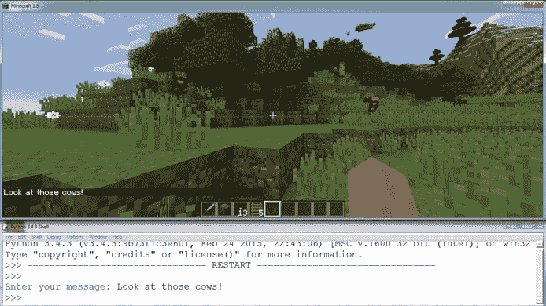
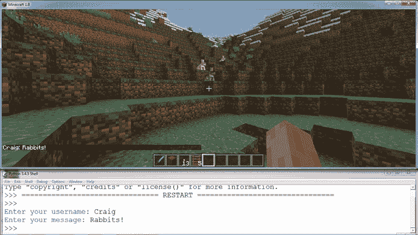
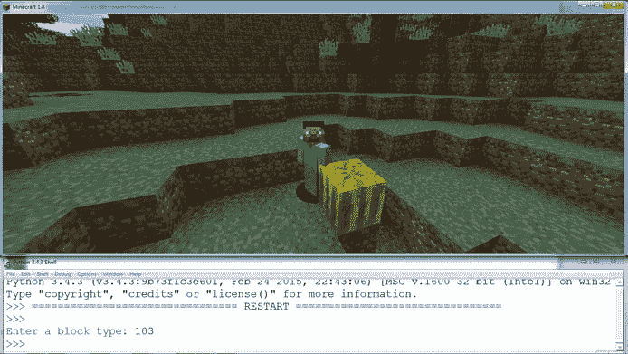
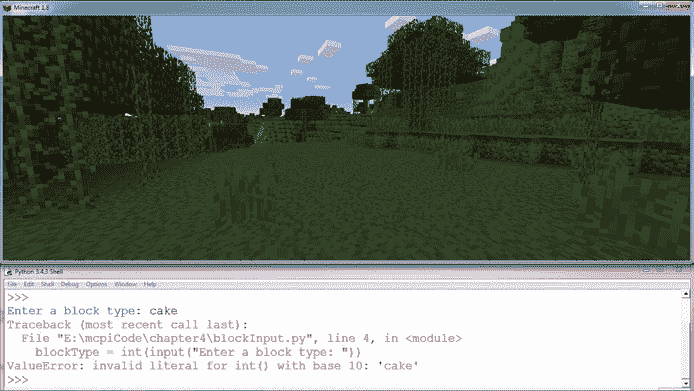
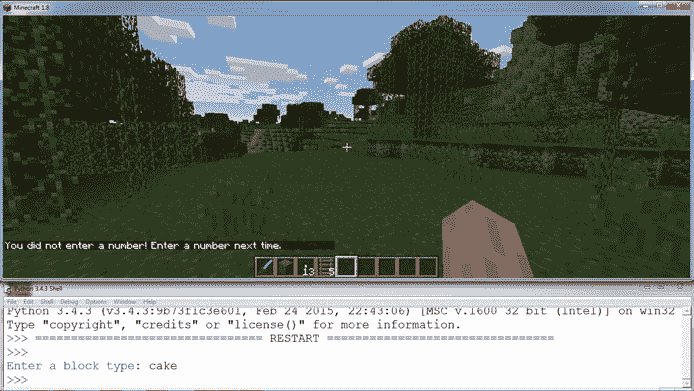
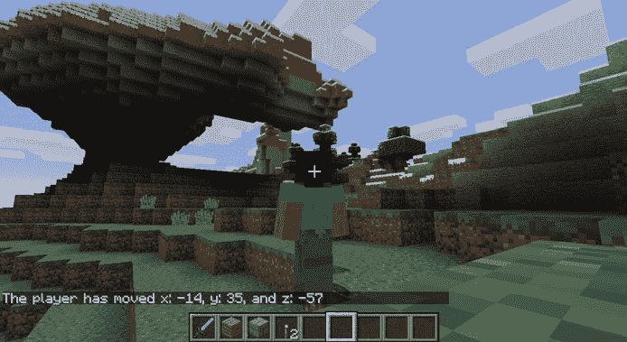

## 第四章：4

**使用字符串聊天**


在第二章和第三章中，你已经学习了整数和浮点数，它们都是数字类型。在本章中，你将使用另一种数据类型，叫做*字符串*。你可以使用字符串来处理字母、符号以及数字。

字符串帮助你向使用你程序的人显示数据——这是编程中的一个重要部分。通过使用字符串，你可以告诉 Python 将数据*输出*到屏幕上，进而向用户显示和传达信息。

在 Minecraft 中，你可以在多个地方使用字符串，例如发布信息到聊天框，这是在多人游戏模式下与其他玩家交流的一种方式。虽然在其他版本的 Minecraft 中，发布信息是一个标准功能，但在 Raspberry Pi 版本中它是一个隐藏功能。不过你可以通过编程的力量访问这个功能。你将能够与朋友分享秘密信息，并炫耀你的宝藏！

在本章中，你还将学习关于函数的内容。如果你足够敏锐，你会注意到你已经见过一些函数了。`setPos()`、`setTilePos()`、`setBlock()`、`setBlocks()`、`getPos()`和`getTilePos()`都是*函数*——可重用的代码块，使得你能够更轻松地完成任务。挺酷的，对吧？

在本章的任务中，你将基于目前学到的知识进行进一步的学习。你将使用字符串向 Minecraft 聊天框打印信息，并练习输入数据以在 Minecraft 世界中创建对象。

### 什么是字符串？

*字符串*数据类型包括任意数量的文本，从单个字母或符号——如`"a"`或`"&"`——到一大段文本。字符串中的每个字母、数字或符号都叫做*字符*。当你想在程序中包含字母、符号、单词、句子或它们的组合时，你会使用字符串。

使用字符串数据类型，你可以存储字母、数字和符号。所有字符串都被包含在引号中。例如，这是一个字符串：

```
"Look out! There's a zombie behind you!"
```

以下也是一个字符串：

```
'Welcome to my secret base!'
```

你注意到这些例子写法的微小差异了吗？在写字符串时，你可以使用单引号或双引号：`'` 或 `"`. 要小心不要混用引号！如果你使用单引号开始一个字符串，你必须用单引号结束它。如果你用双引号开始，就要用双引号结束。Python 编程语言提供这两种选项是有原因的；例如，如果你想在字符串中使用撇号，你可以安全地在双引号中包含它。

### PRINT()函数

向用户显示文本和其他信息对于用户交互至关重要；否则，用户将无法知道你的程序在做什么。你显示给用户的信息被称为*输出*。要将数据输出到用户的屏幕，你可以使用`print()`函数。

要输出消息，将一个字符串作为参数传递给 `print()` 函数：

```
>>> print("String")
```

这告诉 Python 你想将单词 `String` 显示给用户。所以，要将 `chocolate` 打印到 Python shell 中，你写：

```
>>> print("chocolate")
```

该输出将会是：

```
chocolate
```

你还可以使用 `print()` 打印变量的值。例如，如果你有一个名为 `name` 的变量，它存储了一个名字字符串，并且你想将其显示到屏幕上，你可以这样做：

```
>>> name = "Steve the Miner"
```

在你将字符串 `"Steve the Miner"` 存储在 `name` 中后，你可以简单地写 `print(name)` 来显示以下输出：

```
>>> print(name)
Steve the Miner
```

既然你已经了解了字符串的基础知识，完成任务，向你的 Minecraft 世界问个好吧！

#### 任务 #11：你好，Minecraft 世界

如果你想与 Minecraft Pi 中的其他玩家聊天，Minecraft Python API 允许你使用 `postToChat()` 函数将消息发送到聊天框中。`postToChat()` 函数接受一个字符串作为参数，并将该字符串发布到 Minecraft 聊天窗口中。例如，Listing 4-1 将 `"Hello, Minecraft World"` 发布到聊天框。

*message.py*

```
from mcpi.minecraft import Minecraft
mc = Minecraft.create()
mc.postToChat("Hello, Minecraft World")
```

*Listing 4-1: 使用 Python 通过 Minecraft 聊天发送问候。*

回想一下，参数是你在调用函数时传递给它的信息。函数需要这些信息才能完成它的任务。例如，在上一章中，我们需要将数字传递给函数，以定义我们希望它们执行的操作。在这个例子中，`postToChat()` 需要一个字符串，比如 `"Hello, Minecraft World"`。

`postToChat()` 函数类似于 `print()` 函数。它们都可以在屏幕上显示字符串，并且都可以接受一个存储字符串的变量作为参数。不同之处在于，`print()` 函数将字符串输出到 Python shell，而 `postToChat()` 函数则将输出显示在 Minecraft 聊天框中。

从 Listing 4-1 复制代码，并将其保存在名为 *strings* 的新文件夹中，文件名为 *message.py*。当你运行程序时，你应该能看到消息被发布到聊天框中，如 Figure 4-1 所示。


*Figure 4-1: 我的消息已发布到聊天框中。*

尝试将不同的字符串传递给 `postToChat()`，使其显示不同的聊天消息。

**额外目标：你在哪里？**

你可以使用 `mc.postToChat()` 函数将各种信息发布到聊天框。试着显示玩家当前的 x 坐标或者他们站立的方块类型。回想一下，`mc.player.getTilePos()` 函数可以获取玩家当前的位置，而 `mc.getBlock()` 函数则可以告诉你某个坐标点的方块类型。

### INPUT() 函数

到目前为止，所有的变量都在你的程序中设置，或者是 *硬编码* 的。要改变一个变量的值，你需要编辑程序。能够在程序运行时改变这些变量的值，或者接受 *用户输入*，会更方便。

为你的程序添加这种互动性的一种方法是使用`input()`函数。它会将一条字符串打印到控制台（告诉用户应该输入什么样的信息），然后等待用户输入响应。尝试将以下代码输入到 Python Shell 中，看看会发生什么：

```
>>> input("What is your name? ")
```

你会看到你传递给`input()`的字符串，并且你可以输入一个响应。

```
What is your name?
```

当你输入一个响应时，你应该看到类似这样的内容：

```
What is your name? Craig
'Craig'
```

很棒！但是，如果你想在程序的其他地方使用这个输入，你必须将其保存到一个变量中。与 Python Shell 不同，在文本编辑器中创建的程序不会自动输出语句的结果。例如：

```
>>> name = input("What is your name? ")
What is your name? Craig
```

请注意，这次在你输入名字并按下 ENTER 键后，程序不会自动显示你的输入。要查看已保存的输入，只需将变量`name`作为参数传递给`print()`函数：

```
>>> print(name)
Craig
```

太棒了！现在你已经把输入存储在一个变量中并打印了变量的值。这非常方便，因为它允许你从用户那里获取输入，并在程序的任何地方使用它。让我们使用这种技巧来将聊天消息写入 Minecraft 的聊天中！

#### 任务 #12：编写你自己的聊天消息

让我们让聊天变得更具互动性！你可以像在任务 #11 中一样，使用 Python Shell 在 Minecraft 聊天中写一条消息。在这个任务中，我们将编写一个稍微不同的程序，将你想发布到聊天的字符串保存在一个名为`message`的变量中。

清单 4-2 会帮你入门。将它复制到 IDLE 中的新文件，并将文件保存为*messageInput.py*，保存在你的*strings*文件夹中。

*messageInput.py*

```
   from mcpi.minecraft import Minecraft
   mc = Minecraft.create()
➊ message = "This is the default message."
➋ mc.postToChat(message)
```

*清单 4-2：如何将字符串输出到 Minecraft 的聊天中*

程序将你想输出到聊天的消息存储在变量`message` ➊中。在这种情况下，变量是一个字符串，内容是`"This is the default message."`。然后，程序将`message`传递给`postToChat()`函数 ➋，该函数将该字符串输出到 Minecraft 聊天。

在这个程序中，字符串是硬编码的，这意味着每次运行程序时它都是相同的。但通过一个简单的修改，你可以让它打印用户输入的任何内容！换句话说，你每次运行程序时都可以编写自己的自定义消息。你将创建属于你自己的聊天程序。

为了让程序接受输入，将字符串`"This is the default message."` ➊替换为`input()`函数。给`input()`函数一个参数，比如`"Enter your message: "`。记得把这个字符串放在`input()`函数的括号内！在你做完这些修改后，运行程序。你应该会看到 Python Shell 中出现一个提示符，显示`"Enter your message: "`。输入你的消息并按 ENTER 键。消息会显示在 shell 中，并且会出现在 Minecraft 的聊天中，如图 4-2 所示。



*图 4-2：当我在 IDLE shell 中输入消息时，它会被发布到 Minecraft 的聊天中。*

现在你的程序允许你写一条消息来显示在聊天框中，而不是你需要在程序中编写消息。看看使用输入功能聊天是不是更轻松了？

**附加目标：更多消息**

该程序会要求输入一条消息，但你能否想出如何让它先要求输入一条消息，等待几秒钟（使用 `sleep()` 函数），然后再要求输入第二条消息呢？

### 连接字符串

经常需要打印字符串的组合。这叫做字符串的拼接，或者 *连接*，Python 让它变得非常简单。

在 第三章中，我们使用加法运算符（`+`）来加法运算数字，但你也可以用它来连接字符串。例如：

```
firstName = "Charles"
lastName = "Christopher"
print(firstName + lastName)
```

`print()` 的输出将是 `"CharlesChristopher"`。如果你希望在值之间加一个空格，可以使用加法运算符来添加空格，像这样：

```
print(firstName + " " + lastName)
```

Python 经常提供多种方法来实现相同的结果。在这种情况下，你也可以使用逗号来创建空格：

```
print(firstName, lastName)
```

这两条语句都会输出 `"Charles Christopher"`。你还可以将硬编码的字符串与变量连接在一起，即使这些变量本身就是字符串。只需像写任何其他字符串一样写出值：

```
print("His name is " + firstName + " " + lastName)
```

这将输出 `"His name is Charles Christopher"`。

将文本块拼接起来很有用，但有时候你可能需要将字符串与其他数据类型（如整数）连接在一起。Python 不允许你将字符串与整数拼接；在这种情况下，你需要告诉 Python 首先将整数转换为字符串。我们来试试看。

#### 将数字转换为字符串

将一种变量类型转换为另一种变量类型是很有用的。例如，假设你将拥有的金苹果数量存储在名为 `myGoldenApples` 的变量中，它是一个整数。你想向朋友们炫耀你有多少个金苹果，因为它们很稀有，而你又喜欢炫耀。你可以打印一条类似 `"My not-so-secret golden apple stash: "` 的消息，后面跟上 `myGoldenApples` 中存储的值。但在将 `myGoldenApples` 的值包含到打印消息中之前，你必须告诉 Python 将 `myGoldenApples` 中的整数转换为字符串。

`str()` 函数将非字符串数据类型（如整数和浮点数）转换为字符串。要进行转换，只需将你想转换的值放入 `str()` 函数的括号内。

让我们回到你的金苹果储藏问题。假设你已经将 `myGoldenApples` 设置为 2，并且你希望 Python 将这个 2 作为字符串而不是整数处理。你可以这样打印你的消息：

```
print("My not-so-secret golden apple stash: " + str(myGoldenApples))
```

这条语句会输出字符串 `"My not-so-secret golden apple stash: 2"`。

你还可以将浮点数转换为字符串。比如说你吃了一半的金苹果，现在 `myGoldenApples` 存储了 1.5 个苹果。`str(myGoldenApples)` 对 1.5 的处理方式与对 2 的处理方式相同。它将 1.5 转换为字符串，以便你可以将其包含在消息中。

在你将数字转换为字符串后，可以按你喜欢的方式进行连接。让我们来玩转数字与字符串的转换，并将它们连接起来吧！

#### 连接整数和浮点数

如果你想连接两块数据，它们必须是字符串。但加号既用于加法也用于连接，因此，如果你在连接整数、浮点数和其他数字时，Python 会尝试将它们相加。你必须将数字值转换为字符串，才能通过连接将它们连接在一起。

要连接两个数字，而不是相加，只需使用`str()`方法：

```
print(str(19) + str(84))
```

因为你告诉 Python 将数字 19 和 84 视为字符串并连接它们，这条语句输出了`1984`，而不是 19 和 84 的和`103`。

你可以在语句中多次使用连接。例如：

```
print("The year is " + str(19) + str(84))
```

这一行代码输出`The year is 1984`。

现在你已经有了一些使用连接的练习，让我们在下一个任务中考验一下你的新技能！

#### 任务 #13: 向聊天添加用户名

当你和两个人以上一起玩游戏时，可能会很难搞清楚谁在 Minecraft 聊天中写消息。显而易见的解决方法是，在他们的消息开头包含用户名。在这个任务中，你将修改任务#12 中的程序，以便为所有发送到聊天的消息添加用户名。

在 IDLE 中打开*messageInput.py*并将其另存为名为*userChat.py*的新文件，保存在*strings*文件夹中。然后，添加代码在接收消息之前获取用户的姓名作为输入。发送到聊天的消息应该按以下格式显示：`"Anna: I need TNT."` 你需要使用连接来完成这个任务。

在程序中，找到这一行代码：

```
message = input("Enter your message: ")
```

在上面那行代码中，你需要添加另一个变量，命名为`username`，并将其值设置为`input("请输入用户名: ")`。在添加了`username`变量后，找到这一行：

```
mc.postToChat(message)
```

使用连接，将`username`和`message`字符串在`postToChat()`函数内连接起来。在这两个字符串之间添加`": "`，使输出在`username`变量和`message`变量之间有一个冒号和一个空格。图 4-3 展示了完成程序后应该显示的输出。



*图 4-3：现在，当我通过我的程序发布聊天消息时，它会显示我的用户名。*

保存你的更新程序并运行它。在 Python shell 中，你将被要求输入用户名。输入你的名字并按下 ENTER。然后，你将被提示写一条消息，完成后，用户名和消息应显示在 Minecraft 聊天中。

**额外目标：没有名字的用户**

如果你留空用户名并按下 ENTER，会发生什么？你认为这是为什么？

### 使用 INT()将字符串转换为整数

与将非字符串数据类型转换为字符串的`str()`函数类似，`int()`函数将非整数数据类型转换为整数。

`int()`函数在与`input()`函数一起使用时非常有用。`input()`函数将用户输入返回为字符串，但你通常希望在数学运算中使用这个输入。为此，你首先需要使用`int()`将输入转换为整数类型。

这是它的工作原理。假设我们已经为一个名为`cansOfTunaPerCat`的变量分配了一个整数值，我们需要一个程序来告诉我们根据用户拥有的猫的数量，吃掉了多少金枪鱼。下面是我们可以编写的程序示例：

```
cansOfTunaPerCat = 4
cats = input("How many cats do you have? ")
cats = int(cats)
dailyTunaEaten = cats * cansOfTunaPerCat
```

你可以通过将一个函数嵌套在另一个函数里，在一行代码中完成相同的操作：

```
cats = int(input("How many cats do you have? "))
dailyTunaEaten = cats * cansOfTunaPerCat
```

现在你知道如何将输入转换为整数，你可以使用它在 Minecraft 程序中输入方块类型。

#### 任务#14：使用输入创建一个方块

在《Minecraft》中有大量的方块类型。虽然在创意模式下你可以选择很多方块，但许多方块是无法使用的。然而，Minecraft 的 Python API 允许你访问所有方块类型，并使用`setBlocks()`函数来设置它们。

你之前使用过`setBlocks()`函数，但你必须将方块类型硬编码到程序中。这意味着你无法在程序运行时更改它。现在，你可以使用`input()`函数。通过编写一个接受输入的程序，每次运行程序时，你都可以选择想要创建的方块类型。你可以在第一次运行程序时创建一个羊毛方块，第二次运行时创建铁矿石。

在这个任务中，你将编写一个程序，让用户决定他们想设置哪种方块。将清单 4-3 复制到一个新文件中，并将其保存为*blockInput.py*，放在你的*strings*文件夹中。

*blockInput.py*

```
   from mcpi.minecraft import Minecraft
   mc = Minecraft.create()
➊ blockType = # Add input() function here
   pos = mc.player.getTilePos()
   x = pos.x
   y = pos.y
   z = pos.z
   mc.setBlock(x, y, z, blockType)
```

*清单 4-3：在玩家位置设置方块的代码*

这个程序会在玩家当前的位置设置一个方块。请将其修改为使用`input()`函数来设置`blockType`变量➊。我建议包括一个问题或其他文本提示，以便用户知道应该输入方块编号，而不是其他类型的输入。如果没有提示，IDLE 会一直等待空白行，直到用户输入内容，你需要让用户清楚程序需要一个数字输入。

回想一下，`input()`将你的输入作为字符串返回，为了将其作为整数输入，你需要使用`int()`函数。获取方块类型输入的表达式应该像这样：

```
blockType = int(input("Enter a block type: "))
```

保存修改后的程序，运行它，并输入你喜欢的任意方块编号。图 4-4 展示了程序的结果。



*图 4-4：我现在可以创建我想要的任何方块了！*

**附加目标：更多互动游戏**

你可以在程序中使用任意数量的输入。目前，程序会在玩家的当前位置创建一个方块。想一想如何通过输入设置`x`、`y`和`z`变量。如果你感觉非常冒险，可以尝试通过输入将玩家传送到特定坐标。

### 从错误中恢复

Python 使用*异常处理*确保你的程序在发生错误时能够恢复并继续运行。例如，异常处理是管理不正确用户输入的一种方式。

假设你的程序要求输入一个整数，但用户输入了一个字符串。通常，程序会显示一个错误信息，这也叫做*抛出异常*，然后停止运行。

通过异常处理，你可以自己管理这个错误：你可以保持程序平稳运行，向用户显示有用的错误信息——比如`"Please enter a number instead"`——并给他们一个修复问题的机会，而无需重新启动程序。

`try-except`语句是你可以用来处理错误的一种工具。它特别适用于在用户输入错误时向用户提供有用的反馈，并且能够防止程序在发生错误时停止运行。

这条语句由两部分组成：`try`和`except`。第一部分`try`是你希望在没有发生错误时运行的代码。这段代码可能会获取输入或打印字符串。如果`try`部分发生错误，`except`部分的代码才会执行。

假设有一段代码问你有多少副太阳镜（我有三副）：

```
   try:
➊     noOfSunglasses = int(input("How many sunglasses do you own? "))
   except:
➋     print("Invalid input: please enter a number")
```

这个程序需要一个数字。如果你输入字母或符号，它会打印`"Invalid input: please enter a number"`。发生错误的原因是`int()`函数只能转换仅包含整数的字符串➊。如果你输入一个数字，代码会正常工作，但如果你输入不是数字的内容，比如`many sunglasses`，这种输入会导致`int()`函数出错。

顺便问一下，你有没有注意到这段代码有什么不同？这是我们第一次使用需要*缩进*的语句，缩进就是在输入任何文本之前输入若干个空格。当我在第六章讲解`if`语句和在第七章与第九章讲解`for`循环时，我会详细讨论缩进。现在，只要确保你按照本书中的样例输入代码。

通常，当发生错误时，Python 会显示一个难以理解的消息，并且不会清楚地告诉用户如何修复问题。但使用`try-except`语句，你可以阻止 Python 错误消息在用户输入错误类型的数据时显示，而是给用户提供简单、易懂的指引。 有时用户可能会直接按下 ENTER 键，而不是输入内容。通常这会导致错误，但通过`try-except`语句中的代码➊，程序会改为在聊天框中打印出`"Invalid input: please enter a number"` ➋。

你可以将几乎任何代码放入`try-except`语句中，甚至是其他的`try-except`语句。下一任务中试试看！

#### 任务 #15：仅允许数字

记得你在任务 #14 中写的程序吗？当你输入一个整数值时，程序按预期工作并创建了一个区块。但如果你输入一个字符串，程序就会停止工作并显示错误，如图 4-5 所示。



*图 4-5:* `cake` *不是一个数字，因此程序没有创建区块。*

这个错误消息对于习惯 Python 的人来说是有意义的。但如果一个从未使用过 Python 的人试图输入一个字符串而不是整数呢？他们会看到一个他们无法理解的错误消息。你的任务是使用错误处理编写一个容易理解的消息。

打开你在任务 #14 中创建的程序*blockInput.py*。将该程序保存为*blockInputFix.py*，并放入*strings*文件夹中。

你将修改程序，使它在要求输入区块编号时使用`try-except`语句。找到程序中的最后一行代码，它应该像这样：

```
mc.setBlock(x, y, z, blockType)
```

在这一行上方添加一个`try`语句，并在`mc.setBlock()`函数之前的行首加上四个空格。接下来，在`setBlock()`上方的那一行，添加以下代码来获取用户的输入：`blockType = int(input("Enter a block type: "))`。

然后，在`setBlock()`函数后的那一行，写一个`except`语句。在`except`语句内部，添加一行代码，在 Minecraft 聊天框中发布一条信息，说明区块类型必须是一个数字；例如，`"You didn't enter a number! Enter a number next time."`。下面是修改后的代码应该是什么样子（注意行➊和➋开始时的四个空格或缩进）：

```
   try:
➊     blockType = int(input("Enter a block type: "))
       mc.setBlock(x, y, z, blockType)
   except:
➋     mc.postToChat("You did not enter a number! Enter a number next time.")
```

`int()`函数期望将用户输入的内容转换为整数➊。由于我们已将`try-except`语句添加到程序中，如果用户输入的内容包含非数字（如字母或符号），将会发生错误。程序不会显示通常的 Python 错误消息，而是将一条请求用户只输入数字的消息输出到聊天框➋。你可能想把这个聊天消息改得更礼貌一些！

当你完成输入一个更友好的错误信息后，保存 *blockInputFix.py* 文件，并运行它以欣赏你的成果。结果应该类似于图 4-6。



*图 4-6：聊天中显示的错误信息更加易于理解。*

#### 任务 #16：冲刺记录

本章的最终任务将你在变量（第二章）和数学运算符（第三章）方面学到的所有知识与向聊天发送消息结合起来。你的任务是创建一个记录保持器：程序将计算玩家在 10 秒内的行驶距离，并在聊天中显示结果。

记住，你可以使用以下代码让程序暂停，或者让程序“睡眠”一段时间（按秒计）：

```
import time     # Place this somewhere near the top of your program
time.sleep(30)  # Makes the program wait 30 seconds
```

使用这个 `sleep()` 示例，输入以下代码来开始这个新程序：

*sprint.py*

```
   import time
   from mcpi.minecraft import Minecraft
   mc = Minecraft.create()

➊ pos1 = mc.player.getTilePos()
   x1 = pos1.x
   y1 = pos1.y
   z1 = pos1.z

   time.sleep(10)

➋ pos2 = mc.player.getTilePos()
   x2 = pos2.x
   y2 = pos2.y
   z2 = pos2.z

   # Compare the difference between the starting position and ending position
➌ xDistance = x2 – x1
   yDistance =
   zDistance =

   # Post the results to the chat
➍ mc.postToChat("")
```

让我们来分解这段代码。程序获取玩家的起始位置 ➊，等待 10 秒，然后获取玩家的结束位置 ➋。要完成程序，你需要计算起始位置和结束位置之间的差距。为此，设置 `yDistance` 和 `zDistance` 变量的值，它们从 ➌ 开始。为了帮助你，我还提供了 `xDistance` 变量的值，应该是 `x2 – x1`。`yDistance` 和 `zDistance` 变量的值应该与此类似，不过请使用不同的变量而不是 `x1` 和 `x2`。

在最后一行，将结果输出到 Minecraft 聊天中 ➍。结果应该以以下格式显示：`"玩家已移动 x: 10, y: 6, z: -3"`。使用字符串、连接符以及 `xDistance`、`yDistance` 和 `zDistance` 变量的值来实现这一点。

将这个程序保存在 *strings* 文件夹中，命名为 *sprint.py* 并运行它。图 4-7 显示了程序的运行结果。



*图 4-7：程序完成后，我行驶的距离被显示出来。*

如果你已经在运行程序，但发现自己在命令行和 Minecraft 之间切换不够快，可以尝试在步骤 2 前加入一个三秒钟的倒计时。将这个倒计时发送到聊天中。

**额外目标：直线飞行**

此时，程序分别显示了沿各个轴线的行进距离：x 轴、y 轴和 z 轴。你将如何创建并显示总的行驶距离，换句话说，就是“直线飞行”的距离呢？提示：你需要使用三角函数，特别是毕达哥拉斯定理。如果你现在还不确定怎么做，不用担心；你会在任务 #40（第 141 页）中看到一个类似的程序，其中有计算总行驶距离的代码。

### 你学到了什么

恭喜！你在本章学到了很多内容。你创建了字符串，使用打印语句显示字符串，并通过连接操作将它们合并。你编写了能够接收用户输入的程序，改变了值的数据类型，并处理了异常。在此过程中，你将你的 Python 知识应用到使 Minecraft 聊天更加生动。

在第五章，你将学习如何控制程序的流程，并告诉你的程序如何做出决策。
