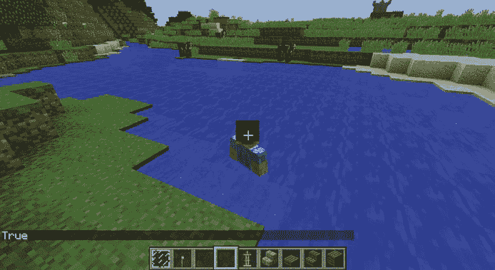
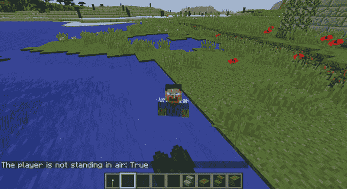
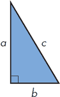
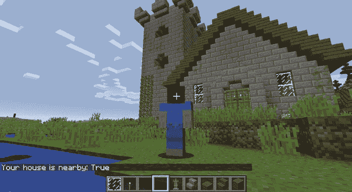
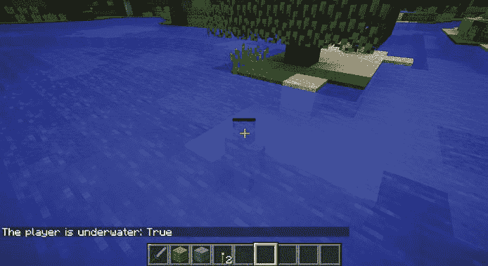
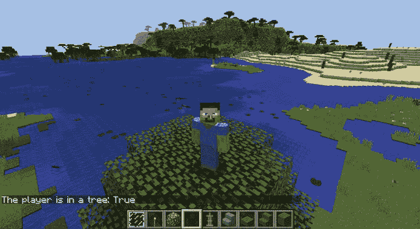
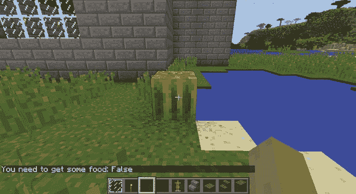
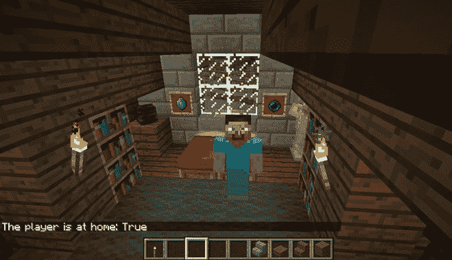

## 第五章：5

**用布尔值搞清楚什么是真的，什么是假的**


你时常会问是非问题：在下雨吗？我的头发太长了吗？一旦你知道答案是“是”还是“否”，你就能决定接下来做什么：带伞，还是不带；修剪头发，还是不修剪。在所有这些情况下，你的行动取决于问题的答案是否为“是”或“否”。根据问题的答案来决定该做什么，在编程中也很重要。在本章中，你将学习如何在 Python 中提问。

在编程中，你提出的问题通常是关于比较值的。一个值是否等于另一个值？一个值是否大于或小于另一个值？这种是非问题称为*条件*，其答案不是*是*或*否*，而是`True`或`False`。假设你问了这样一个问题：“我比我的朋友有更多的金块吗？”或者换句话说，“我的金矿比我朋友的金矿大吗？”为了让这个问题成为 Python 能理解的条件，我们必须将其表述为一个可以为真或假的声明（例如：“我的金矿比我朋友的金矿大”）。

在 Python 中，测试一个条件是否为真或假是非常有用的，因此有一个专门的数据类型用来存储`True`和`False`这两个值。到目前为止，你已经看到过其他几种数据类型：整数、浮点数和字符串数据类型。用于存储`True`和`False`值的数据类型就是*布尔*数据类型。布尔值只能是`True`或`False`。当你在 Python 中提问时，结果要么是`True`，要么是`False`。当一个条件为真或假时，程序员会说它*评估为*`True`或*评估为*`False`。

在本章中，你将使用布尔值、比较运算符和逻辑运算符来测试涉及值的不同条件。然后你将准备好进入第六章，在那里你将使用问题的答案来决定接下来在程序中该做什么。

### 布尔基础

布尔值有点像电灯开关：它要么是`True`（开），要么是`False`（关）。在 Python 中，你可以像这样声明一个布尔变量来表示灯亮着：

```
light = True
```

在这里，你将`True`的值赋给变量`light`，若要关闭灯光，可以将`False`的值赋给`light`：

```
light = False
```

始终大写`True`和`False`的首字母。如果不这样做，Python 将无法识别该值为布尔值，并会抛出异常，而不是评估你的计算！

在下一个任务中，你将使用布尔值来阻止玩家在游戏世界中砸方块。

#### 任务 #17：停止砸方块！

在 Minecraft 中，砸方块很容易，当你想挖掘资源时这很棒。但当你花了很长时间建造一个非常酷的结构，然后不小心砸坏它时，就很让人烦恼！在这个任务中，你将使你的 Minecraft 世界不可摧毁。

通过使用`setting("world_immutable", True)`，你可以使方块*不可变*，这意味着它们无法被改变。`setting()`这行代码是一个函数，就像你之前看到的`setTilePos()`和`setPos()`函数一样。列表 5-1 展示了如何使世界不可变。

*immutableOn.py*

```
from mcpi.minecraft import Minecraft
mc = Minecraft.create()

mc.setting("world_immutable", True)
```

*列表 5-1：防止方块被破坏的代码*

`setting()`函数有一些选项，你可以将它们设置为`True`来启用它们。一个选项是`"world_immutable"`。要启用一个`setting()`选项，你只需在括号内写上`True`。

在 IDLE 中输入列表 5-1 并将其保存为*immutableOn.py*，放入名为*booleans*的新文件夹中。当你运行它时，大多数方块不应该被破坏，如图 5-1 所示。但如果你*确实*想重新破坏方块呢？将你的程序复制到一个新文件中，并更改它，以允许玩家破坏方块。（提示：使用布尔值！）将新文件保存为*immutableOff.py*，放入*booleans*文件夹中。


*图 5-1：无论我多么努力，方块都不会破碎！*

### 连接布尔值

像整数和浮点数一样，布尔值必须在连接之前转换为字符串。例如，当你想使用`print()`函数输出布尔值时，你会将布尔值与字符串连接。要做到这一点，使用`str()`函数：

```
>>> agree = True
>>> print("I agree: " + str(agree))
I agree: True
```

`agree`变量存储一个布尔值。在第二行中，它被转换为字符串`str(agree)`，与`"I agree: "`字符串连接，并被打印出来。

### 比较符

你非常擅长比较值。你知道 5 大于 2，8 和 8 是相同的数字，6 和 12 不是相同的数字。计算机也很擅长比较值；你只需要告诉它你想进行哪种比较，通过输入一个叫做*比较符*的符号。例如，你希望它检查一个值是否大于另一个，还是检查它是否更小？

比较符（或*比较运算符*）在 Python 中允许你比较数据。Python 使用六个比较符：

• 等于（`==`）

• 不等于（`!=`）

• 小于（`<`）

• 小于或等于（`<=`）

• 大于（`>`）

• 大于或等于（`>=`）

每个比较符返回一个布尔值（`True` 或 `False`），表示条件是否成立。让我们来看看这些比较符，并探索如何使用它们！

#### 等于

当你想找出两个值是否相同时，可以使用等于比较符（`==`）。当值相同，比较结果返回布尔值`True`。当值不同，比较结果返回`False`。

例如，我们可以为两个变量赋值，然后使用等于运算符来比较它们：

```
>>> length = 2
>>> width = 2
>>> length == width
True
```

结果是`True`，因为`length`和`width`变量的值相同。

但是如果它们不同，结果是`False`：

```
>>> length = 4
>>> width = 1
>>> length == width
False
```

你可以对所有变量类型使用等于比较器：字符串、整数、浮动数值和布尔值。

请注意，我是如何使用`==`来比较`length`和`width`的，而不是使用`=`，后者用于设置变量。Python 使用`==`运算符来区分比较（询问两个值是否相等）和设置变量（使一个变量等于某个值）。记住这个区别可以避免代码中的 bug。别担心，甚至我有时也会犯用`=`而不是`==`的错误！

#### 任务 #18: 我在游泳吗？

现在，你将使用比较器制作一个程序，显示你是否站在水中。结果将会显示在 Minecraft 聊天框里。

要查找特定坐标的方块类型，你将使用`getBlock()`函数。这个函数以三个坐标作为参数，返回一个整数表示方块类型。例如：

```
blockType = mc.getBlock(10, 18, 13)
```

在这里，我将`mc.getBlock(10, 18, 13)`的结果存储在名为`blockType`的变量中。如果坐标(10, 18, 13)处的方块是甜瓜（方块值 103），那么`blockType`变量的值将是 103。

让我们来使用`getBlock()`函数。列表 5-2 检查玩家是否站在干燥的土地上。

*swimming.py*

```
from mcpi.minecraft import Minecraft
mc = Minecraft.create()

pos = mc.player.getPos()
x = pos.x
y = pos.y
z = pos.z

blockType = mc.getBlock(x, y, z)
mc.postToChat(blockType == 0)
```

*列表 5-2：这段代码检查玩家双腿所在的方块类型。*

在这里，我获取了玩家位置的三个坐标，并将这些坐标作为参数传递给`getBlock()`。我将`mc.getBlock(x, y, z)`的结果存储在`blockType`中。表达式`blockType == 0`检查方块是否为空气；如果是空气，你知道自己只是在 Minecraft 世界中的某个地方站着，表达式为`True`，`True`会显示在聊天框里。如果不是空气，`False`会显示在聊天框里，那你一定是在水下或者可能被沙子淹没！

复制列表 5-2 并将其保存为*swimming.py*文件在*第五章*目录下。然后修改代码，使其检查玩家是否站在水中（方块类型 9），并运行它。

尝试站在水中并运行程序。确保当玩家在水中时，聊天框显示`True`。当玩家不在水中时，聊天框应该显示`False`。

程序的输出应该像图 5-2 一样。

**注意**

*此时，你将无法持续运行这个程序。每次你想检查玩家下方的方块时，都必须重新运行程序。这同样适用于本章的其他任务。*



*图 5-2：尽管我可以看到自己站在水中，Python 也很贴心地确认了这一点。*

**额外目标：我在飞行！**

通过对代码进行一些修改，你可以检查你脚下的方块是否为空气。这可以告诉你你是在飞行还是跳跃。你会怎么做呢？

#### 不等于

不等于比较器是等于比较器的相反操作。它不是检查两个值是否相同，而是检查它们是否不同。当两个值不同时，比较结果为`True`；当它们相同时，结果为`False`。

假设你想确保一个物体是矩形但不是正方形。因为非正方形矩形的长度和宽度不同，你可以写一个比较来检查长度和宽度是否不相等：

```
>>> width = 3
>>> length = 2
>>> width != length
True
```

`width != length`表达式询问`width`和`length`的值是否不同。

这个比较的结果为`True`，因为`width`变量和`length`变量的值不同。

但如果这些值相同，比较结果将返回`False`：

```
>>> width = 3
>>> length = 3
>>> width != length
False
```

不等于比较器同样适用于字符串、整数、浮点数和布尔值，就像等于比较器一样。

#### 任务 #19：我站的不是空气吗？

假设你想检查自己是否站在除了空气之外的某种物体上，比如水、岩浆、泥土、砾石或其他类型的方块。在任务 #18 中，你检查了当前位置的方块是否是空气，并且你也已经学会了如何检查自己是否站在水中。你可以将程序复制粘贴多次，每次稍作修改，来检查是否是岩浆、泥土、砾石等。但是这样做会很枯燥。相反，你可以使用不等于比较器来检查自己是否在地下、是否被困在沙子中、是否处于海底，甚至是否正在岩浆中溺水！

打开任务 #18 中的程序（*swimming.py*），并将其保存为*notAir.py*到*booleans*文件夹中。删除程序的最后一行，并用列表 5-3 替换。

*notAir.py*

```
➊ notAir = blockType == 0
   mc.postToChat("The player is not standing in air: " + str(notAir))
```

*列表 5-3：游泳程序的更改*

这段代码的最后一行将打印出你是否没有站在空气中的信息。比较的结果存储在`notAir`变量中 ➊。当比较结果为`True`时，`notAir`变量的值为`True`；当比较结果为`False`时，`notAir`变量的值为`False`。

但是第一行的比较有点问题 ➊。它当前检查`blockType`是否等于空气，使用的是等于比较器（`==`）。实际上，应该使用不等于比较器（`!=`）来检查`blockType`变量是否不等于空气。将第一行改成使用不等于比较器，而不是等于比较器。这样可以检查玩家当前位置的方块是否不是空气。

运行程序时，确保它在你站在空气中、在水下、在岩浆中、在砾石中、在沙子中，或者被传送到地下时都能正常工作。当条件为`True`时，显示在聊天中的消息如图 5-3 所示。



*图 5-3：在水里悠闲地游泳，而水不是空气。*

#### 大于和小于

当你需要判断一个值是否大于另一个值时，使用大于比较器。大于比较器会在左边的值大于右边的值时返回`True`。如果左边的值小于或等于右边的值，则比较会返回`False`。

假设我们有一辆矿车，最多只能提升 99 块黑曜石。只要矿车的提升限制大于它试图提升的黑曜石块数，它就能提升这些块：

```
>>> limit = 100
>>> obsidian = 99
>>> limit > obsidian
True
```

太棒了！我们的矿车可以运载任何少于 100 块黑曜石的数量，而 99 小于 100，所以`limit > obsidian`评估为`True`。但如果有人往堆里加了一块黑曜石会怎样？

```
>>> limit = 100
>>> obsidian = 100
>>> canLift = limit > obsidian
False
```

哎呀，现在已经达到限制了！结果变成了`False`：100 不大于 100，它们相等。我们的矿车无法提升黑曜石。

小于比较器的工作方式相同。

一辆车驶过桥下时，需要知道它是否足够小，能够通过桥下：

```
>>> vanHeight = 8
>>> bridgeHeight = 12
>>> vanHeight < bridgeHeight
True
```

在这种情况下，车子能通过桥下，因为它的高度小于桥的高度：8 小于 12。后来在旅程中，同样的车可能会遇到一个过低的桥，无法通过：

```
>>> vanHeight = 8
>>> bridgeHeight = 7
>>> vanHeight < bridgeHeight
False
```

因为 8 不是小于 7，所以结果是`False`。

#### 大于或等于和小于或等于

与大于比较器类似，大于或等于比较器确定一个值是否大于另一个值。与大于比较器不同，如果两个值相等，它也会评估为`True`。

假设我正在给所有来看我精彩的程序展示的人发贴纸。我需要检查是否有足够的贴纸分发给每个人：

```
>>> stickers = 30
>>> people = 30
>>> stickers >= people
True
```

我有足够的贴纸：30 等于 30，所以`stickers >= people`评估为`True`。但是假设我的朋友觉得这些贴纸很酷，想要一张。现在，31 个人想要贴纸：

```
>>> stickers = 30
>>> people = 31
>>> stickers >= people
False
```

我没有足够的贴纸：30 不大于或等于 31。看起来我的朋友不能得到贴纸。

到现在为止，你已经准备好解决几乎任何比较问题了。当你在 IDLE 时，试试“小于或等于”比较器（`<=`），看看它是如何工作的。

**注意**

*大于、大于或等于、小于和小于或等于比较器不能用于字符串，尽管它们可以用于整数、浮点数和布尔值。*

#### 任务#20：我在地面上吗？

Minecraft 中玩家的 y 坐标显示他们在游戏中的高度。方块也使用坐标存储，这使得你可以使用`getBlock()`获取特定坐标处的方块类型，并使用`setBlocks()`在特定坐标处创建方块。

要获取 Minecraft 中的最高方块，你可以使用`getHeight()`函数。该函数接受 x 和 z 坐标并返回该位置的最高方块的 y 坐标，如清单 5-4 所示。

*aboveGround.py*

```
from mcpi.minecraft import Minecraft
mc = Minecraft.create()
pos = mc.player.getTilePos()
x = pos.x
y = pos.y
z = pos.z
highestBlockY = mc.getHeight(x, z)
mc.postToChat(highestBlockY)
```

*清单 5-4: 查找玩家当前位置上方块的 y 坐标的代码*

这个程序获取玩家的当前位置信息，获取玩家当前位置上方块的 y 坐标，然后将这个值发布到 Minecraft 聊天中。

通过将这个程序与大于或等于比较器结合，你可以检查玩家是否在地面上。现在我们来做这个。

复制清单 5-4 中的程序，并将其保存为*aboveGround.py*。修改程序以检查玩家的 y 坐标是否大于`highestBlockY`变量。然后，添加代码以将结果以“玩家是否在地面上：True/False”的格式发布到聊天中。

**提示**

*记住，你可以将比较的结果存储在变量中。例如，如果我想检查* `y` *是否大于或等于 10，并将结果存储在一个名为* `highEnough` *的变量中，我会使用以下语句：* `highEnough = y >= 10`。

在进行这些更改后，运行程序。程序的`False`输出结果显示在图 5-4 中。


*图 5-4: 现在我在一个洞穴里，所以 Python 的判断是正确的，我并不在地面上。*

#### 任务 #21: 我离家很近吗？

当你在 Minecraft 的世界里四处游荡时，可能会迷路，忘记自己家在哪。你可能会走几个小时，最终发现最初迷路时离家很近。

通过一行代码，你可以检查自己距离游戏中任意坐标的远近。例如，你可以使用你家的坐标和当前位置来计算自己距离家有多远。通过添加比较器，你还可以检查自己是否距离家在某个特定的范围内。如果你距离家只有 40 个方块，那么我们就认为你离家很近。

让我们写一个 Python 程序来为你检查！这个任务的代码应该检查你离家有多远，如清单 5-5 所示。

*farFromHome.py*

```
   from mcpi.minecraft import Minecraft
   mc = Minecraft.create()
   import math
➊ homeX = 10
   homeZ = 10
   pos = mc.player.getTilePos()
   x = pos.x
   z = pos.z
➋ distance = math.sqrt((homeX - x) ** 2 + (homeZ - z) ** 2)
➌ mc.postToChat(distance)
```

*清单 5-5: 输出你家距离的代码*

这段代码假设你家的坐标为`x = 10`和`z = 10`，这些值通过`homeX`和`homeZ`变量设置➊。在这种情况下，我们不需要关心 y 坐标。我使用`getTilePos()`函数获取玩家的位置并设置`x`和`z`值。

为了计算`distance`变量，我们使用一种叫做*勾股定理*的公式。它计算直角三角形一边的长度，你可以在 Minecraft 中使用它来计算两点之间的距离。你可能在数学课上见过这个公式，形式是*a*² + *b*² = *c*²，其中*a*和*b*是直角三角形的两条直角边，*c*是斜边，正如图 5-5 所示。在➋处，我们正在求解*c*，它由变量`distance`表示。

将清单 5-5 保存为*farFromHome.py*，并放在*booleans*文件夹中。

为了完成程序，使用小于或等于比较符检查`distance`变量的值是否小于或等于 40，并将结果以`"Your house is nearby: True/False"`的格式发布到聊天中 ➌。使用连接运算符将字符串与比较结果结合起来。更新`postToChat()` ➌函数的内容以输出该字符串。



*图 5-5：直角三角形*

测试程序。当你离家不超过 40 格时，应该收到`True`消息；当你距离超过 40 格时，应该看到`False`消息。图 5-6 展示了程序的运行效果。



*图 5-6：我肯定在离家 40 格以内。事实上，那就是前门！*

### 逻辑运算符

在程序中，组合两个或更多比较符是常见的需求。你可能想要判断两个条件是否都为`True`：例如，你可能想要一辆红色的车*并且*价格低于 10,000 美元。

要组合两个或更多的比较符，你可以使用*逻辑运算符*。与比较符一样，逻辑运算符可以在任何需要布尔值的地方使用。逻辑运算符也被称为*布尔运算符*。你将学习三种类型的逻辑运算符：`and`、`or`和`not`。

#### AND

当你想要检查两个比较结果是否都为`True`时，使用`and`运算符。对于一个包含`and`运算符的表达式，要想结果为`True`，两个比较必须都为`True`。如果其中一个比较为`False`，整个语句的结果将为`False`。

假设我想要判断一个人是否年满 18 岁且拥有汽车。我可能会写出以下程序：

```
>>> age = 21
>>> ownsCar = True
>>> age > 18➊ and ownsCar == True➋
True
```

在这里，我们在➊和➋处使用`and`组合了两个比较符。因为这个人的年龄大于 18 岁（`age > 18`的结果为`True`），并且他们拥有一辆车（`ownsCar == True`），所以整个表达式`age > 18 and ownsCar == True`的结果为`True`。

如果其中一个比较结果是`False`，语句的结果将为`False`。假设这个人没有车但年满 18 岁：

```
>>> age = 25
>>> ownsCar = False
>>> age > 18 and ownsCar == True
False
```

在这里，`age > 18`的结果为`True`，而`ownsCar == True`的结果为`False`，因此整个表达式的结果为`False`。

表 5-1 总结了使用`and`运算符时所有可能的布尔组合及其结果。

**表 5-1：** 使用`and`运算符的`True`和`False`的不同组合

| **比较 A** | **比较 B** | **A 和 B** |
| --- | --- | --- |
| 真 | 真 | 真 |
| 真 | 假 | 假 |
| 假 | 真 | 假 |
| 假 | 假 | 假 |

#### 任务 #22：我完全在水下吗？

在任务 #18（第 85 页），你检查了玩家是否在游泳。程序根据玩家当前位置的方块是否为水返回`True`或`False`。这告诉你玩家的腿是否在水下，但无论玩家头是否在水下，结果都是一样的。那么，你如何检查玩家的腿和头是否都在水下呢？

通过一些简单的修改，添加`and`运算符，*swimming.py*程序就可以检查玩家的腿和头是否在水下。打开*swimming.py*并保存为*underwater.py*。

进行以下更改，使程序检查玩家是否完全在水下：

1.  添加第二个变量，检查玩家在`y`坐标位置`+ 1`的方块类型。该变量存储玩家头部上方的方块类型。将此变量命名为`blockType2`。

1.  检查`blockType`是否等于水，以及`blockType2`是否等于水。

1.  将比较结果通过此消息发送到聊天：“玩家是否在水下：True/False”。

**提示**

*要检查* `blockType` *和* `blockType2` *是否都等于水，你可以使用* `and` *运算符。首先，你可以使用表达式* `blockType == 9` *检查* `blockType` *是否等于水。然后，使用表达式* `blockType2 == 9` *检查* `blockType2` *是否等于水。为了将这两者结合，你可以在中间加上`and`运算符，像这样：* `blockType == 9 and blockType2 == 9`。

运行程序时，请确保测试它在所有三种情况中的表现（当玩家在水面上方时，当只有玩家的腿在水下时，以及当玩家完全在水下时）。图 5-7 显示了程序工作的示例。



*图 5-7：玩家在水下，沿着海底前进。*

**附加目标：我在隧道里吗？**

检查玩家是否处于泥土隧道或鹅卵石隧道中。为此，你需要检查玩家上方和下方的方块。

#### 或

`or`运算符的工作方式与`and`不同。当任一或两者比较结果为`True`时，`or`表达式将返回`True`。只要有一个比较为`True`，表达式就为`True`。但是，如果两个比较都不为`True`，表达式将评估为`False`。

假设我想领养一只黑色或橙色的猫。我可以使用以下代码获取用户输入，然后检查字符串的值是否为`"black"`或`"orange"`：

```
catColor = input("What color is the cat?")
myCatNow = catColor == "black" or catColor == "orange"
print("Adopt this cat: " + str(myCatNow))
```

只要 `catColor` 是 `"black"` 或 `"orange"`，我就会收养它。但如果它是其他颜色，比如 `"gray"`，那么 `myCatNow` 就会是 `False`，我就不会收养这只猫。

表 5-2 包含了使用 `or` 运算符与布尔值结合时的所有可能组合及其结果。

**表 5-2：** 使用 `or` 运算符时 `True` 和 `False` 的不同组合

| **比较 A** | **比较 B** | **A 或 B** |
| --- | --- | --- |
| TRUE | TRUE | TRUE |
| TRUE | FALSE | TRUE |
| FALSE | TRUE | TRUE |
| FALSE | FALSE | FALSE |

#### 任务 #23：我在树中吗？

本章中你创建的程序会根据玩家是否站在某个特定的方块类型上，显示 `True` 或 `False`。但如果你想检查玩家是否在树中呢？该怎么做呢？因为树是由木材和树叶组成的，所以你需要检查玩家是否站在木材*或*树叶上。

让我们写一个程序。再次打开 *swimming.py* 文件，并将其另存为名为 *inTree.py* 的新程序。

修改程序，使其检查玩家下方一个方块的类型。你需要使用 `or` 运算符来检查玩家下方的方块是树叶（方块类型 18）还是木材（方块类型 11），然后将结果发布到聊天中。

请记住，你可以使用 `y = y - 1` 来检查玩家下方的方块。

**注意**

*尽管树和树叶有不同的颜色，但所有树木共享相同的方块 ID，所有树叶也共享相同的方块 ID。（唯一的例外是金合欢和深色橡木木材与树叶，它们属于不同的方块类型。暂时我们忽略金合欢和深色橡木。）颜色是通过一个第二个值设置的，稍后的章节你将学习如何使用它。*

当你运行程序时，应该会看到与 图 5-8 中相同的输出。



*图 5-8：我在树中。*

#### NOT

`not` 运算符与 `and` 和 `or` 运算符有些不同。它用于单一的布尔值或比较，并简单地将其值反转。

换句话说，`not` 会将 `True` 改为 `False`，将 `False` 改为 `True`：

```
>>> not True
False
>>> not False
True
```

当你开始将 `not` 运算符与其他逻辑运算符结合使用时，它非常有用。让我们在你 `不饿` 且 `困` 时给 `timeForBed` 赋值。

```
>>> hungry = False
>>> sleepy = True
>>> timeForBed = not hungry and sleepy
>>> print(timeForBed)
True
```

`not` 运算符只对它前面的布尔值起作用。这里，它反转了 `hungry` 变量的值，同时保持 `sleepy` 变量不变。因为我们之前把 `hungry` 设置为 `False`，所以写 `not hungry` 会将其值变为 `True`。`sleepy` 的值是 `True`。现在两个值都为 `True`，因此 `timeForBed` 为 `True`。

#### 任务 #24：这个方块不是西瓜吗？

你饿了，想知道家里是否有食物。你最喜欢的食物是西瓜，你总是把它存放在家里的同一个地方。但你不记得家里是否还有西瓜了，所以你需要决定回家的路上是否要买些食物。

幸运的是，你在学习 Python！只需一点脑力，就能写出一个 Python 程序来检查你家里是否有瓜。

在这个任务中，你将创建一个程序来判断在回到你的 Minecraft 房子之前，是否需要找食物。程序会检查某些坐标处是否有瓜。你检查的坐标由你决定——它们可以在你的房子里，农场上，或你决定放置瓜的任何地方。在这些坐标上放置瓜也由你决定。

复制清单 5-6 并将其保存为*notAMelon.py*。

*notAMelon.py*

```
   from mcpi.minecraft import Minecraft
   mc = Minecraft.create()

   x = 10
   y = 11
   z = 12
➊ melon = 103
➋ block = mc.getBlock(x, y, z)

➌ noMelon = # Check the block is not a melon

➍ mc.postToChat("You need to get some food: " + str(noMelon))
```

*清单 5-6：检查特定位置是否有瓜的代码开头*

这段代码是用来检查特定位置的块是否是瓜块。我包含了一个名为`melon`的变量，用来存储瓜的块 ID（103）➊，并调用了`getBlock()`方法，将结果存储在名为`block`的变量中➋。为了完成这个程序，你需要完成➌这一行，检查`melon`变量是否与`block`变量不相等。结果应该存储在`noMelon`变量中，以便在最后一行输出到 Minecraft 聊天窗口中 ➍。

你可以通过两种方式编写检查➌，看看`melon`和`block`变量是否不相等：你可以使用不等于比较符号或`not`逻辑运算符。尽管程序两种方式都能运行，但尝试使用`not`逻辑运算符来编写这个程序。

当你完成更改后，运行程序。结果应该类似于图 5-9。



*图 5-9：我的农场上有一个瓜，所以我不需要再找其他食物。*

**奖励目标：储藏丰富的食品柜**

更改程序检查的块类型。你可以检查你的农场上是否有玉米，或者有人是否偷走了你的前门。

#### 逻辑运算符顺序

你可以在单个语句中组合任意多个逻辑运算符。例如，这里有一个非常复杂的组合，使用了`and`、`or`和`not`：

```
>>> True and not False or False
True
```

这段代码的结果是`True`。你感到惊讶吗？在这个例子中，语句中的`not False`部分首先被计算为`True`。这相当于：

```
>>> True and True or False
True
```

然后评估`and`，`True and True`的结果是`True`，这相当于：

```
>>> True or False
True
```

最后，评估`or`，所以`True or False`的结果是`True`。

当 Python 评估逻辑运算符时，它有一定的顺序。如果你搞错了顺序，可能会得到你意料之外的结果！以下是 Python 的评估顺序：

1.  `not`

1.  `and`

1.  `or`

练习在 IDLE 中创建带有逻辑运算符的语句，看看你能否猜出每个语句的结果。

#### 我的数字是否介于两个数之间？

通常，你会想检查一个值是否小于一个值且大于另一个值。假设你想确保你有 10 到 20 只狼，因为你喜欢狼并且希望有超过 10 只，但 20 只或更多可能会造成问题，因为你会吃光食物。你可以使用`and`运算符来测试这个条件：

```
wolves = input("Enter the number of wolves: ")
enoughWolves = wolves > 10 and wolves < 20
print("Enough wolves: " + str(enoughWolves))
```

但你也可以用另一种方法来做。你可以不使用`and`运算符，而是将变量写在两个比较运算符之间：

```
wolves = input("Enter the number of wolves: ")
enoughWolves = 10 < wolves < 20
print("Enough wolves: " + str(enoughWolves))
```

如果你运行这些程序中的任何一个，并输入一个介于 10 和 20 之间但不等于这两个值的数字，则`enoughWolves`将为`True`。你也可以使用大于等于运算符（`>=`）和小于等于运算符（`<=`）来实现相同的效果：

```
wolves = input("Enter the number of wolves: ")
enoughWolves = 10 <= wolves <= 20
print("Enough wolves: " + str(enoughWolves))
```

在这种情况下，输入 10 或 20 也会使`enoughWolves`的值为`True`。

#### 任务 #25：我在房子里吗？

使用 Python 代码，你可以在玩家走到地图上的某个区域时让一些酷炫的动作发生。你可以让一个秘密门在玩家走到某个特定方块时打开，或者当他们走过陷阱时将他们困在箱子里。在这个任务中，我将向你展示如何检测一个人是否在你的 Minecraft 房子里。

在任务 #8（第 55 页），你创建了一个自动构建建筑物的墙壁、天花板和地板的程序。你将该程序保存在*math*文件夹中的*building.py*中。现在打开这个程序。

阅读*building.py*程序中的代码，并记录`width`、`height`和`length`变量的值（默认情况下，这些值分别为`10`、`5`和`6`）。同时，写下你当前站立的坐标。运行建筑程序来建造一座房子。

现在你已经建好了一个建筑物，我们可以编写一个像清单 5-7 那样的程序，来检查玩家是否站在建筑物内部。

*insideHouse.py*

```
   from mcpi.minecraft import Minecraft
   mc = minecraft.create()

➊ buildX =
   buildY =
   buildZ =
➋ width = 10
   height = 5
   length = 6

   pos = mc.player.getTilePos()
   x = pos.x
   y = pos.y
   z = pos.z

➌ inside = buildX < x < buildX + width and
```

*清单 5-7：检查玩家是否在房子内的程序开头*

清单 5-7 应该检查玩家的 x 坐标是否在*building.py*创建的建筑物内，但程序尚未完成！你的任务是确保程序还检查 y 和 z 坐标，确保它们在你使用*building.py*程序建造的房子的坐标范围内。

将清单 5-7 复制到一个新文件中，并将其保存为*insideHouse.py*。你将完成该程序，使其检查玩家是否在建筑物内部。

完成程序，执行以下操作：

1.  添加建筑物的坐标（这些坐标是你运行*building.py*程序时站立的位置）➊。

1.  如果`width`、`height`和`length`变量与*building.py*程序中使用的值不同，请修正它们➋。

1.  完成对`inside`变量的比较，以检查玩家的坐标是否在建筑物内。第一部分，用于检查 x 坐标是否在房子内，已经为你完成 ➌。你需要添加 y 和 z 坐标的比较。表达式与我为 x 坐标所写的类似（`buildX < x < buildX + width`）。

1.  将`inside`变量的值发布到聊天中。

1.  当你完成更改后，保存并运行程序。你应该看到类似图 5-10 的输出。

    

    *图 5-10：我在我的卧室，确实是在我的房子里。*

### 你学到了什么

在本章中，你使用了布尔值、比较器和逻辑运算符来回答程序中的问题。在第六章，你将编写根据这些问题的答案做出决策的程序。你将检查一个条件是否为真，并告诉程序如果条件为真就运行某段代码，或者如果条件为假则运行另一段代码。在第七章，你的程序将在条件为真时持续运行某段代码，直到条件变为假时停止运行。这就是布尔值和比较器的真正威力。它们帮助你控制程序中哪段代码被执行，以及何时被执行。
