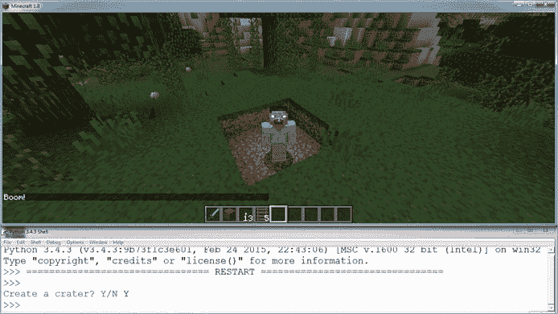
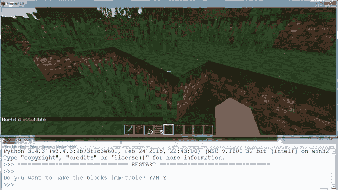
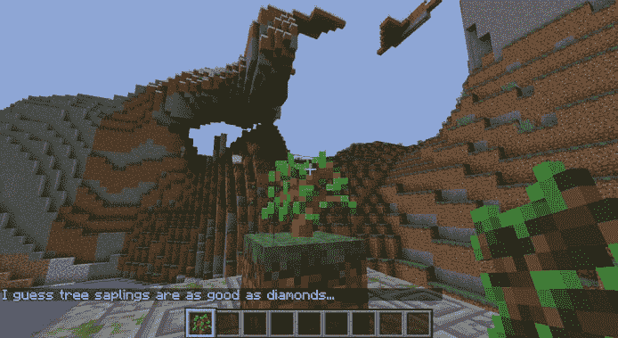
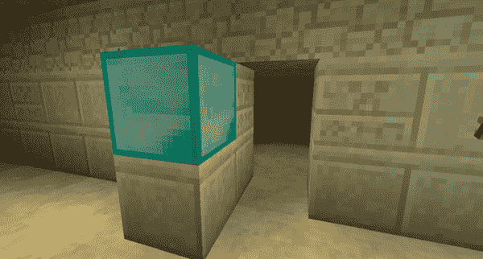
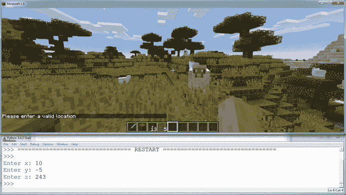
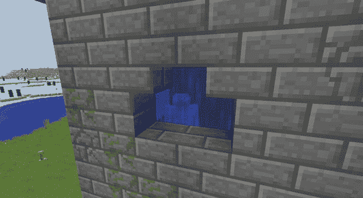

## **6**

**使用 if 语句制作迷你游戏**


在第五章中，你学会了如何在 Python 中提问。你使用了比较运算符（如`==`、`!=`、`>`、`<`等）和逻辑运算符（`and`、`or`、`not`）来判断条件或一组条件的真假。在本章中，你将利用这些问题的答案——你测试的条件的结果——来决定执行哪些代码。

你每天都根据条件做决策。现在是夜晚吗？如果是，你就穿上钻石盔甲，带上剑来击退怪物。如果不是，你可能会将所有装备留在你的秘密基地。你饿了吗？如果是，你就吃一些面包或苹果。如果不是，你可能会去进行一场大冒险，以便增加食欲。就像你在日常生活中做决策一样，你的程序也需要根据条件执行不同的任务。

我们将使用一些 Python 代码来帮助你的程序做出决策。`if`语句告诉你的程序是否运行某段特定的代码。`if`语句的意思是“*如果*这个条件为真，就运行这段代码。”例如，你可以检查玩家是否站在一个禁区内，如果是，则将地板变成熔岩。或者，你可以检查他们是否在特定位置放置了某个方块，如果放了，就打开一个隐藏的门。通过使用条件和`if`语句，你可以开始在 Minecraft 中制作你自己的迷你游戏。

### **使用 if 语句**

能够控制程序的执行是一项非常强大的能力；事实上，它对编程至关重要！程序员有时称这一概念为*流程控制*。添加这种控制的最简单方法是使用简单的`if`语句，当条件为`True`时执行代码。

`if`语句有三部分：

• `if`运算符

• 测试条件

• 如果条件为`True`，则执行一段代码

让我们看一个实际的`if`语句。以下代码只有在僵尸数量超过 20 时，才会打印出`"That's a lot of zombies."`。否则，它什么也不做。

```
zombies = int(input("Enter the number of zombies: "))
if zombies > 20:
    print("That's a lot of zombies.")
```

在这里，`zombies > 20`是我们要测试的条件，而`print("That's a lot of zombies.")`是`if`语句的主体；它是当`zombies > 20`为`True`时执行的代码。`if`语句行末的冒号（`:`）告诉 Python 接下来的一行将开始执行`if`语句的主体。缩进则告诉 Python 哪些代码行构成了这个主体。*缩进*是指在文本行的开头有额外的空格。在 Python 中，你通过四个空格来缩进代码行。如果我们想在`if`语句中添加更多的代码行，我们需要在它们前面加上相同数量的空格，就像`print("That's a lot of zombies.")`那样缩进。

尝试多次运行此代码，测试每个条件，看看会发生什么。例如，尝试输入一个小于 20 的数字，20，以及一个大于 20 的数字。以下是输入 22 时发生的情况：

```
Enter the number of zombies: 22
That's a lot of zombies.
```

好的，结果很有道理。让我们再运行一次，看看当条件不满足时会发生什么。

```
Enter the number of zombies: 5

```

请注意，如果条件是`False`，什么都不会发生。`if`语句的主体会被完全忽略。只有当条件为`True`时，`if`语句才会执行其主体中的代码。当`if`语句执行完毕后，程序会继续执行`if`语句后的代码。

让我们看另一个例子，以更好地理解它是如何工作的。以下代码使用`if`语句检查密码是否正确：

```
password = "cats"
attempt = input("Please enter the password: ")
if attempt == password:
    print("Password is correct")
print("Program finished")
```

`if`语句后的表达式是条件：`attempt == password`。在`if attempt == password:`之后缩进的那一行是`if`语句的主体：`print("Password is correct")`。

只有当`attempt`变量中存储的值与`password`变量中的值相同，代码才会打印`"Password is correct"`。如果它们不相同，什么也不会打印。最后一行代码会在`if`语句的主体是否执行都执行，并打印`"Program finished"`。

现在让我们尝试一些稍微有点爆炸性的东西。

#### **任务 #26：爆炸坑洞**

你已经学会了如何让玩家传送和跳得很高。现在，你将让玩家周围的方块消失。

当程序运行时，玩家上方、下方以及四周的方块将变为空气。这种力量非常具有破坏性，所以使用时要小心。为了安全起见，程序会询问用户是否确定要销毁这些方块，只有在用户回答“是”时才会执行销毁操作。

列表 6-1 通过删除玩家上方、下方以及四周的所有方块，创建一个坑洞。然后它在聊天中发布`"Boom!"`。将此程序保存为*crater.py*，并放在一个名为*ifStatements*的新文件夹中。

*crater.py*

```
   from mcpi.minecraft import Minecraft
   mc = Minecraft.create()

   answer = input("Create a crater? Y/N ")

➊ # Add an if statement here

   pos = mc.player.getPos()
➋ mc.setBlocks(pos.x + 1, pos.y + 1, pos.z + 1, pos.x - 1, pos.y - 1, pos.z - 1, 0)
   mc.postToChat("Boom!")
```

*列表 6-1：无论用户输入什么，这段代码都会创建一个坑洞。*

`answer`变量使用`input()`函数询问用户是否想要创建一个坑洞。然而，此时无论用户输入什么——`Y`、`N`、其他内容或什么也不输入——代码都会创建一个坑洞。

要完成这个程序，你需要添加一个`if`语句，检查用户是否输入了`Y`来回应问题。你可以将这个逻辑添加到游戏中的➊处。记住，用户的回答存储在`answer`变量中，因此你的`if`语句应该检查`answer`变量。在你添加完`if`语句后，程序只有在玩家输入`Y`时才会运行最后三行代码。为了做到这一点，你必须将这三行代码缩进四个空格。

请记住，`setBlocks()`函数的最后一个参数应该是你要设置的方块类型。这里，最后一个参数是`0`，表示空气方块类型。换句话说，陨石坑是通过`setBlocks()`将方块设置为空气➋来创建的，这样看起来玩家周围的所有方块都被摧毁了。通过对`pos.x`、`pos.y`和`pos.z`的值加减 1，代码在玩家的位置周围放置了一个 3x3 的空气方块立方体。这就是陨石坑。

在对程序进行修改后，保存并运行。`Create a Crater? Y/N`这个问题会出现在 Python 命令行中。输入`Y`或`N`。确保输入的是大写字母 Y，否则程序将无法正常运行。

当用户输入`Y`时，一个陨石坑将出现，正如图 6-1 所示。



*图 6-1：砰！我周围出现了一个陨石坑。*

**附加目标：建造一个房子**

你还能让这个程序做什么呢？试试修改程序，让它围绕玩家建造一个房子，而不是创建一个陨石坑。

#### **ELSE 语句**

现在我们将介绍一个更高级的语句，如果我们想在`if`条件为`False`时运行*不同*的代码，可以使用`else`语句。

`else`语句与`if`语句一起工作。首先，你写一个`if`语句，在条件为`True`时执行一些代码。接着，写一个`else`语句，在条件为`False`时执行其他代码。就像你在说：“如果条件为真，做这个。否则，做别的事情。”

以下程序将在房间里有超过 20 个僵尸时打印`"啊啊啊！僵尸！"`；否则，将打印`"你们这些僵尸还真不那么坏。" `

```
zombies = int(input("Enter the number of zombies: "))
if zombies > 20:
    print("Ahhhh! Zombies!")
else:
    print("You know, you zombies aren't so bad.")
```

像`if`语句一样，`else`语句使用冒号和缩进来表示哪些代码属于`else`语句的主体。但是`else`语句不能单独使用；它必须紧跟在`if`语句后面。`else`语句没有自己的条件；只有当`if`语句的条件（本例中是`zombies > 20`）为`False`时，`else`语句的主体才会执行。

回到之前的密码示例，我们可以添加一个`else`语句，当密码不正确时打印一条信息，代码如下：

```
password = "cats"
attempt = input("Please enter the password: ")
if attempt == password:
    print("Password is correct.")
else:
    print("Password is incorrect.")
```

当`attempt`的值与`password`的值匹配时，条件为`True`。程序会执行打印`"密码正确"`的代码。

当`attempt`与`password`不匹配时，条件为`False`。程序会执行打印`"密码不正确"`的代码。

如果没有`if`语句，仅使用`else`语句会怎样？例如，如果程序只有这两行：

```
else:
    print("Nothing happened.")
```

否则，Python 将无法理解发生了什么，并且会报错。

#### **任务 #27: 防止撞击，或者不防**

在任务#17（第 82 页）中，你写了一个程序，通过使用`mc.setting("world_immutable", True)`让世界变为不可变，阻止玩家破坏区块。这个程序帮助你保护了珍贵的创作免受事故或破坏者的侵害。但尽管它很有用，程序却不够灵活。关闭它需要另写一个程序，这样挺不方便的！

使用`if`语句、`else`语句和控制台输入，你可以制作一个程序来开关不可变设置。程序会询问你是否希望区块不可变，然后根据你的回答将不可变设置为`True`或`False`。

打开 IDLE 并创建一个新文件。将文件保存为*immutableChoice.py*，并保存在*ifStatements*文件夹中。按照以下指示完成程序：

1.  程序需要询问用户是否希望将区块设为不可变：

    ```
    "Do you want blocks to be immutable? Y/N"
    ```

    将这个字符串作为`input()`的参数，并将输入存储在名为`answer`的变量中。

1.  程序检查`answer`变量中存储的值是否为`"Y"`。如果是，它将运行以下代码：

    ```
    mc.setting("world_immutable", True)
    mc.postToChat("World is immutable")
    ```

    将这段代码复制并放入`if`语句中，这样它只会在`answer`变量的值等于`"Y"`时运行。不要忘记缩进！

1.  如果`answer`变量的值不是`"Y"`，程序将运行以下代码。

    ```
    mc.setting("world_immutable", False)
    mc.postToChat("World is mutable")
    ```

    将这段代码复制并放入一个缩进的`else`语句中。

保存并运行程序。当程序询问是否要将区块设为不可变时，输入`Y`或`N`并按回车键。测试程序。当你选择将区块设为不可变时，它们不应被破坏；否则，它们应该是可以被破坏的。

图 6-2 显示了终端中的输出信息和问题。

如果你输入`"N"`，你将得到与输入无意义的内容（比如`"banana"`）时相同的结果。你认为为什么会发生这种情况？



*图 6-2：我可以选择将世界设为不可变，现在我无法破坏任何区块。*

**附加目标：更好的界面**

我们可以通过使用布尔运算符，让程序接受`"Yes"`和`"No"`的不同变体，比如小写的`"yes"`、大写的`"YES"`，以及单个字符的回答`"y"`，使得程序更友好。试试看吧！

#### **ELIF 语句**

使用`if`语句和`else`语句时，如果条件为`True`，程序可以运行一段代码；如果条件为`False`，则运行另一段代码。但如果你想运行多于两段代码怎么办？

为了实现这一点，你可以使用`else-if`语句，或在 Python 中使用`elif`。首先写一个`if`语句，然后写一个`elif`语句，最后写一个`else`语句。当你将这些语句一起使用时，你是在说：“如果某个条件为`True`，就运行这段代码。否则，如果第二个不同的条件为`True`，就运行另一段代码。最后，如果这两个条件都不为`True`，就运行另一段代码。”

让我们看看它。假设你正在决定在冰淇淋店买什么口味的冰淇淋。你可能会说：“如果还有巧克力冰淇淋，我就买那个。如果没有巧克力，但有草莓，我就买草莓。如果既没有巧克力也没有草莓，我就买香草。”

在一个程序中，这个决策过程看起来是这样的：

```
hasChocolate = False
hasStrawberry = True
if hasChocolate:
    print("Hooray! I'm getting chocolate.")
elif hasStrawberry:
    print("I'm getting the second best flavor, strawberry.")
else:
    print("Vanilla is OK too, I guess.")
```

前两行只是为场景设定基础：我们假设今天冰淇淋店没有剩下巧克力冰淇淋，但有草莓口味。所以我们将`hasChocolate`设置为`False`，`hasStrawberry`设置为`True`。

接下来是决策过程的逻辑：如果`hasChocolate`为`True`，`if`语句会打印出`"Hooray! I'm getting chocolate."`。但是在这个例子中，它是`False`，所以这个信息不会被打印。相反，程序会进入`elif`语句，测试`hasStrawberry`是否为`True`。因为它为`True`，所以`elif`语句中的代码会执行，并打印出`"I'm getting the second best flavor, strawberry."`

如你所见，这个`elif`语句有它自己的条件和代码块。只有在`if`语句的条件为`False`并且`elif`语句的条件为`True`时，`elif`语句才会执行。

最后，`elif`语句之后的`else`语句会在`if`语句的条件为`False`且`elif`语句的条件也为`False`时执行。在这个例子中，如果`hasChocolate`和`hasStrawberry`都为`False`，则`else`语句的代码会执行，打印出`"Vanilla is OK too, I guess."`

另一个例子，我们可以回到那个在房间里有超过 20 只僵尸时会打印出`"Ahhhh! Zombies!"`的程序。我们可以添加一个`elif`语句，在`if`语句的条件为`False`时测试另一个条件：

```
zombies = int(input("Enter the number of zombies: "))
if zombies > 20:
    print("Ahhhh! Zombies!")
elif zombies == 0:
    print("No zombies here! Phew!")
else:
    print("You know, you zombies aren't so bad.")
```

我们添加一个`elif`语句来比较`zombies`和 0。如果`zombies == 0`为`True`，则`elif`语句中的代码会打印出`"No zombies here! Phew!"`。如果这个`elif`语句的条件为`False`，代码会进入`else`语句并打印出`"You know, you zombies aren't so bad."`

#### **任务 #28：提供礼物**

让我们创建一个程序，检查某个方块上是否放置了礼物，并根据礼物的不同输出不同的聊天回应。

这个程序允许你放置两种不同的礼物之一。一个礼物是钻石块，因为并不是每个人都有那么多钻石块，另一个是树苗。

列表 6-2 检查位置为 10, 11, 12 的方块是否是钻石块或树苗，或者没有礼物。但是，程序并不完整。

*gift.py*

```
   from mcpi.minecraft import Minecraft
   mc = Minecraft.create()
   x = 10
   y = 11
   z = 12
   gift = mc.getBlock(x, y, z)

   # if gift is a diamond block
➊ if

   # else if gift is a sapling
➋ elif

   else:
       mc.postToChat("Bring a gift to " + str(x) + ", " + str(y) + ", " + str(z))
```

*列表 6-2：检查是否已经送出礼物的代码开始部分*

在 IDLE 中创建一个新文件，并将其保存在 *ifStatements* 文件夹中的 *gift.py*。将 清单 6-2 复制到文件中。获取方块类型的代码已经为你写好。方块类型保存在 `gift` 变量中。如果没有放置钻石块或树苗，`else` 语句将会运行，并向聊天发送一条消息，提示玩家将礼物带到这些坐标。你可以将 `x`、`y` 和 `z` 变量中的坐标更改为任何你喜欢的位置。

完成程序，请按照以下步骤操作：

1.  完成 ➊ 位置的 `if` 语句，检查 `gift` 变量是否包含钻石块（57）的值。如果是，发送以下消息到聊天：“感谢你的钻石。”

1.  在第二个注释下的 ➋ 位置添加一个 `elif` 语句，检查 `gift` 变量是否包含树苗（6）的值。如果包含，发送以下消息到聊天：“我猜树苗和钻石一样好...”

在做出更改后，保存并运行程序。试着在坐标处放置一个钻石块，看看会发生什么。也可以试试放一个树苗，或者什么都不放在这些坐标上。别忘了树苗需要种植在泥土块或草块上！每种情况你都能得到正确的响应吗？你每次都需要重新运行程序来检查它是否正常工作。图 6-3 显示了我的工作程序。



*图 6-3：我把树苗作为礼物放置了。*

**奖励目标：赞美西瓜神**

在这个任务中，你可以使用许多不同的方块。试着修改代码，检查你是否放置了一个金块或一个西瓜作为礼物。再试着写一个代码，放置礼物方块后将其销毁。

#### **链式连接 `elif` 语句**

`elif` 语句的数量没有限制，你可以在一个 `if` 语句中包含一个或 100 个 `elif` 语句。Python 会逐一评估它们。

这是使用“僵尸数量”程序的一个例子：

```
   zombies = int(input("Enter the number of zombies: "))
   if zombies > 20:
       print("Ahhhh! Zombies!")
➊ elif zombies > 10:
       print("There's just half a Minecraft zombie apocalypse.")
   elif zombies == 0:
       print("No zombies here! Phew!")
   else:
       print("You know, you zombies aren't so bad.")
```

在 ➊ 位置，我们在 `if` 语句后添加了一个新的 `elif` 语句，检查房间里是否有超过 10 个僵尸。如果有，打印出“这就像半个 Minecraft 僵尸末日”；否则，代码继续检查下一个 `elif`。

`if` 和 `elif` 语句的顺序非常重要。如果它们的顺序错误，某些代码可能永远不会被执行，程序将无法按预期运行。

例如，如果我们将 `if` 语句的条件与第一个 `elif` 语句的条件交换，我们会遇到问题：

```
zombies = int(input("Enter the number of zombies: "))
if zombies > 10:
    print("There's just half a Minecraft zombie apocalypse.")
elif zombies > 20:
    print("Ahhhh! Zombies!")
elif zombies == 0:
    print("No zombies here! Phew!")
else:
    print("You know, you zombies aren't so bad.")
```

为什么这是错误的？让我们看看当 `zombies` 是 22 时发生了什么。因为 22 大于 10，第一个 `if` 语句的条件 `zombies > 10` 为 `True`，所以 `if` 语句的代码会执行。一旦执行了这个，其他的 `elif` 和 `else` 语句就不会执行了。程序永远不会到达 `elif zombies > 20`，因为它已经执行了 `if` 语句的主体。这是一个错误。

如果你从 `if` 语句中得到意外的结果，始终检查你的 `if` 和 `elif` 语句是否顺序正确。

#### **任务 #29：传送到正确的位置**

当 `if` 和 `elif` 语句顺序错误时，预期执行的代码不会执行，而不该执行的代码却会执行。这可能会导致程序出现奇怪的错误。要修复程序，你需要将条件按正确的顺序排列。我们来试试看。

代码清单 6-3 不会工作。它应该根据用户输入的分数将玩家传送到不同的位置。分数与正确的位置相匹配，但条件似乎没有按正确的顺序排列。

玩家分数越高，位置越好。这里是代码。条件是通过 `setPos()` 为每个位置传送设置的。

*teleportScore.py*

```
from mcpi.minecraft import Minecraft
mc = Minecraft.create()

points = int(input("Enter your points: "))
if points > 2:
    mc.player.setPos(112, 10, 112)
elif points <= 2:
    mc.player.setPos(0, 12, 20)
elif points > 4:
    mc.player.setPos(60, 20, 32)
elif points > 6:
    mc.player.setPos(32, 18, -38)
else:
    mc.postToChat("I don't know what to do with that information.")
```

*代码清单 6-3：根据你的分数，你将传送到不同的地点。*

这里有一个单独的条件，用于检查超过 6 分、超过 4 分、超过 2 分以及 2 分或以下的情况。

最后一行，在 `else` 语句内，除非用户输入一些完全异常的东西，比如输入文本字符串而不是他们的分数，或者根本不输入任何内容，否则是不会执行的。

在 IDLE 中创建一个新文件，并将其保存为 *teleportScore.py*，保存在 *ifStatements* 文件夹中。修改程序，使条件顺序正确，所有位置都能到达。使用不同的分数测试程序，确保每个传送目标的代码都能正常运行。图 6-4 显示了程序无法正常工作。


*图 6-4：我没想到会来到这里！*

由于程序当前无法正常工作，当我输入 5 时，它会将我传送到超过 2 分的位置，尽管我应该被传送到超过 4 分的位置。

**附加目标：传送我，斯科特！**

创建一个程序，允许你输入一个要传送到的地点作为字符串，比如 `"castle"`。使用 `if` 语句和 `elif` 语句选择你要传送到的位置。例如，`"sea fortress"` 会将你传送到一个地点，而 `"tree house"` 会将你传送到另一个地点。

#### **嵌套的 IF 语句**

假设你有一个 `if` 语句，如果它的条件为 `True`，你想要测试另一个条件（并在第二个条件为 `True` 时运行一些代码）。例如，如果你想让家园基地的入口更加秘密，你可能会编写一些代码，检查你是否站在一个开关上。如果这是真的，另一行代码会检查你是否拿着可以解锁门的秘密物品。你会怎么做呢？

你可以将一个 `if` 语句放在另一个 `if` 语句的主体内。这被称为 *嵌套* `if` 语句。

清单 6-4 是一个嵌套的 `if` 语句示例。一个简单的现金机检查你是否有足够的钱，如果有，它会要求你确认取款。如果你确认，程序会进行取款。

```
   withdraw = int(input("How much do you want to withdraw? "))
   balance = 1000

➊ if balance >= withdraw:
       confirm = input("Are you sure? ")
➋     if confirm == "Yes":
           print("Here is your money.")
   else:
       print("Sorry, you don't have enough money.")
```

*清单 6-4：一个用 Python 编写的假想现金机*

注意，第二个 `if` 语句是缩进在第一个 `if` 语句内部的。如果外层 `if` 语句的条件 ➊ 为 `True`，说明你的账户里有足够的钱，接着 `confirm = input("你确定吗？")` 这一行就会运行。然后，如果内层 `if` 语句的条件 ➋ 为 `True`，代码会输出 `"这是你的钱。" `

#### **任务 #30：打开一个秘密通道**

在这个任务中，你将稍微扩展之前的示例。你将创建一个带有秘密通道的建筑，秘密通道只有在放置一个钻石块在基座上时才会打开。当基座上放置任何其他类型的方块时，地板将变成岩浆！

首先，建造一个建筑物。为了快速完成这项任务，找到 *math* 文件夹中的 *building.py* 程序（第 56 页）并运行它。不要在建筑物上添加门。外面，你想要编写建筑入口的地方，放置一个方块代表基座。当你把一个钻石块放到基座上时，代码会在建筑的侧面打开一个秘密入口。清单 6-5 提供了一些框架代码，你可以用来开始。

*secretDoor.py*

```
from mcpi.minecraft import Minecraft
mc = Minecraft.create()

x = 10
y = 11
z = 12
gift = mc.getBlock(x, y, z)
if gift != 0:
    # Add your code here
else:
    mc.postToChat("Place an offering on the pedestal.")
```

*清单 6-5：当你在基座上放置礼物时，打开秘密门的代码开始部分*

在 IDLE 中创建一个新文件，并将其保存为 *secretDoor.py*，并将其放在 *ifStatements* 文件夹中。修改程序中的坐标，以匹配你在 Minecraft 世界中需要放置钻石块钥匙的位置。

复制 清单 6-5 并为以下任务添加代码：

• 如果基座上是钻石块（57），打开通往秘密房间的秘密通道。（提示：要在建筑物中创建一个开口，可以尝试将方块设置为空气。）

• 当基座上放置的方块不是钻石块时，让玩家脚下的地板变成岩浆（10）。

你需要使用嵌套的 `if` 语句来完成这个程序。

因为这是一个更复杂的程序，你应该分阶段进行构建和测试。当你添加了一个新特性时，运行程序并确保该部分功能正常后再继续。调试小块代码比修复冗长代码更容易。图 6-5 展示了秘密通道的开启。



*图 6-5：通往神庙的秘密通道现在已开启。*

**附加目标：自动扶梯**

通过修改*secretDoor.py*程序，你还可以做些什么呢？你能做一个自动门，它可以检测玩家是否站在门旁边，或者做一个自动扶梯，当玩家站在楼梯底部时自动将他们推上楼梯吗？

### **使用 IF 语句测试值的范围**

正如你在第五章中学到的，你可以在 Python 中判断一个值是否位于另两个值之间。因为范围检查的结果为`True`或`False`，你可以像使用简单的大小比较一样，将范围检查作为`if`语句的条件。任何计算结果为`True`或`False`的表达式都可以作为`if`语句的条件。

假设你花了一整天时间收集材料来烤一些美味的 Minecraft 蛋糕。你找到了足够的材料来烤 30 个蛋糕，现在你想卖掉这些蛋糕。购买蛋糕的人必须购买 1 个蛋糕但少于 30 个，否则你不会卖蛋糕给他。他们不能霸占所有蛋糕！

这段代码表示了蛋糕的情况：

```
   cakes = int(input("Enter the number of cakes to buy: "))
➊ if 0 < cakes < 30:
       print("Here are your " + str(cakes) + " cakes.")
➋ elif cakes == 0:
       print("Don't you want some delicious cake?")
➌ else:
       print("That's too many cakes! Don't be selfish!")
```

如果`cakes`变量的值在 0 和 30 之间，比如 15，我们打印`"Here are your 15 cakes."` ➊。否则，我们打印一条不同的信息。如果`cakes`的值是 0，我们打印`"Don't you want some delicious cake?"` ➋；如果大于 30，我们打印`"That's too many cakes! Don't be selfish!"` ➌。

我们可以通过添加布尔运算符来测试一个更复杂的表达式。如果我真是个奇怪的人，不想让人们购买 20 到 30 个面包，我可以使用`not`运算符来实现：

```
bread = int(input("Enter the amount of bread: "))
if not 20 <= bread <= 30:
    print("Here are your " + bread + " breads.")
else:
    print("I don't sell that amount of bread for some reason.")
```

在这里，我使用了`not`运算符和大于或等于的比较来测试值的范围作为第一个条件。范围检查确定人们想买的面包数量是否在 20 到 30 之间。然后，`not`将`True`变为`False`，将`False`变为`True`。所以，如果`bread`在范围内，整个表达式的值为`False`，我们执行`else`语句中的代码。如果`bread`不在 20 到 30 的范围内——比如它是 40——那么整个表达式为`True`，我们打印`"Here are your 40 breads."`

如果有人试图购买 23 个面包，我是不会允许的。但 17 个或 32 个就没问题。

#### **任务 #31：限制传送位置**

记得你在第二章创建的传送程序吗？它叫做*teleport.py*。在这个任务中，你将使用范围检查和`if`语句来限制玩家可以传送到的地方。如果你在 Raspberry Pi 上使用 Minecraft，游戏世界之外有些地方是不存在的，但你的程序仍然允许你传送到这些地方。如果你在桌面版 Minecraft 上玩，世界会更大，所以你不会像在 Pi 版游戏中那样受到同样的限制，但这个程序仍然很有用。例如，你可以在捉迷藏游戏中使用它来限制玩家可以藏身的区域。

列表 6-6 本应从用户的输入中获取 x、y 和 z 坐标，并将玩家传送到该位置。但程序还没有完成。

*teleportLimit.py*

```
from mcpi.minecraft import Minecraft
mc = Minecraft.create()
valid = True

x = int(input("Enter x: "))
y = int(input("Enter y: "))
z = int(input("Enter z: "))

if not -127 < x < 127:
    valid = False

# check if y is not between -63 and 63

# check if z is not between -127 and 127

if valid:
    mc.player.setPos(x, y, z)
else:
    mc.postToChat("Please enter a valid location")
```

*列表 6-6：限制玩家可以传送到的地点的程序*

为了限制玩家可以传送到的地点，我们创建了一个叫做`valid`的变量。这个变量将存储一个`True`或`False`，表示目标地点的坐标是否有效。我们要求用户输入`x`、`y`和`z`的值。然后，我们使用`if`语句检查`x`变量是否不在–127 到 127 的范围内。如果不在这个范围内，说明该 x 坐标无效，`valid`变量被设置为`False`。

当程序执行到最后一个`if`语句时，只有在`valid`为`True`时才会调用`setPos()`。而`valid`只有在三个条件都满足时才为`True`。否则，玩家无法传送，我们会发布一条聊天消息，告诉用户输入一个有效的地点。

在 IDLE 中创建一个新文件并将列表 6-6 复制到其中。将程序保存为*teleportLimit.py*，并放在*ifStatements*文件夹中。

完成程序，使其使用`if`语句和范围检查`y`和`z`变量，如果值无效，则将`valid`设置为`False`。

当你认为程序完成时，运行它。当你输入的`x`和`z`变量在–127 到 127 的范围内，`y`变量在–63 到 63 的范围内时，程序应该传送你。当你输入一个不在这些范围内的值时，程序不应该传送你。图 6-6 展示了当用户输入无效数字时，游戏应该是什么样子。



*图 6-6：* `z` *变量太大了，所以我没有进行传送。*

**附加目标：保持在地面以上**

传送程序的一个问题是，它可能会把你传送到地下，将你困在那里。你可以修改程序，防止玩家被传送到地下。比较用户输入的 y 坐标与`getHeight()`函数，检查玩家是否会被传送到地下，如果会，就阻止传送。

### **布尔运算符和 if 语句**

在上一个任务中，你使用了`not`操作符在`if`语句中。你还可以使用`and`和`or`。在这种情况下，`if`语句的行为和只有一个简单条件时一样：如果整体表达式为`True`，则执行语句体。这里有一个程序，询问某人是否有蛋糕，以及他们是否愿意给我们一些蛋糕：

```
hasCake = input("Do you have any cake? Y/N")
wouldShare = input("Would you give me some cake? Y/N")

if hasCake == "Y" and wouldShare == "Y":
    print("Yay!")
else:
    print("Boo!")
```

这段代码使用了`and`操作符，因此只有当这个人有蛋糕（`hasCake == "Y"`为`True`）并且愿意分享（`wouldShare == "Y"`为`True`）时，Python 才会打印`"Yay!"`。如果其中任何一个比较结果不为`True`，`else`语句中的代码会打印`"Boo!"`。

你可以将`and`替换为`or`操作符，这样如果这个人有蛋糕或者愿意分享蛋糕，Python 就会打印`"Yay!"`：

```
hasCake = input("Do you have any cake? Y/N")
wouldShare = input("Would you give me some cake? Y/N")

if hasCake == "Y" or wouldShare == "Y":
    print("Yay!")
else:
    print("Boo!")
```

如果`hasCake == "Y"`或`wouldShare == "Y"`为`True`，整个表达式的结果为`True`，然后我们会打印`"Yay!"`。只有当这两个条件都为`False`时，我们才会打印`"Boo!"`：即这个人没有蛋糕，且即使有也不愿分享。

让我们试着在`if`语句中使用`not`操作符：

```
wearingShoes = input("Are you wearing shoes? Y/N")
if not wearingShoes == "Y":
    print("You're not wearing shoes.")
```

该程序要求用户输入`Y`表示他们穿着鞋子，输入`N`表示没有穿鞋子。程序将输入存储在`wearingShoes`变量中。接下来会将`wearingShoes`与`"Y"`进行比较，判断它们是否相等。`not`操作符会反转比较结果——`True`变成`False`，`False`变成`True`——因此，如果用户输入`Y`，比较结果会是`True`，而`not`会将其变为`False`，使得整个表达式为`False`。我们不会打印任何消息。如果用户没有输入`Y`，比较结果为`False`，`not`会将其变为`True`，整体表达式评估为`True`，然后我们会打印`"你没有穿鞋子。"`

#### **任务 #32：洗个澡**

最好的 Minecraft 房屋非常注重细节。许多人会在房屋里加入木质地板、壁炉和画作，以让房子更有家的感觉。你将更进一步，制作一个可以使用的淋浴。

要让淋浴工作，你需要使用范围检查和布尔操作符。你将创建一个淋浴区，当玩家走进淋浴区时，水流会开启。换句话说，当玩家走入特定坐标范围时，程序应该在玩家上方生成水块。

列表 6-7 提供了程序的基本结构，包含一些代码行来帮助你入门。剩下的部分需要你自己完成。

*shower.py*

```
   from mcpi.minecraft import Minecraft
   mc = Minecraft.create()

➊ shwrX =
   shwrY =
   shwrZ =

➋ width = 5
   height = 5
   length = 5

   pos = mc.player.getTilePos()
   x = pos.x
   y = pos.y
   z = pos.z

➌ if shwrX <= x < shwrX + width and
       mc.setBlocks(shwrX, shwrY + height, shwrZ,
                    shwrX + width, shwrY + height, shwrZ + length, 8)
   else:
       mc.setBlocks(shwrX, shwrY + height, shwrZ,
➍                  shwrX + width, shwrY + height, shwrZ + length, 0)
```

*列表 6-7：淋浴程序的开始部分*

复制列表 6-7 并将其保存为*shower.py*，放入*ifStatements*文件夹中。

要完成程序，首先将淋浴的坐标添加到`shwrX`、`shwrY`和`shwrZ`变量中 ➊。接下来，将淋浴的尺寸添加到`width`、`height`和`length`变量中 ➋。我已经设置了默认值为 5，但你应该根据需要调整，使淋浴的尺寸符合你的要求。

完成`if`语句，以检查`y`和`z`变量是否在淋浴区域内 ➌。我已经为`x`位置包含了检查帮助你完成（`shwrX < x < shwrX + width`）。`y`和`z`位置的表达式与此类似。提示：你需要用`and`将所有这些检查结合起来。

淋浴的开关是通过`setBlocks()`函数来控制的 ➍。当将方块设置为水（方块 ID 8）时，淋浴开启；将方块设置为空气（方块 ID 0）时，淋浴关闭。

最后一个`if`/`else`语句中的`setBlocks()`函数被分成两行，因为它们的参数很长。Python 允许你这样做。它们本来可以写在一行上，我把它们分成两行只是为了让它们更易于阅读。

图 6-7 展示了我的淋浴工作情况。



*图 6-7：这是我正在洗澡。*

当你运行程序时，如果站在淋浴下方，程序会在你上方生成水流。水流不会停止，直到你离开淋浴并重新运行程序。玩得开心！

**额外目标：节水**

添加一个时间限制，在设定时间后自动关闭淋浴。

### **你学到了什么**

你的程序现在可以做决策了。在这一章中，你学会了如何使用`if`语句、`else`语句和`elif`语句进行条件判断。在第七章，你将学习*while 循环*。像`if`语句一样，`while`循环帮助你的程序决定做什么以及何时做。但是与`if`和`else`语句不同——你使用它们来运行一些代码，如果条件为真则运行，如果条件不为真则运行其他代码——`while`循环会在条件为真时运行代码，并不断重复运行，直到条件变为假。
