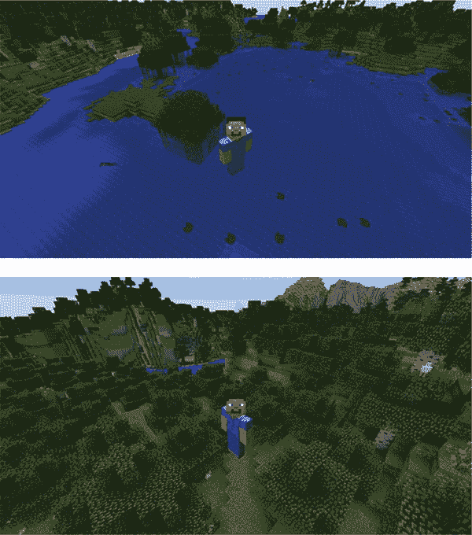
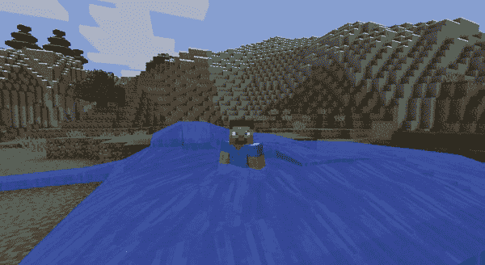
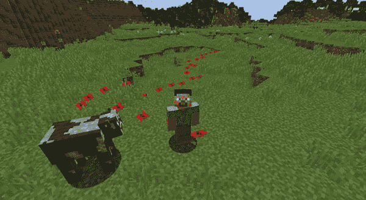
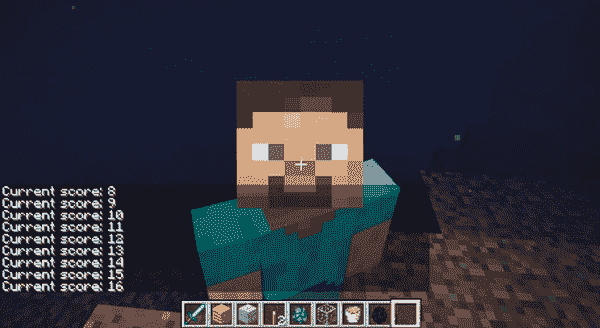
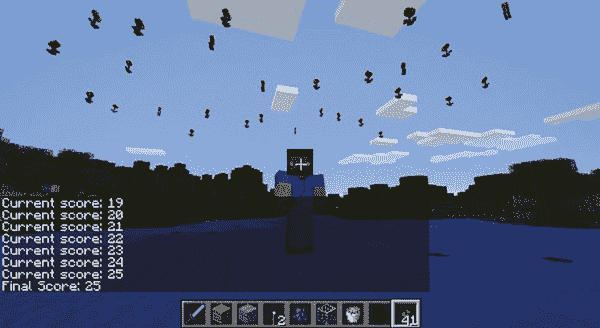
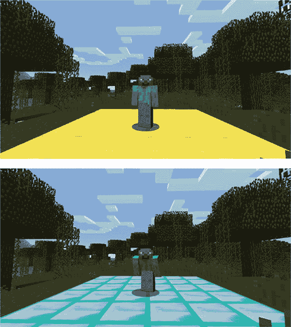
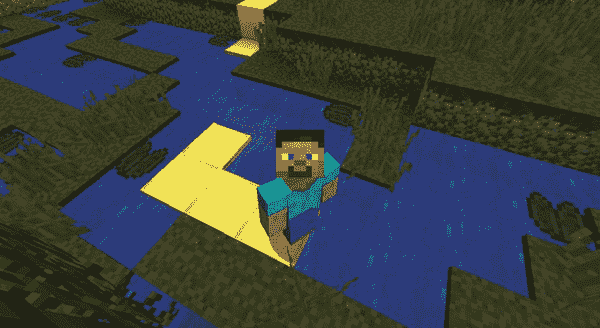
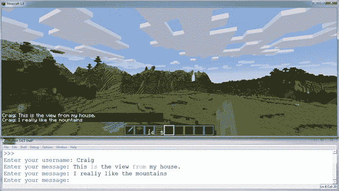
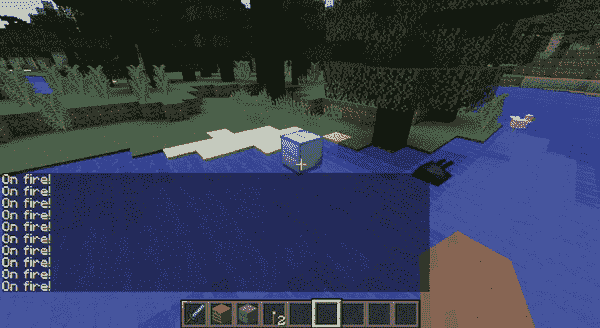

## 7

**使用`while`循环的舞会派对和花车游行**


*循环*使得重复执行代码变得更加容易。你无需复制粘贴相同的代码，而是可以使用循环按需重复代码。在本章中，你将使用循环来使程序重复执行，而无需重新运行它们。我们将重点讨论一种名为`while`循环的 Python 循环。

### 一个简单的`while`循环

你使用`while`循环来重复代码块。类似于`if`语句，`while`循环只要条件为`True`，就会执行其中的代码。也就是说，必须满足某个条件，语句的主体才会执行。

`while`循环和`if`语句之间的区别在于，`if`语句中的代码最多只会执行一次，而`while`循环中的代码可以重复执行多次。程序员称代码的重复执行为*迭代*。当一个循环重复时，我们说它*迭代*。

例如，这段代码使用`while`循环打印数字 1 到 5：

```
count = 1
while count <= 5:
    print(count)
    count += 1
print("Loop finished")
```

`count`变量记录循环已执行的次数。它从 1 开始。`while`循环中的条件检查`count`是否小于或等于 5。

**注意**

*在第三章中，你学到了`+=`是一个简写运算符。你也可以使用标准的加法运算符* `count = count + 1` *来做同样的事情。*

循环第一次运行时，`count`的值为`1`，小于 5。循环的条件为`True`，因此循环体执行。接下来，程序将`count`的值打印到 Python shell 中，然后将 1 加到`count`的值上。`while`循环现在重新开始，重新检查条件，逐步执行直到`count`变量大于 5。

循环外有最后一行，它会打印`"循环结束"`。

保存这个程序并运行，你应该看到以下输出：

```
1
2
3
4
5
Loop finished
```

尝试对代码做一些实验。修改条件，使其列出超过 5 个数字，或者更改`count`变量增加的数量。以下是代码如何工作的回顾。`while`语句遵循以下步骤：

1.  检查条件是否为`True`。

1.  如果条件为`True`：

    a. 执行代码体。

    b. 重复步骤 1。

1.  如果条件为`False`：

    a. 忽略代码体。

1.  继续到`while`循环块之后的行。

让我们尝试在 Minecraft 中使用`while`循环传送到许多新地点！

#### 任务 #33：随机传送之旅

在任务 #3（第 40 页）中，你将玩家传送到了游戏中的不同位置。让我们使用`while`循环重写那个程序，这样你就可以一遍又一遍地重复传送。

通过循环一些会将玩家传送到随机位置的代码，你可以使程序更强大且*更易于阅读*。酷吧？

以下代码通过为`x`、`y`和`z`变量在游戏世界中选取随机值，将玩家传送到一个随机位置。然后，它将使用这些变量设置玩家的位置。

```
   import random
   from mcpi.minecraft import Minecraft
   mc = Minecraft.create()

➊ # Add the count variable here
➋ # Start the while loop here
➌ x = random.randint(-127, 127)  # Indent the code from this line
   y = random.randint(0, 64)
   z = random.randint(-127, 127)

   mc.player.setTilePos(x, y, z)
➍ # Add 1 to the value of the count variable here
```

然而，现在代码只会传送玩家一次。虽然这已经挺酷了，但你可以让它变得更棒。让我们写一个循环，让代码重复五次，这样就变成了一个快速的世界之旅。

要将代码改成使用循环，按照以下四个步骤操作：

1.  创建一个`count`变量来控制循环 ➊。

1.  添加一个基于`count`的条件的`while`循环 ➋。

1.  缩进`while`语句的代码体 ➌。

1.  每次循环时增大`count`的值 ➍。

`count`变量和`count`增量的目的是跟踪循环重复的次数。接下来我会详细讲解它们。现在你需要知道的是，`count`让我们控制代码重复的次数。

示例 7-1 显示了添加更改后的代码。

*randomTeleport.py*

```
import random
from mcpi.minecraft import Minecraft
mc = Minecraft.create()

count = 0
while count < 5:
    x = random.randint(-127, 127)
    y = random.randint(0, 64)
    z = random.randint(-127, 127)
    mc.player.setTilePos(x, y, z)
    count += 1
```

*示例 7-1：让玩家在游戏世界中随机传送的代码*

将示例 7-1 复制到一个新文件中，保存为*randomTeleport.py*，并放入名为*whileLoops*的文件夹内，然后运行代码。你应该能看到玩家在 Minecraft 世界中快速移动。但代码运行得太快了！整个过程不到一秒钟就结束了。让我们一起来解决这个问题。

你将使用`time`模块来减慢代码的执行速度。按照以下步骤操作：

1.  在程序的第一行添加语句`import time`。这将导入 Python 的`time`模块，里面包含一组与时间相关的有用函数等。

1.  在`while`循环的代码体末尾添加`time.sleep(10)`这一行，给程序增加 10 秒的延迟。确保你缩进这行新代码，使其处于`while`循环内部！

保存程序并运行。现在，玩家应该每 10 秒钟传送到一个新的随机位置。图 7-1 显示了我运行程序的情况。



*图 7-1：每 10 秒钟，程序将我传送到一个新位置。*

**附加目标：好好休息**

目前，程序会在每次循环结束时等待 10 秒钟。如果你把`time.sleep(10)`语句移到循环开始处会发生什么呢？

### 使用计数变量控制循环

计数变量是存储程序重复次数的常见方式。你已经在之前的几个例子中看到过这些变量的使用。我们再来看一个例子：

```
count = 0
while count < 5:
    print(count)
    count += 1
```

`while`循环的条件测试`count`变量的值是否小于 5。在循环体内，我改变了`count`变量的值，以记录循环重复的次数。增加`count`变量的值叫做*增量*。

这段代码的最后一行将 `count` 变量的值增加 1。每次代码重复时，它会检查 `count` 变量的新值，看它是否小于 5。当它等于或大于 5 时，循环将停止。

如果你忘记增加 `count` 变量的值，你会陷入一个*无限循环*，这个循环将永远重复下去，正如下面的例子所示：

```
count = 0
while count < 5:
    print(count)
```

`count` 的值始终为 0，因为它从未被增加。因此，循环的条件始终为 `True`，循环将会*永远*重复。如果你不相信我，可以试着运行这段代码！

```
0
0
0
0
0
--snip--
```

要中断这个无限程序的执行，按下 CTRL-C。要修正代码，只需在循环体内添加一行 `count += 1`。现在你就不会被困在无限循环中了。呼！

计数并不总是必须每次增加 1。在某些情况下，你可能希望计数以不同的值增加。在下面的例子中，计数每次增加 2；结果是，代码打印出 0 到 100 之间的所有偶数：

```
count = 0
while count < 100:
    print(count)
    count += 2
```

你也可以通过使用负数来倒数，*减少* 计数的值。以下代码会从 100 倒数到 1：

```
count = 100
while count > 0:
    print(count)
    count -= 1
```

这个例子与之前的例子唯一的区别是条件。在这里我使用了大于比较符号（`>`）。只要 count 大于 0，循环就会继续；当 count 等于 0 时，循环停止。

**注意**

*用来控制循环的变量不一定总是叫做* `count`。*你可以将它命名为* `repeats` *或任何你想要的名称。如果你查看其他人的代码，你会看到各种各样的不同命名。*

#### 任务 #34: 水之诅咒

让我们尝试一些有点恶作剧的操作，给玩家写一个持续时间非常短的诅咒。在视频游戏中，诅咒可能会以某种方式*削弱*角色，比如让他们变慢或者变弱，通常持续时间较短。

我们将创建一个诅咒程序，每秒在玩家的位置放置一个流动水块，持续 30 秒。这将使玩家在不被水流推开的情况下很难移动。

以下代码会在玩家的位置放置一个流动水块：

*waterCurse.py*

```
from mcpi.minecraft import Minecraft
mc = Minecraft.create()

pos = mc.player.getPos()
mc.setBlock(pos.x, pos.y, pos.z, 8)
```

这段代码只会在玩家当前位置放置一个水块。你的任务是让它重复。最终的代码应该重复 30 次，每次循环持续 1 秒。

将这段代码保存为 *waterCurse.py* 文件，并放在 *whileLoops* 文件夹中，然后运行一次以确保它能正常工作。你应该会看到在程序停止之前，玩家的位置出现一个水块。

让我们讨论一下接下来需要添加什么，以让这个诅咒持续下去。使用你学到的 `while` 循环和 `count` 变量来完成以下任务：

1.  在程序中添加一个 `count` 变量。

1.  在程序中添加一个循环，重复执行最后两行代码。循环应该重复 30 次。

1.  在循环结束时增加 `count` 变量。

1.  导入`time`模块（在程序的第一行），然后在`while`循环的最后一行添加 1 秒的休眠。

保存程序并进行测试。当你在游戏世界中走动时，程序应该每秒创建一个水块，持续 30 秒。如果遇到困难，可以参考任务 #33（第 125 页）中的步骤获取帮助。

图 7-2 显示了这个诅咒的实际效果。



*图 7-2：哦不！我被一小股洪水追着跑。*

**额外目标：更快的洪水**

如何让循环以原来的两倍速度（每半秒一次）重复，同时仍然持续 30 秒？

#### 无限循环

在大多数情况下，`while`循环中的布尔条件最终必须变为`False`；否则，循环将永远执行下去，可能会导致计算机崩溃。

但有时你可能想编写一个无限循环。例如，视频游戏通常使用无限循环来检查用户输入并管理玩家的移动。当然，这些视频游戏会包含一个退出按钮，这样你就可以在需要休息时暂停或停止无限循环！

创建无限循环的一个简单方法是，当你定义`while`循环时使用`True`条件，如下所示：

```
while True:
    print("Hello")
```

这段代码将会永远重复，反复打印字符串`"Hello"`。无论你是否打算创建一个无限循环，按 CTRL-C 可以在 Python shell 中常见地停止它。在 IDLE 中，你也可以选择**Shell** ▸ **Restart Shell**来停止循环。

注意，任何位于无限`while`循环*之后*的代码都永远不会执行。在以下示例中，由于前面的无限`while`循环，最后一行代码无法执行：

```
while True:
    print("Hello")
print("This line is never reached")
```

尽管无限循环有时可能会有点棘手，但你也可以利用它来做很多有趣的事情。接下来我们就来尝试一下！

#### 任务 #35：花朵轨迹

你在这个任务中编写的程序类似于任务 #34 中的程序，但不是放置水块，而是让玩家身后留下花朵轨迹。花朵比洪水要漂亮多了！

打开*waterCurse.py*文件（位于*whileLoops*文件夹中），然后将其保存为*flowerTrail.py*。

为了让玩家在游戏中走动时，花朵能不断出现并形成一条无限轨迹，请对程序进行如下修改：

1.  将`while`循环的条件改为`True`。

1.  删除`count`变量和增量。

1.  将`setBlock()`函数中的块类型参数从`8`改为`38`。

1.  将`sleep()`函数中的参数值改为`0.2`，让每秒出现五朵花。

1.  保存程序并运行。图 7-3 显示了你应该看到的效果。



*图 7-3：看，所有美丽的花朵！*

**额外目标：一条毁灭的轨迹**

*flowerTrail.py*程序非常灵活。试着改变程序放置的方块类型。一个有趣的方块类型是爆炸性 TNT（`setBlock(x, y, z, 46, 1)`）。注意在`46`之后的额外参数`1`，它是 TNT 方块类型。`1`将 TNT 的状态设置为只要碰到它就会引爆，而不需要打火石和火柴。当你指向 TNT 时，连续点击鼠标左键几次，就能让它爆炸！

### 复杂条件

由于`while`循环期望其条件是一个布尔值，你可以使用到目前为止学到的所有比较符和布尔运算符。例如，你已经看到大于和小于运算符就像在之前的章节中一样使用。

但你也可以通过其他方式使用比较符和布尔运算符来控制`while`循环。让我们来看看！

我们将从编写一个更互动的条件开始。以下代码在循环开始之前创建了`continueAnswer`变量，并检查其值是否等于`"Y"`。请注意，我们不能使用`continue`作为变量名，因为它是 Python 中的保留字。

```
continueAnswer = "Y"
coins = 0
while continueAnswer == "Y":
    coins = coins + 1
    continueAnswer = input("Continue? Y/N")
print("You have " + str(coins) + " coins")
```

在`while`循环的最后一行，程序要求用户输入。如果用户输入除`"Y"`之外的任何内容，循环将结束。用户可以重复按下 Y、Y、Y，每次`coins`变量的值都会增加 1。

请注意，正在检查的变量`continueAnswer`是在循环开始之前创建的。如果没有创建，程序会显示错误。因此，我们用来测试条件的变量必须在使用之前就存在，并且在程序第一次进入`while`循环时，变量的值必须为`True`；否则，条件将不成立，`while`循环的主体语句将永远不会执行。

#### 任务 #36: 潜水比赛

让我们用`while`循环和相等运算符（`==`）来玩得开心。在这个任务中，你将创建一个小游戏，让玩家尽可能长时间地潜水。程序会记录他们在水下停留的时间，并在程序结束时显示他们的得分。如果玩家在水下停留超过 6 秒，程序将为他们洒下鲜花，祝贺他们。

下面是一些代码，帮助你入门：

*divingContest.py*

```
   from mcpi.minecraft import Minecraft
   mc = Minecraft.create()
   import time

   score = 0
   pos = mc.player.getPos()
➊ blockAbove = mc.getBlock(pos.x, pos.y + 2, pos.z)

➋ # Add a while loop here
   time.sleep(1)
   pos = mc.player.getPos()
➌ blockAbove = mc.getBlock(pos.x, pos.y + 2, pos.z)
➍ score = score + 1
   mc.postToChat("Current score: " + str(score))

   mc.postToChat("Final score: " + str(score))

➎ if score > 6:
       finalPos = mc.player.getTilePos()
       mc.setBlocks(finalPos.x - 5, finalPos.y + 10, finalPos.z - 5,
                    finalPos.x + 5, finalPos.y + 10, finalPos.z + 5, 38)
```

将程序保存为*divingContest.py*，并放在你的*whileLoops*文件夹中。`score`变量用于记录玩家在水下停留的时间（秒数）。

运行代码看看会发生什么。此时程序还未完成：它只会检查玩家是否在水下一次，然后结束。

在你修复此问题之前，让我们看看代码的其余部分。`blockAbove` 变量存储位于玩家头顶的方块类型 ➊。例如，如果玩家的头在水下，这个变量将存储一个值 8（表示该方块是水）。稍后在代码中，你将重新设置 `blockAbove` 存储玩家头顶上方方块的值 ➌，这样当你创建 `while` 循环时，它会将 `blockAbove` 更新为玩家头顶当前的方块类型。在 ➍，程序会为玩家每在水下待一秒钟，给总分加 1 分；而在 ➎，它会使用 `if` 语句，如果得分大于 6，就在玩家头顶上方生成花朵雨。

你需要在程序中添加一个循环，使用 `blockAbove` 变量作为条件，位置在 ➋。使 `while` 循环检查 `blockAbove` 是否等于水（方块类型 8）或等于流动水（方块类型 9）。你可以在 while 循环中使用以下条件来检查：`while blockAbove == 8 or blockAbove == 9`。这会检查玩家当前是否在水下，并在每次循环重复时继续检查玩家是否在水下。

要测试你的程序，找到至少三格深的水并跳进去。程序只会在你已经在水下时运行。当你运行程序时，它应该开始显示你在水下的秒数。过一会儿，游到水面。程序应该显示你的得分，如果你在水下呆了 6 秒或更长时间，还会洒上花朵。图 7-4 显示了玩家在水下且得分已显示。图 7-5 显示了获胜时出现的花朵。



*图 7-4：我正在水下屏住呼吸，显示的是我在水下待的秒数。*



*图 7-5：我赢得了属于自己的花朵庆祝！*

**奖励目标：你是赢家**

尝试通过在程序结尾的 `if` 语句中编写更多代码来添加额外的奖励。如果玩家得分很高，你可以给他们一个金块。试着为每个难度级别添加不同的奖励。

#### 布尔运算符与 while 循环

当你希望循环使用多个条件时，可以在 `while` 循环中使用布尔运算符，如*and*、*or*和*not*。例如，以下循环将在用户未输入正确密码且尝试次数不超过三次时进行迭代：

```
   password = "cats"
   passwordInput = input("Please enter the password: ")
   attempts = 0

➊ while password != passwordInput and attempts < 3:
➋     attempts += 1
➌     passwordInput = input("Incorrect. Please enter the password: ")

➍ if password == passwordInput:
       print("Password accepted.")
```

`while` 循环条件 ➊ 执行了两项任务：它检查密码是否与用户输入的不同（`password != passwordInput`），并检查用户是否尝试输入密码不超过三次（`attempts < 3`）。`and` 操作符使 `while` 循环能够同时检查这两个条件。如果条件为 `False`，循环会增加 `attempts` 变量 ➋ 并要求用户重新输入密码 ➌。如果用户输入了正确的密码或 `attempts` 变量大于 3，循环将结束。循环结束后，程序将输出 `Password accepted`，前提是用户输入了正确的密码 ➍。

#### 检查 while 循环中值的范围

你还可以使用 `while` 循环检查某个范围内的值。例如，以下代码检查用户输入的值是否在 0 和 10 之间。如果不是，循环将退出。

```
   position = 0
➊ while 0 <= position <= 10:
       position = int(input("Enter your position 0-10: "))
       print(position)
```

如果 `position` 变量大于 10，循环将不会重复 ➊。如果值小于 0 也会如此。这在 Minecraft 中非常有用，当你检查玩家是否处于游戏中的某个特定区域时，正如你在下一个任务中将会看到的。

#### 任务 #37：制作一个舞池

该跳舞时间到了！但在你能展现舞步之前，你需要一个舞池。本任务中的程序会生成一个舞池，并且只要玩家站在舞池上，舞池就会每半秒改变一次颜色。

以下是代码的开头。它在玩家当前的位置创建一个舞池，并使用 `if` 语句改变颜色。但代码尚未完成。

*danceFloor.py*

```
   from mcpi.minecraft import Minecraft
   mc = Minecraft.create()
   import time

   pos = mc.player.getTilePos()
   floorX = pos.x – 2
   floorY = pos.y - 1
   floorZ = pos.z – 2
   width = 5
   length = 5
   block = 41
➊ mc.setBlocks(floorX, floorY, floorZ,
                floorX + width, floorY, floorZ + length, block)

➋ while floorX <= pos.x <= floorX + width and # Check z is within the floor
➌     if block == 41:
           block = 57
       else:
           block = 41
       mc.setBlocks(floorX, floorY, floorZ,
                    floorX + width, floorY, floorZ + length, block)
       pos = mc.player.getTilePos()
       time.sleep(0.5)
```

打开 IDLE，创建一个新文件，并将程序保存为 *danceFloor.py* 在 *whileLoops* 文件夹中。代码根据玩家的当前位置➊构建舞池，并将舞池的位置和大小存储在 `floorX`、`floorY`、`floorZ`、`width` 和 `length` 变量中。在 `while` 循环内部，代码使用 `if` 语句交替改变构成舞池的方块 ➌，使得舞池看起来像是在闪烁。

为了让程序正常工作，你需要修改 `while` 循环的条件，检查玩家的 z 坐标是否在舞池上➋。换句话说，检查 `pos.z` 是否大于或等于 `floorZ` 并且小于或等于 `floorZ` 加 `length`。为了指导你，看看我是如何通过使用（`floorX <= pos.x <= floorX + width`）来检查 `pos.x` 是否在舞池上的。图 7-6 展示了舞池的实际效果！



*图 7-6：我在舞池上展示我的舞步。*

完成程序后，保存并运行它。玩家下方应该会出现一个舞池，并且每半秒钟改变一次。跳一会儿舞——玩得开心！完成后，离开舞池，确保它停止闪烁。除非重新运行程序来创建新的舞池，否则它不会再次开启。

**附加目标：派对结束**

当玩家在舞池中跳舞完成后，让舞池消失。为此，当循环结束时，将舞池更改为空气。

#### 嵌套 IF 语句与 WHILE 循环

你可以通过在 `while` 循环中使用 `if` 语句和嵌套的 `if` 语句来编写更强大的程序。你可能已经注意到，在 任务 #37 (第 135 页) 的代码中使用了一个嵌套的 `if` 语句。

在下面的示例中，嵌套的 `if` 语句检查最后打印的单词，并决定是否打印单词 `"mine"` 和 `"craft"`。循环重复 50 次。

```
word = "mine"
count = 0
while count < 50:
    print(word)
    if word == "mine":
        word = "craft"
   else:
        word = "mine"
```

`word` 变量存储将要打印的第一个单词。循环中的 `if` 语句检查当前单词是否为 `"mine"`，如果是，它将把单词更改为 `"craft"`，并在下一个循环迭代中打印该单词。如果单词不是 `"mine"`，它将被更改为 `"mine"`。这是一个无限循环，所以请确保使用 CTRL-C 来退出！

你还可以在 `while` 循环中嵌套 `elif` 语句和其他 `while` 循环。

以下程序会询问用户是否希望打印出从 1 到 100 万之间的所有数字：

```
   userAnswer = input("Print the numbers between 1 and 1000000? (yes/no): ")

➊ if userAnswer = "yes":
       count = 1
➋     while count <= 1000000:
           print(count)
           count += 1
```

`if` 语句检查用户的输入是否为 `yes` ➊。如果是，程序将运行嵌套在 `if` 语句中的循环 ➋。如果输入的是其他内容，程序将不会运行该循环，并将结束。

#### 任务 #38：米达斯的触摸

米达斯是一个传奇中的国王。他所触及的所有东西都会变成黄金。你的任务是编写一个程序，将玩家下面的每一块地板都变成黄金——当然，空气和水除外，否则你会陷入麻烦！请记住，黄金块的值是 41，静水的值是 9，空气的值是 0。

*midas.py*

```
   from mcpi.minecraft import Minecraft
   mc = Minecraft.create()

   air = 0
   water = 9

➊ # Add an infinite while loop here
       pos = mc.player.getTilePos()
       blockBelow = mc.getBlock(pos.x, pos.y - 1, pos.z)

➋     # Add if statement here
           mc.setBlock(pos.x, pos.y - 1, pos.z, 41)
```

打开 IDLE 并创建一个新文件。将文件保存为 *midas.py*，并放入 *whileLoops* 文件夹中。你需要在程序中添加更多内容，以便它能完成你需要的操作。首先，你将添加一个无限的 `while` 循环 ➊。记住，无限 `while` 循环的条件总是 `True`。你还需要添加一个 `if` 语句，用来检查玩家下面的方块既不等于空气也不等于静水 ➋。玩家下面的方块的值存储在 `blockBelow` 变量中，空气和水的值分别存储在 `air` 和 `water` 变量中。

当你完成程序后，保存并运行它。玩家应在身后留下黄金的足迹。当你跳入水中或飞上空中时，你下面的方块不应该发生变化。图 7-7 显示了程序运行的效果。



*图 7-7：我走过的每一块地板都变成了黄金。*

要退出无限循环，进入 **Shell** ▸ **Restart Shell**，在 IDLE shell 中或点击 shell 并按 CTRL-C。

**附加目标：我是一个犁耕者**

你可以修改*midas.py*以实现各种功能。你会如何修改它，使其自动将泥土方块转换为耕地？那如果将泥土方块转换为草方块呢？

### 使用 BREAK 结束 WHILE 循环

使用`while`循环时，你可以完全控制循环的开始和结束。到目前为止，你只使用条件来结束循环，但你也可以使用`break`语句。`break`语句让你的代码立即退出`while`循环。我们来看看这个概念！

使用`break`语句的一种方法是将其放入嵌套在循环中的`if`语句中。这样，当`if`语句的条件为`True`时，循环会立即停止。以下代码会不断请求用户输入，直到他们输入`"exit"`：

```
➊ while True:
➋    userInput = input("Enter a command: ")
➌    if userInput == "exit":
➍        break
      print(userInput)
➎ print("Loop exited")
```

这是一个无限循环，因为它使用了`while True` ➊。每次循环重复时，它都会请求用户输入命令 ➋。程序通过`if`语句检查输入是否为`"exit"` ➌。如果输入符合条件，`break`语句会停止循环的重复 ➍，程序会继续执行循环体之后的代码，并在 Python Shell 中打印`"Loop exited"` ➎。

#### 任务 #39：创建一个带循环的持久聊天

在任务 #13（第 72 页）中，你创建了一个使用字符串、输入和输出将用户消息发布到聊天的程序。尽管这个程序很有用，但因为每次发布新消息时都需要重新运行程序，所以它的功能非常有限。

在这个任务中，你将通过使用`while`循环改进你的聊天程序，让用户可以在不重新启动程序的情况下发送任意数量的消息。

打开*userChat.py*文件（位于*strings*文件夹中），然后将其另存为*chatLoop.py*，保存在*whileLoops*文件夹中。

要在不重新运行程序的情况下每次发布新消息，向你的代码添加以下内容：

1.  将一个无限的`while`循环添加到程序中。

1.  向循环中添加一个`if`语句，检查用户的输入是否为`"exit"`。如果输入是`"exit"`，循环应当中断。

1.  确保在循环开始之前定义好`userName`变量。

当你添加完更改后，保存你的程序并运行它。Python Shell 会提示你输入用户名。输入后按 ENTER 键。然后程序会要求你输入一条消息。输入一条消息后按 ENTER 键。程序会继续要求你输入消息，直到你输入`exit`为止。图 7-8 展示了我的聊天程序运行情况。



*图 7-8：我在和自己聊天。*

**奖励目标：方块聊天**

扩展聊天功能，让用户能够创建方块。例如，如果用户输入`"wool"`，程序将创建一个羊毛方块。你可以通过向`if`语句中添加`elif`语句来检查用户输入。

#### WHILE-ELSE 语句

像`if`语句一样，`while`循环也可以有由`else`语句触发的次要条件。

`else`语句在`while`语句的条件为`False`时执行。与`while`语句的主体不同，`else`语句只会执行一次，如下所示：

```
message = input("Please enter a message.")

while message != "exit":
    print(message)
    message = input("Please enter a message.")
else:
    print("User has left the chat.")
```

这个循环会在输入的`message`不等于`"exit"`时一直重复。如果`message`是`"exit"`，循环将停止重复，`else`语句的内容将打印`"User has left the chat."`

如果你在`while`语句中使用了`break`语句，`else`语句将不会执行。以下代码与前面的示例类似，但包含一个嵌套的`if`语句和一个`break`语句。当用户输入`abort`而不是`exit`时，聊天循环将退出，而不会打印`"User has left the chat."`的消息。

```
message = input("Please enter a message.")

while message != "exit":
    print(message)
    message = input("Please enter a message.")
    if message == "abort":
        break
else:
    print("User has left the chat.")
```

`if` 语句检查输入的消息是否为`"abort"`。如果为`True`，则执行`break`语句，循环将退出。因为使用了`break`语句，所以`else`语句的内容不会执行，`"User has left the chat."`也不会被打印。

#### 任务 #40：热与冷

在这个任务中，我们将在《Minecraft》中创建一个“热与冷”游戏。如果你从未玩过，游戏的规则是你的朋友隐藏一个物体，而你需要找到它。你的朋友会根据你离物体的远近给你提示。如果你很近，他们会说“热”，如果很远，他们会说“冷”。当你站在物体旁边时，他们会说“你着火了！”，如果你很远，他们会说“冰冻！”

游戏的目标是找到并站在随机放置在游戏世界中的钻石方块上。在这个版本的游戏中，你将单独玩，Python 程序会告诉你距离隐藏方块的远近。当你站在钻石方块上时，游戏结束。

列表 7-2 将一个方块放置在随机位置。

*blockHunter.py*

```
   from mcpi.minecraft import Minecraft
   import math
   import time
   import random
   mc = Minecraft.create()

   destX = random.randint(-127, 127)
   destZ = random.randint(-127, 127)
➊ destY = mc.getHeight(destX, destZ)

   block = 57
➋ mc.setBlock(destX, destY, destZ, block)
   mc.postToChat("Block set")

   while True:
       pos = mc.player.getPos()
➌     distance = math.sqrt((pos.x - destX) ** 2 + (pos.z - destZ) ** 2)

➍     if distance > 100:
           mc.postToChat("Freezing")
       elif distance > 50:
           mc.postToChat("Cold")
       elif distance > 25:
           mc.postToChat("Warm")
       elif distance > 12:
           mc.postToChat("Boiling")
       elif distance > 6:
           mc.postToChat("On fire!")
       elif distance == 0:
➎          mc.postToChat("Found it")
```

*列表 7-2：热与冷程序的开始部分*

在随机放置方块之前，程序确保方块不会被放置在地下。为此，它使用`getHeight()`函数 ➊，该函数找到游戏中任何位置的最高 y 坐标的方块（即地面上的方块）。然后，它在随机位置 ➋ 放置一个钻石方块。

➌ 处的代码计算到钻石方块的距离。它使用`sqrt()`函数，该函数位于`math`模块中——这就是为什么程序开始时需要`import math`的原因。`sqrt()`函数计算一个数的平方根。

**注意**

*列表 7-2 使用了一个叫做*毕达哥拉斯定理*的公式。*该公式使用三角形的两边来计算第三边的长度。在这种情况下，我使用玩家到隐藏方块在 x 轴和 z 轴的距离来计算到隐藏方块的直线距离。*

程序显示的信息取决于你距离方块的远近，你可以通过`if`语句和`distance`变量  ➍ 来确定。当你远离方块时，程序会显示 `"Freezing"`，而当你非常接近时，程序会显示 `"On fire!"`。

将清单 7-2 复制到 IDLE 中新文件中，并将程序保存为*blockHunter.py*，存放在*whileLoops*文件夹内。

目前程序是可以运行的，但当你找到方块时并不会结束。要完成代码，你需要在玩家与方块的距离为 0 时添加一个`break`语句➎。

完成程序后，保存并运行它。程序会生成一个随机方块，你需要找到它。当你找到并站在方块上时，程序应该停止。图 7-9 显示了我刚刚找到了方块。



*图 7-9：我已经找到了方块，现在只需要站在上面。*

**额外目标：时间就是时间**

*blockHunter.py*程序会给你足够的时间来找到方块。你能想到一种方法来显示玩家找到方块所花的时间，或者甚至限制他们玩游戏的时间吗？

### 你学到了什么

做得好！你已经学到了很多关于`while`循环的知识。你可以创建`while`循环和无限`while`循环，并且能够使用带条件和布尔运算符的循环。通过使用循环，你现在可以编写重复代码的程序，这样可以节省大量时间，让你可以专注于掌握 Minecraft。在第八章中，你将学习另一种使用函数使代码可重用的方法。
