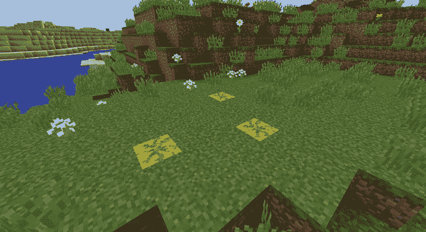
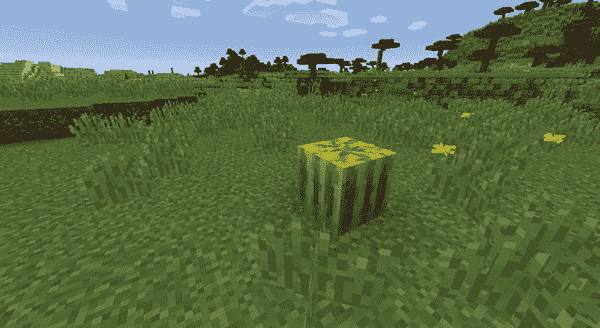
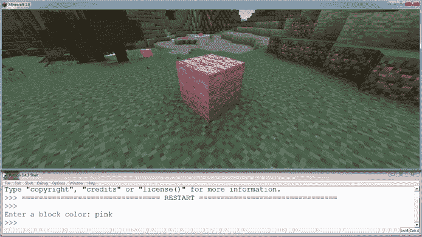
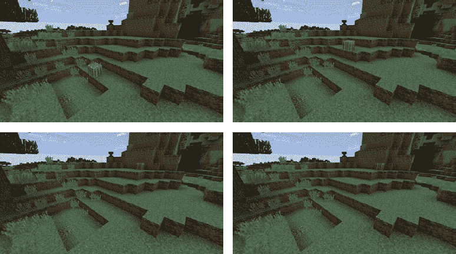

## **8**

**函数赋予你超能力**


函数是可重用的代码块，执行特定的任务。假设你想写一段代码在 Minecraft 中构建一棵树。你可以在每次需要使用时重新编写构建树的代码（或复制粘贴）；然而，这样做效率低下，尤其是在你需要修改代码时。

与其复制粘贴代码，你可以将构建树的代码写成一个*函数*。回想一下，我们在前面的章节中使用了一些函数：`str()`、`input()` 和 `int()`。它们都是 Python 内置的函数。你甚至已经在使用 Minecraft 函数，比如 `getBlocks()` 和 `setPos()` 函数，它们是随 Minecraft Python API 提供的。在本章中，你将创建你*自己的*函数。

你创建并使用函数的原因如下：

**可重用性** 函数节省时间。因为你不需要一次又一次地重写相同的代码，编写程序变得更快也更容易。

**调试** 通过将任务分组到代码块中，能够更容易地识别问题的来源并进行修改来修复问题。

**模块化** 你可以在同一个程序中独立开发不同的功能。这样可以更方便地与他人共享代码，并在其他程序中重用功能。

**可扩展性** 使用函数可以更容易地增加程序的规模和它处理的数据量。

### **定义你自己的函数**

让我们来看一下如何在代码中使用函数。在下面的例子中，我创建了一个名为 `greeting()` 的函数，它只是简单地打印两行：

```
def greeting():
    print("Hello")
    print("Nice to meet you")
```

`def` 关键字是 *define* 的缩写，告诉 Python 你正在编写一个函数。每当你想编写一个函数时，必须先写 `def`，然后是函数的名称。在这个例子中，`greeting` 是函数的名称。不要忘记在第一行末尾加上括号和冒号。冒号后面的代码行是函数的*主体*，也就是在调用函数时执行的代码。

**注意**

*保持代码缩进的一致性。始终使用四个空格缩进函数体。*

一个函数可以包含任意多的语句。它还可以包括 `if` 语句、循环、变量、条件、数学运算符等等。当你到达函数代码的结尾时，停止缩进代码行，这样 Python 就知道哪些语句属于函数，哪些语句属于代码的其他部分。

你可以在一个程序中创建任意多个函数，只要它们的名称不同。

#### **调用函数**

要使用或*调用*一个函数，你需要在括号中写出函数的名称及其可能需要的任何参数。如果你的函数不需要任何参数，只需写出函数名称和一对空括号。

要调用之前定义的 `greeting()` 函数，你可以使用以下代码：

```
greeting()
```

你可以根据需要调用这个函数多次。让我们调用`greeting()`函数三次：

```
greeting()
greeting()
greeting()
```

当你运行程序时，它应该会产生函数的输出三次，如下所示：

```
Hello
Nice to meet you
Hello
Nice to meet you
Hello
Nice to meet you
```

你必须在代码的主体中调用这个函数，否则函数不会做任何事情。这是一个常见的错误。如果你运行一个定义了函数的程序，但代码没有任何反应，那可能是因为你忘记调用你创建的函数。

你也可以在另一个你创建的函数中调用函数。这些函数包括内置的 Python 函数，以及你自己创建的函数。你稍后会看到这个功能的实际应用。

#### **函数接受参数**

函数中的括号包含它的参数，这些是函数在运行时使用的值。这些值会在函数内部用于特定的变量。并不是每个函数都需要参数。例如，`greeting()`函数不接受参数。

假设我想要用某人的名字展示一个问候。我将把它写成一个函数，这样我就可以重用这段代码来向不同的人问好：

```
def fancyGreeting(personName):
    print("Hello, " + personName)

fancyGreeting("Mario")
fancyGreeting("Steve")
```

在这个示例中，函数被使用了两次，传入不同的参数，分别是`"Mario"`和`"Steve"`。当你运行程序时，输出如下所示：

```
Hello, Mario
Hello, Steve
```

如果你在调用一个需要参数的函数时忘记提供参数，你会得到一个错误。同样，如果一个函数需要多个参数，而你忘记提供其中任何一个，你也会得到错误。例如，让我们尝试调用`fancyGreeting()`函数时没有提供任何参数，像这样：

```
fancyGreeting()
```

会显示以下错误信息：

```
   Traceback (most recent call last):
     File "<pyshell#2>", line 1, in <module>
       fancyGreeting()
➊ TypeError: fancyGreeting() takes exactly 1 argument (0 given)
```

这是一个有用的错误信息，因为最后一行解释了代码出错的原因 ➊。`fancyGreeting()`函数接受一个参数，但因为没有提供参数，导致了这个错误。

你可以创建一个接受多个参数的函数。例如，下面的程序包含一个函数，能够向某人打招呼，等待一段时间，然后说再见。该函数使用一个参数来表示人的名字和程序将等待的秒数：

```
   import time

➊ def helloAndGoodbye(personName, secsToWait):
       print("Hello, " + personName)
       time.sleep(secsToWait)
       print("Goodbye, " + personName)

➋ helloAndGoodbye("Mario", 10)
   helloAndGoodbye("Steve", 23)
```

每个参数在定义函数时由逗号分隔 ➊。然后，当函数被调用时，参数会按定义时的顺序传入 ➋。

**注意**

*你可能会遇到*参数 *和*参数值 *这两个术语几乎可以互换使用。函数的参数定义了它接受或需要的参数类型，而参数值是你在调用函数时传递给它的值。为了简便起见，本书中我们将只使用*参数 *这个术语。*

#### **任务 #41：建立一个森林**

你的任务是创建一个 Minecraft 中的森林。因为森林其实就是一堆树，所以我们将通过创建一个构建单棵树的函数，然后多次调用这个函数来创建森林。

清单 8-1 是你将使用的基础代码。

*forest.py*

```
   from mcpi.minecraft import Minecraft
   mc = Minecraft.create()

➊ def growTree(x, y, z):
       # Creates a tree at the coordinates given
       # Write your code to make a tree here

   pos = mc.player.getTilePos()
   x = pos.x
   y = pos.y
   z = pos.z

➋ growTree(x + 1, y, z)
```

*清单 8-1：一个使用函数创建森林的程序结构*

这个代码中创建的`growTree()`函数 ➊ 需要接收树木要建造的坐标作为参数。你的任务是在函数体内编写代码，在给定的坐标处创建一棵树。你将使用`setBlock()`和`setBlocks()`函数来完成这项工作。

将清单 8-1 复制到 IDLE 中的新文件，并将其保存为*forest.py*，存放在名为*functions*的新文件夹中。

当你创建了一个类似树形的结构并将其显示在屏幕上时，尝试使用不同的参数编写更多的函数调用，以便树木出现在不同的位置。第一个已经为你做了 ➋。每次运行程序时，尝试在玩家面前创建至少九棵树。图 8-1 展示了我程序创建的树木。


*图 8-1：我刚刚种下了一排美丽的树木。*

**附加目标：随机森林**

使用`random`模块中的`randint()`函数随机化森林中树木之间的距离。

#### **重构程序**

很多时候，你会写一个多次使用相同代码块的程序。当你需要在不同地方修改相同代码时，这将变得非常繁琐。你可能在过去写的程序中也做过这种操作，但其实有更好的方法。

你可以重构你的程序以使用函数。为此，将多次重复的代码移入一个单一的函数中，然后在其余的代码中随时调用。因为你只需要在一个地方进行修改而不是多个地方，这样你不仅节省空间，程序也更容易维护。将代码重构为这种方式的过程称为*重构*。

例如，以下代码会询问三个人的名字，然后向每个人打印问候语：

```
name1 = input("Hello, what is your name?")
print("Pleased to meet you, " + name1)
name2 = input("Hello, what is your name?")
print("Pleased to meet you, " + name2)
name3 = input("Hello, what is your name?")
print("Pleased to meet you, " + name3)
```

这里的代码重复了相同的两行代码三次。如果你想要更改问题或问候语，会有什么问题吗？对于 3 个人，修改代码不成问题，但如果你要为 100 个人编写代码呢？

另一种方法是将代码写成一个函数，并调用三次。以下是重构后的代码：

```
def helloFriend():
    name = input("Hello, what is your name?")
    print("Pleased to meet you, " + name)

helloFriend()
helloFriend()
helloFriend()
```

现在，当程序运行时，它将要求输入并输出一个字符串，并且它将执行这两个任务三次。以下是输入和输出：

```
Hello, what is your name? Craig
Pleased to meet you, Craig
Hello, what is your name? Still Craig
Pleased to meet you, Still Craig
Hello, what is your name? Craig again
Pleased to meet you, Craig again
```

代码的第二个版本与第一个版本的结果相同，但正如你所看到的，它更易于阅读，也更容易修改。

#### **任务 #42：重构代码**

有时你会写一个程序，事后才意识到其实应该使用函数（我经常这样做）。将代码重构为使用函数是一个非常重要的技能。

在这个任务中，你将练习将程序重构为使用函数，而不是多次重复相同的语句。

列表 8-2 每 10 秒在玩家下方放置一个甜瓜方块。我们将重写代码，使用函数。目前，程序通过同一行代码重复三次来放置三个方块。图 8-2 展示了程序的结果。

*melonFunction.py*

```
from mcpi.minecraft import Minecraft
mc = Minecraft.create()

import time

pos = mc.player.getPos()
x = pos.x
y = pos.y
z = pos.z
mc.setBlock(x, y - 1, z, 103)
time.sleep(10)

pos = mc.player.getPos()
x = pos.x
y = pos.y - 1
z = pos.z
mc.setBlock(x, y, z, 103)
time.sleep(10)

pos = mc.player.getPos()
x = pos.x
y = pos.y - 1
z = pos.z
mc.setBlock(x, y, z, 103)
time.sleep(10)
```

*列表 8-2：需要重构的代码*

这段代码不太好看，是吧？有几行是重复的，这总是表明代码需要通过函数定义来重构。

**提示**

*识别出代码中重复的部分，以便了解你的函数应该做什么。*



*图 8-2：地下的三颗美味的甜瓜*

修改代码，使其总共放置六个方块，通过调用你的函数六次来实现。创建一个新文件并将其保存为*melonFunction.py*，放入*functions*文件夹中。将列表 8-2 复制到文件中，并重构代码以使用函数。将新函数命名为`makeMelon()`。

**附加目标：脚下的方块**

向`makeMelon()`函数添加参数，以控制方块的类型、休眠时间或玩家下方的距离。

#### **使用文档字符串进行注释**

在 Python 代码中使用注释是解释代码功能的一种方式。当 Python 运行程序时，它会忽略注释中的所有内容，因此注释不会影响代码的运行。注释的主要目的是向其他可能查看或使用你代码的人解释你的代码应该做什么。注释也是你自己未来的有用提醒。

由于函数应该是可重用的，因此解释它们的目的非常重要。为了编写我们的函数解释，我们将使用长注释，这就是所谓的*文档字符串*。文档字符串是放置在函数开始处的多行注释，用于解释函数的用途。

以下示例中的`duplicateWord()`函数有一个文档字符串，解释了它的任务：

```
   def duplicateString(stringToDbl):
➊     """ Prints a string twice on the same line.
       stringToDbl argument should be a string """
       print(stringToDbl * 2)
```

函数的文档字符串应该位于函数的第一行 ➊。文档字符串以三重引号（`"""`）开始和结束，可以跨多行书写，视需要而定。

#### **参数中的换行符**

为了让程序员更容易阅读长参数列表，Python 允许你将参数拆分成多行。例如，程序中的函数调用将参数拆分成多行，以提高可读性：

```
from mcpi.minecraft import Minecraft
mc = Minecraft.create()

pos = mc.player.getPos()
width = 10
height = 12
length = 13
block = 103
mc.setBlocks(pos.x, pos.y, pos.z,
             pos.x + width, pos.y + height, pos.z + length, block)
```

在参数中使用换行符特别有用，当你想在参数上使用数学运算符时，或者当你使用长变量名作为参数，或者当你有多个参数要传递给一个函数时。

#### **函数返回值**

函数有两种类型：一种是返回值的，另一种是没有返回值的。到目前为止，你创建的函数都是没有返回值的。现在让我们来看一下返回值的函数。

从函数返回一个值非常有用，因为它允许函数处理数据并将值返回给程序的主体。例如，假设你在卖饼干。为了计算每个饼干的售价以赚取足够的利润，你需要在你支付的饼干成本基础上加上两枚金币，然后将总和乘以 10。通过使用一个返回值的函数，你可以编写这个计算并在 Python 中重用它。

在编写你自己的函数时，你可以使用`return`关键字从函数返回一个值。例如，这里是计算饼干售价的代码：

```
def calculateCookiePrice(cost):
    price = cost + 2
    price = price * 10
    return price
```

要返回一个值，你只需写`return`后跟你想要的值，在这个例子中是`price`。要使用返回值的函数，你需要在期望值的地方调用它。例如，要设置`priceOfCookie`变量，调用`calculateCookiePrice()`函数并输入一个费用，比如`6`：

```
priceOfCookie = calculateCookiePrice(6)  # Value will be 80
```

你可以使用返回值的函数来设置变量的值，并且可以在任何需要值的地方使用它们，甚至作为另一个函数的参数。

不返回值的函数不能用来设置变量的值。让我们快速看一下它们之间的区别。

因为下面的函数会返回一个值，它可以在任何可以使用值的地方使用，比如设置变量，甚至作为另一个函数调用的参数：

```
def numberOfChickens():
    return 5

coop = numberOfChickens()
print(numberOfChickens())
```

运行这段代码来查看它的输出。你可以像对待一个值一样处理函数的返回结果，甚至对其进行数学运算。在这里，我将返回的值加上 4，并将其存储在一个名为`extraChickens`的变量中：

```
extraChickens = 4 + numberOfChickens()  # Value of 9
```

然而，下面的函数没有`return`语句，这意味着你不能将它用作值。你只能调用该函数：

```
def chickenNoise():
    print("Cluck")

chickenNoise()
```

在文本编辑器中编写这段代码并运行它会打印`"Cluck"`，尽管它不能在其他语句中使用，因为它没有返回值给程序。例如，我可以尝试将函数与字符串连接，像这样：

```
multipleNoises = chickenNoise() + ", Bork"
```

如果我运行这个程序，我将得到以下错误信息：

```
Traceback (most recent call last):
  File "<pyshell#3>", line 1, in <module>
    multipleNoises = chickenNoise + ", Bork"
TypeError: unsupported operand type(s) for +: 'function' and 'str'
```

这个错误意味着你不能将此函数与字符串组合使用，因为该函数不返回值。

然而，如果我将代码更改为返回一个值，而不是仅仅打印它：

```
def chickenNoise():
    return "Cluck"

multipleNoises = chickenNoise() + ", Bork"
print(multipleNoises)
```

文件会运行并显示以下输出：

```
Cluck, Bork
```

记住这个区别。当你需要时，记得包含`return`语句，当你的函数不需要返回值时，省略它。随着你在函数方面经验的积累，决定是否让你的函数返回一个值会变得更加容易。

#### **任务 #43：块 ID 提醒**

因为 Minecraft 有这么多块，所以很难记住所有的块 ID。我总是记得西瓜（103）和空气（0）的值，但忘记了其他的，所以我总是不得不用西瓜来建造房子！

为了更容易记住，我希望你为我创建一个程序，返回不同方块的值。你的程序应该有多个函数，帮助我记住方块 ID。每个函数的名称应该和它返回的方块的名称相同。例如，列表 8-3 中有一个名为`melon()`的函数，它返回西瓜方块的值（103）。

*blockIds.py*

```
def melon():
    """ Returns the value of the melon block """
    return 103
```

*列表 8-3：帮助我记住方块 ID 的程序起始部分*

在 IDLE 中创建一个新文件，并将其保存为*blockIds.py*，放在*functions*文件夹中。将列表 8-3 的代码复制到该文件中，并为它添加返回以下方块值的函数（参见方块 ID 备忘单，在第 283 页）：

• 水

• 羊毛

• 熔岩

• TNT

• 花

• 钻石方块

在添加了你的函数后，通过调用这些函数来创建方块进行测试。由于你的新函数返回方块的值，你可以使用它们来设置变量的值，并将其传递给`setBlock()`函数。以下代码将帮助你开始：

```
from mcpi.minecraft import Minecraft
mc = Minecraft.create()

# Functions go here

block = melon()
pos = mc.player.getTilePos()
mc.setBlock(pos.x, pos.y, pos.z, block)
```

图 8-3 展示了完整程序的结果，其中包括对`melon()`函数的测试。注意，任何方块的位置都被硬编码到这个程序中；它总是将方块放置在你当前的位置。



*图 8-3：现在我不需要记住方块类型，这全要归功于这个方便的函数。*

**提示**

*要放置一个钻石方块、TNT 或任何其他类型的方块，你首先需要定义一个返回所需方块值的函数。然后你需要在代码中调用该函数，就像我在这个例子中调用`melon()`函数一样。*

**附加目标：更多方块**

为你想要的任何其他方块类型添加额外的函数。

### **在函数中使用 IF 语句和 WHILE 循环**

在第六章和第七章中，你学到了如何将`if`语句嵌套在其他`if`语句中，以及将`while`循环嵌套在其他`while`循环中。你还学到了如何将`if`语句放入`while`循环中，反之亦然！在本节中，你将学习如何将`if`语句和循环放入函数中。这样可以使你的函数非常灵活，因为你可以用它们做决策并重复代码。

#### **IF 语句**

当你在函数中编写`if`语句时，语法与常规`if`语句相同。你只需要记住，在每行的开始缩进四个额外的空格，以便 Python 知道它是函数的一部分。

以下代码将一个以字符串形式书写的数字转换为整数。例如，参数`"four"`将返回值`4`：

```
def wordToNumber(numToConvert):
    """ Converts a number written as a word to an integer """
    if numToConvert == "one":
        numAsInt = 1
    elif numToConvert == "two":
        numAsInt = 2
    elif numToConvert == "three":
        numAsInt = 3
    elif numToConvert == "four":
        numAsInt = 4
    elif numToConver == "five":
        numAsInt = 5

    return numAsInt
```

让我们看另一个例子。以下函数检查你是否曾经遇到过某个人，并根据结果使用适当的问候语：

```
➊ def chooseGreeting(metBefore):
       """ Chooses a greeting depending on whether you've met someone before.
       metBefore argument should be a Boolean value """
       if metBefore:
➋         print("Nice to see you again")
       else:
➌         print("Nice to meet you")

   chooseGreeting(True)
   chooseGreeting(False)
```

`chooseGreeting()`函数接受一个布尔值参数，名为`metBefore`➊。函数中的`if`语句根据该参数的值打印输出。如果值为`True`，输出为`"很高兴再次见到你"`➋；如果值为`False`➌，输出为`"很高兴认识你"`。

#### **任务 #44：羊毛颜色助手**

你已经使用过`setBlock()`和`setBlocks()`方法，带有参数来设置方块坐标和方块类型，但这些方法还可以接受一个可选的额外参数，用来设置方块的*状态*。

Minecraft 中的每个方块都有 16 种状态，从 0 到 15。例如，羊毛每个状态都有不同的颜色。TNT（方块 ID 46）在默认状态（状态 0）下不会爆炸，但在方块状态 1 下被击碎时会爆炸。尽管每个方块都有 16 个状态，但并不是所有的状态都有不同的行为。

要设置方块的状态，你需要为`setblock()`或`setblocks()`函数提供一个额外的参数。以下代码创建了一个粉色羊毛方块：

```
from mcpi.minecraft import Minecraft
mc = Minecraft.create()

block = 35
state = 6
# Creates a single block of pink wool
mc.setBlock(10, 3, -4, block, state)

# Creates a cuboid of pink wool
mc.setBlocks(11, 3, -4, 20, 6, -8, block, state)
```

羊毛（方块 ID 35）在 Minecraft 中有许多用途，因其不同的颜色而变得非常有用，但记住不同方块状态的颜色却很困难。幸运的是，你不需要记住不同的方块状态，因为你可以使用程序来提醒你。

让我们制作一个包含羊毛方块状态的程序。这个程序将包含一个带有参数的函数，参数是你想要的颜色，作为字符串传入。然后，函数返回该羊毛颜色对应的方块状态整数。该函数将包含程序的大部分代码。但是，你需要再添加几行代码来获取用户输入并在游戏中放置方块，同时使用你刚创建的函数来设置颜色。

首先，你需要找出不同颜色羊毛的方块状态。你可以在《方块 ID 备忘单》的第 283 页找到它们。下面是一些可以帮助你入门的代码（粉色的方块状态是 6）：

*woolColors.py*

```
   def getWoolState(color):
       """ Takes a color as a string and returns the wool block state for
       that color """
➊     if color == "pink":
           blockState = 6
       elif # Add elif statements for the other colors
       # Return the blockState here

➋ colorString = input("Enter a block color: ")
   state = getWoolState(colorString)

➌ pos = mc.player.getTilePos()
   mc.setBlock(pos.x, pos,y, pos.z, 35, state)
```

目前，程序只包含了`getWoolState()`函数的初步代码。它仅包含一个针对粉色的`if`语句➊。程序的结尾还包括了用于接收用户输入方块颜色的代码➋，以及用于在玩家位置放置羊毛方块的代码➌。

使用`elif`语句为`getWoolState()`函数添加其他羊毛颜色及其对应的方块状态。程序应接受一个表示方块颜色的参数，并返回该方块状态的整数值。例如，提供参数`"pink"`将返回值 6。你还需要在程序中添加一个`return`语句。使用注释来指导你。

将文件保存为`*woolColors.py*`，并放入`*functions*`文件夹中。

如果你想让程序更加友好，你可以在颜色参数无效时向聊天发送消息。图 8-4 展示了 Python Shell 中的输入及羊毛方块在游戏中被放置的情况。



*图 8-4：现在我可以通过输入我想要的颜色名称来创建任何颜色的羊毛方块。*

#### **while 循环**

就像`if`语句一样，循环也可以写在函数内部。函数内部的循环语法与常规循环相同。你只需要记住，循环的每一行都应缩进四个空格，以表明它属于函数。

在以下示例中，函数中的`while`循环将打印`toPrint`参数。循环重复的次数由`repeats`参数决定。

```
def printMultiple(toPrint, repeats):
    """ Prints a string a number of times determined by the repeats variable """
    count = 0
    while count < repeats:
        print(toPrint)
        count += 1
```

你还可以在同一个函数中使用`return`语句和`while`循环。在大多数情况下，你会希望`return`语句位于循环外部。（如果你在循环内部使用`return`语句，它会终止循环并结束函数。）让我们来看一个例子：

```
   def doubleUntilHundred(numberToDbl):
       """ Doubles a number until it is greater than 100\. Returns the number of
       times the number was doubled """
       count = 0
       while numToDbl < 100:
           numberToDbl = numberToDbl * 2
           count += 1
➊     return count

   print(doubleUntilHundred(2))
```

该程序将一个数字翻倍，直到它大于 100。然后它返回循环重复的次数➊。

你也可以像在前几章中一样将函数调用放入循环中。

#### **任务 #45：方块，无处不在**

通过在函数内部使用循环，你可以通过一个参数来确定循环的重复次数。通过使用`setBlock()`函数，你还可以在循环内确定要放置的方块类型。

**警告**

*本任务中的程序可能会具有破坏性，因此你可能想在新世界中尝试它，以保留你宝贵的创作。*

在本任务中，你将创建一个函数，随机地在地图上放置方块。它放置的方块数量和类型由函数参数决定。

示例 8-4 会在地图上随机位置生成一个西瓜。

*blocksEverywhere.py*

```
   from mcpi.minecraft import Minecraft
   mc = Minecraft.create()
   import random

   def randomBlockLocations(blockType, repeats):
➊     count = 0
➋     # Add the loop here
       x = random.randint(-127, 127)
       z = random.randint(-127, 127)
➌     y = mc.getHeight(x, z)
       mc.setBlock(x, y, z, blockType)
       count += 1
```

*示例 8-4：当调用时，此函数将在游戏中随机放置一个方块。*

将示例 8-4 复制到 IDLE 中的新文件，并将其保存在*functions*文件夹中的*blocksEverywhere.py*文件中。在➋处，在函数内部添加一个`while`循环，以便代码可以重复执行。`count`变量➊可以帮助你知道循环已重复多少次。将`repeats`参数与循环条件中的`count`变量进行比较，设置循环重复的次数。将➋之后函数内部的所有行缩进，使它们也在循环内部。`getHeight()`函数确保方块位于地面之上➌。

最后，添加三个函数调用来创建方块。第一个函数应该创建 10 个方块，第二个创建 37 个方块，第三个创建 102 个方块。你可以选择任何你喜欢的方块类型。

保存程序并运行它。程序应该会在地图上随机生成方块。图 8-5 展示了一个示例。


*图 8-5：你可以看到程序随机放置的一些方块。我创建了一个新世界来演示这个程序，以免破坏我的建筑物。*

### **全局变量和局部变量**

当你定义函数时，你将面临一个新的挑战，那就是变量的作用域。变量的*作用域*描述了你的程序如何访问它的数据。学习作用域的最佳方法是通过实际操作来理解它，所以让我们来看一些代码。假设你正在使用以下代码，它会增加你为派对准备的鸡蛋数量：

```
➊ eggs = 12

   def increaseEggs():
➋     eggs += 1
       print(eggs)

   increaseEggs()
```

有两个变量名为`eggs`，一个在函数外➊，另一个在函数内➋。看起来没什么太大问题，但 Python 会抛出一个错误。以下是错误信息的部分内容：

```
UnboundLocalError: local variable 'eggs' referenced before assignment
```

问题是，`eggs`变量是在函数外定义的，但当你试图在函数内对它进行操作时，Python 无法识别该变量。对于 Python 而言，函数内的变量和外部的变量是完全不同的，即使它们的名字相同。Python 这样做是为了防止不同函数中的变量意外地共享相同的名称，从而导致意外的错误。

在 Python 代码中，你有两种方式来处理文件中的变量：你可以将变量设置为*全局*的，这意味着它会影响整个程序或文件，或者将变量设置为*局部*的，这意味着它只在特定的函数或循环中可见。换句话说，你可以在函数内外使用相同的变量，或者可以创建两个不同的变量，它们影响代码的不同部分。

一个*全局*变量会在函数内外被视为相同的变量。对函数内变量的任何修改都会影响函数外定义的变量，反之亦然。要创建一个全局变量，使用`global`关键字➊：

```
   eggs = 12

   def increaseEggs():
➊     global eggs
       eggs += 1
       print(eggs)

   increaseEggs()
```

在这个例子中，当打印出`eggs`时，它的值将是 13。

你可以将变量当作*局部*变量来处理，从而产生不同的效果。在这种情况下，函数内外的变量会被视为不同的变量。对函数内变量的修改不会影响函数外的变量，反之亦然。所以你可以将代码修改为局部变量➊，如下所示：

```
   eggs = 12

   def increaseEggs():
➊     eggs = 0
       eggs += 1
➋     print(eggs)

   increaseEggs()
➌ print(eggs)
```

当函数内打印出`eggs`的值时➋，它将是 1，因为函数外的`eggs`变量不会影响函数内的局部变量。`increaseEggs()`函数内的`eggs`值是 1，而全局的`eggs`变量依然保持值 12➌。

#### **任务 #46：一个会移动的方块**

不久前，我认为让一个方块在 Minecraft 世界中自动移动会很酷。每秒钟它会向前移动。如果它碰到墙壁、树木或其他高物体，它会转向并朝另一个方向前进。然而，如果它掉进了一个洞里，它就会被卡住，无法逃脱。

代码清单 8-5 是创建一个能够自动移动的神奇方块程序的起始部分。

*movingBlock.py*

```
   from mcpi.minecraft import Minecraft
   mc = Minecraft.create()

   import time

   def calculateMove():
       """ Changes the x and z variables for a block. If the block
       in front of the block is less than 2 blocks higher, it will move
       forward; otherwise it will try to move left, then backward,
       then finally right. """
➊     # Create global variables here

       currentHeight = mc.getHeight(x, z) - 1

       forwardHeight = mc.getHeight(x + 1, z)
       rightHeight = mc.getHeight(x, z + 1)
       backwardHeight = mc.getHeight(x - 1, z)
       leftHeight = mc.getHeight(x, z - 1)

       if forwardHeight - currentHeight < 3:
           x += 1
       elif rightHeight - currentHeight < 3:
           z += 1
       elif leftHeight - currentHeight < 3:
           z -= 1
       elif backwardHeight - currentHeight < 3:
           x -= 1

       y = mc.getHeight(x, z)

   pos = mc.player.getTilePos()
   x = pos.x
   z = pos.z
   y = mc.getHeight(x, z)

   while True:
       # Calculate block movement
       calculateMove()

       # Place block
       mc.setBlock(x, y, z, 103)

       # Wait
       time.sleep(1)

       # Remove the block
       mc.setBlock(x, y, z, 0)
```

*代码清单 8-5：不幸的是，这段代码在添加全局变量之前是无法正常工作的。*

但这段代码仍然无法运行，因为 `calculateMove()` 函数中的变量不是全局的。

你的任务是完成 清单 8-5 中的代码。将其复制到 IDLE 中，并保存在 *functions* 文件夹下，命名为 *movingBlock.py*。在函数的开头添加代码，使 `x`、`y` 和 `z` 变量成为全局变量。全局定义应该放在 ➊ 位置。

在声明了一些全局变量后，运行程序。你的块应该会四处移动。图 8-6 展示了块向上移动到墙壁并开始绕过它。

**附加目标：更智能的哈密瓜块**

当你运行 *movingBlock.py* 程序时，你可能会注意到块沿 x 轴移动得最多，有时会导致它在两个块之间陷入循环。原因是代码没有考虑块已经移动过的方向，并且总是会尝试先沿 x 轴移动。你能找到方法来存储块最后一次移动的方向并修改 `if` 语句，让它先沿那个方向移动吗？



*图 8-6：看到哈密瓜向前移动并试图绕过墙壁，真是太有趣了。*

### **你学到了什么**

太棒了！在本章中，你学会了如何创建和调用函数。通过 `return` 语句，你可以让函数返回值，并且可以在函数内部编写循环和 `if` 语句。在 第九章中，你将学习关于列表的知识，它们可以让你在一个变量中存储多个数据项。
