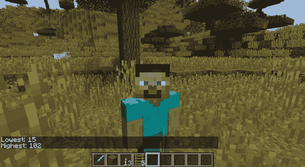
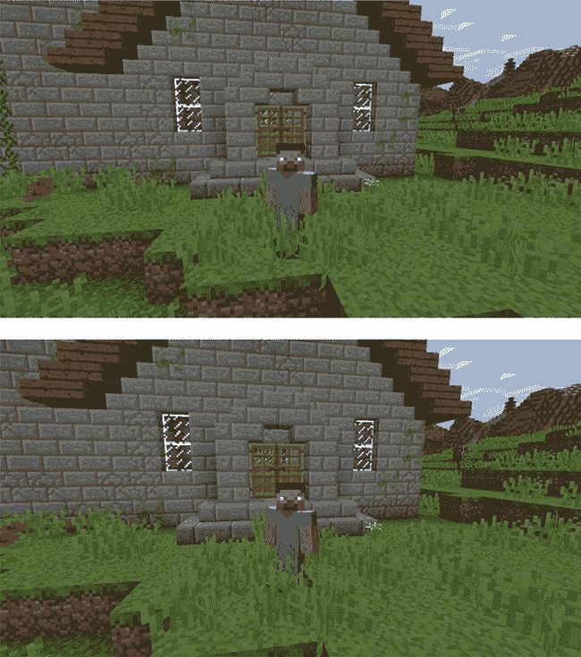
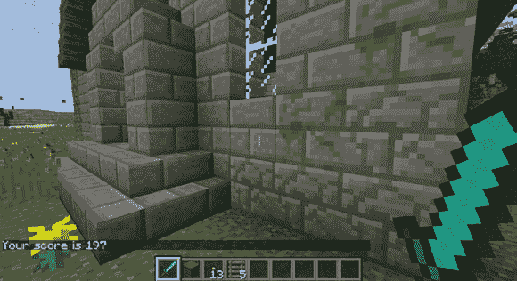
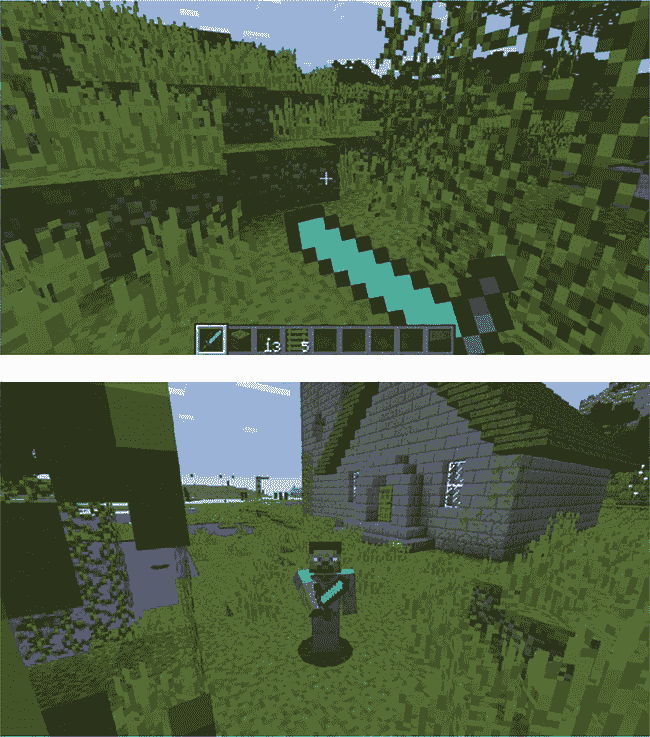
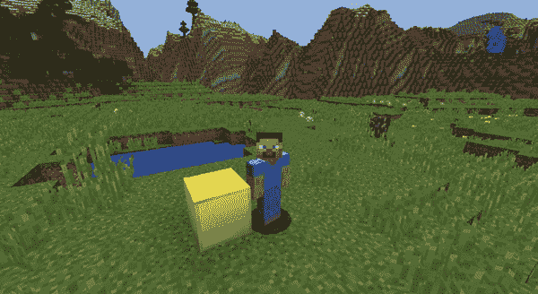
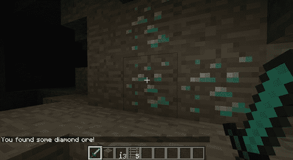
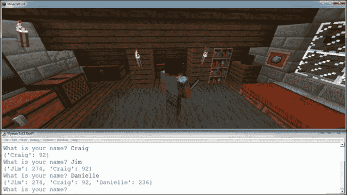

## **9**

**使用列表和字典处理事物**


我们使用列表，例如购物清单或指令清单，来记住一组项目或按特定顺序执行步骤。在 Python 中，列表非常相似：它们用于在序列中存储数据集合。一个*列表*可以存储多种类型的数据，包括字符串、数字、布尔值，甚至其他列表。

通常，变量只能保存一个值。列表非常有用，因为它们允许你在一个变量中存储多个值，例如从 1 到 100 的数字，或者你朋友的名字。在其他编程语言中，列表有时被称为*数组*。

你可以使用块 ID、坐标或其他多种内容的列表，以便更好地控制你的 Minecraft 世界。因为列表可以在一个变量中存储多种类型的值，它们为你提供了常规变量无法提供的灵活性。

在本章中，你将学习如何使用 Minecraft Python API 和列表来创建一个迷你游戏，用于记录高度，制作进度条，并编写一个程序，让玩家在游戏中随机滑动。

### **使用列表**

使用 Python 创建列表非常简单。定义一个列表时，可以将任意数量的值放在方括号内——或者根本不放任何值，这就是所谓的*空*列表。列表中的每个项都需要用逗号分隔。

例如，一份面条汤的配料列表可能看起来像这样：

```
>>> noodleSoup = ["water", "soy sauce", "spring onions", "noodles", "beef"]
```

`noodleSoup` 列表包含多个项，它们都是字符串。

你可以像这样创建一个空列表：

```
>>> emptyList = []
```

当你希望稍后在程序中添加值时，可以使用空列表。

你可以在列表中存储任何数据类型，甚至可以混合不同的数据类型。例如，你可以有一个包含整数和字符串的列表：

```
>>> wackyList = ["cardigan", 33, "goofballs"]
```

有时你的列表可能非常长，使得人类难以阅读。但是你可以在 Python 中将长列表跨多行格式化，这样程序员可以更容易地阅读它们。将项分成多行不会影响 Python 代码的运行。例如，以下的汤配料格式与之前的 `noodleSoup` 列表一样：

```
>>> noodleSoup = ["water",
        "soy sauce",
        "spring onions"
        "noodles",
        "beef"]
```

接下来，我们将看看如何访问和修改列表中的项。

#### **访问列表项**

要访问列表中的值，需要引用项在列表中的位置，这个位置被称为*索引*。以面条汤为例，你可以像这样访问列表中的第一个项：

```
>>> print(noodleSoup[0])
water
```

需要注意的是，列表中的第一个索引是 0。第二项是索引 1，第三项是索引 2，依此类推。之所以如此，是因为计算机在使用列表时是从零开始计数的。

从零开始计数可能看起来很傻，但其实有充分的理由。早期的计算机非常慢，内存也非常有限。从零开始计数更快，也更高效。即使现在的计算机已经非常快，它们仍然从零开始计数。

还需要注意的是，如果你尝试访问一个列表索引，它大于列表中的项数，你会得到一个错误信息。以下这行代码尝试打印索引位置 5 中的项：

```
>>> print(noodleSoup[5])
```

这是部分错误信息：

```
IndexError: list index out of range
```

`IndexError` 提示我，我想访问的索引位置没有数据。列表中的索引位置 5 没有数据，因为它超出了列表的长度。Python 无法返回一个不存在的值！

#### **更改列表项**

就像你可以更改变量的值一样，你也可以更改列表中的单个项。这是因为列表是*可变的*，意味着它们是可以修改的。要更改列表中的一项，你可以使用该项的索引位置，并像设置变量的值一样设置它的值（通过等号）。

让我们把面条汤中的牛肉项改成鸡肉。牛肉是列表中的第五个项，所以它的索引是 4（记住，列表是从零开始计数的）。我们可以轻松地将索引 4 的项改为鸡肉，像这样：

```
>>> noodleSoup[4] = "chicken"
```

现在让我们在 Minecraft 中做一些有趣的事情，利用列表。

#### **任务 #47：高与低**

当我在探索 Minecraft 世界时，回顾我的旅程是件很有趣的事。从最高的山峰到最深的洞穴，探索是我在游戏中最喜欢的活动之一。有时候和朋友们一起玩时，我们会比赛，看看谁能最快到达游戏中的最高或最低点。为了防止作弊，我写了一个程序，记录玩家在 60 秒内到达的最低和最高 y 坐标。

当我运行程序时，它会告诉我我在游戏中旅行的一分钟内到达的最高和最低位置。清单 9-1 包含了我为你开始编写的代码。将其复制到一个新文件中，并将其保存为 *highAndLow.py*，放在一个名为 *lists* 的新文件夹中。

*highAndLow.py*

```
   from mcpi.minecraft import Minecraft
   mc = Minecraft.create()

   import time

➊ heights = [100, 0]
   count = 0

   while count < 60:
       pos = mc.player.getTilePos()

       if pos.y < heights[0]:
➋        # Set the lowest height to the y variable
       elif pos.y > heights[1]:
➌        # Set the highest height to the y variable

       count += 1
       time.sleep(1)

➍ mc.postToChat("Lowest: ")   # Output lowest height
➎ mc.postToChat("Highest: ")  # Output highest height
```

*清单 9-1：获取玩家访问的最低和最高位置的代码开始部分*

程序会将你所到达的最低和最高 y 坐标保存在一个名为 `heights` 的列表中 ➊。列表中的第一个项（索引位置 0）存储最低坐标，第二个项（索引位置 1）存储最高坐标。我们需要从一个较高的“最低”值和较低的“最高”值开始，这样第一次运行程序时，玩家的位置将成为新的最低或最高值，并会显示在聊天窗口中。这里我使用了默认的最低值 100 和默认的最高值 0。

`while` 循环每秒运行一次，持续 60 秒，以不断更新 `heights` 中的值。`if` 语句检查玩家当前的高度是否低于列表中存储的最低值 ➋。然后，`elif` 语句检查当前高度是否大于列表中存储的最高位置 ➌。

要完成代码，你需要将最低高度`height[0]`的值设置为➋处`pos.y`的值。记住，你可以像设置变量一样设置列表中的值，因此代码行应该如下所示：`height[0] = pos.y`。你还需要将最高高度`height[1]`的值设置为➌处`pos.y`的值。

最后，你需要在程序的最后两行输出最低➍和最高➎高度的值。为此，你需要从`heights`列表中访问最低和最高高度的索引位置（再次说明，索引 0 是最低高度，索引 1 是最高高度）。

运行程序并开始在游戏中跑动。看看你能跑得多高或多低。60 秒后，循环将停止，程序会显示你的最高和最低高度。多次运行程序，看看你能否打破自己的记录！

图 9-1 展示了我尝试的一种方法。



*图 9-1：我访问过的最低 y 坐标是 15，最高是 102。*

**额外目标：一个意外的 bug**

在*highAndLow.py*中，最低和最高位置的默认值分别设置为 100 和 0。这没问题，只要你走得比 100 低、比 0 高。但是，如果你没有走得比 100 低、比 0 高，值就不会改变，这会导致程序不准确。你能解决这个问题吗？

### **操作列表**

列表有一组内置函数，可以让你操作它们。这些函数包括常见操作，如向列表添加项目、插入项目或删除项目。

#### **添加项目**

你可以使用`append()`函数向列表末尾添加项目：只需将你想添加的项目的值作为参数传递进去。

如果我们往面条汤里加点蔬菜，味道会更好。为此，使用`append()`函数：

```
>>> noodleSoup.append("vegetables")
```

现在，`noodleSoup`列表的最后一项是一个`"vegetables"`字符串。

向列表中添加项目在你从一个空列表开始时非常有用。通过使用`append()`函数，你可以将第一个项目添加到空列表中：

```
>>> food = []
>>> food.append("cake")
```

#### **插入项目**

你也可以将项目插入到列表的中间。`insert()`函数将项目放在两个现有项目之间，并改变所有插入项后面项目的索引位置。

这个函数有两个参数，一个是你想插入项目的索引位置，另一个是你想插入的值。

例如，这是我们当前的`noodleSoup`列表：

```
>>> noodleSoup = ["water", "soy sauce", "spring onions", "noodles", "beef",
"vegetables"]
```

让我们把`"pepper"`添加到列表的第三个索引位置：

```
>>> noodleSoup.insert(3, "pepper")
```

插入后，更新的列表包含以下值：

```
["water", "soy sauce", "spring onions", "pepper", "noodles", "beef", "vegetables"]
```

如果你尝试在一个比列表长度更大的索引位置插入项目，项目将被添加到最后一个项目之后。例如，如果你的列表有七个项目，但你尝试插入第 10 个项目，项目将直接添加到列表的末尾。

```
>>> noodleSoup.insert(10, "salt")
```

运行这段代码后，列表中的最后一个项目将是`"salt"`：

```
["water", "soy sauce", "spring onions", "pepper", "noodles", "beef",
"vegetables", "salt"]
```

请注意，盐并不在索引位置 10，而是在索引位置 7。

#### **删除一个项目**

有时你可能需要从列表中移除一个项目。你可以使用`del`关键字来做到这一点。该关键字放在列表名称之前，后面跟上你想删除的项目的索引位置，位置用方括号表示。

例如，要删除`noodleSoup`列表中现在位于索引位置 5 的`"beef"`项，可以这样做：

```
>>> del noodleSoup[5]
```

如果你想查找一个值的索引位置并将其删除，你也可以将`del`关键字与`index()`函数结合使用：

```
>>> beefPosition = noodleSoup.index("beef")
>>> del noodleSoup[beefPosition]
```

删除一个项目后，列表中的索引位置将会发生变化。这是我们删除位于索引位置 5 的`"beef"`后列表的样子：

```
["water", "soy sauce", "spring onions", "pepper", "noodles", "vegetables", "salt"]
```

`"vegetables"`的索引位置从 6 变为 5，而`"salt"`的索引位置从 7 变为 6。注意，只有在删除项之后的索引会受到影响；删除项之前的索引不会改变。删除列表中的项时，请记住这一点。

#### **任务 #48：进度条**

让我们使用一些列表函数来在 Minecraft 中创建一个进度条。它看起来像你在下载文件时看到的进度条，或者在角色扮演游戏中追踪你的下一级进度条。

程序将使用进度条计时到 10 秒。当程序开始时，进度条将由玻璃块组成。每经过一秒，进度条将用青金石块替换一个玻璃块。图 9-2 显示了进度条的前五个步骤。


*图 9-2：进度条显示 50%的进度（10 个块中有 5 个是青金石）。*

打开 IDLE 并创建一个新文件。将其保存为*progressBar.py*，并放在*lists*文件夹中。清单 9-2 中的程序是未完成的。将其复制到你的文本编辑器中。

*progressBar.py*

```
   from mcpi.minecraft import Minecraft
   mc = Minecraft.create()

   import time

   pos = mc.player.getTilePos()
   x = pos.x + 1
   y = pos.y
   z = pos.z

   # Add 10 glass blocks (ID 20) to this empty list
➊ blocks = [ ]
   barBlock = 22  # Lapis lazuli

   count = 0
   while count <= len(blocks):

       mc.setBlock(x, y, z, blocks[0])
       mc.setBlock(x, y + 1, z, blocks[1])
       mc.setBlock(x, y + 2, z, blocks[2])
➋     # Add setBlock() for the remaining blocks in the list

       count += 1

➌     # Delete the last block in the list

➍     # Insert a lapis lazuli block at the first position in the list

       time.sleep(2)
```

*清单 9-2：制作进度条的未完成代码*

要完成清单 9-2 中的程序，你需要执行以下操作：

1.  在➊位置将 10 个玻璃块（ID 20）添加到空的`blocks`列表中。

1.  使用`setBlock()`函数将列表中的所有 10 个块➋设置到游戏世界中。前 3 个块已经为你设置好了。

1.  编写一个语句删除列表中的最后一个块（索引位置 9）➌。记住，你需要使用`del`关键字从列表中删除一个项目。

1.  在列表的开始位置插入一个新的青金石块➍。使用`insert()`函数和`barBlock`变量，将一个新的青金石块插入到索引位置 0。

代码中包含注释，以帮助你找到需要执行这些任务的位置。

**附加目标：再次上下**

此时，*progressBar.py*中的进度条只会向上计数，并在满格时停止。你能弄明白如何让进度条向相反方向倒计时吗？

### **将字符串当作列表处理**

字符串可以像列表一样处理，因为字符串也是一个 *数据序列*。你可以通过索引访问字符串中的单个字符；然而，你不能使用 `append` 或 `insert` 函数更改每个索引位置的字符，因为字符串是 *不可变的*。这意味着它们无法更改。

以下代码将打印字符串 `"Grape"` 中的第二个字母：

```
>>> flavor = "Grape"
>>> print(flavor[1])
r
```

这表明你可以像访问列表中的元素一样访问字符串的部分。例如，你可以访问某人的名字和姓氏的首字母来打印他们的首字母：

```
>>> firstName = "Lyra"
>>> lastName = "Jones"
>>> initials = firstName[0] + " " + lastName[0]
>>> print(initials)
L J
```

通过使用索引位置访问字符串的部分，你得到的新字符串 `"L J"` 被称为 *子字符串*。注意，字符串的索引也是从零开始的！

### **元组**

*元组* 是一种不可变的列表类型。但和其他列表一样，它们是由任何变量类型的项组成的序列。元组使用圆括号而不是方括号，并且使用逗号分隔项。

例如，假设一个国家唯一的奥林匹克运动员来自一个资金匮乏的训练项目，记录了他们在长跳中的多个跳跃距离（单位：米）：

```
>>> distance = (5.17, 5.20, 4.56, 53.64, 9.58, 6.41, 2.20)
```

如果运动员只跳了一次，你也可以创建一个包含单一值的元组。要写一个包含单一值的元组，你仍然需要加上逗号：

```
>>> distance = (5.17,)
```

在定义元组时，圆括号是可选的，因此你可以通过在值之间放置逗号来定义元组，就像这样：

```
>>> distance = 5.17, 5.20, 4.56, 53.64, 9.58, 6.41, 2.20
```

要访问元组的值，可以使用与普通列表相同的方括号表示法。让我们将 `distance` 元组中索引为 1 的值赋给变量 `jump`：

```
>>> jump = distance[1]
>>> print(jump)
5.20
```

列表和元组之间的主要区别在于元组是不可变的：你不能改变它们的内容。你不能向元组的末尾添加项目、插入项目、删除项目或更新任何值。当你的程序不需要改变元组中项目的值时，你会使用元组而不是列表。

#### **使用元组设置变量**

元组的一个有用特点是你可以同时为多个变量赋值。这节省了空间，并且可以将相关的变量聚集在一起。

通常，你会像引用列表一样引用元组，使用一个变量名：

```
measurements = 6, 30
```

然而，假设我们想要将值存储在两个变量中而不是一个。实现这一点的语法并不复杂。你只需要用逗号分隔变量名，然后使用等号，接着在等号的另一边写上元组。每个元组值将被分配给对应位置的变量。让我们看一下。

在这个例子中，两个变量 `width` 和 `height` 分别被设置为值 `6` 和 `30`：

```
width, height = 6, 30
```

现在我们有了两个变量。一个叫做 `width`，其值为 `6`，另一个叫做 `height`，其值为 `30`。而且我们仅通过一行代码就完成了这件事！

#### **任务 #49: 滑动**

使用元组设置变量是节省程序空间的一种快速简便的方法。它对于将相关变量集中设置在程序中的一个地方也非常有用。例如，在本书中，你已经使用过类似这样的代码来设置`x`、`y`和`z`变量的值：

```
x = 10
y = 11
z = 12
```

相反，你可以使用元组在一行代码中设置所有这些值：

```
x, y, z = 10, 11, 12
```

接下来，你将运用你新的代码编写能力！你的任务是创建一个程序，使玩家在游戏世界中随机移动，通过小步伐看起来像是在冰上滑行。我已经为你开始了程序代码，见清单 9-3；一些部分缺失，你需要完成它们。

*sliding.py*

```
   from mcpi.minecraft import Minecraft
   mc = Minecraft.create()

   import random
   import time

➊ # Get the player's position

➋ # Set the x, y, and z variables on the same line using a tuple

   while True:
➌     x += random.uniform(-0.2, 0.2)
       # Change the z variable by a random float
➍     z +=
       y = mc.getHeight(x, z)

       mc.player.setPos(x, y, z)
       time.sleep(0.1)
```

*清单 9-3：让玩家在地图上滑行的代码开头*

将清单 9-3 复制到一个新文件中，并将其保存在你的*lists*文件夹中，命名为*sliding.py*。要完成程序，你需要获取玩家的起始位置 ➊，并设置`x`、`y`和`z`变量的值 ➋。使用元组设置这些值。该程序还使用了`uniform()`函数 ➌，它类似于`randint()`函数（见“玩转随机数”在第 62 页），但返回一个随机的浮动值，而不是整数值。在循环中，使用`uniform()`函数来更改`z`变量的值 ➍。`x`变量已经通过该函数进行了更改 ➌。

图 9-3 展示了我的玩家在游戏中缓慢滑行。



*图 9-3：我在花园里慢慢滑行*

**附加目标：滑动方块**

*sliding.py*程序使玩家在游戏中随机滑动。你能想出如何修改程序使方块滑动吗？

#### **返回元组**

一些 Python 的内置函数返回一个元组。当你定义自己的函数时，它们也可以返回一个元组作为结果。为此，你只需要在`return`关键字后面放一个元组。例如，我们可以创建一个将日期转换为元组的函数。我们将日期作为字符串参数传递，函数会返回一个包含年份、月份和日期的元组。以下是代码：

```
def getDateTuple(dateString):
    year = int(dateString[0:4])
    month = int(dateString[5:7])
    day = int(dateString[8:10])
    return year, month, day
```

当我们调用函数并传入一个日期字符串时，它会返回一个元组，元组中的顺序为年份、月份和日期：

```
>>> getDateTuple("1997-09-27")
(1997, 9, 27)
```

当我们调用函数时，可以根据需要存储返回的元组。以下代码将每个值存储到一个单独的变量中：

```
year, month, day = getDateTuple("1997-09-27")
```

现在我们可以快速将日期字符串转换为单独的变量。在我作为软件开发人员的工作中，我经常使用与此非常相似的代码。

### **列表的其他有用特性**

你可以使用列表完成许多其他任务。本节解释了如何查找列表的长度、如何从列表中随机选择一个项目，以及如何使用`if`语句检查一个值是否在列表中。

#### **列表长度**

`len()` 函数是一个快速查找 Python 中任何列表长度的方式。当列表作为参数时，函数返回列表中项目的数量。我们来看看它是如何工作的：

```
>>> noodleSoup = ["water", "soy sauce", "spring onions", "noodles", "beef",
"vegetables"]
>>> print(len(noodleSoup))
6
```

尽管 Python 从零开始计算索引，但它以常规的计数方式计算列表中有多少个项目。这个列表中的最高索引是 5，但 Python 知道总共有 6 个项目！

#### **任务 #50：块击打**

Minecraft Python API 提供了一个方便的函数，返回你用剑击中的方块位置列表。你可以使用列表中的项目来获取你击中的方块的坐标。你将在本章后面的程序以及本书后续章节中看到它的有用之处。

你还可以制作一个短小有趣的游戏，计算你在一分钟内能击打多少个方块。在这个任务中，你将实现这一目标。这是一个非常有趣的游戏：与朋友一起玩，试图打破彼此的记录！你还可以扩展它，例如通过记录最高分来增加趣味。

图 9-4 展示了程序的运行效果。



*图 9-4：在 60 秒内我击打了 197 个方块。*

制作这个游戏所需的代码并不多。以下是代码结构的概述：

1.  连接到 Minecraft 游戏。

1.  等待 60 秒。

1.  获取块击打列表。

1.  显示块击打列表的长度到聊天窗口。

以下代码展示了你到目前为止尚未看到的部分，即从游戏中获取块击打列表的代码：

```
blockHits = mc.events.pollBlockHits()
```

这段代码使用 `pollBlockHits()` 函数返回一个块击打列表，并将该列表存储在名为 `blockHits` 的变量中。`blockHits` 变量将像其他任何类型的列表一样工作，因此你可以通过索引位置访问数据，并获取列表的长度。

当你玩这个游戏时，你需要右键点击方块来计算它们的数量。原因是 `pollBlockHits()` 函数会记录所有你用剑右键点击的方块。在 Minecraft 的 PC 版本中，使用剑右键看起来更像是你在防御而不是击打某物，但它仍然会记录你点击了哪些方块。图 9-5 展示了这是什么样子。确保你只用剑右键点击：用剑左键点击不会被记录，手里拿着别的东西右键点击也不会被记录！但你可以使用任何类型的剑，包括铁剑、金剑和钻石剑。



*图 9-5：当我右键点击时，玩家像这样举着剑。*

当你打印列表的输出时，它应该看起来类似于这个，尽管每次值会根据你击打的位置不同而变化：

```
[BlockEvent(BlockEvent.HIT, 76, -2, 144, 1, 452),
BlockEvent(BlockEvent.HIT, 79, -2, 145, 1, 452),
BlockEvent(BlockEvent.HIT, 80, -3, 147, 1, 452),
BlockEvent(BlockEvent.HIT, 76, -3, 149, 1, 452)]
```

这个列表输出存储了四个块击打的详细信息。每个项目包含击打的坐标。你将在 任务 #55（第 196 页）中学会如何访问这些坐标。

为了帮助你开始这个程序，我已经在 清单 9-4 中写了基本的结构。

*swordHits.py*

```
   # Connect to the Minecraft game
   from mcpi.minecraft import Minecraft
   mc = Minecraft.create()

   import time

   # Wait 60 seconds
   time.sleep(60)

   # Get the list of block hits
➊ blockHits =

   # Display the length of the block hits list to chat
➋ blockHitsLength =
   mc.postToChat("Your score is " + str(blockHitsLength))
```

*清单 9-4：剑击游戏的开端*

为了完成这个程序，打开 IDLE，创建一个新文件，并将清单 9-4 的内容复制到文件中。将文件保存为*swordHits.py*，并放入*lists*文件夹中。使用`pollBlockHits()`函数➊设置`blockHits`变量，并通过获取`blockHits`变量的长度来设置`blockHitsLength`变量➋。

#### **随机选择一个项**

到这里，你可能已经意识到，我真的很喜欢在我的程序中使用随机生成的元素。随机性使得程序在每次运行时表现得有些不可预测。

当你使用列表时，你会时不时需要从列表中访问随机项。例如，你可能需要从一堆块中随机选择一个。

`random`模块中的`choice()`函数是选择列表项的首选函数。这个函数接受一个参数，即你想要使用的列表，并从中返回一个随机项。

在清单 9-5 中，`colors`列表包含了几种颜色的名称。它使用`choice()`函数随机选择一个，并将其打印出来：

```
import random
colors = ["red", "green", "blue", "yellow", "orange", "purple"]
print(random.choice(colors))
```

*清单 9-5：从颜色列表中打印一个随机颜色*

当你运行代码时，程序会随机输出列表中的一项。

#### **任务 #51：随机块**

在 Minecraft 中，从一系列数字中随机选择一个块 ID 可能会导致程序出错，因为有些块 ID 没有对应的块。一个解决方法是使用一个有效块的列表，从中随机选择。列表允许你创建有限数量的项，然后使用`choice()`函数从中随机选择一个。

你的任务是创建一个块 ID 的列表，从中随机选择一个块，然后将该块设置到玩家的位置。你可以使用清单 9-5 作为起点。

首先，创建一个块 ID 的列表。其次，使用`random.choice()`函数从列表中选择一个块。最后，使用`setBlock()`函数将随机块放置到 Minecraft 游戏中。

将程序保存为*randomBlock.py*，并放入*lists*文件夹中。

可以在列表中包含任意数量的块。对于我的列表，我选择了五种块，包括西瓜、钻石和金块。你可以在图 9-6 中看到运行程序的结果。



*图 9-6：程序随机选择了一个金块。*

#### **复制列表**

在大多数编程语言中，复制列表是相当棘手的。列表变量实际上并不包含值；相反，它们包含一个指向你计算机内存中某个地址的引用，这个地址进一步引用了列表中包含的值。虽然你的计算机会在幕后处理这一功能，但了解它的工作原理是值得的，因为这会让你成为一个更聪明的程序员！你可以使用`id()`函数查看列表的内存地址：

```
>>> cake = ["Eggs",
            "Butter",
            "Sugar",
            "Milk",
            "Flour"]
>>> print(id(cake))
```

例如，在我的电脑上运行这段代码时，输出为 `3067456428`。值 `3067456428` 是 `cake` 存储的内存位置。当你在你的电脑上运行这段代码时，可能会得到一个不同的数字，因为它存储在电脑内存中的不同位置。

你不需要完全理解这个行为，但你需要知道，当你想把一个列表复制到另一个变量时，它会产生影响。与预期的不同，列表中的值并没有被复制，而是列表的内存位置被复制到了新变量中。这意味着，当你在任一列表中更改某个值时，它会影响另一个列表。

例如，下面的程序创建了一个名为 `cake` 的列表，然后将 `chocolateCake` 的值设置为与 `cake` 相同。接着，向 `chocolateCake` 列表中添加了一个项，`"Chocolate"`：

```
>>> cake = ["Eggs",
            "Butter",
            "Sugar",
            "Milk",
            "Flour"]

>>> # Store the list in a second variable
>>> chocolateCake = cake
>>> chocolateCake.append("Chocolate")
```

不幸的是，尽管你不希望这样，`"Chocolate"` 也被添加到了 `cake` 列表中。你可以通过打印列表看到这个错误：

```
>>> print(cake)
['Eggs', 'Butter', 'Sugar', 'Milk', 'Flour', 'Chocolate']
>>> print(chocolateCake)
['Eggs', 'Butter', 'Sugar', 'Milk', 'Flour', 'Chocolate']
```

这个问题发生是因为变量存储的是列表的内存位置，而不是列表中的项。

克服这个问题的一种简单方法是使用 *列表切片*。当你用刀切割食物时，你是在把它分成不同的部分。在 Python 中，列表切片也类似。当你切割一个列表时，你实际上是从列表中取出一部分。你可以使用列表切片来获取列表中的某些项，但在这个例子中，你将使用列表切片来复制列表中的每一项。要将 `cake` 列表复制到 `chocolateCake` 变量中，可以使用以下代码：

```
>>> chocolateCake = cake[:]
```

现在，`chocolateCake` 变量将包含 `cake` 列表中的值，但内存地址不同。

可以通过列表切片来修正蛋糕配料的代码：

```
   >>> cake = ["Eggs",
               "Butter",
               "Sugar",
               "Milk",
               "Flour"]

   >>> # Store the list in a second variable
➊ >>> chocolateCake = cake[:]
   >>> chocolateCake.append("Chocolate")
```

你可以看到，`cake` 中的项已经通过 `[:]` 被复制到了 `chocolateCake` 中，见 ➊。

以下是输出结果：

```
>>> print(cake)
['Eggs', 'Butter', 'Sugar', 'Milk', 'Flour']
>>> print(chocolateCake)
['Eggs', 'Butter', 'Sugar', 'Milk', 'Flour', 'Chocolate']
```

请注意，现在两个列表中的值已经不同——只有 `chocolateCake` 包含了 `"Chocolate"` 值。

#### **项目和 if 语句**

要检查某个值是否在列表中，可以使用 `in` 运算符。`in` 运算符位于一个值和你想检查的列表之间。如果该值在列表中，表达式的结果为 `True`；如果该值不在列表中，表达式的结果为 `False`。

以下示例检查值 `"Eggs"` 是否在 `cake` 列表中：

```
>>> cake = ["Eggs", "Butter", "Sugar", "Milk", "Flour"]
>>> print("Eggs" in cake)
```

输出值为 `True`，因为 `"Eggs"` 在列表中。

你当然可以将 `in` 运算符用作 `if` 语句条件的一部分。以下代码扩展并改编了这个例子，使用 `if` 语句而不是直接打印布尔值。它检查 `"Ham"` 是否在 `cake` 列表中，并根据是否在列表中打印不同的信息：

```
>>> cake = ["Eggs", "Butter", "Sugar", "Milk", "Flour"]
>>> if "Ham" in cake:
>>>     print("That cake sounds disgusting.")
>>> else:
>>>     print("Good. Ham in a cake is a terrible mistake.")
```

你可以将`not`操作符与`in`操作符结合使用，产生相反的效果。代码将返回`False`而不是当一个项目在列表中时返回`True`，反之亦然。下面是示例（注意`if`和`else`语句的主体也已交换）：

```
>>> cake = ["Eggs", "Butter", "Sugar", "Milk", "Flour"]
>>> if "Ham" not in cake:
>>>     print("Good. Ham in a cake is a terrible mistake.")
>>> else:
>>>     print("That cake sounds disgusting")
```

你可以在程序中使用任一技术。只需选择你认为最合适的一种！

#### **任务 #52：夜视剑**

你在探索 Minecraft 中的洞穴时是否会忘记带足够的火把？我经常这样做。有时我甚至忘记带火把，而且我已经走得太远，无法回头。所以我在黑暗中摸索，不确定自己是否发现了什么有用的东西。但是，凭借你的 Python 知识，你可以制作一个程序，帮助你用剑找到钻石。

让我们编写一个基本程序，使用`pollBlockHits()`函数检查你击中的方块是否是钻石矿石。这对于在没有光的洞穴中探险，或者玩“在黑暗中找钻石矿石”的游戏很有用。代码在 Listing 9-6 中。将其复制到新文件中，并保存为*nightVisionSword.py*，保存在*lists*文件夹中。

*nightVisionSword.py*

```
   from mcpi.minecraft import Minecraft
   mc = Minecraft.create()

   import time

   blocks = []

   while True:
       hits = mc.events.pollBlockHits()
       if len(hits) > 0:
           hit = hits[0]
➊         hitX, hitY, hitZ = hit.pos.x, hit.pos.y, hit.pos.z
           block = mc.getBlock(hitX, hitY, hitZ)
           blocks.append(block)

➋     # Add the if statement here

       time.sleep(0.2)
```

*Listing 9-6：这个程序将帮助你在黑暗中找到钻石矿石。*

注意如何使用`hit.pos.x`、`hit.pos.y`和`hit.pos.z` ➊。每次击中都会存储点击方块的坐标，这些坐标是通过元组存储的。你可以使用点符号访问这些坐标。在这个例子中，`hit`这个变量名被用来命名包含每个击中方块的列表，因此我通过`hit.pos.x`、`hit.pos.y`和`hit.pos.z`来访问这些坐标。

代码几乎完成了。唯一剩下的任务是检查你是否找到了钻石。添加一个`if`语句 ➋，检查`blocks`列表中是否有钻石矿石（方块 ID 56），如果有，则向聊天窗口发送消息`"你找到了钻石矿石！"`。在`if`语句中添加一个`break`语句，使得当你找到矿石时，循环停止。

图 9-7 展示了程序的运行效果。



*图 9-7：很黑，但我找到了钻石矿石。耶！*

如果你不像我那么健忘，记得带火把进入洞穴，你仍然可以将这段代码当作一个游戏来使用。制作一个没有光的地下室，并在墙上某个地方放一个钻石矿石。运行程序，看看你需要多少时间才能在黑暗中找到钻石矿石。记得用剑右键点击！这是`pollBlockHits()`函数记录你击中的方块的唯一方式。

**额外目标：钻石挑战**

将*nightVisionSword.py*程序改造成一个完整的小型游戏会很酷。你能自动生成一个房间，在其中随机放置一个钻石方块，把玩家放在这个房间里，然后计时玩家在黑暗中找到该方块所花费的时间吗？

### **字典**

字典是一种使用不同方法的列表。字典不使用索引来标识项，而是使用程序员定义的一组键来标识项。

例如，这个`raceTimes`字典存储了参加比赛的人的名字和他们的比赛时间：

```
raceTimes = {'Katy': 26,
             'Alex': 30,
             'Richard': 19}
```

键唯一地标识字典中的每个值。在这个示例中，键是人的名字。`'Katy'`键对应的值是`26`。

和列表一样，字典是可变的；它们的内容可以更改。

#### **定义字典**

要定义一个字典，可以使用一对花括号将一组键值对括起来。例如，你可以使用字典来描述一个人。你可以使用像`'name'`和`'favoriteAnimal'`这样的键来存储关于此人的信息，像这样：

```
person = {'name': 'David',
        'age': 42,
        'favoriteAnimal': 'Snake',
        'favoritePlace': 'Inside a cardboard box'}
```

在这个示例中，每个键都是一个字符串。每个键与一个值配对，使用冒号。例如，`'age'`是一个键，`42`是其对应的值。字典中的项然后用逗号分隔。

你可能已经注意到，使用字典可以让程序员轻松理解列表中的每一项表示什么；例如，很容易理解`'name'`键存储的是名字，而不是数字或其他随机信息。

你还可以使用整数和浮动数作为字典的键。在字典中使用浮动数或整数非常有用，当你想要匹配的键与值之间不遵循严格的顺序时。

以下示例创建了一个火车时间的字典。火车时间（浮动值）作为键存储，火车的目的地作为值存储：

```
trainTimes = {1.00: 'Castle Town',
             2.30: 'Sheep Farm',
             3.15: 'Lake City',
             3.45: 'Castle Town',
             3.55: 'Storage Land'
             }
```

因为字典可以存储成对的数据，它们非常适合像这样的情况。如果我使用一个火车目的地的列表而不是字典，我就无法将时间与目的地匹配起来。我只能使用列表的索引位置，如 0、1、2、3、4，等等，而不是时间。

#### **访问字典中的项**

要访问字典中项的值，可以使用方括号和键，而不是使用索引。键通常是字符串或整数。当你创建一个使用字符串作为键的字典时，确保将它们放在引号中。

例如，要访问之前创建的`person`字典中`'name'`键的值，你可以使用以下语法：

```
person = {'name': 'David',
        'age': 42,
        'favoriteAnimal': 'Snake',
        'favoritePlace': 'Inside a cardboard box'}

agentName = person['name']
```

`agentName`变量将包含值`'David'`，因为它访问了`'name'`键的值。同样，如果你想访问代理的年龄，可以使用`'age'`键：

```
agentAge = person['age']
```

这会将值`42`存储在`agentAge`变量中。

在`trainTimes`示例中，你可以使用字典中的键值（火车时间）来访问字典中的值（目的地），这些键值是浮动的：

```
trainTimes = {1.00: 'Castle Town',
             2.30: 'Sheep Farm',
             3.15: 'Lake City',
             3.45: 'Castle Town',
             3.55: 'Storage Land'
             }

myTrain = trainTimes[3.15]
```

访问`trainTimes`字典中的`3.15`键会将`myTrain`变量设置为`'Lake City'`。

#### **任务 #53: 旅游指南**

在使用字典时，你可以将任何数据类型作为值存储，包括列表和元组。例如，你可以存储一个包含`x`、`y`和`z`值的元组。以下是一个实现该功能的代码示例：

```
places = {'Living room': (76, 1, -61), 'Bedroom': (61, 9, -61)}
```

`places`字典存储了两个项。字典的键是我在 Minecraft 游戏中某个地点的名称（例如我的客厅或卧室），而值是该地点坐标的元组。如果我想访问我客厅的坐标，我将使用以下代码：

```
location = places['Living room']
x, y, z = location[0], location[1], location[2]
```

你的任务是创建一个程序，使用字典存储 Minecraft 游戏中不同地点的位置，以便你可以通过名称传送到这些地方。可以在字典中包含任意数量的位置。要传送到这些地点，你需要访问字典中存储的坐标元组，然后将`x`、`y`和`z`设置为元组中存储的值。代码中的注释标明了你需要进行这些操作的位置。

将示例 9-7 复制到 IDLE 文本编辑器中，并将其保存到*lists*文件夹下，命名为*sightseeingGuide.py*。

*sightseeingGuide.py*

```
   from mcpi.minecraft import Minecraft
   mc = Minecraft.create()

   # Add locations to the dictionary
   places = {}

   choice = ""
   while choice != "exit":
➊     choice = input("Enter a location ('exit' to close): ")
➋     if choice in places:
          # Store the dictionary item's value using its key (choice)
          location =
          # Store the values stored in the tuple in the x, y, and z variables
          x, y, z =
          mc.player.setTilePos(x, y, z)
```

*示例 9-7：一些用于传送到不同位置的有趣代码*

我已经包含了一条语句，提示你输入你想要前往的地点名称。这个输入被存储在`choice`变量中 ➊。程序随后使用`if`语句检查`choice`的值是否在字典中 ➋。最后一行使用`x`、`y`和`z`变量将玩家传送到字典中存储的位置。

当程序运行时，输入你想要前往的地点名称。图 9-8 展示了我在程序中传送到不同地点的版本。


*图 9-8：我传送到了我的客厅（上）和卧室（下）。*

#### **更改或添加字典中的项**

更改字典中项的值并不需要太多工作。你只需使用方括号和键来访问该项，并像设置普通变量一样（使用等号）为其赋值。你也可以使用这种方法添加新项。

让我们将`person`字典中`age`项的值从 42 更改为 43：

```
person['age'] = 43
```

让我们也添加一个名为`location`的新项，值为`'USS Discovery'`：

```
person['location'] = 'USS Discovery'
```

运行此代码后，字典将包含一个名为`location`的新键，其值为`'USS Discovery'`。

#### **删除字典中的项**

有时候，你可能想删除字典中的某个项。和列表一样，你可以使用`del`关键字来删除它。例如，要删除`person`字典中的`favoriteAnimal`项，你可以这样做：

```
del person['favoriteAnimal']
```

如你所见，这和从列表中删除项一样有效。

#### **任务 #54：击打方块得分**

在任务 #50（第 180 页）中，你编写了一个程序，计算玩家在 60 秒内用剑击打方块的次数。虽然这个程序很有趣，但如果你能记录所有玩家的得分，那会更酷。

要为游戏添加成绩榜，你将使用字典。字典将存储玩家的名字和分数，这些可以与其他玩家的分数一起显示出来。

要开始，打开*swordHits.py*并将其保存为*swordHitsScore.py*，放在*lists*文件夹中。更新代码以匹配清单 9-8，在这里我对程序做了一些修改，使其能够重复运行，要求玩家输入他们的名字，然后打印所有的成绩。（我还包括了*swordHits.py*中缺失代码的解决方案。）旧部分已被灰色标记。（记得缩进循环内部的所有内容。）

*swordHitsScore.py*

```
   # Connect to the Minecraft game
   from mcpi.minecraft import Minecraft
   mc = Minecraft.create()

   import time

   name = ""
   scoreboard = {}

   while True:
       # Get the player's name
       name = input("What is your name? ")
       # Break loop if name is exit
       if name == "exit":
           break
       mc.postToChat("Go!")

       # Wait 60 seconds
       time.sleep(60)

       # Get the list of block hits
       blockHits = mc.events.pollBlockHits()

       # Display the length of the block hits list to chat
       blockHitsLength = len(blockHits)
       mc.postToChat("Your score is " + str(blockHitsLength))

➊     # Add the player to the scoreboard

       # Display the scoreboard
       print(scoreboard)
```

*清单 9-8：当代码完成时，它将为方块击打游戏添加一个成绩榜。*

要完成程序，你需要存储每个玩游戏的玩家的名字和分数。通过使用代码中➊部分的数据，向字典添加一个新的条目来实现这一点。字典叫做`scoreboard`，玩家的名字存储在`name`变量中。

图 9-9 显示了我的成绩榜的输出。



*图 9-9：我和我的朋友们玩了一个游戏，Jim 以 274 次方块击打获胜。*

**注意**

*你可能已经注意到，当打印`scoreboard`字典时，它不太容易阅读。在任务 #59 中，你将学会如何解决这个问题（第 205 页）。*

**附加目标：最佳成绩**

目前，如果某人玩了*swordHitsScore.py*游戏两次或更多次（并且输入了相同的用户名），程序只会记录他们最近的分数。你能想出如何使用`if`语句来检查玩家是否已经输入过分数，并且仅在新分数大于之前的分数时存储新分数吗？以下是帮助你开始的代码。它检查某人的名字是否已经在`scoreboard`字典中：

```
if name in scoreboard:
```

### **你学到了什么**

做得好！在本章中，你学到了列表、元组和字典。你看到它们可以在一个变量中存储多个数据值。它们是结构化和存储程序数据的非常有用的方式。

在这些任务中，你创建了几个有趣的程序，使用了列表、字典和元组。通过列表，你创建了一个使用青金石和玻璃的进度条。通过元组，你学到了设置`x`、`y`和`z`变量的更快捷方式。字典让你存储你建造的物体的坐标，然后通过输入它们的名字传送到这些物体。

在第十章中，你将通过学习`for`循环，进一步发展你对列表的理解。你将创建一些非常酷的程序，包括一个可以用来复制你所建造的物品的程序。
