## 第十章：10

**使用 for 循环在 Minecraft 中施展魔法**


现在是时候学习 `for` 循环了。`for` 循环非常有用，因为它们可以遍历列表中的项目，就像你在 第九章 中看到的列表一样。这意味着当你在程序中需要使用循环遍历列表时，`for` 循环是完美的选择。

在跟随本章任务的过程中，你将使用 `for` 循环生成楼梯、柱子、金字塔和风化的墙壁。通过嵌套的 `for` 循环和列表，你将能够在几秒钟内创建像素艺术并生成新结构。`for` 循环是 Minecraft 中构建的强大工具！

### 一个简单的 for 循环

`for` 循环会对列表中的每个项目重复执行一段代码，直到列表结束，而不是像 `while` 循环或 `if` 语句那样使用条件。

你在 `for` 语句中使用的列表可以包含任意数量的任何数据类型的项。`for` 循环将按顺序遍历每个项，即按其索引。例如，要打印面条汤列表中的每一项，我们可以使用以下代码：

```
noodleSoup = ["water", "soy sauce", "spring onions", "pepper", "noodles",
"beef", "vegetables"]

for ingredient in noodleSoup:
    print(ingredient)
```

我们使用 `for` 操作符告诉 Python 我们正在使用一个循环。

在 `for` 操作符后面是一个变量 `ingredient`，它代表循环当前使用的项目。每次循环迭代时，值都会改变，直到循环遍历完列表中的每一项。第一次执行时，值将是索引位置 0 的项（在这个例子中是 `"water"`），第二次执行时，值将是索引位置 1 的项（`"soy sauce"`），第三次执行时，值将是索引位置 2 的项（`"spring onions"`），依此类推。

`in` 操作符和语句末尾的列表名称告诉 Python 你正在使用哪个列表。这个例子中，列表的名称是 `noodleSoup`。

循环会对列表中的每一项执行一次，直到达到列表的末尾才结束。以下是这个程序的输出：

```
water
soy sauce
spring onions
pepper
noodles
beef
vegetables
```

列表中的每个项都会被打印出来！现在，让我们在 Minecraft 中用 `for` 循环来玩得开心吧。

#### 任务 #55：魔法棒

Minecraft 中的每个工具都有其独特的功能。铲子挖掘泥土，镐子打破石块，斧头砍伐木材，而剑则击打敌人。通常，你不能改变工具的行为；你只能接受剑只击打敌人。但使用 Python，你可以改变工具的工作方式。在这个程序中，我们将把剑变成魔法棒。

在 第九章 中，你了解了 `pollBlockHits()` 函数。这个函数返回一个包含剑击中的方块坐标的列表。通过 `for` 循环，你可以访问该列表中的每一组坐标。我们将把过去 60 秒内我们打到的所有方块变成西瓜。你可以在 图 10-1 中看到它是如何实现的。

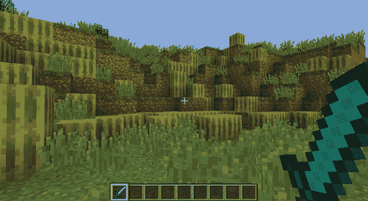

*图 10-1：变魔术！我打到的所有方块现在变成了西瓜。*

列表 10-1 包含了程序的开头。将其保存为 *magicWand.py*，并放入一个名为 *forLoops* 的新文件夹中。

*magicWand.py*

```
   from mcpi.minecraft import Minecraft
   mc = Minecraft.create()

   import time

   time.sleep(60)

➊ hits = mc.events.pollBlockHits()
   block = 103

➋ for
➌ x, y, z = hit.pos.x, hit.pos.y, hit.pos.z
➍ # Set melon blocks at the coordinates
```

*示例 10-1：魔法棒程序的开始部分*

要获取方块击中的列表，我们调用`pollBlockHits()`函数并将结果存储在`hits`变量中➊。

代码中包括了一行将获取你击中的方块位置并将其坐标存储在`x`、`y`和`z`变量中的代码➌。它使用一个元组（在第九章的页面 175 中介绍）来在一行中为三个变量赋值。

目前，这行代码无法工作，因为`hit`变量并不存在。在➋处创建一个`for`循环，并将`for`循环的变量命名为`hit`。`for`循环应遍历`hits`列表。`for`循环的第一部分代码应如下所示：

```
for hit in hits:
```

确保将获取`x`、`y`和`z`值的代码行缩进到➌的`for`循环内。在`for`循环的最后一行，添加`setBlock()`函数以在 x、y 和 z 坐标➍处设置一个西瓜方块。

当用户运行完成的程序时，他们将有 60 秒钟的时间在四处奔跑，并用剑右键点击尽可能多的方块。60 秒后，所有被剑击中的方块将变成西瓜。

**额外目标：你是一个巫师**

修改*magicWand.py*程序，使其传送玩家：第一次击中设置位置，第二次击中将玩家传送到该位置。

#### range()函数

`range()`函数创建一个整数列表。它是为`for`循环快速生成数字列表的好方法。让我们来看一下并传递两个参数，0 和 5，给`range()`函数：

```
aRange = range(0, 5)
```

这是比单独写出每个列表项更快速的创建列表的方法，单独写出的列表项会像这样：

```
aRange = [0, 1, 2, 3, 4]
```

注意，`range()`函数的第二个参数是 5，但列表中的最后一个项是 4。这是因为该函数只生成小于但不等于第二个参数的值。

要创建一个使用`range()`函数打印从 1 到 15 的数字的循环，你可以使用以下代码：

```
for item in range(1, 16):
    print(item)
```

你可以像这样打印出列表中每个项的两倍值：

```
for item in range(1, 16):
    print(item * 2)
```

你可以使用`while`循环做同样的事情，在第七章中你已经学习过`while`循环。以下代码使用`while`循环代替`for`循环，打印从 1 到 15 的数字：

```
count = 1
while count < 16:
    print(count)
    count += 1
```

注意到`for`循环更简单且更易于阅读。在大型复杂的程序中，`for`循环通常比带有`count`的`while`循环更合适。

#### 任务#56：魔法楼梯

使用 Minecraft 和 Python 的一个最佳特点是，你只需几行代码就能快速构建东西。你不必花费大量时间建造墙壁，只需运行一些代码就完成了。你还可以随时重复使用这些代码，节省时间和精力。

建造楼梯是一个通常需要花费大量时间的任务。幸运的是，通过几行 Python 代码，你可以在 Minecraft 中快速创建楼梯。在这个任务中，你将使用 `for` 循环让楼梯在游戏世界中出现。

清单 10-2 使用 `while` 循环在 Minecraft 中创建楼梯。将其保存为 *stairs.py* 文件，放入 *forLoops* 文件夹中。

*stairs.py*

```
from mcpi.minecraft import Minecraft
mc = Minecraft.create()

pos = mc.player.getTilePos()
x, y, z = pos.x, pos.y, pos.z

stairBlock = 53

step = 0
while step < 10:
    mc.setblock(x + step, y + step, z, stairBlock)
    step += 1
```

*清单 10-2: 使用 `while` 循环创建楼梯的程序*

虽然你可以像这里展示的那样使用 `while` 循环来实现这个程序，但实际上 `for` 循环更为合适。与 `while` 循环不同，`for` 循环不需要 `count` 或 `step` 变量。相反，你可以使用 `range()` 函数来确定循环重复的次数。

为了完成程序，将代码修改为使用 `for` 循环，而不是 `while` 循环。

你可以在 图 10-2 中看到程序的结果。

**额外目标：向下走？**

目前，*stairs.py* 程序只在一个方向上建造楼梯。尝试找出如何在其他方向上建造楼梯。提示：你将使用 `setBlock()` 函数中的可选块状态参数，并对 `x` 或 `z` 变量进行加法或减法操作。

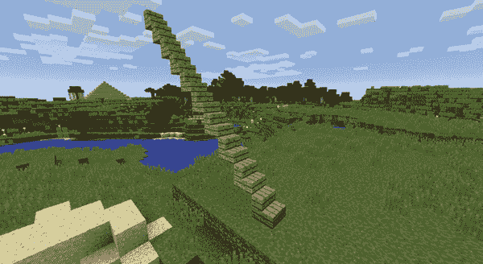

*图 10-2: 你的魔法楼梯将通向何方？*

#### 玩转 RANGE()

你已经了解了 `range()` 函数以及当你传递两个参数时会发生什么。如果你只传递一个参数会怎样呢？在 IDLE shell 中输入这段代码看看会发生什么：

```
>>> aRange = range(5)
>>> list(aRange)
[0, 1, 2, 3, 4]
```

当你只向 `range()` 函数传递一个参数时，它将从 0 开始，并存储每个值，直到值比你传递的参数小 1。换句话说，就好像你为第一个参数传递了 0，为第二个参数传递了 5。在这个示例中，`list()` 函数显示了 `range()` 函数创建的列表值（否则你是看不到它们的！）。如你所见，`list(aRange)` 的值是一个包含五个数字的列表，从 0 开始：`[0, 1, 2, 3, 4]`。这是一个快速创建范围的方式，如果你想让第一个值从 0 开始的话。

如你所见，当你向 `range()` 函数传递两个参数时，列表从第一个参数开始，到第二个参数之前结束：

```
>>> aRange = range(2, 5)
>>> list(aRange)
[2, 3, 4]
```

这个示例创建了一个与列表 `[2, 3, 4]` 等效的范围。

当你给 `range()` 函数提供三个参数时，第三个参数定义了项与项之间的 *步长*。通常，`range()` 函数创建的列表中的每个值比前一个值大 1。通过更改步长，你可以改变项之间的差异。例如，步长为 2 时，列表中的下一个值将比前一个值大 2。步长为 3 时，下一个值比前一个值大 3，依此类推。

例如，这个列表通过将前一个值加 2 来得到下一个值：

```
>>> aRange = range(3, 10, 2)
>>> list(aRange)
[3, 5, 7, 9]
```

注意，每个项比前一个项大 2（5 是 3 + 2，7 是 5 + 2，9 是 7 + 2）。

你甚至可以给 `range()` 函数一个负步长值，像这样：

```
>>> newRange = range(100, 0, -2)
>>> list(newRange)
[100, 98, 96, 94, 92, 90, 88, 86, 84, 82, 80, 78, 76, 74, 72, 70, 68, 66, 64,
62, 60, 58, 56, 54, 52, 50, 48, 46, 44, 42, 40, 38, 36, 34, 32, 30, 28, 26,
24, 22, 20, 18, 16, 14, 12, 10, 8, 6, 4, 2]
```

请注意，列表中的值每次减少 2，因为使用了负步长值。

### 其他列表函数

由于我们正在处理列表，让我们探索一些其他专为与列表交互而设计的函数。

`reversed()`函数接受一个参数，即你想要使用的列表，并返回反转后的列表。最后一个元素将成为第一个元素，倒数第二个元素将成为第二个元素，依此类推。让我们反转一个先前的列表：

```
>>> backwardsList = reversed(aRange)
>>> list(backwardsList)
[9, 7, 5, 3]
```

列表中的项目已被反转，正如我们所期望的那样。这种列表操作在你编写`for`循环时非常有用。

以下示例使用`range()`函数生成从 1 到 100 的数字列表。然后，它反转该列表并使用`for`循环打印出来，从而有效地创建一个从 100 到 1 的倒计时：

```
countDown = range(1, 101)
countDown = reversed(countDown)
for item in countDown:
    print(item)
```

运行它以查看输出结果！

```
100
99
98
97
96
--snip--
3
2
1
```

你还可以在声明`for`循环时反转列表，而无需使用变量来存储列表：

```
for item in reversed(range(0, 101)):
    print(item)
```

这个程序用更少的代码行实现相同的效果。使用这个技巧节省时间，以便你可以专注于构建！

#### 任务 #57：柱子

在 Minecraft 中建造一个宫殿是不是很酷？因为宫殿应该是宏伟的，所以我们需要一排排高大、威严的柱子。显然，我们不想手动建造它们，所以使用循环来建造它们是最好的解决方案。

我们将创建一个函数来构建柱子，然后在需要时调用该函数。列表 10-3 包含了构建柱子的函数。将其复制到一个名为*pillars.py*的新文件中，并将其保存在*forLoops*文件夹中。

*pillars.py*

```
   from mcpi.minecraft import Minecraft
   mc = Minecraft.create()

   def setPillar(x, y, z, height):
       """ Creates a pillar. Args set position and height of pillar """
       stairBlock = 156
       block = 155

       # Pillar top
       mc.setBlocks(x - 1, y + height, z - 1, x + 1, y + height, z + 1, block, 1)
       mc.setBlock(x - 1, y + height - 1, z, stairBlock, 12)
       mc.setBlock(x + 1, y + height - 1, z, stairBlock, 13)
       mc.setBlock(x, y + height - 1, z + 1, stairBlock, 15)
       mc.setBlock(x, y + height - 1, z - 1, stairBlock, 14)

       # Pillar base
       mc.setBlocks(x - 1, y, z - 1, x + 1, y, z + 1, block, 1)
       mc.setBlock(x - 1, y + 1, z, stairBlock, 0)
       mc.setBlock(x + 1, y + 1, z, stairBlock, 1)
       mc.setBlock(x, y + 1, z + 1, stairBlock, 3)
       mc.setBlock(x, y + 1, z - 1, stairBlock, 2)

       # Pillar column
       mc.setBlocks(x, y, z, x, y + height, z, block, 2)

   pos = mc.player.getTilePos()
   x, y, z = pos.x + 2, pos.y, pos.z

➊ # Add the for loop here
➋ # Call the function here
```

*列表 10-3：创建柱子的函数*

`setPillar()`函数用来创建一个柱子。它需要四个参数：x、y 和 z 坐标以及柱子的高度。

要完成程序，添加一个`for`循环 ➊，它调用`setPillar()`函数 ➋。我们想要创建一排 20 根柱子，每根柱子相距 5 个方块。为此，使用一个带有三个参数的`range()`函数来确定将创建多少根柱子，以及它们之间的间隔。通过将`for`循环中变量的值添加到`setPillar()`函数调用中的`x`或`z`变量，你可以确保每根柱子之间的距离相等。

图 10-3 展示了其中一些柱子。

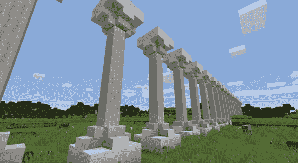

*图 10-3：一排精美的柱子*

#### 任务 #58：金字塔

继续使用`for`循环构建精彩物品的主题，让我们来建造一个金字塔。金字塔由许多层组成。最底层最宽，顶部最窄。每一层都是由方块组成的。我们将构建一个每层宽度比上一层少两个方块的金字塔。例如，如果底层宽度是七个方块，那么下一层将是五个方块宽，接着是三个方块宽，最后顶层为一个方块宽。

列表 10-4 创建了一个金字塔。将其复制到一个名为*pyramid.py*的新文件中，并将其保存在*forLoops*文件夹中。

*pyramid.py*

```
   from mcpi.minecraft import Minecraft
   mc = Minecraft.create()

   block = 24  # sandstone
➊ height = 10
➋ levels = range(height)

   pos = mc.player.getTilePos()
➌ x, y, z = pos.x + height, pos.y, pos.z

➍ for level in levels:
➎     mc.setBlocks(x - level, y, z - level, x + level, y, z + level, block)
       y += 1
```

*示例 10-4：倒金字塔程序*

尽管示例 10-4 创建了一个金字塔，但它包含了一个你需要修复的小 bug！我们将金字塔的高度存储在`height`变量中➊。你可以将`height`变量的值更改为任何你想要的值。`levels`变量使用`range()`函数创建一个列表，每个金字塔的每一层都包含一个元素➋。当我们设置`x`、`y`和`z`变量时，`height`变量被加到玩家的 x 坐标上➌。如果我们不这么做，当金字塔建造时，玩家就会被困在金字塔的中心。

`for`循环会遍历`levels`列表中的每个`level` ➍。创建每个金字塔层的代码行使用`level`变量来计算每个方块的宽度 ➎。每一层金字塔的宽度和长度将始终是`level`变量的两倍大小。

还记得我之前提到的那个 bug 吗？运行程序看看问题出在哪里。金字塔是倒过来的！

为了解决这个问题并让金字塔恢复正常，你需要对`levels`变量使用`reversed()`函数，这样可以生成一个随着时间变小的列表。或者你也可以偷偷使用带负值的`range()`函数。

图 10-4 展示了完成的金字塔。

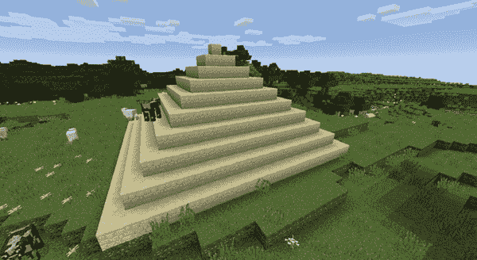

*图 10-4：宏伟的金字塔*

### 遍历字典

你也可以使用`for`循环遍历字典。当你使用`for`循环遍历字典时，语法与遍历列表的`for`循环相同；但是，循环将仅遍历字典的键。

例如，以下代码在每次循环迭代时打印`for`循环的变量。在这种情况下，它会打印字典中每个项的键：

```
inventory = {'gems': 5, 'potions': 2, 'boxes': 1}

for key in inventory:
    print(key)
```

这段代码输出如下：

```
gems
potions
boxes
```

要打印字典中每个项的值，你需要使用`dictionary[key]`语法。以下是如何修改代码，以便它打印每个项的值和键：

```
inventory = {'gems': 5, 'potions': 2, 'boxes': 1}

for key in inventory:
    print(key + " " + str(inventory[key]))
```

这个示例现在输出如下：

```
gems 5
potions 2
boxes 1
```

注意，这个输出比字典本身更容易阅读。通过使用循环输出字典的值，你可以更好地控制信息的显示方式。

#### 任务 #59：记分板

回想一下 swordHitsScore.py 游戏，来自任务 #54（第 192 页）。这个游戏记录了玩家在一分钟内击中的方块数量。分数和玩家名字被存储在一个字典中。虽然程序本身运行得很好，但程序结尾的记分板没有以非常易读的格式输出分数和名字。它只是简单地打印了一个没有任何格式化的字典。

为了改进程序，在这个任务中，你将修改*swordHitsScore.py*，使其以易读的格式输出`scoreboard`字典。为此，你将使用`for`循环。

打开你的 *swordHitsScore.py* 程序（它应该在 *lists* 文件夹中），并将其保存为 *scoreBoard.py*，放在 *forLoops* 文件夹中。在程序中，找到并删除这一行：

print(scoreboard)

将这一行替换为一个 `for` 循环，用来打印每个玩家的名字和分数。这些值存储在 `scoreboard` 字典中：每个玩家的名字是字典中的键，分数是键的值。

图 10-5 显示了更新后的输出。

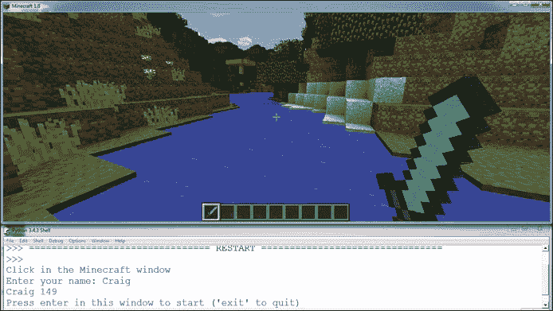

*图 10-5：程序的输出现在更容易阅读了。*

### FOR-ELSE 循环

你也可以在 `for` 循环中使用 `else` 语句。当你在 `for` 循环中使用 `else` 时，它会在 `for` 循环遍历完列表后执行。如果 `for` 循环没有遍历到列表的末尾，`else` 语句将不会执行。

例如，这里有一段代码，它打印三明治的成分，然后使用了一个 `else` 语句：

```
sandwich = ["Bread", "Butter", "Tuna", "Lettuce", "Mayonnaise", "Bread"]

for ingredient in sandwich:
    print(ingredient)
else:
    print("This is the end of the sandwich.")
```

当你运行这段代码时，它会输出以下内容：

```
Bread
Butter
Tuna
Lettuce
Mayonnaise
Bread
This is the end of the sandwich.
```

你可能会认为这段代码与以下写法是一样的：

```
for ingredient in sandwich:
    print(ingredient)
print("This is the end of the sandwich.")
```

是的，确实如此。两段代码的效果是一样的。那么，使用 `else` 和 `for` 循环有什么意义呢？其实，当与 `break` 语句一起使用时，`else` 语句的行为会有所不同。接下来我们来看看这个情况。

#### 中断 FOR-ELSE 循环

使用 `break` 语句退出 `for` 循环是一种防止 `else` 语句执行的方法。

以下示例在 `if` 语句中加入了 `break` 语句。如果当前项是 `"Mayonnaise"`，循环将会中断：

```
sandwich = ["Bread", "Butter", "Tuna", "Lettuce", "Mayonnaise", "Bread"]

for ingredient in sandwich:
    if ingredient == "Mayonnaise":
        print("I don't like mayonnaise on my sandwich.")
        break
    else:
        print(ingredient)
else:
    print("This is the end of the sandwich.")
```

你能预测输出结果吗？在运行这段代码之前想一想，然后运行代码看看会发生什么。

#### 任务 #60：钻石勘探者

有时在和朋友一起玩《Minecraft》时，他们不让我用 Python 程序来生成钻石方块。但我仍然需要钻石来制作盔甲、工具以及建造钻石城堡。直接向下挖掘钻石很容易，但并不总是能找到。

为了节省时间，我编写了一个程序，检查我正下方是否有钻石矿石。程序获取我的当前位置，然后使用一个 `for` 循环逐一检查我下方的方块，看看它们是否是钻石矿石。如果发现钻石矿石，程序会告诉我矿石的深度；如果没有发现钻石矿石，程序会发布一条消息，告诉我下方没有钻石矿石。

创建一个新程序，并将其保存为 *diamondSurvey.py*，放在 *forLoops* 文件夹中。

使用 `for` 循环，每次循环迭代时，将 `y` 变量的值减少 1。循环应该总共执行 50 次，以检查 50 个方块的深度。对于每次迭代，使用 `if` 语句检查该位置的方块是否是钻石矿石（方块 ID 56）。如果是钻石矿石方块，向聊天中发送消息，告诉玩家该方块距离自己有多远，并退出循环。如果没有找到钻石矿石方块，使用 `else` 语句在 `for` 循环中发送消息，告知玩家下面没有钻石矿石方块。

图 10-6 显示了正在工作的程序。

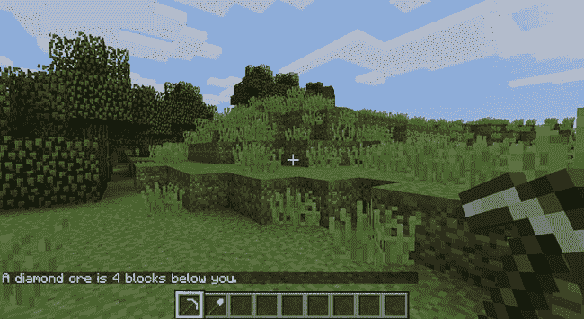

*图 10-6：看起来像是有一个钻石矿石块在我下面四个方块的位置。是时候开始挖掘了！*

**附加目标：那些山里的黄金**

修改 *diamondSurvey.py* 程序，使其也能寻找其他矿石块，比如铁矿石或金矿石。

### 嵌套的 FOR 循环和多维列表

在你的程序中，你可以将多个列表结合使用，达到多种目的。你可以将列表包含在其他列表中，这些被称为*多维列表*。在本节中，我们将使用二维（2D）和三维（3D）列表来在 Minecraft 中构建结构。

#### 在二维中思考

你已经学会了如何编写列表，特别是*一维*列表。它们被称为一维列表，因为列表中的每个位置只包含一个项目。

例如，看看下面这个列表，叫做 `oneDimensionalRainbowList`。这个列表的格式稍有不同，旨在强调每个位置只包含一个项目；否则，它与其他你工作过的列表相同：

```
oneDimensionalRainbowList = [0,
                             1,
                             2,
                             3,
                             4,
                             5]
```

这个列表中有六个项目：数字 0 到 5。列表中的每个项目只有一个值，因此这个列表是一个一维列表。

清单 10-5 在 Minecraft 中显示了这个列表，作为羊毛方块。程序文件 *rainbowStack1.py* 可在书本的资源中找到。你可以从 *[`www.nostarch.com/pythonwithminecraft/`](https://www.nostarch.com/pythonwithminecraft/)* 下载代码文件，或者自己输入并一起玩！

*rainbowStack1.py*

```
   from mcpi.minecraft import Minecraft
   mc = Minecraft.create()

➊ oneDimensionalRainbowList = [0, 1, 2, 3, 4, 5]

   pos = mc.player.getTilePos()
   x = pos.x
   y = pos.y
   z = pos.z

➋ for color in oneDimensionalRainbowList:
       mc.setBlock(x, y, z, 35, color)
       y += 1
```

*清单 10-5：构建一个彩虹堆叠的方块*

程序首先创建一个方块颜色的列表➊，然后使用`for`循环基于列表中的颜色来创建一个颜色堆叠的羊毛方块➋。

当你运行程序时，你会得到一个单一的羊毛方块堆叠，如图 10-7 所示。注意，这个堆叠有六个方块高和一个方块宽。你在本书中一直使用的`x`、`y`和`z`变量，每一个都可以被称为*维度*。这个程序在 y 维度上创建了一个六个方块高的堆叠。通过在代码的最后一行更改`x`变量，而不是`y`变量，你可以在 x 维度上创建一个方块堆叠，正如你在图 10-8 中看到的那样。

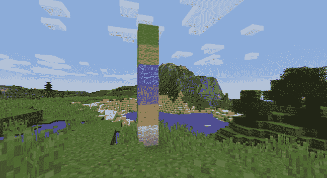

*图 10-7：由* rainbowStack1.py *创建的彩虹方块堆叠*

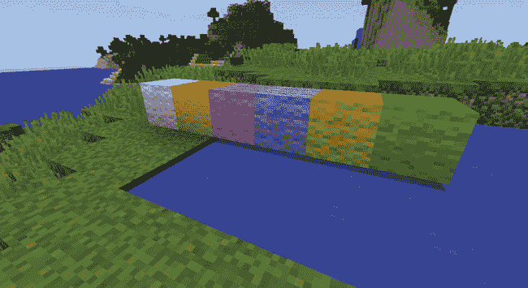

*图 10-8：在程序的最后一行将* `y` *变量替换为* `x` *变量，会在水平方向上构建方块。*

由于列表是一维的，你一次只能更改一个维度上的一个变量。换句话说，你可以更改`y`变量、`x`变量或`z`变量，但不能一次性更改所有这些变量。

现在是时候开始考虑二维了！一维列表允许你在每个位置只存储一个值，而二维列表允许你在每个位置存储多个值。你可以通过在原始列表的每个位置放置一个列表来实现，如下所示。

```
➊ twoDimensionalRainbowList = [[0, 0, 0],
➋                              [1, 1, 1],
➌                              [2, 2, 2],
                               [3, 3, 3],
                               [4, 4, 4],
➍                              [5, 5, 5]]
```

仔细观察，你会看到第一行有一个开括号，后面跟着一个充满零的列表，然后是一个逗号 ➊。那是一个列表里面嵌套了另一个列表！我们可以称外部的列表为*外层列表*，并说它包含*嵌套列表*。

在索引位置 1 是一个包含三个 1 的列表 ➋。在索引位置 2 是另一个列表，这个列表包含三个 2 ➌。这个模式在每一行中都会重复。最后一行是一个包含三个 5 的列表，后面跟着一个方括号，关闭了外层列表 ➍。这段代码展示了一个包含六个项的列表，每一项本身也是一个列表。这就是一个二维列表！

当你在 Minecraft 中使用二维列表时，你会更好地理解它们。我们来看一个例子。通过修改*rainbowStack1.py*，我们可以让它与二维列表一起工作。这个新程序被命名为*rainbowRows.py*：

*rainbowRows.py*

```
   from mcpi.minecraft import Minecraft
   mc = Minecraft.create()

   twoDimensionalRainbowList = [[0, 0, 0],
                                [1, 1, 1],
                                [2, 2, 2],
                                [3, 3, 3],
                                [4, 4, 4],
                                [5, 5, 5]]

   pos = mc.player.getTilePos()
   x = pos.x
   y = pos.y
   z = pos.z

➊ startingX = x

➋ for row in twoDimensionalRainbowList:
➌     for color in row:
➍         mc.setBlock(x, y, z, 35, color)
➎         x += 1
➏     y += 1
➐     x = startingX
```

在我解释代码之前，请查看图 10-9，以查看*rainbowRows.py*的输出，这是一组在 y 维度上有六个方块高，在 x 维度上有三个方块宽的方块。

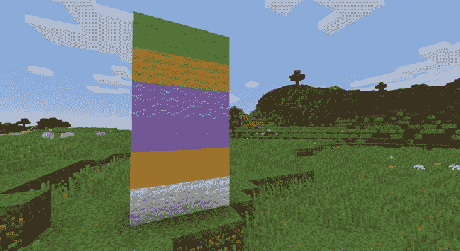

*图 10-9：使用二维列表制作彩虹墙*

因为我们正在处理二维数据，所以需要两个`for`循环来输出`twoDimensionalRainbowList`列表中的值。第一个循环遍历外层列表中的每个项 ➋。第二个循环 ➌，因为它在另一个循环内，所以被称为*嵌套循环*，然后遍历每个嵌套列表中的项。

例如，外层循环第一次运行时，它会获取`twoDimensionalRainbowList`列表中索引位置为 0 的项，并将其存储在一个名为`row`的变量中 ➋。`row`的值是`[0, 0, 0]`，因为这是列表中的第一个项。

第二个循环遍历`row`列表中的每个项目，并将其存储在`color`变量中 ➌。在这个例子中，每个项目的值将是 0。程序然后使用`color`变量来设置每个羊毛块的颜色 ➍。嵌套循环在放置完该行的所有三个块后结束，然后外部循环再次运行。接下来，外部循环移动到索引位置 1，并将该位置的值存储在`row`变量中，此时`row`的值是`[1, 1, 1]`。然后再次执行嵌套循环来设置块，并继续迭代，直到到达`twoDimensionalRainbowList`列表的末尾。

在处理二维数据时，你可以同时改变两个坐标变量。在这个例子中，我们在外部`for`循环的倒数第二行 ➏ 增加`y`变量，使得每一行的块都会放置在上一行的上方。我们还在嵌套的`for`循环中增加`x`变量 ➎，以确保块按行排列。然后，每次外部`for`循环迭代时，我们需要将`x`变量重置为它的原始值（该值存储在`startingX`变量 ➊ 中）。重置`x`变量使得每一行的第一个块直接放置在上一行第一个块的正上方，依此类推，因此行与行之间能够正确对齐。

#### 访问二维列表中的值

在获取或设置一维列表中的值时，你只需要使用方括号和索引位置。例如，这段代码创建了一个名为`scores`的列表来记录玩家的得分，然后它将索引位置 2 处的项从 6 改为 7：

```
scores = [1, 5, 6, 1]
scores[2] = 7
```

使用或更改二维列表中的值并没有太大不同。你仍然使用方括号和索引位置，但因为你同时访问两个列表，所以需要使用两组索引和方括号。我们来看一下！

这是你之前看到的列表：

```
twoDimensionalRainbowList = [[0, 0, 0],
                             [1, 1, 1},
                             [2, 2, 2],
                             [3, 3, 3],
                             [4, 4, 4],
                             [5, 5, 5]]
```

如果我们想将第一个列表（索引位置 0）中第二个项目（索引位置 1）的值改为 7，我们可以使用以下代码：

```
twoDimensionalRainbowList[0][1] = 7
```

因为我们使用了两个列表，并且一个列表嵌套在另一个列表中，所以我们需要使用两组方括号。第一组方括号选择`twoDimensionalRainbowList`列表的索引位置 0，这是它的第一个嵌套列表。在第二组方括号中，我们放入想要访问的嵌套列表中的索引位置 1。然后，我们使用等号将该位置的值设置为 7。

我将这段代码添加到*rainbowRows.py*程序中（第 211 页），并重新运行。 图 10-10 显示了结果。注意到第一行的第二个块已经改变，因为我们将嵌套列表中的值改为 7。

如果你想获取二维列表中某个项目的值，也需要使用两组方括号。例如，如果你想打印最后一行（索引 5）中第一个位置（索引 0）的值，你可以使用以下代码：

```
print(twoDimensionalRainbowList[5][0])
```

这段代码输出值 5。

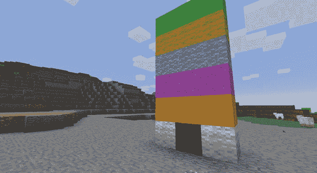

*图 10-10：更改嵌套列表中的一个值以获得不同的结果*

#### 任务 #61：像素艺术

*像素*是构成你计算机上图像的单色方块。通过将许多像素组合成网格，你的计算机可以显示文本、图像、视频以及显示在屏幕上的其他所有内容。你计算机上的所有照片和绘画都是通过像素显示的。

像素艺术在《Minecraft》中非常流行。玩家通过使用不同颜色的方块在《Minecraft》中构建图片。在二维视频游戏中的人物图片是最受欢迎的之一。你可以手工创建像素艺术，当然，也可以使用 Python 程序生成像素艺术。

在这个程序中，你将使用二维列表和嵌套循环在《Minecraft》中创建像素艺术。列表 10-6 包含程序的开始部分。将其复制到一个名为 *pixelArt.py* 的新文件中，并将其保存在 *forLoops* 文件夹中。

*pixelArt.py*

```
   from mcpi.minecraft import Minecraft
   mc = Minecraft.create()

   pos = mc.player.getTilePos()
   x, y, z = pos.x, pos.y, pos.z

➊ blocks = [[35, 35, 35, 35, 35, 35, 35, 35],
             [35, 35, 35, 35, 35, 35, 35, 35],
             [35, 35, 35, 35, 35, 35, 35, 35],
             [35, 35, 35, 35, 35, 35, 35, 35]]

➋ for row in reversed(blocks):
       for block in row:
           mc.setBlock(x, y, z, block)
           x += 1
       y += 1
       x = pos.x
```

*列表 10-6：绘制笑脸的二维列表*

该程序创建了一个名为 `blocks` 的二维列表，其中包含方块 ID ➊，然后使用两个循环将方块放置到《Minecraft》世界中 ➋。为了确保当列表被放置到《Minecraft》时，列表的第一行位于顶部，最后一行位于底部，第一 `for` 循环中包含了 `reversed()` 函数 ➋。如果没有这个函数，图像的顺序将与 `blocks` 列表的顺序相反，显示成倒置的样子。

目前，所有的方块都是白色羊毛方块，并且没有显示图片。为了完成程序，你需要重写二维方块列表，使其绘制一个笑脸，如图 10-11 所示。

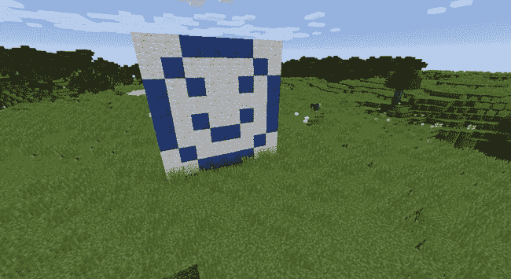

*图 10-11：用方块绘制的笑脸*

更改列表中的一些值，使输出与图 10-11 匹配。你需要将列表中的一些羊毛方块（方块 ID 35）更改为青金石方块（方块 ID 22）。例如，将第一行更改为以下内容：

```
blocks = [[35, 35, 22, 22, 22, 22, 35, 35],
```

你还需要向 `blocks` 列表中添加更多的行，以便图像的高度与图片中的高度匹配。

**额外目标：自己绘制**

尝试更改 *pixelArt.py* 中二维列表的值，以显示不同的图片。你还可以改变列表的长度。先在方格纸上画出设计图。然后将其转换为二维列表，以便你可以在《Minecraft》中创建它们！

#### 使用循环生成二维列表

使用随机数的程序很有趣，因为每次运行时它们的行为都会不同。在过去，我创建了很多使用随机数的程序，它们利用二维列表来创建图片。每个随机数可能显示一个颜色，或者在《Minecraft》中，显示一个不同的方块。

这是一个生成随机数并将其存储在二维列表中的程序的开头：

```
   import random
➊ randomNumbers = []
   for outer in range(10):
➋     randomNumbers.append([])
       for inner in range(10):
➌         number = random.randint(1, 4)
           randomNumbers[outer].append(number)
   print(randomNumbers)
```

程序从一个空的列表 `randomNumbers` 开始 ➊。每当外层的 `for` 循环重复时，它会将一个新的空列表添加到 `randomNumbers` 列表中 ➋。在内层循环中，程序会生成一个介于 1 和 5 之间的随机数，并将其存储在内层列表中 ➌。内层循环重复 10 次，为每个内层列表生成 10 个项目。

为了提高可读性，我们添加了换行符，程序的输出如下所示（请注意，10 个内层列表中有 10 个项目）：

```
[[3, 1, 4, 1, 4, 1, 2, 3, 2, 2],
 [1, 3, 4, 2, 4, 3, 4, 1, 3, 2],
 [4, 2, 4, 1, 4, 3, 2, 3, 4, 4],
 [1, 4, 3, 4, 3, 4, 3, 3, 4, 4],
 [3, 1, 4, 2, 3, 3, 3, 1, 4, 2],
 [4, 1, 4, 2, 3, 2, 4, 3, 3, 1],
 [2, 4, 2, 1, 2, 1, 4, 2, 4, 3],
 [3, 1, 3, 4, 1, 4, 2, 2, 4, 1],
 [4, 3, 1, 2, 4, 2, 2, 3, 1, 2],
 [3, 1, 3, 3, 1, 3, 1, 4, 1, 2]]
```

通过将随机数融入到你的二维 Minecraft 创作中，你可以创建一些非常酷的效果，而这些效果是手动创建难以实现的！

#### 任务 #62：风化的墙壁

当我在 Minecraft 中建造墙壁时，我不会使用单一的方块类型。通过将一些圆石方块换成苔石圆石方块，我可以把一堵普通的墙变成看起来受损、风化、有机且酷的墙壁。虽然手动建墙很有趣，但我永远无法让我随机添加的方块看起来足够随机。你可能已经猜到，让破损墙壁看起来更随机的解决方案就是使用 Python 程序。

要使用 Python 生成风化墙壁，你需要将程序分解为两个主要步骤：

1.  创建一个二维列表，并将方块值存储在该列表中。

1.  将二维列表输出到 Minecraft 世界中。

为了帮助你入门，清单 10-7 包括了选择随机方块值、设置列表和获取玩家位置的代码。将清单复制到一个名为 *brokenWall.py* 的新文件中，并保存在 *forLoops* 文件夹中。

*brokenWall.py*

```
   from mcpi.minecraft import Minecraft
   mc = Minecraft.create()

   import random

➊ def brokenBlock():
       brokenBlocks = [48, 67, 4, 4, 4, 4]
       block = random.choice(brokenBlocks)
       return block

   pos = mc.player.getTilePos()
   x, y, z = pos.x, pos.y, pos.z

   brokenWall = []
   height, width = 5, 10

   # Create the list of broken blocks

   # Set the blocks
```

*清单 10-7：创建破损墙壁的程序开始部分*

`brokenBlock()` 函数返回一个随机方块值，用于构建墙体 ➊。`width` 和 `height` 变量设置墙体的宽度和高度。

要完成程序，你需要生成一个二维的方块值列表，然后使用这些值在 Minecraft 中构建设计。

从空列表 `brokenWall` 开始。使用嵌套在另一个 `for` 循环中的 `for` 循环，利用 `brokenBlock()` 函数生成随机方块值。将方块值存储在列表中，并将这些列表存储在 `brokenWall` 列表中。然后使用另一组嵌套循环将方块放置到 Minecraft 中。

当程序完成后，前往 Minecraft 世界中你想要建造风化墙壁的地方，运行代码。你可以使用该程序装饰城堡，或在森林中创建看起来阴森的废墟。尝试不同的位置，看看你最喜欢哪一个！图 10-12 显示了运行程序后墙壁的样子。

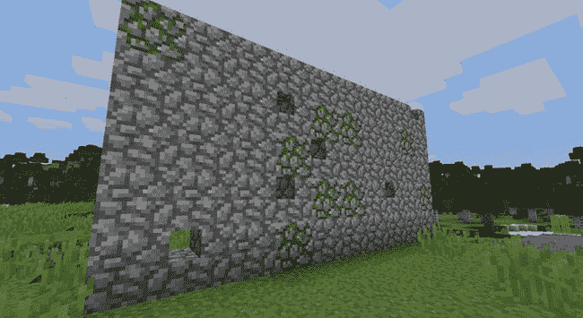

*图 10-12：一个随机生成破损方块的墙壁。看起来像是被幽灵附身了！*

**额外目标：创建一个五彩斑斓的墙壁**

在*brokenWall.py*程序中，修改`brokenBlock()`函数中`brokenBlocks`列表中的方块值，可以创建各种墙壁。试试把方块值改成不同颜色的羊毛，看看会发生什么！

#### 三维思维

当然，Minecraft 是一个使用三维空间的游戏。在本书中，你也使用了三维空间。你在大多数程序中使用的`x`、`y`和`z`变量代表了一个维度。

你已经学会了如何将一个列表嵌套到另一个列表中，从而得到二维列表，并创建炫酷的像素艺术和风化墙壁。将第三组列表嵌套到二维列表中，就能创建三维列表，这可以让你将建筑技能提升到全新的维度！

三维列表在 Minecraft 中非常有用，因为你可以用它们来复制三维结构，比如建筑、雕塑以及许多其他东西。

清单 10-8 中的三维列表有四个嵌套在其中的列表。值得注意的是，在这些嵌套列表的每个索引中，都有一个列表！基本上，这个列表中的每个元素都是一个二维列表。我已添加空白注释，以便使列表更易于阅读。

```
cube = [[[57, 57, 57, 57],
         [57, 0, 0, 57],
         [57, 0, 0, 57],
         [57, 57, 57, 57]],
         #
        [[57, 0, 0, 57],
         [0, 0, 0, 0],
         [0, 0, 0, 0],
         [57, 0, 0, 57]],
        #
        [[57, 0, 0, 57],
         [0, 0, 0, 0],
         [0, 0, 0, 0],
         [57, 0, 0, 57]],
        #
        [[57, 57, 57, 57],
         [57, 0, 0, 57],
         [57, 0, 0, 57],
         [57, 57, 57, 57]]]
```

*清单 10-8：一个包含嵌套列表的三维列表*

这样的代码可以用来创建一个酷炫的立方体结构！接下来，我们将深入研究一个正好做到这一点的程序。

#### 输出三维列表

三维列表非常适合存储有关三维物体的数据，比如你在 Minecraft 中的那些炫酷建筑。存储三维物体很重要，而将它们正确输出到 Minecraft 中同样重要。因为三维列表是一个嵌套在列表中的列表，所以你可以使用一个`for`循环嵌套在另一个`for`循环中，再嵌套在第三个`for`循环中，以访问所有数据。换句话说，你可以使用三个嵌套的`for`循环。

在清单 10-9 中，我复制了清单 10-8 中的三维列表，并创建了一个名为*cube.py*的程序。这个程序使用了三个嵌套的`for`循环，逐个输出三维列表中的所有值，以在 Minecraft 世界中构建一个立方体结构。

*cube.py*

```
   from mcpi.minecraft import Minecraft
   mc = Minecraft.create()

   pos = mc.player.getTilePos()
   x = pos.x
   y = pos.y
   z = pos.z
   cube = [[[57, 57, 57, 57], [57, 0, 0, 57], [57, 0, 0, 57], [57, 57, 57, 57]],
           [[57, 0, 0, 57], [0, 0, 0, 0], [0, 0, 0, 0], [57, 0, 0, 57]],
           [[57, 0, 0, 57], [0, 0, 0, 0], [0, 0, 0, 0], [57, 0, 0, 57]],
           [[57, 57, 57, 57], [57, 0, 0, 57], [57, 0, 0, 57], [57, 57, 57, 57]]]

   startingX = x
➊ startingY = y
➋ for depth in cube:
       for height in reversed(depth):
           for block in height:
               mc.setBlock(x, y, z, block)
               x += 1
           y += 1
           x = startingX
➌     z += 1
➍     y = startingY
```

*清单 10-9：用来创建由钻石构成的三维立方体的代码*

图 10-13 展示了这个程序的结果。

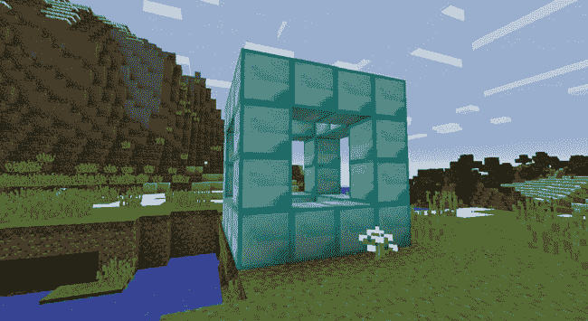

*图 10-13：*cube.py*程序创建的立方体*

*cube.py*中的代码与用于构建彩虹墙的二维*rainbowRows.py*程序非常相似（见第 211 页）。主要区别在于，*cube.py*使用了三个`for`循环，而不是两个，因为它处理的是三维列表。额外的`for`循环为结构增加了一个额外的维度，即深度➋。所以，现在结构有了宽度、高度和深度。

每次外层循环`for depth in cube`运行时，它会通过两个嵌套循环`for height in reversed(depth)`和`for block in height`创建一个二维列表。这两个嵌套循环中的代码与*rainbowRows.py*程序中的代码类似，这意味着这些循环在 Minecraft 中建造了一堵墙。

让我们看看每次外层循环重复时的结果，这样我们就能一步步看到立方体的构建过程。第一次外层循环运行时，它会输出`cube`列表中索引位置 0 的方块。该列表如下所示：

```
[[57, 57, 57, 57],
 [57, 0, 0, 57],
 [57, 0, 0, 57],
 [57, 57, 57, 57]]
```

图 10-14 展示了输出结果：我们的第一堵块墙。

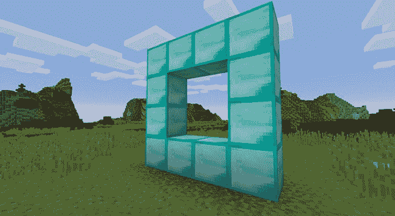

*图 10-14：第一个二维循环的结果，* `cube` *索引 0*

每次游戏中构建完一个二维列表后，*cube.py* ➌中的`z`变量会增加，沿 z 轴移动一个方块。这赋予了立方体深度，这样我们就不仅仅是在建造一堵墙。此外，我们还需要将`y`变量的值在➍时重置为其原始值 ➊，这样每次外层循环重复时，立方体底部的方块就能对齐。如果`y`变量没有被重置，每组方块的 y 坐标将不断增高，最终会形成一些奇怪的阶梯！图 10-15 展示了这种情况。

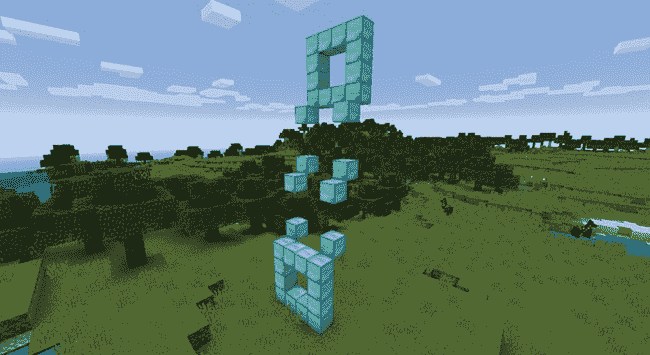

*图 10-15：我们重置了* `y` *变量，所以这种情况不会发生！*

第二次外层循环运行时，它会输出`cube`列表中索引位置 1 的块，结果如下：

```
[[57, 0, 0, 57],
 [0, 0, 0, 0],
 [0, 0, 0, 0],
 [57, 0, 0, 57]]
```

这添加了立方体的下一部分，如图 10-16 所示。在这部分立方体构建完成后，`z`变量增加了 1 ➌，`y`变量再次被重置为原始值 ➍。


*图 10-16：第二个二维循环的结果，* `cube` *索引 1*

下一次循环重复时，它会输出`cube`列表中索引位置 2 的二维列表：

```
[[57, 0, 0, 57],
 [0, 0, 0, 0],
 [0, 0, 0, 0],
 [57, 0, 0, 57]]
```

图 10-17 展示了结果。同样，`z`值增加了 1，`y`值被重置。

然后循环再次运行第四次并最后一次，输出`cube`的索引位置 3：

```
[[57, 57, 57, 57],
 [57, 0, 0, 57],
 [57, 0, 0, 57],
 [57, 57, 57, 57]]
```

图 10-18 展示了完成的立方体结构。

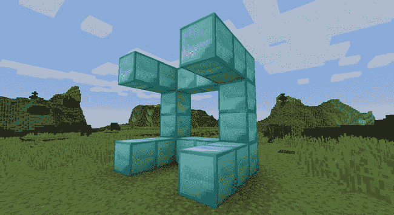

*图 10-17：第三个二维循环的结果，* `cube` *索引 2*

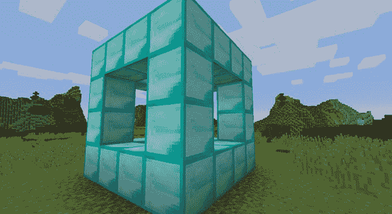

*图 10-18：最后一个二维循环的结果，位于最终的* `cube` *索引位置*

尝试一下这个程序——使用不同的方块类型，尝试构建更大的立方体，或者尝试任何你能想象到的变化！在下一节中，我将向你展示如何访问三维列表中的值，这样你就可以做出这些改变。

#### 访问三维列表中的值

三维列表中的值可以像一维和二维列表一样，通过使用方括号和索引位置进行修改。

让我们从三维钻石立方体列表开始：

```
cube = [[[57, 57, 57, 57],
         [57, 0, 0, 57],
         [57, 0, 0, 57],
         [57, 57, 57, 57]],
         #
        [[57, 0, 0, 57],
         [0, 0, 0, 0],
         [0, 0, 0, 0],
         [57, 0, 0, 57]],
         #
        [[57, 0, 0, 57],
         [0, 0, 0, 0],
         [0, 0, 0, 0],
         [57, 0, 0, 57]],
         #
        [[57, 57, 57, 57],
         [57, 0, 0, 57],
         [57, 0, 0, 57],
         [57, 57, 57, 57]]]
```

我想把我立方体前面的底部左侧方块改为金色。

首先，我需要访问包含立方体前面的立方体列表的索引，那个索引是 0。所以表达式的第一部分将像这样：

```
cube[0]
```

如果我打印这个表达式的值，我将得到如下输出（我已将其格式化以便更易阅读）：

```
[[57, 57, 57, 57],
 [57, 0, 0, 57],
 [57, 0, 0, 57],
 [57, 57, 57, 57]]
```

这个二维列表表示立方体的前面。接下来，我想访问最底部的行，也就是索引 3。于是我在表达式中加上 `[3]`：

```
cube[0][3]
```

如果我打印存储在这个位置的列表，我将得到如下结果：

```
[57, 57, 57, 57]
```

最后，我想访问这一行中最左边的方块，它的索引是 3。所以最终的表达式将是这样，用来将底部左侧的方块改为金色方块：

```
cube[0][3][3] = 41
```

当我运行带有这个代码行的 *cube.py* 程序时，我得到一个由钻石制成的立方体，中间有一个单一的金色方块，如 图 10-19 所示。

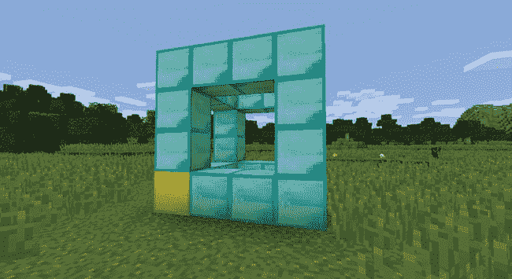

*图 10-19：修改后的立方体，角落处有一个金色方块*

#### 任务 #63: 复制一个建筑

尽管使用 Python 程序在 Minecraft 中建造物品能节省大量时间，但如果你像我一样，可能仍然会花费相当多的精力在建筑中添加细节，比如图片和家具。有时你可能需要制作一个特定物品的完全复制品，而手动复制一个物品可能需要花费很多时间。一个一个地放置方块也很繁琐，而且你可能会把方块放错位置。显然的解决方案是制作一个程序，它能在 Minecraft 中复制一个建筑，并在游戏中为你建造出一个副本！

完成的程序需要做两件事：首先，它会复制游戏中的一个区域，并将其存储在一个三维列表中；然后，它将使用这个三维列表来建造复制的结构。

我已经将程序的开头部分包括在 清单 10-10 中，以帮助你。将清单复制到一个新文件中，并将其保存为 *duplicateArea.py* 在 *forLoops* 文件夹中。

*duplicateArea.py*

```
   from mcpi.minecraft import Minecraft
   mc = Minecraft.create()

➊ def sortPair(val1, val2):
       if val1 > val2:
           return val2, val1
       else:
           return val1, val2

➋ def copyStructure(x1, y1, z1, x2, y2, z2):
       # Sort the highest and lowest x, y, and z values
       x1, x2 = sortPair(x1, x2)
       y1, y2 = sortPair(y1, y2)
       z1, z2 = sortPair(z1, z2)

       width = x2 - x1
       height = y2 - y1
       length = z2 - z1

       structure = []

       print("Please wait...")

➌     # Copy the structure

       return structure

➍ def buildStructure(x, y, z, structure):
       xStart = x
       yStart = y

➎     # Build the structure

   # Get the position of the first corner
➏ input("Move to the first corner and press enter in this window")
   pos = mc.player.getTilePos()
   x1, y1, z1 = pos.x, pos.y, pos.z

   # Get the position of the second corner
➐ input("Move to the opposite corner and press enter in this window")
   pos = mc.player.getTilePos()
   x2, y2, z2 = pos.x, pos.y, pos.z

   # Copy the building
➑ structure = copyStructure(x1, y1, z1, x2, y2, z2)

   # Set the position for the copy
➒ input("Move to the position you want to create the structure and press ENTER 
          in this window")
   pos = mc.player.getTilePos()
   x, y, z = pos.x, pos.y, pos.z
   buildStructure(x, y, z, structure)
```

*清单 10-10：当程序完成时，它将复制建筑。*

这个程序分为几个部分。首先，`sortPair()` 函数 ➊ 将一对值排序，较小的值放在第一个索引位置，较大的值放在第二个索引位置。例如，如果我给 `sortPair()` 传入 9 和 3，它会返回一个元组 `(3, 9)`，因为 3 小于 9。我使用这个函数来对 `x`、`y` 和 `z` 的值进行排序，这样在计算时，`width`、`length` 和 `depth` 变量始终为正值。

接下来，`copyStructure()` 函数 ➋ 从游戏世界中复制结构，但它尚未完成 ➌。`buildStructure()` 函数 ➍ 用来构建结构，但它也未完成 ➎。你将在本任务中完成这两个函数。

我添加了一个巧妙的技巧，来获取你想要复制的建筑的坐标和你希望复制建筑物的位置：使用`input()`函数，程序首先要求你将角色移动到建筑物的一个角落并按 ENTER 键 ➏。`input()`函数会使程序等待，直到你将玩家移动到你希望他们停留的位置。一旦按下 ENTER 键，它会使用`getTilePos()`函数获取玩家的位置。我们在建筑物的对角线另一端再次执行相同的操作 ➐。然后，`copyStructure()`函数使用这两组坐标来复制建筑物 ➑。（当复制较大的结构时，这部分程序可能需要一些时间才能运行。）最后，你移动到你希望建筑物建造的地方并按 ENTER 键 ➒，将玩家的最后位置传递给`buildStructure()`函数。

为了完成程序，你需要完成`copyStructure()`和`buildStructure()`函数。在`copyStructure()`函数中添加三个嵌套循环，以将参数中给出的坐标之间的所有方块复制到一个三维列表中 ➌。为了完成`buildStructure()`函数，添加三个嵌套的`for`循环，从三维列表中输出方块值 ➎。该函数应该使用给定坐标作为参数。

确保程序能够处理结构内部的`x`、`y`和`z`坐标。使用`for`循环更改`x`、`y`和`z`的位置。

虽然*duplicateArea.py*是一个较长的程序，但它非常有用，值得付出努力。完成这个任务后，你将能够在 Minecraft 世界中建造整个城市！我使用*duplicateArea.py*复制了一个我在探索时发现的有趣悬崖。图 10-20 展示了我想要复制的悬崖。

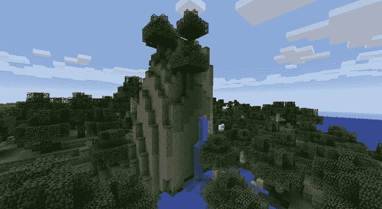

*图 10-20：我喜欢这个悬崖的外观，所以我做了一个复制。*

使用*duplicateArea.py*程序进行复制时，首先站在物体的外面（如果你的结构是建筑物的话），靠近你想要复制的物体的底部角落。然后在 IDLE 中按 ENTER 键。图 10-21 展示了我站在第一个角落的样子。

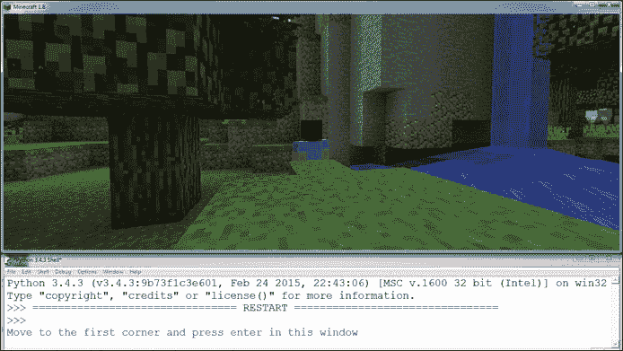

*图 10-21：首先我移动到结构的一个角落并在 IDLE 中按下 ENTER 键。*

接下来，飞到你想要复制的物体的对角线另一端，并按第二次 ENTER 键。图 10-22 展示了我已经飞到空中，并围绕悬崖周围移动。

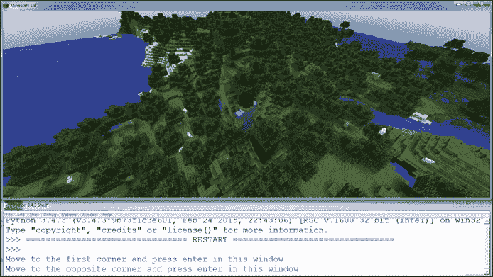

*图 10-22：然后我移动到结构的对角线另一端并按下 ENTER 键。*

程序会发送一条消息，提示你稍等片刻，因为结构正在被复制。移动到你想要构建复制品的位置，然后等待一条消息，询问你希望在何处建造新的结构（图 10-23）。

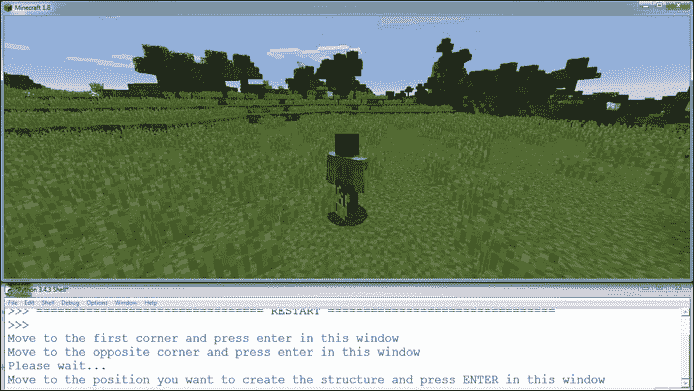

*图 10-23：我等了一会儿让结构复制完成。然后我移动到想要构建复制品的位置，按下 ENTER 键来构建它。*

当你到达合适的位置时，按下 ENTER 键，复制品就会直接在你面前建成！图 10-24 展示了我复制的悬崖。

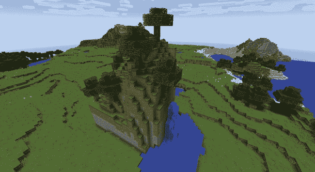

*图 10-24：原始悬崖的复制品！*

### 你学到了什么

本章内容涵盖了很多内容。你学会了如何使用`for`循环与列表，并且了解了如何使用`range()`函数。你还学习了更多关于`for`循环和列表的内容，例如反转列表、循环遍历字典以及如何中断`for`循环。你通过嵌套循环创建了二维和三维列表，这对构建一个精彩的 Minecraft 世界非常有用。

从生成楼梯和金字塔到复制结构和创建艺术品，你现在对 Minecraft 的控制能力比以往任何时候都更强了。本章中的程序是我在书中最喜欢的一些程序，它们将帮助你创建自己的高级项目！

本章和第九章重点讲解了列表和`for`循环，它们是密切相关的。在第十一章中，你将进入文件和模块的内容，这些内容与函数密切相关，而你在整本书中都在使用函数。作为任务的一部分，你将学会如何从文件中保存和加载结构。
