## **11**

**使用文件和模块保存与加载建筑物**


文件是计算机中的一个重要部分。它们允许你保存数据进行长期存储，并加载数据用于程序中。到目前为止，你所使用的程序仅将数据存储在变量中。你可能在程序中使用了硬编码的数据，或者从用户输入中获取数据。虽然你可以使用这些数据做出惊人的事情，但你的操作仅限于单一会话和你自己的 Minecraft 世界。一旦你学会了如何存储和检索数据，你就可以将你的 Minecraft 创作保存到任何 Minecraft 世界中，甚至是你朋友的游戏里！

在本章中，你将学习如何从文件中获取输入以及如何将数据输出到文件。你将使用一些 Python 的内置函数，并学习如何使用两个 Python 模块，`pickle`和`shelve`模块，来存储整个 Minecraft 创作。

模块可以扩展 Python 的功能。通过使用模块，你可以在屏幕上绘制图像或运行网站。模块还提供了执行常见任务的函数，因此你不需要自己编写解决方案。

你还将学习如何使用 pip，这是一个非常有用的程序，用于安装新的模块。你将通过使用`Flask`模块来创建一个简单的网站，该网站可以连接到 Minecraft 并显示玩家的位置。

### **使用文件**

在使用计算机时，你总是与文件打交道。每次你写文本文件或 Python 代码并保存时，你都在与文件打交道。文本、图片、视频和音乐都是文件！甚至这本书在我写的时候也存储为一个文本文件。Python 的文件处理功能很容易学习，它能让你创建文件、保存文件并从文件中读取信息，从而在 Minecraft 中做出酷炫的事情。让我们从基础开始，学习如何在 Python 中读取和写入文本文件。

#### **打开文件**

打开文件是你在与文件打交道时的第一步。要在 Python 中打开文件，你使用`open()`函数，该函数接受两个参数：文件的位置和权限。文件的*位置*是文件在你计算机上存储的路径。你将以字符串形式将文件位置传递给`open()`函数。文件的*权限*控制 Python 是否被允许读取或修改该文件。

要在 Python 中打开（或创建）一个名为*secretFile.txt*的文本文件，你需要使用参数`"secretFile.txt"`：

```
secretFile = open("secretFile.txt", "w")
```

第二个参数，`"w"`，是权限参数，指定程序对文件可以执行的操作。在这个例子中，`w`表示程序可以向文件*secretFile.txt*写入数据。

当程序调用`open()`函数并提供一个文件名时，Python 首先检查是否已经存在该文件。如果文件存在，Python 将在程序中使用该文件的内容。如果文件不存在，Python 将创建一个新文件。

如果你没有在文件名中指定*目录*（文件夹和目录是同一回事），Python 将会在程序所在的目录中查找文件。如果文件存储在其他目录中，你必须在参数中指定该目录。例如，如果*secretFile.txt* 位于*secrets* 目录中，第一个参数应该是`"/secrets/secretFile.txt"`：

```
secretFile = open("/secrets/secretFile.txt", "w")
```

如果你在参数中提供了一个目录，但该目录不存在，或者文件不存在，你将收到一条错误消息。

权限参数有四种选择：

`w` 这意味着*仅写*。仅写权限允许程序将新数据写入文件并覆盖文件中已有的内容，但程序无法读取文件的内容。如果提供的文件名没有对应的文件，程序将创建一个新文件。

`r` 这意味着*仅读*。仅读权限允许程序读取文件的内容，但程序不能修改文件的内容。此权限无法用于创建新文件。

`r+` 这意味着*读写*。读写权限允许程序读取和更改文件的内容。程序还可以覆盖文件中已存在的任何内容。但是，如果文件不存在，将不会创建一个新文件；相反，你会收到一个错误。

`a` 这代表*追加*。追加权限允许程序仅将新数据写入文件的末尾，而保留文件中的其他内容不变。程序也无法读取文件的内容。这个权限可以用来创建新文件。

在不同的情况下，你会使用不同的权限类型。假设你写下了通往一个极棒的钻石矿的路线，你想将这些路线加载到 Minecraft 中，而不小心更改它们。在这种情况下，你会希望使用仅读权限，确保文件中的内容不会发生变化。或者，如果你希望某人能够向文件添加数据，但不希望他们看到文件中的其他数据，你可以使用追加权限。例如，如果你想让朋友们在共享旅行日志中添加笔记，而不让他们看到你所有关于秘密宝藏的内容，你可以使用追加权限！

接下来，你将学习如何向打开的文件写入数据，并学习如何关闭该文件以便稍后使用这些数据。

#### **写入并保存文件**

`write()` 函数将数据写入程序已打开的文件。这是操作文件时的核心功能，因为它可以让你保存各种数据。你将希望写入文件的数据作为参数传递给 `write()` 函数。

例如，让我们打开一个文件并向其中写入一个简单的字符串：

```
   secretFile = open("secretFile.txt", "w")
   secretFile.write("This is a secret file. Shhh! Don't tell anyone.")
➊ secretFile.close()
```

首先，你必须使用 `open()` 函数打开文件。接着，使用点表示法调用 `write()` 函数，将字符串写入 *secretFile.txt* 文件。然后，你需要调用 `close()` 函数 ➊，这会保存并关闭文件。记得一定要包含 `close()` 函数，否则数据将不会存储到文件中。

运行程序，然后在文本编辑器中打开 *secretFile.txt*，查看你的秘密信息是否已保存。尝试更改字符串，写入不同的信息，然后再次运行程序。发生了什么？旧的信息应该被新信息替换了！再试试更改信息，这次不要传递 `"w"`，而是传递 `"a"`。现在发生了什么？很酷吧？

#### **读取文件**

`read()` 函数读取程序打开的文件的全部内容。你可能希望在程序中使用这些数据，修改数据，然后再将其写回文件，或者将数据输出，方便查看。不管是什么原因，你都将使用 `read()` 函数来读取文件。

要读取文件，你必须首先打开文件，然后记得在操作完成后关闭它。当你在程序中处理文件时，养成这个习惯非常重要，以避免出现错误！

让我们读取一个文件，并输出其内容，这样我们就可以看到文件的内容。这个程序 *showSecretFile.py* 使用 `read()` 和 `print()` 函数输出文件内容：

*showSecretFile.py*

```
   secretFile = open("secretFile.txt", "r")

➊ print(secretFile.read())
   secretFile.close()
```

首先，我们打开文件，并传递 `"r"` 作为权限参数，这样程序就可以从文件中读取数据。你也可以传递 `"r+"`，但在这个例子中，我们不需要写入文件，所以使用 `"r"` 最为合适。为了打印出 *secretFile.txt* 的内容，我们将 `secretFile.read()` 传递给 `print` 语句。最后，尽管我们没有向文件写入任何数据，但仍然建议使用 `close()` 函数关闭文件。

运行程序看看会发生什么。*secretFile.txt* 的内容应该会被打印到屏幕上。现在你可以在不需要像往常一样在文本编辑器中打开文件的情况下读取文件内容了！

#### **读取文件的一行**

假设你有一个很长的文本文件，想只查看其中的一部分。这时，`readline()` 函数就非常有用。与 `read()` 函数（该函数获取整个文件内容）不同，`readline()` 函数一次只获取文件中的一行。

要尝试 `readline()` 函数，首先向 *secretFile.txt* 文件中添加一些文本。你可以通过使用文本编辑器或者利用你新学的 Python 技巧来向文件写入一堆信息！如果你使用 Python 写入文件，每当你想换行时，可以在字符串中加入 `\n`。例如，如果你将 `"Cool\nDance\nParty"` 写入文件，Python 会将 `"Cool"` 放在第一行，`"Dance"` 放在第二行，`"Party"` 放在最后一行，如下所示：

```
Cool
Dance
Party
```

在你向*secretFile.txt*添加文本后，将以下代码写入一个 Python 文件，并将文件保存为*showSecretLines.py*，存放在名为*files*的新文件夹中：

*showSecretLines.py*

```
secretFile = open("secretFile.txt", "r")

print(secretFile.readline())
print(secretFile.readline())
print(secretFile.readline())

secretFile.close()
```

你必须再次打开*secretFile.txt*，才能使用`readline()`函数读取它的内容。因为你希望*showSecretLines.py*程序从文件中读取数据，所以你必须再次传入`r`（或`r+`）。接下来，包含三个`print`语句，用于打印*secretFile.txt*的前三行。最后，使用`close()`再次关闭文件。

`readline()`函数从文件的第一行开始。每次使用`readline()`函数时，它会自动读取下一行。这个函数对于打印文本文件开头的几行非常方便。

**注意事项**

*`readline()`* *函数将文件转换为字符串列表，其中列表中的每一项表示文件的一行。如果你想打印文档中间的某一行，可以编写一个循环来查找并打印列表中的特定字符串！*

#### **任务 #64：待办事项列表**

有时候你可能没有太多的空闲时间来玩《我的世界》。你可能会在几天内分短时间段建造复杂的结构。随着你为开门或传送玩家到某个地方添加程序，你的建筑会变得更加复杂，可能需要更长的时间来完成。跨越几天的项目可能会导致你忘记自己在做什么以及接下来需要做什么。这种情况经常发生在我身上。幸运的是，你可以写一个程序来帮助你记住！

本任务中的程序创建了一个待办事项列表，并将其显示在《我的世界》聊天中。你可以使用这个程序来跟踪你的《我的世界》目标，这样当你需要停止游戏时，可以轻松地从中断的地方继续。

为了制作待办事项列表，你将编写两个独立的程序：一个用于写入列表，另一个用于显示列表。让我们从编写写入列表的程序开始。

#### **第一部分：编写待办事项列表**

首先，你需要一个程序来创建待办事项列表中的项目。清单 11-1 使用`while`循环和`input()`函数来添加待办事项。将它复制到 IDLE 中的文件，并将文件保存为*inputToDoList.py*，存放在*files*文件夹中。

*inputToDoList.py*

```
➊ toDoFile =

➋ toDoList = ""

➌ toDoItem = input("Enter a to-do list item: ")

➍ while toDoItem != "exit":
➎     toDoList = toDoList + toDoItem + "\n"
       toDoItem = input("Enter a to-do list item: ")

➏ # Write the to-do list to the file
➐ # Close the file
```

*清单 11-1：开始编写待办事项列表程序的代码*

该程序创建一个空字符串`toDoList` ➋，当你输入待办事项时，它将存储所有的待办事项。程序使用`input()`函数询问你输入一个待办事项 ➌。`while`循环检查输入是否不等于`"exit"` ➍；如果不等，程序将你的项目添加到待办事项列表中，并在末尾加上换行符`"\n"` ➎。然而，如果你输入`"exit"`，循环将停止，你将无法再添加任何项目到待办事项列表中。

你的任务是完成这个程序。为此，你需要编写代码来打开文件、将 `toDoList` 写入文件，然后关闭文件。使用 `open()` 函数在程序开始时打开文件 ➊。你应该以写权限打开它。将该函数打开的文件命名为 *toDoList.txt*。如果文件在目录中不存在，程序会创建该文件。

在程序的最后，将待办事项列表的内容写入文件，以便稍后访问。使用 `write()` 函数将 `toDoList` 变量写入 `toDoFile` ➏。在文件写入之后，确保在最后一行使用 `close()` 函数关闭文件 ➐。

图 11-1 展示了我用程序写待办事项列表。当我完成后，我输入 `exit`。

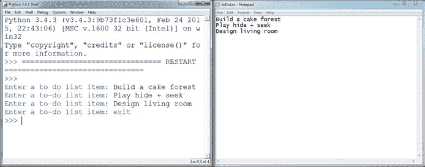

*图 11-1：输入待办事项，例如建造蛋糕森林和玩捉迷藏*

#### **第二部分：显示待办事项列表**

现在你有了一个可以将待办事项写入文件的程序，你需要将待办事项一行一行地显示在 Minecraft 聊天中。清单 11-2 为你提供了程序的起始部分。将该清单复制到一个新文件中，并将其保存为 *outputToDoList.py* 文件，放在 *files* 文件夹中。

*outputToDoList.py*

```
   from mcpi.minecraft import Minecraft
   mc = Minecraft.create()

➊ toDoList =

   for line in toDoList:
➋     # Output "line" to the chat
```

*清单 11-2：将待办事项列表输出到 Minecraft 聊天的程序*

清单 11-2 使用 `for` 循环将 *toDoList.txt* 文件中的每一行输出到 Minecraft 聊天窗口中，一次一行。目前程序还不完整。为了完成程序，请添加 `open()` 函数来打开你用 *inputToDoList.py* 创建的 *toDoList.txt* 文件 ➊。确保文件具有读取权限。打开文件后，在 `for` 循环中添加代码，将存储在 `line` 变量中的字符串输出到 Minecraft 聊天中 ➋。你需要使用 `readline()` 和 `postToChat()` 函数来实现这一点。

图 11-2 展示了我的待办事项列表在 Minecraft 聊天中的样子。

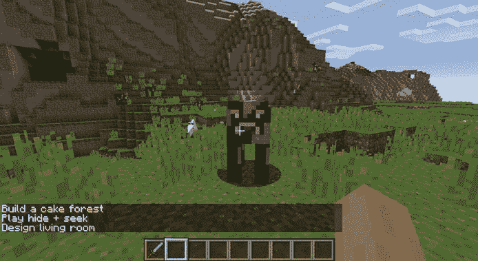

*图 11-2：现在当我回到建造时，我可以看到我需要做的事情。*

### **使用模块**

*模块* 是一组函数，你可以将其导入到 Python 中，这样就无需在程序中自己编写这些函数。一个模块通常有一个特定的用途，例如执行科学计算或制作游戏，Python 有很多种类的模块可供使用。你可能会惊讶地发现，实际上你已经在本书中使用过模块！Minecraft Python API 就是一个模块：每次你写 `from mcpi.minecraft import Minecraft` 时，你就在使用一个模块。Minecraft Python API 模块让你能够将 Python 程序与 Minecraft 连接起来。由于这是别人预先编写的，你可以直接使用模块的函数，而无需自己编写代码。

Python 自带了许多可以在程序中使用的模块。这些模块和你在本书中所学的所有 Python 知识一起，被称为*Python 标准库*。你还可以安装那些不属于标准库的模块；我们将在“使用 pip 安装新模块”中介绍，第 252 页有详细内容。

在本节中，你将学习如何设置程序以使用模块。作为示例，我们将使用`pickle`模块，它提供了比简单的文件读写更先进的保存和加载数据的方法。现在我们来看看`pickle`模块。

#### **PICKLE 模块**

当你需要将复杂数据写入文件时，`pickle`模块非常有用。例如，字典和多维列表使用我们在本章前面介绍的标准函数存储和检索时非常困难。这个时候，`pickle`模块就非常方便了。

`pickle`模块可以帮你节省大量编写和调试自己存储复杂数据解决方案的时间。你还可以使用`pickle`模块处理简单数据：例如，你可以使用它来存储数字，而不必将其转换为字符串并在转换回去，这在标准的文件输入输出中是必须的。

换句话说，你可以使用`pickle`模块将一个变量的值保存在文件中，然后直接在另一个程序中读取这个变量的值，而无需额外的处理。即使数据类型是字符串、整数、浮点数或布尔值，数据类型也会保持与存储时相同。

接下来，你将学习如何以`pickle`为例导入模块。然后你将使用`pickle`保存一些复杂的数据——一个完整的 Minecraft 建筑！

#### **导入 PICKLE**

要使用任何模块的函数，你需要通过`import`关键字导入它们。实际上，你已经使用过`import`关键字导入模块，比如`time`模块，以及来自 Python Minecraft API 的函数。

导入模块到程序后，你可以通过点号符号来使用模块的函数。包括模块名、一个点和你要使用的函数。让我们导入`pickle`模块并使用它的一些函数：

```
➊ import pickle

   locations = {'John': 'Forest', 'Phillipa': 'Mountains', 'Pete': 'City'}

➋ secretFile= open("secretFile.txt", "wb")
➌ pickle.dump(locations, secretFile)
```

我们在➊处导入了`pickle`模块。接下来，我们用特殊的文件权限`"wb"`打开*secretFile.txt*文件➋。当你使用`pickle`打开文件时，必须在文件权限中添加`b`。在这个例子中，`"wb"`会使用`pickle`模块要求的特殊格式将数据写入文件。

`dump()`函数会在➌处写入文件。`pickle`模块的`dump()`函数将一个变量存储到文件中。它接受两个参数：要写入文件的数据和要写入的打开文件。这个示例将秘密特工的位置存储在一个名为`locations`的字典中，然后将该字典转储到一个名为`secretFile`的文件中。由于`dump()`属于`pickle`模块，因此你必须使用点符号来指定模块和函数，写作`pickle.dump()`。与 Python 标准的文件函数不同，`dump()`函数会自动将数据保存到文件中—你不需要使用`close()`函数来关闭文件。

`pickle`模块还允许你读取存储的数据。你可以使用`pickle`的`load()`函数来读取文件的内容。它接受一个参数，即你想要加载的文件，并返回文件的内容。以下示例加载了我们之前存储的`locations`字典。将这段代码添加到程序中：

```
   import pickle

➊ secretFile= open("secretFile.txt", "rb")
   locations = pickle.load(secretFile)
```

首先，我们以权限`"rb"`打开文件 ➊，这允许你的程序读取`pickle`使用的特殊数据格式。然后我们加载字典。

现在字典已经加载，你可以像操作其他字典一样操作它。例如，你可以访问其中一个键的值。只需在`pickle.load()`函数之后添加这段代码：

```
print(locations['Phillipa'])
```

这将打印出`'Mountains'`，即`'Phillipa'`键的值。这是因为当字典被`pickle`加载到程序中时，文件中的字典没有变化—它仍然是一个字典，所以我们可以访问它的键和值，并像使用其他任何 Python 字典一样使用它。你也可以对列表或变量执行相同的操作。

#### **使用 FROM 语句导入一个函数**

导入模块意味着你可以访问该模块中的所有函数，但有时你只需要模块中的一个函数。如果你只想导入一个函数，可以在导入模块时使用`from`语句。这个语句让你在调用函数时无需每次都包含模块名和点符号。你只需要写`function()`，而不是`module.function()`。

有时，当你使用`pickle`模块时，可能只想使用`dump()`函数，而不是它的其他函数。为此，你需要修改你之前写的代码，使其看起来像这样：

```
➊ from pickle import dump

   locations = {'John': 'Forest', 'Phillipa': 'Mountains', 'Pete': 'City'}

   secretFile= open("secretFile", "wb")
➋ dump(locations, secretFile)
```

第一行使用`from`语句只导入了`pickle`模块中的`dump()`函数 ➊。最后一行调用了`dump()`函数 ➋。注意它没有使用点符号。你只需要直接调用函数名，而不需要引用模块名。

你也可以使用`from`从模块中导入多个函数。你只需要用逗号分隔函数名。例如，如果你想在同一个文件中使用`pickle`的`dump()`和`load()`函数，你可以同时导入它们：

```
➊ from pickle import dump, load
   locations = {'John': 'Forest', 'Phillipa': 'Mountains', 'Pete': 'City'}

   secretFile= open("secretFile", "wb")
➋ dump(locations, secretFile)

➌ locations = load(secretFile)
   print(locations['Phillipa'])
```

第一行使用`from`子句和逗号导入了`dump()`和`load()`函数➊。这意味着在程序的后续部分，你可以使用这些函数，而无需包含函数名和点号表示法，你可以在➋和➌看到这一点。

#### **导入所有函数使用***

你还可以导入一个模块中的所有函数，这样每次使用时就不需要再加上模块名和点号表示法。你可以通过在`import`语句的末尾输入星号（`*`）来实现，像这样：

```
➊ from pickle import *
   locations = {'John': 'Forest', 'Phillipa': 'Mountains', 'Pete': 'City'}

   secretFile= open("secretFile", "wb")
➋ dump(locations, secretFile)

➌ locations = load(secretFile)
   print(locations['Phillipa'])
```

由于这段代码使用星号➊导入了模块中的所有函数，所以我们在调用`dump()`➋和`load()`➌函数时不需要使用点号表示法。

`*`选项非常方便，但它也有风险！如果你同时使用多个模块，两个模块可能会有相同的函数名。发生这种情况时，Python 可能会感到困惑，并出现错误。因此，当你使用多个模块时，最好避免使用`*`选项，而是只导入你需要使用的函数。

#### **为模块起个昵称**

有时你可能会想重命名一个模块，因为它的名字太长，你希望在程序中使用更短的名字。或者，你希望修改模块名使其更容易记住。又或者，模块的名字可能与另一个模块相同，你想避免冲突。

你可以使用`as`子句和`import`语句为模块指定一个*别名*——一个昵称。例如，这段代码导入了`pickle`模块，并将其重命名为`p`：

```
import pickle as p
```

现在，每次你想使用`pickle`模块时，你可以在程序中写`p`，而不是`pickle`。下面是一个实际应用的例子：

```
p.dump(locations, secretFile)
```

注意，使用了`p.dump()`而不是`pickle.dump()`。这样节省了时间，因为你不需要反复输入`pickle`了！

#### **任务 #65：保存一个建筑物**

在 Minecraft 中，建造东西是我最喜欢的部分。我已经花了几个小时建造房屋、城堡、村庄以及许多其他东西。但是当我移动到地图的另一部分或进入不同的世界时，我必须把我的创作留下。我敢肯定你也有过不得不放弃一些精彩创作的经历。

如果你能保存你的建筑物并在进入不同的世界时带着它们，那不是很酷吗？好了，借助`pickle`和 Python API，你完全可以做到！

在这个任务中，你将开发两个程序来保存和加载 Minecraft 中的建筑物。一个程序将存储建筑物，另一个将加载建筑物。这两个程序基于第十章中的*duplicateArea.py*（第 225 页）。

#### **第一部分：保存建筑物**

第一个程序将把一个建筑物保存到文件中。示例 11-3 包括了复制建筑物的代码。将此代码复制到 IDLE 中的一个文件，并将其保存为*saveStructure.py*，并放在*files*文件夹中。

*saveStructure.py*

```
   from mcpi.minecraft import Minecraft
   mc = Minecraft.create()

   import pickle

   def sortPair(val1, val2):
       if val1 > val2:
           return val2, val1
       else:
           return val1, val2

➊ def copyStructure(x1, y1, z1, x2, y2, z2):
       x1, x2 = sortPair(x1, x2)
       y1, y2 = sortPair(y1, y2)
       z1, z2 = sortPair(z1, z2)

       width = x2 - x1
       height = y2 - y1
       length = z2 - z1

       structure = []

       print("Please wait..." )

       # Copy the structure
       for row in range(height):
           structure.append([])
           for column in range(width):
               structure[row].append([])
               for depth in range(length):
➋                 block = mc.getBlock(x1 + column, y1 + row, z1 + depth)
                   structure[row][column].append(block)

       return structure

➌ # Get the position of the first corner
   input("Move to the first position and press ENTER in this window")
   pos1 = mc.player.getTilePos()

   x1 = pos1.x
   y1 = pos1.y
   z1 = pos1.z

➍ # Get the position of the second corner
   input("Move to the opposite corner and press ENTER in this window")
   pos2 = mc.player.getTilePos()

   x2 = pos2.x
   y2 = pos2.y
   z2 = pos2.z

➎ structure = copyStructure( x1, y1, z1, x2, y2, z2)

➏ # Store the structure in a file
```

*示例 11-3：保存建筑物到文件的未完成代码*

`copyStructure()`函数将游戏中的一个区域复制到一组三维列表 ➊。它接受两个坐标集作为参数。我对`copyStructure()`函数做了一些小的修改，与*duplicateArea.py*相比，我使用了`getBlockWithData()`函数而不是`getBlock()`函数 ➋。与仅获取某些坐标处方块 ID 不同，`getBlockWithData()`函数还会获取该方块的状态。这对于像楼梯这样的方块非常有用，因为楼梯的方向存储在方块的状态中。当建筑被复制时，楼梯和其他具有特定朝向的方块将按正确的方向构建。

我已经包含了一些简洁的代码，以便你可以使用玩家的位置来设置你想要复制的建筑的坐标。当你运行程序时，它会要求你移动到建筑的第一个角落，然后在 Python shell 中按 ENTER 键 ➌。程序使用玩家的位置获取建筑的第一组坐标。接下来，它会要求你移动到建筑的对角线另一端，并执行相同的操作 ➍。这样，你只需要站在你想开始复制建筑的位置，而不必手动输入坐标或将其硬编码到程序中。

这些坐标变量的值被传递给`copyStructure()`函数 ➎。返回值存储在一个名为`structure`的变量中。

为了完成代码，你需要用`pickle`打开一个新文件。将新文件命名为`"pickleFile"`。然后编写代码，将建筑存储到该文件中。使用`pickle`模块将`structure`变量的值写入文件 ➏。

图 11-3 展示了我在我的 Minecraft 世界中建造的一座塔楼。


*图 11-3：我要复制的塔楼*

为了使用*saveStructure.py*复制塔楼，我移动到一个角落，并在 IDLE 中按 ENTER 键（图 11-4）。

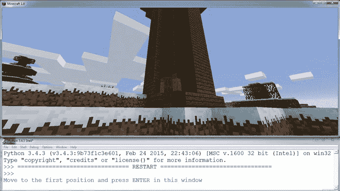

*图 11-4：站在塔楼的一个角落旁边*

然后我飞到塔楼的对角线另一端，再次在 IDLE 中按 ENTER 键（图 11-5）。

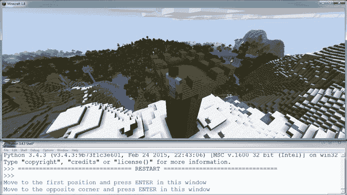

*图 11-5：飞到塔楼的对角线另一端*

按照相同的步骤使用*saveStructure.py*保存你自己的建筑。接下来，我们将完成流程的另一半，把我们保存的建筑加载到游戏中。

#### **第二部分：加载建筑**

第二个程序需要从*saveStructure.py*创建的文件（名为*pickleFile*）中将建筑加载到游戏中。清单 11-4 包括来自*duplicateArea.py*程序的代码（第 225 页），该代码将存储在列表中的建筑放置到游戏中。将清单复制到 IDLE 中的一个文件并保存为*loadStructure.py*，保存在*files*文件夹中。

*loadStructure.py*

```
   from mcpi.minecraft import Minecraft
   mc = Minecraft.create()

   import pickle

➊ def buildStructure(x, y, z, structure):
       xStart = x
       zStart = z
       for row in structure:
           for column in row:
               for block in column:
                   mc.setBlock(x, y, z, block.id, block.data)
                   z += 1
               x += 1
               z = zStart
           y += 1
           x = xStart

   # Open and load the structure file
➋ structure =

➌ pos = mc.player.getTilePos()
   x = pos.x
   y = pos.y
   z = pos.z
➍ buildStructure(x, y, z, structure)
```

*清单 11-4：完成时，该程序将从文件中构建一座建筑。*

`buildStructure()` 函数 ➊ 在这个程序中完成了大部分的工作。它使用四个参数：x、y 和 z 坐标，以及存储在三维列表中的结构，来构建游戏中的结构。

导入 `pickle` 模块，以便将结构加载到程序中，然后将其存储在 `structure` 变量中 ➋。使用 `open()` 函数，打开你保存结构的 *pickleFile* 文件。然后使用 `pickle` 的 `load()` 函数将其加载到 `structure` 变量中。加载结构后，使用 `pickle` 的 `close()` 函数关闭 *pickleFile* 文件。

Listing 11-4 中还包括了一些代码，用于获取玩家的位置，将其用作结构的起始位置 ➌。

在结构加载完毕并且坐标设置完成后，将结构和位置 ➍ 一并传递给 `buildStructure()` 函数，该函数会在新的位置构建保存的结构。

图 11-6 显示了程序的运行情况。我之前保存的建筑物已经加载到游戏中，并且在新位置重新构建。试试看—现在你有能力随身携带你的创作了！


*图 11-6：看，它是我的塔的复制品！*

但是，如果你创建了一个完整的村庄，并想要把它带走呢？你可以使用 `pickle` 将每个建筑物保存到独立的文件中，但这并不方便。`pickle` 模块对于保存单个建筑物非常有效，但对于保存一堆建筑物就不太适用了。这时候，`shelve` 模块就派上用场了。接下来，我们来看看它。

### **使用 SHELVE 模块存储大量数据**

`pickle` 模块一次只能存储一条数据。在某些程序中，你可能想要存储多个变量；如果使用 `pickle` 模块，你需要创建多个文件，这样管理起来会比较麻烦。

Python 的 `shelve` 模块解决了这个问题。它可以将多个数据项存储在一个文件中。它像一个字典，每个数据值都有一个键，你可以使用这个键来存储和检索数据。可以把 `shelve` 想象成一个架子：架子上的每个格子存储不同的数据值。

#### **使用 SHELVE 打开文件**

导入 `shelve` 模块后，你将使用它的 `open()` 函数来打开一个文件。如果文件不存在，系统会创建一个新文件。

以下代码打开 *locationsFile.db* 文件，并将其存储在 `shelveFile` 变量中：

```
import shelve
shelveFile = shelve.open("locationsFile.db")
```

`open()` 函数只接受一个参数，即文件名。使用 `shelve` 模块时，你无需指定文件权限，因为它会自动授予读写权限。

在使用 `shelve` 模块命名文件时，必须在文件名末尾包含 *.db* 扩展名。你可以看到我的 *locationsFile.db* 文件末尾有 *.db* 扩展名。

#### **使用 SHELVE 添加、修改和访问数据项**

`shelve`模块的工作方式类似于字典。为了将数据添加到文件中，你使用方括号和键名来存储一个值。例如，假设一个名叫贝阿特丽斯的秘密特工在潜水艇上，我们想把贝阿特丽斯的位置存储在`shelveFile`字典中：

```
import shelve
shelveFile = shelve.open("locationsFile.db")
shelveFile['Beatrice'] = 'Submarine'
shelveFile.close()
```

首先，我们打开文件。接下来，我们给`shelveFile`字典添加键`'贝阿特丽斯'`和值`'潜水艇'`。这行代码在`shelveFile`字典中创建了一个新项，键为`'贝阿特丽斯'`，值为`'潜水艇'`。

然后我们使用`shelve`的`close()`函数将新数据添加到文件中并安全地关闭文件。

如果一个键已经存在于`shelve`文件中，这段代码会将旧值更新为新值。假设贝阿特丽斯完成了任务并返回总部。你可以这样更新贝阿特丽斯的位置：

```
import shelve
shelveFile = shelve.open('locationsFile.db')
shelveFile['Beatrice'] = 'Headquarters'
shelveFile.close()
```

现在，贝阿特丽斯键对应的值是`'总部'`。

从`shelve`访问值的方式也和字典一样。你使用键来访问特定的值。例如，要打印贝阿特丽斯的位置，我们会使用以下代码：

```
import shelve
shelveFile = shelve.open('locationsFile.db')
print(shelveFile['Beatrice'])
```

这将输出贝阿特丽斯的位置，`总部`。

和标准字典一样，`shelve`模块可以存储任何数据类型，包括浮动数、字符串、布尔值、多维列表、其他字典等等。事实上，在下一个任务中，你将存储和访问多维列表来保存和加载多个结构！

#### **任务 #66：保存结构集合**

本任务中的程序将使用一个文件存储和加载你所有保存的结构。这个任务再次分为两个程序：一个用于保存，另一个用于加载。

你需要将任务 #65 中的程序改为使用`shelve`模块，而不是`pickle`模块。你还需要添加代码来获取用户输入，以便用户为他们的建筑物命名。打开*saveStructure.py*和*loadStructure.py*文件，并将其保存为*saveCollection.py*和*loadCollection.py*。

就像我们在上一个任务中做的那样，让我们把这些程序的修改分为两个部分来完成。

#### **第一部分：将结构保存到集合中**

这里包含了原始*saveStructure.py*文件的一部分并进行了注释，帮助你识别在哪些地方进行修改。以下是*saveCollection.py*的第一行和最后几行：

*saveCollection.py*

```
➊ import pickle

   --snip--

   # Name the structure
➋ structureName = input("What do you want to call the structure?")
   # Store the structure in a file
➌ pickleFile = open("pickleFile", "wb")
➍ pickleFile.dump(structure)
```

文件中添加了一行，询问你在使用`pickle`保存结构时想要给结构命名是什么 ➋。例如，我版本的程序会问“你想给结构起什么名字？”然后我可以回答诸如“房子”或“蛋糕森林”之类的名字。确保每个新结构的名字都不同；如果新结构和另一个结构的名字相同，旧的结构将被新的结构覆盖。

要将这个程序修改为使用`shelve`模块而不是`pickle`，你需要做两个更改。首先，将模块导入从`pickle`换成`shelve` ➊。然后，更改代码的最后几行，使用`shelve`而不是`pickle`。打开名为*structuresFile.db*的文件，并使用`shelve.open()`函数将其存储在名为`shelveFile`的变量中 ➌。接着，使用`structureName`变量作为字典键，将`structure`变量存储在`shelve`字典中 ➍。它应该看起来像这样：`shelveFile[structureName] = structure`。最后，在最后一行使用`close()`关闭`shelveFile`。

#### **第二部分：从集合中加载结构**

现在，你需要更改*loadCollection.py*文件。我已将文件的中间部分删除，以节省空间，并使你需要更改的部分更易于查看：

*loadCollection.py*

```
➊ import pickle

   --snip--

➋ structure = pickle.load("pickleFile")
➌ structureName = input("Enter the structure's name")

   pos = mc.player.getTilePos()
   x = pos.x
   y = pos.y
   z = pos.z

➍ buildStructure(x, y, z, structureDictionary[structureName])
```

我在代码中添加了一行额外的代码，用于询问你想要构建的结构的名称 ➌。此外，我在最后一行添加了一点代码，从`shelve`字典中获取结构并将其传递给`buildStructure()`函数。

你需要对这个程序做几个更改。首先，与*saveCollection.py*一样，将`import`改为`shelve`而不是`pickle` ➊。其次，通过使用`shelve.open()`加载你在*saveCollection.py*中创建的`shelveFile` ➋。将`shelve.open()`函数返回的数据存储在变量`structureDictionary`中 ➍。代码应该像下面这样：`structureDictionary = shelve.load("shelveFile")`。

所有结构的数据，包括它们的名称和方块，都存储在*structuresFile.db*文件中，这意味着在运行*loadCollection.py*之前，你无需对其进行任何更改。你需要做的就是在运行程序时输入你想要使用的结构名称。

让我们看看程序的运行效果，使用我 Minecraft 世界中的一个结构。首先，我通过飞到结构的一个角落并按下 ENTER 来使用*saveCollection.py*复制该结构（图 11-7）。

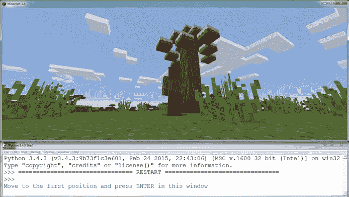

*图 11-7：我移到我想保存的结构的一个角落。*

接下来，我飞到结构的对角线另一端，再次按下 ENTER（图 11-8）。

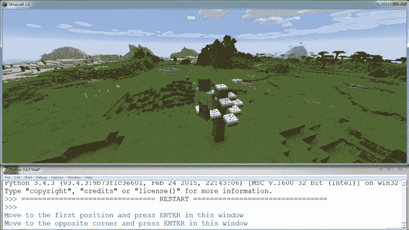

*图 11-8：我移动到对角的另一角落。*

然后，程序提示我输入结构的名称。图 11-9 显示了我给结构起的名字是`"蛋糕树"`。

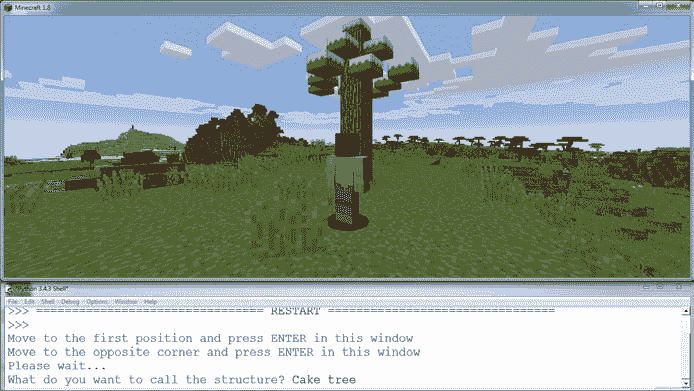

*图 11-9：我输入了我想要保存结构的名称。*

最后，我运行*loadCollection.py*，飞到我想构建结构副本的位置，输入我要构建的结构名称（图 11-10）。程序在我面前开始构建，就像魔法一样！

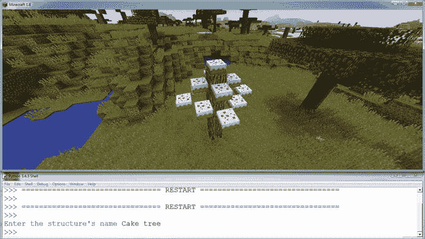

*图 11-10：现在，当我想创建一个副本时，我只需输入结构的名称，它就会自动构建。*

你可以重复这个过程，复制任意数量的建筑或结构；例如，我在图 11-11 中复制了一个小屋。复制完一个结构后，你可以随时通过运行 *loadCollection.py* 并输入结构的名称来加载它！

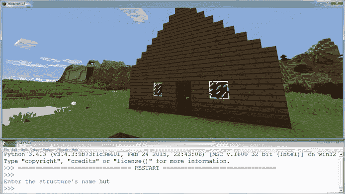

*图 11-11：你可以使用这个程序来保存多个结构。我在这里复制了一个小屋。*

### **使用 PIP 安装新模块**

除了 `pickle` 和 `shelve` 外，你还可以导入成千上万的其他模块来使用在你的 Python 程序中。由于有这么多模块可用，正确安装它们非常重要。为了简化模块的安装，Python 提供了一个名为 pip 的包管理器。*包管理器*是一个包含其他软件数据库的软件，你可以在计算机上安装这些软件。它还包括一些功能，使得安装、升级和卸载其他软件变得简单直接。

pip 包管理器可以安装、升级和删除 Python 中的包。它还拥有大量可以在 Python 中使用的模块。本节将向你展示如何使用 pip 安装一个包，并展示 `Flask` 模块，你可以用它来构建网站！

如果你使用的是最新版本的 Python 3，pip 已经预安装。如果你使用的是较早版本的 Python，pip 可能没有安装。获取 pip 的最简单方法是安装最新版本的 Python。（请参阅 Windows 上的 “安装 Python”（第 3 页）以及 Mac 上的 第 13 页）

让我们看看如何使用 pip。根据你使用的操作系统，你可以通过几种方式使用 pip。确保按照与你的计算机匹配的指示操作！

#### **在 Windows 上使用 PIP**

在 Windows 上使用 pip 时，你需要打开 Windows 命令提示符。命令提示符类似于 Python shell，它允许你在一行中输入一个命令，当你按下 ENTER 键时，该命令就会运行。

要打开命令提示符，按下 Windows 键或打开开始菜单并搜索 `cmd`。当你打开程序时，你会看到一个黑色的窗口（图 11-12）。

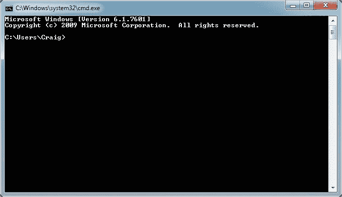

*图 11-12：Windows 命令提示符*

要在命令提示符中使用 pip，输入`pip`，后面跟上你希望执行的操作。例如，让我们安装 Python 模块 `Flask`，你可以用它来创建 Python 网站。在命令提示符中输入以下命令：

```
> pip install Flask
```

在 Python 软件包索引网站 *[`pypi.python.org/`](http://pypi.python.org/)* 上，你可以找到许多其他可以安装的 Python 模块。

#### **在 Mac 或 Raspberry Pi 上使用 PIP**

如果你在 Mac 或 Raspberry Pi 上使用 pip，你需要在命令前加上`sudo`才能使其正常工作。例如，输入以下命令：

```
$ sudo pip install Flask
```

如果你遇到错误，请翻到第一章，重新检查 Mac 或 Raspberry Pi 的安装说明。

在 Python 包索引网站 *[`pypi.python.org/`](http://pypi.python.org/)* 上，你可以找到许多其他可以安装的 Python 模块。

### **使用 PIP 模块：FLASK**

`Flask`是一个 Python 模块，可以用来开发网站。在这一节中，你将学习如何设置一个基本的`Flask`网站，并将其与 Minecraft 集成，以便在网站上显示你玩家的位置！

使用`Flask`，你只需要几行代码就可以创建并管理一个网站。你只需要像平常一样编写 Python 代码，并添加一些与`Flask`相关的额外信息。接下来，运行你的代码，它将创建一个你的计算机可以访问的网站。然后，你可以在网页浏览器中查看这个网站。

清单 11-5 创建了一个基本的`Flask`网站，其中包含了关于我最重要的信息：我的名字。

*namePage.py*

```
   from flask import Flask
➊ app = Flask(__name__)

➋ @app.route("/")
   def showName():
➌     return "Craig Richardson"

➍ app.run()
```

*清单 11-5：一个使用`Flask`创建网站的 Python 程序*

要使用`Flask`，你首先需要通过`Flask()`函数创建`Flask` ➊。`__name__`参数告诉`Flask`，你的`Flask`项目包含在这个文件中，它不需要去其他地方寻找程序的其他部分。请注意，`__name__`参数前后有两个下划线，而不是一个。

`@app.route()`标签使用了装饰器。*装饰器*为 Python 提供关于你函数的额外信息。例如，在这个程序中，`@app.route()`装饰器告诉`Flask`函数将在网站的哪个部分使用。在这种情况下，`"/"`告诉`Flask`，`showName()`函数将在主页上使用 ➋。函数中的`return`语句告诉`Flask`将在页面上显示什么内容。在这个例子中，它返回了我的名字，所以我的名字会显示在页面上 ➌。程序的最后一行告诉 Python 在运行此文件时启动`Flask` ➍。

将此文件保存为 *namePage.py*，并放入 *files* 文件夹中。添加你自己的文本，创建属于你自己的网站。

要运行网站，在 IDLE 中点击**运行** ▸ **运行模块**。程序运行并生成一个网站文件，你可以在网页浏览器中打开它。要找到网站的位置，你需要查看程序开始运行时输出的那行代码。当我运行程序时，输出看起来是这样的：

```
* Running on http://127.0.0.1:5000/ (Press CTRL+C to quit)
```

从这一行中，我可以看出，输入 *http://127.0.0.1:5000/* 到网页浏览器中，将会带我到刚刚启动的`Flask`网站。现在，当我打开浏览器并访问这个网站时，我可以看到我的名字显示在页面上（图 11-13）。

**注意**

*你在此程序中创建的网站目前只在你的计算机上可用。只有你可以访问这个网站——互联网上其他人无法查看它。*

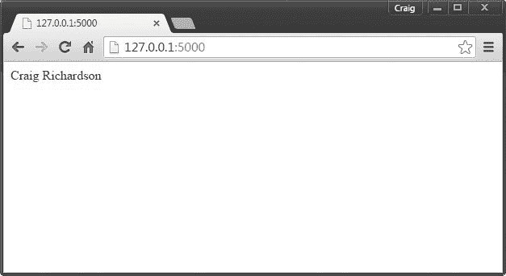

*图 11-13：看看我的网站！你可以将这里显示的内容更改为你想要的任何内容。你会在你的网站上写些什么？*

要停止程序，请进入 IDLE 并按 CTRL-C 或点击**Shell** ▸ **Restart Shell**。

**注意**

*本章仅对* `Flask` *进行了非常基础的介绍。* `Flask` *非常有用，因为它允许你用 Python 快速构建交互式网站。如果你想了解更多关于* `Flask` *的信息，可以查看这个* `Flask` *网站上的教程：[`flask.pocoo.org/docs/0.10/tutorial/`](http://flask.pocoo.org/docs/0.10/tutorial/)。*

#### **任务 #67: 位置网站**

Python 的一个最佳特点是它能够轻松地将不同模块的功能集成到一个程序中。你在整本书中一直使用 Minecraft Python API 模块，并且刚刚了解了`Flask`模块。只需几个步骤，你就可以将两者集成在一起。

在这个任务中，你将结合 Minecraft Python API 和`Flask`，在网页上显示玩家的位置。

在 IDLE 中创建一个新文件，并将其保存为*positionPage.py*，放在*files*文件夹中。你需要从 Minecraft 获取玩家的位置，并使用带有`Flask @app.route("/")`标签的函数将其显示在网页上。你可以参考 Listing 11-5 中的示例代码。使代码以`"x 10, y 110, z 12"`的格式显示位置。

运行程序并查看你的网站页面。挺酷的，对吧？使用`Flask`，你可以创建包含各种信息的网页。你甚至可以将这些页面上传到互联网上与朋友们分享！

### **你学到的内容**

在这一章中，你学习了如何在 Python 中使用文件。你学会了如何使用 Python 的标准库读写文件，这让你在创建自己的程序时可以控制文件的操作。你还学会了如何使用模块，这些模块扩展了 Python 的功能，让你可以做更多的事情。

你探索了`pickle`模块、`shelve`模块和 pip 包管理器。`pickle`和`shelve`模块有不同的用途。`pickle`模块用于保存单个变量的值，特别是当它包含多维列表或字典时，这些内容使用标准库存储和打开会很困难。`shelve`模块与`pickle`模块有相同的优点，但它提供了更多的灵活性，可以将多个值一次性存储在类似字典的结构中。使用 pip，你学习了如何安装新的模块。你还了解了`Flask`模块，这是一个用 Python 快速灵活构建网站的方式。

拥有这些知识后，你已经完成了四个任务。第一个任务让你创建待办事项列表，你可以在《Minecraft》游戏中显示这些列表，提醒你正在做的事情。第二个任务使你能够保存建筑物，并将它们加载到当前世界和其他世界中。第三个任务修改了第二个任务，使你能够将所有建筑物存储在一个文件中，而不是为每个建筑物创建一个文件。最后一个任务教你如何使用`Flask`模块创建一个网页，显示玩家当前的位置。

你做得很棒！下一章是最后一章，你将学习类和面向对象编程，这是一种流行的编程风格，可以让你重复使用代码。
