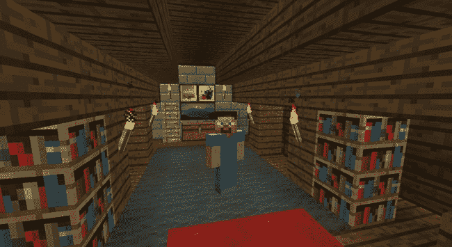
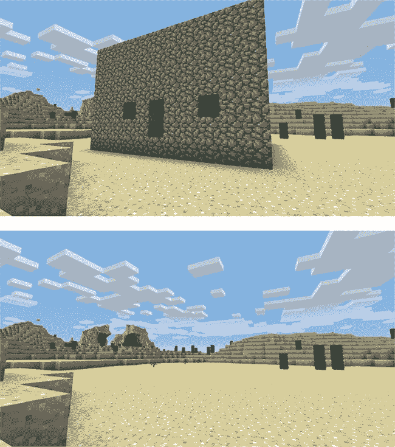
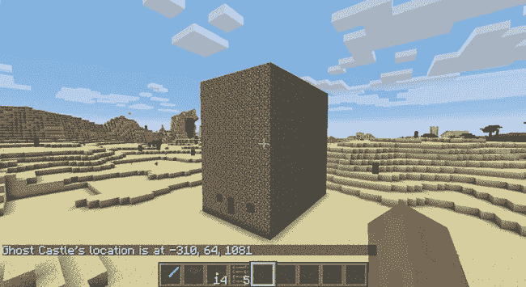
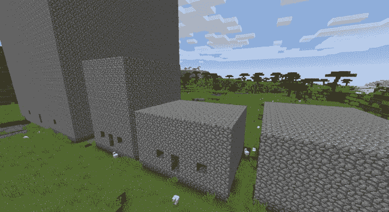
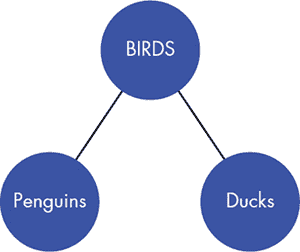
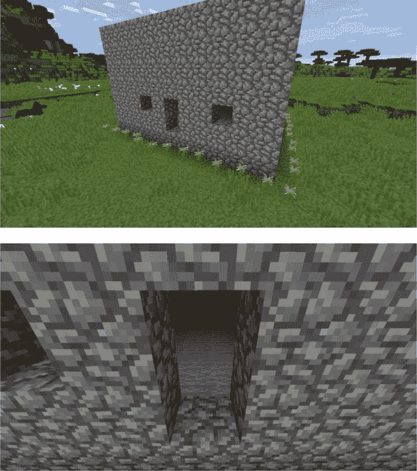
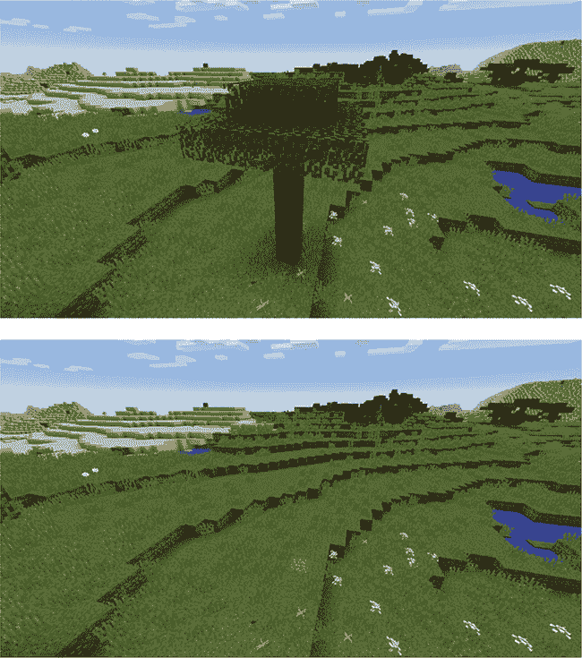

## 第十二章：12

**与面向对象编程的高级应用**


可重用性是编程中非常重要的一个方面。它节省了时间和精力。你已经在循环和函数中看到了这一点，现在你将学习*面向对象编程*。

面向对象编程是一种将函数和变量组合在一起以创建*类*的编程方法。每个类都可以用来创建*对象*，这些对象共享类的变量和函数。你可以从同一个类创建许多对象，从而使类的变量和函数可重用。

当一个函数是类的一部分时，它被称为*方法*，而类中的变量被称为*属性*。

在这一章中，你将学习面向对象编程，并使用类来重用代码。掌握面向对象编程和类使得构建程序变得轻松，你甚至可以使用面向对象编程来制作游戏。在本章的任务中，你将使用类来制作一些基本程序。你将从创建一个简单的建筑开始，但很快你就会建造整个城镇。

### 面向对象编程基础

面向对象编程非常流行，你可以用它来创建各种酷的软件，但它也可能是一个难以理解的概念。让我们把它与更熟悉的东西联系起来：你。

你是一个人。你有许多方法：你可以吃、呼吸、睡觉、数到 10，还能做很多其他事情。你也有属性：名字、年龄、身高、鞋码等等。

你的朋友玛丽和你有相同的方法；她也能吃、呼吸、睡觉、数到 10，并做许多其他事情。她也有相同的属性（名字、年龄等等），尽管它们包含不同的值。

事实上，每个人都有这些方法和属性。你可以把人描述为一个类。你和玛丽都是人，因此你可以说你们俩都是`Person`类中的对象。

在面向对象编程中，对象被称为类的*实例*。所有对象都共享类的方法和属性，但属性的值对于每个对象可能不同。

让我们跳进 Python，创建一个类。

### 创建一个类

你将从创建一个类开始，然后从这个类创建所有的对象。要创建一个类，你使用`class`关键字、你想要的类名，以及括号中的`object`类（我将在 “继承类” 的第 274 页解释`object`类）：

```
class ClassName(object):
    def __init__(self):
        # Body of init
```

将类的名称大写是一个很好的实践。这使得区分类和函数更加容易，函数应该以小写字母开头。

当你创建一个新类时，你需要包含`__init__()`方法并传入`self`作为参数。`self`参数是类中每个方法都必须有的，它指代该方法所属的类。`__init__()`方法告诉 Python 当你第一次在程序中使用这个类时，它应该做些什么。这叫做*初始化*类，`__init__()`正是初始化的缩写。

例如，我们来创建一个名为`Cat`的类，然后制作一些猫对象。`Cat`类将为每只猫存储两个属性，它们的`name`（名字）和`weight`（体重，单位：千克）。每个猫对象将拥有自己独立的`name`和`weight`值。打开 IDLE 的文本编辑器，创建一个新文件并将其保存为*catClass.py*，并放在一个名为*classes*的新文件夹中。输入以下代码来创建一个名为`Cat`的类：

*catClass.py*

```
class Cat(object):
➊     def __init__(self, name, weight):
➋         self.name = name
➌         self.weight = weight
```

在这个例子中，`__init__()`方法接受三个参数 ➊。第一个是`self`，它是每个类方法中必需的参数。第二个参数`name`和最后一个参数`weight`是额外的参数，用来为所有猫创建属性。

最后两行代码创建了属性`name` ➋和`weight` ➌，并将它们设置为`name`和`weight`参数的值。当你在类中创建属性时，需要使用带有`self`的点表示法。属性总是通过`self`来标识，它告诉 Python 某个属性属于该类。

接下来，你将学习如何使用这个类来创建对象的实例。

#### 创建对象

使用新创建的类，让我们创建一些猫对象，或者说`Cat`类的实例。

初始化对象类似于创建变量。要初始化一个对象，你只需输入对象的名称，等号（`=`）和类名。你将参数传递给类，就像调用函数一样，放在圆括号中。

例如，假设我们领养了一只猫并给它取名 Fluff。使用`Cat`类，我们可以通过在*catClass.py*的最后一行添加以下代码来创建一个名为`fluff`的猫对象（请注意，它没有缩进）：

*catClass.py*

```
class Cat(object):
    def __init__(self, name, weight):
        self.name = name
        self.weight = weight

fluff = Cat("Fluff", 4.5)
```

当你创建一个对象时，提供的参数数量取决于`__init__()`函数中的参数。在这里，我们包括了两个参数，一个是`name`（`"Fluff"`），另一个是`weight`（`4.5`）。创建对象时不需要包含`self`参数，因为`self`参数是 Python 自动添加的。

创建一个对象也叫做*调用构造函数*。`__init__()`方法通常被称为构造函数，因为它在被调用时构造了一个类。`__init__()`方法是一种特殊类型的方法，因为你不会通过名称引用它。相反，它会在你使用类名创建对象时自动运行。例如，这段代码`fluff = Cat("Fluff", 4.5)`调用了`__init__()`方法，从而构造了一个名为`fluff`的`Cat`对象。

接下来，你将学习如何访问`fluff`对象的属性。

#### 访问属性

你可以访问对象的属性，以获取有关该对象的更多信息。例如，在`fluff`对象之后将以下代码添加到*catClass.py*中，以打印`fluff`对象的`weight`属性：

*catClass.py*

```
print(fluff.weight)
```

当你运行程序时打印出来的值应该是 4.5，因为那是你在创建对象时为`weight`属性设置的值。

注意，我们在对象名`fluff`和`weight`属性之间使用了点号表示法。点号表示你要使用属于特定对象的属性。在这种情况下，`weight`属性的值属于`fluff`对象。每当你获取或设置对象的属性值时，都使用点号表示法。

你可以像更改任何其他变量一样更改属性的值——通过使用等号（`=`）。例如，让我们将 Fluff 的体重改为 5，因为他在寒假期间增加了体重。我们通过将`fluff`对象的`weight`属性更改为 5 来实现这一点：

*catClass.py*

```
fluff.weight = 5
```

现在，每当你访问`fluff`对象的`weight`属性时，它的值将是 5。

运用你现在拥有的关于创建类和实例化它的知识，让我们在 Minecraft 中做一些酷炫的东西。

#### 任务 #68：位置对象

在整本书中，你已经在 Minecraft 世界中存储了许多位置，比如你的房子、城堡或宫殿。你已经使用变量、列表、元组和字典以各种方式完成了这些操作。

你也可以使用面向对象编程创建并存储相关信息，比如位置。例如，你可以使用对象来存储一堆不同位置的坐标。

每个位置都有一个 x、y 和 z 坐标，但每个位置的坐标值不同。通过创建位置类，你可以存储并访问不同位置的坐标。这将帮助你跟踪在 Minecraft 中建造的所有精彩事物。你将能够轻松访问所有 Minecraft 创作的坐标，以便你可以瞬间将玩家传送到它们的位置！

示例 12-1 包含了`Location`类的起始部分。当代码完成后，它可以用来在单个对象中存储位置的坐标。将代码复制到*classes*文件夹中的一个新文件，命名为*locationClass.py*。

*locationClass.py*

```
   from mcpi.minecraft import Minecraft
   mc = Minecraft.create()

➊ class Location(object):
       def __init__(self, x, y, z):
➋         self.x = x
➌         # Add the y and z attributes here

➍ bedroom = Location(64, 52, -8)
➎ mc.player.setTilePos(bedroom.x, bedroom.y, bedroom.z)
```

*示例 12-1：* `Location` *类的起始部分*

为了开始创建类，我使用了`class`关键字并命名为`Location` ➊。在 ➍ 处是初始化一个名为`bedroom`的对象的代码，它将存储我的 Minecraft 家中的卧室位置。`setTilePos()`方法将玩家的位置设置为卧室位置——`bedroom`对象的`x`、`y`和`z`属性 ➎。然而，程序是不完整的。你需要完成类的`__init__()`方法，并将`y`和`z`属性设置为传递给`__init__()`方法的参数的值。我设置了`x`属性的值 ➋，但是你需要对`y`和`z`属性做同样的操作 ➌。别忘了使用你自己卧室的位置信息在 ➍！

图 12-1 显示了完整的程序运行情况，它将玩家传送到我的卧室。



*图 12-1：程序已将玩家传送到我的卧室。*

**额外目标：温馨的家**

你还想传送到你家里的哪些房间？使用`Location`类创建更多对象，以便在家里轻松移动！

### 理解方法

类可以包含方法，方法是与类相关的函数。编写类的方法可以让你创建所有该类实例都可以使用的函数。这是一种节省时间和重用代码的好方法，因为你只需要编写一个方法。

要创建一个方法，你在类的主体中使用`def`关键字写一个函数。你在前面的章节中已经用过`def`关键字来创建函数。方法也是使用`def`关键字创建的，但它们在所属类的下面缩进。例如，让我们更新*catClass.py*中的`Cat`类。我们希望猫咪能吃东西，所以让我们在`Cat`类中添加一个名为`eat()`的方法。按照代码的顺序输入并修改*catClass.py*：

*catClass.py*

```
class Cat(object):
    def __init__(self, name, weight):
        self.name = name
        self.weight = weight

    def eat(self, food):
        self.weight = self.weight + 0.05
        print(self.name + " is eating " + food)
```

注意，方法的定义和方法体比正常的代码多缩进了四个空格，这样 Python 就能知道它们属于这个类。

像函数一样，方法也可以接受参数。在这里，`eat()`方法接受一个名为`food`的参数，表示猫咪正在吃的食物。`eat()`方法将猫咪的`weight`属性增加`0.05`，然后打印出猫咪正在吃食物的消息。

在创建对象后，你可以调用它所属类的任何方法。例如，你可以使用`fluff`对象调用`eat()`方法。将以下代码添加到*catClass.py*的末尾：

*catClass.py*

```
fluff = Cat("Fluff", 4.5)
fluff.eat("tuna")
```

这里我们看到了之前的代码，我们创建了一个名为`fluff`的对象，它是`Cat`类的一部分。然后我们调用了`eat()`方法，并传递了参数`"tuna"`。当你运行程序时，输出会是这样的：

```
Fluff is eating tuna
```

现在，Fluff 正开心地吃着金枪鱼。记住，`eat()`方法还会增加体重属性。调用`eat()`方法后，添加代码打印`fluff`的体重。

你还可以通过在另一个方法内部调用方法来从类内部调用方法。让我们在`Cat`类内部创建另一个名为`eatAndSleep()`的方法。`eatAndSleep()`方法调用`eat()`方法，然后打印出猫正在睡觉的信息。将此代码添加到*catClass.py*文件中，紧接在`eat()`方法后面（确保像示例中一样缩进新方法，以便 Python 知道它是类的一部分）：

*catClass.py*

```
def eatAndSleep(self, food):
    self.eat(food)
    print(self.name + " is now sleeping...")
```

要从类内部调用方法，你需要在方法名的前面加上`self.`。这里`eat()`方法通过`self.eat()`被调用。请注意，这与在类外部调用方法是不同的。当你这样做时，只需输入对象名和你要调用的方法。例如，以下代码在`fluff`对象上调用了新的`eatAndSleep()`方法。将其添加到你的*catClass.py*文件中，这应该是程序的最后一行代码：

*catClass.py*

```
fluff.eatAndSleep("tuna")
```

下面是你运行程序时应该得到的输出：

```
Fluff is eating tuna
Fluff is now sleeping...
```

这是完整的程序，你可以查看所有部分的位置：

```
class Cat(object):
    def __init__(self, name, weight):
        self.name = name
        self.weight = weight

    def eat(self, food):
        self.weight = self.weight + 0.05
        print(self.name + " is eating " + food)

    def eatAndSleep(self, food):
        self.eat(food)
        print(self.name + " is now sleeping...")

fluff = Cat("Fluff", 4.5)
print(fluff.weight)
fluff.eat("tuna")
fluff.eatAndSleep("tuna")
```

让我们将你学到的新技能带入 Minecraft 的世界吧！

#### 任务 #69：鬼屋

使用 Python 和 Minecraft 编程的最佳之处在于，你可以从一个愚蠢的想法开始，然后把它实现。你的想法可能开始得很小，但只需几行代码，你就能很快构建出一个有趣的程序。

建造一个在游戏中出现，30 秒后又消失的鬼屋，岂不是很有趣吗？然后，鬼屋可以在别的地方重新出现，再次消失，前提是你希望它如此。

这是鬼屋程序的第一个版本。将清单 12-2 保存为*ghostHouse.py*文件，并放在*classes*文件夹中。

*ghostHouse.py*

```
   from mcpi.minecraft import Minecraft
   mc = Minecraft.create()

   import time
➊ class Building(object):
➋     def __init__(self, x, y, z, width, height, depth):
           self.x = x
           self.y = y
           self.z = z

           self.width = width
           self.height = height
           self.depth = depth

➌     def build(self):
           mc.setBlocks(self.x, self.y, self.z,
                        self.x + self.width, self.y + self.height,
                        self.z + self.depth, 4)

           mc.setBlocks(self.x + 1, self.y + 1, self.z + 1,
                        self.x + self.width - 1, self.y + self.height - 1,
                        self.z + self.depth - 1, 0)
➍         # Call the buildDoor() and buildWindows() methods here

➎     def clear(self):
           mc.setBlocks(self.x, self.y, self.z,
                        self.x + self.width, self.y + self.height,
                        self.z + self.depth, 0)
➏         # Remove the doors and windows here

   pos = mc.player.getTilePos()
   x = pos.x
   y = pos.y
   z = pos.z

➐ ghostHouse = Building(x, y, z, 10, 6, 8)
   ghostHouse.build()

   time.sleep(30)

   ghostHouse.clear()
➑ ghostHouse.x = 8
```

*清单 12-2：* `Building` *类创建一个建筑。*

清单 12-2 使用了一个名为`Building` ➊的类，它通过`__init__()`方法设置房子的坐标和大小 ➋。它创建了一个名为`ghostHouse` ➐的`Building`对象。该建筑物出现后会神秘消失，30 秒后通过`build()` ➌和`clear()` ➎方法。唯一的问题是它看起来不像房子。现在它看起来像一个由鹅卵石做成的大空壳。

你需要让鬼屋看起来更像一座房子，而不是像一个空壳，因为鬼壳不像鬼屋那么可怕。为了让建筑物看起来更像房子，你的任务是添加一个方法，在房子的前面建造一扇门，并添加第二个方法来安装窗户。从`build()`方法中调用这两个方法，以便它们同时构建 ➍。

在添加构建门和窗户的方法后，你需要更新`clear()`方法来删除它们➏；否则，当房子消失时，它们将被遗留在原地。

当你添加了额外的方法后，通过更改 `ghostHouse` 对象的 `x`、`y` 和 `z` 属性，并添加更多对 `build()` 和 `clear()` 方法的调用来将建筑物移动到新位置。我已经为你做了一些修改，改变了房子的 `x` 位置 ➑。

当你运行程序时，鬼屋应该会突然出现，然后在 30 秒后消失，再次出现在其他地方。好吓人！

图 12-2 显示了我的鬼屋。



*图 12-2：鬼屋出现后又消失。*

**额外目标：家庭改造**

目前，鬼屋非常基础。利用你在本书中学到的 Python 技巧，向 `build()` 函数中添加任何你想要的内容，以定制你的房子。

### 通过方法返回值

像函数一样，方法也可以使用 `return` 关键字返回值或对象的属性。例如，假设我们想将猫 Fluff 的体重从千克转换为克。1 千克等于 1000 克，因此为了进行转换，你需要将 `weight` 属性乘以 1000 并返回它。将以下 `getWeightInGrams()` 方法添加到 *catClass.py* 中的 `Cat` 类：

*catClass.py*

```
class Cat(object):
    def __init__(self, name, weight):
        self.name = name
        self.weight = weight

    def getWeightInGrams(self):
        return self.weight * 1000
```

要输出方法返回的值，你需要创建一个对象并调用该方法。在以下代码中，使用了 `fluff` 对象，并在 `print()` 函数中调用该方法，以获取猫的体重（以克为单位）：

*catClass.py*

```
fluff = Cat("Fluff", 4.5)
print(fluff.getWeightInGrams())
```

现在，当你运行该文件时，它将输出以下内容：

```
4500
```

在下一个任务中，我们将扩展鬼屋程序，加入一个返回建筑物信息的方法。

#### 任务 #70：鬼屋城堡

我有各种各样的名字，分别对应我在 Minecraft 世界中建造的不同地方：海滩房、植物农场、动物农场、储藏室、宫殿、水下宫殿、地下宫殿，等等。问题是这些名字仅存在于我的脑海中！

使用类，你可以为你建造的事物创建诸如位置和大小等属性，正如你在 任务 #69（第 263 页）中看到的那样。你还可以包括名称！

让我们给鬼屋起个名字，并让 Python 为我们记住它。我们将更新 任务 #69 中的 `Building` 类，添加一个额外的方法来返回建筑物的名称。将 清单 12-3 复制到一个名为 *ghostCastle.py* 的新文件中，放在 *classes* 文件夹中。

*ghostCastle.py*

```
   from mcpi.minecraft import Minecraft
   mc = Minecraft.create()

   import time

➊ class NamedBuilding(object):
➋     def __init__(self, x, y, z, width, height, depth, name):
           self.x = x
           self.y = y
           self.z = z

           self.width = width
           self.height = height
           self.depth = depth

➌         self.name = name

      def build(self):
          mc.setBlocks(self.x, self.y, self.z,
                       self.x + self.width, self.y + self.height,
                       self.z + self.depth, 4)

          mc.setBlocks(self.x + 1, self.y + 1, self.z + 1,
                       self.x + self.width - 1, self.y + self.height - 1,
                       self.z + self.depth - 1, 0)

      def clear(self):
          mc.setBlocks(self.x, self.y, self.z,
                       self.x + self.width, self.y + self.height,
                       self.z + self.depth, 0)

➍     def getInfo():
           # Add the body of the getInfo() method here

   pos = mc.player.getTilePos()
   x = pos.x
   y = pos.y
   z = pos.z
   ghostCastle = NamedBuilding(x, y, z, 10, 16, 16, "Ghost Castle")
   ghostCastle.build()
➎ mc.postToChat(ghostCastle.getInfo())

   time.sleep(30)

   ghostCastle.clear()
```

*清单 12-3：* `NamedBuilding` *与* `Building` *类非常相似，不同之处在于它有一个额外的属性* `name` *和一个返回建筑物描述的额外方法。*

首先，我将类的名称改为`NamedBuilding`，以免与之前任务中的`Building`类混淆 ➊。我在构造函数中添加了一个额外的参数和属性，叫做`name` ➋。该参数允许你为建筑物命名，构造函数将该名称赋给`name`属性 ➌。

你的任务是向新的`NamedBuilding`类添加一个名为`getInfo()`的方法，该方法返回建筑物的名字和位置。我已经为你在➍处添加了`getInfo()`方法的开头。你只需补充方法体即可。在➎处调用了`getInfo()`方法，它会将方法返回的字符串输出到 Minecraft 聊天框。例如，如果鬼屋位于`x = -310`，`y = 64`，`z = 1081`，`getInfo()`方法应返回字符串`"Ghost Castle's location is at -310, 64, 1081"`。

图 12-3 显示了我的工作程序。尽管鬼屋更高，但它看起来像任务 #69 中的房子。这是因为`build()`方法在两者之间是相同的，但你可以随意修改你的代码版本，使你的建筑更像一座城堡。



*图 12-3：鬼屋的描述被显示出来。*

**额外目标：热烈欢迎**

如果你走进任何建筑物时，建筑物的名字自动出现在聊天框里，不是很酷吗？其实是可能的，但有点挑战。如果你想试试，可以使用任务 #32 中的*shower.py*程序（第 120 页）作为起点。该文件应该在你的*ifStatements*文件夹里。你可以使用该程序检测玩家的坐标，并且如果玩家在建筑物内，就调用`building`对象的`getInfo()`方法。

### 创建多个对象

你可以通过使用相同的类构造函数创建具有不同名称的对象，从而从同一个类中创建多个对象（记住，*构造函数*是`__init__()`方法的另一种说法）。例如，假设我们找到了第二只猫，名叫 Stella，现在她和 Fluff 成为了朋友。打开*catClass.py*并输入以下代码来添加 Stella：

*catClass.py*

```
class Cat(object):
    def __init__(self, name, weight):
        self.name = name
        self.weight = weight

fluff = Cat("Fluff", 4.5)
stella = Cat("Stella", 3.9)
```

现在我们有了两个猫对象，`fluff` 和 `stella`。它们有相同的属性，`name` 和 `weight`，但值不同。

将以下代码添加到*catClass.py*以打印猫的名字：

*catClass.py*

```
print(fluff.name)
print(stella.name)
```

当你运行文件时，你将得到以下输出：

```
Fluff
Stella
```

这两个猫对象也可以访问相同的方法。它们都可以调用`eat()`函数。将以下代码添加到*catClass.py*：

*catClass.py*

```
fluff.eat("tuna")
stella.eat("cake")
```

输出将如下所示：

```
Fluff is eating tuna
Stella is eating cake
```

编写类使得创建多个对象变得非常容易。让我们尝试在 Minecraft 中创建多个对象！

#### 任务 #71：鬼镇

什么比一座幽灵房子更可怕？没错，两个幽灵房子。但三座幽灵房子会更可怕。而超过三座幽灵房子？我得停止这样想，否则今晚我就睡不着了！

在任务#69（第 263 页）中，你创建了一个可以建造消失房子的类。现在你可以使用相同的类创建多个对象，Python 会记住每个对象的属性和方法。你可以创建任意数量的房子，并轻松地让它们出现和消失。

你的任务是创建四个或更多幽灵房子对象，并将它们布置成一个村庄。在一定时间后，让它们全部消失，并在地图的其他地方重新出现，就像一个真正的鬼镇一样。

在 IDLE 中打开*ghostHouse.py*——我们将以此为基础。当你在*ghostHouse.py*程序中创建房子时，你的代码应该像这样：

*ghostHouse.py*

```
ghostHouse = Building(17, 22, -54, 10, 6, 8)
ghostHouse.build()

time.sleep(30)

ghostHouse.clear()
```

将*ghostHouse.py*保存为一个名为*ghostVillage.py*的新文件，然后在文件中使用`Building`类创建三个或更多对象来构建村庄。为了帮助你入门，我在 Listing 12-4 中创建了一个名为`shop`的第二个对象。我还设置了`x`、`y`和`z`变量，用于存储玩家当前位置，这个位置通过`player.getTilePos()`来获取。这样可以更方便地在你周围构建村庄。

*ghostVillage.py*

```
pos = mc.player.getTilePos()
x = pos.x
y = pos.y
z = pos.z
ghostHouse = Building(x, y, z, 10, 6, 8)
shop = Building(x + 12, y, z, 8, 12, 10)
# Create more ghost building objects here

ghostHouse.build()
shop.build()
# Build more ghost building objects here

time.sleep(30)

ghostHouse.clear()
shop.clear()
```

*Listing 12-4：创建多个幽灵建筑对象*

Figure 12-4 展示了我的幽灵村庄。30 秒后，幽灵建筑突然消失。



*Figure 12-4：看看幽灵村庄里的所有幽灵建筑！*

### 类属性

有时你可能想为类中的每个对象实例设置具有相同值的属性。每次创建对象时传递相同的参数是冗余的。相反，你可以在类中创建一个预设的属性，类中所有对象实例将共享这些属性。

当多个对象共享相同的属性时，这被称为*类属性*。例如，我们创建的所有猫对象都由 Craig（我）拥有。我可以在*catClass.py*文件中重新访问`Cat`类，创建一个名为`owner`的类属性，并将其设置为`"Craig"`：

*catClass.py*

```
class Cat(object):
    owner = "Craig"

    def __init__(self, name, weight):
        self.name = name
        self.weight = weight
```

如你所见，类属性在名称前不使用`self`。在这个例子中，`owner`是一个类属性，而`self.name`是一个实例属性。注意，类属性是在`__init__()`函数之外定义的。

类属性与对象中的任何其他属性工作方式相同。例如，你可以像访问普通属性一样访问类属性的值。在这个例子中，为了找出 Fluff 的所有者，我们可以打印`fluff`对象的`owner`类属性：

*catClass.py*

```
fluff = Cat("Fluff", 4.5)
print(fluff.owner)
```

打印的值应该是`"Craig"`。如果我们打印 Stella 的所有者，值也会是一样的，因为类属性对该类中的每个对象都是相同的：

*catClass.py*

```
stella = Cat("Stella", 3.9)
print(stella.owner)
```

这里打印的值也是`"Craig"`。

你可以改变单个对象的类属性值。这会改变该对象的属性值，但不会影响类中其他对象。例如，Stella 已被我的朋友 Matthew 收养，所以我们需要将 Stella 的所有者改为`"Matthew"`：

*catClass.py*

```
stella.owner = "Matthew"
print(stella.owner)
print(fluff.owner)
```

当打印`stella`的`owner`属性时，它显示的是`"Matthew"`，但是`fluff`的所有者仍然是`"Craig"`。

在我们对*catClass.py*做了所有更改后，最终的程序如下所示。它也可以在本书的资源中找到，地址是*[`www.nostarch.com/pythonwithminecraft/`](https://www.nostarch.com/pythonwithminecraft/)*。

*catClass.py*

```
class Cat(object):
    owner = "Craig"

    def __init__(self, name, weight):
        self.name = name
        self.weight = weight

    def eat(self, food):
        self.weight = self.weight + 0.05
        print(self.name + " is eating " + food)

    def eatAndSleep(self, food):
        self.eat(food)
        print(self.name + " is now sleeping...")

    def getWeightInGrams(self):
        return self.weight * 1000

fluff = Cat("Fluff", 4.5)
print(fluff.owner)
stella = Cat("Stella", 3.9)
print(stella.owner)

print(fluff.weight)
fluff.eat("tuna")
fluff.eatAndSleep("tuna")

print(fluff.getWeightInGrams())
print(fluff.name)
print(stella.name)

fluff.eat("tuna")
stella.eat("cake")

stella.owner = "Matthew"
print(stella.owner)
print(fluff.owner)
```

现在你已经看到如何使用对象了，让我们来看一下如何通过继承让它们更强大。

### 理解继承

*继承*发生在类共享与其他类相同的方法和属性时。例如，鸭子是一种鸟类。它们与其他鸟类共享相同的方法（飞行、进食等），并且具有与其他鸟类相同的属性（体重、翼展等）。因此，你可以说*鸭子*从*鸟类*继承了它们的属性和方法。图 12-5 展示了这种关系的示意图。



*图 12-5：企鹅和鸭子都是鸟类的一种。*

其他类继承的类称为*父类*；从父类继承的类称为*子类*。

继承很有用，因为它允许你在相似的对象之间创建细微的差异。例如，企鹅也是一种鸟类，但它们可以在水下游泳，而不像大多数鸟类。为了表示企鹅，你需要创建一个从鸟类继承的子类，但该子类有适应性，使得企鹅能够在水下游泳。这些适应性是你创建子类的原因：你可以保留父类的主要特征，以避免重复编写代码，并且仅在子类中添加所需的方法和属性。

#### 继承类

当子类从父类继承时，子类可以使用父类的所有方法和属性。子类还可以添加额外的类和属性，而无需修改原始父类。

我们将用鸟类的例子来说明这一点。首先，我们将编写`Bird`父类的代码。打开 IDLE 中新建一个文件，命名为*birdClass.py*，然后添加以下代码来创建类：

*birdClass.py*

```
➊ class Bird(object):
➋     def __init__(self, name, wingspan):
           self.name = name
           self.wingspan = wingspan

➌     def birdcall(self):
           print("chirp")

➍     def fly(self):
           print("flap")
```

我们创建了一个名为`Bird`的类➊，但请注意，`Bird`类继承自`object`。`object`类是一个基类，所有其他类都将基于它来构建。所有类都继承自`object`类，当没有其他父类可供继承时，你就会使用它。即使存在多个继承层次，许多类彼此继承，`object`类始终是继承体系中最高层次的父类。

`Bird`类的`__init__()`方法有两个参数，用于设置两个属性：鸟的`name`和它的`wingspan` ➋。它有两个方法：`birdcall()` ➌和`fly()` ➍。目前，`birdcall()`方法只是打印`"chirp"`，而`fly()`方法只是打印`"flap"`。

在同一文件中，使用`Bird`类创建一个名为`gardenBird`的对象：

*birdClass.py*

```
gardenBird = Bird("Geoffrey", 12)
gardenBird.birdcall()
gardenBird.fly()
```

这段代码将输出：

```
chirp
flap
```

现在你已经创建了一个超类，你可以创建一个继承超类的子类，并且该子类有自己的方法。在下一部分中你将实现这一点。

#### 向子类添加新方法

让我们为企鹅在*birdClass.py*中添加一个类，命名为`Penguin`。因为企鹅可以在水下游泳，所以你可以向`Penguin`类添加一个名为`swim()`的额外方法：

*birdClass.py*

```
class Penguin(Bird):
    def swim(self):
        print("swimming")
```

当你定义一个子类并希望它继承另一个超类而不是`object`时，你需要在括号中放入超类的名称。请注意，我没有为`Penguin`类创建`__init__()`方法。原因是它继承了`Bird`类，因此使用的是`Bird`类的`__init__()`方法。让我们使用该`__init__()`方法，并通过创建企鹅来测试`swim()`函数：

*birdClass.py*

```
sarahThePenguin = Penguin("Sarah", 10)
sarahThePenguin.swim()
```

这段代码将输出以下内容：

```
swimming
```

`Penguin`类也可以使用`fly()`和`birdcall()`方法，因为它继承了这些方法来自`Bird`。

*birdClass.py*

```
sarahThePenguin.fly()
sarahThePenguin.birdcall()
```

在这种情况下，输出将是这样的：

```
flap
chirp
```

但是`flap`和`chirp`对于企鹅来说没有意义，因为企鹅不能飞，而且它们的鸟鸣更像是嘎嘎声！我们将在《重写方法和属性》中学习如何重写继承的方法并修复这个问题，参见第 278 页。

但是首先，让我们回到 Minecraft，并利用继承创建一些新的鬼建筑。

#### 任务 #72: 鬼酒店

房屋和酒店都是建筑物类型：它们有门、窗、房间、楼梯和墙壁。酒店只是豪华的房子，增加了阳台、更多的房间和一个漂亮的入口。

如何利用你已经为鬼屋创建的代码编写一些鬼酒店？建筑物的基本结构是相同的。所以可以说唯一的区别是鬼酒店在房间内有创建地毯和在建筑物边缘添加花卉的额外方法。这意味着鬼酒店类可以继承鬼屋类的所有方法。然后，鬼酒店类只需要两个额外的方法来处理地毯和花卉。

在 IDLE 中，创建一个新文件并将其保存为*ghostHotel.py*，保存在*classes*文件夹中。将*ghostHouse.py*程序中`Building`类的代码复制并粘贴到该文件中。

创建一个名为`FancyBuilding`的新类，它继承自`Building`类。`FancyBuilding`类应该有一个新的方法`upgrade()`，该方法在建筑物内部添加地毯，并在墙壁周围种植花卉。代码清单 12-5 展示了我的`upgrade()`方法的代码，但你可以根据需要自定义你的酒店。

*ghostHotel.py*

```
# Create a FancyBuilding class here

    def upgrade(self):
        # Carpet
        mc.setBlocks(self.x + 1, self.y, self.z + 1,
                     self.x + self.width - 1, self.y, self.z + self.depth - 1,
                     35, 6)

        # Flowers
        mc.setBlocks(self.x - 1, self.y, self.z -1,
                     self.x - 1, self.y, self.z + self.depth + 1,
                     37)
        mc.setBlocks(self.x - 1, self.y, self.z - 1,
                     self.x + self.width + 1, self.y, self.z – 1,
                     37)
        mc.setBlocks(self.x + self.width + 1, self.y, self.z - 1,
                     self.x + self.width + 1, self.y, self.z + self.depth + 1,
                     37)
        mc.setBlocks(self.x - 1, self.y, self.z + self.depth + 1,
                     self.x + self.width + 1, self.y, self.z + self.depth = 1,
                     37)

# Create an instance of the FancyBuilding class
# Call the build() and upgrade() methods
```

*代码清单 12-5：为`FancyBuilding`类添加地毯和花卉的一个方法*

在你创建了类并添加了新方法后，创建一个`FancyBuilding`类的实例，并命名为`ghostHotel`。使用`build()`方法构建幽灵酒店，然后使用`upgrade()`方法添加额外的元素。

图 12-6 展示了我的华丽幽灵酒店。



*图 12-6：看看那些花和地毯！*

**附加目标：华丽的村庄**

在任务 #71 中，你创建了一个幽灵村庄，其中所有建筑物看起来差不多。在现实中的城市中，很少会看到完全相同的建筑。通过创建多个从`Building`类继承的类，来修改这个幽灵村庄程序。你可以创建一个`Shop`类，一个`Hospital`类，一个`Restaurant`类，例如。然后在创建对象时，你可以通过使用不同的类来选择创建哪种类型的建筑。

### 重写方法和属性

子类可以重新定义其父类中的方法和属性。这在你希望使用相同名称的函数，但希望在子类中表现得不同的时候非常有用。

在《理解继承》一节中，第 273 页，我们创建了一个`Bird`类和一个`Penguin`类。`Penguin`类继承自`Bird`，因此它共享所有父类的方法。但是，企鹅不能飞，它们的鸟叫声更像是呱呱声，而不是鸟鸣。因此，我们应该修改`fly()`和`birdcall()`方法以反映这一点。打开*birdClass.py*并添加以下代码：

*birdClass.py*

```
   class Penguin(Bird):
       def swim(self):
           print("swimming")

➊     def birdcall(self):
           print("sort of a quack")

➋     def fly(self):
           print("Penguins cannot fly :(")
```

我对`Penguin`类做了两个修改。我添加了一个`birdcall()` ➊方法和一个`fly()` ➋方法。由于这两个方法的拼写与`Bird`父类中的方法相同，因此它们会重写父类中的方法。

通过将以下代码添加到*birdClass.py*中来调用这些方法：

*birdClass.py*

```
sarahThePenguin.fly()
sarahThePenguin.birdcall()
```

现在，当你运行程序时，你会看到以下输出：

```
Penguins cannot fly :(
sort of a quack
```

重写父类中的方法会改变该方法对子类的作用，但不会影响父类。因此，企鹅不能飞，但其他继承自`Bird`的鸟类仍然可以飞。

你还可以在子类中重写`__init__()`方法。这意味着当子类对象被创建时，它可以有不同于父类的属性或行为。

例如，假设我们在同一个文件中创建一个`Parrot`类，作为`Bird`类的子类。鹦鹉可以有不同的颜色，所以我们在`__init__()`方法中添加一个`color`属性作为额外的参数：

*birdClass.py*

```
   class Parrot(Bird):
➊     def __init__(self, name, wingspan, color):
           self.name = name
           self.wingspan = wingspan
           self.color = color
```

我已为`Parrot`类添加了一个新的`__init__()`方法，与原始的`Bird`类相比，它有一个额外的参数`color`➊。

现在，当我们创建一个新的`Parrot`对象时，我们可以访问`color`属性。我们还可以访问`birdcall()`和`fly()`方法，因为它们是从`Bird`超类继承来的：

*birdClass.py*

```
freddieTheParrot = Parrot("Freddie", 12, "blue")
print(freddieTheParrot.color)
freddieTheParrot.fly()
freddieTheParrot.birdcall()
```

这段代码将输出以下内容：

```
blue
flap
chirp
```

记住，你可以重写任何子类继承自超类的方法；甚至可以重写`__init__()`方法。这使你可以对对象及其许多属性和方法有很大的控制权。

在我们对*birdClass.py*做出所有更改后，最终的程序如下所示。它也可以在本书的资源中找到，网址是*[`www.nostarch.com/pythonwithminecraft/`](https://www.nostarch.com/pythonwithminecraft/)*。

*birdClass.py*

```
class Bird(object):
    def __init__(self, name, wingspan):
        self.name = name
        self.wingspan = wingspan

    def birdcall(self):
        print("chirp")

    def fly(self):
        print("flap")

class Penguin(Bird):
    def swim(self):
        print("swimming")

    def birdcall(self):
        print("sort of a quack")

    def fly(self):
        print("Penguins cannot fly :(")

class Parrot(Bird):
    def __init__(self, name, wingspan, color):
        self.name = name
        self.wingspan = wingspan
        self.color = color

gardenBird = Bird("Geoffrey", 12)
gardenBird.birdcall()
gardenBird.fly()

sarahThePenguin = Penguin("Sarah", 10)
sarahThePenguin.swim()
sarahThePenguin.fly()
sarahThePenguin.birdcall()

freddieTheParrot = Parrot("Freddie", 12, "blue")
print(freddieTheParrot.color)
freddieTheParrot.fly()
freddieTheParrot.birdcall()
```

在下一个任务中，你将尝试重写方法和属性。

#### 任务 #73：幽灵树

你已经创建了几种形式的幽灵建筑。让我们将其提升到一个新的层次，创建一棵幽灵树。这是个了不起的想法，但我们该怎么做呢？`Building`类是为建筑物设计的，建筑物有墙壁和天花板——而树没有墙壁或天花板。别担心！你可以通过修改你的幽灵`Building`类来解决这个问题。

像幽灵建筑一样，幽灵树将通过`build()`和`clear()`方法出现和消失。但由于树与房屋不同，方法需要进行不同的处理。所以，你需要创建一个从`Building`类继承的类，然后重写`build()`和`clear()`方法。

为了让你开始，我从*forest.py*文件中提取了创建树的函数（第 149 页），并将其放入清单 12-6。将其复制到*classes*文件夹中的新文件*ghostTree.py*中。

*ghostTree.py*

```
   from mcpi.minecraft import Minecraft
   mc = Minecraft.create()

   # Paste the ghostHouse.py program here
   # Create a Tree class here

➊ def growTree(x, y, z):
       """ Creates a tree at the coordinates given """
       wood = 17
       leaves = 18

       # Trunk
       mc.setBlocks(x, y, z, x, y + 5, z, wood)

       # Leaves
       mc.setBlocks(x - 2, y + 6, z - 2, x + 2, y + 6, z + 2, leaves)
       mc.setBlocks(x - 1, y + 7, z - 1, x + 1, y + 7, z + 1, leaves)

   # Create build() and clear() methods for the Tree class here
```

*清单 12-6：创建树的函数*

为了完成程序，将*ghostHouse.py*中的`Building`类代码复制并粘贴到新文件中。然后，创建一个名为`Tree`的新类，继承自`Building`类。在`Tree`类内部，添加一个`build()`方法和一个`clear()`方法，以重写`Building`类中的方法，从而建立一棵树而不是房子。确保在最终的`growTree()`方法中，属性前面加上`self`参数➊。

创建完程序后，创建一个名为`ghostTree`的`Tree`对象。调用`build()`方法让树出现，稍等片刻，然后使用`clear()`让它消失。

图 12-7 显示了我的程序结果。



*图 12-7：那是一棵诡异的树！*

**附加目标：幽灵森林**

修改*ghostTree.py*中的代码，创建一个幽灵森林。你认为在幽灵森林中可以找到什么样的宝藏？

### 你学到的内容

你刚刚学习了当今编程中最重要的概念之一：面向对象编程！你学会了如何编写类和创建对象，也学会了如何使用继承来定制类和对象的行为。你将能够将这一非常有用的技能应用到不仅是 Minecraft 中，还可以在你选择的任何编程冒险中！
