## 第十四章：方块 ID 小抄

*当列出两个数字时，第二个数字表示方块状态。标有星号（*）的方块在 Minecraft：Pi Edition 中可用。*

|  | 196 | 金合欢门方块 |
| --- | --- | --- |
| 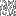 | 161 | 金合欢树叶 |
|  | 6, 4 | 金合欢树苗 |
| 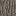 | 162 | 金合欢木 |
|  | 5, 4 | 金合欢木板材 |
|  | 126, 4 | 金合欢木板 |
|  | 125, 4 | 金合欢木板（双） |
|  | 157 | 激活轨道 |
|  | 38, 2 | 蓝宝石百合 |
| 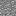 | 1, 5* | 安山岩 |
|  | 38, 3 | 湛蓝小花 |
|  | 138 | 信标 |
|  | 26* | 床 |
|  | 7* | 基岩 |
|  | 194 | 白桦木门方块 |
| 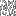 | 18, 2* | 白桦树叶 |
|  | 6, 2* | 白桦树苗 |
| 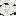 | 17, 2* | 白桦木 |
|  | 5, 2* | 白桦木板材 |
|  | 126, 2 | 白桦木板 |
|  | 125, 2 | 白桦木板（双） |
|  | 38, 1 | 蓝色兰花 |
|  | 47* | 书架 |
| 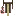 | 117 | 酿造架 |
|  | 44, 4* | 砖石板 |
|  | 43, 4* | 砖石板（双） |
|  | 108* | 砖石楼梯 |
|  | 45* | 砖块 |
| 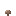 | 39* | 褐色蘑菇 |
| 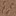 | 99 | 褐色蘑菇方块 |
|  | 62* | 燃烧的熔炉 |
| 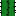 | 81* | 仙人掌 |
|  | 92 | 蛋糕方块 |
|  | 171, 15 | 地毯，黑色 |
|  | 171, 11 | 地毯，蓝色 |
|  | 171, 12 | 地毯，棕色 |
|  | 171, 9 | 地毯，青色 |
|  | 171, 7 | 地毯，灰色 |
|  | 171, 13 | 地毯，绿色 |
|  | 171, 3 | 地毯，浅蓝色 |
|  | 171, 8 | 地毯，浅灰色 |
|  | 171, 5 | 地毯，石灰色 |
|  | 171, 2 | 地毯，品红色 |
|  | 171, 1 | 地毯，橙色 |
|  | 171, 6 | 地毯，粉色 |
|  | 171, 10 | 地毯，紫色 |
|  | 171, 14 | 地毯，红色 |
|  | 171 | 白色地毯 |
|  | 171, 4 | 黄色地毯 |
|  | 141 | 胡萝卜 |
|  | 118 | 锅 |
|  | 54* | 箱子 |
|  | 155, 1* | 雕刻石英块 |
|  | 179, 1 | 雕刻红沙岩 |
|  | 24, 1 | 雕刻沙岩 |
|  | 98, 3 | 雕刻石砖 |
|  | 82* | 黏土 |
|  | 173 | 煤炭块 |
| 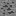 | 16* | 煤矿石 |
| 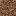 | 3, 1* | 粗糙泥土 |
| 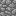 | 4* | 圆石 |
|  | 44, 3* | 圆石台阶 |
|  | 43, 3* | 圆石台阶（双） |
|  | 67* | 圆石阶梯 |
|  | 30* | 蜘蛛网 |
|  | 127 | 可可 |
|  | 98, 2* | 裂石砖 |
|  | 58* | 工作台 |
|  | 37* | 蒲公英 |
|  | 197 | 深色橡木门块 |
|  | 161, 1 | 深色橡木叶子 |
|  | 6, 5 | 深色橡木树苗 |
| 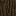 | 162, 1 | 深色橡木木材 |
|  | 5, 5 | 深色橡木木板 |
|  | 126, 5 | 深色橡木台阶 |
|  | 125, 5 | 深色橡木台阶（双） |
|  | 168, 2 | 深色海晶石 |
|  | 151 | 日光传感器 |
|  | 32 | 枯萎灌木 |
|  | 31* | 枯萎灌木丛 |
|  | 28 | 探测轨道 |
|  | 57* | 钻石块 |
|  | 56* | 钻石矿石 |
|  | 1, 3* | 花岗岩 |
| 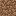 | 3* | 泥土 |
|  | 23 | 发射器 |
|  | 122 | 龙蛋 |
|  | 158 | 投掷器 |
|  | 133 | 翡翠块 |
|  | 129 | 翡翠矿石 |
|  | 116 | 附魔台 |
|  | 119 | 末地传送门 |
|  | 120 | 末地传送门框架 |
|  | 121 | 末地石 |
| 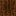 | 60* | 耕地 |
| 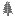 | 31, 2* | 蕨类植物 |
|  | 51 | 火 |
|  | 140 | 花盆 |
|  | 10* | 流动的岩浆 |
|  | 8* | 流动水 |
|  | 61* | 炉子 |
|  | 20* | 玻璃 |
|  | 102* | 玻璃板 |
|  | 95, 15* | 玻璃，黑色染色 |
|  | 95, 11* | 玻璃，蓝色染色 |
| 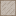 | 95, 12* | 玻璃，棕色染色 |
|  | 95, 9* | 玻璃，青色染色 |
|  | 95, 7* | 玻璃，灰色染色 |
|  | 95, 13* | 玻璃，绿色染色 |
|  | 95, 3* | 玻璃，浅蓝色染色 |
|  | 95, 8* | 玻璃，浅灰色染色 |
|  | 95, 5* | 玻璃，石灰色染色 |
|  | 95, 2* | 玻璃，洋红色染色 |
| 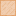 | 95, 1* | 玻璃，橙色染色 |
|  | 95, 6* | 玻璃，粉红色染色 |
|  | 95, 10* | 玻璃，紫色染色 |
| 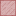 | 95, 14* | 玻璃，红色染色 |
|  | 95* | 玻璃，白色染色 |
|  | 95, 4* | 玻璃，黄色染色 |
| 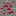 | 74* | 发光的红石矿石 |
|  | 89* | 发光石 |
|  | 41* | 金块 |
|  | 14* | 金矿石 |
| 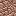 | 1, 1* | 花岗岩 |
| 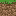 | 2* | 草 |
|  | 31, 1* | 草 |
| 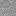 | 13* | 砾石 |
|  | 172 | 烧结黏土 |
|  | 170 | 干草捆 |
|  | 154 | 漏斗 |
|  | 79* | 冰块 |
|  | 178 | 倒置的日光感应器 |
|  | 101 | 铁栅栏 |
|  | 42* | 铁块 |
|  | 71* | 铁门块 |
|  | 15* | 铁矿石 |
|  | 167 | 铁制陷门 |
|  | 91 | 南瓜灯 |
| 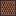 | 84 | 唱机 |
|  | 195 | 热带丛林门块 |
|  | 18, 3 | 热带丛林叶子 |
| 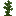 | 6, 3 | 热带丛林树苗 |
|  | 17, 3 | 热带丛林木材 |
| 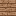 | 5, 3 | 热带丛林木板 |
|  | 126, 3 | 热带丛林木板（双层） |
|  | 125, 3 | 热带丛林木板（双层） |
| 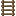 | 65* | 梯子 |
|  | 22* | 青金石块 |
|  | 21* | 青金石矿石 |
|  | 175, 3 | 大蕨 |
| 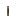 | 69 | 杠杆 |
|  | 175, 1 | 丁香 |
|  | 111 | 睡莲 |
|  | 103* | 西瓜块 |
|  | 105* | 西瓜茎 |
|  | 52 | 怪物生成器 |
|  | 48* | 苔石 |
|  | 98, 1* | 苔石砖 |
| 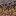 | 110 | 草木灰 |
|  | 112* | 下界砖 |
|  | 44, 6* | 下界砖板 |
|  | 43, 6* | 下界砖板（双倍） |
|  | 114* | 下界砖楼梯 |
|  | 90 | 下界传送门 |
| 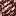 | 153 | 下界石英矿石 |
|  | 115 | 下界疣 |
|  | 87 | 下界岩 |
|  | 25 | 音符块 |
|  | 64* | 橡木门块 |
|  | 85* | 橡木栅栏 |
| 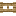 | 107* | 橡木栅栏门 |
|  | 18* | 橡树叶 |
|  | 6* | 橡木树苗 |
| 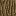 | 17* | 橡木 |
|  | 5* | 橡木木板 |
|  | 126 | 橡木板 |
| 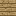 | 125 | 橡木板（双倍） |
|  | 53* | 橡木楼梯 |
|  | 49* | 黑曜石 |
|  | 38, 5 | 橙色郁金香 |
|  | 38, 8 | 牛眼雏菊 |
|  | 174 | 压缩冰 |
|  | 160, 15 | 黑色染色窗格 |
|  | 160, 11 | 蓝色染色窗格 |
|  | 160, 12 | 棕色染色窗格 |
|  | 160, 9 | 青色染色窗格 |
|  | 160, 7 | 灰色染色窗格 |
|  | 160, 13 | 绿色染色窗格 |
|  | 160, 3 | 浅蓝色染色窗格 |
|  | 160, 8 | 浅灰色染色窗格 |
|  | 160, 5 | 青柠染色窗格 |
|  | 160, 2 | 品红色染色窗格 |
|  | 160, 1 | 橙色染色窗格 |
|  | 160, 6 | 粉色染色窗格 |
|  | 160, 10 | 紫色染色窗格 |
|  | 160, 14 | 红色染色窗格 |
|  | 160 | 面板，白色染色 |
|  | 160, 4 | 面板，黄色染色 |
|  | 175, 5 | 牡丹 |
|  | 155, 2* | 柱状石英块 |
|  | 38, 7 | 粉色郁金香 |
|  | 33 | 活塞 |
| 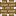 | 34 | 活塞头 |
| 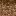 | 3, 2* | 腐植土 |
|  | 1, 6* | 抛光安山岩 |
| 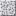 | 1, 4* | 抛光闪长岩 |
| 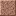 | 1, 2* | 抛光花岗岩 |
|  | 38 | 罂粟 |
|  | 142 | 土豆 |
| 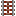 | 27 | 激活铁轨 |
|  | 148 | 压力板（重） |
|  | 147 | 压力板（轻） |
|  | 168 | 海晶 |
|  | 168, 1 | 海晶砖 |
|  | 86 | 南瓜 |
|  | 104 | 南瓜秧 |
|  | 155* | 石英块 |
|  | 44, 7* | 石英台阶 |
|  | 43, 7* | 石英台阶（双层） |
|  | 156* | 石英楼梯 |
|  | 66 | 铁轨 |
|  | 40* | 红蘑菇 |
|  | 100 | 红蘑菇块 |
|  | 12, 1 | 红砂 |
|  | 179 | 红砂岩 |
|  | 182 | 红砂岩台阶 |
|  | 181 | 红砂岩台阶（双层） |
|  | 38, 4 | 红郁金香 |
|  | 152 | 红石块 |
|  | 124 | 红石灯（亮） |
| 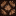 | 123 | 红石灯（不亮） |
|  | 73* | 红石矿 |
|  | 93 | 红石中继器（熄灭） |
|  | 94 | 红石中继器（开启） |
| 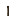 | 75 | 红石火把（熄灭） |
|  | 76 | 红石火把（点亮） |
|  | 175, 4 | 玫瑰丛 |
|  | 12* | 沙子 |
|  | 24* | 沙岩 |
|  | 44, 1* | 沙岩台阶 |
|  | 43, 1* | 沙岩台阶（双层） |
|  | 128* | 沙岩楼梯 |
|  | 169 | 海洋灯笼 |
|  | 165 | 蜘蛛块 |
|  | 179, 2 | 光滑红砂岩 |
|  | 24, 2 | 光滑沙岩 |
|  | 78* | 雪 |
| 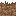 | 80* | 雪块 |
| 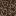 | 88 | 灵魂沙 |
| 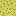 | 19 | 海绵 |
|  | 193 | 云杉木门块 |
|  | 18, 1* | 云杉树叶 |
| 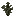 | 6, 1* | 云杉树苗 |
| 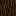 | 17, 1* | 云杉木 |
|  | 5, 1* | 云杉木板 |
|  | 126, 1 | 云杉木台阶 |
|  | 125, 1 | 云杉木台阶（双层） |
|  | 63* | 立式标志块 |
| 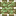 | 29 | 粘性活塞 |
|  | 11* | 静态熔岩 |
|  | 9* | 静态水 |
| 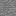 | 1* | 石头 |
| 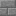 | 44, 5* | 石砖台阶 |
|  | 43, 5* | 石砖台阶（双层） |
|  | 109* | 石砖楼梯 |
|  | 98* | 石砖 |
| 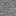 | 70 | 石质压力板 |
|  | 44* | 石板 |
|  | 43* | 石板（双层） |
|  | 83* | 甘蔗 |
|  | 175 | 向日葵 |
|  | 46* | TNT |
|  | 46, 1* | TNT, 手动引爆 |
|  | 175, 2 | 高草（双层） |
| 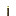 | 50* | 火把 |
|  | 132 | 绳网 |
|  | 131 | 绳线钩 |
|  | 106 | 藤蔓 |
|  | 68* | 壁挂标志块 |
|  | 19, 1 | 湿海绵 |
|  | 59* | 小麦作物 |
|  | 38, 6 | 白色郁金香 |
|  | 72 | 木质压力板 |
|  | 44, 2* | 木制台阶 |
|  | 43, 2* | 木制台阶（双层） |
|  | 96 | 木制活板门 |
|  | 35, 15* | 羊毛, 黑色 |
|  | 35, 11* | 羊毛, 蓝色 |
|  | 35, 12* | 羊毛, 棕色 |
|  | 35, 9* | 羊毛, 青色 |
|  | 35, 7* | 羊毛, 灰色 |
|  | 35, 13* | 羊毛, 绿色 |
|  | 35, 3* | 羊毛, 淡蓝色 |
|  | 35, 8* | 羊毛, 浅灰色 |
|  | 35, 5* | 羊毛, 绿黄色 |
|  | 35, 2* | 羊毛, 品红色 |
|  | 35, 1* | 羊毛，橙色 |
|  | 35, 6* | 羊毛，粉色 |
|  | 35, 10* | 羊毛，紫色 |
|  | 35, 14* | 羊毛，红色 |
|  | 35* | 羊毛，白色 |
|  | 35, 4* | 羊毛，黄色 |
