## 第一章。入门

你是否曾经想过自己制作一款电脑游戏、动画故事、教程或科学模拟？*Scratch*是一种图形化编程语言，它让创建这些应用变得轻松而有趣。在本章节中，你将：

+   探索 Scratch 的编程环境

+   了解不同类型的命令块

+   在 Scratch 中创建你的第一个游戏

当你制作一个 Scratch 应用时，你可以将它保存在电脑上或上传到 Scratch 网站，其他人可以对它进行评论，并将它改编成新的项目。

激动了吗？那么让我们开始吧！

## 什么是 Scratch？

计算机程序就是一组指令，用来告诉计算机该做什么。你通过*编程语言*来编写这些指令，这就是 Scratch 的作用。

大多数编程语言是*基于文本*的，这意味着你需要用看起来像是隐晦的英语命令来给计算机下指令。例如，要在屏幕上显示“Hello！”，你可能会写：

```
print('Hello!')                        (in the Python language)
std::cout << "Hello!" << std::endl;    (in the C++ language)
System.out.print("Hello!");            (in the Java language)
```

学习这些语言并理解它们的语法规则对于初学者来说可能具有挑战性。另一方面，Scratch 是一种*视觉*编程语言。它是由麻省理工学院（MIT）媒体实验室开发的，目的是让编程变得更加容易和有趣。

在 Scratch 中，你不需要输入任何复杂的命令。相反，你将连接图形块来创建程序。感到困惑吗？看一下图 1-1 中的简单程序，我会为你解释。

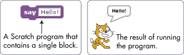图 1-1。当你运行这个 Scratch 块时，猫会在对话框中说“Hello！”。

在图 1-1 中看到的那只猫被称为*精灵*。精灵会理解并服从你给它们的指令。左侧的紫色块告诉猫在对话框中显示“Hello！”。在本书中，你将创建许多包含多个精灵的应用，并通过命令块让精灵移动、旋转、说话、播放音乐、做数学运算等等。

你可以通过将那些颜色编码的块像拼图块或乐高积木一样拼接在一起，在 Scratch 中进行编程。你创建的这些块堆叠称为*脚本*。例如，图 1-2 展示了一个改变精灵颜色四次的脚本。

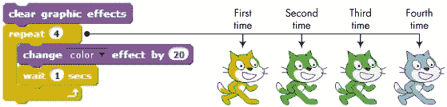图 1-2。使用脚本改变*猫*精灵的颜色

这个脚本在每次颜色变化之间等待一秒钟，屏幕上看到的四只猫展示了每次变化后精灵的新颜色。

试一试 1-1

尽管我们还没有讨论图 1-2 中的积木，但请阅读它们，观察它们的形状，并尝试弄清楚这个脚本是如何让猫变成青色的。（提示：第一个紫色积木会将猫恢复到原来的颜色。）如果我们从脚本中移除**等待**积木，你认为会发生什么？

本书涵盖了 2013 年 5 月发布的 Scratch 2 版本。这个版本允许你直接在网页浏览器中创建项目，因此你无需在计算机上安装任何软件，我们将依赖 Scratch 的网页界面来讲解本书的内容。

现在，既然你对这种编程语言有所了解，是时候开始我们的编程之旅，并学习如何使用它了。

## Scratch 编程环境

要启动 Scratch，访问 Scratch 网站 (*[`scratch.mit.edu/`](http://scratch.mit.edu/)*), 然后点击*TRY IT OUT*链接。这将把你带到 Scratch 的项目编辑器界面，如图 1-3 所示。

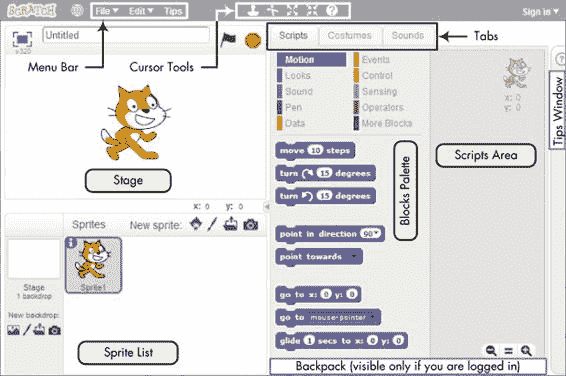图 1-3. Scratch 用户界面，你将在此构建程序

你应该看到一个单一的窗口，其中至少包含以下三个面板：舞台（左上），精灵列表（左下），以及脚本标签页（右侧），该标签页包含积木标签页和脚本区域。右侧面板还包含两个额外的标签页，分别是服装和声音，稍后将在本节中讨论。如果你已登录 Scratch 网站的账户，你还应该看到背包（右下角），它有一些按钮，让你可以分享项目，并使用已有项目中的精灵和脚本。

我们快速看一下三个主要面板。

### 舞台

*舞台*是你的角色（精灵）移动、绘图和交互的地方。舞台宽度为 480 步，高度为 360 步，如图 1-4")所示。舞台的中心点* x *坐标为 0，* y *坐标也为 0。

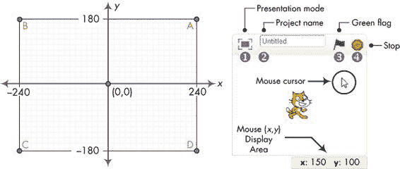图 1-4. 舞台像一个坐标平面，中心点为(0,0)。

你可以通过将鼠标光标移到舞台上的任何点，观察鼠标(*x*, *y*)显示区域中的数字，来找到该点的(*x*,*y*)坐标，该区域位于舞台正下方。

位于舞台上方的小工具栏有多个控件。演示模式图标 ① 隐藏所有脚本和编程工具，使舞台区域几乎占据整个显示器。编辑框 ② 显示当前项目的名称。绿色旗帜 ③ 和停止 ④ 图标让你开始和结束程序。

尝试 1-2

移动鼠标到舞台周围并观察鼠标显示区域。当你将鼠标移出舞台区域时会发生什么？现在，切换到演示模式并观察屏幕如何变化。点击屏幕左上角的  图标，或按下键盘上的 ESC 键退出演示模式。

### 精灵列表

精灵列表显示项目中所有精灵的名称和缩略图。新项目开始时会有一个白色的舞台和一个穿着猫服的精灵，如 图 1-5 所示。

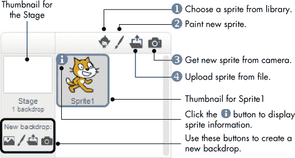图 1-5. 新项目的精灵列表

精灵列表上方的按钮让你从四个地方将新精灵添加到项目中：Scratch 的精灵库 ①，内置的绘图编辑器 ②（你可以在这里绘制自己的服装），连接到你计算机的摄像头 ③，或你的计算机 ④。

尝试 1-3

使用位于精灵列表上方的一些按钮将新精灵添加到项目中。通过拖动相应的缩略图来重新排列精灵列表中的精灵。

项目中的每个精灵都有自己的脚本、服装和声音。你可以选择任何精灵来查看其属性。你可以通过 (1) 点击精灵列表中的缩略图，或 (2) 双击舞台上的精灵本身来选择精灵。当前选中的精灵缩略图会被高亮显示，并且用蓝色边框框住。当你选择一个精灵时，你可以通过点击脚本区域上方的三个标签之一来访问其脚本、服装和声音。我们稍后会查看这些标签的内容。目前，右键点击 (或在 Mac 上按住 CTRL 键点击) `Cat` 精灵的缩略图，查看弹出的菜单，如 图 1-6 所示。

复制选项 ① 会复制精灵并为副本指定一个不同的名称。你可以使用删除 ② 删除项目中的精灵，也可以使用保存到本地文件选项 ③ 将精灵导出为 *.sprite2* 文件到你的计算机。（要将导出的精灵导入到另一个项目中，只需点击 图 1-5 中显示的“从文件上传精灵”按钮。）隐藏/显示选项 ④ 允许你更改舞台上精灵是否可见。

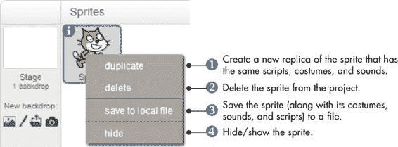图 1-6. 右键点击角色的缩略图显示此快捷菜单。

在你的角色缩略图旁边，角色列表还显示舞台的缩略图（参见图 1-6）。舞台有自己的脚本、图像和声音。你在舞台上看到的背景图像叫做*背景*。当你开始一个新项目时，舞台的背景默认为简单的白色背景，但你可以通过舞台缩略图下方的四个按钮添加新的背景图像。点击角色列表中的舞台图标可以查看并编辑其相关的脚本、背景和声音。

### 积木标签

Scratch 中的积木分为 10 个类别（调色板）：*运动*、*外观*、*声音*、*画笔*、*数据*、*事件*、*控制*、*感知*、*运算符*和*更多积木*。为了帮助你轻松找到相关的积木，积木通过颜色编码。Scratch 2 有超过 100 个积木，尽管有些积木仅在特定条件下出现。例如，*数据*调色板中的积木（在第五章和第九章中讨论）只有在创建了变量或列表之后才会出现。让我们查看图 1-7 中的积木标签的各个组成部分。

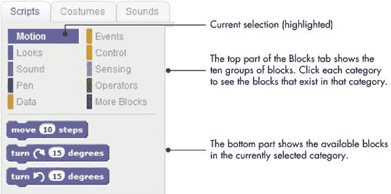图 1-7. 积木标签的放大视图

试着点击一个积木，看看它会做什么。例如，如果你点击*运动*调色板中的**移动 10 步**，角色将在舞台上移动 10 步。再点击一次，角色再移动 10 步。点击**说“Hello!”2 秒**积木（在*外观*调色板中），让角色在气泡框中显示“Hello!”持续两秒。你还可以通过从工具栏中选择*积木帮助*（问号图标）并点击你不理解的积木来访问该积木的帮助界面。

有些积木需要一个或多个输入（也叫做*参数*），这些输入告诉积木应该做什么。比如，**移动 10 步**积木中的数字 10 就是一个参数。查看图 1-8，了解积木如何让你改变它们的输入。

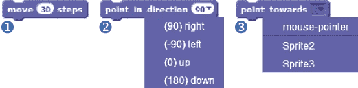图 1-8. 更改不同类型积木的输入

你可以通过点击**move 10 steps**中的白色区域（看到数字 10 的地方）并输入一个新的数字①来更改步数，可能是 30，就像你在图 1-8 中看到的那样。一些积木，如**point in direction 90**，也有下拉菜单供你选择其输入②。你可以点击向下箭头查看可用选项列表并选择一个。这个特定命令有一个白色可编辑区域，所以你也可以直接在白色框内输入一个值。其他积木，如**point towards**③，会强制你从下拉菜单中选择一个值。

练习 1-4

进入*外观*面板，改变积木输入的值，然后点击积木看看它们的作用。例如，尝试**set color effect to**积木。试试数字 10、20、30 等等，直到猫恢复原本的颜色。使用下拉菜单中的选项并尝试不同的数字。你可以点击**clear graphic effects**积木（也在*外观*面板中）来清除你所做的更改。

### 脚本区域

要让一个精灵做有趣的事情，你需要通过从“积木”标签页拖动积木到“脚本区域”并将它们拼接在一起进行编程。当你在“脚本区域”内拖动积木时，白色高亮会指示你可以将该积木放置的位置，以便与另一个积木形成有效连接（图 1-9）。Scratch 积木只有在某些特定的方式下才能拼接在一起，这样避免了使用基于文本的编程语言时常见的输入错误。

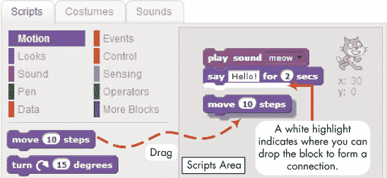图 1-9. 将积木拖入脚本区域并将它们拼接在一起创建脚本。

你不需要完成脚本就能运行它，这意味着你可以在构建脚本时测试它。点击脚本中的任何地方，无论是完整的还是部分的，都会运行整个脚本，从上到下。

练习 1-5

启动一个新的 Scratch 项目，并为`Cat`精灵创建以下脚本。（**forever**积木在*控制*面板中，其他积木则在*运动*面板中。）

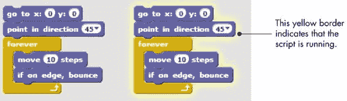

你将在第二章中了解这些积木的大部分。现在，点击你的新脚本运行它。（Scratch 应该会用一个发光的黄色边框高亮显示正在运行的脚本，正如图像右侧所示。）你甚至可以在脚本运行时更改积木的输入并添加新的积木！例如，更改**move**积木中的数字，看看猫的运动如何变化。再点击一次脚本来停止它。

你也可以轻松地拆解一堆积木并分别测试每个积木。当你尝试理解长脚本时，这将是一个非常宝贵的策略。要移动整堆积木，抓住堆顶的积木。要从堆中间分离出一个积木以及它下面的所有积木，抓住它并拖动。试试看吧。

这个功能还允许你逐步构建项目。你可以连接一小块积木，测试它们是否按预期工作，然后将它们组合成更大的脚本。

你甚至可以将一堆积木从一个精灵复制到另一个精灵。只需将堆积木从源精灵的脚本区拖动到目标精灵的缩略图上。

尝试一下 1-6

向你的项目中添加另一个精灵。将`Cat`精灵的脚本从脚本区拖动并放到新精灵的缩略图上。你的鼠标箭头必须停留在新精灵的缩略图上，才能成功放置。检查新精灵的脚本标签，确保它有一个与原脚本完全相同的副本。

### 服装标签

你可以通过更换精灵的服装来改变它的外观，而服装本质上只是一个图像。服装标签包含了你组织精灵服装所需的一切；你可以把它当作一个衣柜。衣柜里可以有许多服装，但精灵一次只能穿一个。

现在让我们试试更换`Cat`精灵的服装。点击`Cat`精灵的缩略图并选择服装标签。如图 1-10 所示，`Cat`有两个服装：`costume1`和`costume2`。高亮显示的服装（此例中为`costume1`）表示精灵当前的服装。

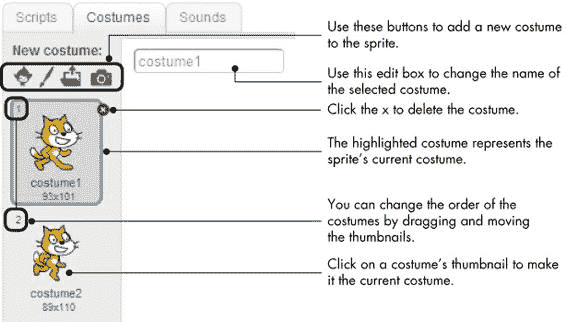图 1-10。你可以通过服装标签组织精灵的所有服装。

如果你右键点击一个服装的缩略图，你会看到一个弹出菜单，包含三个选项：（1）复制，（2）删除，以及（3）保存到本地文件。第一个选项会添加一个与您复制的服装图像完全相同的新服装。删除选项会删除选中的服装。最后一个选项允许你将服装保存到文件中。你可以通过“从文件上传服装”按钮将该服装导入并在其他项目中使用（这是图 1-10 中的第三个按钮）。试试看这些选项吧。

尝试一下 1-7

点击图 1-10 中猫咪图片上方的第一个按钮，从 Scratch 的库中选择一个新服装。然后从出现的窗口中选择你喜欢的任何图片。应用图 1-10 中的一些提示，来更熟悉服装选项。

### 声音标签

精灵也可以播放声音，这能为你的程序增添生气。例如，你可以为一个精灵设置不同的声音，当它高兴或伤心时播放。如果你的游戏中有一个像导弹一样的精灵，当它击中或未击中目标时，可以让导弹播放不同的声音。

声音标签中的按钮将帮助你组织精灵可以播放的不同声音。如图 1-11 所示，Scratch 甚至提供了一个工具，可以用来编辑声音文件。我在本书中不会讨论这个工具的细节，但我鼓励你自己尝试使用它。

图 1-11。声音标签可以让你组织精灵的声音。

大多数时候，你只需要使用声音标签顶部的三个按钮。它们允许你从 Scratch 的声音库中选择一个声音①，录制一个新声音②（如果你有麦克风的话），或者从你的计算机中导入一个现有的声音文件③。Scratch 只支持 MP3 和 WAV 格式的声音文件。

试试看 1-8

选择声音标签并点击**从库中选择声音**按钮。试听 Scratch 中提供的各种声音，以便为你未来的项目获得一些灵感。

### 背景标签

当你在精灵列表中选择舞台的缩略图时，中间标签的名称将从*服装*更改为*背景*。使用这个标签可以组织舞台的背景图片，你可以通过脚本来更改这些背景。例如，如果你正在创建一个游戏，你可能会在游戏开始时显示一个带有说明的背景，然后在用户开始游戏时切换到另一个背景。背景标签与服装标签是一样的。

试试看 1-9

点击精灵列表中舞台缩略图下方的**从库中选择背景**按钮。从出现的窗口中选择 xy 网格背景，然后点击确定。Scratch 将把 xy 网格添加到你的项目中，并设为默认背景。（xy 网格显示的是一个二维的笛卡尔平面，当你使用运动命令块时非常有用。）重复这些步骤，选择你喜欢的其他背景。

### 精灵信息

你可以通过点击精灵缩略图左上角的小  图标来查看精灵信息区域，如图 1-12 所示。这个区域显示了精灵的名称、当前的 (*x*, *y*) 位置和方向、旋转样式和可见状态，以及它是否可以在演示模式下被拖动。让我们简要了解一下这些选项。

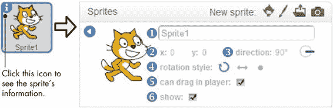图 1-12. 精灵信息区域

该区域顶部的编辑框①允许你更改精灵的名称。你将在本书中多次使用这个框。

*x* 和 *y* 值②显示精灵在舞台上的当前位置。将精灵拖到舞台上，观察这些数字发生了什么变化。

精灵的方向③表示精灵在接收到移动块时将朝哪个方向移动。拖动从圆形图标中心发出的蓝色线条来旋转精灵。

三个旋转样式按钮④（分别命名为旋转、左右翻转和不旋转）控制精灵在改变方向时服装的显示方式。为了理解这些按钮的效果，请创建图 1-13 中所示的脚本，然后在脚本运行时点击每个按钮。你可以在*控制*调色板中找到**等待**块。

“在播放器中可拖动”复选框⑤表示精灵是否可以在演示模式下被拖动（使用鼠标）。切换到演示模式并勾选/取消勾选此框，尝试将精灵拖动到舞台上，了解这个复选框的效果。

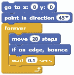图 1-13. 用于演示旋转样式的脚本

“显示”复选框⑥允许你在程序设计时显示/隐藏精灵。试试看，观察会发生什么。你将在本书的许多例子中看到一些隐藏的精灵，它们在幕后做着有用的工作。

### 工具栏

让我们快速看一下图 1-14 中 Scratch 的工具栏，首先介绍一些按钮。（如果你已登录，工具栏会略有不同，具体内容请见附录 A。）使用“复制”和“删除”按钮来复制和移除精灵、服装、声音、积木或脚本。“放大”按钮可以让精灵变大，而“缩小”按钮则可以让它们变小。只需点击你想使用的按钮，然后点击精灵（或脚本）来应用该操作。要返回到箭头光标，点击屏幕上的任何空白区域。你可以使用语言菜单来更改界面的语言。

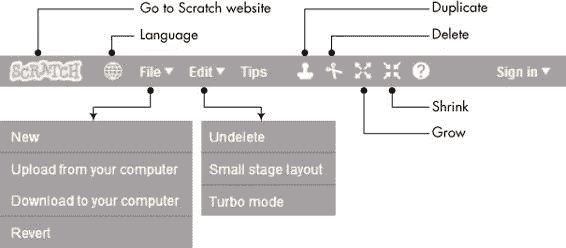图 1-14. Scratch 的工具栏

在文件菜单中，你可以创建新的项目，上传（打开）计算机中的现有项目，下载（保存）当前项目到计算机，或者还原（撤销）当前项目的所有更改。Scratch 2 项目的文件扩展名为 *.sb2*，以便与在 Scratch 先前版本中创建的项目（*.sb*）区分开来。

在编辑菜单中，“撤销删除”会恢复你最后删除的块、脚本、精灵、服装或音效。小舞台布局选项会缩小舞台，并为脚本区域提供更多空间。选择“加速模式”可以提高某些块的执行速度。例如，在普通模式下执行 **move** 块 1,000 次可能需要大约 70 秒，而在加速模式下只需大约 0.2 秒。

现在你已经了解了 Scratch 工具栏的基本功能，我们将简要介绍一下 Scratch 内置的画图编辑器。

## 画图编辑器

你可以使用画图编辑器（图 1-15）来创建或编辑服装和背景。（当然，你也可以自由使用你喜欢的图像编辑程序。）如果你想了解更多关于 Scratch 画图编辑器的信息，可以查看 *ScratchPaintEditor.pdf*（位于在线资源中，可以从 *[`nostarch.com/learnscratch/`](http://nostarch.com/learnscratch/)* 下载）。

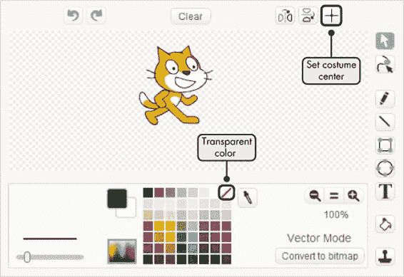图 1-15. Scratch 的画图编辑器

目前，你需要了解的两个重要功能是：设置图像的中心和设置透明颜色。我将在接下来的章节中解释这些功能。

### 设置图像的中心

当你指令一个精灵转动（左转或右转）时，它会围绕参考点——即其服装的中心——进行旋转。点击画图编辑器右上角的“设置服装中心”按钮可以让你选择该中心。点击此按钮后，你将在绘图区域看到十字准线，如图 1-16 所示。中心点由这两条轴的交点决定，因此，要移动服装的中心，只需将它们拖动到新的位置。要隐藏这些轴线，再次点击相同的按钮。

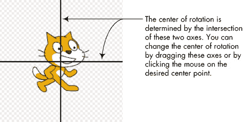图 1-16. 点击“设置服装中心”按钮后更改服装中心，试一试 1-10

*RotationCenter.sb2*

打开 *RotationCenter.sb2* 并运行它。该应用包含一个精灵，其服装和脚本如下所示。服装中心设定在正方形的中心。运行脚本并注意其模式。然后编辑服装，将其中心设定在圆形的中心，再次运行脚本，看看图像如何变化。

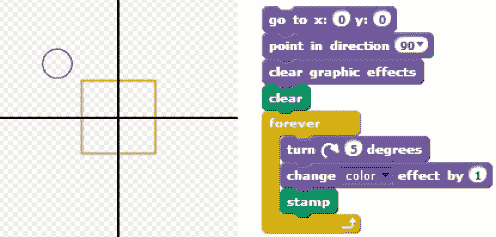

### 设置透明颜色

当两幅图像重叠时，顶部的图像会覆盖底部图像的一部分。同样，精灵会覆盖舞台的一部分。如果你想看到图像背后的舞台样子，你需要使用绘图编辑器将图像的至少一部分设为*透明*，就像右侧的企鹅图像所示，见图 1-17。

在*颜色*调色板中，点击带有对角红线的方块，用“透明”颜色涂抹以使某部分变得不可见。你可以将此图标视为“无颜色”标志，类似于“禁止吸烟”标志上有一条红线穿过香烟。

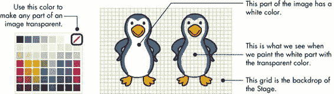图 1-17。你可以通过用“透明”颜色填充图像的某部分，使其变得透明。

现在你已经熟悉了 Scratch 界面，我们将好好利用这些知识，制作一些有趣的东西。卷起袖子，准备好：我们要做一个游戏了！

## 你的第一个 Scratch 游戏

*Pong.sb2*

*Pong_NoCode.sb2*

在这一节中，你将创建一个单人游戏，玩家需要移动挡板，以防止弹跳的网球撞击地面，灵感来自经典的街机游戏 Pong。我们的游戏界面如图 1-18 所示。

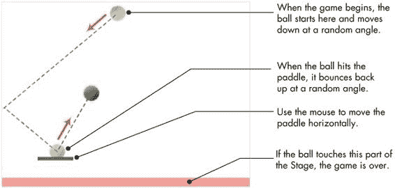图 1-18。我们的游戏界面

如图所示，球从舞台顶部开始，以某个随机角度向下移动，并在舞台边缘弹跳。玩家水平移动挡板（使用鼠标）将球送回上方。如果球触及舞台底部，则游戏结束。

我们将一步步构建这个游戏，但首先我们需要打开一个新的项目。选择**文件**▸**新建**以开始一个新的 Scratch 项目。然后通过右键点击 `Cat` 精灵并选择弹出菜单中的**删除**来删除该精灵。

### 第一步：准备背景

为了检测球是否错过了挡板，我们将在舞台底部标记某种颜色，并使用**接触颜色？**积木（来自*传感*调色板）来判断球是否触碰到该颜色。我们当前的背景是白色，所以我们只需要在底部绘制一个细长的彩色矩形，如图 1-19 所示。

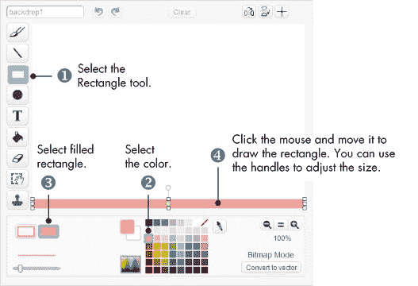图 1-19。绘制背景图像底部矩形的步骤

点击舞台缩略图选择它，然后转到背景标签页。按照图 1-19 中的步骤，在舞台背景的底部绘制一个细长的矩形。

### 第 2 步：添加挡板和球

点击精灵列表上方的**绘制新精灵**按钮，将`Paddle`精灵添加到你的项目中。由于挡板只是一个细长的短矩形，重复步骤 1 中的操作，绘制一个像图 1-18 中的挡板。随意给挡板上色，并将其中心大致设置在矩形的中间。

接下来，将精灵命名为能够解释它是什么的名称；我叫它`Paddle`。同时，点击舞台上的挡板图像并移动它，使其*y*坐标大约为-120。

我们的游戏现在有了一个挡板，但我们还需要一个球来弹跳，所以点击**从库中选择精灵**，从精灵列表上方导入一个。在弹出的对话框中，点击**物品**类别，选择**网球**图像，将该精灵添加到项目中。将精灵重命名为`Ball`。

在开始为游戏编写脚本之前，选择**文件** ▸ **下载到你的电脑**，将目前为止的工作保存到电脑上。在弹出的对话框中，选择你想要保存工作的文件夹，命名文件为*Pong.sb2*，然后点击**保存**。如果你当前已登录，还可以将工作保存到*云端*（即，Scratch 服务器上）。无论你选择将文件保存在本地（电脑上）还是云端，都要记得经常保存工作。

现在，拥有`Paddle`和`Ball`精灵后，舞台应类似于图 1-18。如果此时遇到任何困难，你可以打开文件*Pong_NoCode.sb2*，它包含了我们刚才创建的所有内容。接下来你将为游戏添加脚本，但不用太担心区块的细节。我们稍后会在书中深入探讨这些区块，所以现在让我们专注于学习如何将一个完整的项目组合在一起。

### 第 3 步：开始游戏并让你的精灵动起来

作为这个游戏的设计师，你将决定玩家如何开始新的一局游戏。例如，游戏可以在按下某个键、点击舞台上的一个精灵，或者甚至拍手或挥手（如果你有摄像头）时开始。绿色旗帜图标（位于舞台上方）是另一个流行的选择，我们将在这里使用它。

这个想法很简单。任何以**当点击绿旗时**触发的脚本都会在你按下该按钮时开始运行。旗帜变为亮绿色，并保持这样，直到脚本完成。要看到这一过程，请为`Paddle`精灵创建图 1-20 中显示的脚本。

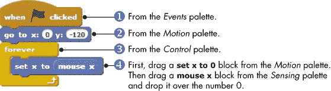图 1-20. *`Paddle`* 精灵的脚本

当点击绿色旗帜时①，**go to x: y:**块②将挡板的垂直位置设置为–120，以防你之前用鼠标移动过它。挡板应该悬浮在舞台底部粉色矩形的上方，如果你的矩形较厚，可以调整其位置数字，使其适应你的设计。

脚本接着使用**forever**块③来不断检查鼠标位置。我们将通过将挡板的* x *位置与鼠标位置匹配，来使挡板来回移动④。运行脚本（点击绿色旗帜图标），然后尝试水平移动鼠标；挡板应该会跟随鼠标移动。点击绿色旗帜旁边的停止图标来停止脚本。

`Ball`精灵的脚本比之前的长一些，因此我将其分解成简单的部分。当点击绿色旗帜时，球应该开始移动，所以首先，将图 1-21 中的脚本添加到`Ball`精灵中。

图 1-21. *`Ball`* 精灵脚本的第一部分

首先，我们将球移到舞台顶部①，并使用**pick random**块②（来自*Operators*调色板）让它朝一个随机角度指向下方。然后，脚本使用**forever**块③来使球④在舞台上移动，并从边缘反弹⑤。点击绿色旗帜测试到目前为止写的部分。球应该呈之字形移动，挡板应该仍然跟随你的鼠标。

试试看 1-11

将**move**块中的 12 替换为不同的值，运行脚本并观察发生了什么。这应该能让你了解如何让游戏变得更容易或更难。完成后，点击停止图标。

现在是添加有趣部分的时候了——让球从挡板反弹的块。我们可以修改刚刚创建的**forever**块，使得球在击中挡板后朝上移动，如图 1-22 所示。

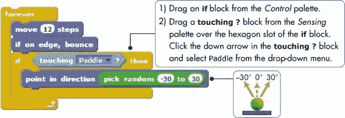图 1-22. 添加代码以将球踢起

当球和挡板碰撞时，我们指示球朝一个–30 到 30 之间的随机方向移动。当**forever**块进入下一轮时，它将执行**move**块，这样就会使球向上移动。再次点击绿色旗帜测试游戏的这一部分。当你确认球按照预期从挡板反弹时，点击停止图标。

我们现在唯一缺少的部分是一些代码，用于在小球触碰到舞台底部时停止游戏。将图 1-23 中显示的脚本添加到`Ball`角色中，位置可以在图 1-22 的**if**代码块前面或后面。你会在*感应*面板中找到**touching color ?**代码块，并在*控制*面板中找到**stop**代码块。

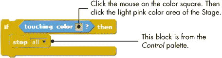图 1-23. 结束游戏的代码块

当你在**touching color?**代码块内点击彩色方块时，光标会变成手型光标。将光标移动并点击舞台底部的浅粉色矩形时，代码块内的彩色方块应该与矩形的颜色匹配。**stop all**代码块正如其名称所示：它会停止所有角色中运行的脚本，`Paddle`和`Ball`角色也不例外。

这个基本的乒乓球游戏现在已经完全功能化了。点击绿色旗帜并测试几次游戏，看看你能用这么少的代码创建一个完整的游戏。我希望你能和我一样认为 Scratch 真的很棒！

### 第四步：用声音增加趣味

当然，游戏有声音会更有趣，因此让我们再添加最后一个触动，每当击中小球时播放一个声音。

双击舞台上的小球以选择它，然后选择“声音”选项卡。点击**从库中选择声音**按钮，为`Ball`角色添加一个声音。在弹出的对话框中，选择**效果**类别，选择**pop**声音，点击**确定**将其添加到声音选项卡。之后，回到脚本选项卡，并插入一个**播放声音**代码块（来自*声音*面板），如图 1-24 所示。

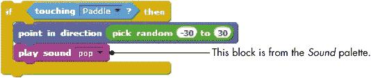图 1-24. 当小球触碰到挡板时播放声音

再次测试游戏，这一次，每当小球触碰到挡板时，你应该能听到一个短促的“啪”的声音。

恭喜！你的游戏现在已经完成（当然，如果你想添加更多功能，还是可以继续改进的），你刚刚编写了你的第一个 Scratch 程序。如果你想继续实验，可以尝试复制`Ball`角色，让游戏中有两个（或更多）小球，看看这会如何改变游戏玩法！

在下一节中，我将介绍 Scratch 中可用的不同类型的代码块。随着你继续阅读本书，你将深入了解这些代码块的工作原理，但现在我们只简要介绍一下它们。

## Scratch 代码块：概述

在本节中，你将了解 Scratch 中不同积木的名称及其预期用途。目标是定义你将在接下来几章中阅读的一些术语。如果需要刷新记忆，你可以在进度过程中随时返回本节。

如图 1-25 所示，Scratch 有四种类型的积木：命令积木、功能积木、触发积木和控制积木。*命令积木*和*控制积木*（也叫*堆叠*积木）底部有凸起或顶部有凹口。你可以将这些积木拼接在一起，形成堆叠。*触发积木*，也叫*帽子*，顶部是圆形的，因为它们位于堆叠的顶部。触发积木将事件与脚本连接。当某个事件（如按下键或点击鼠标）发生时，它们会运行下方的积木。例如，所有以**点击绿色旗帜时**积木开始的脚本都会在用户点击绿色旗帜图标时运行。

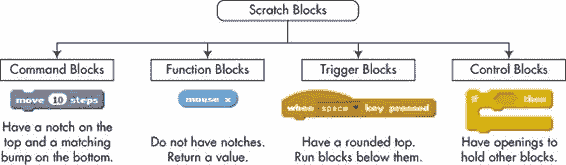图 1-25. Scratch 中的四种类型的积木

*功能积木*（也叫*报告者*）没有底部的凸起或顶部的凹口。它们不能单独构成脚本的一层；相反，它们作为输入提供给其他积木。这些积木的形状表示它们返回的数据类型。例如，带有圆形末端的积木报告数字或字符串，而带有尖形末端的积木则报告某事是否为真或假。如图 1-26 所示。

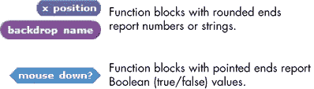图 1-26. 功能积木的形状表示它返回的数据类型

一些功能积木旁边有一个复选框。如果你勾选该框，舞台上会出现一个*监视器*，显示当前报告者的值。选择一个精灵并勾选**x 位置**积木（在*运动*面板中）。然后将精灵拖动到舞台上，观察那个监视器。当你来回移动精灵时，监视器的值应该会发生变化。

## 算术运算符和函数

现在，让我们快速了解 Scratch 支持的算术运算符和函数。如果你丢了计算器，那就不必担心了！你可以使用*运算符*面板中的积木在 Scratch 中制作一个自己的计算器，本节将带你探索这些积木。

### 算术运算符

Scratch 支持四种基本的算术运算：加法（**+**）、减法（**-**）、乘法（*****）和除法（**/**）。用于执行这些运算的块，称为 *运算符*，如 图 1-27 所示。由于这些块生成一个数字，你可以将它们作为输入传递给任何接受数字的块，如图中所示。

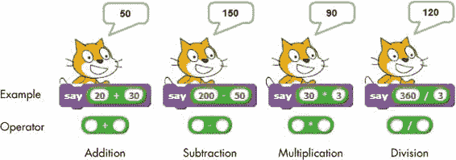 图 1-27. Scratch 中的算术运算符

Scratch 还支持取模（**mod**）运算符，该运算符返回两个数字相除的余数。例如，**10 mod 3** 返回 1，因为 10 除以 3 的余数是 1。取模运算符的常见用途是测试一个 *整数*（整数）是否能被另一个（较小的）整数整除。取模为 0 表示较大的数字能被较小的数字整除。这个概念是否能帮助你理解如何判断一个数字是偶数还是奇数？

Scratch 还支持另一个有用的运算符 **round**，它将小数数字四舍五入到最接近的整数。例如，**round(3.1)** = 3，**round(3.5)** = 4，**round(3.6)** = 4。

### 随机数

随着你编程经验的增加，你可能会需要在某些时候生成随机数，尤其是在创建游戏和模拟时。Scratch 提供了专门用于此目的的 **pick random** 块。

每次使用该块时，它都会输出一个随机数。它的两个可编辑的白色框允许你输入该数字的范围，Scratch 只会选择两个限制之间的值（包括两个端点）。表 1-1 显示了使用该块的一些示例。

表 1-1. 使用 pick random 块的示例

| 示例 | 可能的结果 |
| --- | --- |
|  | {0, 1} |
|  | {0, 1, 2, 3, ..., 10} |
|  | {–2, –1, 0, 1, 2} |
|  | {0, 10, 20, 30, ..., 100} |
|  | {0, 0.1, 0.15, 0.267, 0.3894, ..., 1.0} |
|  | {0, 0.01, 0.12, 0.34, 0.58, ..., 1.0} |

### 注意

*“pick random 0 到 1”* **和** *“pick random 0 到 1.0”* *的输出是不同的。第一个情况会给你 1 或 0，而第二个则会给你一个介于 0 和 1 之间的小数。如果* **pick random** *块的任何输入包含小数点，输出也将是一个小数值。*

### 数学函数

Scratch 还支持大量的数学函数。**sqrt of** 块将 14 个数学函数组合在一起，可以从下拉菜单中选择，包括平方根、三角函数、对数函数和指数函数。有关这些函数的详细介绍，请参考*MathematicalFunctions.pdf*。

## 总结

本章提供了 Scratch 及其编程环境的高层次概述。你了解了用户界面的各种元素，甚至创建了一个游戏！我们还探讨了 Scratch 的数学运算符和函数。

到目前为止，你已经掌握了创建强大 Scratch 脚本所需的最基本信息，但这仅仅是编写精彩程序的第一步。在接下来的章节中，你将深入挖掘如何使用 Scratch 来提升你的编程技能。

## 问题

| **问:** | 1\. 写下下面脚本中每个块的结果。这些乘积中有规律吗？！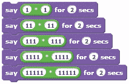 |
| --- | --- |
| **问:** | 2\. 在乘积 9 × 9，99 × 99，999 × 999 等中有规律吗？使用**say**命令找出这些乘积的结果并检查你的答案。 |

| **问:** | 3\. 完成下表，写出每个表达式的值。

&#124; 表达式 &#124; 值 &#124;

&#124; --- &#124; --- &#124;

&#124; 3 + (2 × 5) &#124;   &#124;

&#124; (10 / 2) – 3 &#124;   &#124;

&#124; 7 + (8 × 2) – 4 &#124;   &#124;

&#124; (2 + 3) × 4 &#124;   &#124;

&#124; 5 + (2 × (7 – 4)) &#124;   &#124;

&#124; (11 – 5) × (2 + 1) / 2 &#124;   &#124;

&#124; 5 × (5 + 4) – 2 × (1 + 3) &#124;   &#124;

&#124; (6 + 12) mod 4 &#124;   &#124;

&#124; 3 × (13 mod 3 ) &#124;   &#124;

&#124; 5 + (17 mod 5) – 3 &#124;   &#124;

现在，使用**say**命令和适当的运算符块来检查你的答案。 |

| **问:** | 4\. 使用铅笔和纸评估以下 Scratch 表达式。令*x* = 2，*y* = 4。

1.  

1.  

1.  

1.  

1.  

|

| **问:** | 5\. 使用**say**命令和*Operators*面板中的适当块来计算以下内容：

1.  32 的平方根

1.  30°的正弦值

1.  60°的余弦值

1.  将 99.459 四舍五入的结果

|

| **问:** | 6\. 创建一个函数块，计算以下三个数字的平均值：90、95 和 98。使用**say**块显示结果。 |
| --- | --- |
| **问:** | 7\. 创建一个函数块，将 60°F 转换为摄氏度。（提示：*C* = (5/9) × (*F* – 32)。） |
| **问：** | 8\. 创建一个函数模块，计算一个梯形的面积，梯形的高度为 4/6 英尺，底边长度分别为 5/9 英尺和 22/9 英尺。（提示：*A* = 0.5 × (*b*[1] + *b*[2]) × *h*，其中*h*为高度，*b*[1]和*b*[2]为两条底边的长度。） |
| **问：** | 9\. 创建一个函数模块，计算加速一个质量为 2000 千克的汽车到 3 米/秒²所需的力。（提示：*力* = *质量* × *加速度*。） |
| **问：** | 10\. 电力费用为每千瓦时 0.06 美元。创建一个函数模块，计算使用一个 1500 瓦空调运作 2 小时的费用。（提示：*能量* = *功率* × *时间*。） |

| **问：** | 11\. 使用一个简单的数学技巧，你可以使用**round**运算符将数字四舍五入到特定的小数位。例如，你可以通过以下三步将数字 5.3567 四舍五入到最接近的十分位（即小数点右侧的第一位）：

&#124; a. &#124; 5.3567 × 10 = 53.567 &#124; （将数字乘以 10。）&#124;

&#124; b. &#124; round(53.567) = 54 &#124; （将步骤 a 的结果四舍五入。）&#124;

&#124; c. &#124; 54/10 = 5.4 &#124; （将步骤 b 的结果除以 10。）&#124;

你需要对上述步骤做出哪些修改，才能将结果四舍五入到最接近的百分位（即小数点右侧第二位）？创建一个函数模块，将 5.3567 四舍五入到最接近的十分位（或百分位），并使用**say**模块显示其输出。|
