## 第二章 运动与绘图

现在你已经熟悉了界面，你准备好使用更多 Scratch 的编程工具了。在本章中，你将进行以下操作：

+   探索 Scratch 的运动与画笔命令

+   动画精灵并让它们在舞台上移动

+   绘制艺术性、几何图案并创建游戏

+   学习为什么精灵克隆是一个有价值的工具

现在是时候戴上你的创意帽，跳入计算机图形的世界了！

## 使用运动命令

如果你想制作游戏或其他动画程序，你需要使用 *运动* 调色板中的积木来移动精灵。此外，你还需要命令精灵移动到舞台上的特定位置或朝某个方向转动。在本节中，你将学到如何做到这一点。

### 绝对运动

记住，正如你在图 1-4 为中心的坐标平面")中看到的那样，舞台就像一个 480 × 360 的矩形网格，中心是点 (0,0)。Scratch 有四个*绝对运动*命令（**go to**、**glide to**、**set x to** 和 **set y to**），让你可以告诉精灵在这个网格上的确切位置。

### 注意

*如果你想了解这些和其他积木的更多细节，可以使用脚本面板右侧的 Scratch 提示窗口。如果你看不到提示窗口，只需点击 Scratch 项目编辑器右上角的问号。*

为了演示这些命令，假设你想让图 2-1 中的 `Rocket` 精灵撞击位于 (200,150) 位置的星形 `Target` 精灵。最明显的方法是使用 **go to** 块，正如图的右侧所示。*x* 坐标告诉精灵在舞台上水平移动的距离，而 *y* 坐标则告诉它垂直移动的距离。

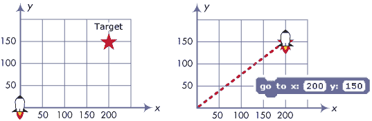图 2-1. 你可以使用 *go to* 块将精灵移动到舞台上的任何位置。

`Rocket` 不会转向目标，但它会沿着一条看不见的直线从当前位置（点 (0,0)）移动到点 (200,150)。你可以使用 **glide to** 命令让 `Rocket` 放慢速度。它与 **go to** 命令几乎相同，但它允许你设置 `Rocket` 到达目标所需的时间。

另一种击中目标的方法是通过 **set x to** 和 **set y to** 块独立改变 `Rocket` 精灵的 *x* 和 *y* 位置，如图 2-2 所示。你还记得在第一章的 Pong 游戏中如何使用 **set x to** 块吗？（请参阅图 1-20 复习一下。）

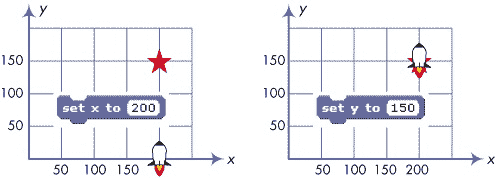图 2-2。你可以独立设置精灵的* x *和* y *坐标。

你可以随时在脚本区域的右上角看到精灵当前的 *x* 和 *y* 位置。如果你想在舞台上显示这些信息，可以使用 **x position** 和 **y position** 变量块。点击这些块旁边的复选框，就可以在舞台上看到它们的值。

### 注意

*运动命令是以精灵的中心为参考点的，你可以在绘画编辑器中设置该中心。例如，发送精灵到点 (100,100) 时，会将精灵移动到其中心位于 (100,100) 的位置，如图 2-3 所示。因此，当你为将要移动的精灵绘制或导入服装时，要特别注意它的中心位置！*

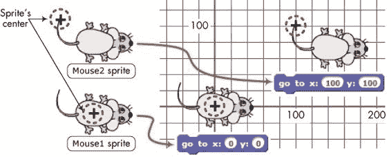图 2-3。运动命令参考精灵的中心。试试看 2-1

在执行下方脚本中的每个命令后，列出 `Rocket` 精灵的坐标。

### 相对运动

现在考虑图 2-4 中所示的网格，这里展示了另一个 `Rocket` 精灵和目标。此时你看不见坐标，所以不知道精灵的确切位置。如果你需要告诉 `Rocket` 如何击中目标，你可能会说：“移动三步，然后向右转，再移动两步。”

图 2-4。你可以使用相对运动命令在舞台上移动精灵。

像**move**和**turn**这样的命令是*相对运动*命令。例如，上面的第一个“move”命令使得`Rocket`向上移动，而第二个“move”命令则使其向右移动。运动依赖于（或相对于）精灵当前的*方向*。Scratch 中使用的方向约定在图 2-5 中说明。

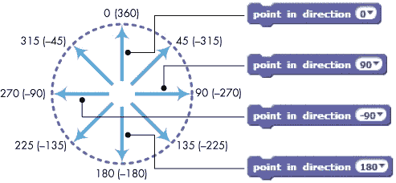图 2-5. 在 Scratch 中，0 是上，90 是右，180 是下，–90 是左。

你可以使用**point in direction**命令将精灵朝特定方向（或*朝向*）旋转。要选择上、右、下或左，只需点击下箭头，从下拉菜单中选择其中一个选项。对于其他方向，可以在白色编辑框中输入你想要的值。你甚至可以使用负值！（例如，输入 45 或–315 都会将精灵指向东北。）

### 注意

*你可以在精灵信息区域找到精灵当前的方向。你也可以点击**方向**块旁边的复选框（在*运动*调色板中）来查看舞台上的方向。*

现在你了解了 Scratch 中的方向是如何工作的，让我们看看相对运动命令（**move**、**change x by**、**change y by**和**turn**）是如何工作的。我们将从**move**和**turn**命令开始，它们相对于精灵当前的方向进行操作，如图 2-6 所示。

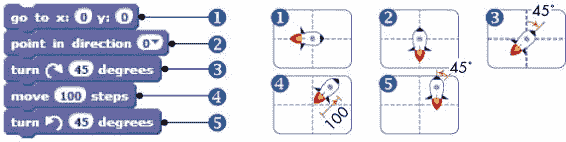图 2-6. 一个简单的脚本，演示如何使用*move*和*turn*命令

首先，**go to**块①将`Rocket`移动到舞台中心。第二个命令块②使精灵朝上，第三个③将其顺时针旋转 45°。然后，精灵按照当前方向移动 100 步④，之后再逆时针旋转 45°⑤，停在上方的位置。

方向和服装

**point in direction**命令并不关心精灵的服装。例如，考虑下面显示的两个精灵。

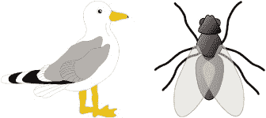

使用绘图编辑器时，我们将小鸟的服装画成面朝右，而将昆虫的服装画成面朝上。你认为如果对每个精灵使用**point in direction 90**命令（即朝右），会发生什么？

你可能会猜测昆虫会转向右边，但实际上，两个角色都不会转动。尽管 90°标记为“右”，但这个方向实际上是指在绘图编辑器中的服装的*原始方向*。因此，因为昆虫在绘图编辑器中看起来是朝上的，所以当你让它指向 90°时，它仍然会朝上。如果你希望你的角色响应 **指向方向** 命令，如 图 2-5 所示，你需要在绘图编辑器中绘制角色的服装，使其面向右（如上图中的鸟的服装所示）。

有时你可能只想从当前位置水平或垂直移动角色，这时 **change x by** 和 **change y by** 块就派上用场了。图 2-7 中的脚本演示了这些块的使用。

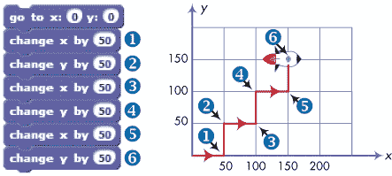图 2-7. 通过 *change x by* 和 *change y by* 导航一条曲折的路径。

在 `Rocket` 角色移动到舞台中心后，第一个 **change x by 50** 命令 ① 将 50 添加到其 *x* 坐标，使其向右移动 50 步。接下来的命令 ②，**change y by 50**，使 *y* 坐标为 50，导致角色向上移动 50 步。其他命令的工作方式也类似。尝试追踪角色的运动，见 图 2-7，找到角色的最终位置。

尝试 2-2

找出火箭执行下列两个脚本时的最终 (*x, y*) 位置。你可以使用什么数学定理来证明这两个脚本是等效的？

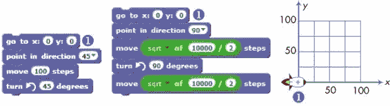

### 其他运动命令

还有四个运动命令需要探索：**朝向**；第二种类型的 **go to** 块；**如果在边缘，反弹**；以及 **设置旋转样式**。

*TennisBallChaser.sb2*

你已经了解了旋转样式，并且在 第一章 中看到了 **如果在边缘，反弹** 命令的实际效果（参见 图 1-13）。为了查看另外两个命令的实际效果，让我们创建一个简单的应用程序，让猫追逐网球，如 图 2-8 中所示。

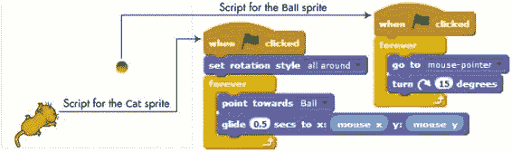图 2-8. 编程让猫追逐网球

如图所示，该应用包含两个精灵，分别名为`Cat`和`Ball`，以及两个脚本。当您点击绿色旗帜图标时，`Ball`精灵会跟随鼠标指针。`Cat`精灵不断朝向`Ball`并使用**滑行**命令向其移动。请构建这个应用并观察其工作原理。您可以在*Control*调色板中找到**forever**积木，在*Sensing*调色板中找到**mouse x**和**mouse y**积木。完整的应用文件可以在*TennisBallChaser.sb2*中找到。

在接下来的部分，我们将查看*Pen*调色板，并学习如何让精灵留下其运动的视觉轨迹。

## 画笔命令与 Easy Draw

*EasyDraw.sb2*

您在上一部分中使用的运动命令可以将精灵移动到舞台上的任何位置。现在，是时候看到精灵实际走过的路径了吧？Scratch 的画笔可以帮忙。

每个精灵都有一支隐形的*画笔*，可以设置为上或下。如果画笔在下，精灵移动时会留下轨迹。否则，精灵会移动但不留下任何痕迹。*Pen*调色板中的命令允许您控制画笔的大小、颜色和阴影。

尝试 2-3

打开 Scratch 中的提示窗口，点击房子图标，然后点击**Pen**以简要查看每个画笔命令的描述。下面的脚本演示了大多数这些命令。重新创建这些脚本，运行它们，并描述每个脚本的输出。在运行这些脚本之前，别忘了将精灵的画笔设置为下。（您可以在*Control*调色板中找到**repeat**积木。）

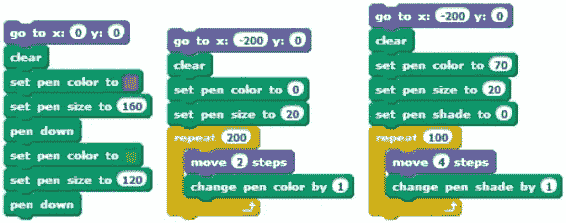

让我们详细探索一些画笔命令，并通过按箭头键在舞台上移动和旋转精灵，创建一个简单的绘图程序。按一下上箭头（↑）会让精灵向前移动 10 步。按下箭头（↓）会让精灵向后移动 10 步。每按一次右箭头（→），精灵会向右转动 10°，每按一次左箭头（←），精灵会向左转动 10°。例如，若要让精灵转动 90°，如图 2-9 所示，您需要按左箭头或右箭头九次。

首先，启动一个新的 Scratch 项目。将`Cat`的服装更换为能清晰显示精灵指向左、右、上或下的图案。`beetle`或`cat2`（来自动物文件夹）是不错的选择，但也可以选择其他任何您喜欢的服装。在*Costumes*标签页中，点击**从库中选择服装**按钮，选择合适的服装。

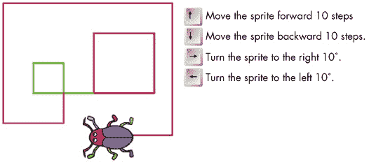图 2-9. Easy Draw 应用实例

现在，将图 2-10 中显示的脚本添加到你的角色中。你可以从*事件*调色板中的**按键按下**块创建四个**当按下空格键**的块。只需点击向下箭头，选择所需的箭头键。

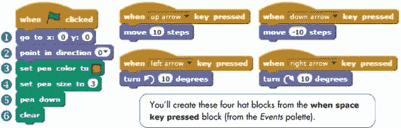图 2-10。Easy Draw 应用程序的脚本

当你点击绿色旗帜时，角色将移动到舞台的中心①并指向上方②。然后，笔的颜色③和大小④将被设置，脚本将把笔放下⑤为绘图做好准备。之后，程序将清除舞台上所有先前的绘图⑥。

要清除舞台并开始新的绘图，你只需点击绿色旗帜。使用键盘箭头键绘制任何你喜欢的形状。你认为顺序↑→↑→ ↑→...会绘制出什么形状？

尝试一下 2-4

添加一个选项，当按下字母*W*时，使绘图笔变宽；当按下字母*N*时，使绘图笔变窄。想一想其他可能改进应用程序的方式，并尝试实现它们。

## 重复的力量

到目前为止，我们的程序相对简单，但随着你开始编写更长的脚本，你会经常需要多次连续复制同一组积木。重复脚本会使你的程序变得更长、更难理解，并且更难进行实验。例如，如果你需要更改一个数字，你将不得不在每个脚本副本中进行相同的更改。*控制*调色板中的**重复**命令可以帮助你避免这个问题。

*DrawSquare.sb2*

例如，假设你想绘制图 2-11（左）所示的方形。你可以指示角色按照这些重复的指令执行：

1.  移动一定距离并逆时针旋转 90°。

1.  移动相同的距离并逆时针旋转 90°。

1.  移动相同的距离并逆时针旋转 90°。

1.  移动相同的距离并逆时针旋转 90°。

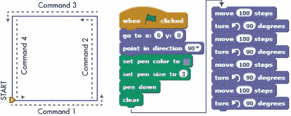图 2-11。一个方形（左）和一个用*移动*和*旋转*命令绘制它的脚本（右）

图 2-11 还展示了一个实现这些指令的脚本。注意，它重复了命令 **移动 100 步** 和 **转向 90 度** 四次。相比之下，我们可以通过 **repeat** 块来避免重复使用相同的两个块，**repeat** 块会按你指定的次数执行其中的命令，如 图 2-12 所示。使用 **repeat** 块还可以让指令变得更容易理解。

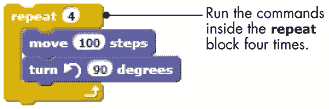图 2-12. 使用 *repeat* 块绘制正方形

你用 图 2-11 中的脚本绘制的正方形，取决于精灵开始时面对的方向。这个概念在 图 2-13 中有所说明。注意，在绘制完正方形后，精灵会回到起点并面朝它开始移动时的方向。

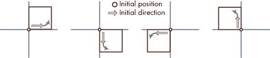图 2-13. 精灵的初始方向改变了正方形的位置。尝试 2-5

*Polygon.sb2*

你可以轻松修改 图 2-12 中的正方形绘制脚本来绘制其他规则的多边形。修改后的脚本如下所示。你可以为“边数”替换任何整数来指定所需的多边形，并为“边长”指定任何值来控制多边形的大小。图中还展示了使用此脚本绘制的六个相同边长的多边形。精灵从图中绿色箭头所示的位置和方向开始。打开 *Polygon.sb2* 文件，并使用不同的“边数”值运行它。当这个数字变得很大时会发生什么？这应该能给你一个绘制圆形的思路。

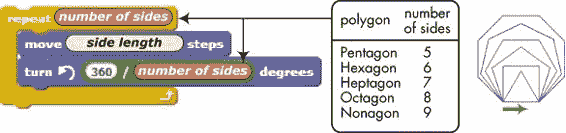

### 旋转的正方形

*RotatedSquares.sb2*

你可以通过按一定的顺序重复图案来创造惊人的艺术。例如，图 2-14 中展示的脚本通过旋转并绘制正方形 12 次，创造了一个吸引人的图案。（为了简洁，初始化笔并放下笔的块未展示。）

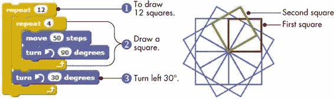图 2-14. 绘制旋转的正方形

外部**repeat**积木①执行 12 次。每次在循环中，它绘制一个正方形②，然后左转 30°③，为绘制下一个正方形做准备。

试一试 2-6

请注意，（12 次重复）×（每次重复 30°）= 360°。如果你将程序中的数字改为 4 次重复和 90°，你觉得会发生什么？如果是 5 次和 72°呢？试着改变**repeat**的重复次数和**turn**的角度，看看会发生什么。

### 使用印章探索

*Windmill.sb2*

在上一节中，你学会了使用**turn**和**repeat**积木将简单形状转化为复杂图案。但是如果你想旋转更具挑战性的形状怎么办？你可以不使用**move**和**turn**命令绘制基本形状，而是在画图编辑器中创建一个新服装，并使用**stamp**积木在舞台上绘制多个副本。为了说明这种技术，让我们编写一个程序来绘制图 2-15 所示的风车。

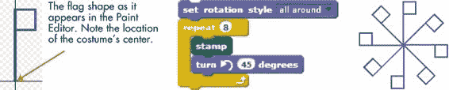图 2-15. *印章*命令让你轻松创建复杂的几何图案。

我们使用画图编辑器绘制了旗帜形状（见图 2-15，左侧），并将其作为我们角色的服装。我们将服装的中心设置在旗帜的下尖端，这样可以围绕这个点旋转旗帜。

绘制风车的脚本如图 2-15（中间）所示。**repeat**积木执行八次；每次，它会在舞台上印刷一个服装副本，然后将角色旋转 45°向左。请注意，为了使此脚本正常工作，必须使用**设置旋转样式**积木，并将角色的旋转样式设置为`all around`，以便旗帜在旋转时能够翻转。

### 注意

《DrawingGeometricShapes.pdf》*在额外资源包中（你可以从* [`nostarch.com/learnscratch/`](http://nostarch.com/learnscratch/) *下载）详细介绍了绘制几何图形，如矩形、平行四边形、菱形、梯形、风筝形和多边形，并教你如何创建吸引人的多边形艺术。*

试一试 2-7

**改变颜色效果**块（来自*外观*面板）允许你应用图形效果，如颜色、旋转和鱼眼效果。打开文件*Windmill.sb2*，并将此命令添加到**重复**块中。尝试其他图形效果，制作更多酷炫的图案。请注意，为了让**改变颜色效果**块生效，绘图编辑器中的旗帜颜色不能是黑色。

## Scratch 项目

在本节中，我们将开发两个简短的程序，进一步帮助你理解到目前为止学到的**运动**和**笔迹**块。你可以在本章的项目文件中找到背景和角色，因此我们将专注于编写使这些应用程序正常工作的脚本。一个名为“生存跳跃”的额外奖励游戏的解释可以在额外资源中找到。详细信息请参阅*BonusApplications.pdf*（*[`nostarch.com/learnscratch/`](http://nostarch.com/learnscratch/)*）。

其中一些脚本将使用你尚未见过的命令块，但如果你不完全理解其中的某些内容，也不必担心。你将在接下来的章节中学习到所有相关内容。

### 获取金币

*Money_NoCode.sb2*

我们的第一个应用是一个简单的游戏，玩家需要使用键盘箭头移动角色，尽可能多地收集金币袋。如图 2-16 所示，金币袋会在网格上的随机位置出现。如果玩家在三秒钟内没有抓到金币袋，它会移动到其他地方。

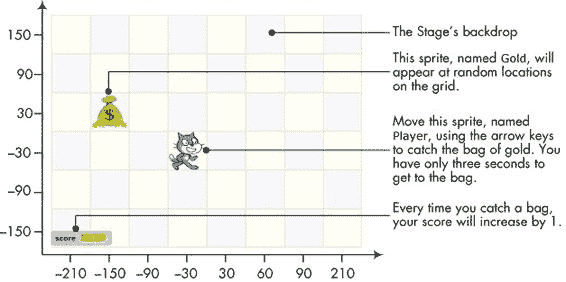图 2-16. 帮助猫抓取尽可能多的金币袋！

打开文件*Money_NoCode.sb2*。该文件缺少脚本，但你现在将创建它们，文件中包含你所需的其他一切。

### 注意

*图 2-16 中显示的坐标轴是为了帮助你理解这些脚本中使用的数字。如有需要，可以返回此图，刷新你对角色如何移动的理解。*

我们首先编写`Player`角色的脚本，如图 2-17 所示。

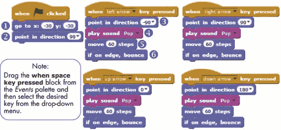图 2-17. *`Player`*角色的脚本

当玩家点击绿色旗帜时，这个精灵会移动到 (–30,–30) ① 并朝右指向 ②。其他四个脚本响应方向键。当按下一个方向键时，相应的脚本会改变精灵的方向 ③，播放一个短音效（使用 *声音* 面板中的 **播放声音** 块 ④），并移动精灵 60 步 ⑤。如果需要，精灵会从舞台边缘反弹 ⑥。由于 60 步对应于图 2-16 中网格上的 1 个方格，因此每次按下方向键时，`Player` 精灵会移动 1 个方格。

### 注释

*你是否注意到在图 2-17 中，四个处理箭头的脚本几乎是完全相同的？在第四章中，你将学习如何避免这样重复代码。*

继续测试游戏的这一部分。你应该能够通过键盘上的方向键移动 `Player` 精灵在舞台上。当你完成这部分功能后，我们将继续处理 `Gold` 精灵，其脚本见图 2-18。

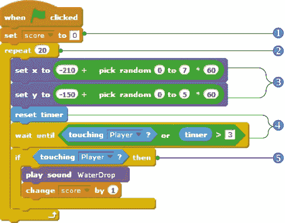图 2-18. *`Gold`* 精灵的脚本

与 `Player` 精灵的脚本类似，这个脚本也会在点击绿色旗帜时启动。它会移动金币袋。它还会通过名为 `score` 的变量来跟踪已经收集到的金币袋数量，我已经在 *数据* 面板中为你创建了这个变量。

### 注释

*像 `score` 这样的标签被称为* 变量*。它们让我们能够保存信息，以便在程序中稍后使用。你将在第五章中学习所有关于变量的知识。*

由于游戏刚开始，我们还没有收集到任何金币袋，所以我们将 `score` 设置为 0 ①。接下来，我们启动一个循环，该循环会重复 20 次 ②，向玩家展示总共 20 个金币袋。（如果你不想要 20 个金币袋，可以随意选择你喜欢的数字。）每次循环运行时，金币袋将出现在某个随机位置 ③，给玩家一些时间来抓取它 ④，如果玩家成功抓取，则增加 `score` ⑤。

我们需要让金币袋随机出现在舞台上的 48 个方格之一。正如你在图 2-16 中看到的，金币袋的 *x* 位置可以是以下任意值：–210、–150、–90、...、210。这些数字间隔为 60 步，因此你可以通过计算从 –210 开始找到每个 *x* 位置：

| *x* = –210 + (0 × 60) |
| --- |
| *x* = –210 + (1 × 60) |
| *x* = –210 + (2 × 60) |
| *x* = –210 + (3 × 60) |

依此类推。类似的表达式适用于 *y* 位置。

我们可以通过生成一个 0 到 7 之间的随机数，将其乘以 60，并将结果加上-210 来设置袋子的*x*位置。图 2-19 展示了在我们的脚本中创建**set x to**块的详细步骤；**set y to**块的构建方式也类似。

图 2-19. 从图 2-18 构建*set x to*块

在随机位置出现后，金袋子会给玩家三秒钟的时间来抓住它。（你可以更改这个时长，让游戏变得更难或更容易。）为了跟踪时间，脚本首先将 Scratch 内置的计时器重置为 0。然后它会等待，直到玩家通过触摸袋子抓住它，或者计时器超过三秒。当任一条件发生时，**wait until**块将让脚本继续执行**if/then**块。图 2-20 展示了创建**wait until**块的细节。

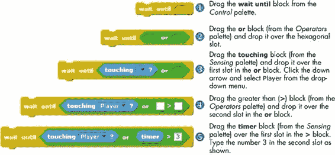图 2-20. 在图 2-18 的脚本中构建*wait until*块

### 注意

**if/then** *块中的代码只有在你在**if/then** *块的头部指定的条件为真时才会运行。第六章详细解释了这个块，但现在，你已经足够了解如何使用它来为程序增添个人特色。*

如果玩家触摸到袋子，**if/then**块中的命令将会执行。在这种情况下，**play sound**块将播放`WaterDrop`声音，而**change score by 1**块（在*数据*调色板中）将分数加 1。

游戏现在完成了。点击绿旗测试你的创作！

Scratch 的计时器

Scratch 保持一个计时器，记录自 Scratch 启动以来已经过去的时间。当你在 Web 浏览器中启动 Scratch 时，计时器将被设置为 0，并且只要你保持 Scratch 打开，它会按十分之一秒为单位递增。**timer**块（在*感应*调色板中）保存计时器的当前值。块旁边的复选框允许你在舞台上显示/隐藏该块的监视器。**reset timer**块将计时器重置为 0，并且时间会立即重新开始计数。即使项目停止运行，计时器仍会继续运行。

### 捕捉苹果

*CatchApples_NoCode.sb2*

请参考图 2-21 中的抓苹果游戏。在这个游戏中，苹果会在舞台顶部的随机水平位置、随机时间出现并掉落到地面。玩家必须移动购物车来抓住苹果，防止它们掉到地面，每个苹果值 1 分。

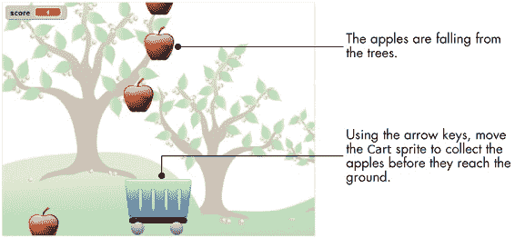图 2-21。抓苹果游戏

一开始，你可能会认为这样的游戏需要许多精灵，且每个精灵的脚本几乎一样。毕竟苹果很多。然而，自 Scratch 2 版本起，情况发生了变化。借助*克隆*功能，你可以轻松创建多个精灵的副本。在我们的抓苹果游戏中，我们只使用一个苹果精灵，并可以创建任意数量的克隆。

打开文件*CatchApples_NoCode.sb2*，该文件包含了没有脚本的游戏设置。为了让游戏更有趣，设置中还包含了一个名为`score`的变量（在*数据*调色板中为你创建），我们将用它来跟踪抓到的苹果数量。但首先，你将为`购物车`精灵创建如图 2-22 所示的脚本。

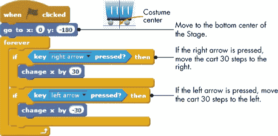图 2-22。*`购物车`*精灵的脚本

当点击绿旗时，我们将购物车移到舞台底部中央。接下来，脚本会持续检查左右箭头的状态，并相应地移动购物车。我选择了数字 30 是通过试验得出的，所以你可以根据自己的实验结果自由更改。

接下来是克隆的部分。首先将图 2-23 中的脚本添加到`苹果`精灵中。这个脚本也会在点击绿旗时开始运行。

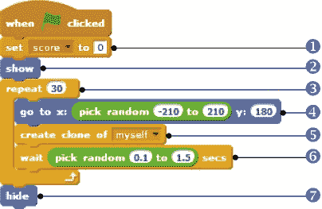图 2-23。*`苹果`*精灵的第一个脚本

由于我们还没有抓到任何苹果，脚本将`score`变量设置为 0 ①。接着，它使用*外观*调色板中的**显示**块②使精灵可见。然后，它开始一个**重复**块，该块会循环 30 次③，让 30 个苹果掉落。

在每次循环过程中，`苹果`精灵将移到舞台上方的随机水平位置④。接着，它会调用*控制*调色板中的**创建克隆**块⑤，克隆自身，等待一段短暂的随机时间⑥，并开始下一轮**重复**块。完成 30 轮**重复**块后，脚本通过*外观*调色板中的**隐藏**块⑦将`苹果`精灵隐藏。

如果你现在点击绿色旗帜运行游戏，30 个苹果会随机出现在舞台的顶部，并停留在那里——因为我们还没有告诉克隆的苹果该做什么。这时，`Apple` 精灵的下一个脚本（图 2-24）就派上用场了。

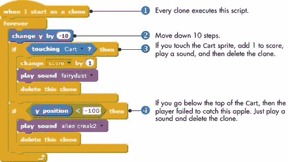图 2-24. 第二个*`Apple`*精灵的脚本

由于**当我作为克隆启动时**模块①（来自*控制*面板），每个克隆都会执行图中显示的脚本。每个`Apple`精灵向下移动 10 步②，并检查它是否被小车抓住或掉落。如果克隆检测到它碰到了小车③，这意味着它被抓住了。因此，它会增加分数，播放音效，并删除自己（因为它不再有任务）。如果克隆掉落到小车下方④，则玩家错过了；在这种情况下，克隆会播放另一种音效，然后删除自己。如果克隆既没有被抓住也没有错过，它仍在下落中，**永远**模块再次循环执行。

现在我们的苹果已经知道如何掉落了，游戏完成了！点击绿色旗帜测试一下吧。如果你想进行实验，可以尝试改变克隆不同苹果之间的等待时间以及移动小车的速度。这样做会给你一些调整游戏难度的灵感吗？

## 关于克隆精灵的更多信息

任何精灵都可以使用**创建克隆**模块复制自己或其他精灵。（舞台也可以使用相同的模块克隆精灵。）克隆的精灵会继承原始精灵在被克隆时的*状态*——即原始精灵的当前位置和方向、服装、可见状态、画笔颜色、画笔大小、图形效果等。这个概念在图 2-25 中得到了说明。

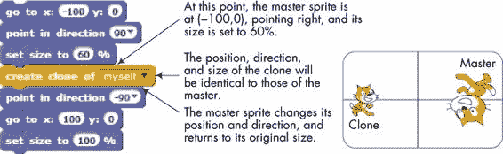图 2-25. 克隆继承了主精灵的属性。

克隆也会继承主精灵的脚本，如图 2-26 所示。这里，主精灵创建了两个克隆。当你按下空格键时，所有三个精灵（主精灵和两个克隆）都会向右转 15°，因为它们都会执行**当空格键按下时**的脚本。

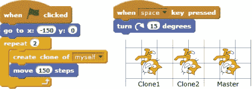图 2-26. 克隆继承了主精灵的脚本。

在使用 **创建克隆** 块时，特别需要注意，如果脚本没有以绿色旗帜触发器开始，你可能会得到比预期更多的精灵。考虑下图中显示的程序 图 2-27。第一次按下空格键时，会创建一个克隆，应用程序中会有两个精灵（主精灵和克隆精灵）。

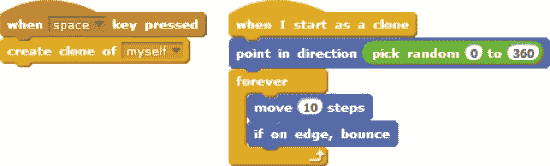图 2-27. 按键响应创建克隆

现在，如果你第二次按下空格键，你的应用程序中将有四个精灵。为什么？主精灵会响应按键并创建一个克隆，但第一个克隆也会响应并创建另一个克隆（即克隆的克隆）。第三次按下空格键时，你的应用程序中将有八个精灵。克隆的数量将呈指数增长！

你可以通过仅在以 **当绿色旗帜点击时** 块开始的脚本中克隆精灵来解决这个问题。这些脚本仅由主精灵执行。

## 总结

在本章中，你学习了如何使用绝对运动命令将精灵移动到舞台上的特定位置。然后，你使用相对运动命令参考精灵自己的位置和方向移动精灵。之后，你使用画笔命令创建了一些精美的图形。

当你绘制不同的图形时，你发现了 **重复** 块的强大功能，它让你能够创建更简短、更高效的脚本。你还学习了 **印章** 命令，并与 **重复** 块结合使用，轻松设计复杂的图案。

在本章的最后，你创建了两个游戏，并了解了 Scratch 的克隆功能。在下一章，你将使用 *外观* 和 *声音* 调色板创建更具吸引力的程序。

## 问题

| **问：** | 1\. 解释以下脚本是如何工作的。写出图形所有角落的 (*x*,*y*) 坐标。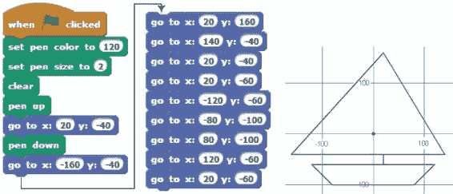 |
| --- | --- |

| **问：** | 2\. 编写一个脚本，按顺序连接下列各组点，并展示最终形状：

1.  (30,20), (80,20), (80,30), (90,30), (90,80), (80,80), (80,90), (30,90), (30,80), (20,80), (20,30), (30,30), (30,20)

1.  (–10,10), (–30,10), (–30,70), (–70,70), (–70,30), (–60,30), (–60,60), (–40,60), (–40,10), (–90,10), (–90,90), (–10,90), (–10,10)

|

| **问：** | 3\. 编写一个脚本，绘制下列图案。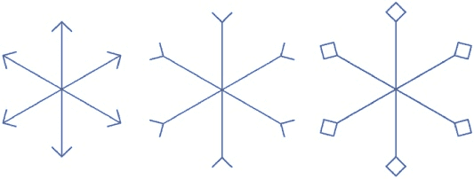 |
| --- | --- |
| **问：** | 4\. 请考虑以下脚本及其输出。重新创建该脚本，添加必要的画笔设置命令，运行并解释其工作原理。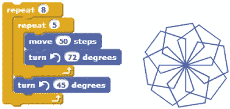 |
| **问：** | 5\. 请考虑以下脚本及其输出。重新创建该脚本，添加必要的笔设置命令，运行并解释它是如何工作的。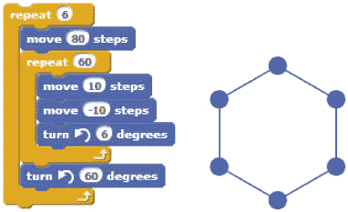 |
| **问：** | 6\. 请考虑以下脚本及其输出。重新创建该脚本，添加必要的笔命令，运行并解释它是如何工作的。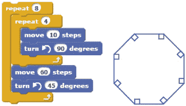 |
| **问：** | 7\. 创建如下所示的脚本，添加必要的笔命令并运行它。解释这个脚本是如何工作的。 |
| **问：** | 8\. 编写一个程序，生成如下所示的输出。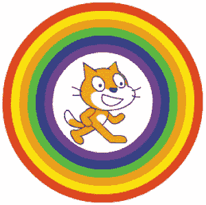 |
| **问：** | 9\. 在这个问题中，你将编写完成如下“气球爆破”游戏所需的脚本。*BalloonBlast_NoCode.sb2*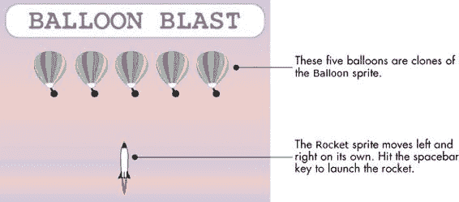这个游戏包含两个精灵，分别名为`Balloon`和`Rocket`。当你点击绿色旗帜时，`Balloon`精灵会在上面的界面中创建五个克隆。`Rocket`精灵会自动左右移动，碰到舞台边缘时会反弹。你需要在合适的时机按下空格键发射火箭并爆破气球。打开文件*BalloonBlast_NoCode.sb2*。该文件包含在游戏开始时创建五个克隆的代码。你的任务是通过添加以下两个脚本来完成游戏。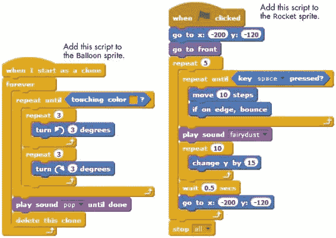 |
