## 第三章 外观与声音

在上一章，你学会了如何使用运动命令让精灵在舞台上移动，以及如何使用画笔命令绘制图案。在本章，你将学习*外观*和*声音*面板中的各种命令。在这个过程中，你将完成以下内容：

+   创建动画和图像效果

+   学习 Scratch 中的图层如何工作

+   播放音频文件并编排音乐

+   自己制作完整的动画场景

*外观*面板中的命令将帮助你创建动画，并为造型和背景应用图形效果，如旋转、鱼眼、鬼影等。*声音*面板中的命令在你需要为应用添加声音、配音或音乐时非常有用。让我们从一些动画开始吧！

## 外观面板

你可以使用画笔命令直接在舞台上绘制图像，但造型提供了另一种强大且有时更简单的方法，来为程序添加图形。*外观*面板中的命令将帮助你操控造型来创建动画、添加思维气泡、应用图形效果，并改变精灵的可见性。我们将在本节中探讨这些命令块。

### 改变造型以实现动画效果

*Animation.sb2*

你知道如何让精灵从舞台上的一个点移动到另一个点，但静态的精灵跳动时并不像活生生的样子。如果你使用不同的造型并快速切换它们，你可以让精灵看起来像是真的在移动！打开文件*Animation.sb2*，在图 3-1 中试试这个动画效果。

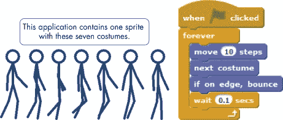图 3-1. 你可以通过在不同造型之间切换，创造动画的错觉。

这个应用包含一个精灵和七个造型，还有一个脚本。你可以在*造型*标签中看到七个造型，在*脚本*标签中看到精灵的脚本。当你点击绿色旗帜运行应用时，纸人会看起来在舞台上行走。它运动的关键是**下一个造型**命令，它告诉精灵切换到列表中的下一个造型。如果精灵穿着列表中的最后一个造型，它会回到第一个造型。

当点击绿色旗帜时，脚本会启动一个**永久**循环，并在末尾添加一个**等待**块，用来在每次更换造型后创建 0.1 秒的延迟。如果你从脚本中移除这个延迟，纸人看起来就会跑步而不是走路。尝试调整**移动**和**等待**块的不同数值，看看它们如何影响动画效果。

尽管你可以使用画笔命令绘制这个走路的小人，但你需要编写一个长脚本。另一方面，一旦绘制了这些服装，编程动画就变得轻松了。记住，你可以使用你喜欢的绘画程序，或使用 Scratch 的画图编辑器创建图像。

*ClickOnFace.sb2*

如果你希望用户与精灵互动，可以在鼠标点击时更改其服装，如“点击面孔”应用所示。此应用包含一个名为 `Face` 的精灵，具有图 3-2 中显示的五种服装。它使用 **when this sprite clicked** 块（来自 *事件* 调色板）来告诉精灵何时切换服装。

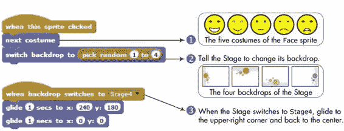图 3-2. 每当精灵被点击时，笑脸和背景都会发生变化。

当你运行此应用时，每次点击面部图像时，图像会变为列表中的下一个。该脚本还使用 **switch backdrop to** 块来命令舞台随机切换到其中一个四种背景图像。当舞台切换到 `Stage4` 图像时，`Face` 精灵检测到此事件（使用 **when backdrop switches to** 触发块，来自 *事件* 调色板）。在这种情况下，面部图像会移动到舞台的右上角，然后返回中心。

试试看 3-1

*TrafficLight.sb2*

文件 *TrafficLight.sb2* 包含一个精灵，具有三种服装（分别命名为 `red`、`orange` 和 `green`）以及一个不完整的脚本，如下所示。通过添加必要的 **wait** 块来完成该应用，从而创建一个逼真的交通灯动画。

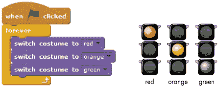

### 注意

*你可以使用* **switch backdrop to** *命令来更改故事中的场景、游戏中的关卡等。你项目中的任何精灵都可以使用* **when backdrop switches to** *块来检测舞台何时切换到某个背景，并相应地做出反应。有关更多详细信息，请参见 Scratch 界面中的提示窗口。*

### 说话和思考的精灵

你可以使用 **say** 和 **think** 命令，让你的精灵像漫画中的角色一样说话或思考，如图 3-3（左侧）所示。

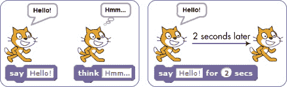图 3-3. 使用 *say* 或 *think* 命令在对话框或思考框中显示消息。

你在这些命令中输入的任何短语都会出现在精灵上方，且消息会永久显示。如果你想清除消息，使用没有文本的 **说** 或 **思考** 块。你也可以使用 **说（秒）**（或 **思考（秒）**）命令来在固定时间内显示消息，如 图 3-3（右图）所示。

尝试 3-2

*Argue.sb2*

要查看**说话**和**思考**命令的效果，打开文件 *Argue.sb2* 并运行它。这个应用模拟了两个角色之间的无休止争论，如下所示。研究脚本，了解它们如何使用精确的时机来同步两个角色的动作。

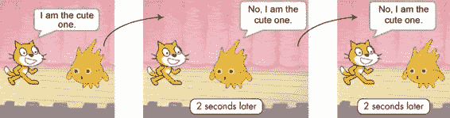

### 图像效果

*GraphicEffects.sb2*

**设置效果为** 命令允许你对服装和背景应用不同的图形效果。Scratch 给这些效果命名，如鱼眼、旋涡、马赛克等。图 3-4 精确展示了它们的效果。

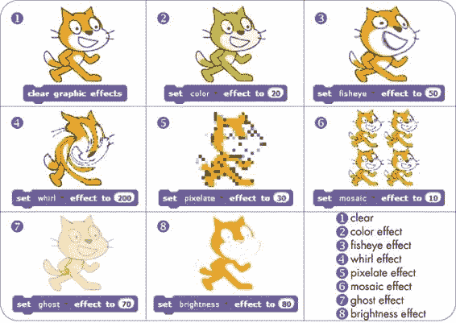图 3-4。此图展示了当你应用 Scratch 的图形效果时猫咪会发生什么。

点击 **设置效果为** 块中的下箭头，从下拉菜单中选择你想要的效果。你也可以使用 **通过改变效果** 命令来调整效果，而不是直接设置它。例如，如果当前的幽灵效果设置为 40，通过改变 60 会将幽灵效果设置为 100，导致精灵消失（像幽灵一样）。当你想让图像恢复到原始状态时，使用 **清除图形效果** 块。

### 注意

*你可以通过按顺序使用多个图形效果命令，同时对精灵应用多个效果。*

### 大小和可见性

*SneezingCat.sb2*

有时你可能需要改变精灵的大小或控制它在程序中何时出现。例如，你可能希望场景中的近物看起来更大，或者你可能只希望在游戏开始时显示一个“指令”精灵。

如果你需要缩小或放大精灵，**设置大小为 %** 和 **改变大小为** 命令可以帮忙。第一个命令将精灵的大小设置为原始大小的百分比，第二个命令相对于当前大小修改精灵的大小。当你需要让精灵出现或消失时，分别使用 **显示** 块或 **隐藏** 块。

要查看这些命令的实际效果，请打开 *SneezingCat.sb2*。在这个应用中，我们将通过改变猫的大小，让它像卡通人物一样打喷嚏，如 图 3-5 所示。

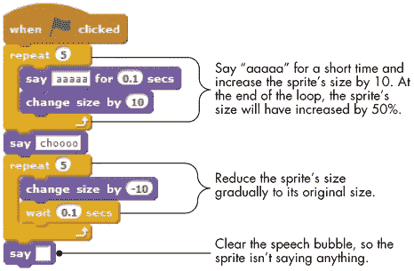图 3-5. 这个脚本让 *`Cat`* 精灵打喷嚏。

当精灵准备打喷嚏时，大小会增大，喷嚏打完后，它会慢慢恢复到原来的大小。运行程序并观察发生了什么，体验这些命令的效果。

试试 3-3

在 图 3-5 中，将一个积木添加到脚本的末尾，使 `Cat` 精灵在打完喷嚏后消失。再添加一个积木，在脚本开始时显示这个精灵。

### 层

*Looks* 调色板中的最后两个命令影响精灵在舞台上绘制的顺序。这个顺序决定了当精灵重叠时哪些精灵是可见的。例如，假设你想创建一个女孩站在大岩石后面的场景。有两种层叠的可能性，如 图 3-6（左图）所示。

图 3-6. 前层的精灵完全可见，并且可以覆盖部分重叠的精灵。

如果你想让女孩站在岩石后面，你必须把岩石移到前面的绘图层，或者把女孩发送到后面的绘图层。Scratch 提供了两个命令，可以让你重新排列绘图层，**go to front** 和 **go back layers**（如图所示）。第一个命令让 Scratch 始终将一个精灵绘制在最上面，而第二个命令则将精灵按你指定的层数向后移动。

试试 3-4

*Layers.sb2*

*Layers.sb2* 应用中有四个在舞台上移动的物体。你可以通过按下物体颜色的首字母将其移动到最上面。运行应用程序，查看 **go to front** 命令的效果。

我们已经介绍了使用 *Looks* 调色板进行动画，但还有另一种可以让我们的应用程序更加生动的方式。在下一节中，我们将探索 *Sound* 调色板及其丰富的命令集。

## 声音调色板

游戏和其他应用通过音效和背景音乐来增加兴奋感。在本节中，你将学习如何使用 Scratch 的与声音相关的积木，首先是如何加入音频文件并控制它们的播放。接着，你将学习演奏鼓和其他乐器的命令积木。之后，你会学习如何控制音量并改变音乐音符和鼓点的播放速度（或节奏）。

### 播放音频文件

你可以将音频文件以多种格式保存在计算机上，但 Scratch 只识别两种格式：WAV 和 MP3。有三个命令积木可以让你在应用中使用这些音频文件：**播放声音**、**播放声音直到完成**和**停止所有声音**。前两个积木都用于播放指定的声音。**播放声音**命令允许下一个命令在声音未播放完时就开始，而**播放声音直到完成**命令则会等待声音播放结束后才会继续执行下一个命令。**停止所有声音**命令会立即关闭正在播放的所有声音。

你可以通过反复播放音频文件来为你的应用添加背景音乐。最简单的方式是使用**播放声音直到完成**，让文件完全播放完毕，然后重新开始，如图 3-7（左）所示。

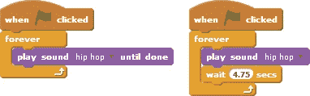图 3-7. 创建背景音乐的两种方式：播放完后重复声音（左）或在播放一定时间后重新开始声音（右）。

根据音频文件的不同，这种方法可能会在连续重启之间产生一个非常短暂但有时会注意到的暂停。你也可以使用**播放声音**命令配合**等待**命令，这样可以更好地控制播放时长，如图 3-7（右）所示。通过调整等待时间，你或许能缩短暂停时间，从而使当前播放结束和下一次播放开始之间的过渡更加平滑。

### 演奏鼓声和其他声音

*BeatsDemo.sb2*

如果你在开发游戏，可能希望在玩家击中目标、完成关卡等时播放一个短暂的音效。你可以使用**play drum for beats**命令轻松创建这些音效，它可以根据你选择的 18 种鼓声之一播放指定数量的拍子。你还可以使用**rest for beats**命令添加暂停。图 Figure 3-8 中的*BeatsDemo.sb2*应用演示了 beats 参数的效果。

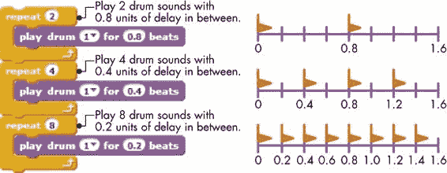图 3-8. Scratch 中的 beats 示意图

该脚本包含三个**repeat**块，重复次数分别为二、四和八。每个**repeat**块使用不同数量的拍子演奏相同的鼓声。如果把时间轴看作被划分为 0.2 单位的时间间隔，第一个循环将播放两个鼓声，它们之间相隔 0.8 单位的时间。第二个循环将播放四个鼓声，它们之间相隔 0.4 单位的时间，而第三个循环则播放八个鼓声，它们之间相隔 0.2 单位的时间。每个循环完成的时间是相同的；我们只是在同样的时间间隔内敲打鼓的次数不同。

我说“时间单位”而不是秒，因为完成每个循环的实际时间取决于*tempo*，这个值可以通过**set tempo to**命令来设置。使用默认的 60 拍每分钟（bpm）速度，上述示例中的每个循环将花费 1.6 秒完成。如果将速度设置为 120 bpm，每个循环将花费 0.8 秒完成；如果设置为 30 bpm，则每个循环花费 3.2 秒，以此类推。

### 作曲

*FrereJacques.sb2*

Scratch 还包含两个命令，可以让你演奏音符并创作自己的音乐。**play note for beats**命令会播放你选择的音符，范围从 0 到 127，并持续你指定的拍子数。**set instrument to**块告诉 Scratch 音符应该像什么样的乐器。我们可以使用这些命令创作一首完整的歌曲。图 Figure 3-9 中的脚本演奏了法国儿童歌曲“Frère Jacques”。

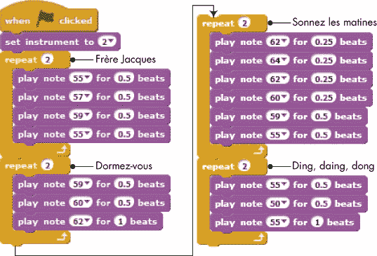图 3-9. 演奏“Frère Jacques”的脚本

打开这个名为*FrereJacques.sb2*的应用程序，并尝试不同的**set instrument to**命令值，以更改演奏这首歌曲的乐器。

### 控制音量

假设你希望在应用程序中的某些事件发生时让声音逐渐减弱。例如，如果你正在发射一枚火箭进入太空，你可能希望火箭起飞时声音很响，然后随着它越来越远，声音变得越来越小。

Scratch 包含了一组命令来控制音频文件、鼓声和音符的音量或响度。**设置音量为%**命令将精灵的响度设置为扬声器音量的百分比。然而，它只影响使用它的精灵（或舞台），所以如果你想让不同音量的声音同时播放，你需要使用多个精灵。**更改音量为**块会根据你输入的数字增加或减少音量。负数会让声音更轻，正数则会让声音更响。你甚至可以通过勾选**音量**块旁边的框来显示精灵的音量。这些块非常方便，如果你想根据精灵与目标的距离来改变音量（例如在寻宝游戏中），或者让歌曲的某些部分比其他部分更响亮。你还可以使用这些块通过同时播放不同音量的不同乐器来模拟一个交响乐团。

试一试 3-5

*VolumeDemo.sb2*

文件*VolumeDemo.sb2*模拟了一只猫走进森林的情景。这个应用程序使用**更改音量为**命令来让猫的声音在它走得更深进入树林时逐渐变小。想出一些方法让这个模拟更加真实，并尝试实现它们。

### 设置节奏

*声音*面板中的最后三个块与节奏或鼓和音符的演奏速度相关。节奏以每分钟拍数（bpm）来衡量。节奏越高，音符和鼓声的播放速度越快。

Scratch 允许你使用**设置节奏为 bpm**命令选择特定的节奏。你也可以使用**更改节奏为**命令来让精灵以某个特定的速率加速或减速。如果你想在舞台上看到精灵的节奏，可以勾选**节奏**块旁边的框。

试一试 3-6

*TempoDemo.sb2*

打开文件*TempoDemo.sb2*并运行它，观察**设置节奏为 bpm**和**更改节奏为**命令的效果。

## Scratch 项目

*外观*和*声音*面板中的命令将帮助你为应用程序添加许多有趣的效果。在这一部分，我们将把本章到目前为止学到的所有内容结合起来，创建一个包含跳舞人物和烟花的动画场景。这将帮助你复习一些新的命令块，并让你有更多的机会练习创建一个完整的 Scratch 项目。

### 舞台上的舞蹈

*DanceOnStage.sb2*

在这一部分，你将为舞台上的`舞者`精灵制作动画。这个应用程序在图 3-10 中进行了说明，完整的脚本保存在*DanceOnStage.sb2*中。我们将在这里一起构建整个场景——跟着一起做，看看它是如何工作的！

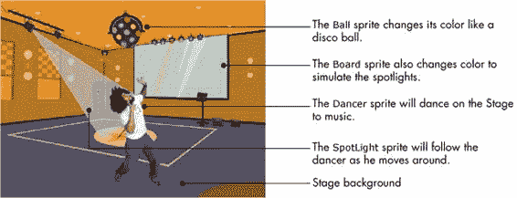图 3-10。舞会应用程序演示。

首先，启动一个新项目。如果 Scratch 尚未运行，只需启动它——这会自动为你创建一个新项目。否则，从**文件**菜单中选择**新建**。无论哪种情况，你都会有一个包含默认`Cat`精灵的新项目。

你将在此应用程序中使用的背景是来自*室内*类别的`party room`。导入这个背景并删除默认的白色背景，因为你不需要它。现在舞台应该看起来像图 3-11。

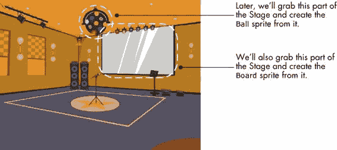图 3-11。我们稍后会将派对房间背景的一些部分转换成精灵。

仔细查看图 3-10 和图 3-11，注意`Ball`和`Board`精灵看起来像是背景的一部分。正如你接下来会看到的，这两个精灵实际上是从那张图像中创建出来的，并被放置在舞台上以覆盖它们所来自的区域。通过这种方式创建这两个精灵，让我们可以改变它们的颜色，使舞台看起来更真实。

现在我们需要一些背景音乐。让我们使用*Music Loops*类别中的*medieval1*文件。将该文件导入舞台，然后删除默认的“pop”音效。接着，将图 3-12 中的脚本添加到舞台。它使用**播放声音**命令并加上一个等待时间，使音频文件可以平滑地重新启动。9.5 秒的等待时间是通过实验得出的。

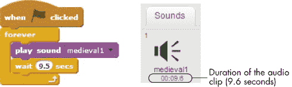图 3-12。舞台播放我们的背景音乐。

点击绿色旗帜测试你目前创建的内容。你应该听到一个音频片段不断重复播放。准备好后停止脚本，我们将添加我们的舞者。

将`Cat`精灵的服装替换为`Dancer`的服装。从*People*类别中导入`dan-a`和`dan-b`服装，删除两个`Cat`服装，并将`Cat`精灵的名称改为`Dancer`。`Dancer`的脚本如图 3-13 所示。

图 3-13。这个脚本告诉*`Dancer`*精灵如何跳舞。

`Dancer`精灵向右移动 20 步，改变服装，向左移动 20 步，再次改变服装。这些步骤将永远重复，模拟他在跳舞。该脚本还会在每一步改变一些鱼眼效果，增加一些变化。点击绿色旗帜测试程序的新功能。你应该能听到背景音乐，并看到`Dancer`精灵在舞台上左右移动。

现在你已经为派对准备好了一个舞者，接下来让我们通过`Ball`、`Board`和`SpotLight`精灵加入一些彩色灯光。为了创建`Ball`精灵，点击舞台缩略图选择它，然后选择**背景**标签。右键点击`party room`背景的缩略图，并从弹出菜单中选择**保存到本地文件**。这会弹出一个对话框，允许你将背景图像保存到本地。记住你保存图像的位置，因为稍后你需要导入它。

点击**从文件上传精灵**按钮（位于精灵列表上方），然后选择你刚刚保存的图像。这会创建一个新精灵，服装与背景图像相同。将该精灵命名为`Ball`，并在绘图编辑器中编辑其服装，去除除图 3-14（左侧）所描绘的五彩球以外的所有内容。确保将球周围的空间涂上透明颜色。接下来，将`Ball`精灵放置在舞台上，准确地覆盖背景中你取图的地方，这样它看起来就像是图像的一部分（参见图 3-11）。

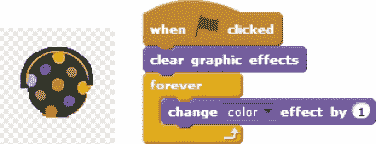图 3-14。*`Ball`*精灵在绘图编辑器中的服装及其脚本

图 3-14 还展示了你应该为`Ball`精灵添加的脚本。该脚本持续改变精灵的颜色效果，给人一种小圆圈不断变色的错觉。

创建`Board`精灵的方式与创建`Ball`精灵相同。图 3-15 展示了该精灵在绘图编辑器中的样子（左侧）以及你需要的动画脚本（右侧）。我为服装添加了一些颜色（与图 3-11）进行对比），以使**改变颜色效果**命令生效。

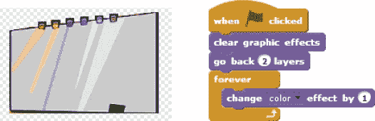图 3-15。*`Board`* 精灵及其脚本

因为`Board`精灵与`Dancer`精灵重叠，脚本将`Board`精灵移至后两层，使得`Dancer`始终位于前方。你也可以通过选择`Dancer`精灵并点击*外观*面板中的**移至前面**积木来实现同样的效果。

本应用中的最后一个精灵是`SpotLight`精灵。图 3-16 展示了该精灵在绘图编辑器中的外观，以及你需要创建的脚本。图像的中心位于锥形的尖端，代表一束光。

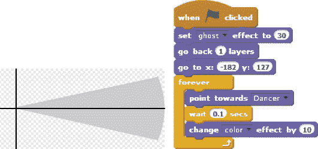图 3-16。*`SpotLight`* 精灵及其脚本

脚本首先将精灵的鬼影效果设置为 30，使其透明，以免遮挡背景。接着，脚本将该精灵移后一层，使光束位于舞者后面。然后，精灵的位置调整，使光束看起来是从聚光灯发出的（见图 3-10）。你需要根据你的图形选择* x *和* y *坐标。之后，脚本命令光束跟随舞者（使用**指向**命令）并永久改变其颜色。

完成聚光灯添加后，应用程序应该完成了。点击绿旗观看你的舞会效果！除了音乐和舞蹈外，你还应该看到`Ball`、`Board`和`SpotLight`精灵随着灯光变化，仿佛真实的迪斯科灯光正在作用。

在下一节中，我们将讨论一个不同的应用，突出展示我们在本章中学习的许多图形效果。

### 烟花

*Fireworks_NoCode.sb2*

另一个与本章讨论的图形积木和其他概念自然契合的应用是一个动画烟花场景。在这一节中，你将制作一个简单的烟花动画，带着五光十色的火花充满天空。烟花火箭将随机爆炸，产生如同受重力作用般的掉落火花，并随着时间慢慢消失，如图 3-17 所示。

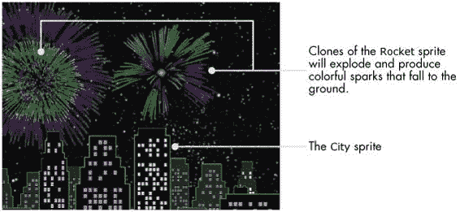图 3-17。烟花动画效果

首先打开文件*Fireworks_NoCode.sb2*，该文件包含了没有任何脚本的应用程序初始设置。如图 3-17 所示，应用程序包含两个精灵：`City` 精灵和 `Rocket` 精灵。`City` 精灵展示了一幅高楼大厦的图像，您可以根据自己的喜好进行动画处理。`Rocket` 精灵将不断创建克隆，在黑暗的天空中爆炸，产生烟花效果。

`Rocket` 精灵有八个服装，如图 3-18 所示。第一个服装，`C1`，只是一个小点，我们将把它发射到空中。当这个小点到达它的目标位置（随机选择）时，它将切换到其他服装之一（也是随机选择）以模拟最初的爆炸。然后我们将使用适当的图形效果让这个爆炸看起来更真实。

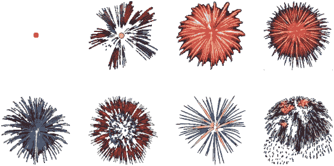图 3-18. *`Rocket`* 精灵的八个服装。

牢记这个计划后，将图 3-19 中显示的脚本添加到 `Rocket` 精灵中。此脚本会在用户点击绿旗时运行。在隐藏 `Rocket` 精灵后，它开始一个**永远**循环，在随机时间创建自己的克隆。由于克隆继承了 `Rocket` 精灵的可见性状态，所有创建的克隆一开始都会是隐藏的。

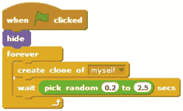图 3-19. *`Rocket`* 精灵的第一个脚本

现在我们需要告诉克隆的火箭该做什么。这个脚本见于图 3-20。

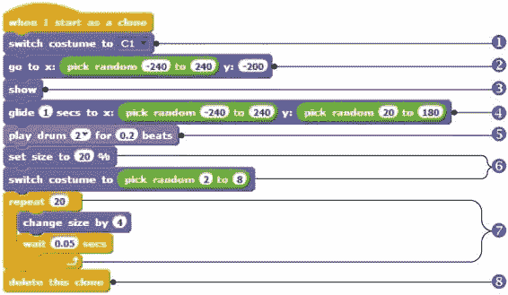图 3-20. 克隆精灵的启动脚本

克隆的火箭首先穿上它的第一个服装①（小红点）。然后，它移动到舞台底部的一个随机水平位置②，展示自己③，并滑动到舞台上方的一个随机位置④（某个建筑物上方的位置）。这部分脚本模拟了火箭的发射，运行后，你将看到一个红点从地面飞向天空。当这个点到达天空中的最终位置时，它会因为脚本第二部分的指令而爆炸。首先，克隆会播放一个短促的鼓声⑤（模拟爆炸声）。烟花爆炸开始时较小，然后扩展，所以克隆将其初始大小设置为 20%，并随机选择另一个服装⑥。接着，它开始一个**重复**循环⑦来增长烟花的大小。每次通过循环时，克隆的大小增加 4。循环结束时，克隆会自我删除⑧。

这就是本次烟花节的全部内容！现在你应该能够运行动画并展示你创建的场景了。通过仅仅几个脚本，我们就制作了一个相对复杂的动画。

## 总结

在本章中，我们介绍了许多新的编程积木，可以用来为我们的应用程序增添一些亮点。有了这些积木，我们可以添加颜色、动画、图形效果、音乐等等。

我们解释了*外观*调色板中的积木，并举了几个如何使用它们的例子。你通过切换服装为角色制作了动画，了解了绘图层，并看到了层级如何影响重叠角色的外观。

接下来，我们介绍了*声音*调色板中的指令，并解释了如何播放音频文件、鼓声和音符。你通过使用*外观*和*声音*调色板中的指令，创建了一个完整的舞蹈场景，并通过制作烟花动画应用程序来完美收尾。

在下一章中，你将学习如何使用消息广播和接收来协调不同角色之间的工作。你还将学习如何将一个大型程序拆分成更小、更易管理的部分，这些部分称为过程。这个概念是编写更复杂应用程序的关键。

## 问题

| **问：** | 1. 打开应用程序*Zebra.sb2*，如下所示。该应用程序包含一个角色（`Zebra`），它有三套服装。编写一个脚本，使`Zebra`在舞台上移动，并切换服装，创造奔跑的错觉。*Zebra.sb2*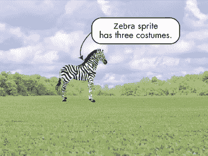 |
| --- | --- |
| **问：** | 2. 打开应用程序*Wolf.sb2*，如下所示。当你点击绿色旗帜时，`Wolf`会播放`WolfHowl`声音，持续约 4 秒钟。创建一个脚本，使`Wolf`的服装与声音同步变化。（提示：在每次切换服装后插入一个适当时间延迟的**等待**积木。）*Wolf.sb2*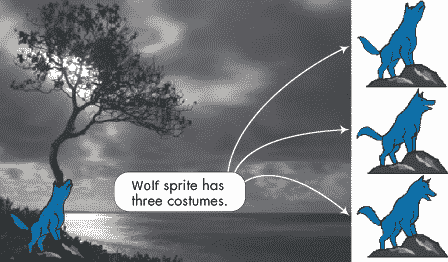 |
| **问:** | 3\. 打开应用程序*ChangingHat.sb2*，如下所示。这个应用中的帽子是一个精灵，具有五个服装。创建一个脚本，使得点击帽子时切换其服装。然后创建一个游戏，玩家通过点击不同的衣物来为角色穿衣。*ChangingHat.sb2*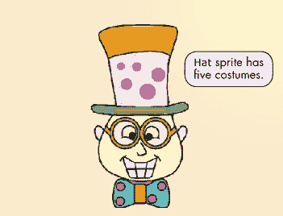 |

| **问:** | 4\. 打开*Aquarium.sb2*。该应用包含六个精灵，如下图所示。尝试不同的图形效果来动画化水族馆。以下是一些建议：*Aquarium.sb2*

1.  在舞台上使用旋转效果。从较大的数字开始，比如 1,000，使角色呈现波浪状外观。

1.  以合适的速率改变`Bubble1`和`Bubble2`精灵的服装。

1.  在舞台上移动`Fish`并改变其服装。

1.  对`Tree`精灵应用幽灵效果。

1.  对`Coral`和`Bubble3`精灵使用颜色效果。

    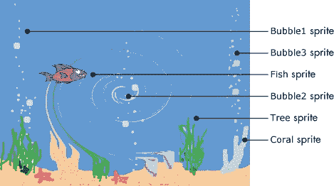

|

| **问:** | 5\. 打开应用程序*Words.sb2*（见下一页）并使用大小和旋转来动画化文字。创建图中显示的两个脚本并运行应用查看效果。*Words.sb2*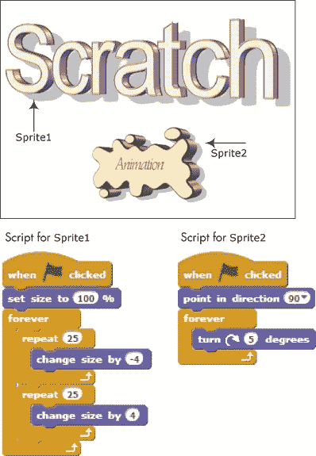 |
| --- | --- |
| **问:** | 6\. 打开应用程序*Joke.sb2*，如下所示。完成`Boy`和`Girl`精灵的脚本，讲述任何你想要的笑话。*Joke.sb2*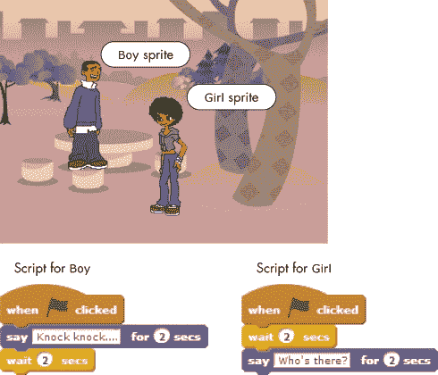 |

| **问:** | 7\. 打开*Nature.sb2*。该应用包含三个精灵，如下所示。使用运动和声音来动画化这个场景。以下是一些建议：*Nature.sb2*

1.  `Bird`精灵有两个服装，能够呈现飞行效果。创建一个脚本，让`Bird`在舞台上飞行，并在随机时间播放`Bird`的声音。

1.  `Duck`精灵有 12 个服装，展示了`Duck`从水中抓鱼并吃掉的场景。创建一个脚本，让`Duck`在舞台上移动，并在随机时间播放`Duck`的声音。

1.  `Seal`精灵有四个服装，展示了`Seal`和球一起玩的场景。创建一个脚本，让`Seal`四处玩耍，并在随机时间发出`SeaLion`的声音。

    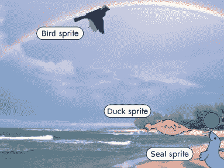

|
