## 第四章 程序

本章将解释如何通过“分而治之”的方法进行编程。与其将程序作为一个大块来构建，不如编写单独的过程（函数），然后将它们组合在一起。使用过程将使得编写程序更简单，测试和调试也更容易。在本章中，你将学习如何：

+   使用消息广播来协调多个精灵的行为

+   使用消息广播来实现过程

+   使用 Scratch 2 的“自定义模块”功能

+   使用结构化编程技术

到目前为止，我们开发的大多数应用程序只包含一个精灵，但大多数应用程序需要多个精灵协同工作。例如，一个动画故事可能有几个角色以及不同的背景。我们需要一种方法来同步精灵分配的任务。

在本章中，我们将使用 Scratch 的消息广播机制来协调多个精灵之间的工作（这是在 Scratch 的前一个版本中实现过程的唯一方式）。接着我们将讨论如何使用 Scratch 2 的“自定义模块”功能，将大型程序结构化为较小、更易管理的部分，这些部分被称为*过程*。过程是一系列执行特定功能的命令。例如，我们可以创建过程来让精灵绘制图形、进行复杂的计算、处理用户输入、排列音乐音符、管理游戏等。创建完成后，这些过程可以作为构建各种有用应用程序的积木。

## 消息广播与接收

那么，Scratch 中的广播系统如何在实践中工作呢？任何精灵都可以使用**广播**或**广播并等待**模块（来自*事件*面板）（见图 4-1）广播一条消息（你可以将这条消息命名为任何你喜欢的内容）。此广播会触发所有精灵（包括广播的精灵本身）中以匹配的**当我收到**触发模块开始的所有脚本。所有精灵都会听到广播，但只有在它们有对应的**当我收到**模块时才会响应。

图 4-1. 你可以使用消息广播和接收模块来协调多个精灵的工作。

参考图 4-2。图中显示了四个角色：海星、猫、青蛙和蝙蝠。海星广播了 `jump` 消息，这个广播会发送到所有角色，包括它自己。响应这个消息时，猫和青蛙都会执行它们的 `jump` 脚本。注意每个角色以不同的方式跳跃，执行不同的脚本。蝙蝠也接收到了 `jump` 消息，但由于没有指示它该如何处理该消息，它没有作出反应。图中的猫知道如何 `walk` 和 `jump`，青蛙只能 `jump`，而蝙蝠只被教会了 `fly`。

**广播并等待**命令与**广播**命令类似，但它会等到所有消息接收者执行完它们对应的**当我接收到**块后才会继续执行。

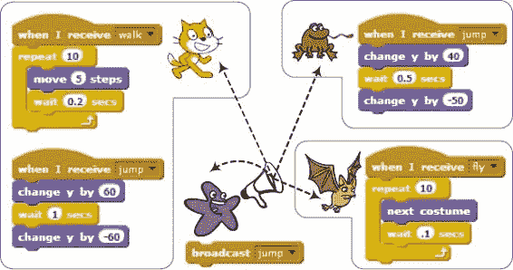图 4-2. 广播消息被所有角色接收，包括发送广播的角色。

### 发送和接收广播

*SquareApp.sb2*

为了演示消息广播和接收是如何工作的，让我们创建一个简单的应用程序，绘制随机颜色的方块。当用户点击舞台上的左键时，舞台会检测到这个事件（使用其**当此角色被点击**块），并广播一个消息，你可以将其命名为 `Square`（如果你想，也可以选择其他名称）。当应用程序中的唯一角色接收到这个消息时，它会移动到当前的鼠标位置并绘制一个方块。按照以下步骤创建该应用程序：

1.  启动 Scratch，然后从文件菜单中选择 **新建** 来创建一个新的应用程序。你可以随意更改猫的服装，选择你喜欢的任何样式。

1.  向角色的脚本区添加**当我接收到**块（来自*事件*面板）。点击该块中的下拉箭头，并从下拉菜单中选择**新消息...**。在弹出的对话框中，输入 `Square` 并点击 **确定**。该块的名称应更改为**当我接收到 Square**。

1.  完成图 4-3 所示的脚本。角色首先抬起笔，移动到当前的鼠标位置，这由**鼠标 x**和**鼠标 y**块（来自*感知*面板）指示。接着它会随机选择一个笔的颜色，放下笔并绘制一个方块。

现在，当接收到 `Square` 消息时，角色准备好处理该消息。 图 4-3 中的脚本可以称为*消息处理器*，因为它的工作是处理（或处理）一个广播消息。

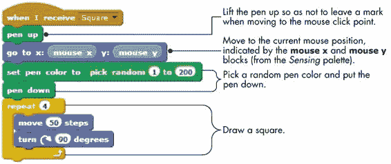图 4-3. *`Square`* 消息处理器

现在，让我们进入舞台并添加代码，以便在鼠标点击时广播`Square`消息。点击精灵列表中的舞台，并添加图 4-4 中显示的两个脚本。第一个脚本在点击绿色旗帜时清除舞台上的任何笔迹。第二个脚本在用户点击舞台上的鼠标时触发，使用**广播**模块通知精灵是时候绘制了。

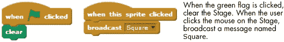图 4-4。方形绘图应用中舞台的两个脚本

该应用程序现在已完成。要测试它，只需点击舞台上的鼠标。每次点击鼠标时，应用程序应通过绘制一个方形来响应。

### 向多个精灵广播消息进行协调

*Flowers.sb2*

为了看到多个精灵响应相同的广播消息，我们将创建一个应用程序，在鼠标点击时在舞台上绘制几个花卉。花卉应用包含五个精灵（命名为`Flower1`到`Flower5`），它们负责在舞台上绘制五朵花。每个精灵都有自己的服装，如图 4-5 所示。请注意，每个服装的背景是透明的。同时注意每个服装的旋转中心位置（用交叉线标出）。

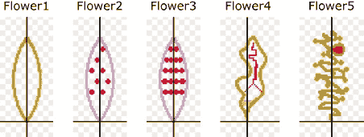图 4-5。花卉使用这五个花瓣精灵（如在画图编辑器中所示）。

当一个精灵收到绘制其花卉的消息时，它将在舞台上盖上多个旋转的服装副本，如图 4-6 所示。该图还展示了我们接下来要探索的花卉绘制脚本的示例输出。

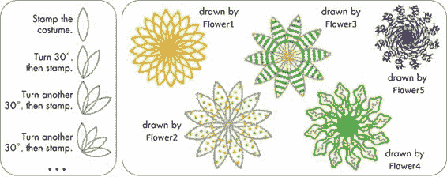图 4-6。花卉应用的绘制过程（左）和一些可能的花卉（右）

当你在舞台上点击鼠标时，舞台会通过**当该精灵被点击时**模块检测到鼠标点击。作为响应，它清除背景并广播一个名为`Draw`的消息。所有五个精灵都会响应这个消息，执行一个类似于图 4-7 所示的脚本。

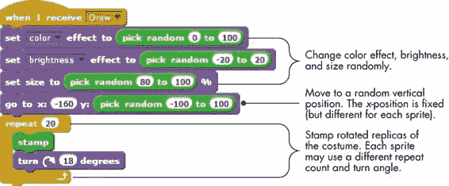图 4-7. 五个角色使用的基本脚本

脚本首先为颜色效果、亮度效果和大小赋予随机值，以改变绘制的花朵的外观。然后，它会移动到舞台上的一个随机垂直位置，并通过盖印旋转后的服装副本来绘制一朵花。

打开这个应用程序（名为*Flowers.sb2*），并运行它看看它是如何工作的。尽管它很简单，但它的输出却非常吸引人。我鼓励你设计不同的服装来创建不同类型的花朵。更改服装的中心位置，发现更有趣的花朵设计。

既然你已经了解了消息广播和接收的工作原理，我们将继续介绍结构化编程，作为管理大型程序复杂性的方式。

## 以小步骤创建大型程序

你到目前为止写的脚本相对较短且简单。最终，你将编写更长、更复杂的脚本，其中包含数百个块，理解和维护它们将成为一个真正的挑战。

一种被称为*结构化编程*的方法是在 1960 年代中期发展起来的，目的是简化编写、理解和维护计算机程序的过程。这个方法要求将程序分解为较小的部分，每个部分解决整个任务的一部分，而不是让你编写一个单一的大程序。

例如，考虑一下烤蛋糕的过程。你可能在烘烤时不会考虑每一个步骤，但这个过程遵循一个精确的食谱，列出了必要的步骤。食谱可能包括这样的指示：（1）混合 4 个鸡蛋、2 盎司面粉和 1 杯水；（2）将混合物放入平底锅；（3）将平底锅放入烤箱；（4）在 350°F 的温度下烘烤 1 小时；等等。从本质上讲，食谱将烤蛋糕的问题分解为几个明确的逻辑步骤。

同样，当你为你的编程问题设计解决方案时，将问题分解成可管理的、适合思考的小块是有帮助的。这种方法帮助你保持对整个程序以及其各个组成部分之间关系的清晰视图。

考虑图 4-8，它展示了一个在舞台上绘制形状的长脚本。你会看到，可以通过功能将这个脚本分成更小的逻辑块。例如，前六个块用于初始化角色。第一个**repeat**块绘制一个正方形，第二个绘制一个三角形，依此类推。使用结构化编程方法，我们可以将相关的块组合在一起，给它们起一个代表性的名称，以形成过程。

一旦我们写好了这些过程，我们就可以按照特定的顺序调用它们来解决编程问题。图 4-8 也展示了如何将这些独立的过程组合在一起，实现与原始脚本相同的功能。显然，使用过程的脚本（右边）比原始脚本（左边）更加模块化，且更易于理解。

过程还可以帮助你避免重复编写相同的代码。如果一组命令在程序中的多个地方执行，你可以编写一个过程来执行这些命令，并代替它使用。这种避免重复代码的策略被称为*代码重用*。例如，注意在图 4-8 中，**绘制正方形**过程是如何被重用的。

使用过程可以让你应用“分治法”策略来解决复杂问题。你将一个大而复杂的问题分解成多个子问题，然后分别解决这些更简单的问题，逐一测试每个子问题。解决所有子问题后，你将这些部分组合在一起，从而解决原始问题。这类似于我们的蛋糕烘焙策略：我们的食谱将问题分解成了明确定义的步骤，我们按正确的顺序执行这些步骤，最终完成蛋糕。

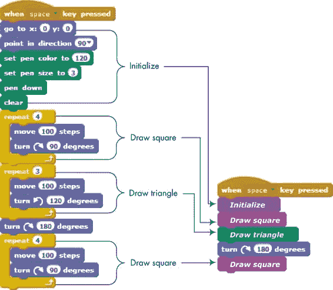图 4-8. 将一个大脚本分解成每个完成一个功能的逻辑部分

在这一点上，你可能会问，“我们怎么创建这些过程？”在 Scratch 2 之前，你不能像图 4-8 中显示的那样构建**初始化**块，并在脚本中调用它。模拟过程并为程序增加一些结构的唯一方法是通过 Scratch 的*消息广播*机制。在 Scratch 2 中，这个问题得到了改变，新增了强大的“自定义块”功能。

本节将演示旧版的方法，因为这是你在旧版本的 Scratch 中创建的脚本所看到的方式。然而，创建自定义块的功能将在下一节中讲解，并将在本书的其余部分持续使用。

由于精灵可以接收自己的广播消息，我们可以通过让一个精灵向自己广播消息并在**当我接收到**触发块下执行所需任务来实现过程。我们可以使用**广播并等待**块来确保我们的过程按照正确的顺序被调用，从而为程序增加结构性和模块化。困惑了吗？让我们来看一下实际操作。

### 使用消息广播创建过程

*Flowers2.sb2*

我们将探讨过程是如何工作的，以及它们如何通过重新创建之前的“Flowers”程序来改进你的代码。

打开文件*Flowers2.sb2*，其中包含程序的新版本。舞台的脚本与之前相同（当它检测到鼠标点击时，舞台会广播`Draw`消息），但这一次，我们的程序只使用一个角色，而不是五个。这个角色有五个服装，`leaf1`到`leaf5`，并将在每个服装上调用一个过程来绘制一朵花。由于我们只有一个角色，因此只需要一份绘图代码（而不是我们第一版中五个重复的脚本）。这使得程序更小，代码也更容易理解。当应用程序中的角色接收到`Draw`消息时，它会执行图 4-9 中显示的脚本。

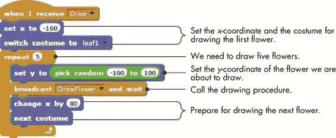图 4-9. 当角色接收到*`Draw`*消息时，它会调用*`DrawFlower`*五次（在循环中）来绘制五朵花。

该脚本设置了* x *坐标和服装，用于绘制第一朵花，然后进入一个循环来绘制五朵花。在每次循环中，循环设置花朵的* y *坐标，并通过广播消息调用`DrawFlower`。这个调用会暂停脚本的执行，直到`DrawFlower`完成。当这种情况发生时，`Draw`脚本会恢复执行，调整* x *坐标并更改服装，为绘制下一朵花做准备。

### 注意

*你可以随意为过程命名，但我建议选择一个能反映该过程目的的名称。这在你回顾几个月前写的程序时尤其有帮助。例如，如果你想在游戏中展示玩家的分数，你可以创建一个名为*`ShowScore`*的过程。将这个过程命名为*`Mary`*或*`Alfred`*显然不会提醒你（或任何阅读你程序的人）这个过程的作用。*

`DrawFlower`过程如图 4-10 所示。它在绘制一朵花之前设置了颜色效果、亮度和角色大小的随机值，然后将当前服装的旋转版本进行印章操作。

在程序的第一个版本中包含了五个精灵和五个重复的脚本，而第二个版本则使用一个精灵调用一个过程来绘制所有五朵花，达到了相同的结果。打开*Flowers.sb2*和*Flowers2.sb2*并在浏览器的两个标签中进行比较。新的版本是不是更简洁易懂？使用过程可以让你编写更小的程序，便于理解和维护。当你编写更复杂任务的程序时，这将变得更加有益。

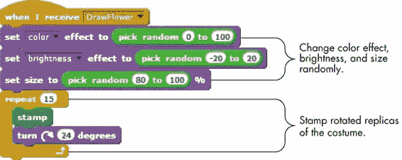图 4-10. *`DrawFlower`* 过程

### 创建你自己的块

从 Scratch 2 开始，你也可以创建自己的自定义块。创建自定义块后，它应该出现在*更多块*调色板中，你可以像使用其他 Scratch 块一样使用它。

为了向你展示如何创建和使用这些块，我们将修改上一节中讨论的 Flowers2 程序，使用一个自定义块来替代`DrawFlower`过程。以下步骤将指导你创建这个新版本的应用程序。

1.  首先，打开你在上一节中查看的*Flowers2.sb2*文件。从文件菜单中选择**文件** ▸ **下载到你的计算机**，并将文件保存为*Flowers3.sb2*。如果你愿意，可以选择不同的名称。

1.  点击`Flower`精灵的缩略图以选择它。然后选择*更多块*调色板，并点击**创建一个块**。你应该会看到如图 4-11 所示的对话框（左侧）。为该块输入`DrawFlower`作为名称，然后点击**确定**。一个名为**DrawFlower**的新功能块应该会出现在*更多块*调色板中，同时一个**定义 DrawFlower**块应该会出现在脚本区域，如图中所示（右侧）。

    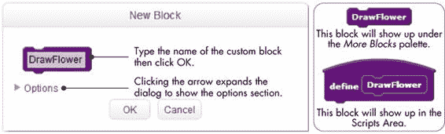图 4-11. 创建 DrawFlower 自定义块后出现的新块对话框

1.  将与**当我接收到 DrawFlower**块连接的脚本分离，并将其连接到**定义 DrawFlower**块，如图 4-12 所示。这样会创建一个名为**DrawFlower**的新过程，它作为自定义块实现。删除**当我接收到 DrawFlower**块，因为它不再需要。

    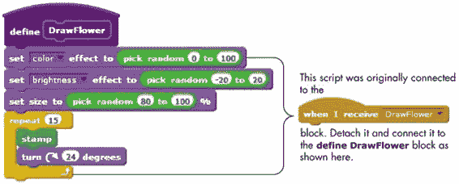图 4-12. 作为自定义块实现的*DrawFlower*过程

1.  现在我们已经创建了一个**DrawFlower**过程，我们只需要在`Draw`消息处理器中调用它。按照图 4-13 所示修改`Draw`消息处理器。注意，我们只是将**广播 DrawFlower 并等待**积木替换为新的**DrawFlower**自定义积木。

    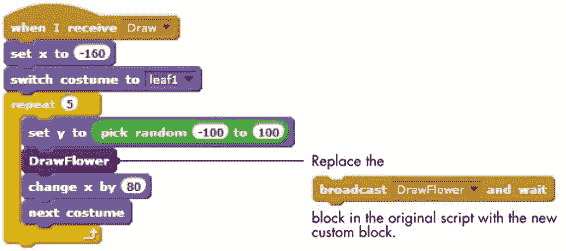图 4-13. 从*`Draw`*消息处理器调用*DrawFlower*

程序现在已经完成，你可以进行测试。点击舞台上的鼠标，验证程序是否像之前一样运行。查看运行时不刷新屏幕了解如何加速程序的执行。

现在你已经了解了自定义积木的基本知识，你可以更进一步，制作可以接受输入的积木。

运行时不刷新屏幕

使用自定义积木实现**DrawFlower**过程引出了另一个可以缩短绘图脚本执行时间的功能。为演示，请执行以下操作：

1.  右键点击*更多积木*调色板下的**DrawFlower**积木，并从弹出菜单中选择**编辑**。这将弹出一个对话框，如图 4-11 所示，只是标题将是*编辑积木*而非*新积木*。

1.  点击选项旁的箭头，勾选**运行时不刷新屏幕**框并点击**确定**（见图 4-15）。

1.  现在，点击舞台上的鼠标，看看会发生什么。你应该会看到五朵花几乎同时出现在舞台上，而不是看到单独的旋转和印章步骤。这是发生了什么的解释。

**DrawFlower**过程包含了许多改变精灵外观的积木，包括**设置颜色**、**设置亮度**、**设置大小**和**印章**。在执行这样的积木后，Scratch 通常会暂停一会儿以*刷新*（即重新绘制）屏幕。这就是我们在程序运行时能看到绘图进度的原因。

如果选择“运行时不刷新屏幕”选项，积木将在不暂停刷新屏幕的情况下运行，这样可以使过程运行得更快。Scratch 执行完整个过程后，屏幕将刷新。

除了加速过程外，运行时不刷新屏幕选项还帮助防止反复重绘所导致的闪烁。

### 向自定义积木传递参数

让我们从创建一个名为**Square**的自定义积木开始，它绘制一个边长为 100 像素的正方形，如图 4-14 所示。

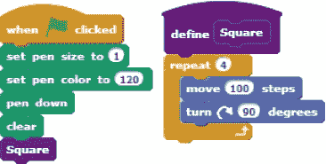图 4-14. 一个绘制固定大小正方形的*Square*程序

**Square**程序的功能是有限的，因为绘制的正方形的大小一成不变。如果你想绘制边长不同的正方形，例如 50、75 或 200，怎么办？你可以定义多个名为**Square50**、**Square75**和**Square200**的自定义积木，但在大多数情况下，创建多个基本相同的积木并不是一个好主意；如果需要做出更改，你还得找到所有副本并修改它们。一个更好的解决方案是使用一个单一的**Square**积木，允许用户在调用时指定所需的边长。

你其实从第一章开始就已经在应用这个概念了。例如，Scratch 提供了一个单一的**move**积木，允许你通过在参数框中输入数字来指定精灵移动的步数。通过这种方式，Scratch 不需要为每一个可能的移动距离提供一个新的积木。

因此，我们需要做的是在**Square**积木中添加一个参数输入框，供用户输入边长。图 4-15 展示了如何修改**Square**积木。

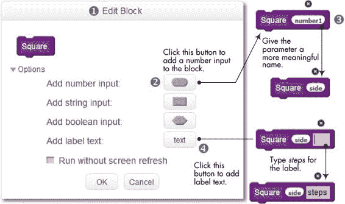图 4-15. 向*Square*积木添加数字输入

首先，右键点击**Square**积木（或脚本区中的**定义 Square**积木），从弹出菜单中选择**编辑**，以打开编辑积木对话框①。点击选项旁边的小箭头，展开对话框并查看可用的选项。

我们希望我们的**Square**积木接受一个正方形的边长，这是一个数字，因此点击**添加数字输入**②，向积木中添加一个数字输入框。应该向**Square**积木添加一个名为`number1`的数字输入框。

为了表明这个新输入框用于接收正方形的边长，我们将默认名称从`number1`改为一个有意义的名称③，像是`side`、`length`或`sideLength`。（再次提醒，尽管 Scratch 对你使用的标签不关心，但你自己会！选择一个能反映参数含义的名称。）在这个示例中，我们使用`side`作为名称。

从技术上讲，这就是我们需要做的，向我们的过程添加一个数字插槽。如果我们点击确定，我们将得到一个**正方形**块，它接受一个数字作为输入。我们可以将这个块拖到脚本中，并在参数插槽中指定所需的长度，如**正方形 50**。但用户如何知道传递给**正方形**的数字代表什么呢？是表示 50 的面积，50 的对角线，50 的边长，还是其他什么？

假设 Scratch 的**滑行**块是这样设计的：

你如何知道第一个插槽表示时间（以秒为单位），第二个和第三个插槽表示目标滑行点的 *x* 和 *y* 坐标呢？Scratch 设计者通过为这些插槽添加标签，使得**滑行**块更加易于理解和使用，具体如下：

我们可以通过添加文本来描述参数插槽的意义（或用途），对我们的**正方形**块进行相同的操作。点击**添加标签文本**④，如图 4-15 所示，在`side`参数后添加标签。输入**steps**作为标签文本，然后点击**确定**。

现在，如果你检查脚本区域中**正方形**过程的定义，你会看到一个小块（名为`side`）被添加到其头部，如图 4-16（左）所示。**移动**块中仍然包含固定数字 100，但现在我们需要做的只是将`side`块从**正方形**方法的头部拖动，并将其放置到**移动**块的参数插槽中，替换数字 100，如图 4-16（右）所示。

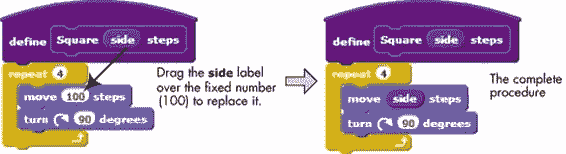图 4-16. 修改*正方形*过程以使用*`边长`*参数

在**Square**过程的头部出现的标签`side`被称为*参数*。你可以把参数看作是一个命名的占位符。我们希望**Square**过程能够绘制任意大小的正方形，因此我们没有在过程内部硬编码一个固定的数字，而是使用了一个名为`side`的通用参数。当用户调用**Square**过程时，会指定`side`的具体值。让我们通过修改图 4-14 中的脚本来说明这一点，使用我们新版本的**Square**过程。所需的更改在图 4-17 中有展示。

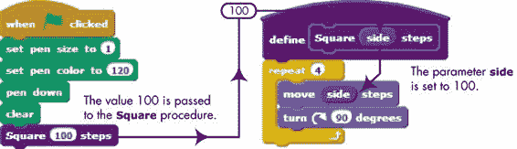图 4-17。调用*Square*过程，并将*`side`*设置为 100

在这里，数字 100（称为*实参*）被传递给**Square**过程。当执行**Square**时，它的`side`参数被设置为 100，并且这个值会替换过程内部所有出现的`side`块。正如你所看到的，能够为过程指定不同的实参是一个强大的特性，它为我们的程序增加了很多灵活性。

我们可以通过使**Square**过程接受正方形的颜色作为第二个参数来进一步增强其功能，如图 4-18 所示。在这里，我们添加了一个第二个输入参数，称为`clrNum`（即颜色编号），它表示正方形的期望颜色。现在，该过程在执行绘制循环之前，会将笔的颜色设置为`clrNum`指定的值。编辑**Square**块以实现图中所示的更改。

参数与实参

尽管许多程序员将*参数*和*实参*这两个术语交替使用，但实际上它们是不同的。为了解释清楚，考虑下面的**Average**过程，它计算两个数字的平均值。

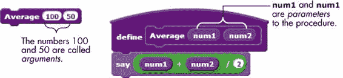

如定义所示，这个过程有两个名为`num1`和`num2`的参数。*参数*定义了过程的输入。你将使用左侧显示的块调用这个过程，并在可用的插槽内指定一些值或表达式。在上面的例子中，100 和 50 被称为该过程的*实参*。

当然，过程调用中的参数数量必须与过程定义中的参数数量匹配。当你调用**Average**时，参数`num1`和`num2`分别接收值 100 和 50，因为参数和实参是通过位置来匹配的。

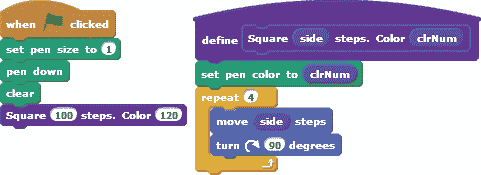图 4-18。这个版本的*Square*将所需颜色作为第二个参数。尝试练习 4-1

那么，正方形边框的粗细如何呢？修改**Square**过程，增加一个名为`penSize`的第三个参数，用于指定绘制正方形时使用的笔的大小。

让我们通过一些有用的技巧来结束这一节，帮助你处理自定义积木：

+   自定义积木不能在精灵之间共享。如果你为`Sprite1`创建了一个自定义积木，那么只有`Sprite1`可以使用该积木。同样，为舞台定义的自定义积木只能被属于舞台的脚本调用。

+   给你的参数起一个有意义的名字，表明它们的用途。

+   要删除自定义积木，只需将其**define**积木（即帽子积木）从脚本区拖动并放到调色板区。只有当你的项目中没有与该积木关联的堆栈积木时，你才能删除**define**积木，因此在尝试删除之前，先从你的脚本中移除所有自定义积木的使用。

+   要删除自定义积木的参数，在编辑积木对话框中点击参数的名称，然后点击出现在参数槽上方的小*X*图标。

+   除了数字输入外，你还可以添加字符串和布尔型参数。我们将在下一章讨论变量时深入讲解数据类型。

现在，你可能会问：一个过程能否调用另一个过程？在下一节中，你将了解如何使用嵌套过程调用来扩展现有过程的功能和实用性。

### 使用嵌套过程

如前所述，一个过程应该设计成执行一个单一的、明确定义的任务。为了执行多个任务，调用另一个过程作为其执行路径的一部分是完全合法的——在许多情况下也是很有用的。通过这种方式嵌套过程，你可以在构建和组织程序时获得极大的灵活性。

*RotatedSquares.sb2*

为了让你了解其实际应用，我们从上一节中编写的**Square**过程开始（参见图 4-17）。现在，我们将创建一个新的过程，名为**Squares**，它绘制四个拉伸的正方形，如图 4-19 所示。它通过调用**Square**过程四次来实现，每次调用使用不同的参数，最终输出四个共享一个角的正方形。

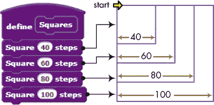图 4-19。*Squares*过程及其输出

我们现在可以使用**Squares**来创建一些有趣的艺术作品。图 4-20 展示了另一个过程，叫做**RotatedSquares**，它多次调用**Squares**过程，并在每次调用后旋转图形一定角度。

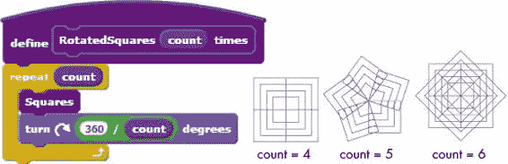图 4-20. *RotatedSquares*过程和一些可能的输出

在这个过程中，`count`参数被使用了两次：第一次用于确定重复次数，第二次在调用**Squares**后计算转动角度。例如，将`count`设置为`5`，将会导致重复图 4-20 中的方形模式五次，每次调用后旋转 72°（即 360° / 5）。你可以尝试不同的值以发现新的模式。

*Checkers.sb2*

让我们来做一个展示嵌套过程强大功能的例子：我们将从图 4-16 中的**Square**过程开始，最终得到一个棋盘格。

创建一个新的过程（叫做**Row**），如图 4-21 所示，画出一排方形。请注意，画多少个方形是作为参数指定的。为了简化起见，我们将每个方形的大小固定为 20 步，而不是将大小定义为**Row**过程的第二个参数。

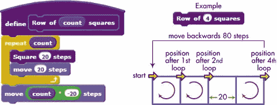图 4-21. *Row*过程

图 4-21 还展示了调用**Row**并传入`4`作为参数的结果，这会使过程在循环中调用**Square 20 步**四次。在每次画完一个方形后，角色的位置会进行调整，以为下一个方形设定初始位置。画完四个方形后，最后一条命令会将角色返回到其初始位置。

要在图 4-21 中显示的方形下方画出另一行方形，我们只需将角色下移 20 步，然后再次调用**Row**过程。我们可以重复这个操作，画出任意多行。我们的**Checkers**过程，如图 4-22 所示，就是这么做的。

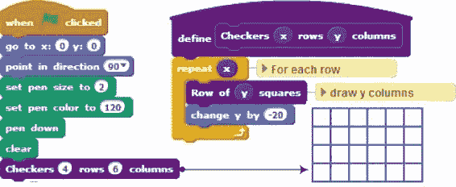图 4-22. Checkers 过程及其输出

该过程有两个参数：所需棋盘的行数和列数。每绘制完一行后，过程会将精灵向下移动 20 步，为绘制下一行方格做准备。

本节中的示例展示了过程如何帮助你将程序分解为更小、更易于管理的部分。写完并测试好你的过程后，你可以将它们作为构建更复杂过程的积木，而无需过多担心底层的实现细节。你可以专注于使用这些过程作为构建块来组装整个应用程序这一重要任务。

实践练习 4-2

如果你将初始方向设置为 0°（上）而不是 90°（右），你认为会发生什么？脚本会正常工作吗？如果不行，你怎么修复它？做出这个更改并运行脚本来测试你的答案。

## 与过程一起工作

现在你已经了解了将程序分解成更小的部分并逐一处理的重要性，让我们讨论如何进行这种分解。每个问题都不同，没有“万能”的解决方案——这也正是让它成为一个有趣难题的原因！

在本节中，我们将首先探讨将大型程序分解为具有清晰逻辑结构的模块化部分的*自上而下过程*。然后我们将讨论另一种构建复杂程序的方法：通过组合现有过程的*自下而上过程*。图 4-23 展示了这两种方法的高层次视图。

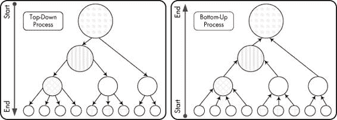图 4-23. 说明自上而下（左）和自下而上（右）方法

在这两个图中，我们想要解决的问题在顶部，构建我们解决方案的各个步骤在底部。你可以从任何一个对你有意义的层次开始。

### 将程序分解为过程

解决任何编程问题的第一步是充分理解问题。在此之后，你可以规划一个通用的解决方案，并将其分解为主要任务。没有一种“正确”或“错误”的方法来分解任何特定的程序，随着经验的积累，你会更好地判断“主要”的含义。从通用解决方案到具体细节的分解，至少能确保程序的整体逻辑是正确的。

*House.sb2*

为了演示这种解决问题的策略，我们来考虑如何绘制一个类似于图 4-24 中所示的房子。

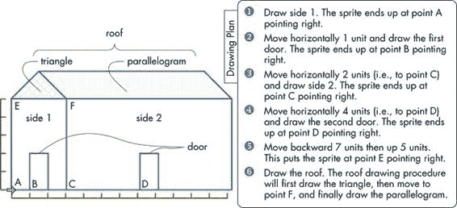图 4-24。我们可以通过将任务分解成若干个小块，并逐个处理每个小块，来绘制这座房子。

一方面，处理这个简单问题让我们可以专注于解决策略，而不会被许多细节困扰。另一方面，尽管问题看似简单，但它能够衍生出许多不同的解决方案。以下是一些可能性：

+   我们可以将房子看作由直线组成。在这种情况下，绘制每一条线都是一个主要任务。

+   我们可以将房子看作由六个独立的形状组成：侧面 1、侧面 2、两扇门、一个三角形和一个平行四边形。绘制每个形状构成了一个主要任务。

+   由于两扇门是相同的，我们可以定义一个绘制门的主要任务，并调用该任务两次。

+   我们可以将房子顶部的三角形和平行四边形视为一个单元，即屋顶。在这种情况下，一个主要任务就是绘制屋顶。

+   我们可以将侧面 1 及其门视为一个单元，即前侧。这样，一个主要任务就是绘制前侧。

还有许多其他的可能性，但这些已经足够说明问题了。关键是将任务分解为小的、易于理解的部分，并逐一处理每个部分。如果发现类似的部分，尝试提出一个通用解决方案并将其应用于所有这些部分。

鉴于此，我们绘制房子的计划也在图 4-24 中概述。该计划假设精灵从 A 点朝右开始。我们需要做的就是创建一个脚本，按照计划中概述的步骤进行操作。我们将编写一个过程（名为**Side1**）来绘制房子的左侧，如步骤 1 所示。我们还将编写三个过程（分别称为**Door**、**Side2**和**Roof**）来绘制两扇门、房子的右侧和屋顶（如步骤 2、3、4 和 6 所示），并将所有这些过程与适当的运动命令连接起来。

我们的**House**过程如图 4-25 所示，图中还展示了与每个过程调用对应的绘图步骤。该过程接受一个参数（称为**scale**），用于指定绘制房子的单位长度（即缩放因子）。请注意，**Door**过程被重复调用了两次。同时请注意，**Roof**过程负责绘制整个屋顶，它可能包含不同的子过程，用于绘制屋顶的各个组成部分。

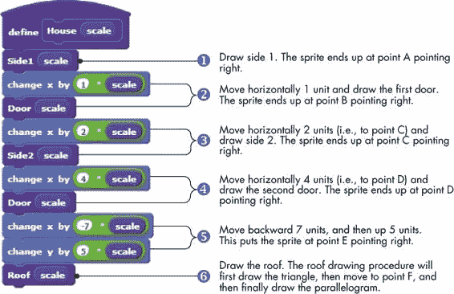图 4-25. *House*过程。注意主要任务如何与绘图计划对齐。

绘制房屋的各个过程如图 4-26 所示。这些过程使用你在第二章中学到的相同技巧来绘制简单的几何形状。

**Side1**、**Door**和**Side2**过程分别绘制 3×5、1×2 和 9×5 的矩形（根据`scale`因子进行缩放）。**Roof**过程有两个子过程（分别命名为**Triangle**和**Parallelogram**），用于绘制屋顶的两个部分。请注意，所有这些过程都一致使用了缩放因子`scale`。这使得我们能够通过传递不同的参数调用**House**过程，绘制更大或更小的房屋。

动手试一试 4-3

你注意到**Side1**、**Door**和**Side2**过程使用几乎相同的代码吗？创建一个名为**Rectangle**的新过程，它接受长度、宽度和缩放作为参数，并绘制指定尺寸的矩形。修改**Side1**、**Door**和**Side2**过程，以调用新的**Rectangle**过程。

图 4-26. 绘制房屋的过程如图 4-24

### 通过过程构建

*FlowerFlake.sb2*

解决大问题的另一种方法是先关注较小的细节。如果你先解决了大问题中的小部分（或找到已经存在的解决方案），然后你可以从下到上组合这些结果，最终达到完整的解决方案。

为了演示这个问题解决技巧，让我们从一个简单的过程（称为**Leaf**）开始，该过程绘制一个如图 4-27 所示的单个叶子。该过程包含一个**repeat**循环，循环执行两次以绘制叶子的两半。每一半都是通过 15 个短线段绘制而成，线段之间有 6°的转角。这类似于我们在第二章中使用的绘制多边形的方法。

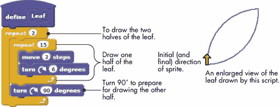图 4-27. *Leaf*过程及其输出

以这个过程为起点，我们现在可以绘制一个稍微复杂一些的图形，包含五片叶子。我们新建的过程叫做**Leaves**，其输出如图 4-28 所示。如你所见，我们只需要在**repeat**循环中调用**Leaf**过程，并在每次调用之间使用适当的转角。

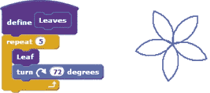图 4-28。*Leaves*过程在每次调用之间以 72°的转角调用*Leaf*过程五次。

现在我们可以使用**Leaf**和**Leaves**来构建一个更复杂的东西：一个带有叶子的树枝。我们的**Branch**过程及其输出如图 4-29 所示。精灵向前移动 40 步，画出一片叶子（通过调用**Leaf**过程），再向前移动 50 步，画出五片叶子（通过调用**Leaves**过程），最后返回起始位置。

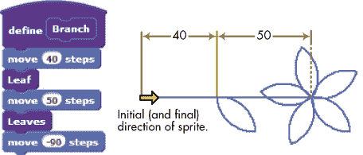图 4-29。*Branch*过程及其输出

让我们再进一步。如何使用**Branch**过程来绘制一朵复杂的花朵图案？我们新建的过程叫做**Flower**，其输出如图 4-30 所示。这个过程简单地在循环中调用**Branch**过程六次，每次之间转角 60°。

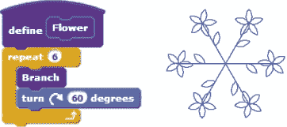图 4-30。*Flower*过程及其输出

我们可以继续下去，但现在应该明白了这个思路。我们从一个简单的过程**Leaf**开始，并将它用于一个新的过程（叫做**Leaves**）来创建一个复杂的图案。**Branch**过程依赖这两个过程来创建更复杂的东西。然后，**Flower**过程利用**Branch**绘制了一个更复杂的图案。如果我们想的话，我们还可以创建一个绘制整棵花树的过程，再创建一个绘制满是树的花园的过程。

从这个例子中我们可以得到的要点是，无论我们要解决的问题有多复杂，我们总能通过将许多更小、更易管理的部分拼接在一起来构建解决方案。使用这种问题解决技巧，我们从解决非常简单问题的短小过程开始，然后利用它们创建更复杂的过程。

## 摘要

在本章中，我们介绍了一些基础概念，这些概念将在本书的剩余部分中得到广泛应用。首先，我们解释了用于交互式通信和同步的消息广播的概念。接着，我们介绍了结构化编程，并讨论了如何使用消息广播来实现程序。然后，我们演示了 Scratch 2.0 的自定义模块功能，并解释了如何向程序传递参数，以使程序更加灵活。我们通过几个示例展示了将大问题拆解成更小、更易管理的部分，并解释了如何使用程序作为创建大型程序的基本构建块。最后，我们考察了一种自下而上的问题解决技巧，在该技巧中，我们将已知的小问题的解决方案拼凑在一起，来解决大问题。

在下一章中，你将学习任何编程语言中最重要的概念：*变量*。对变量的介绍将是成为一名熟练程序员的重要一步。

### 问题

| **问：** | 1\. 编写不同的程序来绘制你名字中的每个字母。为每个字母命名相应的程序。然后编写一个脚本，调用这些程序，让你能在舞台上绘制出你的名字。 |
| --- | --- |
| **问：** | 2\. 创建如下所示的程序，运行它，并解释它是如何工作的。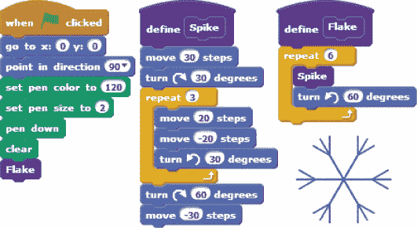 |
| **问：** | 3\. 编写一个程序，将摄氏度转换为华氏度，如下所示。让脚本将答案四舍五入到最接近的整数。测试不同温度下的程序。（提示：°*F* = (9 / 5) × °*C* + 32。） |
| **问：** | 4\. 编写一个程序来创建右侧显示的房子。首先编写绘制房子小部分（例如门、屋顶、窗户等）的程序。然后将这些程序组合起来，创建整个房子。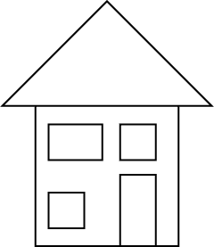 |
| **问：** | 5\. 编写一个程序来计算圆的面积（A = πr²），给定其半径，如下所示。使用π = 3.14。 |
| **问：** | 6\. 在本练习中，你将模拟鱼在水下所承受的压力。假设鱼所受的压力*P*（以大气压为单位）与其深度*d*（距离水面多少米）之间的关系为：*P* = 0.1*d* + 1\. *PressureUnderWater_NoSolution.sb2*包含了这个模拟的部分实现。完成脚本，使得鱼在游动时说出它所感受到的压力，如下所示：*PressureUnderWater_NoSolution.sb2*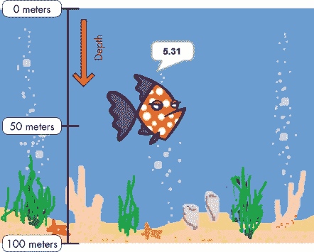 |
