## 第五章 变量

本章解释了如何创建能够读取和记住值的脚本。当你使用变量时，可以编写与用户交互并响应其输入的应用程序。以下是本章的内容：

+   Scratch 支持的数据类型

+   如何创建变量并操作它们

+   如何获取用户输入并编写交互式程序

尽管你在过去四章中编写的脚本帮助你学习了重要的 Scratch 编程技能，但它们缺少了大型应用程序的许多关键元素。更复杂的程序可以记住值，并根据某些条件决定执行某个动作。本章将解决这两个缺陷中的第一个，决策功能将在下一章介绍。

如你所学，脚本在执行过程中会处理和操作不同类型的数据。这些数据可以输入到命令块中（例如，**移动 10 步**命令中的数字 10，或者**说你好！**命令中的“你好！”字符串），也可以是从功能块输出的数据（例如**鼠标 x，y 位置**和**随机选择**），或者数据可以是用户响应**询问并等待**命令时输入的。对于更复杂的程序，你通常需要存储和修改数据以完成某些任务。Scratch 中的数据管理可以通过*变量*和*列表*来实现。本章将详细探讨变量，列表将在第九章中讲解。

本章从 Scratch 支持的数据类型概述开始。接着介绍变量，并讨论如何在程序中创建和使用它们。然后将解释变量监视器，并在几个有趣的应用程序中使用它们。在掌握了基本概念后，你将学习如何使用**询问并等待**命令来获取用户输入。

## Scratch 中的数据类型

许多计算机程序操作不同种类的数据，包括数字、文本、图像等，以生成有用的信息。这是一个重要的编程任务，因此你需要了解 Scratch 支持的数据类型和操作。Scratch 内置支持三种可以在积木中使用的数据类型：布尔值、数字和字符串。

*布尔值*只有两种可能的值：真或假。你可以使用这种数据类型来测试一个或多个条件，并根据结果让程序选择不同的执行路径。我们将在下一章详细讨论布尔值。

*数字*变量可以存储整数和小数值。Scratch 不区分这两者，它们都被归类为“数字”。你可以使用来自*运算符*面板的**四舍五入**块将小数数字四舍五入为最接近的整数。你还可以使用来自*运算符*面板中的**取整**（或**向上取整**）功能，从指定的小数中得到一个整数。例如，**取整 3.9**是 3，而**向上取整 3.1**是 4。

*字符串*是由字符组成的序列，可以包括字母（大写和小写）、数字（0 到 9）以及你键盘上可以输入的其他符号（如 +、–、&、@ 等）。你会使用字符串数据类型来存储名字、地址、书名等。

### 形状里面有什么？

你是否注意到 Scratch 块和它们的参数插槽各自有特定的几何形状？例如，**移动 10 步**块中的参数插槽是一个圆角矩形，而**说 Hello!**块中的参数插槽是一个带尖角的矩形。参数插槽的形状与它接受的数据类型有关。试着在**移动 10 步**块中输入你的名字（或其他任何文本）；你会发现，Scratch 只允许你在圆角矩形插槽中输入数字。

同样，功能块的形状也表示它返回的数据类型。不同形状的含义在图 5-1 中有所说明。

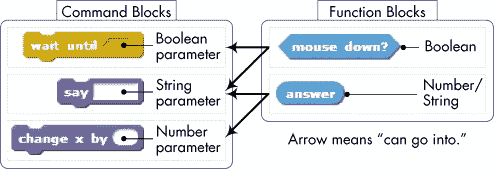图 5-1. 命令块和功能块形状的含义

参数插槽有三种形状（六边形、矩形和圆角矩形），而功能块只有两种形状（六边形和圆角矩形）。每种形状都与特定的数据类型相关，尽管你需要注意的是，圆角矩形的功能块既可以报告数字，也可以报告字符串。

六边形和圆角矩形插槽只接受相同形状的功能块，而矩形插槽可以接受任何功能块。好消息是，Scratch 会阻止你将类型不匹配的块放入插槽，所以你不需要记住这个规则。试着将一个六边形形状的块拖入圆角矩形插槽，你会发现无法放入，因为它们的类型不兼容。

### 自动数据类型转换

正如我在上面提到的，一个数字参数插槽只能接受圆角矩形功能块。到目前为止，你处理过的所有圆角矩形功能块——包括**x 位置**、**y 位置**、**方向**、**服装编号**、**大小**、**音量**、**节奏**等——都报告数字。因此，将它们放入数字插槽（例如**移动 10 步**块）并不成问题。然而，一些圆角矩形功能块，如*Sensing*调色板中的**回答**块或*Operators*调色板中的**连接**块，可以包含数字或字符串。这就引出了一个重要问题：如果我们例如将包含字符串的**回答**块插入数字插槽会发生什么呢？幸运的是，Scratch 会根据需要自动尝试在数据类型之间进行转换，如图 5-2 所示。

在这个例子中，用户在“请输入一个数字”提示下输入了`125`。用户的输入被保存在**回答**功能块中。当这个输入传递给**说**命令时，它会自动转换为字符串。当相同的回答传递给加法运算（需要数字）时，它会转换为数字 125。当加法运算执行时，结果（25 + 125 = 150）会被转换回字符串，“150”会被传递到**说**块中。Scratch 会自动尝试为你处理这些转换。

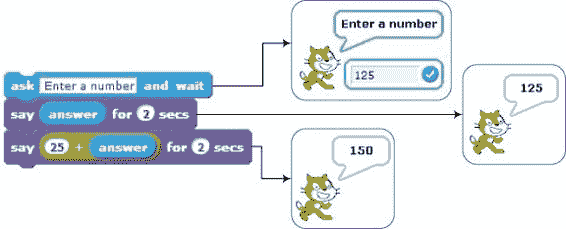图 5-2. Scratch 根据上下文自动进行数据类型转换。

了解 Scratch 中可用的数据类型、对这些类型允许的操作，以及 Scratch 如何在它们之间进行转换，将帮助你理解为什么事物以这种方式运作。在下一部分，你将学习变量，以及如何使用变量来存储和操作程序中的数据。

## 变量简介

假设我们想创建一个软件版本的“打地鼠”游戏。原版游戏有一个平坦的表面，表面上有几个洞。玩家使用槌子打出洞口的地鼠。在我们的版本中，一个角色精灵会随机出现在舞台上的某个位置，保持可见一段时间后消失。然后它会等一会儿，再出现在另一个位置。玩家需要在精灵出现时尽快点击它。每次点击精灵，玩家就得一分。作为程序员，你面临的问题是，如何追踪玩家的分数？欢迎进入变量的世界！

在本节中，我将介绍变量，这是任何编程语言中最重要的元素之一。你将学习如何在 Scratch 中创建变量，并如何使用它们来记住（或存储）不同类型的数据。你还将探索在程序中设置和更改变量值的可用块。

### 什么是变量？

*变量* 是计算机内存中一个命名的区域。你可以把它看作是一个用来存储数据的框，包括数字和文本，供程序根据需要访问。在图 5-3 中，我们展示了一个名为 `side` 的变量，它的当前值是 50。

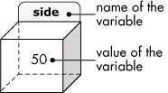图 5-3. 变量就像一个命名的框，里面包含一些值。

当你创建一个变量时，你的程序会分配足够的内存来存储变量的值，并用该变量的名称标记分配的内存。创建变量后，你可以在程序中使用它的名称来引用它所代表的值。例如，如果我们有一个名为 `side` 的框（即变量），它的值是 50，我们可以构建一个像 **移动 (3*side) 步** 的命令。当 Scratch 执行这个命令时，它会在计算机内存中找到名为 `side` 的框，取出其中的内容（在这个例子中是数字 50），并用这个值替换 **移动 (3*side) 步** 块中的 `side` 标签。结果，精灵将移动 150 步（即 3 × 50）。

在我们的打地鼠游戏中，我们需要一种方法来记住玩家的得分。为此，我们可以在计算机的内存中预留一些空间（就像一个框）来存储得分。我们还需要给这个框一个唯一的标签，比如 `score`，这样我们就可以在需要知道或更改其中内容时找到它。

当游戏开始时，我们会告诉 Scratch “将 `score` 设置为 0”，Scratch 会查找标记为 `score` 的框，并将 0 这个值放入其中。每当玩家点击精灵时，我们还会告诉 Scratch “将 `score` 增加 1”。第一次点击时，Scratch 会再次查看 `score` 框，找到我们的 0，增加 1，并将结果（即 1）放回框中。下次玩家点击精灵时，Scratch 会再次按照我们的“将 `score` 增加 1”命令来增加 `score`，并将结果值 2 存入框中。

你稍后会看到这些操作的实际 Scratch 块。现在，请注意 `score` 的值在程序中是会变化的。这就是为什么我们称其为 *变量*——它的值是可变的。

变量的一个重要用途是存储评估代数表达式的中间结果。这类似于你做心算的方式。例如，如果让你计算 2 + 4 + 5 + 7，你可能会先将 2 + 4 相加，并记住结果（6）。然后你会将 5 加到之前的结果（保存在你的记忆中），并记住新结果，即 11。最后，你会将 7 加到之前的结果，得到最终结果 18。

为了说明变量如何用于临时存储，假设你想编写一个程序来计算以下表达式：

你可以用一个命令来评估整个表达式，但将所有内容塞进一个语句中会让它变得很难阅读，如下所示：

另一种编写程序的方式是分别评估分子和分母，然后使用**say**块显示它们相除的结果。我们可以通过创建两个变量来做到这一点，分别命名为`num`（用于分子）和`den`（用于分母），并设置它们的值，如图 5-4 所示。

图 5-4。两个变量（*`num`*和*`den`*）分别保存表达式的分子和分母的值。

看一下我们在计算机内存中如何安排这些变量。在这里，`num`就像一个标签，指向存储评估（1 / 5 + 5 / 7）结果的内存位置。同样，`den`指向存储（7 / 8 – 2 / 3）结果的位置。当**say**命令执行时，Scratch 会获取标记为`num`和`den`的内存内容。然后，它会将这两个数字相除，并将结果传递给**say**命令进行显示。

我们可以进一步拆解这个表达式，分别评估每个分数，然后显示总表达式的结果，如图 5-5 所示。

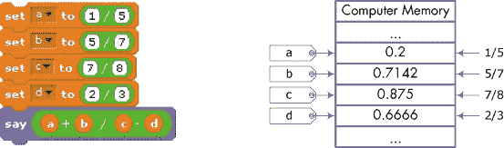图 5-5。使用四个变量（*`a`*、*`b`*、*`c`*和*`d`*）来保存表达式中的四个分数

在这里，我们使用四个变量（命名为`a`、`b`、`c`和`d`）来保存数学表达式中的四个分数。图中还显示了内存分配；这次你可以看到四个变量及其内容。

尽管这三个程序得出了相同的答案，但每种实现方式都有不同的风格。第一个程序将所有内容放在一条语句中，这使得它难以阅读。第三个程序将内容拆解得更为详细，但这样也可能让人难以理解。第二种解决方案将表达式分解到一个合理的层次，并使用变量来使程序更易于理解，同时清晰地展示表达式的主要部分（分子和分母）。正如金发姑娘所说，这种方法恰到好处。

这个简单的示例展示了一个问题可以有多个解决方案。有时你可能关注程序的速度或大小，其他时候你的目标可能是可读性。由于这是一本入门编程书籍，书中的脚本是为了强调可读性而编写的。

现在你已经了解了变量是什么以及为什么要使用它们，让我们创建一些变量，并将我们的 Scratch 应用程序更进一步。

### 创建和使用变量

*DiceSimulator_NoCode.sb2*

在这一部分，我们将通过一个简单的应用程序来探索如何创建和使用变量，该应用程序模拟掷一对骰子并显示它们的总和，如图 5-6 所示。

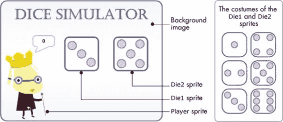图 5-6. 骰子模拟器的用户界面

我们的骰子模拟器包含三个精灵：`Player`、`Die1` 和 `Die2`。`Player` 精灵管理模拟过程。当按下绿色旗帜图标时，该精灵生成两个介于 1 和 6 之间的随机数，并将这些值分别保存在名为 `rand1` 和 `rand2` 的两个变量中。接着，它会向另外两个精灵（`Die1` 和 `Die2`）广播消息，显示随机生成的值；`Die1` 显示 `rand1` 的值，`Die2` 显示 `rand2` 的值。之后，`Player` 精灵将 `rand1` 和 `rand2` 相加，并使用 **say** 块显示总和。

让我们从头开始构建这个应用程序。打开文件 *DiceSimulator_NoCode.sb2*。该文件包含了舞台的背景图像以及应用程序中使用的三个精灵。我们将逐步创建所需的所有脚本。

首先，点击 `Player` 精灵的缩略图以选择它。选择 *数据* 面板并点击 **创建变量**，如图 5-7（左）所示。在弹出的对话框中，如图 5-7（右）所示，输入变量的名称并选择其作用范围。一个变量的 *作用范围* 决定了哪些精灵可以写入（或更改）该变量的值，下一节中我会详细解释这一点。在此示例中，输入 `rand1` 作为变量的名称，并选择 **对所有精灵有效** 选项作为变量的作用范围。完成后点击 **确定**。

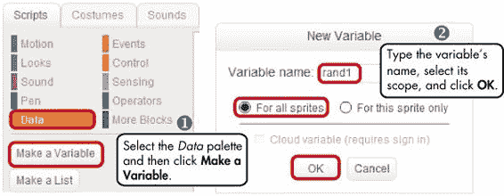图 5-7. 创建一个变量，命名它，并指定它的作用范围

创建变量后，与其相关的几个新块将出现在 *数据* 面板中，如图 5-8 所示。

图 5-8. 创建 `rand1` 变量时出现的新块

你可以使用这些块将变量设置为特定值、按固定值更改它，并在舞台上显示（或隐藏）其监视器。一个变量的 *监视器*，正如你将在显示变量监视器一节中学习到的那样，显示存储在该变量中的当前值。

命名变量

多年来，人们提出了不同的方式来命名程序中的变量。一个常见的约定是变量名以小写字母开头，后续单词的首字母大写，例如 `sideLength`、`firstName` 和 `interestRate`。

虽然 Scratch 允许变量名以数字开头并包含空格（例如，`123Side` 或 `side length`），但大多数编程语言不允许这样，因此我建议你避免使用这些不寻常的变量名。虽然你可以给变量命名任何你想要的名称，但我强烈建议使用描述性且有意义的名称。像 `w` 和 `z` 这样的单字母变量应尽量减少使用，除非它们的含义非常明确。另一方面，过长的名称可能会让你的脚本更难阅读。

另外，请注意，在 Scratch 中，变量名是区分大小写的，这意味着 `side`、`SIDE` 和 `siDE` 都是不同的变量。为了避免混淆，尽量不要在同一脚本中使用名字仅在大小写上有所不同的变量。

按照我上面描述的步骤，创建一个名为`rand2`的变量。*数据*调色板现在应该包含第二个变量积木（名为`rand2`），并且图 5-8 中的下拉箭头应该让您在`rand1`和`rand2`之间进行选择。现在我们已经创建了两个变量，我们可以为`Player`角色构建脚本。完整的脚本显示在图 5-9 中。

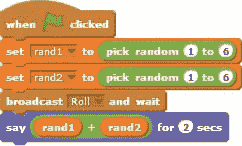图 5-9. *`Player`*角色的脚本

第一个命令将`rand1`设置为 1 到 6 之间的随机数字。回想一下我们用盒子做类比的情况：这个命令使得角色找到标记为`rand1`的盒子，并将生成的随机数字放入其中。第二个命令将`rand2`设置为另一个 1 到 6 之间的随机值。接下来，脚本会广播一个名为`Roll`的消息给其他两个角色（`Die1`和`Die2`），通知它们需要按照`rand1`和`rand2`的指定来切换服装。一旦`Die1`和`Die2`角色完成任务，脚本将继续执行并通过**说**积木显示骰子面上的数字总和。让我们来看一下`Die1`角色的`Roll`消息处理程序，见图 5-10。

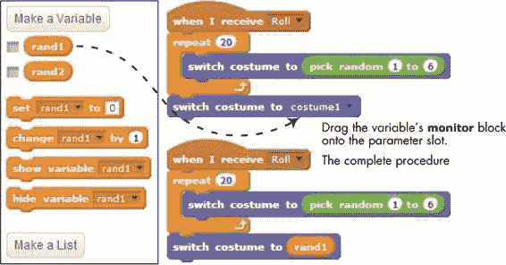图 5-10. 要在命令积木中使用变量，只需将该变量拖动到该积木的参数槽中。

在图右上角创建如示的脚本后，将`rand1`积木从*数据*调色板拖动到**切换服装**积木的参数槽中，形成完整的脚本（右下角）。在这个脚本中，**重复**积木会将骰子的服装随机改变 20 次，以模拟掷骰子的过程（如果需要，您可以更改这个数字）。之后，骰子将其服装设置为由`rand1`指定的数字。回忆一下，每个骰子有六种服装，分别对应数字 1 到 6。这意味着，如果`rand1`是 5，那么最后的**切换服装**命令将显示带有五个点的服装。

现在，我们可以为`Die2`角色创建脚本，这个脚本应该与我们为`Die1`创建的几乎相同。由于`Die2`根据`rand2`来更换服装，您只需要复制`Die1`的脚本到`Die2`，然后将`rand1`替换为`rand2`。

我们的骰子模拟器现在已经完成，接下来让我们进行测试。点击绿色旗帜图标，查看模拟效果。如果应用程序无法正常运行，请检查文件*DiceSimulator.sb2*，其中包含正确的程序实现。

试试看 5-1

选择`Player`角色，并创建一个名为`sum`的新变量。将此变量的作用域设置为“仅此角色”。修改`Player`脚本的最后一个积木，使用这个新变量，像这样：

现在选择`Die1`（或`Die2`）角色，并查看*数据*调色板。你能解释为什么在那里看不到`sum`变量吗？

### 变量的作用域

与变量相关的另一个重要概念是*作用域*。变量的作用域决定了哪些角色可以写入（或更改）该变量的值。

*ScopeDemo.sb2*

你可以在创建变量时指定其作用域，方法是选择在图 5-7 中看到的两种选项之一。选择“仅此角色”会创建一个变量，该变量只能由拥有它的角色进行更改。其他角色仍然可以读取和使用该变量的值，但不能写入它。图 5-11 中的示例说明了这一点。

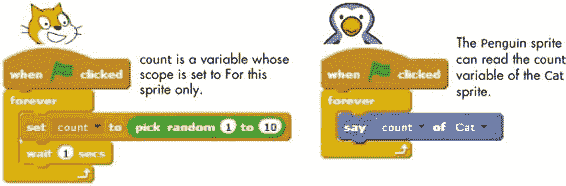图 5-11。只有*`Cat`*角色可以写入*`count`*。

在这个图中，`Cat`角色有一个名为`count`的变量，其作用域为“仅此角色”。`Penguin`角色可以使用来自*传感器*调色板的**企鹅的 x 位置**积木读取`count`。当你选择`Cat`作为此积木的第二个参数时，第一个参数将允许你选择`Cat`角色的一个属性，包括其变量之一。

然而，Scratch 并没有提供允许`Penguin`角色更改`count`变量的积木。因此，`Penguin`角色无法篡改`count`，避免了对`Cat`角色脚本运行造成不良影响。对于那些只能由单一角色更新的变量，最好使用“仅此角色”作用域。

使用“仅此角色”作用域创建的变量称为*局部作用域*，它们可以称为*局部变量*。不同的角色可以使用相同的名称来命名其局部变量而不会发生冲突。例如，如果你在赛车游戏中有两个赛车角色，每个赛车角色可能都有一个名为`speed`的局部变量，用于决定赛车在舞台上的运动速度。每个赛车角色可以独立更改其`speed`变量。这意味着，如果你将第一辆车的`speed`设置为 10，第二辆车的`speed`设置为 20，第二辆车应该比第一辆车移动得更快。

变量的数据类型

到这个时候，你可能会想，“Scratch 是如何知道变量的数据类型的？”答案是，它并不知道！当你创建一个变量时，Scratch 并不清楚你打算将该变量用于存储数字、字符串还是布尔值。任何变量都可以存储任何数据类型的值。例如，以下所有命令在 Scratch 中都是有效的。

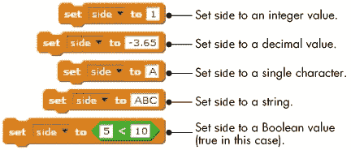

你需要自行在变量中存储正确的值。然而，正如我在本章前面所描述的，Scratch 会根据上下文尝试在数据类型之间进行转换。要查看当你在变量中存储错误的数据类型时会发生什么，考虑以下两个例子：

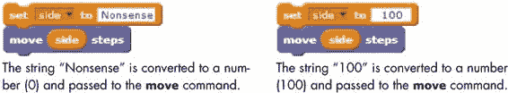

由于**移动**命令期望一个数字参数，Scratch 会在将值传递给**移动**命令之前，自动尝试将`side`变量中存储的值转换为数字。在第一个脚本（左边）中，Scratch 无法将字符串“胡说八道”转换为数字。Scratch 不会显示错误消息，而是默默地将转换结果设置为 0，并将此值传递给**移动**命令。结果，精灵不会移动。另一方面，在第二个脚本（右边）中，Scratch 忽略了字符串中的空格，并将结果数字传递给**移动**模块，因此精灵向前移动了 100 步。请注意，如果目标模块期望的是一个字符串而不是数字，Scratch 会按原样传递字符串，包括空格。

另一方面，具有“所有精灵”作用域的变量可以被应用程序中的任何精灵读取和更改。这些变量通常被称为*全局变量*，对于精灵之间的通信和同步非常有用。例如，如果一个游戏有三个按钮，允许用户选择要玩的关卡，你可以创建一个名为`gameLevel`的全局变量，并让每个按钮精灵在被点击时将该变量设置为不同的数字。然后，你可以通过检查`gameLevel`轻松找出用户的选择。

选择“所有精灵”选项还会在图 5-7 中启用“云变量”复选框。这个功能允许你将变量存储在 Scratch 的服务器上（云端）。云变量的模块前面有一个小方块，用以与常规变量区分开来，像这样：

任何查看你在 Scratch 网站上分享的项目的人都可以读取该项目中的云变量。例如，如果你分享一个游戏，你可以使用云变量来跟踪所有玩家中记录的最高分。`score`云变量应几乎立即更新，供所有与游戏互动的人查看。因为这些变量存储在 Scratch 服务器上，即使你退出浏览器，它们的值也会保持不变。云变量使得创建调查和其他需要随时间存储数字的项目变得容易。

现在你已经理解了作用域，接下来是学习如何更新变量——然后使用这些知识来创建更有趣的程序。

### 更改变量

Scratch 提供了两个命令模块，可以让你修改变量。**set to**命令直接将一个新值赋给变量，而不管该变量当前的值是什么。另一方面，**change by**命令则用于根据变量当前的值，通过指定的数量来改变变量的值。图 5-12 中的三个脚本演示了如何使用这些命令以不同方式实现相同的结果。

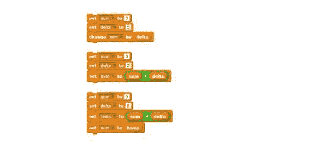图 5-12。更改变量值的三种方法

图中的三个脚本都首先将两个变量`sum`和`delta`的值分别设置为 0 和 5。第一个脚本使用**change**命令通过`delta`的值改变`sum`的值（即，从 0 变为 5）。第二个脚本使用**set**命令将当前`sum`的值加上`delta`的值（0 + 5），并将结果（5）存回`sum`。第三个脚本借助一个名为`temp`的临时变量实现相同的结果。它将`sum`的值加到`delta`上，将结果存储在`temp`中，最后将`temp`的值复制到`sum`中。

执行图 5-12 中的任何脚本后，`sum`将包含数字 5，因此这些脚本在功能上是等效的。请注意，第二个脚本中使用的方法是一种常见的编程实践，我建议你花一点时间研究它，熟悉这一方法。现在，让我们看看**change**命令的实际应用。

#### 蜘蛛网

*SpiderWeb.sb2*

我们可以通过绘制几个逐渐增大的六边形来创建一个蜘蛛网，如图 5-13 所示。**Triangle** 程序绘制一个边长可变的等边三角形，而 **Hexagon** 程序则调用 **Triangle** 六次，每次调用后右转 60°（即 360° / 6）。该图清楚地展示了六边形是如何由六个三角形组成的。

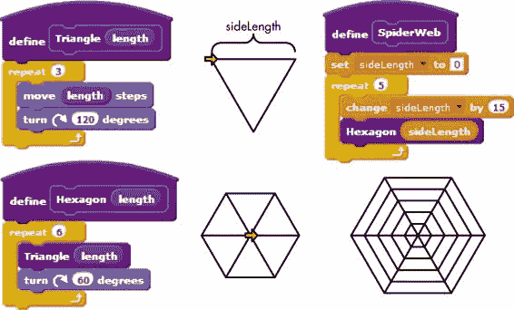图 5-13. 通过绘制几个逐渐增大的六边形来创建蜘蛛网

**SpiderWeb** 程序仅仅是重复调用 **Hexagon**，每次传递不同的 `sideLength` 变量值。这就产生了你在图中看到的同心六边形（即具有相同中心）。注意在 **repeat** 循环内部如何使用 **change** 命令来设置 `sideLength` 的值。复现 **SpiderWeb** 程序，运行它，看看它是如何工作的。

#### Pinwheel

*Pinwheel.sb2*

这个例子与前一个类似，唯一不同的是这次我们将使用一个变量来控制三角形重复的次数。最终的程序（称为 **Pins**）如图 5-14 所示。图中的 **Pinwheel** 程序的工作原理与上面的 **SpiderWeb** 程序相似，但我们还在每次循环时改变画笔的颜色，以达到有趣的彩虹效果。图中展示了不同针数下的 **Pinwheel** 程序输出。试着用这个程序进行实验，看看你还能创造什么。

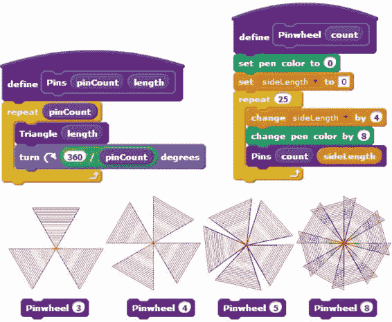图 5-14. 通过旋转等边三角形多次创建风车

现在我们已经探讨了变量的基础知识，你可能会想知道，当你复制一个精灵时，变量会发生什么？复制品是否共享父精灵的变量，还是拥有自己的副本？克隆是否可以访问全局变量？我们将在下一节回答这些问题。

尝试一下 5-2

修改 Pinwheel 程序，使精灵隐藏。这应该会让你在观察绘图时不会被精灵阻碍。

### 克隆中的变量

每个精灵都有一份与之相关的属性列表，包括它当前的*x*位置、*y*位置、方向等。你可以将这份列表想象成一个背包，里面装着精灵属性的当前值，如图 5-15 所示。当你为精灵创建一个作用域为“仅此精灵”的变量时，这个变量会被添加到精灵的背包中。

当你克隆一个精灵时，克隆会继承父精灵的属性副本，包括它的变量。继承的属性在克隆创建时会与父精灵的属性完全相同。但此后，如果克隆的属性和变量发生变化，这些变化不会影响父精灵。父精灵的后续变化也不会影响克隆的属性。

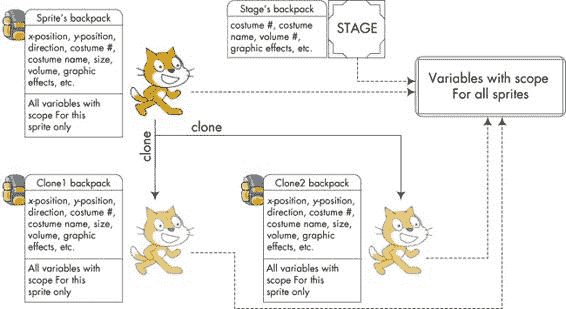图 5-15. 克隆继承父精灵的变量副本

举例来说，假设父精灵拥有一个名为`speed`的变量，其当前值为 10。当你克隆父精灵时，新的精灵也会有一个名为`speed`的变量，值为 10。之后，如果父精灵将`speed`更改为 20，克隆中的`speed`值将保持为 10。

*CloneIDs.sb2*

你可以在应用程序中使用这个概念来区分克隆。例如，看看图 5-16 中的程序。

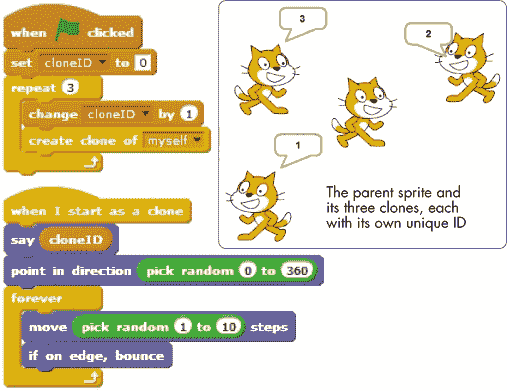图 5-16. 使用变量区分克隆

在这个例子中，父精灵拥有一个名为`cloneID`的变量。当点击绿色旗帜时，它会启动一个循环来创建三个克隆，并在创建克隆之前将`cloneID`设置为不同的值（在这个例子中为 1、2 或 3）。每个克隆都会拥有自己的`cloneID`副本，并初始化为不同的值。你现在可以使用**if**语句块，下一章我们将深入学习它，来检查克隆的 ID，并让它执行相应的操作。

*ClonesAndGlobalVars.sb2*

现在，让我们讨论克隆如何与全局变量互动。回想一下图 5-15，变量的作用范围为“所有精灵”的变量可以被舞台和所有精灵读取和写入，包括克隆。例如，程序图 5-17 就是利用这一点来检测父精灵的所有克隆何时消失。

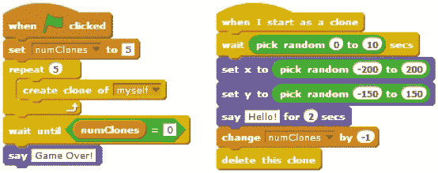图 5-17. 使用全局变量追踪克隆被删除的时刻

在这个脚本中，父精灵将全局变量`numClones`设为 5，并创建了五个克隆。然后，它等待`numClones`变为 0，才宣布游戏结束。这些克隆会在舞台上的随机时间和位置出现，喊一声“Hello!”持续两秒钟，然后消失。在一个克隆被删除之前，它会将`numClones`减去 1。当所有五个克隆消失后，`numClones`变为 0，主脚本停止等待，原始精灵说“Game Over!”。

在接下来的部分中，你将学习变量的监视器，它们让你可以看到甚至更改变量当前存储的值。能够在舞台上查看和更改变量，将为你创建全新的应用程序类型打开大门。

## 显示变量监视器

你经常会发现自己想查看一个变量当前存储的值。例如，当你的某个脚本没有按预期工作时，你可能希望追踪一些变量，看看它们是否正确变化。使用变量监视器可以帮助你完成这个调试任务。

你可以将 Scratch 变量显示为*变量监视器*。选中或取消选中变量名称旁边的框，可以在舞台上显示或隐藏变量的监视器，如图 5-18 所示。你也可以在脚本中使用**show variable**和**hide variable**命令控制监视器的可见性。

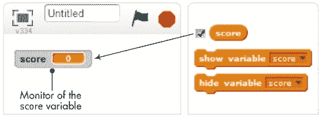图 5-18. 通过勾选名称旁的框来显示变量的监视器。

监视器可以作为输出或控制使用，分别显示或允许你更改变量的内容。双击舞台上的监视器框可以选择常规输出（默认状态）、大输出或滑块控制。当你选择显示滑块时，可以通过右键点击滑块并从弹出菜单中选择设置滑块最小值和最大值选项来设置其范围，如图 5-19 所示。

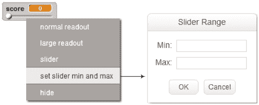图 5-19. 设置滑块模式下监视器的最小值和最大值

*StageColor.sb2*

使用滑块可以在脚本运行时改变变量的值，这是用户与您的应用程序交互的一种便捷方式。您可以在图 5-20 中看到一个使用滑块控制的简单示例。

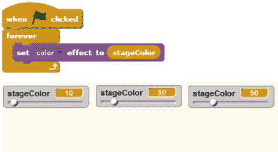图 5-20. 使用滑块调整舞台颜色

在此示例中，拖动滑块的滑块柄会改变`stageColor`变量的值，该变量是**设置颜色效果为**命令中的一个参数。假设此脚本属于舞台，拖动滑块应改变舞台的背景颜色。

### 注意

*一个变量的监视器还表示它的作用范围。如果一个变量属于某个角色，它的监视器应在变量名之前显示角色的名称。例如，监视器**Cat speed 0**表示`speed`属于`Cat`。如果`speed`变量是全局变量，那么它的监视器只会显示**speed 0**。这两种情况的区别如下图所示。*

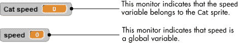

## 在应用程序中使用变量监视器

现在您已经了解了变量监视器的基础，我将向您展示一些使用它们为您的 Scratch 应用程序增加额外功能的方法。

使用显示器作为显示器和控制器的功能为广泛的应用程序开辟了大门，包括游戏、模拟和交互式程序。接下来让我们在以下小节中探索一些利用显示器的例子。

### 模拟欧姆定律

*OhmsLaw.sb2*

我们的第一个示例是欧姆定律的模拟。当电压（*V*）加在电阻（*R*）上时，会有电流（*I*）通过该电阻。根据欧姆定律，电流的大小由以下公式给出：

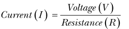

我们的应用程序允许用户使用滑块控制来改变*V*和*R*的值。然后，它会计算并显示相应的电流值*I*。此应用程序的用户界面显示在图 5-21 中。

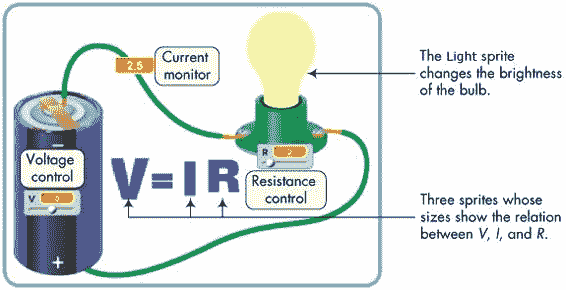图 5-21. 欧姆定律应用的用户界面

电池电压滑动条（*V*）的范围是[0, 10]，而电阻滑动条（*R*）的范围是[1, 10]。当用户通过滑动条改变*V*或*R*时，应用计算电路中流动的电流（*I*）的对应值。灯泡的亮度与通过它的电流值成正比：电流越大，灯泡越亮。图中*V*、*I*和*R*字母的大小也会变化，以表示这些量的相对值。

总的来说，应用有五个角色（命名为`Volt`、`Current`、`Resistance`、`Equal`和`Light`）和三个变量（命名为`V`、`I`和`R`）。你在图 5-21 中看到的其他一切（如电池、电线、插座等）都是舞台背景图的一部分。驱动该应用的主脚本，属于舞台，见图 5-22。

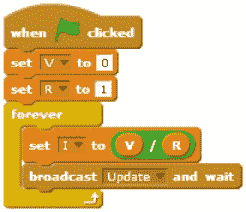图 5-22. 欧姆定律应用的主脚本

脚本初始化了`V`和`R`的值，然后进入一个无限循环。在每次循环中，它使用当前由用户通过滑动条控制设置的`V`和`R`值来计算`I`。然后，它广播一条消息给应用中的其他角色，更新它们根据计算结果的外观。图 5-23 显示了当`Volt`、`Current`、`Resistance`和`Light`角色（分别显示字母*V*、*I*、*R*和灯泡）接收到`Update`消息时的反应。

图 5-23. 响应*`Update`*消息触发的脚本

当接收到`Update`广播时，`Volt`、`Current`和`Resistance`角色根据各自变量的当前值改变大小（从原始大小的 100%到 200%）。`Light`角色执行**设置幽灵效果为**命令，根据`I`的值改变其透明度。这为灯泡提供了一个逼真的视觉效果，模拟了实际的灯泡。

试试看 5-3

打开欧姆定律模拟器运行它，并研究脚本以了解其工作原理。如果你在`Light`角色的脚本末尾添加**改变颜色效果为 25**命令，你认为会发生什么？实施这个更改以检查你的答案。你认为有哪些方法可以增强这个应用？

### 演示串联电路

*SeriesCircuit.sb2*

我们的第二个示例模拟了一个包含电池和三个串联连接的电阻的电路。用户可以通过滑动条改变电池电压以及电阻值。流经电阻的电流和三个电阻两端的电压通过大显示屏显示。你可以在图 5-24 中看到该应用程序的界面。（注意，电阻上的色带并不代表电阻的实际值。）

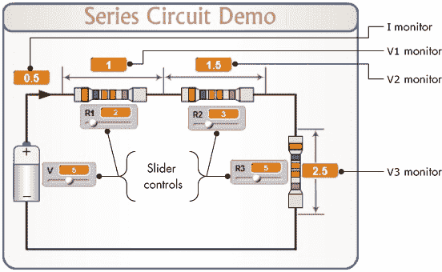图 5-24. 展示串联电路的应用程序

控制该电路操作的方程式如下所示。我们可以通过将电池电压 *V* 除以三者电阻之和来计算电路中的电流。之后，计算每个电阻两端的电压时，使用电流与该电阻值的乘积：

| 总电阻：*R*[tot] = *R*[1] + *R*[2] + *R*[3] |
| --- |
| 电路中的电流：*I* = *V* ÷ *R*[tot] |
| *R*[1] 两端电压：*V*[1] = *I* × *R*[1] |
| *R*[2] 两端电压：*V*[2] = *I* × *R*[2] |
| *R*[3] 两端电压：*V*[3] = *I* × *R*[3] |

该应用程序没有精灵，但当点击绿色旗帜时，舞台上执行的脚本如图 5-25 所示。

这个脚本为我们处理数学运算，并将结果显示在舞台上的显示屏上。注意，虽然电阻 `R2` 和 `R3` 的滑动条可以在 0 到 10 之间变化，但 `R1` 的最小值被故意设置为 1。这确保了 `Rtot` 始终大于 0，避免在计算电流时除以 0。

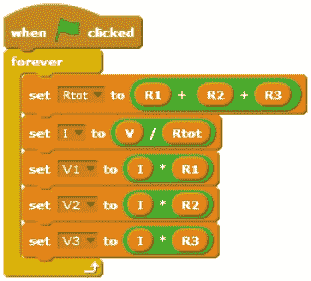图 5-25. 点击绿色旗帜时运行的脚本

这个应用程序的大部分工作集中在设计界面上（即舞台背景）。之后，我们只需将显示器和滑动条放置在舞台上的正确位置。

试试看 5-4

*SeriesCircuitWithSwitch.sb2*

打开串联电路模拟器应用程序并运行。尝试不同的`R1`、`R2`、`R3`和`V`值。当你拖动滑块控制时，观察`V1`、`V2`和`V3`的计算值。电压总和（`V1` + `V2` + `V3`）和电池电压之间有什么关系？这告诉你串联电路中的电压关系是什么？你可以通过添加一个开关图像来进行有趣的增强，该开关能够打开或关闭电路，如下所示。当开关打开时，电路中不会有电流流动。尝试使用下面给出的提示来实现这个更改。

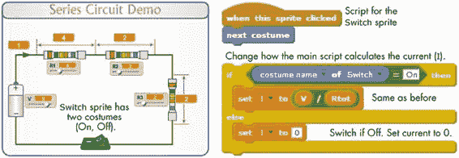

### 可视化球体的体积和表面积

*Sphere.sb2*

我们的第三个示例是一个用于计算球体体积和表面积的互动应用程序。用户通过点击用户界面上的一些按钮来改变球体的直径，应用程序会自动计算并显示相应的体积和表面积。为了使应用程序更具吸引力，显示在舞台上的球体大小也会根据所选的直径按比例变化。该应用程序的用户界面如图 5-26 所示。

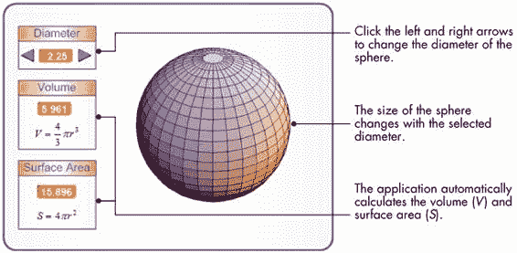图 5-26. 球体应用程序的用户界面

应用程序包含三个精灵：两个箭头按钮（分别命名为`Up`和`Down`）和一个球体图像（命名为`Sphere`）。这两个按钮的脚本会广播消息，指示它们已被点击，如图 5-27 所示。

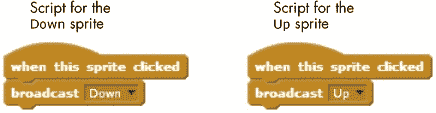图 5-27. *`Up`*和*`Down`*精灵的脚本

`Sphere`精灵有九个服装，分别代表直径为 1、1.25、1.5、1.75、...、3 的球体。当这个精灵接收到`Up`或`Down`广播消息时，它会执行如图 5-28 所示的脚本。

图 5-28. 由*`Up`*和*`Down`*消息触发的脚本

精灵切换其服装，然后调用**重新计算**过程来更新体积和表面积的计算。注意，这些脚本使用当前服装的值来确定球体是否已经达到最大或最小尺寸，从而确保对`上`和`下`按钮的有效响应。我将在下一章详细讲解**if**块，但现在，让我们先讨论球体的**重新计算**过程，如图 5-29 所示。

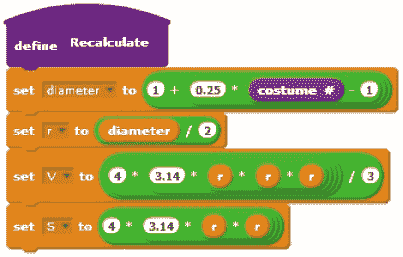图 5-29. *重新计算* 过程

首先，`直径`变量的值根据以下公式设置：

*直径* = 1 + 0.25 × (*服装编号* – 1)

由于服装编号的范围从 1 到 9，`直径`变量的相应值将为 1、1.25、1.50，...、2.75、3，这是我们想要的结果。

该脚本通过将直径除以 2 来找到半径`r`。然后，它使用图 5-26 中显示的公式计算球体的体积和表面积。计算出的值将自动显示在舞台上的相应显示器上。

尝试一下 5-5

打开应用程序并运行它。研究脚本以理解应用程序的工作原理。向`球体`精灵添加脚本，使其在应用程序运行时旋转并改变颜色。作为另一个练习，修改原始程序，使用一个服装来代替`球体`精灵，并使用**改变大小**模块来改变球体的大小。缩放后的图像可能看起来不太好，但除此之外，应用程序的功能应该完全相同。

### 绘制 n 叶玫瑰

*N-LeavedRose.sb2*

在这个例子中，我们将创建一个在舞台上绘制具有多个叶片的玫瑰的应用程序。绘制玫瑰的过程可以分解为以下步骤：

1.  从舞台的原点开始。

1.  将精灵指向某个方向。按照惯例，希腊字母θ（发音为*theta*）表示一个角度，因此我们将精灵方向的变量命名为`theta`。

1.  移动精灵`r`步并在舞台上绘制一个点。之后，抬起画笔并返回原点。

1.  按一定的角度`theta`（我们使用 1°）进行变化，并重复步骤 2-4。

    距离`r`和角度`theta`之间的关系由以下公式给出：

    *r* = *a* × cos(*n* × θ)

其中*a*是一个实数，*n*是一个整数。这个方程生成一个玫瑰，其大小和叶子数量分别由`a`和`n`控制。该方程还涉及余弦三角函数（*cos*），你可以在*Operators*调色板中找到它作为一个报告块（检查**sqrt**块）。给定`a`和`n`的值，我们只需要为`theta`选择不同的值，计算出相应的`r`值，并在舞台上标出结果点。这个示例的用户界面如图 5-30 所示。

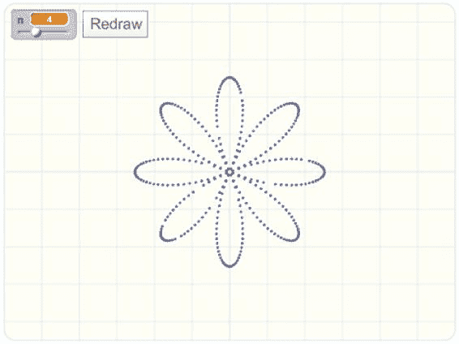图 5-30. *n*叶玫瑰应用的用户界面

该应用程序包含两个角色：第一个角色具有`Redraw`按钮服装，第二个角色（名为`Painter`）是一个隐藏的角色，用于绘制玫瑰。用户通过滑块控制器调整`n`值来设定所需的叶子数量，然后点击`Redraw`按钮来绘制玫瑰。当用户点击该按钮时，按钮角色仅广播一个`Redraw`消息。当`Painter`角色接收到该消息时，它将执行图 5-31 中显示的脚本。

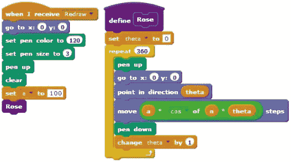图 5-31. 在舞台上绘制带有*n*个叶子的玫瑰的*Redraw*程序

脚本首先设置笔的颜色和大小，并清除舞台上先前的笔迹。然后，它将变量`a`设置为 100，并调用**Rose**程序，该程序将通过一个循环执行 360 次，在舞台上绘制玫瑰。在每次循环中，程序指向`theta`方向，移动`r`步，并在该位置绘制笔迹。接着，它将`theta`增加 1°，为下一次**repeat**循环做好准备。

图 5-32 展示了为不同`n`值创建的一些玫瑰。你能找出`n`值与叶子数量之间的关系吗？

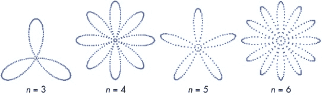图 5-32. 由*Rose*程序创建的一些玫瑰 尝试 5-6

打开应用程序并运行。更改`n`的值，看看你能用**玫瑰**程序创造出什么。向应用程序添加另一个滑块，以便用户可以更改`a`的值并根据需要修改脚本。你还可以修改**玫瑰**程序，将`a`作为参数传递。（请参阅传递参数给自定义模块，复习如何向程序添加参数。）

### 模拟向日葵种子分布

*Sunflower.sb2*

生物学家和数学家已广泛研究植物茎部叶子的排列方式。让我们通过研究一种几何模型来探讨一下植物学，看看如何用螺旋种子模式表示花朵。特别地，我们将编写两个方程来模拟向日葵种子的分布。为了绘制向日葵的第*n*颗种子，我们将遵循以下步骤：

1.  将精灵朝* n * × 137.5°的方向指向。

1.  移动一个距离 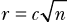，其中*c*是常数缩放因子（在我们的示例中设置为 5）。

1.  在舞台的最终位置绘制一个点。

我们将为每颗要绘制的种子重复这些步骤。对于第一颗种子，我们设置*n* = 1；对于第二颗种子，我们设置*n* = 2；依此类推。如果第一步使用与 137.5°不同的角度，将会得到不同的种子排列。如果你对这些方程感兴趣并想了解更多向日葵种子模式的内容，可以参考 Przemyslaw Prusinkiewicz 和 Aristid Lindenmayer 的《植物的算法美学》（Springer-Verlag, 2004），特别是第四章，你可以在书籍的官方网站上找到它，* [`algorithmicbotany.org/papers/#abop`](http://algorithmicbotany.org/papers/#abop)*。

我们的应用程序将生成类似于该研究中描述的模式，您可以在图 5-33 中看到其中的一些模式。

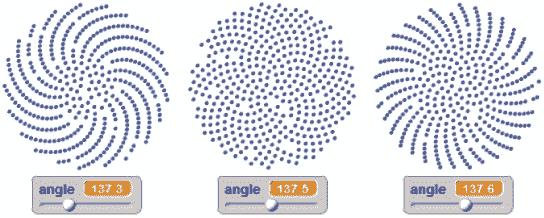图 5-33. 使用不同角度生成的向日葵模式

这个示例的界面包含一个滑块控件，可以将角度的值从 137°更改为 138°，并且每次增量为 0.01°，同时有一个标记为`Redraw`的按钮。当用户点击该按钮时，它会向`Painter`精灵广播消息，精灵会执行图 5-34 中显示的脚本。

**Sunflower**过程执行一个循环，绘制 420 个种子，虽然你可以根据需要更改这个数字。在每次循环迭代中，过程会计算种子角度①，移动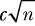②步长，然后在该位置绘制一个笔迹。接着，过程递增`n`，表示种子编号，为绘制下一个种子做准备。

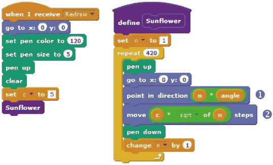图 5-34. *`Painter`*精灵的脚本

我在本节中展示的脚本只是通过使用变量和监视器所能创建的一些惊人应用的示例。通过滑块控件让用户与我们的应用程序进行交互，只是互动应用程序新型发展的起点。在接下来的章节中，你将学习如何创建直接提示用户输入的脚本。

尝试操作 5-7

打开应用程序并运行它。更改角度的值，看看你还能用**Sunflower**过程创建什么。研究这个过程，理解它是如何工作的，然后想出一些方法来增强它。

## 从用户获取输入

*GettingUserInput.sb2*

假设你想创建一个教孩子们基础算术的游戏。你的游戏可能会有一个精灵，显示一个加法题目并要求玩家输入答案。你如何读取玩家的输入，以查看答案是否正确？

Scratch 的*Sensing*调色板提供了一个命令块，**ask and wait**，你可以用它来读取用户输入。这个命令块接受一个参数，指定一个字符串，通常是一个问题，以便展示给用户。如图 5-35 所示，执行该命令块时，输出会根据精灵的可见状态（即精灵是显示还是隐藏）有所不同。在图 5-35（右）中显示的输出，执行来自舞台脚本的**ask and wait**命令时也会出现。

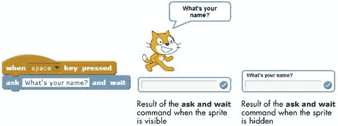图 5-35. *ask and wait*命令块的输出可能会根据执行它的精灵是否显示而有所不同。

在执行**ask and wait**命令后，调用脚本会等待用户按下 ENTER 键或点击输入框右侧的勾选框。当发生此操作时，Scratch 会将用户的输入存储在**answer**块中，并在**ask and wait**块后面的命令中继续执行。为了看到这个命令块的实际操作，看看以下示例，说明如何使用它。

### 读取一个数字

*AskAndWait.sb2*

图 5-36 中的脚本会询问用户她的年龄，等待答案，并告诉用户她 10 年后会几岁。

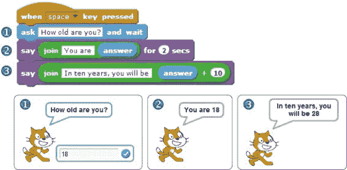图 5-36. 一个接受用户年龄输入的脚本

该图展示了当用户输入`18`并按下键盘上的 ENTER 键时程序的输出。注意，程序使用了**join**块（来自*运算符*调色板）来连接（即拼接）两个字符串。

### 读取字符

*AskAndWait2.sb2*

图 5-37 中的脚本会询问用户他的姓名首字母，然后根据用户的回答构造并显示问候语。

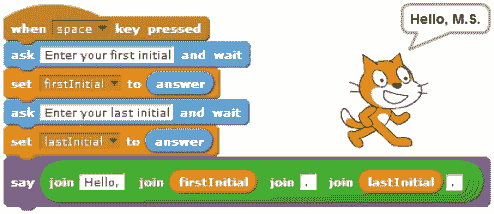图 5-37. 一个使用两个变量读取并存储用户姓名首字母的脚本

该程序使用两个变量（`firstInitial` 和 `lastInitial`）来保存用户输入的值。当用户分别在两个提示框中输入字母`M`和`S`时，你可以看到程序的最终输出。注意，程序使用了嵌套的**join**块来构造问候语。你可以使用这种技术在应用程序中创建各种字符串，并显示定制的消息。

### 执行算术操作

*AskAndWait3.sb2*

图 5-38 中的脚本会要求用户输入两个数字。然后，它计算这两个数字的乘积，并使用**say**命令在语音气泡中显示答案。与之前的示例一样，脚本使用了两个变量（`num1`和`num2`）来存储用户输入的值。

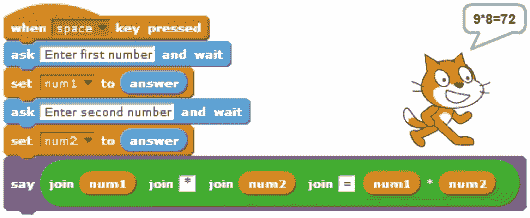图 5-38. 根据用户输入计算一个值

该图展示了当用户分别输入 9 和 8 作为对两个提示的回应时程序的输出。同样，注意我将**join**块嵌套在一起，用来构造输出字符串。

我在本节中展示的例子展示了几种使用**询问并等待**块来编写接受用户输入并解决各种问题的脚本。例如，你可以编写一个程序，求解形如 *ax*² + *bx* + *c* = 0 的二次方程的根，其中 *a*、*b* 和 *c* 的值由用户输入。然后，你可以使用这个程序检查你自己对方程的答案。我希望这能给你一些启示，告诉你如何使用这个强大的块来解决可能出现的任何数学问题。

## 摘要

变量是编程中最重要的概念之一。变量是计算机内存中存储单一值（如数字或字符串）的区域的名称。

在本章中，你学习了 Scratch 支持的基本数据类型以及对这些类型进行的操作。接着，你学习了如何创建变量并使用它们存储数据。

你还实现了几个实际应用，利用变量展示不同的功能。你探索了变量的监视器，并用它们创建了不同类型的互动程序。最后，你学会了如何使用**询问并等待**块来提示用户输入并在程序中处理用户的响应。

在下一章中，你将了解更多关于布尔数据类型的知识，以及它在决策中的基本作用。你还将学习**if**和**if/else**块，并使用它们为你的 Scratch 程序增加更高层次的智能。所以，卷起袖子，准备迎接另一个激动人心的章节吧！

## 问题

| **问:** | 1\. 创建一个实现以下指令的脚本：

+   将 `speed` 变量设置为 60（英里/小时）。

+   将 `time` 变量设置为 2.5（小时）。

+   计算行驶的距离并将答案保存在 `distance` 变量中。

+   向用户显示计算出的距离，并附上适当的消息。

|

| **问:** | 2\. 以下每个脚本的输出是什么？复制这些脚本并运行它们以测试你的答案。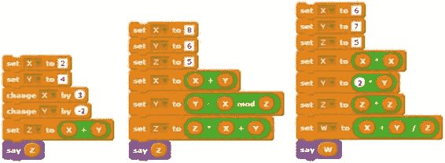 |
| --- | --- |
| **问:** | 3\. 在右侧脚本的重复循环的每次迭代结束时，`X` 和 `Y` 的值分别是多少？复制脚本并运行以检查你的答案。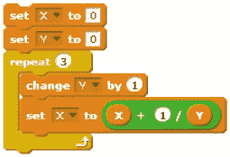 |

| **问:** | 4\. 设 *x* 和 *y* 为两个变量。创建与以下语句等效的功能块：

+   将 5 加到 *x* 并将结果存储在 *y* 中。

+   将 *x* 乘以 3，并将结果存储在 *y* 中。

+   将 *x* 除以 10，并将结果存储在 *y* 中。

+   从 *x* 中减去 4，并将结果存储在 *y* 中。

+   将 *x* 平方，结果加上 *y*，并将结果存储回 *x* 中。

+   将 *x* 设置为 *y* 的两倍加上 *y* 的立方的三倍。

+   将 *x* 设置为 - *y* 的平方。

+   将 *x* 设置为 *x* 和 *y* 之和除以 *x* 和 *y* 的积的结果。

|

| **问：** | 5\. 编写一个程序，要求用户输入一个冠词、一个名词和一个动词。程序将根据输入的内容创建一个句子，形式为 *冠词 名词 动词*。 |
| --- | --- |
| **问：** | 6\. 编写一个程序，要求用户输入一个摄氏度的温度。程序将把该温度转换为华氏度，并以适当的消息将结果显示给用户。（提示：*F°* = (1.8 × *C°*) + 32。） |
| **问：** | 7\. 当电流 *I* 流过电阻 *R* 时，电阻耗散的功率 *P* 为 *I* ² *× R*。编写一个程序，读取 *I* 和 *R* 并计算 *P*。 |
| **问：** | 8\. 编写一个程序，读取直角三角形两边的长度，并计算斜边的长度。 |
| **问：** | 9\. 编写一个程序，提示用户输入一个盒子的长度（*L*）、宽度（*W*）和高度（*H*）。程序将计算并显示该盒子的体积和表面积。（提示：*体积 = L × W × H*；*表面积 =* 2*×*[(*L × W*) *+* (*L × H*) *+* (*H × W*)]。） |
| **问：** | 10\. 三个电阻（*R*[1]、*R*[2] 和 *R*[3]）并联时的等效电阻 *R* 可通过以下公式计算：1/*R* = 1/*R*[1] *+* 1/*R*[2] *+* 1/*R*[3]。编写一个程序，读取 *R*[1]、*R*[2] 和 *R*[3]* 的值，并计算 *R*。 |
| **问：** | 11\. 完成本章前面介绍的打地鼠游戏。文件 *Whac-a-Mole.sb2* 包含此程序的部分实现。当点击绿色旗帜时，提供的脚本会启动一个循环，随机移动 `Cat` 精灵到各个洞口。为 `Cat` 和舞台（Stage）分别添加两个脚本，以适当改变两个变量（`hits` 和 `misses`）的值。你还可以尝试添加一些音效，使游戏更有趣！此外，可以增加一个条件，当计时器到达或失误次数达到一定值时结束游戏。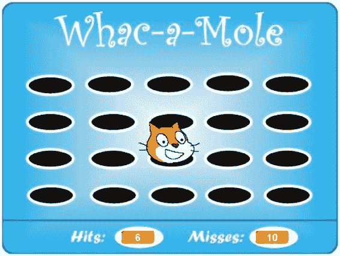 |
