## 第六章：做出决策

本章将教你使用 Scratch 工具编写程序，这些程序能够比较值、评估逻辑表达式，并根据结果做出决策。我们还将通过几个有用的示例应用来帮助理解。以下是你将在过程中学习的内容：

+   基本问题解决技巧

+   如何使用 **if** 和 **if/else** 块在多个备选操作中做出选择

+   如何构建逻辑表达式以评估给定条件

+   分支语句中的控制流

到目前为止，我们编写的程序遵循简单的执行模型。它们从第一条指令开始，执行该指令，接着执行下一条指令，一直到程序结束。这些程序的命令块按顺序执行，不会跳过或跳转。

然而，在许多编程场景中，你可能希望改变这种顺序执行的程序流程。如果你正在编写一个应用程序来辅导孩子们学习基础算术，你可能希望执行某些代码块来奖励正确答案，并为错误答案执行完全不同的一组代码块（例如，揭示正确答案或提供另一机会）。你的脚本可以通过将学生的输入与正确答案进行比较来决定接下来该做什么。这就是所有决策任务的基础。

在本章中，我们将探讨 Scratch 中的决策命令，并编写几个使用这些命令来测试输入并执行不同操作的程序。

首先，我将向你介绍 Scratch 的比较运算符，并展示如何用它们来比较数字、字母和字符串。接着，我会介绍 **if** 和 **if/else** 块，并解释它们在决策中的关键作用。你还将学习如何使用嵌套的 **if** 和 **if/else** 块测试多个条件，并编写一个基于菜单的程序来实现这些块的功能。之后，我将介绍逻辑运算符，作为测试多个条件的另一种方式。在最后一部分，我们将编写几个有趣的程序，基于你到目前为止所学的所有概念。

## 比较运算符

你每天都会做出决策，每个决策通常都会引导你执行某些操作。例如，你可能会想，“如果那辆车的价格低于 2000 美元，我就买它。”然后你会询问这辆车的价格，决定是否购买它。

你也可以在 Scratch 中做出决策。通过使用*比较运算符*，你可以比较两个变量或表达式的值，判断一个是否大于、少于或等于另一个。比较运算符也叫做*关系运算符*，因为它们测试两个值之间的关系。Scratch 支持的三个关系运算符见于表 6-1。

表 6-1. Scratch 中的关系运算符

| 运算符 | 含义 | 示例 |
| --- | --- | --- |
|  | 大于 | `price`是否大于 2000？ |
|  | 小于 | `price`是否小于 2000？ |
|  | 等于 | `price`是否等于 2000？ |

现实世界中的布尔值

*布尔*这个词源于 19 世纪英国数学家乔治·布尔，他发明了一种基于两个值：1 和 0（或真与假）的逻辑系统。布尔代数最终成为现代计算机科学的基础。

在现实生活中，我们经常使用布尔表达式来做出决策。计算机也用它们来确定程序执行的分支。机器人臂可能被编程用于检查流水线上的移动零件，并在`goodQuality = true`时将每个零件移动到 Bin 1，或者在`goodQuality = false`时将其移动到 Bin 2。家庭安全系统通常会被编程为在输入错误密码时发出警报（`correctCode = false`），或者在输入正确密码时停用警报（`correctCode = true`）。当你在百货商店刷卡时，远程服务器可能根据你的卡是否有效（`true`）或无效（`false`）来决定是否授予或拒绝访问。你车上的一台计算机会在发生碰撞时自动弹出安全气囊（`collision = true`）。当手机电池电量低时，可能会显示警告图标（`batteryLow = true`），当电池电量正常时，移除该图标（`batteryLow = false`）。

这些只是计算机通过检查布尔条件结果来触发不同动作的几个例子。

请注意，表 6-1 中的所有块都是六边形形状。正如你可能还记得的第五章，这意味着评估这些块的结果是一个*布尔*值，可以是“真”或“假”。因此，这些表达式也被称为*布尔表达式*。

例如，表达式**price < 2000**测试变量`price`的值是否小于 2000。如果`price`小于 2000，块将返回（或计算为）真；否则，返回假。你可以使用这个表达式构建决策条件：“如果(**price < 2000**)，则购买汽车。”

在我们查看**if**块之前，先来看一个简单的例子，说明布尔表达式是如何在 Scratch 中被评估的。

### 评估布尔表达式

假设我们设置了两个变量，`x` 和 `y`，如下所示：`x = 5`，`y = 10`。表 6-2 展示了一些使用 Scratch 关系块的例子。

这些例子揭示了关于关系运算符的几个重要点。首先，我们可以使用它们来比较单个变量（如 `x`、`y`）和完整的表达式（如 `2 * x` 和 `x + 6`）。其次，比较的结果总是 true 或 false（即布尔值）。第三，**x = y** 块并不意味着“将 `x` 设置为 `y`”。它是在问：“`x` 是否等于 `y`？”因此，当执行语句 **set z to (x = y)** 时，`x` 的值仍然是 5。

表 6-2. 关系运算块示例

| 语句 | 含义 | z（输出） | 解释 |
| --- | --- | --- | --- |
|  | `z = is(5 < 10)?` | `z = true` | 因为 5 小于 10 |
|  | `z = is(5 > 10)?` | `z = false` | 因为 5 不大于 10 |
|  | `z = is(5 = 10)?` | `z = false` | 因为 5 不等于 10 |
|  | `z = is(10 > 2*5)?` | `z = false` | 因为 10 不大于 10 |
|  | `z = is(5 = 5)?` | `z = true` | 因为 5 等于 5 |
|  | `z = is(10 < 5 + 6)?` | `z = true` | 因为 10 小于 11 |

### 比较字母和字符串

假设我们玩一个游戏，玩家需要猜一个从 *A* 到 *Z* 的单个字母的秘密代码。游戏会读取玩家的猜测，将其与秘密代码进行比较，并根据字母的字母顺序指导玩家调整猜测。如果秘密字母是 *G*，而玩家输入了 *B*，游戏应该会告诉玩家类似“在 B 之后”的提示，表示秘密代码在字母 *B* 后面。我们如何比较正确的字母和玩家的输入，来决定显示什么消息呢？

幸运的是，Scratch 中的关系运算符也可以用来比较字母。如图 6-1 所示，Scratch 会根据字母的字母顺序来比较字母。因为字母 *A* 在字母表中排在字母 *B* 之前，所以表达式 **A < B** 会返回 true。然而，需要注意的是，这些比较不区分大小写；大写字母 *A* 和小写字母 *a* 被视为相同。因此，表达式 **A = a** 也会返回 true。

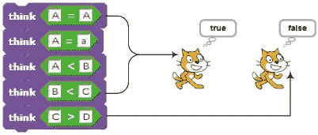图 6-1. 使用关系运算符比较字母

知道这些信息后，你可以使用以下条件语句来测试玩家的猜测：

```
IF (answer = secretCode), then say Correct
IF (answer > secretCode), then say Before <answer>
IF (answer < secretCode), then say After <answer>
```

*条件语句*是一种形式为“如果条件为真，则执行此操作”的语句。在下一节中，我将教你如何在 Scratch 中实现条件语句，但我们先通过猜字游戏进一步探讨关系运算符。

如果密钥包含多个字母怎么办？例如，玩家可能需要猜测一种动物的名称。你仍然可以使用 Scratch 的关系运算符进行比较吗？幸运的是，简短的回答是肯定的：你可以使用 Scratch 的关系运算符比较字符串。那么，Scratch 如何处理像**elephant > mouse**这样的比较呢？图 6-2 中的示例说明了比较字符串的结果。

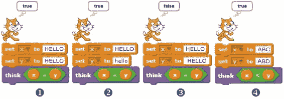图 6-2. 使用关系运算符比较 ① 完全相同的字符串，② 仅在大小写上不同的字符串，③ 一个字符串与另一个包含多余空格的字符串，④ 根据字母的字典顺序变化的字符串

细致研究图 6-2 显示了以下内容：

+   Scratch 在比较字符串时不区分大小写。例如，在②中，字符串“HELLO”和“hello”被认为是相等的。

+   Scratch 在比较中会计算空格。字符串“HELLO”前后各有一个空格，它与字符串“HELLO”③不同。

+   在比较字符串“ABC”和“ABD”时，如④所示，Scratch 首先比较两字符串的第一个字符。由于它们相同（此例中为字母*A*），Scratch 会继续检查两字符串的第二个字符。由于这个字符在两个字符串中也是相同的，Scratch 会继续检查第三个字符。由于字母*C*小于字母*D*（即*C*在字母表中排在*D*前面），因此 Scratch 认为第一个字符串小于第二个字符串。

了解这一点后，你就不会感到惊讶，当表达式 **elephant > mouse** 计算结果为假时，即使真正的象比老鼠大得多。根据 Scratch 的字符串比较规则，字符串“elephant”小于字符串“mouse”，因为字母 *e*（elephant 中的第一个字母）在字母 *m*（mouse 中的第一个字母）之前出现在字母表中。

基于字符的字母顺序对字符串进行比较和排序，广泛应用于许多现实生活中的场景，包括排序目录列表、书架上的书籍、字典中的单词等等。在字典中，单词 *elephant* 排在单词 *mouse* 之前，而 Scratch 中的字符串比较也根据这一顺序给出答案。

现在你已经了解了什么是关系运算符以及 Scratch 如何使用这些运算符来比较数字和字符串，接下来是时候学习条件块了。

## 决策结构

Scratch 的 *控制* 调色板包含两个块，它们允许你在程序中做出决策并控制操作：**if** 块和 **if/else** 块。通过使用这些块，你可以提出一个问题，并根据答案采取行动。在这一部分，我们将详细讨论这两个块，谈论标志，并学习如何使用嵌套的 **if** 块来测试多个条件。接下来，我将介绍基于菜单的应用程序，并解释嵌套的 **if** 块如何帮助实现这些应用程序。

### if 块

**if** 块是一个决策结构，它使你能够根据测试条件的结果来指定一组命令是否（或是否不）应执行。**if** 块的结构及其对应的流程图如 图 6-3 所示。

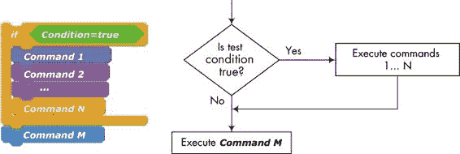图 6-3. *if* 块的结构

在 图 6-3 中，菱形表示一个决策块，它对一个问题给出“是/否”（或“真/假”）的回答。如果 **if** 块的 *头部* 中的测试条件为真，程序会执行 *正文* 中列出的命令，然后再执行 **if** 块后面的命令（图中的 ***Command M***）。如果测试条件为假，程序会跳过这些命令，直接跳到 ***Command M***。

要查看 **if** 块的实际应用，请创建并运行 图 6-4 中显示的脚本。该脚本运行一个 **forever** 循环，移动一个精灵在舞台上，改变其颜色，并使其反弹舞台的边缘。

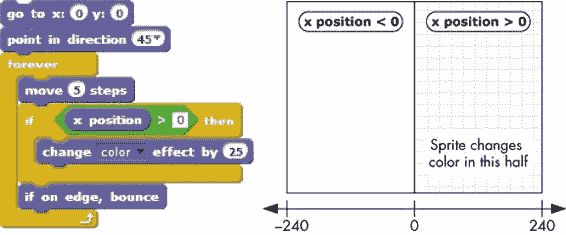图 6-4. 此脚本仅在精灵移动到舞台的右半部分时才会改变颜色。

我们脚本中的**forever**循环包含一个**if**块，在每次**move**命令后检查精灵的*x*位置。如果*x*位置大于零，精灵应改变其颜色。运行此脚本时，你会发现精灵只有在移动到舞台的右半部分时才会改变颜色。这是因为**change color effect by 25**块仅在**x position > 0**条件为真时才会执行。

### 使用变量作为标志

假设你正在开发一款太空冒险游戏，目标是摧毁一支正在攻击的战舰舰队。玩家扮演舰长，使用键盘上的箭头键操作星际飞船，并通过按空格键发射导弹。如果玩家的星际飞船被敌方攻击命中一定次数，飞船将失去攻击能力。这时，按空格键将不再发射导弹，舰长必须采用防御策略来避免再受攻击。显然，当按下空格键时，程序需要检查星际飞船攻击系统的状态，以决定玩家是否能继续发射。

这种类型的检查通常使用*标志*来执行，标志是用于表示是否发生了某个感兴趣事件的变量。你可以使用任何两个值来描述事件的状态，但常见做法是使用 0（或 false）表示事件未发生，使用 1（或 true）表示事件已发生。

在你的太空射击游戏中，可以使用一个名为`canFire`的标志来表示星际飞船的状态。值为 1 表示星际飞船可以发射导弹，值为 0 表示不能。基于此，空格键事件处理程序的代码可能如下所示，如图 6-5 所示。

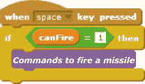图 6-5. 使用标志进行条件执行

在游戏开始时，你会将`canFire`标志的值初始化为 1，以表示星际飞船可以发射导弹。当星际飞船被敌人攻击命中一定次数后，你会将`canFire`标志设置为 0，表示攻击系统已经失效；此时，按下空格键将不再发射导弹。

尽管你可以根据需要给标志命名，但我建议使用能反映其真/假性质的名称。表 6-3 展示了一些你可能在太空射击游戏中使用的标志示例。

表 6-3. 使用标志的示例

| 示例 | 意图和可能的行动方案 |
| --- | --- |
|  | 游戏尚未开始。忽略所有键盘输入。 |
|  | 游戏已开始。开始处理用户输入。 |
|  | 游戏尚未结束。显示剩余时间。 |
|  | 游戏结束。隐藏剩余时间显示。 |
|  | 星际飞船没有被敌方火力击中。警报关闭。 |
|  | 星际飞船被导弹击中。播放警报声。 |

现在你已经知道如何使用**if**块和标志，接下来我们来讨论另一个条件块，它可以让你在某个条件为真时执行一段代码，而当条件为假时执行另一段代码。

### if/else 块

假设你正在创建一个游戏，用于教小学学生基础数学。游戏会呈现一个加法问题，然后要求学生输入答案。学生答对了会得一分，答错了则扣一分。你可以使用两个**if**语句来完成这个任务：

```
If the answer is correct, add one point to score
If the answer is incorrect, subtract one point from score
```

你也可以通过将两个**if**语句合并为一个**if/else**语句来简化逻辑，从而提高代码效率，代码如下：

```
If the answer is correct
    add one point to score
Else
    subtract one point from score
```

指定的条件会被测试。如果条件为真，**if**部分的命令将会执行；但如果条件为假，**else**部分的命令则会执行。程序只会执行**if/else**块中的其中一组命令。这些替代路径也被称为*分支*。**if/else**块的结构及其相应的流程图见图 6-6。

图 6-6。*if/else* 块的结构

当你想决定午餐吃什么时，可能会使用**if/else**结构。如果你有足够的钱，你会去一家高级餐厅；否则，你会选择更随意的食物。我们可以将你钱包里的钱叫做`availableCash`。当你打开钱包时，你就在检查条件**availableCash > $20**。如果结果为真（你有超过 20 美元），你会去白桌布的餐厅；如果不为真，你就会去附近的汉堡店。

图 6-7 中显示了一个简单的脚本，演示了如何使用 **if/else** 语句块。这个例子使用了 *取模运算符*（**mod**），它返回除法操作的余数，用于判断用户输入的数字是偶数还是奇数。（记住，偶数在除以二时余数为零。）

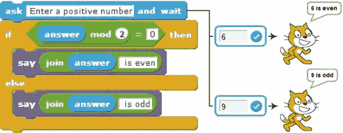图 6-7. 这个脚本用于判断用户输入的数字是偶数还是奇数。

图 6-7 展示了用户分别输入 `6` 和 `9` 后的两种示例输出。你能解释一下这个脚本是如何工作的吗？

### 嵌套的 if 和 if/else 语句块

如果你想在执行操作前测试多个条件，可以将多个 **if**（或 **if/else**）语句块嵌套在一起，执行所需的测试。例如，考虑图 6-8 中显示的脚本，该脚本用于确定一个学生是否应该获得奖学金。要符合条件，学生必须具备：(1) 平均成绩（GPA）高于 3.8 和 (2) 数学成绩高于 92 分。

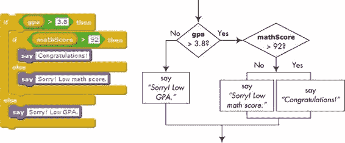图 6-8. 你可以使用嵌套的 *if/else* 语句块来测试多个条件。

首先，测试表达式 **gpa > 3.8**。如果这个表达式为假，那么我们不需要检查其他条件，因为学生不符合奖学金的标准。如果表达式 **gpa > 3.8** 为真，则需要测试第二个条件。这通过嵌套的 **if/else** 语句块来完成，后者测试条件 **mathScore > 92**。如果第二个条件也为真，学生将获得奖学金。否则，学生不符合资格，并且会显示一个解释原因的相应消息。

### 菜单驱动程序

*AreaCalculator.sb2*

接下来，我们将探讨嵌套 **if** 语句块的典型用法。特别是，你将学习如何编写程序，向用户提供选择，并根据用户的选择采取行动。

当你启动某些程序时，它们会显示一个可用选项的列表（或菜单），并等待你做出选择。有时，你需要通过输入与期望选项对应的数字来与这些程序交互。这些程序可能使用一系列嵌套的**if/else**语句块来确定用户的选择并采取相应的行动。为了了解嵌套的**if/else**语句块是如何工作的，我们将讨论一个应用程序，如图 6-9 所示，它计算不同几何形状的面积。

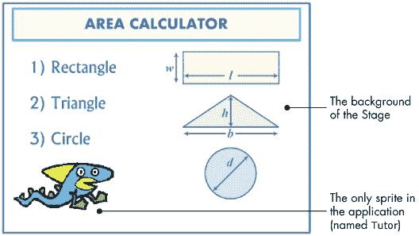图 6-9. 区域计算器程序的用户界面

该应用程序的用户界面包含舞台的背景图像，显示可用选项（数字 1、2 或 3），以及`Tutor`精灵，它会询问用户选择，执行计算并显示结果。主脚本，如图 6-10 所示，在点击绿色旗帜图标时启动。

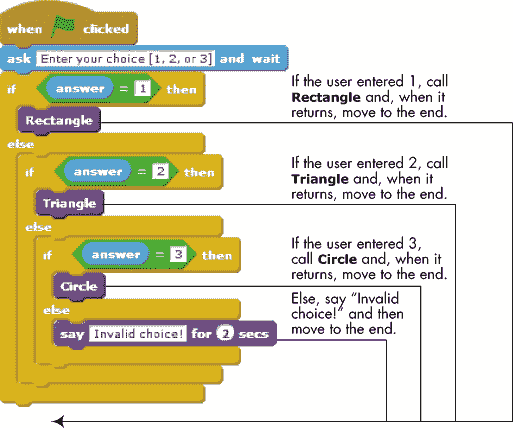图 6-10. *`Tutor`* 精灵的主脚本

在询问用户输入选择后，`Tutor`精灵等待用户的输入，并使用三个**if/else**语句块来处理它。如果用户输入了有效的选择（即 1、2 或 3），脚本会调用相应的过程来计算所选形状的面积。否则，脚本会调用**say**命令告知用户所输入的选择无效。计算三种形状面积的过程如图 6-11 所示。

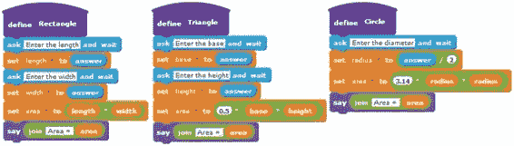图 6-11. 区域计算器程序的过程

每个过程都会要求用户输入对应形状的尺寸，计算面积，并显示结果。例如，**矩形**过程会要求用户输入矩形的长度和宽度，并将答案分别保存在`length`和`width`变量中。然后通过将长度乘以宽度来计算面积，并显示答案。其他两个过程的工作原理类似。

## 逻辑运算符

在前一节中，你学会了如何使用嵌套的**if**和**if/else**块来测试多个条件，但你也可以通过*逻辑运算符*来实现这一点。使用逻辑运算符，你可以将两个或更多的关系表达式结合起来，得到一个单一的真/假结果。例如，逻辑表达式`(x > 5) and (x < 10)`由两个逻辑表达式（`x > 5`和`x < 10`）组成，它们通过逻辑运算符**and**结合。我们可以将`x > 5`和`x < 10`视为**and**运算符的两个操作数；只有当两个操作数都为真时，这个运算符的结果才为真。表 6-4 列出了 Scratch 中可用的三种逻辑运算符，并简要解释了它们的含义。

表 6-4. 逻辑运算符

| 运算符 | 含义 |
| --- | --- |
|  | 仅当两个表达式都为真时，结果为真。 |
|  | 如果两个表达式中的任意一个为真，结果为真。 |
|  | 如果表达式为假，结果为真。 |

现在你已经看过每个运算符的简要概述，我们将逐一详细探讨它们的工作原理。

### and 运算符

**and**运算符接受两个表达式作为参数。如果两个表达式都为真，**and**运算符返回真；否则返回假。**and**的真值表，列出了所有可能输入组合下该运算符的输出，如表 6-5 所示。

表 6-5. and 运算符的真值表

| X | Y |  |
| --- | --- | --- |
| true | true | true |
| true | false | false |
| false | true | false |
| false | false | false |

作为使用**and**运算符的示例，假设我们正在制作一个游戏，在第一关当玩家得分达到 100 时，会获得 200 分的奖励积分。游戏关卡由一个名为`level`的变量跟踪，得分由一个名为`score`的变量跟踪。图 6-12 展示了如何通过嵌套的**if**块①或**and**运算符②来测试这些条件。

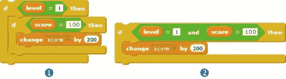图 6-12. 使用嵌套*if*块和*and*运算符检查多个条件

在这两种情况下，只有当两个条件都为真时，才会添加奖励积分。如你所见，**and**运算符提供了一种更简洁的方式来执行相同的测试。图 6-12 中的**if**语句块②只有在`level`等于 1 且`score`等于 100 时才会执行。如果其中一个条件为假，整个测试结果将为假，**将分数增加 200**语句块将不会执行。

### 或运算符

**or**运算符还接受两个表达式作为参数。如果任一表达式为真，**or**运算符返回真。只有当两个表达式都为假时，它才返回假。**or**运算符的真值表见表 6-6。

表 6-6. or 运算符的真值表

| X | Y |  |
| --- | --- | --- |
| true | true | true |
| true | false | true |
| false | true | true |
| false | false | false |

为了演示**or**运算符的使用，假设某款游戏的玩家在有限的时间内需要到达下一关卡。玩家还从一定量的能量开始，这些能量在玩家通过当前关卡时会逐渐消耗。如果玩家未能在允许的时间内到达下一关卡，或者在到达下一关卡之前消耗了所有分配的能量，游戏就结束。剩余时间由名为`timeLeft`的变量追踪，玩家当前的能量水平由名为`energyLevel`的变量追踪。图 6-13 显示了如何使用嵌套的**if/else**语句块①和**or**运算符②来测试游戏结束的条件。

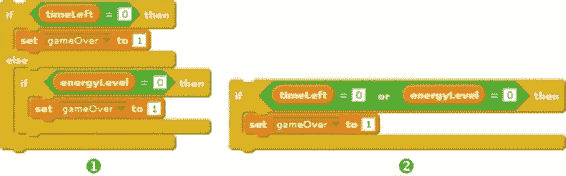图 6-13. 使用嵌套的*if*语句块和*or*运算符检查多个条件

请再次注意，**or**运算符提供了一种更简洁的方式来测试多个条件。图 6-13 中的**if**语句块②将在`timeLeft`或`energyLevel`为 0 时执行。如果这两个条件都为假，整个测试结果将为假，`gameOver`标志将不会被设置为 1。

### 非运算符

**not**运算符只接受一个表达式作为输入。如果该表达式为假，运算符的结果为真；如果表达式为真，结果为假。此运算符的真值表可见于表 6-7。

表 6-7. not 运算符的真值表

| X |  |
| --- | --- |
| 正确 | 错误 |
| 错误 | 正确 |

回到我们之前假设的游戏场景，假设玩家如果分数未超过 100 分就无法进入下一关。这时使用**not**运算符是一个不错的选择，如图 6-14 所示。你可以这样理解这段代码：“如果分数不大于 100，执行**if**块中的命令。”

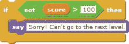图 6-14. 使用*`not`* 运算符的示例

实际上，如果`score`变量的值为 100 或更低，测试表达式的结果为真，**say**命令将会执行。注意，表达式**not (score > 100)** 等价于 **(score ≤ 100)**。

### 使用逻辑运算符检查数值范围

当你需要验证用户输入的数据或筛选掉无效输入时，可以使用逻辑运算符来判断一个数字是否在数值范围内（或外）。表 6-8 展示了一些数值范围的例子。

表 6-8. 表达数值范围

| 表达式 | 值 |
| --- | --- |
| **(x > 10) and (x < 20)** | 如果**x**的值大于 10 且小于 20，结果为真。 |
| **(x < 10) or (x > 20)** | 如果**x**的值小于 10 或大于 20，结果为真。 |
| **(x < 10) and (x > 20)** | 总是错误的。**x** `不能`同时小于 10 又大于 20。 |

尽管 Scratch 没有内建支持`≥`（大于或等于）和`≤`（小于或等于）运算符，但你可以使用逻辑运算符来实现这些测试。例如，假设你需要在程序中测试条件**x ≥ 10**。此不等式的解集如图 6-15 所示①。图中的实心圆表示数字 10 包含在解集中。

测试此条件的一种方法如图 6-15 ② 所示。该图显示了**x < 10** 的解集，其中空心圆表示相应的点不在解集中。如图所示，*补集*解（即“*x* 不小于 10”）等价于 **x ≥ 10**。另一种执行不等式测试的方法如图 6-15 ③ 所示。显然，如果 **x ≥ 10**，则 *x* 要么大于 10，要么等于 10。

图 6-15. 实现不等式 ***x ≥ 10***

表格 6-9 中提供的示例展示了如何使用 Scratch 的关系运算符和逻辑运算符来表示包含 `≥` 和 `≤` 运算符的不等式。

表格 6-9. 测试不等式的示例

| 表达式 | 使用逻辑运算符实现 |
| --- | --- |
| *x* ≥ 10 |  |
| *x* ≥ 10 |  |
| *x* ≤ 10 |  |
| *x* ≤ 10 |  |
| 10 ≤ *x* ≤20 |  |
| 10 ≤ *x* ≤20 |  |

到目前为止，我们在这一章中已经探讨了几个 Scratch 概念，包括比较、条件语句和逻辑运算符。现在，让我们运用这些知识创建一些有趣且实用的应用程序。

比较十进制数字

在使用等于运算符比较十进制数字时必须特别小心。由于这些数字在计算机内的存储方式，这种比较有时可能不准确。考虑此处显示的命令块：

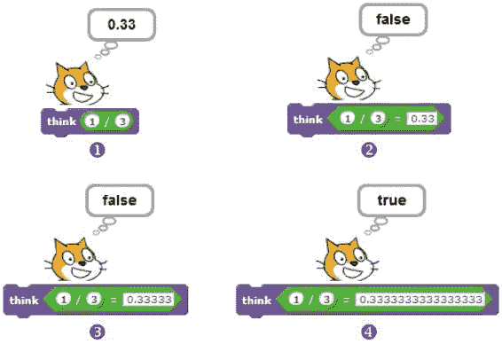

将 1 除以 3 的结果是 0.3333...，其中 3 会无限重复。由于计算机使用固定的空间来存储结果，分数 1/3 不能被计算机精确存储。尽管 Scratch 在 ① 处告诉你除法结果是 0.33，实际结果内部存储的精度要高得多。因此，图中前两个比较（② 和 ③）的结果为假。

根据你的编程环境，你可以通过使用以下一种方法来防止这种类型的错误：

+   尽可能使用小于（`<`）和大于（`>`）运算符，而不是等于运算符（`=`）。

+   使用**round**代码块来四舍五入你需要比较的两个数字，然后比较四舍五入后的数字是否相等。

+   测试你比较的两个值之间的绝对差。例如，代替测试*x*是否等于*y*，我们可以检查*x*和*y*之间的绝对差是否在可接受的容差范围内，使用一个类似于这个的代码块：

    

    根据数字的精度和计算这些数字的方法，这种方法可能足以满足你的需求。

## Scratch 项目

本章中你所学到的新命令应该使你能够创建各种有用的 Scratch 应用程序，希望我在本节中展示的项目能够给你一些关于自己项目的灵感。我鼓励你尝试这些应用程序，理解它们是如何工作的，然后思考如何改进它们。

### 猜我的坐标

*GuessMyCoordinates.sb2*

在本节中，我们将开发一个互动游戏，用于测试任何人对笛卡尔坐标系的知识。游戏包含一个精灵（称为`Star`），它代表舞台上的一个随机点（见图 6-16）。

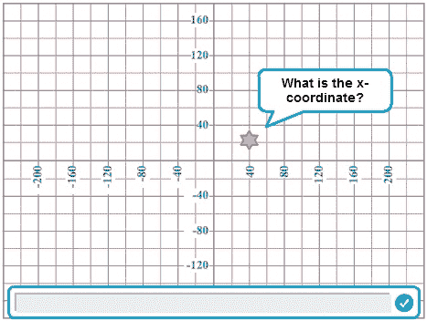图 6-16. 猜我的坐标界面

每次运行游戏时，精灵会移动到舞台上的不同位置，并要求用户猜测其*x*和*y*坐标。游戏检查用户的答案，并提供适当的反馈信息。`Star`精灵的主要脚本如图 6-17 所示。

该脚本使用两个变量，`X` 和 `Y`，来保存精灵的随机坐标。我将在下面解释图 6-17 中的每个编号部分是如何工作的。

1.  `X` 变量从集合 {–220, –200, –180, ..., 220} 中随机选择一个值。通过首先选择一个在 –11 到 11 之间的随机整数，然后将结果乘以 20 来实现。同样，`Y` 变量从集合 {–160, –140, –120, ..., 160} 中随机选择一个值。选择的 `X` 和 `Y` 值确保结果点位于图 6-16 中的网格交点之一。然后，精灵会移动到由 `X` 和 `Y` 指定的位置。

    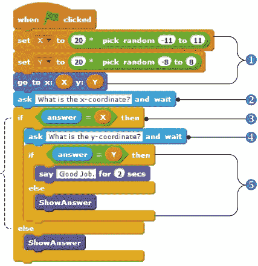图 6-17. 猜我的坐标游戏的脚本

1.  脚本要求用户输入精灵的 *x* 坐标，并等待回答。

1.  如果答案正确，脚本将进入第 4 步。否则，它将调用 **ShowAnswer** 程序来显示正确的坐标。

1.  当用户输入正确的 *x* 坐标时，脚本提示用户输入精灵的 *y* 坐标，并等待回答。

1.  如果用户回答正确，脚本会显示消息“做得好”。否则，它会调用 **ShowAnswer** 来显示正确的坐标。

**ShowAnswer** 程序见图 6-18。`point` 变量首先通过 **join** 操作符构建为一个形如 `(X,Y)` 的字符串。然后，程序使用 **say** 命令将正确答案展示给用户。

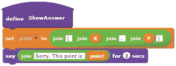图 6-18. *ShowAnswer* 程序试试看 6-1

通过一些有趣的修改来增强这个猜谜游戏。例如，你可以在某人获胜时播放音乐，错误回答时触发蜂鸣声，自动运行（无需每次点击绿旗），或者跟踪正确回答的次数来显示玩家的分数。

### 三角形分类游戏

*TriangleClassification.sb2*

如图 6-19 所示，三角形可以根据其边长分类为不等边三角形、等腰三角形或等边三角形。在这一节中，你将探索一个对这些概念进行测试的游戏。

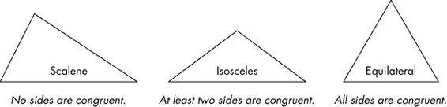图 6-19. 根据三角形的边分类

游戏在舞台上绘制一个三角形，并要求玩家将该三角形归类为三种类型之一。此游戏的用户界面见图 6-20。

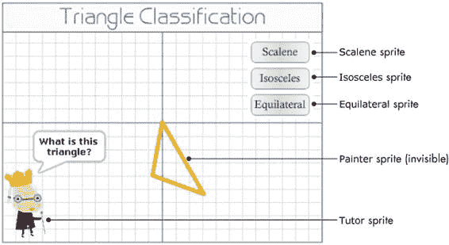图 6-20. 三角形分类游戏的用户界面

图 6-20 显示该游戏包含五个精灵。三个精灵（分别命名为 `Scalene`、`Isosceles` 和 `Equilateral`）表示用户点击以选择答案的按钮，另一个隐藏的 `Painter` 精灵则在舞台上绘制三角形。

### 注意

*我通过在精灵信息区取消勾选 Show 复选框使 `Painter` 精灵变为不可见。如果你希望通过脚本控制精灵的可见性，可以添加一个**hide** 块来在游戏开始时明确隐藏精灵。*

`Tutor` 角色是游戏的主要驱动程序；它决定每次运行时绘制的三角形类型，并检查用户的答案。`Tutor` 角色的脚本如图 6-21 所示。

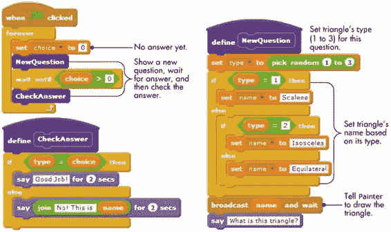图 6-21. *`Tutor`* 角色的脚本。主要驱动程序脚本（左上角）调用 *NewQuestion*（右侧）和 *CheckAnswer*（左下角）。

当点击绿旗图标以开始游戏时，主脚本进入一个无限循环。每次循环时，脚本将 `choice` 设置为 0（表示玩家尚未回答），绘制一个不同的三角形，并等待答案。当用户点击任何一个答案按钮时，`choice` 变量应该改变。当用户点击一个按钮来分类三角形时，脚本会检查答案并提供适当的反馈。我们来更详细地看一下每一步。

**NewQuestion** 程序首先通过随机设置 `type`（它决定了在舞台上绘制的三角形类型）为 1、2 或 3 来开始。然后，脚本使用两个 **if/else** 块根据 `type` 的值设置 `name` 变量的值。`name` 变量有两个作用：（1）它指定发送哪个广播消息，以便 `Painter` 角色知道要绘制什么（三星如何使用 **广播并等待** 块中的 `name`），（2）它在 **CheckAnswer** 程序中用于创建用户的反馈消息。当 `Painter` 角色绘制完成后，**NewQuestion** 程序使用 **say** 命令提示用户输入答案。

当 `Painter` 角色收到广播消息时，它会在舞台上绘制相应的三角形。为了让游戏更加刺激，`Painter` 角色使用随机值来确定三角形的大小、方向和颜色，如图 6-22 所示。

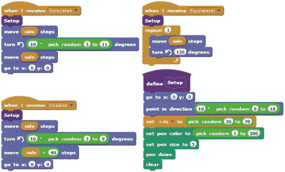图 6-22. *`Painter`* 角色的脚本

在请求用户分类绘制的三角形后，主脚本使用 **wait until** 块（来自 *控制* 调色板）暂停，直到 **choice > 0** 成为真。三个按钮角色会在点击时改变 `choice`。`Scalene` 按钮将 `choice` 设置为 1，`Isosceles` 按钮将 `choice` 设置为 2，而 `Equilateral` 按钮将 `choice` 设置为 3（见图 6-23）。

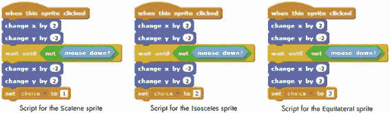图 6-23. 三个按钮精灵的脚本

当按钮被按下时，它的精灵会稍微向下和向右移动，给人一种按钮被按下的视觉效果。当鼠标释放时，精灵返回到原来的位置，并设置变量`choice`的值以表示用户点击了该按钮。注意，每个精灵都会将`choice`设置为不同的数字。这些脚本中用于移动按钮的块并非严格必要，如果需要，可以将其移除。

一旦用户选择了一个三角形类型，`choice`的值就会大于零，主脚本会调用**CheckAnswer**过程。这个过程将`type`变量（指定所画三角形的类型）与`choice`变量的值进行比较。如果两个变量的值相同，那么用户的答案是正确的。否则，用户的答案是错误的，脚本会显示正确的分类。

试试第 6-2 节

打开这个游戏并玩几次。一旦你理解了它的工作原理，尝试添加一些额外的功能。以下是一些想法：

+   让游戏保持计分。它可以为每个正确的答案加一分，并为每个错误的答案扣一分。

+   给用户一个退出游戏的选项。

+   定义一个游戏结束的标准。例如，你可以设置主循环运行 20 次而不是一直运行。你也可以在五次错误答案后停止游戏。

+   在游戏进行时，让一些令人兴奋的事情发生。例如，你可以创建一个名为`specialNumber`的变量，并在游戏开始时为它赋予一个随机值。当正确答案的数量与`specialNumber`匹配时，游戏可以给用户加分、播放音乐，甚至讲一个笑话。

+   通过图形效果让按钮“活起来”。例如，如果你在每个按钮上添加如下脚本，当鼠标悬停在按钮上时，按钮的颜色将发生变化。

    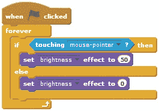

### 线路跟随器

*LineFollower.sb2*

我们能否让精灵像图 6-24 中所示那样自己在舞台上跟随（或追踪）一条路径？答案是肯定的，在这一部分，我们将编写一个程序来实现这一点。如果你仔细观察图中的精灵，你会注意到我们用不同的颜色为猫的鼻子和两个耳朵上了色。图中还展示了猫头部的放大视图。

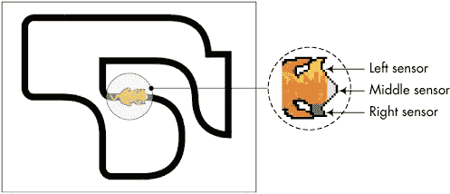图 6-24. 精灵跟随的示例路径

计划是利用猫的鼻子和耳朵作为颜色传感器来检测下面的黑线。我们的黑线追踪算法使用以下的*启发式*（基于逻辑推理和反复试验的规则）：

+   如果猫的鼻子（粉色）接触到线条，则向前移动。

+   如果猫的左耳（黄色）接触到线条，则逆时针转弯并以较低的速度向前移动。

+   如果猫的右耳（绿色）接触到线条，则顺时针转弯并以较低的速度向前移动。

当然，精确的速度（移动步数）和转弯角度可以根据不同的路线有所不同，需要通过实验来确定。实现上述算法并使精灵沿线行走的脚本如图 6-25 所示。

图 6-25 中的脚本使用了一个新的积木：**颜色接触？**（来自*感应*调色板）。这个积木检查精灵上的颜色（在第一个颜色方块中指定）是否与另一个颜色（在第二个颜色方块中指定）接触。如果精灵上的指定颜色与另一个颜色接触，积木返回 true；否则返回 false。可以通过点击颜色方块，然后在 Scratch 项目中的任何地方点击来选择颜色。

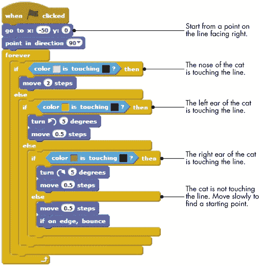图 6-25. 线条跟踪算法尝试练习 6-3

打开应用程序并运行它，查看它是如何工作的。尝试调整给定的值，使精灵以最快的速度完成赛道。一位评论者在 11 秒内完成了赛道。你能打破记录吗？创建其他赛道，看看这个简单的算法是否仍然有效。

### 直线方程

*直线方程*

连接两点 *P* = (*x*[1], *y*[1]) 和 *Q* = (*x*[2], *y*[2]) 的直线方程是 *y* = *mx* + *b*，其中 *m* = (*y*[2] – *y*[1]) / (*x*[2] – *x*[1]) 是直线的斜率，*b* 是 *y*-截距。垂直线的方程为 *x* = *k*，水平线的方程为 *y* = *k*，其中 *k* 是常数。在本节中，我们将开发一个应用程序，用于找到连接笛卡尔平面中两点的直线方程。该应用程序的用户界面如图 6-26 所示。

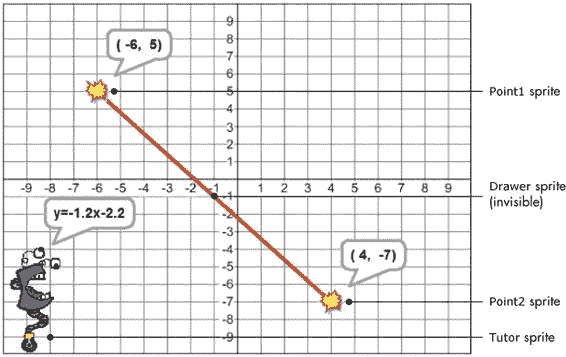图 6-26. 方程查找应用程序的用户界面

用户将表示线条端点的两个精灵拖到舞台上，应用程序会自动显示生成的直线方程。应用程序包含四个精灵：`Point1` 和 `Point2` 用于标记线条的两个端点；`Drawer` 是一个隐藏精灵，负责在两个端点之间绘制直线；而 `Tutor` 负责计算和显示直线方程。

`Point1` 和 `Point2` 的脚本非常相似。它们包含一些逻辑（这里没有显示）来限制精灵的位置只能处于网格的交点上。实际上，当用户拖动 `Point1` 精灵时，它会更新保存其坐标的变量（命名为 `X1` 和 `Y1`），并广播 `Redraw` 消息。类似地，当用户拖动 `Point2` 精灵时，它会更新保存其坐标的变量（命名为 `X2` 和 `Y2`），并广播相同的消息。所有四个变量（`X1`、`X2`、`Y1` 和 `Y2`）的值仅能是 -9 到 9 之间的整数。你可以在文件 *EquationOfALine.sb2* 中查看这些脚本的详细信息。现在，让我们来看一下 `Drawer` 精灵的脚本，如 图 6-27 所示。

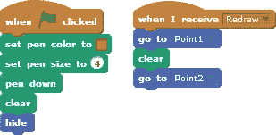图 6-27. *`Drawer`* 精灵的脚本

当游戏开始时，该精灵设置其画笔的大小和颜色，并准备绘制。当它接收到 `Redraw` 消息时，它会移动到 `Point1` 精灵，清除舞台，然后移动到 `Point2` 精灵。结果是一条连接 `Point1` 和 `Point2` 的直线。

当 `Tutor` 精灵接收到 `Redraw` 消息时，也会执行一个脚本，如 图 6-28 所示。

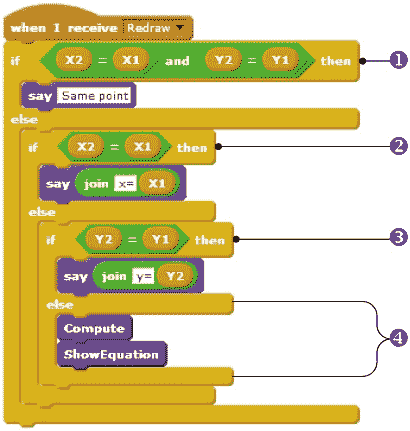图 6-28. *`Redraw`* 消息处理程序 for *`Tutor`* 精灵

脚本执行以下检查：

+   如果 `Point1` 和 `Point2` 的坐标相同，则没有需要处理的线。脚本只会显示“相同的点”。

+   如果两个点不同，但它们的 *x* 坐标相同，那么我们得到一条垂直线。脚本显示一个类似 *x* = *constant* 的方程。

+   如果两个点不同，但它们的 *y* 坐标相同，那么我们得到一条水平线。脚本显示一个类似 *y* = *constant* 的方程。

+   否则，两个点形成一条直线，其方程为 *y* = *mx + b*。脚本首先调用 **计算** 过程来找出斜率和 *y* 截距。然后它调用 **ShowEquation** 来将方程格式化并显示给用户。

**计算** 过程如 图 6-29 所示。它计算斜率（`m`）和 *y* 截距（`b`），然后将这些值四舍五入到最接近的百分位。

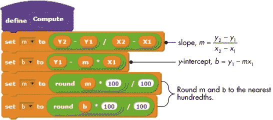图 6-29. *计算* 过程

**ShowEquation**过程如图 6-30 所示。它使用两个变量（`term1`和`term2`）和两个子过程来正确格式化方程以供显示。

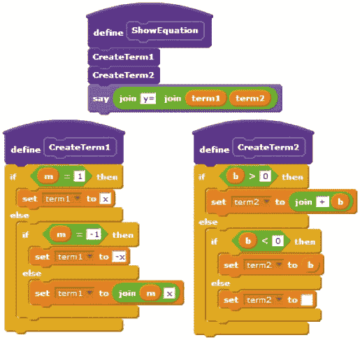图 6-30。*ShowEquation*过程

**ShowEquation**过程在格式化直线方程时会考虑以下特殊情况：

+   如果斜率为 1，`term1`将被设置为*x*（而不是 1*x*）。

+   如果斜率为–1，`term1`将被设置为–*x*（而不是–1*x*）。

+   `term2`是使用*y*-截距的正确符号（加号或减号）形成的。

+   如果*y*-截距为 0，方程将具有形式*y* = *mx*。

尝试一下 6-4

打开应用程序并运行它。将两个点拖动到舞台上的不同位置，并检查显示的方程式。为了增强此应用程序，尝试添加一个脚本，如果`Tutor`精灵与`Point1`和`Point2`精灵显示的坐标重叠，则将`Tutor`精灵移开。

### 其他应用程序

*GuessMyNumber.sb2*

现在让我们讨论一些您将在本书的附加资源中找到的游戏（请从*[`nostarch.com/learnscratch/`](http://nostarch.com/learnscratch/)*下载附加资源）。附加材料包含两个经典游戏，您可以自行探索。第一个是“猜我的数字”游戏。应用程序会在 1 到 100 之间随机选择一个整数，并提示玩家猜测该数字。然后，应用程序通过显示“太高”或“太低”来告诉玩家猜测的数字是比秘密数字高还是低。玩家有六次机会猜测秘密数字。猜对了数字则赢得游戏，否则就是失败。

*RockPaper.sb2*

第二个游戏允许用户与计算机玩“石头、剪刀、布”游戏。玩家通过点击表示石头、布或剪刀的三个按钮之一来做出选择。计算机做出随机选择。根据以下规则选出获胜者：布胜（包裹）石头，石头胜（砸碎）剪刀，剪刀胜（剪）布。

## 总结

在本章中，您了解了 Scratch 中的比较运算符，并使用它们来比较数字、字符和字符串。之后，您学习了**if**和**if/else**块，并使用它们在多个程序中做出决策和控制动作。您还学习了如何使用嵌套的**if**和**if/else**块来测试多个条件，并应用此技术开发了一个基于菜单的应用程序。您还了解了逻辑运算符，它们作为一种替代方法，是测试多个条件的更简洁的方式。最后，您探索了几个完整的应用程序，展示了决策结构的实际应用。

下一章节将带你深入了解*控制*面板，展示 Scratch 中可用的各种重复结构，并教你如何使用它们编写更强大的程序。

## 问题

| **Q:** | 1\. 执行此脚本中的每个命令后，`W` 的值是多少？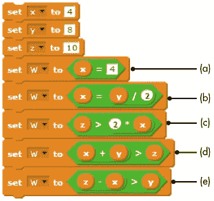 |
| --- | --- |

| **Q:** | 2\. 使用**if**块表达以下每个语句：

1.  如果 `x` 除以 `y` 等于 5，则将 `x` 设置为 100。

1.  如果 `x` 乘以 `y` 等于 5，则将 `x` 设置为 1。

1.  如果 `x` 小于 `y`，则将 `x` 的值加倍。

1.  如果 `x` 大于 `y`，则将 `x` 的值加 1。

|

| **Q:** | 3\. 编写一个程序，提示用户输入五个介于 1 和 10 之间的测试分数。程序将计算并显示大于 7 的分数个数。 |
| --- | --- |

| **Q:** | 4\. 使用**if/else**块表达以下每个语句：

1.  如果 `x` 乘以 `y` 等于 8，则将 `x` 设置为 1；否则，将 `x` 设置为 2。

1.  如果 `x` 小于 `y`，则将 `x` 的值加倍；否则，将 `x` 的值加 1。

1.  如果 `x` 大于 `y`，则同时将 `x` 和 `y` 增加 1；否则，同时将两者减少 1。

|

| **Q:** | 5\. 按照右侧脚本的流程，依次检查每种情况的输出结果：

1.  `x` = –1, `y` = –1, `z` = –1

1.  `x` = 1, `y` = 1, `z` = 0

1.  `x` = 1, `y` = –1, `z` = 1

1.  `x` = 1, `y` = –1, `z` = –1

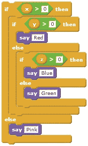 |

| **Q:** | 6\. 编写一个程序，要求用户输入三个数字。程序将确定并打印出这三个数字中最大的一个。 |
| --- | --- |

| **Q:** | 7\. 一家公司销售五种不同的产品，其零售价如下表所示。编写一个程序，要求用户输入产品编号和销售数量。程序将计算并显示总零售价。 |

&#124; 产品编号 &#124; 零售价 &#124;

&#124; --- &#124; --- &#124;

&#124; 1 &#124; $2.95 &#124;

&#124; 2 &#124; $4.99 &#124;

&#124; 3 &#124; $5.49 &#124;

&#124; 4 &#124; $7.80 &#124;

&#124; 5 &#124; $8.85 &#124;

|

| **Q:** | 8\. 构造一个逻辑表达式，表示以下每个条件：

1.  `score` 大于 90 且小于 95。

1.  `answer` 是 y 或 yes。

1.  `answer` 是介于 1 和 10 之间的偶数。

1.  `answer` 是介于 1 和 10 之间的奇数。

1.  `answer` 介于 1 和 5 之间，但不等于 4。

1.  `answer` 是介于 1 和 100 之间并且能被 3 整除的数。

|

| **Q:** | 9\. *三角不等式定理*指出，三角形的任意两边之和大于第三边的长度。编写一个程序，从用户那里获取三个数字，并判断它们是否可以代表三角形的三边。 |
| --- | --- |
| **问：** | 10\. *毕达哥拉斯定理*指出，如果*a*和*b*是直角三角形的两条直角边，*c*是斜边的长度（最长的一边），那么*a*² + *b*² = *c*²。编写一个程序，获取用户输入的三个数字，并判断它们是否能够表示直角三角形的三条边。 |
