## 第七章。重复：深入探索循环

你之前已经见过一些 Scratch 的重复结构，但本章将更详细地讲解它们。现在是时候讨论创建循环、嵌套循环和递归的新块了。在本章结束时，我们将探索以下编程概念：

+   用于重复执行语句的重复结构

+   如何验证用户输入

+   计数器控制的循环和事件控制的循环

+   可以通过递归调用自身的过程

尽管大多数人觉得重复性任务无聊，但计算机似乎最喜欢做的就是这些。*重复结构*，也就是更常见的*循环*，是编程命令，指示计算机反复执行某个语句或一系列语句。最简单的循环类型是*确定循环*，它会在特定次数内重复执行一系列语句。这些循环也叫*计数器控制的循环*或*计数循环*。其他类型的循环则会一直重复，直到满足某个条件；这些被称为*条件控制的循环*或*不确定循环*。还有一种循环叫做*无限循环*，它会永远重复下去。

在本章中，你将学习 Scratch 中不同的重复结构。我将详细解释计数器控制的循环和条件控制的循环，并介绍**停止**块，你可以用它来结束无限循环。你还将学会如何使用循环来验证用户输入。

本章还讨论了*嵌套循环*（包含其他循环的循环），并展示了几个使用它们的例子。我们还将讨论*递归*——一个过程调用自身——作为实现重复的另一种方式。最后，我们将开发一些有趣的应用程序，既使用循环也使用条件语句，并探索如何将循环融入实际程序中。

## Scratch 中的更多循环块

正如你在第二章中学到的那样，循环块允许你在程序中重复执行命令或一组命令。Scratch 支持图 7-1 中显示的三种重复块。

图 7-1. Scratch 的重复块

在本书的多个示例中，你已经使用过这两个块：**重复**块和**永远**块。在本节中，我们将讨论第三种循环块——**直到重复**块，并解释与循环相关的一些技术术语。

每次循环的重复称为*迭代*，而*计数*一词通常用来描述循环重复的次数。你非常熟悉的**repeat**块是一个计数控制的循环，因为它会在指定的次数内重复执行命令。当我们知道循环需要执行多少次时，通常会使用这个循环，就像我们想要绘制一个已知边数的多边形时。

另一方面，**repeat until** 块是一个条件控制的循环。这个块内的语句会根据其测试表达式的真假值进行重复。当我们无法预知循环需要重复多少次，并且希望循环在某个条件满足之前持续进行时，我们使用这个块。例如，你可以说：“重复**ask**命令，直到用户输入一个正数。”或者，“重复发射导弹，直到玩家的能量值降到某个特定值以下。”接下来的章节将更详细地解释条件控制循环。

### repeat until 块

假设你正在开发一个游戏，游戏向玩家提出一个简单的数学问题。如果玩家的回答错误，游戏会再次提问，给玩家另一次机会。换句话说，游戏会一直提问*直到*玩家输入正确答案。显然，**repeat**块不适合这个任务，因为你无法预知玩家需要多少次才能输入正确答案；第一次就可能答对，也可能需要 100 次。**repeat until**块可以帮助你解决像这样的场景。**repeat until**块的结构如图 7-2 所示。

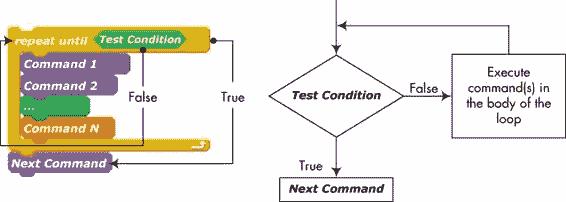图 7-2. **repeat until**块允许你反复执行一系列指令，直到某个条件成立。

这个块包含一个布尔表达式，其值在进入循环时会被测试。如果表达式为假，循环内的命令将被执行。当循环中的最后一条命令执行完毕后，循环将重新开始，并再次测试表达式。如果表达式仍为假，循环内的命令会再次执行。这个过程将一直重复，*直到*测试表达式为真。当那时，循环内的命令会被跳过，程序将继续执行紧跟循环后的命令。

注意，如果程序第一次运行循环时测试条件已经为真，那么循环中的命令将不会执行。而且，**repeat until**块不会终止，除非某个命令（无论是在循环内部还是程序的其他活动部分）使得测试条件变为真。如果测试条件的结果永远不会为真，我们就会陷入一个无限循环。

图 7-3 展示了使用**repeat until**块的实际示例。在这个示例中，只要`Player`精灵与`Guard`精灵之间的距离超过 100 步，`Guard`精灵就会继续沿当前方向移动（此情况下为水平方向），并在接触舞台的左右边缘时反弹。如果两者之间的距离小于 100，**repeat until**块将终止，`Guard`精灵将开始追逐`Player`精灵。追逐的代码在图中没有显示。**distance to**块可以在*Sensing*面板中找到。

图 7-3。一个简单的示例，展示了 repeat until 块的实际应用。尝试操作 7-1

打开应用程序*Chase.sb2*并运行它。使用箭头键将`Player`精灵移到接近`Guard`精灵的位置，看看追逐效果。你会如何改变测试条件，使得如果`Player`精灵的*y*位置超出某个范围（例如，-50 到 50），`Guard`精灵会被释放？实施这个更改来验证你的解决方案。

*Chase.sb2*

### 构建一个 forever if 块

无限循环在很多编程场景中都非常有用。例如，在前面的章节中，你使用了**forever**块来播放背景音乐，并通过不断更换角色服装来动画化精灵。**forever**块是一个*无条件的无限循环*，因为它没有控制内部命令执行的测试条件。

然而，你可以通过将**if**块嵌套在**forever**块内来轻松改变这一点，从而创建一个*条件无限循环*，如图 7-4 所示。**if**块的测试条件会在每次迭代开始时进行检查，只有当测试条件为真时，其命令才会执行。注意，由于**forever**块是无限执行的，你不能在其后连接命令块。

图 7-4。你可以通过将 forever 块与 if 块结合来创建一个 forever/if 循环。

组合**永远/如果**结构通常用于用键盘箭头键控制精灵的运动，如图 7-5 所示。

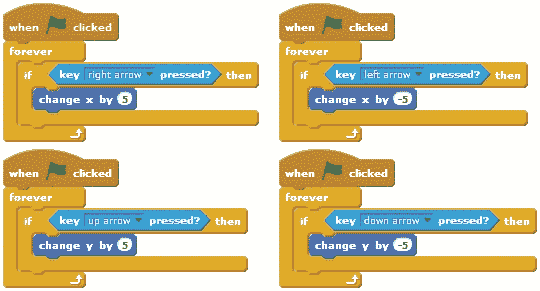图 7-5. 这些脚本允许你用键盘箭头键来移动精灵。每个脚本响应其中一个箭头键。

*ArrowKeys1.sb2*

当按下绿色旗帜图标时，四个方向键（左、右、上、下）将在四个独立的无限循环中被监视。当按下任意一个键时，相应的循环会导致精灵的*x*坐标或*y*坐标发生变化。

在 Scratch 中创建这些脚本（或打开*ArrowKeys1.sb2*）并运行程序。注意，如果同时按下上箭头和右箭头键，精灵会向东北方向对角移动。尝试其他箭头键组合，看看应用程序如何响应。

试试看 7-2

另一种用箭头键控制精灵运动的方法如下所示。将这种方法与图 7-5 中的方法进行比较。哪一种对键盘敲击更为灵敏？如果同时按下两个键（例如，上键和右键），替代脚本会如何表现？现在，尝试将图 7-5 中四个**如果**区块放在一个**永远**循环中，并同时按下两个箭头键。精灵的行为有何变化？

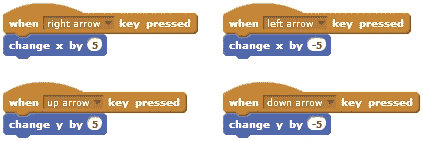

## 停止命令

假设你正在编写一个程序，用来找到第一个小于 1,000 的能被 3、5 和 7 整除的整数。你可以编写一个脚本，在循环中逐一检查数字 999、998、997，依此类推。当你找到你要找的数字时（在这个例子中是 945），你想要*停止*搜索。

如何告诉 Scratch 结束循环并停止脚本？你可以使用**停止**命令（来自*控制*调色板）来结束活动脚本。下拉菜单提供了如图 7-6 所示的三个选项。

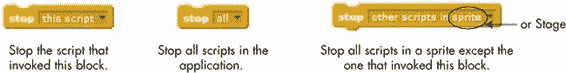图 7-6. 在 Scratch 中使用停止命令

第一个选项立即终止调用它的脚本。第二个选项则停止应用程序中所有正在运行的脚本；它等同于舞台顶部的红色停止图标。请注意，在使用这两个选项时，**stop** 块之后不能连接任何命令。

*StopDemo.sb2*

第三个**stop**选项允许一个精灵或舞台结束其所有脚本，除了调用**stop**块的那个脚本。这个命令呈堆叠块的形状，因此你可以在它下面添加块，在暂停精灵其他脚本后执行它们。让我们通过一个简单的游戏来看看这个命令的作用，见图 7-7。

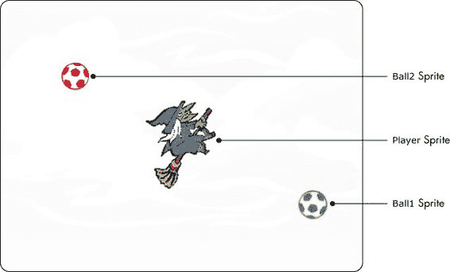图 7-7。在这个游戏中，玩家在舞台上移动巫婆，同时尽量避开两个球。

图中的两个球在舞台上移动并追逐巫婆。玩家用键盘移动巫婆精灵，并尽量避免被两个球碰到。如果红色球在任何时候碰到玩家，游戏结束。如果绿色球碰到玩家，它将停止追逐玩家，但红色球会开始稍微加速——这使得逃避红球变得更具挑战性。

移动巫婆精灵的脚本与图 7-5 的脚本类似，所以这里不再展示。两个球的脚本如图 7-8 所示——我们来看一下这些脚本。

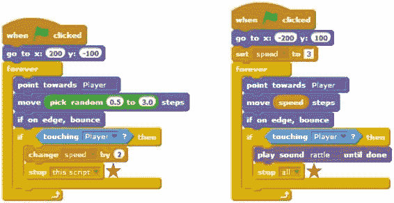图 7-8。绿色球（左）和红色球（右）的脚本

当绿色球碰到玩家时，它会增加`speed`变量（该变量设置红色球的移动速度），并调用**stop this script**命令来终止它的脚本。游戏中的其他脚本应该继续正常运行。在这里使用**stop this script**命令非常合适，因为我们只希望加速红色球一次。然而，如果红色球碰到玩家，它会执行**stop all**命令，这将导致应用程序中所有正在运行的脚本停止。

尝试示例 7-3

加载这个游戏并进行游戏，看看它是如何运作的。观察图 7-8 中两个脚本周围的黄色边框，在绿色球和红色球碰到`Player`时会发生什么。

你还可以使用**stop**语句块在程序执行的任何点终止一个过程并使其返回给调用者。下一节将展示这一概念的实际应用。

### 结束计算循环

*NumberSearch.sb2*

假设我们要找到大于 1,000 的第一个 2 的幂。我们将编写一个过程，在一个循环中检查 2¹、2²、2³、2⁴等。当我们找到所需的数字时，我们希望程序说出答案并停止过程。图 7-9 展示了实现这一方法的两种方式。

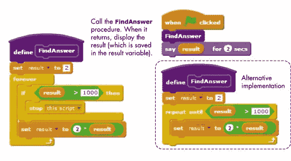图 7-9. 两种方法找到大于 1,000 的第一个 2 的幂

图 7-9 中左侧的程序将`result`变量初始化为 2，这是要检查的第一个 2 的幂，并进入一个无限循环以寻找答案。它在每次循环迭代中检查`result`的值。如果`result`大于 1,000，则程序调用**停止此脚本**命令停止并返回给调用者。否则，**if**语句块后的命令（即将`result`的前一个值乘以 2）将执行，下一次迭代开始。如果你跟踪这个过程，你会看到**if**语句块在第一次迭代时将`result`设为 2，第二次迭代时为 4，第三次为 8，以此类推。这将一直持续，直到`result`超过 1,000；此时，程序停止并返回给调用者，调用者使用**say**语句块显示结果。

图 7-9（右）展示了另一种实现该过程的方法。在这里，我们使用了一个**repeat until**语句块，该语句块将继续循环，直到`result`大于 1,000。与第一种实现方式一样，循环会继续将`result`的值翻倍，直到它超过 1,000。当发生这种情况时，循环自然终止，过程返回给调用者。请注意，在这种情况下我们不需要使用**stop**语句块。

当你需要验证用户输入时，**stop**语句块也非常有用。接下来你将看到这种实际应用的例子。

### 验证用户输入

当你编写一个从用户那里读取数据的应用时，你应该始终在开始处理数据之前检查输入的值是否有效。重复结构可以帮助你完成这个任务。如果用户输入无效，你可以使用一个循环显示适当的错误信息并要求用户重新输入值。

举个例子，假设你正在开发一个有两个等级的游戏，并希望让用户选择一个等级进行游戏。在这种情况下，唯一有效的输入是数字 1 和 2。如果用户输入一个不在这两个数字范围内的数字，你可能希望再给他们一次输入有效值的机会。实现这个检查的一种方式在图 7-10 中展示。

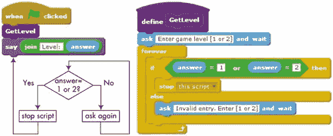图 7-10. 使用 forever 块进行输入验证

**GetLevel**过程要求用户输入一个选择，并在**forever**循环内检查答案。如果用户的答案无效，循环会提示用户重新输入等级。如果用户输入有效的数字，过程会调用**stop this script**来终止循环并结束过程。当这种情况发生时，主脚本（一直在耐心等待**GetLevel**过程返回）继续执行**say**命令。图 7-11 展示了如何使用**重复直到**块实现相同的任务。

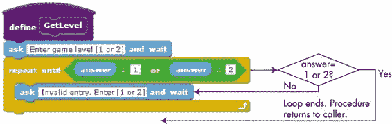图 7-11. 使用重复直到块进行输入验证

图 7-11 中的过程要求用户输入一个选择并等待答案。如果用户输入 1 或 2，**重复直到**块头部的条件会评估为真，从而自然终止循环并结束过程。另一方面，如果用户输入除了 1 或 2 之外的其他内容，循环条件会评估为假，循环内的**ask**命令会执行。这个命令会再次等待用户的输入，**重复直到**块会继续要求输入，直到用户输入一个有效的选择。再次提醒，这个实现不需要**stop**块。

## 计数器

有时候，你需要跟踪一个循环执行的次数。例如，如果你想给用户三次机会输入正确的密码，你需要计算他们的尝试次数，并在第三次尝试后锁定他们。

你可以通过使用一个变量（通常称为*循环计数器*）来处理这种编程场景，这个变量会统计循环的迭代次数。让我们直接进入并探索一些展示如何实际使用循环计数器的例子。

### 检查密码

图 7-12 中的程序要求用户输入密码以解锁笔记本电脑。`Laptop` 精灵有两种服装：off 图像表示笔记本电脑已被锁定，on 图像表示笔记本电脑已解锁。如果用户连续三次输入无效密码，则将拒绝访问该笔记本。

*Password Check.sb2*

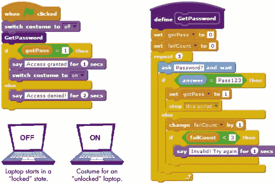图 7-12. 此脚本给用户三次机会输入正确的密码。

当点击绿色旗帜时，`Laptop` 精灵切换到 `off` 服装，并调用 **GetPassword** 过程来验证用户身份。此过程预计通过 `gotPass` 标志将密码检查结果返回给主脚本。当过程返回时，**if/else** 代码块会检查 `gotPass` 标志，以决定是否允许用户访问系统。如果 `gotPass` 被设置为 1，表示用户输入了正确的密码，则 **if** 代码块执行 **say** 命令，显示 *Access granted*（访问授权），并将笔记本的服装更改为 `on` 图像。否则，脚本显示 *Access denied!*（访问拒绝！），并且精灵继续显示其初始的 `off` 服装。

**GetPassword** 过程将 `gotPass` 标志设置为 0，表示尚未收到有效密码，并将 `failCount` 变量（我们的循环计数器）初始化为 0。然后执行一个 **repeat** 循环，最大重复次数为三次。在每次循环中，系统提示用户输入密码。如果用户输入了正确的密码（例如 `Pass123`），则将 `gotPass` 标志设置为 1，过程通过调用 **stop this script** 命令停止自身，并将执行返回给调用者。否则，如果用户还没有用完三次尝试机会，则显示错误消息，并给予用户再次尝试的机会。如果用户连续三次失败，**repeat** 循环会自动终止，并且过程返回给调用者，`gotPass` 标志仍然保持为 0。

尝试实践 7-4

打开此应用程序并运行它。如果你输入 `paSS123`（而不是 `Pass123`）作为密码，会发生什么？这告诉你在 Scratch 中字符串比较的特点是什么？尝试使用 **repeat until** 代码块实现 **GetPassword** 过程。

### 按固定数量计数

当然，你不必每次通过循环时都将计数器增加 1。例如，图 7-13 中的脚本 ① 会使精灵从 5 计数到 55，每次增加 5。脚本 ② 会使精灵从 99 计数到 0，每次减少 11——也就是说，99, 88, 77, ... 11, 0。

*CountingBy ConstAmount.sb2*

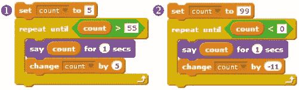图 7-13。你可以通过其他增量来递增和递减计数器，而不仅仅是 1。

为了在实际应用中看到这种计数技巧，我们假设我们想要计算从 2 到 20（包括 20）所有偶数的和。（也就是说，我们想要计算 2 + 4 + 6 + 8 + ... + 20 的和。）图 7-14 的脚本正是执行了这个任务。

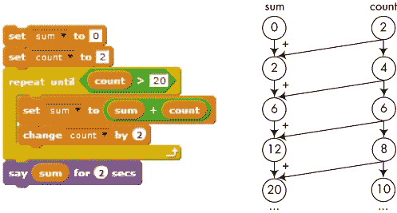图 7-14。这个脚本计算了从 2 到 20 所有偶数的和。

这个脚本首先将 `sum` 变量初始化为 0，并将 `count` 变量初始化为 2，然后进入一个条件循环，直到 `count` 超过 20 为止。在每次迭代中，`count` 的值会被添加到当前的和中，并且 `count` 变量会增加 2，以获得序列中的下一个偶数。预测这个脚本的输出，然后运行它来检查你的答案。

非整数重复计数

你认为如果让 Scratch 重复一个循环 2.5 次，会发生什么情况？下面的三个示例展示了 Scratch 如何处理非整数的重复计数。

*Non-Integer RepeatCount.sb2*

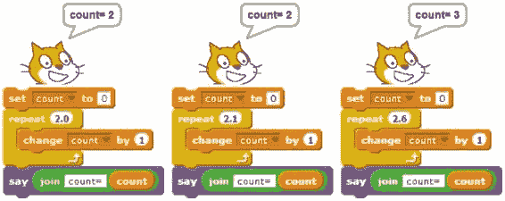

当然，根本没有“重复 2.5 次”这种说法，但 Scratch 并没有阻止你输入这样的值。Scratch 不会给出错误信息，而是自动将小数重复计数四舍五入到最接近的整数。

## 重新审视嵌套循环

在旋转方块一节中，我们使用了嵌套循环来绘制旋转的方块。一个循环（*内循环*）负责绘制方块，而另一个循环（*外循环*）控制旋转的次数。在这一节中，你将学习如何结合使用循环计数器和嵌套循环，在二维（或更多维度）中创建迭代。这项技术是编程的一个重要部分，正如你接下来会看到的，它可以用来解决各种编程问题。

假设有一家本地餐厅提供四种披萨（P1、P2、P3 和 P4）和三种沙拉（S1、S2 和 S3）。如果你在这家餐厅用餐，你将有 12 种可能的组合可以选择；你可以将 P1 与三种沙拉中的任意一种搭配，P2 与三种沙拉中的任意一种搭配，以此类推。餐厅老板想要打印一份菜单，列出所有可用的披萨/沙拉组合，以及它们的价格和卡路里含量。让我们看看如何使用嵌套循环来生成所有可能的组合。（计算价格和卡路里内容的部分留给你作为练习。）

如果你仔细想想，你会发现我们只需要两个循环：一个循环（外循环）用来遍历披萨类型，另一个循环（内循环）用来遍历沙拉类型。外循环从 P1 开始，而内循环依次尝试 S1、S2 和 S3。然后外循环转到 P2，内循环再次选择 S1、S2 和 S3。这个过程一直持续，直到外循环遍历完所有四种披萨类型。这个思路的实现方式在图 7-15 中得到了说明。

*NestedLoops1.sb2*

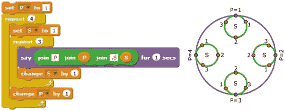图 7-15. 可视化嵌套循环。变量 `P` 控制外循环，变量 `S` 控制内循环。

该脚本使用了两个循环和两个计数器。外循环的计数器名为 `P`，内循环的计数器名为 `S`。在外循环的第一次迭代（`P = 1` 时），计数器 `S` 的值被设置为 1，内循环重复执行三次。每次执行时，它会执行一个 `say` 命令来显示当前的 `P` 和 `S` 的值，然后将 `S` 增加 1。因此，外循环的第一次迭代会导致精灵依次说出“P1,S1”、“P1,S2”和“P1,S3”。

当内循环在执行三次后终止时，`P` 的值增加 1，外循环的第二次迭代开始。此时，`S` 的值重置为 1，内循环再次执行。这会导致精灵依次说出“P2,S1”、“P2,S2”和“P2,S3”。这一过程以类似的方式继续，直到精灵说出“P3,S1”、“P3,S2”和“P3,S3”，最后是“P4,S1”、“P4,S2”和“P4,S3”，然后脚本结束。通过跟踪这个脚本，确保你理解它是如何工作的。

现在你已经了解了嵌套循环的应用，让我们将这一技巧应用于解决一个有趣的数学问题。我们要编写一个程序，找到三个正整数 *n[1]*、*n[2]* 和 *n[3]*，使得 *n[1] + n[2] + n[3] = 25* 且 *(n[1])² + (n[2])² + (n[3])²* = 243。由于计算机擅长执行重复任务，我们的计划是尝试所有可能的数字组合（这种技巧称为 *穷举搜索*），让计算机完成繁重的工作。

根据我们的第一个方程，第一数字 *n[1]* 可以是 1 到 23 之间的任何值，因为我们需要再加两个数字才能得到 25。（你可能已经注意到，*n[1]* 不能大于 15，因为 16² = 256，已经大于 243。但我们暂时忽略第二个方程，还是将循环的上限设置为 23。）

第二个数字 *n[2]* 可以是 1 到 24 - *n[1]* 之间的任何值。例如，如果 *n[1]* 为 10，则 *n[2]* 的最大可能值是 14，因为 *n[3]* 至少为 1。如果我们知道了 *n[1]* 和 *n[2]*，就可以计算出 *n[3]* 为 25 - (*n[1]* + *n[2]*)。然后，我们需要检查这三个数字的平方和是否等于 243。如果是，我们就完成了。否则，我们需要尝试不同的 *n[1]* 和 *n[2]* 组合。你可以在 图 7-16 中看到完成的脚本，用来找到 *n[1]*、*n[2]* 和 *n[3]*。

*NestedLoops2.sb2*

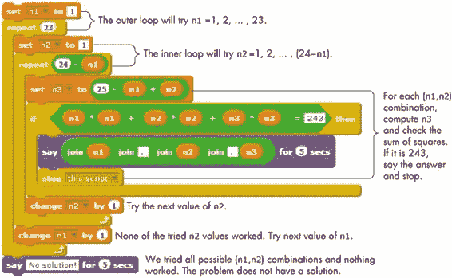 图 7-16。此脚本搜索三个正整数，其和为 25，且平方和为 243。

外层循环尝试从 1 到 23 的所有 `n1` 值。对于每个 `n1` 值，内层循环尝试从 1 到 (24 - `n1`) 的所有 `n2` 值。对于每个 `n1` 和 `n2` 的组合，脚本将 `n3` 设置为 25 - (`n1` + `n2`)，然后检查这三个数字的平方和是否等于 243。如果是，脚本会输出答案并停止。

实验 7-5

创建 图 7-16 中显示的脚本并运行它，以找出 *n*[1]、*n*[2]* 和 *n*[3]*。如果你仔细研究脚本，会发现它会多次尝试某些 (*n*[1]、*n*[2]*) 组合。例如，数字 (1, 2) 在外层循环的第一次迭代中被测试，而数字 (2, 1) 会在第二次迭代中被测试。这两个测试是冗余的，我们只需要其中一个。你可以通过让内层循环从 *n*[1] 而不是 1 开始来修复这个问题。对脚本进行此修改后，运行它并确保它仍然按预期工作。

## 递归：调用自身的过程

到目前为止引入的重复结构允许我们通过迭代重复执行一个命令或一组命令。另一种强大的产生重复的技术是*递归*。递归允许一个过程直接调用自身，或通过另一个过程间接调用自身（例如，`A`调用`B`，`B`调用`C`，然后`C`调用`A`）。这可能不容易理解为什么要这么做，但事实证明，递归可以简化许多计算机科学问题的解决方案。让我们通过考虑图 7-17 中展示的简单示例来演示这个概念。

*Recursion.sb2*

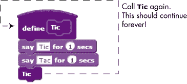图 7-17. 一个递归过程

**Tic**过程执行两个**say**命令（第一个说“Tic”，第二个说“Tac”），然后再次调用自身。第二次调用做同样的事情，如果没有外部操作停止，它会继续不断地说“Tik Tac”。当然，在这种情况下，唯一能停止它的方法是点击红色停止图标。让一个过程以这种方式调用自身，使我们能够无限重复这两个**say**命令，而无需使用任何循环块。这个示例中使用的递归形式称为*尾递归*，因为递归调用位于过程的最后一行。Scratch 也允许递归调用出现在最后一行之前，但我们在本书中不会探讨这种递归类型。

由于无限递归通常不是一个好主意，你必须使用条件语句来控制递归过程的执行。例如，过程可以包括一个**if**语句块，用于判断是否应该进行递归调用。为了演示这一技巧，图 7-18 展示了一个递归过程，该过程从某个初始数字（由参数`count`指定）开始倒数到 0。

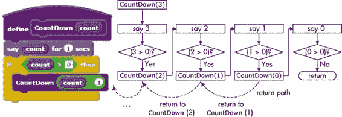图 7-18. 使用 if 语句块来确定是否进行递归调用

让我们通过一个实例如**CountDown**的调用，来了解它是如何工作的，当它的参数为 3 时。当过程开始时，**say**命令显示数字 3，然后检查`count`是否大于 0。由于 3 大于 0，过程会从`count`中减去 1，并以 2 作为参数再次调用自己。

在第二次调用中，过程显示数字 2，并且由于 2 大于 0，它会再次调用自己，参数为 1。这一过程持续进行，直到调用`CountDown(0)`。在语音气泡中显示数字 0 后，过程检查`count`是否大于 0。由于**if**块中的表达式计算结果为假，之后不会进行任何递归调用，过程返回。试着按照图 7-18 所示的返回路径进行跟踪。

现在我们已经涵盖了尾递归的基本概念，可以将其应用于更有趣的应用场景。例如，考虑图 7-19 中所示的**Blade**过程。

*RecursionBlade.sb2*

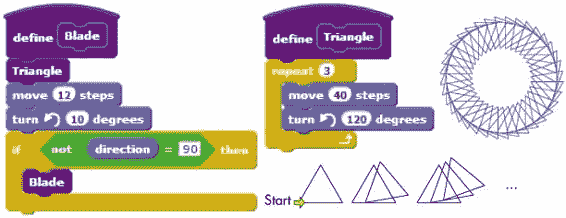图 7-19. 使用精灵的方向来停止递归

我们假设执行此过程的精灵从舞台上的某个位置开始，朝着 90°的方向指向。绘制等边三角形后，精灵向前移动 12 步，然后逆时针转 10°。此过程随后检查精灵的新方向。如果精灵没有指向 90°的方向，过程会再次调用自己，绘制序列中的下一个三角形。否则，不会发生递归调用，过程在绘制完图 7-19 所示的锯齿形后结束。

对于像这里展示的简单例子，使用**repeat**块可能更容易实现所需的重复。但是正如我在本节开始时提到的，很多问题使用递归比使用迭代更容易解决。

尝试一下 7-6

以下过程的功能是什么？实现它并使用不同的参数进行调用，以验证你的答案。

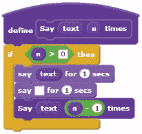

## Scratch 项目

现在你已经知道如何在 Scratch 脚本中利用重复来获得优势，是时候将我们在本章学到的内容付诸实践了。在这一节中，我将引导你完成一系列项目，帮助你加深对编程的理解，并为你的项目提供一些灵感。

### 模拟时钟

*Sensing*调色板中的**当前**模块可以报告当前的年份、月份、日期、星期几、小时、分钟或秒数，具体取决于你从下拉菜单中选择的项。我们的第一个项目将使用此模块来实现如图 7-20 所示的模拟时钟。该应用包含四个精灵：`Sec`、`Min`和`Hour`精灵，代表时钟的三根指针，和`Time`精灵（一个小白点），显示数字格式的时间（见图中的思考气泡）。

*AnalogClock.sb2*

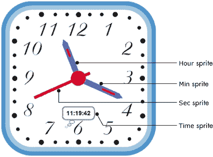图 7-20. 模拟时钟应用

当点击绿色旗帜时，时钟开始运行。作为响应，所有四个精灵都开始一个**永远**循环，根据当前系统时间更新它们的状态。`Sec`和`Min`精灵的脚本如图 7-21 所示。

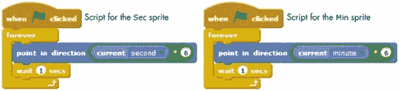图 7-21. `Sec`和`Min`精灵的脚本

**当前**模块报告的秒数和分钟数范围从 0 到 59。当系统报告 0 秒时，`Sec`精灵应指向上方（朝向 0°），在 15 秒时，`Sec`精灵应指向右方（朝向 90°），以此类推。每秒钟，`Sec`指针应顺时针旋转 6°（360°除以 60 秒）。同样的逻辑适用于`Min`指针。如果你观察这个时钟运行，你会注意到`Sec`指针每秒跳动一次，而`Min`指针每分钟跳动一次。现在，让我们看看`Hour`精灵的脚本，如图 7-22 所示。

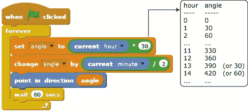图 7-22. `Hour`精灵的脚本

**当前（小时）**模块报告系统时钟的小时数，范围从 0 到 23。我们需要让`Hour`指针在小时 0 时指向 0°（即朝上），小时 1 时指向 30°，小时 2 时指向 60°，依此类推，如图所示。当然，如果当前时间是 11:50，我们并不希望`Hour`指针精确指向 11，而是更接近 12。我们可以通过考虑当前的分钟数来进行这种调整。

由于每小时（或 60 分钟）对应时钟面上的 30°，每分钟对应 2°。因此，每分钟，我们需要根据当前的分钟数除以 2 来调整`Hour`指针的角度，如脚本所示。

`Time`精灵的脚本很简单，在这里不展示。它使用嵌套的**join**积木构造类似*hour*:*min*:*sec*的显示字符串，并将该字符串显示在思维气泡中，如图 7-20 所示。

实践 7-7

打开应用程序并运行。修改`Min`精灵的脚本，使其平滑移动，而不是每分钟跳动一次。（提示：使用我们之前用来平滑时针移动的相同思路。）此外，修改`Time`精灵的脚本，使其显示类似“3:25:00 PM”格式的字符串（12 小时制），而不是“15:25:00”（24 小时制）。想想其他可以增强应用程序的方式，并尝试实现它们。

### 鸟类射击游戏

现在，让我们制作一个简单的游戏，使用本章介绍的大部分积木。玩家的目标是将两只鸟从天上打下来，您可以在图 7-23 中看到用户界面。

*BirdShooter.sb2*

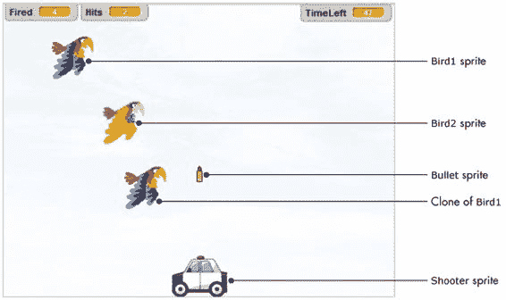图 7-23. 鸟类射击游戏的用户界面

如图所示，游戏包含五个精灵：`Bird1`、`Bird1`的克隆、`Bird2`、一个射击者和一颗子弹。玩家可以使用键盘左右箭头水平移动射击者。按下空格键会发射一颗子弹进入空中。如果子弹击中`Bird1`或其克隆，玩家会获得 1 分。`Bird2`是濒危物种，玩家不能射击它；如果子弹击中该精灵，游戏结束。玩家有一分钟时间尽可能多地射击鸟类。

每只鸟使用两个服装。在这两个服装之间切换时，鸟看起来像是在拍动翅膀。

舞台有两个背景，分别命名为`start`和`end`。`start`背景如图 7-23 所示。`end`背景与之相同，只是在图像的中央添加了*游戏结束*字样。属于舞台的脚本如图 7-24 所示。

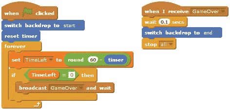图 7-24. 鸟类射击游戏中舞台的脚本

当点击绿色旗帜时，舞台切换到`start`背景，重置计时器，并启动一个循环，更新并检查剩余的游戏时间，这由`TimeLeft`变量跟踪。当`TimeLeft`为 0 或舞台收到`GameOver`广播消息时，执行`GameOver`处理程序。这个脚本等待一段时间，允许小鸟隐藏自己，切换到`end`背景，并调用**stop all**终止所有正在运行的脚本。如你所见，`GameOver`消息会在`Bullet`精灵击中`Bird2`时发送。现在我们来看一下`Shooter`精灵的脚本，如图 7-25 所示。

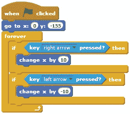图 7-25. `Shooter`精灵的脚本

这个脚本首先将射手定位在舞台底部中间位置。脚本随后进入一个无限循环，检测左箭头或右箭头是否被按下，并根据按键方向移动射手。接下来，让我们来看一下`Bird1`的脚本，如图 7-26 所示。

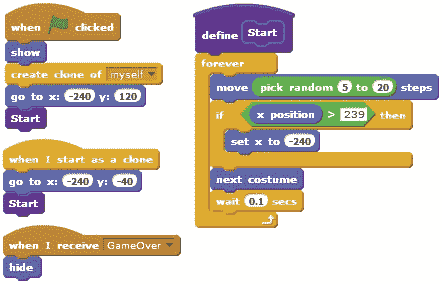图 7-26. `Bird1`精灵的脚本

游戏开始时，`Bird1`会克隆自己，移动到舞台的左边缘，并调用**开始**过程。克隆也从舞台的左边缘开始（但高度不同），并调用**开始**。这个过程使用**forever**循环，将小鸟及其克隆横向移动整个舞台，从左到右，步长随机。当小鸟接近舞台的右边缘时，会被移回左边缘，好像绕了过去重新出现。最后一个脚本会在`GameOver`消息广播时隐藏两只小鸟。

`Bird2`的脚本与`Bird1`的脚本非常相似，因此我们在此不再展示。当点击绿色旗帜时，`Bird2`会移动到舞台右侧的高度 40 位置，然后执行一个类似于图 7-26 的**开始**过程的循环。小鸟从左向右移动，遇到舞台右侧时会绕回去。`Bird2`还会响应`GameOver`广播，隐藏自己。

当然，玩家光靠移动射手是无法击中任何小鸟的，这就是`Bullet`精灵的作用。该精灵的主脚本如图 7-27 所示。

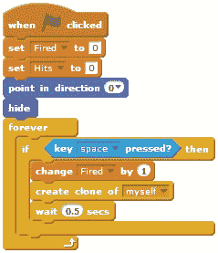图 7-27. `Bullet`精灵的主脚本

当点击绿色旗帜时，脚本会初始化变量 `Fired`（发射的子弹数量）和 `Hits`（击中鸟类的数量）为 0。然后它会将 `Bullet` 精灵指向上方并将其隐藏。之后，进入一个无限循环，反复检查空格键的状态。当按下空格键时，脚本会将 `Fired` 增加 1，并创建一个 `Bullet` 精灵的克隆体，让子弹向上移动，如我们接下来所看到的。脚本接着等待一段时间，以防玩家过快发射下一个子弹。现在我们准备好研究克隆子弹的脚本，见图 7-28。

首先，`Bullet` 被移动到 `Shooter` 的中心并显示出来①。然后，使用**repeat until**块以 10 步的增量将 `Bullet` 向上移动②。如果子弹的 *y* 坐标超过 160，则表示 `Bullet` 已经到达舞台的上边缘且未击中任何鸟类。在这种情况下，**repeat until** 块退出⑤，克隆体被删除。然而，每次子弹移动时都会执行击中检查。如果子弹触碰到 `Bird1`（或其克隆体）③，脚本会增加 `Hits` 变量并播放一个音效，让游戏更加刺激。另一方面，如果子弹触碰到 `Bird2` ④，脚本会广播 `GameOver` 信号，标志着游戏结束。在这两种情况下，克隆体都会被删除，因为它已经完成了任务。

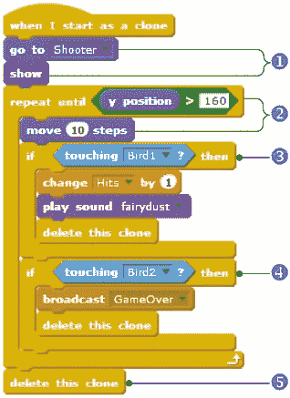图 7-28. 克隆 `Bullet` 的启动处理程序

现在游戏已经完全功能化，但你可以为其添加许多新特性。这里有两个建议：

+   给玩家设定一个有限的子弹数量，并根据错过的射击次数进行记分。

+   添加更多的鸟类，并让它们以不同的速度移动。对于击中速度更快的鸟类，奖励玩家更多的分数。

试试 7-8

打开游戏并进行游玩，看看它是如何工作的。根据上述建议进行修改，或者想出一些自己的增强功能并实现它们！

### 自由落体模拟

在这一部分，我将展示一个模拟自由落体运动的应用程序。忽略浮力和空气阻力的影响，当一个静止物体从某个高度被释放时，物体在时间 *t*（秒）内下落的距离 *d*（米）由公式 *d* = ½ *gt*² 给出，其中 *g* = 9.8 m/s² 为重力加速度。这个模拟的目标是展示物体在 0.5 秒、1.0 秒、1.5 秒、2.0 秒等时间点的下落位置，直到物体触地。这个模拟的界面如图 7-29 所示。

*FreeFall.sb2*

图 7-29. 自由落体仿真用户界面

一个静止的物体（图中的球）将被允许从 35 米的高度下落。通过简单的代入上述公式可以得出物体将在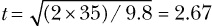秒后到达地面。该应用程序有一个精灵（称为`Ball`），它有图中显示的两个服装。当需要显示下落球体的位置时，精灵会短暂地切换到`marker`服装，做出印章，并切换回`ball`服装。

仿真在点击绿色旗帜时开始。作为响应，`Ball`精灵运行图 7-30 所示的脚本。

在初始化①期间，精灵移动到起始位置，切换到`ball`服装，清除上次运行的语音气泡，并清除舞台上之前的印章。接着，初始化`t`和`counter`为 0。变量`t`代表下落的持续时间，`counter`用于跟踪循环的重复次数。

然后，脚本进入一个无限循环②，以在不同的时间间隔计算仿真参数。它每隔 0.05 秒③进行一次计算并更新球的位置，以确保球的平滑运动。每 0.05 秒，时间变量`t`的值会更新，计算球下落的距离（`d`）。`counter`变量的值也会增加 1。

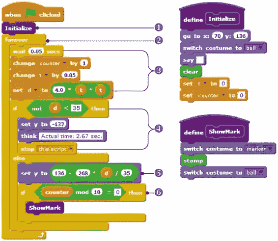图 7-30. 自由落体仿真中的`Ball`精灵脚本

如果球到达地面（当`d` ≥ `35`时发生），脚本将球的*y*位置设置为地面的高度，显示实际的运动时间，并停止脚本以结束仿真④。

否则，脚本会根据下落的距离⑤设置球的垂直位置。由于 35 米的高度对应舞台上的 268 像素（见图 7-29），*d*米的距离对应于`268 *`（`d / 35`）。最终的*y*位置通过从初始*y*位置（136）中减去这个数值来确定。

由于迭代时间为 0.05 秒，获取 0.5 秒需要 10 次迭代。因此，当计数器达到 10、20、30 等时，`Ball`精灵会切换到（并且印上）`marker`服装，以显示下落球体在这些瞬间的位置⑥。

图 7-31 展示了运行该模拟的结果。注意每个时间间隔内物体下落的距离是如何随着物体下落而增大的。由于重力，球体加速——其速度增加——加速度为 9.8 m/s²。

尝试一下 7-9

打开应用程序并运行它，以理解其工作原理。尝试将模拟转变为一款游戏，玩家需要将球投掷到地面上的移动物体上。你可以添加得分，改变目标的速度，甚至设定在另一个星球上的动作（改变重力加速度）。

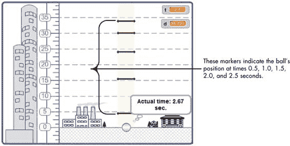图 7-31. 自由落体模拟的结果

### 投射运动模拟器

考虑一颗初速为 (*v*[0]) 的球从炮筒发射，炮筒与水平方向夹角为 *q*。你可以通过将速度向量 (*v*[0]) 在不同时间点分解成水平和垂直分量来分析球的轨迹。水平分量保持不变，但垂直分量受到重力的影响。当这两个分量的运动结合起来时，结果路径是一个抛物线。让我们来研究一下支配投射运动的方程（忽略空气阻力）。

*Projectile .sb2*

我们坐标系的原点是球开始飞行的点，因此球体在任何时刻 *t* 的 *x* 坐标由 *x*(*t*) = *v*[0]*[x]t* 给出，*y* 坐标由 *y*(*t*) = *v*[0]*[y]t* – (0.5)*gt²* 给出，其中 *v*[0]*[x] = *v*[0] cos *q* 是 *v*[0] 的 *x* 分量；*v*[0]*[y] = *v*[0] sin *q* 是 *v*[0] 的 *y* 分量；*g* = 9.8 m/s² 是重力加速度。利用这些方程，我们可以计算出球的总飞行时间、最大高度和水平射程。这些量的方程如图 7-32 所示。

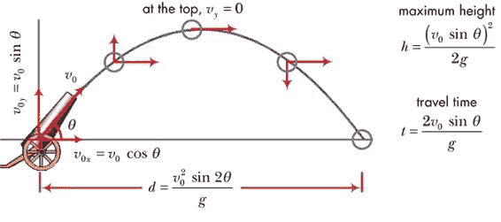图 7-32. 球的抛物线轨迹

这些信息是我们实际模拟球体运动所需的全部内容，因此让我们创建一个 Scratch 程序，以便观察这段物理过程的实际表现，并加深我们对轨迹的理解。模拟的用户界面如图 7-33 所示。

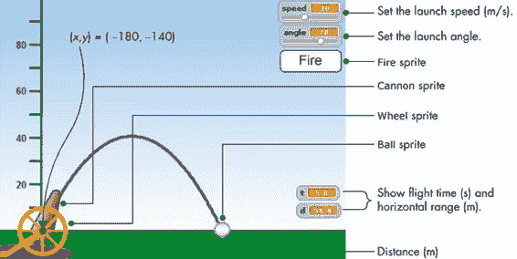图 7-33. 投射运动模拟器的用户界面

如图所示，应用程序包含四个角色精灵。`Wheel`精灵为大炮提供了旋转轴，而`Cannon`精灵则根据`angle`滑块旋转，提供发射角度的视觉指示。`Fire`精灵是一个按钮，用户点击它来发射球，而`Ball`精灵包含计算球坐标和绘制轨迹的主脚本。用户通过两个滑块控制指定发射角度和初始速度，然后点击`Fire`按钮。`Ball`从舞台上的点（–180, –140）开始，并根据指定的参数绘制抛物线轨迹。舞台右下角的两个监视器显示飞行时间和飞行中的水平射程。

模拟开始时，点击绿色旗帜图标。`Cannon`精灵的脚本（这里未显示）将大炮指向由`angle`滑块控制指定的方向。用户也可以通过点击并拖动大炮来指定角度。当用户点击`Fire`按钮时，它会广播一个`Fire`消息，该消息由`Ball`精灵通过图 7-34 中的脚本接收并处理。

为了准备发射①，`Ball`（球）在`Cannon`（大炮）和`Wheel`（轮子）前方移动并定位到发射点。它放下笔并清除舞台上的所有笔迹。然后，脚本计算初始速度的水平（或*x*）和垂直（或*y*）分量（分别命名为`vx`和`vy`），并将时间变量（`t`）初始化为 0。

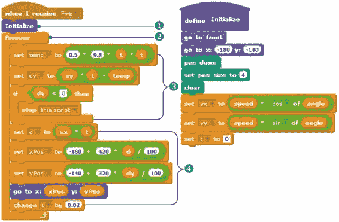图 7-34。`Ball`精灵的脚本

然后，脚本进入一个无限循环②，计算并更新球的位置，每 0.02 秒更新一次。首先，计算精灵的垂直距离（`dy`）③。如果计算出的值为负，则表示球已到达地面。当发生这种情况时，调用**停止此脚本**命令来结束模拟。

如果`dy`不是负值，则计算水平距离（`d`）④。然后，两个距离（`dy`和`d`）会根据舞台的背景进行缩放。在垂直方向上，我们有 320 步（从–140 到 180），对应 100 米；在水平方向上，我们有 420 步（从–180 到 240），也对应 100 米。这意味着`dy`米的垂直距离相当于`320 * dy / 100`步，而`d`米的水平距离相当于`420 * d / 100`步。然后，更新球的*x*和*y*坐标，并将球移动到其轨迹上的当前位置。接着，时间变量（`t`）会增加一个小量（在这种情况下为 0.02 秒），并重复循环以计算球的下一个位置。

例如，如果将球以 70° 的发射角度和 30 m/s 的初速度发射，如图 7-33 所示，总飞行时间为 5.75 秒，射程为 59 米。对图 7-33 中的监视器进行检查表明，我们的模拟非常准确。我们可以通过更频繁地更新计算（例如，每 0.01 秒而不是每 0.02 秒）来改进模拟，但这样会减慢模拟速度。为了在速度和准确性之间取得良好的平衡，需要调整此参数。

尝试一下 7-10

打开应用并运行它，以理解它是如何工作的。然后试着将这个模拟转换成一个游戏。例如，你可以在舞台的右边缘以随机高度显示一个物体，并要求玩家尝试击中它。如果玩家未能击中目标，游戏可以提供一些关于调整发射角度和速度的提示。

### 其他应用

本书的额外资源（可在 *[`nostarch.com/learnscratch/`](http://nostarch.com/learnscratch/)* 获取）包含了三个你可以自行探索的游戏，每个脚本都有详细的解释。第一个是一个教育性游戏，可以用来测试小学生的计数能力。它显示一定数量的便士，并要求玩家找出获得该金额所需的最少硬币数量。

*MatchThat Amount.sb2*

第二个应用是一个简单的太阳系行星运动模拟，其中包含太阳和一颗行星。第三个应用也是一个模拟，展示了单个气体分子与容器壁碰撞时的运动动态。

*Orbit.sb2 Molecules InMotion.sb2*

打开这些应用，运行它们，并阅读我的解释，以理解它们是如何工作的。如果你有兴趣挑战自己的编程技能，试着修改这些脚本，让它们做些新的事情！

## 总结

在本章中，我们探讨了在 Scratch 中重复命令的不同方式。我们首先研究了各种循环块，并解释了与之相关的技术术语。接着，我们讨论了确定性循环和不确定性循环，以及计数控制循环和条件控制循环之间的区别。我们探讨了**repeat until**块和**forever if**结构，并在多个示例中使用了它们。我还解释了 Scratch 的**stop**命令，以及如何使用它们来停止无限循环和过程。之后，我们讨论了如何使用循环来验证用户输入的数据。

你接着学习了如何使用计数器来跟踪循环执行了多少次，以及如何在嵌套循环中使用计数器来创建多维度的迭代。之后，我们探讨了递归——一种通过调用自身来实现重复的过程。在最后一部分，我们开发了几个应用程序，将这些新概念结合起来，创建了实用的程序。

下一章将扩展你在本章学到的知识，教你如何使用计数器和循环来处理字符串，并创建一类有趣的程序，例如二进制转十进制转换器、猜字游戏和一个教学分数的数学辅导程序。

如果你想进一步探索本章中的新概念，建议你尝试一些以下的练习题。

## 问题

| **问：** | 1\. 创建一个输入验证循环，仅接受 1 到 10 范围内的数字。 |
| --- | --- |
| **问：** | 2\. 编写一个脚本，询问用户：“你确定要退出吗 [Y, N]？”然后脚本检查用户的输入，仅接受字母 *Y* 和 *N* 作为有效答案。 |
| **问：** | 3\. 编写一个程序，计算并显示 1 到 20 之间所有整数的和。 |
| **问：** | 4\. 编写一个程序，计算并显示 1 到 20 之间所有奇数的和。 |
| **问：** | 5\. 编写一个程序，显示以下数列中的前 10 个数字（使用 **say** 命令）：5, 9, 13, 17, 21, ....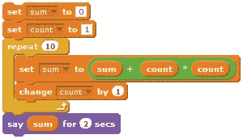 |
| **问：** | 6\. 右侧的脚本是做什么的？实现该脚本并运行它，检查你的答案。 |
| **问：** | 7\. 如果一个整数 (*x*) 除以另一个整数 (*y*) 的余数为 0，我们就说 *y* 是 *x* 的因数。例如，1、2、4 和 8 是 8 的因数。下面的脚本会查找并显示一个给定数字的所有因数（不包括该数字本身）。研究这个脚本并解释它是如何工作的。当输入数字为 125、324 和 419 时，脚本的输出是什么？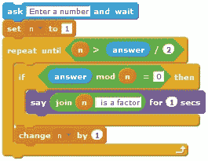 |
| **问：** | 8\. 一个整数如果只被 1 和它本身整除，则称其为素数。例如，2、3、5、7、11 是素数，而 4、6 和 8 不是。下一页的程序会测试一个数是否是素数。研究这个程序并解释它是如何工作的。对于输入 127、327 和 523，这个程序的输出是什么？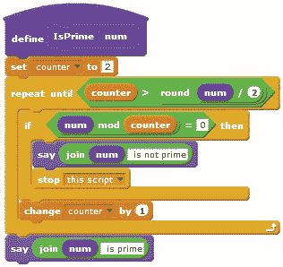 |
| **问：** | 9\. 尽管第 8 问中的程序检查了输入值的一半范围内的所有整数，但实际上将上限设置为输入值的平方根就足够了。对程序进行这个修改，并进行测试，看它是否仍然给出相同的答案。 |
| **问:** | 10\. 数字序列 0, 1, 1, 2, 3, 5, 8, 13, 21, 34 ....被称为斐波那契数列。数列中的前两个数字是 0 和 1。之后的每个数字都是前两个数字之和。编写一个程序，计算斐波那契数列的第*n*项，其中*n*由用户输入。 |
| **问:** | 11\. 请考虑以下程序及其生成的输出。重新创建该程序并运行，观察它是如何工作的。改变转向角度（从 10°开始）和递归调用中的参数（例如**side + 1**或**side + 3**，依此类推），以发现还能创造出什么其他形状。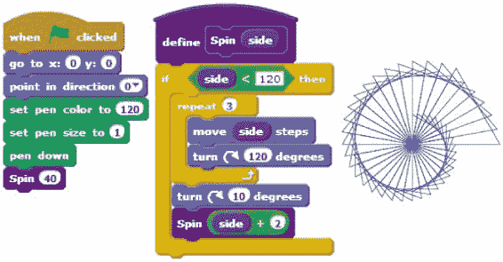 |
