## 第八章：字符串处理

字符串是一系列字符，作为一个整体单元来处理。你可以编写程序来组合、比较、排序、加密和以其他方式操作字符串。以下是你将在本章中学到的内容：

+   Scratch 如何存储字符串

+   如何使用 Scratch 中可用的字符串操作积木

+   多种字符串处理技巧

+   如何编写有趣的程序来处理字符串

我们将从详细了解字符串数据类型开始，然后编写程序来管理和操作字符串。这些程序将移除和替换字符、插入和提取子字符串，以及随机化字符顺序。之后，我们将使用这些程序并应用这些技巧来编写一些有趣且实用的应用程序。

## 重温字符串数据类型

正如我在 第五章中提到的，Scratch 有三种数据类型：*布尔值*、*数字*和*字符串*。从最简单的角度来看，字符串只是一个有序的字符序列。这些字符可以包括字母（大写和小写）、数字以及其他你可以在键盘上输入的符号（如 +、-、&、@ 等）。你可以在程序中使用字符串来存储名字、地址、电话号码、书名等信息。

在 Scratch 中，字符串的字符是按顺序存储的。例如，如果你有一个名为`name`的变量，执行命令**将 name 设置为 Karen**会按图 Figure 8-1 所示的方式存储这些字符。

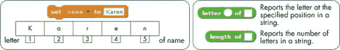Figure 8-1. 字符串作为字符序列存储。

你可以使用**letter of**操作符访问字符串中的单个字符。例如，**letter 1 of name**块返回字母`K`，而**letter 5 of name**块返回字母`n`。Scratch 还提供了**length of**操作符，它返回字符串中的字符数。如果你将这两个操作符与**repeat**积木一起使用，你可以计数字符、检查多个字符并做许多其他有用的事情，正如我将在接下来的小节中演示的那样。

### 统计字符串中的特殊字符

我们的第一个示例脚本，如图 Figure 8-2 所示，用于统计输入字符串中有多少个元音。它要求用户输入一个字符串，然后统计并显示该字符串中的元音数量。

*VowelCount.sb2*

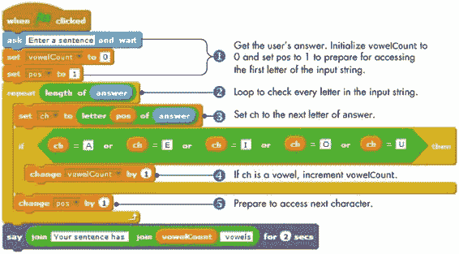Figure 8-2. 元音计数程序

程序逐个检查输入字符串中的每个字母，并查找元音字母。每次找到一个元音字母时，它都会将名为`vowelCount`的变量加 1。脚本使用名为`pos`（*position*的缩写）的变量来跟踪正在检查的字符的位置。让我们更详细地探讨这个脚本。

首先，脚本要求用户输入一个句子①。Scratch 会自动将用户的字符串保存在内置的`answer`变量中。然后，它将`vowelCount`设置为 0（因为尚未看到任何元音字母），并将`pos`设置为 1 以访问输入字符串的第一个字母。

接下来，**repeat**循环②检查输入字符串中的每个字母。**length of**运算符报告输入字符串中的字符数，这决定了循环应重复多少次。

在每次迭代中，循环使用`ch`（字符的缩写）检查输入字符串的一个字符③。在循环的第一次迭代中，`ch`被设置为**answer**的第一个字母。第二次迭代将`ch`设置为第二个字母，依此类推，直到循环到达字符串的末尾。`pos`变量用于访问所需的字符。

**if**模块接着检查所检查的字符是否为元音字母④。如果字符是元音字母，无论是大写还是小写，`vowelCount`都会加 1。

检查完一个字符后，循环将`pos`加 1⑤并重新开始读取下一个字符。当输入字符串中的所有字母都被检查完后，循环结束，程序会使用**say**模块显示它计数的元音字母数量。

本例中使用的技术将在本章的其余部分多次应用。加载脚本*VowelCount.sb2*，运行几次，并确保你完全理解它。

### 比较字符串字符

我们的第二个例子检查用户输入的整数是否为回文数。*回文数*是一个数字（或文本字符串），无论是从前往后还是从后往前读都相同。例如，1234321 和 1122332211 是回文数。同样，Racecar、Hannah 和 Bob 也是一些文本回文数。为了说明我们的回文检测算法，假设输入的数字是 12344321，如图 8-3 所示。

*Palindrome.sb2*

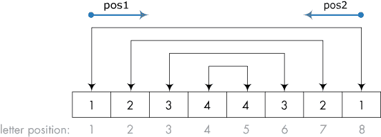图 8-3. 使用两个变量检查数字是否为回文数

要检查一个数字是否是回文数，我们需要比较第一个和第八个数字，第二个和第七个数字，第三个和第六个数字，依此类推。如果任何一次比较结果为假（即两个数字不相等），那么该数字就不是回文数。实现此回文数测试算法的程序如图 8-4 所示。

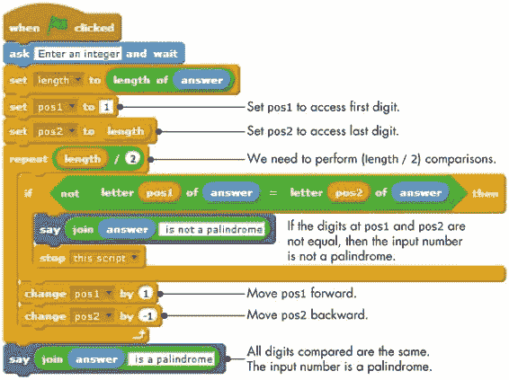图 8-4. 该程序测试用户输入的整数是否为回文数。

该脚本使用两个变量（图 8-3 中的`pos1`和`pos2`）来访问需要比较的数字，这两个变量分别朝相反的方向移动。第一个变量（`pos1`）从第一个数字开始并向前移动，而第二个变量（`pos2`）从最后一个数字开始并向后移动。所需的比较次数最多为输入数字的数字个数的一半。对于输入的数字 12344321，我们最多需要进行四次比较，因为该数字有八个数字。（如果输入的整数有奇数个数字，逻辑也是相同的，因为中间的数字不需要进行比较。）一旦程序确定用户的数字是否为回文数，它会显示一个包含结果的消息。

试一试 8-1

加载*Palindrome.sb2*并运行它，以了解其工作原理。由于 Scratch 处理小数重复次数的方式，如果输入数字的位数是奇数，脚本会多进行一次比较，比较围绕中间数字的两个数字。尝试修复程序，在输入数字为奇数位时执行正确的重复次数。

*Palindrome.sb2*

在下一节中，我们将探索一些最常见的字符串操作，并了解在 Scratch 中编写字符串操作过程的一些策略。

## 字符串操作示例

**letter of** 操作符只能读取字符串的单个字符。如果你想在字符串中插入字符（或删除字符），你必须自己完成所有的工作。

在 Scratch 中，你不能更改字符串中的字符，因此改变字符串的唯一方法是创建一个新字符串。例如，如果你想把字符串“jack”的第一个字母大写，你需要创建一个新的字符串，其中包含字母*J*，然后是剩下的字母*ack*。这个思路是使用**letter of** 操作符来读取原始字符串中的字母，并根据需要使用**join**操作符将这些字母附加到新字符串中。

在本节中，我们将开发一些简单的应用程序，展示常见的字符串操作技巧。

### Igpay Atinlay

如果我们的精灵能够说一种秘密语言呢？在这一节中，我们将教它们一种名为*猪拉丁语*的编码语言。我们创建猪拉丁语单词的规则很简单。要将一个单词转换为猪拉丁语，将第一个字母移到单词的末尾并加上*ay*。因此，单词*talk*变成*alktay*，*fun*变成*unfay*，依此类推。现在你知道规则了，你能猜出这一节的标题最初是什么吗？

*PigLatin.sb2*

我们用来将单词转换为猪拉丁语的策略在图 8-5 中进行了说明，使用的单词是*scratch*。

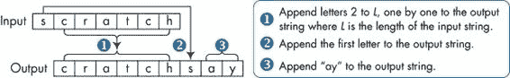图 8-5. 如何将英文单词转换为猪拉丁语

我们首先会一个一个地将输入单词中的所有字母（除了第一个字母）附加到输出单词中 ①。然后，我们将输入单词的第一个字母添加到输出中 ②，接着是*ay* ③。我们的**PigLatin**过程实现了这些步骤，如图 8-6 所示。

该过程使用三个变量来创建我们的编码单词。变量`outWord`保存组装中的输出字符串。一个名为`pos`（表示位置）的计数器告诉脚本从原始字符串中哪个字符应该附加到`outWord`。最后，一个名为`ch`的变量保存输入字符串中的一个字符。该过程将你想要翻译成猪拉丁语的单词作为参数，命名为`word`。

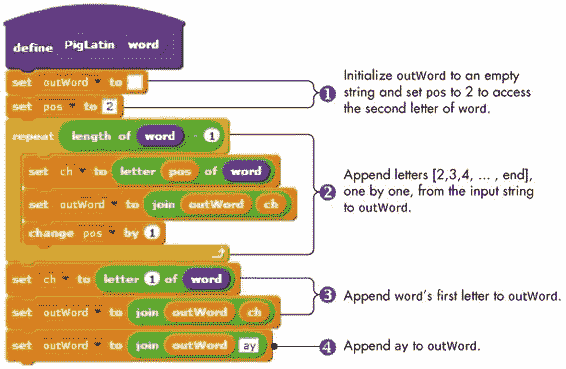图 8-6. PigLatin 过程

首先，程序创建一个空字符串作为`outWord`，并将`pos`设置为 2 ①。（*空字符串*是一个不包含任何字符的字符串；它的长度为 0。）然后，程序使用**repeat**块将输入字符串（`word`）中除了第一个字母之外的所有字母附加到输出字符串（`outWord`）中 ②。由于我们跳过了第一个字符，因此重复次数比输入字符串的长度少一个。在每次循环迭代中，`word`的一个字符被附加到`outWord`。循环结束时，`word`的第一个字母被附加到`outWord` ③，后面跟着字母`ay` ④。

试一试 8-2

加载*PigLatin.sb2*并运行它来测试这个过程。应用程序会要求输入一个单词，然后输出它的猪拉丁语翻译。修改它以翻译一个短语，比如“Would you like some juice?”（提示：对于每个单词调用**PigLatin**，以拼凑输出短语。）作为另一个挑战，编写一个过程，输入一个猪拉丁语单词并显示其原始英文单词。

*PigLatin.sb2*

### 修正我的拼写

在本节中，我们将开发一个简单的游戏，该游戏生成拼写错误的单词，并要求玩家输入正确的拼写。该游戏通过在英文单词的随机位置插入一个随机字母来生成拼写错误的单词。当然，拼写错误的简单单词可能有多个正确拼写。例如，如果原始单词是*wall*，而游戏生成了*mwall*，那么*mall*或*wall*都是正确的。为了保持游戏的简单性，我们将忽略这种可能性，并坚持特定的拼写作为正确答案。

*FixMySpelling.sb2*

首先，让我们创建一个通用的过程，在字符串的特定位置插入字符。这个过程叫做**Insert**，它有三个参数：输入的单词（`strIn`）、要插入的字符串（或字符）（`strAdd`）以及你想要插入这些新字符的位置（`charPos`）。该过程生成一个新字符串（`strOut`），其中`strAdd`被插入到`strIn`的正确位置，就像图 8-7 中的例子所示。

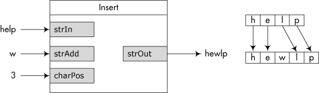图 8-7. 插入过程示意图

我们将一个一个地将`strIn`中的字符添加到`strOut`中。当我们到达`charPos`时，我们将在`strOut`中添加`strAdd`中的字符，然后再附加`strIn`中`charPos`位置的字母。完整的过程如图 8-8 所示。

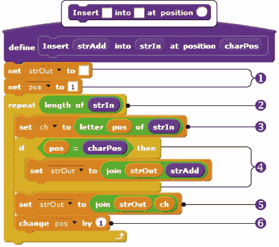图 8-8. 插入过程

首先，过程将`strOut`初始化为空字符串，并将`pos`设置为 1，以访问输入字符串的第一个字母①。然后，它开始一个**repeat**循环，将`strIn`的字母一个一个地附加到`strOut`中②。每次迭代都会获取`strIn`的下一个字母，并将其放入`ch`变量中③。如果当前字符的位置与`charPos`匹配，过程会将`strAdd`附加到`strOut`中④。在所有情况下，`ch`都会被附加到`strOut`中⑤，`pos`会增加以访问`strIn`的下一个字母⑥。

现在我们有了**Insert**过程，让我们看一下游戏的主脚本，如图 8-9 所示。

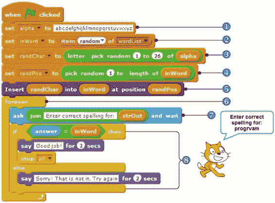图 8-9. Fix My Spelling 游戏的主脚本

`alpha`字符串包含所有字母的字母表。它将提供随机字母来插入到我们要拼写错误的单词中①。脚本从预制的单词列表中随机挑选一个单词，并将该单词保存为`inWord`②。你将在下一章学习更多关于列表的内容；目前，只需将此列表看作一个单词库。接下来，脚本从`alpha`中随机选择一个字母（`randChar`）③，并选择一个随机位置（`randPos`）将这个字母插入到`inWord`中④。然后，脚本调用我们的**Insert**过程来创建拼错的单词（`strOut`）⑤。之后，脚本启动一个循环来获取玩家的答案⑥。在循环中，脚本会要求玩家输入正确的拼写⑦，并使用**if/else**块来检查答案⑧。如果玩家的答案与原始单词（`inWord`）匹配，则游戏结束；否则，玩家需要重新尝试。

尝试它 8-3

加载*FixMySpelling.sb2*并多次播放，以理解它是如何工作的。你能修改游戏，使得混淆的词包含两个额外字母，而不仅仅是一个吗？

*FixMySpelling.sb2*

### 解开混乱

我们的最后一个示例展示了另一个稍微更具挑战性的单词游戏。我们将从一个英文单词开始，打乱其字母，并要求玩家猜出原始单词。

*Unscramble.sb2*

让我们首先创建一个过程，将给定字符串的字符按随机顺序重新排列。调用者设置输入字符串（`strIn`），而名为**Randomize**的过程则修改该字符串，将其字符打乱，如图 8-10 中所示。

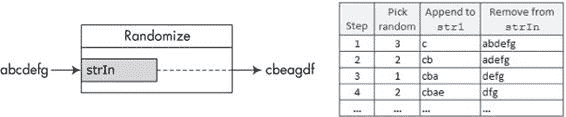图 8-10. 展示 Randomize 过程

我们将从`strIn`中随机挑选一个字母，并将该字母附加到*临时字符串* `str1`中。（这个临时字符串从一开始就是空的，我们将在构建混淆词时将其存储在这里。）然后，我们会从`strIn`中移除该字母，以避免重复使用，直到`strIn`为空，整个过程才会结束。**Randomize**过程按照图 8-11 中所示的步骤来实现这些操作。

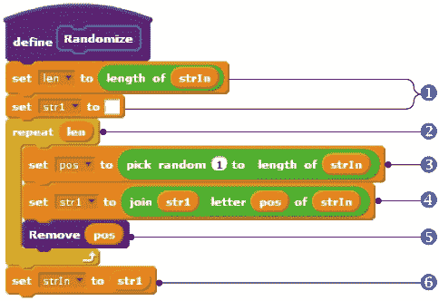图 8-11. Randomize 过程

首先，**Randomize**将`len`设置为输入字符串`strIn`的长度，并清空临时字符串`str1`①。接下来，过程开始一个**重复**循环来组装打乱的单词②。重复次数等于输入字符串的长度。每次循环迭代，我们从`strIn`中随机选择一个位置③，并将该字母追加到`str1`中④。请注意，我们在步骤③中使用了**长度**，因为`strIn`及其长度会在循环内部发生变化。之后，我们调用名为**删除**的过程来删除我们刚刚使用的字符⑤。当循环结束时，`strIn`被设置为打乱后的单词（`str1`）⑥。

**删除**过程，如图 8-12 所示，允许我们避免将同一个字母添加到已经打乱的单词中两次。它会从`strIn`中删除你通过`charPos`参数指定的位置的字符。

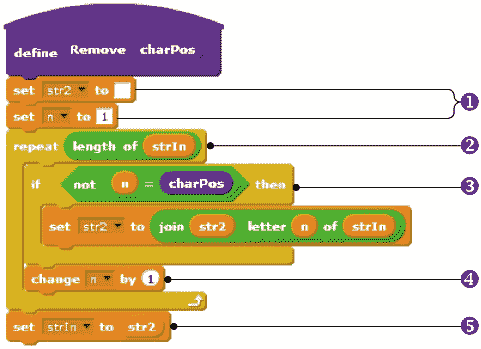图 8-12。删除过程

这个过程使用了另一个临时字符串，名为`str2`，来构建我们想要创建的新字符串。它首先清空`str2`并设置一个循环计数器`n`为 1，以访问`strIn`的第一个字符①。然后，过程开始一个**重复**循环，来组装输出字符串②。如果我们不想删除当前字符，就将它追加到`str2`中③。接着，循环计数器增加 1，访问`strIn`的下一个字母④。当过程结束时，`strIn`被设置为新单词（`str2`）⑤。

现在我们准备探索游戏的主要脚本，如图 8-13 所示。

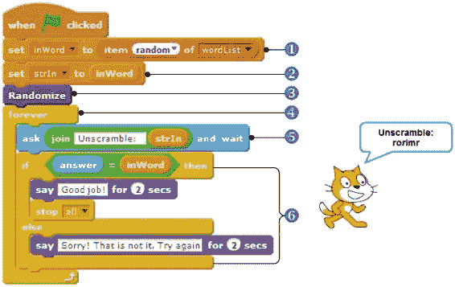图 8-13。Unscramble 游戏的主要脚本

脚本从列表中随机选择一个单词，并将该单词保存到`inWord`中①。然后，它将`strIn`设置为`inWord`②，并调用**Randomize**来打乱`strIn`中的字符③。接着，脚本开始一个循环以获取玩家的答案④。在循环内部，脚本要求玩家输入未打乱的单词⑤，并使用**if/else**块来检查答案⑥。这个部分与我们在上一节的 Fix My Spelling 游戏中所做的完全相同。

前面的例子只是你可以对字符串执行的不同操作的一小部分。尝试使用相同的技巧在你自己的项目中修改字符串！

在本章的其余部分，我们将探索一些使用字符串来解决有趣问题的程序。

## Scratch 项目

你刚才看到的过程演示了处理字符串的基础知识。在本节中，我们将应用所学的内容，编写几个实际应用。在这个过程中，你将学到一些新的编程技巧，可以用在你自己的创作中。

### Shoot

这个游戏旨在通过有趣和富有吸引力的方式教授相对运动的概念。游戏的目标是估算舞台上两个物体之间的转角和移动距离。游戏的用户界面如 图 8-14 所示。

*Shoot.sb2*

图 8-14. 射击游戏的用户界面

游戏开始时，系统会将 `Player` 和 `Target` 精灵随机放置在舞台上的某个位置。接下来，它会提示玩家估算转角和 `Player` 精灵需要移动的距离，以便击中 `Target`。然后，`Player` 精灵会根据玩家输入的数字进行移动。如果精灵停在 `Target` 周围的某个半径范围内，玩家就赢得游戏。否则，`Player` 精灵将返回初始位置，玩家可以再次尝试。当点击绿色旗帜图标开始游戏时，`Player` 精灵运行 图 8-15 中所示的脚本。

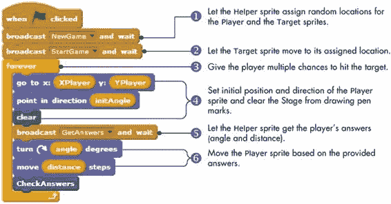图 8-15. 点击绿色旗帜图标时运行的 `Player` 精灵脚本

脚本广播 `NewGame` 来指示 `Helper` 精灵为 `Player` 和 `Target` 精灵分配新的位置①。`Helper` 精灵运行一个简单的过程（未显示），该过程使用随机数更新以下五个变量，以确保 `Player` 和 `Target` 在舞台上可见（并且保持一定距离）：

| `XPlayer` 和 `YPlayer` | `Player` 精灵的 *x* 和 *y* 坐标 |
| --- | --- |
| `XTarget` 和 `YTarget` | `Target` 精灵的 *x* 和 *y* 坐标 |
| `initAngle` | `Player` 精灵的初始方向 |

一旦脚本为 `Player` 和 `Target` 设定了新位置，它会广播 `StartGame` 来将 `Target` 精灵移动到新的位置②。（`Target` 精灵的脚本未在此显示。）接着，脚本进入一个无限循环，为玩家提供多次机会击中目标③。该循环将在玩家击中目标时通过 **stop all** 命令（在 **CheckAnswers** 过程里）终止。

每次循环迭代都会设置 `Player` 精灵的初始位置和方向，并清除舞台 ④ 上所有的画笔痕迹，以删除之前猜测所留下的轨迹。脚本接着广播 `GetAnswers` ⑤，响应时，`Helper` 精灵提示玩家输入答案，如图 8-16 所示。然后，`Helper` 精灵将答案拆分为两部分（逗号前后），并相应更新 `angle` 和 `distance`。跟随图 8-16 上的注释，了解这个脚本如何工作。

然后，`Player` 精灵在玩家的指示下移动，且其画笔处于下压状态⑥。这样，玩家可以看到一条视觉轨迹，帮助他们在下一轮中更好地估计位置。

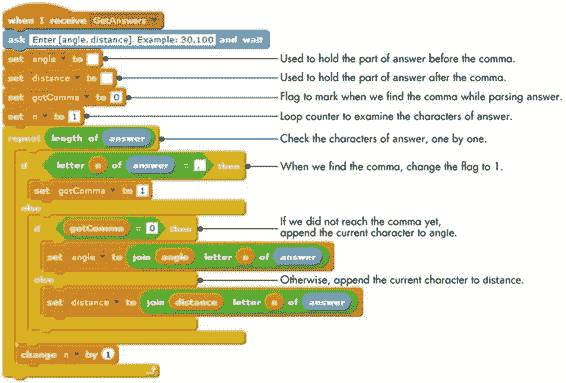图 8-16. `GetAnswers` 脚本

最后，`Player` 精灵执行**CheckAnswers**程序，检查它是否足够接近目标。游戏仅在 `Player` 精灵与目标非常接近时结束。图 8-17 展示了 `Player` 精灵如何检查与目标的距离。

`Player` 精灵使用**distance to**积木检查它与 `Target` 精灵的距离。如果距离小于 20 步，游戏认为这是一次命中，并显示：“你赢了！”否则，射击尝试被视为未命中，**forever** 循环重新开始，玩家获得下一次机会。

图 8-17. `Player` 精灵的 CheckAnswers 程序。试试 8-4

修改 Shoot 游戏，记录玩家击中目标的次数，并根据此为玩家分配相应的分数。

### 二进制转十进制转换器

二进制（基数 2）数字只有两个可能的数字：0 和 1。大多数计算机使用二进制数字进行操作和通信。然而，人类更喜欢使用十进制（基数 10）系统进行计算。在这一部分，你将开发一个应用程序，将二进制数字转换为其十进制等效值。以后，你可以将其作为游戏来测试你进行这种转换的能力。

*BinaryToDecimal.sb2*

我们首先讨论如何将二进制转换为十进制。图 8-18 展示了一个使用二进制数字 10011011 的示例。

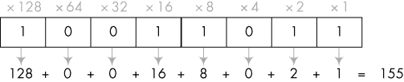图 8-18. 将二进制数字转换为十进制数字

我们需要做的就是将每个二进制位乘以其对应的位置值，并将结果相加。*位置值*对应于从右到左基数的逐次幂，第一个位置的幂为 0。由于二进制是基数为 2，因此最右边的数字具有位置值 2⁰ = 1，所以你将该数字乘以 1。接着，下一位乘以 2¹ = 2，再下一位乘以 2² = 4，以此类推。

图 8-19 展示了二进制到十进制转换应用程序的用户界面。该程序要求用户输入一个 8 位的二进制数。然后，它将在舞台上显示输入的数字，并用`Bit`精灵展示，`Bit`精灵使用两种服装来表示 0 和 1。程序还会计算等效的十进制数字，并且`Driver`精灵（其服装为计算机样式）将该值展示给用户。

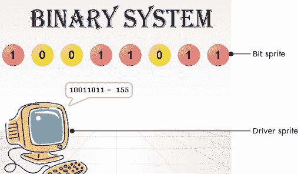图 8-19。二进制到十进制转换程序 试一试 8-5

为了检查你的理解，练习以下二进制转十进制的转换： (a) 1010100，(b) 1101001，和 (c) 1100001。

当绿色旗帜图标被点击时，程序开始运行。该事件由`Driver`精灵捕获，`Driver`精灵执行图 8-20 中所示的脚本。

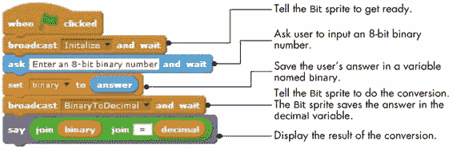图 8-20。`Driver`精灵的脚本

该脚本准备舞台，并要求用户输入一个二进制数字，以便`Bit`精灵开始新的转换轮次。当`Bit`精灵完成任务后，`Driver`精灵将显示计算出的十进制值，该值由`Bit`精灵在一个名为`decimal`的共享变量中计算并存储。

`Bit`精灵在接收到`Initialize`消息后执行的脚本如图 8-21 所示。

图 8-21。`Bit`精灵的`Initialize`脚本

该脚本绘制了一个表示八个零的位模式。在稍后的说明中，你将看到，每当用户输入的字符串中出现二进制 1 时，脚本会在相应的位上盖上数字 1 的服装。当用户输入需要转换的二进制数字时，`Bit`精灵应该接收`BinaryToDecimal`消息，并执行图 8-22 中所示的脚本。

图 8-22。`Bit`精灵的`BinaryToDecimal`脚本

首先，转换程序初始化它将使用的所有变量①：

+   `length` 是用户输入的二进制数字的位数。

+   `pos` 指向输入数字的最右边的数字。

+   `weight` 从最右边二进制数字的位值开始。

+   `decimal` 设置为 0，但将在最后存储转换结果。

+   `xPos` 从图像最右边二进制数字的 *x* 坐标开始。

在`repeat`循环②内部，程序检查每个数字，看看它是 1 还是 0。如果循环发现是 1③，它将当前`weight`的值加到`decimal`中，并在数字 0 的图像上盖上数字 1 的服装。

在循环的末尾，脚本在进入下一次迭代之前更新几个变量：

+   `pos` 更新为指向我们刚处理的数字左侧的数字。

+   `xPos` 对齐到下一个数字图像的中心，以防我们需要盖上新的图像。

+   `weight` 乘以 2，这意味着随着循环的迭代，它将取值为 1、2、4、8、16 等。

试试看 8-6

让`Driver`角色在广播`BinaryToDecimal`消息给`Bit`角色之前，验证用户输入的数字。你需要验证：（1）用户输入的数字是一个二进制数字（即，它只包含 1 和 0），以及（2）输入的长度最多为八位。

### 刽子手

在本节中，我们将编写一个经典的刽子手游戏。图 8-23 展示了游戏的实际操作。

*Hangman.sb2*

图 8-23. 刽子手游戏的用户界面

程序随机选择一个秘密的六个字母的单词，并为每个字母显示一个问号。玩家有八次机会猜测单词中的字母。如果玩家猜对了字母，程序会显示该字母在单词中所有出现的位置。否则，程序会展示刽子手形象的一部分（头、身体、左臂等等）。经过八次错误的猜测后，程序完成刽子手的形象，玩家输掉游戏。如果玩家在八次尝试或更少的次数内猜对了秘密单词，则结果为胜利。该应用包含以下四个角色：

> **Driver** 这个角色在游戏开始时隐藏自己，提示玩家输入猜测，并处理玩家的答案。当游戏结束时，角色显示以下两种服装之一：
> 
> 
> 
> **刽子手** 这个角色展示了刽子手逐步形成的图像。它总共有九个服装，每个服装展示了刽子手身体的一个新增部位，如图 8-24 所示。

图 8-24. `Hangman`角色的九个服装

> **New** 这个角色在舞台上显示`New`按钮。
> 
> **Helper** 这个不可见的角色显示玩家猜测的字母以及剩余的猜测次数。它使用七个带有监视器的变量，监视器配置为大显示屏并放置在舞台上的正确位置。通过使用不同的角色来更新显示，将游戏逻辑与用户界面分开。例如，您可以更改此角色，在舞台上显示更花哨的字母，而不会影响应用程序的其他部分。

当玩家按下`New`角色（`New`按钮）时，它会广播`NewGame`消息，通知`Driver`角色游戏开始了。当`Driver`角色接收到此消息时，它会执行图 8-25 中显示的脚本。

图 8-25. `Driver`角色的`NewGame`脚本

脚本重置游戏的用户界面①，并启动一个循环②来读取字母猜测。另一个由`Driver`角色调用的过程将在检测到游戏结束条件时，通过**stop all**块终止此循环。

在每次循环迭代中，`Driver`角色会要求玩家猜一个字母并等待输入③。当玩家输入猜测时，脚本调用**ProcessAnswer**，该过程会更新一个标志（名为`gotLetter`），用于指示字母是否正确。

当**ProcessAnswer**返回时，脚本检查`gotLetter`标志④，并根据玩家的猜测是否正确采取行动。我接下来将解释`NewGame`调用的过程，从图 8-26 中的脚本开始。

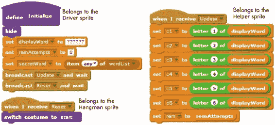图 8-26. 从初始化过程触发的脚本

在初始化期间，`Driver`角色会隐藏自己，将`displayWord`初始化为包含六个问号的字符串，并将`remAttempts`（玩家剩余猜测次数）设置为 8。然后，它会从预定义的六个字母单词列表中选择`secretWord`。接下来，过程广播`Update`，以便`Helper`角色将其变量（在舞台上可见的监视器）赋值为正确的数值。最后的指令广播`Reset`消息给`Hangman`角色。当`Hangman`角色接收到此消息时，它会切换到其`start`服装，显示一个空的绞刑架。

现在让我们考虑一个简单的例子，帮助我们理解**ProcessAnswer**过程的作用（见图 8-27）。假设秘密单词是*across*，这是游戏的第一轮（也就是说`displayWord`是“??????”）。如果玩家的第一次猜测是`r`，那么**ProcessAnswer**应该将`gotLetter`设置为 1，表示猜对了，将`displayWord`设置为“??r???”，显示字母的位置，并将`qmarkCount`（更新后的显示字符串中的问号数量）设置为 5。当`qmarkCount`为 0 时，玩家已经猜出了秘密单词中的所有字母。**ProcessAnswer**属于`Driver`精灵，完整的脚本可以在图 8-27（左）中看到。

**ProcessAnswer**开始时将`gotLetter`标志和`qmarkCount`都重置为 0。它会在每个未知字母出现时，将`qmarkCount`增加 1。临时变量`temp`用于在每次猜测后构建显示字符串，初始化为空字符串。`pos`变量用作循环计数器。

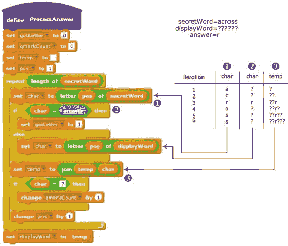图 8-27. ProcessAnswer 过程

循环检查`secretWord`的每个字母，使用`pos`作为索引。如果检查到的字母（保存在`char`中）等于猜测的字母（保存在 Scratch 的内置`answer`变量中），则将`gotLetter`标志设置为 1。否则，`char`变量会被设置为`displayWord`变量中对应位置的字母。不论哪种情况，脚本都会将`char`添加到`temp`的末尾，如图 8-27（右）所示。

当循环结束时，`displayWord`变量将包含六个字母，这些字母将在舞台上显示，并考虑到用户最近的猜测。该循环还会跟踪显示字符串中问号的数量。如果没有问号，则说明用户已经成功猜出秘密单词。

当**ProcessAnswer**返回时，`NewGame`消息处理程序会检查`gotLetter`，以查看玩家是否猜对了。如果没有，它将调用**ProcessWrongGuess**，如图 8-28 所示。

该过程广播`WrongGuess`，通知`Hangman`精灵显示其下一个服装，然后将剩余猜测次数减 1。如果用户已经没有猜测机会，脚本会揭示秘密单词并结束游戏。否则，脚本广播`Update`消息，显示玩家剩余的猜测次数。

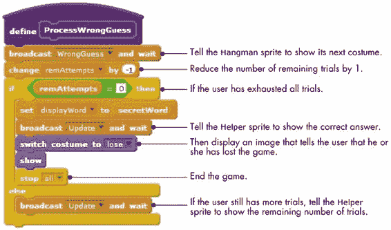图 8-28. ProcessWrongGuess 过程

如果玩家的字母正确，则应调用图 8-29 中显示的 **ProcessCorrectGuess**，而不是 **ProcessWrongGuess**。

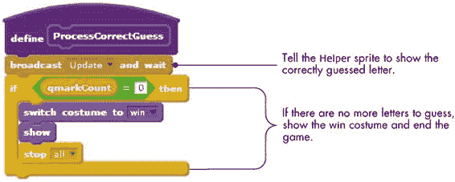图 8-29. ProcessCorrectGuess 程序

**ProcessCorrectGuess** 广播 `Update` 消息，显示玩家正确猜出的字母。接着，它检查 `qmarkCount` 的值。如果 `qmarkCount` 为 0，说明玩家已正确猜出了所有字母，于是 `Driver` 精灵显示其 `win` 服装并结束游戏。

尝试一下 8-7

Hangman 程序不验证用户输入；你可以输入一个非字母字符甚至是整个单词。修改程序，使其拒绝用户的任何无效输入。

### 分数导师

在我们的最后一个例子中，我们将展示一个教学分数的教育游戏。该游戏的界面如图 8-30 所示。玩家可以选择一个运算符（+、–、× 或 ÷），并点击 `New` 按钮创建一个新问题。当玩家输入答案并点击 `Check` 按钮时，`Teacher` 精灵（一个女性形象）会检查答案并提供适当的反馈消息。

*FractionTutor.sb2*

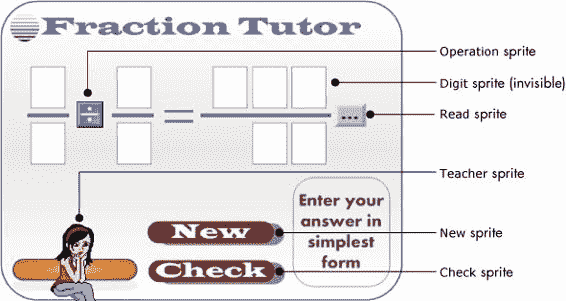图 8-30. 分数导师应用程序的用户界面

该应用程序包含六个精灵。`Operation` 允许玩家选择数学运算。`Read` 显示答案输入按钮，`New` 显示 `New` 按钮，`Check` 显示 `Check` 按钮。`Teacher` 精灵检查玩家的答案，而一个名为 `Digit` 的隐形精灵在舞台上打印出与当前问题对应的数字。

当玩家点击 `New` 精灵（`New` 按钮）时，它会执行图 8-31 中显示的脚本。该脚本将 1 到 9 之间的随机值分配给两个操作数的分子和分母，这些值由四个变量 `num1`、`den1`、`num2` 和 `den2` 表示。然后，它广播一个 `NewProblem` 消息，告诉 `Digit` 精灵在舞台上打印这些数字。

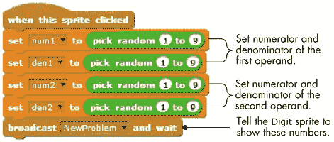图 8-31. `New` 精灵的脚本

`Digit`精灵有 12 个服装（命名为`d1`至`d12`），如图 8-32（右图）所示。当该精灵接收到`NewProblem`广播时，它会盖上代表两个操作数的分子和分母的服装。图 8-32 还展示了执行实际盖图过程的步骤。

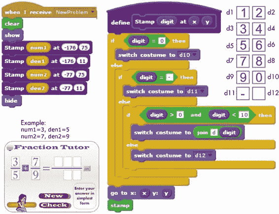图 8-32。`Digit`精灵的功能

该过程使用嵌套的**if/else**块来确定哪个服装对应于要盖上的数字。注意，数字 1 到 9 的服装名称是通过**join**运算符组合而成的。切换到正确的服装后，`Digit`精灵会移动到指定的(*x*,*y*)位置，并在该位置盖上服装的图像。

当新问题显示时，用户可以点击`Read`按钮输入答案。与此按钮关联的脚本如图 8-33 所示。脚本中将玩家的答案解析为两个标记（分子和分母）的部分与图 8-16 中提取`Shoot`游戏中`answer`的`angle`和`distance`部分类似，因此此处不再显示。有关完整过程，请查看*FractionTutor.sb2*文件。

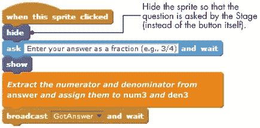图 8-33。`Read`精灵的脚本

首先，用户被要求输入一个分数形式的答案（例如，3/5 或–7/8）。然后，脚本提取答案字符串的分子和分母（它们由除号分隔），并分别将它们赋值给`num3`和`den3`变量。例如，如果用户输入–23/15，`num3`将被设置为–23，`den3`将被设置为 15。之后，脚本广播一个`GotAnswer`消息，告诉`Digit`精灵在舞台上展示用户的答案。当`Digit`精灵接收到该消息时，它会以与显示两个操作数分子和分母相同的方式，在舞台上正确的位置盖上`num3`和`den3`的数字。您可以查看*FractionTutor.sb2*文件了解详情。

输入答案后，用户可以点击`Check`按钮查看答案是否正确。`Check`精灵的脚本广播一个`CheckAnswer`消息，通知其他精灵用户的请求。该消息由`Teacher`精灵捕获并处理，`Teacher`精灵将执行图 8-34 所示的脚本。

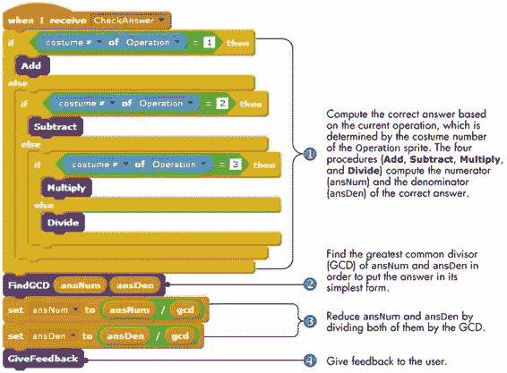图 8-34. `CheckAnswer`脚本

当前`Operation`精灵的服装告诉我们需要执行哪种操作过程（**加法**、**减法**、**乘法**或**除法**）①。操作以`num1`、`den1`、`num2`和`den2`为输入，设置`ansNum`和`ansDen`的值，分别代表正确答案的分子和分母。这四个过程如图 8-35 所示。

在找到答案后，`CheckAnswer`需要将其简化。例如，2/4 应该简化为 1/2。为了执行此简化，脚本首先找到分子和分母的最大公约数（GCD），也称为最大公因数②。（稍后我们将看这个过程。）

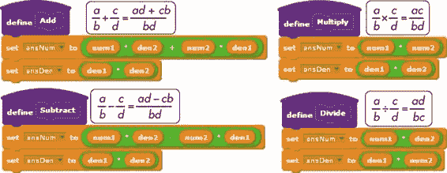图 8-35. `Teacher`精灵的加法、减法、乘法和除法过程

找到 GCD 后，脚本将`ansNum`和`ansDen`分别除以该值③，并调用**GiveFeedback**④来显示用户的答案是否正确。

现在让我们更仔细地看看这些过程的细节，从图 8-35 中展示的四个操作过程开始。

这些过程计算执行类似以下形式的操作结果：

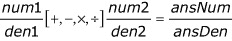

并将结果存储在两个变量中（`ansNum`和`ansDen`），分别对应答案的分子和分母。

现在让我们继续讲解**FindGCD**过程，如图 8-36 所示。

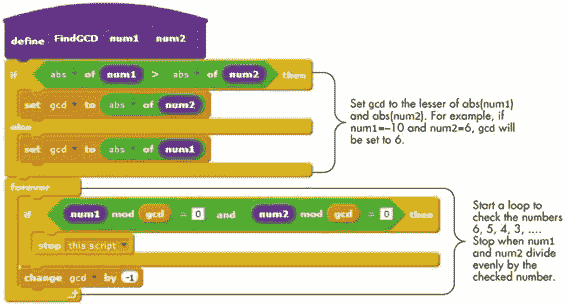图 8-36. `Teacher`精灵的 FindGCD 过程

让我们跟踪**FindGCD**的操作，当`num1` = –10 且`num2` = 6 时。我们需要找到一个最大的正整数，它能整除`num1`和`num2`而没有余数。过程从将`gcd`（结果）设置为两个数的较小绝对值开始，在本例中为–6。然后，循环测试数字 6、5、4，以此类推，直到`num1`和`num2`都能被检查的数字整除。这就是我们要找的结果。在本例中，`gcd`将被设置为 2，因为两个数（–10 和 6）都能被 2 整除且没有余数。

最后一个需要检查的过程是**GiveFeedback**过程，它将用户的答案与正确答案进行比较，并显示适当的信息，如图 8-37 所示。该图还展示了一些示例，演示了**if/else**结构的不同情况。

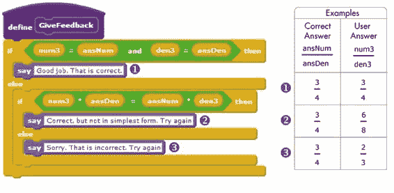图 8-37. `Teacher` 精灵的 GiveFeedback 过程 尝试 8-8

修改分数辅导程序，以跟踪正确和错误答案的数量。设计一个计算分数并显示给用户的方案。

## 总结

字符串处理是一个重要的编程技能。在本章中，你学习了如何访问字符串的单个字符，以便将它们组合、比较、删除和重新排列。

我们从详细了解字符串数据类型以及字符串如何作为字符序列存储开始。然后我们编写了几个程序，演示了基本的字符串操作技术。之后，我们使用这些技术编写了几个有趣且实用的应用程序。这些项目中发展出的概念可以应用于许多其他领域，我真心希望它们能帮助你想到自己的项目。

在下一章中，你将学习关于列表的内容，以及如何使用它们来存储和操作一组值。掌握了这一新的数据结构后，你将拥有编写专业程序所需的所有工具。

## 问题

| **问：** | 1\. 编写一个程序，要求用户输入一个单词，然后输出该单词 *N* 次，其中 *N* 是输入单词中字符的数量。 |
| --- | --- |
| **问：** | 2\. 编写一个程序，要求用户输入一个单词。程序随后确定字母 *a* 在输入单词中的出现次数。 |
| **问：** | 3\. 编写一个程序，读取用户输入的一个单数英语名词。程序随后生成该名词的复数形式。（提示：检查输入单词的最后一个字母和倒数第二个字母。）为了保持程序简单，仅考虑以下规则：如果单词以 *ch*、*x* 或 *s* 结尾，则加 *es* 构成复数，否则只加 *s*。 |
| **问：** | 4\. 编写一个程序，读取用户输入的一个字符（介于 *a* 和 *z* 之间），并输出该字符在字母表中的位置（*a* = 1，*b* = 2，*c* = 3，依此类推）。大写字母和小写字母应当视为相同。（提示：定义一个名为 `alpha` 的变量，存储字母表中的字母，正如我们在图 8-9 中所做的，然后使用循环查找输入字符在变量 *alpha* 中的位置。） |
| **问：** | 5\. 编写一个程序，要求用户输入一个字母，然后显示该字母前面的字母。（提示：使用与上一问题中相同的技巧。） |
| **问：** | 6\. 编写一个程序，读取用户输入的正整数，然后找到并显示其各位数字的和。例如，如果用户输入`3582`，程序应该显示`18`（3 + 5 + 8 + 2）。 |
| **问：** | 7\. 编写一个程序，读取用户输入的一个单词，然后使用**说**积木以反向顺序显示字母。 |
| **问：** | 8\. 编写一个程序，从用户那里获取一个数字，并在每对数字之间插入一个空格。例如，如果输入数字是`1234`，则输出字符串应为`1 2 3 4`。（提示：通过在输入数字的每个单独数字之间加入空格来构建输出变量。） |
| **问：** | 9\. 在这个问题中，您将创建一个游戏，让玩家比较分数。用户界面如下所示。当点击`新建`按钮时，游戏会随机选择两个分数进行比较。用户通过点击运算符按钮选择小于(<)、大于(>)或等于(=)。当用户点击`检查`按钮时，游戏会检查答案并提供反馈。打开文件*CompareFractions.sb2*并添加必要的脚本来完成游戏。*Compare Fractions.sb2*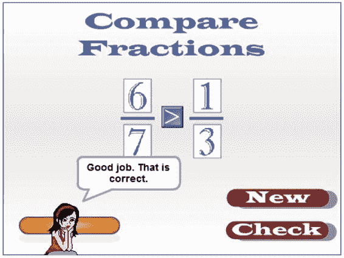 |
