## 第九章 列表

到目前为止，我们编写的程序使用普通变量来存储单一数据。但是，当你需要存储一堆值时，比如朋友的电话号码、书名或一个月的温度读数，这种变量就不太实用了。

例如，如果你希望你的程序记住 20 个朋友的电话号码，你需要 20 个变量！显然，编写和维护一个包含 20 个变量的程序会非常繁琐。在本章中，我们将探索另一种内建数据类型——*列表*，它提供了一种方便的方式来组织相关的值。以下是我们将要讨论的内容：

+   如何创建和操作列表

+   初始化并访问列表中的单个元素

+   基本的排序和搜索技巧

+   使用列表创建强大的应用程序

首先，我将解释如何在 Scratch 中创建列表，演示你可以使用的命令，并展示如何用用户输入的数据填充列表。接下来，我们将讨论数字列表和对其执行的常见操作，例如查找最小值、最大值和元素的平均值。之后，我们将学习一种用于对列表中的元素进行排序的算法。最后，我们将通过几个示例程序展示列表的一些实际应用。

## Scratch 中的列表

列表就像一个容器，你可以在其中存储和访问多个值。你可以把它看作一个有许多抽屉的衣柜，每个抽屉存储一个项目。当你创建一个列表时，你需要为它命名，就像你为变量命名一样。然后，你可以通过它们在列表中的存储位置来访问列表的单个元素。图 9-1 中展示了一个名为`dayList`的列表，它存储了星期一到星期日的名称。

你可以通过*存储索引*（或位置）来引用列表中的项。在 Scratch 中，第一个项的索引为 1，第二个项的索引为 2，依此类推。例如，由于星期二是列表中的第三项，因此它的索引为 3。因此，你可以通过“item 3 of `dayList`”命令来引用我们的`dayList`中的第三个元素。

让我们直接开始在 Scratch 中创建一些列表。我们还将了解一些可以帮助我们管理和操作程序中列表的命令，并学习 Scratch 如何响应无效的列表命令。

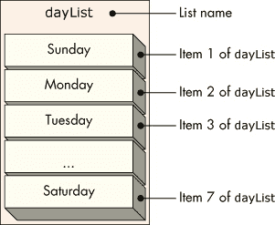图 9-1：包含星期几的列表

### 创建列表

创建列表几乎与创建变量相同。选择*数据*面板并点击**创建列表**，以弹出图 9-2（右）中的对话框。接下来，输入列表的名称（我们将使用 `dayList`）并指定其作用域。选择“对所有精灵有效”选项会创建一个*全局*列表，应用程序中的任何精灵都可以访问，而选择“仅对该精灵有效”选项会创建一个*局部*列表，仅属于当前选定的精灵。局部列表只能被所属的精灵读取（和写入）。

当你点击**确定**确认输入时，Scratch 会创建一个新的*空列表*并显示与列表相关的块，如图 9-3 所示。这与创建新变量时看到的情况类似。空列表是指不包含任何项的列表。

你可以使用这些新命令在脚本运行时操作列表的内容。你可以添加新项、在特定位置插入项、删除某些项或替换现有项的值。

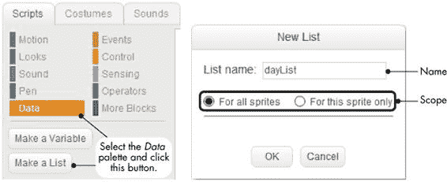图 9-2. 在 Scratch 中创建列表类似于创建变量。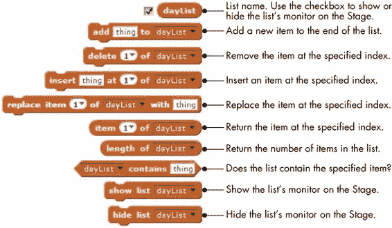图 9-3. 可以与列表一起使用的命令和功能块

当创建一个新列表时，Scratch 还会在舞台上显示该列表的监视器，如图 9-4 所示。该列表最初为空，因此它的长度从 0 开始。你可以使用此监视器块在设计程序时向列表添加条目。

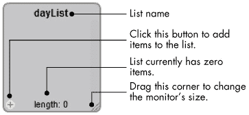图 9-4. 新创建的列表的监视器显示在舞台上。

如果你知道要存储在列表中的数据（就像我们的 `dayList` 一样），你可以在此时将数据添加到列表中。图 9-5 展示了如何通过其监视器将天数添加到 `dayList`。

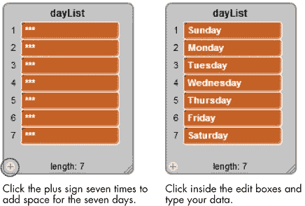图 9-5. 填充 `dayList`

在左下角点击加号七次，创建七个条目，然后在每个编辑框中输入一周的某一天。使用 TAB 键在列表项之间导航。按一次 TAB 键会将下一个列表项高亮显示，带有黄色边框。再按一次 TAB 键会高亮选中的可编辑文本，并去掉黄色边框。如果在当前选中的项目周围有黄色边框时点击加号，新列表项会被添加到当前项之后；否则，它会被添加到当前项之前。试着导航列表吧！

练习 9-1

按照图 9-5 所示，使用星期几的名称填充`dayList`。

### 列表命令

图 9-3 描述了当我们创建`dayList`时，Scratch 添加的所有块。在本节中，我们将更详细地查看这些块，以便更好地理解它们的功能。

#### 添加和删除

**add**命令将一个新项目添加到列表的末尾，而**delete**命令则从特定位置删除一个项目。图 9-6 展示了这些命令的实际应用。

脚本首先执行**delete**命令删除列表中的第二项，即“橙子”。然后，脚本使用**add**命令将“柠檬”添加到列表的末尾。

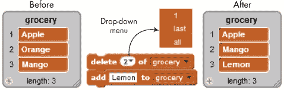图 9-6. 使用 add 和 delete 改变列表内容前后的效果

**add**命令非常直接，但让我们更仔细地查看**delete**命令。你可以直接将要删除的元素的索引输入到块的参数框中，或者点击下拉箭头。下拉菜单（参见图 9-6）显示了三个选项：1、last 和 all。选择 1 删除列表中的第一个项目（“苹果”），选择 last 删除最后一个项目（“芒果”），或选择 all 删除列表中的所有项目。

#### 插入和替换

假设您希望按字母顺序存储朋友们的姓名和电话号码，就像手机中的联系人列表一样。在制作列表时，您需要将每个朋友的联系信息插入到合适的位置。之后，如果某个朋友有了新电话号码，您将需要编辑列表来输入它。**insert**和**replace**命令可以帮助您完成这些任务。图 9-7 展示了如何在我们的`phone`列表中使用**insert**和**replace**命令的示例。

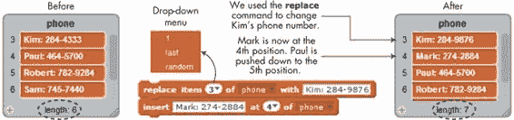图 9-7。使用 insert 和 replace 命令更新电话号码列表

**replace**命令将位置为 3 的当前字符串替换为 Kim 的新电话号码。**insert**命令将在列表的第 4 个位置插入新朋友 Mark 的电话号码。请注意，现有的元素下移一个位置，为新的条目腾出空间。

在**replace**和**insert**命令中，点击项目编号的下箭头会显示一个下拉菜单，包含三个选项：1、last 和 random（见图 9-7）。如果选择 random，所选命令将随机选择一个项目编号。您将在本章后面看到这一功能的一些有用应用。

#### 访问列表元素

正如我们之前提到的，您可以使用该元素的索引来访问列表中的任何元素。例如，图图 9-8 中的脚本演示了使用**item of**块来访问我们的`dayList`中的元素。该脚本使用了一个名为`pos`（*位置*的缩写）的变量，通过它来迭代列表中的每个元素，并通过**say**命令显示内容。

图 9-8。该脚本使得精灵显示我们的`dayList`中的七天。

该脚本将`pos`的初始值设为 1，以便访问`dayList`中的第一个元素，然后进入循环。该循环的重复次数设置为 7，这是我们列表中元素的数量。在每次循环中，循环将显示索引等于`pos`的列表项，并将`pos`的值递增，以便访问下一个元素。换句话说，我们正在使用`pos`作为索引来定位列表中的特定元素。

练习 9-2

将 repeat 循环中的数字 7 替换为**dayList 的长度**积木。这通常是你在不知道列表包含多少项时遍历列表的做法。另外，在**item of**积木的第一个下拉菜单中选择**random**。这样应该会使脚本从列表中随机显示一个项目。

#### contains 积木

你可以通过使用**contains**来检查某个字符串是否在列表中，这是一个布尔型积木，它会根据列表是否包含该字符串返回真或假。图 9-9 展示了这个积木的一个使用示例。由于`dayList`包含字符串“Friday”，因此**if**积木内的**say**命令将被执行。

### 注意

*该* **contains** *积木是不区分大小写的。例如，积木* **dayList contains friDAY***也会返回 true。*

图 9-9. 使用 contains 积木检查字符串是否在列表中

### 边界检查

四个列表积木（**delete**、**insert**、**replace**和**item of**）需要一个输入参数来指定你想访问的项目的索引。例如，要删除`dayList`中的第七个元素，我们使用**delete 7 of dayList**。但你认为，如果使用无效的索引与这些积木之一一起使用，会发生什么呢？例如，如果你要求 Scratch 删除我们`dayList`中的第八个元素（它只有七个元素），Scratch 会如何响应？

试图访问超出列表边界的元素，严格来说，是一种错误。然而，Scratch 并不会显示错误信息或突然终止程序，而是默默地尝试用合适的方式处理出现问题的积木。因此，缺少错误信息并不意味着没有错误。你的代码中可能仍然存在问题，当这些问题出现时，你仍然需要修复它们。Scratch 不会抱怨积木中的无效索引，但结果通常不会是你预期的。表 9-1 展示了当你尝试使用越界索引访问`dayList`时可能发生的情况。

表 9-1. 使用无效列表索引的意外结果

| 命令或功能积木 | 结果 |
| --- | --- |
|  | 返回空字符串，因为`dayList`只有七个项目。如果你使用小于 1 的索引，也会发生相同的情况。 |
|  | Scratch 忽略.9 并返回`dayList`中的第一个项目，“Sunday”。类似地，如果你要求获取第 5.3 个项目，Scratch 将返回第五个项目，“Thursday”。 |
|  | Scratch 会忽略此命令，因为它试图在列表中创建一个间隙。列表保持不变。 |
|  | 这与**add**命令的效果相同。它将“Newday”添加到列表的末尾。 |
|  | 此命令被忽略（因为 `dayList` 只有七个元素），列表保持不变。 |

表格 9-1 中的示例表明，尽管 Scratch 的积木在输入无效时会尝试做一些合理的处理，但它们不一定会做出正确的操作。你必须为你的程序提供正确的输入，这样它才能按你希望的方式工作。

到目前为止，我们的示例使用了通过其监视器手动创建的简单列表。现在的问题是：如果你在编写程序时不知道列表的内容该怎么办？例如，你可能需要创建一个用户输入的数字列表，或者每次运行程序时用随机值填充一个列表。我们将在接下来解决这个问题。

## 动态列表

列表之所以强大，是因为它们可以在程序运行时动态增长或缩小。例如，假设你正在编写一个成绩册应用程序，教师可以输入学生的测试成绩以供进一步处理。（教师可能需要为一个班级找出最大分数、最小分数、平均分、中位数等。）然而，每个班级的学生数量可能不同。教师可能需要为班级 1 输入 20 个成绩，为班级 2 输入 25 个成绩，依此类推。你的程序如何知道教师已经完成了成绩输入？本节将解答这个问题。

首先，我们将介绍两种方法来填充用户输入的数据到列表中。然后，我们将探讨数字列表，并查看在它们上面执行的一些常见操作。一旦你理解了这些基本概念，你就能准备好将这些技巧应用到自己的应用程序中。

### 使用用户输入填充列表

填充列表的常见方法有两种。在第一种方法中，程序首先询问将有多少条输入数据，然后开始一个循环来收集用户的输入。演示此技术的脚本见于图 9-10。

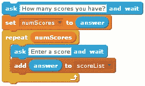图 9-10. 询问用户将输入多少分数

一旦用户告诉脚本期望输入多少个分数，脚本会开始一个循环，循环的重复次数等于用户的输入。每次循环迭代中，脚本会要求用户输入一个新的分数，并将该值添加到名为 `scoreList` 的列表中。

动态填充列表的第二种方法是让用户输入一个特殊的值（称为*哨兵*）来标记列表的结束。当然，你应该选择一个不会与列表成员混淆的哨兵值。例如，如果你预计输入的是一组名字或正数，那么 –1 是一个不错的选择。另一方面，如果用户会输入负值，那么 –1 就不适合作为哨兵值。使用 –1 作为我们的`scoreList`的哨兵是可行的，示例脚本在图 9-11 中使用这个哨兵值来判断用户何时完成输入值。

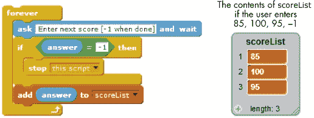图 9-11. 使用哨兵控制列表增长

在每次循环迭代中，脚本会提示用户输入一个数字，并将该值与哨兵进行比较。请注意，脚本在提示用户时会指定哨兵值（在此示例中为 –1）。如果用户输入 –1，脚本会停止，因为它知道用户已经完成了分数的输入。否则，输入的值会被添加到列表中，用户将被提示输入另一个值。图 9-11 展示了当用户输入三个分数后再输入哨兵值时，`scoreList` 应该是什么样子。

### 创建柱状图

作为一个实际的例子，我们来写一个应用程序，从用户输入的数字中绘制柱状图（也叫做*直方图*）。为了简化，我们只接受 1 到 40 之间的五个数字。当程序收集到所有五个数字后，它将绘制五个柱状条，高度与输入值成比例。我们柱状图制作器的用户界面如图 9-12 所示。

*BarChart.sb2*

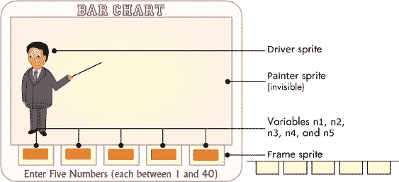图 9-12. 柱状图应用程序

这个应用程序包含三个精灵。`Driver`精灵控制应用程序的流程；它包含接受用户输入、填充列表并指示`Painter`精灵开始绘图的脚本。`Painter`精灵是一个不可见的精灵，负责绘制条形图。`Frame`精灵纯粹是装饰性的；它隐藏每个条形的底部，使其看起来平坦；如果没有它，垂直条形的底部会有圆形的尖端。五个条形的数值通过五个变量显示，命名为`n1`到`n5`，它们的显示器位于舞台的右侧。当你点击绿色旗帜图标开始应用程序时，`Driver`精灵运行图 9-13 中显示的脚本。

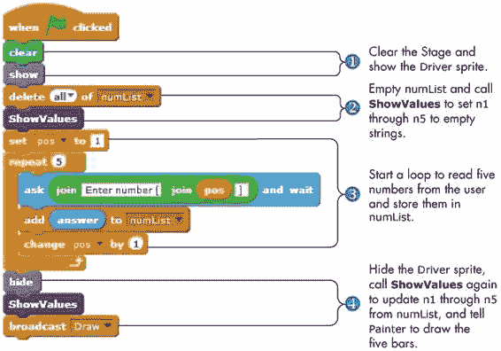图 9-13. `Driver`精灵的主脚本

首先，`Driver`精灵出现在舞台上并清除任何先前的笔迹①。这样，如果已经有条形图，它会在绘制新图之前被清除。脚本随后清空`numList`，以便我们可以用它来收集用户的新输入，并调用**ShowValues** ②来设置`n1`到`n5`，以便它们的显示器是空白的。

当舞台准备好后，脚本进入**repeat**循环③，循环执行五次。在循环内部，`Driver`提示用户输入一个数字，并将该数字附加到`numList`中。在收集到用户的五个数字并将它们保存在`numList`中后，`Driver`精灵隐藏自己④，为条形图腾出空间。然后它再次调用**ShowValues**，用用户的新值更新`n1`到`n5`，并广播`Draw`消息，这样`Painter`精灵就会绘制五个条形。

在查看`Painter`如何绘制条形图之前，先来看一下**ShowValues**过程，如图 9-14 所示。

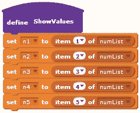图 9-14. `ShowValues`过程

**ShowValues**只是将变量`n1`到`n5`设置为它们在`numList`中的相应值。由于第一次调用**ShowValues**是在清空`numList`之后立即进行的，因此在这个调用后，所有五个变量将包含空字符串。这会导致清除舞台上的五个显示器，这正是我们想要的。当`numList`包含来自用户的数据时，调用**ShowValues**会将这些数据展示在相应的显示器上。

现在让我们来看看**Draw**过程，它在`Painter`精灵收到`Draw`消息时执行。你可以在图 9-15 中看到这个脚本。

图 9-15. `Painter`精灵的 Draw 脚本

精灵首先设置画笔颜色。然后，它将画笔的大小设置为较大的值，以绘制粗条形图。为准备绘制五个垂直条形图，精灵将方向指向上方①。

脚本启动一个重复循环来绘制五根条形图②。我们事先知道每根条形图的* x *位置，因此创建了一个名为`xPos`的列表来存储这些值（如图所示）。在每次循环迭代中，`Painter`精灵移动到当前条形图的* x *位置，放下画笔，然后向上移动以绘制垂直线。

每条线的高度与`numList`中对应的值成正比。我们舞台上的图表区域高 224 像素，由于 40 是最高值，输入 40 应当使条形图和图表一样高。要找出`numList`中任意数字的高度（以像素为单位），我们需要将该数字乘以 5.6（即 224/40）。图 9-16 显示了在从用户那里获取一些数据后应用程序的输出。注意，`Frame`精灵覆盖了宽画笔的圆顶，使得条形图在底部看起来是平的。

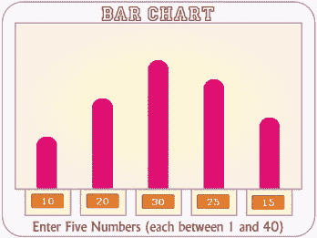图 9-16. 柱状图应用程序的输出示例试试看 9-3

多次运行此应用程序以理解其工作原理。修改脚本，使得每个条形图都用不同的颜色绘制。提示：为`Painter`精灵创建一个新的列表，名为`color`，存储五个条形图的颜色编号，并在绘制每个条形图之前使用以下命令：

## 数字列表

数字列表在许多实际应用中都会出现。我们可以有考试成绩、温度测量、产品价格等的列表。在本节中，我们将探讨一些你可能想对数字列表执行的常见操作。特别是，我们将编写程序来查找最大值或最小值，并计算存储在列表中的数字的平均值。

### 查找最小值和最大值

假设你是一名教师，需要知道你班级上次考试的最高分。你可以编写程序来比较所有这些考试成绩并找到最大值。我们的第一个例子，见图 9-17，找到一个名为`score`的列表中的最高分。

*FindMax.sb2*

**FindMax**过程首先将`maxScore`变量的值设置为列表中的第一个数字。然后，它启动一个循环，比较列表中其余数字与当前`maxScore`的值。每次找到比`maxScore`更大的值时，它就将`maxScore`设置为那个值。当循环结束时，`maxScore`中存储的值将是列表中包含的最大值。

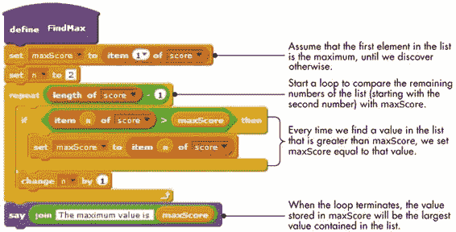图 9-17. 查找列表中的最大数字

查找列表中的最小值遵循类似的算法。我们首先假设列表中的第一个元素是最小的元素，然后使用循环检查其余的元素。每当我们找到一个更小的值时，我们就更新保存最小值的变量。

试试看 9-4

使用本节中学到的内容创建一个名为**FindMin**的过程，找到`score`列表中的最小值。

### 计算平均值

在下一个示例中，我们将编写一个过程，计算存储在`score`列表中的分数的平均值。你可以通过首先计算这些数字的和，再将总和除以*N*，来找到一系列*N*个数字的平均值。图 9-18 中展示的过程正是如此。

*FindAverage.sb2*

图 9-18. 查找一组数字的平均值

**FindAverage**过程使用循环逐一处理列表中存储的分数，将它们加在一起，并将结果存储在名为`sum`的变量中。（在循环开始之前，这个变量初始化为 0。）当循环终止时，脚本通过将`sum`除以分数的数量来计算平均值，并将结果保存在名为`average`的变量中。

### 注意

*特别注意我们在循环中如何累积* sum *变量。这个模式，称为*累加器模式*，在编程中非常常见。*

在下一节中，我们将探讨如何搜索和排序列表，这两个问题在编程中非常常见。我还将带你走过执行每个操作的一些简单算法。

试试看 9-5

将**FindAverage**、**FindMax**和**FindMin**合并为一个过程（称为**ProcessList**），该过程将同时显示`score`列表的平均值、最大值和最小值。

## 搜索和排序列表

假设你有一个没有特定顺序的联系人列表。如果你想组织这些联系人，你可能会根据他们的名字将其*排序*为字母顺序。如果你需要知道某人的电话号码，而你有他们的姓氏，你就需要*搜索*列表，查看其中是否包含该人的联系信息。本节的目标是介绍搜索和排序列表的基本编程技巧。

### 线性搜索

Scratch 的**contains**块提供了一种简单的方法来检查列表中是否包含特定项目。如果我们还想知道所搜索项目在列表中的位置，那么我们必须自己进行搜索。

*SearchList.sb2*

本节将解释一种查找列表项的方法，称为*线性搜索*（或*顺序搜索*）。这种方法易于理解和实现，适用于任何列表，无论列表是否排序。然而，由于线性搜索会将目标值与列表中的每个元素进行比较，如果列表很大，这种方法可能会花费很长时间。

举例来说，假设你正在寻找名为`fruit`的列表中的特定项。如果列表中包含你要找的项，你还需要知道该项的确切位置。图 9-19 中的**SearchList**过程对`fruit`列表进行了线性搜索，以帮助我们找到所需的答案。

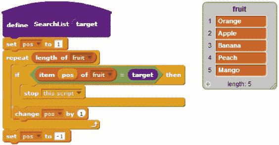图 9-19. SearchList 过程

从第一个元素开始，**SearchList**会将列表中的每个水果与我们要找的项进行逐一比较，该项由`target`参数表示。如果该过程找到值或者到达列表末尾，就会停止。如果脚本找到了我们想要的值，`pos`变量将包含该项找到的位置。否则，过程会将`pos`设置为一个无效值（在本例中为-1），以指示目标项不在列表中。图 9-20 展示了调用此过程的一个例子及其相应的输出。

图 9-20. 使用 SearchList 过程

检查`pos`的值可以告诉调用者两件事：（a）我们要找的项是否在列表中；（b）如果该项存在，它的确切位置。运行此脚本将`pos`设置为 4，表示“桃子”在`fruit`列表的第四个位置找到了。

### 出现频率

假设你的学校对其食堂的食品质量进行了调查。学生们根据 1 到 5 的评分标准对口味进行打分（1 = 差，5 = 优秀）。所有投票已被输入到一个列表中，你被要求编写一个程序来处理这些数据。目前，学校只想知道有多少学生完全不喜欢食物（即有多少人打了 1 分）。你会如何编写这样的程序？

*ItemCount.sb2*

显然，你的程序需要一个过程来统计数字 1 在列表中出现的次数。为了模拟学生的投票，我们使用一个包含 100 个随机投票的列表。填充该列表的过程如图 9-21 所示。这个过程将 100 个介于 1 到 5 之间的随机数字添加到一个名为`survey`的列表中。

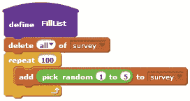图 9-21. FillList 过程

现在我们已经有了一个投票列表，我们可以统计某个评分在该列表中出现的次数。我们将使用**GetItemCount**过程，如图 9-22 所示。

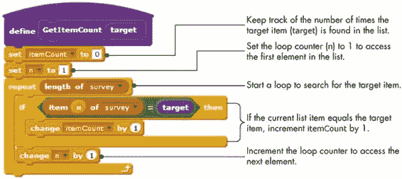图 9-22. 统计列表中某个项目出现的次数

`target`参数表示要查找的项目，而`itemCount`变量则跟踪目标项目出现的次数。该过程首先将`itemCount`设置为 0，然后开始一个**repeat**循环，在列表中查找`target`中指定的值。在每次循环迭代中，程序检查由循环计数器`n`索引的列表项。如果该项等于目标，脚本会将`itemCount`增加 1。

要提供关于对餐厅食物感到厌恶的主要信息，我们只需要使用参数为 1 调用**GetItemCount**，如图 9-23 所示。

图 9-23. 使用 GetItemCount 过程 尝试 9-6

当你回答了这个问题后，校长突然好奇有多少学生给餐厅打了优异的评分。校长还想知道有多少学生参加了调查。修改程序并再次运行，以提供这些额外的信息。

### 冒泡排序

如果你有一组名称、游戏成绩或其他任何你想以特定顺序显示的东西——按字母顺序、从大到小等等——你就必须对列表进行排序。有许多方法可以排序列表，而*冒泡排序*是最简单的算法之一。（这个名字指的是值是如何“冒泡”到它们正确的位置的。）在本节中，我们将学习冒泡排序，并编写一个 Scratch 程序来执行这种排序。

*BubbleSort.sb2*

假设我们需要按降序排列数字列表[6 9 5 7 4 8]。以下步骤说明了冒泡排序算法是如何工作的。

1.  我们将首先比较列表中的前两个元素。由于 9 大于 6，我们可以交换它们的位置，如下所示。

    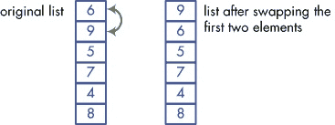

1.  现在我们可以比较第二个和第三个元素，它们是 6 和 5。由于 6 大于 5，这两个数字已经按顺序排列，我们可以继续比较下一个元素。

1.  我们将重复此过程，比较第三个和第四个、第四个和第五个，最后比较第五个和第六个元素。看一下这三个比较后的列表，如下所示。

    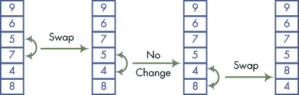

1.  这次冒泡排序已经结束，但我们的列表仍然没有正确排序。我们需要进行第二次遍历，从第一步开始。再一次，我们将比较每一对元素，如果需要，就交换它们。第二次遍历后的列表如下：

    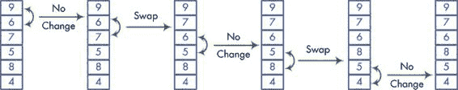

1.  我们将重复冒泡排序过程，直到在一次遍历中没有交换任何数字，意味着我们的列表已经排序。算法的最后三次遍历如下所示：

    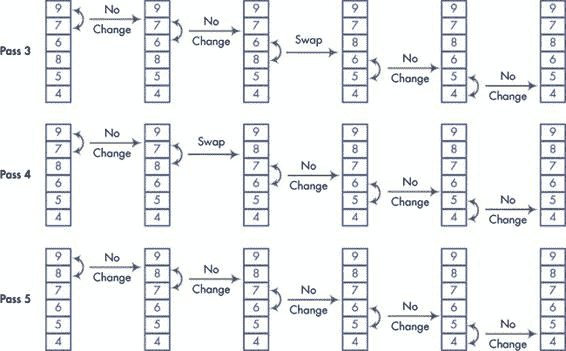

现在你已经了解了冒泡排序是如何工作的，让我们在 Scratch 中实现它。脚本，如图 9-24 所示，有两个循环。内层循环遍历列表，根据需要进行比较和交换，并在需要再次遍历时将标志（名为`done`）设置为 0。外层循环会重复，直到`done`标志为 0，因为该值表示我们尚未完成排序。如果内层循环在没有交换元素的情况下完成一遍，外层循环将退出，结束过程。

让我们更详细地探讨这个过程。由于我们还没有进行任何排序，它将`done`设置为 0 ①。外层循环使用**repeat until**块遍历列表，直到它被排序（也就是说，直到`done`变为 1）②。在每次遍历开始时，这个循环将`done`设置为 1 ③（即假设我们不会进行任何交换）。它还将`pos`设置为 1，从第一个数字开始排序。

内层循环然后比较列表中每对元素。循环需要执行*N* - 1 次比较④，其中*N*是列表中项的数量。

如果`pos+1`索引处的项大于`pos`处的项⑤，则需要交换这两个项。否则，过程会将`pos`加 1，以便比较下一对项。如果我们确实需要交换，过程将借助名为`temp`的临时变量进行交换⑥。

当前遍历结束后，如果内层循环交换了数字，它会将`done`重新设置为 0；如果没有做出任何更改，则`done`保持为 1 ⑦。外层循环将继续，直到列表被排序。

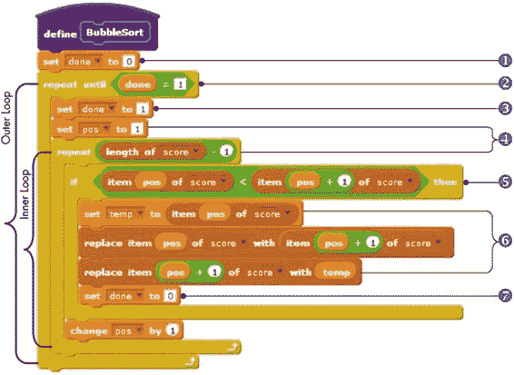图 9-24. 冒泡排序过程 尝试 9-7

制作一个包含名字的列表，而不是数字，并使用冒泡排序脚本将列表按顺序排列。排序是否仍然能按预期工作？另外，为了使它按升序排序，你需要对过程做出什么更改？

### 查找中位数

*Median.sb2*

现在我们知道如何对列表进行排序，我们可以轻松找到任何数字序列的中位数值。回忆一下，中位数是排序数字集合中的中间值。如果我们有奇数个项，我们可以直接取中间的数字。如果有偶数个项，则中位数是两个中间数字的平均值。我们可以描述一个排序列表中*N*项的中位数如下：

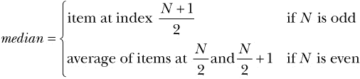

执行此计算的过程如图 9-25 所示。它假设列表已按顺序排列。

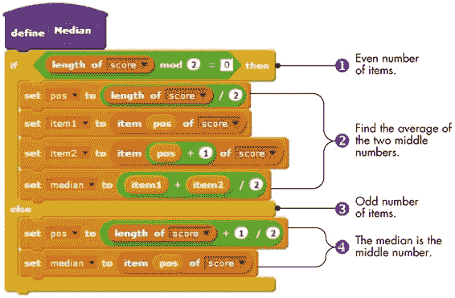图 9-25：寻找排序数字列表的中位数

该过程使用 **if/else** 块来处理偶数和奇数列表的两种情况。如果列表中的项数能够被 2 整除且没有余数（即列表包含偶数个项）①，则 `median` 变量计算为中间两个数字的平均值 ②。否则，列表包含奇数个项 ③，`median` 变量被设置为列表中间的数字 ④。

到目前为止，我们已经涵盖了很多内容，是时候将我们新学到的知识应用到更具挑战性的任务中。本章的其余部分将通过几个示例，展示如何在更复杂的应用中使用列表。

## Scratch 项目

在本节中，您将探索一些实用的 Scratch 项目，突出展示列表的不同方面。我还将介绍一些新的创意和技术，您可以在自己的创作中使用它们。

### 诗人

让我们从本章的项目开始，首先是一个诗歌生成器。我们的人工诗人从五个列表（`article`、`adjective`、`noun`、`verb` 和 `preposition`）中随机选择单词，并根据固定模式将它们组合起来。为了给我们的诗歌一个中心主题，所有列表中的单词都与爱情和自然有某种关联。（当然，我们可能仍然会写出一些傻乎乎的诗歌，但那也很有趣！）

*Poet.sb2*

### 注意

*该程序的思想改编自 Daniel Watt 的* 《Logo 学习》 *(McGraw-Hill，1983 年)。您可以在该项目的 Scratch 文件中找到我们使用的完整单词列表，*Poet.sb2*。*

每首诗由三行组成，遵循以下模式：

+   第 1 行：冠词，形容词，名词

+   第 2 行：冠词，名词，动词，介词，冠词，形容词，名词

+   第 3 行：形容词，形容词，名词

记住这些构造后，我们来看看构建诗歌第一行的过程，如图 9-26 所示。

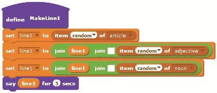图 9-26：编写诗歌的第一行

这个脚本从 `article` 列表中选择一个随机单词并存储在 `line1` 中。然后，脚本添加一个空格，一个随机的 `adjective` 列表中的单词，另一个空格，以及一个随机的 `noun` 列表中的单词。最后，诗人精灵说出完整的一行。我没有展示诗歌的其他两行的过程，因为它们非常相似，但你可以打开 *Poet.sb2* 来查看它们。

这里是我们的机器诗人创作的两首诗：

+   每条迷人的道路

+   每条白色房屋后面都有一条鱼在游动

+   宁静的蓝色池塘

+   每一滴冰冷的水珠

+   每扇可怕的门下都有一颗心在注视

+   害羞安静的女王

试试看 9-8

打开 *Poet.sb2* 并运行几次，看看这个机器诗人能创作出什么。然后修改程序，使其使用三个精灵，每个精灵负责诗歌的一行，允许你一次性在舞台上阅读整首诗。

*Poet.sb2*

### 四边形分类游戏

我们的下一个项目是一个简单的游戏，帮助你探索不同种类的四边形。游戏会在舞台上显示六种形状之一（平行四边形、菱形、矩形、正方形、梯形或风筝形），并要求玩家通过点击正确的按钮来分类该形状，如图 9-27 所示。

*QuadClassify.sb2*

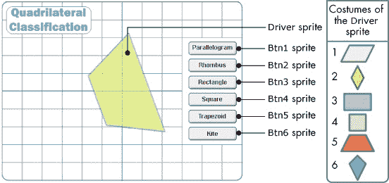图 9-27. 四边形分类游戏的用户界面

游戏包含七个精灵：六个用于答案按钮，另一个（名为 `Driver`）包含主脚本。如图 9-27 所示，`Driver` 精灵有六种服装，分别对应游戏中的六种四边形。当点击绿色旗帜图标时，`Driver` 精灵执行图 9-28 所示的脚本以开始游戏。

首先，`Driver` 精灵移动到顶部绘图层 ①，确保没有按钮遮挡它。在游戏的主循环中 ②，脚本每次循环时使用 **ShowShape** 显示一个随机的四边形 ③。显示四边形后，脚本将全局变量 `choice` 设置为 0，表示用户尚未作答 ④。

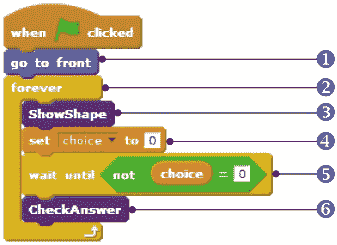图 9-28. `Driver` 精灵的主脚本

然后，脚本会等待 ⑤，直到 `choice` 变为非零数值，这将在玩家点击六个答案按钮中的一个时发生。当玩家猜测出一个形状时，脚本调用 **CheckAnswer** ⑥ 来告诉玩家该答案是否正确。

现在你知道了主脚本是如何工作的，接下来我们来看看 **ShowShape** 过程，如图 9-29 所示。

首先，**ShowShape** 将 `Driver` 精灵移动到舞台中心并随机指向一个方向 ①。它将 `shape` 变量赋值为 1 到 6 之间的随机值，并切换精灵的服装 ②，展示一个四边形供玩家识别。

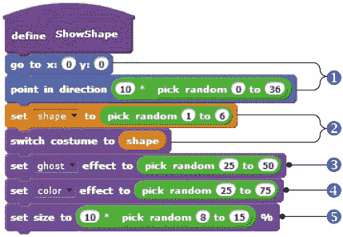图 9-29. `Driver`精灵的 ShowShape 过程

为了保持背景网格的可见性，**ShowShape**将透明度③设置为 25 到 50 之间的随机值。为了给人一种每回合都会出现新形状的错觉，该过程还将颜色效果设置为随机值，以改变服装④的颜色，并将精灵的大小调整为原始大小的 80%、90%......或 150%⑤。

接下来，我们简要查看六个按钮精灵的脚本，如图 9-30 所示。它们除了赋给 `choice` 变量的值不同外，其它完全相同。

图 9-30. 按钮精灵的脚本

这些单行脚本会根据玩家按下的按钮，将`choice`的值设置为不同的数字。一旦`choice`包含了玩家的答案，**CheckAnswer**过程就可以将其与`shape`的值进行比较，`shape`指定了所绘制的四边形的类型。

如果`choice`和`shape`相等，那么玩家的答案是正确的。否则，答案是错误的，精灵会说出正确的形状。**CheckAnswer**使用`shape`变量作为索引，查找一个名为`quadName`的列表（也见于图 9-31），以获取显示形状的正确名称。

尝试 9-9

打开 *QuadClassify.sb2* 并运行几次，了解它的工作原理。按原样，这个游戏会一直运行下去。修改程序，添加游戏结束的标准。同时，跟踪玩家的正确和错误回答数量。

*QuadClassify.sb2*

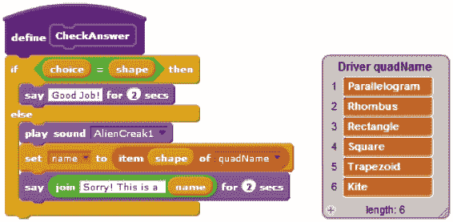图 9-31. CheckAnswer 过程

### 数学小 wizard

这个应用展示了两种使列表更有用的方法。我们将探讨如何使用列表来存储非统一的记录（即记录大小不同的情况），以及如何使用一个列表作为另一个列表的索引。*记录*就是关于一个人、地点或事物的相关数据集合。在我们的例子中，每个记录包含一个谜题的答案和该谜题的说明。虽然每个谜题只有一个答案，但每个谜题的说明数量不相同。

*MathWizard.sb2*

我们的数学魔法师要求用户想一个“秘密”数字，并对其执行一系列数学操作（例如，数字翻倍、减去 2、将结果除以 10，依此类推）。最后，在玩家完成所有这些计算后，魔法师凭借魔法力量告诉用户他得到了什么数字，即使魔法师并不知道用户最初的数字。表 9-2 说明了游戏的工作原理。

表 9-2. 数学魔法师的工作原理

| 魔法师的指令 | 你的数字 |
| --- | --- |
| 想一个数字。 | 2 |
| 加 5。 | 7 |
| 乘以 3。 | 21 |
| 减去 3。 | 18 |
| 除以 3。 | 6 |
| 减去你最初的数字。 | 4 |

在最后一条指令后，魔法师会告诉你，按照这些指令你得到了数字 4，尽管游戏并不知道你最初是从 2 开始的。试着用不同的数字来做这个谜题，弄清楚魔法师的诡计！

应用程序的界面如 图 9-32 所示。

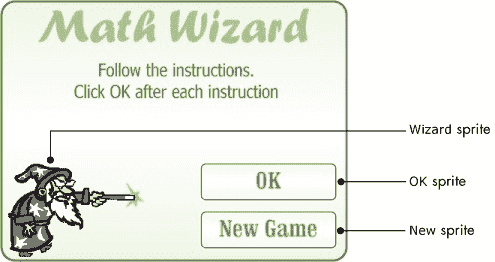图 9-32. 数学魔法师应用程序的用户界面

该应用程序包含三个精灵：`Wizard` 精灵，它给玩家提供指令；`OK` 和 `New` 精灵，分别对应“确定”和“新游戏”按钮。它还使用了 图 9-33 中说明的两个列表。

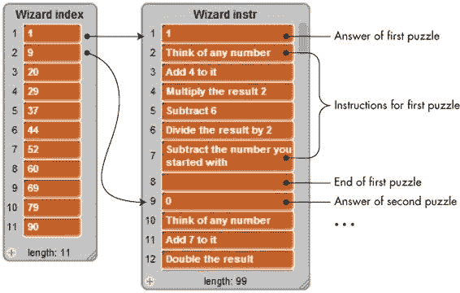图 9-33. Wizard 精灵使用的两个列表

`instr` 列表（右侧）包含 11 条谜题记录。每条记录包括：（a）谜题的答案，（b）指令，（c）一个空元素，用于标记该记录的结束。左侧的列表项（名为 `index`）标识 `instr` 列表中每个谜题的起始索引。例如，`index` 列表中的第二个元素是 9，这意味着第二个谜题的记录从 `instr` 列表中的第九个位置开始，如 图 9-33 中所示。我们来概述一个开发该游戏的策略：

1.  当用户开始新游戏时，选择一个 1 到 11 之间的随机数字（因为我们的游戏当前包含 11 个谜题）。

1.  查阅 `index` 列表，找到所选谜题记录的起始位置。例如，如果选择第二个谜题，`index` 列表会告诉我们该谜题的记录从 `instr` 列表中的第 9 个索引位置开始。

1.  访问步骤 2 中找到的索引位置上的`instr`列表。该索引位置的第一个元素被解释为谜题的答案。接下来的元素代表巫师将要说的指令。

1.  让巫师逐一说出谜题指令，直到遇到空元素，空元素标志着最后一条指令。在说出新指令之前，巫师应该等待用户按下`OK`按钮。

1.  揭示谜题的答案。

现在我们已经了解了游戏的高级工作方式，让我们来看一下图 9-34 中显示的两个按钮的脚本。

图 9-34. 两个按钮角色的脚本

`New Game`按钮在点击时广播`NewGame`消息。当用户点击`OK`按钮以响应某个指令时，角色将`clicked`设置为 1，通知`Wizard`角色玩家已经完成了她被要求执行的指令。当`Wizard`角色收到`NewGame`消息时，它会执行图 9-35 中显示的脚本。

图 9-35. `NewGame`脚本的`Wizard`角色

`NewGame`通过清除前一个谜题的对话框（如果有的话）并将`clicked`变量初始化为 0①开始。然后，它将随机选择的谜题的编号保存在名为`puzzleNum`的变量中②。之后，它从`index`列表中读取所选谜题的起始位置，并将其保存在`pos`变量中③。脚本随后使用`pos`读取该谜题的答案并将其保存在`puzzleAnswer`中④。接下来，脚本将 1 加到`pos`，使其指向第一个谜题指令，并开始一个**repeat until**循环，按顺序说出谜题的指令⑤。每说完一个指令，脚本会等待`clicked`变量被设置为 1，然后再移动到下一个指令⑥。当循环发现空元素时，它会退出，并且脚本会说出谜题的答案⑦。

试试看 9-10

如果你删除了其中一个谜题或更改了某些谜题的指令数量，那么你需要重新构建`index`列表，以与`instr`列表匹配。编写一个过程，根据`instr`列表的当前内容自动填充`index`列表。关键是要在`instr`列表中搜索空字符串，因为这些空字符串表示一条记录的结束和下一条记录的开始。

### 花卉解剖学测验

在本节中，我将通过一个关于花朵各部分的测验，演示如何在 Scratch 中构建简单的测验。图 9-36 展示了我们示例应用程序的界面，包括测验开始时和程序检查用户答案后的界面。任何参加测验的人都会输入字母来匹配花朵各部分的标签，然后点击`Check`按钮来检查答案。程序将用户的答案与正确答案进行比较，并通过绿色的勾号和红色的*X*图标为每个答案提供反馈。

*FlowerAnatomy.sb2*

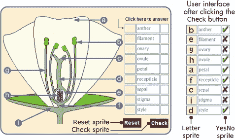图 9-36. 花朵测验的用户界面

这个测验使用了三个列表。第一个列表（命名为`correctAns`）包含了对应于测验九个部分正确答案的字母。第二个列表（命名为`ans`）包含用户的输入，第三个列表（命名为`cellYCenter`）包含了`Letter`和`YesNo`精灵使用的 11 个垂直位置（以便它们知道应该在哪里盖上它们的服装）。当用户在任何答题框上点击鼠标时，舞台精灵会检测到鼠标点击并请求一个答案。舞台精灵会更新`ans`列表中对应的元素，以匹配用户输入的内容，并将该字母印在答题框上。打开*FlowerAnatomy.sb2*以查看读取和显示用户答案的脚本。

当用户点击`Check`按钮时，`YesNo`精灵（它包含勾号和*X*图像的服装）执行图 9-37 中显示的脚本。

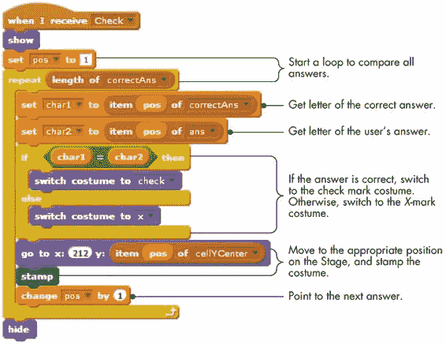图 9-37. `YesNo`精灵的检查过程

脚本逐一比较`correctAns`和`ans`列表中的元素。如果两个值相等，它会打上勾，表示用户回答正确。否则，它会在用户答错的地方打上红色的*X*。无论哪种情况，`Check`都会查阅`cellYCenter`列表，获取打上图像的正确位置。请参阅对面页面的尝试一下 9-11。

### 其他应用

你从本书网站下载的额外资源（*[`nostarch.com/learnscratch/`](http://nostarch.com/learnscratch/)）包含了三个应用程序，你可以自行探索，每个应用都有完整的解释。第一个应用是一个关于排序分数和小数的两人游戏。每位玩家从 31 张卡牌中随机抽取 5 张。然后每位玩家从剩下的卡组中抽取一张卡片。你可以选择丢弃这张新卡，或者将它拖到你当前的五张卡片之一，替换掉旧的那张。第一个将五张卡片按升序排列的人赢得游戏。

*SayThat Number.sb2*

尝试一下 9-11

打开这个应用程序并测试它。然后，考虑你可以创建并实现的其他不同学科领域的测验。以下是一个示例，展示在文件*USMapQuiz.sb2*中。打开这个文件并完成缺失的部分，使这个测验正常工作。

*USMapQuiz.sb2*

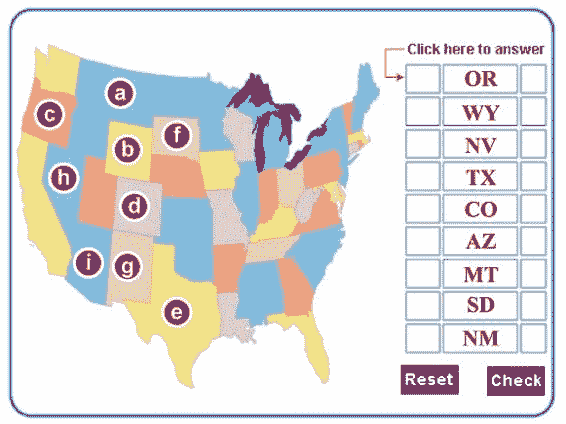

第二个应用程序是一个拼写整数的程序。它提示用户输入一个数字，然后用单词拼出这个数字。例如，如果用户输入`3526`，程序将说“three thousand five hundred twenty six”。其思路是将数字从右到左分解为三位一组，每组按需附加倍数词（千、百万等）。

*SortEmOut.sb2*

第三个程序展示了厄拉多斯筛法，这是一种查找小于 100 的所有质数的算法。

*Sieve.sb2*

## 总结

列表在编程中非常有用，它们提供了一种方便的方式来存储多个元素。在这一章中，我们探索了在 Scratch 中创建列表，学习了可以用来处理它们的命令，并通过用户输入的数据动态地填充列表。

我们还研究了数值列表，并演示了如何找到它们元素的最小值、最大值和平均值。之后，我们学习了简单的算法来搜索和排序列表。我们通过几个程序结束了这一章，展示了列表在实际应用中的使用。

## 问题

| **Q:** | 1\. 创建一个包含前 10 个质数的列表。编写一个脚本，使用**say**块显示这些数字。 |
| --- | --- |
| **Q:** | 2\. 创建三个列表来存储个人记录。第一个列表存储姓名，第二个列表存储出生日期，第三个列表存储电话号码。编写一个程序，询问用户需要某个人的联系信息。如果此人的姓名存在于第一个列表中，程序将显示该人的出生日期和电话号码。 |
| **Q:** | 3\. 创建两个列表，用于存储在杂货店出售的商品及其对应的价格。编写一个程序，提示用户输入商品名称，然后显示该商品的价格，如果它在列表中找到的话。 |
| **Q:** | 4\. 执行下一页显示的脚本后，`numList`中存储了什么？重新创建该过程并运行，以检查你的答案。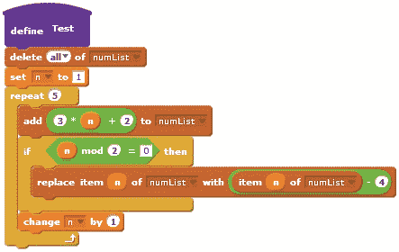 |
| **Q:** | 5\. 编写一个程序，将存储在数值列表中的每个元素翻倍。 |
| **Q:** | 6\. 编写一个程序，提示用户输入学生的姓名和成绩，并将这些输入存储在两个列表中。当用户输入 -1 作为学生的姓名时，停止收集数据。 |
| **Q:** | 7\. 编写一个程序，提示用户输入一年的 12 个月的最高和最低温度。将输入的值存储在两个列表中。 |
| **Q:** | 8\. 编写一个程序，提示用户输入 10 个整数。只有当输入的数字不是之前已输入的重复数字时，才将其存入列表中。 |
| **Q:** | 9\. 编写一个程序，处理包含 100 项的测试的 20 个分数，并找出得分在 85 到 90 之间的学生人数。 |
